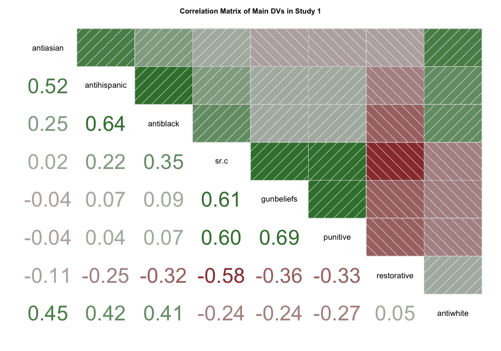

# Study 1: A critical narrative reduces support for punitive violence prevention policies {#ch1study1}

Study 1 investigates whether reading information about the causal contributors to CGV can shift public policy preferences and attributions for the racial patterns in CGV. The study is a 3 x 1 between-subjects design, in which participants are randomly assigned to one of three conditions: critical, individual, and control.

The main hypotheses are:

* H1a. Participants in the critical condition will report reduced support for punitive policies. This main effect will emerge across levels of political ideology (b).
* H2a. Participants in the critical condition will report increased support for restorative policies. This main effect will emerge across levels of political ideology (b).

<!-- * H3a. Participants in the critical condition will score lower on a modern racism scale (b). -->
<!-- * H4. Reduced modern racism will partially mediate the critical main effects on reduced punitive policy support (a) and increased restorative policy support (b). -->

## Method 

### Participants

A total of `r nrow(s1)` online participants were recruited to complete a 15-minute survey (`r apastats::describe.mean.sd(s1$duration, dtype = "c")`) for \$1.50 on Amazon Mechanical Turk in Fall 2019. There were no significant differences in survey duration between conditions (`r duration_aov.apa_s1$statistic$modelfit`). The sample was `r female_perc_s1`% female, `r white_perc_s1`% White, `r black_perc_s1`% Black, `r latino_perc_s1`% Latiné, `r asian_perc_s1`% Asian, `r mideastern_perc_s1`% Middle Eastern, and `r native_perc_s1`% of Native or Indigenous descent, with a median adjusted household income of \$`r income_med_s1` (`r apastats::describe.mean.sd(as.numeric(s1$adj_income), dtype = "c")`). 

<details><summary>**Table of Participant Characteristics**</summary>
```{r demos-comp-study1, eval = TRUE, fig.cap = "Descriptive Statistics of Participant Characteristics by Condition in Study 1."}
# summary table by condition # compareGroups::
demos_comp_s1 <- compareGroups::descrTable(condition.f ~ gender.f + race.f + political3.f + age + edu3.f + adj_income, data = s1, subset = pass==1)
# demos_comp_s1 # print

compareGroups::export2md(demos_comp_s1, width = "300px", format = "html") # print to markdown/html
```

```{r demos-summary-study1, eval = FALSE}
demo_vars_s1.wide <- dplyr::select(s1.wide, gender, race, political, age, edu3, adj_income, duration)
demo_vars.names_s1.wide <- names(demo_vars_s1.wide)

s1.wide %>%
  rstatix::get_summary_stats(demo_vars.names_s1.wide, show = c("mean", "sd", "min", "max", "iqr")) %>%
kable(booktabs = TRUE, digits = 2, caption = "Participant Characteristics in Study 1"
      ) %>%
  kable_styling(bootstrap_options = c("condensed", "bordered"), full_width = F)
```
</details>

### Procedure

The survey randomized participants to read an ostensibly real Wall Street Journal article that delivered on of the three conditional narratives. 
The key differences were that the critical narrative described how structural racism contributes to CGV, while the individualized narrative instead focuses on how individual differences in self-control contribute to CGV, and the control provided no additional information. 
Participants in the control condition were asked to participate in a study about vaping and a separate study about gun violence. 

All news articles ended with three manipulation check questions that asked participants to recall details about the causal claims made in the article. 
Participants who answered at least one question incorrectly were redirected to the news article page and asked to review, and then tried answering again. 
After three failed attempts, the survey allowed participants to continue the survey, but their data were excluded from analyses. 
The survey then presented the policy support items, followed by questions about policy preferences regarding gun violence in "poor neighborhoods of color." All items were randomized within their section. After completing the main survey measures, the survey debriefed the nature of the study and its use of fake news articles. The statement provided links to sources and explained that the claims made in the articles were supported by credible news outlets and peer-reviewed journal articles.

### Materials

See [Study 1 Appendix](#ch1study1-si) for full materials.
 
#### Critical narrative

The critical news article titled “Chicago’s Gun Violence is Deeply Rooted in Racial Segregation and Mass Incarceration” presented evidence from scholars and public health experts about how a history of racism fostered societal conditions that led to high rates of gun violence is some Black communities. 
The article describes how U.S. banks officiated racial discrimination in lending practices and housing regulations, which created pockets of concentrated poverty that made it nearly impossible for families to escape. The author provides evidence of hidden agendas behind a discriminatory shift in policing practices and provides statistical evidence of racial discrimination in the criminal justice system. 
The critical article ends with a gun violence expert advocating for policies that target the physical, economic, or social structures in neighborhoods with gun violence to repair the damage done by racism. 
The recommendations included affordable housing regulation, local business construction, public education, and better community-police relations. 
<!-- The article provides context behind discriminatory policies and practices that impact current opportunities available in affected neighborhoods. -->
<!-- The policies are intended to provide discriminated populations with the means and opportunity to improve their life outcomes, which presumes a choice not to pursue illegal careers. -->

#### Individual narrative

The individualized article "Chicago's Gun Violence is Deeply Rooted in Self-Control Issues" describes this issue with a focus on how individual traits raise the risk of experiencing gun violence. 
It argues that the above-average rates of gun violence in poor, Black neighborhoods are due to young residents developing a disposition to react impulsively and aggressively towards others. The article ends by advocating for socioemotional development programs that teach kids how to resolve conflicts peacefully.
The individual article ends by advocating for socioemotional development programs that teach kids how to peacefully resolve conflicts, improve decision-making skills, and internalize values of self-determination and integrity. 

#### Control

Participants in the control condition were told that they would be participating in two separate studies. The “first study” presented the control article on vaping and manipulation check questions. 
After passing through the manipulation checks, the survey asked participants if they currently vaped and thanked them for completing the first study. The survey then directed them to the second survey on gun violence in poor communities of color. The survey then introduced the problem of gun violence  using the same first paragraph as the critical and individual conditions. The control participants followed the same survey path as the critical and individual conditions. 


## Results

The following analyses are designed to test the hypotheses that (H1 & H2) learning about structural racism significantly impacts support for violence prevention policy approaches, (H3a & H3b) the conditional effect will maintain significance across political orientation, (H4) the extent to which participants invoke anti-Black stereotypes to explain the racial patterns of neighborhood gun violence, and (H5a & H5b) the extent to which modern racism mediates policy support. 
The analyses consist of multivariate regression models that included political orientation, gender, age, adjusted income, and level of education as covariates. The control condition served as the reference category, and the measure of adjusted income was calculated by dividing participants’ reported annual income by household size.

<details><summary>**Descriptive Statistics of Main Dependent Variables**</summary>
```{texpreview, echo = FALSE}
\begin{table}[!htbp]
\small
%% \caption{\label{tab:maindvs-table-study1}Descriptive Statistics of Main Dependent Variables by Condition in Study 1}
\centering
\begin{tabular}[t]{lllll}
\toprule
 & Control & Individual & Critical & Overall\\
\midrule
 & (N=226) & (N=181) & (N=194) & (N=601)\\
\addlinespace[0.3em]
\multicolumn{5}{l}{\textbf{Punitive Policy Support}}\\
\hspace{1em}Mean (SD) & 2.53 (0.716) & 2.49 (0.726) & 2.20 (0.701) & 2.41 (0.729)\\
\hspace{1em}Median [Min, Max] & 2.50 [1.00, 4.00] & 2.50 [1.00, 4.00] & 2.25 [1.00, 4.00] & 2.50 [1.00, 4.00]\\
\addlinespace[0.3em]
\multicolumn{5}{l}{\textbf{Restorative Policy Support}}\\
\hspace{1em}Mean (SD) & 3.12 (0.548) & 3.06 (0.530) & 3.30 (0.552) & 3.16 (0.551)\\
\hspace{1em}Median [Min, Max] & 3.25 [1.50, 4.00] & 3.00 [1.50, 4.00] & 3.38 [1.00, 4.00] & 3.25 [1.00, 4.00]\\
\addlinespace[0.3em]
\multicolumn{5}{l}{\textbf{Symbolic Racism}}\\
\hspace{1em}Mean (SD) & 0.894 (0.348) & 0.952 (0.368) & 0.827 (0.356) & 0.890 (0.360)\\
\hspace{1em}Median [Min, Max] & 0.854 [0.285, 1.71] & 0.955 [0.285, 1.78] & 0.784 [0.285, 1.78] & 0.860 [0.285, 1.78]\\
\bottomrule
\end{tabular}
\end{table}
```
</details>

<details><summary>**Table of Main Regression Analyses**</summary>
```{texpreview, echo = FALSE}
\begingroup
\small 
\begin{singlespacing}
\begin{table}[H] \centering 
%%\caption{\label{tab:maindvs-ols-star-study1}Regression Analyses Predicting Main Dependent Variables in Study 1} 
\begin{tabular}{@{\extracolsep{5pt}}lccc} 
\\[-1.8ex]\hline 
\hline \\[-1.8ex] 
 & \multicolumn{3}{c}{\textit{Dependent variable:}} \\ 
\cline{2-4} 
\\[-1.8ex] & Punitive & Restorative & Racism \\ 
\\[-1.8ex] & (1) & (2) & (3)\\ 
\hline \\[-1.8ex] 
 Intercept & 1.75$^{***}$ (0.12) & 3.70$^{***}$ (0.08) & $-$1.48$^{***}$ (0.18) \\ 
  Condition: Individual & $-$0.10 (0.06) & 0.01 (0.05) & $-$0.004 (0.10) \\ 
  Condition: Critical & $-$0.30$^{***}$ (0.06) & 0.16$^{***}$ (0.04) & $-$0.18 (0.09) \\ 
  Political Orientation & 0.19$^{***}$ (0.02) & $-$0.17$^{***}$ (0.01) & 0.50$^{***}$ (0.02) \\ 
  Race: Latiné & 0.15 (0.12) & $-$0.07 (0.08) & $-$0.24 (0.18) \\ 
  Race: Black & $-$0.06 (0.10) & 0.07 (0.07) & $-$0.36$^{*}$ (0.14) \\ 
  Race: Native American & 0.31 (0.37) & $-$0.04 (0.26) & $-$0.57 (0.56) \\ 
  Race: Asian & 0.06 (0.11) & $-$0.08 (0.08) & 0.39$^{*}$ (0.16) \\ 
  Race: Middle Eastern & 0.002 (0.37) & 0.43 (0.26) & $-$0.48 (0.56) \\ 
  Race: Other & 0.07 (0.32) & $-$0.26 (0.23) & 0.04 (0.48) \\ 
  Race: Multi & $-$0.12 (0.10) & $-$0.03 (0.07) & $-$0.12 (0.15) \\ 
  Female & 0.16$^{**}$ (0.05) & 0.04 (0.04) & $-$0.07 (0.08) \\ 
  Age & 0.003 (0.002) & 0.001 (0.002) & $-$0.003 (0.004) \\ 
  Adj. Income & $-$0.0000 (0.0000) & $-$0.0000 (0.0000) & $-$0.0000$^{**}$ (0.0000) \\ 
  College degree & $-$0.03 (0.05) & $-$0.09$^{*}$ (0.04) & 0.11 (0.08) \\ 
 \hline \\[-1.8ex] 
Observations & 601 & 601 & 601 \\ 
R$^{2}$ & 0.26 & 0.34 & 0.49 \\ 
Adjusted R$^{2}$ & 0.24 & 0.32 & 0.47 \\ 
Residual Std. Error (df = 586) & 0.63 & 0.45 & 0.96 \\ 
F Statistic (df = 14; 586) & 14.71$^{***}$ & 21.61$^{***}$ & 39.60$^{***}$ \\ 
\hline 
\hline \\[-1.8ex] 
\textit{Note:}  & \multicolumn{3}{r}{$^{*}$p$<$0.05; $^{**}$p$<$0.01; $^{***}$p$<$0.001} \\ 
\end{tabular} 
\end{table}
\end{singlespacing}
\endgroup
```
</details>


<details><summary>**Correlations of Main Dependent Variables**</summary>
```{r fig-main-corr-study1, eval = TRUE, out.width = "100%", fig.link = "images/main_corrgram_s1.png", fig.cap = "Correlation matrix of main variables in Study 1.", fig.show='hold', fig.align='center'}

```
</details>

### H1a. Punitive support {-}

Compared to both the individual and control narratives, the critical narrative decreased support for punitive policies.


<details><summary>**Descriptive Statistics of Punitive Policy Items**</summary>

* PUN_COPS: `r Hmisc::label(s1$pun_cops)`
* PUN_JAILTIME: `r Hmisc::label(s1$pun_jailtime)`
* PUN_PENALTY: `r Hmisc::label(s1$pun_penalty)`
* PUN_PRISONS: `r Hmisc::label(s1$pun_prisons)`

```{r pun-summary-study1, eval = TRUE}
punitive_vars_s1.wide <- dplyr::select(s1.wide, punitive, pun_cops, pun_jailtime, pun_penalty, pun_prisons)
punitive_vars.names_s1.wide <- names(punitive_vars_s1.wide)

s1.wide %>%
  rstatix::get_summary_stats(all_of(punitive_vars.names_s1.wide), show = c("mean", "sd", "min", "max", "iqr")) %>%
kable(booktabs = TRUE, digits = 2, caption = "Descriptive Statistics of Punitive Policy Items in Study 1"
      ) %>%
  kable_styling(bootstrap_options = c("condensed", "bordered"), full_width = F)
```

```{texpreview, echo = FALSE}
\begin{table}

%%\caption{\label{tab:pun-items-table-study1}Descriptive Statistics of Punitive Policy Items Between Critical and Control Groups in Study 1}
\centering
\begin{tabular}[t]{lllll}
\toprule
  & Critical & Control & P-value & Total\\
\midrule
 & (N=244) & (N=258) & (N=240) & (N=742)\\
\addlinespace[0.3em]
\multicolumn{5}{l}{\textbf{Punitive Policy Support}}\\
\hspace{1em}Mean (SD) & 2.32 (0.713) & 2.61 (0.729) & 2.58 (0.754) & 2.50 (0.743)\\
\hspace{1em}Median [Min, Max] & 2.25 [1.00, 4.00] & 2.75 [1.00, 4.00] & 2.50 [1.00, 4.00] & 2.50 [1.00, 4.00]\\
\addlinespace[0.3em]
\multicolumn{5}{l}{\textbf{More police on the streets}}\\
\hspace{1em}Mean (SD) & 2.64 (0.852) & 2.90 (0.872) & 2.83 (0.863) & 2.79 (0.869)\\
\hspace{1em}Median [Min, Max] & 3.00 [1.00, 4.00] & 3.00 [1.00, 4.00] & 3.00 [1.00, 4.00] & 3.00 [1.00, \vphantom{1} 4.00]\\
\addlinespace[0.3em]
\multicolumn{5}{l}{\textbf{Longer jail terms for those convicted of violent crimes}}\\
\hspace{1em}Mean (SD) & 2.66 (0.965) & 3.00 (0.919) & 2.93 (0.912) & 2.86 (0.942)\\
\hspace{1em}Median [Min, Max] & 3.00 [1.00, 4.00] & 3.00 [1.00, 4.00] & 3.00 [1.00, 4.00] & 3.00 [1.00, 4.00]\\
\addlinespace[0.3em]
\multicolumn{5}{l}{\textbf{Increase criminal penalties for non-violent crimes}}\\
\hspace{1em}Mean (SD) & 2.08 (0.939) & 2.32 (0.930) & 2.35 (0.973) & 2.25 (0.953)\\
\hspace{1em}Median [Min, Max] & 2.00 [1.00, 4.00] & 2.00 [1.00, 4.00] & 2.00 [1.00, 4.00] & 2.00 [1.00, \vphantom{1} 4.00]\\
\addlinespace[0.3em]
\multicolumn{5}{l}{\textbf{More prisons and fewer opportunities for parole}}\\
\hspace{1em}Mean (SD) & 1.88 (0.946) & 2.22 (0.933) & 2.22 (1.04) & 2.11 (0.985)\\
\hspace{1em}Median [Min, Max] & 2.00 [1.00, 4.00] & 2.00 [1.00, 4.00] & 2.00 [1.00, 4.00] & 2.00 [1.00, 4.00]\\
\bottomrule
\end{tabular}
\end{table}
```
</details>

<details><summary>**ANOVA Table**</summary>
```{r pun-aov-table-study1, eval = TRUE}
# CONTRASTS --------------
# contrasts(s1$condition.f) <- contr.sum
# contrasts(s1$race.f) <- contr.sum
# contrasts(s1$edu3.f) <- contr.sum

# ANCOVA --------------
pun_aov_s1 <- lm(punitive.c ~ condition.f + political + female.f + race.f + age.c + edu3.f + adj_income.c, data = s1, subset = pass==1)

pun_aov.summ_s1 <- car::Anova(pun_aov_s1)  %>% 
  tidy(pun_aov.summ_s1) %>% 
  mutate_if(is.numeric, round, digits = 3)

# ANCOVA TABLE --------------
pun_aov.summ_s1 %>%
kable(booktabs = TRUE, digits = 3, caption = "ANCOVA Table of Punitive Policy Support by Condition in Study 1"
      , col.names = c("Term", "SS", "df", "Statistic", "p")
      ) %>%
  kable_styling(bootstrap_options = c("condensed", "bordered"), full_width = F) %>% row_spec(c(1), background = "#F0FFF0") # honeydew
```

```{r pun-pwc-table-study1, eval = TRUE}
# POST-HOC --------------
pun_pwc_s1 <- s1 %>% subset(pass==1) %>%
  rstatix::emmeans_test(punitive.c ~ condition.f, ref.group = "Critical", covariate = condition.f, model = pun_aov_s1, comparisons = compare_s1, detailed = TRUE
    , p.adjust.method = "fdr"
    ) %>% 
  mutate_if(is.numeric, round, digits = 3)

# POST-HOC TABLE --------------
pun_pwc_s1[, c(3:4, 6:14)] %>% 
  kable(booktabs = TRUE, digits = 3, caption = "Contrasts of Punitive Policy Support by Condition in Study 1"
         , col.names = c("Group 1", "Group 2", "Est.", "SE", "df", "CI Low", "CI High", "t", "p", "p-adj", "p-adj-sig")
        ) %>%
  kable_styling(bootstrap_options = c("condensed", "bordered"), full_width = F) %>% row_spec(c(1:2), background = "#F0FFF0") # honeydew
```
</details>

### H1b. Punitive support by political orientation {-}

<details><summary>**Contrasts Tables**</summary>
```{r pun.pol3-contrast-study1, fig.cap = "Planned Contrasts of Punitive Policy Support by Political Orientation in Study 1", eval = TRUE}
pun.pol3_ols_s1 <- lm(punitive.c ~ condition.f * political3.f + female + race.f + age.c + edu3.f + adj_income.c, data = s1, subset = pass==1)
pun.pol3_emm_s1 <- emmeans(pun.pol3_ols_s1, ~ political3.f * condition.f, at = list(s1$political3.f, s1$condition.f))


# liberals
pun.lib_contrast_s1 <- contrast(pun.pol3_emm_s1, adjust = "mvt", method = lib_contrast_s1)

kable(pun.lib_contrast_s1, booktabs = TRUE, digits = 3
                  , col.names = c("Contrasts", "Est.", "SE", "df", "t", "p")
                  , caption = "Planned Contrasts of Punitive Policy Support by Political Orientation in Study 1"
                  ) %>%
  kable_styling(bootstrap_options = c("condensed", "bordered"), full_width = F) %>% 
  add_header_above(header = c("Political Liberals" = 6), align = "l") %>% row_spec(c(1:2), background = "#F0FFF0") # honeydew # %>% kable_styling(font_size = 14)

# moderates
pun.mod_contrast_s1 <- contrast(pun.pol3_emm_s1, adjust = "mvt", method = mod_contrast_s1)

kable(pun.mod_contrast_s1, booktabs = TRUE, digits = 3
                  , col.names = c("Contrasts", "Est.", "SE", "df", "t", "p")
                 # , caption = "Planned Contrasts of Punitive Policy Support by Political Orientation in Study 1"
                  ) %>%
  kable_styling(bootstrap_options = c("condensed", "bordered"), full_width = F) %>% 
  add_header_above(header = c("Political Moderates" = 6), align = "l") # %>% kable_styling(font_size = 14)#row_spec(c(1), background = "#FFFACD")

# conservatives
pun.cons_contrast_s1 <- contrast(pun.pol3_emm_s1, adjust = "mvt", method = cons_contrast_s1)

kable(pun.cons_contrast_s1, booktabs = TRUE, digits = 3
                  , col.names = c("Contrasts", "Est.", "SE", "df", "t", "p")
                 # , caption = "Planned Contrasts of Punitive Policy Support by Political Orientation in Study 1"
                  ) %>%
  kable_styling(bootstrap_options = c("condensed", "bordered"), full_width = F) %>% 
  add_header_above(header = c("Political Conservatives" = 6), align = "l") %>% row_spec(c(1), background = "#F0FFF0") # honeydew # %>% kable_styling(font_size = 14)
```
</details>

```{r fig-pun-half-study1, eval = TRUE, echo = FALSE, out.width = "70%", fig.link = "/Users/cintiahinojosa/Box/Booth PhD/Gun Violence Dissertation/dissertation-book/images/pun_half.stats_s1.png", fig.cap="Support for Punitive Policies by Condition in Study 1", fig.show='hold', fig.align='center'}
knitr::include_graphics("/Users/cintiahinojosa/Box/Booth PhD/Gun Violence Dissertation/dissertation-book/images/pun_half.stats_s1.png")
#"/Users/cintiahinojosa/Box/Booth PhD/Gun Violence Dissertation/dissertation-book/images/pun.c.pol3_int.apa_s1.png"
```

\newpage

### H2a. Restorative support {-}

```{r rest-aov-table-study1, eval = TRUE}
# CONTRASTS --------------
# contrasts(s1$condition.f) <- contr.sum
# contrasts(s1$race.f) <- contr.sum
# contrasts(s1$edu3.f) <- contr.sum

# ANCOVA --------------
rest_aov_s1 <- lm(restorative.c ~ condition.f + political + female.f + race.f + age.c + edu3.f + adj_income.c, data = s1, subset = pass==1)

rest_aov.summ_s1 <- car::Anova(rest_aov_s1)  %>% 
  tidy(rest_aov.summ_s1) %>% 
  mutate_if(is.numeric, round, digits = 3)

# TABLE
rest_aov.summ_s1 %>%
kable(booktabs = TRUE, digits = 3, caption = "ANCOVA Table of Restorative Policy Support by Condition in Study 1"
      , col.names = c("Term", "SS", "df", "Statistic", "p")
      ) %>%
  kable_styling(bootstrap_options = c("condensed", "bordered"), full_width = F) %>% row_spec(c(1), background = "#FFFACD")
```

```{r rest-pwc-table-study1, eval = TRUE}
# POST-HOC --------------
rest_pwc_s1 <- s1 %>% subset(pass==1) %>%
  rstatix::emmeans_test(restorative.c ~ condition.f, ref.group = "Critical", covariate = condition.f, model = rest_aov_s1, comparisons = compare_s1, detailed = TRUE
    , p.adjust.method = "fdr"
    ) %>% 
  mutate_if(is.numeric, round, digits = 3)

# TABLE
rest_pwc_s1[, c(3:4, 6:14)] %>% 
  kable(booktabs = TRUE, digits = 3, caption = "Contrasts of Restorative Policy Support by Condition in Study 1"
         , col.names = c("Group 1", "Group 2", "Est.", "SE", "df", "CI Low", "CI High", "t", "p", "p-adj", "p-adj-sig")
        ) %>%
  kable_styling(bootstrap_options = c("condensed", "bordered"), full_width = F) %>% row_spec(c(1:2), background = "#FFFACD")
```

### H2b. Restorative support by political orientation {-}

```{r rest-pol3-contrast-study1, fig.cap = "Planned Contrasts of Restorative Policy Support by Political Orientation in Study 1", eval = TRUE}
rest.pol3_ols_s1 <- lm(restorative ~ condition.f * political3.f + female + race.f + age.c + edu3.f + adj_income.c, data = s1, subset = pass==1)
rest.pol3_emm_s1 <- emmeans(rest.pol3_ols_s1, ~ political3.f * condition.f, at = list(s1$political3.f, s1$condition.f))

# liberals
rest.lib_contrast_s1 <- contrast(rest.pol3_emm_s1, adjust = "mvt", method = lib_contrast_s1)

kable(rest.lib_contrast_s1, booktabs = TRUE, digits = 3
                  , col.names = c("Contrasts", "Est.", "SE", "df", "t", "p")
                  , caption = "Planned Contrasts of Restorative Policy Support by Political Orientation in Study 1"
                  ) %>%
  kable_styling(bootstrap_options = c("condensed", "bordered"), full_width = F) %>% 
  add_header_above(header = c("Political Liberals" = 6), align = "l") %>% row_spec(c(1:2), background = "#FFFACD")
# moderates
rest.mod_contrast_s1 <- contrast(rest.pol3_emm_s1, adjust = "mvt", method = mod_contrast_s1)

kable(rest.mod_contrast_s1, booktabs = TRUE, digits = 3
                  , col.names = c("Contrasts", "Est.", "SE", "df", "t", "p")
                 # , caption = "Planned Contrasts of Restorative Policy Support by Political Orientation in Study 1"
                  ) %>%
  kable_styling(bootstrap_options = c("condensed", "bordered"), full_width = F) %>% 
  add_header_above(header = c("Political Moderates" = 6), align = "l") %>% row_spec(c(2), background = "mistyrose")

# conservatives
rest.cons_contrast_s1 <- contrast(rest.pol3_emm_s1, adjust = "mvt", method = cons_contrast_s1)

kable(rest.cons_contrast_s1, booktabs = TRUE, digits = 3
                  , col.names = c("Contrasts", "Est.", "SE", "df", "t", "p")
                 # , caption = "Planned Contrasts of Restorative Policy Support by Political Orientation in Study 1"
                  ) %>%
  kable_styling(bootstrap_options = c("condensed", "bordered"), full_width = F) %>% 
  add_header_above(header = c("Political Conservatives" = 6), align = "l") %>% row_spec(c(1:2), background = "mistyrose")
```

```{r fig-rest-half-study1, eval = TRUE, echo = FALSE, out.width = "70%", fig.link = "/Users/cintiahinojosa/Box/Booth PhD/Gun Violence Dissertation/dissertation-book/images/rest_half.stats_s1.png", fig.cap = "Support for Restorative Policies by Condition in Study 1", fig.show='hold', fig.align='center'}
knitr::include_graphics("/Users/cintiahinojosa/Box/Booth PhD/Gun Violence Dissertation/dissertation-book/images/rest_half.stats_s1.png")
# "/Users/cintiahinojosa/Box/Booth PhD/Gun Violence Dissertation/dissertation-book/images/rest.c.pol3_int.apa_s1.png"
```

\newpage

## Discussion

This research explored how a critical counternarrative could influence policy preferences by undermining mainstream narratives that are consistent with anti-Black stereotypes. 
The results support the study's primary hypotheses that a critical counternarrative reduces punitive policy support (H1) and increases restorative policy support (H2), compared to individualized narratives that dominate mainstream media. 
In spite of the strong, positive association between conservative values and punitive policies, the critical narrative effects on policy support across liberal, moderate, and conservative participants (H1a & H2a).
I also found that the critical narrative caused reduced agreement modern racism (H3). 
In addition, mediation analyses support the hypotheses that reading the critical narrative affected policy support through a reduction in modern racism scores. (H4a & H4b). 
<!-- Lastly, the lack of difference between the control and individual conditions in policy support and stereotype agreement supports my assumption that the individualized narrative is more representative of the normative standard compared to the critical narrative. -->


### Limitations

One key limitation is that the critical narrative discusses racism in policing and restorative policies, which are not included in the individual narrative. Additionally, the policy support measure solicited participants’ general attitudes towards the proposed policies rather than their beliefs about whether they would effectively reduce gun violence. I address these issues in Study 2. 
<!-- Compared to the individual and control conditions, I hypothesize that participants in the critical condition will report reduced support for punitive policies (H1) and increased support for restorative policies (H2). To the extent that H1-H2 are supported, I hypothesize that the critical narrative will maintain a significant effect on punitive and restorative policy support across the political spectrum (H1a & H2a). I also hypothesize that lower agreement with gun violence stereotypes (H3) will partially mediate the critical narrative's main effects on reduced punitive policy support (H4a) and increased restorative support (H4b). Lastly, I hypothesize that (H4) participants in the critical condition will report reduced agreement with anti-Black stereotypes about urban gun violence, compared to the competing conditions. -->

The policy support measure asked for participants' general support of the proposed policy, rather than their support the policies as a response to community gun violence. While I am interested in general policy support, the working theoretical model is focused on how the public interprets and responds to a social policy issues affecting stigmatized groups. The upcoming studies narrow the focus to policy responses to gun violence. Future extensions of this research may explore how fostering critical consciousness in regards to a single policy issue may generalize to other policy domains. After all, systems of oppression are interconnected at a fundamental level. It follows that knowledge of how structural oppression operates in one context would generalize to other domains, as it operates through similar structural pathways to shape (dis)advantageous contexts.