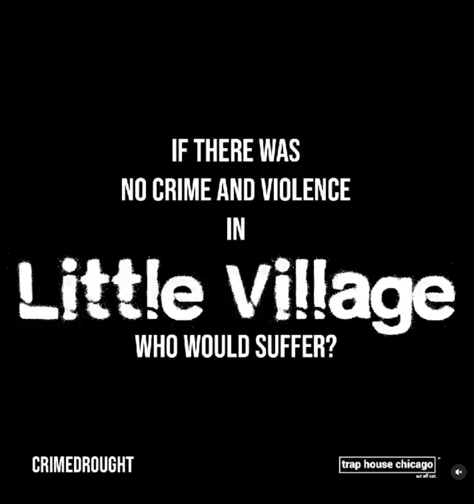

# Proposed Study 2: Evaluating the appeal of critical violence prevention narratives through a digital messaging campaign {#ch2study2 .unnumbered}

```{r preferences, include = FALSE}
# Seed for random number generation
set.seed(42)
knitr::opts_chunk$set(cache.extra = knitr::rand_seed,
                      echo = FALSE, 
                      message = FALSE, 
                      warning = FALSE,
                      fig.width = 3,
                      fig.path = '/Users/Box/Dissertation-Proposal/Figures/fig-',
                      dev = 'png')
```

```{r libraries.publish, include = FALSE}
#publish
library(apastats)
library(papaja)
#papaja::r_refs("r-references.bib")
papaja::r_refs("dissertation-proposal-bib.bib")
library(tinytex)
library(citr)
library(tippy)
```

```{r load, eval = TRUE}
load(file = "~/Box/Dissertation-Proposal/Data/dissertation-workspace.RData")
```

<!---
## Abstract

## Introduction {#ch2study2-intro .unnumbered}
--->
## Proposed Study
This study will test the appeal of various messages in engaging youth in seeking youth violence prevention support services using a digital
social media advertising campaign. Over the course of six weeks, I will push out competing messages to a geocoded neighborhood that experiences high rates of neighborhood firearm violence. The messages will be strategically deployed in real-time responses to reports of gun shots. Upon clicking the ad messages, users will view a splash page that randomly presents one of two narratives: 1) a traditionally-styled narrative that describes the available services, 2) a traditionally-styled narrative that describes the available services and makes appeals to the users' self-interest, and 3) a critical narratives that describes the available services and appeals to users' sense of [racial justice/frustration at the status quo]. I will compare the levels of digital and physical engagement with the advertised violence prevention resources.
I compare the interventions' impact on participants 1) beliefs of gun carrying as form of protection, 2) the appeal of engaging with youth violence prevention services, 3) feelings of positive social support, and other protective factors against experiencing community gun violence.

## Methods
- data sources
- geo-frame shooting hotspots

### Participants
<!---
#### Active participants. {-}
Identified and gathered phone devices from geo-framed shooting hot spots in specific neighborhood

#### Affected community {-} 
Devices from surrounding geoframed neighborhood of shooting hotspots
--->

### Materials

#### Control message.
<!---

--->

#### Critical message.

\textbf{Preliminary ideas for critical messages:}

-   "CPD gets X% of budget. Who benefits from [gun] violence?"
-   "We keep us safe."
-   Resist & build [a safer future]
-   Don't let them get away with it
-   Community care is radical.
-   Who's story gets told; don't let others tell your story
-   Build power
-   Example of disrespect/dehumanizing; working for respect
-   gun violence in black neighborhoods is not an accident

<!---
-   {width="481"}
-   {width="481"}
--->

### Measures

#### Served impressions. {-}
Served impressions are when an ad shows on user's screen; represents
viewing potential/opportunity to click.

#### Viewable impressions. {-}
Viewable impressions are more refined data that accounts for user data that
raise or lower the likelihood that the ad was seen (e.g., ad-blocking
software, screen resolutions, minimized windows, movement between apps,
pages loaded but not accessed; scrolling before ad loaded)

#### Clicks. {-}
<!---
\emph{CTR.}

\textbf{Questions}
-   What kind of data does the analytics company provide? Ping vs. IP
    address?
-   Able to geocode public locations (e.g., UCAN, community centers)
-   What is the baseline?

## Expected Results {-}
--->


\clearpage