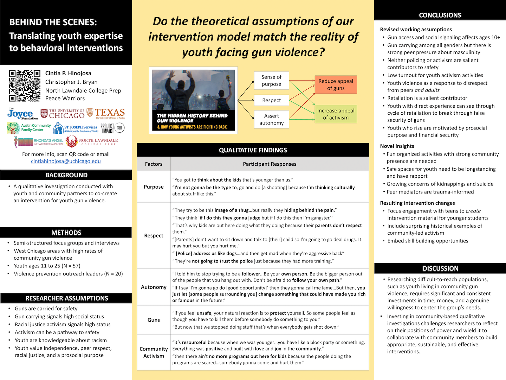
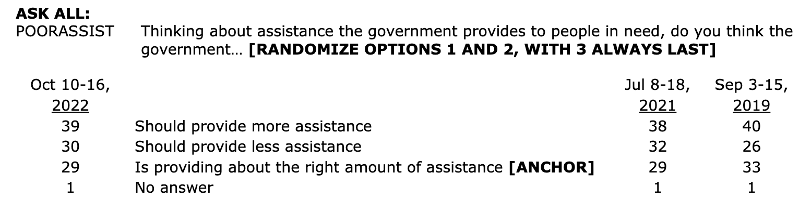
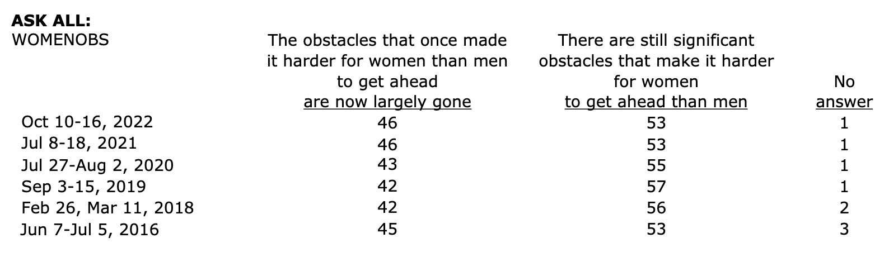
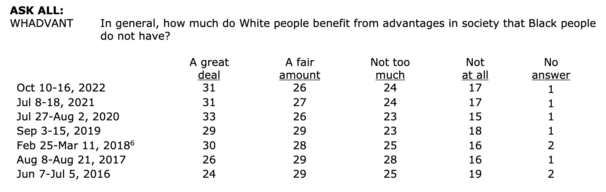
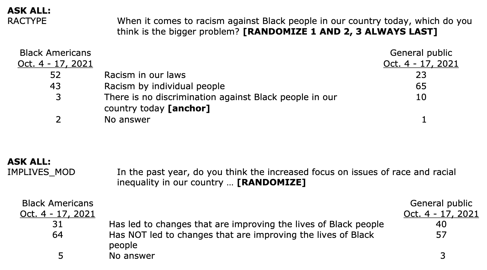
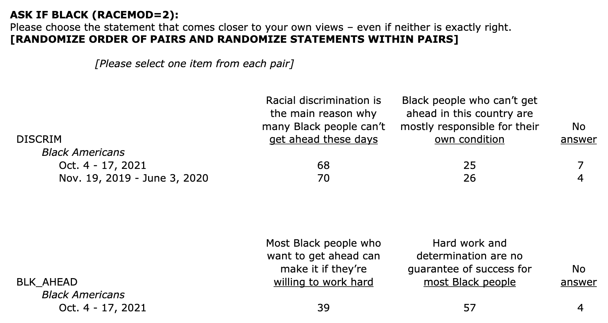
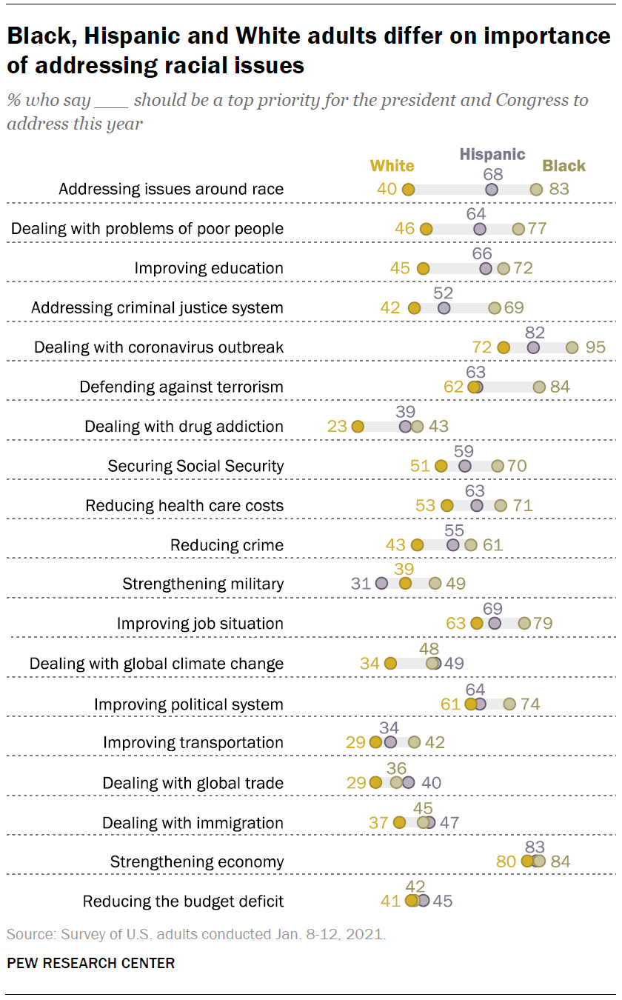
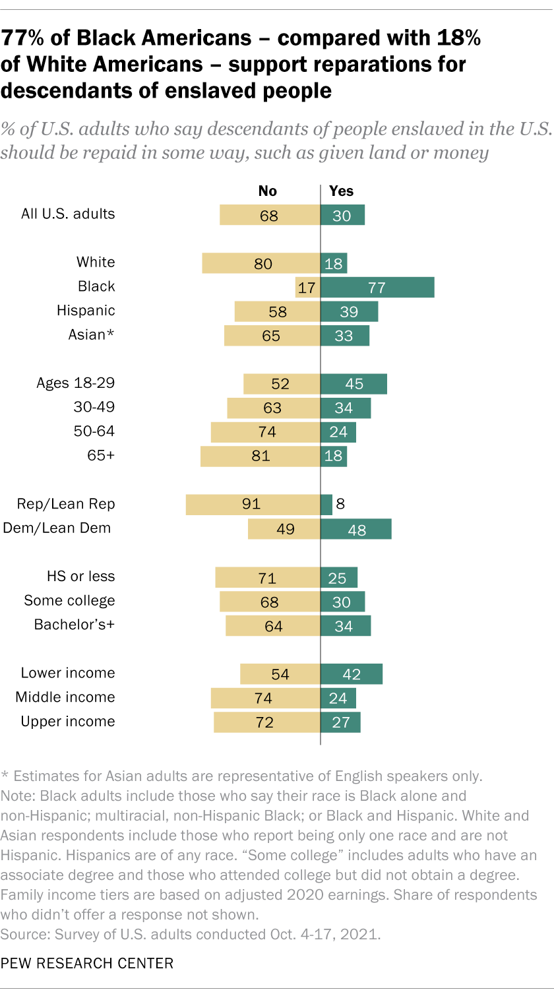
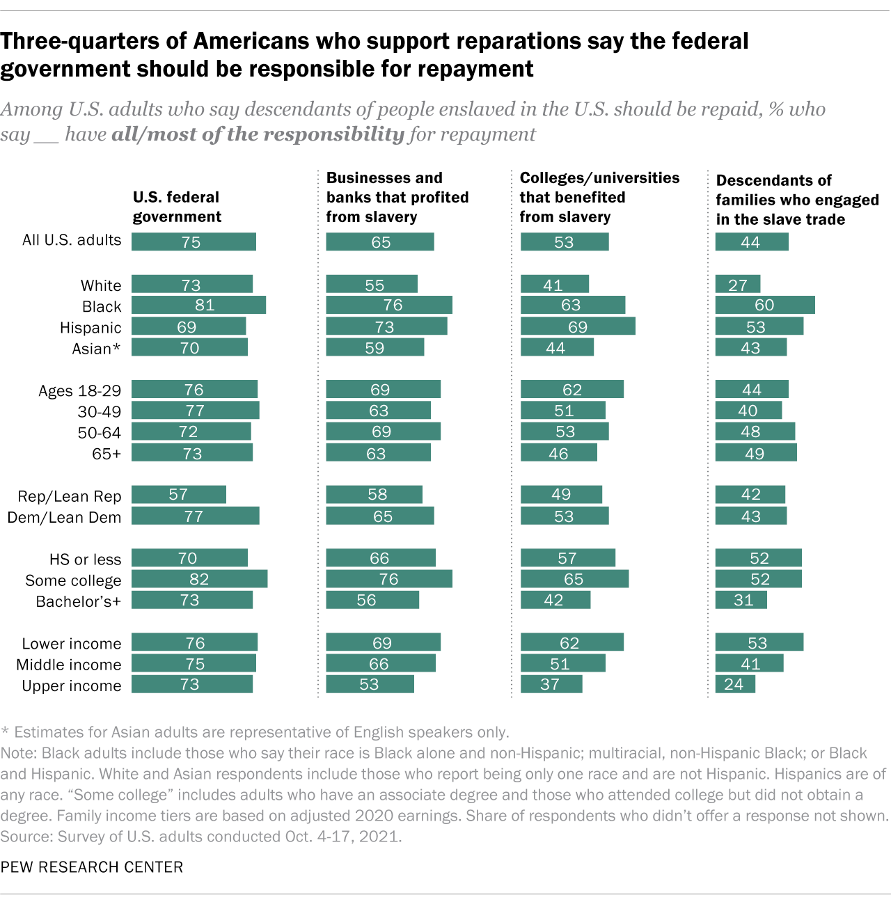
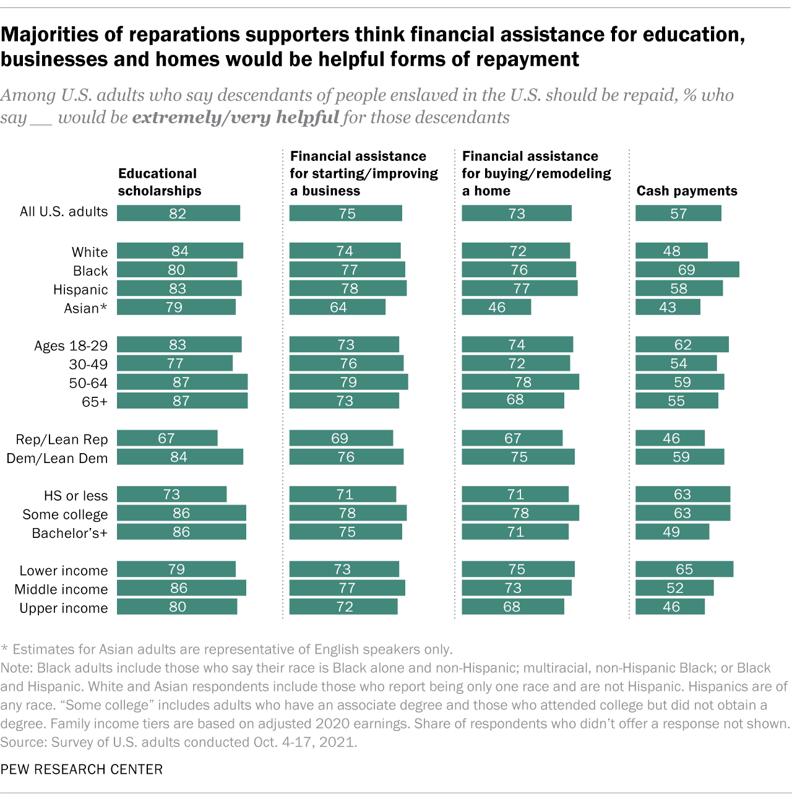

--- 
title: "Critical Racial Narratives Counter Psychological and Structural Barriers to Equity"
author: "Cintia P. Hinojosa"
date: "Last compiled on `r format(Sys.time(), '%b %d, %Y')`"
site: bookdown::bookdown_site
documentclass: book
bibliography: [dissertation-book.bib, packages.bib]
# url: your book url like https://bookdown.org/yihui/bookdown
cover-image: images/dissertation-titleslide.png
description: |
  Narratives on politically contentious topics, such as racism and gun violence, trigger polarizing attitudes that impede equitable policy solutions while exacerbating patterns of systemic harm against historically-marginalized communities. This dissertation adopts community gun violence as a problem space for conducting a mixed-methods investigation of how to leverage the power of critical consciousness (i.e., understanding how intersecting systems of power influence behavior and societal outcomes) to increase public support for responses seeking to repair inequities and empower affected youth to engage with protective, prosocial behaviors. In Chapter 1, a series of online experimental studies examine how critical narratives on gun violence in some \"poor communities of color\" can shift racial attitudes and policy preferences across political orientation. Chapter 2 presents the development and proposed experimental evaluation of a critical narrative on youth violence prevention using design-thinking and participatory methods. Compared to traditional youth behavior change narratives, the critical narrative seeks to promote protective behaviors by reframing gun carrying as playing into racist narratives and scaffolding civic engagement as an empowering path to fight back.
link-citations: yes
biblio-style: apalike
csl: apa7.csl
always_allow_html: true
# github-repo: rstudio/bookdown-demo
# header-includes:
  # - \definecolor{honeydew}{HTML}{F0FFF0}
  # - \definecolor{mistyrose}{HTML}{FFE4E1}
output:
  rmdformats::robobook:  
    self_contained: true
    toc_depth: 2
    toc_float: 
      collapsed: FALSE
    lightbox: true
    gallery: true
    highight: tango
    code_folding: true
    fig_caption: true
    code_download: true
    use_bookdown: true
    css: style.css
    download: ["pdf", "epub"]
  pdf_document: default
  bookdown::gitbook: 
    css: style.css
    split_by: section
    config:
      self_contained: true
      download: ["pdf"]
      search:
        engine: lunr # or fuse
      sharing:
        facebook: false
        github: false
        twitter: false
        linkedin: false
        weibo: false
        instapaper: false
        vk: false
        whatsapp: false
      info: true
---

# DISSERTATION {-}

```{r fig.align='center', echo=FALSE, include=identical(knitr:::pandoc_to(), 'html'),}
knitr::include_graphics('images/dissertation-titleslide.png', dpi = NA)
```


## Abstract {-}

Narratives on politically contentious topics, such as racism and gun violence, trigger polarizing attitudes that impede equitable policy solutions while exacerbating patterns of systemic harm against historically-marginalized communities. This dissertation adopts community gun violence as a problem space for conducting a mixed-methods investigation of how to leverage the power of critical consciousness (i.e., understanding how intersecting systems of power influence behavior and societal outcomes) to increase public support for responses seeking to repair inequities and empower affected youth to engage with protective, prosocial behaviors. In Chapter 1, a series of online experimental studies examine how critical narratives on gun violence in some \"poor communities of color\" can shift racial attitudes and policy preferences across political orientation. Chapter 2 presents the development and proposed experimental evaluation of a critical narrative on youth violence prevention using design-thinking and participatory methods. Compared to traditional youth behavior change narratives, the critical narrative seeks to promote protective behaviors by reframing gun carrying as playing into racist narratives and scaffolding civic engagement as an empowering path to fight back.

<details>
```{r setup-index, eval = TRUE}
# setup knitr options (documentation here: https://yihui.org/knitr/options/)
library(knitr)
library(rmdformats)

knitr::opts_chunk$set(cache.extra = knitr::rand_seed
                      , eval = FALSE # T if running code from scratch; F if rendering output from saved workspace
                      , echo = FALSE
                      , message = FALSE
                      , warning = FALSE
                      , fig.show = 'hold'
                      , fig.align = 'center'
                      , fig.path = '/Users/cintiahinojosa/Box/Booth PhD/Gun Violence Dissertation/dissertation-book/images/fig-'
                      , dev = "png"
                      )

options(
        knitr.duplicate.label = "allow" # use if rendering Merge-Knit
        , knitr.graphics.auto_pdf = FALSE # better images
        , scipen = 999 # eliminates scientific notation
        , digits = 3
        )
```


```{r image-link-function, eval = TRUE}
# create function to make an image with a hyperlink
library(htmltools)
image_link <- function(image,url,...){
  htmltools::a(
    href=url,
    htmltools::img(src=image, target="_blank",...)
    )
} # image_link(image_file, url, width = "49%")

# alternative inline code ----
# Formula: 
# Example: 
# Example: 
```

```{r libraries-index, eval = TRUE}
## BASICS ----
pacman::p_load(knitr
  , tidyverse, tidyr, magrittr
  , dplyr # names() dplyr# as_tibble()
  , broom # data cleaning
  , ggplot2 # foundational graphs package
  , psych, psychTools # useful basic commands for analysis/output
  , ltm # ltm() cronbach.alpha()
  , interactions # for interaction graphs
  , kableExtra # format kable tables
  , papaja # APA style output command and PDF render option
  , sjPlot # view_df()
  , caret, afex, tufte, car # I forget what these do
  , rmdfiltr
)

## READING IN DATA ---- 
pacman::p_load(
  qualtRics # read_survey()
  , haven # read_spss(), labelled(), as_factor()
  , utils # read.csv()  write.csv()
  # , foreign # read.dta(), read.spss()
  # , readstata13, readxl, read_excel
  # , rtiffs
  # , viewenhance
  # , DataEditR
)

## LABEL ----
pacman::p_load(
  sjlabelled, labelled
  # , surveytoolbox
  # , tinylabels
)

## ANALYZE ----
pacman::p_load(
  apastats # outputs in APA format
  , rstatix # useful for tweaking analyses/output commands
  , emmeans # calculate estimated marginal means and contrasts
  , ggExtra, ggfortify, ggeffects, ggsci, ggsignif # 
  , Metrics # eval models
  # , finalfit
  # , bwrappers # Mike Kardas's package for basic analyses/output
)

## ---- PLOTS
pacman::p_load(
  ggExtra, ggfortify, ggcorrplot, ggeffects, ggsci, ggsignif, ggstatsplot
  # , gghalves, gginference, ggiraph, ggiraphExtra, ggpmisc, ggrepel
  # , sjPlot # loaded in basics
  , sjmisc
  , grid, gridExtra
  , corrgram # nice correlation plots
  # , introdataviz
  # , DiagrammeR
  # , flexdashboard
  # , lattice, latticeExtra
  # , latex2exp
  # , patchwork
) 

## ---- OUTPUT
pacman::p_load(
  codebook
  # , DT
  , rempsyc # ggsave()
  # , summarytools # loaded in BASICS
  # , frequency # loaded in BASICS
  , descr, DescTools
  , compareGroups, arsenal, rstatix
  # , apaTables # loaded in BASICS
  , table1
  , flextable
  , flexplot
  , xtable
  # , htmlTable
  # , gtsummary
  # , epiDisplay # tab1 for pretty, easy frequency tables,
  # , papeR
  # , reactable, visualize
  # , corx
)

## ---- MEDIATION
pacman::p_load(
  mediation
  # , psych, psychtools # loaded in BASIC
  # , jtools # get_
  # , lavaan, mma
  # , lme4
  # , nlme, rstanarm
  # , robmed
  # , processr
  # , QuantPsyc
)

## ---- PCA
# pacman::p_load(VIF, GPArotation, FactoMineR, factoextra, Factoshiny, nFactors)
require(factoextra)

## ---- TEXTANALYSIS
# pacman::p_load(
# SADCAT, quanteda, stringr
# )

## ---- PUBLISH
pacman::p_load(
  tinytex
  , citr
  , texPreview # print latex to HTML with ```{texpreview, echo = FALSE}
  # , printr  # prints latex tables for table1() (?)
  # , tippy
)
library("pandocfilters")
# papaja::r_refs("r-references.bib")
# papaja::r_refs("dissertation-proposal-bib.bib")
# library(bookdown)
# library(rticles)
# library(pagedown)
# library(thesisdown)
# library(magick)

## ---- WRITING
#install.packages("hunspell")
#devtools::install_github("nevrome/wellspell.addin") # spellcheck() gramcheck()
#devtools::install_github("nevrome/LanguageToolR")
#LanguageToolR::lato_quick_setup()

## ---- OTHER
#pacman::p_load(formatR, esquisse, beepr, webshot, moderndive)
```

```{r load-index, eval = TRUE, echo = FALSE}
# 1-KEYS & FUNCTIONS ---------------------------
# load(file = "/Users/cintiahinojosa/Box/Dissertation/data/dissertation-keys.RData")

# 2-CLEANED DATASETS ---------------------------
# load(file = "/Users/cintiahinojosa/Box/Dissertation-Proposal/Data/s1.RData")
# load(file = "/Users/cintiahinojosa/Box/Dissertation-Proposal/Data/s2.RData")
# load(file = "/Users/cintiahinojosa/Box/Dissertation-Proposal/Data/s3.RData")

# 3-CLEANED STUDY WORKSPACES ---------------------------
# load(file = "/Users/cintiahinojosa/Box/Dissertation/data/clean-s1.RData")
# load(file = "/Users/cintiahinojosa/Box/Dissertation/data/clean-s2.RData")
# load(file = "/Users/cintiahinojosa/Box/Dissertation/data/clean-s3.RData")

# 4-COMBINED CLEANED WORKSAPCE FOR ANALYSES & PLOTS ---------------------------
# load(file = "/Users/cintiahinojosa/Box/Dissertation/data/dissertation-starter.RData") # use to start chstudy1-si code
# load(file = "/Users/cintiahinojosa/Box/Dissertation/data/dissertation-workspace.RData") # to be updated up to chstudy3-si

# 5-CLEANED DATA SAVED AFTER ANALYSES & PLOTS ---------------------------
load(file = "/Users/cintiahinojosa/Box/Dissertation/data/dissertation-workspace.RData")

# ROUND NUMERIC VARS
# s1 <- s1 %>% mutate_if(is.numeric, round, digits = 3)
```
</details>

```{js, echo = FALSE}
(function() {
  var codes = document.querySelectorAll('pre:not([class])');
  var code, i, d, s, p;
  for (i = 0; i < codes.length; i++) {
    code = codes[i];
    p = code.parentNode;
    d = document.createElement('details');
    s = document.createElement('summary');
    s.innerText = 'Details';
    // <details><summary>Details</summary></details>
    d.appendChild(s);
    // move the code into <details>
    p.replaceChild(d, code);
    d.appendChild(code);
  }
})();
```


<!--chapter:end:index.Rmd-->

# (PART) CHAPTER 1 {-}

# Critical Narratives Undermine Punitive Bias Towards Urban Gun Violence Policies {-}

## Introduction {-}

Gun violence is the leading cause of death among young people in the U.S., with homicides accounting for over 60% of total gun deaths for ages 25 and under [@CDC2021; @Goldstick2021; @Goldstick2022]. However, like many American societal issues, a closer look at the data reveals major differences that disproportionately impact historically-minoritized groups [@Williams2001; @Williams2005; @Bailey2017; @Wildeman2017]. For example, Black Americans make up 13% of the population but account for 60% of all gun homicides, most of which occur in urban neighborhoods with high rates of poverty and racial segregation [@CDC2021; @Cheon2020; @Frazer2017]. 
Although gun violence is a widely-shared concern, experts disagree on how to prioritize public safety strategies [@Cook2019; @Wolf2015; @Gee2022; @Ludwig2014]. 
The dominant narratives about reducing gun violence focus on keeping guns and criminals off the streets through increased law enforcement [@TheWhiteHouse2022; @Braga2018; @McGinty2014; @Pew2022]. 
However, punitive approaches can exacerbate the root causes of violence by further destabilizing neighborhoods that are already overly targeted by policing and mass incarceration 
[@NationalResearchCouncil2014; @Lynch1997; @Wildeman2017; @Futterman2016; @Kovera2019; @Miller2022b; @Sampson2002]. 
A restorative approach instead aims to repair the harm caused by a racist history of segregation, divestment, and disenfranchisement has caused to many of these neighborhoods [@Rothstein2017; @Alexander2010; @Massey1993; @Sampson2002; @Williams2001; @Williams2013]. 
With this context in mind, restorative approaches seek to prevent violence by establishing routes for socioeconomic mobility and other positive support structures [@Bieler2016; @Edley2008; @David-Ferdon2016; @Joyce2019; @Joyce2022; @Tsui2014]. 
The racial patterns in gun homicides and the history of systemic oppression suggest that reducing gun violence requires a critical examination of what it means to do so in an equitable manner. 

This dissertation examines how certain narratives about racialized social problems can strengthen or remedy the structural and psychological factors that contribute to the problem. 
Using community gun violence (hereafter CGV)[^1-ch1-intro-1] as a problem space, I examine a psychological approach to shifting attitudes and behaviors that advance equity-oriented solutions. 
This approach is guided by critical social theories developed to arm scholars and the public to challenge the systemic mechanisms underlying racial inequities [@Freire1970; @Crenshaw1995; @DelgadoStefancic2017; @Collins2019; @Lewin1937]. 
This introduction will describe the disadvantaging characteristics of conventional narratives about societal problems, followed by the comparable advantages of critical narratives as defined in this present work, and end with an overview of the experimental study conditions and hypotheses in Chapter 1. 

[^1-ch1-intro-1]: Sometimes referred to as "urban," "street," or "inner city" gun violence, I use the term "community gun violence" to emphasize the largely social and neighborhood-based nature of this phenomenon [@Green2017]. 

## Conventional narratives about societal problems reinforce inequalities {-}

Narratives organize what information is most salient to audiences, which shapes lay beliefs about how a problem came to be and what solutions are appropriate [@Iyengar1991; @Druckman2001; @Kim2015; @Sotirovic2003]. 
American narratives about societal issues have a history of presenting information from a perspective that is highly individualized, blind to how racial contexts shape experiences and perpetuate harmful racial stereotypes [@Perez2019; @Barry2013; @Parham-Payne2014; @Braga2015; @Salter2016; @Roberts2020]. 
In the following section, I describe how these characteristics ignore information that is critical for understanding societal issues in a way that represents the reality of the problem space. 

#### Colorblindness suppresses historically-marginalized narratives {-}

When trying to make sense of societal problems, the presence or lack of contextual knowledge influences how a person explains outcomes and whether those explanations map onto reality. 
Racially colorblind narratives avoid considering race as a legitimate factor when analyzing issues, even in the face of clear racial patterns [@Bonilla-Silva2015; @Apfelbaum2012; @Dupree2021]. 
In particular, colorblind narratives miss information and themes that emerge from historically-marginalized perspectives, such as *critical historical knowledge* about America's history of racism [@Bonam2019; @Nelson2013]. 
Colorblind narratives can thus misrepresent the reality of racism and enable self-serving motivations that affect how people perceive current issues [@Kraus2019; @DelgadoStefancic2017]. 
<!-- For example, colorblind narratives can appeal to White Americans because it legitimizes beliefs about living in a post-racial society [@Kraus2019; @Onyeador2020]. -->
For example, colorblindness and a lack of critical knowledge lead to overestimating racial progress because it affirms beliefs about living in a fair, post-racial society [@Jost2019; @Kraus2019; @Onyeador2020]. 
Moreover, when shown counter-evidence of continuing racial inequality, rather than correcting overestimations of racial equality, participants downplayed the extent of past inequality [@Onyeador2020]. 

#### Over-individualizing societal issues skews perceived causes {-}

Over-individualized narratives emphasize individual-level factors while ignoring significant contextual factors, which can emerge for several reasons. 
First, in the process of assessing causal factors, the information that is most salient gets interpreted as playing a larger role [@Fiske1982]. 
The accuracy of this process is vulnerable to cognitive shortcuts evolved to facilitate navigating an information-rich world [e.g., @Cimpian2014, @Tetlock2000]. 
Generally, people underestimate the power of situations to influence behavior and are particularly quick to interpret others' poor behavior as more agentic and representative of their character [@Ross1991; @Tetlock1985; @Gilbert1995]. 
When explaining one's own behavior, however, the blame shifts towards situational circumstances and other self-knowledge that is salient to one's self but is less salient or invisible to others. 

Similarly, narrative frames influence how viewers form causal explanations by manipulating the salience of information about individual characteristics compared to societal themes [@Iyengar1991; @Sotirovic2003].
For example, an episodic narrative that communicates information through individuals' personal stories leads more viewers to understand societal issues as problems caused by personal failings for which they should be held responsible. In contrast, thematic narratives communicate abstract concepts as they connect to behavior and prompt greater blame towards societal structures. 
Individualistic narratives have been shown to influence causal attributions and policy preferences across societal issues such as obesity [@Barry2013], poverty [@Hannah2006; @Piff2020], policing [@Bowleg2021], and racism [@Pew2016; @Rucker2021Science]. 

#### Stereotypes substitute information gaps {-}

In a problem space stripped of context through colorblind, individualized narratives, people draw from personal experiences and pre-existing mental models to explain others' behavior. 
High rates of racial segregation in the U.S., however, increase the physical and psychological distance between groups' experiences [@Steele1999; @Trope2010; @SalterAdams2016; @Rothstein2017; @Massey1993]. 
These differences in physical environments and lived experiences impact how a person can afford to make sense of the world and human behaviors [@Steele1999; @Walton2019]. 
In this sense, someone with first-hand experience living through the consequences of societal problems can afford to call on more factors to understand related behaviors than someone who does not [@Steele1999; @SalterAdams2016; @Roberts2020; @Walton2019]. 
For those who cannot afford such nuanced understandings, potential causal factors are limited to representations of the affected group seen in mainstream narratives. 
Reliance on mainstream representations of marginalized groups for accuracy, however, is not ideal. 
Whether delivered through entertainment or news reports, racial stereotypes are made salient when the public receives racially-coded information [@Banaji2021; @Hurwitz1997; @Hurwitz2005]. 
Popular media promotes racial stereotypes that influence attitudes towards stigmatized groups and the issues affecting them [@Dixon2000; @Hurwitz1997; @Hurwitz2005; @Bjornstrom2010; @Oliver2003; @Gilens1996a]. 

#### These phenomena perpetuate inequity and feed the cycle of violence {-}

<!-- Chances to build support for repairing systems that reproduce unequal outcomes are undermined by colorblindness, over-individualizing, and pervasive racial stereotypes.  -->
The above section described how conventional narratives marginalize critical information that shapes lay beliefs about how the world works. 
The following section describes how these lay beliefs undermine policy support for repairing systems that reproduce racial inequities. 
Garnering support for effective policy solutions depends largely on public attitudes about the causal nature of a social problem. <!-- The narrative influences on causal attributions impact the policies that gain public support -->[@Brown-Iannuzzi2017; @Dunbar2020; @Parham-Payne2014; @Haider-Markel2001; @Wozniak2019]. 
For example, individualistic attributions predict opposition to welfare policies, whereas societal attributions predict support for social service spending [@Sotirovic2003; @Iyengar1991]. 
In contrast, societal blame yields sympathy that translates into a greater willingness to support the victims [@Cuddy2008; @Haider-Markel2018]. 
People generally approve of social support services and rehabilitative policies to reduce crime.
However, people are more likely to prefer harsher punishments when the decision is in response to "Black crime" [@Hetey2014; @Hetey2018]. 
This shift has been linked to how stereotype-consistent cues shape policy preferences towards disproportionately punishing Black men. 
Conclusions about how “deserving” a person is of correctional punishment or how “undeserving” they are of public assistance are an automatic response that is influenced by stereotypical beliefs of Black people as dangerous or lazy, respectively [@Bridges1998; @Brown-Iannuzzi2017; @Gilens1996; @Gilens1999]. 

When it comes to evaluating public policies that would primarily impact underserved communities of color, biased deservingness beliefs can impede constructive change by either increasing support for punitive actions against low-level crimes or decreasing support for social welfare, both of which are related to negative stereotypes about Black Americans [@Green2006]. 
The racial biases towards punitive support can be understood as a symptom of how mainstream narratives make stereotype-consistent information salient without including nuanced understandings of race. 
When left unchallenged, such lay beliefs are a psychological barrier to implementing policies intended to reduce racial disparities through structural change [@Geronimus2000; @Skinner-Dorkenoo2021). <!-- NEW
Causal attributions about how a problem came to be play a large role in policy preferences.
These beliefs are subject to that can lean on such stereotypical beliefs, 
Lay beliefs as to why there are high rates of gun violence within poor, black communities, for example, may align with implicit anti-Black stereotypes, which can in turn affect which violence prevention strategies gain support.
  -->
  
## Critical narratives as an alternative approach {-}

This present approach is grounded in critical social theories developed to empower scholars and the public to understand and disrupt norms that whitewash root causes of social inequities [@Freire1970; @Crenshaw1995; @DelgadoStefancic2017; @Collins2019]. 
Critical Race Theory (hereafter CRT) is a seminal framework originated by legal scholars to interrogate how the social construct of race is imbued with power throughout fundamental societal institutions [@Crenshaw1995; @Delgado1992; @DelgadoStefancic2017]. 
Scholars and practitioners across education [@Ladson-Billings1995; @Lynn2013; @Solorzano2002], psychology [@Salter2013; @Crossing2022; @Torre2012; @Diemer2016], public health [@Graham2011], and medicine [@Tsai2021; @Metzl2017; @Metzl2018] have since adopted critically-conscious approaches that incorporate CRT principles and other themes related to challenging inequitable structures.  

For this work, I define *critical narrative* as one that describes inequality by delivering marginalized information about structural oppression that is inconsistent with normative assumptions underlying societal inequities. The key components of a critical narrative are described in the following section and include: (A) centering marginalized perspectives, (B) recognizing structural racism as a problem, and (C) giving a clear, causal explanation of how structural racism impacts group outcomes. 
I argue that the problems of colorblindness, over-individualization, and racial stereotypes in mainstream narratives can be undermined by narratives that wisely deliver these critical components, even on a topic as controversial as racism and gun violence. 

#### Centering of marginalized perspectives to counter normative narratives {-}

When examining a problem space, the practice of centering perspectives from historically-marginalized groups affected by the issue can reveal pertinent themes and factors that could otherwise be washed away. 
Holistic analyses of the individual- and system-level factors surrounding a problem enable a richer understanding of behavior as it relates to external structure and norms [@Collins2019a; @Crenshaw2016; @Geronimus2000; @Gkiouleka2018; @Bowleg2021]. 
Critical narratives can begin to fill in the gaps by raising consciousness about the structural nature of racism and how it has significantly impacted mechanisms for full citizenship and socioeconomic mobility [@Alexander2010; @Bonilla-Silva1997; @Crenshaw1995; @Miller2022b]. <!-- Centering marginalized perspectives allows pertinent themes and factors that would otherwise be washed away to instead be incorporated into the mental representations of a given problem space.  --><!-- Folks who lack direct experience with an identified problem can learn from the lived experiences of groups with first-hand experience. -->
This missing information facilitates policy approaches that look "upstream" to create preventative, sustainable, and effective solutions to problems that show patterns of systemic differences [@Heath2020]. 

Counter-storytelling, a rhetorical tool of CRT, critiques colorblind narratives by presenting accounts from the lived experiences of marginalized groups, which often paints a fundamentally different picture of societal systems that are inconsistent with normative representations [@Crenshaw1995]. 
Perspectives from racially-marginalized groups introduce critical information that is inconsistent with overly-optimistic colorblind narratives about racial equality. 
By introducing new salient information about the relevant societal context, the counter-storytelling component of critical narratives can help override the prominence of stereotypes in public mental models. 

#### Recognition of structural racism as a contributor to societal problems {-}

The conventional narratives miss critical information about the root causes of societal problems, as many stem from structural inequities. 
In particular, individualized colorblind narratives neglect the wealth of interdisciplinary evidence illustrating the extent of racism embedding in American institutional structures and social fabric [@Rothstein2017; @Payne2017 @Williams2001; @Williams2005; @Bailey2017; @Wildeman2017]. 
Critical narratives enrich the potential for developing equitable and effective solutions because they look upstream to address the underlying mechanisms that tilt the scales [@Heath2020]. 
Structural racism plays a role in how social policy issues came to be and why they often disproportionately affect minority groups [@Massey1993; @Bonilla-Silva1997; @Alexander2010; @Sampson2002; @Bailey2017; @Lawrence2008; @Williams2001; @Williams2013]. 
However, most Americans understand racism as an individual quality that exists in a racially-prejudiced person while underestimating racism in structures like laws and institutions [@Rucker2020ThinkingStructurally; @RuckerDukerRicheson2020; @Rucker2021Book; @Rucker2021Science; @Bonilla-Silva1997; @Bonilla-Silva2003; @Bonilla-Silva2015; @Banaji2021]. 

#### Explanation of how structural racism contributes to current issues {-}

A critical narrative can expand mental models of racism by illuminating systemic racial patterns to identify and repair underlying structures that uphold discriminatory processes. 
To be effective, however, the narrative must also explain how causal mechanisms of racial oppression influence marginalized experiences and produce different group-level outcomes. 
<!-- Critical knowledge about societal dynamics increases awareness about the external influence on group behavior, which matters when trying to make sense of problematic behavior.  -->
Critical consciousness, sometimes called structural competency, is the capacity to identify and navigate the structures underlying social inequities in pursuit of equity-oriented goals [@Freire1970; @Diemer2016; @Metzl2017; @Metzl2018]. 
For example, teaching "structural competency" to medical residents resulted in more effective patient care than the control group [@Metzl2017; @Metzl2018]. 
In this context, learning how laws and institutions operated to marginalize groups afforded medical residents greater contextual knowledge to better understand how patterns in socioeconomic circumstances relate to patients' health behaviors (e.g., inability to visit pharmacy outside of work hours or missing appointments because of unreliable public transportation.) 
This consciousness about the causal history behind racial inequalities can help correct implicit biases from narrative structures and contents that neglect this critical context. 
<!-- the general over-estimation of racial progress that bias causal inferences made about stigmatized groups.  --><!-- This approach also builds on past approaches to addressing divisive societal issues by explaining how psychological mechanisms contribute to cultural differences across individual to societal levels [@Hamedani2019; @Adams2008; @Metzl2017; @Metzl2018].  -->

## Applying critical narratives to community gun violence {-}

Critical narratives can be used to understand complex phenomena, like how structural forces transmit (dis)advantage by shaping institutions, laws, and social norms. For this dissertation chapter, I created news articles and policy memos that provided information about gun violence in some "poor communities of color" that differed by key components of a critical narrative. 
In exploring how people come to understand why gun violence is such a problem in some poor communities of color, I expect a critical narrative to undermine the colorblind, individualistic, and misrepresentations of Black Americans that bias attitudes and behaviors. 
The following section describes how I apply the above elements of critical narratives to CGV as a problem space. 

#### Centers marginalized perspectives to counter normative narratives {-}

Not only are conventional narratives not capturing the full story, but they are also missing evidence of how the traditional prescriptions for reducing violence in this context amplify underlying causes of CGV. 
Punitive models of crime deterrence use fear-based threats and incapacitation as primary mechanisms of violence reduction. 
These levers, however, are disproportionately used against marginalized communities to a devastating degree [@Alexander2010; @Rothstein2017; @Massey1993; @Massey2020; @Wildeman2017]. 
Over-policing and mass incarceration of poor neighborhoods of color destabilize family and community structures, which fosters patterns of violence [@Alexander2010; @Miller2022b; @NationalResearchCouncil2014; @Smiley2016; @Swisher2015; @Sampson2002]. 
Police presence is often seen as a threat to one’s safety rather than protective service due to disproportionate arrests of people of color and accounts of racial discrimination [@Schutz2016; @Wacquant2002; @Futterman2016]. 

#### Recognizes structural contributors to societal problems {-}

Regarding gun violence in the U.S., mainstream narratives often emphasize individual traits like mental illness or personal histories, which prompt support for solutions that prevent the most "at-risk" individuals from accessing guns [@McGinty2014; @Haider-Markel2001; @Gallup2019; @Lu2019]. 
Individualized narratives on CGV are particularly problematic because there are centuries of strategic campaigns to sabotage the image of the "hearts and minds" of young Black men [@Smiley2016]. 
In addition, significant situational and structural contributing factors to CGV directly and indirectly shape the problem space. 
A critical narrative highlights the significant situational and structural contributing factors to that directly and indirectly shape the problem space of CGV. For example, the extreme rates of gun violence in some Black communities are a symptom of historical inequities that restrict access to basic needs, civil rights, and paths to socioeconomic mobility [@Alexander2010; @Knopov2019]. 
This information is considered critical because it communicates insights about root causes that are key to informing preventative, upstream solutions. 

#### Explains how structural racism contributes to current issues {-}

However, this critical information about structural racism can only be expected to counter inferences that rely on stereotypes if it explains why racism is a relevant factor in the first place. 
In the context of CGV, critical narratives can draw on scholarship that explains how overtly racist policies and practices that infringe on Black American's opportunities to get ahead, such as as “The New Jim Crow: Mass Incarceration in the Age of Colorblindness” [@Alexander2010], "The Case for Reparations" [@Coates2014], and "The Color of Law" [@Rothstein2017]. 
For example, critical connections can be made by describing hidden political agendas behind the War on Drugs, which fueled the mass incarceration of Black men for minor drug crimes despite being less likely than Whites to use or sell drugs. 
Racial discrimination carried out through housing and policing can be described as two major factors that restrict the ability of Black Americans to pursue stable housing and legal employment, which increases pressure to seek income through illegal means and gun carrying for protection. 
<!-- who hold beliefs that are predictive of greater punitive policy support and less support for egalitarian policies. Critical consciousness, a term coined in an empowerment-based framework that is used to understand social inequality and one’s potential to enact egalitarian change (34, 119). I adapted a scale from (87), which oper- ationalizes critical consciousness as a combination of perceived societal inequality and egalitarianism values.  -->

## Additional considerations when developing critical narratives {-}

For these reasons, I expect a critical narrative about CGV will shift attitudes and behaviors related to what is causing this problem and what is needed to fix it equitably. The following section describes two additional theoretical strategies I applied in developing narratives. <!-- to address these concerns. -->

#### Values-alignment {-}

One glaring challenge to this expectation is that gun violence, policing, and racism are high-profile topics that trigger sharp identity-based divides [@Jost2017; @Pew2016; @Pew2019; @Unzueta2008]. 
Moreover, current U.S. politics are extremely divisive, with much political information being communicated via echo chambers that pander to ingroup ideals [@Hetherington2015; @Pew2014]. 
Desires to signal that one is "anti-racist," for example, have risen since the racial uprisings of 2020. Although normalizing anti-racism is valuable for advancing equitable policies, doing so naively often obscures the structural construal of racism that is foundational in critical narratives. 
As a result, politicized terms like "structural racism" and "critical race theory" can be easily misconstrued because they are used as naive buzzwords to gain favor without needing to unpack the concept. 

*Values-alignment* is a behavior change strategy that frames prescriptive messages as consistent with salient, existing values of the intended audience [@Bryan2016; @Bryan2019]. 
A narrative that naively invokes anti-racist language to deliver critical information about CGV may prompt strong reactance, raising the likelihood of conservatives rejecting the content altogether. 
I used a values-alignment strategy to mitigate reactance associated with political and racial identities by presenting information in a way that minimizes language that could signal goals that are inconsistent with salient political values. 
A values-alignment approach does not attempt persuasion by convincing people to change their pre-existing values as identity-threats impede efforts to change racially-charged attitudes, such as perceptions of inequality [e.g., @Onyeador2020]. 

Although one might expect critical narratives to increase critical consciousness, the present narratives discuss controversial topics in the context of a societal problem that does not directly impact the large majority of the population. I would expect greater identity-based reactance from critical narratives that expose inequities in a context that could potentially implicate participants' identities and positions of privilege. For these reasons, I expect to critical narrative to shift policy preferences regardless of political orientation or level of critical consciousness. 
<!-- I expect applying this approach to critical narratives on controversial topics will will shift attitudes regardless of political orientation and the values and norms that are closely associated, like egalitarianism and perceptions of inequality.  --><!-- Freedom is a traditional American value that appeals to conservative parties, except when presented through narratives from opposing liberal parties. Introducing a similar yet competing identity into a problem space can raise identity threats and motivations to affirm values that distinguish one's personal identity from the opposing party's identity. In this way, the critical narratives leverage the mental model of egalitarianism as a shared American value rather than a distinguishing political value.  -->  <!-- More liberal leaders are starting to emphasize the need to address structural racism but fail to explain what that means and why it is relevant.  --> <!-- On the other side of the political spectrum, many conservative leaders emphasize the need to ban teachings of structural racism without providing accurate context.   These practices from both sides obscure information and cut out the critical edge of narratives surrounding any racial progress that has been made. -->

#### Problem-posing {-}

*Problem-posing* is a pedagogical strategy that creates a psychological space that affords the possibility to process new information as it relates to an explicit prosocial goal. 
Creating a problem-solving space through a countering perspective licenses the ability to suspend existing mental models and build new ones from the ground up. 
Without this stated goal, readers may be more likely to pursue implicit goals to maintain a positive sense of self [@Unzueta2008]. 
I expect that delivering critical information through problem-posing will allow readers to process potentially-threatening information in a way that would not be afforded if the information was assumed to have persuasive intent. 
Taken together, I expect a critical narrative that poses a problem and appeals to shared intergroup values can deliver controversial information without the associated sociopolitical baggage hanging onto the normative mental model. 

## Present Research {-}

This dissertation seeks to use critical narratives to disrupt the process in which how mainstream narratives reinforce psychological and structural processes that maintain racial inequity. 
Chapter 1 explores the impact of adopting critically-informed narratives that run counter to conventional narratives when discussing racial inequalities, such as the issue of "gun violence in poor communities of color." 
A series of experimental studies test whether a critical narrative about the causal connection between CGV and racism influences support for punitive versus restorative approaches to reducing violence, compared to (a) individualized narratives that explain how individual deficiencies in socioemotional skills lead to gun violence, (b) naïve anti-racist narratives that blame structural racism without explaining the causal mechanisms, and (c) control narratives that do not provide any additional context on CGV. The theoretical differences between conditions across the studies in Chapter 1 are as follows:

**Control condition**.
All narratives begin by comparing the national conversations on mass shootings to the daily gun violence experienced in some poor neighborhoods of color. This introduction establishes a counter-space to the dominant narratives by identifying a related yet overlooked concern. 
The control condition narratives point out the racial pattern of CGV but do not (A) provide context about the affected group's lived experiences, (B) recognize structural racism as a contributing factor to CGV, or (C) explain its causal impact. This condition establishes a reference point that captures spontaneous beliefs about gun violence without exposure theoretically-relevant factors.  

**Critical condition**.
The critical narratives include the same introduction, (A) adds context about the affected group's experiences, and (B) recognizes how structural racism fostered conditions that create risks for gun violence. 
Importantly, the critical narratives also (C) provide causal explanations of how racism yields unequal group outcomes through external systems that transmit disadvantage. 
<!-- The critical narratives draws inspiration from “The New Jim Crow: Mass Incarceration in the Age of Colorblindness” [@Alexander2010] and "The Case for Reparations" [@Coates] to describe overtly racist policies and practices that infringe on a group's freedom to pursue equal opportunities for socioeconomic mobility. -->
<!--- individuals' agency./constrain individuals' opportunities on a neighborhood-level. -->
<!-- This narrative describes overtly racist policies and practices that infringe on a group's freedom to pursue equal opportunities for socioeconomic mobility. -->

```{r fig-conditions, echo = FALSE, out.width = "100%", fig.cap = "Main theoretical differences between conditions across studies in Chapter 1.", fig.align='center', eval = FALSE}
knitr::include_graphics("/Users/cintiahinojosa/Box/Dissertation-Proposal/images/condition chart.png")
```

**Individual condition**.
Like the critical condition, the individual condition stimuli also (A) centers the experiences of marginalized group.
It does not (B) recognize structural racism as a causal factor, nor does it (C) explain how structural racism raised the risk of violence by shaping the affected groups' environment and circumstances. 
<!-- The key difference is the presentation of the affected group's experience only explains how individual-level factors contribute to violence.  -->
Note that the individual condition does not present an episodic narrative that tells the story from the perspective of one or more individuals. 
Instead, it presents a thematic narrative about the patterns of CGV along with information about situational pressures individuals face. 
The individualized narratives do not, however, label or explain the structures underlying individuals' surrounding context. <!-- It instead emphasizes the impact of dispositional traits like self-control and explains how deficiencies put individuals at-risk of experiencing gun violence. -->

**Naïve anti-racist condition**.
The naïve condition presents narratives that (A) raise awareness of marginalized groups' experiences and (B) declare structural racism as a contributing factor to social problems, but do not (C) explain this politically controversial claim. <!-- Liberal values can motivate people to call out structural racism as a cause of injustice to signal their commitment to liberal values in their like-minded social network. -->
Unlike the critical narrative, I designed the naïve anti-racist narratives to include politicized buzzwords to signal alignment with liberal values. 
Comparison with this condition is expected to emphasize the need to explain critical concepts from a bottom-up, counter-cultural perspective.

### Hypotheses {-}

```{texpreview, echo = FALSE}
\begin{enumerate}
\small
\item[H1a.] Participants in the critical condition will report reduced support for punitive policies. This main effect will emerge across levels of political ideology (b). \
\item[H2a.] Participants in the critical condition will report increased support for restorative policies. This main effect will emerge across levels of political ideology (b). \
\item[H3.] Participants in the critical condition will score lower on a symbolic racism scale. \
\item[H4.] Reduced symbolic racism will partially mediate the critical main effects on reduced punitive policy support (a) and increased restorative policy support (b). \
\item[H5.] Participants in the critical condition will express behaviors and intentions for policy support in terms of budget allocation (a), engagement with a related petition (b), and willingness to share the gun violence narrative on social media (c). \
\item[H6.] The critical condition will increase the extent to which attribute gun violence to structural factors (a) and decrease attributions to dispositional factors (b). 
\item[H7.] Structural attributions for CGV will partially mediate the critical main effects on reduced punitive policy (a) support and increased restorative policy support (b). \
\end{enumerate}
```

<!--chapter:end:1-ch1-intro.Rmd-->

# Study 1: A critical narrative reduces support for punitive violence prevention policies {#ch1study1}

Study 1 investigates whether reading information about the causal contributors to CGV can shift public policy preferences and attributions for the racial patterns in CGV. The study is a 3 x 1 between-subjects design, in which participants are randomly assigned to one of three conditions: critical, individual, and control.

The main hypotheses are:

* H1a. Participants in the critical condition will report reduced support for punitive policies. This main effect will emerge across levels of political ideology (b).
* H2a. Participants in the critical condition will report increased support for restorative policies. This main effect will emerge across levels of political ideology (b).

<!-- * H3a. Participants in the critical condition will score lower on a modern racism scale (b). -->
<!-- * H4. Reduced modern racism will partially mediate the critical main effects on reduced punitive policy support (a) and increased restorative policy support (b). -->

## Method 

### Participants

A total of `r nrow(s1)` online participants were recruited to complete a 15-minute survey (`r apastats::describe.mean.sd(s1$duration, dtype = "c")`) for \$1.50 on Amazon Mechanical Turk in Fall 2019. There were no significant differences in survey duration between conditions (`r duration_aov.apa_s1$statistic$modelfit`). The sample was `r female_perc_s1`% female, `r white_perc_s1`% White, `r black_perc_s1`% Black, `r latino_perc_s1`% Latiné, `r asian_perc_s1`% Asian, `r mideastern_perc_s1`% Middle Eastern, and `r native_perc_s1`% of Native or Indigenous descent, with a median adjusted household income of \$`r income_med_s1` (`r apastats::describe.mean.sd(as.numeric(s1$adj_income), dtype = "c")`). 

<details><summary>**Table of Participant Characteristics**</summary>
```{r demos-comp-study1, eval = TRUE, fig.cap = "Descriptive Statistics of Participant Characteristics by Condition in Study 1."}
# summary table by condition # compareGroups::
demos_comp_s1 <- compareGroups::descrTable(condition.f ~ gender.f + race.f + political3.f + age + edu3.f + adj_income, data = s1, subset = pass==1)
# demos_comp_s1 # print

compareGroups::export2md(demos_comp_s1, width = "300px", format = "html") # print to markdown/html
```

```{r demos-summary-study1, eval = FALSE}
demo_vars_s1.wide <- dplyr::select(s1.wide, gender, race, political, age, edu3, adj_income, duration)
demo_vars.names_s1.wide <- names(demo_vars_s1.wide)

s1.wide %>%
  rstatix::get_summary_stats(demo_vars.names_s1.wide, show = c("mean", "sd", "min", "max", "iqr")) %>%
kable(booktabs = TRUE, digits = 2, caption = "Participant Characteristics in Study 1"
      ) %>%
  kable_styling(bootstrap_options = c("condensed", "bordered"), full_width = F)
```
</details>

### Procedure

The survey randomized participants to read an ostensibly real Wall Street Journal article that delivered on of the three conditional narratives. 
The key differences were that the critical narrative described how structural racism contributes to CGV, while the individualized narrative instead focuses on how individual differences in self-control contribute to CGV, and the control provided no additional information. 
Participants in the control condition were asked to participate in a study about vaping and a separate study about gun violence. 

All news articles ended with three manipulation check questions that asked participants to recall details about the causal claims made in the article. 
Participants who answered at least one question incorrectly were redirected to the news article page and asked to review, and then tried answering again. 
After three failed attempts, the survey allowed participants to continue the survey, but their data were excluded from analyses. 
The survey then presented the policy support items, followed by questions about policy preferences regarding gun violence in "poor neighborhoods of color." All items were randomized within their section. After completing the main survey measures, the survey debriefed the nature of the study and its use of fake news articles. The statement provided links to sources and explained that the claims made in the articles were supported by credible news outlets and peer-reviewed journal articles.

### Materials

See [Study 1 Appendix](#ch1study1-si) for full materials.
 
#### Critical narrative

The critical news article titled “Chicago’s Gun Violence is Deeply Rooted in Racial Segregation and Mass Incarceration” presented evidence from scholars and public health experts about how a history of racism fostered societal conditions that led to high rates of gun violence is some Black communities. 
The article describes how U.S. banks officiated racial discrimination in lending practices and housing regulations, which created pockets of concentrated poverty that made it nearly impossible for families to escape. The author provides evidence of hidden agendas behind a discriminatory shift in policing practices and provides statistical evidence of racial discrimination in the criminal justice system. 
The critical article ends with a gun violence expert advocating for policies that target the physical, economic, or social structures in neighborhoods with gun violence to repair the damage done by racism. 
The recommendations included affordable housing regulation, local business construction, public education, and better community-police relations. 
<!-- The article provides context behind discriminatory policies and practices that impact current opportunities available in affected neighborhoods. -->
<!-- The policies are intended to provide discriminated populations with the means and opportunity to improve their life outcomes, which presumes a choice not to pursue illegal careers. -->

#### Individual narrative

The individualized article "Chicago's Gun Violence is Deeply Rooted in Self-Control Issues" describes this issue with a focus on how individual traits raise the risk of experiencing gun violence. 
It argues that the above-average rates of gun violence in poor, Black neighborhoods are due to young residents developing a disposition to react impulsively and aggressively towards others. The article ends by advocating for socioemotional development programs that teach kids how to resolve conflicts peacefully.
The individual article ends by advocating for socioemotional development programs that teach kids how to peacefully resolve conflicts, improve decision-making skills, and internalize values of self-determination and integrity. 

#### Control

Participants in the control condition were told that they would be participating in two separate studies. The “first study” presented the control article on vaping and manipulation check questions. 
After passing through the manipulation checks, the survey asked participants if they currently vaped and thanked them for completing the first study. The survey then directed them to the second survey on gun violence in poor communities of color. The survey then introduced the problem of gun violence  using the same first paragraph as the critical and individual conditions. The control participants followed the same survey path as the critical and individual conditions. 


## Results

The following analyses are designed to test the hypotheses that (H1 & H2) learning about structural racism significantly impacts support for violence prevention policy approaches, (H3a & H3b) the conditional effect will maintain significance across political orientation, (H4) the extent to which participants invoke anti-Black stereotypes to explain the racial patterns of neighborhood gun violence, and (H5a & H5b) the extent to which modern racism mediates policy support. 
The analyses consist of multivariate regression models that included political orientation, gender, age, adjusted income, and level of education as covariates. The control condition served as the reference category, and the measure of adjusted income was calculated by dividing participants’ reported annual income by household size.

<details><summary>**Descriptive Statistics of Main Dependent Variables**</summary>
```{texpreview, echo = FALSE}
\begin{table}[!htbp]
\small
%% \caption{\label{tab:maindvs-table-study1}Descriptive Statistics of Main Dependent Variables by Condition in Study 1}
\centering
\begin{tabular}[t]{lllll}
\toprule
 & Control & Individual & Critical & Overall\\
\midrule
 & (N=226) & (N=181) & (N=194) & (N=601)\\
\addlinespace[0.3em]
\multicolumn{5}{l}{\textbf{Punitive Policy Support}}\\
\hspace{1em}Mean (SD) & 2.53 (0.716) & 2.49 (0.726) & 2.20 (0.701) & 2.41 (0.729)\\
\hspace{1em}Median [Min, Max] & 2.50 [1.00, 4.00] & 2.50 [1.00, 4.00] & 2.25 [1.00, 4.00] & 2.50 [1.00, 4.00]\\
\addlinespace[0.3em]
\multicolumn{5}{l}{\textbf{Restorative Policy Support}}\\
\hspace{1em}Mean (SD) & 3.12 (0.548) & 3.06 (0.530) & 3.30 (0.552) & 3.16 (0.551)\\
\hspace{1em}Median [Min, Max] & 3.25 [1.50, 4.00] & 3.00 [1.50, 4.00] & 3.38 [1.00, 4.00] & 3.25 [1.00, 4.00]\\
\addlinespace[0.3em]
\multicolumn{5}{l}{\textbf{Symbolic Racism}}\\
\hspace{1em}Mean (SD) & 0.894 (0.348) & 0.952 (0.368) & 0.827 (0.356) & 0.890 (0.360)\\
\hspace{1em}Median [Min, Max] & 0.854 [0.285, 1.71] & 0.955 [0.285, 1.78] & 0.784 [0.285, 1.78] & 0.860 [0.285, 1.78]\\
\bottomrule
\end{tabular}
\end{table}
```
</details>

<details><summary>**Table of Main Regression Analyses**</summary>
```{texpreview, echo = FALSE}
\begingroup
\small 
\begin{singlespacing}
\begin{table}[H] \centering 
%%\caption{\label{tab:maindvs-ols-star-study1}Regression Analyses Predicting Main Dependent Variables in Study 1} 
\begin{tabular}{@{\extracolsep{5pt}}lccc} 
\\[-1.8ex]\hline 
\hline \\[-1.8ex] 
 & \multicolumn{3}{c}{\textit{Dependent variable:}} \\ 
\cline{2-4} 
\\[-1.8ex] & Punitive & Restorative & Racism \\ 
\\[-1.8ex] & (1) & (2) & (3)\\ 
\hline \\[-1.8ex] 
 Intercept & 1.75$^{***}$ (0.12) & 3.70$^{***}$ (0.08) & $-$1.48$^{***}$ (0.18) \\ 
  Condition: Individual & $-$0.10 (0.06) & 0.01 (0.05) & $-$0.004 (0.10) \\ 
  Condition: Critical & $-$0.30$^{***}$ (0.06) & 0.16$^{***}$ (0.04) & $-$0.18 (0.09) \\ 
  Political Orientation & 0.19$^{***}$ (0.02) & $-$0.17$^{***}$ (0.01) & 0.50$^{***}$ (0.02) \\ 
  Race: Latiné & 0.15 (0.12) & $-$0.07 (0.08) & $-$0.24 (0.18) \\ 
  Race: Black & $-$0.06 (0.10) & 0.07 (0.07) & $-$0.36$^{*}$ (0.14) \\ 
  Race: Native American & 0.31 (0.37) & $-$0.04 (0.26) & $-$0.57 (0.56) \\ 
  Race: Asian & 0.06 (0.11) & $-$0.08 (0.08) & 0.39$^{*}$ (0.16) \\ 
  Race: Middle Eastern & 0.002 (0.37) & 0.43 (0.26) & $-$0.48 (0.56) \\ 
  Race: Other & 0.07 (0.32) & $-$0.26 (0.23) & 0.04 (0.48) \\ 
  Race: Multi & $-$0.12 (0.10) & $-$0.03 (0.07) & $-$0.12 (0.15) \\ 
  Female & 0.16$^{**}$ (0.05) & 0.04 (0.04) & $-$0.07 (0.08) \\ 
  Age & 0.003 (0.002) & 0.001 (0.002) & $-$0.003 (0.004) \\ 
  Adj. Income & $-$0.0000 (0.0000) & $-$0.0000 (0.0000) & $-$0.0000$^{**}$ (0.0000) \\ 
  College degree & $-$0.03 (0.05) & $-$0.09$^{*}$ (0.04) & 0.11 (0.08) \\ 
 \hline \\[-1.8ex] 
Observations & 601 & 601 & 601 \\ 
R$^{2}$ & 0.26 & 0.34 & 0.49 \\ 
Adjusted R$^{2}$ & 0.24 & 0.32 & 0.47 \\ 
Residual Std. Error (df = 586) & 0.63 & 0.45 & 0.96 \\ 
F Statistic (df = 14; 586) & 14.71$^{***}$ & 21.61$^{***}$ & 39.60$^{***}$ \\ 
\hline 
\hline \\[-1.8ex] 
\textit{Note:}  & \multicolumn{3}{r}{$^{*}$p$<$0.05; $^{**}$p$<$0.01; $^{***}$p$<$0.001} \\ 
\end{tabular} 
\end{table}
\end{singlespacing}
\endgroup
```
</details>


<details><summary>**Correlations of Main Dependent Variables**</summary>
```{r fig-main-corr-study1, eval = TRUE, out.width = "100%", fig.link = "images/main_corrgram_s1.png", fig.cap = "Correlation matrix of main variables in Study 1.", fig.show='hold', fig.align='center'}
knitr::include_graphics("images/main_corrgram_s1.png")
```
</details>

### H1a. Punitive support {-}

Compared to both the individual and control narratives, the critical narrative decreased support for punitive policies.


<details><summary>**Descriptive Statistics of Punitive Policy Items**</summary>

* PUN_COPS: `r Hmisc::label(s1$pun_cops)`
* PUN_JAILTIME: `r Hmisc::label(s1$pun_jailtime)`
* PUN_PENALTY: `r Hmisc::label(s1$pun_penalty)`
* PUN_PRISONS: `r Hmisc::label(s1$pun_prisons)`

```{r pun-summary-study1, eval = TRUE}
punitive_vars_s1.wide <- dplyr::select(s1.wide, punitive, pun_cops, pun_jailtime, pun_penalty, pun_prisons)
punitive_vars.names_s1.wide <- names(punitive_vars_s1.wide)

s1.wide %>%
  rstatix::get_summary_stats(all_of(punitive_vars.names_s1.wide), show = c("mean", "sd", "min", "max", "iqr")) %>%
kable(booktabs = TRUE, digits = 2, caption = "Descriptive Statistics of Punitive Policy Items in Study 1"
      ) %>%
  kable_styling(bootstrap_options = c("condensed", "bordered"), full_width = F)
```

```{texpreview, echo = FALSE}
\begin{table}

%%\caption{\label{tab:pun-items-table-study1}Descriptive Statistics of Punitive Policy Items Between Critical and Control Groups in Study 1}
\centering
\begin{tabular}[t]{lllll}
\toprule
  & Critical & Control & P-value & Total\\
\midrule
 & (N=244) & (N=258) & (N=240) & (N=742)\\
\addlinespace[0.3em]
\multicolumn{5}{l}{\textbf{Punitive Policy Support}}\\
\hspace{1em}Mean (SD) & 2.32 (0.713) & 2.61 (0.729) & 2.58 (0.754) & 2.50 (0.743)\\
\hspace{1em}Median [Min, Max] & 2.25 [1.00, 4.00] & 2.75 [1.00, 4.00] & 2.50 [1.00, 4.00] & 2.50 [1.00, 4.00]\\
\addlinespace[0.3em]
\multicolumn{5}{l}{\textbf{More police on the streets}}\\
\hspace{1em}Mean (SD) & 2.64 (0.852) & 2.90 (0.872) & 2.83 (0.863) & 2.79 (0.869)\\
\hspace{1em}Median [Min, Max] & 3.00 [1.00, 4.00] & 3.00 [1.00, 4.00] & 3.00 [1.00, 4.00] & 3.00 [1.00, \vphantom{1} 4.00]\\
\addlinespace[0.3em]
\multicolumn{5}{l}{\textbf{Longer jail terms for those convicted of violent crimes}}\\
\hspace{1em}Mean (SD) & 2.66 (0.965) & 3.00 (0.919) & 2.93 (0.912) & 2.86 (0.942)\\
\hspace{1em}Median [Min, Max] & 3.00 [1.00, 4.00] & 3.00 [1.00, 4.00] & 3.00 [1.00, 4.00] & 3.00 [1.00, 4.00]\\
\addlinespace[0.3em]
\multicolumn{5}{l}{\textbf{Increase criminal penalties for non-violent crimes}}\\
\hspace{1em}Mean (SD) & 2.08 (0.939) & 2.32 (0.930) & 2.35 (0.973) & 2.25 (0.953)\\
\hspace{1em}Median [Min, Max] & 2.00 [1.00, 4.00] & 2.00 [1.00, 4.00] & 2.00 [1.00, 4.00] & 2.00 [1.00, \vphantom{1} 4.00]\\
\addlinespace[0.3em]
\multicolumn{5}{l}{\textbf{More prisons and fewer opportunities for parole}}\\
\hspace{1em}Mean (SD) & 1.88 (0.946) & 2.22 (0.933) & 2.22 (1.04) & 2.11 (0.985)\\
\hspace{1em}Median [Min, Max] & 2.00 [1.00, 4.00] & 2.00 [1.00, 4.00] & 2.00 [1.00, 4.00] & 2.00 [1.00, 4.00]\\
\bottomrule
\end{tabular}
\end{table}
```
</details>

<details><summary>**ANOVA Table**</summary>
```{r pun-aov-table-study1, eval = TRUE}
# CONTRASTS --------------
# contrasts(s1$condition.f) <- contr.sum
# contrasts(s1$race.f) <- contr.sum
# contrasts(s1$edu3.f) <- contr.sum

# ANCOVA --------------
pun_aov_s1 <- lm(punitive.c ~ condition.f + political + female.f + race.f + age.c + edu3.f + adj_income.c, data = s1, subset = pass==1)

pun_aov.summ_s1 <- car::Anova(pun_aov_s1)  %>% 
  tidy(pun_aov.summ_s1) %>% 
  mutate_if(is.numeric, round, digits = 3)

# ANCOVA TABLE --------------
pun_aov.summ_s1 %>%
kable(booktabs = TRUE, digits = 3, caption = "ANCOVA Table of Punitive Policy Support by Condition in Study 1"
      , col.names = c("Term", "SS", "df", "Statistic", "p")
      ) %>%
  kable_styling(bootstrap_options = c("condensed", "bordered"), full_width = F) %>% row_spec(c(1), background = "#F0FFF0") # honeydew
```

```{r pun-pwc-table-study1, eval = TRUE}
# POST-HOC --------------
pun_pwc_s1 <- s1 %>% subset(pass==1) %>%
  rstatix::emmeans_test(punitive.c ~ condition.f, ref.group = "Critical", covariate = condition.f, model = pun_aov_s1, comparisons = compare_s1, detailed = TRUE
    , p.adjust.method = "fdr"
    ) %>% 
  mutate_if(is.numeric, round, digits = 3)

# POST-HOC TABLE --------------
pun_pwc_s1[, c(3:4, 6:14)] %>% 
  kable(booktabs = TRUE, digits = 3, caption = "Contrasts of Punitive Policy Support by Condition in Study 1"
         , col.names = c("Group 1", "Group 2", "Est.", "SE", "df", "CI Low", "CI High", "t", "p", "p-adj", "p-adj-sig")
        ) %>%
  kable_styling(bootstrap_options = c("condensed", "bordered"), full_width = F) %>% row_spec(c(1:2), background = "#F0FFF0") # honeydew
```
</details>

### H1b. Punitive support by political orientation {-}

<details><summary>**Contrasts Tables**</summary>
```{r pun.pol3-contrast-study1, fig.cap = "Planned Contrasts of Punitive Policy Support by Political Orientation in Study 1", eval = TRUE}
pun.pol3_ols_s1 <- lm(punitive.c ~ condition.f * political3.f + female + race.f + age.c + edu3.f + adj_income.c, data = s1, subset = pass==1)
pun.pol3_emm_s1 <- emmeans(pun.pol3_ols_s1, ~ political3.f * condition.f, at = list(s1$political3.f, s1$condition.f))


# liberals
pun.lib_contrast_s1 <- contrast(pun.pol3_emm_s1, adjust = "mvt", method = lib_contrast_s1)

kable(pun.lib_contrast_s1, booktabs = TRUE, digits = 3
                  , col.names = c("Contrasts", "Est.", "SE", "df", "t", "p")
                  , caption = "Planned Contrasts of Punitive Policy Support by Political Orientation in Study 1"
                  ) %>%
  kable_styling(bootstrap_options = c("condensed", "bordered"), full_width = F) %>% 
  add_header_above(header = c("Political Liberals" = 6), align = "l") %>% row_spec(c(1:2), background = "#F0FFF0") # honeydew # %>% kable_styling(font_size = 14)

# moderates
pun.mod_contrast_s1 <- contrast(pun.pol3_emm_s1, adjust = "mvt", method = mod_contrast_s1)

kable(pun.mod_contrast_s1, booktabs = TRUE, digits = 3
                  , col.names = c("Contrasts", "Est.", "SE", "df", "t", "p")
                 # , caption = "Planned Contrasts of Punitive Policy Support by Political Orientation in Study 1"
                  ) %>%
  kable_styling(bootstrap_options = c("condensed", "bordered"), full_width = F) %>% 
  add_header_above(header = c("Political Moderates" = 6), align = "l") # %>% kable_styling(font_size = 14)#row_spec(c(1), background = "#FFFACD")

# conservatives
pun.cons_contrast_s1 <- contrast(pun.pol3_emm_s1, adjust = "mvt", method = cons_contrast_s1)

kable(pun.cons_contrast_s1, booktabs = TRUE, digits = 3
                  , col.names = c("Contrasts", "Est.", "SE", "df", "t", "p")
                 # , caption = "Planned Contrasts of Punitive Policy Support by Political Orientation in Study 1"
                  ) %>%
  kable_styling(bootstrap_options = c("condensed", "bordered"), full_width = F) %>% 
  add_header_above(header = c("Political Conservatives" = 6), align = "l") %>% row_spec(c(1), background = "#F0FFF0") # honeydew # %>% kable_styling(font_size = 14)
```
</details>

```{r fig-pun-half-study1, eval = TRUE, echo = FALSE, out.width = "70%", fig.link = "/Users/cintiahinojosa/Box/Booth PhD/Gun Violence Dissertation/dissertation-book/images/pun_half.stats_s1.png", fig.cap="Support for Punitive Policies by Condition in Study 1", fig.show='hold', fig.align='center'}
knitr::include_graphics("/Users/cintiahinojosa/Box/Booth PhD/Gun Violence Dissertation/dissertation-book/images/pun_half.stats_s1.png")
#"/Users/cintiahinojosa/Box/Booth PhD/Gun Violence Dissertation/dissertation-book/images/pun.c.pol3_int.apa_s1.png"
```

\newpage

### H2a. Restorative support {-}

```{r rest-aov-table-study1, eval = TRUE}
# CONTRASTS --------------
# contrasts(s1$condition.f) <- contr.sum
# contrasts(s1$race.f) <- contr.sum
# contrasts(s1$edu3.f) <- contr.sum

# ANCOVA --------------
rest_aov_s1 <- lm(restorative.c ~ condition.f + political + female.f + race.f + age.c + edu3.f + adj_income.c, data = s1, subset = pass==1)

rest_aov.summ_s1 <- car::Anova(rest_aov_s1)  %>% 
  tidy(rest_aov.summ_s1) %>% 
  mutate_if(is.numeric, round, digits = 3)

# TABLE
rest_aov.summ_s1 %>%
kable(booktabs = TRUE, digits = 3, caption = "ANCOVA Table of Restorative Policy Support by Condition in Study 1"
      , col.names = c("Term", "SS", "df", "Statistic", "p")
      ) %>%
  kable_styling(bootstrap_options = c("condensed", "bordered"), full_width = F) %>% row_spec(c(1), background = "#FFFACD")
```

```{r rest-pwc-table-study1, eval = TRUE}
# POST-HOC --------------
rest_pwc_s1 <- s1 %>% subset(pass==1) %>%
  rstatix::emmeans_test(restorative.c ~ condition.f, ref.group = "Critical", covariate = condition.f, model = rest_aov_s1, comparisons = compare_s1, detailed = TRUE
    , p.adjust.method = "fdr"
    ) %>% 
  mutate_if(is.numeric, round, digits = 3)

# TABLE
rest_pwc_s1[, c(3:4, 6:14)] %>% 
  kable(booktabs = TRUE, digits = 3, caption = "Contrasts of Restorative Policy Support by Condition in Study 1"
         , col.names = c("Group 1", "Group 2", "Est.", "SE", "df", "CI Low", "CI High", "t", "p", "p-adj", "p-adj-sig")
        ) %>%
  kable_styling(bootstrap_options = c("condensed", "bordered"), full_width = F) %>% row_spec(c(1:2), background = "#FFFACD")
```

### H2b. Restorative support by political orientation {-}

```{r rest-pol3-contrast-study1, fig.cap = "Planned Contrasts of Restorative Policy Support by Political Orientation in Study 1", eval = TRUE}
rest.pol3_ols_s1 <- lm(restorative ~ condition.f * political3.f + female + race.f + age.c + edu3.f + adj_income.c, data = s1, subset = pass==1)
rest.pol3_emm_s1 <- emmeans(rest.pol3_ols_s1, ~ political3.f * condition.f, at = list(s1$political3.f, s1$condition.f))

# liberals
rest.lib_contrast_s1 <- contrast(rest.pol3_emm_s1, adjust = "mvt", method = lib_contrast_s1)

kable(rest.lib_contrast_s1, booktabs = TRUE, digits = 3
                  , col.names = c("Contrasts", "Est.", "SE", "df", "t", "p")
                  , caption = "Planned Contrasts of Restorative Policy Support by Political Orientation in Study 1"
                  ) %>%
  kable_styling(bootstrap_options = c("condensed", "bordered"), full_width = F) %>% 
  add_header_above(header = c("Political Liberals" = 6), align = "l") %>% row_spec(c(1:2), background = "#FFFACD")
# moderates
rest.mod_contrast_s1 <- contrast(rest.pol3_emm_s1, adjust = "mvt", method = mod_contrast_s1)

kable(rest.mod_contrast_s1, booktabs = TRUE, digits = 3
                  , col.names = c("Contrasts", "Est.", "SE", "df", "t", "p")
                 # , caption = "Planned Contrasts of Restorative Policy Support by Political Orientation in Study 1"
                  ) %>%
  kable_styling(bootstrap_options = c("condensed", "bordered"), full_width = F) %>% 
  add_header_above(header = c("Political Moderates" = 6), align = "l") %>% row_spec(c(2), background = "mistyrose")

# conservatives
rest.cons_contrast_s1 <- contrast(rest.pol3_emm_s1, adjust = "mvt", method = cons_contrast_s1)

kable(rest.cons_contrast_s1, booktabs = TRUE, digits = 3
                  , col.names = c("Contrasts", "Est.", "SE", "df", "t", "p")
                 # , caption = "Planned Contrasts of Restorative Policy Support by Political Orientation in Study 1"
                  ) %>%
  kable_styling(bootstrap_options = c("condensed", "bordered"), full_width = F) %>% 
  add_header_above(header = c("Political Conservatives" = 6), align = "l") %>% row_spec(c(1:2), background = "mistyrose")
```

```{r fig-rest-half-study1, eval = TRUE, echo = FALSE, out.width = "70%", fig.link = "/Users/cintiahinojosa/Box/Booth PhD/Gun Violence Dissertation/dissertation-book/images/rest_half.stats_s1.png", fig.cap = "Support for Restorative Policies by Condition in Study 1", fig.show='hold', fig.align='center'}
knitr::include_graphics("/Users/cintiahinojosa/Box/Booth PhD/Gun Violence Dissertation/dissertation-book/images/rest_half.stats_s1.png")
# "/Users/cintiahinojosa/Box/Booth PhD/Gun Violence Dissertation/dissertation-book/images/rest.c.pol3_int.apa_s1.png"
```

\newpage

## Discussion

This research explored how a critical counternarrative could influence policy preferences by undermining mainstream narratives that are consistent with anti-Black stereotypes. 
The results support the study's primary hypotheses that a critical counternarrative reduces punitive policy support (H1) and increases restorative policy support (H2), compared to individualized narratives that dominate mainstream media. 
In spite of the strong, positive association between conservative values and punitive policies, the critical narrative effects on policy support across liberal, moderate, and conservative participants (H1a & H2a).
I also found that the critical narrative caused reduced agreement modern racism (H3). 
In addition, mediation analyses support the hypotheses that reading the critical narrative affected policy support through a reduction in modern racism scores. (H4a & H4b). 
<!-- Lastly, the lack of difference between the control and individual conditions in policy support and stereotype agreement supports my assumption that the individualized narrative is more representative of the normative standard compared to the critical narrative. -->


### Limitations

One key limitation is that the critical narrative discusses racism in policing and restorative policies, which are not included in the individual narrative. Additionally, the policy support measure solicited participants’ general attitudes towards the proposed policies rather than their beliefs about whether they would effectively reduce gun violence. I address these issues in Study 2. 
<!-- Compared to the individual and control conditions, I hypothesize that participants in the critical condition will report reduced support for punitive policies (H1) and increased support for restorative policies (H2). To the extent that H1-H2 are supported, I hypothesize that the critical narrative will maintain a significant effect on punitive and restorative policy support across the political spectrum (H1a & H2a). I also hypothesize that lower agreement with gun violence stereotypes (H3) will partially mediate the critical narrative's main effects on reduced punitive policy support (H4a) and increased restorative support (H4b). Lastly, I hypothesize that (H4) participants in the critical condition will report reduced agreement with anti-Black stereotypes about urban gun violence, compared to the competing conditions. -->

The policy support measure asked for participants' general support of the proposed policy, rather than their support the policies as a response to community gun violence. While I am interested in general policy support, the working theoretical model is focused on how the public interprets and responds to a social policy issues affecting stigmatized groups. The upcoming studies narrow the focus to policy responses to gun violence. Future extensions of this research may explore how fostering critical consciousness in regards to a single policy issue may generalize to other policy domains. After all, systems of oppression are interconnected at a fundamental level. It follows that knowledge of how structural oppression operates in one context would generalize to other domains, as it operates through similar structural pathways to shape (dis)advantageous contexts.

<!--chapter:end:2-ch1-study1.Rmd-->

# Study 2: Causal explanations of racial disparities drive critical narrative effects on violence prevention policies and underlying anti-Black attitudes {#ch1study2}

In Study 2, I test whether providing the causal explanation of how structural racism impacts current gun violence is a key to the main effects on policy preferences found in Study 1 by comparing the critical condition to a naïve anti-racist condition. 
Compared to a critical narrative, a naïve narratives (A) describe marginalized group experiences and (B) proclaim the importance of being against structural racism, but fails to (C) explain the critical history behind it. 
<!-- Study 2 also further explores the extent to which the critical narrative can persuade participants who hold beliefs that are predictive of greater punitive policy support and less support for restorative policies. To this end, I added a scale measuring *critical consciousness*, operationalized as the level of perceived societal inequality and egalitarian values [@Freire1970; @Freire1974; @Diemer2016].  -->
I also designed Study 2 to rule out the possibility that the conditional differences were due found in Study 1 are due to the critical narrative including recommendations for restorative policies, while the individual and control conditions did not. 
This study is a two-group randomized, between-subject experiment that presents varying narratives about CGV that conclude with the same set of policy recommendations. 
The main hypotheses are: 

```{texpreview, echo = FALSE}
\begin{enumerate}
\small
\item[H1a.] Participants in the critical condition will report reduced support for punitive policies. This main effect will emerge across levels of political ideology (b). \
\item[H2a.] Participants in the critical condition will report increased support for restorative policies. This main effect will emerge across levels of political ideology (b). \
\item[H3a.] Participants in the critical condition will score lower on a modern racism scale (b). \
\item[H4.] Reduced modern racism will partially mediate the critical main effects on reduced punitive policy support (a) and increased restorative policy support (b). \
\end{enumerate}
```

## Methods 

### Participants

<details><summary>**Table of Participant Characteristics**</summary>
```{r demos-comp-study2, eval = TRUE, fig.cap = "Descriptive Statistics of Participant Characteristics by Condition in Study 2."}
# summary table by condition # compareGroups::
demos_comp_s2 <- compareGroups::descrTable(condition.f ~ gender.f + race.f + political3.f + age + edu3.f + adj_income, data = s2)
# demos_comp_s2 # print

compareGroups::export2md(demos_comp_s2, width = "300px", format = "html") # print to markdown/html
```
</details>

### Materials

See [Study 2 Appendix](#ch1study2-si) for full materials.
 
After consenting to participate in a study about information evaluation, the survey randomly assigned participants to read a news article associated with the critical or naïve condition. <!-- The news articles in both conditions shared similar introductory and concluding paragraphs. As in Study 1, the article introduced the issue of gun violence by pointing out the lack of attention on community gun violence that disproportionately impacts youth of color. In addition, the critical and naïve narratives point out how mass shootings and gun control topics dominate national conversations on gun violence. However, these points are brought up and structured differently between the two articles for the sake of flow. -->

#### Critical narrative

I revised the critical narrative used in Study 1 to end with new paragraphs that contrast recommendations for both punitive and restorative violence reduction approach (see [Study 2 Appendix](#ch1study2-si) for complete materials.) In the penultimate paragraph, the author quotes police experts who recommend investing in policing and prisons to reduce crime. Specific recommendations include investments in surveillance technology, more patrol officers, and equipment. The final paragraph counters this perspective with policy experts who say that policing does not the root cause of violence and then recommends investing in community infrastructure and support services, such as public education, youth programs, and affordable housing. <!-- These perspectives are loosely modeled after countering approaches toward violence reduction in current journalism, policymaking, and academic discourse [@Cook2019].  -->
 
#### Naïve anti-racist narrative

This narrative was designed to satisfy liberals' social desirability to be "against racism" while provoking reactance from conservatives. The naïve narrative blames gun violence on systemic racism but does not explain how historical patterns of systemic racism contributed to gun violence at any point. I substituted the causal information delivered in the critical narrative with statistics such as the specific number of homicides per year. The naïve narrative then reports that the nature of gun violence has changed over the years, but our policies and approaches have not. The article then explains how the culture surrounding urban gun violence has changed over the years. Using language from news outlets, the article describes the culture of "Chicago's many informal, neighborhood groups, or cliques, of young, African-American men follow a deadly code: perceived slights and past slayings of friends by rivals must be avenged through the barrel of a gun…[and] live in their own, isolated culture that glorifies gun violence and warps how they see themselves as black men," ([Science News, 2019](https://www.sciencenews.org/article/neighborhood-outreach-can-reduce-inner-city-gun-violence)).

## Results

<details><summary>**Descriptive Statistics of Main Dependent Variables**</summary>
```{texpreview, echo = FALSE}
\begin{table}[!b]
\caption{\label{tab:si-main-table-study2}Descriptive Statistics of Main Variables by Condition in Study 2}
\small
\begin{tabular}[t]{lllll}
\toprule
  & Control & Treat & P-value & Total\\
\midrule
 & (N=481) & (N=453) &   & (N=934)\\
\addlinespace[0.3em]
\multicolumn{5}{l}{\textbf{Punitive policy support}}\\
\hspace{1em}Mean (SD) & 4.72 (1.41) & 4.17 (1.44) & 0.001 & 4.46 (1.45)\\
\hspace{1em}Median [Min, Max] & 4.75 [1.00, 7.00] & 4.25 [1.00, 7.00] &  & 4.50 [1.00, 7.00]\\
\addlinespace[0.3em]
\multicolumn{5}{l}{\textbf{Restorative policy support}}\\
\hspace{1em}Mean (SD) & 4.83 (1.18) & 5.04 (1.24) & 0.01 & 4.93 (1.21)\\
\hspace{1em}Median [Min, Max] & 5.00 [1.00, 7.00] & 5.25 [1.00, 7.00] &  & 5.00 [1.00, 7.00]\\
\addlinespace[0.3em]
\multicolumn{5}{l}{\textbf{Symbolic Racism}}\\
\hspace{1em}Mean (SD) & 0.934 (0.245) & 0.886 (0.258) & 0.004 & 0.911 (0.252)\\
\hspace{1em}Median [Min, Max] & 0.949 [0.367, 1.49] & 0.908 [0.367, 1.49] &  & 0.924 [0.367, 1.49]\\
\bottomrule
\end{tabular}
\end{table}
```
</details>


<details><summary>**Correlations**</summary>
```{r fig-main-corr-study2, eval = TRUE, out.width = "100%", fig.cap = "Correlation matrix of main variables in Study 2.", fig.show='hold', fig.align='center'}
knitr::include_graphics("/Users/cintiahinojosa/Box/Booth PhD/Gun Violence Dissertation/dissertation-book/images/main_corrgram_s2.png")
```
</details>

\newpage

### H1a. Punitive support {-}

```{r pun-aov-table-study2, eval = TRUE}
# CONTRASTS --------------
# contrasts(s2$condition.f) <- contr.sum
# contrasts(s2$race.f) <- contr.sum
# contrasts(s2$edu3.f) <- contr.sum

# ANCOVA --------------
pun_aov_s2 <- lm(punitive.c ~ condition.f + political + female.f + race.f + age.c + edu3.f + adj_income.c, data = s2)

pun_aov.summ_s2 <- car::Anova(pun_aov_s2)  %>% 
  tidy(pun_aov.summ_s2) %>% 
  mutate_if(is.numeric, round, digits = 3)

# TABLE
pun_aov.summ_s2 %>%
kable(booktabs = TRUE, digits = 3, caption = "ANCOVA Table of Punitive Policy Support by Condition in Study 2"
      , col.names = c("Term", "SS", "df", "Statistic", "p")
      ) %>%
  kable_styling(bootstrap_options = c("condensed", "bordered"), full_width = F)
```

### H2b. Punitive support by political orientation {-}

```{r pun-pol-aov-table-study2, eval = TRUE}
# CONTRASTS --------------
# contrasts(s2$condition.f) <- contr.sum
# contrasts(s2$race.f) <- contr.sum
# contrasts(s2$edu3.f) <- contr.sum

# ANCOVA --------------
pun.pol_aov_s2 <- lm(punitive.c ~ condition.f * political + female.f + race.f + age.c + edu3.f + adj_income.c, data = s2)

pun.pol_aov.summ_s2 <- car::Anova(pun.pol_aov_s2)  %>% 
  tidy(pun.pol_aov.summ_s2) %>% 
  mutate_if(is.numeric, round, digits = 3)

# TABLE
pun.pol_aov.summ_s2 %>%
kable(booktabs = TRUE, digits = 3, caption = "ANCOVA Table of Punitive Policy Support by Condition in Study 2"
      , col.names = c("Term", "SS", "df", "Statistic", "p")
      ) %>%
  kable_styling(bootstrap_options = c("condensed", "bordered"), full_width = F)
```

<details><summary>**Contrasts**</summary>
```{r pun.pol3-contrast-study2, fig.cap = "Contrasts of Punitive Policy Support by Political Orientation in Study 2", eval = TRUE}
pun.pol3_ols_s2 <- lm(punitive.c ~ critical.f * political3.f + female + race.f + age.c + edu3.f + adj_income.c, data = s2)

pun.pol3_emm_s2 <- emmeans(pun.pol3_ols_s2, ~ political3.f * critical.f, at = list(s2$critical.f, s2$political3.f))

pun.pol3_contrast_s2 <- contrast(pun.pol3_emm_s2, adjust = "mvt", at = list(s2$critical.f, s2$political3.f))

pun.pol3_contrast_s2[4:6,] %>%
  kable(booktabs = TRUE, digits = 3
                  , col.names = c("Contrasts", "Est.", "SE", "df", "t", "p")
                  , caption = "Planned Contrasts of Punitive Policy Support by Political Orientation in Study 2"
                  ) %>%
  kable_styling(bootstrap_options = c("condensed", "bordered"), full_width = F) %>% row_spec(c(1:3), background = "#FFFACD") # %>% kable_styling(font_size = 14)
```
</details>

```{r figs-punitive-study2, eval = TRUE, out.width = "70%", fig.cap="Support for Punitive Policies by Condition in Study 2", fig.show='hold', fig.align='center'}
knitr::include_graphics(c("/Users/cintiahinojosa/Box/Booth PhD/Gun Violence Dissertation/dissertation-book/images/pun_half.stats_s2.png", "/Users/cintiahinojosa/Box/Booth PhD/Gun Violence Dissertation/dissertation-book/images/pun.c.pol3_int.apa_s2.png"))
```

\newpage

### H2a. Restorative support {-}

```{r rest-aov-table-study2, eval = TRUE}
# CONTRASTS --------------
# contrasts(s2$condition.f) <- contr.sum
# contrasts(s2$race.f) <- contr.sum
# contrasts(s2$edu3.f) <- contr.sum

# ANCOVA --------------
rest_aov_s2 <- lm(restorative.c ~ condition.f + political + female.f + race.f + age.c + edu3.f + adj_income.c, data = s2)

rest_aov.summ_s2 <- car::Anova(rest_aov_s2)  %>% 
  tidy(rest_aov.summ_s2) %>% 
  mutate_if(is.numeric, round, digits = 3)

# TABLE
rest_aov.summ_s2 %>%
kable(booktabs = TRUE, digits = 3, caption = "ANCOVA Table of Restorative Policy Support by Condition in Study 2"
      , col.names = c("Term", "SS", "df", "Statistic", "p")
      ) %>%
  kable_styling(bootstrap_options = c("condensed", "bordered"), full_width = F)
```

### H2b. Restorative support by political orientation {-}

```{r rest-pol-aov-table-study2, eval = TRUE}
# CONTRASTS --------------
# contrasts(s2$condition.f) <- contr.sum
# contrasts(s2$race.f) <- contr.sum
# contrasts(s2$edu3.f) <- contr.sum

# ANCOVA --------------
rest.pol_aov_s2 <- lm(restorative.c ~ condition.f * political + female.f + race.f + age.c + edu3.f + adj_income.c, data = s2)

rest.pol_aov.summ_s2 <- car::Anova(rest.pol_aov_s2)  %>% 
  tidy(rest.pol_aov.summ_s2) %>% 
  mutate_if(is.numeric, round, digits = 3)

# TABLE
rest.pol_aov.summ_s2 %>%
kable(booktabs = TRUE, digits = 3, caption = "ANCOVA Table of Restorative Policy Support by Condition in Study 2"
      , col.names = c("Term", "SS", "df", "Statistic", "p")
      ) %>%
  kable_styling(bootstrap_options = c("condensed", "bordered"), full_width = F)
```

<details><summary**Contrasts**</summary>
```{r rest.pol3-contrast-study2, fig.cap = "Contrasts of Restorative Policy Support by Political Orientation in Study 2", eval = TRUE}
rest.pol3_ols_s2 <- lm(restorative.c ~ critical.f * political3.f + female + race.f + age.c + edu3.f + adj_income.c, data = s2)

rest.pol3_emm_s2 <- emmeans(rest.pol3_ols_s2, ~ political3.f * critical.f, at = list(s2$critical.f, s2$political3.f))

rest.pol3_contrast_s2 <- contrast(rest.pol3_emm_s2, adjust = "mvt", at = list(s2$critical.f, s2$political3.f))

rest.pol3_contrast_s2[4:6,] %>%
kable(booktabs = TRUE, digits = 3
                  , col.names = c("Contrasts", "Est.", "SE", "df", "t", "p")
                  , caption = "Planned Contrasts of Restorative Policy Support by Political Orientation in Study 2"
                  ) %>%
  kable_styling(bootstrap_options = c("condensed", "bordered"), full_width = F) %>% row_spec(c(1,3), background = "#FFFACD") # %>% kable_styling(font_size = 14)
```
</details>

```{r figs-restorative-study2, eval = TRUE, out.width = "70%", fig.cap="Restorative Policy Support by Condition and Political Orientation in Study 2.", fig.show='hold', fig.align='center'}
knitr::include_graphics(c("/Users/cintiahinojosa/Box/Booth PhD/Gun Violence Dissertation/dissertation-book/images/rest_half.stats_s2.png","/Users/cintiahinojosa/Box/Booth PhD/Gun Violence Dissertation/dissertation-book/images/rest.c.pol3_int.apa_s2.png"))
```

### H3a. Symbolic racism {-}

```{r sr-aov-table-study2, eval = TRUE}
# CONTRASTS --------------
# contrasts(s2$condition.f) <- contr.sum
# contrasts(s2$race.f) <- contr.sum
# contrasts(s2$edu3.f) <- contr.sum

# ANCOVA --------------
sr_aov_s2 <- lm(sr.s ~ condition.f + political + female.f + race.f + age.c + edu3.f + adj_income.c, data = s2)

sr_aov.summ_s2 <- car::Anova(sr_aov_s2)  %>% 
  tidy(sr_aov.summ_s2) %>% 
  mutate_if(is.numeric, round, digits = 3)

# TABLE
sr_aov.summ_s2 %>%
kable(booktabs = TRUE, digits = 3, caption = "ANCOVA Table of Symbolic Racism by Condition in Study 2"
      , col.names = c("Term", "SS", "df", "Statistic", "p")
      ) %>%
  kable_styling(bootstrap_options = c("condensed", "bordered"), full_width = F)
```

### H3b. Symbolic racism by political orientation {-}

```{r figs-sr-study2, eval = TRUE, out.width = "70%", fig.cap="Symbolic Racism by Condition and Political Orientation in Study 2.", fig.show='hold', fig.align='center'}
knitr::include_graphics(c("/Users/cintiahinojosa/Box/Booth PhD/Gun Violence Dissertation/dissertation-book/images/sr_half.stats_s2.png", "/Users/cintiahinojosa/Box/Booth PhD/Gun Violence Dissertation/dissertation-book/images/sr.s.pol3_int.apa_s2.png"))
```


```{r sr-pol-aov-table-study2, eval = TRUE}
# CONTRASTS --------------
# contrasts(s2$condition.f) <- contr.sum
# contrasts(s2$race.f) <- contr.sum
# contrasts(s2$edu3.f) <- contr.sum

# ANCOVA --------------
sr.pol_aov_s2 <- lm(sr.s ~ condition.f * political + female.f + race.f + age.c + edu3.f + adj_income.c, data = s2)

sr.pol_aov.summ_s2 <- car::Anova(sr.pol_aov_s2)  %>% 
  tidy(sr.pol_aov.summ_s2) %>% 
  mutate_if(is.numeric, round, digits = 3)

# TABLE
sr.pol_aov.summ_s2 %>%
kable(booktabs = TRUE, digits = 3, caption = "ANCOVA Table of Symbolic Racism by Condition in Study 2"
      , col.names = c("Term", "SS", "df", "Statistic", "p")
      ) %>%
  kable_styling(bootstrap_options = c("condensed", "bordered"), full_width = F)
```

<details><summary>**Contrasts**</summary>
```{r sr.pol3-contrast-study2, fig.cap = "Contrasts of Symbolic Racism by Political Orientation in Study 2", eval = TRUE}
sr.pol3_ols_s2 <- lm(sr.s ~ critical.f * political3.f + female + race.f + age.c + edu3.f + adj_income.c, data = s2)

sr.pol3_emm_s2 <- emmeans(sr.pol3_ols_s2, ~ political3.f * critical.f, at = list(s2$critical.f, s2$political3.f))

sr.pol3_contrast_s2 <- contrast(sr.pol3_emm_s2, adjust = "mvt", at = list(s2$critical.f, s2$political3.f))

sr.pol3_contrast_s2[4:6,] %>% 
  kable(booktabs = TRUE, digits = 3
                  , col.names = c("Contrasts", "Est.", "SE", "df", "t", "p")
                  , caption = "Planned Contrasts of Symbolic Racism by Political Orientation in Study 2"
                  ) %>%
  kable_styling(bootstrap_options = c("condensed", "bordered"), full_width = F) %>% row_spec(c(1:3), background = "#FFFACD") # %>% kable_styling(font_size = 14)
```
</details>

### H4a. Mediation by symbolic racism {-}

#### Punitive {-}

```{r figs-pun-sr-med-study2, eval = TRUE, out.width = "49%", fig.show='hold', fig.cap="Mediation diagrams of the critical effect on punitive policy support through symbolic racism in Study 2.", fig.align='center'}
knitr::include_graphics(c("/Users/cintiahinojosa/Box/Booth PhD/Gun Violence Dissertation/dissertation-book/images/sr_med.pun.cov.chart_s2.pass.png", "/Users/cintiahinojosa/Box/Booth PhD/Gun Violence Dissertation/dissertation-book/images/sr_med.pun.cov.plot_s2.pass.png"))
```

#### Restorative {-}

```{r figs-rest-sr-med-study2, eval = TRUE, out.width = "49%", fig.show='hold', fig.cap="Mediation diagrams of the critical effect on restorative policy support through symbolic racism in Study 2.", fig.align='center'}
knitr::include_graphics(c("/Users/cintiahinojosa/Box/Booth PhD/Gun Violence Dissertation/dissertation-book/images/sr_med.rest.cov.chart_s2.pass.png", "/Users/cintiahinojosa/Box/Booth PhD/Gun Violence Dissertation/dissertation-book/images/sr_med.rest.cov.plot_s2.pass.png"))
```

## Discussion

Regression analyses controlling for demographic variables revealed that, compared to the latter two conditions, participants in the critical condition reported less support for punitive policies to address gun violence and greater support for restorative policies. 
The critical effect on restorative support was weaker compared to  punitive support. 
The critical narrative also reduced agreement with modern anti-Black statements compared to the naïve condition. 
This result along with the reduction in symbolic racism suggests that critical narrative can lower anti-Black affect as it relates to the specific context discussed (i.e., CGV) and as it relates to more general anti-Black attitudes. 
The results suggest that naïve attempts to signal anti-racist values by just blaming problems on structural racism is insufficient to shift attitudes across the political spectrum, merely calling out systemic racism is not sufficient to replicate the main effects on punitive policy support, restorative policy support, or racial attitudes. 

<!--chapter:end:3-ch1-study2.Rmd-->

# Study 3: Critical narrative effects on neighborhood violence attributions and a zero-sum policy budget allocations {#ch1study3}

<!-- 
absolute support ignores zero sum realities of the budgeting and policymaking process. So I think you need to introduce like, there are a couple new DVDs that you that are introduced in this study that are cool DVDs, and that you can make a bigger deal out of the incremental value or getting out of the study
Okay, we've answered this question, but like, how does it play out in a more realistic context? Where like, adding to one thing, almost always been taking away from something else? You know? And how do and how do we think about the relationship to these other outcomes? Right, just say, like, one sentence about in kind of abstract feeling language about the larger point you're trying to get at for each of those. And now you're building a strong justification for the study. 
how are people going to think about it when like, they might support a restorative policy, but what if then the conservative politician comes along and says like, okay, but the only way to do that is cutting the cops. Like, we need to know, How committed are they to this, right, like, are they going to be like, Yeah, and we should do that, or they're going to be like, Whoa, I didn't realize that, you know, and then willingness to share. It's like, social media has a and you can easily find sites on this site has has a huge effect on people's it's like the single biggest source of news for most people's political news. So like, people's willingness to share perspective, can be really important medium by which these ideas can be diffused throughout the society and have a major influence. -->

Calls for adopting restorative approaches have increasingly emphasized the need to divest from policing to minimize harm against communities of color and criticized gun violence reduction plans for prioritizing police investments as the primary response to reducing gun violence [@TheWhiteHouse2022]. Although there is wide general support for restorative approaches, some policy experts stress that policing and imprisonment are still necessary levers for violence reduction, arguing that it incapacitates repeat offenders and reduces the likelihood of sparking a cycle of violent retribution from vigilante justice [@Cook2019]. 
To better understand how people prioritize punitive versus restorative policies, Study 3 tests how critical narratives impact policy preferences when placed in a zero-sum budget allocation task about reducing CGV. 
Study 3 also further explores what is driving the conditional effect on policy support by examining causal attributions that do not invoke racial stereotypes. Study 3 tests whether a critical narrative on gun violence impacts policy preferences by changing whether readers attribute the cause of urban gun violence to dispositional factors (e.g., lack of work ethic, poor values) versus structural societal factors (e.g., fewer job opportunities and underfunded schools). Lastly, this study explores whether the critical narrative may impact behaviors by measuring participants' willingness to share their assigned narrative on social media and their engagement with an online petition in support of a real, community-led campaign for restorative violence prevention. I ran a 4 x 1 between-subjects study (N = `r nrow(s3)`) that compared the impact of reading a policy memo about "inner-city gun violence" through a critical narrative,  individualized narrative, a naive anti-racist narrative, and a control.


```{texpreview, echo = FALSE}
\begin{enumerate}
\small
\item[H1.] Participants in the critical condition will report reduced support for punitive policies (a). This main effect will emerge across levels of political ideology (b). \
\item[H2.] Participants in the critical condition will report increased support for restorative policies (a). This main effect will emerge across levels of political ideology (b). \
\item[H3.] Participants in the critical condition will express behaviors and intentions for policy support in terms of budget allocation (a), engagement with a related petition (b), and willingness to share the gun violence narrative on social media (c). \
\item[H4.] The critical condition will increase the extent to which attribute gun violence to structural factors (a) and decrease attributions to dispositional factors (b). 
\item[H5.] Structural attributions for CGV will partially mediate the critical main effects on reduced punitive policy (a) support and increased restorative policy support (b). \
\end{enumerate}
```

```{=latex}
\begin{enumerate}
\item[H1.] Participants in the critical condition will report reduced support for punitive policies. This main effect will emerge across levels of political ideology (a). \
\item[H2.] Participants in the critical condition will report increased support for restorative policies. This main effect will emerge across levels of political ideology (a). \
\item[H3.] Participants in the critical condition will express behaviors and intentions for policy support in terms of budget allocation (a), engagement with a related petition (b), and willingness to share the gun violence narrative on social media (c). \
\item[H4.] The critical condition will increase the extent to which attribute gun violence to structural factors (a) and decrease attributions to dispositional factors (b). 
\item[H5.] Structural attributions for CGV will partially mediate the critical main effects on reduced punitive policy (a) support and increased restorative policy support (b). \
\end{enumerate}
```

## Methods

### Participants

<details><summary>**Table of Participant Characteristics**</summary>

```{r demos-comp-study3, eval = TRUE, fig.cap = "Descriptive Statistics of Participant Characteristics by Condition in Study 3."}
# summary table by condition # compareGroups::
demos_comp_s3 <- compareGroups::descrTable(condition.f ~ gender.f + race.f + political3.f + age + edu3.f + adj_income, data = s3)
# demos_comp_s3 # print

compareGroups::export2md(demos_comp_s3, width = "300px", format = "html") # print to markdown/html
```
</details>

### Materials

The manipulations for Study 3 were presented as policy memos from the University of Chicago Harris School of Public Policy. The subject line read: “Gun Violence in America’s Poor Neighborhoods of Color” and included the same fake author name used in previous manipulations. See [Study 3 Appendix](#ch1study3-si) for full materials.

#### Control narrative

The control memo only includes the introductory and closing paragraphs matched across conditions. The introductory paragraph explicitly sidesteps the dominant topics discussed concerning gun violence (i.e., gun control and mass shootings) to introduce the problem of gun violence in poor neighborhoods of color in major cities. The closing paragraphs present two policy approaches for reducing gun violence: a punitive approach (e.g., increased law enforcement, policing technology, harsher punishments) and a restorative approach (e.g., affordable housing regulations, funding public education, and local businesses).

#### Critical narrative

After the introductory paragraph, the critical memo questions why there exists a racial pattern in gun homicides and what can be done about it. It then explains how historical patterns of systemic racism contributed to this problem.
This content of the present critical narrative differs slightly from the past iterations. I revised the paragraph discussing how policing targeted black communities for drug-related offenses to avoid triggering threats to conservative, white identities. 
<!-- I clarified that political campaigns pressured police to over-police black communities rather than simply naming the police. This change was also made to center corrupt political systems as the driver of systemic discrimination rather than individual police officers. This change from “police” to “politicians” may still imply individual agency on the part of politicians more so than “political systems” would, for example. I stuck with “politicians” since “political systems” felt too abstract and because I think it is understood that politicians have responsibilities as architectural agents with power to shape political systems, more so than individual police officers are to policing systems. -->

#### Individual narrative
The policy memo associated with the individual condition was adapted from the news article stimuli used in Study 1. The memo content describes the “psychological roots” of gun violence and provides a social analysis, a style similar to the critical policy memo. The memo included quotes about how young boys living in violent neighborhoods are socialized to “look tough and act fast” as a defensive mechanism. The memo focuses on the individual-level behavioral risk factors of youth gun violence without explaining the structural contributors to gun violence. 
<!-- The individual narrative was designed to be structurally similar to the critical narrative. So, I added related content about socioemotional skills and the impact of programs that provide socioemotional skills to young boys in poor neighborhoods of color. I also added sources to match the number of citations included in the critical narrative. -->

#### Naïve anti-racist narrative

The naïve memo amplifies the anti-racist tone of the naïve news article in Study 2 while continuing to leave out explanations of structural racism. This narrative was designed to prompt reactance against equity-oriented information by heavily signaling liberal values through the rise in "anti-racist" declarations. 
The naive memo follows the introduction with a paragraph citing how experts have identified systemic racism as a cause of racial inequities, including gun homicides. It includes quotes calling for legislators to “acknowledge the root causes of racial inequity…[and address] racist policies that have wreaked havoc on our Black and Latinx communities”  ([Chicago Mayoral Press Release, 2021](https://www.chicago.gov/city/en/depts/mayor/press_room/press_releases/2021/june/RacismPublicHealthCrisis.html)). 
It also describes a growing consensus among officials, institutions, and professional organizations that have called for actions “to dismantle systemic racism, racial injustice, and police brutality” ([AMA, 2020](https://www.ama-assn.org/press-center/press-releases/new-ama-policy-recognizes-racism-public-health-threat)). 
The article includes a statement that invokes the importance of diversity, equity, and inclusion to properly understand gun violence” to amplify the anti-racist rhetoric ([Everytown, 2021](https://www.everytown.org/about-everytown/dei-antiracism-statement/)). Rather than include filler content that could introduce potential confounds, I did not attempt to match the length of the critical narrative.

After reading their respective memos, the survey asked participants to summarize the policy memo in their own words and presented bullet points of key points from the reading for reference. This open-ended question was used as an attention and manipulation check. No participants were excluded based on their summaries. After summarizing, they answered a series of survey questions. After answering the main survey questions described below, participants answered sociodemographic questions, were debriefed, and compensated through Prolific.

### Measures

#### Violence prevention policy support 

I asked participants to rate the extent to which they oppose or favor policies on a scale from 1 (strongly oppose) to 7 (strongly favor). Half of the items were punitive, and the other half were restorative.  
Composite scores were created for each participant by averaging their responses to the items within the respective punitive and restorative policy categories.
The punitive items included items: more police on the street to arrest criminals, longer prison sentences and fewer opportunities for parole, an increase in the severity of criminal penalties and fines, invest in technology to identify and target criminals, investment in police-community programs to increase crime tips, and seize property from suspected gang members (*a* =
`r papaja::printnum(punitive_alpha_s3$alpha)`). The restorative items included: more afterschool programs to keep at-risk youth out of trouble, more mental health services and socioemotional support programs, more economic development programs to create jobs, invest in community-led peacekeeping organizations, greater financial investment to revitalize poor neighborhoods, and more affordable housing options (*a* = `r papaja::printnum(restorative_alpha_s3$alpha)`). 
<!-- I also included two questions about gun control unrelated to punitive or restorative policy approaches. The items included “tighter restrictions on gun ownership and purchases” and “allow open carry of legally purchased firearms.” Each policy was presented on a separate page.  -->

#### Zero sum budget allocation task

I asked participants to allocate a percentage of a budget across two proposals: “Fund community-led programs to revitalize neighborhoods affected by gun violence by investing in jobs, affordable housing, mental health services, education, and crisis response teams,” and “Fund law enforcement programs such as officer training, gang intelligence units, and police patrols to get more violent criminals off of the streets in neighborhoods affected by gun violence.” The presentation order of the options was counterbalanced.

#### Willingness to share policy memo

Participants were shown a screenshot of the policy memo with social media icons and asked, “If you had the opportunity, how likely would you be to share this memo with your friends?” on a scale of 1 (extremely unlikely) to 7 (extremely likely).

```{r fig-share-dv, eval = TRUE, out.width = "100%", fig.cap = "Image of the willingness to share measure presented to participants in Study 3.", fig.show='hold', fig.align='center'}
knitr::include_graphics("/Users/cintiahinojosa/Box/Dissertation-Proposal/Materials/ch1study3/share-policy-dv-icons.png")
```

#### Petition engagement

I offered participants an opportunity to sign a petition that calls for Chicago to invest in community-led support structures as a violence prevention strategy. I asked participants to rate their interest in signing the petition on a scale of 1 = “definitely not” to 5 = “definitely yes.” Participants who rated a 3 or higher were then shown the link to sign the petition, which opened as a new tab in the background. 
<!-- The survey informed them that the petition website would open in a new window and to return to the survey page to complete the study.  -->
On the next page, I then asked the group of participants who viewed the link to answer if they had signed the petition (1=“yes, I signed it,” 2=“not yet,” 3=“no, I do not plan to sign it.”)

```{r fig-petition-dv-study3, eval = TRUE, out.width = "70%", fig.cap = "Image of the budget allocation task and the community-led petition question presented in Study 3.", fig.show='hold', fig.align='center'}

knitr::include_graphics("/Users/cintiahinojosa/Box/Booth PhD/Gun Violence Dissertation/dissertation-book/images/petition-dv.png")
```

#### Attributions for urban gun violence

Participants were asked to rate the importance of various factors in explaining gun violence on a scale of 1 (not at all an important factor) to 5 (extremely important factor).
The list included six dispositional causes relating to personal character and invoked essentialism, such as “some people have a criminal nature” and “some people are just more aggressive.” They also included historically anti-Black stereotypes of individual deficiencies such as poor parenting, low moral character, and “cultures that glorify violence.” The structural causes included items that reflected societal institutions and socioeconomic landscape issues. These included recognition of structural racism, such as “a history of racial discrimination in policy-making,” “less access to good quality schools,” and “damage to families from mass incarceration.”

<details>
Two additional causes, “a lack of knowledge about gun safety” and “weak gun control laws,” were presented to participants in this survey section to throw off participant inferences about the study design and were not included in the composite.
</details>

## Results

<details><summary>**Descriptive Statistics of Main Dependent Variables**</summary>
```{texpreview, echo = FALSE}
\begingroup
\begin{singlespacing}
\begin{table}[b]
\caption{\label{tab:maindvs-table-s3}Descriptive Statistics of Main Dependent Variables by Condition in Study 3}
\centering
\begin{tabular}[t]{llllll}
\toprule
  & Control & Critical & Individual & Naive & Overall\\
\midrule
 & (N=385) & (N=367) & (N=366) & (N=374) & (N=1492)\\
\addlinespace[0.3em]
\multicolumn{6}{l}{\textbf{Punitive policy support}}\\
\hspace{1em}Mean (SD) & 4.08 (1.68) & 3.55 (1.48) & 3.85 (1.58) & 4.04 (1.65) & 3.88 (1.61)\\
\hspace{1em}Median [Min, Max] & 4.33 [1.00, 7.00] & 3.50 [1.00, 7.00] & 3.83 [1.00, 7.00] & 4.17 [1.00, 7.00] & 4.00 [1.00, 7.00]\\
\addlinespace[0.3em]
\multicolumn{6}{l}{\textbf{Restorative policy support}}\\
\hspace{1em}Mean (SD) & 6.01 (0.961) & 6.18 (0.883) & 6.08 (0.988) & 6.05 (0.952) & 6.08 (0.948)\\
\hspace{1em}Median [Min, Max] & 6.33 [2.33, 7.00] & 6.33 [1.50, 7.00] & 6.33 [1.00, 7.00] & 6.33 [1.00, 7.00] & 6.33 [1.00, 7.00]\\
\addlinespace[0.3em]
\multicolumn{6}{l}{\textbf{Police investment budget allocation}}\\
\hspace{1em}Mean (SD) & 32.6 (24.9) & 26.5 (22.1) & 28.0 (22.0) & 29.3 (23.7) & 29.2 (23.3)\\
\hspace{1em}Median [Min, Max] & 30.0 [0, 100] & 25.0 [0, 100] & 25.0 [0, 100] & 25.0 [0, 100] & 25.0 [0, 100]\\
\addlinespace[0.3em]
\multicolumn{6}{l}{\textbf{Dispositional attributions}}\\
\hspace{1em}Mean (SD) & 2.81 (1.11) & 2.56 (1.05) & 2.83 (1.03) & 2.76 (1.10) & 2.74 (1.08)\\
\hspace{1em}Median [Min, Max] & 2.70 [1.00, 5.00] & 2.50 [1.00, 5.00] & 2.70 [1.00, 5.00] & 2.60 [1.00, 5.00] & 2.60 [1.00, 5.00]\\
\addlinespace[0.3em]
\multicolumn{6}{l}{\textbf{Structural attributions}}\\
\hspace{1em}Mean (SD) & 3.87 (0.967) & 4.14 (0.880) & 3.96 (0.916) & 3.97 (0.945) & 3.98 (0.932)\\
\hspace{1em}Median [Min, Max] & 4.00 [1.00, 5.00] & 4.40 [1.00, 5.00] & 4.20 [1.00, 5.00] & 4.20 [1.00, 5.00] & 4.20 [1.00, 5.00]\\
\bottomrule
\end{tabular}
\end{table}
\end{singlespacing}
\endgroup
```
</details>

<details><summary>**Table of Main Regression Analyses**</summary>
```{texpreview, echo = FALSE}
\begingroup
\begin{singlespacing}
\begin{table}[H] \centering 
  \caption{\label{tab:si-maindvs-ols-star-study3}Regression Analyses Predicting Main Dependent Variables in Study 3} 
\footnotesize 
\begin{tabular}{@{\extracolsep{5pt}}lccccc} 
\\[-1.8ex]\hline 
\hline \\[-1.8ex] 
 & \multicolumn{5}{c}{\textit{Dependent variable:}} \\ 
\cline{2-6} 
\\[-1.8ex] & Punitive & Restorative & Police Budget & Attrib: Disp & Attrib: Struct \\ 
\\[-1.8ex] & (1) & (2) & (3) & (4) & (5)\\ 
\hline \\[-1.8ex] 
 Intercept & 1.75$^{***}$ (0.15) & 7.05$^{***}$ (0.09) & $-$2.39 (2.09) & 1.55$^{***}$ (0.10) & 4.99$^{***}$ (0.08) \\ 
  Condition: Individual & $-$0.16 (0.10) & 0.01 (0.06) & $-$3.39$^{*}$ (1.33) & 0.08 (0.06) & 0.03 (0.05) \\ 
  Condition: Naive & $-$0.06 (0.10) & 0.06 (0.06) & $-$3.80$^{**}$ (1.32) & $-$0.06 (0.06) & 0.11$^{*}$ (0.05) \\ 
  Condition: Critical & $-$0.48$^{***}$ (0.10) & 0.14$^{*}$ (0.06) & $-$5.11$^{***}$ (1.33) & $-$0.22$^{***}$ (0.06) & 0.22$^{***}$ (0.05) \\ 
  Political Orientation & 0.48$^{***}$ (0.02) & $-$0.29$^{***}$ (0.01) & 7.78$^{***}$ (0.28) & 0.35$^{***}$ (0.01) & $-$0.31$^{***}$ (0.01) \\ 
  Race: Latiné & 0.28 (0.16) & $-$0.06 (0.09) & 4.53$^{*}$ (2.16) & 0.23$^{*}$ (0.10) & 0.09 (0.09) \\ 
  Race: Black & 0.21 (0.13) & 0.17$^{*}$ (0.08) & $-$2.00 (1.86) & 0.25$^{**}$ (0.09) & 0.21$^{**}$ (0.07) \\ 
  Race: Native American & 0.55 (0.66) & $-$0.62 (0.39) & 7.56 (9.13) & 0.16 (0.43) & $-$0.58 (0.37) \\ 
  Race: Asian & 0.43$^{**}$ (0.13) & $-$0.04 (0.08) & 2.72 (1.83) & 0.25$^{**}$ (0.09) & 0.04 (0.07) \\ 
  Race: Middle Eastern & $-$0.38 (0.54) & 0.58 (0.32) & $-$8.68 (7.47) & $-$0.39 (0.35) & 0.69$^{*}$ (0.30) \\ 
  Race: Other & $-$0.35 (0.54) & $-$0.83$^{**}$ (0.32) & $-$1.03 (7.46) & 0.52 (0.35) & $-$0.30 (0.30) \\ 
  Race: Multi & $-$0.10 (0.13) & $-$0.08 (0.08) & $-$2.37 (1.75) & 0.17$^{*}$ (0.08) & 0.11 (0.07) \\ 
  Female & 0.03 (0.07) & 0.13$^{**}$ (0.04) & $-$0.27 (0.96) & $-$0.07 (0.05) & 0.12$^{**}$ (0.04) \\ 
  Age & 0.02$^{***}$ (0.003) & $-$0.001 (0.002) & 0.21$^{***}$ (0.04) & 0.01$^{***}$ (0.002) & $-$0.003$^{*}$ (0.001) \\ 
  Adj. Income & 0.00$^{*}$ (0.00) & $-$0.00$^{**}$ (0.00) & 0.00$^{*}$ (0.00) & $-$0.00 (0.00) & $-$0.00$^{*}$ (0.00) \\ 
  College degree & $-$0.06 (0.08) & $-$0.04 (0.05) & 0.68 (1.06) & $-$0.08 (0.05) & $-$0.05 (0.04) \\ 
 \hline \\[-1.8ex] 
Observations & 1,487 & 1,487 & 1,487 & 1,487 & 1,487 \\ 
R$^{2}$ & 0.34 & 0.32 & 0.40 & 0.36 & 0.39 \\ 
Adjusted R$^{2}$ & 0.33 & 0.32 & 0.39 & 0.36 & 0.39 \\ 
Residual Std. Error (df = 1471) & 1.32 & 0.78 & 18.18 & 0.86 & 0.73 \\ 
F Statistic (df = 15; 1471) & 50.66$^{***}$ & 47.00$^{***}$ & 65.28$^{***}$ & 55.53$^{***}$ & 63.63$^{***}$ \\ 
\hline 
\hline \\[-1.8ex] 
\textit{Note:}  & \multicolumn{5}{r}{$^{*}$p$<$0.05; $^{**}$p$<$0.01; $^{***}$p$<$0.001} \\ 
\end{tabular}
\end{table} 
\end{singlespacing}
\endgroup
```

```{=latex}
\begingroup
\begin{singlespacing}
\begin{table}[H] \centering 
  \caption{\label{tab:si-maindvs-ols-star-study3}Regression Analyses Predicting Main Dependent Variables in Study 3} 
\footnotesize 
\begin{NiceTabular}{@{\extracolsep{5pt}}lccccc} 
\\[-1.8ex]\hline 
\hline \\[-1.8ex] 
 & \multicolumn{5}{c}{\textit{Dependent variable:}} \\ 
\cline{2-6} 
\\[-1.8ex] & Punitive & Restorative & Police Budget & Attrib: Disp & Attrib: Struct \\ 
\\[-1.8ex] & (1) & (2) & (3) & (4) & (5)\\ 
\hline \\[-1.8ex] 
 Intercept & 1.75$^{***}$ (0.15) & 7.05$^{***}$ (0.09) & $-$2.39 (2.09) & 1.55$^{***}$ (0.10) & 4.99$^{***}$ (0.08) \\ 
  Condition: Individual & $-$0.16 (0.10) & 0.01 (0.06) & $-$3.39$^{*}$ (1.33) & 0.08 (0.06) & 0.03 (0.05) \\ 
  Condition: Naive & $-$0.06 (0.10) & 0.06 (0.06) & $-$3.80$^{**}$ (1.32) & $-$0.06 (0.06) & 0.11$^{*}$ (0.05) \\ 
  \RowStyle[bold]{}Condition: Critical & $-$0.48$^{***}$ (0.10) & 0.14$^{*}$ (0.06) & $-$5.11$^{***}$ (1.33) & $-$0.22$^{***}$ (0.06) & 0.22$^{***}$ (0.05) \\ 
  Political Orientation & 0.48$^{***}$ (0.02) & $-$0.29$^{***}$ (0.01) & 7.78$^{***}$ (0.28) & 0.35$^{***}$ (0.01) & $-$0.31$^{***}$ (0.01) \\ 
  Race: Latiné & 0.28 (0.16) & $-$0.06 (0.09) & 4.53$^{*}$ (2.16) & 0.23$^{*}$ (0.10) & 0.09 (0.09) \\ 
  Race: Black & 0.21 (0.13) & 0.17$^{*}$ (0.08) & $-$2.00 (1.86) & 0.25$^{**}$ (0.09) & 0.21$^{**}$ (0.07) \\ 
  Race: Native American & 0.55 (0.66) & $-$0.62 (0.39) & 7.56 (9.13) & 0.16 (0.43) & $-$0.58 (0.37) \\ 
  Race: Asian & 0.43$^{**}$ (0.13) & $-$0.04 (0.08) & 2.72 (1.83) & 0.25$^{**}$ (0.09) & 0.04 (0.07) \\ 
  Race: Middle Eastern & $-$0.38 (0.54) & 0.58 (0.32) & $-$8.68 (7.47) & $-$0.39 (0.35) & 0.69$^{*}$ (0.30) \\ 
  Race: Other & $-$0.35 (0.54) & $-$0.83$^{**}$ (0.32) & $-$1.03 (7.46) & 0.52 (0.35) & $-$0.30 (0.30) \\ 
  Race: Multi & $-$0.10 (0.13) & $-$0.08 (0.08) & $-$2.37 (1.75) & 0.17$^{*}$ (0.08) & 0.11 (0.07) \\ 
  Female & 0.03 (0.07) & 0.13$^{**}$ (0.04) & $-$0.27 (0.96) & $-$0.07 (0.05) & 0.12$^{**}$ (0.04) \\ 
  Age & 0.02$^{***}$ (0.003) & $-$0.001 (0.002) & 0.21$^{***}$ (0.04) & 0.01$^{***}$ (0.002) & $-$0.003$^{*}$ (0.001) \\ 
  Adj. Income & 0.00$^{*}$ (0.00) & $-$0.00$^{**}$ (0.00) & 0.00$^{*}$ (0.00) & $-$0.00 (0.00) & $-$0.00$^{*}$ (0.00) \\ 
  College degree & $-$0.06 (0.08) & $-$0.04 (0.05) & 0.68 (1.06) & $-$0.08 (0.05) & $-$0.05 (0.04) \\ 
 \hline \\[-1.8ex] 
Observations & 1,487 & 1,487 & 1,487 & 1,487 & 1,487 \\ 
R$^{2}$ & 0.34 & 0.32 & 0.40 & 0.36 & 0.39 \\ 
Adjusted R$^{2}$ & 0.33 & 0.32 & 0.39 & 0.36 & 0.39 \\ 
Residual Std. Error (df = 1471) & 1.32 & 0.78 & 18.18 & 0.86 & 0.73 \\ 
F Statistic (df = 15; 1471) & 50.66$^{***}$ & 47.00$^{***}$ & 65.28$^{***}$ & 55.53$^{***}$ & 63.63$^{***}$ \\ 
\hline 
\hline \\[-1.8ex] 
\textit{Note:}  & \multicolumn{5}{r}{$^{*}$p$<$0.05; $^{**}$p$<$0.01; $^{***}$p$<$0.001} \\ 
\end{NiceTabular}
\end{table} 
\end{singlespacing}
\endgroup
```
</details>


<details><summary>**Correlations of Main Dependent Variables**</summary>
```{r fig-main-corr-study3, eval = TRUE, out.width = "100%", fig.cap = "Correlation matrix of main variables in Study 3.", fig.show='hold', fig.align='center'}
knitr::include_graphics("/Users/cintiahinojosa/Box/Booth PhD/Gun Violence Dissertation/dissertation-book/images/main_corrgram_s3.png")
```
</details>

### H1a. Punitive support {-}

Compared to both the individual and control narratives, the critical narrative decreased support for punitive policies.

```{r pun-aov-table-study3, eval = TRUE}
# CONTRASTS --------------
# contrasts(s3$condition.f) <- contr.sum
# contrasts(s3$race.f) <- contr.sum
# contrasts(s3$edu3.f) <- contr.sum

# ANCOVA --------------
pun_aov_s3 <- lm(punitive.c ~ condition.f + political + female.f + race.f + age.c + edu3.f + adj_income.c, data = s3)

pun_aov.summ_s3 <- car::Anova(pun_aov_s3)  %>% 
  tidy(pun_aov.summ_s3) %>% 
  mutate_if(is.numeric, round, digits = 3)

# ANCOVA TABLE --------------
pun_aov.summ_s3 %>%
kable(booktabs = TRUE, digits = 3, caption = "ANCOVA Table of Punitive Policy Support by Condition in Study 3"
      , col.names = c("Term", "SS", "df", "Statistic", "p")
      ) %>%
  kable_styling(bootstrap_options = c("condensed", "bordered"), full_width = F) # %>% row_spec(c(1), background = "#FFFACD") # %>% kable_styling(font_size = 14)
```

```{r pun-pwc-table-study3, eval = TRUE}
# POST-HOC --------------
pun_pwc_s3 <- s3 %>%
  rstatix::emmeans_test(punitive.c ~ condition.f, ref.group = "Critical", covariate = condition.f, model = pun_aov_s3, comparisons = compare_s3, detailed = TRUE
    , p.adjust.method = "fdr"
    ) %>% 
  mutate_if(is.numeric, round, digits = 3)

# POST-HOC TABLE --------------
pun_pwc_s3[, c(3:4, 6:14)] %>% 
  kable(booktabs = TRUE, digits = 3, caption = "Contrasts of Punitive Policy Support by Condition in Study 3"
         , col.names = c("Group 1", "Group 2", "Est.", "SE", "df", "CI Low", "CI High", "t", "p", "p-adj", "p-adj-sig")
        ) %>%
  kable_styling(bootstrap_options = c("condensed", "bordered"), full_width = F) %>% row_spec(c(3), background = "#FFFACD") # %>% kable_styling(font_size = 14)
```

```{texpreview, echo = FALSE}
\begingroup
\begin{singlespacing}
\begin{table}[H] \centering 
\caption{\label{tab:pun-ols-star-study3}Regression Analyses Predicting Punitive Policy Support in Study 3}
\footnotesize 
\begin{tabular}{@{\extracolsep{5pt}}lccc} 
\\[-1.8ex]\hline 
\hline \\[-1.8ex] 
 & \multicolumn{3}{c}{\textit{Dependent variable:}} \\ 
\cline{2-4} 
\\[-1.8ex] & \multicolumn{3}{c}{Punitive policy support} \\ 
\\[-1.8ex] & (1) & (2) & (3)\\ 
\hline \\[-1.8ex] 
 Intercept & 4.08$^{***}$ (0.08) & 1.75$^{***}$ (0.15) & 1.62$^{***}$ (0.18) \\ 
  Condition: Individual & $-$0.23$^{*}$ (0.12) & $-$0.16 (0.10) & 0.02 (0.19) \\ 
  Condition: Naive & $-$0.03 (0.12) & $-$0.06 (0.10) & 0.01 (0.20) \\ 
   Condition: Critical & $-$0.52$^{***}$ (0.12) & $-$0.48$^{***}$ (0.10) & $-$0.22 (0.19) \\ 
  Political Orientation &  & 0.48$^{***}$ (0.02) & 0.52$^{***}$ (0.04) \\ 
  Race: Latiné &  & 0.28 (0.16) & 0.29 (0.16) \\ 
  Race: Black &  & 0.21 (0.13) & 0.21 (0.13) \\ 
  Race: Native American &  & 0.55 (0.66) & 0.54 (0.66) \\ 
  Race: Asian &  & 0.43$^{**}$ (0.13) & 0.43$^{**}$ (0.13) \\ 
  Race: Middle Eastern &  & $-$0.38 (0.54) & $-$0.35 (0.54) \\ 
  Race: Other &  & $-$0.35 (0.54) & $-$0.35 (0.54) \\ 
  Race: Multi &  & $-$0.10 (0.13) & $-$0.10 (0.13) \\ 
  Female &  & 0.03 (0.07) & 0.03 (0.07) \\ 
  Age &  & 0.02$^{***}$ (0.003) & 0.02$^{***}$ (0.003) \\ 
  Adj. Income &  & 0.0000$^{*}$ (0.0000) & 0.0000$^{*}$ (0.0000) \\ 
  College degree &  & $-$0.06 (0.08) & $-$0.06 (0.08) \\ 
  Individual x Political &  &  & $-$0.06 (0.05) \\ 
  Naive x Political &  &  & $-$0.02 (0.05) \\ 
  Critical x Political &  &  & $-$0.08 (0.05) \\ 
 \hline \\[-1.8ex] 
Observations & 1,492 & 1,487 & 1,487 \\ 
R$^{2}$ & 0.02 & 0.34 & 0.34 \\ 
Adjusted R$^{2}$ & 0.01 & 0.33 & 0.33 \\ 
Residual Std. Error & 1.60 (df = 1488) & 1.32 (df = 1471) & 1.32 (df = 1468) \\ 
F Statistic & 8.42$^{***}$ (df = 3; 1488) & 50.66$^{***}$ (df = 15; 1471) & 42.37$^{***}$ (df = 18; 1468) \\ \hline 
\hline \\[-1.8ex] 
\textit{Note:}  & \multicolumn{3}{r}{$^{*}$p$<$0.05; $^{**}$p$<$0.01; $^{***}$p$<$0.001} \\
\end{tabular} 
\end{table}
\end{singlespacing}
\endgroup
```

### H1b. Punitive support by political orientation {-}

```{r pun.pol3-contrast-study3, fig.cap = "Planned Contrasts of Punitive Policy Support by Political Orientation in Study 3", eval = TRUE}
pun.pol3_ols_s3 <- lm(punitive.c ~ condition.f * political3.f + female + race.f + age.c + edu3.f + adj_income.c, data = s3)
pun.pol3_emm_s3 <- emmeans(pun.pol3_ols_s3, ~ political3.f * condition.f, at = list(s3$political3.f, s3$condition.f))


# liberals
pun.lib_contrast_s3 <- contrast(pun.pol3_emm_s3, adjust = "mvt", method = lib_contrast_s3)

kable(pun.lib_contrast_s3, booktabs = TRUE, digits = 3
                  , col.names = c("Contrasts", "Est.", "SE", "df", "t", "p")
                  # , caption = "Planned Contrasts of Punitive Policy Support by Political Orientation in Study 3"
                  ) %>%
  kable_styling(bootstrap_options = c("condensed", "bordered"), full_width = F) %>% 
  add_header_above(header = c("Political Liberals" = 6), align = "l") %>% row_spec(c(1,3), background = "#FFFACD") # %>% kable_styling(font_size = 14)

# moderates
pun.mod_contrast_s3 <- contrast(pun.pol3_emm_s3, adjust = "mvt", method = mod_contrast_s3)

kable(pun.mod_contrast_s3, booktabs = TRUE, digits = 3
                  , col.names = c("Contrasts", "Est.", "SE", "df", "t", "p")
                 # , caption = "Planned Contrasts of Punitive Policy Support by Political Orientation in Study 3"
                  ) %>%
  kable_styling(bootstrap_options = c("condensed", "bordered"), full_width = F) %>% 
  add_header_above(header = c("Political Moderates" = 6), align = "l") %>% row_spec(c(1), background = "#FFFACD") # %>% kable_styling(font_size = 14)

# conservatives
pun.cons_contrast_s3 <- contrast(pun.pol3_emm_s3, adjust = "mvt", method = cons_contrast_s3)

kable(pun.cons_contrast_s3, booktabs = TRUE, digits = 3
                  , col.names = c("Contrasts", "Est.", "SE", "df", "t", "p")
                 # , caption = "Planned Contrasts of Punitive Policy Support by Political Orientation in Study 3"
                  ) %>%
  kable_styling(bootstrap_options = c("condensed", "bordered"), full_width = F) %>% 
  add_header_above(header = c("Political Conservatives" = 6), align = "l") %>% row_spec(c(1,3), background = "#FFFACD") # %>% kable_styling(font_size = 14)
```

```{r figs-punitive-study3, eval = TRUE, out.width = "70%", fig.cap="Support for Punitive Policies by Condition in Study 3", fig.show='hold', fig.align='center'}
knitr::include_graphics(c("/Users/cintiahinojosa/Box/Booth PhD/Gun Violence Dissertation/dissertation-book/images/pun_half.stats_s3.png", "/Users/cintiahinojosa/Box/Booth PhD/Gun Violence Dissertation/dissertation-book/images/pun.c.pol3_int.apa_s3.png"))
```

\newpage

### H2a. Restorative support {-}

```{r rest-aov-table-study3, eval = TRUE}
# CONTRASTS --------------
# contrasts(s3$condition.f) <- contr.sum
# contrasts(s3$race.f) <- contr.sum
# contrasts(s3$edu3.f) <- contr.sum

# ANCOVA --------------
rest_aov_s3 <- lm(restorative.c ~ condition.f + political + female.f + race.f + age.c + edu3.f + adj_income.c, data = s3)

rest_aov.summ_s3 <- car::Anova(rest_aov_s3)  %>% 
  tidy(rest_aov.summ_s3) %>% 
  mutate_if(is.numeric, round, digits = 3)

# TABLE
rest_aov.summ_s3 %>%
kable(booktabs = TRUE, digits = 3, caption = "ANCOVA Table of Restorative Policy Support by Condition in Study 3"
      , col.names = c("Term", "SS", "df", "Statistic", "p")
      ) %>%
  kable_styling(bootstrap_options = c("condensed", "bordered"), full_width = F) # %>% row_spec(c(1), background = "#FFFACD") # %>% kable_styling(font_size = 14)
```

```{r rest-pwc-table-study3, eval = TRUE}
# POST-HOC --------------
rest_pwc_s3 <- s3 %>%
  rstatix::emmeans_test(restorative.c ~ condition.f, ref.group = "Critical", covariate = condition.f, model = rest_aov_s3, comparisons = compare_s3, detailed = TRUE
    , p.adjust.method = "fdr"
    ) %>% 
  mutate_if(is.numeric, round, digits = 3)

# TABLE
rest_pwc_s3[, c(3:4, 6:14)] %>% 
  kable(booktabs = TRUE, digits = 3, caption = "Contrasts of Restorative Policy Support by Condition in Study 3"
         , col.names = c("Group 1", "Group 2", "Est.", "SE", "df", "CI Low", "CI High", "t", "p", "p-adj", "p-adj-sig")
        ) %>%
  kable_styling(bootstrap_options = c("condensed", "bordered"), full_width = F) %>% row_spec(c(1:2), background = "#FFFACD") # %>% kable_styling(font_size = 14)
```

### H2b. Restorative support by political orientation {-}

```{r rest-pol3-contrast-study3, fig.cap = "Planned Contrasts of Restorative Policy Support by Political Orientation in Study 3", eval = TRUE}
rest.pol3_ols_s3 <- lm(restorative ~ condition.f * political3.f + female + race.f + age.c + edu3.f + adj_income.c, data = s3)
rest.pol3_emm_s3 <- emmeans(rest.pol3_ols_s3, ~ political3.f * condition.f, at = list(s3$political3.f, s3$condition.f))

# liberals
rest.lib_contrast_s3 <- contrast(rest.pol3_emm_s3, adjust = "mvt", method = lib_contrast_s3)

kable(rest.lib_contrast_s3, booktabs = TRUE, digits = 3
                  , col.names = c("Contrasts", "Est.", "SE", "df", "t", "p")
                  , caption = "Planned Contrasts of Restorative Policy Support by Political Orientation in Study 3"
                  ) %>%
  kable_styling(bootstrap_options = c("condensed", "bordered"), full_width = F) %>% 
  add_header_above(header = c("Political Liberals" = 6), align = "l") %>%
  row_spec(0, italic = TRUE) # %>% kable_styling(font_size = 13)#row_spec(c(1,3), background = "#FFFACD")

# moderates
rest.mod_contrast_s3 <- contrast(rest.pol3_emm_s3, adjust = "mvt", method = mod_contrast_s3)

kable(rest.mod_contrast_s3, booktabs = TRUE, digits = 3
                  , col.names = c("Contrasts", "Est.", "SE", "df", "t", "p")
                 , caption = "Planned Contrasts of Restorative Policy Support by Political Orientation in Study 3"
                  ) %>%
  kable_styling(bootstrap_options = c("condensed", "bordered"), full_width = F) %>% 
  add_header_above(header = c("Political Moderates" = 6), align = "l") %>%
  row_spec(0, italic = TRUE) %>% row_spec(c(1:2), background = "#FFFACD") # %>% kable_styling(font_size = 14)

# conservatives
rest.cons_contrast_s3 <- contrast(rest.pol3_emm_s3, adjust = "mvt", method = cons_contrast_s3)

kable(rest.cons_contrast_s3, booktabs = TRUE, digits = 3
                  , col.names = c("Contrasts", "Est.", "SE", "df", "t", "p")
                 , caption = "Planned Contrasts of Restorative Policy Support by Political Orientation in Study 3"
                  ) %>%
  kable_styling(bootstrap_options = c("condensed", "bordered"), full_width = F) %>% 
  add_header_above(header = c("Political Conservatives" = 6), align = "l") %>%
  row_spec(0, italic = TRUE) # %>%  kable_styling(font_size = 13)#row_spec(c(1,3), background = "#FFFACD")
```

```{r figs-restorative-study3, eval = TRUE, out.width = "70%", fig.cap="Support for Restorative Policies by Condition in Study 3", fig.show='hold', fig.align='center'}
knitr::include_graphics(c("/Users/cintiahinojosa/Box/Booth PhD/Gun Violence Dissertation/dissertation-book/images/rest_half.stats_s3.png", "/Users/cintiahinojosa/Box/Booth PhD/Gun Violence Dissertation/dissertation-book/images/rest.c.pol3_int.apa_s3.png"))
```

### H3a. Zero sum budget allocation {-}

```{r budgetpun-aov-table-study3, eval = TRUE}
# CONTRASTS --------------
# contrasts(s3$condition.f) <- contr.sum
# contrasts(s3$race.f) <- contr.sum
# contrasts(s3$edu3.f) <- contr.sum

# ANCOVA --------------
budgetpun_aov_s3 <- lm(budget.pun ~ condition.f + political + female.f + race.f + age.c + edu3.f + adj_income.c, data = s3)

budgetpun_aov.summ_s3 <- car::Anova(budgetpun_aov_s3)  %>% 
  tidy(budgetpun_aov.summ_s3) %>% 
  mutate_if(is.numeric, round, digits = 3)

# TABLE
budgetpun_aov.summ_s3 %>%
kable(booktabs = TRUE, digits = 3, caption = "ANCOVA Table of Punitive Budget Allocation by Condition in Study 3"
      , col.names = c("Term", "SS", "df", "Statistic", "p")
      ) %>%
  kable_styling(bootstrap_options = c("condensed", "bordered"), full_width = F) # %>% row_spec(c(1), background = "#FFFACD") # %>% kable_styling(font_size = 14)
```

```{r budgetpun-pwc-table-study3, eval = TRUE}
# POST-HOC --------------
budgetpun_pwc_s3 <- s3 %>%
  rstatix::emmeans_test(budget.pun ~ condition.f, ref.group = "Critical", covariate = condition.f, model = budgetpun_aov_s3, comparisons = compare_s3, detailed = TRUE
    , p.adjust.method = "fdr"
    ) %>% 
  mutate_if(is.numeric, round, digits = 3)

# TABLE
budgetpun_pwc_s3[, c(3:4, 6:14)] %>% 
  kable(booktabs = TRUE, digits = 3, caption = "Contrasts of Punitive Budget Allocation by Condition in Study 3"
         , col.names = c("Group 1", "Group 2", "Est.", "SE", "df", "CI Low", "CI High", "t", "p", "p-adj", "p-adj-sig")
        ) %>%
  kable_styling(bootstrap_options = c("condensed", "bordered"), full_width = F) %>% row_spec(c(1), background = "#FFFACD") # %>% kable_styling(font_size = 14)
```

#### Zero sum budget allocation by political orientation {-}

```{r figs-budgetpun-study3, eval = TRUE, out.width = "70%", fig.cap="Preferences for investing in policing versus communities in a zero-sum violence prevention budget allocation task by condition and political orientation.", fig.show='hold', fig.align='center'}
knitr::include_graphics(c("/Users/cintiahinojosa/Box/Booth PhD/Gun Violence Dissertation/dissertation-book/images/budget.pun_half.stats_s3.png", "/Users/cintiahinojosa/Box/Booth PhD/Gun Violence Dissertation/dissertation-book/images/budget.pun.pol3_int.apa_s3.png"))
```

<details>

```{r budgetpun-pol3-contrast-study3, fig.cap = "Planned Contrasts of Zero Sum Punitive Budget Allocation by Political Orientation in Study 3", eval = TRUE}
budgetpun.pol3_ols_s3 <- lm(budget.pun ~ condition.f * political3.f + female + race.f + age.c + edu3.f + adj_income.c, data = s3)
budgetpun.pol3_emm_s3 <- emmeans(budgetpun.pol3_ols_s3, ~ political3.f * condition.f, at = list(s3$political3.f, s3$condition.f))

# liberals
budgetpun.lib_contrast_s3 <- contrast(budgetpun.pol3_emm_s3, adjust = "mvt", method = lib_contrast_s3)

kable(budgetpun.lib_contrast_s3, booktabs = TRUE, digits = 3
                  , col.names = c("Contrasts", "Est.", "SE", "df", "t", "p")
                  , caption = "Planned Contrasts of Punitive Budget Allocation by Political Orientation in Study 3"
                  ) %>%
  kable_styling(bootstrap_options = c("condensed", "bordered"), full_width = F) %>% 
  add_header_above(header = c("Political Liberals" = 6), align = "l") %>%
  row_spec(0, italic = TRUE) %>% row_spec(c(1), background = "#FFFACD") # %>% kable_styling(font_size = 14)

# moderates
budgetpun.mod_contrast_s3 <- contrast(budgetpun.pol3_emm_s3, adjust = "mvt", method = mod_contrast_s3)

kable(budgetpun.mod_contrast_s3, booktabs = TRUE, digits = 3
                  , col.names = c("Contrasts", "Est.", "SE", "df", "t", "p")
                 , caption = "Planned Contrasts of Punitive Budget Allocation by Political Orientation in Study 3"
                  ) %>%
  kable_styling(bootstrap_options = c("condensed", "bordered"), full_width = F) %>% 
  add_header_above(header = c("Political Moderates" = 6), align = "l") %>%
  row_spec(0, italic = TRUE) # %>% row_spec(c(1), background = "#FFFACD") # %>% kable_styling(font_size = 14)

# conservatives
budgetpun.cons_contrast_s3 <- contrast(budgetpun.pol3_emm_s3, adjust = "mvt", method = cons_contrast_s3)

kable(budgetpun.cons_contrast_s3, booktabs = TRUE, digits = 3
                  , col.names = c("Contrasts", "Est.", "SE", "df", "t", "p")
                 , caption = "Planned Contrasts of Punitive Budget Allocation by Political Orientation in Study 3"
                  ) %>%
  kable_styling(bootstrap_options = c("condensed", "bordered"), full_width = F) %>% 
  add_header_above(header = c("Political Conservatives" = 6), align = "l") %>%
  row_spec(0, italic = TRUE) %>% row_spec(c(1), background = "#FFFACD") # %>% kable_styling(font_size = 14)
```

</details>

### H3b. Willingness to share policy memo {-}

```{r share-aov-table-study3, eval = TRUE}
# CONTRASTS --------------
# contrasts(s3$condition.f) <- contr.sum
# contrasts(s3$race.f) <- contr.sum
# contrasts(s3$edu3.f) <- contr.sum

# ANCOVA --------------
share_aov_s3 <- lm(share ~ condition.f + political + female.f + race.f + age.c + edu3.f + adj_income.c, data = s3)

share_aov.summ_s3 <- car::Anova(share_aov_s3)  %>% 
  tidy(share_aov.summ_s3) %>% 
  mutate_if(is.numeric, round, digits = 3)

# TABLE
share_aov.summ_s3 %>%
kable(booktabs = TRUE, digits = 3, caption = "ANCOVA Table of Willingness to Share by Condition in Study 3"
      , col.names = c("Term", "SS", "df", "Statistic", "p")
      ) %>%
  kable_styling(bootstrap_options = c("condensed", "bordered"), full_width = F) # %>% row_spec(c(1), background = "#FFFACD") # %>% kable_styling(font_size = 14)
```

```{r share-pwc-table-study3, eval = TRUE}
# POST-HOC --------------
share_pwc_s3 <- s3 %>%
  rstatix::emmeans_test(share ~ condition.f, ref.group = "Critical", covariate = condition.f, model = share_aov_s3, comparisons = compare_s3, detailed = TRUE
    , p.adjust.method = "fdr"
    ) %>% 
  mutate_if(is.numeric, round, digits = 3)

# TABLE
share_pwc_s3[, c(3:4, 6:14)] %>% 
  kable(booktabs = TRUE, digits = 3, caption = "Contrasts of Willingness to Share by Condition in Study 3"
         , col.names = c("Group 1", "Group 2", "Est.", "SE", "df", "CI Low", "CI High", "t", "p", "p-adj", "p-adj-sig")
        ) %>%
  kable_styling(bootstrap_options = c("condensed", "bordered"), full_width = F) %>% row_spec(c(1:3), background = "#FFFACD") # %>% kable_styling(font_size = 14)
```

#### Willingness to share by political orientation {-}

```{r figs-share-study3, eval = TRUE, out.width = "70%", fig.cap="Support for Restorative Policies by Condition in Study 3", fig.show='hold', fig.align='center'}
knitr::include_graphics(c("/Users/cintiahinojosa/Box/Booth PhD/Gun Violence Dissertation/dissertation-book/images/share_violin.stats_s3.png", "/Users/cintiahinojosa/Box/Booth PhD/Gun Violence Dissertation/dissertation-book/images/share.pol3_int.apa_s3.png"))
```

<details>

```{r share-pol3-contrast-study3, fig.cap = "Planned Contrasts of Willingness to Share by Political Orientation in Study 3", eval = TRUE}
share.pol3_ols_s3 <- lm(share ~ condition.f * political3.f + female + race.f + age.c + edu3.f + adj_income.c, data = s3)
share.pol3_emm_s3 <- emmeans(share.pol3_ols_s3, ~ political3.f * condition.f, at = list(s3$political3.f, s3$condition.f))

# liberals
share.lib_contrast_s3 <- contrast(share.pol3_emm_s3, adjust = "mvt", method = lib_contrast_s3)

kable(share.lib_contrast_s3, booktabs = TRUE, digits = 3
                  , col.names = c("Contrasts", "Est.", "SE", "df", "t", "p")
                  , caption = "Planned Contrasts of Willingness to Share by Political Orientation in Study 3"
                  ) %>%
  kable_styling(bootstrap_options = c("condensed", "bordered"), full_width = F) %>% 
  add_header_above(header = c("Political Liberals" = 6), align = "l") %>%
  row_spec(0, italic = TRUE) %>% row_spec(c(1:3), background = "#FFFACD") # %>% kable_styling(font_size = 14)

# moderates
share.mod_contrast_s3 <- contrast(share.pol3_emm_s3, adjust = "mvt", method = mod_contrast_s3)

kable(share.mod_contrast_s3, booktabs = TRUE, digits = 3
                  , col.names = c("Contrasts", "Est.", "SE", "df", "t", "p")
                 , caption = "Planned Contrasts of Willingness to Share by Political Orientation in Study 3"
                  ) %>%
  kable_styling(bootstrap_options = c("condensed", "bordered"), full_width = F) %>% 
  add_header_above(header = c("Political Moderates" = 6), align = "l") %>%
  row_spec(0, italic = TRUE) %>% row_spec(c(1:3), background = "#FFFACD") # %>% kable_styling(font_size = 14)

# conservatives
share.cons_contrast_s3 <- contrast(share.pol3_emm_s3, adjust = "mvt", method = cons_contrast_s3)

kable(share.cons_contrast_s3, booktabs = TRUE, digits = 3
                  , col.names = c("Contrasts", "Est.", "SE", "df", "t", "p")
                 , caption = "Planned Contrasts of Willingness to Share by Political Orientation in Study 3"
                  ) %>%
  kable_styling(bootstrap_options = c("condensed", "bordered"), full_width = F) %>% 
  add_header_above(header = c("Political Conservatives" = 6), align = "l") %>%
  row_spec(0, italic = TRUE) # %>%  kable_styling(font_size = 13)#row_spec(c(1,3), background = "#FFFACD")
```

</details>

### H3c. Petition interest {-}

```{r pet1-aov-table-study3, eval = TRUE}
# CONTRASTS --------------
# contrasts(s3$condition.f) <- contr.sum
# contrasts(s3$race.f) <- contr.sum
# contrasts(s3$edu3.f) <- contr.sum

# ANCOVA --------------
pet1_aov_s3 <- lm(petition.interest ~ condition.f + political + female.f + race.f + age.c + edu3.f + adj_income.c, data = s3)

pet1_aov.summ_s3 <- car::Anova(pet1_aov_s3)  %>% 
  tidy(pet1_aov.summ_s3) %>% 
  mutate_if(is.numeric, round, digits = 3)

# TABLE
pet1_aov.summ_s3 %>%
kable(booktabs = TRUE, digits = 3, caption = "ANCOVA Table of Petition Interest by Condition in Study 3"
      , col.names = c("Term", "SS", "df", "Statistic", "p")
      ) %>%
  kable_styling(bootstrap_options = c("condensed", "bordered"), full_width = F) # %>% row_spec(c(1), background = "#FFFACD") # %>% kable_styling(font_size = 14)
```

```{r pet1-pwc-table-study3, eval = TRUE}
# POST-HOC --------------
pet1_pwc_s3 <- s3 %>%
  rstatix::emmeans_test(petition.interest ~ condition.f, ref.group = "Critical", covariate = condition.f, model = pet1_aov_s3, comparisons = compare_s3, detailed = TRUE
    , p.adjust.method = "fdr"
    ) %>% 
  mutate_if(is.numeric, round, digits = 3)

# TABLE
pet1_pwc_s3[, c(3:4, 6:14)] %>% 
  kable(booktabs = TRUE, digits = 3, caption = "Contrasts of Petition Interest by Condition in Study 3"
         , col.names = c("Group 1", "Group 2", "Est.", "SE", "df", "CI Low", "CI High", "t", "p", "p-adj", "p-adj-sig")
        ) %>%
  kable_styling(bootstrap_options = c("condensed", "bordered"), full_width = F) %>% row_spec(c(1), background = "#FFFACD") # %>% kable_styling(font_size = 14)
```

#### Petition interest by political orientation {-}

<details>

```{r pet1-pol3-contrast-study3, fig.cap = "Planned Contrasts of Petition Interest by Political Orientation in Study 3", eval = TRUE}
pet1.pol3_ols_s3 <- lm(petition.interest ~ condition.f * political3.f + female + race.f + age.c + edu3.f + adj_income.c, data = s3)
pet1.pol3_emm_s3 <- emmeans(pet1.pol3_ols_s3, ~ political3.f * condition.f, at = list(s3$political3.f, s3$condition.f))

# liberals
pet1.lib_contrast_s3 <- contrast(pet1.pol3_emm_s3, adjust = "mvt", method = lib_contrast_s3)

kable(pet1.lib_contrast_s3, booktabs = TRUE, digits = 3
                  , col.names = c("Contrasts", "Est.", "SE", "df", "t", "p")
                  , caption = "Planned Contrasts of Petition Interest by Political Orientation in Study 3"
                  ) %>%
  kable_styling(bootstrap_options = c("condensed", "bordered"), full_width = F) %>% 
  add_header_above(header = c("Political Liberals" = 6), align = "l") %>%
  row_spec(0, italic = TRUE) # %>% kable_styling(font_size = 13)#row_spec(c(1,3), background = "#FFFACD")

# moderates
pet1.mod_contrast_s3 <- contrast(pet1.pol3_emm_s3, adjust = "mvt", method = mod_contrast_s3)

kable(pet1.mod_contrast_s3, booktabs = TRUE, digits = 3
                  , col.names = c("Contrasts", "Est.", "SE", "df", "t", "p")
                 , caption = "Planned Contrasts of Petition Interest by Political Orientation in Study 3"
                  ) %>%
  kable_styling(bootstrap_options = c("condensed", "bordered"), full_width = F) %>% 
  add_header_above(header = c("Political Moderates" = 6), align = "l") %>%
  row_spec(0, italic = TRUE) # %>%  kable_styling(font_size = 13)#row_spec(c(1:2), background = "#FFFACD")

# conservatives
pet1.cons_contrast_s3 <- contrast(pet1.pol3_emm_s3, adjust = "mvt", method = cons_contrast_s3)

kable(pet1.cons_contrast_s3, booktabs = TRUE, digits = 3
                  , col.names = c("Contrasts", "Est.", "SE", "df", "t", "p")
                 , caption = "Planned Contrasts of Petition Interest by Political Orientation in Study 3"
                  ) %>%
  kable_styling(bootstrap_options = c("condensed", "bordered"), full_width = F) %>% 
  add_header_above(header = c("Political Conservatives" = 6), align = "l") %>%
  row_spec(0, italic = TRUE) # %>%  kable_styling(font_size = 13)#row_spec(c(1,3), background = "#FFFACD")
```

```{r figs-petition-interest-study3, eval = TRUE, out.width = "70%", fig.cap="Support for Restorative Policies by Condition in Study 3", fig.show='hold', fig.align='center'}
knitr::include_graphics(c("/Users/cintiahinojosa/Box/Booth PhD/Gun Violence Dissertation/dissertation-book/images/pet1_violin.stats_s3.png", "/Users/cintiahinojosa/Box/Booth PhD/Gun Violence Dissertation/dissertation-book/images/pet1.pol3_int.apa_s3.png"))
```

</details>

### H4a. Structural attributions {-}

```{r sys-aov-table-study3, eval = TRUE}
# CONTRASTS --------------
# contrasts(s3$condition.f) <- contr.sum
# contrasts(s3$race.f) <- contr.sum
# contrasts(s3$edu3.f) <- contr.sum

# ANCOVA --------------
sys_aov_s3 <- lm(attrib.sys ~ condition.f + political + female.f + race.f + age.c + edu3.f + adj_income.c, data = s3)

sys_aov.summ_s3 <- car::Anova(sys_aov_s3)  %>% 
  tidy(sys_aov.summ_s3) %>% 
  mutate_if(is.numeric, round, digits = 3)

# TABLE
sys_aov.summ_s3 %>%
kable(booktabs = TRUE, digits = 3, caption = "ANCOVA Table of Structural Attributions by Condition in Study 3"
      , col.names = c("Term", "SS", "df", "Statistic", "p")
      ) %>%
  kable_styling(bootstrap_options = c("condensed", "bordered"), full_width = F) # %>% row_spec(c(1), background = "#FFFACD") # %>% kable_styling(font_size = 14)
```

```{r sys-pwc-table-study3, eval = TRUE}
# POST-HOC --------------
sys_pwc_s3 <- s3 %>%
  rstatix::emmeans_test(attrib.sys ~ condition.f, ref.group = "Critical", covariate = condition.f, model = sys_aov_s3, comparisons = compare_s3, detailed = TRUE
    , p.adjust.method = "fdr"
    ) %>% 
  mutate_if(is.numeric, round, digits = 3)

# TABLE
sys_pwc_s3[, c(3:4, 6:14)] %>% 
  kable(booktabs = TRUE, digits = 3, caption = "Contrasts of Structural Attributions by Condition in Study 3"
         , col.names = c("Group 1", "Group 2", "Est.", "SE", "df", "CI Low", "CI High", "t", "p", "p-adj", "p-adj-sig")
        ) %>%
  kable_styling(bootstrap_options = c("condensed", "bordered"), full_width = F) %>% row_spec(c(1:2), background = "#FFFACD") # %>% kable_styling(font_size = 14)
```

#### Structural attributions by political orientation {-}

```{r figs-sys-study3, eval = TRUE, out.width = "70%", fig.cap="Support for Restorative Policies by Condition in Study 3", fig.show='hold', fig.align='center'}
knitr::include_graphics(c("/Users/cintiahinojosa/Box/Booth PhD/Gun Violence Dissertation/dissertation-book/images/sys_violin.stats_s3.png", "/Users/cintiahinojosa/Box/Booth PhD/Gun Violence Dissertation/dissertation-book/images/sys.pol3_int.apa_s3.png"))
```

<details>

```{r sys-pol3-contrast-study3, fig.cap = "Planned Contrasts of Structural Attributions by Political Orientation in Study 3", eval = TRUE}
sys.pol3_ols_s3 <- lm(attrib.sys ~ condition.f * political3.f + female + race.f + age.c + edu3.f + adj_income.c, data = s3)
sys.pol3_emm_s3 <- emmeans(sys.pol3_ols_s3, ~ political3.f * condition.f, at = list(s3$political3.f, s3$condition.f))

# liberals
sys.lib_contrast_s3 <- contrast(sys.pol3_emm_s3, adjust = "mvt", method = lib_contrast_s3)

kable(sys.lib_contrast_s3, booktabs = TRUE, digits = 3
                  , col.names = c("Contrasts", "Est.", "SE", "df", "t", "p")
                  , caption = "Planned Contrasts of Structural Attributions by Political Orientation in Study 3"
                  ) %>%
  kable_styling(bootstrap_options = c("condensed", "bordered"), full_width = F) %>% 
  add_header_above(header = c("Political Liberals" = 6), align = "l") %>%
  row_spec(0, italic = TRUE) %>% row_spec(c(1), background = "#FFFACD") # %>% kable_styling(font_size = 14)

# moderates
sys.mod_contrast_s3 <- contrast(sys.pol3_emm_s3, adjust = "mvt", method = mod_contrast_s3)

kable(sys.mod_contrast_s3, booktabs = TRUE, digits = 3
                  , col.names = c("Contrasts", "Est.", "SE", "df", "t", "p")
                 , caption = "Planned Contrasts of Structural Attributions by Political Orientation in Study 3"
                  ) %>%
  kable_styling(bootstrap_options = c("condensed", "bordered"), full_width = F) %>% 
  add_header_above(header = c("Political Moderates" = 6), align = "l") %>%
  row_spec(0, italic = TRUE) %>% row_spec(c(1:2), background = "#FFFACD") # %>% kable_styling(font_size = 14)

# conservatives
sys.cons_contrast_s3 <- contrast(sys.pol3_emm_s3, adjust = "mvt", method = cons_contrast_s3)

kable(sys.cons_contrast_s3, booktabs = TRUE, digits = 3
                  , col.names = c("Contrasts", "Est.", "SE", "df", "t", "p")
                 , caption = "Planned Contrasts of Structural Attributions by Political Orientation in Study 3"
                  ) %>%
  kable_styling(bootstrap_options = c("condensed", "bordered"), full_width = F) %>% 
  add_header_above(header = c("Political Conservatives" = 6), align = "l") %>%
  row_spec(0, italic = TRUE) # %>%  kable_styling(font_size = 13)#row_spec(c(1,3), background = "#FFFACD")
```

</details>

### H4b. Dispositional attributions {-}

```{r disp-aov-table-study3, eval = TRUE}
# CONTRASTS --------------
# contrasts(s3$condition.f) <- contr.sum
# contrasts(s3$race.f) <- contr.sum
# contrasts(s3$edu3.f) <- contr.sum

# ANCOVA --------------
disp_aov_s3 <- lm(attrib.disp ~ condition.f + political + female.f + race.f + age.c + edu3.f + adj_income.c, data = s3)

disp_aov.summ_s3 <- car::Anova(disp_aov_s3)  %>% 
  tidy(disp_aov.summ_s3) %>% 
  mutate_if(is.numeric, round, digits = 3)

# TABLE
disp_aov.summ_s3 %>%
kable(booktabs = TRUE, digits = 3, caption = "ANCOVA Table of Dispositional Attributions by Condition in Study 3"
      , col.names = c("Term", "SS", "df", "Statistic", "p")
      ) %>%
  kable_styling(bootstrap_options = c("condensed", "bordered"), full_width = F) # %>% row_spec(c(1), background = "#FFFACD") # %>% kable_styling(font_size = 14)
```

```{r disp-pwc-table-study3, eval = TRUE}
# POST-HOC --------------
disp_pwc_s3 <- s3 %>%
  rstatix::emmeans_test(attrib.disp ~ condition.f, ref.group = "Critical", covariate = condition.f, model = disp_aov_s3, comparisons = compare_s3, detailed = TRUE
    , p.adjust.method = "fdr"
    ) %>% 
  mutate_if(is.numeric, round, digits = 3)

# TABLE
disp_pwc_s3[, c(3:4, 6:14)] %>% 
  kable(booktabs = TRUE, digits = 3, caption = "Contrasts of Dispositional Attributions by Condition in Study 3"
         , col.names = c("Group 1", "Group 2", "Est.", "SE", "df", "CI Low", "CI High", "t", "p", "p-adj", "p-adj-sig")
        ) %>%
  kable_styling(bootstrap_options = c("condensed", "bordered"), full_width = F) %>% row_spec(c(1:3), background = "#FFFACD") # %>% kable_styling(font_size = 14)
```

#### Dispositional attributions by political orientation {-}

```{r figs-disp-study3, eval = TRUE, out.width = "70%", fig.cap="Support for Restorative Policies by Condition in Study 3", fig.show='hold', fig.align='center'}
knitr::include_graphics(c("/Users/cintiahinojosa/Box/Booth PhD/Gun Violence Dissertation/dissertation-book/images/disp_violin.stats_s3.png", "/Users/cintiahinojosa/Box/Booth PhD/Gun Violence Dissertation/dissertation-book/images/disp.pol3_int.apa_s3.png"))
```

<details>

```{r disp-pol3-contrast-study3, fig.cap = "Planned Contrasts of Dispositional Attributions by Political Orientation in Study 3", eval = TRUE}
disp.pol3_ols_s3 <- lm(attrib.disp ~ condition.f * political3.f + female + race.f + age.c + edu3.f + adj_income.c, data = s3)
disp.pol3_emm_s3 <- emmeans(disp.pol3_ols_s3, ~ political3.f * condition.f, at = list(s3$political3.f, s3$condition.f))

# liberals
disp.lib_contrast_s3 <- contrast(disp.pol3_emm_s3, adjust = "mvt", method = lib_contrast_s3)

kable(disp.lib_contrast_s3, booktabs = TRUE, digits = 3
                  , col.names = c("Contrasts", "Est.", "SE", "df", "t", "p")
                  , caption = "Planned Contrasts of Dispositional Attributions by Political Orientation in Study 3"
                  ) %>%
  kable_styling(bootstrap_options = c("condensed", "bordered"), full_width = F) %>% 
  add_header_above(header = c("Political Liberals" = 6), align = "l") %>%
  row_spec(0, italic = TRUE) %>% row_spec(c(1,2), background = "#FFFACD") # %>% kable_styling(font_size = 14)

# moderates
disp.mod_contrast_s3 <- contrast(disp.pol3_emm_s3, adjust = "mvt", method = mod_contrast_s3)

kable(disp.mod_contrast_s3, booktabs = TRUE, digits = 3
                  , col.names = c("Contrasts", "Est.", "SE", "df", "t", "p")
                 , caption = "Planned Contrasts of Dispositional Attributions by Political Orientation in Study 3"
                  ) %>%
  kable_styling(bootstrap_options = c("condensed", "bordered"), full_width = F) %>% 
  add_header_above(header = c("Political Moderates" = 6), align = "l") %>%
  row_spec(0, italic = TRUE) %>% row_spec(c(1:2), background = "#FFFACD") # %>% kable_styling(font_size = 14)

# conservatives
disp.cons_contrast_s3 <- contrast(disp.pol3_emm_s3, adjust = "mvt", method = cons_contrast_s3)

kable(disp.cons_contrast_s3, booktabs = TRUE, digits = 3
                  , col.names = c("Contrasts", "Est.", "SE", "df", "t", "p")
                 , caption = "Planned Contrasts of Dispositional Attributions by Political Orientation in Study 3"
                  ) %>%
  kable_styling(bootstrap_options = c("condensed", "bordered"), full_width = F) %>% 
  add_header_above(header = c("Political Conservatives" = 6), align = "l") %>%
  row_spec(0, italic = TRUE) # %>%  kable_styling(font_size = 13)#row_spec(c(1,3), background = "#FFFACD")
```

</details>

### H5. Mediation by attributions {-}

#### H5a. Punitive {-}


```{r pun.attribs-medtable-study3, eval = TRUE}
# PRINT TABLE -------
kableExtra::kable(pun.attribs_medfit.summary_s3, booktabs = TRUE, digits = 3
                  , caption = "Attributions Mediating Punitive Support in Study 3")
```

```{r pun.attribs-revmedtable-study3, eval = TRUE}
# PRINT TABLE -------
kableExtra::kable(pun.attribs_revmedfit.summary_s3, booktabs = TRUE, digits = 3
                  , caption = "Reverse Test of Attributions Mediating Punitive Support in Study 3")
```

```{r figs-attribs-pun-med-path-study3, eval = TRUE, out.width = "49%", fig.show='hold', fig.cap="Mediation diagrams of the critical effect on punitive policy support through attributions in Study 3.", fig.align='center', eval = TRUE}
knitr::include_graphics(c("/Users/cintiahinojosa/Box/Booth PhD/Gun Violence Dissertation/dissertation-book/images/pun.attribs_med.plot_s3.png", "/Users/cintiahinojosa/Box/Booth PhD/Gun Violence Dissertation/dissertation-book/images/pun.attribs_med.path_s3.png"))
```

#### H5b. Restorative {-}


```{r rest.attribs-medtable-study3, eval = TRUE}
# PRINT TABLE -------
kableExtra::kable(rest.attribs_medfit.summary_s3, booktabs = TRUE, digits = 3
                  , caption = "Attributions Mediating Restorative Support in Study 3")
```

```{r rest.attribs-revmedtable-study3, eval = TRUE}
# PRINT TABLE -------
kableExtra::kable(rest.attribs_revmedfit.summary_s3, booktabs = TRUE, digits = 3
                  , caption = "Reverse Test of Attributions Mediating Restorative Support in Study 3")
```


```{r figs-attribs-rest-med-plot-study3, eval = TRUE, out.width = "49%", fig.show='hold', fig.cap="Mediation plot of the critical effect on restorative policy support through attributions in Study 3.", fig.align='center', eval = TRUE}
knitr::include_graphics(c("/Users/cintiahinojosa/Box/Booth PhD/Gun Violence Dissertation/dissertation-book/images/rest.attribs_med.plot_s3.png", "/Users/cintiahinojosa/Box/Booth PhD/Gun Violence Dissertation/dissertation-book/images/rest.attribs_med.path_s3.png"))
```

#### H5c. Zero sum punitive budget

```{r budgetpun.attribs-medtable-study3, eval = TRUE}
# PRINT TABLE -------
kableExtra::kable(budgetpun.attribs_medfit.summary_s3, booktabs = TRUE, digits = 3
                  , caption = "Attributions Mediating Punitive Budget Allocation in Study 3")
```

```{r budgetpun.attribs-revmedtable-study3, eval = TRUE}
# PRINT TABLE -------
kableExtra::kable(budgetpun.attribs_revmedfit.summary_s3, booktabs = TRUE, digits = 3
                  , caption = "Reverse Test of Attributions Mediating Punitive Budget Allocation in Study 3")
```

```{r figs-attribs-budget-pun-med-plot-study3, eval = TRUE, echo = FALSE, out.width = "49%", fig.show='hold', fig.cap="Mediation plot of the critical effect on punitive budget allocation through attributions in Study 3.", fig.align='center'}
knitr::include_graphics(c("/Users/cintiahinojosa/Box/Booth PhD/Gun Violence Dissertation/dissertation-book/images/budgetpun.attribs_med.plot_s3.png", "/Users/cintiahinojosa/Box/Booth PhD/Gun Violence Dissertation/dissertation-book/images/budgetpun.attribs_med.path_s3.png"))
```

#### H5c. Willingness to Share

```{r share.attribs_medtable_study3, eval = TRUE}
# PRINT TABLE -------
kableExtra::kable(share.attribs_medfit.summary_s3, booktabs = TRUE, digits = 3
                  , caption = "Attributions Mediating Willingness to Share in Study 3")
```

```{r share.attribs-revmedtable-study3, eval = TRUE}
# PRINT TABLE -------
kableExtra::kable(share.attribs_revmedfit.summary_s3, booktabs = TRUE, digits = 3
                  , caption = "Reverse Test of Attributions Mediating Willingness to Share in Study 3")
```

```{r figs-attribs-share-med-plot-study3, eval = TRUE, echo = FALSE, out.width = "49%", fig.show='hold', fig.cap="Mediation plot of the critical effect on willingness to share through attributions in Study 3.", fig.align='center'}
knitr::include_graphics(c("/Users/cintiahinojosa/Box/Booth PhD/Gun Violence Dissertation/dissertation-book/images/share.attribs_med.plot_s3.png", "/Users/cintiahinojosa/Box/Booth PhD/Gun Violence Dissertation/dissertation-book/images/share.attribs_med.path_s3.png"))
```
### H6. Mediation by structural attributions {-}

#### H6a. Punitive {-}

```{r figs-sys-pun-med-path-study3, eval = TRUE, out.width = "49%", fig.show='hold', fig.cap="Mediation diagrams of the critical effect on willingness to share through structural attributions in Study 3.", fig.align='center', eval = TRUE}
knitr::include_graphics(c("/Users/cintiahinojosa/Box/Booth PhD/Gun Violence Dissertation/dissertation-book/images/sys_med.pun.cov.plot_s3.png", "/Users/cintiahinojosa/Box/Booth PhD/Gun Violence Dissertation/dissertation-book/images/sys_med.pun.cov.chart_s3.png"))
```

#### H6b. Restorative {-}

```{r figs-sys-rest-med-plot-study3, eval = TRUE, out.width = "49%", fig.show='hold', fig.cap="Mediation plot of the critical effect on restorative policy support through structural attributions in Study 3.", fig.align='center', eval = TRUE}
knitr::include_graphics(c("/Users/cintiahinojosa/Box/Booth PhD/Gun Violence Dissertation/dissertation-book/images/sys_med.rest.cov.plot_s3.png", "/Users/cintiahinojosa/Box/Booth PhD/Gun Violence Dissertation/dissertation-book/images/sys_med.rest.cov.chart_s3.png"))
```

#### H6c. Zero sum punitive budget

```{r figs-sys-budget-pun-med-plot-study3, eval = TRUE, echo = FALSE, out.width = "49%", fig.show='hold', fig.cap="Mediation plot of the critical effect on punitive budget allocation through structural attributions in Study 3.", fig.align='center'}
knitr::include_graphics(c("/Users/cintiahinojosa/Box/Booth PhD/Gun Violence Dissertation/dissertation-book/images/sys_med.budget.pun.cov.plot_s3.png", "/Users/cintiahinojosa/Box/Booth PhD/Gun Violence Dissertation/dissertation-book/images/sys_med.budget.pun.cov.chart_s3.png"))
```

### H7. Mediation by dispositional attributions {-}

#### H7a. Punitive {-}

```{r figs-disp-pun-med-path-study3, eval = TRUE, out.width = "49%", fig.show='hold', fig.cap="Mediation diagrams of the critical effect on punitive policy support through dispositional attributions in Study 3.", fig.align='center', eval = TRUE}
knitr::include_graphics(c("/Users/cintiahinojosa/Box/Booth PhD/Gun Violence Dissertation/dissertation-book/images/disp_med.pun.cov.plot_s3.png", "/Users/cintiahinojosa/Box/Booth PhD/Gun Violence Dissertation/dissertation-book/images/disp_med.pun.cov.chart_s3.png"))
```

#### H7b. Restorative

```{r figs-disp-rest-med-plot-study3, eval = TRUE, out.width = "49%", fig.show='hold', fig.cap="Mediation plot of the critical effect on restorative policy support through dispositional attributions in Study 3.", fig.align='center', eval = TRUE}
knitr::include_graphics(c("/Users/cintiahinojosa/Box/Booth PhD/Gun Violence Dissertation/dissertation-book/images/disp_med.rest.cov.plot_s3.png", "/Users/cintiahinojosa/Box/Booth PhD/Gun Violence Dissertation/dissertation-book/images/disp_med.rest.cov.chart_s3.png"))
```

#### H7c. Zero sum punitive budget {-}

```{r figs-disp-budget-pun-med-plot-study3, eval = TRUE, out.width = "49%", fig.show='hold', fig.cap="Mediation plot of the critical effect on punitive budget allocation through dispositional attributions in Study 3.", fig.align='center', eval = TRUE}
knitr::include_graphics(c("/Users/cintiahinojosa/Box/Booth PhD/Gun Violence Dissertation/dissertation-book/images/disp_med.budget.pun.cov.plot_s3.png", "/Users/cintiahinojosa/Box/Booth PhD/Gun Violence Dissertation/dissertation-book/images/disp_med.budget.pun.cov.chart_s3.png"))
```

## Discussion

<!--chapter:end:4-ch1-study3.Rmd-->

# Study 4: Replicating critical narrative effects using a nationally-representative probability sample {#ch1study4}

## Design

Study 4 will be a pre-registered attempt to replicate the main effects of the critical narrative on policy support and racial attitudes using a nationally-representative probability sample of U.S. participants (N = 1,200) in a 4x1 between-subjects design.<!-- ### Research design {-} --><!-- A nationally-representative population sample of U.S. participants (N=1,500).   -->

The main hypotheses include:

1.  The critical condition will report reduced support for punitive approaches to gun violence prevention compared to the control conditions (no-treatment control and individualized narrative), and this main effect will be sustained across levels of (H1b) political orientation and (H1c) critical consciousness.
2.  The critical condition will report increased support for restorative policies compared to the control conditions, and this main effect will be sustained across levels of (H2b) political orientation.
3.  When asked to allocate a percentage of a new violence prevention budget between investing in safety through police and community development, the critical condition will allocate a smaller percentage to policing compared to the control conditions.
4.  The critical condition will increase willingness to share the policy memo on social media compared to the control conditions.
5.  The main effects of critical condition on (a) punitive support and (b) restorative support will be sustained after a one-week period.

This study will also include pre-measures of theoretically-relevant moderators that may include self-reported political orientation, voting history, exposure to news, trust in media news reporting, information-seeking tendency, urban versus rural residence, social media use, and civic engagement (e.g., attended a protest, contacted representatives, volunteered for a political campaign).

## Methods


### Participants

### Procedure

I will run the study through NORC AmeriSpeak in two waves with a total of 1,500 participants.
The first survey will be 15 minutes in length and the second survey will be 5 minutes in length and conducted two weeks after the first survey round.

### Materials


<!-- ## Proposed Study 4: National probability sample -->

<!-- **Time schedule for the national sample:** -->

<!--   - Potential booster with two goals (1) test long-term effects, and (2) help lock in attitudes: e.g., "Remember, last week, you saw this article, "Gun violence in Poor Neighborhoods of Color"? How do positive or negative do you feel towards it on a scale from 1 (extremely negative) to 7 (extremely positive)? -->
<!--   - delivered from a separate ostensibly different researcher. -->

<!-- **Revise self-persuasion features** -->

<!--  - Amplify the "saying-is-believing" summarization task used in Studies 2 and 3 by asking participants "How would you describe the most persuasive part of the article to a friend?" or simply "What was the most persuasive part of the article?" if the former is too presumptuous. I can include data from pilot testing on the article's persuasiveness, compared to an early version of the naïve article.   -->
<!--  - Set up an easy decision to support restorative initiatives, such as a matching donations, to internalize attitudes that align with the equity-oriented behavior. A donation to a national cause may be more effective, given participant comments in Study 3 about hesitating because it was a Chicago-specific  petition. -->

<!--chapter:end:5-ch1-study4.Rmd-->

# General Discussion {#ch1-discussion}

Chapter 1 explored how the (lack of) critical perspectives in mainstream policy conversations about street gun violence in Black communities influences the public's racial attitudes and policy preferences. <!-- Delivering critical information is the first step in garnering public support for equitable solutions, but that is hard to do when the current political climate is hostile to the discussion of these topics. -->

Results suggest that a critical narrative about the U.S. history of structural racism against Black Americans can change how people of all political orientations view the problem of gun violence among communities of color, which then affects which public policies they support.  Specifically, after learning how structures in the U.S. economic and criminal justice system restrict have historically exploited Black communities, they show less support for the punitive policies that are “tough on crime” and aim to get the dangerous criminals out of society while garnering support for progressive policies that aim to reduce crime by repairing structural disadvantages. 
Across the completed studies, the critical condition significantly reduced punitive policy support and increased restorative support, albeit to a lesser degree. These main effects were not moderated by political orientation. <!-- There were no significant associations in the level of support for punitive policies between those who read the individual article and those who had read the control article. The critical narrative effect also extended to a behavioral measure. -->
These findings suggest that a wisely-crafted critique of controversial mainstream narratives can serve as a tool to deliver information about politically-divisive topics, such as structural racism in gun violence, in a way that reconstrues how the public perceives and responds to racial inequities. 

<!-- INTERIM REPORT NARRATIVE:
We conducted a series of pilot and pre-registered experimental studies to investigate how explaining the way systemic racism fosters gun violence in historically-disadvantaged, Black neighborhoods undermines support for punitive policy solutions that exacerbate the cycle of violence while increasing support for restorative policy solutions that invest in affected communities. -->
<!-- The first set of studies randomized participants to read one of three informational articles. Our focal treatment article detailed how structural racism creates conditions that foster gun violence (referred to hereafter as the structural condition). An active control condition (inspired by the widely-publicized “Becoming a Man” program) focused instead on how teaching individuals to more effectively manage their emotions can reduce gun violence (referred to hereafter as the individual condition). We also included a no-treatment (or placebo) control condition in which participants read about an unrelated topic (referred to hereafter as the no-treatment condition). After reading the articles, participants were asked about their support for various policies aimed at reducing gun violence in poor, inner-city neighborhoods of color. Participants who had ready the structural article were less supportive of punitive criminal justice policies and more supportive of restorative social and economic policies than participants who had read either of the two control articles. -->
<!-- Critically, these changes in support for the policies in question were at least as large for participants who indicated that they were politically conservative (and/or who indicated that they did not believe that systemic racism was a real phenomenon in the United States) as they were for participants who were politically liberal (and/or who indicated that they did believe that systemic racism is a real). These findings replicated across multiple experiments). -->
<!-- To assess the extent to which the detailed explanation of how racist policies have produced the gun violence problem in poor, inner-city neighborhoods of color, we conducted a follow-up randomized trial in which the structural article was pitted against a control article that also mentioned systemic racism as the “root cause” of the violence in question and explained that experts recommend an emphasis on restorative rather than punitive policies but that did not explain how structural racism is relevant to gun violence. This control article is a proxy for the way structural racism is typically mentioned in the political discourse. Results reveal that merely naming the concept is not enough to shift policy support and racial attitudes; a clear, concrete explanation of how racist policies have caused the problem is essential to achieve those benefits.  -->

### Limitations {-}

<!-- the generalizability of inferences from this study is limited by using an online convenience sample through Amazon Mechanical Turk. --> Studies 1 through 3 used an online convenience sample that limits the diversity of our participant pool. As a result, this study is underpowered to detect whether racial and class identities would replicate the non-moderation of political identities. Past studies exploring determinants of policy preferences have significant differences between white and Black participants’ support for racialized policies. 
<!-- This study design is not the best test of whether the participants' responses are due to the salience of information related to the survey question.  --> The stimuli were modeled after existing journalism and academic articles to mimic the experience of learning information about current events through news outlets. A consequence of this approach is that the stimuli can introduce confounds into the design by activating other psychological processes that we did not measure. 
I also did not counterbalance the presentation of the article’s punitive and restorative expert recommendations or the order between survey sections. 
<!-- The measure of construal of racism can be cleaner by asking it in a way that does not ask participants to rate the extent to which racism is a problem. -->

### Implications {-}

<!-- The widening political divide and spotlight on racial issues in the U.S. demonstrates the need for evidence-based guidance on promoting accessible, anti-racist discourse surrounding societal problems, such as gun violence and racism. Promoting narratives that address the root causal mechanisms of racial disparities is foundational to developing effective and sustainable public policy solutions. In order to pass and implement such policies, public audiences must first learn how current conditions have been shaped by systems that disproportionately advantage whiteness (i.e., structural racism).  -->

<!-- Raising awareness about the impact and mechanisms of structural racism, however, is challenging in the current political climate. For example, state legislatures are increasingly banning the teaching of critical race theory, a framework used to examine and challenge the ways in which race and racial power are shaped through legal, social, and cultural institutions. This trend showcases the urgent need for empirical research revealing the benefits of evaluating racial disparities from a critical lens that is grounded in an understanding of how structural racism impacts opportunities and behavior. -->

<!-- The results of our online survey research provides preliminary evidence that our treatment’s critical approach of evaluating violence prevention policies through the lens of structural racism holds promise. This approach is expected to be persuasive to all audiences, as its main effects on policy support were not moderated by political orientation. In addition, our findings suggest that merely calling out systemic racism is not sufficient to shift attitudes across the political spectrum. This finding highlights the importance of substantively explaining the causal connection between systemic racism and relevant societal problems to advance anti-racist policy solutions. -->

Investigations of how the public understands the causal mechanisms that produce social problems can unlock insights that build support for evidence-based public policy solutions. 
The widening political divide in the U.S. demonstrates the need for evidence-based guidance on promoting accessible, anti-racist discourse surrounding societal problems, such as gun violence and racism. 
This trend showcases the urgent need for empirical research revealing the benefits of evaluating racial disparities from a critical lens that is grounded in an understanding of how structural racism impacts opportunities and behavior. 
Evidence that the critical narrative is effective among both liberals and conservatives provides insight into building bipartisan support for equitable policies. <!-- The failure of the naïve narrative to replicate the critical narrative's effects highlights a key trap. There must be investment in educating audiences to understand what structural oppression looks like and how it works in a way that is accessible.  --><!-- Approaches to DEI must take steps to actively challenge naïve construals of what it means to be "against racism."  -->Addressing the root causal mechanisms of societal disparities is foundational for developing efficient and sustainable anti-racist policy solutions. However, passing and implementing policy solutions depends on public awareness and support. 
<!-- This research also tested for moderation effects to provide insights that apply to all audiences.  -->The findings thus far highlight the importance of substantively explaining the causal connection between systemic racism and relevant societal problems to to advance equitable solutions. 
<!-- It means to acknowledge, understand, and challenge the structural nature of racism which is embedded within our institutions. Institutions where we are members, where we influence others, and where we can critically examine how the racism emerges within our own spheres. -->


\clearpage

# RESULTS OVERVIEW {-}

### Punitive {-}

```{r figs-pun-compare-all, eval = TRUE, out.width = "49%", fig.cap="Comparing Composites for Punitive Policies by Condition Across Studies", fig.show='hold', fig.align='center'}
knitr::include_graphics(c("/Users/cintiahinojosa/Box/Booth PhD/Gun Violence Dissertation/dissertation-book/images/pun.c_violin_s1.png", "/Users/cintiahinojosa/Box/Booth PhD/Gun Violence Dissertation/dissertation-book/images/pun.c_violin_s2.png"))

knitr::include_graphics(c("/Users/cintiahinojosa/Box/Booth PhD/Gun Violence Dissertation/dissertation-book/images/pun.c_violin_s3.png", "/Users/cintiahinojosa/Box/Booth PhD/Gun Violence Dissertation/dissertation-book/images/pun4.c_violin_s3.png"))
```

### Restorative {-}

```{r figs-rest-compare-all, eval = TRUE, out.width = "49%", fig.cap="Comparing Composites for Restorative Policies by Condition Across Studies", fig.show='hold', fig.align='center'}
knitr::include_graphics(c("/Users/cintiahinojosa/Box/Booth PhD/Gun Violence Dissertation/dissertation-book/images/rest.c_violin_s1.png", "/Users/cintiahinojosa/Box/Booth PhD/Gun Violence Dissertation/dissertation-book/images/rest.c_violin.stats_s2.png"))

knitr::include_graphics(c("/Users/cintiahinojosa/Box/Booth PhD/Gun Violence Dissertation/dissertation-book/images/rest.c_violin_s3.png", "/Users/cintiahinojosa/Box/Booth PhD/Gun Violence Dissertation/dissertation-book/images/rest4.c_violin_s3.png"))
```

### Budget Allocation {-}

* Critical effect between the control and critical only (t=-4***); all trending
* No interaction between condition and political orientation on budget
  * Contrasts show conservatives' allocation to police decreased compared to the control (b=-11; t=-4***); liberals also show this effect but weaker

### Willingness to Share  {-}

* Main effect for all comparisons*** (est = .7ish, t =5ish; SE =.13)
    * Largest effect on liberals but moderates also significant
    * ns for conservatives, but the critical v naive is trending in expected direction 

### Attributions {-}

#### Main effects {-}

* Main effect of condition on dispositional attributions compared to control and individual (t=7); smaller effect compared to the naive.
  * Significant interaction of condition and liberalism on dispositional attributions. Contrasts show that the control and the individual conditions significantly lower dispositional attributions (but not naive). 
  * Liberals also reported having greater knowledge about the critical (and naive) content compared only to the individual condition. 

#### Mediating punitive {-}

* Structural attributions significantly mediate 34% of the critical effect on punitive6 support (b=-0.06***)
* Dispositional attributions significantly mediate 80% of the critical effect on punitive6 support (b=0.15***)
* In a double mediation, both attribution styles mediate the critical effect on punitive6 support but dispositional ones are driving it.

#### Mediating restorative {-}

* Using the full 6-item measure, dispositional attributions are not associated with restorative support, but structural attributions are very much!
* Using the reduced 4-item measure, dispositional attributions are significantly associated with restorative support, but still not as strongly as structural attributions.
* Structural and dispositional attributions also partially mediated the critical effect on the reduced restorative measure. Reverse mediations did not as much.

#### Mediating police budget {-}

* Both attribution styles have significant direct effects on budget allocation, about the same magnitude (est = 8, t = 15)
* Both partially mediate the critical effect on budget.

### Symbolic Racism {-}

```{r figs-sr-compare-all, eval = TRUE, out.width = "49%", fig.cap="Comparing Composites for Restorative Policies by Condition Across Studies", fig.show='hold', fig.align='center'}
knitr::include_graphics(c("/Users/cintiahinojosa/Box/Booth PhD/Gun Violence Dissertation/dissertation-book/images/sr.c_violin.stats_s1.png", "/Users/cintiahinojosa/Box/Booth PhD/Gun Violence Dissertation/dissertation-book/images/sr.c_violin.stats_s2.png"))
```

<details>

```{r figs-sri-compare-all, eval = TRUE, out.width = "49%", fig.cap="Comparing Composites for Internal Symbolic Racism by Condition Across Studies 1 and 2", fig.show='hold', fig.align='center'}
knitr::include_graphics(c("/Users/cintiahinojosa/Box/Booth PhD/Gun Violence Dissertation/dissertation-book/images/sri.c_violin.stats_s1.png", "/Users/cintiahinojosa/Box/Booth PhD/Gun Violence Dissertation/dissertation-book/images/sri.c_violin.stats_s2.png"))
```

```{r figs-sre-compare-all, eval = TRUE, out.width = "49%", fig.cap="Comparing Composites for Internal Symbolic Racism by Condition Across Studies 1 and 2", fig.show='hold', fig.align='center'}
knitr::include_graphics(c("/Users/cintiahinojosa/Box/Booth PhD/Gun Violence Dissertation/dissertation-book/images/sre.c_violin.stats_s1.png", "/Users/cintiahinojosa/Box/Booth PhD/Gun Violence Dissertation/dissertation-book/images/sre.c_violin.stats_s2.png"))
```

</details>

<!--chapter:end:6-ch1-discussion.Rmd-->

# (PART) CHAPTER 2 {-}

# Using Critical Narratives to Engage Youth in Engage Youth in Violence Prevention {-}

## Introduction {-}

A critical approach can compliment youth violence intervention programs that offer individual support services by increasing the appeal of prosocial engagement by using narratives that are (1) critically-conscious and (2) tailored to youths' experiences. 
Specifically, I expect a critical narrative to change how societal problems, like poverty and CGV, are understood by the youth living in affected neighborhoods. 
A narrative that can increase critical consciousness and the appeal of community engagement as a means to address the system-level risk factors for violence. 
I propose to test the effect of a critical narrative that exposes how gun violence is a product of structural racism and a tool of oppression against communities of color. I plan to do this by (a) aligning the narrative with adolescent values, (b) promoting critical consciousness to address the overlooked structural contributors to CGV, (c) developing skills that empower youth to navigate these structures, and (d) inviting youth to join the present research project as intellectual contributors. The following section describes the assumptions behind the present approach.

### Critical components for adolescent behavior change {-}

#### Alignment with adolescent values {-}

Traditional approaches to youth behavior change tend to be effective for children but fail to persuade adolescents [@Hardy2002; @Yeager2018]. 
A common approach to dissuade risky behavior among teens is to appeal to self-interest by reminding them to make smart choices that will pay off in the future. 
This approach conflicts with the values associated with adolescence as a developmental stage, such as asserting autonomy, gaining respect from peers, and having a purpose that is greater than oneself, like social justice [@Yeager2018; @Dahl2018; @DamonMenonBronk2003]. Developing a sense of purpose that fuels social justice-oriented actions is a promising approach to behavior change. 
Adopting prosocial behavior to fight against unfair problems satisfies adolescent desires to cultivate a sense of purpose in a way that takes a stand against unfair societal conditions, which is also likely to earn respect from other like-minded peers [@Bryan2016; @Bryan2019; @DamonMenonBronk2003].
<!-- Developing a sense of purpose that fuels social justice-oriented actions is a promising approach to behavior change because it satisfies adolescent desires to cultivate a sense of purpose in a way that takes a stand against unfair societal conditions, which is also likely to earn respect from other like-minded peers [@Bryan2016; @Bryan2019; @DamonMenonBronk2003].  --><!-- There is also neurodevelopmental support for the idea of leveraging developmentally-primed dispositions to positive risk taking in adolescence [@Duell2019; @Telzer2017].  -->

#### Promote critical consciousness {-}

Recent political campaigns to ban CRT in classrooms advocate for colorblind curricula, arguing that discussing racial inequality upsets youth and is irrelevant.
Educational and psychological research investigating the impact of critical education, however, has found many benefits for youth. 
Although racism is upsetting, critical consciousness prepares youth to understand how society is structured, fosters adaptive coping skills in response, and motivates prosocial action towards social justice [@Freire1970; @Freire1974]. 
Critical consciousness has also been connected to greater academic engagement and career aspirations among youth with low socioeconomic status, which suggests that developing critical sociopolitical analysis skills may be a potential pathway towards greater socioeconomic mobility [@Diemer2006; @Diemer2008; @Kenny2018 ; @Rapa2018]. 
<!-- Although awareness of racial inequality has been linked with negative consequences for youth of color, colorblind narratives that limit education about racial issues are not an appropriate answer.  --><!-- An alternative approach to colorblind narratives on inequality is to equip young people to understand and challenge this reality through critical reflection and social engagement.  --><!-- Developing critical consciousness in at an early age can foster adaptive skills for coping with racial inequality and its downstream psychological effects [@Diemer2016; @Freire1970; @Hope2016; @Hope2017; @HopeBanales2019; @Watts2011]. These skills are intended to prepare members of marginalized groups to understand how society is structured, reflect on the underlying causes of current conditions, and to inspire a sense of individual and collective responsibility for citizens to take action towards social justice [@Freire1970; @Freire1974].  --><!-- Past research has found that using critical consciousness as an empowerment strategy heightens adolescents' sense of social responsibility, self-efficacy, and academic engagement [@Banales2018; @Diemer2016; @Ginwright2002; @HopeBanales2019; @Kozan2017; @Rapa2018; @Watts2007].  --><!-- Critical consciousness has also been connected to greater career aspirations among youth with low socioeconomic status, which suggests that developing critical sociopolitical analysis skills may be a potential pathway towards greater socioeconomic mobility [@Diemer2006; @Diemer2008; @Kenny2018 ; @Rapa2018].  -->

#### Harness benefits of civic engagement {-}

A critical narrative that promotes civic engagement through raising critical consciousness has multiple benefits: (1) it offers a constructive path for youth to feel empowered and respected, (2) it is an adaptive psychological coping mechanism for facing community violence and racial discrimination, and (3) foster social and physical protective factors against CGV. 
Civic engagement is an ideal example of positive-risk taking because it provides an array of positive developmental supports, such as a strong social network with positive role models, structured activities, skill-building opportunities, and the pursuit of goals that are personally meaningful. 
When adolescents participate in goal-oriented, collective action, they experience a sense of belonging and social support that bolsters self-esteem and positive adjustment to challenging experiences [@Galatzer-Levy1993; @Hope2016; @Lozada2016]. 
In addition, a prominent risk factor for exposure to violence is how much time youth spend unsupervised. Increased participation in community organizations will widen youth’s social support network to include prosocial role models. 

#### Reframe the construal of guns and respect {-}

<!-- Guns are often regarded as a protective tool and symbol of power by young boys who must navigate dangerous neighborhoods where those who are unarmed can feel vulnerable [@Fontaine2018; @Stewart2011; @Wilkinson2003].  --><!-- Unfortunately, gun carrying and the presence of guns significantly increases the likelihood of becoming a victim of gun violence.  --><!-- I intend the critical narrative to reframe gun carrying from a sign of respect to a sign of playing into an unjust power structure built to subvert the collective power within communities of color.  --><!-- This framing is expected to be powerful because it casts guns in opposition to adolescents' strong developmentally-heightened drive for autonomy from external control and the pursuit of prosocial purpose [@DamonMenonBronk2003; @Yeager2017].  -->
Guns are often regarded as a protective tool and symbol of power by young boys who must navigate dangerous neighborhoods where those who are unarmed can feel vulnerable [@Fontaine2018; @Stewart2011; @Wilkinson2003]. 
Unfortunately, gun carrying and the presence of guns significantly increase the likelihood of becoming a victim of gun violence [@Lu2019]. 
I intend the critical narrative to reframe gun carrying from a sign of respect to a sign of playing into an unjust power structure built to subvert the collective power within communities of color. 
Rather than viewing guns as a symbol of power, the critical narrative encourages adolescents to question how gun violence and gun carrying feed into systems of white supremacy. 
This framing is expected to be powerful because it casts guns in opposition to adolescents' strong developmentally-heightened drive for autonomy from external control and the pursuit of prosocial purpose [@DamonMenonBronk2003; @Yeager2017]. 
I expect this new construal will reduce the appeal of gun carrying to avoid signaling that they are playing into a racist power structure and increase the appeal of engaging with community organizing as a path to power. 
Although gun carrying increases the risks of harm, they fill an immediate need for physical and psychological safety associated with living among CGV. 
We offer civic engagement as a potential path to fill this need, given its psychological benefits and behavioral benefits. 
The critical message is also designed to redirect frustration from confronting racial inequality to motivation to challenge it through prosocial, civic engagement. 


## A mixed-methods approach to intervention research {-}

<!-- Qualitative methods uncover insights are invaluable considering the general ineffectiveness of adolescent behavior change programs [@Suleiman2017; @Walton2019].  -->
I discuss how the use of design-thinking and youth participatory action research (hereafter YPAR) allow marginalized stakeholders to meaningfully contribute to the design, implementation, and impact of research programs. <!-- It is essential to engage in equitable partnerships with existing community organizations.  -->
<!-- A compelling and meaningful evaluations of behavioral programs is built on maintaining connections with members of the affected communities.  -->

#### Participatory research methods {-}

I will also use participatory methods to develop the critical narrative materials to meet this goal. 
Participatory research invite members of the intended participant population to offer valuable expertise in their  experience of the world in which researchers study. 
Participatory research methods give members of the relevant population greater control over the research process to ensure that the research processes and products provide benefits as defined by the community. 
Collective engagement and theory-building between researchers and group members with relevant lived experiences help to bring about insights that would otherwise be washed out in traditional approaches that were developed in an inequitable context [@Lewin1958].
This approach also facilitates a full cycle of research that can reveal evidence-based insights for designing appropriate programs and policies. 
<!-- Participatory knowledge creation improves intervention development because it's wise to the contextual factors surrounding the issue.  -->Through the use of youth-led participatory group discussions, this research would provide evidence for an authentic, multi-dimensional view of participants' experiences with CGV. <!-- This added element [holds researchers accountable/pushes us as researchers] to situate our theories of change and study designs within the [socioecological/historical, political, socioeconomic, cultural] context. --> This inclusive approach can be especially powerful when the problem being investigated uniquely impacts certain groups, such as adolescents who are traditionally denied opportunities to participate in meaningful decisions. <!-- As a developmental stage, adolescence heightens desires for independent thought and exploration.  --><!-- This developmental stage also affords adolescents with fresh insights that are often dismissed or bogged down as one assimilates into the dominant cultural norms of adulthood in the U.S. -->

<!-- new 11/7/22 -->
One challenge with conducing YPAR research as psychological researchers is that participatory research has been developed, explored, and applied in contexts that includes relationship building, such as schools or community programs.
While I continue to strive to build relationships, I want to do so meaningfully and the constraints of my position in a graduate school program and my general disconnection from this problem space exacerbated this problem.
So, I pulled from my background in designing wise psychological interventions to explore how I could scaffold youth-led research contributions through brief, iterative design sessions.
One downside of this approach is that the full cycle of YPAR researchers engages youth as co-investigators starting with guiding them to identify the research problems they would like to investigate.
Given our funding and established scope of the project, I seek to highlight YPAR goals and practices within these parameters to include youth in iterative cycles of interpreting and gathering data to build a the final intervention design.

So, one strategy I'm using is to conduct workshops with youth who are 1) already interested in solving problems about community gun violence and racism, and 2) to supplement their ideation processes by providing an initial set of qualitative stimuli based on our a priori hypotheses about what would make for an effective youth violence prevention message.
This stack of stimuli can also include real and crafted material from traditional youth violence prevention material to reduce the amount of researcher bias in how the youth build their representations of the problems and solutions to gun violence.

#### Human-centered design-thinking methods {-}

A key to creating long-term behavior change is to create a message that aligns with adolescents’ psychological motivations and connect it to their identity and surrounding sociocultural environment. 
I intend to use design-thinking to develop an intervention approach that is wise to the lived experiences of youth exposed to CGV. 
Design thinking methods are structured to suspend normative influences that restrain imaginative solutions [@IDEO2011]. 
Psychologists have used design-thinking to create strategic interventions to target psychology in a way that catalyzes recursive psychological processes, which compounded into significant changes in the racial disparity in academic outcomes and in healthy eating behavior [@Bryan2016; @Bryan2019; @Yeager2013a; @Yeager2016; @Yeager2022; @IDEO2011]. 
 

### Hypotheses {-}

```{texpreview, echo = FALSE}
\begin{enumerate}
\small
\item[H1.] Participants in the critical condition will report greater interest in joining youth community programs (a) and in attending a novel youth violence prevention program offered by the research team (b). \
\item[H2.] Participants in the critical condition will show greater participation in local community programs (a) and in the novel youth program (b). \
\item[H3.] Participants in the critical condition will report more negative attitudes towards guns as measured using self-reported surveys (a) and implicit affect using an affect misattribution procedure (b). \
\item[H4.] Participants in the critical condition will report greater agreement with construals of a youth activist as an identity that is personally appealing (a), respected among peers (b), and a way to assert independence (c). \
\end{enumerate}
```


```{=latex}
\begin{enumerate}
\item[H1.] Participants in the critical condition will report greater interest in joining youth community programs (a) and in attending a novel youth violence prevention program offered by the research team (b). \
\item[H2.] Participants in the critical condition will show greater participation in local community programs (a) and in the novel youth program (b). \
\item[H3.] Participants in the critical condition will report more negative attitudes towards guns as measured using self-reported surveys (a) and implicit affect using an affect misattribution procedure (b). \
\item[H4.] Participants in the critical condition will report greater agreement with construals of a youth activist as an identity that is personally appealing (a), respected among peers (b), and a way to assert independence (c). \
\end{enumerate}
```

<!--chapter:end:7-ch2-intro.Rmd-->

# Study 1: The Participatory Process for Qualitative Investigation and Theory Development {#ch2study1}

## Introduction {#ch2study1-intro}

Study 1 describes the development of a novel intervention to reduce youth gun carrying. Building off of theories of adolescent motivation and behavior change, I created a brief intervention designed to leverage social, developmental, and psychological factors to reframe how youth interpret gun carrying, youth violence prevention services, and community activism. The intervention's central message is that gun carrying perpetuates racial injustice in communities of color and that civic engagement is a true path to the respect young adolescents seek. I will present thematic analyses from qualitative interviews and discuss how the use of design-thinking and participatory methods for youth to meaningfully contribute to the design, implementation, and impact of research programs.

## Current study

<!---With this in mind, the goal of the first stage is to understand the psychological experience of those most affected by gun violence through focus groups and their reactions to our intervention materials.--->
This study details the qualitative processes that informed the intervention development. I will describe the prominent themes that rose from interviews, focus groups, and informational campaigns from groups and individuals who are either impacted by gun violence or involved in organizing collective responses to gun violence and community issues. This study also includes pilot data from Chicago youth who received the pilot intervention material, answered survey questions, provided open-ended feedback, and engaged in re-designing the intervention material. 
These are my a priori theoretical assumptions that I seek to compare with youths' experiences through qualitative investigation:

1. Guns are carried as a form of safety.
2. Gun carrying or proximity with gun carriers sends signals about social status or that otherwise deter threats to safety.
3. Activists and community organizers advocating for racial justice are viewed positively. Specifically, that youth view them as appealing identities that are worthy of respect by high-status peers.
4. Connecting youth to community advocacy organizations is a protective factor against exposure to gun violence, and social pressures to carry guns.
5. Youth as young as 11 years old are exposed to and recognize the concepts of racism, social justice, and community gun violence.
6. Youth value (a) asserting independence, (b) earning respect from their peers, (c) social justice, and (d) having a beyond-the-self impact on the world.

## Methods

I will compare insights from focus groups, interviews, and design workshops with the a priori theoretical assumptions. <!-- I recruited participants living in Chicago neighborhoods that have high rates of gun violence.  -->
I first recruited participants from ages 11 to 25 living in Chicago neighborhoods that have high rates of gun violence. 
After initial rounds of focus group sessions, I narrowed the eligibility to boys ages 11 to 15. 
I chose these criteria because gun carrying is more common among boys [@Fontaine2018] and because gun carrying has been reported to begin as early as 10 years old [@DuRant1999]. 
In addition, the transition to middle school that coincides with the developmental shift to adolescence provides an opportunity to explore and adopt new identities in a new context, which impacts their behavioral trajectory. 
Strategies to promote positive habits can leverage the nuances of this transition to enable lasting behavioral changes. 
<!-- Community and health organizations go through a process to identify young people who are at-risk of being exposed to violence, have been exposed to violence, at-risk of being a victim of violence. Throughout these categories, distinctions are made for those who are at-risk and those who are acutely at-risk. Often, acutely at-risk youth are disengaged from structured activities such as school, extracurricular programs, and religious services, by the time they reach early adolescence. Organizations looking to disrupt gun violence among at-risk youth need to take time to build trust and sincere relationships with the community in order to reach this audience.  -->
<!-- ### Participants -->
<!-- I first recruited participants living in neighborhood affected by gun violence ages 11 to 17. I partnered with three youth-serving community organizations to recruit at least 60 participants for focus groups. I did not intend to enroll parents and guardians of youth participants, but they were enthusiastic about the topic of study and our approach. They also shared their expertise on this issue, given that many of them had grown up in the same neighborhood as their children. So, I enrolled them as participants for pilot testing our latest draft of the critical intervention material. I collected age and gender from the first few rounds of participants. I then added a survey section for parents and participants to fill out that asked for more demographic information. -->

### Procedure

<!-- I reached out to youth-serving community organizations and introduced ourselves as researchers developing a novel youth messaging strategy that takes a critical approach on promoting safety against gun violence. I shared that I was seeking community partners with experience in youth violence prevention and/or youth civic engagement strategies to co-host workshops where I can gather community feedback to develop the pilot program.  -->
Participants were recruited through community organizations sharing physical and digital fliers to their networks. 
The study advertisements were titled "Make Your Voice Heard" and invited local youth ages 11 to 17 to a 1-hour group interview where students share their thoughts on community safety, gun violence prevention, racial justice, and youth activism for a $35 e-gift card compensation. 
<!-- It advertised that participants would receive an online $35 gift card by email after participating and included notice that I would anonymously record the session and required permission from parents and guardians.  -->
During the sessions, I introduced the project goal of sharing the voices of young Chicagoans living in neighborhoods that are affected by gun violence to inform the policies and practices to promote community safety. <!-- The information I collect from this study will provide insights for how to improve strategies and practices for reducing youth gun violence.  --><!-- finding a way to better understand how teens and young adults evaluate information related to racial disparities in gun violence.  -->At the end of each session, I invited the participants, parents/guardians, and other interested community members to join the project as expert consultants and co-designers who would be compensated for their time. 
<!-- I offered this opportunity during debriefing, and then sent a follow-up email to interested participants within the following week. -->
After rounds of interviews and focus groups, I will host 1-3 workshop sessions in which the research team and participants will co-create an informational video about youth violence prevention that is told through a critical narrative. 
I will then evaluate the final product's impact on youth attitudes and behaviors compared to a similar video that delivers a traditional youth violence prevention narrative.

#### Semi-structured focus group and interviews

Interviews and focus groups were done as an iterative process where I will seek (dis)confirming evidence of the theoretical assumptions by asking open-ended questions and looking for answers that converge towards a common theme. The interview guide included trauma-informed interviewing strategies to probe how participants interpret research materials to ensure it communicates the intended messages. I also explored how participants responded to the material to gather support for our expected outcome before implementing the intervention.<!-- I held focus groups and interviews in a separate room, when possible. The focus groups are set up in a separate room -->
I conducted focus groups and interviews using a protocol that included a script and guiding discussion questions. 
Sessions were held in person and over zoom to suit the participants' availability. 

Researchers introduced themselves and gave a brief 5-minute overview of the purpose of their visit and study goal. The introduction stressed the importance of participant privacy and confidentiality and asked participants not to reveal any identifying information while sharing their opinions and experiences.
<!-- The first few rounds of questions were exploratory and contained more general to capture participant perspectives with as little influence from the researcher as possible. After getting a grasp on prominent themes and responses within each group, the following rounds included more specific, confirmatory questions related to our intervention hypothesis and pilot material. -->

I will transcribe audio recordings to conduct textual analyses to calculate the reliability of general themes and specific claims related to our assumptions. Research assistants will independently code text for prominent factors and themes. Based on these qualitative results, I will then update our working theory to align with the identified normative beliefs and motivations regarding gun violence.

#### Participatory youth program design workshops

I will also host participatory program design workshops where past participants and newly recruited participants will be invited to co-design the final treatment program. The resulting treatment material and its delivery procedure will be tested in single-day pilot workshops among small groups of 5 to 15 participants. The workshops will include hands-on activities regarding the program's visual appeal, engagement, clarity, and overall persuasiveness and will ask participants to rate the final treatment and control materials on these factors.

In addition to the program material design, the sessions will include lessons about the research process and hold sessions to brainstorm ideal research designs and outcomes to measure. These sessions will also be a time to solicit feedback on the pilot measures I currently plan to include in [Study 2](#ch2study2).

### Qualitative Analyses

Our research team

- In vivo coding for quotes to reduce researcher bias
- "Process coding for action-based codes; indicate movement or procedure (e.g., -ing words) to identify occurrences". Often non-verbal. Examples include: 
  - storytelling
  - engaging/not engaging
- "Descriptive coding condenses the data"; snapshot. "Use for non-textual or organizing data by topic area"
- "Structural coding; labeling and describing specific structural attributes of the data (who what where how) rather than actual topics; coding sections; useful for open-ended structured interview questions taht ask 5W's" Examples include
  - "Value-based coding relates to participants' worldview; insight on values, attitudes, and beliefs; look for "I feel/think/need X; it's important that X"; useful for cultural values and interpersonal experiences"

1. Structural coding
2. Descriptive coding
3. In vivo coding
4. Value coding

### Material development

Discussion questions will center around participants’ attitudes and beliefs regarding gun violence in their community and pursuing civic engagement to help fight racial inequality. I aim to sketch the sociocultural setting of areas prone to gun violence, focusing on key factors that may leverage prosocial behavior. I will also ask participants to watch brief videos that explain how the criminal justice system disproportionately targets poor communities of color. Based on participant reactions from the first round, I will edit the videos or create new material that is at the appropriate reading level, excludes or clarifies confusing sections, and highlights sections that garnered the most interest. 

#### Semi-structured focus group and interviews
I created the interview protocol based on literature from trauma-informed research methods, cultural competency, healing circles, participatory youth action research, racial socialization, and motivational interviewing. I also adjusted the protocol according to input from community partners and participant responses during qualitative data collection.
<!---
on communications protocols: 
- RAs introduce self as project team members rather than researchers/research assistants;  less hierarchical and connotations of how research has harmed minority communities;

I removed this section from the RA protocol for focus groups to reduce bias, although they are already aware of the project idea and hypotheses, having the pilot video description included on the protocol may lead to them sharing this information to participants, other students, teachers, or others who we do not want to influence before getting the chance to hear from them. The exception to this approach was when we were talking with a group of experienced violence interrupters who we hoped would join the project as Youth Ambassadors and already be down with the idea.
--->

#### Critical intervention pilot
The pilot draft was designed with a priori assumptions informed by research from critical race studies, psychology, behavioral science, and sociology. I created a 20-min pilot program that creates a counter-space to traditional adultist approaches in societal decisions that directly impact youth without respecting youths' expert knowledge on what it is like to live with the aftermath. The program engages youth about (1) how youth voices are an undervalued key to solving big societal problems, (2) the "hidden history" of how systemic racism created conditions for poverty and violence in many Black and Brown communities, and (3) (the hidden successes?) of local youth who have been building collective community power as a way to (fight back/take control over their narrative). 
<!-- The program first provides a warning about the sensitive topics it will discuss (i.e., gun violence, policing, and racism) and reminds viewers that participation may be stopped at any time without repercussions. The program introduction then criticizes how policies and decisions that are made on behalf of Chicago youth, often do so without their input. It affirms how youths' expertise should be taken seriously and how local Chicago youth are already taking actions to take back control of the narratives about their communities.  -->
<!-- The first half of the video presents evidence of how the current conditions of racial and socioeconomic inequalities in South and West side Chicago neighborhoods can be traced back to effects of structural racism. It then identifies patterns of systemic racism and how explains how it contributes to racial oppression. This section is heavily based on The New Jim Crow [@Alexander2010] and The Case for Reparations [@Coates2014, @Coates2019], which posits that the economic and political infrastructure of communities of color are still suffering the effects of the long history of deprivation of social and economic capital on the macro, micro, interpersonal, and psychological level.
The second half of the video affirms that although it may seem overwhelming to confront big problems like systemic racism, young activists of color have made incredible progress towards racial equality throughout history. This section also explain how youth-centered spaces fosters skills needed to addresses short and long-term problems through community organizing. It then presents modern-day success stories and quotes from youth activists from Chicago and other cities across the nation.  -->
<!---It also includes peer quotes about how youth savvy towards technological advancements make participating in civic justice movements easier and more powerful than ever.--->
A video of the current pilot intervention material is available at: [https://youtu.be/31OU5Wx5xwM](https://youtu.be/31OU5Wx5xwM).

<!-- The program is divided into 4 sections discussing the systemic -->
<!-- disadvantages imposed on Black and Brown communities: -->

<!-- 1.  The intergenerational effects of redlining -->
<!-- 2.  The War on Drugs and prison industrial complex -->
<!-- 3.  How these systemic disadvantages create conditions that increase the risk of community gun violence -->
<!-- 4.  How youth are fighting back in meaningful ways through community (advocacy/organizing). -->

```{r figs-pilot-sep2022-study1, eval = TRUE, out.width = "49%", fig.cap = "Pilot intervention material used in focus groups, interviews, and pilot testing, September 2022.", fig.show='hold', fig.align='center'}
knitr::include_graphics(c(
"images/ch2study1-pilot-sep2022/Slide6.png","images/ch2study1-pilot-sep2022/Slide26.png"  
))

knitr::include_graphics(c(
"images/ch2study1-pilot-sep2022/Slide38.png","images/ch2study1-pilot-sep2022/Slide45.png"  
))
```

## Preliminary Results

### Insights from conversations with participants {-}

Here are some insights from focus group and interview sessions with youth and young adult participants:

- Children as young as 7 are aware of and/or have experienced community gun violence. There's often not someone to talk to about it.
- Some were taught how to say no by their parents. Not everyone has that.
- There is social pressure to join local gangs because there's safety in numbers.
- Youth activities are severely limited by the lack of available local opportunities and the dangers of leaving the house.
- They want more sports and recreational activities.
- Middle schoolers are familiar with activism, but it often limited to awareness of the Black Lives Matter movement online. They are less aware of local community organizers and examples of successful campaigns. 
<!-- , such as Chicago Freedom School, and racial justice initiatives, such as the renaming of Douglas(s) Park led by grade school students, and the South Side Trauma Center. -->
- There is a general understanding of the government's failure to take care of them, but not of specific topics related to critical race theory (e.g., Jim Crow laws, redlining).
- Learning about local youth activism is appealing and motivating.
- Female students are much more enthusiastic about racial justice work than male students
- 

### Insights from conversations with community organizers {-}

Here are some insights from meetings and interviews with folks involved in community organizing, mutual aid, youth [civic engagement/activism]:

 - Much violence comes from petty reasons about respect
 - A cycle of retaliation and revenge draws out these small conflicts

Many youth-serving organizations offer a range of activities that directly relate to our message context, indirectly relate, or offer general positive supports. 
Rather than reinventing the wheel through a novel program, we can make our message goal to increase the appeal of joining community organizations, promote their services, and assist in scaffolding connections. 

Here are examples the organizations and range of services they offer:

**Austin**

 - [Institute for Nonviolence Chicago (INVC)](nonviolencechicago.org)
    - Case management and re-entry
    - Victim support services
    - Workforce development

**North Lawndale**

 - [North Lawndale Emsployment Network](nlen.org)
    - Career coaching and employment connections
      - Job info sessions
      - Job training, job placement, and post-employment support (Transportation, Distribution, and Logistics; Construction & Building Trades)
      - Job training program for folks with a felony background
      - Digital education
    - Financial coaching
      - Assist with home ownership and avoiding foreclosures 
      - Guests speakers and webinars (e.g., investing, building an emergency fund)
      - Business solutions team
      - Cafe for hosting events 
    - Leadership development (e.g., entrepreneurship training, financial literacy)
    - Join LLC with locally grown and created skincare products 
    - Online Market Pickups

 - [The BLOC Chicago](theblocchicago.org) 
   - Boxing training
   - Academic support
   - Enrichment (field trips, college visits, photography, cooking, and more)

**Englewood**

 - GKMC
    - Youth-led activism
 - [R.A.G.E. (Resident Association of Greater Englewood)]  
    - "Create tangible solutions and mobilize residents and resources to restore our community."
    - Assist with home ownership and avoiding foreclosures
    - Raise awareness about community events and partners

```{r fig-themes-poster-study1, echo = FALSE, out.width = "100%", fig.cap = "Main theoretical differences between conditions across studies in Chapter 1.", fig.align='center', eval = FALSE}
knitr::include_graphics("/Users/cintiahinojosa/Box/Booth PhD/Gun Violence Dissertation/dissertation-book/images/Behind the scenes poster-Hinojosa-3x4.png")
```
[](images/Behind the scenes poster-Hinojosa-3x4.png)

<!-- ### Community Report -->
<!-- Qualitative analysis methods: -->
<!-- - Content analysis -->
<!-- - Thematic analysis -->
<!-- - Discourse analysis -->

## Discussion

### Challenges and Limitations {-}

#### Online participant engagement {-}

It was difficult to engage participants when I had zoom interviews with one or two people. So far in the zoom session, all participants had their videos off. I had my video one so they could see who they were talking on and be more welcoming, but often had to turn it off during the discussion due to weak internet connections. Some participants preferred to respond to questions over chat, which tended to be short. Participants who were talkative at first started primarily using chat soon after one person did. But even in these not-deal circumstances for engagement, participants expressed strong interest in the topics of study and our approach--particularly after viewing the pilot material.

#### In-person participant engagement {-}
I experienced stronger engagement through in-person sessions, whether it was one-on-one or with a group. In group with more than 6 people, however, it was difficult to hear from all participants without putting social pressure on quieter participants to come out of their comfort zone. Participants who were a minority member in terms of gender or age in their particular focus group seemed to voice a response  more hesitant to engage. For example, they might perk up and lean forward with something to say, but then fall back when others continued talking. When I explicitly made space for them to share, they would then briefly agree with whatever the group said and turn away. Altogether, the ideal discussion setup going forward may be groups of 3 to 5 members grouped in smaller age bins and by age.

#### Reducing researcher influence on participants' responses {-}
The critical, community-based, participatory nature of this project is reflected in our grounding theory of change, methods, and our team's interactions with our partners and participants. For example, our protocol for introducing the study's purpose and methods is embedded with critiques about traditional practices in research and policymaking. Being forthcoming with this positionality was important for connecting with communities that have been systematically harmed by these institutions in the past.
To be held accountable to our stated goals and positions, the protocol included language and structures to provide psychologically safe pathways for community members and participants to provide critical feedback. Our script affirms the expertise of participants and community members on the main topics under study and criticizes how adults often make decisions that impact youth without asking for their side of the story. This disclosure is intended to build rapport and set the tone that our project spaces can be trusted to receive critiques of traditional.

In sessions that I personally led, I also shared how my experience as a first-generation citizen and college student felt like I got exclusive access to witness how often powerful institutions neglect perspectives from my community when discussing issues that impact directly them. I criticized this exclusionary practice and shared how I see similar patterns in Chicago, which is why our project seeks to hear from and collaborate with young Chicagoans to create a new type of community safety program that is for them, by them.
The trade-off of being transparent about our (positionality/critical approach) in the early qualitative stages is that it risks influencing participants' to agree with the researchers' a priori hypothesis that critical narratives are more engaging to youth. Given the uphill battle of community outreach and participant recruitment, I decided that benefits outweighed the potential costs. To control for this concern, I could analyze the relationships between the presence, order, and speaker of critical statements, along with the rate of affirming or disaffirming responses.

### Future directions {-}

- have focus groups by gender and age


<!--chapter:end:8-ch2-study1.Rmd-->

# Study 2: Experimental evaluation of a community-based critical youth violence prevention approach compared to standard practice {#ch2study2}

<!---
## Abstract 
--->

<!---
## Introduction {#ch2study3-intro .unnumbered}

### Benefits of SEL programs and how it increase its appeal
[@Jagers2019]
--->

## Proposed study 

Study 2 is a proposed pilot randomized controlled trial (N = 300) that will evaluate strategies for motivating youth to join a youth program that advocates for safety against gun violence and related attitudes. Youth participants will be asked to watch an information session describing the program using one of two narratives. The control condition will present a traditional violence prevention narrative that is naïve to youths' values and experiences with CGV. The treatment condition will present a critically-conscious narrative that was designed alongside youth exposed to CGV from [Study 1](#ch2study1). At the end of the information session, I will ask participants to complete a survey that includes related measures, including self-report attitudes, an implicit associations measure, and options to sign-up for the advertised youth program and related opportunities from partnering community organizations. 
<!-- Study 2 evaluates the effectiveness of the intervention message compared with a more traditional gun violence prevention message. Using a randomized controlled trial, I will observe differences in participant attitudes and behaviors regarding the appeal of guns and civic engagement between the two programs. -->

Compared to the control condition, I hypothesize that participants who receive the critical narrative will have (H1) greater interest in joining youth community programs (a) and in attending a novel youth violence prevention program offered by the research team (b); (H2) have greater participation in local community programs (a) and in the novel youth program (b); (H3) report more negative attitudes towards guns as measured using self-reported surveys (a) and implicit affect using an affect misattribution procedure (b); and (H4) report greater agreement with construals of a youth activist as an identity that is personally appealing (a), respected among peers (b), and a way to assert independence (c).
<!-- I also expect that (H3) the critical narrative participants will be more likely to construe community activism as an appealing behavior that is respected among their peers and a path to assert independence.  -->
<!-- Pending IRB approval and grant funding, I am also considering tracking participant outcomes for 5 or more years after the study through public records and relationships with partnering community organizations. -->
<!-- ## Research design  --> 

## Procedures 

<!-- #### Participants -->
Youth ages 11 to 15 currently residing in Chicago neighborhoods with high rates of gun violence will be asked to participate in a 1-hr study about community safety and offered a $35 e-gift card for compensation. 
<!-- The study announcement will shared through our partnering organizations and will offer participants a $35 e-gift card after the study.  -->
<!-- Decisions for eligible neighborhoods were made based off of recommendations from partnering youth-serving organizations and reports of shootings from the Chicago Police Department public database. The age bracket is subject to change based off of qualitative insights from [Study 1](#ch2study1) and access to participant pools through partnering local organizations and schools.  -->
<!-- Participants will be recruited to join a 1-hr study about community safety and violence prevention.  -->
<!---I will ask for parent/guardian and participant consent (at least two weeks in advance of the first survey. If possible, the first survey round will be presented through the partnering organization, to create a more familiar environment without researcher involvement.---><!-- Before starting the experimental information session, letters and in-person explanations will be given to inform participants and their parents of the study and explain that students may withdraw at any time without penalty.  -->
<!-- This study will use an informational video to deliver the experimental intervention messages that are designed to motivate participation in positive youth engagement programs.  -->
After collecting parental consent and adolescent assent, participants will be given pre-survey questions to measure baseline attitudes before viewing the randomly-assigned material. Participants will be randomized on an individual level through the survey logic to view the critical or control version of the video using an iPad with headphones. 
<!-- The research team will be introduced special guests who are asking local youth for their expert, yet often overlooked, opinions on what a kinds of violence prevention programs will best support young Chicagoans.  -->
The survey will then present a 20-minute video that encourages youth to get involved in prosocial, community-based programs related to violence prevention, civic engagement, employment-seeking support, and personal development.
After viewing the video, the survey will ask students to <!-- write about why they think the quoted individuals reacted in that manner to have them indirectly consider the underlying motivations.  --><!-- It will then ask students to  -->think and write about behaviors that could help reduce gun violence in their communities, with the critical material highlighting prosocial civic behaviors and the control material highlighting traditional violence prevention strategies. 
<!-- This writing exercise will help leverage any motivation to “do something” while the feeling is still fresh and solidify a potential plan for action.  -->After the writing exercises, the survey will ask all participants if they would like to participate in the youth violence prevention program shown in the video. Then, the survey will ask participants to answer the survey measures described below and conclude with the AMP task. 

I will send participants invitations to the youth program at least one week after they complete the first survey. The youth program will be scheduled in advance and will provide multiple opportunities for participants to join in-person and online. I will track participants' attendance at the youth program along with self-reported behaviors and attitudes through bi-weekly follow-up surveys.

## Materials  

Feedback from focus group participants will be used to ensure the language used in the material is communicated properly, at the appropriate reading level, and engaging. The control materials will be based on traditional gun violence prevention programs that focus on individual reasons and consequences of using guns. Research assistants and focus group participants will pre-test the reading material in both programs to be similar in length, appearance, and reading level.

#### Critical narrative 

We will use the treatment program developed from [Study 1](#ch2study1). To communicate that the new information is valued by like-minded peers, the reading material will be supplemented by positive, true reactions from participants collected in focus groups.

```{r figs-treat, echo = FALSE, out.width = "33%", fig.cap = "Screenshots of the pilot material for the critical treatment condition.", fig.show='hold', fig.align='left'}
knitr::include_graphics(c(
#"images/ch2study1-pilot-sep2022/Slide2.png" #young chicagoans
#, "images/ch2study1-pilot-sep2022/Slide3.png" 
#, "images/ch2study1-pilot-sep2022/Slide5.png" 
 "images/ch2study1-pilot-sep2022/Slide6.png" #title
#, "images/ch2study1-pilot-sep2022/Slide7.png" #racism
#, "images/ch2study1-pilot-sep2022/Slide8.png"
#, "images/ch2study1-pilot-sep2022/Slide16.png" #redlining
, "images/ch2study1-pilot-sep2022/Slide31.png" #news 
, "images/ch2study1-pilot-sep2022/Slide38.png" #take power back
#, "images/ch2study1-pilot-sep2022/Slide44.png" #muscle
#, "images/ch2study1-pilot-sep2022/Slide45.png" #no parks
#, "images/ch2study1-pilot-sep2022/Slide50.png" #indigo
))
```

#### Traditional narrative

The control program video is modeled after traditional youth violence prevention approaches that use moral- and fear-based appeals that emphasize the importance of practicing non-violence to avoid negative life outcomes. 
<!-- This approach encourages youth to avoid socializing with peers who are in gangs or carry guns and to avoid clothing choices that may signal gang affiliations. It includes tips to adopt safe habits, such as thinking before reacting, traveling in groups, staying in well-lit areas, and to contact police and trusted adults when feeling threatened or witnesses a threat to others' safety (i.e., "see something, say something".)  -->
The video will end with quotes from parents, teachers, and police officers about how youth are overreacting to disrespect and need to think about their futures. 
<!-- The control version will not include language or messages that overlap with themes of the critical narrative. The critical edge of the youth engagement program will not be shown to participants who view the program video for the control condition. -->

```{r figs-control, echo = FALSE, out.width = "33%", fig.cap = "Screenshots of the pilot material for the control treatment condition.", fig.show='hold', fig.align='left'}
knitr::include_graphics(c(
"images/ch2study3-control/Slide2.png" #title
, "images/ch2study3-control/Slide8.png" #causes
#, "images/ch2study3-control/Slide15.png" #violence prev
#, "images/ch2study3-control/Slide20.png" #strategies
#, "images/ch2study3-control/Slide24.png" #community
, "images/ch2study3-control/Slide28.png" #whitecop
#, "images/ch2study3-control/Slide29.png" #speaking out
))
```

#### Critical youth engagement program

The youth program will consist of educational content and lessons from local community organizers and individuals who have youth-focused skill-building lessons to impart. This may include:

 -  critical history lessons
 -  mutual aid and community organizing
 -  youth participatory action research methods
 -  leadership and group facilitation
 -  Socioemotional development and conflict resolution

## Measures 

#### Interest and participation in prosocial activities 
   
*Critical youth engagement program.* Participants will be asked to rate their interest in joining the youth program described in the experimental information session on a scale from 1 (not at all) to 5 (extremely). I will contact all participants after the study to invite them to join the program, assist in scheduling, and track their attendance rates.

*Local community-based programs.* The survey will ask about participants' interest in participating in structured youth programs that offer opportunities related to community organizing, leadership training, job-related support, conflict mediation, socioemotional development, and other positive activities. Local partnering organizations presented to participants will assist in tracking participant attendance and related behaviors of interest.

#### Construal of guns and gun carrying

Seven questions will be combined to measure participants’ construal of gun carrying as an appealing signal of respect. These questions will explore if participants will perceive avoiding guns as asserting their autonomy or falling in line with social norms.
<!-- Three questions will ask how negative or positive participants feel towards being around guns, having family or friends carrying guns, and personally carrying a gun in the future on a scale from 1 (extremely negative) to 5 (extremely positive). Two questions will ask how much participants respect people who carry guns and how much they think their peers respect people who carry guns on a scale from 1 (not at all) to 5 (very much). Two questions will measure how strongly participants perceive avoiding gun use as an assertion of autonomy.  -->

#### Attitudes towards violence
A composite of items adapted from [@Dahlberg2005] will measure participants' beliefs about (a) aggressive behavior and (b) use of non-violent strategies in response to a hypothetical fight. Alternatively, I could work with youth participants in [Study 1](#ch2study1) to develop an engaging, visual “pick your own path” story that records participants’ decisions in a scenario that offers opportunities to choose whether to join peers who are engaged with community activism versus peers who carry guns. 

#### Attitudes towards civic engagement

Five questions from the Civic Attitudes Scale will be used to measure participant attitudes towards civic engagement [@Voight2013]. 

#### Affect misattribution procedure (AMP)

The affect misattribution procedure is an implicit measure of positive and negative associations between visual stimuli [@Payne2005]. Pending participant feedback when developing materials from [Study 1](#ch2study1), the AMP will measure positive and negative feelings associated with images of weapons and control images of neutral everyday items like a toothbrush [@Nosek2007]. The AMP will be loaded on tablets and ask participants to tap whether they feel "pleasant" or "unpleasant" towards images of symbols for 150 trials. Each trial will consist of 4 stages: the target priming image (weapon vs. neutral item), a blank image, an image of a Chinese character, and a mask that remained until a response was entered. This procedure takes less than 5 minutes to complete and has been shown to be reliable and valid under many conditions, including when the participants don’t believe the cover story [@Payne2014]. 
<!-- The AMP will first flash the target image (weapon vs. neutral item) for 75 milliseconds, followed by a black screen for 125ms, the symbol for 300ms, and a masking image of random noise until the participants respond.  -->
<!-- ### Self-reported attitudes  -->
<!-- Measures of related construals such as gun carrying, activism, volunteering, speaking out against violence -->

<!-- ### Demographics.  -->
<!-- I will ask parents and guardians to answer demographic questions about the participants' age, racial/ethnic identity, gender identity, household size, family income, and perceived social status.--->
<!---
## Analyses & Expected Results 
An ANOVA will be used to compare the size of the difference between pre- and post-survey results between participants randomly assigned to either the treatment program or control program. In comparison to the standard approach, we expect participants in the experimental condition to score lower on the attitudes towards guns measure, indicating that they perceive gun ownership and gun use as less appealing and less associated with respect. 
--->

\clearpage

<!--chapter:end:10-ch2-study2.Rmd-->

# General Discussion {#ch2-discussion}

### Limitations and challenges {-}

#### Researchers' disconnect from community networks {-}

I encountered various obstacles in trying to carry out community-based research. Apart from the COVID-19 pandemic, the most prominent challenge was the distrust of [outside/university] researchers due to a history of residential displacement and exploitative research practices with the South Side Chicago community.
Our team also lacked structural ties and social partnerships with specific violence-affected communities. There are many and community-based supports typically start from strengthening local relationships around a shared purpose. As folks who do not have direct experience with community gun violence or have ties to a given neighborhood, we were not positioned to fully commit in the way that is typical. Our research project has a variety of goals and standards that we must meet in order to yield impactful, publishable results that are within the scope of our funders' goals and limitations. 

<!---
Personal time: As a graduate student, [this mismatch/these pressures/shortcomings] were particularly salient because of the time I had to dedicate to classes and pushing forward writing and administrative milestones.--->

<!---
### Theoretical contributions {-}


### Implications {-}


### Future directions {-}
--->

\clearpage

<!--chapter:end:11-ch2-discussion.Rmd-->

# (APPENDIX) APPENDIX {-}

# Ch.1 Study 1 SI {#ch1study1-si}

```{r setup-s1, eval = TRUE}
library(knitr)
library(rmdformats)

knitr::opts_chunk$set(cache.extra = knitr::rand_seed
                      , echo = FALSE
                      , message = FALSE
                      , warning = FALSE
                      , eval = FALSE # TRUE if re-running code from scratch; FALSE if output only
                      # , fig.show = 'hold'
                      # , fig.align = 'center'
                      # , fig.path = '/Users/Box/Dissertation/images/fig-'
                      # , dev = "png"
                      # , t.tabcolsep = 0
                      # , ft.latex.float = "none"
                      )

options(knitr.duplicate.label = "allow" # allows rendering even if there are duplicate chunk labels
        , knitr.graphics.auto_pdf = TRUE # better pics
        , scipen = 999 # eliminates scientific notation
        , digits = 3
        # , max.print="100" # default is 75
        )
# opts_knit$set(width = 120) # default is 75

# a (so far unused?) option for rendering knitr tables in latex ----
  # , knitr.table.format = function() {
  # if (knitr::is_latex_output()) 'latex' else 'pandoc'
  #   }
```

```{r libraries-s1}
## BASICS ----
pacman::p_load(knitr
  , tidyverse, tidyr, magrittr
  , dplyr # names() dplyr# as_tibble()
  , broom # data cleaning
  , ggplot2 # foundational graphs package
  , psych, psychTools # useful basic commands for analysis/output
  , ltm # ltm() cronbach.alpha()
  , interactions # for interaction graphs
  , kableExtra # format kable tables
  , papaja # APA style output command and PDF render option
  , sjPlot # view_df()
  , caret, afex, tufte, car # I forget what these do
  , rmdfiltr
)

## READING IN DATA ---- 
pacman::p_load(
  qualtRics # read_survey()
  , haven # read_spss(), labelled(), as_factor()
  , utils # read.csv()  write.csv()
  # , foreign # read.dta(), read.spss()
  # , readstata13, readxl, read_excel
  # , rtiffs
  # , viewenhance
  # , DataEditR
)

## LABEL ----
pacman::p_load(
  sjlabelled, labelled
  # , surveytoolbox
  # , tinylabels
)

## ANALYZE ----
pacman::p_load(
  apastats # outputs in APA format
  , rstatix # useful for tweaking analyses/output commands
  , emmeans # calculate estimated marginal means and contrasts
  , ggExtra, ggfortify, ggeffects, ggsci, ggsignif # 
  , Metrics # eval models
  # , finalfit
  # , bwrappers # Mike Kardas's package for basic analyses/output
)

## ---- PLOTS
pacman::p_load(
  ggExtra, ggfortify, ggcorrplot, ggeffects, ggsci, ggsignif, ggstatsplot
  # , gghalves, gginference, ggiraph, ggiraphExtra, ggpmisc, ggrepel
  # , sjPlot # loaded in basics
  , sjmisc
  , grid, gridExtra
  , corrgram # nice correlation plots
  # , introdataviz
  # , DiagrammeR
  # , flexdashboard
  # , lattice, latticeExtra
  # , latex2exp
  # , patchwork
) 

## ---- OUTPUT
pacman::p_load(
  codebook
  # , DT
  , rempsyc # ggsave()
  # , summarytools # loaded in BASICS
  # , frequency # loaded in BASICS
  , descr, DescTools
  , compareGroups, arsenal, rstatix
  # , apaTables # loaded in BASICS
  , table1
  , flextable
  , flexplot
  , xtable
  # , htmlTable
  # , gtsummary
  # , epiDisplay # tab1 for pretty, easy frequency tables,
  # , papeR
  # , reactable, visualize
  # , corx
)

## ---- MEDIATION
pacman::p_load(
  mediation
  # , psych, psychtools # loaded in BASIC
  # , jtools # get_
  # , lavaan, mma
  # , lme4
  # , nlme, rstanarm
  # , robmed
  # , processr
  # , QuantPsyc
)

## ---- PCA
# pacman::p_load(VIF, GPArotation, FactoMineR, factoextra, Factoshiny, nFactors)
require(factoextra)

## ---- TEXTANALYSIS
# pacman::p_load(
# SADCAT, quanteda, stringr
# )

## ---- PUBLISH
pacman::p_load(
  tinytex
  , citr
  , texPreview # print latex to HTML with ```{texpreview, echo = FALSE}
  # , printr  # prints latex tables for table1() (?)
  # , tippy
)
library("pandocfilters")
# papaja::r_refs("r-references.bib")
# papaja::r_refs("dissertation-proposal-bib.bib")
# library(bookdown)
# library(rticles)
# library(pagedown)
# library(thesisdown)
# library(magick)

## ---- WRITING
#install.packages("hunspell")
#devtools::install_github("nevrome/wellspell.addin") # spellcheck() gramcheck()
#devtools::install_github("nevrome/LanguageToolR")
#LanguageToolR::lato_quick_setup()

## ---- OTHER
#pacman::p_load(formatR, esquisse, beepr, webshot, moderndive)
```

```{r load-s1}
# 1-KEYS & FUNCTIONS ---------------------------
# load(file = "/Users/cintiahinojosa/Box/Dissertation/data/dissertation-keys.RData")

# 2-CLEANED DATASETS ---------------------------
# load(file = "/Users/cintiahinojosa/Box/Dissertation-Proposal/Data/s1.RData")
# load(file = "/Users/cintiahinojosa/Box/Dissertation-Proposal/Data/s2.RData")
# load(file = "/Users/cintiahinojosa/Box/Dissertation-Proposal/Data/s3.RData")

# 3-CLEANED STUDY WORKSPACES ---------------------------
# load(file = "/Users/cintiahinojosa/Box/Dissertation/data/clean-s1.RData")
# load(file = "/Users/cintiahinojosa/Box/Dissertation/data/clean-s2.RData")
# load(file = "/Users/cintiahinojosa/Box/Dissertation/data/clean-s3.RData")

# 4-COMBINED CLEANED WORKSAPCE FOR ANALYSES & PLOTS ---------------------------
# load(file = "/Users/cintiahinojosa/Box/Dissertation/data/dissertation-starter.RData") # use to start chstudy1-si code
# load(file = "/Users/cintiahinojosa/Box/Dissertation/data/dissertation-workspace.RData") # to be updated up to chstudy3-si

# 5-CLEANED DATA SAVED AFTER ANALYSES & PLOTS ---------------------------
load(file = "/Users/cintiahinojosa/Box/Dissertation/data/dissertation-workspace.RData")

# ROUND NUMERIC VARS
# s1 <- s1 %>% mutate_if(is.numeric, round, digits = 3)
```

```{r fun-group-s1, eval = TRUE}
# GROUPED TABLE WITH P-VALUES
##################################
# create condition variable that has empty stratum
s1$group = NA
s1$group <- factor(s1$condition.n, levels = c(1,2,3), labels = c("Critical", "Control", "P-value"))

# function
rndr <- function(x, name, ...) {
    if (length(x) == 0) {
        y <- s1[[name]]
        s <- rep("", length(render.default(x = y, name = name, ...)))
        if (is.numeric(y)) {
            p <- t.test(y ~ s1$group)$p.value
        } else {
            p <- chisq.test(table(y, droplevels(s1$group)))$p.value
        }
        s[2] <- sub("<", "&lt;", format.pval(p, digits = 3, eps = 0.001))
        s
    } else {
        render.default(x = x, name = name, ...)
    }
}

rndr.strat <- function(label, n, ...) {
    ifelse(n == 0, label, render.strat.default(label, n, ...))
}

# individual & critical #
# create 2 level condition variable for each comparison
s1$condition.icrit = NA
s1$condition.icrit[s1$condition == "Individual"] <- "Individual"
s1$condition.icrit[s1$condition == "Critical"] <- "Critical"
s1$condition.icrit <- factor(s1$condition.icrit, exclude = NA)

# create condition variable that has empty stratum
s1$group.icrit    <- factor(as.numeric(s1$condition.icrit), levels = c(1,2,3), labels = c("Critical", "Individual", "P-value"))
##freq(s1$group)

# function
rndr.icrit <- function(x, name, ...) {
    if (length(x) == 0) {
        y <- s1[[name]]
        s <- rep("", length(render.default(x = y, name = name, ...)))
        if (is.numeric(y)) {
            p <- t.test(y ~ s1$group.icrit)$p.value
        } else {
            p <- chisq.test(table(y, droplevels(s1$group.icrit)))$p.value
        }
        s[2] <- sub("<", "&lt;", format.pval(p, digits = 3, eps = 0.001))
        s
    } else {
        render.default(x = x, name = name, ...)
    }
}


rndr.icrit.strat <- function(label, n, ...) {
    ifelse(n == 0, label, render.strat.default(label, n, ...))
}

# control & individual #
s1$condition.ci = NA
s1$condition.ci[s1$condition == "Control"] <- "Control"
s1$condition.ci[s1$condition == "Individual"] <- "Individual"
s1$condition.ci <- factor(s1$condition.ci, exclude = NA)

s1$group.ci    <- factor(as.numeric(s1$condition.ci), levels = c(1,2,3), labels = c("Control", "Individual", "P-value"))

rndr.ci <- function(x, name, ...) {
    if (length(x) == 0) {
        y <- s1[[name]]
        s <- rep("", length(render.default(x = y, name = name, ...)))
        if (is.numeric(y)) {
            p <- t.test(y ~ s1$group.ci)$p.value
        } else {
            p <- chisq.test(table(y, droplevels(s1$group.ci)))$p.value
        }
        s[2] <- sub("<", "&lt;", format.pval(p, digits = 3, eps = 0.001))
        s
    } else {
        render.default(x = x, name = name, ...)
    }
}

rndr.ci.strat <- function(label, n, ...) {
    ifelse(n == 0, label, render.strat.default(label, n, ...))
}


# control & critical #
s1$condition.ccrit = NA
s1$condition.ccrit[s1$condition == "Control"] <- "Control"
s1$condition.ccrit[s1$condition == "Critical"] <- "Critical"
s1$condition.ccrit <- as.factor(s1$condition.ccrit)

s1$group.ccrit    <- factor(as.numeric(s1$condition.ccrit), levels = c(1,2,3), labels = c("Critical", "Control", "P-value"))

rndr.ccrit <- function(x, name, ...) {
    if (length(x) == 0) {
        y <- s1[[name]]
        s <- rep("", length(render.default(x = y, name = name, ...)))
        if (is.numeric(y)) {
            p <- t.test(y ~ s1$group.ccrit)$p.value
        } else {
            p <- chisq.test(table(y, droplevels(s1$group.ccrit)))$p.value
        }
        s[2] <- sub("<", "&lt;", format.pval(p, digits = 3, eps = 0.001))
        s
    } else {
        render.default(x = x, name = name, ...)
    }
}

rndr.ccrit.strat <- function(label, n, ...) {
    ifelse(n == 0, label, render.strat.default(label, n, ...))
}
```

<!-- \hypersetup{colorlinks=true,  -->
<!-- urlcolor=blue, -->
<!-- linkcolor=blue,  -->
<!-- citecolor=red, -->
<!-- citebordercolor=yellow -->
<!-- } -->

<!-- \definecolor{fillcontrol}{HTML}{E7B800} -->
<!-- \definecolor{fillnaive}{HTML}{9064D6} -->
<!-- \definecolor{fillindividual}{HTML}{00AFBB} -->
<!-- \definecolor{fillcritical}{HTML}{FC4E07} -->


```{r labels-s1, eval = TRUE}
# IV LABELS ---------------------------
s1 = expss::apply_labels(s1
     , condition = "Condition"
     , condition.n = "Condition"
     , condition.f = "Condition"
     , critical = "Critical"
     , naive = "Naive"
     , condition.f = "Condition"
     , race = "Racial/ethnic Identity"
     , race.n = "Racial/ethnic identity"
     , race.f = "Racial/ethnic identity"
     , race_multi = "Racial/ethnic identity"
     , race_multi.n = "Multi racial/ethnic"
     , race_multi.f = "Multi racial/ethnic"
     , age = "Age"
     , race.f = "Racial/ethnic Identity"
     , gender = "Gender"
     , female = "Female"
     , male = "Male"
     , nonbinary = "Non-binary"
     , gender.n = "Gender"
     , gender.f = "Gender"
     , nonbinary.f = "Non-binary"
     , edu.f = "Education"
     , edu.n = "Education"
     , edu3 = "Education"
     , edu3.n = "Education"
     , edu3.f = "Education"
     , edu_other = "Education"
     , nocollege = "No college degree"
     , nocollege.f = "No college degree"
     , college = "College degree"
     , college.f = "College degree"
     , grad = "Graduate degree"
     , grad.f = "Graduate degree"
     , political = "Political orientation"
     , political.n = "Political orientation"
     , political.f = "Political orientation"
     , political3 = "Political orientation"
     , political3.n = "Political orientation"
     , political3.f = "Political orientation"
     , party = "Political party"
     , party.f = "Political party"
     , party_other_text = "Political party (other)"
     , edu = "Education"
     , edu3 = "Education"
     , edu3.f = "Education"
     , edu_other_text = "Education (Other)"
     , duration = "Study duration (mins)"
     , income.f = "Income"
     , adj_income = "Adj. Income"
     , adj_income.c = "Adj. Income"
)

# DV LABELS ---------------------------
s1 = expss::apply_labels(s1
     , punitive = "Punitive Policy Support"
     , pun_cops = "More police on the streets"
     , pun_jailtime = "Longer jail terms for those convicted of violent crimes"
     , pun_prisons = "More prisons and fewer opportunities for parole"
     , pun_penalty = "Increase criminal penalties for non-violent crimes"
     , punitive.c = "Punitive Policy Support"
     , pun_cops.c = "More police on the streets"
     , pun_jailtime.c = "Longer jail terms for those convicted of violent crimes"
     , pun_penalty.c = "Increase criminal penalties for non-violent crimes"
     , pun_jailtime.f = "Longer jail terms for those convicted of violent crimes"
     , pun_prisons.c = "More prisons and fewer opportunities for parole"
     , pun_cops.f = "More police on the streets"
     , pun_prisons.f = "More prisons and fewer opportunities for parole"
     , pun_penalty.f = "Increase criminal penalties for non-violent crimes"
     , restorative = "Restorative Policy Support"
     , rest_youth = "More community programs for young people"
     , rest_jobs = "Job programs for people in the inner-cities"
     , rest_banbox = "Remove criminal-history questions from employment applications"
     , rest_fedaid = "More federal assistance to the poor"
     , restorative.c = "Restorative Policy Support"
     , rest_youth.c = "More community programs for young people"
     , rest_jobs.c = "Job programs for people in the inner-cities"
     , rest_banbox.c = "Remove criminal-history questions from employment applications"
     , rest_fedaid.c = "More federal assistance to the poor"
     , rest_youth.f = "More community programs for young people"
     , rest_jobs.f = "Job programs for people in the inner-cities"
     , rest_banbox.f = "Remove criminal-history questions from employment applications"
     , rest_fedaid.f = "More federal assistance to the poor"
     , sr = "Symbolic Racism"
     , sr.s = "Symbolic Racism"
     , sr.c = "Symbolic Racism"
     , sr.sc = "Symbolic Racism"
     , sri = "Internal Symbolic Racism"
     , sri.s = "Internal Symbolic Racism"
     , sri.c = "Internal Symbolic Racism"
     , sri.sc = "Internal Symbolic Racism"
     , sre = "External Symbolic Racism"
     , sre.s = "External Symbolic Racism"
     , sre.c = "External Symbolic Racism"
     , sre.sc = "External Symbolic Racism"
     , sr_hard = "It's really a matter of some people not trying hard enough; if Black people would only try harder, they could be just as well off as whites."
     , sr_minorities = "Irish, Italian, Jewish, and many other minorities overcame
    prejudice and worked their way up. Black people should do the same."
     , sr_demand = "Black people are demanding too much from the rest of society."
     , sr_complain_r = "Black people generally do not complain as much as they should about their situation in society. (R)"
     , sr_slavery_r = "Generations of slavery and discrimination have created conditions that make it difficult for Black people to work their way out of the lower class. (R)"
     , sr_deserve_r = "Over the past few years, Black people have gotten less than they deserve. (R)"
     , sr_econ = "Over the past few years, Black people have gotten more economically than they deserve."
     , sr_tension = "How much of the racial tension that exists in the United States today do you think Black people are responsible for creating?"
     , sr_discrim_r = "How much discrimination against Black people do you feel there is in the United States today, limiting their chances to get ahead? (R)"
     , sr_change = "Has there been a lot of real change in the position of Black people in the past few years?"
     , sr_hard.c = "It's really a matter of some people not trying hard enough; if Black people would only try harder, they could be just as well off as whites."
     , sr_minorities.c = "Irish, Italian, Jewish, and many other minorities overcame
    prejudice and worked their way up. Black people should do the same."
     , sr_demand.c = "Black people are demanding too much from the rest of society."
     , sr_complain_r.c = "Black people generally do not complain as much as they should about their situation in society. (R)"
     , sr_slavery_r.c = "Generations of slavery and discrimination have created conditions that make it difficult for Black people to work their way out of the lower class. (R)"
     , sr_deserve_r.c = "Over the past few years, Black people have gotten less than they deserve. (R)"
     , sr_econ.c = "Over the past few years, Black people have gotten more economically than they deserve."
     , sr_tension.c = "How much of the racial tension that exists in the United States today do you think Black people are responsible for creating?"
     , sr_discrim_r.c = "How much discrimination against Black people do you feel there is in the United States today, limiting their chances to get ahead? (R)"
     , sr_change.c = "Has there been a lot of real change in the position of Black people in the past few years?"
     , sr_hard.f = "It's really a matter of some people not trying hard enough; if Black people would only try harder, they could be just as well off as whites."
     , sr_minorities.f = "Irish, Italian, Jewish, and many other minorities overcame
    prejudice and worked their way up. Black people should do the same."
     , sr_demand.f = "Black people are demanding too much from the rest of society."
     , sr_complain_r.f = "Black people generally do not complain as much as they should about their situation in society. (R)"
     , sr_slavery_r.f = "Generations of slavery and discrimination have created conditions that make it difficult for Black people to work their way out of the lower class. (R)"
     , sr_deserve_r.f = "Over the past few years, Black people have gotten less than they deserve. (R)"
     , sr_econ.f = "Over the past few years, Black people have gotten more economically than they deserve."
     , sr_tension.f = "How much of the racial tension that exists in the United States today do you think Black people are responsible for creating?"
     , sr_discrim_r.f = "How much discrimination against Black people do you feel there is in the United States today, limiting their chances to get ahead? (R)"
     , sr_change.f = "Has there been a lot of real change in the position of Black people in the past few years?"
     , gunbeliefs4 = "Stereotypes about Urban Gun Violence"
     , gunbeliefs = "Stereotypes about Urban Gun Violence"
     , gunbeliefs4.c = "Stereotypes about Urban Gun Violence"
     , gunbeliefs.c = "Stereotypes about Urban Gun Violence"
     , gun_parent = "We wouldn’t have so much gun violence in poor inner-city neighborhoods if the kids doing the shooting had parents who took responsibility for raising them"
     , gun_street = "Gun violence in poor inner-city neighborhoods won’t improve unless we get the criminals who are doing the shooting off the streets for good"
     , gun_work = "If we could get violent criminals off the streets of poor inner-city neighborhoods, the decent, hard-working people in those neighborhoods could lift themselves out of poverty"
     , gun_punish = "If the people doing the shooting in poor inner-city neighborhoods knew they would be caught and severely punished, we’d see a lot less gun violence in those neighborhoods"
     , gun_parent.c = "Lack of parent responsibility"
     , gun_street.c = "Get criminals off the streets for good"
     , gun_work.c = "Decent people can lift themselves out of poverty \n if criminals were off the streets"
     , gun_punish.c = "Criminals need to know they would be caught \n and severely punished"
     , viol = "Perceptions of Black, Latino, Asian, and White people as violent"
     , viol.c = "Perceptions of Black, Latino, Asian, and White people as violent"
     , lazy = "Perceptions of Black, Latino, Asian, and White people as lazy"
     , lazy.c = "Perceptions of Black, Latino, Asian, and White people as lazy"
     , anti = "Perceptions of Black, Latino, Asian, and White people as violent and lazy"
     , anti.c = "Perceptions of Black, Latino, Asian, and White people as violent and lazy"
     , antiblack = "Perceptions of Black people as violent and lazy"
     , antiblack.c = "Perceptions of Black people as violent and lazy"
     , antilatino = "Perceptions of Latino people as violent and lazy"
     , antilatino.c = "Perceptions of Latino people as violent and lazy"
     , antiasian = "Perceptions of Asian people as violent and lazy"
     , antiasian.c = "Perceptions of Asian people as violent and lazy"
     , antiwhite = "Perceptions of White people as violent and lazy"
     , antiwhite.c = "Perceptions of White people as violent and lazy"
     , lazy_black = "Perceptions of Black people as lazy"
     , lazy_black.c = "Perceptions of Black people as lazy"
     , viol_black = "Perceptions of Black people as violent"
     , viol_black.c = "Perceptions of Black people as violent"
     , lazy_latino = "Perceptions of Latino people as lazy"
     , lazy_latino.c = "Perceptions of Latino people as lazy"
     , viol_latino = "Perceptions of Latino people as violent"
     , viol_latino.c = "Perceptions of Latino people as violent"
     , lazy_asian = "Perceptions of Asian people as lazy"
     , lazy_asian.c = "Perceptions of Asian people as lazy"
     , viol_asian = "Perceptions of Asian people as violent"
     , viol_asian.c = "Perceptions of Asian people as violent"
     , lazy_white = "Perceptions of White people as lazy"
     , lazy_white.c = "Perceptions of White people as lazy"
     , viol_white = "Perceptions of White people as violent"
     , viol_white.c = "Perceptions of White people as violent"
     , fed = "Restorative Federal Policy Attitudes"
     , fed_reg = "Gov regulation necessary to protect public"
     , fed_probs = "Gov should do more to solve problems"
     , fed_aid = "Gov aid to poor does more good than harm"
     , fed_needy = "Gov should do more to help the needy"
     , fed_reg.f = "Gov regulation necessary to protect public"
     , fed_probs.f = "Gov should do more to solve problems"
     , fed_aid.f = "Gov aid to poor does more good than harm"
     , fed_needy.f = "Gov should do more to help the needy"
     , prison = "Some states have moved away from mandatory prison sentences for non-violent drug crimes. Is this a good or a bad thing?"
     , drug = "Punitive Drug Policy Attitudes"
     , drug_prison = "Mandatory prison for non-violent drug crimes"
     , drug_prison.f = "Mandatory prison for non-violent drug crimes"
     , drug_prisongood = "Favor mandatory prison for non-violent drug crimes"
     , drug_prisongood.f = "Favor mandatory prison for non-violent drug crimes"
     , drug_prisonbad = "Oppose mandatory prison for non-violent drug crimes"
     , drug_prisonbad.f = "Oppose mandatory prison for non-violent drug crimes"
     , drug_policy = "On drug policies, the government should focus more on..."
     , drug_policy.f = "On drug policies, the government should focus more on..."
     , drug_prosecute = "Drug policies should focus more on prosecuting"
     , drug_prosecute.f = "Drug policies should focus more on prosecuting"
     , drug_treat = "Drug policies should focus more on treating"
     , drug_treat.f = "Drug policies should focus more on treating"
    ) 
     # lazy, viol, lazy_RACE, viol_RACE
     # , isr1.hard = "(Int1) not trying hard enough"
     # , isr2.minorities = "(Int2) other minorities got over it" 
     # , isr3.demand = "(Int3) too demanding"
     # , isr4.tension = "(Int4) to blame for tension"
     # , isr5.complain = "(Int5) don't complain enough (R)"
     # , esr6.discrim = "(Ext6) discrimination today (R)"
     # , esr7.slavery = "(Ext7) slavery impacts today (R)"
     # , esr8.change = "(Ext8) recent change in position"
     # , esr9.deserve = "(Ext9) gotten less than deserved (R)"
     # , esr10.econ = "(Ext10) gotten more than deserved"
```

```{r keys-compare-s1, eval = TRUE}
# COMPARISON GROUPS ---------------------------
# s1
compare_s1 <- list(c("Critical", "Control"), c("Critical", "Individual")) # planned comparisons
compare_s1.all <- list(c("Critical", "Control"), c("Critical", "Individual"), c("Control", "Individual")) # all comparisons
compare_s1.ccrit <- c("Critical", "Control") # pairwise comparison
compare_s1.icrit <- c("Critical", "Individual") # pairwise comparison

# s2 ---------------------------
compare_s2 <- list(c("Critical", "Naive")) 
compare_s2.all <-c("Critical", "Naive") # all comparisons
compare_s2.ncrit <-c("Critical", "Naive") # pairwise comparison

# s3 ---------------------------
compare_s3 <- list(c("Critical", "Control"), c("Critical", "Individual"), c("Critical", "Naive")) # planned comparisons
compare_s3.all <- list(c("Critical", "Control"), c("Critical", "Individual"), c("Critical", "Naive"), c("Control", "Individual"),  c("Control", "Naive"), c("Individual", "Naive"))  # all comparisons
compare_s3.ccrit <- c("Critical", "Control") # pairwise comparison
compare_s3.icrit <- c("Critical", "Individual") # pairwise comparison
compare_s3.ncrit <-c("Critical", "Naive") # pairwise comparison
```

## Participants {.tabset}

### Summary

```{r demos-comp-s1, eval = TRUE, fig.cap = "Descriptive Statistics of Participant Characteristics by Condition in Study 1."}
# summary table by condition # compareGroups::
demos_comp_s1 <- compareGroups::descrTable(condition.f ~ gender.f + race.f + political3.f + age + edu3.f + adj_income, data = s1, subset = pass==1)
# demos_comp_s1 # print

compareGroups::export2md(demos_comp_s1, width = "300px", format = "html") # print to markdown/html
```

```{r demos-comp-vars-s1, eval = TRUE, fig.cap = "Descriptive Statistics of Participant Characteristics by Condition in Study 1"}
# results = 'asis', 
# descriptives of each variable by condition # compareGroups::
demos_comp.tab_s1 <- compareGroups(condition.f ~ gender.f + race.f + political3.f + age + edu3.f + adj_income, data = s1, subset = pass==1)
summary(demos_comp.tab_s1, digits = 3)
```

<details><summary>**Table of Participant Characteristics**</summary>
```{r demos-summary-s1, eval = TRUE}
demo_vars_s1.wide <- dplyr::select(s1.wide, gender, race, political, age, edu3, adj_income, duration)
demo_vars.names_s1.wide <- names(demo_vars_s1.wide)

s1.wide %>%
  rstatix::get_summary_stats(demo_vars.names_s1.wide, show = c("mean", "sd", "min", "max", "iqr")) %>%
kable(booktabs = TRUE, digits = 2, caption = "Participant Characteristics in Study 1"
      ) %>%
  kable_styling(bootstrap_options = c("condensed", "bordered"), full_width = F)
```

```{r demos-table-s1, eval = TRUE}
table1(~ gender.f + race.f + political3.f + age + edu3.f + adj_income
       | condition
       , data = s1
       , overall = "Total"
       , topclass = "Rtable1-zebra"
       , caption = "Sociodemographic Characteristics of Participants by Condition in Study 1"
       , droplevels = TRUE
       )
```

</details>

<details><summary>**Descriptives of Participants with Exclusions**</summary>
```{r demos-comp-s1-all, eval = TRUE, fig.cap = "Descriptive Statistics of Participant Characteristics by Condition in Study 1 Including Excluded Participants."}
# summary table by condition # compareGroups::
demos_comp_s1.all <- compareGroups::descrTable(condition.f ~ gender.f + race.f + political3.f + age + edu3.f + adj_income, data = s1)
# demos_comp_s1.all # print

compareGroups::export2md(demos_comp_s1.all, width = "300px", format = "html") # print to markdown/html
```

```{r demos-comp-vars-s1-all, eval = TRUE, fig.cap = "Descriptive Statistics of Punitive Policy Items by Condition in Study 1 Including Excluded Participants."}
#, results = 'asis'
# descriptives of each variable by condition # compareGroups::
demos_comp.tab_s1.all <- compareGroups(condition.f ~ gender.f + race.f + political3.f + age + edu3.f + adj_income, data = s1)
summary(demos_comp.tab_s1.all, digits = 3)
```

```{r demos-comp-s1-fail, eval = TRUE, fig.cap = "Descriptive Statistics of Participant Characteristics by Condition in Study 1 Including Excluded Participants."}
# summary table by condition # compareGroups::
demos_comp_s1.fail <- compareGroups::descrTable(condition.f ~ gender.f + race.f + political3.f + age + edu3.f + adj_income, data = s1, subset = pass==0)
# demos_comp_s1.fail # print

compareGroups::export2md(demos_comp_s1.fail, width = "300px", format = "html") # print to markdown/html
```

```{r demos-comp-vars-s1-fail, eval = TRUE, fig.cap = "Descriptive Statistics of Punitive Policy Items by Condition in Study 1 Including Excluded Participants."}
#, results = 'asis'
# descriptives of each variable by condition # compareGroups::
demos_comp.tab_s1.fail <- compareGroups(condition.f ~ gender.f + race.f + political3.f + age + edu3.f + adj_income, data = s1, subset = pass==0)
summary(demos_comp.tab_s1.fail, digits = 3)
```
</details>

### Distributions

```{r race_hist.perc_s1}
race_hist.perc_s1 <- s1 %>% 
    count(race.f = factor(race.f)) %>% 
    mutate(pct = prop.table(n)) %>%
    ggplot(aes(x = race.f, y = pct, label = scales::percent(pct))) + 
    geom_col(position = 'dodge') + 
    geom_text(position = position_dodge(width = .9),    # move to center of bars
              vjust = -0.5,    # nudge above top of bar
              size = 3.5) + 
  scale_y_continuous(labels = scales::percent, expand = expansion(add = c(0, .2))) + 
  labs(x = " ", 
       y = "Frequency", 
       title = "Racial/ethnic Identity") +
  apa.angle_theme +
  theme(axis.title.x = element_blank())
ggsave(filename="/Users/cintiahinojosa/Box/Booth PhD/Gun Violence Dissertation/dissertation-book/images/race_hist.perc_s1.png", race_hist.perc_s1, width = 6 , height = 5, dpi = 500)
```

```{r gender_hist.perc_s1}
gender_hist.perc_s1 <- s1 %>% 
    count(gender = gender.f) %>% 
    mutate(pct = prop.table(n)) %>%
    ggplot(aes(x = gender, y = pct, label = scales::percent(pct))) + 
    geom_col(position = 'dodge') + 
    geom_text(position = position_dodge(width = .9),    # move to center of bars
              vjust = -0.5,    # nudge above top of bar
              size = 3.5) + 
  scale_y_continuous(labels = scales::percent, expand = expansion(add = c(0, .2))) + 
  labs(x = " ", 
       y = "Frequency", 
       title = "Gender Identity") +
  apa.angle_theme +
  theme(axis.title.x = element_blank())
ggsave(filename="/Users/cintiahinojosa/Box/Booth PhD/Gun Violence Dissertation/dissertation-book/images/gender_hist.perc_s1.png", gender_hist.perc_s1, width = 6 , height = 5, dpi = 500)
```

```{r pol_hist.perc_s1}
pol_hist.perc_s1 <- s1 %>% 
    count(political = political.f) %>% 
    mutate(pct = prop.table(n)) %>%
    ggplot(aes(x = political, y = pct, label = scales::percent(pct))) + 
    geom_col(position = 'dodge', fill = colors_political7) + 
    geom_text(position = position_dodge(width = .9),    # move to center of bars
              vjust = -0.5,    # nudge above top of bar
              size = 3.5) + 
  scale_y_continuous(labels = scales::percent, expand = expansion(add = c(0, .2))) + 
  labs(x = " ", 
       y = "Frequency", 
       title = "Political Orentation") +
  apa.angle_theme + 
  theme(axis.title.x = element_blank())
ggsave(filename="/Users/cintiahinojosa/Box/Booth PhD/Gun Violence Dissertation/dissertation-book/images/pol_hist.perc_s1.png", pol_hist.perc_s1, width = 6 , height = 5, dpi = 500)
```

```{r pol3_hist.perc_s1}
pol3_hist.perc_s1 <- s1 %>% 
    count(political3 = political3.f) %>% 
    mutate(pct = prop.table(n)) %>%
    ggplot(aes(x = political3, y = pct, label = scales::percent(pct))) + 
    geom_col(position = 'dodge', fill = colors_political3) + 
    geom_text(position = position_dodge(width = .9),    # move to center of bars
              vjust = -0.5,    # nudge above top of bar
              size = 4) + 
  scale_y_continuous(labels = scales::percent, expand = expansion(add = c(0, .2))) + 
  labs(x = " ", 
       y = "Frequency", 
       title = "Political Orentation") +
  apa.title_theme + 
  theme(axis.title.x = element_blank())
ggsave(filename="/Users/cintiahinojosa/Box/Booth PhD/Gun Violence Dissertation/dissertation-book/images/pol3_hist.perc_s1.png", pol3_hist.perc_s1, width = 6 , height = 5, dpi = 500)
```

```{r edu_hist.perc_s1}
edu_hist.perc_s1 <- s1 %>% 
    count(edu = edu.f) %>% 
    mutate(pct = prop.table(n)) %>%
    ggplot(aes(x = edu, y = pct, label = scales::percent(pct))) + 
    geom_col(position = 'dodge') + 
    geom_text(position = position_dodge(width = .9),    # move to center of bars
              vjust = -0.5,    # nudge above top of bar
              size = 3.5) + 
  scale_y_continuous(labels = scales::percent, expand = expansion(add = c(0, .2))) + 
  labs(x = " ", 
       y = "Frequency", 
       title = "Education Level") +
  apa.angle_theme + 
  theme(axis.title.x = element_blank(),
        axis.text.x = element_text(size = 11)) 
ggsave(filename="/Users/cintiahinojosa/Box/Booth PhD/Gun Violence Dissertation/dissertation-book/images/edu_hist.perc_s1.png", edu_hist.perc_s1, width = 6 , height = 5, dpi = 500)
```

```{r edu3_hist.perc_s1}
edu3_hist.perc_s1 <- s1 %>% 
    count(edu3 = edu3.f) %>% 
    mutate(pct = prop.table(n)) %>%
    ggplot(aes(x = edu3, y = pct, label = scales::percent(pct))) + 
    geom_col(position = 'dodge') + 
    geom_text(position = position_dodge(width = .9),    # move to center of bars
              vjust = -0.5,    # nudge above top of bar
              size = 4) + 
  scale_y_continuous(labels = scales::percent, expand = expansion(add = c(0, .2))) + 
  labs(x = " ", 
       y = "Frequency", 
       title = "Education Level") +
  apa.angle_theme + 
  theme(axis.title.x = element_blank())
ggsave(filename="/Users/cintiahinojosa/Box/Booth PhD/Gun Violence Dissertation/dissertation-book/images/edu3_hist.perc_s1.png", edu3_hist.perc_s1, width = 6 , height = 5, dpi = 500)
```

```{r age_hist_s1}
age_hist_s1 <- s1 %>% 
    ggplot(aes(x = age)) + 
    geom_histogram(bins = 15, fill = "gray", col = "black") +
  labs(x = " ", 
       y = "Frequency", 
       title = "Age") +
  apa.title_theme +
  theme(axis.title.x = element_blank()) +
  geom_vline(xintercept = mean(s1$age),        # Add line for mean
             col = "darkred",
             lwd = 1)
ggsave(filename="/Users/cintiahinojosa/Box/Booth PhD/Gun Violence Dissertation/dissertation-book/images/age_hist_s1.png", age_hist_s1, width = 6 , height = 5, dpi = 500)
```

```{r adj.income_hist_s1}
adj.income_hist_s1 <- s1 %>% 
    ggplot(aes(x = adj_income)) +
    scale_x_continuous(label = scales::dollar_format()) +
    geom_histogram(bins = 15, fill = "gray", col = "black") +
  labs(x = " "
       , y = "Frequency"
       , title = "Annual Income (adjusted for household size)"
       ) +
  apa.title_theme +
  geom_vline(xintercept = mean(s1$adj_income),        # Add line for mean
             col = "darkred",
             lwd = 1)
ggsave(filename="/Users/cintiahinojosa/Box/Booth PhD/Gun Violence Dissertation/dissertation-book/images/adj.income_hist_s1.png", adj.income_hist_s1, width = 6 , height = 5, dpi = 500)
```

```{r figs-demos-s1, eval = TRUE, out.width = "49%", fig.cap = "Distributions of Sociodemographic Characteristics of Participants by Condition in Study 1", fig.show = 'hold', fig.align = 'center', eval = TRUE}
knitr::include_graphics(c("/Users/cintiahinojosa/Box/Booth PhD/Gun Violence Dissertation/dissertation-book/images/race_hist.perc_s1.png", "/Users/cintiahinojosa/Box/Booth PhD/Gun Violence Dissertation/dissertation-book/images/gender_hist.perc_s1.png"))

knitr::include_graphics(c("/Users/cintiahinojosa/Box/Booth PhD/Gun Violence Dissertation/dissertation-book/images/pol_hist.perc_s1.png", "/Users/cintiahinojosa/Box/Booth PhD/Gun Violence Dissertation/dissertation-book/images/pol3_hist.perc_s1.png"))

knitr::include_graphics(c("/Users/cintiahinojosa/Box/Booth PhD/Gun Violence Dissertation/dissertation-book/images/edu_hist.perc_s1.png", "/Users/cintiahinojosa/Box/Booth PhD/Gun Violence Dissertation/dissertation-book/images/edu3_hist.perc_s1.png"))

knitr::include_graphics(c("/Users/cintiahinojosa/Box/Booth PhD/Gun Violence Dissertation/dissertation-book/images/age_hist_s1.png", "/Users/cintiahinojosa/Box/Booth PhD/Gun Violence Dissertation/dissertation-book/images/adj.income_hist_s1.png"))

```

## Duration

```{r duration-aov-s1, eval = TRUE}
# SAVE ANOVA --------------
duration_aov_s1 <- lm(duration ~ condition.f, data = s1)

# COMPARISONS W/ESTIMATES' EFFECT SIZES --------------
duration_est_s1 <- flexplot::estimates(duration_aov_s1) 

# SAVE POST-HOC --------------
duration_pwc_s1 <- s1 %>%
  rstatix::emmeans_test(duration ~ condition.f, ref.group = "Critical", covariate = condition.f, model = duration_aov_s1, comparisons = compare_s1, detailed = TRUE
    , p.adjust.method = "fdr"
    ) %>% 
  mutate_if(is.numeric, round, digits = 3)

# SAVE EMMEANS --------------
duration_emm.cond_s1 <- rstatix::get_emmeans(duration_pwc_s1)

# SAVE RESULTS --------------
duration_aov.apa_s1 <- papaja::apa_print(duration_aov_s1) # for reporting stats
# duration_aov.apa_s1$statistic$modelfit
# apastats::describe.mean.sd(s1$duration, dtype = "c")

duration_aov.summ_s1 <- car::Anova(duration_aov_s1)  %>% 
  tidy(duration_aov.summ_s1) %>% 
  mutate_if(is.numeric, round, digits = 3)

duration_aov.test_s1 <- rstatix::anova_test(duration ~ condition.f, data = s1) # for adding stats to plot
# labs(caption = rstatix::get_test_label(pun_aov.test_s1, detailed = TRUE, row = 1))
```

```{r duration-aov-table-s1, eval = TRUE}
# ANOVA TABLE --------------
duration_aov.summ_s1 %>%
kable(booktabs = TRUE, digits = 3, caption = "ANOVA Table of Duration by Condition in Study 1"
      , col.names = c("Term", "SS", "df", "Statistic", "p")
      ) %>%
  kable_styling(bootstrap_options = c("condensed", "bordered"), full_width = F) # %>% row_spec(c(1:2), background = "#FFFACD")
```

```{r duration-diff-table-s1, eval = TRUE}
# DIFFERENCES W/EFFECTS TABLE --------------
duration_est_s1$difference.matrix[, 2:6] %>%  
kable(booktabs = TRUE, digits = 3, caption = "Group Differences of Study Duration by Condition in Study 1"
      , col.names = c("Comparison", "Difference", "Lower", "Upper", "Cohen's d")
      ) %>%
  kable_styling(bootstrap_options = c("bordered"), full_width = F) # %>% row_spec(c(1:2), background = "#FFFACD")
```

```{r duration-emm-table-s1, eval = TRUE}
# EMMEANS TABLE --------------
duration_emm.cond_s1[, 1:6] %>%  
kable(booktabs = TRUE, digits = 3, caption = "Estimated Marginal Means of Study Duration by Condition in Study 1"
      , col.names = c("Condition", "EMM", "SE", "df", "Conf.low", "Conf.high")
      ) %>%
  kable_styling(bootstrap_options = c("bordered"), full_width = F)
```

```{r duration-pwc-table-s1, eval = TRUE}
# POST-HOC TABLE --------------
duration_pwc_s1[, c(3:4, 6:14)] %>% 
  kable(booktabs = TRUE, digits = 3, caption = "Contrasts of Duration by Condition in Study 1"
         , col.names = c("Group 1", "Group 2", "Est.", "SE", "df", "CI Low", "CI High", "t", "p", "p-adj", "p-adj-sig")
        ) %>%
  kable_styling(bootstrap_options = c("condensed", "bordered"), full_width = F) # %>% row_spec(c(1:2), background = "#FFFACD")
```

## Punitive Support {.tabset}

Participants were asked rate the extent to which they oppose or favor four items on a scale from 1 (strongly oppose) to 4 (strongly favor):

* PUN_COPS: `r Hmisc::label(s1$pun_cops)`
* PUN_JAILTIME: `r Hmisc::label(s1$pun_jailtime)`
* PUN_PENALTY: `r Hmisc::label(s1$pun_penalty)`
* PUN_PRISONS: `r Hmisc::label(s1$pun_prisons)`

### Summary

```{r pun-comp-s1, eval = TRUE, fig.cap = "Descriptive Statistics of Punitive Policy Support by Condition in Study 1."}
# summary table by condition # compareGroups::
pun_comp_s1 <- compareGroups::descrTable(condition.f ~ punitive + pun_cops + pun_jailtime + pun_penalty + pun_prisons, data = s1, subset = pass==1)
# pun_comp_s1 # print

compareGroups::export2md(pun_comp_s1, width = "300px", format = "html") # print to markdown/html
```

```{r pun-comp-vars-s1, eval = TRUE, fig.cap = "Descriptive Statistics of Punitive Policy Support by Condition in Study 1"}
# results = 'asis', 
# descriptives of each variable by condition # compareGroups::
pun_comp.tab_s1 <- compareGroups(condition.f ~ punitive + pun_cops + pun_jailtime + pun_penalty + pun_prisons, data = s1, subset = pass==1)
summary(pun_comp.tab_s1, digits = 3)
```

<details><summary>**Descriptives of Items by Condition with Exclusions**</summary>
```{r pun-comp-s1-all, eval = TRUE, fig.cap = "Descriptive Statistics of Punitive Policy Support by Condition in Study 1 Including Excluded Participants."}
# summary table by condition # compareGroups::
pun_comp_s1.all <- compareGroups::descrTable(condition.f ~ punitive + pun_cops + pun_jailtime + pun_penalty + pun_prisons, data = s1)
# pun_comp_s1.all # print

compareGroups::export2md(pun_comp_s1.all, width = "300px", format = "html") # print to markdown/html
```

```{r pun-comp-vars-s1-all, eval = TRUE, fig.cap = "Descriptive Statistics of Punitive Policy Items by Condition in Study 1 Including Excluded Participants."}
#, results = 'asis'
# descriptives of each variable by condition # compareGroups::
pun_comp.tab_s1.all <- compareGroups(condition.f ~ punitive + pun_cops + pun_jailtime + pun_penalty + pun_prisons, data = s1)
summary(pun_comp.tab_s1.all, digits = 3)
```
</details>

```{r pun-models-s1, eval = TRUE}
# SAVE ANOVA --------------
pun_aov_s1 <- lm(punitive.c ~ condition.f + political + female.f + race.f + age.c + edu3.f + adj_income.c, data = s1, subset = pass==1)

# SAVE POST-HOC --------------
# planned comparisons
pun_pwc_s1 <- s1 %>% rstatix::emmeans_test(punitive.c ~ condition.f, ref.group = "Critical", covariate = condition.f, model = pun_aov_s1, comparisons = compare_s1, detailed = TRUE, p.adjust.method = "fdr") %>% 
  mutate_if(is.numeric, round, digits = 3)

# SAVE COMPARISONS W/ESTIMATES' EFFECT SIZES --------------
pun_ols_s1 <- lm(punitive.c ~ condition.f + political + female + race.f + age + edu3.f + adj_income, data = s1, subset = pass==1)
pun_est_s1 <- flexplot::estimates(pun_ols_s1)  # doesn't work with the centered IVs

# SAVE EMMEANS --------------
pun_emm.cond_s1 <- rstatix::get_emmeans(pun_pwc_s1)

# SAVE RESULTS --------------
pun_aov.apa_s1 <- papaja::apa_print(pun_aov_s1) # for reporting stats
# pun_aov.apa_s1$statistic$modelfit
# apastats::describe.mean.sd(s1$pun, dtype = "c")

pun_aov.summ_s1 <- car::Anova(pun_aov_s1) %>% 
  tidy(pun_aov.summ_s1) %>% 
  mutate_if(is.numeric, round, digits = 3)

pun_aov.test_s1 <- rstatix::anova_test(pun_aov_s1) # for adding stats to plot
# caption = # rstatix::get_test_label(model, detailed = TRUE, row = 1) condition coefficient is first
```

```{r pun-models-s1-all, eval = TRUE}
# SAVE ANOVA --------------
pun_aov_s1.all <- lm(punitive.c ~ condition.f + political + female.f + race.f + age.c + edu3.f + adj_income.c, data = s1.all)

# SAVE POST-HOC --------------
# planned comparisons
pun_pwc_s1.all <- s1 %>% rstatix::emmeans_test(punitive.c ~ condition.f, ref.group = "Critical", covariate = condition.f, model = pun_aov_s1.all, comparisons = compare_s1.all, detailed = TRUE, p.adjust.method = "fdr") %>% 
  mutate_if(is.numeric, round, digits = 3)

# all comparisons
pun_pwc_s1.all <- s1.all %>% rstatix::emmeans_test(punitive.c ~ condition.f, ref.group = "Control", covariate = condition.f, model = pun_aov_s1.all, detailed = TRUE, p.adjust.method = "fdr") %>% 
  mutate_if(is.numeric, round, digits = 3)

# SAVE COMPARISONS W/ESTIMATES' EFFECT SIZES --------------
pun_est_s1.all <- lm(punitive.c ~ condition.f + political + female + race.f + age + edu3.f + adj_income, data = s1.all)
pun_est_s1.all <- flexplot::estimates(pun_est_s1.all)  # doesn't work with the centered IVs

# SAVE EMMEANS --------------
pun_emm.cond_s1.all <- rstatix::get_emmeans(pun_pwc_s1.all)

# SAVE RESULTS --------------
pun_aov.apa_s1.all <- papaja::apa_print(pun_aov_s1.all) # for reporting stats
# pun_aov.apa_s1.all$statistic$modelfit
# apastats::describe.mean.sd(s1.all$pun, dtype = "c")

pun_aov.summ_s1.all <- car::Anova(pun_aov_s1.all) %>% 
  tidy(pun_aov.summ_s1.all) %>% 
  mutate_if(is.numeric, round, digits = 3)

pun_aov.test_s1.all <- rstatix::anova_test(pun_aov_s1.all) # for adding stats to plot
# caption = # rstatix::get_test_label(model, detailed = TRUE, row = 1) condition coefficient is first
```

### Distributions

```{r pun-dist-s1}
# HISTOGRAM WITH MEAN
pun_hist_s1 <- s1 %>% 
    ggplot(aes(x = punitive)) + 
    geom_histogram(bins = 8, fill = "gray", col = "black", na.rm = TRUE) +
  labs(
    x = favor4
    , y = "Frequency"
    , title = wrap.labels(sjlabelled::get_label(s1$punitive), 70)
       ) +
  scale_x_continuous(limits = c(1, 4), breaks = c(1:4)) + 
  apa.dist_theme +
  geom_vline(xintercept = mean(s1$punitive), col = "red", lwd = 1) # Add line for mean
ggsave(filename="/Users/cintiahinojosa/Box/Booth PhD/Gun Violence Dissertation/dissertation-book/images/pun_hist_s1.png", pun_hist_s1, width = 6 , height = 6, dpi = 500)

# HISTOGRAM BY CONDITION
pun_hist.cond_s1 <- s1 %>% 
    ggplot(aes(x = punitive, fill = as.factor(condition.f))) + 
    geom_histogram(bins = 8, col = "black", na.rm = TRUE) +
  labs(
    x = favor4
    , y = "Frequency"
    , title = wrap.labels(sjlabelled::get_label(s1$punitive), 70)
    , fill = wrap.labels(sjlabelled::get_label(s1$condition.f), 70)
    ) +
  scale_x_continuous(limits = c(1, 4), breaks = c(1:4)) + 
  scale_fill_manual(values = fills_s1) +
  apa.dist_theme
ggsave(filename="/Users/cintiahinojosa/Box/Booth PhD/Gun Violence Dissertation/dissertation-book/images/pun_hist.cond_s1.png", pun_hist.cond_s1, width = 6 , height = 6, dpi = 500)

# HISTOGRAM FACETS BY CONDITION
pun_hist.facet_s1 <- s1 %>% 
    ggplot(aes(x = punitive, fill = as.factor(condition.f))) + 
    geom_histogram(bins = 8, col = "black", na.rm = TRUE) +
  labs(
    x = favor4
    , y = "Frequency"
    , title = wrap.labels(sjlabelled::get_label(s1$punitive), 70)
    ) +
  scale_x_continuous(limits = c(1, 4), breaks = c(1:4)) + 
  scale_fill_manual(values = fills_s1) +
  apa.dist_theme  + 
  theme(legend.position = "none") +
  facet_wrap(~condition.f, nrow = 2) 
ggsave(filename="/Users/cintiahinojosa/Box/Booth PhD/Gun Violence Dissertation/dissertation-book/images/pun_hist.facet_s1.png", pun_hist.facet_s1, width = 6 , height = 6, dpi = 500)

# DENSITY PLOT W/NORMAL CURVE
pun_dens_s1 <- ggpubr::ggdensity(s1, x = "punitive", fill = "lightgray") +
  labs(
    x = favor4
    , y = "Frequency"
    , title = wrap.labels(sjlabelled::get_label(s1$punitive), 70)
    ) +
  scale_x_continuous(limits = c(1, 4), breaks = c(1:4)) + 
  apa.dist_theme +
  ggpubr::stat_overlay_normal_density(color = "red", linetype = "dashed", na.rm = TRUE)
ggsave(filename="/Users/cintiahinojosa/Box/Booth PhD/Gun Violence Dissertation/dissertation-book/images/pun_dens_s1.png", pun_dens_s1, width = 6 , height = 6, dpi = 500)
```

```{r figs-pun-dist-s1, eval = TRUE, out.width = "49%", fig.cap="Distribution of Support for Punitive Policies by Condition in Study 1", fig.show='hold', fig.align='center'}
knitr::include_graphics(c("/Users/cintiahinojosa/Box/Booth PhD/Gun Violence Dissertation/dissertation-book/images/pun_hist_s1.png", "/Users/cintiahinojosa/Box/Booth PhD/Gun Violence Dissertation/dissertation-book/images/pun_dens_s1.png"))

knitr::include_graphics(c("/Users/cintiahinojosa/Box/Booth PhD/Gun Violence Dissertation/dissertation-book/images/pun_hist.cond_s1.png", "/Users/cintiahinojosa/Box/Booth PhD/Gun Violence Dissertation/dissertation-book/images/pun_hist.facet_s1.png"))
```

### Pairwise {.active}

```{r pun-half-s1}
pun_half_s1 <-  s1 %>% subset(pass==1) %>% ggplot(aes(x = condition.f, y = punitive.c, fill = condition.f)) +
  ggdist::stat_halfeye(expand = FALSE, position = "dodgejust",
    adjust = .4, width = .3, alpha = 0
    # , .width = 0, point_colour = NA ## remove slab interval
    ) +
    ggdist::stat_dots(aes(fill = condition.f, color = condition.f), side = "right", dotsize = 2, layout = "swarm", scale = .4
                      #, binwidth = .25
    ) +
  gghalves::geom_half_violin(color = NA, scale = "area", alpha = 0.6, trim = FALSE) + 
  geom_boxplot(width = .25) + #, outlier.shape = NA
  labs(x = NULL
       , y = "Strongly Oppose to Strongly Favor"
       , title = wrap.labels(sjlabelled::get_label(s1$punitive.c), 40)
       , subtitle = NULL
       , caption = rstatix::get_test_label(pun_aov.test_s1, detailed = TRUE, row = 1)
    ) +
  scale_fill_manual(values = fills_s1) + scale_color_manual(values = fills_s1) + 
  plottheme_caption_brackets + theme(legend.position = "none") + 
  ggsignif::geom_signif(comparisons = compare_s1
                        , position = "identity"
                        , test = "t.test"
                        , map_signif_level = TRUE
                        , y_position = 3  
                        , step_increase = 0.15
                        , margin_top = 0.09
                        , vjust = -0.09
                        , textsize = 5
                        ) +
  scale_y_continuous(breaks = c(-3:3), label = c("", "-2", "-1", "0", "1", "2", ""), expand = expansion(add = c(0.2, 0.7)))  +
  coord_cartesian(xlim = c(NA, 3))

ggsave(filename="/Users/cintiahinojosa/Box/Booth PhD/Gun Violence Dissertation/dissertation-book/images/pun_half_s1.png", pun_half_s1, width = 7, height = 7, dpi = 300)

# with exclusions ---------------------------
pun_half_s1.all <-  s1.all %>% ggplot(aes(x = condition.f, y = punitive.c, fill = condition.f)) +
  ggdist::stat_halfeye(expand = FALSE, position = "dodgejust",
    adjust = .4, width = .3, alpha = 0
    # , .width = 0, point_colour = NA ## remove slab interval
    ) +
    ggdist::stat_dots(aes(fill = condition.f, color = condition.f), side = "right", dotsize = 2, layout = "swarm", scale = .4
                      #, binwidth = .25
    ) +
  gghalves::geom_half_violin(color = NA, scale = "area", alpha = 0.6, trim = FALSE) + 
  geom_boxplot(width = .25) + #, outlier.shape = NA
  labs(x = NULL
       , y = "Strongly Oppose to Strongly Favor"
       , title = wrap.labels(sjlabelled::get_label(s1.all$punitive.c), 40)
       , subtitle = "with exclusions"
       , caption = rstatix::get_test_label(pun_aov.test_s1.all, detailed = TRUE, row = 1)
    ) +
  scale_fill_manual(values = fills_s1.all) + scale_color_manual(values = fills_s1.all) + 
  plottheme_caption_brackets + theme(legend.position = "none") + 
  ggsignif::geom_signif(comparisons = compare_s1.all
                        , position = "identity"
                        , test = "t.test"
                        , map_signif_level = TRUE
                        , y_position = 3  
                        , step_increase = 0.15
                        , margin_top = 0.09
                        , vjust = -0.09
                        , textsize = 5
                        ) +
  scale_y_continuous(breaks = c(-3:3), label = c("", "-2", "-1", "0", "1", "2", ""), expand = expansion(add = c(0.2, 0.7)))  +
  coord_cartesian(xlim = c(NA, 3))

ggsave(filename="/Users/cintiahinojosa/Box/Booth PhD/Gun Violence Dissertation/dissertation-book/images/pun_half_s1.all.png", pun_half_s1.all, width = 7, height = 7, dpi = 300)
```

```{r pun-half.stats-s1}
pun_half.stats_s1 <-  s1 %>% subset(pass==1) %>% ggplot(aes(x = condition.f, y = punitive, fill = condition.f)) +
  ggdist::stat_halfeye(expand = FALSE, position = "dodgejust",
    adjust = .4, width = .3, alpha = 0
    # , .width = 0, point_colour = NA ## remove slab interval
    ) +
    ggdist::stat_dots(aes(fill = condition.f, color = condition.f), side = "right", dotsize = 2, layout = "swarm", scale = .4
                      #, binwidth = .25, size = 2, 
    ) +
  gghalves::geom_half_violin(color = NA, scale = "area", alpha = 0.6, trim = FALSE) + 
  geom_boxplot(width = .25) + #, outlier.shape = NA
  labs(x = NULL
       , y = "Strongly Oppose to Strongly Favor"
       , title = wrap.labels(sjlabelled::get_label(s1$punitive), 40)
       , subtitle = NULL
       , caption = rstatix::get_test_label(pun_aov.test_s1, detailed = TRUE, row = 1) #
    ) +
  scale_fill_manual(values = fills_s1) + scale_color_manual(values = fills_s1) + 
  plottheme_caption_brackets + theme(legend.position = "none") + 
  ggsignif::geom_signif(comparisons = compare_s1.all
                        , position = "identity"
                        , test = "t.test"
                        , map_signif_level = function(p) sprintf("p = %.3f", p)
                        , y_position = 4.75
                        , step_increase = 0.22
                        , vjust = -0.3
                        , textsize = 5
                        ) +
  scale_y_continuous(breaks = c(1:4), expand = expansion(add = c(0.6, 0.7)))  +
  coord_cartesian(xlim = c(NA, 3)) +
  EnvStats::stat_mean_sd_text(geom = "text"
                              , size = 5
                              , text.box = TRUE
                              , y.pos = -0.12
                              , digits = 2
                              , digit.type = "round"
                              , color = "gray40")

ggsave(filename="/Users/cintiahinojosa/Box/Booth PhD/Gun Violence Dissertation/dissertation-book/images/pun_half.stats_s1.png", pun_half.stats_s1, width = 7, height = 7, dpi = 300)

# with exclusions ---------------------------
pun_half.stats_s1.all <-  s1.all %>% ggplot(aes(x = condition.f, y = punitive, fill = condition.f)) +
  ggdist::stat_halfeye(expand = FALSE, position = "dodgejust",
    adjust = .4, width = .3, alpha = 0
    # , .width = 0, point_colour = NA ## remove slab interval
    ) +
    ggdist::stat_dots(aes(fill = condition.f, color = condition.f), side = "right", dotsize = 2, layout = "swarm", scale = .4
                      #, binwidth = .25, size = 2, 
    ) +
  gghalves::geom_half_violin(color = NA, scale = "area", alpha = 0.6, trim = FALSE) + 
  geom_boxplot(width = .25) + #, outlier.shape = NA
  labs(x = NULL
       , y = "Strongly Oppose to Strongly Favor"
       , title = wrap.labels(sjlabelled::get_label(s1.all$punitive), 40)
       , subtitle = "with exclusions"
       , caption = rstatix::get_test_label(pun_aov.test_s1.all, detailed = TRUE, row = 1)
    ) +
  scale_fill_manual(values = fills_s1.all) + scale_color_manual(values = fills_s1.all) + 
  plottheme_caption_brackets + theme(legend.position = "none") + 
  ggsignif::geom_signif(comparisons = compare_s1.all.all
                        , position = "identity"
                        , test = "t.test"
                        , map_signif_level = function(p) sprintf("p = %.3f", p)
                        , y_position = 4.75
                        , step_increase = 0.22
                        , vjust = -0.3
                        , textsize = 5
                        ) +
  scale_y_continuous(breaks = c(1:4), expand = expansion(add = c(0.6, 0.7)))  +
  coord_cartesian(xlim = c(NA, 3)) + 
  EnvStats::stat_mean_sd_text(geom = "text"
                              , size = 5
                              , text.box = TRUE
                              , y.pos = -0.12
                              , digits = 2
                              , digit.type = "round"
                              , color = "gray40")

ggsave(filename="/Users/cintiahinojosa/Box/Booth PhD/Gun Violence Dissertation/dissertation-book/images/pun_half.stats_s1.all.png", pun_half.stats_s1.all, width = 7, height = 7, dpi = 300)
```

```{r pun-violin-s1}
pun_violin_s1 <-  ggplot(s1, aes(x = condition.f, y = punitive, fill = condition.f)) +
  geom_violin(trim = TRUE, scale = "area", color = "black", alpha = 0.7, position = position_dodge(-0.5)) +
  labs(y = favor4
       , x = NULL
       , title = wrap.labels(sjlabelled::get_label(s1$punitive), 40)
       , subtitle = NULL # "Note: Simple pairwise comparisons with crossbar representing group means.") 
       , caption = rstatix::get_test_label(pun_aov.test_s1, detailed = TRUE, row = 1) # pun_aov.apa_s1$statistic$modelfit
    ) +
  scale_fill_manual(values = fills_s1) + scale_color_manual(values = colors_s1) + 
  theme.emph.axis.caption + theme(legend.position = "none") + # apa.stats_theme # apa_theme # apa.stats.caption_theme
  stat_summary(fun.data = "mean_sdl", fun.args = list(mult = 1), 
                 geom = "crossbar", width = 0.1 ) + 
  ggsignif::geom_signif(comparisons = compare_s1
                        , position = "identity"
                        , test = "t.test"
                        , map_signif_level = TRUE
                        , step_increase = 0.15
                        , margin_top = 0.09
                        , vjust = -0.09
                        , textsize = 5
                        ) +
  scale_y_continuous(breaks = 1:4, expand = expansion(add = c(0.2, 0.5))) 
ggsave(filename="/Users/cintiahinojosa/Box/Booth PhD/Gun Violence Dissertation/dissertation-book/images/pun_violin_s1.png", pun_violin_s1, width = 7, height = 7, dpi = 500)
```

```{r pun-c-violin-s1}
pun.c_violin_s1 <- ggplot(s1, 
                aes(x = condition.f, y = punitive.c, fill = condition.f)) +
  geom_violin(trim = TRUE, scale = "area", color = "black", alpha = 0.7, position = position_dodge(-0.5)) +
  labs(
    title = wrap.labels(sjlabelled::get_label(s1$punitive.c), 40), 
    y = NULL,
    x = "Condition", caption = rstatix::get_test_label(pun_aov.test_s1, detailed = TRUE, row = 1)
    ) +
  scale_fill_manual(values = fills_s1) +
  scale_color_manual(values = colors_s1) + 
  apa.stats_theme + 
  theme(legend.position = "none") +
  stat_summary(fun.data = "mean_sdl", fun.args = list(mult = 1), 
                 geom = "crossbar", width = 0.1 ) + 
  ggsignif::geom_signif(comparisons = compare_s1.all
                        , position = "identity"
                        , test = "t.test"
                        , map_signif_level = TRUE # function(p) sprintf("p = %.3f", p)
# , y_position = 2.25
                        , step_increase = 0.15
                        , margin_top = .05
                        , vjust = -0.4
                        , textsize = 5
                        ) +
 scale_y_continuous(breaks = c(-3, -2, -1, 0, 1, 2, 3), expand = (add = c(0, 0.8)))
ggsave(filename="/Users/cintiahinojosa/Box/Booth PhD/Gun Violence Dissertation/dissertation-book/images/pun.c_violin_s1.png", pun.c_violin_s1, width = 7 , height = 7, dpi = 500)
```

```{r pun-violin-stats-s1}
pun_violin.stats_s1 <- ggplot(s1, 
                aes(x = condition.f, y = punitive, fill = condition.f)) +
  geom_violin(trim = TRUE, scale = "area", color = "black", alpha = 0.7, position = position_dodge(-0.5)) +
  labs(
    y = wrap.labels(sjlabelled::get_label(s1$punitive), 40), 
    x = "Condition", caption = rstatix::get_test_label(pun_aov.test_s1, detailed = TRUE, row = 1)
    ) +
  scale_fill_manual(values = fills_s1) +
  scale_color_manual(values = colors_s1) + 
  apa.stats_theme + theme(legend.position = "none") + #apa.stats.caption_theme +
  stat_summary(fun.data = "mean_sdl", fun.args = list(mult = 1), 
                 geom = "crossbar", width = 0.1 ) + 
  ggsignif::geom_signif(comparisons = compare_s1
                        , position = "identity"
                        , test = "t.test"
                        , map_signif_level = function(p) sprintf("p = %.3f", p)
                        , y_position = max(s1$punitive)
                        , step_increase = 0.15
                        , margin_top = .05
                        , vjust = -0.4
                        , textsize = 5
                        ) +
  scale_y_continuous(breaks = 1:4, expand = expansion(add = c(.5, .5))) + 
  EnvStats::stat_mean_sd_text(geom = "text"
                              , size = 5
                              , text.box = TRUE
                              , y.pos = (min(s1$punitive)*.5)
                              , digits = 2
                              , digit.type = "round")
ggsave(filename="/Users/cintiahinojosa/Box/Booth PhD/Gun Violence Dissertation/dissertation-book/images/pun_violin.stats_s1.png", pun_violin.stats_s1, width = 7 , height = 7, dpi = 500)
```

```{r pun-c-violin-stats-s1}
pun.c_violin.stats_s1 <- ggplot(s1, aes(x = condition.f, y = punitive.c, fill = condition.f)) +
  geom_violin(trim = TRUE, scale = "width", color = "black", alpha = 0.7, position = position_dodge(-0.5)) +
  labs(
    y = NULL, title = wrap.labels(sjlabelled::get_label(s1$punitive.c), 40),
    x = "Condition", caption = rstatix::get_test_label(pun_aov.test_s1, detailed = TRUE, row = 1)
    ) +
  apa.stats_theme + theme(legend.position = "none") + #apa.stats.caption_theme + 
  scale_fill_manual(values = fills_s1) +
  scale_color_manual(values = colors_s1) +
  stat_summary(fun.data = "mean_sdl", fun.args = list(mult = 1), geom = "crossbar", width = 0.1 ) + 
  theme(legend.position = "none") +
  ggsignif::geom_signif(comparisons = compare_s1.all
                        , position = "identity"
                        , test = "t.test"
                        , map_signif_level = function(p) sprintf("p = %.3f", p)
                        , y_position = 2.25
                        , step_increase = 0.15
                        , margin_top = .05
                        , vjust = -0.4
                        , textsize = 5
                        ) +
  scale_y_continuous(breaks = c(-3, -2, -1, 0, 1, 2, 3), expand = (add = c(0, 0.8)))
ggsave(filename="/Users/cintiahinojosa/Box/Booth PhD/Gun Violence Dissertation/dissertation-book/images/pun.c_violin.stats_s1.png", pun.c_violin.stats_s1, width = 7, height = 7, dpi = 500)
```

```{r figs1-pun-s1, eval = TRUE, out.width = "49%", fig.cap="Support for Punitive Policies by Condition in Study 1", fig.show='hold', fig.align='center'}
knitr::include_graphics(c("/Users/cintiahinojosa/Box/Booth PhD/Gun Violence Dissertation/dissertation-book/images/pun_violin_s1.png", "/Users/cintiahinojosa/Box/Booth PhD/Gun Violence Dissertation/dissertation-book/images/pun_violin.stats_s1.png"))
```

### OLS 

```{r pun-ols-s1}
pun_ols1_s1 <- lm(punitive.c ~ condition.f, s1)
pun_ols1.apa_s1 <- papaja::apa_print(pun_ols1_s1)
# summary(pun_ols1_s1)

pun_ols_s1 <- lm(punitive.c ~ condition.f + political + female + race.f + age.c + edu3.f + adj_income.c, s1)
pun_ols.apa_s1 <- papaja::apa_print(pun_ols_s1)
# summary(pun_ols_s1) #pun_ols.apa_s1$full_result$condition_fCritical

pun.pol_ols_s1 <- lm(punitive.c ~ condition.f * political + female + race.f + age.c + edu3.f + adj_income.c, data = s1)
pun.pol_ols.apa_s1 <- papaja::apa_print(pun.pol_ols_s1)
#summary(pun.pol_ols_s1)

pun_ols.mods_s1 <- lm(punitive.c ~ condition.f + sr.c + gunbeliefs, s1)
pun_ols.mods.apa_s1 <- papaja::apa_print(pun_ols.mods_s1)
#summary(pun_ols.mods_s1)

# save coefficients
pun_ols1.coef_s1 <- papaja::printnum(pun_ols1_s1$coefficients[4])
```

```{r pun-coef-s1}
pun_coef.plot_s1 <-  sjPlot::plot_model(pun_ols_s1
                     , show.values = TRUE
                     , value.offset = .3
                     , type = "std"
                     , sort.est = FALSE
                     , terms = c("condition.fControl", "condition.fIndividual",  "political", "female", "race.fBlack", "race.fLatino", "age.c", "adj_income.c")
                     ) + 
  apa.title_theme +
  labs(caption = "Standardized coefficients of OLS model controlling for sociodemographics.")
ggsave(filename="/Users/cintiahinojosa/Box/Booth PhD/Gun Violence Dissertation/dissertation-book/images/pun_coef.plot_s1.png", pun_coef.plot_s1, width = 7, height = 7, dpi = 500)
```

```{r pun-ols.star-s1, results = "asis", eval = TRUE}
stargazer::stargazer(pun_ols1_s1, pun_ols_s1, pun.pol_ols_s1
                     , type = "html"
                     , out = '/Users/cintiahinojosa/Box/Dissertation/html/pun_ols.star_s1.html'
#                     , covariate.labels = c("Intercept", "Condition: Individual", "Condition: Naive", "Condition: Critical", "Political Orientation", "Race: Latiné", "Race: Black", "Race: Native American", "Race: Asian", "Race: Middle Eastern", "Race: Other", "Race: Multi", "Female", "Age", "Adj. Income", "College degree", "Individual x Political", "Naive x Political", "Critical x Political")                       
#                    , dep.var.labels = "Punitive policy support"
                     , intercept.bottom = FALSE
                     , single.row = TRUE
                     , no.space = TRUE
                     , digits = 2
                     , header = FALSE
                     , title = "Regression Analyses Predicting Punitive Policy Support in Study 1"
                     , font.size = "small", star.cutoffs = c(0.05, 0.01, 0.001)
                     )
#webshot::webshot("pun_ols.star_s1.html", "pun_ols.star_s1.png", vwidth = 900, cliprect = "viewport") #save png using https://quicklatex.com/ or https://image.online-convert.com/convert/html-to-png with enhance, sharpen, antialias, remove background, DPI 900, crop bottom 120px and right 150px
#crop image to 710 x 660
```

```{r pun-diag-s1, eval = FALSE, fig.cap = "Diagnostic plots"}
flexplot::visualize(pun_ols_s1, "residuals")
```

### ANCOVA

```{r pun-aov-table-s1}
# ANOVA TABLE (PASS) --------------
# passed participants 
pun_aov.summ_s1 %>%
  kable(booktabs = TRUE, digits = 3, caption = "ANCOVA Table of Punitive Policy Support in Study 1"
      , col.names = c("Term", "SS", "df", "Statistic", "p")
      ) %>%
  kable_styling(bootstrap_options = c("condensed", "bordered"), full_width = F) %>% row_spec(c(1), background = "#F0FFF0") # honeydew

# ANOVA TABLE (FULL) --------------
# with exclusions
pun_aov.summ_s1.all %>%
  kable(booktabs = TRUE, digits = 3, caption = "ANCOVA Table of Punitive Policy Support in Study 1 (passed sample)"
      , col.names = c("Term", "SS", "df", "Statistic", "p")
      ) %>%
  kable_styling(bootstrap_options = c("condensed", "bordered"), full_width = F) %>% row_spec(c(1), background = "#F0FFF0") # honeydew
```

```{r pun-pwc-table-s1, eval = TRUE}
# POST-HOC TABLE (FULL) --------------
# planned comparisons w/full sample
pun_pwc_s1[, c(3:4, 6:14)] %>% kable(booktabs = TRUE, digits = 3, caption = "Contrasts of Punitive Policy Support by Condition in Study 1", col.names = c("Group 1", "Group 2", "Est.", "SE", "df", "CI Low", "CI High", "t", "p", "p-adj", "p-adj-sig")) %>% kable_styling(bootstrap_options = c("condensed", "bordered"), full_width = F) %>% row_spec(c(1:2), background = "#F0FFF0") # honeydew

# POST-HOC TABLE (PASS) --------------
# planned comparisons w/passed sample
pun_pwc_s1.pass[, c(3:4, 6:14)] %>% kable(booktabs = TRUE, digits = 3, caption = "Contrasts of Punitive Policy Support by Condition in Study 1", col.names = c("Group 1", "Group 2", "Est.", "SE", "df", "CI Low", "CI High", "t", "p", "p-adj", "p-adj-sig")) %>% kable_styling(bootstrap_options = c("condensed", "bordered"), full_width = F) %>% row_spec(c(1:2), background = "#F0FFF0") # honeydew
```

<details><summary>Comparing control to all conditions</summary>
```{r pun-pwc-table-s1.all, eval = TRUE}
# ALL COMPARISONS (FULL) --------------
pun_pwc_s1.all[, c(3:4, 6:14)] %>% kable(booktabs = TRUE, digits = 3, caption = "Contrasts of Punitive Policy Support by Condition in Study 1", col.names = c("Group 1", "Group 2", "Est.", "SE", "df", "CI Low", "CI High", "t", "p", "p-adj", "p-adj-sig")) %>% kable_styling(bootstrap_options = c("condensed", "bordered"), full_width = F) %>% row_spec(c(1:2), background = "#F0FFF0") # honeydew

# ALL COMPARISONS (PASS) --------------
pun_pwc_s1.pass.all[, c(3:4, 6:14)] %>% kable(booktabs = TRUE, digits = 3, caption = "Contrasts of Punitive Policy Support by Condition in Study 1", col.names = c("Group 1", "Group 2", "Est.", "SE", "df", "CI Low", "CI High", "t", "p", "p-adj", "p-adj-sig")) %>% kable_styling(bootstrap_options = c("condensed", "bordered"), full_width = F) %>% row_spec(c(1:2), background = "#F0FFF0") # honeydew

```
</details>

```{r pun-diff-table-s1, eval = TRUE}
# DIFFERENCES W/EFFECTS TABLE (FULL) --------------
pun_est_s1$difference.matrix[1:3, 2:6] %>%  
kable(booktabs = TRUE, digits = 3, caption = "Group Differences of Punitive Policy Support by Condition in Study 1"
      , col.names = c("Comparison", "Difference", "Lower", "Upper", "Cohen's d")
      ) %>% kable_styling(bootstrap_options = c("bordered"), full_width = F) # %>% row_spec(c(1:3), background = "##F0FFF0") # honeydew

# DIFFERENCES W/EFFECTS TABLE (PASS) --------------
pun_est_s1.pass$difference.matrix[1:3, 2:6] %>%  
kable(booktabs = TRUE, digits = 3, caption = "Group Differences of Punitive Policy Support by Condition in Study 1"
      , col.names = c("Comparison", "Difference", "Lower", "Upper", "Cohen's d")
      ) %>% kable_styling(bootstrap_options = c("bordered"), full_width = F) # %>% row_spec(c(1:3), background = "##F0FFF0") # honeydew
```

```{r pun-emm-table-s1, eval = TRUE}
# EMMEANS TABLE (FULL) --------------
pun_emm.cond_s1[, 1:6] %>%  
kable(booktabs = TRUE, digits = 3, caption = "Estimated Marginal Means of Punitive Policy Support by Condition in Study 1"
      , col.names = c("Condition", "EMM", "SE", "df", "Conf.low", "Conf.high")
      ) %>% kable_styling(bootstrap_options = c("bordered"), full_width = F) # %>% row_spec(c(1:3), background = "#F0FFF0") # honeydew

# EMMEANS TABLE (PASS) --------------
pun_emm.cond_s1.pass[, 1:6] %>%  
kable(booktabs = TRUE, digits = 3, caption = "Estimated Marginal Means of Punitive Policy Support by Condition in Study 1"
      , col.names = c("Condition", "EMM", "SE", "df", "Conf.low", "Conf.high")
      ) %>% kable_styling(bootstrap_options = c("bordered"), full_width = F) # %>% row_spec(c(1:3), background = "#F0FFF0") # honeydew
```

```{r pun-emm.plot-s1, eval = TRUE}
# EMMEANS PLOT (FULL) --------------
# test for plotting stats
pun_aov.test_s1 <- rstatix::anova_test(punitive.c ~ condition.f + political + female.f + race.f + age.c + edu3.f + adj_income.c, data = s1)  

# assign y position to brackets
pun_pwc.xy_s1 <- pun_pwc_s1 %>% rstatix::add_y_position(fun = "mean_se") #add_xy_position(x = "condition.f")#, fun = "max")

# plot
pun_emm.plot_s1 <- ggpubr::ggline(rstatix::get_emmeans(pun_pwc.xy_s1), x = "condition.f", y = "emmean", color = "condition.f") + #, scales = "fixed") +
  geom_errorbar(aes(ymin = conf.low, ymax = conf.high, color = condition.f), width = 0.2) +
  ggpubr::stat_pvalue_manual(pun_pwc.xy_s1, hide.ns = FALSE, tip.length = 0.02) +
  labs(x = "Condition", y = "Estimated Marginal Means (centered)"
    , caption = rstatix::get_test_label(pun_aov.test_s1, detailed = TRUE, row = 1)
    , title = wrap.labels(sjlabelled::get_label(s1$punitive.c), 50)
    ) +
  scale_fill_manual(values = colors_s1) +
  scale_color_manual(values = fills_s1) +
  apa.stats_theme + theme(legend.position = "none")
ggsave(filename="/Users/cintiahinojosa/Box/Booth PhD/Gun Violence Dissertation/dissertation-book/images/pun_emm.plot_s1.png", pun_emm.plot_s1, width = 7, height = 7, dpi = 300)


# EMMEANS PLOT (PASS) --------------
# test for plotting stats
pun_aov.test_s1.pass <- rstatix::anova_test(punitive.c ~ condition.f + political + female.f + race.f + age.c + edu3.f + adj_income.c, data = s1.pass)  

# assign y position to brackets
pun_pwc.xy_s1.pass <- pun_pwc_s1.pass %>% rstatix::add_y_position(fun = "mean_se") #add_xy_position(x = "condition.f")#, fun = "max")

# plot
pun_emm.plot_s1.pass <- ggpubr::ggline(rstatix::get_emmeans(pun_pwc.xy_s1.pass), x = "condition.f", y = "emmean", color = "condition.f") + #, scales = "fixed") +
  geom_errorbar(aes(ymin = conf.low, ymax = conf.high, color = condition.f), width = 0.2) +
  ggpubr::stat_pvalue_manual(pun_pwc.xy_s1.pass, hide.ns = FALSE, tip.length = 0.02) +
  labs(x = "Condition", y = "Estimated Marginal Means (centered)"
    , caption = rstatix::get_test_label(pun_aov.test_s1.pass, detailed = TRUE)
    , title = wrap.labels(sjlabelled::get_label(s1.pass$punitive.c), 50)
    ) +
  scale_fill_manual(values = colors_s1.pass) +
  scale_color_manual(values = fills_s1.pass) +
  apa.stats_theme + theme(legend.position = "none")

ggsave(filename="/Users/cintiahinojosa/Box/Booth PhD/Gun Violence Dissertation/dissertation-book/images/pun_emm.plot_s1.pass.png", pun_emm.plot_s1.pass, width = 7, height = 7, dpi = 300)
```

```{r figs-pun-emm-plot-s1, eval = TRUE, out.width = "60%", fig.cap="Estimated Marginal Means of Support for Punitive Policies by Condition in Study 1", fig.show='hold', fig.align='center'}
knitr::include_graphics("/Users/cintiahinojosa/Box/Booth PhD/Gun Violence Dissertation/dissertation-book/images/pun_emm.plot_s1.png")

knitr::include_graphics("/Users/cintiahinojosa/Box/Booth PhD/Gun Violence Dissertation/dissertation-book/images/pun_emm.plot_s1.pass.png")
```

```{r pun_aov_s1-old, eval = FALSE}
# ANCOVA --------------
pun_aov_s1 <- aov(formula = punitive.c ~ condition.f + political + female + race.f + age.c + edu3.f + adj_income.c, data = s1)
pun_aov.summ_s1 <- car::Anova(pun_aov_s1 ,type="III")  %>% 
  tidy(pun_aov.summ_s1) %>% 
  mutate_if(is.numeric, round, digits = 3)

# TABLE --------------
kable(pun_aov.summ_s1, booktabs = TRUE, digits = 3) %>%
  kable_styling(bootstrap_options = c("condensed", "bordered"), full_width = F)

# POST-HOC --------------
# multcomp::glht(pun_aov_s1, multcomp::mcp(condition.f = c(
#   "Critical - Control = 0"
#   ,"Critical - Individual = 0"))) %>%
#   tidy()

# OMNIBUS ANOVA --------------
pun_aov_s1 <- s1 %>%
  rstatix::anova_test(punitive.c ~ condition.f + political + female + race.f + age.c + edu3.f + adj_income
                      , between = "condition.f", covariate = c("political", "female", "race.f", "age.c", "edu3.f", "adj_income.c")
                      , type = 3, detailed = TRUE
                      )
pun_aov.table_s1 <- rstatix::get_anova_table(pun_aov_s1)
pun_aov.table_s1

# POSTHOC PAIRWISE W/COVARIATES
pun_pwc_s1 <- s1 %>%
  rstatix::emmeans_test(punitive.c ~ condition.f
    , ref.group = "Critical", covariate = condition.f
    , p.adjust.method = "bonferroni"
    # , model = pun_aov_s1
    # , comparisons = compare_s1
    , detailed = TRUE
    )
pun_pwc_s1

pun_emmeans_cond_s1 <- rstatix::get_emmeans(pun_pwc_s1)
pun_emmeans_cond_s1

# PLOT
pun_pwc_cond_s1 <- pun_pwc_s1 %>% rstatix::add_xy_position(x = "condition.f", fun = "mean_se")
ggpubr::ggline(rstatix::get_emmeans(pun_pwc_cond_s1), x = "condition.f", y = "emmean") +
  geom_errorbar(aes(ymin = conf.low, ymax = conf.high), width = 0.2) +
  ggpubr::stat_pvalue_manual(pun_pwc_cond_s1, hide.ns = FALSE, tip.length = 0.01) +
  labs(x = "Condition"
    , subtitle = rstatix::get_test_label(pun_aov_s1, detailed = TRUE)
    , caption = rstatix::get_pwc_label(pun_pwc_cond_s1)
    , title = wrap.labels(sjlabelled::get_label(s1$punitive.c), 50)
    ) +
  scale_fill_manual(values = fills_s1) +
  scale_color_manual(values = colors_s1) +
  apa_theme
```

### By Political


```{r pun-pol3-models-s1, eval = TRUE}
# SAVE ANOVA --------------
pun.pol_aov_s1 <- lm(punitive.c ~ condition.f * political + female.f + race.f + age.c + edu3.f + adj_income.c, data = s1, subset = pass==1)

pun.pol3_aov_s1 <- aov(punitive.c ~ condition.f * political3.f + female.f + race.f + age.c + edu3.f + adj_income.c, data = s1, subset = pass==1)

# SAVE MODEL RESULTS --------------
pun.pol_aov.apa_s1 <- papaja::apa_print(pun.pol_aov_s1) # for reporting stats
pun.pol3_aov.apa_s1 <- papaja::apa_print(pun.pol3_aov_s1) # for reporting stats
# pun.pol_aov.apa_s1$statistic$modelfit
# apastats::describe.mean.sd(s1$pun, dtype = "c")

# SAVE POST-HOC --------------
# planned comparisons
pun.pol_pwc_s1 <- s1 %>% subset(pass==1) %>% rstatix::emmeans_test(punitive.c ~ condition.f, ref.group = "Critical", covariate = condition.f, model = pun.pol_aov_s1, comparisons = compare_s1, detailed = TRUE, p.adjust.method = "fdr") %>% 
  mutate_if(is.numeric, round, digits = 3)

list_pol.critical <- list(political3.f = c("Liberal", "Moderate", "Conservative"), condition.f = c("Critical"))

# SAVE COMPARISONS W/ESTIMATES' EFFECT SIZES --------------
pun.pol_ols_s1 <- lm(punitive.c ~ condition.f * political + female + race.f + age + edu3.f + adj_income, data = s1, subset = pass==1)
pun.pol_est_s1 <- flexplot::estimates(pun.pol_ols_s1)  # doesn't work with the centered IVs

pun.pol3_ols_s1 <- lm(punitive.c ~ condition.f * political3.f + female + race.f + age + edu3.f + adj_income, data = s1, subset = pass==1)
pun.pol3_est_s1 <- flexplot::estimates(pun.pol_ols_s1)  # doesn't work with the centered IVs


# SAVE EMMEANS --------------
pun.pol_emm.cond_s1 <- rstatix::get_emmeans(pun.pol_pwc_s1)

# SAVE SUMMARIES -------------
pun.pol_aov.summ_s1 <- car::Anova(pun.pol_aov_s1) %>% 
  tidy(pun.pol_aov.summ_s1) %>% 
  mutate_if(is.numeric, round, digits = 3)

pun.pol3_aov.summ_s1 <- car::Anova(pun.pol3_aov_s1) %>% 
  tidy(pun.pol_aov.summ_s1) %>% 
  mutate_if(is.numeric, round, digits = 3)

pun.pol_aov.test_s1 <- rstatix::anova_test(pun.pol_aov_s1) # for adding stats to plot
pun.pol3_aov.test_s1 <- rstatix::anova_test(pun.pol3_aov_s1) # for adding stats to plot
# caption = # rstatix::get_test_label(model, detailed = TRUE, row = 1) condition coefficient is first
```

```{r pun-pol3-models-s1-all, eval = TRUE}
# SAVE ANOVA --------------
pun.pol_aov_s1.all <- lm(punitive.c ~ condition.f * political.f + female.f + race.f + age.c + edu3.f + adj_income.c, data = s1.all)

pun.pol3_aov_s1.all <- aov(punitive.c ~ condition.f * political3.f + female.f + race.f + age.c + edu3.f + adj_income.c, data = s1.all)


# SAVE POST-HOC --------------
# planned comparisons
pun.pol_pwc_s1.all <- s1.all %>% rstatix::emmeans_test(punitive.c ~ condition.f, ref.group = "Critical", covariate = condition.f, model = pun.pol_aov_s1, comparisons = compare_s1, detailed = TRUE, p.adjust.method = "fdr") %>% 
  mutate_if(is.numeric, round, digits = 3)

list_pol.critical <- list(political3.f = c("Liberal", "Moderate", "Conservative"), condition.f = c("Critical"))

# SAVE COMPARISONS W/ESTIMATES' EFFECT SIZES --------------
pun.pol_ols_s1.all <- lm(punitive.c ~ condition.f * political + female + race.f + age + edu3.f + adj_income, data = s1.all)
pun.pol_est_s1.all <- flexplot::estimates(pun.pol_ols_s1.all)  # doesn't work with the centered IVs

pun.pol3_ols_s1.all <- lm(punitive.c ~ condition.f * political3.f + female + race.f + age + edu3.f + adj_income, data = s1.all)
pun.pol3_est_s1.all <- flexplot::estimates(pun.pol_ols_s1.all)  # doesn't work with the centered IVs


# SAVE EMMEANS --------------
pun.pol_emm.cond_s1.all <- rstatix::get_emmeans(pun.pol_pwc_s1.all)

# SAVE RESULTS --------------
pun.pol_aov.apa_s1.all <- papaja::apa_print(pun.pol_aov_s1.all) # for reporting stats
pun.pol3_aov.apa_s1.all <- papaja::apa_print(pun.pol3_aov_s1.all) # for reporting stats
# pun.pol_aov.apa_s1$statistic$modelfit
# apastats::describe.mean.sd(s1$pun, dtype = "c")

pun.pol_aov.summ_s1.all <- car::Anova(pun.pol_aov_s1.all) %>% 
  tidy(pun.pol_aov.summ_s1.all) %>% 
  mutate_if(is.numeric, round, digits = 3)

pun.pol3_aov.summ_s1.all <- car::Anova(pun.pol3_aov_s1.all) %>% 
  tidy(pun.pol_aov.summ_s1.all) %>% 
  mutate_if(is.numeric, round, digits = 3)

pun.pol_aov.test_s1.all <- rstatix::anova_test(pun.pol_aov_s1.all) # for adding stats to plot
pun.pol3_aov.test_s1.all <- rstatix::anova_test(pun.pol3_aov_s1.all) # for adding stats to plot
# caption = # rstatix::get_test_label(model, detailed = TRUE, row = 1) condition coefficient is first
```

```{r pun-pol-aov-table-s1, eval = TRUE}
# ANOVA TABLE --------------
# car::
pun.pol_aov.summ_s1 %>% kable(booktabs = TRUE, digits = 3, caption = "ANCOVA Table of Punitive Policy Support by Condition and Political Orientation in Study 1", col.names = c("Term", "SS", "df", "Statistic", "p")) %>% kable_styling(bootstrap_options = c("condensed", "bordered"), full_width = F) %>% row_spec(c(8), background = "#FFE4E1") # mistyrose

# rstatix::
# pun.pol_aov.summ_s1 %>% kable(booktabs = TRUE, digits = 3, caption = "ANCOVA Table of Punitive Policy Support by Condition and Political Orientation in Study 1") %>% kable_styling(bootstrap_options = c("condensed", "bordered"), full_width = F) %>% row_spec(c(8), background = "#FFE4E1") # mistyrose 

# anova()
anova(pun.pol_aov_s1) %>%
kable(booktabs = TRUE, digits = 3, caption = "ANCOVA Table of Punitive Policy Support by Condition and Political Orientation in Study 1") %>% row_spec(c(8), background = "#FFE4E1") # mistyrose 
```

```{r pun-pol3-aov-table-s1, eval = TRUE}
# ANOVA TABLE --------------
# car::
pun.pol3_aov.summ_s1 %>% kable(booktabs = TRUE, digits = 3, caption = "ANCOVA Table of Punitive Policy Support by Condition and Political Orientation in Study 1", col.names = c("Term", "SS", "df", "Statistic", "p")) %>% kable_styling(bootstrap_options = c("condensed", "bordered"), full_width = F) %>% row_spec(c(8), background = "#FFE4E1") # mistyrose

# rstatix::
# pun.pol3_aov.summ_s1 %>% kable(booktabs = TRUE, digits = 3, caption = "ANCOVA Table of Punitive Policy Support by Condition and Political Orientation in Study 1") %>% kable_styling(bootstrap_options = c("condensed", "bordered"), full_width = F) %>% row_spec(c(8), background = "#FFE4E1") # mistyrose 

# anova()
anova(pun.pol3_aov_s1) %>%
kable(booktabs = TRUE, digits = 3, caption = "ANCOVA Table of Punitive Policy Support by Condition and Political Orientation in Study 1") %>% row_spec(c(8), background = "#FFE4E1") # mistyrose 
```

```{r pun-pol3-pwc-table-s1, eval = TRUE}
# POST-HOC TABLE --------------
# planned comparisons
# pun.pol3_pwc_s1[, c(3:4, 6:14)] %>% kable(booktabs = TRUE, digits = 3, caption = "Contrasts of Punitive Policy Support by Condition by Condition and Political Orientation in Study 1", col.names = c("Group 1", "Group 2", "Est.", "SE", "df", "CI Low", "CI High", "t", "p", "p-adj", "p-adj-sig")) %>% kable_styling(bootstrap_options = c("condensed", "bordered"), full_width = F) %>% row_spec(c(1:2), background = "#F0FFF0") # honeydew

# emmeans(pun.pol3_aov_s1, pairwise ~ political3.f * condition.f, at = list(condition.f = "Critical", political3.f = c('Liberal', 'Moderate', 'Conservative')))$contrasts


pun.pol3_glht_s1 <- aov(punitive.c ~ critical.f + political3.f + female.f + race.f + age.c + edu3.f + adj_income.c, data = s1, subset = pass==1)

summary(multcomp::glht(pun.pol3_aov_s1, linfct = multcomp::mcp(political3.f = "Tukey"))) 
# TukeyHSD(pun.pol3_glht_s1, "political3.f")
```

<details><summary>Comparing control to all conditions</summary>
```{r pun-pol3-pwc-table-s1.all, eval = TRUE}
# all comparisons
# pun.pol3_pwc_s1.all[, c(3:4, 6:14)] %>% kable(booktabs = TRUE, digits = 3, caption = "Contrasts of Punitive Policy Support by Condition by Condition and Political Orientation in Study 1", col.names = c("Group 1", "Group 2", "Est.", "SE", "df", "CI Low", "CI High", "t", "p", "p-adj", "p-adj-sig")) %>% kable_styling(bootstrap_options = c("condensed", "bordered"), full_width = F) %>% row_spec(c(1:2), background = "#F0FFF0") # honeydew
```
</details>

```{r pun-pol3-diff-table-s1, eval = TRUE}
# DIFFERENCES W/EFFECTS TABLE --------------
# pun.pol3_est_s1$difference.matrix[1:3, 2:6] %>%  
# kable(booktabs = TRUE, digits = 3, caption = "Group Differences of Punitive Policy Support by Condition by Condition and Political Orientation in Study 1"
      # , col.names = c("Comparison", "Difference", "Lower", "Upper", "Cohen's d")
      # ) %>% kable_styling(bootstrap_options = c("bordered"), full_width = F) # %>% row_spec(c(1:3), background = "##F0FFF0") # honeydew
```

```{r pun-pol3-emm-table-s1, eval = TRUE}
# EMMEANS TABLE --------------
# pun.pol3_emm.cond_s1[, 1:6] %>%   kable(booktabs = TRUE, digits = 3, caption = "Estimated Marginal Means of Punitive Policy Support by Condition by Condition and Political Orientation in Study 1"
      # , col.names = c("Condition", "EMM", "SE", "df", "Conf.low", "Conf.high")
      # ) %>% kable_styling(bootstrap_options = c("bordered"), full_width = F) # %>% row_spec(c(1:3), background = "#F0FFF0") # honeydew
```

```{r pun-pol3-aov-s1-old, eval = TRUE}
# CONTRASTS --------------
# contrasts(s1$condition.f) <- contr.sum
# contrasts(s1$political3.f) <- contr.sum
# contrasts(s1$race.f) <- contr.sum
# contrasts(s1$edu3.f) <- contr.sum

# ANCOVA --------------
# s1 %>% summarytools::freq(is.na(political3.f))

# pun.pol3_aov_s1 <- lm(punitive.c ~ condition.f + political3.f + female.f + race.f + age.c + edu3.f + adj_income.c, data = s1)
# pun.pol3_aov.summ_s1 <- car::Anova(pun.pol3_aov_s1, type="III") 
# pun.pol3_aov.summ_s1 <- tidy(pun.pol3_aov.summ_s1) %>% 
#   mutate_if(is.numeric, round, digits = 3)
# 
# pun.pol3_aov.test_s1 <- rstatix::anova_test(punitive.c ~ condition.f * political3.f + female.f + race.f + age.c + edu3.f + adj_income.c, data = s1) # for plotting stats

# pun.pol3_aov.summ_s1 <- rstatix::get_anova_table(pun.pol3_aov.test_s1) 

# TABLE
# pun.pol3_aov.tab_s1 <- pun.pol3_aov.summ_s1 %>%
# kable(booktabs = TRUE, digits = 3, caption = "ANCOVA Table of Punitive Policy Support in Study 1") %>%
#   kable_styling(bootstrap_options = c("condensed", "bordered"), full_width = F, font_size = 13)

# POST-HOC --------------
# s1$political3.f <- factor(s1$political3, levels = 1:3, labels = political3.labels, ordered = FALSE)
# pun.pol3_aov_s1 <- lm(punitive.c ~ condition.f + political3.f + female.f + race.f + age.c + edu3.f + adj_income.c, data = s1, subset = pass==1)
# pun.pol3_pwc_s1 <-  s1 %>% rstatix::emmeans_test(condition.f ~ political3.f, model = pun.pol3_aov_s1, ref = "Liberal", detailed = TRUE) %>% mutate_if(is.numeric, round, digits = 3)

# TABLE
# pun.pol3_pwc.tab_s1 <- pun.pol3_pwc_s1[, c(1:4, 6:14)] %>% 
  # kable(booktabs = TRUE, digits = 3, caption = "Contrasts of Punitive Policy Support by Condition in Study 1"
         #, col.names = c("Contrasts", "Est.", "SE", "df", "t", "p")
        # ) %>%
  # kable_styling(bootstrap_options = c("condensed", "bordered"), full_width = F) #, font_size = 13)

# EMMEANS --------------
# pun.pol3_emm.cond_s1 <- rstatix::get_emmeans(pun.pol3_pwc_s1)

# TABLE
# pun.pol3_emm.cond.tab_s1 <- pun.pol3_emm.cond_s1[, 1:6] %>%  
# kable(booktabs = TRUE, digits = 3, caption = "Estimated Marginal Means of Punitive Policy Support by Condition and Political Orientation in Study 1"
#       , col.names = c("Condition", "EMM", "SE", "df", "Conf.low", "Conf.high")
#       ) %>%
#   kable_styling(bootstrap_options = c("bordered"), full_width = F, font_size = 13)
```


```{r pun-pol3-emm.plot-s1}
# PLOT --------------
# emmip(pun.pol3_aov_s1, condition.f ~ political3.f, CIs = TRUE) +
#   labs(x = "Condition", y = "Estimated Marginal Means (centered)"
#     , caption = rstatix::get_test_label(pun.pol3_aov.test_s1, detailed = TRUE, row = 1)
#     , title = wrap.labels(sjlabelled::get_label(s1$punitive.c), 50)
#     ) +
#   scale_fill_manual(values = colors_s1) +
#   scale_color_manual(values = fills_s1) +
#   apa.stats_theme + theme(legend.position = "none")
# ggsave(filename="/Users/cintiahinojosa/Box/Booth PhD/Gun Violence Dissertation/dissertation-book/images/pun.pol3_emm.plot_s1.png", pun.pol3_emm.plot_s1, width = 7, height = 7, dpi = 500)
```

```{r figs-pun-pol3-emm-plot-s1, eval = TRUE, out.width = "60%", fig.cap="Estimated Marginal Means of Support for Punitive Policies by Condition ad Political Orientation in Study 1", fig.show='hold', fig.align='center'}
knitr::include_graphics("/Users/cintiahinojosa/Box/Booth PhD/Gun Violence Dissertation/dissertation-book/images/pun.pol3_emm.plot_s1.png")
```

```{r pun-pol3-contrast-s1, fig.cap = "Planned Contrasts of Punitive Policy Support by Political Orientation in Study 1", eval = TRUE}
pun.pol3_ols_s1 <- lm(punitive.c ~ condition.f * political3.f + female + race.f + age.c + edu3.f + adj_income.c, data = s1, subset = pass==1)
pun.pol3_emm_s1 <- emmeans(pun.pol3_ols_s1, ~ political3.f * condition.f, at = list(s1$political3.f, s1$condition.f))

# liberals
pun.lib_contrast_s1 <- contrast(pun.pol3_emm_s1, adjust = "mvt", method = lib_contrast_s1)

kable(pun.lib_contrast_s1, booktabs = TRUE, digits = 3
                  , col.names = c("Contrasts", "Est.", "SE", "df", "t", "p")
                  # , caption = "Planned Contrasts of Punitive Policy Support by Political Orientation in Study 1"
                  ) %>%
  kable_styling(bootstrap_options = c("condensed", "bordered"), full_width = F) %>% 
  add_header_above(header = c("Political Liberals" = 6), align = "l")  %>% row_spec(c(1:2), background = "#F0FFF0") # honeydew

# moderates
pun.mod_contrast_s1 <- contrast(pun.pol3_emm_s1, adjust = "mvt", method = mod_contrast_s1)

kable(pun.mod_contrast_s1, booktabs = TRUE, digits = 3
                  , col.names = c("Contrasts", "Est.", "SE", "df", "t", "p")
                 # , caption = "Planned Contrasts of Punitive Policy Support by Political Orientation in Study 1"
                  ) %>%
  kable_styling(bootstrap_options = c("condensed", "bordered"), full_width = F) %>% 
  add_header_above(header = c("Political Moderates" = 6), align = "l") %>% row_spec(c(1:2), background = "#FFE4E1") # mistyrose

# conservatives
pun.cons_contrast_s1 <- contrast(pun.pol3_emm_s1, adjust = "mvt", method = cons_contrast_s1)

kable(pun.cons_contrast_s1, booktabs = TRUE, digits = 3
                  , col.names = c("Contrasts", "Est.", "SE", "df", "t", "p")
                 # , caption = "Planned Contrasts of Punitive Policy Support by Political Orientation in Study 1"
                  ) %>%
  kable_styling(bootstrap_options = c("condensed", "bordered"), full_width = F) %>% 
  add_header_above(header = c("Political Conservatives" = 6), align = "l") %>% row_spec(c(1), background = "#F0FFF0") # honeydew
```

```{r pun-pol3_int.apa_s1}
pun.pol3_ols_s1 <- lm(punitive ~ political3.f * condition.f + female + race.f + age.c + edu3.f + adj_income.c, data = s1, subset = pass==1)
pun.pol3_int.apa_s1 <- interactions::cat_plot(pun.pol3_ols_s1, pred = political3.f, modx = condition.f,
                       geom = "line", #bar
#                       point.shape = TRUE,
                       vary.lty = FALSE,
                       interval = TRUE,
                       int.type = "confidence",
                       interval.geom = "errorbar", #errorbar
                       centered = "all",
                       robust = TRUE,
                       partial.residuals = FALSE,
                       point.alpha = 0.1,
                       point.size = 1,
                       pred.point.size = 2,
                       dodge.width = 0.7,
                       x.label = "Political Orientation",
                       y.label = "Punitive Policy Support",
                       legend.main = "Condition",
                       line.thickness = 0.7,
                       colors = fills_s1) +
  scale_y_continuous(breaks = 1:4, expand = expansion(add = c(0.2, 0.5))) +
  labs(caption = rstatix::get_test_label(pun.pol3_aov.test_s1, detailed = TRUE, row = 8)) +
  apa.int_theme
ggsave(filename="/Users/cintiahinojosa/Box/Booth PhD/Gun Violence Dissertation/dissertation-book/images/pun.pol3_int.apa_s1.png", pun.pol3_int.apa_s1, width = 7, height = 7, dpi = 500)
```

```{r pun.c.pol3_int.apa_s1.pass}
pun.c.pol3_ols_s1.pass <- lm(punitive.c ~ political3.f * condition.f + female + race.f + age.c + edu3.f + adj_income.c, data = s1, subset = pass==1)
pun.c.pol3_int.apa_s1.pass <- interactions::cat_plot(pun.c.pol3_ols_s1.pass, pred = political3.f, modx = condition.f,
                       geom = "line", #bar
#                       point.shape = TRUE,
                       vary.lty = FALSE,
                       interval = TRUE,
                       int.type = "confidence",
                       interval.geom = "errorbar", #errorbar
                       centered = "all",
                       robust = TRUE,
                       partial.residuals = TRUE,
                       point.alpha = 0.001,
                       point.size = 1,
                       pred.point.size = 2,
                       dodge.width = 0.7,
                       x.label = "Political Orientation",
                       y.label = "Punitive Policy Support",
                       legend.main = "Condition",
                       line.thickness = 0.7,
                       colors = fills_s1) +
  scale_y_continuous(breaks = c(-2, -1, 0, 1, 2)) +
  labs(caption = rstatix::get_test_label(pun.pol3_aov.test_s1, detailed = TRUE, row = 8)) +
  apa.int_theme
ggsave(filename="/Users/cintiahinojosa/Box/Booth PhD/Gun Violence Dissertation/dissertation-book/images/pun.c.pol3_int.apa_s1.pass.png", pun.c.pol3_int.apa_s1.pass, width = 7, height = 7, dpi = 300)
```

<details><summary>**Interaction with Exclusions**</summary>
```{r pun-pol3-contrast-s1.all, fig.cap = "Planned Contrasts of Punitive Policy Support by Political Orientation in Study 1", eval = TRUE}
pun.pol3_ols_s1.all <- lm(punitive.c ~ condition.f * political3.f + female + race.f + age.c + edu3.f + adj_income.c, data = s1.all)
pun.pol3_emm_s1.all <- emmeans(pun.pol3_ols_s1.all, ~ political3.f * condition.f, at = list(s1.all$political3.f, s1.all$condition.f))

# liberals
pun.lib_contrast_s1.all <- contrast(pun.pol3_emm_s1.all, adjust = "mvt", method = lib_contrast_s1)

kable(pun.lib_contrast_s1.all, booktabs = TRUE, digits = 3
                  , col.names = c("Contrasts", "Est.", "SE", "df", "t", "p")
                  # , caption = "Planned Contrasts of Punitive Policy Support by Political Orientation in Study 1"
                  ) %>%
  kable_styling(bootstrap_options = c("condensed", "bordered"), full_width = F) %>% 
  add_header_above(header = c("Political Liberals" = 6), align = "l")  %>% row_spec(c(1:2), background = "#F0FFF0") # honeydew

# moderates
pun.mod_contrast_s1.all <- contrast(pun.pol3_emm_s1.all, adjust = "mvt", method = mod_contrast_s1)

kable(pun.mod_contrast_s1.all, booktabs = TRUE, digits = 3
                  , col.names = c("Contrasts", "Est.", "SE", "df", "t", "p")
                 # , caption = "Planned Contrasts of Punitive Policy Support by Political Orientation in Study 1"
                  ) %>%
  kable_styling(bootstrap_options = c("condensed", "bordered"), full_width = F) %>% 
  add_header_above(header = c("Political Moderates" = 6), align = "l") %>% row_spec(c(1:2), background = "#FFE4E1") # mistyrose

# conservatives
pun.cons_contrast_s1.all <- contrast(pun.pol3_emm_s1.all, adjust = "mvt", method = cons_contrast_s1)

kable(pun.cons_contrast_s1.all, booktabs = TRUE, digits = 3
                  , col.names = c("Contrasts", "Est.", "SE", "df", "t", "p")
                 # , caption = "Planned Contrasts of Punitive Policy Support by Political Orientation in Study 1"
                  ) %>%
  kable_styling(bootstrap_options = c("condensed", "bordered"), full_width = F) %>% 
  add_header_above(header = c("Political Conservatives" = 6), align = "l") %>% row_spec(c(1:2), background = "#F0FFF0") # honeydew
```

```{r pun.pol3_int.apa_s1.all}
pun.pol3_ols_s1.all <- lm(punitive ~ political3.f * condition.f + female + race.f + age.c + edu3.f + adj_income.c, data = s1.all)
pun.pol3_int.apa_s1.all <- interactions::cat_plot(pun.pol3_ols_s1.all, pred = political3.f, modx = condition.f,
                       geom = "line", #bar
#                       point.shape = TRUE,
                       vary.lty = FALSE,
                       interval = TRUE,
                       int.type = "confidence",
                       interval.geom = "errorbar", #errorbar
                       centered = "all",
                       robust = TRUE,
                       partial.residuals = TRUE,
                       point.alpha = 0.001,
                       point.size = 1,
                       pred.point.size = 2,
                       dodge.width = 0.7,
                       x.label = "Political Orientation",
                       y.label = "Punitive Policy Support",
                       legend.main = "Condition",
                       line.thickness = 0.7,
                       colors = fills_s1) +
 # scale_y_continuous(limits = c(-1.5, 1.5), breaks = c(-2, -1, 0, 1, 2)) +
  labs(caption = rstatix::get_test_label(pun.pol3_aov.test_s1.all, detailed = TRUE, row = 8)) + apa.int_theme # my_theme.title.sub.y.x.caption
ggsave(filename="/Users/cintiahinojosa/Box/Booth PhD/Gun Violence Dissertation/dissertation-book/images/pun.pol3_int.apa_s1.all.png", pun.pol3_int.apa_s1.all, width = 7, height = 7, dpi = 300)
```

```{r pun.c.pol3_int.apa_s1.all}
pun.c.pol3_ols_s1.all <- lm(punitive.c ~ political3.f * condition.f + female + race.f + age.c + edu3.f + adj_income.c, data = s1.all)
pun.c.pol3_int.apa_s1.all <- interactions::cat_plot(pun.c.pol3_ols_s1.all, pred = political3.f, modx = condition.f,
                       geom = "line", #bar
#                       point.shape = TRUE,
                       vary.lty = FALSE,
                       interval = TRUE,
                       int.type = "confidence",
                       interval.geom = "errorbar", #errorbar
                       centered = "all",
                       robust = TRUE,
                       partial.residuals = TRUE,
                       point.alpha = 0.001,
                       point.size = 1,
                       pred.point.size = 2,
                       dodge.width = 0.7,
                       x.label = "Political Orientation",
                       y.label = "Punitive Policy Support",
                       legend.main = "Condition",
                       line.thickness = 0.7,
                       colors = fills_s1) +
 # scale_y_continuous(limits = c(-1.5, 1.5), breaks = c(-2, -1, 0, 1, 2)) +
  labs(caption = rstatix::get_test_label(pun.pol3_aov.test_s1.all, detailed = TRUE, row = 8)) + apa.int_theme # my_theme.title.sub.y.x.caption
ggsave(filename="/Users/cintiahinojosa/Box/Booth PhD/Gun Violence Dissertation/dissertation-book/images/pun.c.pol3_int.apa_s1.all.png", pun.c.pol3_int.apa_s1.all, width = 7, height = 7, dpi = 300)
```
</details>

```{r figs2-pun-s1, eval = TRUE, out.width = "49%", fig.cap="Support for Punitive Policies by Condition and Political Orientation in Study 1", fig.show='hold', fig.align='center'}
knitr::include_graphics(c("/Users/cintiahinojosa/Box/Booth PhD/Gun Violence Dissertation/dissertation-book/images/pun_coef.plot_s1.png", "/Users/cintiahinojosa/Box/Booth PhD/Gun Violence Dissertation/dissertation-book/images/pun.c.pol3_int.apa_s1.png"))
```

### Punitive items {.tabset}

```{r pun-items-table-s1, eval = TRUE}
# table1::table1(~ punitive + pun_cops + pun_jailtime + pun_penalty + pun_prisons | condition, data = s1, overall = "Overall", topclass = "Rtable1-zebra", caption = "Descriptive Statistics of Punitive Policy Support by Condition in Study 1", droplevels = TRUE)

# with test 
table1::table1(~  punitive + pun_cops + pun_jailtime + pun_penalty + pun_prisons | group, data = s1, render = rndr.ncrit, render.strat = rndr.ncrit.strat, overall = "Total", topclass = "Rtable1-grid Rtable1-shade", caption = "Descriptive Statistics of Punitive Policy Items Between Critical and Control Groups in Study 1", droplevels = F)
```

```{texpreview, echo = FALSE}
\begin{table}

\caption{(tab:pun-items-table-study1)Descriptive Statistics of Punitive Policy Items Between Critical and Control Groups in Study 1}
\centering
\begin{tabular}[t]{lllll}
\toprule
  & Critical & Control & P-value & Total\\
\midrule
 & (N=244) & (N=258) & (N=240) & (N=742)\\
\addlinespace[0.3em]
\multicolumn{5}{l}{\textbf{Punitive Policy Support}}\\
\hspace{1em}Mean (SD) & 2.32 (0.713) & 2.61 (0.729) & 2.58 (0.754) & 2.50 (0.743)\\
\hspace{1em}Median [Min, Max] & 2.25 [1.00, 4.00] & 2.75 [1.00, 4.00] & 2.50 [1.00, 4.00] & 2.50 [1.00, 4.00]\\
\addlinespace[0.3em]
\multicolumn{5}{l}{\textbf{More police on the streets}}\\
\hspace{1em}Mean (SD) & 2.64 (0.852) & 2.90 (0.872) & 2.83 (0.863) & 2.79 (0.869)\\
\hspace{1em}Median [Min, Max] & 3.00 [1.00, 4.00] & 3.00 [1.00, 4.00] & 3.00 [1.00, 4.00] & 3.00 [1.00, \vphantom{1} 4.00]\\
\addlinespace[0.3em]
\multicolumn{5}{l}{\textbf{Longer jail terms for those convicted of violent crimes}}\\
\hspace{1em}Mean (SD) & 2.66 (0.965) & 3.00 (0.919) & 2.93 (0.912) & 2.86 (0.942)\\
\hspace{1em}Median [Min, Max] & 3.00 [1.00, 4.00] & 3.00 [1.00, 4.00] & 3.00 [1.00, 4.00] & 3.00 [1.00, 4.00]\\
\addlinespace[0.3em]
\multicolumn{5}{l}{\textbf{Increase criminal penalties for non-violent crimes}}\\
\hspace{1em}Mean (SD) & 2.08 (0.939) & 2.32 (0.930) & 2.35 (0.973) & 2.25 (0.953)\\
\hspace{1em}Median [Min, Max] & 2.00 [1.00, 4.00] & 2.00 [1.00, 4.00] & 2.00 [1.00, 4.00] & 2.00 [1.00, \vphantom{1} 4.00]\\
\addlinespace[0.3em]
\multicolumn{5}{l}{\textbf{More prisons and fewer opportunities for parole}}\\
\hspace{1em}Mean (SD) & 1.88 (0.946) & 2.22 (0.933) & 2.22 (1.04) & 2.11 (0.985)\\
\hspace{1em}Median [Min, Max] & 2.00 [1.00, 4.00] & 2.00 [1.00, 4.00] & 2.00 [1.00, 4.00] & 2.00 [1.00, 4.00]\\
\bottomrule
\end{tabular}
\end{table}
```

#### Correlations

```{r punitive.c_corr_s1}
# CORRELATIONS ---------------------------
# correlation matrix
punitive.c_cormat_s1 <- cor(punitive.c_vars_s1, use = "complete.obs")
punitive.c_cormat_s1 <- round(punitive.c_cormat_s1, 3)

# correlation plot with psych package
png(filename="/Users/cintiahinojosa/Box/Booth PhD/Gun Violence Dissertation/dissertation-book/images/punitive.c_corplot_s1.png", height = 700, width = 1000)
psych::corPlot(punitive.c_vars_s1 # labels = punitive.c_vars.labels_s1
               , scale = TRUE, upper = FALSE, alpha = 0.5
               , main = "Correlation Matrix of Punitive Policy Support Items in Study 1") #stars = FALSE, 
dev.off()

# correlation plot with corrgram package
png(filename="/Users/cintiahinojosa/Box/Booth PhD/Gun Violence Dissertation/dissertation-book/images/punitive.c_corrgram_s1.png", height = 700, width = 1000)
corrgram::corrgram(punitive.c_vars_s1
         , main = "Correlation Matrix of Punitive Policy Support Items in Study 1 (Ordered)"
         , lower.panel = panel.cor #panel.cor, panel.pts, panel.conf
#         , upper.panel = NULL #panel.conf #panel.shade #NULL
#         , diag.panel = panel.txt #panel.density, panel.minmax
         , text.panel = panel.txt, cex = 4
         , order = TRUE # "PCA" = TRUE
         , col.regions = colorRampPalette(c("red4", "grey", "darkgreen"))
           )
dev.off()
```

```{r figs-punitive-cor-s1, eval = TRUE, out.width = "60%", fig.cap="Correlation Matrices of Punitive Policy Support Items in Study 1", fig.show='hold', fig.align='center'}
knitr::include_graphics("/Users/cintiahinojosa/Box/Booth PhD/Gun Violence Dissertation/dissertation-book/images/punitive_corplot_s1.png")
```

#### Pairwise {.active}

```{r pun-cops-violin-stats-s1}
pun.cops_violin.stats_s1 <- ggplot(s1, aes(x = condition.f, y = pun_cops, fill = condition.f)) +
  geom_violin(trim = TRUE, scale = "width", color = "black", alpha = 0.7, position = position_dodge(-0.5)) +
  labs(
    title = wrap.labels(sjlabelled::get_label(s1$pun_cops), 40),
    y = NULL,
    x = "Condition", caption = "Note: Simple pairwise comparisons with crossbar representing group means."

    ) +
  scale_fill_manual(values = fills_s1) +
  scale_color_manual(values = colors_s1) + 
  apa.stats_theme + 
  theme(legend.position = "none") +
  stat_summary(fun.data = "mean_sdl", fun.args = list(mult = 1), 
                 geom = "crossbar", width = 0.1 ) + 
  ggsignif::geom_signif(comparisons = compare_s1
                        , position = "identity"
                        , test = "t.test"
                        , map_signif_level = function(p) sprintf("p = %.3f", p)
                        , y_position = max(s1$pun_cops)
                        , step_increase = 0.15
                        , margin_top = .05
                        , vjust = -0.4
                        , textsize = 5
                        ) +
  scale_y_continuous(breaks = 1:4, expand = expansion(add = c(.5, .5))) + 
  EnvStats::stat_mean_sd_text(geom = "text"
                              , size = 5
                              , text.box = TRUE
                              , y.pos = (min(s1$pun_cops)*.5)
                              , digits = 2
                              , digit.type = "round")
ggsave(filename="/Users/cintiahinojosa/Box/Booth PhD/Gun Violence Dissertation/dissertation-book/images/pun.cops_violin.stats_s1.png", pun.cops_violin.stats_s1, width = 7, height = 7, dpi = 500)
```

```{r pun-penalty-violin-stats-s1}
pun.penalty_violin.stats_s1 <- ggplot(s1, aes(x = condition.f, y = pun_penalty, fill = condition.f)) +
  geom_violin(trim = TRUE, scale = "width", color = "black", alpha = 0.7, position = position_dodge(-0.5)) +
  labs(
    title = wrap.labels(sjlabelled::get_label(s1$pun_penalty), 40),
    y = NULL,
    x = "Condition", caption = "Note: Simple pairwise comparisons with crossbar representing group means."
    ) +
  scale_fill_manual(values = fills_s1) +
  scale_color_manual(values = colors_s1) + 
  apa.stats_theme + 
  theme(legend.position = "none") +
  stat_summary(fun.data = "mean_sdl", fun.args = list(mult = 1), 
                 geom = "crossbar", width = 0.1 ) + 
  ggsignif::geom_signif(comparisons = compare_s1
                        , position = "identity"
                        , test = "t.test"
                        , map_signif_level = function(p) sprintf("p = %.3f", p)
                        , y_position = max(s1$pun_penalty)
                        , step_increase = 0.15
                        , margin_top = .05
                        , vjust = -0.4
                        , textsize = 5
                        ) +
  scale_y_continuous(breaks = 1:4, expand = expansion(add = c(.5, .5))) + 
  EnvStats::stat_mean_sd_text(geom = "text"
                              , size = 5
                              , text.box = TRUE
                              , y.pos = (min(s1$pun_penalty)*.5)
                              , digits = 2
                              , digit.type = "round")
ggsave(filename="/Users/cintiahinojosa/Box/Booth PhD/Gun Violence Dissertation/dissertation-book/images/pun.penalty_violin.stats_s1.png", pun.penalty_violin.stats_s1, width = 7, height = 7, dpi = 500)
```

```{r pun-jailtime-violin-stats-s1}
pun.jailtime_violin.stats_s1 <- ggplot(s1, aes(x = condition.f, y = pun_jailtime, fill = condition.f)) +
  geom_violin(trim = TRUE, scale = "width", color = "black", alpha = 0.7, position = position_dodge(-0.5)) +
  labs(
    title = wrap.labels(sjlabelled::get_label(s1$pun_jailtime), 40),
    y = NULL,
    x = "Condition", caption = "Note: Simple pairwise comparisons with crossbar representing group means."
    ) +
  scale_fill_manual(values = fills_s1) +
  scale_color_manual(values = colors_s1) + 
  apa.stats_theme + 
  theme(legend.position = "none") +
  stat_summary(fun.data = "mean_sdl", fun.args = list(mult = 1), 
                 geom = "crossbar", width = 0.1 ) + 
  ggsignif::geom_signif(comparisons = compare_s1
                        , position = "identity"
                        , test = "t.test"
                        , map_signif_level = function(p) sprintf("p = %.3f", p)
                        , y_position = max(s1$pun_jailtime)
                        , step_increase = 0.15
                        , margin_top = .05
                        , vjust = -0.4
                        , textsize = 5
                        ) +
  scale_y_continuous(breaks = 1:4, expand = expansion(add = c(.5, .5))) + 
  EnvStats::stat_mean_sd_text(geom = "text"
                              , size = 5
                              , text.box = TRUE
                              , y.pos = (min(s1$pun_jailtime)*.5)
                              , digits = 2
                              , digit.type = "round")
ggsave(filename="/Users/cintiahinojosa/Box/Booth PhD/Gun Violence Dissertation/dissertation-book/images/pun.jailtime_violin.stats_s1.png", pun.jailtime_violin.stats_s1, width = 7, height = 7, dpi = 500)
```

```{r pun-prisons-violin-stats-s1}
pun.prisons_violin.stats_s1 <- ggplot(s1, aes(x = condition.f, y = pun_prisons, fill = condition.f)) +
  geom_violin(trim = TRUE, scale = "width", color = "black", alpha = 0.7, position = position_dodge(-0.5)) +
  labs(
    title = wrap.labels(sjlabelled::get_label(s1$pun_prisons), 40),
    y = NULL,
    x = "Condition", caption = "Note: Simple pairwise comparisons with crossbar representing group means."
    ) +
  scale_fill_manual(values = fills_s1) +
  scale_color_manual(values = colors_s1) + 
  apa.stats_theme + 
  theme(legend.position = "none") +
  stat_summary(fun.data = "mean_sdl", fun.args = list(mult = 1), 
                 geom = "crossbar", width = 0.1 ) + 
  ggsignif::geom_signif(comparisons = compare_s1
                        , position = "identity"
                        , test = "t.test"
                        , map_signif_level = function(p) sprintf("p = %.3f", p)
                        , y_position = max(s1$pun_prisons)
                        , step_increase = 0.15
                        , margin_top = .05
                        , vjust = -0.4
                        , textsize = 5
                        ) +
  scale_y_continuous(breaks = 1:4, expand = expansion(add = c(.5, .5))) + 
  EnvStats::stat_mean_sd_text(geom = "text"
                              , size = 5
                              , text.box = TRUE
                              , y.pos = (min(s1$pun_prisons)*.5)
                              , digits = 2
                              , digit.type = "round")
ggsave(filename="/Users/cintiahinojosa/Box/Booth PhD/Gun Violence Dissertation/dissertation-book/images/pun.prisons_violin.stats_s1.png", pun.prisons_violin.stats_s1, width = 7, height = 7, dpi = 500)
```

```{r fig-pun-items-violin-stats-s1, eval = TRUE, out.width = "49%", fig.cap="Punitive Policy Support Items in Study 1", fig.show='hold', fig.align='center'}
knitr::include_graphics(c("/Users/cintiahinojosa/Box/Booth PhD/Gun Violence Dissertation/dissertation-book/images/pun.cops_violin.stats_s1.png", "/Users/cintiahinojosa/Box/Booth PhD/Gun Violence Dissertation/dissertation-book/images/pun.penalty_violin.stats_s1.png"))

knitr::include_graphics(c("/Users/cintiahinojosa/Box/Booth PhD/Gun Violence Dissertation/dissertation-book/images/pun.jailtime_violin.stats_s1.png", "/Users/cintiahinojosa/Box/Booth PhD/Gun Violence Dissertation/dissertation-book/images/pun.prisons_violin.stats_s1.png"))
```
 
```{r pun_cops.c-violin-stats-s1}
pun_cops.c_violin.stats_s1 <- ggplot(s1, aes(x = condition.f, y = pun_cops.c, fill = condition.f)) +
  geom_violin(trim = TRUE, scale = "width", color = "black", alpha = 0.7, position = position_dodge(-0.5)) +
  labs(
    y = NULL, title = wrap.labels(sjlabelled::get_label(s1$pun_cops.c), 40),
    x = "Condition", caption = "Note: Simple pairwise comparisons with crossbar representing group means."
    ) +
    apa.stats_theme + theme(legend.position = "none") + #apa.stats.caption_theme +
  scale_fill_manual(values = fills_s1) +
  scale_color_manual(values = colors_s1) +
  stat_summary(fun.data = "mean_sdl", fun.args = list(mult = 1), geom = "crossbar", width = 0.1 ) + 
  theme(legend.position = "none") +
  ggsignif::geom_signif(comparisons = compare_s1.all
                        , position = "identity"
                        , test = "t.test"
                        , map_signif_level = function(p) sprintf("p = %.3f", p)
                        , y_position = 2.25
                        , step_increase = 0.15
                        , margin_top = .05
                        , vjust = -0.4
                        , textsize = 5
                        ) +
  scale_y_continuous(breaks = c(-3, -2, -1, 0, 1, 2, 3), expand = (add = c(0, 0.8)))
ggsave(filename="/Users/cintiahinojosa/Box/Booth PhD/Gun Violence Dissertation/dissertation-book/images/pun_cops.c_violin.stats_s1.png", pun_cops.c_violin.stats_s1, width = 7, height = 7, dpi = 500)
```

```{r pun_penalty.c-violin-stats-s1}
pun_penalty.c_violin.stats_s1 <- ggplot(s1, aes(x = condition.f, y = pun_penalty.c, fill = condition.f)) +
  geom_violin(trim = TRUE, scale = "width", color = "black", alpha = 0.7, position = position_dodge(-0.5)) +
  labs(
    y = NULL, title = wrap.labels(sjlabelled::get_label(s1$pun_penalty.c), 40),
    x = "Condition", caption = "Note: Simple pairwise comparisons with crossbar representing group means."
    ) +
    apa.stats_theme + theme(legend.position = "none") + #apa.stats.caption_theme +
  scale_fill_manual(values = fills_s1) +
  scale_color_manual(values = colors_s1) +
  stat_summary(fun.data = "mean_sdl", fun.args = list(mult = 1), geom = "crossbar", width = 0.1 ) + 
  theme(legend.position = "none") +
  ggsignif::geom_signif(comparisons = compare_s1.all
                        , position = "identity"
                        , test = "t.test"
                        , map_signif_level = function(p) sprintf("p = %.3f", p)
                        , y_position = 2.25
                        , step_increase = 0.15
                        , margin_top = .05
                        , vjust = -0.4
                        , textsize = 5
                        ) +
  scale_y_continuous(breaks = c(-3, -2, -1, 0, 1, 2, 3), expand = (add = c(0, 0.8)))
ggsave(filename="/Users/cintiahinojosa/Box/Booth PhD/Gun Violence Dissertation/dissertation-book/images/pun_penalty.c_violin.stats_s1.png", pun_penalty.c_violin.stats_s1, width = 7, height = 7, dpi = 500)
```

```{r pun_jailtime.c-violin-stats-s1}
pun_jailtime.c_violin.stats_s1 <- ggplot(s1, aes(x = condition.f, y = pun_jailtime.c, fill = condition.f)) +
  geom_violin(trim = TRUE, scale = "width", color = "black", alpha = 0.7, position = position_dodge(-0.5)) +
  labs(
    y = NULL, title = wrap.labels(sjlabelled::get_label(s1$pun_jailtime.c), 40),
    x = "Condition", caption = "Note: Simple pairwise comparisons with crossbar representing group means."
    ) +
    apa.stats_theme + theme(legend.position = "none") + #apa.stats.caption_theme +
  scale_fill_manual(values = fills_s1) +
  scale_color_manual(values = colors_s1) +
  stat_summary(fun.data = "mean_sdl", fun.args = list(mult = 1), geom = "crossbar", width = 0.1 ) + 
  theme(legend.position = "none") +
  ggsignif::geom_signif(comparisons = compare_s1.all
                        , position = "identity"
                        , test = "t.test"
                        , map_signif_level = function(p) sprintf("p = %.3f", p)
                        , y_position = 2.25
                        , step_increase = 0.15
                        , margin_top = .05
                        , vjust = -0.4
                        , textsize = 5
                        ) +
  scale_y_continuous(breaks = c(-3, -2, -1, 0, 1, 2, 3), expand = (add = c(0, 0.8)))
ggsave(filename="/Users/cintiahinojosa/Box/Booth PhD/Gun Violence Dissertation/dissertation-book/images/pun_jailtime.c_violin.stats_s1.png", pun_jailtime.c_violin.stats_s1, width = 7, height = 7, dpi = 500)
```

```{r pun_prisons.c-violin-stats-s1}
pun_prisons.c_violin.stats_s1 <- ggplot(s1, aes(x = condition.f, y = pun_prisons.c, fill = condition.f)) +
  geom_violin(trim = TRUE, scale = "width", color = "black", alpha = 0.7, position = position_dodge(-0.5)) +
  labs(
    y = NULL, title = wrap.labels(sjlabelled::get_label(s1$pun_prisons.c), 40),
    x = "Condition", caption = "Note: Simple pairwise comparisons with crossbar representing group means."
    ) +
    apa.stats_theme + theme(legend.position = "none") + #apa.stats.caption_theme +
  scale_fill_manual(values = fills_s1) +
  scale_color_manual(values = colors_s1) +
  stat_summary(fun.data = "mean_sdl", fun.args = list(mult = 1), geom = "crossbar", width = 0.1 ) + 
  theme(legend.position = "none") +
  ggsignif::geom_signif(comparisons = compare_s1.all
                        , position = "identity"
                        , test = "t.test"
                        , map_signif_level = function(p) sprintf("p = %.3f", p)
                        , y_position = 2.25
                        , step_increase = 0.15
                        , margin_top = .05
                        , vjust = -0.4
                        , textsize = 5
                        ) +
  scale_y_continuous(breaks = c(-3, -2, -1, 0, 1, 2, 3), expand = (add = c(0, 0.8)))
ggsave(filename="/Users/cintiahinojosa/Box/Booth PhD/Gun Violence Dissertation/dissertation-book/images/pun_prisons.c_violin.stats_s1.png", pun_prisons.c_violin.stats_s1, width = 7, height = 7, dpi = 500)
```

```{r figs-pun-c-items-violin-stats-s1, eval = TRUE, out.width = "49%", fig.cap="Punitive Policy Support Items (centered) in Study 1", fig.show='hold', fig.align='center'}
knitr::include_graphics(c("/Users/cintiahinojosa/Box/Booth PhD/Gun Violence Dissertation/dissertation-book/images/pun_cops.c_violin.stats_s1.png", "/Users/cintiahinojosa/Box/Booth PhD/Gun Violence Dissertation/dissertation-book/images/pun_penalty.c_violin.stats_s1.png"))

knitr::include_graphics(c("/Users/cintiahinojosa/Box/Booth PhD/Gun Violence Dissertation/dissertation-book/images/pun_jailtime.c_violin.stats_s1.png", "/Users/cintiahinojosa/Box/Booth PhD/Gun Violence Dissertation/dissertation-book/images/pun_prisons.c_violin.stats_s1.png"))
```

## Restorative Support {.tabset}

Participants were asked rate the extent to which they oppose or favor four items on a scale from 1 (strongly oppose) to 4 (strongly favor):

 * REST_BANBOX: `r Hmisc::label(s1$rest_banbox)`
 * REST_YOUTH: `r Hmisc::label(s1$rest_youth)`
 * REST_JOBS: `r Hmisc::label(s1$rest_jobs)`
 * REST_FEDAID: `r Hmisc::label(s1$rest_fedaid)`

### Summary

```{r rest-comp-s1, eval = TRUE, fig.cap = "Descriptive Statistics of Restorative Policy Support by Condition in Study 1."}
# summary table by condition # compareGroups::
rest_comp_s1 <- compareGroups::descrTable(condition.f ~ restorative + rest_banbox + rest_youth + rest_jobs + rest_fedaid, data = s1, subset = pass==1)
# rest_comp_s1 # print

compareGroups::export2md(rest_comp_s1, width = "300px", format = "html") # print to markdown/html
```
<details><summary>**Descriptives of Items by Condition**</summary>
```{r rest-comp-vars-s1, eval = TRUE, fig.cap = "Descriptive Statistics of Restorative Policy Support by Condition in Study 1"}
# results = 'asis', 
# descriptives of each variable by condition # compareGroups::
rest_comp.tab_s1 <- compareGroups(condition.f ~ restorative + rest_banbox + rest_youth + rest_jobs + rest_fedaid, data = s1, subset = pass==1)
summary(rest_comp.tab_s1, digits = 3)
```
</details>


<details><summary>**Descriptives of Items by Condition with exclusions**</summary>
```{r rest-comp-s1-all, eval = TRUE, fig.cap = "Descriptive Statistics of Restorative Policy Support by Condition in Study 1 Including Excluded Participants."}
# summary table by condition # compareGroups::
rest_comp_s1.all <- compareGroups::descrTable(condition.f ~ restorative + rest_banbox + rest_youth + rest_jobs + rest_fedaid, data = s1)
# rest_comp_s1.all # print

compareGroups::export2md(rest_comp_s1.all, width = "300px", format = "html") # print to markdown/html
```

```{r rest-comp-vars-s1-all, eval = TRUE, fig.cap = "Descriptive Statistics of Restorative Policy Items by Condition in Study 1 Including Excluded Participants."}
#, results = 'asis'
# descriptives of each variable by condition # compareGroups::
rest_comp.tab_s1.all <- compareGroups(condition.f ~ restorative + rest_banbox + rest_youth + rest_jobs + rest_fedaid, data = s1)
summary(rest_comp.tab_s1.all, digits = 3)
```
</details>


```{r rest-models-s1, eval = TRUE}
# SAVE ANOVA --------------
rest_aov_s1 <- lm(restorative.c ~ condition.f + political + female.f + race.f + age.c + edu3.f + adj_income.c, data = s1, subset = pass==1)

# SAVE POST-HOC --------------
# planned comparisons
rest_pwc_s1 <- s1 %>% subset(pass==1) %>% rstatix::emmeans_test(restorative.c ~ condition.f, ref.group = "Critical", covariate = condition.f, model = rest_aov_s1, comparisons = compare_s1, detailed = TRUE, p.adjust.method = "fdr") %>% 
  mutate_if(is.numeric, round, digits = 3)

# SAVE COMPARISONS W/ESTIMATES' EFFECT SIZES --------------
rest_ols_s1 <- lm(restorative.c ~ condition.f + political + female + race.f + age + edu3.f + adj_income, data = s1, subset = pass==1)
rest_est_s1 <- flexplot::estimates(rest_ols_s1)  # doesn't work with the centered IVs

# SAVE EMMEANS --------------
rest_emm.cond_s1 <- rstatix::get_emmeans(rest_pwc_s1)

# SAVE RESULTS --------------
rest_aov.apa_s1 <- papaja::apa_print(rest_aov_s1) # for reporting stats
# rest_aov.apa_s1$statistic$modelfit
# apastats::describe.mean.sd(s1$pun, dtype = "c")

rest_aov.summ_s1 <- car::Anova(rest_aov_s1) %>% 
  tidy(rest_aov.summ_s1) %>% 
  mutate_if(is.numeric, round, digits = 3)

rest_aov.test_s1 <- rstatix::anova_test(rest_aov_s1) # for adding stats to plot
# caption = # rstatix::get_test_label(model, detailed = TRUE, row = 1) condition coefficient is first
```

```{r rest-models-s1-all, eval = TRUE}
# SAVE ANOVA --------------
rest_aov_s1.all <- lm(restorative.c ~ condition.f + political + female.f + race.f + age.c + edu3.f + adj_income.c, data = s1.all)

# SAVE POST-HOC --------------
# planned comparisons
rest_pwc_s1.all <- s1.all %>% rstatix::emmeans_test(restorative.c ~ condition.f, ref.group = "Critical", covariate = condition.f, model = rest_aov_s1.all, comparisons = compare_s1.all, detailed = TRUE, p.adjust.method = "fdr") %>% 
  mutate_if(is.numeric, round, digits = 3)

# all comparisons
rest_pwc_s1.all <- s1.all %>% rstatix::emmeans_test(restorative.c ~ condition.f, ref.group = "Control", covariate = condition.f, model = rest_aov_s1.all, detailed = TRUE, p.adjust.method = "fdr") %>% 
  mutate_if(is.numeric, round, digits = 3)

# SAVE COMPARISONS W/ESTIMATES' EFFECT SIZES --------------
rest_est_s1.all <- lm(restorative.c ~ condition.f + political + female + race.f + age + edu3.f + adj_income, data = s1.all)
rest_est_s1.all <- flexplot::estimates(rest_est_s1.all)  # doesn't work with the centered IVs

# SAVE EMMEANS --------------
rest_emm.cond_s1.all <- rstatix::get_emmeans(rest_pwc_s1.all)

# SAVE RESULTS --------------
rest_aov.apa_s1.all <- papaja::apa_print(rest_aov_s1.all) # for reporting stats
# rest_aov.apa_s1.all$statistic$modelfit
# apastats::describe.mean.sd(s1.all$pun, dtype = "c")

rest_aov.summ_s1.all <- car::Anova(rest_aov_s1.all) %>% 
  tidy(rest_aov.summ_s1.all) %>% 
  mutate_if(is.numeric, round, digits = 3)

rest_aov.test_s1.all <- rstatix::anova_test(rest_aov_s1.all) # for adding stats to plot
# caption = # rstatix::get_test_label(model, detailed = TRUE, row = 1) condition coefficient is first
```

### Distributions

```{r rest-dist-s1}
# HISTOGRAM WITH MEAN
rest_hist_s1 <- s1 %>% 
    ggplot(aes(x = restorative)) + 
    geom_histogram(bins = 8, fill = "gray", col = "black", na.rm = TRUE) +
  labs(
    x = favor4
    , y = "Frequency"
    , title = wrap.labels(sjlabelled::get_label(s1$restorative), 70)
       ) +
  scale_x_continuous(limits = c(1, 4), breaks = c(1:4)) + 
  apa.dist_theme +
  geom_vline(xintercept = mean(s1$restorative), col = "red", lwd = 1) # Add line for mean
ggsave(filename="/Users/cintiahinojosa/Box/Booth PhD/Gun Violence Dissertation/dissertation-book/images/rest_hist_s1.png", rest_hist_s1, width = 6 , height = 6, dpi = 500)

# HISTOGRAM BY CONDITION
rest_hist.cond_s1 <- s1 %>% 
    ggplot(aes(x = restorative, fill = as.factor(condition.f))) + 
    geom_histogram(bins = 8, col = "black", na.rm = TRUE) +
  labs(
    x = favor4
    , y = "Frequency"
    , title = wrap.labels(sjlabelled::get_label(s1$restorative), 70)
    , fill = wrap.labels(sjlabelled::get_label(s1$condition.f), 70)
    ) +
  scale_x_continuous(limits = c(1, 4), breaks = c(1:4)) + 
  scale_fill_manual(values = fills_s1) +
  apa.dist_theme
ggsave(filename="/Users/cintiahinojosa/Box/Booth PhD/Gun Violence Dissertation/dissertation-book/images/rest_hist.cond_s1.png", rest_hist.cond_s1, width = 6 , height = 6, dpi = 500)

# HISTOGRAM FACETS BY CONDITION
rest_hist.facet_s1 <- s1 %>% 
    ggplot(aes(x = restorative, fill = as.factor(condition.f))) + 
    geom_histogram(bins = 8, col = "black", na.rm = TRUE) +
  labs(
    x = favor4
    , y = "Frequency"
    , title = wrap.labels(sjlabelled::get_label(s1$restorative), 70)
    ) +
  scale_x_continuous(limits = c(1, 4), breaks = c(1:4)) + 
  scale_fill_manual(values = fills_s1) +
  apa.dist_theme  + 
  theme(legend.position = "none") +
  facet_wrap(~condition.f, nrow = 2) 
ggsave(filename="/Users/cintiahinojosa/Box/Booth PhD/Gun Violence Dissertation/dissertation-book/images/rest_hist.facet_s1.png", rest_hist.facet_s1, width = 6 , height = 6, dpi = 500)

# DENSITY PLOT W/NORMAL CURVE
rest_dens_s1 <- ggpubr::ggdensity(s1, x = "restorative", fill = "lightgray") +
  labs(
    x = favor4
    , y = "Frequency"
    , title = wrap.labels(sjlabelled::get_label(s1$restorative), 70)
    ) +
  scale_x_continuous(limits = c(1, 4), breaks = c(1:4)) + 
  apa.dist_theme +
  ggpubr::stat_overlay_normal_density(color = "red", linetype = "dashed", na.rm = TRUE)
ggsave(filename="/Users/cintiahinojosa/Box/Booth PhD/Gun Violence Dissertation/dissertation-book/images/rest_dens_s1.png", rest_dens_s1, width = 6 , height = 6, dpi = 500)
```

```{r figs-rest-dist-s1, eval = TRUE, out.width = "49%", fig.cap="Distribution of Support for Restorative Policies by Condition in Study 1", fig.show='hold', fig.align='center'}
knitr::include_graphics(c("/Users/cintiahinojosa/Box/Booth PhD/Gun Violence Dissertation/dissertation-book/images/rest_hist_s1.png", "/Users/cintiahinojosa/Box/Booth PhD/Gun Violence Dissertation/dissertation-book/images/rest_dens_s1.png"))

knitr::include_graphics(c("/Users/cintiahinojosa/Box/Booth PhD/Gun Violence Dissertation/dissertation-book/images/rest_hist.cond_s1.png", "/Users/cintiahinojosa/Box/Booth PhD/Gun Violence Dissertation/dissertation-book/images/rest_hist.facet_s1.png"))
```

### Pairwise {.active}

```{r rest.c-half-s1}
rest.c_half_s1.pass <-  s1 %>% subset(pass==1) %>% ggplot(aes(x = condition.f, y = restorative.c, fill = condition.f)) +
  ggdist::stat_halfeye(expand = FALSE, position = "dodgejust",
    adjust = .4, width = .3, alpha = 0
    # , .width = 0, point_colour = NA ## remove slab interval
    ) +
    ggdist::stat_dots(aes(fill = condition.f, color = condition.f), side = "right", dotsize = 2, layout = "swarm", scale = .4
                      #, binwidth = .25
    ) +
  gghalves::geom_half_violin(color = NA, scale = "area", alpha = 0.6, trim = FALSE) + 
  geom_boxplot(width = .25) + #, outlier.shape = NA
  labs(x = NULL
       , y = "Strongly Oppose to Strongly Favor"
       , title = wrap.labels(sjlabelled::get_label(s1$restorative.c), 40)
       , subtitle = NULL
       , caption = rstatix::get_test_label(rest_aov.test_s1, detailed = TRUE, row = 1)
    ) +
  scale_fill_manual(values = fills_s1) + scale_color_manual(values = fills_s1) + 
  plottheme_caption_brackets + theme(legend.position = "none") + 
  ggsignif::geom_signif(comparisons = compare_s1
                        , position = "identity"
                        , test = "t.test"
                        , map_signif_level = TRUE
                        , y_position = 3  
                        , step_increase = 0.15
                        , margin_top = 0.09
                        , vjust = -0.09
                        , textsize = 5
                        ) +
  scale_y_continuous(breaks = c(-3:3), label = c("", "-2", "-1", "0", "1", "2", ""), expand = expansion(add = c(0.2, 0.7)))  +
  coord_cartesian(xlim = c(NA, 3))

ggsave(filename="/Users/cintiahinojosa/Box/Booth PhD/Gun Violence Dissertation/dissertation-book/images/rest.c_half_s1.png", rest.c_half_s1.pass, width = 7, height = 7, dpi = 300)

# with exclusions ---------------------------
rest.c_half_s1.all <-  s1.all %>% ggplot(aes(x = condition.f, y = restorative.c, fill = condition.f)) +
  ggdist::stat_halfeye(expand = FALSE, position = "dodgejust",
    adjust = .4, width = .3, alpha = 0
    # , .width = 0, point_colour = NA ## remove slab interval
    ) +
    ggdist::stat_dots(aes(fill = condition.f, color = condition.f), side = "right", dotsize = 2, layout = "swarm", scale = .4
                      #, binwidth = .25
    ) +
  gghalves::geom_half_violin(color = NA, scale = "area", alpha = 0.6, trim = FALSE) + 
  geom_boxplot(width = .25) + #, outlier.shape = NA
  labs(x = NULL
       , y = "Strongly Oppose to Strongly Favor"
       , title = wrap.labels(sjlabelled::get_label(s1.all$restorative.c), 40)
       , subtitle = "with exclusions"
       , caption = rstatix::get_test_label(rest_aov.test_s1.all, detailed = TRUE, row = 1)
    ) +
  scale_fill_manual(values = fills_s1.all) + scale_color_manual(values = fills_s1.all) + 
  plottheme_caption_brackets + theme(legend.position = "none") + 
  ggsignif::geom_signif(comparisons = compare_s1.all
                        , position = "identity"
                        , test = "t.test"
                        , map_signif_level = TRUE
                        , y_position = 3  
                        , step_increase = 0.15
                        , margin_top = 0.09
                        , vjust = -0.09
                        , textsize = 5
                        ) +
  scale_y_continuous(breaks = c(-3:3), label = c("", "-2", "-1", "0", "1", "2", ""), expand = expansion(add = c(0.2, 0.7)))  +
  coord_cartesian(xlim = c(NA, 3))

ggsave(filename="/Users/cintiahinojosa/Box/Booth PhD/Gun Violence Dissertation/dissertation-book/images/rest.c_half_s1.all.png", rest.c_half_s1.all, width = 7, height = 7, dpi = 300)
```

```{r rest-half-s1}
rest_half_s1 <-  s1 %>% ggplot(aes(x = condition.f, y = restorative.c, fill = condition.f)) +
  ggdist::stat_halfeye(expand = FALSE, position = "dodgejust",
    adjust = .4, width = .3, alpha = 0
    # , .width = 0, point_colour = NA ## remove slab interval
    ) +
    ggdist::stat_dots(aes(fill = condition.f, color = condition.f), side = "right", dotsize = 2, layout = "swarm", scale = .4
                      #, binwidth = .25
    ) +
  gghalves::geom_half_violin(color = NA, scale = "area", alpha = 0.6, trim = FALSE) + 
  geom_boxplot(width = .25) + #, outlier.shape = NA
  labs(x = NULL
       , y = "Strongly Oppose to Strongly Favor"
       , title = wrap.labels(sjlabelled::get_label(s1$restorative.c), 40)
       , subtitle = NULL
       , caption = rstatix::get_test_label(rest_aov.test_s1, detailed = TRUE, row = 1)
    ) +
  scale_fill_manual(values = fills_s1) + scale_color_manual(values = fills_s1) + 
  plottheme_caption_brackets + theme(legend.position = "none") + 
  ggsignif::geom_signif(comparisons = compare_s1
                        , position = "identity"
                        , test = "t.test"
                        , map_signif_level = TRUE
                        , y_position = 3  
                        , step_increase = 0.15
                        , margin_top = 0.09
                        , vjust = -0.09
                        , textsize = 5
                        ) +
  scale_y_continuous(breaks = c(-3:3), label = c("", "-2", "-1", "0", "1", "2", ""), expand = expansion(add = c(0.2, 0.7)))  +
  coord_cartesian(xlim = c(NA, 3))

ggsave(filename="/Users/cintiahinojosa/Box/Booth PhD/Gun Violence Dissertation/dissertation-book/images/rest_half_s1.png", rest_half_s1, width = 7, height = 7, dpi = 300)
```

```{r rest-half.stats-s1}
rest_half.stats_s1 <-  s1 %>% ggplot(aes(x = condition.f, y = restorative, fill = condition.f)) +
  ggdist::stat_halfeye(expand = FALSE, position = "dodgejust",
    adjust = .4, width = .3, alpha = 0
    # , .width = 0, point_colour = NA ## remove slab interval
    ) +
    ggdist::stat_dots(aes(fill = condition.f, color = condition.f), side = "right", dotsize = 2, layout = "swarm", scale = .4
                      #, binwidth = .25, size = 2, 
    ) +
  gghalves::geom_half_violin(color = NA, scale = "area", alpha = 0.6, trim = FALSE) + 
  geom_boxplot(width = .25) + #, outlier.shape = NA
  labs(x = NULL
       , y = "Strongly Oppose to Strongly Favor"
       , title = wrap.labels(sjlabelled::get_label(s1$restorative), 40)
       , subtitle = NULL
       , caption = rstatix::get_test_label(rest_aov.test_s1, detailed = TRUE, row = 1)
    ) +
  scale_fill_manual(values = fills_s1) + scale_color_manual(values = fills_s1) + 
  plottheme_caption_brackets + theme(legend.position = "none") + 
  ggsignif::geom_signif(comparisons = compare_s1.all
                        , position = "identity"
                        , test = "t.test"
                        , map_signif_level = function(p) sprintf("p = %.3f", p)
                        , y_position = 4.75
                        , step_increase = 0.22
                        , vjust = -0.3
                        , textsize = 5
                        ) +
  scale_y_continuous(breaks = c(1:4), expand = expansion(add = c(0.6, 0.7)))  +
  coord_cartesian(xlim = c(NA, 3)) + 
  EnvStats::stat_mean_sd_text(geom = "text"
                              , size = 5
                              , text.box = TRUE
                              , y.pos = -0.12
                              , digits = 2
                              , digit.type = "round"
                              , color = "gray40")

ggsave(filename="/Users/cintiahinojosa/Box/Booth PhD/Gun Violence Dissertation/dissertation-book/images/rest_half.stats_s1.png", rest_half.stats_s1, width = 7, height = 7, dpi = 300)
```

```{r rest-violin-s1}
rest_violin_s1 <-  ggplot(s1, 
                aes(x = condition.f, y = restorative, fill = condition.f)) +
  geom_violin(trim = TRUE, scale = "area", color = "black", alpha = 0.7, position = position_dodge(-0.5)) +
  labs(
    y = wrap.labels(sjlabelled::get_label(s1$restorative), 45),
    title = NULL,
    x = "Condition", caption = "Note: Simple pairwise comparisons with crossbar representing group means."
    ) +
  scale_fill_manual(values = fills_s1) +
  scale_color_manual(values = colors_s1) +
  apa.stats_theme + theme(legend.position = "none") + #apa_theme + 
  stat_summary(fun.data = "mean_sdl", fun.args = list(mult = 1), 
                 geom = "crossbar", width = 0.1 ) + 
  ggsignif::geom_signif(comparisons = compare_s1
                        , position = "identity"
                        , test = "t.test"
                        , map_signif_level = TRUE
                        , step_increase = 0.15
                        , margin_top = 0.05
                        , vjust = -0.09
                        , textsize = 5
                        ) +
  scale_y_continuous(breaks = 1:4, expand = expansion(add = c(0.2, 0.5)))
ggsave(filename="/Users/cintiahinojosa/Box/Booth PhD/Gun Violence Dissertation/dissertation-book/images/rest_violin_s1.png", rest_violin_s1, width = 7, height = 7, dpi = 500)
```

```{r rest-c-violin-s1}
rest.c_violin_s1 <- ggplot(s1, 
                aes(x = condition.f, y = restorative.c, fill = condition.f)) +
  geom_violin(trim = TRUE, scale = "area", color = "black", alpha = 0.7, position = position_dodge(-0.5)) +
  labs(
    title = wrap.labels(sjlabelled::get_label(s1$restorative.c), 40), 
    y = NULL,
    x = "Condition", caption = "Note: Simple pairwise comparisons of standardized scores."
    ) +
  scale_fill_manual(values = fills_s1) +
  scale_color_manual(values = colors_s1) + 
  apa.stats_theme + theme(legend.position = "none") +
  stat_summary(fun.data = "mean_sdl", fun.args = list(mult = 1), 
                 geom = "crossbar", width = 0.1 ) + 
  ggsignif::geom_signif(comparisons = compare_s1.all
                        , position = "identity"
                        , test = "t.test"
                        , map_signif_level = TRUE #function(p) sprintf("p = %.3f", p)
                        , step_increase = 0.15
                        , margin_top = .05
                        , vjust = -0.4
                        , textsize = 5
                        ) +
 scale_y_continuous(breaks = c(-3, -2, -1, 0, 1, 2, 3), expand = (add = c(0, 0.8)))
ggsave(filename="/Users/cintiahinojosa/Box/Booth PhD/Gun Violence Dissertation/dissertation-book/images/rest.c_violin_s1.png", rest.c_violin_s1, width = 7 , height = 7, dpi = 500)
```

```{r rest-violin-stats-s1}
rest_violin.stats_s1 <- ggplot(s1, 
                aes(x = condition.f, y = restorative, fill = condition.f)) +
  geom_violin(trim = TRUE, scale = "area", color = "black", alpha = 0.7, position = position_dodge(-0.5)) +
  labs(
    title = wrap.labels(sjlabelled::get_label(s1$restorative), 40), 
    y = NULL,
    x = "Condition", caption = "Note: Simple pairwise comparisons with crossbar representing group means."
    ) +
  scale_fill_manual(values = fills_s1) +
  scale_color_manual(values = colors_s1) + 
  apa.stats_theme + 
  theme(legend.position = "none") +
  stat_summary(fun.data = "mean_sdl", fun.args = list(mult = 1), 
                 geom = "crossbar", width = 0.1 ) + 
  ggsignif::geom_signif(comparisons = compare_s1.all
                        , position = "identity"
                        , test = "t.test"
                        , map_signif_level = function(p) sprintf("p = %.3f", p)
                        , y_position = max(s1$restorative)
                        , step_increase = 0.15
                        , margin_top = .05
                        , vjust = -0.4
                        , textsize = 5
                        ) +
  scale_y_continuous(breaks = 1:4, expand = expansion(add = c(.8, .8))) + 
  EnvStats::stat_mean_sd_text(geom = "text"
                              , size = 5
                              , text.box = TRUE
                              , y.pos = (min(s1$restorative)*.1)
                              , digits = 2
                              , digit.type = "round")
ggsave(filename="/Users/cintiahinojosa/Box/Booth PhD/Gun Violence Dissertation/dissertation-book/images/rest_violin.stats_s1.png", rest_violin.stats_s1, width = 7 , height = 7, dpi = 500)
```

```{r rest-c-violin-stats-s1}
rest.c_violin.stats_s1 <- ggplot(s1, 
                aes(x = condition.f, y = restorative.c, fill = condition.f)) +
  geom_violin(trim = TRUE, scale = "area", color = "black", alpha = 0.7, position = position_dodge(-0.5)) +
  labs(
    title = wrap.labels(sjlabelled::get_label(s1$restorative.c), 40), 
    y = NULL,
    x = "Condition", caption = "Note: Simple pairwise comparisons with crossbar representing group means."
    ) +
  scale_fill_manual(values = fills_s1) +
  scale_color_manual(values = colors_s1) + 
  apa.stats_theme + 
  theme(legend.position = "none") +
  stat_summary(fun.data = "mean_sdl", fun.args = list(mult = 1), 
                 geom = "crossbar", width = 0.1 ) + 
  ggsignif::geom_signif(comparisons = compare_s1.all
                        , position = "identity"
                        , test = "t.test"
                        , map_signif_level = function(p) sprintf("p = %.3f", p)
                        , step_increase = 0.15
                        , margin_top = .05
                        , vjust = -0.4
                        , textsize = 5
                        ) +
 scale_y_continuous(breaks = c(-3, -2, -1, 0, 1, 2, 3), expand = (add = c(0, 0.8)))
ggsave(filename="/Users/cintiahinojosa/Box/Booth PhD/Gun Violence Dissertation/dissertation-book/images/rest.c_violin.stats_s1.png", rest.c_violin.stats_s1, width = 7 , height = 7, dpi = 500)
```

```{r figs1-rest-s1, eval = TRUE, out.width = "49%", fig.cap="Support for Restorative Policies by Condition in Study 1", fig.show='hold', fig.align='center'}
knitr::include_graphics(c("/Users/cintiahinojosa/Box/Booth PhD/Gun Violence Dissertation/dissertation-book/images/rest_violin_s1.png", "/Users/cintiahinojosa/Box/Booth PhD/Gun Violence Dissertation/dissertation-book/images/rest_violin.stats_s1.png"))
```

### OLS

```{r rest_aov_s1-old, eval = FALSE}
# ANCOVA --------------
rest_aov_s1 <- aov(formula = restorative.c ~ condition.f + political + female + race.f + age.c + edu3.f + adj_income.c, data = s1)
rest_aov.summ_s1 <- car::Anova(rest_aov_s1 ,type="III")  %>% 
  tidy(rest_aov.summ_s1) %>% 
  mutate_if(is.numeric, round, digits = 3)

# TABLE --------------
kable(rest_aov.summ_s1, booktabs = TRUE, digits = 3) %>%
  kable_styling(bootstrap_options = c("condensed", "bordered"), full_width = F)

# POST-HOC --------------
multcomp::glht(rest_aov_s1, multcomp::mcp(condition.f = c(
  "Critical - Control = 0"
  ,"Critical - Individual = 0"))) %>%
  tidy()
```

```{r rest-ols-s1}
rest_ols1_s1 <- lm(restorative ~ condition.f, s1)
rest_ols1.apa_s1 <- papaja::apa_print(rest_ols1_s1)
#summary(rest_ols1_s1)

rest_ols_s1 <- lm(restorative ~ condition.f + political + female + race.f + age.c + edu3.f + adj_income.c, s1)
rest_ols.apa_s1 <- papaja::apa_print(rest_ols_s1)
#summary(rest_ols_s1)

rest.pol_ols_s1 <- lm(restorative ~ condition.f * political + female + race.f + age.c + edu3.f + adj_income.c, data = s1)
rest.pol_ols.apa_s1 <- papaja::apa_print(rest.pol_ols_s1)
#summary(rest.pol_ols_s1)

rest_ols.mods_s1 <- lm(restorative ~ condition.f + sr.c + sr.c + gunbeliefs, s1)
rest_ols.mods.apa_s1 <- papaja::apa_print(rest_ols.mods_s1)
#summary(rest_ols.mods_s1)
```

```{r rest-coef-s1}
rest_coef.plot_s1 <-  sjPlot::plot_model(rest_ols_s1
                     , show.values = TRUE
                     , value.offset = .3
                     , type = "std"
                     , sort.est = FALSE
                     , terms = c("condition.fControl", "condition.fIndividual",  "political", "female", "race.fBlack", "race.fLatino", "age.c", "adj_income.c")
                     ) + 
  apa.title_theme +
  labs(caption = "Standardized coefficients of OLS model controlling for sociodemographics.")
ggsave(filename="/Users/cintiahinojosa/Box/Booth PhD/Gun Violence Dissertation/dissertation-book/images/rest_coef.plot_s1.png", rest_coef.plot_s1, width = 7, height = 7, dpi = 500)
```

```{r rest-ols.star-s1, results = "asis", eval = TRUE}
stargazer::stargazer(rest_ols1_s1, rest_ols_s1, rest.pol_ols_s1
                     , type = "html"
                    , out = '/Users/cintiahinojosa/Box/Dissertation/html/rest_ols.star_s1.html'
 #                     , covariate.labels = c("Intercept", "Condition: Individual", "Condition: Naive", "Condition: Critical", "Political Orientation", "Race: Latiné", "Race: Black", "Race: Native American", "Race: Asian", "Race: Middle Eastern", "Race: Other", "Race: Multi", "Female", "Age", "Adj. Income", "College degree", "Individual x Political", "Naive x Political", "Critical x Political")
                     , dep.var.labels = "Restorative policy support"
                     , intercept.bottom = FALSE
                     , single.row = TRUE
                     , no.space = TRUE
                     , digits = 2
                     , header = FALSE
                     , title = "Regression Analyses Predicting Restorative Policy Support in Study 1"
                     , font.size = "small", star.cutoffs = c(0.05, 0.01, 0.001)
                     )
#webshot::webshot("rest_ols.star_s1.html", "rest_ols.star_s1.png", vwidth = 900, cliprect = "viewport") #save png using https://quicklatex.com/ or https://image.online-convert.com/convert/html-to-png with enhance, sharpen, antialias, remove background, DPI 900, crop bottom 120px and right 150px
#crop image to 710 x 660
```

```{r rest-diag-s1, eval = FALSE, fig.cap = "Diagnostic plots"}
flexplot::visualize(rest_ols_s1, "residuals")
```

### ANCOVA

```{r rest_aov_s1, eval = TRUE}
# CONTRASTS --------------
# contrasts(s1$condition.f) <- contr.sum
# contrasts(s1$race.f) <- contr.sum
# contrasts(s1$edu3.f) <- contr.sum

# ANCOVA --------------
rest_aov_s1 <- lm(restorative.c ~ condition.f + political + female.f + race.f + age.c + edu3.f + adj_income.c, data = s1)

rest_aov.test_s1 <- rstatix::anova_test(restorative.c ~ condition.f + political + female.f + race.f + age.c + edu3.f + adj_income.c, data = s1) # for plotting stats

rest_aov.summ_s1 <- car::Anova(rest_aov_s1 ,type="III")  %>% 
  tidy(rest_aov.summ_s1) %>% 
  mutate_if(is.numeric, round, digits = 3)

# TABLE
rest_aov.summ_s1 %>%
kable(booktabs = TRUE, digits = 3, caption = "ANCOVA Table of Restorative Policy Support in Study 1"
      , col.names = c("Term", "SS", "df", "Statistic", "p")
      ) %>%
  kable_styling(bootstrap_options = c("condensed", "bordered"), full_width = F, font_size = 13)

# POST-HOC --------------
rest_pwc_s1 <- s1 %>%
  rstatix::emmeans_test(restorative.c ~ condition.f, ref.group = "Critical", covariate = condition.f, model = rest_aov_s1, comparisons = compare_s1, detailed = TRUE
    , p.adjust.method = "fdr"
    ) %>% 
  mutate_if(is.numeric, round, digits = 3)

# TABLE
rest_pwc_s1[, c(3:4, 6:14)] %>% 
  kable(booktabs = TRUE, digits = 3, caption = "Contrasts of Restorative Policy Support by Condition in Study 1"
         # #, col.names = c("Contrasts", "Est.", "SE", "df", "t", "p")
        ) %>%
  kable_styling(bootstrap_options = c("condensed", "bordered"), full_width = F, font_size = 13)

# EMMEANS --------------
rest_emm.cond_s1 <- rstatix::get_emmeans(rest_pwc_s1)

# TABLE
rest_emm.cond_s1[, 1:6] %>%  
kable(booktabs = TRUE, digits = 3, caption = "Estimated Marginal Means of Restorative Policy Support by Condition in Study 1"
      , col.names = c("Condition", "EMM", "SE", "df", "Conf.low", "Conf.high")
      ) %>%
  kable_styling(bootstrap_options = c("bordered"), full_width = F, font_size = 13)
```

```{r rest-emm.plot-s1}
# PLOT --------------
rest_pwc.xy_s1 <- rest_pwc_s1 %>% rstatix::add_xy_position(x = "condition.f", fun = "mean_se", step.increase = 0.2)
rest_emm.plot_s1 <- ggpubr::ggline(rstatix::get_emmeans(rest_pwc.xy_s1), x = "condition.f", y = "emmean", color = "condition.f") +
  geom_errorbar(aes(ymin = conf.low, ymax = conf.high, color = condition.f), width = 0.2) +
  ggpubr::stat_pvalue_manual(rest_pwc.xy_s1, hide.ns = FALSE, tip.length = 0.02) +
  labs(x = "Condition"
    , caption = rstatix::get_test_label(rest_aov.test_s1, detailed = TRUE, row = 1)
    , title = wrap.labels(sjlabelled::get_label(s1$restorative.c), 50)
    ) +
  scale_fill_manual(values = colors_s1) +
  scale_color_manual(values = fills_s1) +
  apa.stats_theme + theme(legend.position = "none")
ggsave(filename="/Users/cintiahinojosa/Box/Booth PhD/Gun Violence Dissertation/dissertation-book/images/rest_emm.plot_s1.png", rest_emm.plot_s1, width = 7, height = 7, dpi = 500)
```

```{r figs-rest-emm.plot-s1, eval = TRUE, out.width = "60%", fig.cap="Estimated Marginal Means of Support for Restorative Policies by Condition in Study 1", fig.show='hold', fig.align='center'}
knitr::include_graphics("/Users/cintiahinojosa/Box/Booth PhD/Gun Violence Dissertation/dissertation-book/images/rest_emm.plot_s1.png")
```

```{r rest-contrast.all-s1-old, eval = FALSE}
# all contrasts comparisons
rest_emm.cond_s1 <- emmeans(rest_ols_s1, ~ condition.f)
rest_contrast.cond_s1 <- emmeans::contrast(rest_emm.cond_s1, adjust = "mvt", method = "pairwise") 
#(`r apastats::describe.emmeans(rest_contrast.cond_s1, 2)`) # critical effect
kable(rest_contrast.cond_s1, booktabs = TRUE, digits = 3
                  #, col.names = c("Contrasts", "Est.", "SE", "df", "t", "p")
                  , caption = "All Contrasts of Restorative Support by Condition in Study 1"
                  ) %>%
  kable_styling(bootstrap_options = c("condensed", "bordered"), full_width = F) #%>%  kable_styling(font_size = 13)#row_spec(c(4,6), background = "#FFFACD")

# all contrasts effect sizes
rest_emm.cond_s1 <- emmeans(rest_ols_s1, ~ condition.f)
rest_eff.cond_s1 <- as.data.frame(emmeans::eff_size(rest_emm.cond_s1, sigma = sigma(rest_ols_s1), edf = rest_ols_s1$df.residual, method = "pairwise"))
#papaja::printnum(rest_eff.cond_s1$effect.size[1]) # control-indivual
#papaja::printnum(rest_eff.cond_s1$effect.size[2]) # control-critical
#papaja::printnum(rest_eff.cond_s1$effect.size[3]) # indivual-critical
kable(rest_eff.cond_s1, booktabs = TRUE, digits = 3
                  , col.names = c("Contrast", "Effect Size", "SE", "df", "Lower", "Upper")
                  , caption = "Effect Sizes of All Contrasts on Restorative Support by Condition in Study 1"
                  ) %>%
  kable_styling(bootstrap_options = c("condensed", "bordered"), full_width = F) #%>%   kable_styling(font_size = 13)#row_spec(c(4,6), background = "#FFFACD")

# all conditions main effect
rest_emm.cond_s1 <- emmeans(rest_ols_s1, ~ condition.f)
rest_contrast.cond_s1 <- emmeans::contrast(rest_emm.cond_s1, adjust = "mvt") 
#(`r apastats::describe.emmeans(rest_contrast.cond_s1, 2)`) # critical effect
kable(rest_contrast.cond_s1, booktabs = TRUE, digits = 3
                  #, col.names = c("Contrasts", "Est.", "SE", "df", "t", "p")
                  , caption = "All Effects of Condition on Restorative Support in Study 1"
                  ) %>%
  kable_styling(bootstrap_options = c("condensed", "bordered"), full_width = F) # %>%    kable_styling(font_size = 13)#row_spec(c(1,4), background = "#FFFACD")

# estimated marginal means
rest_emm.cond_s1 <- as.data.frame(emmeans(rest_ols_s1, ~ condition.f))
#papaja::printnum(rest_emm.cond_s1$emmean[2]) # critical emm
#papaja::printnum(rest_emm.cond_s1$SE[2]) # critical SE
kable(rest_emm.cond_s1, booktabs = TRUE, digits = 3
                  , col.names = c("Condition", "EMM", "SE", "df", "Lower", "Upper")
                  , caption = "Estimated Marginal Means of Restorative Support by Condition in Study 1"
                  ) %>%
  kable_styling(bootstrap_options = c("condensed", "bordered"), full_width = F) # %>%    kable_styling(font_size = 13)#row_spec(c(1,4), background = "#FFFACD")
```

```{r rest-contrast-s1-old, eval = FALSE}
# PLANNED CONTRASTS
# planned contrasts comparisons
rest_emm_s1 <- emmeans(rest_ols_s1, ~ condition.f, method = contrast_s1)
rest_contrast_s1 <- emmeans::contrast(rest_emm_s1, adjust = "mvt", method = contrast_s1) 
#(`r apastats::describe.emmeans(rest_contrast_s1, 2)`) # critical effect
kable(rest_contrast_s1, booktabs = TRUE, digits = 3
#                  #, col.names = c("Contrasts", "Est.", "SE", "df", "t", "p")
                  , caption = "Planned Contrasts of Restorative Support by Condition in Study 1"
                  ) %>%
  kable_styling(bootstrap_options = c("condensed", "bordered"), full_width = F) #%>%  
  # kable_styling(font_size = 13)#row_spec(c(1), background = "#FFFACD")

# planned contrasts effect sizes
rest_emm_s1 <- emmeans(rest_ols_s1, ~ condition.f)
rest_eff_s1 <- as.data.frame(emmeans::eff_size(rest_emm_s1, sigma = sigma(rest_ols_s1), edf = rest_ols_s1$df.residual, method = contrast_s1))
#papaja::printnum(rest_eff_s1$effect.size[1]) # control-indivual
#papaja::printnum(rest_eff_s1$effect.size[2]) # control-critical
#papaja::printnum(rest_eff_s1$effect.size[3]) # indivual-critical
kable(rest_eff_s1, booktabs = TRUE, digits = 3
#                  , col.names = c("Contrast", "Effect Size", "SE", "df", "Lower", "Upper")
                  , caption = "Effect Sizes of Planned Contrasts on Restorative Support by Condition in Study 1"
                  ) %>%
  kable_styling(bootstrap_options = c("condensed", "bordered"), full_width = F)# %>% 
  # kable_styling(font_size = 13)#row_spec(c(1), background = "#FFFACD")

# critical condition main effects
rest_emm_s1 <- emmeans(rest_ols_s1, ~ condition.f, method = contrast_s1)
rest_contrast_s1 <- emmeans::contrast(rest_emm_s1, adjust = "mvt", method = "eff") 
#(`r apastats::describe.emmeans(rest_contrast_s1, 2)`) # critical effect
kable(rest_contrast_s1, booktabs = TRUE, digits = 3
                  #, col.names = c("Contrasts", "Est.", "SE", "df", "t", "p")
                  , caption = "Effects of Condition on Restorative Support in Study 1"
                  ) %>%
  kable_styling(bootstrap_options = c("condensed", "bordered"), full_width = F) #%>%  kable_styling(font_size = 13)#row_spec(c(1,4), background = "#FFFACD")

# estimated marginal means
rest_emm_s1 <- as.data.frame(emmeans(rest_ols_s1, ~ condition.f, method = contrast_s1))
#papaja::printnum(rest_emm_s1$emmean[2]) # critical emm
#papaja::printnum(rest_emm_s1$SE[2]) # critical SE
kable(rest_emm_s1, booktabs = TRUE, digits = 3
                  , col.names = c("Condition", "EMM", "SE", "df", "Lower", "Upper")
                  , caption = "Estimated Marginal Means of Restorative Support by Condition in Study 1"
                  ) %>%
  kable_styling(bootstrap_options = c("condensed", "bordered"), full_width = F) #%>%  kable_styling(font_size = 13)#row_spec(c(1,4), background = "#FFFACD")
```

```{r rest_emm_s1-old, eval = FALSE}
# predicted effects plot (apa)
rest_ols.pred_s1 <- ggeffects::ggpredict(rest_ols_s1, terms = "condition.f") 

# colorful plot
#rest_pred.plot_s1 <- 
#png(filename="/Users/cintiahinojosa/Box/Booth PhD/Gun Violence Dissertation/dissertation-book/images/rest_ols.pred_s1.png", width = 400, height = 400)
ggplot(rest_ols.pred_s1, aes(x, predicted, colour = group)) +
  geom_point(position = position_dodge(.1), col = fills_s1, size = 2) +
  geom_errorbar(aes(ymin = conf.low, ymax = conf.high), position = position_dodge(.1), col = fills_s1, size = 1, width = 0.2) + 
  scale_y_continuous(expand = expansion(add = c(0.1, 0.1))) + 
#  apa.double_theme +
  apa.title_theme +
  labs(
    title = "restorative"
    , x = wrap.labels(sjlabelled::get_label(s1$condition.f), 40)
    , y = wrap.labels(sjlabelled::get_label(s1$restorative), 40)
    )
#dev.off()
```

### By Political 

```{r rest-pol3-models-s1, eval = TRUE}
# SAVE ANOVA --------------
rest.pol_aov_s1 <- lm(restorative.c ~ condition.f * political.f + female.f + race.f + age.c + edu3.f + adj_income.c, data = s1, subset = pass==1)

rest.pol3_aov_s1 <- aov(restorative.c ~ condition.f * political3.f + female.f + race.f + age.c + edu3.f + adj_income.c, data = s1, subset = pass==1)

# SAVE POST-HOC --------------
# planned comparisons
rest.pol_pwc_s1 <- s1 %>% subset(pass==1) %>% rstatix::emmeans_test(restorative.c ~ condition.f, ref.group = "Critical", covariate = condition.f, model = rest.pol_aov_s1, comparisons = compare_s1, detailed = TRUE, p.adjust.method = "fdr") %>% 
  mutate_if(is.numeric, round, digits = 3)

list_pol.critical <- list(political3.f = c("Liberal", "Moderate", "Conservative"), condition.f = c("Critical"))

# SAVE COMPARISONS W/ESTIMATES' EFFECT SIZES --------------
rest.pol_ols_s1 <- lm(restorative.c ~ condition.f * political + female + race.f + age + edu3.f + adj_income, data = s1, subset = pass==1)
rest.pol_est_s1 <- flexplot::estimates(rest.pol_ols_s1)  # doesn't work with the centered IVs

rest.pol3_ols_s1 <- lm(restorative.c ~ condition.f * political3.f + female + race.f + age + edu3.f + adj_income, data = s1, subset = pass==1)
rest.pol3_est_s1 <- flexplot::estimates(rest.pol_ols_s1)  # doesn't work with the centered IVs


# SAVE EMMEANS --------------
rest.pol_emm.cond_s1 <- rstatix::get_emmeans(rest.pol_pwc_s1)

# SAVE RESULTS --------------
rest.pol_aov.apa_s1 <- papaja::apa_print(rest.pol_aov_s1) # for reporting stats
rest.pol3_aov.apa_s1 <- papaja::apa_print(rest.pol3_aov_s1) # for reporting stats
# rest.pol_aov.apa_s1$statistic$modelfit
# apastats::describe.mean.sd(s1$rest, dtype = "c")

rest.pol_aov.summ_s1 <- car::Anova(rest.pol_aov_s1) %>% 
  tidy(rest.pol_aov.summ_s1) %>% 
  mutate_if(is.numeric, round, digits = 3)

rest.pol3_aov.summ_s1 <- car::Anova(rest.pol3_aov_s1) %>% 
  tidy(rest.pol_aov.summ_s1) %>% 
  mutate_if(is.numeric, round, digits = 3)

rest.pol_aov.test_s1 <- rstatix::anova_test(rest.pol_aov_s1) # for adding stats to plot
rest.pol3_aov.test_s1 <- rstatix::anova_test(rest.pol3_aov_s1) # for adding stats to plot
# caption = # rstatix::get_test_label(model, detailed = TRUE, row = 1) condition coefficient is first
```

```{r rest-pol3-models-s1-all, eval = TRUE}
# SAVE ANOVA --------------
rest.pol_aov_s1.all <- lm(restorative.c ~ condition.f * political.f + female.f + race.f + age.c + edu3.f + adj_income.c, data = s1.all)

rest.pol3_aov_s1.all <- aov(restorative.c ~ condition.f * political3.f + female.f + race.f + age.c + edu3.f + adj_income.c, data = s1.all)


# SAVE POST-HOC --------------
# planned comparisons
rest.pol_pwc_s1.all <- s1.all %>% rstatix::emmeans_test(restorative.c ~ condition.f, ref.group = "Critical", covariate = condition.f, model = rest.pol_aov_s1, comparisons = compare_s1, detailed = TRUE, p.adjust.method = "fdr") %>% 
  mutate_if(is.numeric, round, digits = 3)

list_pol.critical <- list(political3.f = c("Liberal", "Moderate", "Conservative"), condition.f = c("Critical"))

# SAVE COMPARISONS W/ESTIMATES' EFFECT SIZES --------------
rest.pol_ols_s1.all <- lm(restorative.c ~ condition.f * political + female + race.f + age + edu3.f + adj_income, data = s1.all)
rest.pol_est_s1.all <- flexplot::estimates(rest.pol_ols_s1.all)  # doesn't work with the centered IVs

rest.pol3_ols_s1.all <- lm(restorative.c ~ condition.f * political3.f + female + race.f + age + edu3.f + adj_income, data = s1.all)
rest.pol3_est_s1.all <- flexplot::estimates(rest.pol_ols_s1.all)  # doesn't work with the centered IVs


# SAVE EMMEANS --------------
rest.pol_emm.cond_s1.all <- rstatix::get_emmeans(rest.pol_pwc_s1.all)

# SAVE RESULTS --------------
rest.pol_aov.apa_s1.all <- papaja::apa_print(rest.pol_aov_s1.all) # for reporting stats
rest.pol3_aov.apa_s1.all <- papaja::apa_print(rest.pol3_aov_s1.all) # for reporting stats
# rest.pol_aov.apa_s1$statistic$modelfit
# apastats::describe.mean.sd(s1$rest, dtype = "c")

rest.pol_aov.summ_s1.all <- car::Anova(rest.pol_aov_s1.all) %>% 
  tidy(rest.pol_aov.summ_s1.all) %>% 
  mutate_if(is.numeric, round, digits = 3)

rest.pol3_aov.summ_s1.all <- car::Anova(rest.pol3_aov_s1.all) %>% 
  tidy(rest.pol_aov.summ_s1.all) %>% 
  mutate_if(is.numeric, round, digits = 3)

rest.pol_aov.test_s1.all <- rstatix::anova_test(rest.pol_aov_s1.all) # for adding stats to plot
rest.pol3_aov.test_s1.all <- rstatix::anova_test(rest.pol3_aov_s1.all) # for adding stats to plot
# caption = # rstatix::get_test_label(model, detailed = TRUE, row = 1) condition coefficient is first
```

```{r rest-pol-aov-table-s1, eval = TRUE}
# ANOVA TABLE --------------
# car::
rest.pol_aov.summ_s1 %>% kable(booktabs = TRUE, digits = 3, caption = "ANCOVA Table of Restorative Policy Support by Condition and Political Orientation in Study 1", col.names = c("Term", "SS", "df", "Statistic", "p")) %>% kable_styling(bootstrap_options = c("condensed", "bordered"), full_width = F) %>% row_spec(c(8), background = "#FFE4E1") # mistyrose

# rstatix::
# rest.pol_aov.summ_s1 %>% kable(booktabs = TRUE, digits = 3, caption = "ANCOVA Table of Restorative Policy Support by Condition and Political Orientation in Study 1") %>% kable_styling(bootstrap_options = c("condensed", "bordered"), full_width = F) %>% row_spec(c(8), background = "#FFE4E1") # mistyrose 

# anova()
anova(rest.pol_aov_s1) %>%
kable(booktabs = TRUE, digits = 3, caption = "ANCOVA Table of Restorative Policy Support by Condition and Political Orientation in Study 1") %>% row_spec(c(8), background = "#FFE4E1") # mistyrose 
```

```{r rest-pol3-aov-table-s1, eval = TRUE}
# ANOVA TABLE --------------
# car::
rest.pol3_aov.summ_s1 %>% kable(booktabs = TRUE, digits = 3, caption = "ANCOVA Table of Restorative Policy Support by Condition and Political Orientation in Study 1", col.names = c("Term", "SS", "df", "Statistic", "p")) %>% kable_styling(bootstrap_options = c("condensed", "bordered"), full_width = F) %>% row_spec(c(8), background = "#FFE4E1") # mistyrose

# rstatix::
# rest.pol3_aov.summ_s1 %>% kable(booktabs = TRUE, digits = 3, caption = "ANCOVA Table of Restorative Policy Support by Condition and Political Orientation in Study 1") %>% kable_styling(bootstrap_options = c("condensed", "bordered"), full_width = F) %>% row_spec(c(8), background = "#FFE4E1") # mistyrose 

# anova()
anova(rest.pol3_aov_s1) %>%
kable(booktabs = TRUE, digits = 3, caption = "ANCOVA Table of Restorative Policy Support by Condition and Political Orientation in Study 1") %>% row_spec(c(8), background = "#FFE4E1") # mistyrose 
```

```{r rest-pol3-pwc-table-s1, eval = TRUE}
# POST-HOC TABLE --------------
# planned comparisons
# rest.pol3_pwc_s1[, c(3:4, 6:14)] %>% kable(booktabs = TRUE, digits = 3, caption = "Contrasts of Restorative Policy Support by Condition by Condition and Political Orientation in Study 1", col.names = c("Group 1", "Group 2", "Est.", "SE", "df", "CI Low", "CI High", "t", "p", "p-adj", "p-adj-sig")) %>% kable_styling(bootstrap_options = c("condensed", "bordered"), full_width = F) %>% row_spec(c(1:2), background = "#F0FFF0") # honeydew

# emmeans(rest.pol3_aov_s1, pairwise ~ political3.f * condition.f, at = list(condition.f = "Critical", political3.f = c('Liberal', 'Moderate', 'Conservative')))$contrasts


rest.pol3_glht_s1 <- aov(restorative.c ~ critical.f + political3.f + female.f + race.f + age.c + edu3.f + adj_income.c, data = s1, subset = pass==1)

summary(multcomp::glht(rest.pol3_aov_s1, linfct = multcomp::mcp(political3.f = "Tukey"))) 
# TukeyHSD(rest.pol3_glht_s1, "political3.f")
```

```{r rest-pol3-contrast-s1, fig.cap = "Planned Contrasts of Restorative Policy Support by Political Orientation in Study 1", eval = TRUE}
rest.pol3_ols_s1 <- lm(restorative.c ~ condition.f * political3.f + female + race.f + age.c + edu3.f + adj_income.c, data = s1, subset = pass==1)
rest.pol3_emm_s1 <- emmeans(rest.pol3_ols_s1, ~ political3.f * condition.f, at = list(s1$political3.f, s1$condition.f))

# liberals
rest.lib_contrast_s1 <- contrast(rest.pol3_emm_s1, adjust = "mvt", method = lib_contrast_s1)

kable(rest.lib_contrast_s1, booktabs = TRUE, digits = 3
                  , col.names = c("Contrasts", "Est.", "SE", "df", "t", "p")
                  # , caption = "Planned Contrasts of Restorative Policy Support by Political Orientation in Study 1"
                  ) %>%
  kable_styling(bootstrap_options = c("condensed", "bordered"), full_width = F) %>% 
  add_header_above(header = c("Political Liberals" = 6), align = "l")  %>% row_spec(c(1:2), background = "#F0FFF0") # honeydew

# moderates
rest.mod_contrast_s1 <- contrast(rest.pol3_emm_s1, adjust = "mvt", method = mod_contrast_s1)

kable(rest.mod_contrast_s1, booktabs = TRUE, digits = 3
                  , col.names = c("Contrasts", "Est.", "SE", "df", "t", "p")
                 # , caption = "Planned Contrasts of Restorative Policy Support by Political Orientation in Study 1"
                  ) %>%
  kable_styling(bootstrap_options = c("condensed", "bordered"), full_width = F) %>% 
  add_header_above(header = c("Political Moderates" = 6), align = "l") %>% row_spec(c(2), background = "#FFE4E1") # mistyrose

# conservatives
rest.cons_contrast_s1 <- contrast(rest.pol3_emm_s1, adjust = "mvt", method = cons_contrast_s1)

kable(rest.cons_contrast_s1, booktabs = TRUE, digits = 3
                  , col.names = c("Contrasts", "Est.", "SE", "df", "t", "p")
                 # , caption = "Planned Contrasts of Restorative Policy Support by Political Orientation in Study 1"
                  ) %>%
  kable_styling(bootstrap_options = c("condensed", "bordered"), full_width = F) %>% 
  add_header_above(header = c("Political Conservatives" = 6), align = "l") %>% row_spec(c(1:2), background = "#FFE4E1") # mistyrose
```

```{r rest-pol3_int.apa_s1}
rest.pol3_ols_s1 <- lm(restorative ~ political3.f * condition.f + female + race.f + age.c + edu3.f + adj_income.c, data = s1, subset = pass==1)
rest.pol3_int.apa_s1 <- interactions::cat_plot(rest.pol3_ols_s1, pred = political3.f, modx = condition.f,
                       geom = "line", #bar
#                       point.shape = TRUE,
                       vary.lty = FALSE,
                       interval = TRUE,
                       int.type = "confidence",
                       interval.geom = "errorbar", #errorbar
                       centered = "all",
                       robust = TRUE,
                       partial.residuals = FALSE,
                       point.alpha = 0.1,
                       point.size = 1,
                       pred.point.size = 2,
                       dodge.width = 0.7,
                       x.label = "Political Orientation",
                       y.label = "Restorative Policy Support",
                       legend.main = "Condition",
                       line.thickness = 0.7,
                       colors = fills_s1) +
  scale_y_continuous(breaks = 1:4, expand = expansion(add = c(0.2, 0.5))) +
  labs(caption = rstatix::get_test_label(rest.pol3_aov.test_s1, detailed = TRUE, row = 8)) +
  apa.int_theme
ggsave(filename="/Users/cintiahinojosa/Box/Booth PhD/Gun Violence Dissertation/dissertation-book/images/rest.pol3_int.apa_s1.png", rest.pol3_int.apa_s1, width = 7, height = 7, dpi = 500)
```
```{r rest-pol3_int.apa_s1.pass}
rest.pol3_ols_s1.pass <- lm(restorative ~ political3.f * condition.f + female + race.f + age.c + edu3.f + adj_income.c, data = s1.pass, subset = pass==1)
rest.pol3_int.apa_s1.pass <- interactions::cat_plot(rest.pol3_ols_s1.pass, pred = political3.f, modx = condition.f,
                       geom = "line", #bar
#                       point.shape = TRUE,
                       vary.lty = FALSE,
                       interval = TRUE,
                       int.type = "confidence",
                       interval.geom = "errorbar", #errorbar
                       centered = "all",
                       robust = TRUE,
                       partial.residuals = FALSE,
                       point.alpha = 0.1,
                       point.size = 1,
                       pred.point.size = 2,
                       dodge.width = 0.7,
                       x.label = "Political Orientation",
                       y.label = "Restorative Policy Support",
                       legend.main = "Condition",
                       line.thickness = 0.7,
                       colors = fills_s1) +
  scale_y_continuous(breaks = 1:4, expand = expansion(add = c(0.2, 0.5))) +
  labs(caption = rstatix::get_test_label(rest.pol3_aov.test_s1, detailed = TRUE, row = 8)) +
  apa.int_theme
ggsave(filename="/Users/cintiahinojosa/Box/Booth PhD/Gun Violence Dissertation/dissertation-book/images/rest.pol3_int.apa_s1.pass.png", rest.pol3_int.apa_s1.pass, width = 7, height = 7, dpi = 500)
```

```{r rest.c.pol3_int.apa_s1.pass}
rest.c.pol3_ols_s1.pass <- lm(restorative.c ~ political3.f * condition.f + female + race.f + age.c + edu3.f + adj_income.c, data = s1, subset = pass==1)
rest.c.pol3_int.apa_s1.pass <- interactions::cat_plot(rest.c.pol3_ols_s1.pass, pred = political3.f, modx = condition.f,
                       geom = "line", #bar
#                       point.shape = TRUE,
                       vary.lty = FALSE,
                       interval = TRUE,
                       int.type = "confidence",
                       interval.geom = "errorbar", #errorbar
                       centered = "all",
                       robust = TRUE,
                       partial.residuals = TRUE,
                       point.alpha = 0.001,
                       point.size = 1,
                       pred.point.size = 2,
                       dodge.width = 0.7,
                       x.label = "Political Orientation",
                       y.label = "Restorative Policy Support",
                       legend.main = "Condition",
                       line.thickness = 0.7,
                       colors = fills_s1) +
  scale_y_continuous(breaks = c(-2, -1, 0, 1, 2)) +
  labs(caption = rstatix::get_test_label(rest.pol3_aov.test_s1, detailed = TRUE, row = 8)) +
  apa.int_theme
ggsave(filename="/Users/cintiahinojosa/Box/Booth PhD/Gun Violence Dissertation/dissertation-book/images/rest.c.pol3_int.apa_s1.pass.png", rest.c.pol3_int.apa_s1.pass, width = 7, height = 7, dpi = 300)
```

<details><summary>**Interaction with Exclusions**</summary>
```{r rest-pol3-contrast-s1.all, fig.cap = "Planned Contrasts of Restorative Policy Support by Political Orientation in Study 1", eval = TRUE}
rest.pol3_ols_s1.all <- lm(restorative.c ~ condition.f * political3.f + female + race.f + age.c + edu3.f + adj_income.c, data = s1.all)
rest.pol3_emm_s1.all <- emmeans(rest.pol3_ols_s1.all, ~ political3.f * condition.f, at = list(s1.all$political3.f, s1.all$condition.f))

# liberals
rest.lib_contrast_s1.all <- contrast(rest.pol3_emm_s1.all, adjust = "mvt", method = lib_contrast_s1)

kable(rest.lib_contrast_s1.all, booktabs = TRUE, digits = 3
                  , col.names = c("Contrasts", "Est.", "SE", "df", "t", "p")
                  # , caption = "Planned Contrasts of Restorative Policy Support by Political Orientation in Study 1"
                  ) %>%
  kable_styling(bootstrap_options = c("condensed", "bordered"), full_width = F) %>% 
  add_header_above(header = c("Political Liberals" = 6), align = "l")  %>% row_spec(c(1), background = "#F0FFF0") # honeydew

# moderates
rest.mod_contrast_s1.all <- contrast(rest.pol3_emm_s1.all, adjust = "mvt", method = mod_contrast_s1)

kable(rest.mod_contrast_s1.all, booktabs = TRUE, digits = 3
                  , col.names = c("Contrasts", "Est.", "SE", "df", "t", "p")
                 # , caption = "Planned Contrasts of Restorative Policy Support by Political Orientation in Study 1"
                  ) %>%
  kable_styling(bootstrap_options = c("condensed", "bordered"), full_width = F) %>% 
  add_header_above(header = c("Political Moderates" = 6), align = "l") %>% row_spec(c(1:2), background = "#FFE4E1") # mistyrose

# conservatives
rest.cons_contrast_s1.all <- contrast(rest.pol3_emm_s1.all, adjust = "mvt", method = cons_contrast_s1)

kable(rest.cons_contrast_s1.all, booktabs = TRUE, digits = 3
                  , col.names = c("Contrasts", "Est.", "SE", "df", "t", "p")
                 # , caption = "Planned Contrasts of Restorative Policy Support by Political Orientation in Study 1"
                  ) %>%
  kable_styling(bootstrap_options = c("condensed", "bordered"), full_width = F) %>% 
  add_header_above(header = c("Political Conservatives" = 6), align = "l") %>% row_spec(c(1:2), background = "#FFE4E1") # mistyrose
```

```{r rest.pol3_int.apa_s1.all}
rest.pol3_ols_s1.all <- lm(restorative ~ political3.f * condition.f + female + race.f + age.c + edu3.f + adj_income.c, data = s1.all)
rest.pol3_int.apa_s1.all <- interactions::cat_plot(rest.pol3_ols_s1.all, pred = political3.f, modx = condition.f,
                       geom = "line", #bar
#                       point.shape = TRUE,
                       vary.lty = FALSE,
                       interval = TRUE,
                       int.type = "confidence",
                       interval.geom = "errorbar", #errorbar
                       centered = "all",
                       robust = TRUE,
                       partial.residuals = TRUE,
                       point.alpha = 0.001,
                       point.size = 1,
                       pred.point.size = 2,
                       dodge.width = 0.7,
                       x.label = "Political Orientation",
                       y.label = "Restorative Policy Support",
                       legend.main = "Condition",
                       line.thickness = 0.7,
                       colors = fills_s1) +
 # scale_y_continuous(limits = c(-1.5, 1.5), breaks = c(-2, -1, 0, 1, 2)) +
  labs(caption = rstatix::get_test_label(rest.pol3_aov.test_s1.all, detailed = TRUE, row = 8)) + apa.int_theme # my_theme.title.sub.y.x.caption
ggsave(filename="/Users/cintiahinojosa/Box/Booth PhD/Gun Violence Dissertation/dissertation-book/images/rest.pol3_int.apa_s1.all.png", rest.pol3_int.apa_s1.all, width = 7, height = 7, dpi = 300)
```

```{r rest.c.pol3_int.apa_s1.all}
rest.c.pol3_ols_s1.all <- lm(restorative.c ~ political3.f * condition.f + female + race.f + age.c + edu3.f + adj_income.c, data = s1.all)
rest.c.pol3_int.apa_s1.all <- interactions::cat_plot(rest.c.pol3_ols_s1.all, pred = political3.f, modx = condition.f,
                       geom = "line", #bar
#                       point.shape = TRUE,
                       vary.lty = FALSE,
                       interval = TRUE,
                       int.type = "confidence",
                       interval.geom = "errorbar", #errorbar
                       centered = "all",
                       robust = TRUE,
                       partial.residuals = TRUE,
                       point.alpha = 0.001,
                       point.size = 1,
                       pred.point.size = 2,
                       dodge.width = 0.7,
                       x.label = "Political Orientation",
                       y.label = "Restorative Policy Support",
                       legend.main = "Condition",
                       line.thickness = 0.7,
                       colors = fills_s1) +
 # scale_y_continuous(limits = c(-1.5, 1.5), breaks = c(-2, -1, 0, 1, 2)) +
  labs(caption = rstatix::get_test_label(rest.pol3_aov.test_s1.all, detailed = TRUE, row = 8)) + apa.int_theme # my_theme.title.sub.y.x.caption
ggsave(filename="/Users/cintiahinojosa/Box/Booth PhD/Gun Violence Dissertation/dissertation-book/images/rest.c.pol3_int.apa_s1.all.png", rest.c.pol3_int.apa_s1.all, width = 7, height = 7, dpi = 300)
```
</details>


```{r figs2-rest-s1, eval = TRUE, out.width = "49%", fig.cap="Support for Restorative Policies by Condition and Political Orientation in Study 1", fig.show='hold', fig.align='center'}
knitr::include_graphics(c("/Users/cintiahinojosa/Box/Booth PhD/Gun Violence Dissertation/dissertation-book/images/rest_coef.plot_s1.png", "/Users/cintiahinojosa/Box/Booth PhD/Gun Violence Dissertation/dissertation-book/images/rest.c.pol3_int.apa_s1.pass.png"))
```

```{r rest-all.contrast.pol3-s1, eval = FALSE}
rest_ols.pol3_s1 <- lm(restorative ~ condition.f + political3.f + female + race.f + age.c + edu3.f + adj_income.c, data = s1)

# all contrasts comparisons
rest_emm.pol3_s1 <- emmeans(rest_ols.pol3_s1, ~ political3.f)
rest_contrast.pol3_s1 <- emmeans::contrast(rest_emm.pol3_s1, adjust = "mvt", method = "pairwise") 
#(`r apastats::describe.emmeans(rest_contrast.pol3_s1, 3)`) # conservative effect
kable(rest_contrast.pol3_s1, booktabs = TRUE, digits = 3
                  #, col.names = c("Contrasts", "Est.", "SE", "df", "t", "p")
                  , caption = "All Contrasts of Restorative Support by Political Orientation in Study 1"
                  ) %>%
  kable_styling(bootstrap_options = c("condensed", "bordered"), full_width = F) # %>%    kable_styling(font_size = 13)#row_spec(c(1:3), background = "#FFFACD")

# all contrasts effect sizes
rest_emm.pol3_s1 <- emmeans(rest_ols.pol3_s1, ~ political3.f)
rest_eff.pol3_s1 <- as.data.frame(emmeans::eff_size(rest_emm.pol3_s1, sigma = sigma(rest_ols.pol3_s1), edf = rest_ols.pol3_s1$df.residual, method = "pairwise"))
rest_eff.pol3.libmod_s1 <- papaja::printnum(rest_eff.pol3_s1$effect.size[1]) # lib-mod
rest_eff.pol3.libcons_s1 <- papaja::printnum(rest_eff.pol3_s1$effect.size[2]) # lib-cons
rest_eff.pol3.modcons_s1 <- papaja::printnum(rest_eff.pol3_s1$effect.size[3]) # mod-cons
kable(rest_eff.pol3_s1, booktabs = TRUE, digits = 3
                  , col.names = c("Contrast", "Effect Size", "SE", "df", "Lower", "Upper")
                  , caption = "Effect Sizes of All Contrasts by Political Orientation in Study 1"
                  ) %>%
  kable_styling(bootstrap_options = c("condensed", "bordered"), full_width = F) # %>%   kable_styling(font_size = 13)#row_spec(c(1:3), background = "#FFFACD")

# all conditions main effect
rest_emm.pol3_s1 <- emmeans(rest_ols.pol3_s1, ~ political3.f)
rest_contrast.pol3_s1 <- emmeans::contrast(rest_emm.pol3_s1, adjust = "mvt") 
#(`r apastats::describe.emmeans(rest_contrast.pol3_s1, 2)`) # critical effect
kable(rest_contrast.pol3_s1, booktabs = TRUE, digits = 3
                  #, col.names = c("Contrasts", "Est.", "SE", "df", "t", "p")
                  , caption = "All Effects of Political Orientation on Restorative Support in Study 1"
                  ) %>%
  kable_styling(bootstrap_options = c("condensed", "bordered"), full_width = F) # %>%    kable_styling(font_size = 13)#row_spec(c(1,3), background = "#FFFACD")

# estimated marginal means
rest_emm.pol3_s1 <- as.data.frame(emmeans(rest_ols.pol3_s1, ~ political3.f))
#papaja::printnum(rest_emm.pol3_s1$emmean[2]) # critical emm
#papaja::printnum(rest_emm.pol3_s1$SE[2]) # critical SE
kable(rest_emm.pol3_s1, booktabs = TRUE, digits = 3
                  , col.names = c("Condition", "EMM", "SE", "df", "Lower", "Upper")
                  , caption = "Estimated Marginal Means of Restorative Support by Political Orientation in Study 1"
                  ) %>%
  kable_styling(bootstrap_options = c("condensed", "bordered"), full_width = F) # %>%    kable_styling(font_size = 13)#row_spec(c(1,3), background = "#FFFACD")
```


```{r rest-pol3_emm_s1, eval = FALSE}
rest.pol3_emm.plot_s1 <- 
emmeans::emmip(rest.pol3_ols_s1, condition.f ~ political3, at = mylist, CIs = TRUE, plotit = TRUE) + 
  emmtheme + 
  scale_color_manual(values = fills_s1) +
  scale_x_continuous(political3, breaks = 1:3) +
  scale_y_continuous(favor4, breaks = 1:4) +
  labs(
    title = "Restorative Policy Support",
    color = "Condition",
    fill = "Condition",
    subtitle = "Estimated Marginal Means",
    caption = latex2exp::TeX(papaja::apa_print(rest.pol3_ols_s1)$full_result$modelfit)
    )
```

### Restorative items {.tabset}

#### Table

```{r rest-items-table-s1, eval = TRUE}
table1::table1(~ restorative + rest_banbox + rest_youth + rest_jobs + rest_fedaid | condition, data = s1, overall = "Overall", topclass = "Rtable1-zebra", caption = "Descriptive Statistics of Restorative Policy Items by Condition", droplevels = TRUE)
```

#### Correlations

```{r rest_corr_s1}
# CORRELATIONS ---------------------------
# correlation matrix
restorative_cormat_s1 <- cor(restorative_vars_s1, use = "complete.obs") 
restorative_cormat_s1 <- round(restorative_cormat_s1, 3)

# correlation plot with psych package
png(filename="/Users/cintiahinojosa/Box/Booth PhD/Gun Violence Dissertation/dissertation-book/images/restorative_corplot_s1.png", height = 700, width = 1000)
psych::corPlot(restorative_vars_s1 # labels = restorative_vars.labels_s1
               , scale = TRUE, upper = FALSE, alpha = 0.5
               , main = "Correlation Matrix of Restorative Policy Support Items in Study 1") #stars = FALSE, 
dev.off()

# correlation plot with corrgram package
png(filename="/Users/cintiahinojosa/Box/Booth PhD/Gun Violence Dissertation/dissertation-book/images/restorative.c_corrgram_s1.png", height = 700, width = 1000)
corrgram::corrgram(restorative.c_vars_s1
         , main = "Correlation Matrix of Restorative Policy Support Items in Study 1 (Ordered)"
         , lower.panel = panel.cor #panel.cor, panel.pts, panel.conf
#         , upper.panel = NULL #panel.conf #panel.shade #NULL
#         , diag.panel = panel.txt #panel.density, panel.minmax
         , text.panel = panel.txt, cex = 4
         , order = TRUE # "PCA" = TRUE
         , col.regions = colorRampPalette(c("red4", "grey", "darkgreen"))
           )
dev.off()
```

```{r figs-restorative-cor-s1, eval = TRUE, out.width = "60%", fig.cap="Correlation Matrices of Restorative Policy Support Items in Study 1", fig.show='hold', fig.align='center'}
knitr::include_graphics("/Users/cintiahinojosa/Box/Booth PhD/Gun Violence Dissertation/dissertation-book/images/restorative_corplot_s1.png")
```

#### Pairwise {.active}

```{r rest-banbox-violin-stats-s1}
rest.banbox_violin.stats_s1 <- ggplot(s1, aes(x = condition.f, y = rest_banbox, fill = condition.f)) +
  geom_violin(trim = TRUE, scale = "width", color = "black", alpha = 0.7, position = position_dodge(-0.5)) +
  labs(
    title = wrap.labels(sjlabelled::get_label(s1$rest_banbox), 40),
    y = NULL,
    x = "Condition", caption = "Note: Simple pairwise comparisons with crossbar representing group means."
    ) +
  scale_fill_manual(values = fills_s1) +
  scale_color_manual(values = colors_s1) +
  stat_summary(fun.data = "mean_sdl", fun.args = list(mult = 1), geom = "crossbar", width = 0.1 ) + 
  apa.stats_theme + 
  theme(legend.position = "none") +
  stat_summary(fun.data = "mean_sdl", fun.args = list(mult = 1), 
                 geom = "crossbar", width = 0.1 ) + 
  ggsignif::geom_signif(
    comparisons = compare_s1
                        , position = "identity"
                        , test = "t.test"
                        , map_signif_level = function(p) sprintf("p = %.3f", p)
                        , y_position = max(s1$rest_banbox)
                        , step_increase = 0.15
                        , margin_top = .05
                        , vjust = -0.4
                        , textsize = 5
                        ) +
  scale_y_continuous(breaks = 1:4, expand = expansion(add = c(.6, .6))) + 
  EnvStats::stat_mean_sd_text(geom = "text"
                              , size = 5
                              , text.box = TRUE
                              , y.pos = (min(s1$rest_banbox)*.3)
                              , digits = 2
                              , digit.type = "round")
ggsave(filename="/Users/cintiahinojosa/Box/Dissertation-Proposal/images/rest.banbox_violin.stats_s1.png", rest.banbox_violin.stats_s1, width = 7 , height = 7, dpi = 500)
```

```{r rest-youth-violin-stats-s1}
rest.youth_violin.stats_s1 <- ggplot(s1, aes(x = condition.f, y = rest_youth, fill = condition.f)) +
  geom_violin(trim = TRUE, scale = "width", color = "black", alpha = 0.7, position = position_dodge(-0.5)) +
  labs(
    title = wrap.labels(sjlabelled::get_label(s1$rest_youth), 40),
    y = NULL,
    x = "Condition", caption = "Note: Simple pairwise comparisons with crossbar representing group means."
    ) +
  scale_fill_manual(values = fills_s1) +
  scale_color_manual(values = colors_s1) +
  stat_summary(fun.data = "mean_sdl", fun.args = list(mult = 1), geom = "crossbar", width = 0.1 ) + 
  apa.stats_theme + 
  theme(legend.position = "none") +
  stat_summary(fun.data = "mean_sdl", fun.args = list(mult = 1), 
                 geom = "crossbar", width = 0.1 ) + 
  ggsignif::geom_signif(
    comparisons = compare_s1
                        , position = "identity"
                        , test = "t.test"
                        , map_signif_level = function(p) sprintf("p = %.3f", p)
                        , y_position = (max(s1$rest_youth)*1.02)
                        , step_increase = 0.15
                        , margin_top = .05
                        , vjust = -0.4
                        , textsize = 5
                        ) +
  scale_y_continuous(breaks = 1:4, expand = expansion(add = c(.5, .6))) + 
  EnvStats::stat_mean_sd_text(geom = "text"
                              , size = 5
                              , text.box = TRUE
                              , y.pos = (min(s1$rest_youth)*.4)
                              , digits = 2
                              , digit.type = "round")
ggsave(filename="/Users/cintiahinojosa/Box/Dissertation-Proposal/images/rest.youth_violin.stats_s1.png", rest.youth_violin.stats_s1, width = 7 , height = 7, dpi = 500)
```

```{r rest-jobs-violin-stats-s1}
rest.jobs_violin.stats_s1 <- ggplot(s1, aes(x = condition.f, y = rest_jobs, fill = condition.f)) +
  geom_violin(trim = TRUE, scale = "width", color = "black", alpha = 0.7, position = position_dodge(-0.5)) +
  labs(
    title = wrap.labels(sjlabelled::get_label(s1$rest_jobs), 40),
    y = NULL,
    x = "Condition", caption = "Note: Simple pairwise comparisons with crossbar representing group means."
    ) +
  scale_fill_manual(values = fills_s1) +
  scale_color_manual(values = colors_s1) +
  stat_summary(fun.data = "mean_sdl", fun.args = list(mult = 1), geom = "crossbar", width = 0.1 ) + 
  apa.stats_theme + 
  theme(legend.position = "none") +
  stat_summary(fun.data = "mean_sdl", fun.args = list(mult = 1), 
                 geom = "crossbar", width = 0.1 ) + 
  ggsignif::geom_signif(
    comparisons = compare_s1
                        , position = "identity"
                        , test = "t.test"
                        , map_signif_level = function(p) sprintf("p = %.3f", p)
                        , y_position = (max(s1$rest_jobs)*1.02)
                        , step_increase = 0.15
                        , margin_top = .05
                        , vjust = -0.4
                        , textsize = 5
                        ) +
  scale_y_continuous(breaks = 1:4, expand = expansion(add = c(.5, .6))) + 
  EnvStats::stat_mean_sd_text(geom = "text"
                              , size = 5
                              , text.box = TRUE
                              , y.pos = (min(s1$rest_jobs)*.4)
                              , digits = 2
                              , digit.type = "round")
ggsave(filename="/Users/cintiahinojosa/Box/Dissertation-Proposal/images/rest.jobs_violin.stats_s1.png", rest.jobs_violin.stats_s1, width = 7 , height = 7, dpi = 500)
```

```{r rest-fedaid-violin-stats-s1}
rest.fedaid_violin.stats_s1 <- ggplot(s1, aes(x = condition.f, y = rest_fedaid, fill = condition.f)) +
  geom_violin(trim = TRUE, scale = "width", color = "black", alpha = 0.7, position = position_dodge(-0.5)) +
  labs(
    title = wrap.labels(sjlabelled::get_label(s1$rest_fedaid), 40),
    y = NULL,
    x = "Condition", caption = "Note: Simple pairwise comparisons with crossbar representing group means."
    ) +
  scale_fill_manual(values = fills_s1) +
  scale_color_manual(values = colors_s1) +
  stat_summary(fun.data = "mean_sdl", fun.args = list(mult = 1), geom = "crossbar", width = 0.1 ) + 
  apa.stats_theme + 
  theme(legend.position = "none") +
  stat_summary(fun.data = "mean_sdl", fun.args = list(mult = 1), 
                 geom = "crossbar", width = 0.1 ) + 
  ggsignif::geom_signif(
    comparisons = compare_s1
                        , position = "identity"
                        , test = "t.test"
                        , map_signif_level = function(p) sprintf("p = %.3f", p)
                        , y_position = (max(s1$rest_fedaid)*1.02)
                        , step_increase = 0.15
                        , margin_top = .05
                        , vjust = -0.4
                        , textsize = 5
                        ) +
  scale_y_continuous(breaks = 1:4, expand = expansion(add = c(.5, .6))) + 
  EnvStats::stat_mean_sd_text(geom = "text"
                              , size = 5
                              , text.box = TRUE
                              , y.pos = (min(s1$rest_fedaid)*.4)
                              , digits = 2
                              , digit.type = "round")
ggsave(filename="/Users/cintiahinojosa/Box/Dissertation-Proposal/images/rest.fedaid_violin.stats_s1.png", rest.fedaid_violin.stats_s1, width = 7 , height = 7, dpi = 500)
```

```{r figs-rest-items-violin-stats-s1, eval = TRUE, out.width = "49%", fig.cap="Restorative Policy Support Items in Study 1", fig.show='hold', fig.align='center'}
knitr::include_graphics(c("/Users/cintiahinojosa/Box/Dissertation-Proposal/images/rest.banbox_violin.stats_s1.png", "/Users/cintiahinojosa/Box/Dissertation-Proposal/images/rest.fedaid_violin.stats_s1.png"))

knitr::include_graphics(c("/Users/cintiahinojosa/Box/Dissertation-Proposal/images/rest.youth_violin.stats_s1.png", "/Users/cintiahinojosa/Box/Dissertation-Proposal/images/rest.jobs_violin.stats_s1.png"))
```


```{r rest-banbox.c-violin-stats-s1}
rest.banbox.c_violin.stats_s1 <- ggplot(s1, aes(x = condition.f, y = rest_banbox.c, fill = condition.f)) +
  geom_violin(trim = TRUE, scale = "width", color = "black", alpha = 0.7, position = position_dodge(-0.5)) +
  labs(
    title = wrap.labels(sjlabelled::get_label(s1$rest_banbox.c), 40),
    y = NULL,
    x = "Condition", caption = "Note: Simple pairwise comparisons of standardized scores."
    ) +
  scale_fill_manual(values = fills_s1) +
  scale_color_manual(values = colors_s1) +
  stat_summary(fun.data = "mean_sdl", fun.args = list(mult = 1), geom = "crossbar", width = 0.1 ) + 
    apa.stats_theme + theme(legend.position = "none") + #apa.stats.caption_theme +
  theme(legend.position = "none") +
  stat_summary(fun.data = "mean_sdl", fun.args = list(mult = 1), 
                 geom = "crossbar", width = 0.1 ) + 
  ggsignif::geom_signif(
    comparisons = compare_s1
                        , position = "identity"
                        , test = "t.test"
                        , map_signif_level = function(p) sprintf("p = %.3f", p)
                        , y_position = max(s1$rest_banbox)
                        , step_increase = 0.15
                        , margin_top = .05
                        , vjust = -0.4
                        , textsize = 5
                        ) +
 scale_y_continuous(breaks = c(-3, -2, -1, 0, 1, 2, 3), expand = (add = c(0, 0.8)))
ggsave(filename="/Users/cintiahinojosa/Box/Dissertation-Proposal/images/rest.banbox.c_violin.stats_s1.png", rest.banbox.c_violin.stats_s1, width = 7 , height = 7, dpi = 500)
```

```{r rest-youth.c-violin-stats-s1}
rest.youth.c_violin.stats_s1 <- ggplot(s1, aes(x = condition.f, y = rest_youth.c, fill = condition.f)) +
  geom_violin(trim = TRUE, scale = "width", color = "black", alpha = 0.7, position = position_dodge(-0.5)) +
  labs(
    title = wrap.labels(sjlabelled::get_label(s1$rest_youth.c), 40),
    y = NULL,
    x = "Condition", caption = "Note: Simple pairwise comparisons of standardized scores."
    ) +
  scale_fill_manual(values = fills_s1) +
  scale_color_manual(values = colors_s1) +
  stat_summary(fun.data = "mean_sdl", fun.args = list(mult = 1), geom = "crossbar", width = 0.1 ) + 
    apa.stats_theme + theme(legend.position = "none") + #apa.stats.caption_theme +
  theme(legend.position = "none") +
  stat_summary(fun.data = "mean_sdl", fun.args = list(mult = 1), 
                 geom = "crossbar", width = 0.1 ) + 
  ggsignif::geom_signif(
    comparisons = compare_s1.all
                        , position = "identity"
                        , test = "t.test"
                        , map_signif_level = function(p) sprintf("p = %.3f", p)
                        , y_position = (max(s1$rest_youth)*1.02)
                        , step_increase = 0.15
                        , margin_top = .05
                        , vjust = -0.4
                        , textsize = 5
                        ) +
  scale_y_continuous(breaks = c(-3, -2, -1, 0, 1, 2, 3), expand = (add = c(0, 0.8)))
ggsave(filename="/Users/cintiahinojosa/Box/Dissertation-Proposal/images/rest.youth.c_violin.stats_s1.png", rest.youth.c_violin.stats_s1, width = 7 , height = 7, dpi = 500)
```

```{r rest-jobs.c-violin-stats-s1}
rest.jobs.c_violin.stats_s1 <- ggplot(s1, aes(x = condition.f, y = rest_jobs.c, fill = condition.f)) +
  geom_violin(trim = TRUE, scale = "width", color = "black", alpha = 0.7, position = position_dodge(-0.5)) +
  labs(
    title = wrap.labels(sjlabelled::get_label(s1$rest_jobs.c), 40),
    y = NULL,
    x = "Condition", caption = "Note: Simple pairwise comparisons of standardized scores."
    ) +
  scale_fill_manual(values = fills_s1) +
  scale_color_manual(values = colors_s1) +
  stat_summary(fun.data = "mean_sdl", fun.args = list(mult = 1), geom = "crossbar", width = 0.1 ) + 
    apa.stats_theme + theme(legend.position = "none") + #apa.stats.caption_theme +
  theme(legend.position = "none") +
  stat_summary(fun.data = "mean_sdl", fun.args = list(mult = 1), 
                 geom = "crossbar", width = 0.1 ) + 
  ggsignif::geom_signif(
    comparisons = compare_s1.all
                        , position = "identity"
                        , test = "t.test"
                        , map_signif_level = function(p) sprintf("p = %.3f", p)
                        , y_position = (max(s1$rest_jobs)*1.02)
                        , step_increase = 0.15
                        , margin_top = .05
                        , vjust = -0.4
                        , textsize = 5
                        ) +
  scale_y_continuous(breaks = c(-3, -2, -1, 0, 1, 2, 3), expand = (add = c(0, 0.8)))
ggsave(filename="/Users/cintiahinojosa/Box/Dissertation-Proposal/images/rest.jobs.c_violin.stats_s1.png", rest.jobs.c_violin.stats_s1, width = 7 , height = 7, dpi = 500)
```

```{r rest-fedaid.c-violin-stats-s1}
rest.fedaid.c_violin.stats_s1 <- ggplot(s1, aes(x = condition.f, y = rest_fedaid.c, fill = condition.f)) +
  geom_violin(trim = TRUE, scale = "width", color = "black", alpha = 0.7, position = position_dodge(-0.5)) +
  labs(
    title = wrap.labels(sjlabelled::get_label(s1$rest_fedaid.c), 40),
    y = NULL,
    x = "Condition", caption = "Note: Simple pairwise comparisons of standardized scores."
    ) +
  scale_fill_manual(values = fills_s1) +
  scale_color_manual(values = colors_s1) +
  stat_summary(fun.data = "mean_sdl", fun.args = list(mult = 1), geom = "crossbar", width = 0.1 ) + 
    apa.stats_theme + theme(legend.position = "none") + #apa.stats.caption_theme +
  theme(legend.position = "none") +
  stat_summary(fun.data = "mean_sdl", fun.args = list(mult = 1), 
                 geom = "crossbar", width = 0.1 ) + 
  ggsignif::geom_signif(
    comparisons = compare_s1.all
                        , position = "identity"
                        , test = "t.test"
                        , map_signif_level = function(p) sprintf("p = %.3f", p)
                        , y_position = (max(s1$rest_fedaid)*1.02)
                        , step_increase = 0.15
                        , margin_top = .05
                        , vjust = -0.4
                        , textsize = 5
                        ) +
 scale_y_continuous(breaks = c(-3, -2, -1, 0, 1, 2, 3), expand = (add = c(0, 0.8)))
ggsave(filename="/Users/cintiahinojosa/Box/Dissertation-Proposal/images/rest.fedaid.c_violin.stats_s1.png", rest.fedaid.c_violin.stats_s1, width = 7 , height = 7, dpi = 500)
```

```{r figs-rest-c-items-violin-stats-s1, eval = TRUE, out.width = "49%", fig.cap="Restorative Policy Support Items (centered) in Study 1", fig.show='hold', fig.align='center'}
knitr::include_graphics(c("/Users/cintiahinojosa/Box/Dissertation-Proposal/images/rest.banbox.c_violin.stats_s1.png", "/Users/cintiahinojosa/Box/Dissertation-Proposal/images/rest.fedaid.c_violin.stats_s1.png"))

knitr::include_graphics(c("/Users/cintiahinojosa/Box/Dissertation-Proposal/images/rest.youth.c_violin.stats_s1.png", "/Users/cintiahinojosa/Box/Dissertation-Proposal/images/rest.jobs.c_violin.stats_s1.png"))
```

## Symbolic Racism {.tabset}

### Summary

```{r sr-comp-s1, eval = TRUE, fig.cap = "Descriptive Statistics of Symbolic Racism by Condition in Study 1."}

# summary table by condition # compareGroups::
sr_comp_s1 <- compareGroups::descrTable(condition.f ~ sr.s + sri.s + sr_hard + sr_minorities + sr_demand + sr_tension + sr_complain_r + sre.s + sr_discrim_r + sr_slavery_r + sr_deserve_r + sr_change + sr_deserve_r + sr_econ, data = s1, subset = pass==1)
# sr_comp_s1 # print

compareGroups::export2md(sr_comp_s1, width = "300px", format = "html") # print to markdown/html
```

```{r sr-comp-vars-s1, eval = TRUE, fig.cap = "Descriptive Statistics of Symbolic Racism by Condition in Study 1"}
# results = 'asis', 
# descriptives of each variable by condition # compareGroups::
sr_comp.tab_s1 <- compareGroups(condition.f ~ sr.s + sri.s + sr_hard + sr_minorities + sr_demand + sr_tension + sr_complain_r + sre.s + sr_discrim_r + sr_slavery_r + sr_deserve_r + sr_change + sr_deserve_r + sr_econ, data = s1, subset = pass==1)
summary(sr_comp.tab_s1, digits = 3)
```

<details><summary>**With exclusions**</summary>
```{r sr-comp-s1-all, eval = TRUE, fig.cap = "Descriptive Statistics of Symbolic Racism by Condition in Study 1 Including Excluded Participants."}
# summary table by condition # compareGroups::
sr_comp_s1.all <- compareGroups::descrTable(condition.f ~ sr.s + sri.s + sr_hard + sr_minorities + sr_demand + sr_tension + sr_complain_r + sre.s + sr_discrim_r + sr_slavery_r + sr_deserve_r + sr_change + sr_deserve_r + sr_econ, data = s1)
# sr_comp_s1.all # print

compareGroups::export2md(sr_comp_s1.all, width = "300px", format = "html") # print to markdown/html
```

```{r sr-comp-vars-s1-all, eval = TRUE, fig.cap = "Descriptive Statistics of Punitive Policy Items by Condition in Study 1 Including Excluded Participants."}
#, results = 'asis'
# descriptives of each variable by condition # compareGroups::
sr_comp.tab_s1.all <- compareGroups(condition.f ~ sr.s + sri.s + sr_hard + sr_minorities + sr_demand + sr_tension + sr_complain_r + sre.s + sr_discrim_r + sr_slavery_r + sr_deserve_r + sr_change + sr_deserve_r + sr_econ, data = s1)
summary(sr_comp.tab_s1.all, digits = 3)
```
</details>

```{r sr-models-s1, eval = TRUE}
# SAVE ANOVA --------------
sr_aov_s1 <- lm(sr.c ~ condition.f + political + female.f + race.f + age.c + edu3.f + adj_income.c, data = s1, subset = pass==1)

# SAVE POST-HOC --------------
# planned comparisons
sr_pwc_s1 <- s1 %>% rstatix::emmeans_test(sr.c ~ condition.f, ref.group = "Critical", covariate = condition.f, model = sr_aov_s1, comparisons = compare_s1, detailed = TRUE, p.adjust.method = "fdr") %>% 
  mutate_if(is.numeric, round, digits = 3)

# all comparisons
sr_pwc_s1.all <- s1 %>% rstatix::emmeans_test(sr.c ~ condition.f, ref.group = "Control", covariate = condition.f, model = sr_aov_s1, detailed = TRUE, p.adjust.method = "fdr") %>% 
  mutate_if(is.numeric, round, digits = 3)

# SAVE COMPARISONS W/ESTIMATES' EFFECT SIZES --------------
sr_est_s1 <- lm(sr.c ~ condition.f + political + female + race.f + age + edu3.f + adj_income, data = s1, subset = pass==1)
sr_est_s1 <- flexplot::estimates(sr_est_s1)  # doesn't work with the centered IVs

# SAVE EMMEANS --------------
sr_emm.cond_s1 <- rstatix::get_emmeans(sr_pwc_s1)

# SAVE RESULTS --------------
sr_aov.apa_s1 <- papaja::apa_print(sr_aov_s1) # for reporting stats
# sr_aov.apa_s1$statistic$modelfit
# apastats::describe.mean.sd(s1$sr.c, dtype = "c")

sr_aov.summ_s1 <- car::Anova(sr_aov_s1) %>% 
  tidy(sr_aov.summ_s1) %>% 
  mutate_if(is.numeric, round, digits = 3)

sr_aov.test_s1 <- rstatix::anova_test(sr_aov_s1) # for adding stats to plot
# caption = # rstatix::get_test_label(model, detailed = TRUE, row = 1) condition coefficient is first
```
</detail>

<details><summary>Including Exclusions</summary>
```{r sr-models-s1-all, eval = TRUE}
# SAVE ANOVA --------------
sr_aov_s1.all <- lm(sr.c ~ condition.f + political + female.f + race.f + age.c + edu3.f + adj_income.c, data = s1.all)

# SAVE POST-HOC --------------
# planned comparisons
sr_pwc_s1.all <- s1 %>% rstatix::emmeans_test(sr.c ~ condition.f, ref.group = "Critical", covariate = condition.f, model = sr_aov_s1.all, comparisons = compare_s1.all, detailed = TRUE, p.adjust.method = "fdr") %>% 
  mutate_if(is.numeric, round, digits = 3)

# all comparisons
sr_pwc_s1.all <- s1.all %>% rstatix::emmeans_test(sr.c ~ condition.f, ref.group = "Control", covariate = condition.f, model = sr_aov_s1.all, detailed = TRUE, p.adjust.method = "fdr") %>% 
  mutate_if(is.numeric, round, digits = 3)

# SAVE COMPARISONS W/ESTIMATES' EFFECT SIZES --------------
sr_est_s1.all <- lm(sr.c ~ condition.f + political + female + race.f + age + edu3.f + adj_income, data = s1.all)
sr_est_s1.all <- flexplot::estimates(sr_est_s1.all)  # doesn't work with the centered IVs

# SAVE EMMEANS --------------
sr_emm.cond_s1.all <- rstatix::get_emmeans(sr_pwc_s1.all)

# SAVE RESULTS --------------
sr_aov.apa_s1.all <- papaja::apa_print(sr_aov_s1.all) # for reporting stats
# sr_aov.apa_s1.all$statistic$modelfit
# apastats::describe.mean.sd(s1.all$sr.c, dtype = "c")

sr_aov.summ_s1.all <- car::Anova(sr_aov_s1.all) %>% 
  tidy(sr_aov.summ_s1.all) %>% 
  mutate_if(is.numeric, round, digits = 3)

sr_aov.test_s1.all <- rstatix::anova_test(sr_aov_s1.all) # for adding stats to plot
# caption = # rstatix::get_test_label(model, detailed = TRUE, row = 1) condition coefficient is first
```
</details>


```{r sr.s-table-s1, eval = TRUE}
table1(~sr.s+ sre.s + sri.s | condition, data = s1
       , overall = "Overall"
       , topclass = "Rtable1-zebra"
       , caption = "Descriptive Statistics of Symbolic Racism Composites by Condition in Study 1"
       , droplevels = TRUE
        )
```

### Distributions

```{r sr.s-dist-s1}
# HISTOGRAM WITH MEAN
sr.s_hist_s1 <- s1 %>% 
    ggplot(aes(x = sr.s)) + 
    geom_histogram(bins = 14, fill = "gray", col = "black", na.rm = TRUE) +
  labs(
    x = "Sum Score"
    , y = "Frequency"
    , title = wrap.labels(sjlabelled::get_label(s1$sr.s), 70)
       ) +
  # scale_x_continuous(limits = c(1, 7), breaks = c(1:7)) + 
  apa.dist_theme +
  geom_vline(xintercept = mean(s1$sr.s), col = "red", lwd = 1) # Add line for mean
ggsave(filename="/Users/cintiahinojosa/Box/Booth PhD/Gun Violence Dissertation/dissertation-book/images/sr.s_hist_s1.png", sr.s_hist_s1, width = 6 , height = 6, dpi = 500)

# HISTOGRAM BY CONDITION
sr.s_hist.cond_s1 <- s1 %>% 
    ggplot(aes(x = sr.s, fill = as.factor(condition.f))) + 
    geom_histogram(bins = 14, col = "black", na.rm = TRUE) +
  labs(
    x = "Sum Score"
    , y = "Frequency"
    , title = wrap.labels(sjlabelled::get_label(s1$sr.s), 70)
    , fill = wrap.labels(sjlabelled::get_label(s1$condition.f), 70)
    ) +
  # scale_x_continuous(limits = c(1, 7), breaks = c(1:7)) + 
  scale_fill_manual(values = fills_s1) +
  apa.dist_theme
ggsave(filename="/Users/cintiahinojosa/Box/Booth PhD/Gun Violence Dissertation/dissertation-book/images/sr.s_hist.cond_s1.png", sr.s_hist.cond_s1, width = 6 , height = 6, dpi = 500)

# HISTOGRAM FACETS BY CONDITION
sr.s_hist.facet_s1 <- s1 %>% 
    ggplot(aes(x = sr.s, fill = as.factor(condition.f))) + 
    geom_histogram(bins = 14, col = "black", na.rm = TRUE) +
  labs(
    x = "Sum Score"
    , y = "Frequency"
    , title = wrap.labels(sjlabelled::get_label(s1$sr.s), 70)
    ) +
  # scale_x_continuous(limits = c(1, 7), breaks = c(1:7)) + 
  scale_fill_manual(values = fills_s1) +
  apa.dist_theme  + 
  theme(legend.position = "none") +
  facet_wrap(~condition.f, nrow = 2) 
ggsave(filename="/Users/cintiahinojosa/Box/Booth PhD/Gun Violence Dissertation/dissertation-book/images/sr.s_hist.facet_s1.png", sr.s_hist.facet_s1, width = 6 , height = 6, dpi = 500)

# DENSITY PLOT W/NORMAL CURVE
sr.s_dens_s1 <- ggpubr::ggdensity(s1, x = "sr.s", fill = "lightgray") +
  labs(
    x = "Sum Score"
    , y = "Frequency"
    , title = wrap.labels(sjlabelled::get_label(s1$sr.s), 70)
    ) +
  # scale_x_continuous(limits = c(1, 7), breaks = c(1:7)) + 
  apa.dist_theme +
  ggpubr::stat_overlay_normal_density(color = "red", linetype = "dashed", na.rm = TRUE)
ggsave(filename="/Users/cintiahinojosa/Box/Booth PhD/Gun Violence Dissertation/dissertation-book/images/sr.s_dens_s1.png", sr.s_dens_s1, width = 6 , height = 6, dpi = 500)
```

```{r figs-sr.s-dist-s1, eval = TRUE, out.width = "49%", fig.cap="Distribution of Support for Punitive Policies by Condition in Study 1", fig.show='hold', fig.align='center'}
knitr::include_graphics(c("/Users/cintiahinojosa/Box/Booth PhD/Gun Violence Dissertation/dissertation-book/images/sr.s_hist_s1.png", "/Users/cintiahinojosa/Box/Booth PhD/Gun Violence Dissertation/dissertation-book/images/sr.s_dens_s1.png"))

knitr::include_graphics(c("/Users/cintiahinojosa/Box/Booth PhD/Gun Violence Dissertation/dissertation-book/images/sr.s_hist.cond_s1.png", "/Users/cintiahinojosa/Box/Booth PhD/Gun Violence Dissertation/dissertation-book/images/sr.s_hist.facet_s1.png"))
```

### Pairwise {.active}

```{r sr-half-s1}
sr_half_s1 <-  s1 %>% ggplot(aes(x = condition.f, y = sr.c, fill = condition.f)) +
  ggdist::stat_halfeye(expand = FALSE, position = "dodgejust",
    adjust = .4, width = .3, alpha = 0
    # , .width = 0, point_colour = NA ## remove slab interval
    ) +
    ggdist::stat_dots(aes(fill = condition.f, color = condition.f), side = "right", dotsize = 2, layout = "swarm", scale = .4
                      #, binwidth = .25
    ) +
  gghalves::geom_half_violin(color = NA, scale = "area", alpha = 0.6, trim = FALSE) + 
  geom_boxplot(width = .25) + #, outlier.shape = NA
  labs(x = NULL
       , y = "Standardized Score"
       , title = wrap.labels(sjlabelled::get_label(s1$sr.c), 40)
       , subtitle = NULL
       , caption = rstatix::get_test_label(sr_aov.test_s1, detailed = TRUE, row = 1)
    ) +
  scale_fill_manual(values = fills_s1) + scale_color_manual(values = fills_s1) + 
  plottheme_caption_brackets + theme(legend.position = "none", axis.title.y = element_text(hjust = 0.4)) +
  ggsignif::geom_signif(comparisons = compare_s1
                        , position = "identity"
                        , test = "t.test"
                        , map_signif_level = TRUE
                        , y_position = 3  
                        , step_increase = 0.15
                        , margin_top = 0.09
                        , vjust = -0.09
                        , textsize = 5
                        ) +
  scale_y_continuous(breaks = c(-3:3), label = c("", "-2", "-1", "0", "1", "2", ""), expand = expansion(add = c(0.2, 0.7)))  +
  coord_cartesian(xlim = c(NA, 3))

ggsave(filename="/Users/cintiahinojosa/Box/Booth PhD/Gun Violence Dissertation/dissertation-book/images/sr_half_s1.png", sr_half_s1, width = 7, height = 7, dpi = 300)
```

```{r sr-half.stats-s1}
sr_half.stats_s1 <-  s1 %>% ggplot(aes(x = condition.f, y = sr.s, fill = condition.f)) +
  ggdist::stat_halfeye(expand = FALSE, position = "dodgejust",
    adjust = .4, width = .3, alpha = 0
    # , .width = 0, point_colour = NA ## remove slab interval
    ) +
    ggdist::stat_dots(aes(fill = condition.f, color = condition.f), side = "right", dotsize = 2, layout = "swarm", scale = .4
                      #, binwidth = .25, size = 2, 
    ) +
  gghalves::geom_half_violin(color = NA, scale = "area", alpha = 0.6, trim = FALSE) + 
  geom_boxplot(width = .25) + #, outlier.shape = NA
  labs(x = NULL
       , y = "Summary Score (out of 64)"
       , title = wrap.labels(sjlabelled::get_label(s1$sr.s), 40)
       , subtitle = NULL
       , caption = rstatix::get_test_label(sr_aov.test_s1, detailed = TRUE, row = 1)
    ) +
  scale_fill_manual(values = fills_s1) + scale_color_manual(values = fills_s1) + 
  plottheme_caption_brackets + theme(legend.position = "none") + 
  ggsignif::geom_signif(comparisons = compare_s1.all
                        , position = "identity"
                        , test = "t.test"
                        , map_signif_level = function(p) sprintf("p = %.3f", p)
                        , y_position = 70
                        , step_increase = 0.22
                        , vjust = -0.3
                        , textsize = 5
                        ) +
  scale_y_continuous(breaks = c(0, 10, 20, 30, 40, 50, 60, 70), label = c("0", "10", "20", "30", "40", "50", "60", ""), expand = expansion(add = c(10, 10)))  +
  coord_cartesian(xlim = c(NA, 3)) + 
  EnvStats::stat_mean_sd_text(geom = "text"
                              , size = 5
                              , text.box = TRUE
                              , y.pos = -10
                              , digits = 2
                              , digit.type = "round"
                              , color = "gray40")

ggsave(filename="/Users/cintiahinojosa/Box/Booth PhD/Gun Violence Dissertation/dissertation-book/images/sr_half.stats_s1.png", sr_half.stats_s1, width = 7, height = 7, dpi = 300)
```


```{r figs-sr.s-half-s1, eval = TRUE, out.width = "49%", fig.cap="Support for Symbolic Racism (Sum) by Condition in Study 1", fig.show='hold', fig.align='center'}
knitr::include_graphics(c("/Users/cintiahinojosa/Box/Booth PhD/Gun Violence Dissertation/dissertation-book/images/sr_half_s1.png", "/Users/cintiahinojosa/Box/Booth PhD/Gun Violence Dissertation/dissertation-book/images/sr_half.stats_s1.png"))
```

```{r sr.s-violin-s1}
sr.s_violin_s1 <- ggplot(s1, 
                aes(x = condition.f, y = sr.s, fill = condition.f)) +
  geom_violin(trim = TRUE, scale = "area", color = "black", alpha = 0.7, position = position_dodge(-0.5)) +
  labs(
    title = wrap.labels(sjlabelled::get_label(s1$sr.s), 40), 
    y = NULL,
    x = "Condition", caption = "Note: Simple pairwise comparisons of total scores ranging from 10 to 64."
    ) +
  scale_fill_manual(values = fills_s1) +
  scale_color_manual(values = colors_s1) + 
  apa.stats_theme + theme(legend.position = "none") + 
  stat_summary(fun.data = "mean_sdl", fun.args = list(mult = 1), 
                 geom = "crossbar", width = 0.1 ) + 
  ggsignif::geom_signif(comparisons = compare_s1
                        , position = "identity"
                        , test = "t.test"
                        , map_signif_level = TRUE
                        , step_increase = 0.15
                        , margin_top = .05
                        , vjust = -0.4
                        , textsize = 5
                        ) +
scale_y_continuous(breaks = c(0, 20, 40, 60), expand = (add = c(0.2, 0.2)))
ggsave(filename="/Users/cintiahinojosa/Box/Booth PhD/Gun Violence Dissertation/dissertation-book/images/sr.s_violin_s1.png", sr.s_violin_s1, width = 7 , height = 7, dpi = 500)
```

```{r sr.s-violin-stats-s1}
sr.s_violin.stats_s1 <- ggplot(s1, 
                aes(x = condition.f, y = sr.s, fill = condition.f)) +
  geom_violin(trim = TRUE, scale = "area", color = "black", alpha = 0.7, position = position_dodge(-0.5)) +
  labs(
    title = wrap.labels(sjlabelled::get_label(s1$sr.s), 40), 
    y = NULL,
    x = "Condition", caption = "Note: Simple pairwise comparisons of total scores ranging from 10 to 64."
    ) +
  scale_fill_manual(values = fills_s1) +
  scale_color_manual(values = colors_s1) + 
  apa.stats_theme + 
  theme(legend.position = "none") +
  stat_summary(fun.data = "mean_sdl", fun.args = list(mult = 1), 
                 geom = "crossbar", width = 0.1 ) + 
  ggsignif::geom_signif(comparisons = compare_s1.all
                        , position = "identity"
                        , test = "t.test"
                        , map_signif_level = function(p) sprintf("p = %.3f", p)
                        , step_increase = 0.2
                        , margin_top = .05
                        , vjust = -0.4 
                        , textsize = 5
                        ) +
  EnvStats::stat_mean_sd_text(geom = "text"
                              , size = 5
                              , text.box = TRUE
                              , y.pos = 0
                              , digits = 2
                              , digit.type = "round") +
scale_y_continuous(breaks = c(0, 20, 40, 60), expand = (add = c(0.1, 0.1)))
ggsave(filename="/Users/cintiahinojosa/Box/Booth PhD/Gun Violence Dissertation/dissertation-book/images/sr.s_violin.stats_s1.png", sr.s_violin.stats_s1, width = 7 , height = 7, dpi = 500)
```

```{r figs1-sr-s-s1, eval = TRUE, out.width = "49%", fig.cap="Support for Symbolic Racism by Condition in Study 1", fig.show='hold', fig.align='center'}
knitr::include_graphics(c("/Users/cintiahinojosa/Box/Booth PhD/Gun Violence Dissertation/dissertation-book/images/sr.s_violin_s1.png", "/Users/cintiahinojosa/Box/Booth PhD/Gun Violence Dissertation/dissertation-book/images/sr.s_violin.stats_s1.png"))
```

### ANCOVA

```{r sr.s_aov_s1, eval = TRUE}
# CONTRASTS --------------
# # contrasts(s1$condition.f) <- contr.sum
# # contrasts(s1$race.f) <- contr.sum
# # contrasts(s1$edu3.f) <- contr.sum

# ANCOVA --------------
sr.s_aov_s1 <- lm(sr.s ~ condition.f + political + female.f + race.f + age.c + edu3.f + adj_income.c, data = s1)

sr.s_aov.test_s1 <- rstatix::anova_test(sr.s ~ condition.f + political + female.f + race.f + age.c + edu3.f + adj_income.c, data = s1) # for plotting stats

sr.s_aov.summ_s1 <- car::Anova(sr.s_aov_s1 ,type="III")  %>% 
  tidy(sr.s_aov.summ_s1) %>% 
  mutate_if(is.numeric, round, digits = 3)

# TABLE
sr.s_aov.summ_s1 %>%
kable(booktabs = TRUE, digits = 3, caption = "ANCOVA Table of Symbolic Racism in Study 1"
      , col.names = c("Term", "SS", "df", "Statistic", "p")
      ) %>%
  kable_styling(bootstrap_options = c("condensed", "bordered"), full_width = F, font_size = 13)

# POST-HOC --------------
sr.s_pwc_s1 <- s1 %>%
  rstatix::emmeans_test(sr.s ~ condition.f, ref.group = "Critical", covariate = condition.f, model = sr.s_aov_s1, comparisons = compare_s1, detailed = TRUE
    , p.adjust.method = "fdr"
    ) %>% 
  mutate_if(is.numeric, round, digits = 3)

# TABLE
sr.s_pwc_s1[, c(3:4, 6:14)] %>% 
  kable(booktabs = TRUE, digits = 3, caption = "Contrasts of Symbolic Racism by Condition in Study 1"
         #, col.names = c("Contrasts", "Est.", "SE", "df", "t", "p")
        ) %>%
  kable_styling(bootstrap_options = c("condensed", "bordered"), full_width = F, font_size = 13)

# EMMEANS --------------
sr.s_emm.cond_s1 <- rstatix::get_emmeans(sr.s_pwc_s1)

# TABLE
sr.s_emm.cond_s1[, 1:6] %>%  
kable(booktabs = TRUE, digits = 3, caption = "Estimated Marginal Means of Symbolic Racism by Condition in Study 1"
      , col.names = c("Condition", "EMM", "SE", "df", "Conf.low", "Conf.high")
      ) %>%
  kable_styling(bootstrap_options = c("bordered"), full_width = F, font_size = 13)
```

```{r sr.s-emm.plot-s1}
# PLOT --------------
sr.s_pwc.xy_s1 <- sr.s_pwc_s1 %>% rstatix::add_xy_position(x = "condition.f", fun = "mean_se")#, step.increase = 0.1)
sr.s_emm.plot_s1 <- ggpubr::ggline(rstatix::get_emmeans(sr.s_pwc.xy_s1), x = "condition.f", y = "emmean", color = "condition.f") +
  geom_errorbar(aes(ymin = conf.low, ymax = conf.high, color = condition.f), width = 0.2) +
  ggpubr::stat_pvalue_manual(sr.s_pwc.xy_s1, hide.ns = FALSE, tip.length = 0.02) +
  labs(x = "Condition"
    , caption = rstatix::get_test_label(sr.s_aov.test_s1, detailed = TRUE, row = 1)
    , title = wrap.labels(sjlabelled::get_label(s1$sr.s), 50)
    ) +
  scale_fill_manual(values = colors_s1) +
  scale_color_manual(values = fills_s1) +
  apa.stats_theme + theme(legend.position = "none")
ggsave(filename="/Users/cintiahinojosa/Box/Booth PhD/Gun Violence Dissertation/dissertation-book/images/sr.s_emm.plot_s1.png", sr.s_emm.plot_s1, width = 7, height = 7, dpi = 500)
```

```{r figs-sr.s-emm.plot-s1, eval = TRUE, out.width = "60%", fig.cap="Estimated Marginal Means of Symbolic Racism by Condition in Study 1", fig.show='hold', fig.align='center'}
knitr::include_graphics("/Users/cintiahinojosa/Box/Booth PhD/Gun Violence Dissertation/dissertation-book/images/sr.s_emm.plot_s1.png")
```


### OLS

```{r sr.s-ols-s1}
sr.s_ols1_s1 <- lm(sr.s ~ condition.f, s1)
sr.s_ols1.apa_s1 <- papaja::apa_print(sr.s_ols1_s1)
#summary(sr.s_ols1_s1)

sr.s_ols_s1 <- lm(sr.s ~ condition.f + political + female + race.f + age.c + edu3.f + adj_income.c, s1)
sr.s_ols.apa_s1 <- papaja::apa_print(sr.s_ols_s1)
#summary(sr.s_ols_s1)

sr.s.pol_ols_s1 <- lm(sr.s ~ condition.f * political + female + race.f + age.c + edu3.f + adj_income.c, data = s1)
sr.s.pol_ols.apa_s1 <- papaja::apa_print(sr.s.pol_ols_s1)
#summary(sr.s.pol_ols_s1)

# as a moderator on punitive
pun.sr.s_ols_s1 <-  lm(punitive ~ sr.s * condition.f + female + race.f + age.c + edu3.f + adj_income.c, data = s1)
pun.sr.s_ols.apa_s1 <- papaja::apa_print(pun.sr.s_ols_s1)

# as a moderator on restorative
rest.sr.s_ols_s1 <-  lm(restorative ~ sr.s * condition.f + female + race.f + age.c + edu3.f + adj_income.c, data = s1)
rest.sr.s_ols.apa_s1 <- papaja::apa_print(rest.sr.s_ols_s1)
```

```{r sr.s-coef-s1}
sr.s_coef.plot_s1 <-  sjPlot::plot_model(sr.s_ols_s1
                     , show.values = TRUE
                     , value.offset = .3
                     , type = "std"
                     , sort.est = FALSE
                     , terms = c("condition.fControl", "condition.fIndividual",  "political", "female", "race.fBlack", "race.fLatino", "age.c", "adj_income.c") # sr.s_ols_s1$coefficients
                     ) + 
  apa.title_theme +
  labs(title = wrap.labels(sjlabelled::get_label(s1$sr.s), 45), caption = "Standardized coefficients of OLS model controlling for sociodemographics.")
ggsave(filename="/Users/cintiahinojosa/Box/Booth PhD/Gun Violence Dissertation/dissertation-book/images/sr.s_coef.plot_s1.png", sr.s_coef.plot_s1, width = 7, height = 7, dpi = 500)
```

```{r sr.s-ols.star-s1, results = "asis", eval = TRUE}
stargazer::stargazer(sr.s_ols1_s1, sr.s_ols_s1, sr.s.pol_ols_s1
                     , type = "html"
                    , out = '/Users/cintiahinojosa/Box/Dissertation/html/sr.s_ols.star_s1.html'
#                     , covariate.labels = c("Intercept", "Condition: Individual", "Condition: Naive", "Condition: Critical", "Political Orientation", "Race: Latiné", "Race: Black", "Race: Native American", "Race: Asian", "Race: Middle Eastern", "Race: Other", "Race: Multi", "Female", "Age", "Adj. Income", "College degree", "Individual x Political", "Naive x Political", "Critical x Political")
                     , dep.var.labels = "Symbolic Racism (Sum)"
                     , intercept.bottom = FALSE
                     , single.row = TRUE
                     , no.space = TRUE
                     , digits = 2
                     , header = FALSE
                     , title = "Regression Analyses Predicting Symbolic Racism in Study 1"
                     , font.size = "small", star.cutoffs = c(0.05, 0.01, 0.001)
                     )
#webshot::webshot("sr.s_ols.star_s1.html", "sr.s_ols.star_s1.png", vwidth = 900, cliprect = "viewport") #save png using https://quicklatex.com/ or https://image.online-convert.com/convert/html-to-png with enhance, sharpen, antialias, remove background, DPI 900, crop bottom 120px and right 150px
#crop image to 710 x 660
```

```{r sr.s-diag-s1, eval = FALSE, fig.cap = "Diagnostic plots"}
flexplot::visualize(sr.s_ols_s1, "residuals")#Error in unique.matrix(round(data[, "residuals"], digits = 2)) : MARGIN = 1 is invalid for dim =
```

### By Political

```{r sr.s.pol3-contrast-s1, eval = TRUE}
sr.s.pol3_ols_s1 <- lm(sr.s ~ condition.f * political3.f + female + race.f + age.c + edu3.f + adj_income.c, data = s1)
sr.s.pol3_emm_s1 <- emmeans(sr.s.pol3_ols_s1, ~ political3.f * condition.f, at = list(s1$political3.f, s1$condition.f))

# liberals
sr.s.lib_contrast_s1 <- contrast(sr.s.pol3_emm_s1, adjust = "mvt", method = lib_contrast_s1)

kable(sr.s.lib_contrast_s1, booktabs = TRUE, digits = 3
                  , col.names = c("Contrasts", "Est.", "SE", "df", "t", "p")
                  , caption = "Planned Contrasts of Symbolic Racism (sum) by Political Orientation in Study 1"
                  ) %>%
  kable_styling(bootstrap_options = c("condensed", "bordered"), full_width = F) %>% 
  add_header_above(header = c("Political Liberals" = 6), align = "l") # %>%
  # kable_styling(font_size = 13)#row_spec(c(1,3), background = "#FFFACD")

# moderates
sr.s.mod_contrast_s1 <- contrast(sr.s.pol3_emm_s1, adjust = "mvt", method = mod_contrast_s1)

kable(sr.s.mod_contrast_s1, booktabs = TRUE, digits = 3
                  , col.names = c("Contrasts", "Est.", "SE", "df", "t", "p")
                 , caption = "Planned Contrasts of Symbolic Racism (sum) by Political Orientation in Study 1"
                  ) %>%
  kable_styling(bootstrap_options = c("condensed", "bordered"), full_width = F) %>% 
  add_header_above(header = c("Political Moderates" = 6), align = "l") #%>%
  # kable_styling(font_size = 13)#row_spec(c(1), background = "#FFFACD")

# conservatives
sr.s.cons_contrast_s1 <- contrast(sr.s.pol3_emm_s1, adjust = "mvt", method = cons_contrast_s1)

kable(sr.s.cons_contrast_s1, booktabs = TRUE, digits = 3
                  , col.names = c("Contrasts", "Est.", "SE", "df", "t", "p")
                 , caption = "Planned Contrasts of Symbolic Racism (sum) by Political Orientation in Study 1"
                  ) %>%
  kable_styling(bootstrap_options = c("condensed", "bordered"), full_width = F) %>% 
  add_header_above(header = c("Political Conservatives" = 6), align = "l") #%>%
  # kable_styling(font_size = 13)#row_spec(c(1,3), background = "#FFFACD")
```

```{r sr.s.pol3_int.apa_s1}
sr.s.pol3_ols_s1 <- lm(sr.s ~ political3.f * condition.f + female + race.f + age.c + edu3.f + adj_income.c, data = s1)
sr.s.pol3_int.apa_s1 <- interactions::cat_plot(sr.s.pol3_ols_s1, pred = political3.f, modx = condition.f,
                       geom = "line", #bar
#                       point.shape = TRUE,
                       vary.lty = FALSE,
                       interval = TRUE,
                       int.type = "prediction",
                       interval.geom = "errorbar",
                       robust = TRUE,
                       partial.residuals = FALSE,
                       point.alpha = 0.1,
                       point.size = 1,
                       pred.point.size = 2,
                       dodge.width = 0.7,
                       x.label = "Political Orientation",
                       y.label = wrap.labels(sjlabelled::get_label(s1$sr.s), 45),
                       legend.main = "Condition",
                       line.thickness = 0.7,
                       colors = fills_s1) +
  labs(caption = "Note: The whiskers on the interaction plot represent the 95% confidence intervals. \nEstimated values averaged over sociodemographic covariates.") +
  apa.int_theme
ggsave(filename="/Users/cintiahinojosa/Box/Booth PhD/Gun Violence Dissertation/dissertation-book/images/sr.s.pol3_int.apa_s1.png", sr.s.pol3_int.apa_s1, width = 7, height = 7, dpi = 500)
```

```{r figs-sr-s-violin-s1, eval = TRUE, out.width = "49%", fig.cap="Plots of Symbolic Racism by Condition and Political Orientation", fig.show='hold', fig.align='center'}
knitr::include_graphics(c("/Users/cintiahinojosa/Box/Booth PhD/Gun Violence Dissertation/dissertation-book/images/sr.s_violin.stats_s1.png", "/Users/cintiahinojosa/Box/Booth PhD/Gun Violence Dissertation/dissertation-book/images/sr.s.pol3_int.apa_s1.png"))
```

## OVERVIEW {.tabset}

### Tables

```{r maindvs-table-s1, eval = TRUE}
table1(~ punitive + restorative + sr | condition, data = s1
       , overall = "Overall"
       , topclass = "Rtable1-zebra"
       , caption = "Descriptive Statistics of Main Variables by Condition in Study 1"
       , droplevels = TRUE
        )
```

```{r maindvs-ols.star-s1, results = "asis", eval = TRUE}
stargazer::stargazer(pun_ols_s1, rest_ols_s1, sr_ols_s1
                     , type = "html"
#                     , covariate.labels = c("Intercept", "Condition: Individual", "Condition: Naive", "Condition: Critical", "Political Orientation", "Race: Latiné", "Race: Black", "Race: Native American", "Race: Asian", "Race: Middle Eastern", "Race: Other", "Race: Multi", "Female", "Age", "Adj. Income", "College degree")
                     , dep.var.labels = c("Punitive", "Restorative", "Racism")
                     , intercept.bottom = FALSE
                     , single.row = TRUE
                     , no.space = TRUE
                     , digits = 2
                     , table.placement = "H"
                     , header = FALSE
                     , title = "Regression Analyses Predicting Main Dependent Variables in Study 1"
                     , font.size = "small", star.cutoffs = c(0.05, 0.01, 0.001)
                     )
```

```{r maindvs-ols.star.omit-s1, results = "asis", eval = TRUE}
stargazer::stargazer(pun_ols_s1, rest_ols_s1, sr_ols_s1
                    , type = "html"
                    , out = '/Users/cintiahinojosa/Box/Dissertation/html/maindvs_ols.star.omit_s1.html'
#                     , covariate.labels = c("Intercept", "Condition: Individual", "Condition: Naive", "Condition: Critical", "Political Orientation", "Race: Latiné", "Race: Black", "Race: Native American", "Race: Asian", "Race: Middle Eastern", "Race: Other", "Race: Multi", "Female", "Age", "Adj. Income", "College degree")
#                     , covariate.labels = c("Intercept", "Condition: Individual", "Condition: Naive", "Condition: Critical", "Political Orientation")
                     , omit = c("race.f", "female", "age.c", "adj_income.c", "edu3.f")
                     , dep.var.labels = c("Punitive", "Restorative", "Racism")
                     , intercept.bottom = FALSE
                     , single.row = TRUE
                     , no.space = TRUE
                     , digits = 2
                     , header = FALSE
                     , title = "Regression Analyses Predicting Main Dependent Variables in Study 1"
                     , font.size = "small", star.cutoffs = c(0.05, 0.01, 0.001)
                     , style = "all"
                     )
#webshot::webshot("maindvs_ols.star.omit_s1.html", "maindvs_ols.star.omit_s1.png", vwidth = 900, cliprect = "viewport") #save png using https://quicklatex.com/ or https://image.online-convert.com/convert/html-to-png with enhance, sharpen, antialias, remove background, DPI 900, crop bottom 120px and right 150px
```

```{r explore-table-s1, eval = TRUE}
table1::table1(~ gunbeliefs + gunbeliefs4 + antiblack + antihispanic + antiwhite + antiasian | condition, data = s1
                                , overall = "Overall"
                                , topclass = "Rtable1-zebra"
                                , caption = "Descriptive Statistics of Exploratory Dependent Variables by Condition in Study 1"
                                , droplevels = TRUE
                                )
```

```{r explore-ols.star.omit-s1, results = "asis", eval = FALSE}
stargazer::stargazer(_ols_s1
                     , type = "html"
                     , out = "/Users/cintiahinojosa/Box/Dissertation/html/explore_ols.star.omit_s1.html"
#                     , covariate.labels = c("Intercept", "Condition: Individual", "Condition: Naive", "Condition: Critical", "Political Orientation", "Race: Latiné", "Race: Black", "Race: Native American", "Race: Asian", "Race: Middle Eastern", "Race: Other", "Race: Multi", "Female", "Age", "Adj. Income", "College degree")
#                     , covariate.labels = c("Intercept", "Condition: Individual", "Condition: Naive", "Condition: Critical", "Political Orientation")
                     , omit = c("race.f", "female", "age.c", "adj_income.c", "edu3.f")
                     , dep.var.labels = c("Inequality", "Egalitarianism")
                     , intercept.bottom = FALSE
                     , single.row = TRUE
                     , no.space = TRUE
                     , digits = 2
                     , header = FALSE
                     , title = "Regression Models Predicting Exploratory Variables in Study 1"
                     , font.size = "small"
                     , star.cutoffs = c(0.05, 0.01, 0.001)
                     , style = "all"
                     )
#webshot::webshot("attitudes_ols.star.omit_s1.html", "attitudes_ols.star.omit_s1.png", vwidth = 900, cliprect = "viewport") #save png using https://quicklatex.com/ or https://image.online-convert.com/convert/html-to-png with enhance, sharpen, antialias, remove background, DPI 900, crop bottom 120px and right 150px
```

### Correlations


```{r main_corr_s1, eval = FALSE}
# CORRELATIONS ---------------------------
# correlation matrix
main_cormat_s1 <- s1 %>% 
  dplyr::select(punitive, restorative, sr.c, gunbeliefs, antiblack, antihispanic, antiasian, antiwhite) %>%
  cor(use = "complete.obs") %>%
  round(3)

# correlation plot with psych package
png(filename="/Users/cintiahinojosa/Box/Booth PhD/Gun Violence Dissertation/dissertation-book/images/main_corplot_s1.png", height = 700, width = 1000)
psych::corPlot(main_cormat_s1 # labels = main_vars.labels_s1
               , scale = TRUE, upper = FALSE, alpha = 0.5
               , main = "Correlation Matrix of Main DVs in Study 1") #stars = FALSE, 
dev.off()

# correlation plot with corrgram package
png(filename="/Users/cintiahinojosa/Box/Booth PhD/Gun Violence Dissertation/dissertation-book/images/main_corrgram_s1.png", height = 700, width = 1000)
corrgram::corrgram(main_cormat_s1
         , main = "Correlation Matrix of Main DVs in Study 1"
         , lower.panel = panel.cor #panel.cor, panel.pts, panel.conf
#         , upper.panel =  NULL #panel.conf #panel.shade #NULL
#         , diag.panel = panel.txt #panel.density, panel.minmax
         , text.panel = panel.txt
         , order = TRUE # "PCA" = TRUE
         , col.regions = colorRampPalette(c("red4", "grey", "darkgreen"))
           )
dev.off()

### CRITICAL CONDITION -----
# correlation matrix
main_cormat_s1.critical <- s1 %>% 
  filter(condition == "critical") %>%
  dplyr::select(punitive, restorative, sr.c, gunbeliefs, antiblack, antihispanic, antiasian, antiwhite) %>%
  cor(use = "complete.obs") %>%
  round(3)

# correlation plot with psych package
png(filename="/Users/cintiahinojosa/Box/Booth PhD/Gun Violence Dissertation/dissertation-book/images/main_corplot_s1.critical.png", height = 700, width = 1000)
psych::corPlot(main_cormat_s1.critical # labels = main_vars.labels_s1
               , scale = TRUE, upper = FALSE, alpha = 0.5
               , main = "Correlation Matrix of Main DVs in Study 1 (Critical)") #stars = FALSE, 
dev.off()

# correlation plot with corrgram package
png(filename="/Users/cintiahinojosa/Box/Booth PhD/Gun Violence Dissertation/dissertation-book/images/main_corrgram_s1.critical.png", height = 700, width = 1000)
corrgram::corrgram(main_cormat_s1.critical
         , main = "Correlation Matrix of Main DVs in Study 1 (Critical)"
         , lower.panel = panel.cor #panel.cor, panel.pts, panel.conf
#         , upper.panel =  NULL #panel.conf #panel.shade #NULL
#         , diag.panel = panel.txt #panel.density, panel.minmax
         , text.panel = panel.txt
         , order = TRUE # "PCA" = TRUE
         , col.regions = colorRampPalette(c("red4", "grey", "darkgreen"))
           )
dev.off()


### CONTROL CONDITION -----
# correlation matrix
main_cormat_s1.control <- s1 %>% 
  filter(condition == "control") %>%
  dplyr::select(punitive, restorative, sr.c, gunbeliefs, antiblack, antihispanic, antiasian, antiwhite) %>%
  cor(use = "complete.obs") %>%
  round(3)

# correlation plot with psych package
png(filename="/Users/cintiahinojosa/Box/Booth PhD/Gun Violence Dissertation/dissertation-book/images/main_corplot_s1.control.png", height = 700, width = 1000)
psych::corPlot(main_cormat_s1.control # labels = main_vars.labels_s1
               , scale = TRUE, upper = FALSE, alpha = 0.5
               , main = "Correlation Matrix of Main DVs in Study 1 (Control)") #stars = FALSE, 
dev.off()

# correlation plot with corrgram package
png(filename="/Users/cintiahinojosa/Box/Booth PhD/Gun Violence Dissertation/dissertation-book/images/main_corrgram_s1.control.png", height = 700, width = 1000)
corrgram::corrgram(main_cormat_s1.control
         , main = "Correlation Matrix of Main DVs in Study 1 (Control)"
         , lower.panel = panel.cor #panel.cor, panel.pts, panel.conf
#         , upper.panel =  NULL #panel.conf #panel.shade #NULL
#         , diag.panel = panel.txt #panel.density, panel.minmax
         , text.panel = panel.txt
         , order = TRUE # "PCA" = TRUE
         , col.regions = colorRampPalette(c("red4", "grey", "darkgreen"))
           )
dev.off()


### INDIVIDUAL CONDITION -----
# correlation matrix
main_cormat_s1.individual <- s1 %>% 
  filter(condition == "individual") %>%
  dplyr::select(punitive, restorative, sr.c, gunbeliefs, antiblack, antihispanic, antiasian, antiwhite) %>%
  cor(use = "complete.obs") %>%
  round(3)

# correlation plot with psych package
png(filename="/Users/cintiahinojosa/Box/Booth PhD/Gun Violence Dissertation/dissertation-book/images/main_corplot_s1.individual.png", height = 700, width = 1000)
psych::corPlot(main_cormat_s1.individual # labels = main_vars.labels_s1
               , scale = TRUE, upper = FALSE, alpha = 0.5
               , main = "Correlation Matrix of Main DVs in Study 1 (Individual)") #stars = FALSE, 
dev.off()

# correlation plot with corrgram package
png(filename="/Users/cintiahinojosa/Box/Booth PhD/Gun Violence Dissertation/dissertation-book/images/main_corrgram_s1.individual.png", height = 700, width = 1000)
corrgram::corrgram(main_cormat_s1.individual
         , main = "Correlation Matrix of Main DVs in Study 1 (Individual)"
         , lower.panel = panel.cor #panel.cor, panel.pts, panel.conf
#         , upper.panel =  NULL #panel.conf #panel.shade #NULL
#         , diag.panel = panel.txt #panel.density, panel.minmax
         , text.panel = panel.txt
         , order = TRUE # "PCA" = TRUE
         , col.regions = colorRampPalette(c("red4", "grey", "darkgreen"))
           )
dev.off()

### SAVE CORRRELATIONS TEST -----
pun.rest_cor_s1.critical <- round(cor(s1.critical$punitive, s1.critical$restorative), 3)

pun.rest_cor_s1.control <- round(cor(s1.control$punitive, s1.control$restorative), 3)

pun.rest_cor_s1.individual <- round(cor(s1.individual$punitive, s1.individual$restorative), 3)

### CORRRELATIONS TEST -----
require(cocor)
# critical vs individual # ns
cocor.indep.groups(r1.jk = pun.rest_cor_s1.critical, r2.hm = pun.rest_cor_s1.individual, n1 = nrow(s1.critical), n2 = nrow(s1.individual), alternative = "less")

# critical vs control # ns
cocor.indep.groups(r1.jk = pun.rest_cor_s1.critical, r2.hm = pun.rest_cor_s1.control, n1 = nrow(s1.critical), n2 = nrow(s1.control), alternative = "less")
```

```{r fig-main-corr-s1, eval = TRUE, out.width = "60%", fig.cap = "Correlation matrices of main variables in Study 1.", fig.show='hold', fig.align='center'}
knitr::include_graphics("/Users/cintiahinojosa/Box/Booth PhD/Gun Violence Dissertation/dissertation-book/images/main_corplot_s1.png")

knitr::include_graphics("/Users/cintiahinojosa/Box/Booth PhD/Gun Violence Dissertation/dissertation-book/images/main_corrgram_s1.png")
```

## FACTOR ANALYSES {.tabset}

### All Policies

 * PUN_COPS: `r Hmisc::label(s1$pun_cops)`
 * PUN_JAILTIME: `r Hmisc::label(s1$pun_jailtime)`
 * PUN_PENALTY: `r Hmisc::label(s1$pun_penalty)`
 * PUN_PRISONS: `r Hmisc::label(s1$pun_prisons)`
 * REST_BANBOX: `r Hmisc::label(s1$rest_banbox)`
 * REST_YOUTH: `r Hmisc::label(s1$rest_youth)`
 * REST_JOBS: `r Hmisc::label(s1$rest_jobs)`
 * REST_FEDAID: `r Hmisc::label(s1$rest_fedaid)`

```{r policies_fa.test_s1, eval = TRUE}
# create group with items
policies_vars_s1 <- dplyr::select(s1, pun_cops, pun_jailtime, pun_penalty, pun_prisons
                                  , rest_banbox, rest_youth, rest_jobs, rest_fedaid
                                  )

# correlation matrix
policies_cormat_s1 <- cor(policies_vars_s1, use = "complete.obs") 

# Kaiser-Meyer-Olkin factor adequacy analysis (suggests FA if  KMO ≥ 60)
psych::KMO(policies_cormat_s1) #Overall MSA = 

# Bartlett’s Test of Sphericity (suggests FA if p 0<.05)
psych::cortest.bartlett(policies_vars_s1) #

# calculate the determinant of a matrix (suggests FA if positive)
det(cor(policies_vars_s1)) #
```

```{r policies_fa.parallel_s1, eval = TRUE}
# parallel factor analysis using correlation matrix
psych::fa.parallel(policies_cormat_s1, n.obs = nrow(s1), fa = "both", fm = "ml"
                   , main = "Parallel Factor Analysis: All Policies (Study 1)"
                   , cor = "cor") #"cor" = pearson, "cov" = covariance, "tet", "poly", "mixed"
#Parallel analysis suggests that the number of factors = 3  and the number of components = NA; elbow at 2 and 1 value above 1 eigen

```

```{r policies_fa.scree_s1, eval = TRUE}
# scree plot
fa(policies_vars_s1, nfactors = 2, rotate = "none")
```

```{r policies_pca.loadings_s1, eval = TRUE}
# Factor Loadings
policies_pca_s1 <- psych::fa(r = policies_cormat_s1, nfactors = 2) # run factor analysis
load = loadings(policies_pca_s1)
print(policies_pca_s1$loadings, cutoff = 0.45, sort = TRUE) # print sorted table
plot(load)
identify(load, labels=names(policies_vars_s1))  
plot(policies_pca_s1, main = "Factor Analysis: All Policies (Study 1)", labels = names(policies_vars_s1))
```

```{r policies_pca.diagram_s1, eval = TRUE}
# Factor Diagram
fa.diagram(policies_pca_s1)
```

```{r policies_pca.graph_s1, eval = TRUE}
# PCA Graph
policies_cormat_s1 <- cor(policies_vars_s1, use = "complete.obs") # correlation matrix

policies_pca_s1 <- FactoMineR::PCA(policies_cormat_s1)
```

```{r policies_pca.scree_s1, eval = TRUE}
# Screeplots
fviz_screeplot(policies_pca_s1)
fviz_contrib(policies_pca_s1, choice = "var", axes = 1) # Contributions of variables to PC1
fviz_contrib(policies_pca_s1, choice = "var", axes = 2)# Contributions of variables to PC2
```

```{r figs-policies-scree-s1, eval = FALSE, out.width = "60%", fig.cap="Scree Plot of All Policies Items in Study 1", fig.show='hold', fig.align='center'}
knitr::include_graphics("/Users/cintiahinojosa/Box/Booth PhD/Gun Violence Dissertation/dissertation-book/images/policies_pca.scree_s1.png")
```

```{r figs-policies-pca-s1, eval = FALSE, out.width = "49%", fig.cap="Factor Analaysis of All Policies Items in Study 1", fig.show='hold', fig.align='center'}
knitr::include_graphics(c("/Users/cintiahinojosa/Box/Booth PhD/Gun Violence Dissertation/dissertation-book/images/policies_pca.diagram_s1.png", "/Users/cintiahinojosa/Box/Booth PhD/Gun Violence Dissertation/dissertation-book/images/policies_pca.graph2_s1.png"))

knitr::include_graphics(c("/Users/cintiahinojosa/Box/Booth PhD/Gun Violence Dissertation/dissertation-book/images/policies_pca.scree1_s1.png", "/Users/cintiahinojosa/Box/Booth PhD/Gun Violence Dissertation/dissertation-book/images/policies_pca.scree2_s1.png"))
```

### Punitive

```{r pun_fa.test_s1, eval = TRUE}
# create group with items
punitive_vars_s1 <- dplyr::select(s1, pun_cops, pun_jailtime, pun_penalty, pun_prisons)

# correlation matrix
pun_cormat_s1 <- cor(punitive_vars_s1, use = "complete.obs") 

# Kaiser-Meyer-Olkin factor adequacy analysis (suggests FA if  KMO ≥ 60)
psych::KMO(pun_cormat_s1) #Overall MSA = 0.87; seize and tech > 0.91

# Bartlett’s Test of Sphericity (suggests FA if p 0<.05)
psych::cortest.bartlett(punitive_vars_s1) #0

# calculate the determinant of a matrix (suggests FA if positive)
det(cor(punitive_vars_s1)) #0.01627296
```

```{r pun_fa.parallel_s1, eval = TRUE}
# parallel factor analysis using correlation matrix
psych::fa.parallel(pun_cormat_s1, n.obs = nrow(s1), fa = "both", fm = "ml"
                   , main = "Parallel Factor Analysis: Punitive Policy Support (Study 1)"
                   , cor = "cor") #"cor" = pearson, "cov" = covariance, "tet", "poly", "mixed"
#Parallel analysis suggests that the number of factors = 3  and the number of components = NA; elbow at 2 and 1 value above 1 eigen

```

```{r pun_fa.scree_s1, eval = TRUE}
# scree plot
fa(punitive_vars_s1, nfactors = 2, rotate = "none")
```

```{r pun_pca.loadings_s1, eval = TRUE}
# Factor Loadings
pun_pca_s1 <- psych::fa(r = pun_cormat_s1, nfactors = 2) # run factor analysis
load = loadings(pun_pca_s1)
print(pun_pca_s1$loadings, cutoff = 0.45, sort = TRUE) # print sorted table
plot(load)
identify(load, labels=names(punitive_vars_s1))  
plot(pun_pca_s1, main = "Factor Analysis: Punitive Policy Support (Study 1)", labels = names(punitive_vars_s1))
```

```{r pun_pca.diagram_s1, eval = TRUE}
# Factor Diagram
fa.diagram(pun_pca_s1)
```

```{r pun_pca.graph_s1, eval = TRUE}
# PCA Graph
pun_cormat_s1 <- cor(punitive_vars_s1, use = "complete.obs") # correlation matrix

pun_pca_s1 <- FactoMineR::PCA(pun_cormat_s1)
```


```{r pun_pca.scree_s1, eval = TRUE}
# Screeplots
fviz_screeplot(pun_pca_s1)

fviz_contrib(pun_pca_s1, choice = "var", axes = 1) # Contributions of variables to PC1
fviz_contrib(pun_pca_s1, choice = "var", axes = 2)# Contributions of variables to PC2
```

```{r figs-pun-scree-s1, eval = FALSE, out.width = "60%", fig.cap="Scree Plot of Punitive Policy Support Items in Study 1", fig.show='hold', fig.align='center'}
knitr::include_graphics("/Users/cintiahinojosa/Box/Booth PhD/Gun Violence Dissertation/dissertation-book/images/pun_pca.scree_s1.png")
```

```{r figs-pun-pca-s1, eval = FALSE, out.width = "49%", fig.cap="Factor Analaysis of Punitive Policy Support Items in Study 1", fig.show='hold', fig.align='center'}
knitr::include_graphics(c("/Users/cintiahinojosa/Box/Booth PhD/Gun Violence Dissertation/dissertation-book/images/pun_pca.diagram_s1.png", "/Users/cintiahinojosa/Box/Booth PhD/Gun Violence Dissertation/dissertation-book/images/pun_pca.graph2_s1.png"))

knitr::include_graphics(c("/Users/cintiahinojosa/Box/Booth PhD/Gun Violence Dissertation/dissertation-book/images/pun_pca.scree1_s1.png", "/Users/cintiahinojosa/Box/Booth PhD/Gun Violence Dissertation/dissertation-book/images/pun_pca.scree2_s1.png"))
```

### Restorative

```{r rest_pca_s1, eval = TRUE}
# create group with items
restorative_vars_s1 <- dplyr::select(s1, rest_banbox, rest_youth, rest_jobs, rest_fedaid)

# correlation matrix
rest_cormat_s1 <- cor(restorative_vars_s1, use = "complete.obs") 

# Kaiser-Meyer-Olkin factor adequacy analysis
# (Kaiser, 1974) suggested cutoff for determining the factorability of the sample data is KMO ≥ 60
psych::KMO(rest_cormat_s1) #Overall MSA = 0.88; peace and reentry > 0.91

# parallel factor analysis
psych::fa.parallel(rest_cormat_s1, n.obs = nrow(s1), fa = "fa", fm = "ml") # Parallel analysis suggests that the number of factors = 2  and the number of components = NA
```

```{r rest_pca.loadings_s1, eval = TRUE}
### Factor Loadings
rest_pca_s1 <- psych::fa(r = rest_cormat_s1, nfactors = 2) # run factor analysis
load = loadings(rest_pca_s1)
print(rest_pca_s1$loadings, cutoff = 0.45, sort = TRUE) # print sorted table
plot(load)
identify(load, labels=names(restorative_vars_s1))  
plot(rest_pca_s1, main = "Factor Analysis: Restorative Policy Support (Study 1)", labels = names(restorative_vars_s1))
```

```{r rest_pca.diagram_s1, eval = TRUE}
### Factor Diagram
fa.diagram(rest_pca_s1)
```

```{r rest_scree_s1-old, eval = FALSE}
### Screeplots
fviz_screeplot(rest_pca_s1)

fviz_contrib(rest_pca_s1, choice = "var", axes = 1) # Contributions of variables to PC1
fviz_contrib(rest_pca_s1, choice = "var", axes = 2)# Contributions of variables to PC2
```

```{r rest_pca.graph_s1, eval = TRUE}
### PCA Graph
rest_cormat_s1 <- cor(restorative_vars_s1, use = "complete.obs") # correlation matrix

rest_pca_s1 <- FactoMineR::PCA(rest_cormat_s1)
```

```{r figs-rest-scree-s1, eval = FALSE, out.width = "60%", fig.cap="Scree Plot of Restorative Support Items in Study 1", fig.show='hold', fig.align='center'}
knitr::include_graphics("/Users/cintiahinojosa/Box/Booth PhD/Gun Violence Dissertation/dissertation-book/images/rest_pca.scree_s1.png")
```

```{r figs-rest-pca-s1, eval = FALSE, out.width = "49%", fig.cap="Factor Analaysis of Restorative Support Items in Study 1", fig.show='hold', fig.align='center'}
knitr::include_graphics(c("/Users/cintiahinojosa/Box/Booth PhD/Gun Violence Dissertation/dissertation-book/images/rest_pca.diagram_s1.png", "/Users/cintiahinojosa/Box/Booth PhD/Gun Violence Dissertation/dissertation-book/images/rest_pca.graph2_s1.png"))

knitr::include_graphics(c("/Users/cintiahinojosa/Box/Booth PhD/Gun Violence Dissertation/dissertation-book/images/rest_pca.scree1_s1.png", "/Users/cintiahinojosa/Box/Booth PhD/Gun Violence Dissertation/dissertation-book/images/rest_pca.scree2_s1.png"))
```


## EXPLORATORY {.tabset}

### Internal Symbolic Racism {.tabset}

#### Table

```{r sri.s-table-s1, eval = TRUE}
table1(~sri.s+ sre.s + sri.s | condition, data = s1
       , overall = "Overall"
       , topclass = "Rtable1-zebra"
       , caption = "Descriptive Statistics of Internal Symbolic Racism Composites by Condition in Study 1"
       , droplevels = TRUE
        )
```

#### Distributions

```{r sri.s-dist-s1}
# HISTOGRAM WITH MEAN
sri.s_hist_s1 <- s1 %>% 
    ggplot(aes(x = sri.s)) + 
    geom_histogram(bins = 14, fill = "gray", col = "black", na.rm = TRUE) +
  labs(
    x = "Sum Score"
    , y = "Frequency"
    , title = wrap.labels(sjlabelled::get_label(s1$sri.s), 70)
       ) +
  # scale_x_continuous(limits = c(1, 7), breaks = c(1:7)) + 
  apa.dist_theme +
  geom_vline(xintercept = mean(s1$sri.s), col = "red", lwd = 1) # Add line for mean
ggsave(filename="/Users/cintiahinojosa/Box/Booth PhD/Gun Violence Dissertation/dissertation-book/images/sri.s_hist_s1.png", sri.s_hist_s1, width = 6 , height = 6, dpi = 500)

# HISTOGRAM BY CONDITION
sri.s_hist.cond_s1 <- s1 %>% 
    ggplot(aes(x = sri.s, fill = as.factor(condition.f))) + 
    geom_histogram(bins = 14, col = "black", na.rm = TRUE) +
  labs(
    x = "Sum Score"
    , y = "Frequency"
    , title = wrap.labels(sjlabelled::get_label(s1$sri.s), 70)
    , fill = wrap.labels(sjlabelled::get_label(s1$condition.f), 70)
    ) +
  # scale_x_continuous(limits = c(1, 7), breaks = c(1:7)) + 
  scale_fill_manual(values = fills_s1) +
  apa.dist_theme
ggsave(filename="/Users/cintiahinojosa/Box/Booth PhD/Gun Violence Dissertation/dissertation-book/images/sri.s_hist.cond_s1.png", sri.s_hist.cond_s1, width = 6 , height = 6, dpi = 500)

# HISTOGRAM FACETS BY CONDITION
sri.s_hist.facet_s1 <- s1 %>% 
    ggplot(aes(x = sri.s, fill = as.factor(condition.f))) + 
    geom_histogram(bins = 14, col = "black", na.rm = TRUE) +
  labs(
    x = "Sum Score"
    , y = "Frequency"
    , title = wrap.labels(sjlabelled::get_label(s1$sri.s), 70)
    ) +
  # scale_x_continuous(limits = c(1, 7), breaks = c(1:7)) + 
  scale_fill_manual(values = fills_s1) +
  apa.dist_theme  + 
  theme(legend.position = "none") +
  facet_wrap(~condition.f, nrow = 2) 
ggsave(filename="/Users/cintiahinojosa/Box/Booth PhD/Gun Violence Dissertation/dissertation-book/images/sri.s_hist.facet_s1.png", sri.s_hist.facet_s1, width = 6 , height = 6, dpi = 500)

# DENSITY PLOT W/NORMAL CURVE
sri.s_dens_s1 <- ggpubr::ggdensity(s1, x = "sri.s", fill = "lightgray") +
  labs(
    x = "Sum Score"
    , y = "Frequency"
    , title = wrap.labels(sjlabelled::get_label(s1$sri.s), 70)
    ) +
  # scale_x_continuous(limits = c(1, 7), breaks = c(1:7)) + 
  apa.dist_theme +
  ggpubr::stat_overlay_normal_density(color = "red", linetype = "dashed", na.rm = TRUE)
ggsave(filename="/Users/cintiahinojosa/Box/Booth PhD/Gun Violence Dissertation/dissertation-book/images/sri.s_dens_s1.png", sri.s_dens_s1, width = 6 , height = 6, dpi = 500)
```

```{r figs-sri.s-dist-s1, eval = TRUE, out.width = "49%", fig.cap="Distribution of Support for Punitive Policies by Condition in Study 1", fig.show='hold', fig.align='center'}
knitr::include_graphics(c("/Users/cintiahinojosa/Box/Booth PhD/Gun Violence Dissertation/dissertation-book/images/sri.s_hist_s1.png", "/Users/cintiahinojosa/Box/Booth PhD/Gun Violence Dissertation/dissertation-book/images/sri.s_dens_s1.png"))

knitr::include_graphics(c("/Users/cintiahinojosa/Box/Booth PhD/Gun Violence Dissertation/dissertation-book/images/sri.s_hist.cond_s1.png", "/Users/cintiahinojosa/Box/Booth PhD/Gun Violence Dissertation/dissertation-book/images/sri.s_hist.facet_s1.png"))
```

#### Pairwise {.active}

```{r sri.s-violin-s1}
sri.s_violin_s1 <- ggplot(s1, 
                aes(x = condition.f, y = sri.s, fill = condition.f)) +
  geom_violin(trim = TRUE, scale = "area", color = "black", alpha = 0.7, position = position_dodge(-0.5)) +
  labs(
    title = wrap.labels(sjlabelled::get_label(s1$sri.s), 40), 
    y = NULL,
    x = "Condition", caption = "Note: Simple pairwise comparisons of total scores ranging from 10 to 64."
    ) +
  scale_fill_manual(values = fills_s1) +
  scale_color_manual(values = colors_s1) + 
  apa.stats_theme + 
  theme(legend.position = "none") +
  stat_summary(fun.data = "mean_sdl", fun.args = list(mult = 1), 
                 geom = "crossbar", width = 0.1 ) + 
  ggsignif::geom_signif(comparisons = compare_s1
                        , position = "identity"
                        , test = "t.test"
                        , map_signif_level = TRUE
                        , step_increase = 0.15
                        , margin_top = .05
                        , vjust = -0.4
                        , textsize = 5
                        ) +
scale_y_continuous(breaks = c(0, 20, 40, 60), expand = (add = c(0.2, 0.2)))
ggsave(filename="/Users/cintiahinojosa/Box/Booth PhD/Gun Violence Dissertation/dissertation-book/images/sri.s_violin_s1.png", sri.s_violin_s1, width = 7 , height = 7, dpi = 500)
```

```{r sri.s-violin-stats-s1}
sri.s_violin.stats_s1 <- ggplot(s1, 
                aes(x = condition.f, y = sri.s, fill = condition.f)) +
  geom_violin(trim = TRUE, scale = "area", color = "black", alpha = 0.7, position = position_dodge(-0.5)) +
  labs(
    title = wrap.labels(sjlabelled::get_label(s1$sri.s), 40), 
    y = NULL,
    x = "Condition", caption = "Note: Simple pairwise comparisons of total scores ranging from 10 to 64."
    ) +
  scale_fill_manual(values = fills_s1) +
  scale_color_manual(values = colors_s1) + 
  apa.stats_theme + 
  theme(legend.position = "none") +
  stat_summary(fun.data = "mean_sdl", fun.args = list(mult = 1), 
                 geom = "crossbar", width = 0.1 ) + 
  ggsignif::geom_signif(comparisons = compare_s1.all
                        , position = "identity"
                        , test = "t.test"
                        , map_signif_level = function(p) sprintf("p = %.3f", p)
                        , step_increase = 0.2
                        , margin_top = .05
                        , vjust = -0.4 
                        , textsize = 5
                        ) +
  EnvStats::stat_mean_sd_text(geom = "text"
                              , size = 5
                              , text.box = TRUE
                              , y.pos = 0
                              , digits = 2
                              , digit.type = "round") +
scale_y_continuous(breaks = c(0, 20, 40, 60), expand = (add = c(0.1, 0.1)))
ggsave(filename="/Users/cintiahinojosa/Box/Booth PhD/Gun Violence Dissertation/dissertation-book/images/sri.s_violin.stats_s1.png", sri.s_violin.stats_s1, width = 7 , height = 7, dpi = 500)
```

```{r figs1-sri-s-s1, eval = TRUE, out.width = "49%", fig.cap="Support for Internal Symbolic Racism by Condition in Study 1", fig.show='hold', fig.align='center'}
knitr::include_graphics(c("/Users/cintiahinojosa/Box/Booth PhD/Gun Violence Dissertation/dissertation-book/images/sri.s_violin_s1.png", "/Users/cintiahinojosa/Box/Booth PhD/Gun Violence Dissertation/dissertation-book/images/sri.s_violin.stats_s1.png"))
```

#### ANCOVA

```{r sri.s_aov_s1, eval = TRUE}
# CONTRASTS --------------
# # contrasts(s1$condition.f) <- contr.sum
# # contrasts(s1$race.f) <- contr.sum
# # contrasts(s1$edu3.f) <- contr.sum

# ANCOVA --------------
sri.s_aov_s1 <- lm(sri.s ~ condition.f + political + female.f + race.f + age.c + edu3.f + adj_income.c, data = s1)

sri.s_aov.test_s1 <- rstatix::anova_test(sri.s ~ condition.f + political + female.f + race.f + age.c + edu3.f + adj_income.c, data = s1) # for plotting stats

sri.s_aov.summ_s1 <- car::Anova(sri.s_aov_s1 ,type="III")  %>% 
  tidy(sri.s_aov.summ_s1) %>% 
  mutate_if(is.numeric, round, digits = 3)

# TABLE
sri.s_aov.summ_s1 %>%
kable(booktabs = TRUE, digits = 3, caption = "ANCOVA Table of Internal Symbolic Racism in Study 1"
      , col.names = c("Term", "SS", "df", "Statistic", "p")
      ) %>%
  kable_styling(bootstrap_options = c("condensed", "bordered"), full_width = F, font_size = 13)

# POST-HOC --------------
sri.s_pwc_s1 <- s1 %>%
  rstatix::emmeans_test(sri.s ~ condition.f, ref.group = "Critical", covariate = condition.f, model = sri.s_aov_s1, comparisons = compare_s1, detailed = TRUE
    , p.adjust.method = "fdr"
    ) %>% 
  mutate_if(is.numeric, round, digits = 3)

# TABLE
sri.s_pwc_s1[, c(3:4, 6:14)] %>% 
  kable(booktabs = TRUE, digits = 3, caption = "Contrasts of Internal Symbolic Racism by Condition in Study 1"
         #, col.names = c("Contrasts", "Est.", "SE", "df", "t", "p")
        ) %>%
  kable_styling(bootstrap_options = c("condensed", "bordered"), full_width = F, font_size = 13)

# EMMEANS --------------
sri.s_emm.cond_s1 <- rstatix::get_emmeans(sri.s_pwc_s1)

# TABLE
sri.s_emm.cond_s1[, 1:6] %>%  
kable(booktabs = TRUE, digits = 3, caption = "Estimated Marginal Means of Internal Symbolic Racism by Condition in Study 1"
      , col.names = c("Condition", "EMM", "SE", "df", "Conf.low", "Conf.high")
      ) %>%
  kable_styling(bootstrap_options = c("bordered"), full_width = F, font_size = 13)
```

```{r sri.s-emm.plot-s1}
# PLOT --------------
sri.s_pwc.xy_s1 <- sri.s_pwc_s1 %>% rstatix::add_xy_position(x = "condition.f", fun = "mean_se")#, step.increase = 0.1)
sri.s_emm.plot_s1 <- ggpubr::ggline(rstatix::get_emmeans(sri.s_pwc.xy_s1), x = "condition.f", y = "emmean", color = "condition.f") +
  geom_errorbar(aes(ymin = conf.low, ymax = conf.high, color = condition.f), width = 0.2) +
  ggpubr::stat_pvalue_manual(sri.s_pwc.xy_s1, hide.ns = FALSE, tip.length = 0.02) +
  labs(x = "Condition"
    , caption = rstatix::get_test_label(sri.s_aov.test_s1, detailed = TRUE, row = 1)
    , title = wrap.labels(sjlabelled::get_label(s1$sri.s), 50)
    ) +
  scale_fill_manual(values = colors_s1) +
  scale_color_manual(values = fills_s1) +
  apa.stats_theme + theme(legend.position = "none")
ggsave(filename="/Users/cintiahinojosa/Box/Booth PhD/Gun Violence Dissertation/dissertation-book/images/sri.s_emm.plot_s1.png", sri.s_emm.plot_s1, width = 7, height = 7, dpi = 500)
```

```{r figs-sri.s-emm.plot-s1, eval = TRUE, out.width = "60%", fig.cap="Estimated Marginal Means of Internal Symbolic Racism by Condition in Study 1", fig.show='hold', fig.align='center'}
knitr::include_graphics("/Users/cintiahinojosa/Box/Booth PhD/Gun Violence Dissertation/dissertation-book/images/sri.s_emm.plot_s1.png")
```


#### OLS

```{r sri.s-ols-s1}
sri.s_ols1_s1 <- lm(sri.s ~ condition.f, s1)
sri.s_ols1.apa_s1 <- papaja::apa_print(sri.s_ols1_s1)
#summary(sri.s_ols1_s1)

sri.s_ols_s1 <- lm(sri.s ~ condition.f + political + female + race.f + age.c + edu3.f + adj_income.c, s1)
sri.s_ols.apa_s1 <- papaja::apa_print(sri.s_ols_s1)
#summary(sri.s_ols_s1)

sri.s.pol_ols_s1 <- lm(sri.s ~ condition.f * political + female + race.f + age.c + edu3.f + adj_income.c, data = s1)
sri.s.pol_ols.apa_s1 <- papaja::apa_print(sri.s.pol_ols_s1)
#summary(sri.s.pol_ols_s1)

# as a moderator on punitive
pun.sri.s_ols_s1 <-  lm(punitive ~ sri.s * condition.f + female + race.f + age.c + edu3.f + adj_income.c, data = s1)
pun.sri.s_ols.apa_s1 <- papaja::apa_print(pun.sri.s_ols_s1)

# as a moderator on restorative
rest.sri.s_ols_s1 <-  lm(restorative ~ sri.s * condition.f + female + race.f + age.c + edu3.f + adj_income.c, data = s1)
rest.sri.s_ols.apa_s1 <- papaja::apa_print(rest.sri.s_ols_s1)
```

```{r sri.s-coef-s1}
sri.s_coef.plot_s1 <-  sjPlot::plot_model(sri.s_ols_s1
                     , show.values = TRUE
                     , value.offset = .3
                     , type = "std"
                     , sort.est = FALSE
                     , terms = c("condition.fControl", "condition.fIndividual",  "political", "female", "race.fBlack", "race.fLatino", "age.c", "adj_income.c") # sri.s_ols_s1$coefficients
                     ) + 
  apa.title_theme +
  labs(title = wrap.labels(sjlabelled::get_label(s1$sri.s), 45), caption = "Standardized coefficients of OLS model controlling for sociodemographics.")
ggsave(filename="/Users/cintiahinojosa/Box/Booth PhD/Gun Violence Dissertation/dissertation-book/images/sri.s_coef.plot_s1.png", sri.s_coef.plot_s1, width = 7, height = 7, dpi = 500)
```

```{r sri.s-ols.star-s1, results = "asis", eval = TRUE}
stargazer::stargazer(sri.s_ols1_s1, sri.s_ols_s1, sri.s.pol_ols_s1
                     , type = "html"
                    , out = '/Users/cintiahinojosa/Box/Dissertation/html/sri.s_ols.star_s1.html'
#                     , covariate.labels = c("Intercept", "Condition: Individual", "Condition: Naive", "Condition: Critical", "Political Orientation", "Race: Latiné", "Race: Black", "Race: Native American", "Race: Asian", "Race: Middle Eastern", "Race: Other", "Race: Multi", "Female", "Age", "Adj. Income", "College degree", "Individual x Political", "Naive x Political", "Critical x Political")
                     , dep.var.labels = "Internal Symbolic Racism (Sum)"
                     , intercept.bottom = FALSE
                     , single.row = TRUE
                     , no.space = TRUE
                     , digits = 2
                     , header = FALSE
                     , title = "Regression Analyses Predicting Internal Symbolic Racism in Study 1"
                     , font.size = "small", star.cutoffs = c(0.05, 0.01, 0.001)
                     )
#webshot::webshot("sri.s_ols.star_s1.html", "sri.s_ols.star_s1.png", vwidth = 900, cliprect = "viewport") #save png using https://quicklatex.com/ or https://image.online-convert.com/convert/html-to-png with enhance, sharpen, antialias, remove background, DPI 900, crop bottom 120px and right 150px
#crop image to 710 x 660
```

```{r sri.s-diag-s1, eval = FALSE, fig.cap = "Diagnostic plots"}
flexplot::visualize(sri.s_ols_s1, "residuals")#Error in unique.matrix(round(data[, "residuals"], digits = 2)) : MARGIN = 1 is invalid for dim =
```

#### By Political

```{r sri.s.pol3-contrast-s1, eval = TRUE}
sri.s.pol3_ols_s1 <- lm(sri.s ~ condition.f * political3.f + female + race.f + age.c + edu3.f + adj_income.c, data = s1)
sri.s.pol3_emm_s1 <- emmeans(sri.s.pol3_ols_s1, ~ political3.f * condition.f, at = list(s1$political3.f, s1$condition.f))

# liberals
sri.s.lib_contrast_s1 <- contrast(sri.s.pol3_emm_s1, adjust = "mvt", method = lib_contrast_s1)

kable(sri.s.lib_contrast_s1, booktabs = TRUE, digits = 3
                  , col.names = c("Contrasts", "Est.", "SE", "df", "t", "p")
                  , caption = "Planned Contrasts of Internal Symbolic Racism (sum) by Political Orientation in Study 1"
                  ) %>%
  kable_styling(bootstrap_options = c("condensed", "bordered"), full_width = F) %>% 
  add_header_above(header = c("Political Liberals" = 6), align = "l") #%>%
  # kable_styling(font_size = 13)#row_spec(c(1,3), background = "#FFFACD")

# moderates
sri.s.mod_contrast_s1 <- contrast(sri.s.pol3_emm_s1, adjust = "mvt", method = mod_contrast_s1)

kable(sri.s.mod_contrast_s1, booktabs = TRUE, digits = 3
                  , col.names = c("Contrasts", "Est.", "SE", "df", "t", "p")
                 , caption = "Planned Contrasts of Internal Symbolic Racism (sum) by Political Orientation in Study 1"
                  ) %>%
  kable_styling(bootstrap_options = c("condensed", "bordered"), full_width = F) %>% 
  add_header_above(header = c("Political Moderates" = 6), align = "l") # %>%
  # kable_styling(font_size = 13)#row_spec(c(1), background = "#FFFACD")

# conservatives
sri.s.cons_contrast_s1 <- contrast(sri.s.pol3_emm_s1, adjust = "mvt", method = cons_contrast_s1)

kable(sri.s.cons_contrast_s1, booktabs = TRUE, digits = 3
                  , col.names = c("Contrasts", "Est.", "SE", "df", "t", "p")
                 , caption = "Planned Contrasts of Internal Symbolic Racism (sum) by Political Orientation in Study 1"
                  ) %>%
  kable_styling(bootstrap_options = c("condensed", "bordered"), full_width = F) %>% 
  add_header_above(header = c("Political Conservatives" = 6), align = "l")# %>%
  # kable_styling(font_size = 13)#row_spec(c(1,3), background = "#FFFACD")
```

```{r sri.s.pol3_int.apa_s1}
sri.s.pol3_ols_s1 <- lm(sri.s ~ political3.f * condition.f + female + race.f + age.c + edu3.f + adj_income.c, data = s1)
sri.s.pol3_int.apa_s1 <- interactions::cat_plot(sri.s.pol3_ols_s1, pred = political3.f, modx = condition.f,
                       geom = "line", #bar
#                       point.shape = TRUE,
                       vary.lty = FALSE,
                       interval = TRUE,
                       int.type = "prediction",
                       interval.geom = "errorbar",
                       robust = TRUE,
                       partial.residuals = FALSE,
                       point.alpha = 0.1,
                       point.size = 1,
                       pred.point.size = 2,
                       dodge.width = 0.7,
                       x.label = "Political Orientation",
                       y.label = wrap.labels(sjlabelled::get_label(s1$sri.s), 45),
                       legend.main = "Condition",
                       line.thickness = 0.7,
                       colors = fills_s1) +
  labs(caption = "Note: The whiskers on the interaction plot represent the 95% confidence intervals. \nEstimated values averaged over sociodemographic covariates.") +
  apa.int_theme
ggsave(filename="/Users/cintiahinojosa/Box/Booth PhD/Gun Violence Dissertation/dissertation-book/images/sri.s.pol3_int.apa_s1.png", sri.s.pol3_int.apa_s1, width = 7, height = 7, dpi = 500)
```

```{r figs-sri-s-violin-s1, eval = TRUE, out.width = "49%", fig.cap="Plots of Internal Symbolic Racism by Condition and Political Orientation", fig.show='hold', fig.align='center'}
knitr::include_graphics(c("/Users/cintiahinojosa/Box/Booth PhD/Gun Violence Dissertation/dissertation-book/images/sri.s_violin.stats_s1.png", "/Users/cintiahinojosa/Box/Booth PhD/Gun Violence Dissertation/dissertation-book/images/sri.s.pol3_int.apa_s1.png"))
```

### External Symbolic Racism {.tabset}

#### Table

```{r sre.s-table-s1, eval = TRUE}
table1(~sre.s+ sre.s + sre.s | condition, data = s1
       , overall = "Overall"
       , topclass = "Rtable1-zebra"
       , caption = "Descriptive Statistics of External Symbolic Racism Composites by Condition in Study 1"
       , droplevels = TRUE
        )
```

#### Distributions

```{r sre.s-dist-s1}
# HISTOGRAM WITH MEAN
sre.s_hist_s1 <- s1 %>% 
    ggplot(aes(x = sre.s)) + 
    geom_histogram(bins = 14, fill = "gray", col = "black", na.rm = TRUE) +
  labs(
    x = "Sum Score"
    , y = "Frequency"
    , title = wrap.labels(sjlabelled::get_label(s1$sre.s), 70)
       ) +
  # scale_x_continuous(limits = c(1, 7), breaks = c(1:7)) + 
  apa.dist_theme +
  geom_vline(xintercept = mean(s1$sre.s), col = "red", lwd = 1) # Add line for mean
ggsave(filename="/Users/cintiahinojosa/Box/Booth PhD/Gun Violence Dissertation/dissertation-book/images/sre.s_hist_s1.png", sre.s_hist_s1, width = 6 , height = 6, dpi = 500)

# HISTOGRAM BY CONDITION
sre.s_hist.cond_s1 <- s1 %>% 
    ggplot(aes(x = sre.s, fill = as.factor(condition.f))) + 
    geom_histogram(bins = 14, col = "black", na.rm = TRUE) +
  labs(
    x = "Sum Score"
    , y = "Frequency"
    , title = wrap.labels(sjlabelled::get_label(s1$sre.s), 70)
    , fill = wrap.labels(sjlabelled::get_label(s1$condition.f), 70)
    ) +
  # scale_x_continuous(limits = c(1, 7), breaks = c(1:7)) + 
  scale_fill_manual(values = fills_s1) +
  apa.dist_theme
ggsave(filename="/Users/cintiahinojosa/Box/Booth PhD/Gun Violence Dissertation/dissertation-book/images/sre.s_hist.cond_s1.png", sre.s_hist.cond_s1, width = 6 , height = 6, dpi = 500)

# HISTOGRAM FACETS BY CONDITION
sre.s_hist.facet_s1 <- s1 %>% 
    ggplot(aes(x = sre.s, fill = as.factor(condition.f))) + 
    geom_histogram(bins = 14, col = "black", na.rm = TRUE) +
  labs(
    x = "Sum Score"
    , y = "Frequency"
    , title = wrap.labels(sjlabelled::get_label(s1$sre.s), 70)
    ) +
  # scale_x_continuous(limits = c(1, 7), breaks = c(1:7)) + 
  scale_fill_manual(values = fills_s1) +
  apa.dist_theme  + 
  theme(legend.position = "none") +
  facet_wrap(~condition.f, nrow = 2) 
ggsave(filename="/Users/cintiahinojosa/Box/Booth PhD/Gun Violence Dissertation/dissertation-book/images/sre.s_hist.facet_s1.png", sre.s_hist.facet_s1, width = 6 , height = 6, dpi = 500)

# DENSITY PLOT W/NORMAL CURVE
sre.s_dens_s1 <- ggpubr::ggdensity(s1, x = "sre.s", fill = "lightgray") +
  labs(
    x = "Sum Score"
    , y = "Frequency"
    , title = wrap.labels(sjlabelled::get_label(s1$sre.s), 70)
    ) +
  # scale_x_continuous(limits = c(1, 7), breaks = c(1:7)) + 
  apa.dist_theme +
  ggpubr::stat_overlay_normal_density(color = "red", linetype = "dashed", na.rm = TRUE)
ggsave(filename="/Users/cintiahinojosa/Box/Booth PhD/Gun Violence Dissertation/dissertation-book/images/sre.s_dens_s1.png", sre.s_dens_s1, width = 6 , height = 6, dpi = 500)
```

```{r figs-sre.s-dist-s1, eval = TRUE, out.width = "49%", fig.cap="Distribution of Support for Punitive Policies by Condition in Study 1", fig.show='hold', fig.align='center'}
knitr::include_graphics(c("/Users/cintiahinojosa/Box/Booth PhD/Gun Violence Dissertation/dissertation-book/images/sre.s_hist_s1.png", "/Users/cintiahinojosa/Box/Booth PhD/Gun Violence Dissertation/dissertation-book/images/sre.s_dens_s1.png"))

knitr::include_graphics(c("/Users/cintiahinojosa/Box/Booth PhD/Gun Violence Dissertation/dissertation-book/images/sre.s_hist.cond_s1.png", "/Users/cintiahinojosa/Box/Booth PhD/Gun Violence Dissertation/dissertation-book/images/sre.s_hist.facet_s1.png"))
```

#### Pairwise {.active}

```{r sre.s-violin-s1}
sre.s_violin_s1 <- ggplot(s1, 
                aes(x = condition.f, y = sre.s, fill = condition.f)) +
  geom_violin(trim = TRUE, scale = "area", color = "black", alpha = 0.7, position = position_dodge(-0.5)) +
  labs(
    title = wrap.labels(sjlabelled::get_label(s1$sre.s), 40), 
    y = NULL,
    x = "Condition", caption = "Note: Simple pairwise comparisons of total scores ranging from 10 to 64."
    ) +
  scale_fill_manual(values = fills_s1) +
  scale_color_manual(values = colors_s1) + 
  apa.stats_theme + 
  theme(legend.position = "none") +
  stat_summary(fun.data = "mean_sdl", fun.args = list(mult = 1), 
                 geom = "crossbar", width = 0.1 ) + 
  ggsignif::geom_signif(comparisons = compare_s1
                        , position = "identity"
                        , test = "t.test"
                        , map_signif_level = TRUE
                        , step_increase = 0.15
                        , margin_top = .05
                        , vjust = -0.4
                        , textsize = 5
                        ) +
scale_y_continuous(breaks = c(0, 20, 40, 60), expand = (add = c(0.2, 0.2)))
ggsave(filename="/Users/cintiahinojosa/Box/Booth PhD/Gun Violence Dissertation/dissertation-book/images/sre.s_violin_s1.png", sre.s_violin_s1, width = 7 , height = 7, dpi = 500)
```

```{r sre.s-violin-stats-s1}
sre.s_violin.stats_s1 <- ggplot(s1, 
                aes(x = condition.f, y = sre.s, fill = condition.f)) +
  geom_violin(trim = TRUE, scale = "area", color = "black", alpha = 0.7, position = position_dodge(-0.5)) +
  labs(
    title = wrap.labels(sjlabelled::get_label(s1$sre.s), 40), 
    y = NULL,
    x = "Condition", caption = "Note: Simple pairwise comparisons of total scores ranging from 10 to 64."
    ) +
  scale_fill_manual(values = fills_s1) +
  scale_color_manual(values = colors_s1) + 
  apa.stats_theme + 
  theme(legend.position = "none") +
  stat_summary(fun.data = "mean_sdl", fun.args = list(mult = 1), 
                 geom = "crossbar", width = 0.1 ) + 
  ggsignif::geom_signif(comparisons = compare_s1.all
                        , position = "identity"
                        , test = "t.test"
                        , map_signif_level = function(p) sprintf("p = %.3f", p)
                        , step_increase = 0.2
                        , margin_top = .05
                        , vjust = -0.4 
                        , textsize = 5
                        ) +
  EnvStats::stat_mean_sd_text(geom = "text"
                              , size = 5
                              , text.box = TRUE
                              , y.pos = 0
                              , digits = 2
                              , digit.type = "round") +
scale_y_continuous(breaks = c(0, 20, 40, 60), expand = (add = c(0.1, 0.1)))
ggsave(filename="/Users/cintiahinojosa/Box/Booth PhD/Gun Violence Dissertation/dissertation-book/images/sre.s_violin.stats_s1.png", sre.s_violin.stats_s1, width = 7 , height = 7, dpi = 500)
```

```{r figs1-sre-s-s1, eval = TRUE, out.width = "49%", fig.cap="Support for External Symbolic Racism by Condition in Study 1", fig.show='hold', fig.align='center'}
knitr::include_graphics(c("/Users/cintiahinojosa/Box/Booth PhD/Gun Violence Dissertation/dissertation-book/images/sre.s_violin_s1.png", "/Users/cintiahinojosa/Box/Booth PhD/Gun Violence Dissertation/dissertation-book/images/sre.s_violin.stats_s1.png"))
```

#### ANCOVA

```{r sre.s_aov_s1, eval = TRUE}
# CONTRASTS --------------
# # contrasts(s1$condition.f) <- contr.sum
# # contrasts(s1$race.f) <- contr.sum
# # contrasts(s1$edu3.f) <- contr.sum

# ANCOVA --------------
sre.s_aov_s1 <- lm(sre.s ~ condition.f + political + female.f + race.f + age.c + edu3.f + adj_income.c, data = s1)

sre.s_aov.test_s1 <- rstatix::anova_test(sre.s ~ condition.f + political + female.f + race.f + age.c + edu3.f + adj_income.c, data = s1) # for plotting stats

sre.s_aov.summ_s1 <- car::Anova(sre.s_aov_s1 ,type="III")  %>% 
  tidy(sre.s_aov.summ_s1) %>% 
  mutate_if(is.numeric, round, digits = 3)

# TABLE
sre.s_aov.summ_s1 %>%
kable(booktabs = TRUE, digits = 3, caption = "ANCOVA Table of External Symbolic Racism in Study 1"
      , col.names = c("Term", "SS", "df", "Statistic", "p")
      ) %>%
  kable_styling(bootstrap_options = c("condensed", "bordered"), full_width = F, font_size = 13)

# POST-HOC --------------
sre.s_pwc_s1 <- s1 %>%
  rstatix::emmeans_test(sre.s ~ condition.f, ref.group = "Critical", covariate = condition.f, model = sre.s_aov_s1, comparisons = compare_s1, detailed = TRUE
    , p.adjust.method = "fdr"
    ) %>% 
  mutate_if(is.numeric, round, digits = 3)

# TABLE
sre.s_pwc_s1[, c(3:4, 6:14)] %>% 
  kable(booktabs = TRUE, digits = 3, caption = "Contrasts of External Symbolic Racism by Condition in Study 1"
         #, col.names = c("Contrasts", "Est.", "SE", "df", "t", "p")
        ) %>%
  kable_styling(bootstrap_options = c("condensed", "bordered"), full_width = F, font_size = 13)

# EMMEANS --------------
sre.s_emm.cond_s1 <- rstatix::get_emmeans(sre.s_pwc_s1)

# TABLE
sre.s_emm.cond_s1[, 1:6] %>%  
kable(booktabs = TRUE, digits = 3, caption = "Estimated Marginal Means of External Symbolic Racism by Condition in Study 1"
      , col.names = c("Condition", "EMM", "SE", "df", "Conf.low", "Conf.high")
      ) %>%
  kable_styling(bootstrap_options = c("bordered"), full_width = F, font_size = 13)
```

```{r sre.s-emm.plot-s1}
# PLOT --------------
sre.s_pwc.xy_s1 <- sre.s_pwc_s1 %>% rstatix::add_xy_position(x = "condition.f", fun = "mean_se")#, step.increase = 0.1)
sre.s_emm.plot_s1 <- ggpubr::ggline(rstatix::get_emmeans(sre.s_pwc.xy_s1), x = "condition.f", y = "emmean", color = "condition.f") +
  geom_errorbar(aes(ymin = conf.low, ymax = conf.high, color = condition.f), width = 0.2) +
  ggpubr::stat_pvalue_manual(sre.s_pwc.xy_s1, hide.ns = FALSE, tip.length = 0.02) +
  labs(x = "Condition"
    , caption = rstatix::get_test_label(sre.s_aov.test_s1, detailed = TRUE, row = 1)
    , title = wrap.labels(sjlabelled::get_label(s1$sre.s), 50)
    ) +
  scale_fill_manual(values = colors_s1) +
  scale_color_manual(values = fills_s1) +
  apa.stats_theme + theme(legend.position = "none")
ggsave(filename="/Users/cintiahinojosa/Box/Booth PhD/Gun Violence Dissertation/dissertation-book/images/sre.s_emm.plot_s1.png", sre.s_emm.plot_s1, width = 7, height = 7, dpi = 500)
```

```{r figs-sre.s-emm.plot-s1, eval = TRUE, out.width = "60%", fig.cap="Estimated Marginal Means of External Symbolic Racism by Condition in Study 1", fig.show='hold', fig.align='center'}
knitr::include_graphics("/Users/cintiahinojosa/Box/Booth PhD/Gun Violence Dissertation/dissertation-book/images/sre.s_emm.plot_s1.png")
```


#### OLS

```{r sre.s-ols-s1}
sre.s_ols1_s1 <- lm(sre.s ~ condition.f, s1)
sre.s_ols1.apa_s1 <- papaja::apa_print(sre.s_ols1_s1)
#summary(sre.s_ols1_s1)

sre.s_ols_s1 <- lm(sre.s ~ condition.f + political + female + race.f + age.c + edu3.f + adj_income.c, s1)
sre.s_ols.apa_s1 <- papaja::apa_print(sre.s_ols_s1)
#summary(sre.s_ols_s1)

sre.s.pol_ols_s1 <- lm(sre.s ~ condition.f * political + female + race.f + age.c + edu3.f + adj_income.c, data = s1)
sre.s.pol_ols.apa_s1 <- papaja::apa_print(sre.s.pol_ols_s1)
#summary(sre.s.pol_ols_s1)

# as a moderator on punitive
pun.sre.s_ols_s1 <-  lm(punitive ~ sre.s * condition.f + female + race.f + age.c + edu3.f + adj_income.c, data = s1)
pun.sre.s_ols.apa_s1 <- papaja::apa_print(pun.sre.s_ols_s1)

# as a moderator on restorative
rest.sre.s_ols_s1 <-  lm(restorative ~ sre.s * condition.f + female + race.f + age.c + edu3.f + adj_income.c, data = s1)
rest.sre.s_ols.apa_s1 <- papaja::apa_print(rest.sre.s_ols_s1)
```

```{r sre.s-coef-s1}
sre.s_coef.plot_s1 <-  sjPlot::plot_model(sre.s_ols_s1
                     , show.values = TRUE
                     , value.offset = .3
                     , type = "std"
                     , sort.est = FALSE
                     , terms = c("condition.fControl", "condition.fIndividual",  "political", "female", "race.fBlack", "race.fLatino", "age.c", "adj_income.c") # sre.s_ols_s1$coefficients
                     ) + 
  apa.title_theme +
  labs(title = wrap.labels(sjlabelled::get_label(s1$sre.s), 45), caption = "Standardized coefficients of OLS model controlling for sociodemographics.")
ggsave(filename="/Users/cintiahinojosa/Box/Booth PhD/Gun Violence Dissertation/dissertation-book/images/sre.s_coef.plot_s1.png", sre.s_coef.plot_s1, width = 7, height = 7, dpi = 500)
```

```{r sre.s-ols.star-s1, results = "asis", eval = TRUE}
stargazer::stargazer(sre.s_ols1_s1, sre.s_ols_s1, sre.s.pol_ols_s1
                     , type = "html"
                    , out = '/Users/cintiahinojosa/Box/Dissertation/html/sre.s_ols.star_s1.html'
#                     , covariate.labels = c("Intercept", "Condition: Individual", "Condition: Naive", "Condition: Critical", "Political Orientation", "Race: Latiné", "Race: Black", "Race: Native American", "Race: Asian", "Race: Middle Eastern", "Race: Other", "Race: Multi", "Female", "Age", "Adj. Income", "College degree", "Individual x Political", "Naive x Political", "Critical x Political")
                     , dep.var.labels = "External Symbolic Racism (Sum)"
                     , intercept.bottom = FALSE
                     , single.row = TRUE
                     , no.space = TRUE
                     , digits = 2
                     , header = FALSE
                     , title = "Regression Analyses Predicting External Symbolic Racism in Study 1"
                     , font.size = "small", star.cutoffs = c(0.05, 0.01, 0.001)
                     )
#webshot::webshot("sre.s_ols.star_s1.html", "sre.s_ols.star_s1.png", vwidth = 900, cliprect = "viewport") #save png using https://quicklatex.com/ or https://image.online-convert.com/convert/html-to-png with enhance, sharpen, antialias, remove background, DPI 900, crop bottom 120px and right 150px
#crop image to 710 x 660
```

```{r sre.s-diag-s1, eval = FALSE, fig.cap = "Diagnostic plots"}
flexplot::visualize(sre.s_ols_s1, "residuals")#Error in unique.matrix(round(data[, "residuals"], digits = 2)) : MARGIN = 1 is invalid for dim =
```

#### By Political


```{r sre.s.pol3-contrast-s1, eval = TRUE}
sre.s.pol3_ols_s1 <- lm(sre.s ~ condition.f * political3.f + female + race.f + age.c + edu3.f + adj_income.c, data = s1)
sre.s.pol3_emm_s1 <- emmeans(sre.s.pol3_ols_s1, ~ political3.f * condition.f, at = list(s1$political3.f, s1$condition.f))

# liberals
sre.s.lib_contrast_s1 <- contrast(sre.s.pol3_emm_s1, adjust = "mvt", method = lib_contrast_s1)

kable(sre.s.lib_contrast_s1, booktabs = TRUE, digits = 3
                  , col.names = c("Contrasts", "Est.", "SE", "df", "t", "p")
                  , caption = "Planned Contrasts of External Symbolic Racism (sum) by Political Orientation in Study 1"
                  ) %>%
  kable_styling(bootstrap_options = c("condensed", "bordered"), full_width = F) %>% 
  add_header_above(header = c("Political Liberals" = 6), align = "l") #%>%
  # kable_styling(font_size = 13)#row_spec(c(1,3), background = "#FFFACD")

# moderates
sre.s.mod_contrast_s1 <- contrast(sre.s.pol3_emm_s1, adjust = "mvt", method = mod_contrast_s1)

kable(sre.s.mod_contrast_s1, booktabs = TRUE, digits = 3
                  , col.names = c("Contrasts", "Est.", "SE", "df", "t", "p")
                 , caption = "Planned Contrasts of External Symbolic Racism (sum) by Political Orientation in Study 1"
                  ) %>%
  kable_styling(bootstrap_options = c("condensed", "bordered"), full_width = F) %>% 
  add_header_above(header = c("Political Moderates" = 6), align = "l") #%>%
  # kable_styling(font_size = 13)#row_spec(c(1), background = "#FFFACD")

# conservatives
sre.s.cons_contrast_s1 <- contrast(sre.s.pol3_emm_s1, adjust = "mvt", method = cons_contrast_s1)

kable(sre.s.cons_contrast_s1, booktabs = TRUE, digits = 3
                  , col.names = c("Contrasts", "Est.", "SE", "df", "t", "p")
                 , caption = "Planned Contrasts of External Symbolic Racism (sum) by Political Orientation in Study 1"
                  ) %>%
  kable_styling(bootstrap_options = c("condensed", "bordered"), full_width = F) %>% 
  add_header_above(header = c("Political Conservatives" = 6), align = "l") #%>%
  # kable_styling(font_size = 13)#row_spec(c(1,3), background = "#FFFACD")
```

```{r sre.s.pol3_int.apa_s1}
sre.s.pol3_ols_s1 <- lm(sre.s ~ political3.f * condition.f + female + race.f + age.c + edu3.f + adj_income.c, data = s1)
sre.s.pol3_int.apa_s1 <- interactions::cat_plot(sre.s.pol3_ols_s1, pred = political3.f, modx = condition.f,
                       geom = "line", #bar
#                       point.shape = TRUE,
                       vary.lty = FALSE,
                       interval = TRUE,
                       int.type = "prediction",
                       interval.geom = "errorbar",
                       robust = TRUE,
                       partial.residuals = FALSE,
                       point.alpha = 0.1,
                       point.size = 1,
                       pred.point.size = 2,
                       dodge.width = 0.7,
                       x.label = "Political Orientation",
                       y.label = wrap.labels(sjlabelled::get_label(s1$sre.s), 45),
                       legend.main = "Condition",
                       line.thickness = 0.7,
                       colors = fills_s1) +
  labs(caption = "Note: The whiskers on the interaction plot represent the 95% confidence intervals. \nEstimated values averaged over sociodemographic covariates.") +
  apa.int_theme
ggsave(filename="/Users/cintiahinojosa/Box/Booth PhD/Gun Violence Dissertation/dissertation-book/images/sre.s.pol3_int.apa_s1.png", sre.s.pol3_int.apa_s1, width = 7, height = 7, dpi = 500)
```

```{r figs-sre-s-violin-s1, eval = TRUE, out.width = "49%", fig.cap="Plots of External Symbolic Racism by Condition and Political Orientation", fig.show='hold', fig.align='center'}
knitr::include_graphics(c("/Users/cintiahinojosa/Box/Booth PhD/Gun Violence Dissertation/dissertation-book/images/sre.s_violin.stats_s1.png", "/Users/cintiahinojosa/Box/Booth PhD/Gun Violence Dissertation/dissertation-book/images/sre.s.pol3_int.apa_s1.png"))
```


### Mediation by Internal Symbolic Racism {.tabset}

#### Punitive

```{r pun-sri_med_s1, eval = TRUE}
# MEDIATION PACKAGE WITH COVARIATES ---------------------
pun.sri_medfitM_s1 <- lm(sri.c ~ critical + political + female + race.f + age.c + adj_income.c + edu3.f, data = s1) #IV on M; a path; pun.sri_med0_s1

pun.sri_medfitY_s1 <- lm(punitive ~ critical + sri.c + political + female + race.f + age.c + adj_income.c + edu3.f, data = s1) #IV and M on DV; pun.sri_med1_s1

pun.sri_medfit_s1 <- mediation::mediate(pun.sri_medfitM_s1, pun.sri_medfitY_s1, treat = "critical", mediator = "sri.c")#, boot = TRUE)
#summary(pun.sri_medfit_s1)

# plot
pun.sri_medfit.plot_s1 <- plot(pun.sri_medfit_s1, main = "internal symbolic racism mediating punitive support in Study 1") + apa_theme
pun.sri_medfit.plot_s1
#ggsave(filename="/Users/cintiahinojosa/Box/Booth PhD/Gun Violence Dissertation/dissertation-book/images/pun.sri_medfit.plot_s1.png", pun.sri_medfit.plot_s1, width = 7, height = 7, dpi = 500)

# table 
pun.sri_medfit.summary_s1 <- extract_mediation_summary(summary(pun.sri_medfit_s1))
kableExtra::kable(pun.sri_medfit.summary_s1, booktabs = TRUE, digits = 3
                  , caption = "internal symbolic racism mediating punitive support in Study 1")

# PSYCH WITH COVARIATES ---------------------
pun.sri_mediate_s1 <- psych::mediate(punitive ~ critical + (sri.c) - political - female - white - age.c - college - adj_income.c, data = s1, main = "internal symbolic racism mediating punitive support in Study 1")
summary(pun.sri_mediate_s1, digits = 3)
```

#### Punitive (R)

```{r pun-sri_revmed_s1, eval = TRUE}
# MEDIATION PACKAGE WITH COVARIATES ---------------------
pun.sri_revmedfitM_s1 <- lm(punitive ~ critical + political + female + race.f + age.c + adj_income.c + edu3.f, data = s1) #IV on M; a path; pun.sri_revmed0_s1

pun.sri_revmedfitY_s1 <- lm(sri.c ~ critical + punitive + political + female + race.f + age.c + adj_income.c + edu3.f, data = s1) #IV and M on DV; pun.sri_revmed1_s1

pun.sri_revmedfit_s1 <- mediation::mediate(pun.sri_revmedfitM_s1, pun.sri_revmedfitY_s1, treat = "critical", mediator = "punitive")#, boot = TRUE)
#summary(pun.sri_revmedfit_s1)

# plot
pun.sri_revmedfit.plot_s1 <- base::plot(pun.sri_revmedfit_s1, main = "Reverse test of internal symbolic racism mediating punitive support in Study 1") + apa_theme
pun.sri_revmedfit.plot_s1
# ggsave(filename="/Users/cintiahinojosa/Box/Booth PhD/Gun Violence Dissertation/dissertation-book/images/pun.sri_revmedfit.plot_s1.png", pun.sri_revmedfit.plot_s1, width = 7, height = 7, dpi = 500)

# table 
pun.sri_revmedfit.summary_s1 <- extract_mediation_summary(summary(pun.sri_revmedfit_s1))
kableExtra::kable(pun.sri_revmedfit.summary_s1, booktabs = TRUE, digits = 3
                  , caption = "Reverse test of internal symbolic racism mediating punitive support in Study 1")

# PSYCH WITH COVARIATES ---------------------
pun.sri_revmediate_s1 <- psych::mediate(sri.c ~ critical + (punitive) - political - female - white - age.c - college - adj_income.c, data = s1, main = "Reverse test of internal symbolic racism mediating punitive support in Study 1")
summary(pun.sri_revmediate_s1, digits = 3)
```

#### Restorative

```{r rest-sri_med_s1, eval = TRUE}
# MEDIATION PACKAGE WITH COVARIATES ---------------------
rest.sri_medfitM_s1 <- lm(sri.c ~ critical + political + female + race.f + age.c + adj_income.c + edu3.f, data = s1) #IV on M; a path; rest.sri_med0_s1

rest.sri_medfitY_s1 <- lm(restorative ~ critical + sri.c + political + female + race.f + age.c + adj_income.c + edu3.f, data = s1) #IV and M on DV; rest.sri_med1_s1

rest.sri_medfit_s1 <- mediation::mediate(rest.sri_medfitM_s1, rest.sri_medfitY_s1, treat = "critical", mediator = "sri.c")#, boot = TRUE)
#summary(rest.sri_medfit_s1)

# plot
rest.sri_medfit.plot_s1 <- plot(rest.sri_medfit_s1, main = "internal symbolic racism mediating restorative support in Study 1") + apa_theme
rest.sri_medfit.plot_s1
#ggsave(filename="/Users/cintiahinojosa/Box/Booth PhD/Gun Violence Dissertation/dissertation-book/images/rest.sri_medfit.plot_s1.png", rest.sri_medfit.plot_s1, width = 7, height = 7, dpi = 500)

# table 
rest.sri_medfit.summary_s1 <- extract_mediation_summary(summary(rest.sri_medfit_s1))
kableExtra::kable(rest.sri_medfit.summary_s1, booktabs = TRUE, digits = 3
                  , caption = "internal symbolic racism mediating restorative support in Study 1")

# PSYCH WITH COVARIATES ---------------------
rest.sri_mediate_s1 <- psych::mediate(restorative ~ critical + (sri.c) - political - female - white - age.c - college - adj_income.c, data = s1, main = "internal symbolic racism mediating restorative support in Study 1")
summary(rest.sri_mediate_s1, digits = 3)
```

#### Restorative (R)

```{r rest-sri_revmed_s1, eval = TRUE}
# MEDIATION PACKAGE WITH COVARIATES ---------------------
rest.sri_revmedfitM_s1 <- lm(restorative ~ critical + political + female + race.f + age.c + adj_income.c + edu3.f, data = s1) #IV on M; a path; rest.sri_revmed0_s1

rest.sri_revmedfitY_s1 <- lm(sri.c ~ critical + restorative + political + female + race.f + age.c + adj_income.c + edu3.f, data = s1) #IV and M on DV; rest.sri_revmed1_s1

rest.sri_revmedfit_s1 <- mediation::mediate(rest.sri_revmedfitM_s1, rest.sri_revmedfitY_s1, treat = "critical", mediator = "restorative")#, boot = TRUE)
#summary(rest.sri_revmedfit_s1)

# plot
rest.sri_revmedfit.plot_s1 <- base::plot(rest.sri_revmedfit_s1, main = "Reverse test of internal symbolic racism mediating restorative support in Study 1") + apa_theme
rest.sri_revmedfit.plot_s1
# ggsave(filename="/Users/cintiahinojosa/Box/Booth PhD/Gun Violence Dissertation/dissertation-book/images/rest.sri_revmedfit.plot_s1.png", rest.sri_revmedfit.plot_s1, width = 7, height = 7, dpi = 500)

# table 
rest.sri_revmedfit.summary_s1 <- extract_mediation_summary(summary(rest.sri_revmedfit_s1))
kableExtra::kable(rest.sri_revmedfit.summary_s1, booktabs = TRUE, digits = 3
                  , caption = "Reverse test of internal symbolic racism mediating restorative support in Study 1")

# PSYCH WITH COVARIATES ---------------------
rest.sri_revmediate_s1 <- psych::mediate(sri.c ~ critical + (restorative) - political - female - white - age.c - college - adj_income.c, data = s1, main = "Reverse test of internal symbolic racism mediating restorative support in Study 1")
summary(rest.sri_revmediate_s1, digits = 3)
```

\clearpage

### Mediation by External Symbolic Racism {.tabset}

#### Punitive

```{r pun-sre_med_s1, eval = TRUE}
# MEDIATION PACKAGE WITH COVARIATES ---------------------
pun.sre_medfitM_s1 <- lm(sre.c ~ critical + political + female + race.f + age.c + adj_income.c + edu3.f, data = s1) #IV on M; a path; pun.sre_med0_s1

pun.sre_medfitY_s1 <- lm(punitive ~ critical + sre.c + political + female + race.f + age.c + adj_income.c + edu3.f, data = s1) #IV and M on DV; pun.sre_med1_s1

pun.sre_medfit_s1 <- mediation::mediate(pun.sre_medfitM_s1, pun.sre_medfitY_s1, treat = "critical", mediator = "sre.c")#, boot = TRUE)
#summary(pun.sre_medfit_s1)

# plot
pun.sre_medfit.plot_s1 <- plot(pun.sre_medfit_s1, main = "External symbolic racism mediating punitive support in Study 1") + apa_theme
pun.sre_medfit.plot_s1
#ggsave(filename="/Users/cintiahinojosa/Box/Booth PhD/Gun Violence Dissertation/dissertation-book/images/pun.sre_medfit.plot_s1.png", pun.sre_medfit.plot_s1, width = 7, height = 7, dpi = 500)

# table 
pun.sre_medfit.summary_s1 <- extract_mediation_summary(summary(pun.sre_medfit_s1))
kableExtra::kable(pun.sre_medfit.summary_s1, booktabs = TRUE, digits = 3
                  , caption = "External symbolic racism mediating punitive support in Study 1")

# PSYCH WITH COVARIATES ---------------------
pun.sre_mediate_s1 <- psych::mediate(punitive ~ critical + (sre.c) - political - female - white - age.c - college - adj_income.c, data = s1, main = "External symbolic racism mediating punitive support in Study 1")
summary(pun.sre_mediate_s1, digits = 3)
```


#### Punitive (R)

```{r pun-sre_revmed_s1, eval = TRUE}
# MEDIATION PACKAGE WITH COVARIATES ---------------------
pun.sre_revmedfitM_s1 <- lm(punitive ~ critical + political + female + race.f + age.c + adj_income.c + edu3.f, data = s1) #IV on M; a path; pun.sre_revmed0_s1

pun.sre_revmedfitY_s1 <- lm(sre.c ~ critical + punitive + political + female + race.f + age.c + adj_income.c + edu3.f, data = s1) #IV and M on DV; pun.sre_revmed1_s1

pun.sre_revmedfit_s1 <- mediation::mediate(pun.sre_revmedfitM_s1, pun.sre_revmedfitY_s1, treat = "critical", mediator = "punitive")#, boot = TRUE)
#summary(pun.sre_revmedfit_s1)

# plot
pun.sre_revmedfit.plot_s1 <- base::plot(pun.sre_revmedfit_s1, main = "Reverse test of external symbolic racism mediating punitive support in Study 1") + apa_theme
pun.sre_revmedfit.plot_s1
# ggsave(filename="/Users/cintiahinojosa/Box/Booth PhD/Gun Violence Dissertation/dissertation-book/images/pun.sre_revmedfit.plot_s1.png", pun.sre_revmedfit.plot_s1, width = 7, height = 7, dpi = 500)

# table 
pun.sre_revmedfit.summary_s1 <- extract_mediation_summary(summary(pun.sre_revmedfit_s1))
kableExtra::kable(pun.sre_revmedfit.summary_s1, booktabs = TRUE, digits = 3
                  , caption = "Reverse test of external symbolic racism mediating punitive support in Study 1")

# PSYCH WITH COVARIATES ---------------------
pun.sre_revmediate_s1 <- psych::mediate(sre.c ~ critical + (punitive) - political - female - white - age.c - college - adj_income.c, data = s1, main = "Reverse test of external symbolic racism mediating punitive support in Study 1")
summary(pun.sre_revmediate_s1, digits = 3)
```

#### Restorative

```{r rest-sre_med_s1, eval = TRUE}
# MEDIATION PACKAGE WITH COVARIATES ---------------------
rest.sre_medfitM_s1 <- lm(sre.c ~ critical + political + female + race.f + age.c + adj_income.c + edu3.f, data = s1) #IV on M; a path; rest.sre_med0_s1

rest.sre_medfitY_s1 <- lm(restorative ~ critical + sre.c + political + female + race.f + age.c + adj_income.c + edu3.f, data = s1) #IV and M on DV; rest.sre_med1_s1

rest.sre_medfit_s1 <- mediation::mediate(rest.sre_medfitM_s1, rest.sre_medfitY_s1, treat = "critical", mediator = "sre.c")#, boot = TRUE)
#summary(rest.sre_medfit_s1)

# plot
rest.sre_medfit.plot_s1 <- plot(rest.sre_medfit_s1, main = "External symbolic racism mediating restorative support in Study 1") + apa_theme
rest.sre_medfit.plot_s1
#ggsave(filename="/Users/cintiahinojosa/Box/Booth PhD/Gun Violence Dissertation/dissertation-book/images/rest.sre_medfit.plot_s1.png", rest.sre_medfit.plot_s1, width = 7, height = 7, dpi = 500)

# table 
rest.sre_medfit.summary_s1 <- extract_mediation_summary(summary(rest.sre_medfit_s1))
kableExtra::kable(rest.sre_medfit.summary_s1, booktabs = TRUE, digits = 3
                  , caption = "External symbolic racism mediating restorative support in Study 1")

# PSYCH WITH COVARIATES ---------------------
rest.sre_mediate_s1 <- psych::mediate(restorative ~ critical + (sre.c) - political - female - white - age.c - college - adj_income.c, data = s1, main = "External symbolic racism mediating restorative support in Study 1")
summary(rest.sre_mediate_s1, digits = 3)
```

#### Restorative (R)

```{r rest-sre_revmed_s1, eval = TRUE}
# MEDIATION PACKAGE WITH COVARIATES ---------------------
rest.sre_revmedfitM_s1 <- lm(restorative ~ critical + political + female + race.f + age.c + adj_income.c + edu3.f, data = s1) #IV on M; a path; rest.sre_revmed0_s1

rest.sre_revmedfitY_s1 <- lm(sre.c ~ critical + restorative + political + female + race.f + age.c + adj_income.c + edu3.f, data = s1) #IV and M on DV; rest.sre_revmed1_s1

rest.sre_revmedfit_s1 <- mediation::mediate(rest.sre_revmedfitM_s1, rest.sre_revmedfitY_s1, treat = "critical", mediator = "restorative")#, boot = TRUE)
#summary(rest.sre_revmedfit_s1)

# plot
rest.sre_revmedfit.plot_s1 <- base::plot(rest.sre_revmedfit_s1, main = "Reverse test of external symbolic racism mediating restorative support in Study 1") + apa_theme
rest.sre_revmedfit.plot_s1
# ggsave(filename="/Users/cintiahinojosa/Box/Booth PhD/Gun Violence Dissertation/dissertation-book/images/rest.sre_revmedfit.plot_s1.png", rest.sre_revmedfit.plot_s1, width = 7, height = 7, dpi = 500)

# table 
rest.sre_revmedfit.summary_s1 <- extract_mediation_summary(summary(rest.sre_revmedfit_s1))
kableExtra::kable(rest.sre_revmedfit.summary_s1, booktabs = TRUE, digits = 3
                  , caption = "Reverse test of external symbolic racism mediating restorative support in Study 1")

# PSYCH WITH COVARIATES ---------------------
rest.sre_revmediate_s1 <- psych::mediate(sre.c ~ critical + (restorative) - political - female - white - age.c - college - adj_income.c, data = s1, main = "Reverse test of external symbolic racism mediating restorative support in Study 1")
summary(rest.sre_revmediate_s1, digits = 3)
```

### Anti-Black Attitudes {.tabset}

#### Table

```{r antiblack.items-table-s1, eval = TRUE}
table1(~ anti + antiblack + viol_black + lazy_black | condition, data = s1
       , overall = "Overall"
       , topclass = "Rtable1-zebra"
       , caption = "Descriptive Statistics of Anti-Black Attitudes Composites by Condition in Study 1"
       , droplevels = TRUE
        )
```

#### Correlations

```{r antiblack_corr_s1}
# CORRELATIONS ---------------------------
# correlation matrix
 antiblack_cormat_s1 <- cor(antiblack_vars_s1, use = "complete.obs") 
 antiblack_cormat_s1 <- round(antiblack_cormat_s1, 3)

# correlation plot with psych package
png(filename="/Users/cintiahinojosa/Box/Booth PhD/Gun Violence Dissertation/dissertation-book/images/antiblack_corplot_s1.png", height = 700, width = 1000)
psych::corPlot(antiblack_vars_s1 # labels = antiblack_vars.labels_s1
               , scale = TRUE, upper = FALSE, alpha = 0.5
               , main = "Correlation Matrix of Anti-Black Attitudes Items in Study 1") #stars = FALSE, 
dev.off()

# correlation plot with corrgram package
png(filename="/Users/cintiahinojosa/Box/Booth PhD/Gun Violence Dissertation/dissertation-book/images/antiblack_corrgram_s1.png", height = 700, width = 1000)
corrgram::corrgram(antiblack_vars_s1
         , main = "Correlation Matrix of Anti-Black Attitudes Items in Study 1 (Ordered)"
         , lower.panel = panel.cor #panel.cor, panel.pts, panel.conf
#         , upper.panel = NULL #panel.conf #panel.shade #NULL
#         , diag.panel = panel.txt #panel.density, panel.minmax
         , text.panel = panel.txt#, cex = 2.5
         , order = TRUE # "PCA" = TRUE
         , col.regions = colorRampPalette(c("red4", "grey", "darkgreen"))
           )
dev.off()
```

```{r figs-antiblack-cor-s1, eval = TRUE, out.width = "60%", fig.cap="Correlation Matrices of Anti-Black Attitudes Items in Study 1", fig.show='hold', fig.align='center'}
knitr::include_graphics("/Users/cintiahinojosa/Box/Booth PhD/Gun Violence Dissertation/dissertation-book/images/antiblack_corplot_s1.png")
```

#### Distributions

```{r antiblack-dist-s1}
# HISTOGRAM WITH MEAN
 antiblack_hist_s1 <- s1 %>% 
    ggplot(aes(x = antiblack.c)) + 
    geom_histogram(bins = 14, fill = "gray", col = "black", na.rm = TRUE) +
  labs(
    x = favor7
    , y = "Frequency"
    , title = wrap.labels(sjlabelled::get_label(s1$antiblack.c), 70)
       ) +
  # scale_x_continuous(limits = c(1, 7), breaks = c(1:7)) + 
  apa.dist_theme +
  geom_vline(xintercept = mean(s1$antiblack.c), col = "red", lwd = 1) # Add line for mean
ggsave(filename="/Users/cintiahinojosa/Box/Booth PhD/Gun Violence Dissertation/dissertation-book/images/antiblack_hist_s1.png",  antiblack_hist_s1, width = 6 , height = 6, dpi = 500)

# HISTOGRAM BY CONDITION
 antiblack_hist.cond_s1 <- s1 %>% 
    ggplot(aes(x = antiblack.c, fill = as.factor(condition.f))) + 
    geom_histogram(bins = 14, col = "black", na.rm = TRUE) +
  labs(
    x = favor7
    , y = "Frequency"
    , title = wrap.labels(sjlabelled::get_label(s1$antiblack.c), 70)
    , fill = wrap.labels(sjlabelled::get_label(s1$condition.f), 70)
    ) +
  # scale_x_continuous(limits = c(1, 7), breaks = c(1:7)) + 
  scale_fill_manual(values = fills_s1) +
  apa.dist_theme
ggsave(filename="/Users/cintiahinojosa/Box/Booth PhD/Gun Violence Dissertation/dissertation-book/images/antiblack_hist.cond_s1.png",  antiblack_hist.cond_s1, width = 6 , height = 6, dpi = 500)

# HISTOGRAM FACETS BY CONDITION
 antiblack_hist.facet_s1 <- s1 %>% 
    ggplot(aes(x = antiblack.c, fill = as.factor(condition.f))) + 
    geom_histogram(bins = 14, col = "black", na.rm = TRUE) +
  labs(
    x = favor7
    , y = "Frequency"
    , title = wrap.labels(sjlabelled::get_label(s1$antiblack.c), 70)
    ) +
  # scale_x_continuous(limits = c(1, 7), breaks = c(1:7)) + 
  scale_fill_manual(values = fills_s1) +
  apa.dist_theme  + 
  theme(legend.position = "none") +
  facet_wrap(~condition.f, nrow = 2) 
ggsave(filename="/Users/cintiahinojosa/Box/Booth PhD/Gun Violence Dissertation/dissertation-book/images/antiblack_hist.facet_s1.png",  antiblack_hist.facet_s1, width = 6 , height = 6, dpi = 500)

# DENSITY PLOT W/NORMAL CURVE
 antiblack_dens_s1 <- ggpubr::ggdensity(s1, x = "antiblack.c", fill = "lightgray") +
  labs(
    x = favor7
    , y = "Frequency"
    , title = wrap.labels(sjlabelled::get_label(s1$antiblack.c), 70)
    ) +
  # scale_x_continuous(limits = c(1, 7), breaks = c(1:7)) + 
  apa.dist_theme +
  ggpubr::stat_overlay_normal_density(color = "red", linetype = "dashed", na.rm = TRUE)
ggsave(filename="/Users/cintiahinojosa/Box/Booth PhD/Gun Violence Dissertation/dissertation-book/images/antiblack_dens_s1.png",  antiblack_dens_s1, width = 6 , height = 6, dpi = 500)
```

```{r figs-antiblack-dist-s1, eval = TRUE, out.width = "49%", fig.cap="Distribution of Support for Punitive Policies by Condition in Study 1", fig.show='hold', fig.align='center'}
knitr::include_graphics(c("/Users/cintiahinojosa/Box/Booth PhD/Gun Violence Dissertation/dissertation-book/images/antiblack_hist_s1.png", "/Users/cintiahinojosa/Box/Booth PhD/Gun Violence Dissertation/dissertation-book/images/antiblack_dens_s1.png"))

knitr::include_graphics(c("/Users/cintiahinojosa/Box/Booth PhD/Gun Violence Dissertation/dissertation-book/images/antiblack_hist.cond_s1.png", "/Users/cintiahinojosa/Box/Booth PhD/Gun Violence Dissertation/dissertation-book/images/antiblack_hist.facet_s1.png"))
```

#### Pairwise {.active}

```{r antiblack-violin-s1}
antiblack_violin_s1 <- ggplot(s1, 
                aes(x = condition.f, y = antiblack.c, fill = condition.f)) +
  geom_violin(trim = TRUE, scale = "area", color = "black", alpha = 0.7, position = position_dodge(-0.5)) +
  labs(
    title = wrap.labels(sjlabelled::get_label(s1$antiblack.c), 40), 
    y = NULL,
    x = "Condition", caption = "Note: Simple pairwise comparisons of standardized scores."
    ) +
  scale_fill_manual(values = fills_s1) +
  scale_color_manual(values = colors_s1) + 
  apa.stats_theme + 
  theme(legend.position = "none") +
  stat_summary(fun.data = "mean_sdl", fun.args = list(mult = 1), 
                 geom = "crossbar", width = 0.1 ) + 
  ggsignif::geom_signif(comparisons = compare_s1
                        , position = "identity"
                        , test = "t.test"
                        , map_signif_level = TRUE
                        , step_increase = 0.15
                        , margin_top = .05
                        , vjust = -0.4
                        , textsize = 5
                        ) +
 scale_y_continuous(breaks = c(-3, -2, -1, 0, 1, 2, 3), expand = (add = c(0, 0.8)))
ggsave(filename="/Users/cintiahinojosa/Box/Booth PhD/Gun Violence Dissertation/dissertation-book/images/antiblack_violin_s1.png", antiblack_violin_s1, width = 7 , height = 7, dpi = 500)
```

```{r antiblack-violin-stats-s1}
antiblack_violin.stats_s1 <- ggplot(s1, 
                aes(x = condition.f, y = antiblack.c, fill = condition.f)) +
  geom_violin(trim = TRUE, scale = "area", color = "black", alpha = 0.7, position = position_dodge(-0.5)) +
  labs(
    title = wrap.labels(sjlabelled::get_label(s1$antiblack.c), 40), 
    y = NULL,
    x = "Condition", caption = "Note: Simple pairwise comparisons of standardized scores."
    ) +
  scale_fill_manual(values = fills_s1) +
  scale_color_manual(values = colors_s1) + 
  apa.stats_theme + 
  theme(legend.position = "none") +
  stat_summary(fun.data = "mean_sdl", fun.args = list(mult = 1), 
                 geom = "crossbar", width = 0.1 ) + 
  ggsignif::geom_signif(comparisons = compare_s1.all
                        , position = "identity"
                        , test = "t.test"
                        , map_signif_level = function(p) sprintf("p = %.3f", p)
                        , step_increase = 0.15
                        , margin_top = .05
                        , vjust = -0.4
                        , textsize = 5
                        ) +
 scale_y_continuous(breaks = c(-3, -2, -1, 0, 1, 2, 3), expand = (add = c(0, 0.8)))
ggsave(filename="/Users/cintiahinojosa/Box/Booth PhD/Gun Violence Dissertation/dissertation-book/images/antiblack_violin.stats_s1.png", antiblack_violin.stats_s1, width = 7 , height = 7, dpi = 500)
```

```{r figs1-antiblack-s1, eval = TRUE, out.width = "49%", fig.cap="Support for Anti-Black Attitudes by Condition in Study 1", fig.show='hold', fig.align='center'}
knitr::include_graphics(c("/Users/cintiahinojosa/Box/Booth PhD/Gun Violence Dissertation/dissertation-book/images/antiblack_violin_s1.png", "/Users/cintiahinojosa/Box/Booth PhD/Gun Violence Dissertation/dissertation-book/images/antiblack_violin.stats_s1.png"))
```

#### ANCOVA

```{r antiblack_aov_s1, eval = TRUE}
# CONTRASTS --------------
# contrasts(s1$condition.f) <- contr.sum
# contrasts(s1$race.f) <- contr.sum
# contrasts(s1$edu3.f) <- contr.sum

# ANCOVA --------------
 antiblack_aov_s1 <- lm(antiblack.c ~ condition.f + political + female.f + race.f + age.c + edu3.f + adj_income.c, data = s1)

 antiblack_aov.test_s1 <- rstatix::anova_test(antiblack.c ~ condition.f + political + female.f + race.f + age.c + edu3.f + adj_income.c, data = s1) # for plotting stats

 antiblack_aov.summ_s1 <- car::Anova(antiblack_aov_s1 ,type="III")  %>% 
  tidy(antiblack_aov.summ_s1) %>% 
  mutate_if(is.numeric, round, digits = 3)

# TABLE
 antiblack_aov.summ_s1 %>%
kable(booktabs = TRUE, digits = 3, caption = "ANCOVA Table of Symbolic Racism in Study 1"
      , col.names = c("Term", "SS", "df", "Statistic", "p")
      ) %>%
  kable_styling(bootstrap_options = c("condensed", "bordered"), full_width = F, font_size = 13)

# POST-HOC --------------
 antiblack_pwc_s1 <- s1 %>%
  rstatix::emmeans_test(antiblack.c ~ condition.f, ref.group = "Critical", covariate = condition.f, model = antiblack_aov_s1, comparisons = compare_s1, detailed = TRUE
    , p.adjust.method = "fdr"
    ) %>% 
  mutate_if(is.numeric, round, digits = 3)

# TABLE
 antiblack_pwc_s1[, c(3:4, 6:14)] %>% 
  kable(booktabs = TRUE, digits = 3, caption = "Contrasts of Symbolic Racism by Condition in Study 1"
         #, col.names = c("Contrasts", "Est.", "SE", "df", "t", "p")
        ) %>%
  kable_styling(bootstrap_options = c("condensed", "bordered"), full_width = F, font_size = 13)

# EMMEANS --------------
 antiblack_emm.cond_s1 <- rstatix::get_emmeans(antiblack_pwc_s1)

# TABLE
 antiblack_emm.cond_s1[, 1:6] %>%  
kable(booktabs = TRUE, digits = 3, caption = "Estimated Marginal Means of Symbolic Racism by Condition in Study 1"
      , col.names = c("Condition", "EMM", "SE", "df", "Conf.low", "Conf.high")
      ) %>%
  kable_styling(bootstrap_options = c("bordered"), full_width = F, font_size = 13)
```

```{r antiblack-emm.plot-s1}
# PLOT --------------
 antiblack_pwc.xy_s1 <-  antiblack_pwc_s1 %>% rstatix::add_xy_position(x = "condition.f", fun = "mean_se")#, step.increase = 0.1)
 antiblack_emm.plot_s1 <- ggpubr::ggline(rstatix::get_emmeans(antiblack_pwc.xy_s1), x = "condition.f", y = "emmean", color = "condition.f") +
  geom_errorbar(aes(ymin = conf.low, ymax = conf.high, color = condition.f), width = 0.2) +
  ggpubr::stat_pvalue_manual(antiblack_pwc.xy_s1, hide.ns = FALSE, tip.length = 0.02) +
  labs(x = "Condition"
    , caption = rstatix::get_test_label(antiblack_aov.test_s1, detailed = TRUE, row = 1)
    , title = wrap.labels(sjlabelled::get_label(s1$antiblack.c), 50)
    ) +
  scale_fill_manual(values = colors_s1) +
  scale_color_manual(values = fills_s1) +
  apa.stats_theme + theme(legend.position = "none")
ggsave(filename="/Users/cintiahinojosa/Box/Booth PhD/Gun Violence Dissertation/dissertation-book/images/antiblack_emm.plot_s1.png",  antiblack_emm.plot_s1, width = 7, height = 7, dpi = 500)
```

```{r figs-antiblack-emm.plot-s1, eval = TRUE, out.width = "60%", fig.cap="Estimated Marginal Means of Symbolic Racism by Condition in Study 1", fig.show='hold', fig.align='center'}
knitr::include_graphics("/Users/cintiahinojosa/Box/Booth PhD/Gun Violence Dissertation/dissertation-book/images/antiblack_emm.plot_s1.png")
```


#### OLS

```{r antiblack-ols-s1}
 antiblack_ols1_s1 <- lm(antiblack.c ~ condition.f, s1)
 antiblack_ols1.apa_s1 <- papaja::apa_print(antiblack_ols1_s1)
#summary(antiblack_ols1_s1)

 antiblack_ols_s1 <- lm(antiblack.c ~ condition.f + political + female + race.f + age.c + edu3.f + adj_income.c, s1)
 antiblack_ols.apa_s1 <- papaja::apa_print(antiblack_ols_s1)
#summary(antiblack_ols_s1)

 antiblack.pol_ols_s1 <- lm(antiblack.c ~ condition.f * political + female + race.f + age.c + edu3.f + adj_income.c, data = s1)
 antiblack.pol_ols.apa_s1 <- papaja::apa_print(antiblack.pol_ols_s1)
#summary(antiblack.pol_ols_s1)

# as a moderator on punitive
pun.antiblack_ols_s1 <-  lm(punitive ~  antiblack.c * condition.f + female + race.f + age.c + edu3.f + adj_income.c, data = s1)
pun.antiblack_ols.apa_s1 <- papaja::apa_print(pun.antiblack_ols_s1)

# as a moderator on restorative
rest.antiblack_ols_s1 <-  lm(restorative ~  antiblack.c * condition.f + female + race.f + age.c + edu3.f + adj_income.c, data = s1)
rest.antiblack_ols.apa_s1 <- papaja::apa_print(rest.antiblack_ols_s1)
```

```{r antiblack-coef-s1}
 antiblack_coef.plot_s1 <-  sjPlot::plot_model(antiblack_ols_s1
                     , show.values = TRUE
                     , value.offset = .3
                     , type = "std"
                     , sort.est = FALSE
                     , terms = c("condition.fControl", "condition.fIndividual",  "political", "female", "race.fBlack", "race.fLatino", "age.c", "adj_income.c") #  antiblack_ols_s1$coefficients
                     ) + 
  apa.title_theme +
  labs(title = wrap.labels(sjlabelled::get_label(s1$antiblack.c), 45), caption = "Standardized coefficients of OLS model controlling for sociodemographics.")
ggsave(filename="/Users/cintiahinojosa/Box/Booth PhD/Gun Violence Dissertation/dissertation-book/images/antiblack_coef.plot_s1.png",  antiblack_coef.plot_s1, width = 7, height = 7, dpi = 500)
```

```{r antiblack-ols.star-s1, results = "asis", eval = TRUE}
stargazer::stargazer(antiblack_ols1_s1,  antiblack_ols_s1,  antiblack.pol_ols_s1
                     , type = "html"
                    , out = '/Users/cintiahinojosa/Box/Dissertation/html/ antiblack_ols.star_s1.html'
#                     , covariate.labels = c("Intercept", "Condition: Individual", "Condition: Naive", "Condition: Critical", "Political Orientation", "Race: Latiné", "Race: Black", "Race: Native American", "Race: Asian", "Race: Middle Eastern", "Race: Other", "Race: Multi", "Female", "Age", "Adj. Income", "College degree", "Individual x Political", "Naive x Political", "Critical x Political")
                     , dep.var.labels = "Anti-Black Attitudes"
                     , intercept.bottom = FALSE
                     , single.row = TRUE
                     , no.space = TRUE
                     , digits = 2
                     , header = FALSE
                     , title = "Regression Analyses Predicting Anti-Black Attitudes in Study 1"
                     , font.size = "small", star.cutoffs = c(0.05, 0.01, 0.001)
                     )
#webshot::webshot(" antiblack_ols.star_s1.html", " antiblack_ols.star_s1.png", vwidth = 900, cliprect = "viewport") #save png using https://quicklatex.com/ or https://image.online-convert.com/convert/html-to-png with enhance, sharpen, antialias, remove background, DPI 900, crop bottom 120px and right 150px
#crop image to 710 x 660
```

```{r antiblack-diag-s1, eval = FALSE, fig.cap = "Diagnostic plots"}
flexplot::visualize(antiblack_ols_s1, "residuals")#Error in unique.matrix(round(data[, "residuals"], digits = 2)) : MARGIN = 1 is invalid for dim =
```

#### By Political

```{r antiblack.pol3_int.apa_s1}
 antiblack.pol3_ols_s1 <- lm(antiblack.c ~ political3.f * condition.f + female + race.f + age.c + edu3.f + adj_income.c, data = s1)
 antiblack.pol3_int.apa_s1 <- interactions::cat_plot(antiblack.pol3_ols_s1, pred = political3.f, modx = condition.f,
                       geom = "line", #bar
#                       point.shape = TRUE,
                       vary.lty = FALSE,
                       interval = TRUE,
                       int.type = "prediction",
                       interval.geom = "errorbar",
                       robust = TRUE,
                       partial.residuals = FALSE,
                       point.alpha = 0.1,
                       point.size = 1,
                       pred.point.size = 2,
                       dodge.width = 0.7,
                       x.label = "Political Orientation",
                       y.label = wrap.labels(sjlabelled::get_label(s1$antiblack.c), 45),
                       legend.main = "Condition",
                       line.thickness = 0.7,
                       colors = fills_s1) +
  labs(caption = "Note: The whiskers on the interaction plot represent the 95% confidence intervals. \nEstimated values averaged over sociodemographic covariates.") +
  apa.int_theme
ggsave(filename="/Users/cintiahinojosa/Box/Booth PhD/Gun Violence Dissertation/dissertation-book/images/antiblack.pol3_int.apa_s1.png",  antiblack.pol3_int.apa_s1, width = 7, height = 7, dpi = 500)
```

```{r figs-antiblack-violin-s1, eval = TRUE, out.width = "49%", fig.cap="Plots of Anti-Black Attitudes by Condition and Political Orientation", fig.show='hold', fig.align='center'}
knitr::include_graphics(c("/Users/cintiahinojosa/Box/Booth PhD/Gun Violence Dissertation/dissertation-book/images/antiblack_violin.stats_s1.png", "/Users/cintiahinojosa/Box/Booth PhD/Gun Violence Dissertation/dissertation-book/images/antiblack.pol3_int.apa_s1.png"))
```

#### All Policies

```{r policies_corr_s1}
# GROUP ITEMS ---------------------------
policies_vars_s1 <- dplyr::select(s1, c(punitive.c, restorative.c, fed_reg, fed_probs, fed_aid, fed_needy, drug_prisongood, drug_prosecute))
policies_vars.names_s1 <- names(policies_vars_s1)

# CORRELATIONS ---------------------------
# correlation matrix
policies_cormat_s1 <- cor(policies_vars_s1, use = "complete.obs")
policies_cormat_s1 <- round(policies_cormat_s1, 3)

# correlation plot with psych package
png(filename="/Users/cintiahinojosa/Box/Booth PhD/Gun Violence Dissertation/dissertation-book/images/policies_corplot_s1.png", height = 700, width = 1000)
psych::corPlot(policies_vars_s1 # labels = policies_vars.labels_s1
               , scale = FALSE, upper = FALSE, alpha = 0.5
               , main = "Correlation Matrix of All Policy-related Items in Study 1") #stars = FALSE, 
dev.off()

# correlation plot with corrgram package
png(filename="/Users/cintiahinojosa/Box/Booth PhD/Gun Violence Dissertation/dissertation-book/images/policies_corrgram_s1.png", height = 700, width = 1000)
corrgram::corrgram(policies_vars_s1
         , main = "Correlation Matrix of All Policy-related Items in Study 1 (Ordered)"
         , lower.panel = panel.cor #panel.cor, panel.pts, panel.conf
#         , upper.panel = NULL #panel.conf #panel.shade #NULL
#         , diag.panel = panel.txt #panel.density, panel.minmax
         , text.panel = panel.txt, cex = 2
         , order = TRUE # "PCA" = TRUE
         , col.regions = colorRampPalette(c("red4", "grey", "darkgreen"))
           )
dev.off()
```

```{r figs-policies-corplot-s1, eval = TRUE, out.width = "100%", fig.link = "/Users/cintiahinojosa/Box/Booth PhD/Gun Violence Dissertation/dissertation-book/images/policies_corplot_s1.png", fig.cap="Correlation Matrix of All Policy-related Items in Study 1", fig.show='hold', fig.align='center'}
knitr::include_graphics("/Users/cintiahinojosa/Box/Booth PhD/Gun Violence Dissertation/dissertation-book/images/policies_corplot_s1.png")
```
```{r figs-policies-corrgram-s1, eval = TRUE, out.width = "100%", fig.link = "/Users/cintiahinojosa/Box/Booth PhD/Gun Violence Dissertation/dissertation-book/images/policies_corrgram_s1.png", fig.cap="Ordered correlation Matrix of All Policy-related Items in Study 1", fig.show='hold', fig.align='center'}
knitr::include_graphics("/Users/cintiahinojosa/Box/Booth PhD/Gun Violence Dissertation/dissertation-book/images/policies_corrgram_s1.png")
```

### Restorative Federal Policy Attitudes {.tabset}

#### Correlations 

```{r figs-fed-cor-s1, eval = FALSE, out.width = "80%", fig.cap="Correlation Matrices of Attitudes towards Restorative Federal Policy Items in Study 1", fig.show='hold', fig.align='center'}
knitr::include_graphics("/Users/cintiahinojosa/Box/Booth PhD/Gun Violence Dissertation/dissertation-book/images/fed_corplot_s1.png")

knitr::include_graphics("/Users/cintiahinojosa/Box/Booth PhD/Gun Violence Dissertation/dissertation-book/images/fed_corrgram_s1.png")
```

#### Distributions

```{r fed-dist-s1}
# HISTOGRAM WITH MEAN
 fed_hist_s1 <- s1 %>% 
    ggplot(aes(x = fed)) + 
    geom_histogram(bins = 5, fill = "gray", col = "black", na.rm = TRUE) +
  labs(x = NULL, y = "Frequency"
    , title = wrap.labels(sjlabelled::get_label(s1$fed), 70)
       ) +
  # scale_x_continuous(limits = c(1, 7), breaks = c(1:7)) + 
  apa.dist_theme +
  geom_vline(xintercept = mean(s1$fed), col = "red", lwd = 1) # Add line for mean
ggsave(filename="/Users/cintiahinojosa/Box/Booth PhD/Gun Violence Dissertation/dissertation-book/images/fed_hist_s1.png",  fed_hist_s1, width = 6 , height = 6, dpi = 500)

# HISTOGRAM BY CONDITION
 fed_hist.cond_s1 <- s1 %>% 
    ggplot(aes(x = fed, fill = as.factor(condition.f))) + 
    geom_histogram(bins = 5, col = "black", na.rm = TRUE) +
  labs(x = NULL, y = "Frequency"
    , title = wrap.labels(sjlabelled::get_label(s1$fed), 70)
    , fill = wrap.labels(sjlabelled::get_label(s1$condition.f), 70)
    ) +
  # scale_x_continuous(limits = c(1, 7), breaks = c(1:7)) + 
  scale_fill_manual(values = fills_s1) +
  apa.dist_theme
ggsave(filename="/Users/cintiahinojosa/Box/Booth PhD/Gun Violence Dissertation/dissertation-book/images/fed_hist.cond_s1.png",  fed_hist.cond_s1, width = 6 , height = 6, dpi = 500)

# HISTOGRAM FACETS BY CONDITION
 fed_hist.facet_s1 <- s1 %>% 
    ggplot(aes(x = fed, fill = as.factor(condition.f))) + 
    geom_histogram(bins = 5, col = "black", na.rm = TRUE) +
  labs(x = NULL, y = "Frequency"
    , title = wrap.labels(sjlabelled::get_label(s1$fed), 70)
    ) +
  # scale_x_continuous(limits = c(1, 7), breaks = c(1:7)) + 
  scale_fill_manual(values = fills_s1) +
  apa.dist_theme  + 
  theme(legend.position = "none") +
  facet_wrap(~condition.f, nrow = 2) 
ggsave(filename="/Users/cintiahinojosa/Box/Booth PhD/Gun Violence Dissertation/dissertation-book/images/fed_hist.facet_s1.png",  fed_hist.facet_s1, width = 6 , height = 6, dpi = 500)

# DENSITY PLOT W/NORMAL CURVE
 fed_dens_s1 <- ggpubr::ggdensity(s1, x = "fed", fill = "lightgray") +
  labs(x = NULL, y = "Frequency"
    , title = wrap.labels(sjlabelled::get_label(s1$fed), 70)
    ) +
  # scale_x_continuous(limits = c(1, 7), breaks = c(1:7)) + 
  apa.dist_theme +
  ggpubr::stat_overlay_normal_density(color = "red", linetype = "dashed", na.rm = TRUE)
ggsave(filename="/Users/cintiahinojosa/Box/Booth PhD/Gun Violence Dissertation/dissertation-book/images/fed_dens_s1.png",  fed_dens_s1, width = 6 , height = 6, dpi = 500)
```

```{r figs-fed-dist-s1, eval = TRUE, out.width = "49%", fig.cap="Distribution of Support for Punitive Policies by Condition in Study 1", fig.show='hold', fig.align='center'}
knitr::include_graphics(c("/Users/cintiahinojosa/Box/Booth PhD/Gun Violence Dissertation/dissertation-book/images/fed_hist_s1.png", "/Users/cintiahinojosa/Box/Booth PhD/Gun Violence Dissertation/dissertation-book/images/fed_dens_s1.png"))

knitr::include_graphics(c("/Users/cintiahinojosa/Box/Booth PhD/Gun Violence Dissertation/dissertation-book/images/fed_hist.cond_s1.png", "/Users/cintiahinojosa/Box/Booth PhD/Gun Violence Dissertation/dissertation-book/images/fed_hist.facet_s1.png"))
```

#### ANCOVA

```{r fed-aov-s1, eval = TRUE}
# SAVE ANOVA --------------
fed_aov_s1 <- lm(fed ~ condition.f + political + female + race.f + age + edu3.f + adj_income, data = s1)

# COMPARISONS W/ESTIMATES' EFFECT SIZES --------------
fed_est_s1 <- flexplot::estimates(fed_aov_s1) 

# SAVE POST-HOC --------------
fed_pwc_s1 <- s1 %>%
  rstatix::emmeans_test(fed ~ condition.f, ref.group = "Critical", covariate = condition.f, model = fed_aov_s1, comparisons = compare_s1, detailed = TRUE
    , p.adjust.method = "fdr"
    ) %>% 
  mutate_if(is.numeric, round, digits = 3)

# SAVE EMMEANS --------------
fed_emm.cond_s1 <- rstatix::get_emmeans(fed_pwc_s1)

# SAVE RESULTS --------------
fed_aov.apa_s1 <- papaja::apa_print(fed_aov_s1) # for reporting stats
# fed_aov.apa_s1$statistic$modelfit
# apastats::describe.mean.sd(s1$fed, dtype = "c")

fed_aov.summ_s1 <- car::Anova(fed_aov_s1)  %>% 
  tidy(fed_aov.summ_s1) %>% 
  mutate_if(is.numeric, round, digits = 3)

fed_aov.test_s1 <- rstatix::anova_test(fed ~ condition.f, data = s1) # for adding stats to plot
# labs(caption = rstatix::get_test_label(red_aov.test_s1, detailed = TRUE, row = 1))
```

```{r fed-aov-table-s1, eval = TRUE}
# ANOVA TABLE --------------
fed_aov.summ_s1 %>%
kable(booktabs = TRUE, digits = 3, caption = "ANOVA Table of Federal by Condition in Study 1"
      , col.names = c("Term", "SS", "df", "Statistic", "p")
      ) %>%
  kable_styling(bootstrap_options = c("condensed", "bordered"), full_width = F) %>% row_spec(c(1), background = "#FFE4E1") # mistyrose
```

```{r fed-diff-table-s1, eval = TRUE}
# DIFFERENCES W/EFFECTS TABLE --------------
fed_est_s1$difference.matrix[1:3, 2:6] %>%  
kable(booktabs = TRUE, digits = 3, caption = "Group Differences of Attitudes towards Restorative Federal Policies by Condition in Study 1"
      , col.names = c("Comparison", "Difference", "Lower", "Upper", "Cohen's d")
      ) %>%
  kable_styling(bootstrap_options = c("bordered"), full_width = F) # %>% row_spec(c(1:2), background = "#FFFACD")
```

```{r fed-emm-table-s1, eval = TRUE}
# EMMEANS TABLE --------------
fed_emm.cond_s1[, 1:6] %>%  
kable(booktabs = TRUE, digits = 3, caption = "Estimated Marginal Means of Attitudes towards Restorative Federal Policies by Condition in Study 1"
      , col.names = c("Condition", "EMM", "SE", "df", "Conf.low", "Conf.high")
      ) %>%
  kable_styling(bootstrap_options = c("bordered"), full_width = F)
```

```{r fed-pwc-table-s1, eval = TRUE}
# POST-HOC TABLE --------------
fed_pwc_s1[, c(3:4, 6:14)] %>% 
  kable(booktabs = TRUE, digits = 3, caption = "Contrasts of Attitudes towards Restorative Federal Policies by Condition in Study 1"
         , col.names = c("Group 1", "Group 2", "Est.", "SE", "df", "CI Low", "CI High", "t", "p", "p-adj", "p-adj-sig")
        ) %>%
  kable_styling(bootstrap_options = c("condensed", "bordered"), full_width = F) %>% row_spec(c(1:2), background = "#FFE4E1") # mistyrose
```

#### Pairwise {.active}

```{r fed-violin-s1}
fed_violin_s1 <- ggplot(s1, 
                aes(x = condition.f, y = fed, fill = condition.f)) +
  geom_violin(trim = TRUE, scale = "area", color = "black", alpha = 0.7, position = position_dodge(-0.5)) +
  labs(y = NULL, x = "Condition"
    , title = wrap.labels(sjlabelled::get_label(s1$fed), 40)
    , caption = rstatix::get_test_label(fed_aov.test_s1, detailed = TRUE, row = 1) # fed_aov.apa_s1$statistic$modelfit
    ) +
  scale_fill_manual(values = fills_s1) +
  scale_color_manual(values = colors_s1) + 
  apa.stats.caption_theme + # apa.stats_theme
  theme(legend.position = "none") +
  stat_summary(fun.data = "mean_sdl", fun.args = list(mult = 1), 
                 geom = "crossbar", width = 0.1 ) + 
  ggsignif::geom_signif(comparisons = compare_s1
                        , position = "identity"
                        , test = "t.test"
                        , map_signif_level = TRUE
                        , step_increase = 0.15
                        , margin_top = .05
                        , vjust = -0.4
                        , textsize = 5
                        ) +
 scale_y_continuous(breaks = c(0, 0.25, 0.5, 0.75, 1), expand = (add = c(-0.3, 0.6)))
ggsave(filename="/Users/cintiahinojosa/Box/Booth PhD/Gun Violence Dissertation/dissertation-book/images/fed_violin_s1.png", fed_violin_s1, width = 7 , height = 7, dpi = 500)
```

```{r fed-violin-stats-s1}
fed_violin.stats_s1 <- ggplot(s1, 
                aes(x = condition.f, y = fed, fill = condition.f)) +
  geom_violin(trim = TRUE, scale = "area", color = "black", alpha = 0.7, position = position_dodge(-0.5)) +
  labs(y = NULL, x = "Condition"
    , title = wrap.labels(sjlabelled::get_label(s1$fed), 40)
    , caption = rstatix::get_test_label(fed_aov.test_s1, detailed = TRUE, row = 1) # fed_aov.apa_s1$statistic$modelfit
    ) +
  scale_fill_manual(values = fills_s1) +
  scale_color_manual(values = colors_s1) + 
  apa.stats.caption_theme + # apa.stats_theme + 
  theme(legend.position = "none") +
  stat_summary(fun.data = "mean_sdl", fun.args = list(mult = 1), 
                 geom = "crossbar", width = 0.1 ) + 
  ggsignif::geom_signif(comparisons = compare_s1.all
                        , position = "identity"
                        , test = "t.test"
                        , map_signif_level = function(p) sprintf("p = %.3f", p)
                        , step_increase = 0.15
                        , margin_top = .05
                        , vjust = -0.4
                        , textsize = 5
                        ) +
 scale_y_continuous(breaks = c(0, 0.25, 0.5, 0.75, 1), expand = (add = c(-0.3, 0.6)))
ggsave(filename="/Users/cintiahinojosa/Box/Booth PhD/Gun Violence Dissertation/dissertation-book/images/fed_violin.stats_s1.png", fed_violin.stats_s1, width = 7 , height = 7, dpi = 500)
```

```{r figs1-fed-s1, eval = TRUE, out.width = "49%", fig.cap="Attitudes towards Restorative Federal Policies by Condition in Study 1", fig.show='hold', fig.align='center'}
knitr::include_graphics(c("/Users/cintiahinojosa/Box/Booth PhD/Gun Violence Dissertation/dissertation-book/images/fed_violin_s1.png", "/Users/cintiahinojosa/Box/Booth PhD/Gun Violence Dissertation/dissertation-book/images/fed_violin.stats_s1.png"))
```

#### By Political

```{r fed.pol3_int.apa_s1}
 fed.pol3_ols_s1 <- lm(fed ~ political3.f * condition.f + female + race.f + age.c + edu3.f + adj_income.c, data = s1)
 fed.pol3_int.apa_s1 <- interactions::cat_plot(fed.pol3_ols_s1, pred = political3.f, modx = condition.f,
                       geom = "line", #bar
#                       point.shape = TRUE,
                       vary.lty = FALSE,
                       interval = TRUE,
                       int.type = "prediction",
                       interval.geom = "errorbar",
                       robust = TRUE,
                       partial.residuals = FALSE,
                       point.alpha = 0.1,
                       point.size = 1,
                       pred.point.size = 2,
                       dodge.width = 0.7,
                       x.label = "Political Orientation",
                       y.label = wrap.labels(sjlabelled::get_label(s1$fed), 45),
                       legend.main = "Condition",
                       line.thickness = 0.7,
                       colors = fills_s1) +
  labs(caption = "Note: The whiskers on the interaction plot represent the 95% confidence intervals. \nEstimated values averaged over sociodemographic covariates.") +
  apa.int_theme
ggsave(filename="/Users/cintiahinojosa/Box/Booth PhD/Gun Violence Dissertation/dissertation-book/images/fed.pol3_int.apa_s1.png",  fed.pol3_int.apa_s1, width = 7, height = 7, dpi = 500)
```

```{r figs-fed-violin-s1, eval = TRUE, out.width = "49%", fig.cap="Plots of Restorative Federal Policy Attitudes by Condition and Political Orientation", fig.show='hold', fig.align='center'}
knitr::include_graphics(c("/Users/cintiahinojosa/Box/Booth PhD/Gun Violence Dissertation/dissertation-book/images/fed_violin.stats_s1.png", "/Users/cintiahinojosa/Box/Booth PhD/Gun Violence Dissertation/dissertation-book/images/fed.pol3_int.apa_s1.png"))
```

### Punitive Drug Policy Attitudes {.tabset}

#### Correlations 

```{r figs-drug-cor-s1, eval = FALSE, out.width = "80%", fig.cap="Correlation Matrices of Punitive Drug Policy Items in Study 1", fig.show='hold', fig.align='center'}
knitr::include_graphics("/Users/cintiahinojosa/Box/Booth PhD/Gun Violence Dissertation/dissertation-book/images/drug_corplot_s1.png")

knitr::include_graphics("/Users/cintiahinojosa/Box/Booth PhD/Gun Violence Dissertation/dissertation-book/images/drug_corrgram_s1.png")
```

#### Distributions

```{r drug-dist-s1}
# HISTOGRAM WITH MEAN
 drug_hist_s1 <- s1 %>% 
    ggplot(aes(x = drug)) + 
    geom_histogram(bins = 6, fill = "gray", col = "black", na.rm = TRUE) +
  labs(x = NULL, y = "Frequency"
    , title = wrap.labels(sjlabelled::get_label(s1$drug), 70)
       ) +
  # scale_x_continuous(limits = c(1, 7), breaks = c(1:7)) + 
  apa.dist_theme +
  geom_vline(xintercept = mean(s1$drug), col = "red", lwd = 1) # Add line for mean
ggsave(filename="/Users/cintiahinojosa/Box/Booth PhD/Gun Violence Dissertation/dissertation-book/images/drug_hist_s1.png",  drug_hist_s1, width = 6 , height = 6, dpi = 500)

# HISTOGRAM BY CONDITION
 drug_hist.cond_s1 <- s1 %>% 
    ggplot(aes(x = drug, fill = as.factor(condition.f))) + 
    geom_histogram(bins = 6, col = "black", na.rm = TRUE) +
  labs(x = NULL, y = "Frequency"
    , title = wrap.labels(sjlabelled::get_label(s1$drug), 70)
    , fill = wrap.labels(sjlabelled::get_label(s1$condition.f), 70)
    ) +
  # scale_x_continuous(limits = c(1, 7), breaks = c(1:7)) + 
  scale_fill_manual(values = fills_s1) +
  apa.dist_theme
ggsave(filename="/Users/cintiahinojosa/Box/Booth PhD/Gun Violence Dissertation/dissertation-book/images/drug_hist.cond_s1.png",  drug_hist.cond_s1, width = 6 , height = 6, dpi = 500)

# HISTOGRAM FACETS BY CONDITION
 drug_hist.facet_s1 <- s1 %>% 
    ggplot(aes(x = drug, fill = as.factor(condition.f))) + 
    geom_histogram(bins = 6, col = "black", na.rm = TRUE) +
  labs(x = NULL, y = "Frequency"
    , title = wrap.labels(sjlabelled::get_label(s1$drug), 70)
    ) +
  # scale_x_continuous(limits = c(1, 7), breaks = c(1:7)) + 
  scale_fill_manual(values = fills_s1) +
  apa.dist_theme  + 
  theme(legend.position = "none") +
  facet_wrap(~condition.f, nrow = 2) 
ggsave(filename="/Users/cintiahinojosa/Box/Booth PhD/Gun Violence Dissertation/dissertation-book/images/drug_hist.facet_s1.png",  drug_hist.facet_s1, width = 6 , height = 6, dpi = 500)

# DENSITY PLOT W/NORMAL CURVE
 drug_dens_s1 <- ggpubr::ggdensity(s1, x = "drug", fill = "lightgray") +
  labs(x = NULL, y = "Frequency"
    , title = wrap.labels(sjlabelled::get_label(s1$drug), 70)
    ) +
  # scale_x_continuous(limits = c(1, 7), breaks = c(1:7)) + 
  apa.dist_theme +
  ggpubr::stat_overlay_normal_density(color = "red", linetype = "dashed", na.rm = TRUE)
ggsave(filename="/Users/cintiahinojosa/Box/Booth PhD/Gun Violence Dissertation/dissertation-book/images/drug_dens_s1.png",  drug_dens_s1, width = 6 , height = 6, dpi = 500)
```

```{r figs-drug-dist-s1, eval = TRUE, out.width = "49%", fig.cap="Distribution of Punitive Drug Policy Attitudes by Condition in Study 1", fig.show='hold', fig.align='center'}
knitr::include_graphics(c("/Users/cintiahinojosa/Box/Booth PhD/Gun Violence Dissertation/dissertation-book/images/drug_hist_s1.png", "/Users/cintiahinojosa/Box/Booth PhD/Gun Violence Dissertation/dissertation-book/images/drug_dens_s1.png"))

knitr::include_graphics(c("/Users/cintiahinojosa/Box/Booth PhD/Gun Violence Dissertation/dissertation-book/images/drug_hist.cond_s1.png", "/Users/cintiahinojosa/Box/Booth PhD/Gun Violence Dissertation/dissertation-book/images/drug_hist.facet_s1.png"))
```

#### ANCOVA

```{r drug_policy-or-s1, eval = TRUE}
# simple OR with compareGroups::
drug_policy_or_s1 <- createTable(compareGroups(drug_policy ~ condition.f + political + female + race.f + age.c + edu3.f + adj_income, data = s1, subset = pass==1, ref=(condition.f="Critical")), show.ratio=TRUE, digits.ratio= 3)
compareGroups::export2md(drug_policy_or_s1, width = "300px", format = "html") # print to markdown/html
```

```{r drug_prison-or-s1, eval = TRUE}
# simple OR with compareGroups::
drug_prison_or_s1 <- createTable(compareGroups(drug_prison ~ condition.f + political + female + race.f + age.c + edu3.f + adj_income, data = s1, subset = pass==1, ref=(condition.f="Critical")), show.ratio=TRUE, digits.ratio= 3)
compareGroups::export2md(drug_prison_or_s1, width = "300px", format = "html") # print to markdown/html
```


```{r drug-aov-s1, eval = TRUE}
# SAVE ANOVA --------------
drug_aov_s1 <- lm(drug ~ condition.f + political + female + race.f + age + edu3.f + adj_income, data = s1)

# COMPARISONS W/ESTIMATES' EFFECT SIZES --------------
drug_est_s1 <- flexplot::estimates(drug_aov_s1) 

# SAVE POST-HOC --------------
drug_pwc_s1 <- s1 %>%
  rstatix::emmeans_test(drug ~ condition.f, ref.group = "Critical", covariate = condition.f, model = drug_aov_s1, comparisons = compare_s1, detailed = TRUE
    , p.adjust.method = "fdr"
    ) %>% 
  mutate_if(is.numeric, round, digits = 3)

# SAVE EMMEANS --------------
drug_emm.cond_s1 <- rstatix::get_emmeans(drug_pwc_s1)

# SAVE RESULTS --------------
drug_aov.apa_s1 <- papaja::apa_print(drug_aov_s1) # for reporting stats
# drug_aov.apa_s1$statistic$modelfit
# apastats::describe.mean.sd(s1$drug, dtype = "c")

drug_aov.summ_s1 <- car::Anova(drug_aov_s1)  %>% 
  tidy(drug_aov.summ_s1) %>% 
  mutate_if(is.numeric, round, digits = 3)

drug_aov.test_s1 <- rstatix::anova_test(drug ~ condition.f, data = s1) # for adding stats to plot
# labs(caption = rstatix::get_test_label(red_aov.test_s1, detailed = TRUE, row = 1))
```

```{r drug-aov-table-s1, eval = TRUE}
# ANOVA TABLE --------------
drug_aov.summ_s1 %>%
kable(booktabs = TRUE, digits = 3, caption = "ANOVA Table of Punitive Drug Policy Attitudes by Condition in Study 1"
      , col.names = c("Term", "SS", "df", "Statistic", "p")
      ) %>%
  kable_styling(bootstrap_options = c("condensed", "bordered"), full_width = F) %>% row_spec(c(1), background = "#FFE4E1") # mistyrose
```

```{r drug-diff-table-s1, eval = TRUE}
# DIFFERENCES W/EFFECTS TABLE --------------
drug_est_s1$difference.matrix[1:3, 2:6] %>%  
kable(booktabs = TRUE, digits = 3, caption = "Group Differences of Drug Policy Attitudes Support by Condition in Study 1"
      , col.names = c("Comparison", "Difference", "Lower", "Upper", "Cohen's d")
      ) %>%
  kable_styling(bootstrap_options = c("bordered"), full_width = F) # %>% row_spec(c(1:2), background = "#FFFACD")
```

```{r drug-emm-table-s1, eval = TRUE}
# EMMEANS TABLE --------------
drug_emm.cond_s1[, 1:6] %>%  
kable(booktabs = TRUE, digits = 3, caption = "Estimated Marginal Means of Punitive Drug Policy Attitudes Support by Condition in Study 1"
      , col.names = c("Condition", "EMM", "SE", "df", "Conf.low", "Conf.high")
      ) %>%
  kable_styling(bootstrap_options = c("bordered"), full_width = F)
```

```{r drug-pwc-table-s1, eval = TRUE}
# POST-HOC TABLE --------------
drug_pwc_s1[, c(3:4, 6:14)] %>% 
  kable(booktabs = TRUE, digits = 3, caption = "Contrasts of Punitive Drug Policy Attitudes by Condition in Study 1"
         , col.names = c("Group 1", "Group 2", "Est.", "SE", "df", "CI Low", "CI High", "t", "p", "p-adj", "p-adj-sig")
        ) %>%
  kable_styling(bootstrap_options = c("condensed", "bordered"), full_width = F) %>% row_spec(c(1:2), background = "#FFE4E1") # mistyrose
```

#### Pairwise {.active}

```{r drug-violin-s1}
drug_violin_s1 <- ggplot(s1, 
                aes(x = condition.f, y = drug, fill = condition.f)) +
  geom_violin(trim = TRUE, scale = "area", color = "black", alpha = 0.7, position = position_dodge(-0.5)) +
  labs(y = NULL, x = "Condition"
    , title = wrap.labels(sjlabelled::get_label(s1$drug), 40)
    , caption = rstatix::get_test_label(drug_aov.test_s1, detailed = TRUE, row = 1) # drug_aov.apa_s1$statistic$modelfit
    ) +
  scale_fill_manual(values = fills_s1) +
  scale_color_manual(values = colors_s1) + 
  apa.stats.caption_theme + # apa.stats_theme
  theme(legend.position = "none") +
  stat_summary(fun.data = "mean_sdl", fun.args = list(mult = 1), 
                 geom = "crossbar", width = 0.1 ) + 
  ggsignif::geom_signif(comparisons = compare_s1
                        , position = "identity"
                        , test = "t.test"
                        , map_signif_level = TRUE
                        , step_increase = 0.15
                        , margin_top = .05
                        , vjust = -0.4
                        , textsize = 5
                        ) +
 scale_y_continuous(breaks = c(0, 0.25, 0.5, 0.75, 1), expand = (add = c(-0.3, 0.6)))
ggsave(filename="/Users/cintiahinojosa/Box/Booth PhD/Gun Violence Dissertation/dissertation-book/images/drug_violin_s1.png", drug_violin_s1, width = 7 , height = 7, dpi = 500)
```

```{r drug-violin-stats-s1}
drug_violin.stats_s1 <- ggplot(s1, 
                aes(x = condition.f, y = drug, fill = condition.f)) +
  geom_violin(trim = TRUE, scale = "area", color = "black", alpha = 0.7, position = position_dodge(-0.5)) +
  labs(y = NULL, x = "Condition"
    , title = wrap.labels(sjlabelled::get_label(s1$drug), 40)
    , caption = rstatix::get_test_label(drug_aov.test_s1, detailed = TRUE, row = 1) # drug_aov.apa_s1$statistic$modelfit
    ) +
  scale_fill_manual(values = fills_s1) +
  scale_color_manual(values = colors_s1) + 
  apa.stats.caption_theme + # apa.stats_theme + 
  theme(legend.position = "none") +
  stat_summary(fun.data = "mean_sdl", fun.args = list(mult = 1), 
                 geom = "crossbar", width = 0.1 ) + 
  ggsignif::geom_signif(comparisons = compare_s1.all
                        , position = "identity"
                        , test = "t.test"
                        , map_signif_level = function(p) sprintf("p = %.3f", p)
                        , step_increase = 0.15
                        , margin_top = .05
                        , vjust = -0.4
                        , textsize = 5
                        ) +
 scale_y_continuous(breaks = c(0, 0.25, 0.5, 0.75, 1), expand = (add = c(-0.3, 0.6)))
ggsave(filename="/Users/cintiahinojosa/Box/Booth PhD/Gun Violence Dissertation/dissertation-book/images/drug_violin.stats_s1.png", drug_violin.stats_s1, width = 7 , height = 7, dpi = 500)
```

```{r figs1-drug-s1, eval = TRUE, out.width = "49%", fig.cap="Punitive Drug Policy Attitudes Support by Condition in Study 1", fig.show='hold', fig.align='center'}
knitr::include_graphics(c("/Users/cintiahinojosa/Box/Booth PhD/Gun Violence Dissertation/dissertation-book/images/drug_violin_s1.png", "/Users/cintiahinojosa/Box/Booth PhD/Gun Violence Dissertation/dissertation-book/images/drug_violin.stats_s1.png"))
```

#### By Political

```{r drug.pol3_int.apa_s1}
 drug.pol3_ols_s1 <- lm(drug ~ political3.f * condition.f + female + race.f + age.c + edu3.f + adj_income.c, data = s1)
 drug.pol3_int.apa_s1 <- interactions::cat_plot(drug.pol3_ols_s1, pred = political3.f, modx = condition.f,
                       geom = "line", #bar
#                       point.shape = TRUE,
                       vary.lty = FALSE,
                       interval = TRUE,
                       int.type = "prediction",
                       interval.geom = "errorbar",
                       robust = TRUE,
                       partial.residuals = FALSE,
                       point.alpha = 0.1,
                       point.size = 1,
                       pred.point.size = 2,
                       dodge.width = 0.7,
                       x.label = "Political Orientation",
                       y.label = wrap.labels(sjlabelled::get_label(s1$drug), 45),
                       legend.main = "Condition",
                       line.thickness = 0.7,
                       colors = fills_s1) +
  labs(caption = "Note: The whiskers on the interaction plot represent the 95% confidence intervals. \nEstimated values averaged over sociodemographic covariates.") +
  apa.int_theme
ggsave(filename="/Users/cintiahinojosa/Box/Booth PhD/Gun Violence Dissertation/dissertation-book/images/drug.pol3_int.apa_s1.png",  drug.pol3_int.apa_s1, width = 7, height = 7, dpi = 500)
```

```{r figs-drug-violin-s1, eval = TRUE, out.width = "49%", fig.cap="Plots of Punitive Drug Policy Attitudes by Condition and Political Orientation", fig.show='hold', fig.align='center'}
knitr::include_graphics(c("/Users/cintiahinojosa/Box/Booth PhD/Gun Violence Dissertation/dissertation-book/images/drug_violin.stats_s1.png", "/Users/cintiahinojosa/Box/Booth PhD/Gun Violence Dissertation/dissertation-book/images/drug.pol3_int.apa_s1.png"))
```

```{r save-s1, eval = FALSE}
# SAVE CLEANED STUDY WORKSAPCE ---------------------------
save.image(file = "/Users/cintiahinojosa/Box/Dissertation/data/1-ch1study1-si.RData")
# SAVE COMBINED CLEANED WORKSAPCE FOR ANALYSES & PLOTS ---------------------------
save.image(file = "/Users/cintiahinojosa/Box/Dissertation/data/dissertation-workspace.RData")
```


```{js, echo = FALSE}
(function() {
  var codes = document.querySelectorAll('pre:not([class])');
  var code, i, d, s, p;
  for (i = 0; i < codes.length; i++) {
    code = codes[i];
    p = code.parentNode;
    d = document.createElement('details');
    s = document.createElement('summary');
    s.innerText = 'Details';
    // <details><summary>Details</summary></details>
    d.appendChild(s);
    // move the code into <details>
    p.replaceChild(d, code);
    d.appendChild(code);
  }
})();
```


<!--chapter:end:12-ch1-study1-si.Rmd-->

# Ch.1 Study 2 SI {#ch1study2-si}

```{r setup-s2, eval = TRUE}
library(knitr)
library(rmdformats)

knitr::opts_chunk$set(cache.extra = knitr::rand_seed
                      , echo = FALSE
                      , message = FALSE
                      , warning = FALSE
                      , eval = FALSE # TRUE if re-running code from scratch; FALSE if output only
                      # , fig.show = 'hold'
                      # , fig.align = 'center'
                      # , fig.path = '/Users/Box/Dissertation/images/fig-'
                      # , dev = "png"
                      # , t.tabcolsep = 0
                      # , ft.latex.float = "none"
                      )

options(knitr.duplicate.label = "allow"
        , knitr.graphics.auto_pdf = TRUE
        , scipen = 999 # eliminates scientific notation
        , digits = 3
        )
  # , knitr.table.format = function() {
  # if (knitr::is_latex_output()) 'latex' else 'pandoc'
  #   }
# options(max.print="100") # default is 75
# opts_knit$set(width = 120) # default is 75
```

```{r libraries-s2}
## BASICS ----
pacman::p_load(knitr
  , tidyverse, tidyr, magrittr
  , dplyr # names() dplyr# as_tibble()
  , broom # data cleaning
  , ggplot2 # foundational graphs package
  , psych, psychTools # useful basic commands for analysis/output
  , ltm # ltm() cronbach.alpha()
  , interactions # for interaction graphs
  , kableExtra # format kable tables
  , papaja # APA style output command and PDF render option
  , sjPlot # view_df()
  , caret, afex, tufte, car # I forget what these do
  , rmdfiltr
)

## READING IN DATA ---- 
pacman::p_load(
  qualtRics # read_survey()
  , haven # read_spss(), labelled(), as_factor()
  , utils # read.csv()  write.csv()
  # , foreign # read.dta(), read.spss()
  # , readstata13, readxl, read_excel
  # , rtiffs
  # , viewenhance
  # , DataEditR
)

## LABEL ----
pacman::p_load(
  sjlabelled, labelled
  # , surveytoolbox
  # , tinylabels
)

## ANALYZE ----
pacman::p_load(
  apastats # outputs in APA format
  , rstatix # useful for tweaking analyses/output commands
  , emmeans # calculate estimated marginal means and contrasts
  , ggExtra, ggfortify, ggeffects, ggsci, ggsignif # 
  , Metrics # eval models
  # , finalfit
  # , bwrappers # Mike Kardas's package for basic analyses/output
)

## ---- PLOTS
pacman::p_load(
  ggExtra, ggfortify, ggcorrplot, ggeffects, ggsci, ggsignif, ggstatsplot
  # , gghalves, gginference, ggiraph, ggiraphExtra, ggpmisc, ggrepel
  # , sjPlot # loaded in basics
  , sjmisc
  , grid, gridExtra
  , corrgram # nice correlation plots
  # , introdataviz
  # , DiagrammeR
  # , flexdashboard
  # , lattice, latticeExtra
  # , latex2exp
  # , patchwork
) 

## ---- OUTPUT
pacman::p_load(
  codebook
  # , DT
  , rempsyc # ggsave()
  # , summarytools # loaded in BASICS
  # , frequency # loaded in BASICS
  , descr, DescTools
  , compareGroups, arsenal, rstatix
  # , apaTables # loaded in BASICS
  , table1
  , flextable
  , flexplot
  , xtable
  # , htmlTable
  # , gtsummary
  # , epiDisplay # tab1 for pretty, easy frequency tables,
  # , papeR
  # , reactable, visualize
  # , corx
)

## ---- MEDIATION
pacman::p_load(
  mediation
  # , psych, psychtools # loaded in BASIC
  # , jtools # get_
  # , lavaan, mma
  # , lme4
  # , nlme, rstanarm
  # , robmed
  # , processr
  # , QuantPsyc
)

## ---- PCA
# pacman::p_load(VIF, GPArotation, FactoMineR, factoextra, Factoshiny, nFactors)
require(factoextra)

## ---- TEXTANALYSIS
# pacman::p_load(
# SADCAT, quanteda, stringr
# )

## ---- PUBLISH
pacman::p_load(
  tinytex
  , citr
  , texPreview # print latex to HTML with ```{texpreview, echo = FALSE}
  # , printr  # prints latex tables for table1() (?)
  # , tippy
)
library("pandocfilters")
# papaja::r_refs("r-references.bib")
# papaja::r_refs("dissertation-proposal-bib.bib")
# library(bookdown)
# library(rticles)
# library(pagedown)
# library(thesisdown)
# library(magick)

## ---- WRITING
#install.packages("hunspell")
#devtools::install_github("nevrome/wellspell.addin") # spellcheck() gramcheck()
#devtools::install_github("nevrome/LanguageToolR")
#LanguageToolR::lato_quick_setup()

## ---- OTHER
#pacman::p_load(formatR, esquisse, beepr, webshot, moderndive)
```


```{r childset-s2, eval = FALSE}
RUN_KEYS <- TRUE
RUN_LOAD <- TRUE
RUN_ANALYSES <- TRUE
RUN_PRINT <- TRUE
```


```{r load-s2}
# 1-KEYS & FUNCTIONS ---------------------------
# load(file = "/Users/cintiahinojosa/Box/Dissertation/data/dissertation-keys.RData")

# 2-CLEANED DATASETS ---------------------------
# load(file = "/Users/cintiahinojosa/Box/Dissertation-Proposal/Data/s1.RData")
# load(file = "/Users/cintiahinojosa/Box/Dissertation-Proposal/Data/s2.RData")
# load(file = "/Users/cintiahinojosa/Box/Dissertation-Proposal/Data/s2.RData")

# 3-CLEANED STUDY WORKSPACES ---------------------------
# load(file = "/Users/cintiahinojosa/Box/Dissertation/data/clean-s1.RData")
# load(file = "/Users/cintiahinojosa/Box/Dissertation/data/clean-s2.RData")
# load(file = "/Users/cintiahinojosa/Box/Dissertation/data/clean-s2.RData")

# 4-COMBINED CLEANED WORKSAPCE FOR ANALYSES & PLOTS ---------------------------
# load(file = "/Users/cintiahinojosa/Box/Dissertation/data/dissertation-starter.RData") # use to start chstudy1-si code
# load(file = "/Users/cintiahinojosa/Box/Dissertation/data/dissertation-workspace.RData") # to be updated up to chstudy3-si

# 5-CLEANED DATA SAVED AFTER ANALYSES & PLOTS ---------------------------
load(file = "/Users/cintiahinojosa/Box/Dissertation/data/dissertation-workspace.RData")

# ROUND NUMERIC VARS
# s2 <- s2 %>% mutate_if(is.numeric, round, digits = 3)
```

```{r fun-group-s2, eval = TRUE}
# GROUPED TABLE WITH P-VALUES
##################################
# create condition variable that has empty stratum
s2$condition.n <- as.numeric(s2$condition.f)
s2$group = NA
s2$group <- factor(s2$condition.n, levels = c(1,2,3), labels = c("Critical", "Naive", "P-value"))

# function
rndr <- function(x, name, ...) {
    if (length(x) == 0) {
        y <- s2[[name]]
        s <- rep("", length(render.default(x = y, name = name, ...)))
        if (is.numeric(y)) {
            p <- t.test(y ~ s2$group)$p.value
        } else {
            p <- chisq.test(table(y, droplevels(s2$group)))$p.value
        }
        s[2] <- sub("<", "&lt;", format.pval(p, digits = 3, eps = 0.001))
        s
    } else {
        render.default(x = x, name = name, ...)
    }
}

rndr.strat <- function(label, n, ...) {
    ifelse(n == 0, label, render.strat.default(label, n, ...))
}


# naive & critical #
s2$condition.ncrit = NA
s2$condition.ncrit[s2$condition == "naive"] <- "naive"
s2$condition.ncrit[s2$condition == "critical"] <- "critical"
s2$condition.ncrit <- as.factor(s2$condition.ncrit)

# create condition variable that has empty stratum
s2$group.ncrit    <- factor(as.numeric(s2$condition.ncrit), levels = c(1,2,3), labels = c("Critical", "Naive", "P-value"))

# function
rndr.ncrit <- function(x, name, ...) {
    if (length(x) == 0) {
        y <- s2[[name]]
        s <- rep("", length(render.default(x = y, name = name, ...)))
        if (is.numeric(y)) {
            p <- t.test(y ~ s2$group.ncrit)$p.value
        } else {
            p <- chisq.test(table(y, droplevels(s2$group.ncrit)))$p.value
        }
        s[2] <- sub("<", "&lt;", format.pval(p, digits = 3, eps = 0.001))
        s
    } else {
        render.default(x = x, name = name, ...)
    }
}

rndr.ncrit.strat <- function(label, n, ...) {
    ifelse(n == 0, label, render.strat.default(label, n, ...))
}
```

<!-- \hypersetup{colorlinks=true,  -->
<!-- urlcolor=blue, -->
<!-- linkcolor=blue,  -->
<!-- citecolor=red, -->
<!-- citebordercolor=yellow -->
<!-- } -->

<!-- \definecolor{fillcontrol}{HTML}{E7B800} -->
<!-- \definecolor{fillnaive}{HTML}{9064D6} -->
<!-- \definecolor{fillindividual}{HTML}{00AFBB} -->
<!-- \definecolor{fillcritical}{HTML}{FC4E07} -->


```{r labels-s2}
# IV LABELS ---------------------------
s2 = expss::apply_labels(s2
     , condition = "Condition"
     , condition.n = "Condition"
     , condition.f = "Condition"
     , critical = "Critical"
     , naive = "Naive"
     , condition.f = "Condition"
     , race = "Racial/ethnic Identity"
     , race.n = "Racial/ethnic identity"
     , race.f = "Racial/ethnic identity"
     , race_multi = "Racial/ethnic identity"
     , race_multi.n = "Multi racial/ethnic"
     , race_multi.f = "Multi racial/ethnic"
     , age = "Age"
     , age.c = "Age"
     , race.f = "Racial/ethnic Identity"
     , gender = "Gender"
     , female = "Female"
     , male = "Male"
     , nonbinary = "Non-binary"
     , gender.n = "Gender"
     , gender.f = "Gender"
     , nonbinary.f = "Non-binary"
     , edu.f = "Education"
     , edu.n = "Education"
     , edu3 = "Education"
     , edu3.n = "Education"
     , edu3.f = "Education"
     , edu_other = "Education"
     , nocollege = "No college degree"
     , nocollege.f = "No college degree"
     , college = "College degree"
     , college.f = "College degree"
     , grad = "Graduate degree"
     , grad.f = "Graduate degree"
     , political = "Political orientation"
     , political.n = "Political orientation"
     , political.f = "Political orientation"
     , political3 = "Political orientation"
     , political3.n = "Political orientation"
     , political3.f = "Political orientation"
     , party = "Political party"
     , party.f = "Political party"
     , party_other_text = "Political party (other)"
     , edu = "Education"
     , edu3 = "Education"
     , edu3.f = "Education"
     , edu_other_text = "Education (Other)"
     , duration = "Study duration (mins)"
     , income.f = "Income"
     , adj_income = "Adj. Income"
     , adj_income.c = "Adj. Income"
)

# DV LABELS ---------------------------
s2 = expss::apply_labels(s2
     , punitive = "Punitive Policy Support"
     , pun_cops = "More police on the streets"
     , pun_jailtime = "Longer jail terms for those convicted of violent crimes"
     , pun_prisons = "More prisons and fewer opportunities for parole"
     , pun_penalty = "Increase criminal penalties for non-violent crimes"
     , punitive.c = "Punitive Policy Support"
     , pun_cops.c = "More police on the streets"
     , pun_jailtime.c = "Longer jail terms for those convicted of violent crimes"
     , pun_penalty.c = "Increase criminal penalties for non-violent crimes"
     , pun_jailtime.f = "Longer jail terms for those convicted of violent crimes"
     , pun_prisons.c = "More prisons and fewer opportunities for parole"
     , pun_cops.f = "More police on the streets"
     , pun_prisons.f = "More prisons and fewer opportunities for parole"
     , pun_penalty.f = "Increase criminal penalties for non-violent crimes"
     , restorative = "Restorative Policy Support"
     , rest_youth = "More community programs for young people"
     , rest_jobs = "Job programs for people in the inner-cities"
     , rest_banbox = "Remove criminal-history questions from employment applications"
     , rest_fedaid = "More federal assistance to the poor"
     , restorative.c = "Restorative Policy Support"
     , rest_youth.c = "More community programs for young people"
     , rest_jobs.c = "Job programs for people in the inner-cities"
     , rest_banbox.c = "Remove criminal-history questions from employment applications"
     , rest_fedaid.c = "More federal assistance to the poor"
     , rest_youth.f = "More community programs for young people"
     , rest_jobs.f = "Job programs for people in the inner-cities"
     , rest_banbox.f = "Remove criminal-history questions from employment applications"
     , rest_fedaid.f = "More federal assistance to the poor"
     , sr = "Symbolic Racism"
     , sri = "Internal Symbolic Racism"
     , sre = "External Symbolic Racism"
     , sr.c = "Symbolic Racism"
     , sri.c = "Internal Symbolic Racism"
     , sre.c = "External Symbolic Racism"
     , sr.s = "Symbolic Racism"
     , sri.s = "Internal Symbolic Racism"
     , sre.s = "External Symbolic Racism"
     , sr_hard = "It's really a matter of some people not trying hard enough; if Black people would only try harder, they could be just as well off as whites."
     , sr_minorities = "Irish, Italian, Jewish, and many other minorities overcame
    prejudice and worked their way up. Black people should do the same."
     , sr_demand = "Black people are demanding too much from the rest of society."
     , sr_complain_r = "Black people generally do not complain as much as they should about their situation in society. (R)"
     , sr_slavery_r = "Generations of slavery and discrimination have created conditions that make it difficult for Black people to work their way out of the lower class. (R)"
     , sr_deserve_r = "Over the past few years, Black people have gotten less than they deserve. (R)"
     , sr_econ = "Over the past few years, Black people have gotten more economically than they deserve."
     , sr_tension = "How much of the racial tension that exists in the United States today do you think Black people are responsible for creating?"
     , sr_discrim_r = "How much discrimination against Black people do you feel there is in the United States today, limiting their chances to get ahead? (R)"
     , sr_change = "Has there been a lot of real change in the position of Black people in the past few years?"
     , sr_hard.c = "It's really a matter of some people not trying hard enough; if Black people would only try harder, they could be just as well off as whites."
     , sr_minorities.c = "Irish, Italian, Jewish, and many other minorities overcame
    prejudice and worked their way up. Black people should do the same."
     , sr_demand.c = "Black people are demanding too much from the rest of society."
     , sr_complain_r.c = "Black people generally do not complain as much as they should about their situation in society. (R)"
     , sr_slavery_r.c = "Generations of slavery and discrimination have created conditions that make it difficult for Black people to work their way out of the lower class. (R)"
     , sr_deserve_r.c = "Over the past few years, Black people have gotten less than they deserve. (R)"
     , sr_econ.c = "Over the past few years, Black people have gotten more economically than they deserve."
     , sr_tension.c = "How much of the racial tension that exists in the United States today do you think Black people are responsible for creating?"
     , sr_discrim_r.c = "How much discrimination against Black people do you feel there is in the United States today, limiting their chances to get ahead? (R)"
     , sr_change.c = "Has there been a lot of real change in the position of Black people in the past few years?"
     , sr_hard.f = "It's really a matter of some people not trying hard enough; if Black people would only try harder, they could be just as well off as whites."
     , sr_minorities.f = "Irish, Italian, Jewish, and many other minorities overcame
    prejudice and worked their way up. Black people should do the same."
     , sr_demand.f = "Black people are demanding too much from the rest of society."
     , sr_complain_r.f = "Black people generally do not complain as much as they should about their situation in society. (R)"
     , sr_slavery_r.f = "Generations of slavery and discrimination have created conditions that make it difficult for Black people to work their way out of the lower class. (R)"
     , sr_deserve_r.f = "Over the past few years, Black people have gotten less than they deserve. (R)"
     , sr_econ.f = "Over the past few years, Black people have gotten more economically than they deserve."
     , sr_tension.f = "How much of the racial tension that exists in the United States today do you think Black people are responsible for creating?"
     , sr_discrim_r.f = "How much discrimination against Black people do you feel there is in the United States today, limiting their chances to get ahead? (R)"
     , sr_change.f = "Has there been a lot of real change in the position of Black people in the past few years?"
     , gunbeliefs4 = "Stereotypes about Urban Gun Violence"
     , gunbeliefs = "Stereotypes about Urban Gun Violence"
     , gunbeliefs4.c = "Stereotypes about Urban Gun Violence"
     , gunbeliefs.c = "Stereotypes about Urban Gun Violence"
     , gun_parent = "We wouldn’t have so much gun violence in poor inner-city neighborhoods if the kids doing the shooting had parents who took responsibility for raising them"
     , gun_street = "Gun violence in poor inner-city neighborhoods won’t improve unless we get the criminals who are doing the shooting off the streets for good"
     , gun_work = "If we could get violent criminals off the streets of poor inner-city neighborhoods, the decent, hard-working people in those neighborhoods could lift themselves out of poverty"
     , gun_punish = "If the people doing the shooting in poor inner-city neighborhoods knew they would be caught and severely punished, we’d see a lot less gun violence in those neighborhoods"
     , gun_parent.c = "Lack of parent responsibility"
     , gun_street.c = "Get criminals off the streets for good"
     , gun_work.c = "Decent people can lift themselves out of poverty \n if criminals were off the streets"
     , gun_punish.c = "Criminals need to know they would be caught \n and severely punished"
     , inequality = "Perceived inequality"
     , inequality_edu = "Perceived inequality of educational opportunities"
     , inequality_job = "Perceived inequality of job opportunities"
     , inequality_chance = "Perceived inequality of opportunities to get ahead"
     , inequality_race = "Perceived inequality disadvantaging certain races"
     , inequality_poor = "Perceived inequality disadvantaging the poor"
     , inequality_fem = "Perceived inequality disadvantaging women"
     , ineq_edurace = "Certain racial or ethnic groups have fewer chances to get a good high school education."
     , ineq_edupoor = "Poor children have fewer chances to get a good high school education."
     , ineq_edufem = "Women have fewer chances to get a good high school education."
     , ineq_jobrace = "Certain racial or ethnic groups have fewer chances to get good jobs"
     , ineq_jobfem = "Women have fewer chances to get good jobs."
     , ineq_jobpoor = "Poor people have fewer chances to get good jobs"
     , ineq_chancerace = "Certain racial or ethnic groups have fewer chances to get ahead."
     , ineq_chancefem = "Women have fewer chances to get ahead."
     , ineq_chancepoor = "Poor people have fewer chances to get ahead."
     , ineq_edurace.f = "Certain racial or ethnic groups have fewer chances to get a good high school education."
     , ineq_edupoor.f = "Poor children have fewer chances to get a good high school education."
     , ineq_edufem.f = "Women have fewer chances to get a good high school education."
     , ineq_jobrace.f = "Certain racial or ethnic groups have fewer chances to get good jobs"
     , ineq_jobfem.f = "Women have fewer chances to get good jobs."
     , ineq_jobpoor.f = "Poor people have fewer chances to get good jobs"
     , ineq_chancerace.f = "Certain racial or ethnic groups have fewer chances to get ahead."
     , ineq_chancefem.f = "Women have fewer chances to get ahead."
     , ineq_chancepoor.f = "Poor people have fewer chances to get ahead."
     , ineq_edurace.f = "Certain racial or ethnic groups have fewer chances to get a good high school education."
     , ineq_edupoor.c = "Poor children have fewer chances to get a good high school education."
     , ineq_edufem.c = "Women have fewer chances to get a good high school education."
     , ineq_jobrace.c = "Certain racial or ethnic groups have fewer chances to get good jobs"
     , ineq_jobfem.c = "Women have fewer chances to get good jobs."
     , ineq_jobpoor.c = "Poor people have fewer chances to get good jobs"
     , ineq_chancerace.c = "Certain racial or ethnic groups have fewer chances to get ahead."
     , ineq_chancefem.c = "Women have fewer chances to get ahead."
     , ineq_chancepoor.c = "Poor people have fewer chances to get ahead."
     , egalitarian = "Egalitarianism"
     , egal_hierarchy = "It is a good thing that certain groups are at the top and other groups are at the bottom."
     , egal_good = "It would be good if groups could be equal."
     , egal_ideal = "Group equality should be our ideal."
     , egal_chance = "All groups should be given an equal chance in life."
     , egal_lessprobs = "We would have fewer problems if we treated people more equally."
     , egalitarian.c = "Egalitarianism"
     , egal_hierarchy.c = "It is a good thing that certain groups are at the top and other groups are at the bottom."
     , egal_good.c = "It would be good if groups could be equal."
     , egal_ideal.c = "Group equality should be our ideal."
     , egal_chance.c = "All groups should be given an equal chance in life."
     , egal_lessprobs.c = "We would have fewer problems if we treated people more equally."
    , police = "Attitudes towards police officials"
    , police_trust = "When it comes to deciding how to address gun violence, how TRUSTWORTHY are police officials?"
    , police_qualify = "When it comes to deciding how to address gun violence, how QUALIFIED are police officials?"
    , policy = "Attitudes towards policy officials"
    , policy_trust = "When it comes to deciding how to address gun violence, how TRUSTWORTHY are policy researchers?"
    , policy_qualify = "When it comes to deciding how to address gun violence, how QUALIFIED are policy researchers?"
    , police.c = "Attitudes towards police officials"
    , police_trust.c = "When it comes to deciding how to address gun violence, how TRUSTWORTHY are police officials?"
    , police_qualify.c = "When it comes to deciding how to address gun violence, how QUALIFIED are police officials?"
    , policy.c = "Attitudes towards policy officials"
    , policy_trust.c = "When it comes to deciding how to address gun violence, how TRUSTWORTHY are policy researchers?"
    , policy_qualify.c = "When it comes to deciding how to address gun violence, how QUALIFIED are policy researchers?"
    , police.f = "Attitudes towards police officials"
    , police_trust.f = "When it comes to deciding how to address gun violence, how TRUSTWORTHY are police officials?"
    , police_qualify.f = "When it comes to deciding how to address gun violence, how QUALIFIED are police officials?"
    , policy.f = "Attitudes towards policy officials"
    , policy_trust.f = "When it comes to deciding how to address gun violence, how TRUSTWORTHY are policy researchers?"
    , policy_qualify.f = "When it comes to deciding how to address gun violence, how QUALIFIED are policy researchers?"
     , nfc_simple = "I prefer complex to simple problems."
     , nfc_resp = "I like to have the responsibility of handling a situation that requires a lot of thinking."
     , nfc_notfun = "(R)Thinking is not my idea of fun."
     , nfc_nochallenge = "(R)I would rather do something that requires little thought than something that is sure to challenge my thinking abilities."
     , nfc_avoid = "(R)I try to anticipate and avoid situations where there is a likely chance that I will have to think in depth about something."
     , nfc_satisfy = "I find satisfaction in deliberating hard for long hours."
     , nfc_only = "(R)I only think as hard as I have to."
     , nfc_daily = "(R)I prefer to think about small daily projects to long-term ones."
     , nfc_little = "(R)I like tasks that require little thought once I’ve learned them."
     , nfc_rely = "The idea of relying on thought to make my way to the top appeals to me."
     , nfc_solutions = "I really enjoy a task that involves coming up with new solutions to problems."
     , nfc_unexcite = "(R) Learning new ways to think doesn’t excite me."
     , nfc_puzzles = "I prefer my life to be filled with puzzles that I must solve."
     , nfc_abstract = "The notion of thinking abstractly is appealing to me."
     , nfc_difficult = "I would prefer a task that is intellectual, difficult, and important to one that is somewhat important but does not require much thought."
     , nfc_relief = "(R)I feel relief rather than satisfaction after completing a task that required a lot of mental effort."
     , nfc_done = "(R)It’s enough for me that something gets the job done; I don’t care how or why it works."
     , nfc_deliberate = "I usually end up deliberating about issues even when they do not affect me personally."
     , nfc_simple.c = "I prefer complex to simple problems."
     , nfc_resp.c = "I like to have the responsibility of handling a situation that requires a lot of thinking."
     , nfc_notfun.c = "(R)Thinking is not my idea of fun."
     , nfc_nochallenge.c = "(R)I would rather do something that requires little thought than something that is sure to challenge my thinking abilities."
     , nfc_avoid.c = "(R)I try to anticipate and avoid situations where there is a likely chance that I will have to think in depth about something."
     , nfc_satisfy.c = "I find satisfaction in deliberating hard for long hours."
     , nfc_only.c = "(R)I only think as hard as I have to."
     , nfc_daily.c = "(R)I prefer to think about small daily projects to long-term ones."
     , nfc_little.c = "(R)I like tasks that require little thought once I’ve learned them."
     , nfc_rely.c = "The idea of relying on thought to make my way to the top appeals to me."
     , nfc_solutions.c = "I really enjoy a task that involves coming up with new solutions to problems."
     , nfc_unexcite.c = "(R) Learning new ways to think doesn’t excite me."
     , nfc_puzzles.c = "I prefer my life to be filled with puzzles that I must solve."
     , nfc_abstract.c = "The notion of thinking abstractly is appealing to me."
     , nfc_difficult.c = "I would prefer a task that is intellectual, difficult, and important to one that is somewhat important but does not require much thought."
     , nfc_relief.c = "(R)I feel relief rather than satisfaction after completing a task that required a lot of mental effort."
     , nfc_done.c = "(R)It’s enough for me that something gets the job done; I don’t care how or why it works."
     , nfc_deliberate.c = "I usually end up deliberating about issues even when they do not affect me personally."
     , nfc_simple.f = "I prefer complex to simple problems."
     , nfc_resp.f = "I like to have the responsibility of handling a situation that requires a lot of thinking."
     , nfc_notfun.f = "(R)Thinking is not my idea of fun."
     , nfc_nochallenge.f = "(R)I would rather do something that requires little thought than something that is sure to challenge my thinking abilities."
     , nfc_avoid.f = "(R)I try to anticipate and avoid situations where there is a likely chance that I will have to think in depth about something."
     , nfc_satisfy.f = "I find satisfaction in deliberating hard for long hours."
     , nfc_only.f = "(R)I only think as hard as I have to."
     , nfc_daily.f = "(R)I prefer to think about small daily projects to long-term ones."
     , nfc_little.f = "(R)I like tasks that require little thought once I’ve learned them."
     , nfc_rely.f = "The idea of relying on thought to make my way to the top appeals to me."
     , nfc_solutions.f = "I really enjoy a task that involves coming up with new solutions to problems."
     , nfc_unexcite.f = "(R) Learning new ways to think doesn’t excite me."
     , nfc_puzzles.f = "I prefer my life to be filled with puzzles that I must solve."
     , nfc_abstract.f = "The notion of thinking abstractly is appealing to me."
     , nfc_difficult.f = "I would prefer a task that is intellectual, difficult, and important to one that is somewhat important but does not require much thought."
     , nfc_relief.f = "(R)I feel relief rather than satisfaction after completing a task that required a lot of mental effort."
     , nfc_done.f = "(R)It’s enough for me that something gets the job done; I don’t care how or why it works."
     , nfc_deliberate.f = "I usually end up deliberating about issues even when they do not affect me personally."
    ) # police_trust, police_qualify, policy_trust, policy_qualify, nfc
     # , isr1.hard = "(Int1) not trying hard enough"
     # , isr2.minorities = "(Int2) other minorities got over it" 
     # , isr3.demand = "(Int3) too demanding"
     # , isr4.tension = "(Int4) to blame for tension"
     # , isr5.complain = "(Int5) don't complain enough (R)"
     # , esr6.discrim = "(Ext6) discrimination today (R)"
     # , esr7.slavery = "(Ext7) slavery impacts today (R)"
     # , esr8.change = "(Ext8) recent change in position"
     # , esr9.deserve = "(Ext9) gotten less than deserved (R)"
     # , esr10.econ = "(Ext10) gotten more than deserved"
```

```{r compare-s2, eval = TRUE}
# CONTRASTS --------------
# contrasts(s2$condition.f) <- contr.sum
# contrasts(s2$race.f) <- contr.sum
# contrasts(s2$edu3.f) <- contr.sum

# COMPARISON GROUPS ---------------------------
# s1
compare_s1 <- list(c("Critical", "Control"), c("Critical", "Individual")) # planned comparisons
compare.all_s1 <- list(c("Critical", "Control"), c("Critical", "Individual"), c("Control", "Individual")) # all comparisons
compare_s1.ccrit <- c("Critical", "Control") # pairwise comparison
compare_s1.icrit <- c("Critical", "Individual") # pairwise comparison

# s2 ---------------------------
compare_s2 <- list(c("Critical", "Naive")) 
compare_s2.all <- list(c("Critical", "Naive")) 
compare_s2.ncrit <-c("Critical", "Naive") # pairwise comparison

# s3 ---------------------------
compare_s3 <- list(c("Critical", "Control"), c("Critical", "Individual"), c("Critical", "Naive")) # planned comparisons
compare_s3.all <- list(c("Critical", "Control"), c("Critical", "Individual"), c("Critical", "Naive"), c("Control", "Individual"),  c("Control", "Naive"), c("Individual", "Naive"))  # all comparisons
compare_s3.ccrit <- c("Critical", "Control") # pairwise comparison
compare_s3.icrit <- c("Critical", "Individual") # pairwise comparison
compare_s3.ncrit <-c("Critical", "Naive") # pairwise comparison
```


```{r contrasts-s2, eval = TRUE}
# FACTOR CONTRASTS --------------
# s2 %>%
#   contrasts(condition.f) <- contr.sum
#   contrasts(political3.f) <- contr.sum
#   contrasts(race.f) <- contr.sum
#   contrasts(edu3.f) <- contr.sum

# CONTRASTS FOR EMMEANS()
# POLITICAL ---------------------------
# lib, mod, cons
# contrasts (used in VAR.pol3_contrast_s2)
critical.lib_contrast_s2 <- c(1, 0, 0, 0, 0, 0)
critical.mod_contrast_s2 <- c(0, 1, 0, 0, 0, 0)
critical.cons_contrast_s2 <- c(0, 0, 1, 0, 0, 0)
naive.lib_contrast_s2 <-  c(0, 0, 0, 1, 0, 0)
naive.mod_contrast_s2 <-  c(0, 0, 0, 0, 1, 0)
naive.cons_contrast_s2 <- c(0, 0, 0, 0, 0, 1)

# list of contrasts (used as emmeans method for VAR.pol3_emm_s2) 
lib_contrast_s2 <-list(
  "Critical - Naive" = critical.lib_contrast_s2-naive.lib_contrast_s2
  )

mod_contrast_s2 <-list(
  "Critical - Naive" = critical.mod_contrast_s2-naive.mod_contrast_s2
  )

cons_contrast_s2 <-list(
  "Critical - Naive" = critical.cons_contrast_s2-naive.cons_contrast_s2
  )
```

## Participants {.tabset}

### Summary

```{r demos-comp-s2, eval = TRUE, fig.cap = "Descriptive Statistics of Participant Characteristics by Condition in Study 2."}
# summary table by condition # compareGroups::
demos_comp_s2 <- compareGroups::descrTable(condition.f ~ gender.f + race.f + political3.f + age + edu3.f + adj_income, data = s2)
# demos_comp_s2 # print

compareGroups::export2md(demos_comp_s2, width = "300px", format = "html") # print to markdown/html
```

<details>
```{r demos-comp-vars-s2, eval = TRUE, fig.cap = "Descriptive Statistics of Participant Characteristics by Condition in Study 2"}
# results = 'asis', 
# descriptives of each variable by condition # compareGroups::
demos_comp.tab_s2 <- compareGroups(condition.f ~ gender.f + race.f + political3.f + age + edu3.f + adj_income, data = s2)
summary(demos_comp.tab_s2, digits = 3)
```

```{r demos-table-s2, eval = TRUE}
table1(~ gender.f + race.f + political3.f + age + edu3.f + adj_income
       | condition
       , data = s2
       , overall = "Total"
       , topclass = "Rtable1-zebra"
       , caption = "Sociodemographic Characteristics of Participants by Condition in Study 2"
       , droplevels = TRUE
       )
```
</details>

### Distributions

```{r race_hist.perc_s2}
race_hist.perc_s2 <- s2 %>% 
    count(race.f = factor(race.f)) %>% 
    mutate(pct = prop.table(n)) %>%
    ggplot(aes(x = race.f, y = pct, label = scales::percent(pct))) + 
    geom_col(position = 'dodge') + 
    geom_text(position = position_dodge(width = .9),    # move to center of bars
              vjust = -0.5,    # nudge above top of bar
              size = 3.5) + 
  scale_y_continuous(labels = scales::percent, expand = expansion(add = c(0, .2))) + 
  labs(x = " ", 
       y = "Frequency", 
       title = "Racial/ethnic Identity") +
  apa.angle_theme +
  theme(axis.title.x = element_blank())
ggsave(filename="/Users/cintiahinojosa/Box/Booth PhD/Gun Violence Dissertation/dissertation-book/images/race_hist.perc_s2.png", race_hist.perc_s2, width = 6 , height = 5, dpi = 500)
```

```{r gender_hist.perc_s2}
gender_hist.perc_s2 <- s2 %>% 
    count(gender = gender.f) %>% 
    mutate(pct = prop.table(n)) %>%
    ggplot(aes(x = gender, y = pct, label = scales::percent(pct))) + 
    geom_col(position = 'dodge') + 
    geom_text(position = position_dodge(width = .9),    # move to center of bars
              vjust = -0.5,    # nudge above top of bar
              size = 3.5) + 
  scale_y_continuous(labels = scales::percent, expand = expansion(add = c(0, .2))) + 
  labs(x = " ", 
       y = "Frequency", 
       title = "Gender Identity") +
  apa.angle_theme +
  theme(axis.title.x = element_blank())
ggsave(filename="/Users/cintiahinojosa/Box/Booth PhD/Gun Violence Dissertation/dissertation-book/images/gender_hist.perc_s2.png", gender_hist.perc_s2, width = 6 , height = 5, dpi = 500)
```

```{r pol_hist.perc_s2}
pol_hist.perc_s2 <- s2 %>% 
    count(political = political.f) %>% 
    mutate(pct = prop.table(n)) %>%
    ggplot(aes(x = political, y = pct, label = scales::percent(pct))) + 
    geom_col(position = 'dodge', fill = colors_political7) + 
    geom_text(position = position_dodge(width = .9),    # move to center of bars
              vjust = -0.5,    # nudge above top of bar
              size = 3.5) + 
  scale_y_continuous(labels = scales::percent, expand = expansion(add = c(0, .2))) + 
  labs(x = " ", 
       y = "Frequency", 
       title = "Political Orentation") +
  apa.angle_theme + 
  theme(axis.title.x = element_blank())
ggsave(filename="/Users/cintiahinojosa/Box/Booth PhD/Gun Violence Dissertation/dissertation-book/images/pol_hist.perc_s2.png", pol_hist.perc_s2, width = 6 , height = 5, dpi = 500)
```

```{r pol3_hist.perc_s2}
pol3_hist.perc_s2 <- s2 %>% 
    count(political3 = political3.f) %>% 
    mutate(pct = prop.table(n)) %>%
    ggplot(aes(x = political3, y = pct, label = scales::percent(pct))) + 
    geom_col(position = 'dodge', fill = colors_political3) + 
    geom_text(position = position_dodge(width = .9),    # move to center of bars
              vjust = -0.5,    # nudge above top of bar
              size = 4) + 
  scale_y_continuous(labels = scales::percent, expand = expansion(add = c(0, .2))) + 
  labs(x = " ", 
       y = "Frequency", 
       title = "Political Orentation") +
  apa.title_theme + 
  theme(axis.title.x = element_blank())
ggsave(filename="/Users/cintiahinojosa/Box/Booth PhD/Gun Violence Dissertation/dissertation-book/images/pol3_hist.perc_s2.png", pol3_hist.perc_s2, width = 6 , height = 5, dpi = 500)
```

```{r edu_hist.perc_s2}
edu_hist.perc_s2 <- s2 %>% 
    count(edu = edu.f) %>% 
    mutate(pct = prop.table(n)) %>%
    ggplot(aes(x = edu, y = pct, label = scales::percent(pct))) + 
    geom_col(position = 'dodge') + 
    geom_text(position = position_dodge(width = .9),    # move to center of bars
              vjust = -0.5,    # nudge above top of bar
              size = 3.5) + 
  scale_y_continuous(labels = scales::percent, expand = expansion(add = c(0, .2))) + 
  labs(x = " ", 
       y = "Frequency", 
       title = "Education Level") +
  apa.angle_theme + 
  theme(axis.title.x = element_blank(),
        axis.text.x = element_text(size = 11)) 
ggsave(filename="/Users/cintiahinojosa/Box/Booth PhD/Gun Violence Dissertation/dissertation-book/images/edu_hist.perc_s2.png", edu_hist.perc_s2, width = 6 , height = 5, dpi = 500)
```

```{r edu3_hist.perc_s2}
edu3_hist.perc_s2 <- s2 %>% 
    count(edu3 = edu3.f) %>% 
    mutate(pct = prop.table(n)) %>%
    ggplot(aes(x = edu3, y = pct, label = scales::percent(pct))) + 
    geom_col(position = 'dodge') + 
    geom_text(position = position_dodge(width = .9),    # move to center of bars
              vjust = -0.5,    # nudge above top of bar
              size = 4) + 
  scale_y_continuous(labels = scales::percent, expand = expansion(add = c(0, .2))) + 
  labs(x = " ", 
       y = "Frequency", 
       title = "Education Level") +
  apa.angle_theme + 
  theme(axis.title.x = element_blank())
ggsave(filename="/Users/cintiahinojosa/Box/Booth PhD/Gun Violence Dissertation/dissertation-book/images/edu3_hist.perc_s2.png", edu3_hist.perc_s2, width = 6 , height = 5, dpi = 500)
```

```{r age_hist_s2}
age_hist_s2 <- s2 %>% 
    ggplot(aes(x = age)) + 
    geom_histogram(bins = 15, fill = "gray", col = "black") +
  labs(x = " ", 
       y = "Frequency", 
       title = "Age") +
  apa.title_theme +
  theme(axis.title.x = element_blank()) +
  geom_vline(xintercept = mean(s2$age),        # Add line for mean
             col = "darkred",
             lwd = 1)
ggsave(filename="/Users/cintiahinojosa/Box/Booth PhD/Gun Violence Dissertation/dissertation-book/images/age_hist_s2.png", age_hist_s2, width = 6 , height = 5, dpi = 500)
```

```{r adj.income_hist_s2}
adj.income_hist_s2 <- s2 %>% 
    ggplot(aes(x = adj_income)) +
    scale_x_continuous(label = scales::dollar_format()) +
    geom_histogram(bins = 15, fill = "gray", col = "black") +
  labs(x = " "
       , y = "Frequency"
       , title = "Annual Income (adjusted for household size)"
       ) +
  apa.title_theme +
  geom_vline(xintercept = mean(s2$adj_income),        # Add line for mean
             col = "darkred",
             lwd = 1)
ggsave(filename="/Users/cintiahinojosa/Box/Booth PhD/Gun Violence Dissertation/dissertation-book/images/adj.income_hist_s2.png", adj.income_hist_s2, width = 6 , height = 5, dpi = 500)
```

```{r figs-demos-s2, eval = TRUE, out.width = "49%", fig.cap = "Distributions of Sociodemographic Characteristics of Participants by Condition in Study 2", fig.show = 'hold', fig.align = 'center', eval = TRUE}
knitr::include_graphics(c("/Users/cintiahinojosa/Box/Booth PhD/Gun Violence Dissertation/dissertation-book/images/race_hist.perc_s2.png", "/Users/cintiahinojosa/Box/Booth PhD/Gun Violence Dissertation/dissertation-book/images/gender_hist.perc_s2.png"))

knitr::include_graphics(c("/Users/cintiahinojosa/Box/Booth PhD/Gun Violence Dissertation/dissertation-book/images/pol_hist.perc_s2.png", "/Users/cintiahinojosa/Box/Booth PhD/Gun Violence Dissertation/dissertation-book/images/pol3_hist.perc_s2.png"))

knitr::include_graphics(c("/Users/cintiahinojosa/Box/Booth PhD/Gun Violence Dissertation/dissertation-book/images/edu_hist.perc_s2.png", "/Users/cintiahinojosa/Box/Booth PhD/Gun Violence Dissertation/dissertation-book/images/edu3_hist.perc_s2.png"))

knitr::include_graphics(c("/Users/cintiahinojosa/Box/Booth PhD/Gun Violence Dissertation/dissertation-book/images/age_hist_s2.png", "/Users/cintiahinojosa/Box/Booth PhD/Gun Violence Dissertation/dissertation-book/images/adj.income_hist_s2.png"))
```


## Duration {.tabset}

```{r duration-aov-s2, eval = TRUE}
# SAVE ANOVA --------------
duration_aov_s2 <- lm(duration ~ condition.f, data = s2)

# COMPARISONS W/ESTIMATES' EFFECT SIZES --------------
duration_est_s2 <- flexplot::estimates(duration_aov_s2) 

# SAVE POST-HOC --------------
duration_pwc_s2 <- s2 %>%
  rstatix::emmeans_test(duration ~ condition.f, ref.group = "Critical", covariate = condition.f, model = duration_aov_s2, comparisons = compare_s2, detailed = TRUE
    , p.adjust.method = "fdr"
    ) %>% 
  mutate_if(is.numeric, round, digits = 3)

# SAVE EMMEANS --------------
duration_emm.cond_s2 <- rstatix::get_emmeans(duration_pwc_s2)

# SAVE RESULTS --------------
duration_aov.apa_s2 <- papaja::apa_print(duration_aov_s2) # for reporting stats
# duration_aov.apa_s2$statistic$modelfit
# apastats::describe.mean.sd(s2$duration, dtype = "c")

duration_aov.summ_s2 <- car::Anova(duration_aov_s2)  %>% 
  tidy(duration_aov.summ_s2) %>% 
  mutate_if(is.numeric, round, digits = 3)

duration_aov.test_s2 <- rstatix::anova_test(duration ~ condition.f, data = s2) # for adding stats to plot
# labs(caption = rstatix::get_test_label(pun_aov.test_s2, detailed = TRUE))
```

```{r duration-aov-table-s2, eval = TRUE}
# ANOVA TABLE --------------
duration_aov.summ_s2 %>%
kable(booktabs = TRUE, digits = 3, caption = "ANOVA Table of Duration by Condition in Study 2"
      , col.names = c("Term", "SS", "df", "Statistic", "p")
      ) %>%
  kable_styling(bootstrap_options = c("condensed", "bordered"), full_width = F) %>% row_spec(c(1), background = "mistyrose")
```

```{r duration-diff-table-s2, eval = TRUE}
# DIFFERENCES W/EFFECTS TABLE --------------
duration_est_s2$difference.matrix[, 2:6] %>%  
kable(booktabs = TRUE, digits = 3, caption = "Group Differences of Study Duration by Condition in Study 2"
      , col.names = c("Comparison", "Difference", "Lower", "Upper", "Cohen's d")
      ) %>%
  kable_styling(bootstrap_options = c("bordered"), full_width = F) %>% row_spec(c(1), background = "mistyrose")
```

```{r duration-emm-table-s2, eval = TRUE}
# EMMEANS TABLE --------------
duration_emm.cond_s2[, 1:6] %>%  
kable(booktabs = TRUE, digits = 3, caption = "Estimated Marginal Means of Study Duration by Condition in Study 2"
      , col.names = c("Condition", "EMM", "SE", "df", "Conf.low", "Conf.high")
      ) %>%
  kable_styling(bootstrap_options = c("bordered"), full_width = F)
```

```{r duration-pwc-table-s2, eval = TRUE}
# POST-HOC TABLE --------------
duration_pwc_s2[, c(3:4, 6:14)] %>% 
  kable(booktabs = TRUE, digits = 3, caption = "Contrasts of Duration by Condition in Study 2"
         , col.names = c("Group 1", "Group 2", "Est.", "SE", "df", "CI Low", "CI High", "t", "p", "p-adj", "p-adj-sig")
        ) %>%
  kable_styling(bootstrap_options = c("condensed", "bordered"), full_width = F) %>% row_spec(c(1), background = "mistyrose")
```

## Punitive Support {.tabset}

Participants were asked rate the extent to which they oppose or favor the same four items, but this time on a scale from 1 (strongly oppose) to 7 (strongly favor):

* PUN_COPS: `r Hmisc::label(s2$pun_cops)`
* PUN_JAILTIME: `r Hmisc::label(s2$pun_jailtime)`
* PUN_PENALTY: `r Hmisc::label(s2$pun_penalty)`
* PUN_PRISONS: `r Hmisc::label(s2$pun_prisons)`


### Summary

```{r pun-comp-s2, eval = TRUE, fig.cap = "Descriptive Statistics of Punitive Policy Support by Condition in Study 2."}
# summary table by condition # compareGroups::
pun_comp_s2 <- compareGroups::descrTable(condition.f ~ punitive + pun_cops + pun_jailtime + pun_penalty + pun_prisons, data = s2)
# pun_comp_s2 # print

compareGroups::export2md(pun_comp_s2, width = "300px", format = "html") # print to markdown/html
```

```{r pun-comp-vars-s2, eval = TRUE, fig.cap = "Descriptive Statistics of Punitive Policy Support by Condition in Study 2"}
# results = 'asis', 
# descriptives of each variable by condition # compareGroups::
pun_comp.tab_s2 <- compareGroups(condition.f ~ punitive + pun_cops + pun_jailtime + pun_penalty + pun_prisons, data = s2)
summary(pun_comp.tab_s2, digits = 3)
```

```{r pun-models-s2, eval = TRUE}
# SAVE ANOVA --------------
pun_aov_s2 <- lm(punitive.c ~ condition.f + political + female.f + race.f + age.c + edu3.f + adj_income.c, data = s2)

# SAVE POST-HOC --------------
# planned comparisons
pun_pwc_s2 <- s2 %>% rstatix::emmeans_test(punitive.c ~ condition.f, ref.group = "Critical", covariate = condition.f, model = pun_aov_s2, comparisons = compare_s2, detailed = TRUE, p.adjust.method = "fdr") %>% 
  mutate_if(is.numeric, round, digits = 3)

# SAVE COMPARISONS W/ESTIMATES' EFFECT SIZES --------------
pun_est_s2 <- lm(punitive.c ~ condition.f + political + female + race.f + age + edu3.f + adj_income, data = s2)
pun_est_s2 <- flexplot::estimates(pun_est_s2)  # doesn't work with the centered IVs

# SAVE EMMEANS --------------
pun_emm.cond_s2 <- rstatix::get_emmeans(pun_pwc_s2)

# SAVE RESULTS --------------
pun_aov.apa_s2 <- papaja::apa_print(pun_aov_s2) # for reporting stats
# pun_aov.apa_s2$statistic$modelfit
# apastats::describe.mean.sd(s2$pun, dtype = "c")

pun_aov.summ_s2 <- car::Anova(pun_aov_s2) %>% 
  tidy(pun_aov.summ_s2) %>% 
  mutate_if(is.numeric, round, digits = 3)

pun_aov.test_s2 <- rstatix::anova_test(pun_aov_s2) # for adding stats to plot
# caption = # rstatix::get_test_label(model, detailed = TRUE, row = 1) condition coefficient is first
```

```{r pun.items-table-s2, eval = FALSE}
# table1::table1(~ punitive + pun_cops + pun_jailtime + pun_penalty + pun_prisons | condition, data = s2, overall = "Overall", topclass = "Rtable1-zebra", caption = "Descriptive Statistics of Punitive Policy Support by Condition in Study 2", droplevels = TRUE)

# with test 
table1::table1(~  punitive + pun_cops + pun_jailtime + pun_penalty + pun_prisons | group, data = s2, render = rndr.ncrit, render.strat = rndr.ncrit.strat, overall = "Total", topclass = "Rtable1-grid Rtable1-shade", caption = "Descriptive Statistics of Punitive Policy Items Between Critical and Control Groups in Study 2", droplevels = F)
```

### Distributions

```{r pun-dist-s2}
# HISTOGRAM WITH MEAN
pun_hist_s2 <- s2 %>% 
    ggplot(aes(x = punitive)) + 
    geom_histogram(bins = 14, fill = "gray", col = "black", na.rm = TRUE) +
  labs(
    x = favor7
    , y = "Frequency"
    , title = wrap.labels(sjlabelled::get_label(s2$punitive), 70)
       ) +
  scale_x_continuous(limits = c(1, 7), breaks = c(1:7)) + 
  apa.dist_theme +
  geom_vline(xintercept = mean(s2$punitive), col = "red", lwd = 1) # Add line for mean
ggsave(filename="/Users/cintiahinojosa/Box/Booth PhD/Gun Violence Dissertation/dissertation-book/images/pun_hist_s2.png", pun_hist_s2, width = 6 , height = 6, dpi = 500)

# HISTOGRAM BY CONDITION
pun_hist.cond_s2 <- s2 %>% 
    ggplot(aes(x = punitive, fill = as.factor(condition.f))) + 
    geom_histogram(bins = 14, col = "black", na.rm = TRUE) +
  labs(
    x = favor7
    , y = "Frequency"
    , title = wrap.labels(sjlabelled::get_label(s2$punitive), 70)
    , fill = wrap.labels(sjlabelled::get_label(s2$condition.f), 70)
    ) +
  scale_x_continuous(limits = c(1, 7), breaks = c(1:7)) + 
  scale_fill_manual(values = fills_s2) +
  apa.dist_theme
ggsave(filename="/Users/cintiahinojosa/Box/Booth PhD/Gun Violence Dissertation/dissertation-book/images/pun_hist.cond_s2.png", pun_hist.cond_s2, width = 6 , height = 6, dpi = 500)

# HISTOGRAM FACETS BY CONDITION
pun_hist.facet_s2 <- s2 %>% 
    ggplot(aes(x = punitive, fill = as.factor(condition.f))) + 
    geom_histogram(bins = 14, col = "black", na.rm = TRUE) +
  labs(
    x = favor7
    , y = "Frequency"
    , title = wrap.labels(sjlabelled::get_label(s2$punitive), 70)
    ) +
  scale_x_continuous(limits = c(1, 7), breaks = c(1:7)) + 
  scale_fill_manual(values = fills_s2) +
  apa.dist_theme  + 
  theme(legend.position = "none") +
  facet_wrap(~condition.f, nrow = 2) 
ggsave(filename="/Users/cintiahinojosa/Box/Booth PhD/Gun Violence Dissertation/dissertation-book/images/pun_hist.facet_s2.png", pun_hist.facet_s2, width = 6 , height = 6, dpi = 500)

# DENSITY PLOT W/NORMAL CURVE
pun_dens_s2 <- ggpubr::ggdensity(s2, x = "punitive", fill = "lightgray") +
  labs(
    x = favor7
    , y = "Frequency"
    , title = wrap.labels(sjlabelled::get_label(s2$punitive), 70)
    ) +
  scale_x_continuous(limits = c(1, 7), breaks = c(1:7)) + 
  apa.dist_theme +
  ggpubr::stat_overlay_normal_density(color = "red", linetype = "dashed", na.rm = TRUE)
ggsave(filename="/Users/cintiahinojosa/Box/Booth PhD/Gun Violence Dissertation/dissertation-book/images/pun_dens_s2.png", pun_dens_s2, width = 6 , height = 6, dpi = 500)
```

```{r figs-pun-dist-s2, eval = TRUE, out.width = "49%", fig.cap="Distribution of Support for Punitive Policies by Condition in Study 2", fig.show='hold', fig.align='center'}
knitr::include_graphics(c("/Users/cintiahinojosa/Box/Booth PhD/Gun Violence Dissertation/dissertation-book/images/pun_hist_s2.png", "/Users/cintiahinojosa/Box/Booth PhD/Gun Violence Dissertation/dissertation-book/images/pun_dens_s2.png"))

knitr::include_graphics(c("/Users/cintiahinojosa/Box/Booth PhD/Gun Violence Dissertation/dissertation-book/images/pun_hist.cond_s2.png", "/Users/cintiahinojosa/Box/Booth PhD/Gun Violence Dissertation/dissertation-book/images/pun_hist.facet_s2.png"))
```

### Pairwise {.active}

```{r pun-half-s2}
pun_half_s2 <-  s2 %>% ggplot(aes(x = condition.f, y = punitive.c, fill = condition.f)) +
  ggdist::stat_halfeye(expand = FALSE, position = "dodgejust",
    adjust = .4, width = .3, alpha = 0
    # , .width = 0, point_colour = NA ## remove slab interval
    ) +
    ggdist::stat_dots(aes(fill = condition.f, color = condition.f), side = "right", dotsize = 2, layout = "swarm", scale = .4
                      #, binwidth = .25
    ) +
  gghalves::geom_half_violin(color = NA, scale = "area", alpha = 0.6, trim = FALSE) + 
  geom_boxplot(width = .25) + #, outlier.shape = NA
  labs(x = NULL
       , y = "Strongly Oppose to Strongly Favor"
       , title = wrap.labels(sjlabelled::get_label(s2$punitive.c), 40)
       , subtitle = NULL
       , caption = rstatix::get_test_label(pun_aov.test_s2, detailed = TRUE)
    ) +
  scale_fill_manual(values = fills_s2) + scale_color_manual(values = fills_s2) + 
  plottheme_caption_brackets + theme(legend.position = "none") + 
  ggsignif::geom_signif(comparisons = compare_s2
                        , position = "identity"
                        , test = "t.test"
                        , map_signif_level = TRUE
                        , y_position = 3  
                        , step_increase = 0.15
                        , margin_top = 0.09
                        , vjust = -0.09
                        , textsize = 5
                        ) +
  scale_y_continuous(breaks = c(-3:3), label = c("", "-2", "-1", "0", "1", "2", ""), expand = expansion(add = c(0.2, 0.7)))  +
  coord_cartesian(xlim = c(NA, 2))

ggsave(filename="/Users/cintiahinojosa/Box/Booth PhD/Gun Violence Dissertation/dissertation-book/images/pun_half_s2.png", pun_half_s2, width = 7, height = 7, dpi = 300)
```

```{r pun-half.stats-s2}
pun_half.stats_s2 <-  s2 %>% ggplot(aes(x = condition.f, y = punitive, fill = condition.f)) +
  ggdist::stat_halfeye(expand = FALSE, position = "dodgejust",
    adjust = .4, width = .3, alpha = 0
    # , .width = 0, point_colour = NA ## remove slab interval
    ) +
    ggdist::stat_dots(aes(fill = condition.f, color = condition.f), side = "right", dotsize = 2, layout = "swarm", scale = .4
                      #, binwidth = .25, size = 2, 
    ) +
  gghalves::geom_half_violin(color = NA, scale = "area", alpha = 0.6, trim = FALSE) + 
  geom_boxplot(width = .25) + #, outlier.shape = NA
  labs(x = NULL
       , y = "Strongly Oppose to Strongly Favor"
       , title = wrap.labels(sjlabelled::get_label(s2$punitive), 40)
       , subtitle = NULL
       , caption = rstatix::get_test_label(pun_aov.test_s2, detailed = TRUE)
    ) +
  scale_fill_manual(values = fills_s2) + scale_color_manual(values = fills_s2) + 
  plottheme_caption_brackets + theme(legend.position = "none") + 
  ggsignif::geom_signif(comparisons = compare_s2
                        , position = "identity"
                        , test = "t.test"
                        , map_signif_level = function(p) sprintf("p = %.3f", p)
                        , y_position = 7.75
                        , step_increase = 0.2
                        , vjust = -0.3
                        , textsize = 5
                        ) +
  scale_y_continuous(breaks = c(1:7), expand = expansion(add = c(1, 0.7)))  +
  coord_cartesian(xlim = c(NA, 2)) + 
  EnvStats::stat_mean_sd_text(geom = "text"
                              , size = 5
                              , text.box = TRUE
                              , y.pos = -0.7
                              , digits = 2
                              , digit.type = "round"
                              , color = "gray40")

ggsave(filename="/Users/cintiahinojosa/Box/Booth PhD/Gun Violence Dissertation/dissertation-book/images/pun_half.stats_s2.png", pun_half.stats_s2, width = 7, height = 7, dpi = 300)
```

```{r pun-violin-s2}
pun_violin_s2 <-  ggplot(s2, 
                aes(x = condition.f, y = punitive, fill = condition.f)) +
  geom_violin(trim = TRUE, scale = "area", color = "black", alpha = 0.7, position = position_dodge(-0.5)) +
  labs(
    y = wrap.labels(sjlabelled::get_label(s2$punitive), 40),
    x = "Condition", caption = "Note: Simple pairwise comparisons with crossbar representing group means."
    ) +
  scale_fill_manual(values = fills_s2) +
  scale_color_manual(values = colors_s2) +
  apa.stats_theme + theme(legend.position = "none") + #apa_theme + 
  stat_summary(fun.data = "mean_sdl", fun.args = list(mult = 1), 
                 geom = "crossbar", width = 0.1 ) + 
  ggsignif::geom_signif(comparisons = compare_s2
                        , position = "identity"
                        , test = "t.test"
                        , map_signif_level = TRUE
                        , step_increase = 0.15
                        , margin_top = 0.09
                        , vjust = -0.09
                        , textsize = 5
                        ) +
  scale_y_continuous(breaks = 1:7, expand = expansion(add = c(0.2, 0.5)))
ggsave(filename="/Users/cintiahinojosa/Box/Booth PhD/Gun Violence Dissertation/dissertation-book/images/pun_violin_s2.png", pun_violin_s2, width = 7, height = 7, dpi = 500)
```

```{r pun.c-violin-s2}
pun.c_violin_s2 <- ggplot(s2, 
                aes(x = condition.f, y = punitive.c, fill = condition.f)) +
  geom_violin(trim = TRUE, scale = "area", color = "black", alpha = 0.7, position = position_dodge(-0.5)) +
  labs(
    title = wrap.labels(sjlabelled::get_label(s2$punitive.c), 40), 
    y = NULL,
    x = "Condition", caption = "Note: Simple pairwise comparisons of standardized scores."
    ) +
  scale_fill_manual(values = fills_s2) +
  scale_color_manual(values = colors_s2) + 
    apa.stats_theme + theme(legend.position = "none") + #apa.stats.caption_theme +
  theme(legend.position = "none") +
  stat_summary(fun.data = "mean_sdl", fun.args = list(mult = 1), 
                 geom = "crossbar", width = 0.1 ) + 
  ggsignif::geom_signif(comparisons = compare_s2.all
                        , position = "identity"
                        , test = "t.test"
                        , map_signif_level = function(p) sprintf("p = %.3f", p)
 , y_position = 2.25
                        , step_increase = 0.15
                        , margin_top = .05
                        , vjust = -0.4
                        , textsize = 5
                        ) +
 scale_y_continuous(breaks = c(-3, -2, -1, 0, 1, 2, 3), expand = (add = c(0, 0.8)))
ggsave(filename="/Users/cintiahinojosa/Box/Booth PhD/Gun Violence Dissertation/dissertation-book/images/pun.c_violin_s2.png", pun.c_violin_s2, width = 7 , height = 7, dpi = 500)
```

```{r pun-violin.stats-s2}
pun_violin.stats_s2 <- ggplot(s2, 
                aes(x = condition.f, y = punitive, fill = condition.f)) +
  geom_violin(trim = TRUE, scale = "area", color = "black", alpha = 0.7, position = position_dodge(-0.5)) +
  labs(
    title = wrap.labels(sjlabelled::get_label(s2$punitive), 40), y = NULL, 
    x = "Condition", caption = "Note: Simple pairwise comparisons with crossbar representing group means."
    ) +
  scale_fill_manual(values = fills_s2) +
  scale_color_manual(values = colors_s2) + 
  apa.stats_theme + theme(legend.position = "none") + #apa.stats.caption_theme +
  stat_summary(fun.data = "mean_sdl", fun.args = list(mult = 1), 
                 geom = "crossbar", width = 0.1 ) + 
  ggsignif::geom_signif(comparisons = compare_s2
                        , position = "identity"
                        , test = "t.test"
                        , map_signif_level = function(p) sprintf("p = %.3f", p)
                        , y_position = max(s2$punitive)
                        , step_increase = 0.15
                        , margin_top = .05
                        , vjust = -0.4
                        , textsize = 5
                        ) +
  scale_y_continuous(breaks = 1:7, expand = expansion(add = c(.5, .5))) + 
  EnvStats::stat_mean_sd_text(geom = "text"
                              , size = 5
                              , text.box = TRUE
                              , y.pos = (min(s2$punitive)*.5)
                              , digits = 2
                              , digit.type = "round")
ggsave(filename="/Users/cintiahinojosa/Box/Booth PhD/Gun Violence Dissertation/dissertation-book/images/pun_violin.stats_s2.png", pun_violin.stats_s2, width = 7 , height = 7, dpi = 500)
```

```{r pun.c-violin.stats-s2}
pun.c_violin.stats_s2 <- ggplot(s2, aes(x = condition.f, y = punitive.c, fill = condition.f)) +
  geom_violin(trim = TRUE, scale = "width", color = "black", alpha = 0.7, position = position_dodge(-0.5)) +
  labs(
    y = wrap.labels(sjlabelled::get_label(s2$punitive.c), 40),
    x = "Condition", caption = "Note: Simple pairwise comparisons of standardized scores."
    ) +
  apa.stats.caption_theme + 
  scale_fill_manual(values = fills_s2) +
  scale_color_manual(values = colors_s2) +
  stat_summary(fun.data = "mean_sdl", fun.args = list(mult = 1), geom = "crossbar", width = 0.1 ) + 
  theme(legend.position = "none") +
  ggsignif::geom_signif(comparisons = compare_s2.all
                        , position = "identity"
                        , test = "t.test"
                        , map_signif_level = function(p) sprintf("p = %.3f", p)
                        , y_position = 2.25
                        , step_increase = 0.15
                        , margin_top = .05
                        , vjust = -0.4
                        , textsize = 5
                        ) +
 scale_y_continuous(breaks = c(-3, -2, -1, 0, 1, 2, 3), expand = (add = c(0, 0.8)))
ggsave(filename="/Users/cintiahinojosa/Box/Booth PhD/Gun Violence Dissertation/dissertation-book/images/pun.c_violin.stats_s2.png", pun.c_violin.stats_s2, width = 7, height = 7, dpi = 500)
```

```{r figs1-pun-s2, eval = TRUE, out.width = "49%", fig.cap="Support for Punitive Policies by Condition in Study 2", fig.show='hold', fig.align='center'}
knitr::include_graphics(c("/Users/cintiahinojosa/Box/Booth PhD/Gun Violence Dissertation/dissertation-book/images/pun.c_violin_s2.png", "/Users/cintiahinojosa/Box/Booth PhD/Gun Violence Dissertation/dissertation-book/images/pun_violin.stats_s2.png"))
```

### OLS {.tabset}

```{r pun-ols-s2}
pun_ols1_s2 <- lm(punitive.c ~ condition.f, s2)
pun_ols1.apa_s2 <- papaja::apa_print(pun_ols1_s2)
# summary(pun_ols1_s2)

pun_ols_s2 <- lm(punitive.c ~ condition.f + political + female + race.f + age.c + edu3.f + adj_income.c, s2)
pun_ols.apa_s2 <- papaja::apa_print(pun_ols_s2)
summary(pun_ols_s2) #pun_ols.apa_s2$full_result$condition_fCritical

pun.pol_ols_s2 <- lm(punitive.c ~ condition.f * political + female + race.f + age.c + edu3.f + adj_income.c, data = s2)
pun.pol_ols.apa_s2 <- papaja::apa_print(pun.pol_ols_s2)
#summary(pun.pol_ols_s2)

pun_ols.mods_s2 <- lm(punitive.c ~ condition.f + sr.c + inequality + egalitarian, s2)
pun_ols.mods.apa_s2 <- papaja::apa_print(pun_ols.mods_s2)
#summary(pun_ols.mods_s2)

# save coefficients
pun_ols1.coef_s2 <- papaja::printnum(pun_ols1_s2$coefficients[4])
```

```{r pun-coef-s2}
pun_coef.plot_s2 <-  sjPlot::plot_model(pun_ols_s2
                     , show.values = TRUE
                     , value.offset = .3
                     , type = "std"
                     , sort.est = FALSE
                     , terms = c("condition.fNaive", "condition.fIndividual",  "political", "female", "race.fBlack", "race.fLatino", "age.c", "adj_income.c")
                     ) + 
  apa.title_theme +
  labs(caption = "Standardized coefficients of OLS model controlling for sociodemographics.")
ggsave(filename="/Users/cintiahinojosa/Box/Booth PhD/Gun Violence Dissertation/dissertation-book/images/pun_coef.plot_s2.png", pun_coef.plot_s2, width = 7, height = 7, dpi = 500)
```

```{r pun-ols.star-s2, results = "asis", eval = TRUE}
stargazer::stargazer(pun_ols1_s2, pun_ols_s2, pun.pol_ols_s2
                     , type = "html"
                     , out = '/Users/cintiahinojosa/Box/Dissertation/html/pun_ols.star_s2.html'
#                     , covariate.labels = c("Intercept", "Condition: Individual", "Condition: Naive", "Condition: Critical", "Political Orientation", "Race: Latiné", "Race: Black", "Race: Native American", "Race: Asian", "Race: Middle Eastern", "Race: Other", "Race: Multi", "Female", "Age", "Adj. Income", "College degree", "Individual x Political", "Naive x Political", "Critical x Political")                       
#                    , dep.var.labels = "Punitive policy support"
                     , intercept.bottom = FALSE
                     , single.row = TRUE
                     , no.space = TRUE
                     , digits = 2
                     , header = FALSE
                     , title = "Regression Analyses Predicting Punitive Policy Support in Study 2"
                     , font.size = "small", star.cutoffs = c(0.05, 0.01, 0.001)
                     )
#webshot::webshot("pun_ols.star_s2.html", "pun_ols.star_s2.png", vwidth = 900, cliprect = "viewport") #save png using https://quicklatex.com/ or https://image.online-convert.com/convert/html-to-png with enhance, sharpen, antialias, remove background, DPI 900, crop bottom 120px and right 150px
#crop image to 710 x 660
```

```{r pun-diag-s2, eval = FALSE, fig.cap = "Diagnostic plots"}
flexplot::visualize(pun_ols_s2, "residuals")
```

### ANCOVA


```{r pun-aov-table-s2}
# ANOVA TABLE --------------
pun_aov.summ_s2 %>%
  kable(booktabs = TRUE, digits = 3, caption = "ANCOVA Table of Punitive Policy Support in Study 2"
      , col.names = c("Term", "SS", "df", "Statistic", "p")
      ) %>%
  kable_styling(bootstrap_options = c("condensed", "bordered"), full_width = F) %>% row_spec(c(1), background = "#F0FFF0") # honeydew
```

```{r pun_aov_s2, eval = TRUE}
# CONTRASTS --------------
# contrasts(s2$condition.f) <- contr.sum
# contrasts(s2$race.f) <- contr.sum
# contrasts(s2$edu3.f) <- contr.sum

# ANCOVA --------------
pun_aov_s2 <- lm(punitive.c ~ condition.f + political + female.f + race.f + age.c + edu3.f + adj_income.c, data = s2)

pun_aov.test_s2 <- rstatix::anova_test(punitive.c ~ condition.f + political + female.f + race.f + age.c + edu3.f + adj_income.c, data = s2) # for plotting stats

pun_aov.summ_s2 <- car::Anova(pun_aov_s2 ,type="III")  %>% 
  tidy(pun_aov.summ_s2) %>% 
  mutate_if(is.numeric, round, digits = 3)

# TABLE
pun_aov.summ_s2 %>%
kable(booktabs = TRUE, digits = 3, caption = "ANCOVA Table of Punitive Policy Support in Study 2"
      , col.names = c("Term", "SS", "df", "Statistic", "p")
      ) %>%
  kable_styling(bootstrap_options = c("condensed", "bordered"), full_width = F, font_size = 13)

# POST-HOC --------------
pun_pwc_s2 <- s2 %>%
  rstatix::emmeans_test(punitive.c ~ condition.f, ref.group = "Critical", covariate = condition.f, model = pun_aov_s2, detailed = TRUE
    , p.adjust.method = "fdr"
    ) %>% 
  mutate_if(is.numeric, round, digits = 3)

# TABLE
pun_pwc_s2[, c(3:4, 6:14)] %>% 
  kable(booktabs = TRUE, digits = 3, caption = "Contrasts of Punitive Policy Support by Condition in Study 2"
         #, col.names = c("Contrasts", "Est.", "SE", "df", "t", "p")
        ) %>%
  kable_styling(bootstrap_options = c("condensed", "bordered"), full_width = F, font_size = 13)

# EMMEANS --------------
pun_emm.cond_s2 <- rstatix::get_emmeans(pun_pwc_s2)

# TABLE
pun_emm.cond_s2[, 1:6] %>%  
kable(booktabs = TRUE, digits = 3, caption = "Estimated Marginal Means of Punitive Policy Support by Condition in Study 2"
      , col.names = c("Condition", "EMM", "SE", "df", "Conf.low", "Conf.high")
      ) %>%
  kable_styling(bootstrap_options = c("bordered"), full_width = F, font_size = 13)
```

```{r pun-emm.plot-s2}
# PLOT --------------
pun_pwc.xy_s2 <- pun_pwc_s2 %>% rstatix::add_xy_position(x = "condition.f", fun = "mean_se", step.increase = 0.2)
pun_emm.plot_s2 <- ggpubr::ggline(rstatix::get_emmeans(pun_pwc.xy_s2), x = "condition.f", y = "emmean", color = "condition.f") +
  geom_errorbar(aes(ymin = conf.low, ymax = conf.high, color = condition.f), width = 0.2) +
  ggpubr::stat_pvalue_manual(pun_pwc.xy_s2, hide.ns = FALSE, tip.length = 0.02) +
  labs(x = "Condition"
    , caption = rstatix::get_test_label(pun_aov.test_s2, detailed = TRUE)
    , title = wrap.labels(sjlabelled::get_label(s2$punitive.c), 50)
    ) +
  scale_fill_manual(values = colors_s2) +
  scale_color_manual(values = fills_s2) +
  apa.stats_theme + theme(legend.position = "none")
ggsave(filename="/Users/cintiahinojosa/Box/Booth PhD/Gun Violence Dissertation/dissertation-book/images/pun_emm.plot_s2.png", pun_emm.plot_s2, width = 7, height = 7, dpi = 500)
```

```{r figs-pun-emm.plot-s2, eval = TRUE, out.width = "60%", fig.cap="Estimated Marginal Means of Support for Punitive Policies by Condition in Study 2", fig.show='hold', fig.align='center'}
knitr::include_graphics("/Users/cintiahinojosa/Box/Booth PhD/Gun Violence Dissertation/dissertation-book/images/pun_emm.plot_s2.png")
```

```{r pun_aov_s2-old, eval = FALSE}
# ANCOVA --------------
pun_aov_s2 <- aov(formula = punitive.c ~ condition.f + political + female + race.f + age.c + edu3.f + adj_income.c, data = s2)
pun_aov.summ_s2 <- car::Anova(pun_aov_s2 ,type="III")  %>% 
  tidy(pun_aov.summ_s2) %>% 
  mutate_if(is.numeric, round, digits = 3)

# TABLE --------------
kable(pun_aov.summ_s2, booktabs = TRUE, digits = 3) %>%
  kable_styling(bootstrap_options = c("condensed", "bordered"), full_width = F)

# POST-HOC --------------
multcomp::glht(pun_aov_s2, multcomp::mcp(condition.f = "Critical - Naive = 0")) %>%
  tidy()


# OMNIBUS ANOVA --------------
pun_aov_s2 <- s2 %>%
  rstatix::anova_test(punitive.c ~ condition.f + political + female + race.f + age.c + edu3.f + adj_income
                      , between = "condition.f", covariate = c("political", "female", "race.f", "age.c", "edu3.f", "adj_income.c")
                      , type = 3, detailed = TRUE
                      )
pun_aov.table_s2 <- rstatix::get_anova_table(pun_aov_s2)
pun_aov.table_s2

# POSTHOC PAIRWISE W/COVARIATES
pun_pwc_s2 <- s2 %>%
  rstatix::emmeans_test(punitive.c ~ condition.f
    , ref.group = "Critical", covariate = condition.f
    , p.adjust.method = "bonferroni"
    # , model = pun_aov_s2
    # 
    , detailed = TRUE
    )
pun_pwc_s2

pun_emmeans_cond_s2 <- rstatix::get_emmeans(pun_pwc_s2)
pun_emmeans_cond_s2

# PLOT
pun_pwc_cond_s2 <- pun_pwc_s2 %>% rstatix::add_xy_position(x = "condition.f", fun = "mean_se")
ggpubr::ggline(rstatix::get_emmeans(pun_pwc_cond_s2), x = "condition.f", y = "emmean") +
  geom_errorbar(aes(ymin = conf.low, ymax = conf.high), width = 0.2) +
  ggpubr::stat_pvalue_manual(pun_pwc_cond_s2, hide.ns = FALSE, tip.length = 0.01) +
  labs(x = "Condition"
    , subtitle = rstatix::get_test_label(pun_aov_s2, detailed = TRUE)
    , caption = rstatix::get_pwc_label(pun_pwc_cond_s2)
    , title = wrap.labels(sjlabelled::get_label(s2$punitive.c), 50)
    ) +
  scale_fill_manual(values = fills_s2) +
  scale_color_manual(values = colors_s2) +
  apa_theme
```


```{r pun_ancova_s2-old, eval = FALSE}
pun_ancova_s2 <- aov(formula = punitive.c ~ condition.f + political + female + race.f + age.c + edu3.f + adj_income.c, data = s2)
car::Anova(pun_ancova_s2 ,type="III")

# LINEARITY --------------
# check for linearity between the covariate and outcome variable at each level of the grouping variable
# ggpubr::ggscatter (
#   Murrar_wide, x = "AttWhiteP1", y = "AttArabP1",
#   color = "COND", add = "reg.line"
# )+
#   ggpubr::stat_regline_equation(
#     aes(label =  paste(..eq.label.., ..rr.label.., sep = "~~~~"), color = COND)
#     )

# HOMOGENEITY --------------
# Levene's test to check that variance of the residuals is equal for all groups. The plotted regression slopes should be parallel
# Murrar_wide %>% rstatix::anova_test(AttArabP1 ~ COND*AttWhiteP1) 

# NORMAL RESIDUALS --------------
# WhCov_mod.metrics <- broom::augment(WhCov_mod)
#shows the first three rows of the UEcon_model.metrics
# head(WhCov_mod.metrics,3) 
# rstatix::shapiro_test(WhCov_mod.metrics$.resid)

# OUTLIERS
# identify outliers by examining the standardized residual(. This is the (residual divided by its estimated standard error). Standardized residuals are interpreted as the number of standard errors away from the regression line.
# WhCov_mod.metrics %>%
#   filter(abs(.std.resid)>3)%>%
#   as.data.frame()


# OMNIBUS ANOVA
# WhCov_ANCOVA <- Murrar_wide %>%
#   rstatix::anova_test(AttArabP1 ~ AttWhiteP1 + COND)
# rstatix::get_anova_table(WhCov_ANCOVA)

# POSTHOC PAIRWISE W/COVARIATES
# pwc_cond <- Murrar_wide %>%
#   rstatix::emmeans_test(
#     AttArabP1 ~ COND, covariate = AttWhiteP1,
#     p.adjust.method = "none"
#   )
# pwc_cond

# emmeans_cond <- rstatix::get_emmeans(pwc_cond)
# emmeans_cond

# get raw means
# descripts_cond <- psych::describeBy(AttArabP1 ~ COND, data = Murrar_wide, mat = TRUE)
# descripts_cond

# APA TABLE
# apaTables::apa.cor.table(Murrar_wide[c("AttArabP1", "AttWhiteP1")], table.number = 2 )

# PLOT
# pwc_cond <- pwc_cond %>% rstatix::add_xy_position(x = "COND", fun = "mean_se")
# ggpubr::ggline(rstatix::get_emmeans(pwc_B), x = "COND", y = "emmean") +
#   geom_errorbar(aes(ymin = conf.low, ymax = conf.high), width = 0.2) + 
#   ggpubr::stat_pvalue_manual(pwc_B, hide.ns = TRUE, tip.length = FALSE) +
#   labs(
#     subtitle = rstatix::get_test_label(WhCov_ANCOVA, detailed = TRUE),
#     caption = rstatix::get_pwc_label(pwc_cond)
#   )
```

### By Political

```{r pun-pol3-models-s2, eval = TRUE}
# SAVE ANOVA --------------
pun.pol_aov_s2 <- lm(punitive.c ~ condition.f * political + female.f + race.f + age.c + edu3.f + adj_income.c, data = s2)

pun.pol3_aov_s2 <- aov(punitive.c ~ condition.f * political3.f + female.f + race.f + age.c + edu3.f + adj_income.c, data = s2)

# SAVE MODEL RESULTS --------------
pun.pol_aov.apa_s2 <- papaja::apa_print(pun.pol_aov_s2) # for reporting stats
pun.pol3_aov.apa_s2 <- papaja::apa_print(pun.pol3_aov_s2) # for reporting stats
# pun.pol_aov.apa_s2$statistic$modelfit
# apastats::describe.mean.sd(s2$pun, dtype = "c")

# SAVE POST-HOC --------------
# planned comparisons
pun.pol_pwc_s2 <- s2 %>% rstatix::emmeans_test(punitive.c ~ condition.f, ref.group = "Critical", covariate = condition.f, model = pun.pol_aov_s2, comparisons = compare_s2, detailed = TRUE, p.adjust.method = "fdr") %>% 
  mutate_if(is.numeric, round, digits = 3)

list_pol.critical <- list(political3.f = c("Liberal", "Moderate", "Conservative"), condition.f = c("Critical"))

# SAVE COMPARISONS W/ESTIMATES' EFFECT SIZES --------------
pun.pol_ols_s2 <- lm(punitive.c ~ condition.f * political + female + race.f + age + edu3.f + adj_income, data = s2)
pun.pol_est_s2 <- flexplot::estimates(pun.pol_ols_s2)  # doesn't work with the centered IVs

pun.pol3_ols_s2 <- lm(punitive.c ~ condition.f * political3.f + female + race.f + age + edu3.f + adj_income, data = s2)
pun.pol3_est_s2 <- flexplot::estimates(pun.pol_ols_s2)  # doesn't work with the centered IVs


# SAVE EMMEANS --------------
pun.pol_emm.cond_s2 <- rstatix::get_emmeans(pun.pol_pwc_s2)

# SAVE SUMMARIES -------------
pun.pol_aov.summ_s2 <- car::Anova(pun.pol_aov_s2) %>% 
  tidy(pun.pol_aov.summ_s2) %>% 
  mutate_if(is.numeric, round, digits = 3)

pun.pol3_aov.summ_s2 <- car::Anova(pun.pol3_aov_s2) %>% 
  tidy(pun.pol_aov.summ_s2) %>% 
  mutate_if(is.numeric, round, digits = 3)

pun.pol_aov.test_s2 <- rstatix::anova_test(pun.pol_aov_s2) # for adding stats to plot
pun.pol3_aov.test_s2 <- rstatix::anova_test(pun.pol3_aov_s2) # for adding stats to plot
# caption = # rstatix::get_test_label(model, detailed = TRUE, row = 1) condition coefficient is first
```

```{r pun-pol-aov-table-s2, eval = TRUE}
# ANOVA TABLE --------------
# car::
pun.pol_aov.summ_s2 %>% kable(booktabs = TRUE, digits = 3, caption = "ANCOVA Table of Punitive Policy Support by Condition and Political Orientation in Study 2", col.names = c("Term", "SS", "df", "Statistic", "p")) %>% kable_styling(bootstrap_options = c("condensed", "bordered"), full_width = F) %>% row_spec(c(8), background = "#FFE4E1") # mistyrose

# rstatix::
# pun.pol_aov.summ_s2 %>% kable(booktabs = TRUE, digits = 3, caption = "ANCOVA Table of Punitive Policy Support by Condition and Political Orientation in Study 1") %>% kable_styling(bootstrap_options = c("condensed", "bordered"), full_width = F) %>% row_spec(c(8), background = "#FFE4E1") # mistyrose 

# anova()
anova(pun.pol_aov_s2) %>%
kable(booktabs = TRUE, digits = 3, caption = "ANCOVA Table of Punitive Policy Support by Condition and Political Orientation in Study 2") %>% row_spec(c(8), background = "#FFE4E1") # mistyrose 
```

```{r pun-pol3-aov-table-s2, eval = TRUE}
# ANOVA TABLE --------------
# car::
pun.pol3_aov.summ_s2 %>% kable(booktabs = TRUE, digits = 3, caption = "ANCOVA Table of Punitive Policy Support by Condition and Political Orientation in Study 1", col.names = c("Term", "SS", "df", "Statistic", "p")) %>% kable_styling(bootstrap_options = c("condensed", "bordered"), full_width = F) %>% row_spec(c(8), background = "#FFE4E1") # mistyrose

# rstatix::
# pun.pol3_aov.summ_s2 %>% kable(booktabs = TRUE, digits = 3, caption = "ANCOVA Table of Punitive Policy Support by Condition and Political Orientation in Study 1") %>% kable_styling(bootstrap_options = c("condensed", "bordered"), full_width = F) %>% row_spec(c(8), background = "#FFE4E1") # mistyrose 

# anova()
anova(pun.pol3_aov_s2) %>%
kable(booktabs = TRUE, digits = 3, caption = "ANCOVA Table of Punitive Policy Support by Condition and Political Orientation in Study 1") %>% row_spec(c(8), background = "#FFE4E1") # mistyrose 
```

```{r pun-pol3-contrast-s2, fig.cap = "Planned Contrasts of Punitive Policy Support by Political Orientation in Study 2", eval = TRUE}
pun.pol3_ols_s2 <- lm(punitive.c ~ condition.f * political3.f + female + race.f + age.c + edu3.f + adj_income.c, data = s2)

pun.pol3_emm_s2 <- emmeans(pun.pol3_ols_s2, ~ political3.f * condition.f, at = list(s2$political3.f, s2$condition.f))

pun.pol3_contrast_s2 <- contrast(pun.pol3_emm_s2, at = list(s2$political3.f, s2$condition.f))

# TABLE
pun.pol3_contrast_s2[c(1:3), ] %>%
  kable(booktabs = TRUE, digits = 3
                  , col.names = c("Contrasts", "Est.", "SE", "df", "t", "p")
                  , caption = "Contrasts of Punitive Policy Support by Political Orientation in Study 2"
      ) %>%
  kable_styling(bootstrap_options = c("condensed", "bordered"), full_width = F) %>% row_spec(c(1:3), background = "#F0FFF0") # honeydew
```

```{r pun.pol3_int.apa_s2}
pun.pol3_ols_s2 <- lm(punitive ~ political3.f * condition.f + female + race.f + age.c + edu3.f + adj_income.c, data = s2)
pun.pol3_int.apa_s2 <- interactions::cat_plot(pun.pol3_ols_s2, pred = political3.f, modx = condition.f,
                       geom = "line", #bar
#                       point.shape = TRUE,
                       vary.lty = FALSE,
                       interval = TRUE,
                       int.type = "confidence",
                       interval.geom = "errorbar", #errorbar
                       centered = "all",
                       robust = TRUE,
                       partial.residuals = FALSE,
                       point.alpha = 0.1,
                       point.size = 1,
                       pred.point.size = 2,
                       dodge.width = 0.7,
                       x.label = "Political Orientation",
                       y.label = "Punitive Policy Support",
                       legend.main = "Condition",
                       line.thickness = 0.7,
                       colors = fills_s2) +
  ylim(2.75, 7) + 
  labs(caption = "Note: The whiskers on the interaction plot represent the 95% confidence intervals. \nEstimated values averaged over sociodemographic covariates.") +
  apa.int_theme
ggsave(filename="/Users/cintiahinojosa/Box/Booth PhD/Gun Violence Dissertation/dissertation-book/images/pun.pol3_int.apa_s2.png", pun.pol3_int.apa_s2, width = 7, height = 7, dpi = 500)
```

```{r pun.c.pol3_int.apa_s2}
pun.c.pol3_ols_s2 <- lm(punitive.c ~ political3.f * condition.f + female + race.f + age.c + edu3.f + adj_income.c, data = s2)
pun.c.pol3_int.apa_s2 <- interactions::cat_plot(pun.c.pol3_ols_s2, pred = political3.f, modx = condition.f,
                       geom = "line", #bar
#                       point.shape = TRUE,
                       vary.lty = FALSE,
                       interval = TRUE,
                       int.type = "confidence",
                       interval.geom = "errorbar", #errorbar
                       centered = "all",
                       robust = TRUE,
                       partial.residuals = TRUE,
                       point.alpha = 0.001,
                       point.size = 1,
                       pred.point.size = 2,
                       dodge.width = 0.7,
                       x.label = "Political Orientation",
                       y.label = "Punitive Policy Support",
                       legend.main = "Condition",
                       line.thickness = 0.7,
                       colors = fills_s2) +
 scale_y_continuous(limits = c(-1.5, 1.5), breaks = c(-2, -1, 0, 1, 2)) +
  labs(caption = "Note: The whiskers on the interaction plot represent the 95% confidence intervals. \nEstimated values averaged over sociodemographic covariates.") +
  apa.int_theme
ggsave(filename="/Users/cintiahinojosa/Box/Booth PhD/Gun Violence Dissertation/dissertation-book/images/pun.c.pol3_int.apa_s2.png", pun.c.pol3_int.apa_s2, width = 7, height = 7, dpi = 500)
```

```{r figs2-pun-s2, eval = TRUE, out.width = "49%", fig.cap="Support for Punitive Policies by Condition and Political Orientation in Study 2", fig.show='hold', fig.align='center'}
knitr::include_graphics(c("/Users/cintiahinojosa/Box/Booth PhD/Gun Violence Dissertation/dissertation-book/images/pun_coef.plot_s2.png", "/Users/cintiahinojosa/Box/Booth PhD/Gun Violence Dissertation/dissertation-book/images/pun.c.pol3_int.apa_s2.png"))
```

### Punitive items {.tabset}


#### Correlations

```{r punitive.c_corr_s2}
# CORRELATIONS ---------------------------
# correlation matrix
punitive.c_cormat_s2 <- cor(punitive.c_vars_s2, use = "complete.obs") 
punitive.c_cormat_s2 <- round(punitive.c_cormat_s2, 3)

# correlation plot with psych package
png(filename="/Users/cintiahinojosa/Box/Booth PhD/Gun Violence Dissertation/dissertation-book/images/punitive.c_corplot_s2.png", height = 700, width = 1000)
psych::corPlot(punitive.c_vars_s2 # labels = punitive.c_vars.labels_s2
               , scale = TRUE, upper = FALSE, alpha = 0.5
               , main = "Correlation Matrix of Punitive Policy Support Items in Study 2") #stars = FALSE, 
dev.off()

# correlation plot with corrgram package
png(filename="/Users/cintiahinojosa/Box/Booth PhD/Gun Violence Dissertation/dissertation-book/images/punitive.c_corrgram_s2.png", height = 700, width = 1000)
corrgram::corrgram(punitive.c_vars_s2
         , main = "Correlation Matrix of Punitive Policy Support Items in Study 2 (Ordered)"
         , lower.panel = panel.cor #panel.cor, panel.pts, panel.conf
#         , upper.panel =  NULL #panel.conf #panel.shade #NULL
#         , diag.panel = panel.txt #panel.density, panel.minmax
         , text.panel = panel.txt
         , order = TRUE # "PCA" = TRUE
         , col.regions = colorRampPalette(c("red4", "grey", "darkgreen"))
           )
dev.off()
```

```{r figs-punitive-cor-s2, eval = TRUE, out.width = "49%", fig.cap="Correlation Matrices of Punitive Policy Support Items in Study 2", fig.show='hold', fig.align='center'}
knitr::include_graphics(c("/Users/cintiahinojosa/Box/Booth PhD/Gun Violence Dissertation/dissertation-book/images/punitive_corrgram_s2.png", "/Users/cintiahinojosa/Box/Booth PhD/Gun Violence Dissertation/dissertation-book/images/punitive_corplot_s2.png"))
```

#### Pairwise {.active}

```{r pun.cops-violin.stats-s2}
pun.cops_violin.stats_s2 <- ggplot(s2, aes(x = condition.f, y = pun_cops, fill = condition.f)) +
  geom_violin(trim = TRUE, scale = "width", color = "black", alpha = 0.7, position = position_dodge(-0.5)) +
  labs(
    title = wrap.labels(sjlabelled::get_label(s2$pun_cops), 40),
    y = NULL,
    x = "Condition", caption = "Note: Simple pairwise comparisons with crossbar representing group means."
    ) +
  scale_fill_manual(values = fills_s2) +
  scale_color_manual(values = colors_s2) + 
  apa.stats_theme + 
  theme(legend.position = "none") +
  stat_summary(fun.data = "mean_sdl", fun.args = list(mult = 1), 
                 geom = "crossbar", width = 0.1 ) + 
  ggsignif::geom_signif(comparisons = compare_s2
                        , position = "identity"
                        , test = "t.test"
                        , map_signif_level = function(p) sprintf("p = %.3f", p)
                        , y_position = max(s2$pun_cops)
                        , step_increase = 0.15
                        , margin_top = .05
                        , vjust = -0.4
                        , textsize = 5
                        ) +
  scale_y_continuous(breaks = 1:7, expand = expansion(add = c(.5, .5))) + 
  EnvStats::stat_mean_sd_text(geom = "text"
                              , size = 5
                              , text.box = TRUE
                              , y.pos = (min(s2$pun_cops)*.5)
                              , digits = 2
                              , digit.type = "round")
ggsave(filename="/Users/cintiahinojosa/Box/Booth PhD/Gun Violence Dissertation/dissertation-book/images/pun.cops_violin.stats_s2.png", pun.cops_violin.stats_s2, width = 7, height = 7, dpi = 500)
```

```{r pun.penalty-violin.stats-s2}
pun.penalty_violin.stats_s2 <- ggplot(s2, aes(x = condition.f, y = pun_penalty, fill = condition.f)) +
  geom_violin(trim = TRUE, scale = "width", color = "black", alpha = 0.7, position = position_dodge(-0.5)) +
  labs(
    title = wrap.labels(sjlabelled::get_label(s2$pun_penalty), 40),
    y = NULL,
    x = "Condition", caption = "Note: Simple pairwise comparisons with crossbar representing group means."
    ) +
  scale_fill_manual(values = fills_s2) +
  scale_color_manual(values = colors_s2) + 
  apa.stats_theme + 
  theme(legend.position = "none") +
  stat_summary(fun.data = "mean_sdl", fun.args = list(mult = 1), 
                 geom = "crossbar", width = 0.1 ) + 
  ggsignif::geom_signif(comparisons = compare_s2
                        , position = "identity"
                        , test = "t.test"
                        , map_signif_level = function(p) sprintf("p = %.3f", p)
                        , y_position = max(s2$pun_penalty)
                        , step_increase = 0.15
                        , margin_top = .05
                        , vjust = -0.4
                        , textsize = 5
                        ) +
  scale_y_continuous(breaks = 1:7, expand = expansion(add = c(.5, .5))) + 
  EnvStats::stat_mean_sd_text(geom = "text"
                              , size = 5
                              , text.box = TRUE
                              , y.pos = (min(s2$pun_penalty)*.5)
                              , digits = 2
                              , digit.type = "round")
ggsave(filename="/Users/cintiahinojosa/Box/Booth PhD/Gun Violence Dissertation/dissertation-book/images/pun.penalty_violin.stats_s2.png", pun.penalty_violin.stats_s2, width = 7, height = 7, dpi = 500)
```

```{r pun.jailtime-violin.stats-s2, eval = FALSE}
pun.jailtime_violin.stats_s2 <- ggplot(s2, aes(x = condition.f, y = pun_jailtime, fill = condition.f)) +
  geom_violin(trim = TRUE, scale = "width", color = "black", alpha = 0.7, position = position_dodge(-0.5)) +
  labs(
    title = wrap.labels(sjlabelled::get_label(s2$pun_jailtime), 40),
    y = NULL,
    x = "Condition", caption = "Note: Simple pairwise comparisons with crossbar representing group means."
    ) +
  scale_fill_manual(values = fills_s2) +
  scale_color_manual(values = colors_s2) + 
  apa.stats_theme + 
  theme(legend.position = "none") +
  stat_summary(fun.data = "mean_sdl", fun.args = list(mult = 1), 
                 geom = "crossbar", width = 0.1 ) + 
  ggsignif::geom_signif(comparisons = compare_s2
                        , position = "identity"
                        , test = "t.test"
                        , map_signif_level = function(p) sprintf("p = %.3f", p)
                        , y_position = max(s2$pun_jailtime)
                        , step_increase = 0.15
                        , margin_top = .05
                        , vjust = -0.4
                        , textsize = 5
                        ) +
  scale_y_continuous(breaks = 1:7, expand = expansion(add = c(.5, .5))) + 
  EnvStats::stat_mean_sd_text(geom = "text"
                              , size = 5
                              , text.box = TRUE
                              , y.pos = (min(s2$pun_jailtime)*.5)
                              , digits = 2
                              , digit.type = "round")
ggsave(filename="/Users/cintiahinojosa/Box/Booth PhD/Gun Violence Dissertation/dissertation-book/images/pun.jailtime_violin.stats_s2.png", pun.jailtime_violin.stats_s2, width = 7, height = 7, dpi = 500)
```

```{r pun.prisons-violin.stats-s2, eval = FALSE}
pun.prisons_violin.stats_s2 <- ggplot(s2, aes(x = condition.f, y = pun_prisons, fill = condition.f)) +
  geom_violin(trim = TRUE, scale = "width", color = "black", alpha = 0.7, position = position_dodge(-0.5)) +
  labs(
    title = wrap.labels(sjlabelled::get_label(s2$pun_prisons), 40),
    y = NULL,
    x = "Condition", caption = "Note: Simple pairwise comparisons with crossbar representing group means."
    ) +
  scale_fill_manual(values = fills_s2) +
  scale_color_manual(values = colors_s2) + 
  apa.stats_theme + 
  theme(legend.position = "none") +
  stat_summary(fun.data = "mean_sdl", fun.args = list(mult = 1), 
                 geom = "crossbar", width = 0.1 ) + 
  ggsignif::geom_signif(comparisons = compare_s2
                        , position = "identity"
                        , test = "t.test"
                        , map_signif_level = function(p) sprintf("p = %.3f", p)
                        , y_position = max(s2$pun_prisons)
                        , step_increase = 0.15
                        , margin_top = .05
                        , vjust = -0.4
                        , textsize = 5
                        ) +
  scale_y_continuous(breaks = 1:7, expand = expansion(add = c(.5, .5))) + 
  EnvStats::stat_mean_sd_text(geom = "text"
                              , size = 5
                              , text.box = TRUE
                              , y.pos = (min(s2$pun_prisons)*.5)
                              , digits = 2
                              , digit.type = "round")
ggsave(filename="/Users/cintiahinojosa/Box/Booth PhD/Gun Violence Dissertation/dissertation-book/images/pun.prisons_violin.stats_s2.png", pun.prisons_violin.stats_s2, width = 7, height = 7, dpi = 500)
```

```{r fig-pun-items-violin-stats-s2, out.width = "49%", fig.cap="Punitive Policy Support Items in Study 2", fig.show='hold', fig.align='center'}
knitr::include_graphics(c("/Users/cintiahinojosa/Box/Booth PhD/Gun Violence Dissertation/dissertation-book/images/pun.cops_violin.stats_s2.png", "/Users/cintiahinojosa/Box/Booth PhD/Gun Violence Dissertation/dissertation-book/images/pun.penalty_violin.stats_s2.png"))

knitr::include_graphics(c("/Users/cintiahinojosa/Box/Booth PhD/Gun Violence Dissertation/dissertation-book/images/pun.jailtime_violin.stats_s2.png", "/Users/cintiahinojosa/Box/Booth PhD/Gun Violence Dissertation/dissertation-book/images/pun.prisons_violin.stats_s2.png"))
```


```{r pun_cops.c-violin.stats-s2}
pun_cops.c_violin.stats_s2 <- ggplot(s2, aes(x = condition.f, y = pun_cops.c, fill = condition.f)) +
  geom_violin(trim = TRUE, scale = "width", color = "black", alpha = 0.7, position = position_dodge(-0.5)) +
  labs(
    y = NULL, title = wrap.labels(sjlabelled::get_label(s2$pun_cops.c), 40),
    x = "Condition", caption = "Note: Simple pairwise comparisons with crossbar representing group means."
    ) +
    apa.stats_theme + theme(legend.position = "none") + #apa.stats.caption_theme +
  scale_fill_manual(values = fills_s2) +
  scale_color_manual(values = colors_s2) +
  stat_summary(fun.data = "mean_sdl", fun.args = list(mult = 1), geom = "crossbar", width = 0.1 ) + 
  theme(legend.position = "none") +
  ggsignif::geom_signif(comparisons = compare_s2.all
                        , position = "identity"
                        , test = "t.test"
                        , map_signif_level = function(p) sprintf("p = %.3f", p)
                        , y_position = 2.25
                        , step_increase = 0.15
                        , margin_top = .05
                        , vjust = -0.4
                        , textsize = 5
                        ) +
  scale_y_continuous(breaks = c(-3, -2, -1, 0, 1, 2, 3), expand = (add = c(0, 0.8)))
ggsave(filename="/Users/cintiahinojosa/Box/Booth PhD/Gun Violence Dissertation/dissertation-book/images/pun_cops.c_violin.stats_s2.png", pun_cops.c_violin.stats_s2, width = 7, height = 7, dpi = 500)
```

```{r pun_penalty.c-violin.stats-s2}
pun_penalty.c_violin.stats_s2 <- ggplot(s2, aes(x = condition.f, y = pun_penalty.c, fill = condition.f)) +
  geom_violin(trim = TRUE, scale = "width", color = "black", alpha = 0.7, position = position_dodge(-0.5)) +
  labs(
    y = NULL, title = wrap.labels(sjlabelled::get_label(s2$pun_penalty.c), 40),
    x = "Condition", caption = "Note: Simple pairwise comparisons with crossbar representing group means."
    ) +
    apa.stats_theme + theme(legend.position = "none") + #apa.stats.caption_theme +
  scale_fill_manual(values = fills_s2) +
  scale_color_manual(values = colors_s2) +
  stat_summary(fun.data = "mean_sdl", fun.args = list(mult = 1), geom = "crossbar", width = 0.1 ) + 
  theme(legend.position = "none") +
  ggsignif::geom_signif(comparisons = compare_s2.all
                        , position = "identity"
                        , test = "t.test"
                        , map_signif_level = function(p) sprintf("p = %.3f", p)
                        , y_position = 2.25
                        , step_increase = 0.15
                        , margin_top = .05
                        , vjust = -0.4
                        , textsize = 5
                        ) +
  scale_y_continuous(breaks = c(-3, -2, -1, 0, 1, 2, 3), expand = (add = c(0, 0.8)))
ggsave(filename="/Users/cintiahinojosa/Box/Booth PhD/Gun Violence Dissertation/dissertation-book/images/pun_penalty.c_violin.stats_s2.png", pun_penalty.c_violin.stats_s2, width = 7, height = 7, dpi = 500)
```

```{r pun_jailtime.c-violin.stats-s2}
pun_jailtime.c_violin.stats_s2 <- ggplot(s2, aes(x = condition.f, y = pun_jailtime.c, fill = condition.f)) +
  geom_violin(trim = TRUE, scale = "width", color = "black", alpha = 0.7, position = position_dodge(-0.5)) +
  labs(
    y = NULL, title = wrap.labels(sjlabelled::get_label(s2$pun_jailtime.c), 40),
    x = "Condition", caption = "Note: Simple pairwise comparisons with crossbar representing group means."
    ) +
    apa.stats_theme + theme(legend.position = "none") + #apa.stats.caption_theme +
  scale_fill_manual(values = fills_s2) +
  scale_color_manual(values = colors_s2) +
  stat_summary(fun.data = "mean_sdl", fun.args = list(mult = 1), geom = "crossbar", width = 0.1 ) + 
  theme(legend.position = "none") +
  ggsignif::geom_signif(comparisons = compare_s2.all
                        , position = "identity"
                        , test = "t.test"
                        , map_signif_level = function(p) sprintf("p = %.3f", p)
                        , y_position = 2.25
                        , step_increase = 0.15
                        , margin_top = .05
                        , vjust = -0.4
                        , textsize = 5
                        ) +
  scale_y_continuous(breaks = c(-3, -2, -1, 0, 1, 2, 3), expand = (add = c(0, 0.8)))
ggsave(filename="/Users/cintiahinojosa/Box/Booth PhD/Gun Violence Dissertation/dissertation-book/images/pun_jailtime.c_violin.stats_s2.png", pun_jailtime.c_violin.stats_s2, width = 7, height = 7, dpi = 500)
```

```{r pun_prisons.c-violin.stats-s2}
pun_prisons.c_violin.stats_s2 <- ggplot(s2, aes(x = condition.f, y = pun_prisons.c, fill = condition.f)) +
  geom_violin(trim = TRUE, scale = "width", color = "black", alpha = 0.7, position = position_dodge(-0.5)) +
  labs(
    y = NULL, title = wrap.labels(sjlabelled::get_label(s2$pun_prisons.c), 40),
    x = "Condition", caption = "Note: Simple pairwise comparisons with crossbar representing group means."
    ) +
    apa.stats_theme + theme(legend.position = "none") + #apa.stats.caption_theme +
  scale_fill_manual(values = fills_s2) +
  scale_color_manual(values = colors_s2) +
  stat_summary(fun.data = "mean_sdl", fun.args = list(mult = 1), geom = "crossbar", width = 0.1 ) + 
  theme(legend.position = "none") +
  ggsignif::geom_signif(comparisons = compare_s2
                        , position = "identity"
                        , test = "t.test"
                        , map_signif_level = function(p) sprintf("p = %.3f", p)
                        , y_position = 2.25
                        , step_increase = 0.15
                        , margin_top = .05
                        , vjust = -0.4
                        , textsize = 5
                        ) +
  scale_y_continuous(breaks = c(-3, -2, -1, 0, 1, 2, 3), expand = (add = c(0, 0.8)))
ggsave(filename="/Users/cintiahinojosa/Box/Booth PhD/Gun Violence Dissertation/dissertation-book/images/pun_prisons.c_violin.stats_s2.png", pun_prisons.c_violin.stats_s2, width = 7, height = 7, dpi = 500)
```

```{r figs-pun-c-items-violin-stats-s2, eval = TRUE, out.width = "49%", fig.cap="Punitive Policy Support Items (centered) in Study 2", fig.show='hold', fig.align='center'}
knitr::include_graphics(c("/Users/cintiahinojosa/Box/Booth PhD/Gun Violence Dissertation/dissertation-book/images/pun_cops.c_violin.stats_s2.png", "/Users/cintiahinojosa/Box/Booth PhD/Gun Violence Dissertation/dissertation-book/images/pun_penalty.c_violin.stats_s2.png"))

knitr::include_graphics(c("/Users/cintiahinojosa/Box/Booth PhD/Gun Violence Dissertation/dissertation-book/images/pun_jailtime.c_violin.stats_s2.png", "/Users/cintiahinojosa/Box/Booth PhD/Gun Violence Dissertation/dissertation-book/images/pun_prisons.c_violin.stats_s2.png"))
```

## Restorative Support {.tabset}

Participants were asked rate the extent to which they oppose or favor the same four items, but this time on a scale from 1 (strongly oppose) to 7 (strongly favor):

 * REST_BANBOX: `r Hmisc::label(s2$rest_banbox)`
 * REST_YOUTH: `r Hmisc::label(s2$rest_youth)`
 * REST_JOBS: `r Hmisc::label(s2$rest_jobs)`
 * REST_FEDAID: `r Hmisc::label(s2$rest_fedaid)`
 
### Summary

```{r rest-comp-s2, eval = TRUE, fig.cap = "Descriptive Statistics of Restorative Policy Support by Condition in Study 2."}
# summary table by condition # compareGroups::
rest_comp_s2 <- compareGroups::descrTable(condition.f ~ restorative + rest_banbox + rest_youth + rest_jobs + rest_fedaid, data = s2)
# rest_comp_s2 # print

compareGroups::export2md(rest_comp_s2, width = "300px", format = "html") # print to markdown/html
```

```{r rest-comp-vars-s2, eval = TRUE, fig.cap = "Descriptive Statistics of Restorative Policy Support by Condition in Study 2"}
# results = 'asis', 
# descriptives of each variable by condition # compareGroups::
rest_comp.tab_s2 <- compareGroups(condition.f ~ restorative + rest_banbox + rest_youth + rest_jobs + rest_fedaid, data = s2)
summary(rest_comp.tab_s2, digits = 3)
```

```{r rest-models-s2, eval = TRUE}
# SAVE ANOVA --------------
rest_aov_s2 <- lm(restorative.c ~ condition.f + political + female.f + race.f + age.c + edu3.f + adj_income.c, data = s2)

# SAVE POST-HOC --------------
# planned comparisons
rest_pwc_s2 <- s2 %>% rstatix::emmeans_test(restorative.c ~ condition.f, ref.group = "Critical", covariate = condition.f, model = rest_aov_s2, comparisons = compare_s2, detailed = TRUE, p.adjust.method = "fdr") %>% 
  mutate_if(is.numeric, round, digits = 3)

# SAVE COMPARISONS W/ESTIMATES' EFFECT SIZES --------------
rest_est_s2 <- lm(restorative.c ~ condition.f + political + female + race.f + age + edu3.f + adj_income, data = s2)
rest_est_s2 <- flexplot::estimates(rest_est_s2)  # doesn't work with the centered IVs

# SAVE EMMEANS --------------
rest_emm.cond_s2 <- rstatix::get_emmeans(rest_pwc_s2)

# SAVE RESULTS --------------
rest_aov.apa_s2 <- papaja::apa_print(rest_aov_s2) # for reporting stats
# rest_aov.apa_s2$statistic$modelfit
# apastats::describe.mean.sd(s2$rest, dtype = "c")

rest_aov.summ_s2 <- car::Anova(rest_aov_s2) %>% 
  tidy(rest_aov.summ_s2) %>% 
  mutate_if(is.numeric, round, digits = 3)

rest_aov.test_s2 <- rstatix::anova_test(rest_aov_s2) # for adding stats to plot
# caption = # rstatix::get_test_label(model, detailed = TRUE, row = 1) condition coefficient is first
```

### Distributions

```{r rest-dist-s2}
# HISTOGRAM WITH MEAN
rest_hist_s2 <- s2 %>% 
    ggplot(aes(x = restorative)) + 
    geom_histogram(bins = 14, fill = "gray", col = "black", na.rm = TRUE) +
  labs(
    x = favor7
    , y = "Frequency"
    , title = wrap.labels(sjlabelled::get_label(s2$restorative), 70)
       ) +
  scale_x_continuous(limits = c(1, 7), breaks = c(1:7)) + 
  apa.dist_theme +
  geom_vline(xintercept = mean(s2$restorative), col = "red", lwd = 1) # Add line for mean
ggsave(filename="/Users/cintiahinojosa/Box/Booth PhD/Gun Violence Dissertation/dissertation-book/images/rest_hist_s2.png", rest_hist_s2, width = 6 , height = 6, dpi = 500)

# HISTOGRAM BY CONDITION
rest_hist.cond_s2 <- s2 %>% 
    ggplot(aes(x = restorative, fill = as.factor(condition.f))) + 
    geom_histogram(bins = 14, col = "black", na.rm = TRUE) +
  labs(
    x = favor7
    , y = "Frequency"
    , title = wrap.labels(sjlabelled::get_label(s2$restorative), 70)
    , fill = wrap.labels(sjlabelled::get_label(s2$condition.f), 70)
    ) +
  scale_x_continuous(limits = c(1, 7), breaks = c(1:7)) + 
  scale_fill_manual(values = fills_s2) +
  apa.dist_theme
ggsave(filename="/Users/cintiahinojosa/Box/Booth PhD/Gun Violence Dissertation/dissertation-book/images/rest_hist.cond_s2.png", rest_hist.cond_s2, width = 6 , height = 6, dpi = 500)

# HISTOGRAM FACETS BY CONDITION
rest_hist.facet_s2 <- s2 %>% 
    ggplot(aes(x = restorative, fill = as.factor(condition.f))) + 
    geom_histogram(bins = 14, col = "black", na.rm = TRUE) +
  labs(
    x = favor7
    , y = "Frequency"
    , title = wrap.labels(sjlabelled::get_label(s2$restorative), 70)
    ) +
  scale_x_continuous(limits = c(1, 7), breaks = c(1:7)) + 
  scale_fill_manual(values = fills_s2) +
  apa.dist_theme  + 
  theme(legend.position = "none") +
  facet_wrap(~condition.f, nrow = 2) 
ggsave(filename="/Users/cintiahinojosa/Box/Booth PhD/Gun Violence Dissertation/dissertation-book/images/rest_hist.facet_s2.png", rest_hist.facet_s2, width = 6 , height = 6, dpi = 500)

# DENSITY PLOT W/NORMAL CURVE
rest_dens_s2 <- ggpubr::ggdensity(s2, x = "restorative", fill = "lightgray") +
  labs(
    x = favor7
    , y = "Frequency"
    , title = wrap.labels(sjlabelled::get_label(s2$restorative), 70)
    ) +
  scale_x_continuous(limits = c(1, 7), breaks = c(1:7)) + 
  apa.dist_theme +
  ggpubr::stat_overlay_normal_density(color = "red", linetype = "dashed", na.rm = TRUE)
ggsave(filename="/Users/cintiahinojosa/Box/Booth PhD/Gun Violence Dissertation/dissertation-book/images/rest_dens_s2.png", rest_dens_s2, width = 6 , height = 6, dpi = 500)
```

```{r figs-rest-dist-s2, eval = TRUE, out.width = "49%", fig.cap="Distribution of Support for Restorative Policies by Condition in Study 2", fig.show='hold', fig.align='center'}
knitr::include_graphics(c("/Users/cintiahinojosa/Box/Booth PhD/Gun Violence Dissertation/dissertation-book/images/rest_hist_s2.png", "/Users/cintiahinojosa/Box/Booth PhD/Gun Violence Dissertation/dissertation-book/images/rest_dens_s2.png"))

knitr::include_graphics(c("/Users/cintiahinojosa/Box/Booth PhD/Gun Violence Dissertation/dissertation-book/images/rest_hist.cond_s2.png", "/Users/cintiahinojosa/Box/Booth PhD/Gun Violence Dissertation/dissertation-book/images/rest_hist.facet_s2.png"))
```

### Pairwise {.active}

```{r rest-half-s2}
rest_half_s2 <-  s2 %>% ggplot(aes(x = condition.f, y = restorative.c, fill = condition.f)) +
  ggdist::stat_halfeye(expand = FALSE, position = "dodgejust",
    adjust = .4, width = .3, alpha = 0
    # , .width = 0, point_colour = NA ## remove slab interval
    ) +
    ggdist::stat_dots(aes(fill = condition.f, color = condition.f), side = "right", dotsize = 2, layout = "swarm", scale = .5
                      #, binwidth = .25
    ) +
  gghalves::geom_half_violin(color = NA, scale = "area", alpha = 0.6, trim = FALSE) + 
  geom_boxplot(width = .2, outlier.shape = NA) +
  labs(x = NULL
       , y = "Strongly Oppose to Strongly Favor"
       , title = wrap.labels(sjlabelled::get_label(s2$restorative.c), 40)
       , subtitle = NULL
       , caption = rstatix::get_test_label(rest_aov.test_s2, detailed = TRUE)
    ) +
  scale_fill_manual(values = fills_s2) + scale_color_manual(values = fills_s2) + 
  plottheme_caption_brackets + theme(legend.position = "none") + 
  ggsignif::geom_signif(comparisons = compare_s2
                        , position = "identity"
                        , test = "t.test"
                        , map_signif_level = TRUE
                        , y_position = 2.5
                        , step_increase = 0.12
                        , margin_top = 0.09
                        , vjust = -0.09
                        , textsize = 5
                        ) +
  scale_y_continuous(limits = c(-3.25, 3.5), breaks = c(-3:2), label = c("", "-2", "-1", "0", "1", "2"), expand = expansion(add = c(0.2, 0.1)))  +
  coord_cartesian(xlim = c(NA, 2))

ggsave(filename="/Users/cintiahinojosa/Box/Booth PhD/Gun Violence Dissertation/dissertation-book/images/rest_half_s2.png", rest_half_s2, width = 7, height = 7, dpi = 300)
```

```{r rest-half.stats-s2}
rest_half.stats_s2 <-  s2 %>% ggplot(aes(x = condition.f, y = restorative, fill = condition.f)) +
  ggdist::stat_halfeye(expand = FALSE, position = "dodgejust",
    adjust = .4, width = .3, alpha = 0
    # , .width = 0, point_colour = NA ## remove slab interval
    ) +
    ggdist::stat_dots(aes(fill = condition.f, color = condition.f), side = "right", dotsize = 2, layout = "swarm", scale = .5
                      #, binwidth = .25
    ) +
  gghalves::geom_half_violin(color = NA, scale = "area", alpha = 0.6, trim = FALSE) + 
  geom_boxplot(width = .2, outlier.shape = NA) +
  labs(x = NULL
       , y = "Strongly Oppose to Strongly Favor"
       , title = wrap.labels(sjlabelled::get_label(s2$restorative), 40)
       , subtitle = NULL
       , caption = rstatix::get_test_label(rest_aov.test_s2, detailed = TRUE)
    ) +
  scale_fill_manual(values = fills_s2) + scale_color_manual(values = fills_s2) + 
  plottheme_caption_brackets + theme(legend.position = "none") + 
  ggsignif::geom_signif(comparisons = compare_s2
                        , position = "identity"
                        , test = "t.test"
                        , map_signif_level = function(p) sprintf("p = %.3f", p)
                        , y_position = 8
                        , step_increase = 0.2
                        , vjust = -0.3
                        , textsize = 5
                        ) +
  scale_y_continuous(breaks = c(1:7), expand = expansion(add = c(1, 1)))  +
  coord_cartesian(xlim = c(NA, 2)) + 
  EnvStats::stat_mean_sd_text(geom = "text"
                              , size = 5
                              , text.box = TRUE
                              , y.pos = -0.4
                              , digits = 2
                              , digit.type = "round"
                              , color = "gray40")

ggsave(filename="/Users/cintiahinojosa/Box/Booth PhD/Gun Violence Dissertation/dissertation-book/images/rest_half.stats_s2.png", rest_half.stats_s2, width = 7, height = 7, dpi = 300)
```


```{r rest-violin-s2}
rest_violin_s2 <-  ggplot(s2, 
                aes(x = condition.f, y = restorative, fill = condition.f)) +
  geom_violin(trim = TRUE, scale = "area", color = "black", alpha = 0.7, position = position_dodge(-0.5)) +
  labs(
    y = wrap.labels(sjlabelled::get_label(s2$restorative), 45),
    title = NULL,
    x = "Condition", caption = "Note: Simple pairwise comparisons of standardized scores."
    ) +
  scale_fill_manual(values = fills_s2) +
  scale_color_manual(values = colors_s2) +
  apa.stats_theme + theme(legend.position = "none") + #apa_theme + 
  stat_summary(fun.data = "mean_sdl", fun.args = list(mult = 1), 
                 geom = "crossbar", width = 0.1 ) + 
  ggsignif::geom_signif(comparisons = compare_s2
                        , position = "identity"
                        , test = "t.test"
                        , map_signif_level = TRUE
                        , step_increase = 0.15
                        , margin_top = 0.05
                        , vjust = -0.09
                        , textsize = 5
                        ) +
  scale_y_continuous(breaks = 1:7, expand = expansion(add = c(0.2, 0.5)))
ggsave(filename="/Users/cintiahinojosa/Box/Booth PhD/Gun Violence Dissertation/dissertation-book/images/rest_violin_s2.png", rest_violin_s2, width = 7, height = 7, dpi = 500)
```

```{r rest.c-violin-s2}
rest.c_violin_s2 <- ggplot(s2, 
                aes(x = condition.f, y = restorative.c, fill = condition.f)) +
  geom_violin(trim = TRUE, scale = "area", color = "black", alpha = 0.7, position = position_dodge(-0.5)) +
  labs(
    title = wrap.labels(sjlabelled::get_label(s2$restorative.c), 40), 
    y = NULL,
    x = "Condition", caption = "Note: Simple pairwise comparisons with crossbar representing group means."
    ) +
  scale_fill_manual(values = fills_s2) +
  scale_color_manual(values = colors_s2) + 
  apa.stats_theme + 
  theme(legend.position = "none") +
  stat_summary(fun.data = "mean_sdl", fun.args = list(mult = 1), 
                 geom = "crossbar", width = 0.1 ) + 
  ggsignif::geom_signif(comparisons = compare_s2
                        , position = "identity"
                        , test = "t.test"
                        , map_signif_level = TRUE
                        , step_increase = 0.15
                        , margin_top = 0.05
                        , vjust = -0.09
                        , textsize = 5
                        ) +
   scale_y_continuous(breaks = c(-3, -2, -1, 0, 1, 2, 3), expand = (add = c(0, 0.8)))
ggsave(filename="/Users/cintiahinojosa/Box/Booth PhD/Gun Violence Dissertation/dissertation-book/images/rest.c_violin_s2.png", rest.c_violin_s2, width = 7 , height = 7, dpi = 500)
```

```{r rest-violin.stats-s2}
rest_violin.stats_s2 <- ggplot(s2, 
                aes(x = condition.f, y = restorative, fill = condition.f)) +
  geom_violin(trim = TRUE, scale = "area", color = "black", alpha = 0.7, position = position_dodge(-0.5)) +
  labs(
    title = wrap.labels(sjlabelled::get_label(s2$restorative), 40), 
    y = NULL,
    x = "Condition", caption = "Note: Simple pairwise comparisons of standardized scores."
    ) +
  scale_fill_manual(values = fills_s2) +
  scale_color_manual(values = colors_s2) + 
  apa.stats_theme + 
  theme(legend.position = "none") +
  stat_summary(fun.data = "mean_sdl", fun.args = list(mult = 1), 
                 geom = "crossbar", width = 0.1 ) + 
  ggsignif::geom_signif(comparisons = compare_s2.all
                        , position = "identity"
                        , test = "t.test"
                        , map_signif_level = function(p) sprintf("p = %.3f", p)
                        , y_position = max(s2$restorative)
                        , step_increase = 0.15
                        , margin_top = .05
                        , vjust = -0.4
                        , textsize = 5
                        ) +
  scale_y_continuous(breaks = 1:7, expand = expansion(add = c(.8, .8))) + 
  EnvStats::stat_mean_sd_text(geom = "text"
                              , size = 5
                              , text.box = TRUE
                              , y.pos = (min(s2$restorative)*.1)
                              , digits = 2
                              , digit.type = "round")
ggsave(filename="/Users/cintiahinojosa/Box/Booth PhD/Gun Violence Dissertation/dissertation-book/images/rest_violin.stats_s2.png", rest_violin.stats_s2, width = 7 , height = 7, dpi = 500)
```


```{r rest.c-violin.stats-s2}
rest.c_violin.stats_s2 <- ggplot(s2, 
                aes(x = condition.f, y = restorative.c, fill = condition.f)) +
  geom_violin(trim = TRUE, scale = "area", color = "black", alpha = 0.7, position = position_dodge(-0.5)) +
  labs(
    title = wrap.labels(sjlabelled::get_label(s2$restorative.c), 40), 
    y = NULL,
    x = "Condition", caption = "Note: Simple pairwise comparisons with crossbar representing group means."
    ) +
  scale_fill_manual(values = fills_s2) +
  scale_color_manual(values = colors_s2) + 
  apa.stats_theme + 
  theme(legend.position = "none") +
  stat_summary(fun.data = "mean_sdl", fun.args = list(mult = 1), 
                 geom = "crossbar", width = 0.1 ) + 
  ggsignif::geom_signif(comparisons = compare_s2.all
                        , position = "identity"
                        , test = "t.test"
                        , map_signif_level = function(p) sprintf("p = %.3f", p)
 # , y_position = 2.25
                        , step_increase = 0.15
                        , margin_top = .05
                        , vjust = -0.4
                        , textsize = 5
                        ) +
 scale_y_continuous(breaks = c(-3, -2, -1, 0, 1, 2, 3), expand = (add = c(0, 0.8)))
ggsave(filename="/Users/cintiahinojosa/Box/Booth PhD/Gun Violence Dissertation/dissertation-book/images/rest.c_violin.stats_s2.png", rest.c_violin.stats_s2, width = 7 , height = 7, dpi = 500)
```

```{r figs1-rest-s2, eval = TRUE, out.width = "49%", fig.cap="Support for Restorative Policies by Condition in Study 2", fig.show='hold', fig.align='center'}
knitr::include_graphics(c("/Users/cintiahinojosa/Box/Booth PhD/Gun Violence Dissertation/dissertation-book/images/rest.c_violin_s2.png", "/Users/cintiahinojosa/Box/Booth PhD/Gun Violence Dissertation/dissertation-book/images/rest_violin.stats_s2.png"))
```

### ANCOVA

```{r rest-aov-table-s2}
# ANOVA TABLE --------------
rest_aov.summ_s2 %>%
  kable(booktabs = TRUE, digits = 3, caption = "ANCOVA Table of Restorative Policy Support in Study 2"
      , col.names = c("Term", "SS", "df", "Statistic", "p")
      ) %>%
  kable_styling(bootstrap_options = c("condensed", "bordered"), full_width = F) %>% row_spec(c(1), background = "#F0FFF0") # honeydew
```

```{r rest_aov_s2, eval = TRUE}
# CONTRASTS --------------
# contrasts(s2$condition.f) <- contr.sum
# contrasts(s2$race.f) <- contr.sum
# contrasts(s2$edu3.f) <- contr.sum

# ANCOVA --------------
rest_aov_s2 <- lm(restorative.c ~ condition.f + political + female.f + race.f + age.c + edu3.f + adj_income.c, data = s2)

rest_aov.test_s2 <- rstatix::anova_test(restorative.c ~ condition.f + political + female.f + race.f + age.c + edu3.f + adj_income.c, data = s2) # for plotting stats

rest_aov.summ_s2 <- car::Anova(rest_aov_s2 ,type="III")  %>% 
  tidy(rest_aov.summ_s2) %>% 
  mutate_if(is.numeric, round, digits = 3)

# TABLE
rest_aov.summ_s2 %>%
kable(booktabs = TRUE, digits = 3, caption = "ANCOVA Table of Restorative Policy Support in Study 2"
      , col.names = c("Term", "SS", "df", "Statistic", "p")
      ) %>%
  kable_styling(bootstrap_options = c("condensed", "bordered"), full_width = F, font_size = 13)

# POST-HOC --------------
rest_pwc_s2 <- s2 %>%
  rstatix::emmeans_test(restorative.c ~ condition.f, ref.group = "Critical", covariate = condition.f, model = rest_aov_s2, detailed = TRUE
    , p.adjust.method = "fdr"
    ) %>% 
  mutate_if(is.numeric, round, digits = 3)

# TABLE
rest_pwc_s2[, c(3:4, 6:14)] %>% 
  kable(booktabs = TRUE, digits = 3, caption = "Contrasts of Restorative Policy Support by Condition in Study 2"
         #, col.names = c("Contrasts", "Est.", "SE", "df", "t", "p")
        ) %>%
  kable_styling(bootstrap_options = c("condensed", "bordered"), full_width = F, font_size = 13)

# EMMEANS --------------
rest_emm.cond_s2 <- rstatix::get_emmeans(rest_pwc_s2)

# TABLE
rest_emm.cond_s2[, 1:6] %>%  
kable(booktabs = TRUE, digits = 3, caption = "Estimated Marginal Means of Restorative Policy Support by Condition in Study 2"
      , col.names = c("Condition", "EMM", "SE", "df", "Conf.low", "Conf.high")
      ) %>%
  kable_styling(bootstrap_options = c("bordered"), full_width = F, font_size = 13)
```

```{r rest-emm.plot-s2}
# PLOT --------------
rest_pwc.xy_s2 <- rest_pwc_s2 %>% rstatix::add_xy_position(x = "condition.f", fun = "mean_se", step.increase = 0.2)
rest_emm.plot_s2 <- ggpubr::ggline(rstatix::get_emmeans(rest_pwc.xy_s2), x = "condition.f", y = "emmean", color = "condition.f") +
  geom_errorbar(aes(ymin = conf.low, ymax = conf.high, color = condition.f), width = 0.2) +
  ggpubr::stat_pvalue_manual(rest_pwc.xy_s2, hide.ns = FALSE, tip.length = 0.02) +
  labs(x = "Condition"
    , caption = rstatix::get_test_label(rest_aov.test_s2, detailed = TRUE)
    , title = wrap.labels(sjlabelled::get_label(s2$restorative.c), 50)
    ) +
  scale_fill_manual(values = colors_s2) +
  scale_color_manual(values = fills_s2) +
  apa.stats_theme + theme(legend.position = "none")
ggsave(filename="/Users/cintiahinojosa/Box/Booth PhD/Gun Violence Dissertation/dissertation-book/images/rest_emm.plot_s2.png", rest_emm.plot_s2, width = 7, height = 7, dpi = 500)
```

```{r figs-rest-emm.plot-s2, eval = TRUE, out.width = "60%", fig.cap="Estimated Marginal Means of Support for Restorative Policies by Condition in Study 2", fig.show='hold', fig.align='center'}
knitr::include_graphics("/Users/cintiahinojosa/Box/Booth PhD/Gun Violence Dissertation/dissertation-book/images/rest_emm.plot_s2.png")
```

### OLS

```{r rest-ols-s2}
rest_ols1_s2 <- lm(restorative ~ condition.f, s2)
rest_ols1.apa_s2 <- papaja::apa_print(rest_ols1_s2)
#summary(rest_ols1_s2)

rest_ols_s2 <- lm(restorative ~ condition.f + political + female + race.f + age.c + edu3.f + adj_income.c, s2)
rest_ols.apa_s2 <- papaja::apa_print(rest_ols_s2)
#summary(rest_ols_s2)

rest.pol_ols_s2 <- lm(restorative ~ condition.f * political + female + race.f + age.c + edu3.f + adj_income.c, data = s2)
rest.pol_ols.apa_s2 <- papaja::apa_print(rest.pol_ols_s2)
#summary(rest.pol_ols_s2)

rest_ols.mods_s2 <- lm(restorative ~ condition.f + sr.c + inequality + egalitarian, s2)
rest_ols.mods.apa_s2 <- papaja::apa_print(rest_ols.mods_s2)
#summary(rest_ols.mods_s2)
```

```{r rest-coef-s2}
rest_coef.plot_s2 <-  sjPlot::plot_model(rest_ols_s2
                     , show.values = TRUE
                     , value.offset = .3
                     , type = "std"
                     , sort.est = FALSE
                     , terms = c("condition.fNaive", "condition.fIndividual",  "political", "female", "race.fBlack", "race.fLatino", "age.c", "adj_income.c")
                     ) + 
  apa.title_theme +
  labs(caption = "Standardized coefficients of OLS model controlling for sociodemographics.")
ggsave(filename="/Users/cintiahinojosa/Box/Booth PhD/Gun Violence Dissertation/dissertation-book/images/rest_coef.plot_s2.png", rest_coef.plot_s2, width = 7, height = 7, dpi = 500)
```

```{r rest-ols.star-s2, results = "asis", eval = TRUE}
stargazer::stargazer(rest_ols1_s2, rest_ols_s2, rest.pol_ols_s2
                     , type = "html"
                    , out = '/Users/cintiahinojosa/Box/Dissertation/html/rest_ols.star_s2.html'
 #                     , covariate.labels = c("Intercept", "Condition: Individual", "Condition: Naive", "Condition: Critical", "Political Orientation", "Race: Latiné", "Race: Black", "Race: Native American", "Race: Asian", "Race: Middle Eastern", "Race: Other", "Race: Multi", "Female", "Age", "Adj. Income", "College degree", "Individual x Political", "Naive x Political", "Critical x Political")
                     , dep.var.labels = "Restorative policy support"
                     , intercept.bottom = FALSE
                     , single.row = TRUE
                     , no.space = TRUE
                     , digits = 2
                     , header = FALSE
                     , title = "Regression Analyses Predicting Restorative Policy Support in Study 2"
                     , font.size = "small", star.cutoffs = c(0.05, 0.01, 0.001)
                     )
#webshot::webshot("rest_ols.star_s2.html", "rest_ols.star_s2.png", vwidth = 900, cliprect = "viewport") #save png using https://quicklatex.com/ or https://image.online-convert.com/convert/html-to-png with enhance, sharpen, antialias, remove background, DPI 900, crop bottom 120px and right 150px
#crop image to 710 x 660
```


```{r rest-diag-s2, eval = FALSE, fig.cap = "Diagnostic plots"}
flexplot::visualize(rest_ols_s2, "residuals")
```


```{r rest-contrast.all-s2, eval = FALSE}
# all contrasts comparisons
rest_emm.cond_s2 <- emmeans(rest_ols_s2, ~ condition.f)
rest_contrast.cond_s2 <- emmeans::contrast(rest_emm.cond_s2, adjust = "mvt", method = "pairwise") 
#(`r apastats::describe.emmeans(rest_contrast.cond_s2, 2)`) # critical effect
kable(rest_contrast.cond_s2, booktabs = TRUE, digits = 3
                  #, col.names = c("Contrasts", "Est.", "SE", "df", "t", "p")
                  , caption = "All Contrasts of Restorative Support by Condition in Study 2"
                  ) %>%
  kable_styling(bootstrap_options = c("condensed", "bordered"), full_width = F) #%>%  kable_styling(font_size = 13)#row_spec(c(4,6), background = "#FFFACD")

# all contrasts effect sizes
rest_emm.cond_s2 <- emmeans(rest_ols_s2, ~ condition.f)
rest_eff.cond_s2 <- as.data.frame(emmeans::eff_size(rest_emm.cond_s2, sigma = sigma(rest_ols_s2), edf = rest_ols_s2$df.residual, method = "pairwise"))
#papaja::printnum(rest_eff.cond_s2$effect.size[1]) # control-indivual
#papaja::printnum(rest_eff.cond_s2$effect.size[2]) # control-critical
#papaja::printnum(rest_eff.cond_s2$effect.size[3]) # indivual-critical
kable(rest_eff.cond_s2, booktabs = TRUE, digits = 3
                  , col.names = c("Contrast", "Effect Size", "SE", "df", "Lower", "Upper")
                  , caption = "Effect Sizes of All Contrasts on Restorative Support by Condition in Study 2"
                  ) %>%
  kable_styling(bootstrap_options = c("condensed", "bordered"), full_width = F) #%>%   kable_styling(font_size = 13)#row_spec(c(4,6), background = "#FFFACD")

# all conditions main effect
rest_emm.cond_s2 <- emmeans(rest_ols_s2, ~ condition.f)
rest_contrast.cond_s2 <- emmeans::contrast(rest_emm.cond_s2, adjust = "mvt") 
#(`r apastats::describe.emmeans(rest_contrast.cond_s2, 2)`) # critical effect
kable(rest_contrast.cond_s2, booktabs = TRUE, digits = 3
                  #, col.names = c("Contrasts", "Est.", "SE", "df", "t", "p")
                  , caption = "All Effects of Condition on Restorative Support in Study 2"
                  ) %>%
  kable_styling(bootstrap_options = c("condensed", "bordered"), full_width = F) # %>%    kable_styling(font_size = 13)#row_spec(c(1,4), background = "#FFFACD")

# estimated marginal means
rest_emm.cond_s2 <- as.data.frame(emmeans(rest_ols_s2, ~ condition.f))
#papaja::printnum(rest_emm.cond_s2$emmean[2]) # critical emm
#papaja::printnum(rest_emm.cond_s2$SE[2]) # critical SE
kable(rest_emm.cond_s2, booktabs = TRUE, digits = 3
                  , col.names = c("Condition", "EMM", "SE", "df", "Lower", "Upper")
                  , caption = "Estimated Marginal Means of Restorative Support by Condition in Study 2"
                  ) %>%
  kable_styling(bootstrap_options = c("condensed", "bordered"), full_width = F) # %>%    kable_styling(font_size = 13)#row_spec(c(1,4), background = "#FFFACD")
```

```{r rest-contrast-s2, eval = FALSE}
# PLANNED CONTRASTS
# planned contrasts comparisons
rest_emm_s2 <- emmeans(rest_ols_s2, ~ condition.f, method = contrast_s2)
rest_contrast_s2 <- emmeans::contrast(rest_emm_s2, adjust = "mvt", method = contrast_s2) 
#(`r apastats::describe.emmeans(rest_contrast_s2, 2)`) # critical effect
kable(rest_contrast_s2, booktabs = TRUE, digits = 3
#                  #, col.names = c("Contrasts", "Est.", "SE", "df", "t", "p")
                  , caption = "Planned Contrasts of Restorative Support by Condition in Study 2"
                  ) %>%
  kable_styling(bootstrap_options = c("condensed", "bordered"), full_width = F) # %>%  
  # kable_styling(font_size = 13)#row_spec(c(1), background = "#FFFACD")

# planned contrasts effect sizes
rest_emm_s2 <- emmeans(rest_ols_s2, ~ condition.f)
rest_eff_s2 <- as.data.frame(emmeans::eff_size(rest_emm_s2, sigma = sigma(rest_ols_s2), edf = rest_ols_s2$df.residual, method = contrast_s2))
#papaja::printnum(rest_eff_s2$effect.size[1]) # control-indivual
#papaja::printnum(rest_eff_s2$effect.size[2]) # control-critical
#papaja::printnum(rest_eff_s2$effect.size[3]) # indivual-critical
kable(rest_eff_s2, booktabs = TRUE, digits = 3
#                  , col.names = c("Contrast", "Effect Size", "SE", "df", "Lower", "Upper")
                  , caption = "Effect Sizes of Planned Contrasts on Restorative Support by Condition in Study 2"
                  ) %>%
  kable_styling(bootstrap_options = c("condensed", "bordered"), full_width = F) # %>% 
  # kable_styling(font_size = 13)#row_spec(c(1), background = "#FFFACD")

# critical condition main effects
rest_emm_s2 <- emmeans(rest_ols_s2, ~ condition.f, method = contrast_s2)
rest_contrast_s2 <- emmeans::contrast(rest_emm_s2, adjust = "mvt", method = "eff") 
#(`r apastats::describe.emmeans(rest_contrast_s2, 2)`) # critical effect
kable(rest_contrast_s2, booktabs = TRUE, digits = 3
                  #, col.names = c("Contrasts", "Est.", "SE", "df", "t", "p")
                  , caption = "Effects of Condition on Restorative Support in Study 2"
                  ) %>%
  kable_styling(bootstrap_options = c("condensed", "bordered"), full_width = F) #%>%  kable_styling(font_size = 13)#row_spec(c(1,4), background = "#FFFACD")

# estimated marginal means
rest_emm_s2 <- as.data.frame(emmeans(rest_ols_s2, ~ condition.f, method = contrast_s2))
#papaja::printnum(rest_emm_s2$emmean[2]) # critical emm
#papaja::printnum(rest_emm_s2$SE[2]) # critical SE
kable(rest_emm_s2, booktabs = TRUE, digits = 3
                  , col.names = c("Condition", "EMM", "SE", "df", "Lower", "Upper")
                  , caption = "Estimated Marginal Means of Restorative Support by Condition in Study 2"
                  ) %>%
  kable_styling(bootstrap_options = c("condensed", "bordered"), full_width = F) #%>%  kable_styling(font_size = 13)#row_spec(c(1,4), background = "#FFFACD")
```

```{r rest_emm_s2, eval = FALSE}
# predicted effects plot (apa)
rest_ols.pred_s2 <- ggeffects::ggpredict(rest_ols_s2, terms = "condition.f") 

# colorful plot
#rest_pred.plot_s2 <- 
#png(filename="/Users/cintiahinojosa/Box/Booth PhD/Gun Violence Dissertation/dissertation-book/images/rest_ols.pred_s2.png", width = 400, height = 400)
ggplot(rest_ols.pred_s2, aes(x, predicted, colour = group)) +
  geom_point(position = position_dodge(.1), col = fills_s2, size = 2) +
  geom_errorbar(aes(ymin = conf.low, ymax = conf.high), position = position_dodge(.1), col = fills_s2, size = 1, width = 0.2) + 
  scale_y_continuous(expand = expansion(add = c(0.1, 0.1))) + 
#  apa.double_theme +
  apa.title_theme +
  labs(
    title = "restorative"
    , x = wrap.labels(sjlabelled::get_label(s2$condition.f), 40)
    , y = wrap.labels(sjlabelled::get_label(s2$restorative), 40)
    )
#dev.off()
```

### By Political 


```{r rest-pol3-models-s2, eval = TRUE}
# SAVE ANOVA --------------
rest.pol_aov_s2 <- lm(restorative.c ~ condition.f * political + female.f + race.f + age.c + edu3.f + adj_income.c, data = s2)

rest.pol3_aov_s2 <- aov(restorative.c ~ condition.f * political3.f + female.f + race.f + age.c + edu3.f + adj_income.c, data = s2)

# SAVE MODEL RESULTS --------------
rest.pol_aov.apa_s2 <- papaja::apa_print(rest.pol_aov_s2) # for reporting stats
rest.pol3_aov.apa_s2 <- papaja::apa_print(rest.pol3_aov_s2) # for reporting stats
# rest.pol_aov.apa_s2$statistic$modelfit
# apastats::describe.mean.sd(s2$rest, dtype = "c")

# SAVE POST-HOC --------------
# planned comparisons
rest.pol_pwc_s2 <- s2 %>% rstatix::emmeans_test(restorative.c ~ condition.f, ref.group = "Critical", covariate = condition.f, model = rest.pol_aov_s2, comparisons = compare_s2, detailed = TRUE, p.adjust.method = "fdr") %>% 
  mutate_if(is.numeric, round, digits = 3)

list_pol.critical <- list(political3.f = c("Liberal", "Moderate", "Conservative"), condition.f = c("Critical"))

# SAVE COMPARISONS W/ESTIMATES' EFFECT SIZES --------------
rest.pol_ols_s2 <- lm(restorative.c ~ condition.f * political + female + race.f + age + edu3.f + adj_income, data = s2)
rest.pol_est_s2 <- flexplot::estimates(rest.pol_ols_s2)  # doesn't work with the centered IVs

rest.pol3_ols_s2 <- lm(restorative.c ~ condition.f * political3.f + female + race.f + age + edu3.f + adj_income, data = s2)
rest.pol3_est_s2 <- flexplot::estimates(rest.pol_ols_s2)  # doesn't work with the centered IVs


# SAVE EMMEANS --------------
rest.pol_emm.cond_s2 <- rstatix::get_emmeans(rest.pol_pwc_s2)

# SAVE SUMMARIES -------------
rest.pol_aov.summ_s2 <- car::Anova(rest.pol_aov_s2) %>% 
  tidy(rest.pol_aov.summ_s2) %>% 
  mutate_if(is.numeric, round, digits = 3)

rest.pol3_aov.summ_s2 <- car::Anova(rest.pol3_aov_s2) %>% 
  tidy(rest.pol_aov.summ_s2) %>% 
  mutate_if(is.numeric, round, digits = 3)

rest.pol_aov.test_s2 <- rstatix::anova_test(rest.pol_aov_s2) # for adding stats to plot
rest.pol3_aov.test_s2 <- rstatix::anova_test(rest.pol3_aov_s2) # for adding stats to plot
# caption = # rstatix::get_test_label(model, detailed = TRUE, row = 1) condition coefficient is first
```

```{r rest-pol-aov-table-s2, eval = TRUE}
# ANOVA TABLE --------------
# car::
rest.pol_aov.summ_s2 %>% kable(booktabs = TRUE, digits = 3, caption = "ANCOVA Table of Restorative Policy Support by Condition and Political Orientation in Study 2", col.names = c("Term", "SS", "df", "Statistic", "p")) %>% kable_styling(bootstrap_options = c("condensed", "bordered"), full_width = F) %>% row_spec(c(8), background = "#FFE4E1") # mistyrose

# rstatix::
# rest.pol_aov.summ_s2 %>% kable(booktabs = TRUE, digits = 3, caption = "ANCOVA Table of Restorative Policy Support by Condition and Political Orientation in Study 2") %>% kable_styling(bootstrap_options = c("condensed", "bordered"), full_width = F) %>% row_spec(c(8), background = "#FFE4E1") # mistyrose 

# anova()
anova(rest.pol_aov_s2) %>%
kable(booktabs = TRUE, digits = 3, caption = "ANCOVA Table of Restorative Policy Support by Condition and Political Orientation in Study 2") %>% row_spec(c(8), background = "#FFE4E1") # mistyrose 
```

```{r rest-pol3-aov-table-s2, eval = TRUE}
# ANOVA TABLE --------------
# car::
rest.pol3_aov.summ_s2 %>% kable(booktabs = TRUE, digits = 3, caption = "ANCOVA Table of Restorative Policy Support by Condition and Political Orientation in Study 2", col.names = c("Term", "SS", "df", "Statistic", "p")) %>% kable_styling(bootstrap_options = c("condensed", "bordered"), full_width = F) %>% row_spec(c(8), background = "#FFE4E1") # mistyrose

# rstatix::
# rest.pol3_aov.summ_s2 %>% kable(booktabs = TRUE, digits = 3, caption = "ANCOVA Table of Restorative Policy Support by Condition and Political Orientation in Study 2") %>% kable_styling(bootstrap_options = c("condensed", "bordered"), full_width = F) %>% row_spec(c(8), background = "#FFE4E1") # mistyrose 

# anova()
anova(rest.pol3_aov_s2) %>%
kable(booktabs = TRUE, digits = 3, caption = "ANCOVA Table of Restorative Policy Support by Condition and Political Orientation in Study 2") %>% row_spec(c(8), background = "#FFE4E1") # mistyrose 
```

```{r rest-pol3-contrast-s2, fig.cap = "Planned Contrasts of Restorative Policy Support by Political Orientation in Study 2", eval = TRUE}
rest.pol3_ols_s2 <- lm(restorative.c ~ condition.f * political3.f + female + race.f + age.c + edu3.f + adj_income.c, data = s2)

rest.pol3_emm_s2 <- emmeans(rest.pol3_ols_s2, ~ political3.f * condition.f, at = list(s2$political3.f, s2$condition.f))

rest.pol3_contrast_s2 <- contrast(rest.pol3_emm_s2, at = list(s2$political3.f, s2$condition.f))

# TABLE
rest.pol3_contrast_s2[c(1:3), ] %>%
  kable(booktabs = TRUE, digits = 3
                  , col.names = c("Contrasts", "Est.", "SE", "df", "t", "p")
                  , caption = "Contrasts of Restorative Policy Support by Political Orientation in Study 2"
      ) %>%
  kable_styling(bootstrap_options = c("condensed", "bordered"), full_width = F) %>% row_spec(c(1,3), background = "#F0FFF0") # honeydew
```

```{r rest-all.contrast.pol3-s2, eval = FALSE}
rest_ols.pol3_s2 <- lm(restorative ~ condition.f + political3.f + female + race.f + age.c + edu3.f + adj_income.c, data = s2)

# all contrasts comparisons
rest_emm.pol3_s2 <- emmeans(rest_ols.pol3_s2, ~ political3.f)
rest_contrast.pol3_s2 <- emmeans::contrast(rest_emm.pol3_s2, adjust = "mvt", method = "pairwise") 
#(`r apastats::describe.emmeans(rest_contrast.pol3_s2, 3)`) # conservative effect
kable(rest_contrast.pol3_s2, booktabs = TRUE, digits = 3
                  #, col.names = c("Contrasts", "Est.", "SE", "df", "t", "p")
                  , caption = "All Contrasts of Restorative Support by Political Orientation in Study 2"
                  ) %>%
  kable_styling(bootstrap_options = c("condensed", "bordered"), full_width = F) # %>%  
  # kable_styling(font_size = 13)#row_spec(c(1:3), background = "#FFFACD")

# all contrasts effect sizes
rest_emm.pol3_s2 <- emmeans(rest_ols.pol3_s2, ~ political3.f)
rest_eff.pol3_s2 <- as.data.frame(emmeans::eff_size(rest_emm.pol3_s2, sigma = sigma(rest_ols.pol3_s2), edf = rest_ols.pol3_s2$df.residual, method = "pairwise"))
rest_eff.pol3.libmod_s2 <- papaja::printnum(rest_eff.pol3_s2$effect.size[1]) # lib-mod
rest_eff.pol3.libcons_s2 <- papaja::printnum(rest_eff.pol3_s2$effect.size[2]) # lib-cons
rest_eff.pol3.modcons_s2 <- papaja::printnum(rest_eff.pol3_s2$effect.size[3]) # mod-cons
kable(rest_eff.pol3_s2, booktabs = TRUE, digits = 3
                  , col.names = c("Contrast", "Effect Size", "SE", "df", "Lower", "Upper")
                  , caption = "Effect Sizes of All Contrasts by Political Orientation in Study 2"
                  ) %>%
  kable_styling(bootstrap_options = c("condensed", "bordered"), full_width = F) # %>% 
  # kable_styling(font_size = 13)#row_spec(c(1:3), background = "#FFFACD")

# all conditions main effect
rest_emm.pol3_s2 <- emmeans(rest_ols.pol3_s2, ~ political3.f)
rest_contrast.pol3_s2 <- emmeans::contrast(rest_emm.pol3_s2, adjust = "mvt") 
#(`r apastats::describe.emmeans(rest_contrast.pol3_s2, 2)`) # critical effect
kable(rest_contrast.pol3_s2, booktabs = TRUE, digits = 3
                  #, col.names = c("Contrasts", "Est.", "SE", "df", "t", "p")
                  , caption = "All Effects of Political Orientation on Restorative Support in Study 2"
                  ) %>%
  kable_styling(bootstrap_options = c("condensed", "bordered"), full_width = F) # %>%  
  # kable_styling(font_size = 13)#row_spec(c(1,3), background = "#FFFACD")

# estimated marginal means
rest_emm.pol3_s2 <- as.data.frame(emmeans(rest_ols.pol3_s2, ~ political3.f))
#papaja::printnum(rest_emm.pol3_s2$emmean[2]) # critical emm
#papaja::printnum(rest_emm.pol3_s2$SE[2]) # critical SE
kable(rest_emm.pol3_s2, booktabs = TRUE, digits = 3
                  , col.names = c("Condition", "EMM", "SE", "df", "Lower", "Upper")
                  , caption = "Estimated Marginal Means of Restorative Support by Political Orientation in Study 2"
                  ) %>%
  kable_styling(bootstrap_options = c("condensed", "bordered"), full_width = F) # %>%  
  # kable_styling(font_size = 13)#row_spec(c(1,3), background = "#FFFACD")
```

```{r rest.pol3-contrast-s2, eval = FALSE}
rest.pol3_ols_s2 <- lm(restorative ~ condition.f * political3.f + female + race.f + age.c + edu3.f + adj_income.c, data = s2)
rest.pol3_emm_s2 <- emmeans(rest.pol3_ols_s2, ~ political3.f * condition.f, at = list(s2$political3.f, s2$condition.f))

# liberals
rest.lib_contrast_s2 <- contrast(rest.pol3_emm_s2, adjust = "mvt")#, method = lib_contrast_s2)

kable(rest.lib_contrast_s2, booktabs = TRUE, digits = 3
                  #, col.names = c("Contrasts", "Est.", "SE", "df", "t", "p")
                  , caption = "Planned Contrasts of Restorative Policy Support by Political Orientation in Study 2"
                  ) %>%
  kable_styling(bootstrap_options = c("condensed", "bordered"), full_width = F) %>% 
  add_header_above(header = c("Political Liberals" = 6), align = "l") %>%
  row_spec(0, italic = TRUE) # %>% kable_styling(font_size = 13)#row_spec(c(1,3), background = "#FFFACD")

# moderates
rest.mod_contrast_s2 <- contrast(rest.pol3_emm_s2, adjust = "mvt")#, method = mod_contrast_s2)

kable(rest.mod_contrast_s2, booktabs = TRUE, digits = 3
                  #, col.names = c("Contrasts", "Est.", "SE", "df", "t", "p")
#                  , caption = "Planned Contrasts of Restorative Policy Support by Political Orientation in Study 2"
                  ) %>%
  kable_styling(bootstrap_options = c("condensed", "bordered"), full_width = F) %>% 
  add_header_above(header = c("Political Moderates" = 6), align = "l") %>%
  row_spec(0, italic = TRUE) # %>%
  # kable_styling(font_size = 13)#row_spec(c(1:2), background = "#FFFACD")

# conservatives
rest.cons_contrast_s2 <- contrast(rest.pol3_emm_s2, adjust = "mvt")#, method = cons_contrast_s2)

kable(rest.cons_contrast_s2, booktabs = TRUE, digits = 3
                  #, col.names = c("Contrasts", "Est.", "SE", "df", "t", "p")
#                  , caption = "Planned Contrasts of Restorative Policy Support by Political Orientation in Study 2"
                  ) %>%
  kable_styling(bootstrap_options = c("condensed", "bordered"), full_width = F) %>% 
  add_header_above(header = c("Political Conservatives" = 6), align = "l") %>%
  row_spec(0, italic = TRUE) # %>%  kable_styling(font_size = 13)#row_spec(c(1,3), background = "#FFFACD")
```

```{r rest.pol3_emm_s2, eval = FALSE}
rest.pol3_emm.plot_s2 <- 
emmeans::emmip(rest.pol3_ols_s2, condition.f ~ political3, at = mylist, CIs = TRUE, plotit = TRUE) + 
  emmtheme + 
  scale_color_manual(values = fills_s2) +
  scale_x_continuous(political3, breaks = 1:3) +
  scale_y_continuous(favor4, breaks = 1:4) +
  labs(
    title = "Restorative Policy Support",
    color = "Condition",
    fill = "Condition",
    subtitle = "Estimated Marginal Means",
    caption = latex2exp::TeX(papaja::apa_print(rest.pol3_ols_s2)$full_result$modelfit)
    )
```

```{r rest.pol3_int.apa_s2}
rest.pol3_ols_s2 <- lm(restorative ~ political3.f * condition.f + female + race.f + age.c + edu3.f + adj_income.c, data = s2)
rest.pol3_int.apa_s2 <- interactions::cat_plot(rest.pol3_ols_s2, pred = political3.f, modx = condition.f,
                       geom = "line", #bar
#                       point.shape = TRUE,
                       vary.lty = FALSE,
                       interval = TRUE,
                       int.type = "confidence",
                       interval.geom = "errorbar", #errorbar
                       centered = "all",
                       robust = TRUE,
                       partial.residuals = FALSE,
                       point.alpha = 0.1,
                       point.size = 1,
                       pred.point.size = 2,
                       dodge.width = 0.7,
                       x.label = "Political Orientation",
                       y.label = "Restorative Policy Support",
                       legend.main = "Condition",
                       line.thickness = 0.7,
                       colors = fills_s2) +
  ylim(2.75, 7) + 
  labs(caption = "Note: The whiskers on the interaction plot represent the 0.95 standard error \nof predicted values of the OLS regression model averaged over sociodemographic covariates.") +
  apa.int_theme
ggsave(filename="/Users/cintiahinojosa/Box/Booth PhD/Gun Violence Dissertation/dissertation-book/images/rest.pol3_int.apa_s2.png", rest.pol3_int.apa_s2, width = 7, height = 7, dpi = 500)
```

```{r rest.c.pol3_int.apa_s2}
rest.c.pol3_ols_s2 <- lm(restorative.c ~ political3.f * condition.f + female + race.f + age.c + edu3.f + adj_income.c, data = s2)
rest.c.pol3_int.apa_s2 <- interactions::cat_plot(rest.c.pol3_ols_s2, pred = political3.f, modx = condition.f,
                       geom = "line", #bar
#                       point.shape = TRUE,
                       vary.lty = FALSE,
                       interval = TRUE,
                       int.type = "confidence",
                       interval.geom = "errorbar", #errorbar
                       centered = "all",
                       robust = TRUE,
                       partial.residuals = TRUE,
                       point.alpha = 0.001,
                       point.size = 1,
                       pred.point.size = 2,
                       dodge.width = 0.7,
                       x.label = "Political Orientation",
                       y.label = "Restorative Policy Support",
                       legend.main = "Condition",
                       line.thickness = 0.7,
                       colors = fills_s2) +
 scale_y_continuous(limits = c(-1.5, 1.5), breaks = c(-2, -1, 0, 1, 2)) +
  labs(caption = "Note: The whiskers on the interaction plot represent the 95% confidence intervals. \nEstimated values averaged over sociodemographic covariates.") +
  apa.int_theme
ggsave(filename="/Users/cintiahinojosa/Box/Booth PhD/Gun Violence Dissertation/dissertation-book/images/rest.c.pol3_int.apa_s2.png", rest.c.pol3_int.apa_s2, width = 7, height = 7, dpi = 500)
```

```{r figs2-rest-s2, eval = TRUE, out.width = "49%", fig.cap="Support for Restorative Policies by Condition and Political Orientation in Study 2", fig.show='hold', fig.align='center'}
knitr::include_graphics(c("/Users/cintiahinojosa/Box/Booth PhD/Gun Violence Dissertation/dissertation-book/images/rest_coef.plot_s2.png", "/Users/cintiahinojosa/Box/Booth PhD/Gun Violence Dissertation/dissertation-book/images/pun.pol3_int.apa_s2.png"))
```

### Restorative items  {.tabset}

#### Table

```{r rest.items-table-s2, eval = TRUE}
table1::table1(~ restorative + rest_banbox + rest_youth + rest_jobs + rest_fedaid | condition, data = s2, overall = "Overall", topclass = "Rtable1-zebra", caption = "Descriptive Statistics of Restorative Policy Items by Condition", droplevels = TRUE)
```

#### Correlations

```{r rest_corr_s2}
# CORRELATIONS ---------------------------
# correlation matrix
restorative_cormat_s2 <- cor(restorative_vars_s2, use = "complete.obs") 
restorative_cormat_s2 <- round(restorative_cormat_s2, 3)

# correlation plot with psych package
png(filename="/Users/cintiahinojosa/Box/Booth PhD/Gun Violence Dissertation/dissertation-book/images/restorative_corplot_s2.png", height = 700, width = 1000)
psych::corPlot(restorative_vars_s2 # labels = restorative_vars.labels_s2
               , scale = TRUE, upper = FALSE, alpha = 0.5
               , main = "Correlation Matrix of Restorative Policy Support Items in Study 2") #stars = FALSE, 
dev.off()

# correlation plot with corrgram package
png(filename="/Users/cintiahinojosa/Box/Booth PhD/Gun Violence Dissertation/dissertation-book/images/restorative_corrgram_s2.png", height = 700, width = 1000)
corrgram::corrgram(restorative_vars_s2
         , main = "Correlation Matrix of Restorative Policy Support Items in Study 2 (Ordered)"
         , lower.panel = panel.cor #panel.cor, panel.pts, panel.conf
#         , upper.panel =  NULL #panel.conf #panel.shade #NULL
#         , diag.panel = panel.txt #panel.density, panel.minmax
         , text.panel = panel.txt
         , order = TRUE # "PCA" = TRUE
         , col.regions = colorRampPalette(c("red4", "grey", "darkgreen"))
           )
dev.off()
```

```{r figs-restorative-cor-s2, eval = TRUE, out.width = "49%", fig.cap="Correlation Matrices of Restorative Policy Support Items in Study 2", fig.show='hold', fig.align='center'}
knitr::include_graphics(c("/Users/cintiahinojosa/Box/Booth PhD/Gun Violence Dissertation/dissertation-book/images/restorative_corrgram_s2.png", "/Users/cintiahinojosa/Box/Booth PhD/Gun Violence Dissertation/dissertation-book/images/restorative_corplot_s2.png"))
```

#### Pairwise {.active}

```{r rest.banbox-violin.stats-s2, eval = FALSE}
rest.banbox_violin.stats_s2 <- ggplot(s2, aes(x = condition.f, y = rest_banbox, fill = condition.f)) +
  geom_violin(trim = TRUE, scale = "width", color = "black", alpha = 0.7, position = position_dodge(-0.5)) +
  labs(
    title = wrap.labels(sjlabelled::get_label(s2$rest_banbox), 40),
    y = NULL,
    x = "Condition", caption = "Note: Simple pairwise comparisons with crossbar representing group means."
    ) +
  scale_fill_manual(values = fills_s2) +
  scale_color_manual(values = colors_s2) +
  stat_summary(fun.data = "mean_sdl", fun.args = list(mult = 1), geom = "crossbar", width = 0.1 ) + 
  apa.stats_theme + 
  theme(legend.position = "none") +
  stat_summary(fun.data = "mean_sdl", fun.args = list(mult = 1), 
                 geom = "crossbar", width = 0.1 ) + 
  ggsignif::geom_signif(
    comparisons = compare_s2
                        , position = "identity"
                        , test = "t.test"
                        , map_signif_level = function(p) sprintf("p = %.3f", p)
                        , y_position = max(s2$rest_banbox)
                        , step_increase = 0.15
                        , margin_top = .05
                        , vjust = -0.4
                        , textsize = 5
                        ) +
  scale_y_continuous(breaks = 1:7, expand = expansion(add = c(.6, .6))) + 
  EnvStats::stat_mean_sd_text(geom = "text"
                              , size = 5
                              , text.box = TRUE
                              , y.pos = (min(s2$rest_banbox)*.3)
                              , digits = 2
                              , digit.type = "round")
ggsave(filename="/Users/cintiahinojosa/Box/Dissertation-Proposal/images/rest.banbox_violin.stats_s2.png", rest.banbox_violin.stats_s2, width = 7 , height = 7, dpi = 500)
```

```{r rest.youth-violin.stats-s2, eval = FALSE}
rest.youth_violin.stats_s2 <- ggplot(s2, aes(x = condition.f, y = rest_youth, fill = condition.f)) +
  geom_violin(trim = TRUE, scale = "width", color = "black", alpha = 0.7, position = position_dodge(-0.5)) +
  labs(
    title = wrap.labels(sjlabelled::get_label(s2$rest_youth), 40),
    y = NULL,
    x = "Condition", caption = "Note: Simple pairwise comparisons with crossbar representing group means."
    ) +
  scale_fill_manual(values = fills_s2) +
  scale_color_manual(values = colors_s2) +
  stat_summary(fun.data = "mean_sdl", fun.args = list(mult = 1), geom = "crossbar", width = 0.1 ) + 
  apa.stats_theme + 
  theme(legend.position = "none") +
  stat_summary(fun.data = "mean_sdl", fun.args = list(mult = 1), 
                 geom = "crossbar", width = 0.1 ) + 
  ggsignif::geom_signif(
    comparisons = compare_s2
                        , position = "identity"
                        , test = "t.test"
                        , map_signif_level = function(p) sprintf("p = %.3f", p)
                        , y_position = (max(s2$rest_youth)*1.02)
                        , step_increase = 0.15
                        , margin_top = .05
                        , vjust = -0.4
                        , textsize = 5
                        ) +
  scale_y_continuous(breaks = 1:7, expand = expansion(add = c(.5, .6))) + 
  EnvStats::stat_mean_sd_text(geom = "text"
                              , size = 5
                              , text.box = TRUE
                              , y.pos = (min(s2$rest_youth)*.4)
                              , digits = 2
                              , digit.type = "round")
ggsave(filename="/Users/cintiahinojosa/Box/Dissertation-Proposal/images/rest.youth_violin.stats_s2.png", rest.youth_violin.stats_s2, width = 7 , height = 7, dpi = 500)
```

```{r rest.jobs-violin.stats-s2, eval = FALSE}
rest.jobs_violin.stats_s2 <- ggplot(s2, aes(x = condition.f, y = rest_jobs, fill = condition.f)) +
  geom_violin(trim = TRUE, scale = "width", color = "black", alpha = 0.7, position = position_dodge(-0.5)) +
  labs(
    title = wrap.labels(sjlabelled::get_label(s2$rest_jobs), 40),
    y = NULL,
    x = "Condition", caption = "Note: Simple pairwise comparisons with crossbar representing group means."
    ) +
  scale_fill_manual(values = fills_s2) +
  scale_color_manual(values = colors_s2) +
  stat_summary(fun.data = "mean_sdl", fun.args = list(mult = 1), geom = "crossbar", width = 0.1 ) + 
  apa.stats_theme + 
  theme(legend.position = "none") +
  stat_summary(fun.data = "mean_sdl", fun.args = list(mult = 1), 
                 geom = "crossbar", width = 0.1 ) + 
  ggsignif::geom_signif(
    comparisons = compare_s2
                        , position = "identity"
                        , test = "t.test"
                        , map_signif_level = function(p) sprintf("p = %.3f", p)
                        , y_position = (max(s2$rest_jobs)*1.02)
                        , step_increase = 0.15
                        , margin_top = .05
                        , vjust = -0.4
                        , textsize = 5
                        ) +
  scale_y_continuous(breaks = 1:7, expand = expansion(add = c(.5, .6))) + 
  EnvStats::stat_mean_sd_text(geom = "text"
                              , size = 5
                              , text.box = TRUE
                              , y.pos = (min(s2$rest_jobs)*.4)
                              , digits = 2
                              , digit.type = "round")
ggsave(filename="/Users/cintiahinojosa/Box/Dissertation-Proposal/images/rest.jobs_violin.stats_s2.png", rest.jobs_violin.stats_s2, width = 7 , height = 7, dpi = 500)
```

```{r rest.fedaid-violin.stats-s2, eval = FALSE}
rest.fedaid_violin.stats_s2 <- ggplot(s2, aes(x = condition.f, y = rest_fedaid, fill = condition.f)) +
  geom_violin(trim = TRUE, scale = "width", color = "black", alpha = 0.7, position = position_dodge(-0.5)) +
  labs(
    title = wrap.labels(sjlabelled::get_label(s2$rest_fedaid), 40),
    y = NULL,
    x = "Condition", caption = "Note: Simple pairwise comparisons with crossbar representing group means."
    ) +
  scale_fill_manual(values = fills_s2) +
  scale_color_manual(values = colors_s2) +
  stat_summary(fun.data = "mean_sdl", fun.args = list(mult = 1), geom = "crossbar", width = 0.1 ) + 
  apa.stats_theme + 
  theme(legend.position = "none") +
  stat_summary(fun.data = "mean_sdl", fun.args = list(mult = 1), 
                 geom = "crossbar", width = 0.1 ) + 
  ggsignif::geom_signif(
    comparisons = compare_s2
                        , position = "identity"
                        , test = "t.test"
                        , map_signif_level = function(p) sprintf("p = %.3f", p)
                        , y_position = (max(s2$rest_fedaid)*1.02)
                        , step_increase = 0.15
                        , margin_top = .05
                        , vjust = -0.4
                        , textsize = 5
                        ) +
  scale_y_continuous(breaks = 1:7, expand = expansion(add = c(.5, .6))) + 
  EnvStats::stat_mean_sd_text(geom = "text"
                              , size = 5
                              , text.box = TRUE
                              , y.pos = (min(s2$rest_fedaid)*.4)
                              , digits = 2
                              , digit.type = "round")
ggsave(filename="/Users/cintiahinojosa/Box/Dissertation-Proposal/images/rest.fedaid_violin.stats_s2.png", rest.fedaid_violin.stats_s2, width = 7 , height = 7, dpi = 500)
```

```{r figs-rest-items-violin-stats-s2, eval = TRUE, out.width = "49%", fig.cap="Restorative Policy Support Items in Study 2", fig.show='hold', fig.align='center'}
knitr::include_graphics(c("/Users/cintiahinojosa/Box/Dissertation-Proposal/images/rest.banbox_violin.stats_s2.png", "/Users/cintiahinojosa/Box/Dissertation-Proposal/images/rest.fedaid_violin.stats_s2.png"))

knitr::include_graphics(c("/Users/cintiahinojosa/Box/Dissertation-Proposal/images/rest.youth_violin.stats_s2.png", "/Users/cintiahinojosa/Box/Dissertation-Proposal/images/rest.jobs_violin.stats_s2.png"))
```


```{r rest_banbox.c-violin.stats-s2}
rest_banbox.c_violin.stats_s2 <- ggplot(s2, aes(x = condition.f, y = rest_banbox.c, fill = condition.f)) +
  geom_violin(trim = TRUE, scale = "width", color = "black", alpha = 0.7, position = position_dodge(-0.5)) +
  labs(
    y = NULL, title = wrap.labels(sjlabelled::get_label(s2$rest_banbox.c), 40),
    x = "Condition", caption = "Note: Simple pairwise comparisons with crossbar representing group means."
    ) +
    apa.stats_theme + theme(legend.position = "none") + #apa.stats.caption_theme +
  scale_fill_manual(values = fills_s2) +
  scale_color_manual(values = colors_s2) +
  stat_summary(fun.data = "mean_sdl", fun.args = list(mult = 1), geom = "crossbar", width = 0.1 ) + 
  theme(legend.position = "none") +
  ggsignif::geom_signif(comparisons = compare_s2.all
                        , position = "identity"
                        , test = "t.test"
                        , map_signif_level = function(p) sprintf("p = %.3f", p)
                        , y_position = 2.25
                        , step_increase = 0.15
                        , margin_top = .05
                        , vjust = -0.4
                        , textsize = 5
                        ) +
  scale_y_continuous(breaks = c(-3, -2, -1, 0, 1, 2, 3), expand = (add = c(0, 0.8)))
ggsave(filename="/Users/cintiahinojosa/Box/Booth PhD/Gun Violence Dissertation/dissertation-book/images/rest_banbox.c_violin.stats_s2.png", rest_banbox.c_violin.stats_s2, width = 7, height = 7, dpi = 500)
```

```{r rest_youth.c-violin.stats-s2}
rest_youth.c_violin.stats_s2 <- ggplot(s2, aes(x = condition.f, y = rest_youth.c, fill = condition.f)) +
  geom_violin(trim = TRUE, scale = "width", color = "black", alpha = 0.7, position = position_dodge(-0.5)) +
  labs(
    y = NULL, title = wrap.labels(sjlabelled::get_label(s2$rest_youth.c), 40),
    x = "Condition", caption = "Note: Simple pairwise comparisons with crossbar representing group means."
    ) +
    apa.stats_theme + theme(legend.position = "none") + #apa.stats.caption_theme +
  scale_fill_manual(values = fills_s2) +
  scale_color_manual(values = colors_s2) +
  stat_summary(fun.data = "mean_sdl", fun.args = list(mult = 1), geom = "crossbar", width = 0.1 ) + 
  theme(legend.position = "none") +
  ggsignif::geom_signif(comparisons = compare_s2.all
                        , position = "identity"
                        , test = "t.test"
                        , map_signif_level = function(p) sprintf("p = %.3f", p)
                        , y_position = 2.25
                        , step_increase = 0.15
                        , margin_top = .05
                        , vjust = -0.4
                        , textsize = 5
                        ) +
  scale_y_continuous(breaks = c(-3, -2, -1, 0, 1, 2, 3), expand = (add = c(0, 0.8)))
ggsave(filename="/Users/cintiahinojosa/Box/Booth PhD/Gun Violence Dissertation/dissertation-book/images/rest_youth.c_violin.stats_s2.png", rest_youth.c_violin.stats_s2, width = 7, height = 7, dpi = 500)
```

```{r rest_jobs.c-violin.stats-s2}
rest_jobs.c_violin.stats_s2 <- ggplot(s2, aes(x = condition.f, y = rest_jobs.c, fill = condition.f)) +
  geom_violin(trim = TRUE, scale = "width", color = "black", alpha = 0.7, position = position_dodge(-0.5)) +
  labs(
    y = NULL, title = wrap.labels(sjlabelled::get_label(s2$rest_jobs.c), 40),
    x = "Condition", caption = "Note: Simple pairwise comparisons with crossbar representing group means."
    ) +
    apa.stats_theme + theme(legend.position = "none") + #apa.stats.caption_theme +
  scale_fill_manual(values = fills_s2) +
  scale_color_manual(values = colors_s2) +
  stat_summary(fun.data = "mean_sdl", fun.args = list(mult = 1), geom = "crossbar", width = 0.1 ) + 
  theme(legend.position = "none") +
  ggsignif::geom_signif(comparisons = compare_s2.all
                        , position = "identity"
                        , test = "t.test"
                        , map_signif_level = function(p) sprintf("p = %.3f", p)
                        , y_position = 2.25
                        , step_increase = 0.15
                        , margin_top = .05
                        , vjust = -0.4
                        , textsize = 5
                        ) +
  scale_y_continuous(breaks = c(-3, -2, -1, 0, 1, 2, 3), expand = (add = c(0, 0.8)))
ggsave(filename="/Users/cintiahinojosa/Box/Booth PhD/Gun Violence Dissertation/dissertation-book/images/rest_jobs.c_violin.stats_s2.png", rest_jobs.c_violin.stats_s2, width = 7, height = 7, dpi = 500)
```

```{r rest_fedaid.c-violin.stats-s2}
rest_fedaid.c_violin.stats_s2 <- ggplot(s2, aes(x = condition.f, y = rest_fedaid.c, fill = condition.f)) +
  geom_violin(trim = TRUE, scale = "width", color = "black", alpha = 0.7, position = position_dodge(-0.5)) +
  labs(
    y = NULL, title = wrap.labels(sjlabelled::get_label(s2$rest_fedaid.c), 40),
    x = "Condition", caption = "Note: Simple pairwise comparisons with crossbar representing group means."
    ) +
    apa.stats_theme + theme(legend.position = "none") + #apa.stats.caption_theme +
  scale_fill_manual(values = fills_s2) +
  scale_color_manual(values = colors_s2) +
  stat_summary(fun.data = "mean_sdl", fun.args = list(mult = 1), geom = "crossbar", width = 0.1 ) + 
  theme(legend.position = "none") +
  ggsignif::geom_signif(comparisons = compare_s2.all
                        , position = "identity"
                        , test = "t.test"
                        , map_signif_level = function(p) sprintf("p = %.3f", p)
                        , y_position = 2.25
                        , step_increase = 0.15
                        , margin_top = .05
                        , vjust = -0.4
                        , textsize = 5
                        ) +
  scale_y_continuous(breaks = c(-3, -2, -1, 0, 1, 2, 3), expand = (add = c(0, 0.8)))
ggsave(filename="/Users/cintiahinojosa/Box/Booth PhD/Gun Violence Dissertation/dissertation-book/images/rest_fedaid.c_violin.stats_s2.png", rest_fedaid.c_violin.stats_s2, width = 7, height = 7, dpi = 500)
```

```{r fig-rest-c-items-violin-stats-s2, eval = TRUE, out.width = "49%", fig.cap="Restorative Policy Support Items (centered) in Study 2", fig.show='hold', fig.align='center'}
knitr::include_graphics(c("/Users/cintiahinojosa/Box/Booth PhD/Gun Violence Dissertation/dissertation-book/images/rest_banbox.c_violin.stats_s2.png", "/Users/cintiahinojosa/Box/Booth PhD/Gun Violence Dissertation/dissertation-book/images/rest_youth.c_violin.stats_s2.png"))

knitr::include_graphics(c("/Users/cintiahinojosa/Box/Booth PhD/Gun Violence Dissertation/dissertation-book/images/rest_jobs.c_violin.stats_s2.png", "/Users/cintiahinojosa/Box/Booth PhD/Gun Violence Dissertation/dissertation-book/images/rest_fedaid.c_violin.stats_s2.png"))
```

## Symbolic Racism {.tabset}

### Summary

```{r sr-comp-s2, eval = TRUE, fig.cap = "Descriptive Statistics of Symbolic Racism by Condition in Study 2."}

# summary table by condition # compareGroups::
sr_comp_s2 <- compareGroups::descrTable(condition.f ~ sr.s + sri.s + sr_hard + sr_minorities + sr_demand + sr_tension + sr_complain_r + sre.s + sr_discrim_r + sr_slavery_r + sr_deserve_r + sr_change + sr_deserve_r + sr_econ, data = s2)
# sr_comp_s2 # print

compareGroups::export2md(sr_comp_s2, width = "300px", format = "html") # print to markdown/html
```

```{r sr-comp-vars-s2, eval = TRUE, fig.cap = "Descriptive Statistics of Symbolic Racism by Condition in Study 2"}
# results = 'asis', 
# descriptives of each variable by condition # compareGroups::
sr_comp.tab_s2 <- compareGroups(condition.f ~ sr.s + sri.s + sr_hard + sr_minorities + sr_demand + sr_tension + sr_complain_r + sre.s + sr_discrim_r + sr_slavery_r + sr_deserve_r + sr_change + sr_deserve_r + sr_econ, data = s2)
summary(sr_comp.tab_s2, digits = 3)
```

```{r sr-models-s2, eval = TRUE}
# SAVE ANOVA --------------
sr_aov_s2 <- lm(sr.c ~ condition.f + political + female.f + race.f + age.c + edu3.f + adj_income.c, data = s2)

# SAVE POST-HOC --------------
# planned comparisons
sr_pwc_s2 <- s2 %>% rstatix::emmeans_test(sr.c ~ condition.f, ref.group = "Critical", covariate = condition.f, model = sr_aov_s2, comparisons = compare_s2, detailed = TRUE, p.adjust.method = "fdr") %>% 
  mutate_if(is.numeric, round, digits = 3)

# SAVE COMPARISONS W/ESTIMATES' EFFECT SIZES --------------
sr_est_s2 <- lm(sr.c ~ condition.f + political + female + race.f + age + edu3.f + adj_income, data = s2)
sr_est_s2 <- flexplot::estimates(sr_est_s2)  # doesn't work with the centered IVs

# SAVE EMMEANS --------------
sr_emm.cond_s2 <- rstatix::get_emmeans(sr_pwc_s2)

# SAVE RESULTS --------------
sr_aov.apa_s2 <- papaja::apa_print(sr_aov_s2) # for reporting stats
# sr_aov.apa_s2$statistic$modelfit
# apastats::describe.mean.sd(s2$sr.c, dtype = "c")

sr_aov.summ_s2 <- car::Anova(sr_aov_s2) %>% 
  tidy(sr_aov.summ_s2) %>% 
  mutate_if(is.numeric, round, digits = 3)

sr_aov.test_s2 <- rstatix::anova_test(sr_aov_s2) # for adding stats to plot
# caption = # rstatix::get_test_label(model, detailed = TRUE, row = 1) condition coefficient is first
```
</detail>

### Distributions

```{r sr-half-s2}
sr_half_s2 <-  s2 %>% ggplot(aes(x = condition.f, y = sr.c, fill = condition.f)) +
  ggdist::stat_halfeye(expand = FALSE, position = "dodgejust",
    adjust = .4, width = .3, alpha = 0
    # , .width = 0, point_colour = NA ## remove slab interval
    ) +
    ggdist::stat_dots(aes(fill = condition.f, color = condition.f), side = "right", dotsize = 2, layout = "swarm", scale = .4
                      #, binwidth = .25
    ) +
  gghalves::geom_half_violin(color = NA, scale = "area", alpha = 0.6, trim = FALSE) + 
  geom_boxplot(width = .25) + #, outlier.shape = NA
  labs(x = NULL
       , y = "Standardized Score"
       , title = wrap.labels(sjlabelled::get_label(s2$sr.c), 40)
       , subtitle = NULL
       , caption = rstatix::get_test_label(sr_aov.test_s2, detailed = TRUE)
    ) +
  scale_fill_manual(values = fills_s2) + scale_color_manual(values = fills_s2) + 
  plottheme_caption_brackets + theme(legend.position = "none", axis.title.y = element_text(hjust = 0.4)) +
  ggsignif::geom_signif(comparisons = compare_s2
                        , position = "identity"
                        , test = "t.test"
                        , map_signif_level = TRUE
                        , y_position = 3  
                        , step_increase = 0.15
                        , margin_top = 0.09
                        , vjust = -0.09
                        , textsize = 5
                        ) +
  scale_y_continuous(breaks = c(-3:3), label = c("", "-2", "-1", "0", "1", "2", ""), expand = expansion(add = c(0.2, 0.7)))  +
  coord_cartesian(xlim = c(NA, 2))

ggsave(filename="/Users/cintiahinojosa/Box/Booth PhD/Gun Violence Dissertation/dissertation-book/images/sr_half_s2.png", sr_half_s2, width = 7, height = 7, dpi = 300)
```

```{r sr-half.stats-s2}
sr_half.stats_s2 <-  s2 %>% ggplot(aes(x = condition.f, y = sr.s, fill = condition.f)) +
  ggdist::stat_halfeye(expand = FALSE, position = "dodgejust",
    adjust = .4, width = .3, alpha = 0
    # , .width = 0, point_colour = NA ## remove slab interval
    ) +
    ggdist::stat_dots(aes(fill = condition.f, color = condition.f), side = "right", dotsize = 2, layout = "swarm", scale = .4
                      #, binwidth = .25, size = 2, 
    ) +
  gghalves::geom_half_violin(color = NA, scale = "area", alpha = 0.6, trim = FALSE) + 
  geom_boxplot(width = .25) + #, outlier.shape = NA
  labs(x = NULL
       , y = "Summary Score (out of 64)"
       , title = wrap.labels(sjlabelled::get_label(s2$sr.s), 40)
       , subtitle = NULL
       , caption = rstatix::get_test_label(sr_aov.test_s2, detailed = TRUE)
    ) +
  scale_fill_manual(values = fills_s2) + scale_color_manual(values = fills_s2) + 
  plottheme_caption_brackets + theme(legend.position = "none") + 
  ggsignif::geom_signif(comparisons = compare_s2.all
                        , position = "identity"
                        , test = "t.test"
                        , map_signif_level = function(p) sprintf("p = %.3f", p)
                        , y_position = 70
                        , step_increase = 0.22
                        , vjust = -0.3
                        , textsize = 5
                        ) +
  scale_y_continuous(breaks = c(0, 10, 20, 30, 40, 50, 60, 70), label = c("0", "10", "20", "30", "40", "50", "60", ""), expand = expansion(add = c(10, 10)))  +
  coord_cartesian(xlim = c(NA, 2)) + 
  EnvStats::stat_mean_sd_text(geom = "text"
                              , size = 5
                              , text.box = TRUE
                              , y.pos = -10
                              , digits = 2
                              , digit.type = "round"
                              , color = "gray40")

ggsave(filename="/Users/cintiahinojosa/Box/Booth PhD/Gun Violence Dissertation/dissertation-book/images/sr_half.stats_s2.png", sr_half.stats_s2, width = 7, height = 7, dpi = 300)
```

```{r figs-sr.s-half-s2, eval = TRUE, out.width = "49%", fig.cap="Support for Symbolic Racism (Sum) by Condition in Study 2", fig.show='hold', fig.align='center'}
knitr::include_graphics(c("/Users/cintiahinojosa/Box/Booth PhD/Gun Violence Dissertation/dissertation-book/images/sr_half_s2.png", "/Users/cintiahinojosa/Box/Booth PhD/Gun Violence Dissertation/dissertation-book/images/sr_half.stats_s2.png"))
```

```{r sr.s-dist-s2}
# HISTOGRAM WITH MEAN
sr.s_hist_s2 <- s2 %>% 
    ggplot(aes(x = sr.s)) + 
    geom_histogram(bins = 14, fill = "gray", col = "black", na.rm = TRUE) +
  labs(
    x = "Sum Score"
    , y = "Frequency"
    , title = wrap.labels(sjlabelled::get_label(s2$sr.s), 70)
       ) +
  # scale_x_continuous(limits = c(1, 7), breaks = c(1:7)) + 
  apa.dist_theme +
  geom_vline(xintercept = mean(s2$sr.s), col = "red", lwd = 1) # Add line for mean
ggsave(filename="/Users/cintiahinojosa/Box/Booth PhD/Gun Violence Dissertation/dissertation-book/images/sr.s_hist_s2.png", sr.s_hist_s2, width = 6 , height = 6, dpi = 500)

# HISTOGRAM BY CONDITION
sr.s_hist.cond_s2 <- s2 %>% 
    ggplot(aes(x = sr.s, fill = as.factor(condition.f))) + 
    geom_histogram(bins = 14, col = "black", na.rm = TRUE) +
  labs(
    x = "Sum Score"
    , y = "Frequency"
    , title = wrap.labels(sjlabelled::get_label(s2$sr.s), 70)
    , fill = wrap.labels(sjlabelled::get_label(s2$condition.f), 70)
    ) +
  # scale_x_continuous(limits = c(1, 7), breaks = c(1:7)) + 
  scale_fill_manual(values = fills_s2) +
  apa.dist_theme
ggsave(filename="/Users/cintiahinojosa/Box/Booth PhD/Gun Violence Dissertation/dissertation-book/images/sr.s_hist.cond_s2.png", sr.s_hist.cond_s2, width = 6 , height = 6, dpi = 500)

# HISTOGRAM FACETS BY CONDITION
sr.s_hist.facet_s2 <- s2 %>% 
    ggplot(aes(x = sr.s, fill = as.factor(condition.f))) + 
    geom_histogram(bins = 14, col = "black", na.rm = TRUE) +
  labs(
    x = "Sum Score"
    , y = "Frequency"
    , title = wrap.labels(sjlabelled::get_label(s2$sr.s), 70)
    ) +
  # scale_x_continuous(limits = c(1, 7), breaks = c(1:7)) + 
  scale_fill_manual(values = fills_s2) +
  apa.dist_theme  + 
  theme(legend.position = "none") +
  facet_wrap(~condition.f, nrow = 2) 
ggsave(filename="/Users/cintiahinojosa/Box/Booth PhD/Gun Violence Dissertation/dissertation-book/images/sr.s_hist.facet_s2.png", sr.s_hist.facet_s2, width = 6 , height = 6, dpi = 500)

# DENSITY PLOT W/NORMAL CURVE
sr.s_dens_s2 <- ggpubr::ggdensity(s2, x = "sr.s", fill = "lightgray") +
  labs(
    x = "Sum Score"
    , y = "Frequency"
    , title = wrap.labels(sjlabelled::get_label(s2$sr.s), 70)
    ) +
  # scale_x_continuous(limits = c(1, 7), breaks = c(1:7)) + 
  apa.dist_theme +
  ggpubr::stat_overlay_normal_density(color = "red", linetype = "dashed", na.rm = TRUE)
ggsave(filename="/Users/cintiahinojosa/Box/Booth PhD/Gun Violence Dissertation/dissertation-book/images/sr.s_dens_s2.png", sr.s_dens_s2, width = 6 , height = 6, dpi = 500)
```

```{r figs-sr.s-dist-s2, eval = TRUE, out.width = "49%", fig.cap="Distribution of Support for Punitive Policies by Condition in Study 2", fig.show='hold', fig.align='center'}
knitr::include_graphics(c("/Users/cintiahinojosa/Box/Booth PhD/Gun Violence Dissertation/dissertation-book/images/sr.s_hist_s2.png", "/Users/cintiahinojosa/Box/Booth PhD/Gun Violence Dissertation/dissertation-book/images/sr.s_dens_s2.png"))

knitr::include_graphics(c("/Users/cintiahinojosa/Box/Booth PhD/Gun Violence Dissertation/dissertation-book/images/sr.s_hist.cond_s2.png", "/Users/cintiahinojosa/Box/Booth PhD/Gun Violence Dissertation/dissertation-book/images/sr.s_hist.facet_s2.png"))
```

### Pairwise {.active}

```{r sr.s-violin-s2}
sr.s_violin_s2 <- ggplot(s2, 
                aes(x = condition.f, y = sr.s, fill = condition.f)) +
  geom_violin(trim = TRUE, scale = "area", color = "black", alpha = 0.7, position = position_dodge(-0.5)) +
  labs(
    title = wrap.labels(sjlabelled::get_label(s2$sr.s), 40), 
    y = NULL,
    x = "Condition", caption = "Note: Simple pairwise comparisons of total scores ranging from 10 to 64."
    ) +
  scale_fill_manual(values = fills_s2) +
  scale_color_manual(values = colors_s2) + 
  apa.stats_theme + 
  theme(legend.position = "none") +
  stat_summary(fun.data = "mean_sdl", fun.args = list(mult = 1), 
                 geom = "crossbar", width = 0.1 ) + 
  ggsignif::geom_signif(comparisons = compare_s2
                        , position = "identity"
                        , test = "t.test"
                        , map_signif_level = TRUE
                        , step_increase = 0.15
                        , margin_top = .05
                        , vjust = -0.4
                        , textsize = 5
                        ) +
scale_y_continuous(breaks = c(0, 20, 40, 60), expand = (add = c(0.2, 0.2)))
ggsave(filename="/Users/cintiahinojosa/Box/Booth PhD/Gun Violence Dissertation/dissertation-book/images/sr.s_violin_s2.png", sr.s_violin_s2, width = 7 , height = 7, dpi = 500)
```

```{r sr.s-violin.stats-s2}
sr.s_violin.stats_s2 <- ggplot(s2, 
                aes(x = condition.f, y = sr.s, fill = condition.f)) +
  geom_violin(trim = TRUE, scale = "area", color = "black", alpha = 0.7, position = position_dodge(-0.5)) +
  labs(
    title = wrap.labels(sjlabelled::get_label(s2$sr.s), 40), 
    y = NULL,
    x = "Condition", caption = "Note: Simple pairwise comparisons of total scores ranging from 10 to 64."
    ) +
  scale_fill_manual(values = fills_s2) +
  scale_color_manual(values = colors_s2) + 
  apa.stats_theme + 
  theme(legend.position = "none") +
  stat_summary(fun.data = "mean_sdl", fun.args = list(mult = 1), 
                 geom = "crossbar", width = 0.1 ) + 
  ggsignif::geom_signif(comparisons = compare_s2.all
                        , position = "identity"
                        , test = "t.test"
                        , map_signif_level = function(p) sprintf("p = %.3f", p)
                        , step_increase = 0.2
                        , margin_top = .05
                        , vjust = -0.4 
                        , textsize = 5
                        ) +
  EnvStats::stat_mean_sd_text(geom = "text"
                              , size = 5
                              , text.box = TRUE
                              , y.pos = 0
                              , digits = 2
                              , digit.type = "round") +
scale_y_continuous(breaks = c(0, 20, 40, 60), expand = (add = c(0.1, 0.1)))
ggsave(filename="/Users/cintiahinojosa/Box/Booth PhD/Gun Violence Dissertation/dissertation-book/images/sr.s_violin.stats_s2.png", sr.s_violin.stats_s2, width = 7 , height = 7, dpi = 500)
```

```{r figs-sr.s-violin-s2, eval = TRUE, out.width = "49%", fig.cap="Support for Symbolic Racism (Sum) by Condition in Study 2", fig.show='hold', fig.align='center'}
knitr::include_graphics(c("/Users/cintiahinojosa/Box/Booth PhD/Gun Violence Dissertation/dissertation-book/images/sr.s_violin_s2.png", "/Users/cintiahinojosa/Box/Booth PhD/Gun Violence Dissertation/dissertation-book/images/sr.s_violin.stats_s2.png"))
```

### ANCOVA

```{r sr.s_aov_s2, eval = TRUE}
# CONTRASTS --------------
# contrasts(s2$condition.f) <- contr.sum
# contrasts(s2$race.f) <- contr.sum
# contrasts(s2$edu3.f) <- contr.sum

# ANCOVA --------------
sr.s_aov_s2 <- lm(sr.s ~ condition.f + political + female.f + race.f + age.c + edu3.f + adj_income.c, data = s2)

sr.s_aov.test_s2 <- rstatix::anova_test(sr.s ~ condition.f + political + female.f + race.f + age.c + edu3.f + adj_income.c, data = s2) # for plotting stats

sr.s_aov.summ_s2 <- car::Anova(sr.s_aov_s2 ,type="III")  %>% 
  tidy(sr.s_aov.summ_s2) %>% 
  mutate_if(is.numeric, round, digits = 3)

# TABLE
sr.s_aov.summ_s2 %>%
kable(booktabs = TRUE, digits = 3, caption = "ANCOVA Table of Symbolic Racism (Sum) in Study 2"
      , col.names = c("Term", "SS", "df", "Statistic", "p")
      ) %>%
  kable_styling(bootstrap_options = c("condensed", "bordered"), full_width = F, font_size = 13)

# POST-HOC --------------
sr.s_pwc_s2 <- s2 %>%
  rstatix::emmeans_test(sr.s ~ condition.f, ref.group = "Critical", covariate = condition.f, model = sr.s_aov_s2, detailed = TRUE
    , p.adjust.method = "fdr"
    ) %>% 
  mutate_if(is.numeric, round, digits = 3)

# TABLE
sr.s_pwc_s2[, c(3:4, 6:14)] %>% 
  kable(booktabs = TRUE, digits = 3, caption = "Contrasts of Symbolic Racism (Sum) by Condition in Study 2"
         #, col.names = c("Contrasts", "Est.", "SE", "df", "t", "p")
        ) %>%
  kable_styling(bootstrap_options = c("condensed", "bordered"), full_width = F, font_size = 13)

# EMMEANS --------------
sr.s_emm.cond_s2 <- rstatix::get_emmeans(sr.s_pwc_s2)

# TABLE
sr.s_emm.cond_s2[, 1:6] %>%  
kable(booktabs = TRUE, digits = 3, caption = "Estimated Marginal Means of Symbolic Racism (Sum) by Condition in Study 2"
      , col.names = c("Condition", "EMM", "SE", "df", "Conf.low", "Conf.high")
      ) %>%
  kable_styling(bootstrap_options = c("bordered"), full_width = F, font_size = 13)
```

```{r sr.s-emm.plot-s2}
# PLOT --------------
sr.s_pwc.xy_s2 <- sr.s_pwc_s2 %>% rstatix::add_xy_position(x = "condition.f", fun = "mean_se")#, step.increase = 0.1)
sr.s_emm.plot_s2 <- ggpubr::ggline(rstatix::get_emmeans(sr.s_pwc.xy_s2), x = "condition.f", y = "emmean", color = "condition.f") +
  geom_errorbar(aes(ymin = conf.low, ymax = conf.high, color = condition.f), width = 0.2) +
  ggpubr::stat_pvalue_manual(sr.s_pwc.xy_s2, hide.ns = FALSE, tip.length = 0.02) +
  labs(x = "Condition"
    , caption = rstatix::get_test_label(sr.s_aov.test_s2, detailed = TRUE)
    , title = wrap.labels(sjlabelled::get_label(s2$sr.s), 50)
    ) +
  scale_fill_manual(values = colors_s2) +
  scale_color_manual(values = fills_s2) +
  apa.stats_theme + theme(legend.position = "none")
ggsave(filename="/Users/cintiahinojosa/Box/Booth PhD/Gun Violence Dissertation/dissertation-book/images/sr.s_emm.plot_s2.png", sr.s_emm.plot_s2, width = 7, height = 7, dpi = 500)
```

```{r figs-sr.s-emm.plot-s2, eval = TRUE, out.width = "60%", fig.cap="Estimated Marginal Means of Symbolic Racism (Sum) by Condition in Study 2", fig.show='hold', fig.align='center'}
knitr::include_graphics("/Users/cintiahinojosa/Box/Booth PhD/Gun Violence Dissertation/dissertation-book/images/sr.s_emm.plot_s2.png")
```

### OLS

```{r sr.s-ols-s2}
sr.s_ols2_s2 <- lm(sr.s ~ condition.f, s2)
sr.s_ols2.apa_s2 <- papaja::apa_print(sr.s_ols2_s2)
#summary(sr.s_ols2_s2)

sr.s_ols_s2 <- lm(sr.s ~ condition.f + political + female + race.f + age.c + edu3.f + adj_income.c, s2)
sr.s_ols.apa_s2 <- papaja::apa_print(sr.s_ols_s2)
#summary(sr.s_ols_s2)

sr.s.pol_ols_s2 <- lm(sr.s ~ condition.f * political + female + race.f + age.c + edu3.f + adj_income.c, data = s2)
sr.s.pol_ols.apa_s2 <- papaja::apa_print(sr.s.pol_ols_s2)
#summary(sr.s.pol_ols_s2)

# as a moderator on punitive
pun.sr.s_ols_s2 <-  lm(punitive ~ sr.s * condition.f + female + race.f + age.c + edu3.f + adj_income.c, data = s2)
pun.sr.s_ols.apa_s2 <- papaja::apa_print(pun.sr.s_ols_s2)

# as a moderator on restorative
rest.sr.s_ols_s2 <-  lm(restorative ~ sr.s * condition.f + female + race.f + age.c + edu3.f + adj_income.c, data = s2)
rest.sr.s_ols.apa_s2 <- papaja::apa_print(rest.sr.s_ols_s2)
```

```{r sr.s-coef-s2}
sr.s_coef.plot_s2 <-  sjPlot::plot_model(sr.s_ols_s2
                     , show.values = TRUE
                     , value.offset = .3
                     , type = "std"
                     , sort.est = FALSE
                     , terms = c("condition.fControl", "condition.fIndividual",  "political", "female", "race.fBlack", "race.fLatino", "age.c", "adj_income.c") # sr.s_ols_s2$coefficients
                     ) + 
  apa.title_theme +
  labs(title = wrap.labels(sjlabelled::get_label(s2$sr.s), 45), caption = "Standardized coefficients of OLS model controlling for sociodemographics.")
ggsave(filename="/Users/cintiahinojosa/Box/Booth PhD/Gun Violence Dissertation/dissertation-book/images/sr.s_coef.plot_s2.png", sr.s_coef.plot_s2, width = 7, height = 7, dpi = 500)
```

```{r sr.s-ols.star-s2, results = "asis", eval = TRUE}
stargazer::stargazer(sr.s_ols2_s2, sr.s_ols_s2, sr.s.pol_ols_s2
                     , type = "html"
                    , out = '/Users/cintiahinojosa/Box/Dissertation/html/sr.s_ols.star_s2.html'
#                     , covariate.labels = c("Intercept", "Condition: Individual", "Condition: Naive", "Condition: Critical", "Political Orientation", "Race: Latiné", "Race: Black", "Race: Native American", "Race: Asian", "Race: Middle Eastern", "Race: Other", "Race: Multi", "Female", "Age", "Adj. Income", "College degree", "Individual x Political", "Naive x Political", "Critical x Political")
                     , dep.var.labels = "Symbolic Racism (Sum)"
                     , intercept.bottom = FALSE
                     , single.row = TRUE
                     , no.space = TRUE
                     , digits = 2
                     , header = FALSE
                     , title = "Regression Analyses Predicting Symbolic Racism (Sum) in Study 2"
                     , font.size = "small", star.cutoffs = c(0.05, 0.01, 0.001)
                     )
#webshot::webshot("sr.s_ols.star_s2.html", "sr.s_ols.star_s2.png", vwidth = 900, cliprect = "viewport") #save png using https://quicklatex.com/ or https://image.online-convert.com/convert/html-to-png with enhance, sharpen, antialias, remove background, DPI 900, crop bottom 120px and right 150px
#crop image to 710 x 660
```

```{r sr.s-diag-s2, eval = FALSE, fig.cap = "Diagnostic plots"}
flexplot::visualize(sr.s_ols_s2, "residuals")#Error in unique.matrix(round(data[, "residuals"], digits = 2)) : MARGIN = 1 is invalid for dim =
```

### By Political

```{r sr.s.pol3-contrast-s2, eval = TRUE}
sr.s.pol3_ols_s2 <- lm(sr.s ~ condition.f * political3.f + female + race.f + age.c + edu3.f + adj_income.c, data = s2)
sr.s.pol3_emm_s2 <- emmeans(sr.s.pol3_ols_s2, ~ political3.f * condition.f, at = list(s2$political3.f, s2$condition.f))

# liberals
sr.s.lib_contrast_s2 <- contrast(sr.s.pol3_emm_s2, adjust = "mvt")#, method = lib_contrast_s2)

kable(sr.s.lib_contrast_s2, booktabs = TRUE, digits = 3
                  , col.names = c("Contrasts", "Est.", "SE", "df", "t", "p")
                  , caption = "Planned Contrasts of Symbolic Racism (sum) by Political Orientation in Study 2"
                  ) %>%
  kable_styling(bootstrap_options = c("condensed", "bordered"), full_width = F) %>% 
  add_header_above(header = c("Political Liberals" = 6), align = "l") # %>%
  # kable_styling(font_size = 13)#row_spec(c(1,3), background = "#FFFACD")

# moderates
sr.s.mod_contrast_s2 <- contrast(sr.s.pol3_emm_s2, adjust = "mvt")#, method = mod_contrast_s2)

kable(sr.s.mod_contrast_s2, booktabs = TRUE, digits = 3
                  , col.names = c("Contrasts", "Est.", "SE", "df", "t", "p")
                 , caption = "Planned Contrasts of Symbolic Racism (sum) by Political Orientation in Study 2"
                  ) %>%
  kable_styling(bootstrap_options = c("condensed", "bordered"), full_width = F) %>% 
  add_header_above(header = c("Political Moderates" = 6), align = "l") # %>%
  # kable_styling(font_size = 13)#row_spec(c(1), background = "#FFFACD")

# conservatives
sr.s.cons_contrast_s2 <- contrast(sr.s.pol3_emm_s2, adjust = "mvt")#, method = cons_contrast_s2)

kable(sr.s.cons_contrast_s2, booktabs = TRUE, digits = 3
                  , col.names = c("Contrasts", "Est.", "SE", "df", "t", "p")
                 , caption = "Planned Contrasts of Symbolic Racism (sum) by Political Orientation in Study 2"
                  ) %>%
  kable_styling(bootstrap_options = c("condensed", "bordered"), full_width = F) %>% 
  add_header_above(header = c("Political Conservatives" = 6), align = "l") #%>%
  # kable_styling(font_size = 13)#row_spec(c(1,3), background = "#FFFACD")
```

```{r sr.s.pol3_int.apa_s2}
sr.s.pol3_ols_s2 <- lm(sr.s ~ political3.f * condition.f + female + race.f + age.c + edu3.f + adj_income.c, data = s2)
sr.s.pol3_int.apa_s2 <- interactions::cat_plot(sr.s.pol3_ols_s2, pred = political3.f, modx = condition.f,
                       geom = "line", #bar
#                       point.shape = TRUE,
                       vary.lty = FALSE,
                       interval = TRUE,
                       int.type = "prediction",
                       interval.geom = "errorbar",
                       robust = TRUE,
                       partial.residuals = FALSE,
                       point.alpha = 0.1,
                       point.size = 1,
                       pred.point.size = 2,
                       dodge.width = 0.7,
                       x.label = "Political Orientation",
                       y.label = wrap.labels(sjlabelled::get_label(s2$sr.s), 45),
                       legend.main = "Condition",
                       line.thickness = 0.7,
                       colors = fills_s2) +
  labs(caption = "Note: The whiskers on the interaction plot represent the 95% confidence intervals. \nEstimated values averaged over sociodemographic covariates.") +
  apa.int_theme
ggsave(filename="/Users/cintiahinojosa/Box/Booth PhD/Gun Violence Dissertation/dissertation-book/images/sr.s.pol3_int.apa_s2.png", sr.s.pol3_int.apa_s2, width = 7, height = 7, dpi = 500)
```

```{r figs-sr.s-s2, eval = TRUE, out.width = "49%", fig.cap="Plots of Symbolic Racism (Sum) by Condition and Political Orientation", fig.show='hold', fig.align='center'}
knitr::include_graphics(c("/Users/cintiahinojosa/Box/Booth PhD/Gun Violence Dissertation/dissertation-book/images/sr.s_violin.stats_s2.png", "/Users/cintiahinojosa/Box/Booth PhD/Gun Violence Dissertation/dissertation-book/images/sr.s.pol3_int.apa_s2.png"))
```


## Mediation by Symbolic Racism {.tabset}

### Punitive

```{r pun.sr_med_s2, eval = TRUE}
# MEDIATION PACKAGE WITH COVARIATES ---------------------
pun.sr_medfitM_s2 <- lm(sr.c ~ critical + political + female + race.f + age.c + adj_income.c + edu3.f, data = s2) #IV on M; a path; pun.sr_med0_s2

pun.sr_medfitY_s2 <- lm(punitive ~ critical + sr.c + political + female + race.f + age.c + adj_income.c + edu3.f, data = s2) #IV and M on DV; pun.sr_med1_s2

pun.sr_medfit_s2 <- mediation::mediate(pun.sr_medfitM_s2, pun.sr_medfitY_s2, treat = "critical", mediator = "sr.c")#, boot = TRUE)
#summary(pun.sr_medfit_s2)

# plot
pun.sr_medfit.plot_s2 <- plot(pun.sr_medfit_s2, main = "Symbolic racism mediating punitive support in Study 2") + apa_theme
pun.sr_medfit.plot_s2
#ggsave(filename="/Users/cintiahinojosa/Box/Booth PhD/Gun Violence Dissertation/dissertation-book/images/pun.sr_medfit.plot_s2.png", pun.sr_medfit.plot_s2, width = 7, height = 7, dpi = 500)

# table 
pun.sr_medfit.summary_s2 <- extract_mediation_summary(summary(pun.sr_medfit_s2))
kableExtra::kable(pun.sr_medfit.summary_s2, booktabs = TRUE, digits = 3
                  , caption = "Symbolic racism mediating punitive support in Study 2")

# PSYCH WITH COVARIATES ---------------------
pun.sr_mediate_s2 <- psych::mediate(punitive ~ critical + (sr.c) - political - female - white - age.c - college - adj_income.c, data = s2, main = "Symbolic racism mediating punitive support in Study 2")
summary(pun.sr_mediate_s2, digits = 3)
```

```{r pun.sr_revmed_s2, eval = TRUE}
# MEDIATION PACKAGE WITH COVARIATES ---------------------
pun.sr_revmedfitM_s2 <- lm(punitive ~ critical + political + female + race.f + age.c + adj_income.c + edu3.f, data = s2) #IV on M; a path; pun.sr_revmed0_s2

pun.sr_revmedfitY_s2 <- lm(sr.c ~ critical + punitive + political + female + race.f + age.c + adj_income.c + edu3.f, data = s2) #IV and M on DV; pun.sr_revmed1_s2

pun.sr_revmedfit_s2 <- mediation::mediate(pun.sr_revmedfitM_s2, pun.sr_revmedfitY_s2, treat = "critical", mediator = "punitive")#, boot = TRUE)
#summary(pun.sr_revmedfit_s2)

# plot
pun.sr_revmedfit.plot_s2 <- base::plot(pun.sr_revmedfit_s2, main = "Reverse test of symbolic racism mediating punitive support in Study 2") + apa_theme
pun.sr_revmedfit.plot_s2
# ggsave(filename="/Users/cintiahinojosa/Box/Booth PhD/Gun Violence Dissertation/dissertation-book/images/pun.sr_revmedfit.plot_s2.png", pun.sr_revmedfit.plot_s2, width = 7, height = 7, dpi = 500)

# table 
pun.sr_revmedfit.summary_s2 <- extract_mediation_summary(summary(pun.sr_revmedfit_s2))
kableExtra::kable(pun.sr_revmedfit.summary_s2, booktabs = TRUE, digits = 3
                  , caption = "Reverse test of symbolic racism mediating punitive support in Study 2")

# PSYCH WITH COVARIATES ---------------------
pun.sr_revmediate_s2 <- psych::mediate(sr.c ~ critical + (punitive) - political - female - white - age.c - college - adj_income.c, data = s2, main = "Reverse test of symbolic racism mediating punitive support in Study 2")
summary(pun.sr_revmediate_s2, digits = 3)
```

### Restorative

```{r rest.sr_med_s2, eval = TRUE}
# MEDIATION PACKAGE WITH COVARIATES ---------------------
rest.sr_medfitM_s2 <- lm(sr.c ~ critical + political + female + race.f + age.c + adj_income.c + edu3.f, data = s2) #IV on M; a path; rest.sr_med0_s2

rest.sr_medfitY_s2 <- lm(restorative ~ critical + sr.c + political + female + race.f + age.c + adj_income.c + edu3.f, data = s2) #IV and M on DV; rest.sr_med1_s2

rest.sr_medfit_s2 <- mediation::mediate(rest.sr_medfitM_s2, rest.sr_medfitY_s2, treat = "critical", mediator = "sr.c")#, boot = TRUE)
#summary(rest.sr_medfit_s2)

# plot
rest.sr_medfit.plot_s2 <- plot(rest.sr_medfit_s2, main = "Symbolic racism mediating restorative support in Study 2") + apa_theme
rest.sr_medfit.plot_s2
#ggsave(filename="/Users/cintiahinojosa/Box/Booth PhD/Gun Violence Dissertation/dissertation-book/images/rest.sr_medfit.plot_s2.png", rest.sr_medfit.plot_s2, width = 7, height = 7, dpi = 500)

# table 
rest.sr_medfit.summary_s2 <- extract_mediation_summary(summary(rest.sr_medfit_s2))
kableExtra::kable(rest.sr_medfit.summary_s2, booktabs = TRUE, digits = 3
                  , caption = "Symbolic racism mediating restorative support in Study 2")

# PSYCH WITH COVARIATES ---------------------
rest.sr_mediate_s2 <- psych::mediate(restorative ~ critical + (sr.c) - political - female - white - age.c - college - adj_income.c, data = s2, main = "Symbolic racism mediating restorative support in Study 2")
summary(rest.sr_mediate_s2, digits = 3)
```

```{r rest.sr_revmed_s2, eval = TRUE}
# MEDIATION PACKAGE WITH COVARIATES ---------------------
rest.sr_revmedfitM_s2 <- lm(restorative ~ critical + political + female + race.f + age.c + adj_income.c + edu3.f, data = s2) #IV on M; a path; rest.sr_revmed0_s2

rest.sr_revmedfitY_s2 <- lm(sr.c ~ critical + restorative + political + female + race.f + age.c + adj_income.c + edu3.f, data = s2) #IV and M on DV; rest.sr_revmed1_s2

rest.sr_revmedfit_s2 <- mediation::mediate(rest.sr_revmedfitM_s2, rest.sr_revmedfitY_s2, treat = "critical", mediator = "restorative")#, boot = TRUE)
#summary(rest.sr_revmedfit_s2)

# plot
rest.sr_revmedfit.plot_s2 <- base::plot(rest.sr_revmedfit_s2, main = "Reverse test of symbolic racism mediating restorative support in Study 2") + apa_theme
rest.sr_revmedfit.plot_s2
# ggsave(filename="/Users/cintiahinojosa/Box/Booth PhD/Gun Violence Dissertation/dissertation-book/images/rest.sr_revmedfit.plot_s2.png", rest.sr_revmedfit.plot_s2, width = 7, height = 7, dpi = 500)

# table 
rest.sr_revmedfit.summary_s2 <- extract_mediation_summary(summary(rest.sr_revmedfit_s2))
kableExtra::kable(rest.sr_revmedfit.summary_s2, booktabs = TRUE, digits = 3
                  , caption = "Reverse test of symbolic racism mediating restorative support in Study 2")

# PSYCH WITH COVARIATES ---------------------
rest.sr_revmediate_s2 <- psych::mediate(sr.c ~ critical + (restorative) - political - female - white - age.c - college - adj_income.c, data = s2, main = "Reverse test of symbolic racism mediating restorative support in Study 2")
summary(rest.sr_revmediate_s2, digits = 3)
```

## OVERVIEW {.tabset}

```{r maindvs-table-s2, eval = TRUE}
table1(~ punitive + restorative + sr + sre + sri + inequality + egalitarian | condition, data = s2
       , overall = "Overall"
       , topclass = "Rtable1-zebra"
       , caption = "Descriptive Statistics of Main Variables by Condition in Study 2"
       , droplevels = TRUE
        )
```

```{r maindvs-ols.star-s2, results = "asis", eval = TRUE}
stargazer::stargazer(pun_ols_s2, rest_ols_s2, sr_ols_s2
                     , type = "html"
#                     , covariate.labels = c("Intercept", "Condition: Individual", "Condition: Naive", "Condition: Critical", "Political Orientation", "Race: Latiné", "Race: Black", "Race: Native American", "Race: Asian", "Race: Middle Eastern", "Race: Other", "Race: Multi", "Female", "Age", "Adj. Income", "College degree")
                     , dep.var.labels = c("Punitive", "Restorative", "Racism")
                     , intercept.bottom = FALSE
                     , single.row = TRUE
                     , no.space = TRUE
                     , digits = 2
                     , table.placement = "H"
                     , header = FALSE
                     , title = "Regression Analyses Predicting Main Dependent Variables in Study 2"
                     , font.size = "small", star.cutoffs = c(0.05, 0.01, 0.001)
                     )
```

```{r maindvs-ols.star.omit-s2, results = "asis", eval = TRUE}
stargazer::stargazer(pun_ols_s2, rest_ols_s2, sr_ols_s2
                    , type = "html"
                    , out = '/Users/cintiahinojosa/Box/Dissertation/html/maindvs_ols.star.omit_s2.html'
#                     , covariate.labels = c("Intercept", "Condition: Individual", "Condition: Naive", "Condition: Critical", "Political Orientation", "Race: Latiné", "Race: Black", "Race: Native American", "Race: Asian", "Race: Middle Eastern", "Race: Other", "Race: Multi", "Female", "Age", "Adj. Income", "College degree")
#                     , covariate.labels = c("Intercept", "Condition: Individual", "Condition: Naive", "Condition: Critical", "Political Orientation")
                     , omit = c("race.f", "female", "age.c", "adj_income.c", "college")
                     , dep.var.labels = c("Punitive", "Restorative", "Racism")
                     , intercept.bottom = FALSE
                     , single.row = TRUE
                     , no.space = TRUE
                     , digits = 2
                     , header = FALSE
                     , title = "Regression Analyses Predicting Main Dependent Variables in Study 2"
                     , font.size = "small", star.cutoffs = c(0.05, 0.01, 0.001)
                     , style = "all"
                     )
#webshot::webshot("maindvs_ols.star.omit_s2.html", "maindvs_ols.star.omit_s2.png", vwidth = 900, cliprect = "viewport") #save png using https://quicklatex.com/ or https://image.online-convert.com/convert/html-to-png with enhance, sharpen, antialias, remove background, DPI 900, crop bottom 120px and right 150px
```

```{r explore-table-s2, eval = TRUE}
table1::table1(~ gunbeliefs + gunbeliefs4 + inequality + egalitarian | condition, data = s2
                                , overall = "Overall"
                                , topclass = "Rtable1-zebra"
                                , caption = "Descriptive Statistics of Exploratory Dependent Variables by Condition in Study 2"
                                , droplevels = TRUE
                                )
```

```{r explore-ols.star.omit-s2, results = "asis", eval = FALSE}
stargazer::stargazer(gun_ols_s2, ineq_ols_s2, egal_ols_s2
                     , type = "html"
                     , out = "/Users/cintiahinojosa/Box/Dissertation/html/explore_ols.star.omit_s2.html"
#                     , covariate.labels = c("Intercept", "Condition: Individual", "Condition: Naive", "Condition: Critical", "Political Orientation", "Race: Latiné", "Race: Black", "Race: Native American", "Race: Asian", "Race: Middle Eastern", "Race: Other", "Race: Multi", "Female", "Age", "Adj. Income", "College degree")
#                     , covariate.labels = c("Intercept", "Condition: Individual", "Condition: Naive", "Condition: Critical", "Political Orientation")
                     , omit = c("race.f", "female", "age.c", "adj_income.c", "college")
                     , dep.var.labels = c("Gunbeliefs", "Inequality", "Egalitarianism")
                     , intercept.bottom = FALSE
                     , single.row = TRUE
                     , no.space = TRUE
                     , digits = 2
                     , header = FALSE
                     , title = "Regression Models Predicting Exploratory Variables in Study 2"
                     , font.size = "small"
                     , star.cutoffs = c(0.05, 0.01, 0.001)
                     , style = "all"
                     )
#webshot::webshot("attitudes_ols.star.omit_s2.html", "attitudes_ols.star.omit_s2.png", vwidth = 900, cliprect = "viewport") #save png using https://quicklatex.com/ or https://image.online-convert.com/convert/html-to-png with enhance, sharpen, antialias, remove background, DPI 900, crop bottom 120px and right 150px
```


```{r main_corr_s2, eval = FALSE}
# CORRELATIONS ---------------------------
# correlation matrix
main_cormat_s2 <- s2 %>% 
  dplyr::select(punitive, restorative, sr.c, gunbeliefs, inequality, egalitarian) %>%
  cor(use = "complete.obs") %>%
  round(3)

# correlation plot with psych package
png(filename="/Users/cintiahinojosa/Box/Booth PhD/Gun Violence Dissertation/dissertation-book/images/main_corplot_s2.png", height = 700, width = 1000)
psych::corPlot(main_cormat_s2 # labels = main_vars.labels_s2
               , scale = TRUE, upper = FALSE, alpha = 0.5
               , main = "Correlation Matrix of Main DVs in Study 2") #stars = FALSE, 
dev.off()

# correlation plot with corrgram package
png(filename="/Users/cintiahinojosa/Box/Booth PhD/Gun Violence Dissertation/dissertation-book/images/main_corrgram_s2.png", height = 700, width = 1000)
corrgram::corrgram(main_cormat_s2
         , main = "Correlation Matrix of Main DVs in Study 2"
         , lower.panel = panel.cor #panel.cor, panel.pts, panel.conf
#         , upper.panel =  NULL #panel.conf #panel.shade #NULL
#         , diag.panel = panel.txt #panel.density, panel.minmax
         , text.panel = panel.txt
         , order = TRUE # "PCA" = TRUE
         , col.regions = colorRampPalette(c("red4", "grey", "darkgreen"))
           )
dev.off()

## CRITICAL CONDITION -----
# correlation matrix
main_cormat_s2.critical <- s2 %>% 
  filter(condition == "critical") %>%
  dplyr::select(punitive, restorative, sr.c, gunbeliefs, inequality, egalitarian) %>%
  cor(use = "complete.obs") %>%
  round(3)

# correlation plot with psych package
png(filename="/Users/cintiahinojosa/Box/Booth PhD/Gun Violence Dissertation/dissertation-book/images/main_corplot_s2.critical.png", height = 700, width = 1000)
psych::corPlot(main_cormat_s2.critical # labels = main_vars.labels_s2
               , scale = TRUE, upper = FALSE, alpha = 0.5
               , main = "Correlation Matrix of Main DVs in Study 2 (Critical)") #stars = FALSE, 
dev.off()

# correlation plot with corrgram package
png(filename="/Users/cintiahinojosa/Box/Booth PhD/Gun Violence Dissertation/dissertation-book/images/main_corrgram_s2.critical.png", height = 700, width = 1000)
corrgram::corrgram(main_cormat_s2.critical
         , main = "Correlation Matrix of Main DVs in Study 2 (Critical)"
         , lower.panel = panel.cor #panel.cor, panel.pts, panel.conf
#         , upper.panel =  NULL #panel.conf #panel.shade #NULL
#         , diag.panel = panel.txt #panel.density, panel.minmax
         , text.panel = panel.txt
         , order = TRUE # "PCA" = TRUE
         , col.regions = colorRampPalette(c("red4", "grey", "darkgreen"))
           )
dev.off()


## NAIVE CONDITION -----
# correlation matrix
main_cormat_s2.naive <- s2 %>% 
  filter(condition == "naive") %>%
  dplyr::select(punitive, restorative, sr.c, gunbeliefs, inequality, egalitarian) %>%
  cor(use = "complete.obs") %>%
  round(3)

# correlation plot with psych package
png(filename="/Users/cintiahinojosa/Box/Booth PhD/Gun Violence Dissertation/dissertation-book/images/main_corplot_s2.naive.png", height = 700, width = 1000)
psych::corPlot(main_cormat_s2.naive # labels = main_vars.labels_s2
               , scale = TRUE, upper = FALSE, alpha = 0.5
               , main = "Correlation Matrix of Main DVs in Study 2 (Naive)") #stars = FALSE, 
dev.off()

# correlation plot with corrgram package
png(filename="/Users/cintiahinojosa/Box/Booth PhD/Gun Violence Dissertation/dissertation-book/images/main_corrgram_s2.naive.png", height = 700, width = 1000)
corrgram::corrgram(main_cormat_s2.naive
         , main = "Correlation Matrix of Main DVs in Study 2 (Naive)"
         , lower.panel = panel.cor #panel.cor, panel.pts, panel.conf
#         , upper.panel =  NULL #panel.conf #panel.shade #NULL
#         , diag.panel = panel.txt #panel.density, panel.minmax
         , text.panel = panel.txt
         , order = TRUE # "PCA" = TRUE
         , col.regions = colorRampPalette(c("red4", "grey", "darkgreen"))
           )
dev.off()

## SAVE CORRRELATIONS TEST -----
pun.rest_cor_s2.critical <- round(cor(s2.critical$punitive, s2.critical$restorative), 3)

pun.rest_cor_s2.naive <- round(cor(s2.naive$punitive, s2.naive$restorative), 3)

## CORRRELATIONS TEST -----
require(cocor)
# critical vs naive # ns
cocor.indep.groups(r1.jk = pun.rest_cor_s2.critical, r2.hm = pun.rest_cor_s2.naive, n1 = nrow(s2.critical), n2 = nrow(s2.naive), alternative = "less")
```

```{r main_corr_s2-old, eval = FALSE}
# correlation matrix
main_cormat_s2 <- cor(main_vars_s2, use = "complete.obs") 
main_cormat_s2 <- round(main_cormat_s2, 3)

# correlation plot with psych package
png(filename="/Users/cintiahinojosa/Box/Booth PhD/Gun Violence Dissertation/dissertation-book/images/main_corplot_s2.png", height = 700, width = 1000)
psych::corPlot(main_vars_s2 # labels = main_vars.labels_s2
               , scale = TRUE, upper = FALSE, alpha = 0.5
               , main = "Correlation Matrix of Main Variables in Study 2") #stars = FALSE, 
dev.off()

# correlation plot with corrgram package
png(filename="/Users/cintiahinojosa/Box/Booth PhD/Gun Violence Dissertation/dissertation-book/images/main_corrgram_s2.png", height = 700, width = 1000)
corrgram::corrgram(main_vars_s2
         , main = "Correlation Matrix of Main Variables in Study 2 (Ordered)"
         , lower.panel = panel.cor #panel.cor, panel.pts, panel.conf
#         , upper.panel =  NULL #panel.conf #panel.shade #NULL
#         , diag.panel = panel.txt #panel.density, panel.minmax
         , text.panel = panel.txt
         , order = TRUE # "PCA" = TRUE
         , col.regions = colorRampPalette(c("red4", "grey", "darkgreen"))
           )
dev.off()
```

```{r fig-main-corr-s2, eval = TRUE, out.width = "60%", fig.cap = "Correlation matrices of main variables in Study 2.", fig.show='hold', fig.align='center'}
knitr::include_graphics("/Users/cintiahinojosa/Box/Booth PhD/Gun Violence Dissertation/dissertation-book/images/main_corplot_s2.png")

knitr::include_graphics("/Users/cintiahinojosa/Box/Booth PhD/Gun Violence Dissertation/dissertation-book/images/main_corrgram_s2.png")
```

## FACTOR ANALYSES {.tabset}

### All Policies

 * PUN_COPS: `r Hmisc::label(s2$pun_cops)`
 * PUN_JAILTIME: `r Hmisc::label(s2$pun_jailtime)`
 * PUN_PENALTY: `r Hmisc::label(s2$pun_penalty)`
 * PUN_PRISONS: `r Hmisc::label(s2$pun_prisons)`
 * REST_BANBOX: `r Hmisc::label(s2$rest_banbox)`
 * REST_YOUTH: `r Hmisc::label(s2$rest_youth)`
 * REST_JOBS: `r Hmisc::label(s2$rest_jobs)`
 * REST_FEDAID: `r Hmisc::label(s2$rest_fedaid)`

```{r policies_fa.test_s2, eval = TRUE}
# create group with items
policies_vars_s2 <- dplyr::select(s2, pun_cops, pun_jailtime, pun_penalty, pun_prisons, rest_banbox, rest_youth, rest_jobs, rest_fedaid
                                  )

# correlation matrix
policies_cormat_s2 <- cor(policies_vars_s2, use = "complete.obs") 

# Kaiser-Meyer-Olkin factor adequacy analysis (suggests FA if  KMO ≥ 60)
psych::KMO(policies_cormat_s2) #Overall MSA =  

# Bartlett’s Test of Sphericity (suggests FA if p 0<.05)
psych::cortest.bartlett(policies_vars_s2) #

# calculate the determinant of a matrix (suggests FA if positive)
det(cor(policies_vars_s2)) #
```

```{r policies_fa.parallel_s2, eval = TRUE}
# parallel factor analysis using correlation matrix
psych::fa.parallel(policies_cormat_s2, n.obs = nrow(s2), fa = "both", fm = "ml"
                   , main = "Parallel Factor Analysis: All Policies (Study 2)"
                   , cor = "cor") #"cor" = pearson, "cov" = covariance, "tet", "poly", "mixed"
#Parallel analysis suggests that the number of factors =  3  and the number of components =  NA; elbow at 2 and 1 value above 1 eigen

```

```{r policies_fa.scree_s2, eval = TRUE}
# scree plot
fa(policies_vars_s2, nfactors = 2, rotate = "none")
```

```{r policies_pca.loadings_s2, eval = TRUE}
# Factor Loadings
policies_pca_s2 <- psych::fa(r = policies_cormat_s2, nfactors = 2) # run factor analysis
load = loadings(policies_pca_s2)
print(policies_pca_s2$loadings, cutoff = 0.45, sort = TRUE) # print sorted table
plot(load)
identify(load, labels=names(policies_vars_s2))  
plot(policies_pca_s2, main = "Factor Analysis: All Policies (Study 2)", labels = names(policies_vars_s2))
```

```{r policies_pca.diagram_s2, eval = TRUE}
# Factor Diagram
fa.diagram(policies_pca_s2)
```


```{r policies_pca.graph_s2, eval = TRUE}
# PCA Graph
policies_cormat_s2 <- cor(policies_vars_s2, use = "complete.obs") # correlation matrix

policies_pca_s2 <- FactoMineR::PCA(policies_cormat_s2)
```


```{r policies_pca.scree_s2, eval = FALSE}
# Screeplots
fviz_screeplot(policies_pca_s2)

fviz_contrib(policies_pca_s2, choice = "var", axes = 1) # Contributions of variables to PC1
fviz_contrib(policies_pca_s2, choice = "var", axes = 2)# Contributions of variables to PC2
```

```{r figs-policies-scree-s2, eval = FALSE, out.width = "60%", fig.cap="Scree Plot of All Policies Items in Study 2", fig.show='hold', fig.align='center'}
knitr::include_graphics("/Users/cintiahinojosa/Box/Booth PhD/Gun Violence Dissertation/dissertation-book/images/policies_pca.scree_s2.png")
```

```{r figs-policies-pca-s2, eval = FALSE, out.width = "49%", fig.cap="Factor Analaysis of All Policies Items in Study 2", fig.show='hold', fig.align='center'}
knitr::include_graphics(c("/Users/cintiahinojosa/Box/Booth PhD/Gun Violence Dissertation/dissertation-book/images/policies_pca.diagram_s2.png", "/Users/cintiahinojosa/Box/Booth PhD/Gun Violence Dissertation/dissertation-book/images/policies_pca.graph2_s2.png"))

knitr::include_graphics(c("/Users/cintiahinojosa/Box/Booth PhD/Gun Violence Dissertation/dissertation-book/images/policies_pca.scree1_s2.png", "/Users/cintiahinojosa/Box/Booth PhD/Gun Violence Dissertation/dissertation-book/images/policies_pca.scree2_s2.png"))
```

### Punitive

```{r pun_fa.test_s2, eval = TRUE}
# create group with items
punitive_vars_s2 <- dplyr::select(s2, pun_cops, pun_jailtime, pun_penalty, pun_prisons)

# correlation matrix
pun_cormat_s2 <- cor(punitive_vars_s2, use = "complete.obs") 

# Kaiser-Meyer-Olkin factor adequacy analysis (suggests FA if  KMO ≥ 60)
psych::KMO(pun_cormat_s2) #Overall MSA =  0.87; seize and tech > 0.91

# Bartlett’s Test of Sphericity (suggests FA if p 0<.05)
psych::cortest.bartlett(punitive_vars_s2) #0

# calculate the determinant of a matrix (suggests FA if positive)
det(cor(punitive_vars_s2)) #0.01627296
```

```{r pun_fa.parallel_s2, eval = TRUE}
# parallel factor analysis using correlation matrix
psych::fa.parallel(pun_cormat_s2, n.obs = nrow(s2), fa = "both", fm = "ml"
                   , main = "Parallel Factor Analysis: Punitive Policy Support (Study 2)"
                   , cor = "cor") #"cor" = pearson, "cov" = covariance, "tet", "poly", "mixed"
#Parallel analysis suggests that the number of factors =  3  and the number of components =  NA; elbow at 2 and 1 value above 1 eigen

```

```{r pun_fa.scree_s2, eval = TRUE}
# scree plot
fa(punitive_vars_s2, nfactors = 2, rotate = "none")
```

```{r pun_pca.loadings_s2, eval = TRUE}
# Factor Loadings
pun_pca_s2 <- psych::fa(r = pun_cormat_s2, nfactors = 2) # run factor analysis
load = loadings(pun_pca_s2)
print(pun_pca_s2$loadings, cutoff = 0.45, sort = TRUE) # print sorted table
plot(load)
identify(load, labels=names(punitive_vars_s2))  
plot(pun_pca_s2, main = "Factor Analysis: Punitive Policy Support (Study 2)", labels = names(punitive_vars_s2))
```

```{r pun_pca.diagram_s2}
# Factor Diagram
fa.diagram(pun_pca_s2)
```


```{r pun_pca.graph_s2, eval = TRUE}
# PCA Graph
pun_cormat_s2 <- cor(punitive_vars_s2, use = "complete.obs") # correlation matrix

pun_pca_s2 <- FactoMineR::PCA(pun_cormat_s2)
```


```{r pun_pca.scree_s2, eval = TRUE}
# Screeplots
fviz_screeplot(pun_pca_s2)

fviz_contrib(pun_pca_s2, choice = "var", axes = 1) # Contributions of variables to PC1
fviz_contrib(pun_pca_s2, choice = "var", axes = 2)# Contributions of variables to PC2
```

```{r figs-pun-scree-s2, eval = FALSE, out.width = "60%", fig.cap="Scree Plot of Punitive Policy Support Items in Study 2", fig.show='hold', fig.align='center'}
knitr::include_graphics("/Users/cintiahinojosa/Box/Booth PhD/Gun Violence Dissertation/dissertation-book/images/pun_pca.scree_s2.png")
```

```{r figs-pun-pca-s2, eval = FALSE, out.width = "49%", fig.cap="Factor Analaysis of Punitive Policy Support Items in Study 2", fig.show='hold', fig.align='center'}
knitr::include_graphics(c("/Users/cintiahinojosa/Box/Booth PhD/Gun Violence Dissertation/dissertation-book/images/pun_pca.diagram_s2.png", "/Users/cintiahinojosa/Box/Booth PhD/Gun Violence Dissertation/dissertation-book/images/pun_pca.graph2_s2.png"))

knitr::include_graphics(c("/Users/cintiahinojosa/Box/Booth PhD/Gun Violence Dissertation/dissertation-book/images/pun_pca.scree1_s2.png", "/Users/cintiahinojosa/Box/Booth PhD/Gun Violence Dissertation/dissertation-book/images/pun_pca.scree2_s2.png"))
```

### Restorative 

```{r rest_pca_s2}
# create group with items
restorative_vars_s2 <- dplyr::select(s2, rest_banbox, rest_youth, rest_jobs, rest_fedaid)

# correlation matrix
rest_cormat_s2 <- cor(restorative_vars_s2, use = "complete.obs") 

# Kaiser-Meyer-Olkin factor adequacy analysis
# (Kaiser, 1974) suggested cutoff for determining the factorability of the sample data is KMO ≥ 60
psych::KMO(rest_cormat_s2) #Overall MSA =  0.88; peace and reentry > 0.91

# parallel factor analysis
psych::fa.parallel(rest_cormat_s2, n.obs = nrow(s2), fa = "fa", fm = "ml") # Parallel analysis suggests that the number of factors =  2  and the number of components =  NA
```


```{r rest_pca.loadings_s2, eval = TRUE}
## Factor Loadings
rest_pca_s2 <- psych::fa(r = rest_cormat_s2, nfactors = 2) # run factor analysis
load = loadings(rest_pca_s2)
print(rest_pca_s2$loadings, cutoff = 0.45, sort = TRUE) # print sorted table
plot(load)
identify(load, labels=names(restorative_vars_s2))  
plot(rest_pca_s2, main = "Factor Analysis: Restorative Policy Support (Study 2)", labels = names(restorative_vars_s2))
```

```{r rest_pca.diagram_s2}
## Factor Diagram
fa.diagram(rest_pca_s2)
```

```{r rest_pca.graph_s2, eval = TRUE}
## PCA Graph
rest_cormat_s2 <- cor(restorative_vars_s2, use = "complete.obs") # correlation matrix

rest_pca_s2 <- FactoMineR::PCA(rest_cormat_s2)
```

```{r rest_scree_s2}
## Screeplots
fviz_screeplot(rest_pca_s2)

fviz_contrib(rest_pca_s2, choice = "var", axes = 1) # Contributions of variables to PC1
fviz_contrib(rest_pca_s2, choice = "var", axes = 2)# Contributions of variables to PC2
```

```{r figs-rest-scree-s2, eval = FALSE, out.width = "60%", fig.cap="Scree Plot of Restorative Support Items in Study 2", fig.show='hold', fig.align='center'}
knitr::include_graphics("/Users/cintiahinojosa/Box/Booth PhD/Gun Violence Dissertation/dissertation-book/images/rest_pca.scree_s2.png")
```

```{r figs-rest-pca-s2, eval = FALSE, out.width = "49%", fig.cap="Factor Analaysis of Restorative Support Items in Study 2", fig.show='hold', fig.align='center'}
knitr::include_graphics(c("/Users/cintiahinojosa/Box/Booth PhD/Gun Violence Dissertation/dissertation-book/images/rest_pca.diagram_s2.png", "/Users/cintiahinojosa/Box/Booth PhD/Gun Violence Dissertation/dissertation-book/images/rest_pca.graph2_s2.png"))

knitr::include_graphics(c("/Users/cintiahinojosa/Box/Booth PhD/Gun Violence Dissertation/dissertation-book/images/rest_pca.scree1_s2.png", "/Users/cintiahinojosa/Box/Booth PhD/Gun Violence Dissertation/dissertation-book/images/rest_pca.scree2_s2.png"))
```

## EXPLORATORY {.tabset}

### Internal Symbolic Racism {.tabset}

#### Table

```{r sri.s-table-s2, eval = TRUE}
table1(~sri.s+ sre.s + sri.s | condition, data = s2
       , overall = "Overall"
       , topclass = "Rtable1-zebra"
       , caption = "Descriptive Statistics of Internal Symbolic Racism (Sum) Composites by Condition in Study 2"
       , droplevels = TRUE
        )
```

#### Distributions

```{r sri.s-dist-s2}
# HISTOGRAM WITH MEAN
sri.s_hist_s2 <- s2 %>% 
    ggplot(aes(x = sri.s)) + 
    geom_histogram(bins = 14, fill = "gray", col = "black", na.rm = TRUE) +
  labs(
    x = "Sum Score"
    , y = "Frequency"
    , title = wrap.labels(sjlabelled::get_label(s2$sri.s), 70)
       ) +
  # scale_x_continuous(limits = c(1, 7), breaks = c(1:7)) + 
  apa.dist_theme +
  geom_vline(xintercept = mean(s2$sri.s), col = "red", lwd = 1) # Add line for mean
ggsave(filename="/Users/cintiahinojosa/Box/Booth PhD/Gun Violence Dissertation/dissertation-book/images/sri.s_hist_s2.png", sri.s_hist_s2, width = 6 , height = 6, dpi = 500)

# HISTOGRAM BY CONDITION
sri.s_hist.cond_s2 <- s2 %>% 
    ggplot(aes(x = sri.s, fill = as.factor(condition.f))) + 
    geom_histogram(bins = 14, col = "black", na.rm = TRUE) +
  labs(
    x = "Sum Score"
    , y = "Frequency"
    , title = wrap.labels(sjlabelled::get_label(s2$sri.s), 70)
    , fill = wrap.labels(sjlabelled::get_label(s2$condition.f), 70)
    ) +
  # scale_x_continuous(limits = c(1, 7), breaks = c(1:7)) + 
  scale_fill_manual(values = fills_s2) +
  apa.dist_theme
ggsave(filename="/Users/cintiahinojosa/Box/Booth PhD/Gun Violence Dissertation/dissertation-book/images/sri.s_hist.cond_s2.png", sri.s_hist.cond_s2, width = 6 , height = 6, dpi = 500)

# HISTOGRAM FACETS BY CONDITION
sri.s_hist.facet_s2 <- s2 %>% 
    ggplot(aes(x = sri.s, fill = as.factor(condition.f))) + 
    geom_histogram(bins = 14, col = "black", na.rm = TRUE) +
  labs(
    x = "Sum Score"
    , y = "Frequency"
    , title = wrap.labels(sjlabelled::get_label(s2$sri.s), 70)
    ) +
  # scale_x_continuous(limits = c(1, 7), breaks = c(1:7)) + 
  scale_fill_manual(values = fills_s2) +
  apa.dist_theme  + 
  theme(legend.position = "none") +
  facet_wrap(~condition.f, nrow = 2) 
ggsave(filename="/Users/cintiahinojosa/Box/Booth PhD/Gun Violence Dissertation/dissertation-book/images/sri.s_hist.facet_s2.png", sri.s_hist.facet_s2, width = 6 , height = 6, dpi = 500)

# DENSITY PLOT W/NORMAL CURVE
sri.s_dens_s2 <- ggpubr::ggdensity(s2, x = "sri.s", fill = "lightgray") +
  labs(
    x = "Sum Score"
    , y = "Frequency"
    , title = wrap.labels(sjlabelled::get_label(s2$sri.s), 70)
    ) +
  # scale_x_continuous(limits = c(1, 7), breaks = c(1:7)) + 
  apa.dist_theme +
  ggpubr::stat_overlay_normal_density(color = "red", linetype = "dashed", na.rm = TRUE)
ggsave(filename="/Users/cintiahinojosa/Box/Booth PhD/Gun Violence Dissertation/dissertation-book/images/sri.s_dens_s2.png", sri.s_dens_s2, width = 6 , height = 6, dpi = 500)
```

```{r figs-sri.s-dist-s2, eval = TRUE, out.width = "49%", fig.cap="Distribution of Support for Punitive Policies by Condition in Study 2", fig.show='hold', fig.align='center'}
knitr::include_graphics(c("/Users/cintiahinojosa/Box/Booth PhD/Gun Violence Dissertation/dissertation-book/images/sri.s_hist_s2.png", "/Users/cintiahinojosa/Box/Booth PhD/Gun Violence Dissertation/dissertation-book/images/sri.s_dens_s2.png"))

knitr::include_graphics(c("/Users/cintiahinojosa/Box/Booth PhD/Gun Violence Dissertation/dissertation-book/images/sri.s_hist.cond_s2.png", "/Users/cintiahinojosa/Box/Booth PhD/Gun Violence Dissertation/dissertation-book/images/sri.s_hist.facet_s2.png"))
```

#### Pairwise {.active}

```{r sri.s-violin-s2}
sri.s_violin_s2 <- ggplot(s2, 
                aes(x = condition.f, y = sri.s, fill = condition.f)) +
  geom_violin(trim = TRUE, scale = "area", color = "black", alpha = 0.7, position = position_dodge(-0.5)) +
  labs(
    title = wrap.labels(sjlabelled::get_label(s2$sri.s), 40), 
    y = NULL,
    x = "Condition", caption = "Note: Simple pairwise comparisons of total scores ranging from 10 to 64."
    ) +
  scale_fill_manual(values = fills_s2) +
  scale_color_manual(values = colors_s2) + 
  apa.stats_theme + 
  theme(legend.position = "none") +
  stat_summary(fun.data = "mean_sdl", fun.args = list(mult = 1), 
                 geom = "crossbar", width = 0.1 ) + 
  ggsignif::geom_signif(comparisons = compare_s2
                        , position = "identity"
                        , test = "t.test"
                        , map_signif_level = TRUE
                        , step_increase = 0.15
                        , margin_top = .05
                        , vjust = -0.4
                        , textsize = 5
                        ) +
scale_y_continuous(breaks = c(0, 20, 40, 60), expand = (add = c(0.2, 0.2)))
ggsave(filename="/Users/cintiahinojosa/Box/Booth PhD/Gun Violence Dissertation/dissertation-book/images/sri.s_violin_s2.png", sri.s_violin_s2, width = 7 , height = 7, dpi = 500)
```

```{r sri.s-violin.stats-s2}
sri.s_violin.stats_s2 <- ggplot(s2, 
                aes(x = condition.f, y = sri.s, fill = condition.f)) +
  geom_violin(trim = TRUE, scale = "area", color = "black", alpha = 0.7, position = position_dodge(-0.5)) +
  labs(
    title = wrap.labels(sjlabelled::get_label(s2$sri.s), 40), 
    y = NULL,
    x = "Condition", caption = "Note: Simple pairwise comparisons of total scores ranging from 10 to 64."
    ) +
  scale_fill_manual(values = fills_s2) +
  scale_color_manual(values = colors_s2) + 
  apa.stats_theme + 
  theme(legend.position = "none") +
  stat_summary(fun.data = "mean_sdl", fun.args = list(mult = 1), 
                 geom = "crossbar", width = 0.1 ) + 
  ggsignif::geom_signif(comparisons = compare_s2.all
                        , position = "identity"
                        , test = "t.test"
                        , map_signif_level = function(p) sprintf("p = %.3f", p)
                        , step_increase = 0.2
                        , margin_top = .05
                        , vjust = -0.4 
                        , textsize = 5
                        ) +
  EnvStats::stat_mean_sd_text(geom = "text"
                              , size = 5
                              , text.box = TRUE
                              , y.pos = 0
                              , digits = 2
                              , digit.type = "round") +
scale_y_continuous(breaks = c(0, 20, 40, 60), expand = (add = c(0.1, 0.1)))
ggsave(filename="/Users/cintiahinojosa/Box/Booth PhD/Gun Violence Dissertation/dissertation-book/images/sri.s_violin.stats_s2.png", sri.s_violin.stats_s2, width = 7 , height = 7, dpi = 500)
```

```{r figs2-sri.s-s2, eval = TRUE, out.width = "49%", fig.cap="Support for Internal Symbolic Racism (Sum) by Condition in Study 2", fig.show='hold', fig.align='center'}
knitr::include_graphics(c("/Users/cintiahinojosa/Box/Booth PhD/Gun Violence Dissertation/dissertation-book/images/sri.s_violin_s2.png", "/Users/cintiahinojosa/Box/Booth PhD/Gun Violence Dissertation/dissertation-book/images/sri.s_violin.stats_s2.png"))
```

#### ANCOVA

```{r sri.s_aov_s2, eval = TRUE}
# CONTRASTS --------------
# contrasts(s2$condition.f) <- contr.sum
# contrasts(s2$race.f) <- contr.sum
# contrasts(s2$edu3.f) <- contr.sum

# ANCOVA --------------
sri.s_aov_s2 <- lm(sri.s ~ condition.f + political + female.f + race.f + age.c + edu3.f + adj_income.c, data = s2)

sri.s_aov.test_s2 <- rstatix::anova_test(sri.s ~ condition.f + political + female.f + race.f + age.c + edu3.f + adj_income.c, data = s2) # for plotting stats

sri.s_aov.summ_s2 <- car::Anova(sri.s_aov_s2 ,type="III")  %>% 
  tidy(sri.s_aov.summ_s2) %>% 
  mutate_if(is.numeric, round, digits = 3)

# TABLE
sri.s_aov.summ_s2 %>%
kable(booktabs = TRUE, digits = 3, caption = "ANCOVA Table of Internal Symbolic Racism (Sum) in Study 2"
      , col.names = c("Term", "SS", "df", "Statistic", "p")
      ) %>%
  kable_styling(bootstrap_options = c("condensed", "bordered"), full_width = F, font_size = 13)

# POST-HOC --------------
sri.s_pwc_s2 <- s2 %>%
  rstatix::emmeans_test(sri.s ~ condition.f, ref.group = "Critical", covariate = condition.f, model = sri.s_aov_s2, detailed = TRUE
    , p.adjust.method = "fdr"
    ) %>% 
  mutate_if(is.numeric, round, digits = 3)

# TABLE
sri.s_pwc_s2[, c(3:4, 6:14)] %>% 
  kable(booktabs = TRUE, digits = 3, caption = "Contrasts of Internal Symbolic Racism (Sum) by Condition in Study 2"
         #, col.names = c("Contrasts", "Est.", "SE", "df", "t", "p")
        ) %>%
  kable_styling(bootstrap_options = c("condensed", "bordered"), full_width = F, font_size = 13)

# EMMEANS --------------
sri.s_emm.cond_s2 <- rstatix::get_emmeans(sri.s_pwc_s2)

# TABLE
sri.s_emm.cond_s2[, 1:6] %>%  
kable(booktabs = TRUE, digits = 3, caption = "Estimated Marginal Means of Internal Symbolic Racism (Sum) by Condition in Study 2"
      , col.names = c("Condition", "EMM", "SE", "df", "Conf.low", "Conf.high")
      ) %>%
  kable_styling(bootstrap_options = c("bordered"), full_width = F, font_size = 13)
```

```{r sri.s-emm.plot-s2}
# PLOT --------------
sri.s_pwc.xy_s2 <- sri.s_pwc_s2 %>% rstatix::add_xy_position(x = "condition.f", fun = "mean_se")#, step.increase = 0.1)
sri.s_emm.plot_s2 <- ggpubr::ggline(rstatix::get_emmeans(sri.s_pwc.xy_s2), x = "condition.f", y = "emmean", color = "condition.f") +
  geom_errorbar(aes(ymin = conf.low, ymax = conf.high, color = condition.f), width = 0.2) +
  ggpubr::stat_pvalue_manual(sri.s_pwc.xy_s2, hide.ns = FALSE, tip.length = 0.02) +
  labs(x = "Condition"
    , caption = rstatix::get_test_label(sri.s_aov.test_s2, detailed = TRUE)
    , title = wrap.labels(sjlabelled::get_label(s2$sri.s), 50)
    ) +
  scale_fill_manual(values = colors_s2) +
  scale_color_manual(values = fills_s2) +
  apa.stats_theme + theme(legend.position = "none")
ggsave(filename="/Users/cintiahinojosa/Box/Booth PhD/Gun Violence Dissertation/dissertation-book/images/sri.s_emm.plot_s2.png", sri.s_emm.plot_s2, width = 7, height = 7, dpi = 500)
```

```{r figs-sri.s-emm.plot-s2, eval = TRUE, out.width = "60%", fig.cap="Estimated Marginal Means of Internal Symbolic Racism (Sum) by Condition in Study 2", fig.show='hold', fig.align='center'}
knitr::include_graphics("/Users/cintiahinojosa/Box/Booth PhD/Gun Violence Dissertation/dissertation-book/images/sri.s_emm.plot_s2.png")
```


#### OLS

```{r sri.s-ols-s2}
sri.s_ols2_s2 <- lm(sri.s ~ condition.f, s2)
sri.s_ols2.apa_s2 <- papaja::apa_print(sri.s_ols2_s2)
#summary(sri.s_ols2_s2)

sri.s_ols_s2 <- lm(sri.s ~ condition.f + political + female + race.f + age.c + edu3.f + adj_income.c, s2)
sri.s_ols.apa_s2 <- papaja::apa_print(sri.s_ols_s2)
#summary(sri.s_ols_s2)

sri.s.pol_ols_s2 <- lm(sri.s ~ condition.f * political + female + race.f + age.c + edu3.f + adj_income.c, data = s2)
sri.s.pol_ols.apa_s2 <- papaja::apa_print(sri.s.pol_ols_s2)
#summary(sri.s.pol_ols_s2)

# as a moderator on punitive
pun.sri.s_ols_s2 <-  lm(punitive ~ sri.s * condition.f + female + race.f + age.c + edu3.f + adj_income.c, data = s2)
pun.sri.s_ols.apa_s2 <- papaja::apa_print(pun.sri.s_ols_s2)

# as a moderator on restorative
rest.sri.s_ols_s2 <-  lm(restorative ~ sri.s * condition.f + female + race.f + age.c + edu3.f + adj_income.c, data = s2)
rest.sri.s_ols.apa_s2 <- papaja::apa_print(rest.sri.s_ols_s2)
```

```{r sri.s-coef-s2}
sri.s_coef.plot_s2 <-  sjPlot::plot_model(sri.s_ols_s2
                     , show.values = TRUE
                     , value.offset = .3
                     , type = "std"
                     , sort.est = FALSE
                     , terms = c("condition.fControl", "condition.fIndividual",  "political", "female", "race.fBlack", "race.fLatino", "age.c", "adj_income.c") # sri.s_ols_s2$coefficients
                     ) + 
  apa.title_theme +
  labs(title = wrap.labels(sjlabelled::get_label(s2$sri.s), 45), caption = "Standardized coefficients of OLS model controlling for sociodemographics.")
ggsave(filename="/Users/cintiahinojosa/Box/Booth PhD/Gun Violence Dissertation/dissertation-book/images/sri.s_coef.plot_s2.png", sri.s_coef.plot_s2, width = 7, height = 7, dpi = 500)
```

```{r sri.s-ols.star-s2, results = "asis", eval = TRUE}
stargazer::stargazer(sri.s_ols2_s2, sri.s_ols_s2, sri.s.pol_ols_s2
                     , type = "html"
                    , out = '/Users/cintiahinojosa/Box/Dissertation/html/sri.s_ols.star_s2.html'
#                     , covariate.labels = c("Intercept", "Condition: Individual", "Condition: Naive", "Condition: Critical", "Political Orientation", "Race: Latiné", "Race: Black", "Race: Native American", "Race: Asian", "Race: Middle Eastern", "Race: Other", "Race: Multi", "Female", "Age", "Adj. Income", "College degree", "Individual x Political", "Naive x Political", "Critical x Political")
                     , dep.var.labels = "Internal Symbolic Racism (Sum)"
                     , intercept.bottom = FALSE
                     , single.row = TRUE
                     , no.space = TRUE
                     , digits = 2
                     , header = FALSE
                     , title = "Regression Analyses Predicting Internal Symbolic Racism (Sum) in Study 2"
                     , font.size = "small", star.cutoffs = c(0.05, 0.01, 0.001)
                     )
#webshot::webshot("sri.s_ols.star_s2.html", "sri.s_ols.star_s2.png", vwidth = 900, cliprect = "viewport") #save png using https://quicklatex.com/ or https://image.online-convert.com/convert/html-to-png with enhance, sharpen, antialias, remove background, DPI 900, crop bottom 120px and right 150px
#crop image to 710 x 660
```

```{r sri.s-diag-s2, eval = FALSE, fig.cap = "Diagnostic plots"}
flexplot::visualize(sri.s_ols_s2, "residuals")#Error in unique.matrix(round(data[, "residuals"], digits = 2)) : MARGIN = 1 is invalid for dim =
```

#### By Political

```{r sri.s.pol3-contrast-s2, eval = TRUE}
sri.s.pol3_ols_s2 <- lm(sri.s ~ condition.f * political3.f + female + race.f + age.c + edu3.f + adj_income.c, data = s2)
sri.s.pol3_emm_s2 <- emmeans(sri.s.pol3_ols_s2, ~ political3.f * condition.f, at = list(s2$political3.f, s2$condition.f))

# liberals
sri.s.lib_contrast_s2 <- contrast(sri.s.pol3_emm_s2, adjust = "mvt")#, method = lib_contrast_s2)

kable(sri.s.lib_contrast_s2, booktabs = TRUE, digits = 3
                  , col.names = c("Contrasts", "Est.", "SE", "df", "t", "p")
                  , caption = "Planned Contrasts of Internal Symbolic Racism (sum) by Political Orientation in Study 2"
                  ) %>%
  kable_styling(bootstrap_options = c("condensed", "bordered"), full_width = F) %>% 
  add_header_above(header = c("Political Liberals" = 6), align = "l") # %>%
  # kable_styling(font_size = 13)#row_spec(c(1,3), background = "#FFFACD")

# moderates
sri.s.mod_contrast_s2 <- contrast(sri.s.pol3_emm_s2, adjust = "mvt")#, method = mod_contrast_s2)

kable(sri.s.mod_contrast_s2, booktabs = TRUE, digits = 3
                  , col.names = c("Contrasts", "Est.", "SE", "df", "t", "p")
                 , caption = "Planned Contrasts of Internal Symbolic Racism (sum) by Political Orientation in Study 2"
                  ) %>%
  kable_styling(bootstrap_options = c("condensed", "bordered"), full_width = F) %>% 
  add_header_above(header = c("Political Moderates" = 6), align = "l") #%>%
  # kable_styling(font_size = 13)#row_spec(c(1), background = "#FFFACD")

# conservatives
sri.s.cons_contrast_s2 <- contrast(sri.s.pol3_emm_s2, adjust = "mvt")#, method = cons_contrast_s2)

kable(sri.s.cons_contrast_s2, booktabs = TRUE, digits = 3
                  , col.names = c("Contrasts", "Est.", "SE", "df", "t", "p")
                 , caption = "Planned Contrasts of Internal Symbolic Racism (sum) by Political Orientation in Study 2"
                  ) %>%
  kable_styling(bootstrap_options = c("condensed", "bordered"), full_width = F) %>% 
  add_header_above(header = c("Political Conservatives" = 6), align = "l") # %>%
  # kable_styling(font_size = 13)#row_spec(c(1,3), background = "#FFFACD")
```

```{r sri.s.pol3_int.apa_s2}
sri.s.pol3_ols_s2 <- lm(sri.s ~ political3.f * condition.f + female + race.f + age.c + edu3.f + adj_income.c, data = s2)
sri.s.pol3_int.apa_s2 <- interactions::cat_plot(sri.s.pol3_ols_s2, pred = political3.f, modx = condition.f,
                       geom = "line", #bar
#                       point.shape = TRUE,
                       vary.lty = FALSE,
                       interval = TRUE,
                       int.type = "prediction",
                       interval.geom = "errorbar",
                       robust = TRUE,
                       partial.residuals = FALSE,
                       point.alpha = 0.1,
                       point.size = 1,
                       pred.point.size = 2,
                       dodge.width = 0.7,
                       x.label = "Political Orientation",
                       y.label = wrap.labels(sjlabelled::get_label(s2$sri.s), 45),
                       legend.main = "Condition",
                       line.thickness = 0.7,
                       colors = fills_s2) +
  labs(caption = "Note: The whiskers on the interaction plot represent the 95% confidence intervals. \nEstimated values averaged over sociodemographic covariates.") +
  apa.int_theme
ggsave(filename="/Users/cintiahinojosa/Box/Booth PhD/Gun Violence Dissertation/dissertation-book/images/sri.s.pol3_int.apa_s2.png", sri.s.pol3_int.apa_s2, width = 7, height = 7, dpi = 500)
```

```{r figs-sri.s-violin-s2, eval = TRUE, out.width = "49%", fig.cap="Plots of Internal Symbolic Racism (Sum) by Condition and Political Orientation", fig.show='hold', fig.align='center'}
knitr::include_graphics(c("/Users/cintiahinojosa/Box/Booth PhD/Gun Violence Dissertation/dissertation-book/images/sri.s_violin.stats_s2.png", "/Users/cintiahinojosa/Box/Booth PhD/Gun Violence Dissertation/dissertation-book/images/sri.s.pol3_int.apa_s2.png"))
```


### Mediation by Internal Symbolic Racism {.tabset}

#### punitive

```{r pun.sri_med_s2, eval = TRUE}
# MEDIATION PACKAGE WITH COVARIATES ---------------------
pun.sri_medfitM_s2 <- lm(sri.c ~ critical + political + female + race.f + age.c + adj_income.c + edu3.f, data = s2) #IV on M; a path; pun.sri_med0_s2

pun.sri_medfitY_s2 <- lm(punitive ~ critical + sri.c + political + female + race.f + age.c + adj_income.c + edu3.f, data = s2) #IV and M on DV; pun.sri_med1_s2

pun.sri_medfit_s2 <- mediation::mediate(pun.sri_medfitM_s2, pun.sri_medfitY_s2, treat = "critical", mediator = "sri.c")#, boot = TRUE)
#summary(pun.sri_medfit_s2)

# plot
pun.sri_medfit.plot_s2 <- plot(pun.sri_medfit_s2, main = "internal symbolic racism mediating punitive support in Study 2") + apa_theme
pun.sri_medfit.plot_s2
#ggsave(filename="/Users/cintiahinojosa/Box/Booth PhD/Gun Violence Dissertation/dissertation-book/images/pun.sri_medfit.plot_s2.png", pun.sri_medfit.plot_s2, width = 7, height = 7, dpi = 500)

# table 
pun.sri_medfit.summary_s2 <- extract_mediation_summary(summary(pun.sri_medfit_s2))
kableExtra::kable(pun.sri_medfit.summary_s2, booktabs = TRUE, digits = 3
                  , caption = "internal symbolic racism mediating punitive support in Study 2")

# PSYCH WITH COVARIATES ---------------------
pun.sri_mediate_s2 <- psych::mediate(punitive ~ critical + (sri.c) - political - female - white - age.c - college - adj_income.c, data = s2, main = "internal symbolic racism mediating punitive support in Study 2")
summary(pun.sri_mediate_s2, digits = 3)
```

```{r pun.sri_revmed_s2, eval = TRUE}
# MEDIATION PACKAGE WITH COVARIATES ---------------------
pun.sri_revmedfitM_s2 <- lm(punitive ~ critical + political + female + race.f + age.c + adj_income.c + edu3.f, data = s2) #IV on M; a path; pun.sri_revmed0_s2

pun.sri_revmedfitY_s2 <- lm(sri.c ~ critical + punitive + political + female + race.f + age.c + adj_income.c + edu3.f, data = s2) #IV and M on DV; pun.sri_revmed1_s2

pun.sri_revmedfit_s2 <- mediation::mediate(pun.sri_revmedfitM_s2, pun.sri_revmedfitY_s2, treat = "critical", mediator = "punitive")#, boot = TRUE)
#summary(pun.sri_revmedfit_s2)

# plot
pun.sri_revmedfit.plot_s2 <- base::plot(pun.sri_revmedfit_s2, main = "Reverse test of internal symbolic racism mediating punitive support in Study 2") + apa_theme
pun.sri_revmedfit.plot_s2
# ggsave(filename="/Users/cintiahinojosa/Box/Booth PhD/Gun Violence Dissertation/dissertation-book/images/pun.sri_revmedfit.plot_s2.png", pun.sri_revmedfit.plot_s2, width = 7, height = 7, dpi = 500)

# table 
pun.sri_revmedfit.summary_s2 <- extract_mediation_summary(summary(pun.sri_revmedfit_s2))
kableExtra::kable(pun.sri_revmedfit.summary_s2, booktabs = TRUE, digits = 3
                  , caption = "Reverse test of internal symbolic racism mediating punitive support in Study 2")

# PSYCH WITH COVARIATES ---------------------
pun.sri_revmediate_s2 <- psych::mediate(sri.c ~ critical + (punitive) - political - female - white - age.c - college - adj_income.c, data = s2, main = "Reverse test of internal symbolic racism mediating punitive support in Study 2")
summary(pun.sri_revmediate_s2, digits = 3)
```

#### restorative

```{r rest.sri_med_s2, eval = TRUE}
# MEDIATION PACKAGE WITH COVARIATES ---------------------
rest.sri_medfitM_s2 <- lm(sri.c ~ critical + political + female + race.f + age.c + adj_income.c + edu3.f, data = s2) #IV on M; a path; rest.sri_med0_s2

rest.sri_medfitY_s2 <- lm(restorative ~ critical + sri.c + political + female + race.f + age.c + adj_income.c + edu3.f, data = s2) #IV and M on DV; rest.sri_med1_s2

rest.sri_medfit_s2 <- mediation::mediate(rest.sri_medfitM_s2, rest.sri_medfitY_s2, treat = "critical", mediator = "sri.c")#, boot = TRUE)
#summary(rest.sri_medfit_s2)

# plot
rest.sri_medfit.plot_s2 <- plot(rest.sri_medfit_s2, main = "internal symbolic racism mediating restorative support in Study 2") + apa_theme
rest.sri_medfit.plot_s2
#ggsave(filename="/Users/cintiahinojosa/Box/Booth PhD/Gun Violence Dissertation/dissertation-book/images/rest.sri_medfit.plot_s2.png", rest.sri_medfit.plot_s2, width = 7, height = 7, dpi = 500)

# table 
rest.sri_medfit.summary_s2 <- extract_mediation_summary(summary(rest.sri_medfit_s2))
kableExtra::kable(rest.sri_medfit.summary_s2, booktabs = TRUE, digits = 3
                  , caption = "internal symbolic racism mediating restorative support in Study 2")

# PSYCH WITH COVARIATES ---------------------
rest.sri_mediate_s2 <- psych::mediate(restorative ~ critical + (sri.c) - political - female - white - age.c - college - adj_income.c, data = s2, main = "internal symbolic racism mediating restorative support in Study 2")
summary(rest.sri_mediate_s2, digits = 3)
```

```{r rest.sri_revmed_s2, eval = TRUE}
# MEDIATION PACKAGE WITH COVARIATES ---------------------
rest.sri_revmedfitM_s2 <- lm(restorative ~ critical + political + female + race.f + age.c + adj_income.c + edu3.f, data = s2) #IV on M; a path; rest.sri_revmed0_s2

rest.sri_revmedfitY_s2 <- lm(sri.c ~ critical + restorative + political + female + race.f + age.c + adj_income.c + edu3.f, data = s2) #IV and M on DV; rest.sri_revmed1_s2

rest.sri_revmedfit_s2 <- mediation::mediate(rest.sri_revmedfitM_s2, rest.sri_revmedfitY_s2, treat = "critical", mediator = "restorative")#, boot = TRUE)
#summary(rest.sri_revmedfit_s2)

# plot
rest.sri_revmedfit.plot_s2 <- base::plot(rest.sri_revmedfit_s2, main = "Reverse test of internal symbolic racism mediating restorative support in Study 2") + apa_theme
rest.sri_revmedfit.plot_s2
# ggsave(filename="/Users/cintiahinojosa/Box/Booth PhD/Gun Violence Dissertation/dissertation-book/images/rest.sri_revmedfit.plot_s2.png", rest.sri_revmedfit.plot_s2, width = 7, height = 7, dpi = 500)

# table 
rest.sri_revmedfit.summary_s2 <- extract_mediation_summary(summary(rest.sri_revmedfit_s2))
kableExtra::kable(rest.sri_revmedfit.summary_s2, booktabs = TRUE, digits = 3
                  , caption = "Reverse test of internal symbolic racism mediating restorative support in Study 2")

# PSYCH WITH COVARIATES ---------------------
rest.sri_revmediate_s2 <- psych::mediate(sri.c ~ critical + (restorative) - political - female - white - age.c - college - adj_income.c, data = s2, main = "Reverse test of internal symbolic racism mediating restorative support in Study 2")
summary(rest.sri_revmediate_s2, digits = 3)
```

\clearpage

### External Symbolic Racism {.tabset}

#### Table

```{r sre.s-table-s2, eval = TRUE}
table1(~sre.s+ sre.s + sre.s | condition, data = s2
       , overall = "Overall"
       , topclass = "Rtable1-zebra"
       , caption = "Descriptive Statistics of External Symbolic Racism (Sum) Composites by Condition in Study 2"
       , droplevels = TRUE
        )
```

#### Distributions

```{r sre.s-dist-s2}
# HISTOGRAM WITH MEAN
sre.s_hist_s2 <- s2 %>% 
    ggplot(aes(x = sre.s)) + 
    geom_histogram(bins = 14, fill = "gray", col = "black", na.rm = TRUE) +
  labs(
    x = "Sum Score"
    , y = "Frequency"
    , title = wrap.labels(sjlabelled::get_label(s2$sre.s), 70)
       ) +
  # scale_x_continuous(limits = c(1, 7), breaks = c(1:7)) + 
  apa.dist_theme +
  geom_vline(xintercept = mean(s2$sre.s), col = "red", lwd = 1) # Add line for mean
ggsave(filename="/Users/cintiahinojosa/Box/Booth PhD/Gun Violence Dissertation/dissertation-book/images/sre.s_hist_s2.png", sre.s_hist_s2, width = 6 , height = 6, dpi = 500)

# HISTOGRAM BY CONDITION
sre.s_hist.cond_s2 <- s2 %>% 
    ggplot(aes(x = sre.s, fill = as.factor(condition.f))) + 
    geom_histogram(bins = 14, col = "black", na.rm = TRUE) +
  labs(
    x = "Sum Score"
    , y = "Frequency"
    , title = wrap.labels(sjlabelled::get_label(s2$sre.s), 70)
    , fill = wrap.labels(sjlabelled::get_label(s2$condition.f), 70)
    ) +
  # scale_x_continuous(limits = c(1, 7), breaks = c(1:7)) + 
  scale_fill_manual(values = fills_s2) +
  apa.dist_theme
ggsave(filename="/Users/cintiahinojosa/Box/Booth PhD/Gun Violence Dissertation/dissertation-book/images/sre.s_hist.cond_s2.png", sre.s_hist.cond_s2, width = 6 , height = 6, dpi = 500)

# HISTOGRAM FACETS BY CONDITION
sre.s_hist.facet_s2 <- s2 %>% 
    ggplot(aes(x = sre.s, fill = as.factor(condition.f))) + 
    geom_histogram(bins = 14, col = "black", na.rm = TRUE) +
  labs(
    x = "Sum Score"
    , y = "Frequency"
    , title = wrap.labels(sjlabelled::get_label(s2$sre.s), 70)
    ) +
  # scale_x_continuous(limits = c(1, 7), breaks = c(1:7)) + 
  scale_fill_manual(values = fills_s2) +
  apa.dist_theme  + 
  theme(legend.position = "none") +
  facet_wrap(~condition.f, nrow = 2) 
ggsave(filename="/Users/cintiahinojosa/Box/Booth PhD/Gun Violence Dissertation/dissertation-book/images/sre.s_hist.facet_s2.png", sre.s_hist.facet_s2, width = 6 , height = 6, dpi = 500)

# DENSITY PLOT W/NORMAL CURVE
sre.s_dens_s2 <- ggpubr::ggdensity(s2, x = "sre.s", fill = "lightgray") +
  labs(
    x = "Sum Score"
    , y = "Frequency"
    , title = wrap.labels(sjlabelled::get_label(s2$sre.s), 70)
    ) +
  # scale_x_continuous(limits = c(1, 7), breaks = c(1:7)) + 
  apa.dist_theme +
  ggpubr::stat_overlay_normal_density(color = "red", linetype = "dashed", na.rm = TRUE)
ggsave(filename="/Users/cintiahinojosa/Box/Booth PhD/Gun Violence Dissertation/dissertation-book/images/sre.s_dens_s2.png", sre.s_dens_s2, width = 6 , height = 6, dpi = 500)
```

```{r figs-sre.s-dist-s2, eval = TRUE, out.width = "49%", fig.cap="Distribution of Support for Punitive Policies by Condition in Study 2", fig.show='hold', fig.align='center'}
knitr::include_graphics(c("/Users/cintiahinojosa/Box/Booth PhD/Gun Violence Dissertation/dissertation-book/images/sre.s_hist_s2.png", "/Users/cintiahinojosa/Box/Booth PhD/Gun Violence Dissertation/dissertation-book/images/sre.s_dens_s2.png"))

knitr::include_graphics(c("/Users/cintiahinojosa/Box/Booth PhD/Gun Violence Dissertation/dissertation-book/images/sre.s_hist.cond_s2.png", "/Users/cintiahinojosa/Box/Booth PhD/Gun Violence Dissertation/dissertation-book/images/sre.s_hist.facet_s2.png"))
```

#### Pairwise {.active}

```{r sre.s-violin-s2}
sre.s_violin_s2 <- ggplot(s2, 
                aes(x = condition.f, y = sre.s, fill = condition.f)) +
  geom_violin(trim = TRUE, scale = "area", color = "black", alpha = 0.7, position = position_dodge(-0.5)) +
  labs(
    title = wrap.labels(sjlabelled::get_label(s2$sre.s), 40), 
    y = NULL,
    x = "Condition", caption = "Note: Simple pairwise comparisons of total scores ranging from 10 to 64."
    ) +
  scale_fill_manual(values = fills_s2) +
  scale_color_manual(values = colors_s2) + 
  apa.stats_theme + 
  theme(legend.position = "none") +
  stat_summary(fun.data = "mean_sdl", fun.args = list(mult = 1), 
                 geom = "crossbar", width = 0.1 ) + 
  ggsignif::geom_signif(comparisons = compare_s2
                        , position = "identity"
                        , test = "t.test"
                        , map_signif_level = TRUE
                        , step_increase = 0.15
                        , margin_top = .05
                        , vjust = -0.4
                        , textsize = 5
                        ) +
scale_y_continuous(breaks = c(0, 20, 40, 60), expand = (add = c(0.2, 0.2)))
ggsave(filename="/Users/cintiahinojosa/Box/Booth PhD/Gun Violence Dissertation/dissertation-book/images/sre.s_violin_s2.png", sre.s_violin_s2, width = 7 , height = 7, dpi = 500)
```

```{r sre.s-violin.stats-s2}
sre.s_violin.stats_s2 <- ggplot(s2, 
                aes(x = condition.f, y = sre.s, fill = condition.f)) +
  geom_violin(trim = TRUE, scale = "area", color = "black", alpha = 0.7, position = position_dodge(-0.5)) +
  labs(
    title = wrap.labels(sjlabelled::get_label(s2$sre.s), 40), 
    y = NULL,
    x = "Condition", caption = "Note: Simple pairwise comparisons of total scores ranging from 10 to 64."
    ) +
  scale_fill_manual(values = fills_s2) +
  scale_color_manual(values = colors_s2) + 
  apa.stats_theme + 
  theme(legend.position = "none") +
  stat_summary(fun.data = "mean_sdl", fun.args = list(mult = 1), 
                 geom = "crossbar", width = 0.1 ) + 
  ggsignif::geom_signif(comparisons = compare_s2.all
                        , position = "identity"
                        , test = "t.test"
                        , map_signif_level = function(p) sprintf("p = %.3f", p)
                        , step_increase = 0.2
                        , margin_top = .05
                        , vjust = -0.4 
                        , textsize = 5
                        ) +
  EnvStats::stat_mean_sd_text(geom = "text"
                              , size = 5
                              , text.box = TRUE
                              , y.pos = 0
                              , digits = 2
                              , digit.type = "round") +
scale_y_continuous(breaks = c(0, 20, 40, 60), expand = (add = c(0.1, 0.1)))
ggsave(filename="/Users/cintiahinojosa/Box/Booth PhD/Gun Violence Dissertation/dissertation-book/images/sre.s_violin.stats_s2.png", sre.s_violin.stats_s2, width = 7 , height = 7, dpi = 500)
```

```{r figs2-sre.s-s2, eval = TRUE, out.width = "49%", fig.cap="Support for External Symbolic Racism (Sum) by Condition in Study 2", fig.show='hold', fig.align='center'}
knitr::include_graphics(c("/Users/cintiahinojosa/Box/Booth PhD/Gun Violence Dissertation/dissertation-book/images/sre.s_violin_s2.png", "/Users/cintiahinojosa/Box/Booth PhD/Gun Violence Dissertation/dissertation-book/images/sre.s_violin.stats_s2.png"))
```

#### ANCOVA

```{r sre.s_aov_s2, eval = TRUE}
# CONTRASTS --------------
# contrasts(s2$condition.f) <- contr.sum
# contrasts(s2$race.f) <- contr.sum
# contrasts(s2$edu3.f) <- contr.sum

# ANCOVA --------------
sre.s_aov_s2 <- lm(sre.s ~ condition.f + political + female.f + race.f + age.c + edu3.f + adj_income.c, data = s2)

sre.s_aov.test_s2 <- rstatix::anova_test(sre.s ~ condition.f + political + female.f + race.f + age.c + edu3.f + adj_income.c, data = s2) # for plotting stats

sre.s_aov.summ_s2 <- car::Anova(sre.s_aov_s2 ,type="III")  %>% 
  tidy(sre.s_aov.summ_s2) %>% 
  mutate_if(is.numeric, round, digits = 3)

# TABLE
sre.s_aov.summ_s2 %>%
kable(booktabs = TRUE, digits = 3, caption = "ANCOVA Table of External Symbolic Racism (Sum) in Study 2"
      , col.names = c("Term", "SS", "df", "Statistic", "p")
      ) %>%
  kable_styling(bootstrap_options = c("condensed", "bordered"), full_width = F, font_size = 13)

# POST-HOC --------------
sre.s_pwc_s2 <- s2 %>%
  rstatix::emmeans_test(sre.s ~ condition.f, ref.group = "Critical", covariate = condition.f, model = sre.s_aov_s2, detailed = TRUE
    , p.adjust.method = "fdr"
    ) %>% 
  mutate_if(is.numeric, round, digits = 3)

# TABLE
sre.s_pwc_s2[, c(3:4, 6:14)] %>% 
  kable(booktabs = TRUE, digits = 3, caption = "Contrasts of External Symbolic Racism (Sum) by Condition in Study 2"
         #, col.names = c("Contrasts", "Est.", "SE", "df", "t", "p")
        ) %>%
  kable_styling(bootstrap_options = c("condensed", "bordered"), full_width = F, font_size = 13)

# EMMEANS --------------
sre.s_emm.cond_s2 <- rstatix::get_emmeans(sre.s_pwc_s2)

# TABLE
sre.s_emm.cond_s2[, 1:6] %>%  
kable(booktabs = TRUE, digits = 3, caption = "Estimated Marginal Means of External Symbolic Racism (Sum) by Condition in Study 2"
      , col.names = c("Condition", "EMM", "SE", "df", "Conf.low", "Conf.high")
      ) %>%
  kable_styling(bootstrap_options = c("bordered"), full_width = F, font_size = 13)
```

```{r sre.s-emm.plot-s2}
# PLOT --------------
sre.s_pwc.xy_s2 <- sre.s_pwc_s2 %>% rstatix::add_xy_position(x = "condition.f", fun = "mean_se")#, step.increase = 0.1)
sre.s_emm.plot_s2 <- ggpubr::ggline(rstatix::get_emmeans(sre.s_pwc.xy_s2), x = "condition.f", y = "emmean", color = "condition.f") +
  geom_errorbar(aes(ymin = conf.low, ymax = conf.high, color = condition.f), width = 0.2) +
  ggpubr::stat_pvalue_manual(sre.s_pwc.xy_s2, hide.ns = FALSE, tip.length = 0.02) +
  labs(x = "Condition"
    , caption = rstatix::get_test_label(sre.s_aov.test_s2, detailed = TRUE)
    , title = wrap.labels(sjlabelled::get_label(s2$sre.s), 50)
    ) +
  scale_fill_manual(values = colors_s2) +
  scale_color_manual(values = fills_s2) +
  apa.stats_theme + theme(legend.position = "none")
ggsave(filename="/Users/cintiahinojosa/Box/Booth PhD/Gun Violence Dissertation/dissertation-book/images/sre.s_emm.plot_s2.png", sre.s_emm.plot_s2, width = 7, height = 7, dpi = 500)
```

```{r figs-sre.s-emm.plot-s2, eval = TRUE, out.width = "60%", fig.cap="Estimated Marginal Means of External Symbolic Racism (Sum) by Condition in Study 2", fig.show='hold', fig.align='center'}
knitr::include_graphics("/Users/cintiahinojosa/Box/Booth PhD/Gun Violence Dissertation/dissertation-book/images/sre.s_emm.plot_s2.png")
```


#### OLS

```{r sre.s-ols-s2}
sre.s_ols2_s2 <- lm(sre.s ~ condition.f, s2)
sre.s_ols2.apa_s2 <- papaja::apa_print(sre.s_ols2_s2)
#summary(sre.s_ols2_s2)

sre.s_ols_s2 <- lm(sre.s ~ condition.f + political + female + race.f + age.c + edu3.f + adj_income.c, s2)
sre.s_ols.apa_s2 <- papaja::apa_print(sre.s_ols_s2)
#summary(sre.s_ols_s2)

sre.s.pol_ols_s2 <- lm(sre.s ~ condition.f * political + female + race.f + age.c + edu3.f + adj_income.c, data = s2)
sre.s.pol_ols.apa_s2 <- papaja::apa_print(sre.s.pol_ols_s2)
#summary(sre.s.pol_ols_s2)

# as a moderator on punitive
pun.sre.s_ols_s2 <-  lm(punitive ~ sre.s * condition.f + female + race.f + age.c + edu3.f + adj_income.c, data = s2)
pun.sre.s_ols.apa_s2 <- papaja::apa_print(pun.sre.s_ols_s2)

# as a moderator on restorative
rest.sre.s_ols_s2 <-  lm(restorative ~ sre.s * condition.f + female + race.f + age.c + edu3.f + adj_income.c, data = s2)
rest.sre.s_ols.apa_s2 <- papaja::apa_print(rest.sre.s_ols_s2)
```

```{r sre.s-coef-s2}
sre.s_coef.plot_s2 <-  sjPlot::plot_model(sre.s_ols_s2
                     , show.values = TRUE
                     , value.offset = .3
                     , type = "std"
                     , sort.est = FALSE
                     , terms = c("condition.fControl", "condition.fIndividual",  "political", "female", "race.fBlack", "race.fLatino", "age.c", "adj_income.c") # sre.s_ols_s2$coefficients
                     ) + 
  apa.title_theme +
  labs(title = wrap.labels(sjlabelled::get_label(s2$sre.s), 45), caption = "Standardized coefficients of OLS model controlling for sociodemographics.")
ggsave(filename="/Users/cintiahinojosa/Box/Booth PhD/Gun Violence Dissertation/dissertation-book/images/sre.s_coef.plot_s2.png", sre.s_coef.plot_s2, width = 7, height = 7, dpi = 500)
```

```{r sre.s-ols.star-s2, results = "asis", eval = TRUE}
stargazer::stargazer(sre.s_ols2_s2, sre.s_ols_s2, sre.s.pol_ols_s2
                     , type = "html"
                    , out = '/Users/cintiahinojosa/Box/Dissertation/html/sre.s_ols.star_s2.html'
#                     , covariate.labels = c("Intercept", "Condition: Individual", "Condition: Naive", "Condition: Critical", "Political Orientation", "Race: Latiné", "Race: Black", "Race: Native American", "Race: Asian", "Race: Middle Eastern", "Race: Other", "Race: Multi", "Female", "Age", "Adj. Income", "College degree", "Individual x Political", "Naive x Political", "Critical x Political")
                     , dep.var.labels = "External Symbolic Racism (Sum)"
                     , intercept.bottom = FALSE
                     , single.row = TRUE
                     , no.space = TRUE
                     , digits = 2
                     , header = FALSE
                     , title = "Regression Analyses Predicting External Symbolic Racism (Sum) in Study 2"
                     , font.size = "small", star.cutoffs = c(0.05, 0.01, 0.001)
                     )
#webshot::webshot("sre.s_ols.star_s2.html", "sre.s_ols.star_s2.png", vwidth = 900, cliprect = "viewport") #save png using https://quicklatex.com/ or https://image.online-convert.com/convert/html-to-png with enhance, sharpen, antialias, remove background, DPI 900, crop bottom 120px and right 150px
#crop image to 710 x 660
```

```{r sre.s-diag-s2, eval = FALSE, fig.cap = "Diagnostic plots"}
flexplot::visualize(sre.s_ols_s2, "residuals")#Error in unique.matrix(round(data[, "residuals"], digits = 2)) : MARGIN = 1 is invalid for dim =
```

#### By Political

```{r sre.s.pol3-contrast-s2, eval = TRUE}
sre.s.pol3_ols_s2 <- lm(sre.s ~ condition.f * political3.f + female + race.f + age.c + edu3.f + adj_income.c, data = s2)
sre.s.pol3_emm_s2 <- emmeans(sre.s.pol3_ols_s2, ~ political3.f * condition.f, at = list(s2$political3.f, s2$condition.f))

# liberals
sre.s.lib_contrast_s2 <- contrast(sre.s.pol3_emm_s2, adjust = "mvt")#, method = lib_contrast_s2)

kable(sre.s.lib_contrast_s2, booktabs = TRUE, digits = 3
                  , col.names = c("Contrasts", "Est.", "SE", "df", "t", "p")
                  , caption = "Planned Contrasts of External Symbolic Racism (sum) by Political Orientation in Study 2"
                  ) %>%
  kable_styling(bootstrap_options = c("condensed", "bordered"), full_width = F) %>% 
  add_header_above(header = c("Political Liberals" = 6), align = "l") # %>%
  # kable_styling(font_size = 13)#row_spec(c(1,3), background = "#FFFACD")

# moderates
sre.s.mod_contrast_s2 <- contrast(sre.s.pol3_emm_s2, adjust = "mvt")#, method = mod_contrast_s2)

kable(sre.s.mod_contrast_s2, booktabs = TRUE, digits = 3
                  , col.names = c("Contrasts", "Est.", "SE", "df", "t", "p")
                 , caption = "Planned Contrasts of External Symbolic Racism (sum) by Political Orientation in Study 2"
                  ) %>%
  kable_styling(bootstrap_options = c("condensed", "bordered"), full_width = F) %>% 
  add_header_above(header = c("Political Moderates" = 6), align = "l") # %>%
  # kable_styling(font_size = 13)#row_spec(c(1), background = "#FFFACD")

# conservatives
sre.s.cons_contrast_s2 <- contrast(sre.s.pol3_emm_s2, adjust = "mvt")#, method = cons_contrast_s2)

kable(sre.s.cons_contrast_s2, booktabs = TRUE, digits = 3
                  , col.names = c("Contrasts", "Est.", "SE", "df", "t", "p")
                 , caption = "Planned Contrasts of External Symbolic Racism (sum) by Political Orientation in Study 2"
                  ) %>%
  kable_styling(bootstrap_options = c("condensed", "bordered"), full_width = F) %>% 
  add_header_above(header = c("Political Conservatives" = 6), align = "l") # %>%
  # kable_styling(font_size = 13)#row_spec(c(1,3), background = "#FFFACD")
```

```{r sre.s.pol3_int.apa_s2}
sre.s.pol3_ols_s2 <- lm(sre.s ~ political3.f * condition.f + female + race.f + age.c + edu3.f + adj_income.c, data = s2)
sre.s.pol3_int.apa_s2 <- interactions::cat_plot(sre.s.pol3_ols_s2, pred = political3.f, modx = condition.f,
                       geom = "line", #bar
#                       point.shape = TRUE,
                       vary.lty = FALSE,
                       interval = TRUE,
                       int.type = "prediction",
                       interval.geom = "errorbar",
                       robust = TRUE,
                       partial.residuals = FALSE,
                       point.alpha = 0.1,
                       point.size = 1,
                       pred.point.size = 2,
                       dodge.width = 0.7,
                       x.label = "Political Orientation",
                       y.label = wrap.labels(sjlabelled::get_label(s2$sre.s), 45),
                       legend.main = "Condition",
                       line.thickness = 0.7,
                       colors = fills_s2) +
  labs(caption = "Note: The whiskers on the interaction plot represent the 95% confidence intervals. \nEstimated values averaged over sociodemographic covariates.") +
  apa.int_theme
ggsave(filename="/Users/cintiahinojosa/Box/Booth PhD/Gun Violence Dissertation/dissertation-book/images/sre.s.pol3_int.apa_s2.png", sre.s.pol3_int.apa_s2, width = 7, height = 7, dpi = 500)
```

```{r figs-sre.s-violin-s2, eval = TRUE, out.width = "49%", fig.cap="Plots of External Symbolic Racism (Sum) by Condition and Political Orientation", fig.show='hold', fig.align='center'}
knitr::include_graphics(c("/Users/cintiahinojosa/Box/Booth PhD/Gun Violence Dissertation/dissertation-book/images/sre.s_violin.stats_s2.png", "/Users/cintiahinojosa/Box/Booth PhD/Gun Violence Dissertation/dissertation-book/images/sre.s.pol3_int.apa_s2.png"))
```


### Mediation by External Symbolic Racism {.tabset}

#### punitive

```{r pun.sre_med_s2, eval = TRUE}
# MEDIATION PACKAGE WITH COVARIATES ---------------------
pun.sre_medfitM_s2 <- lm(sre.c ~ critical + political + female + race.f + age.c + adj_income.c + edu3.f, data = s2) #IV on M; a path; pun.sre_med0_s2

pun.sre_medfitY_s2 <- lm(punitive ~ critical + sre.c + political + female + race.f + age.c + adj_income.c + edu3.f, data = s2) #IV and M on DV; pun.sre_med1_s2

pun.sre_medfit_s2 <- mediation::mediate(pun.sre_medfitM_s2, pun.sre_medfitY_s2, treat = "critical", mediator = "sre.c")#, boot = TRUE)
#summary(pun.sre_medfit_s2)

# plot
pun.sre_medfit.plot_s2 <- plot(pun.sre_medfit_s2, main = "External symbolic racism mediating punitive support in Study 2") + apa_theme
pun.sre_medfit.plot_s2
#ggsave(filename="/Users/cintiahinojosa/Box/Booth PhD/Gun Violence Dissertation/dissertation-book/images/pun.sre_medfit.plot_s2.png", pun.sre_medfit.plot_s2, width = 7, height = 7, dpi = 500)

# table 
pun.sre_medfit.summary_s2 <- extract_mediation_summary(summary(pun.sre_medfit_s2))
kableExtra::kable(pun.sre_medfit.summary_s2, booktabs = TRUE, digits = 3
                  , caption = "External symbolic racism mediating punitive support in Study 2")

# PSYCH WITH COVARIATES ---------------------
pun.sre_mediate_s2 <- psych::mediate(punitive ~ critical + (sre.c) - political - female - white - age.c - college - adj_income.c, data = s2, main = "External symbolic racism mediating punitive support in Study 2")
summary(pun.sre_mediate_s2, digits = 3)
```

```{r pun.sre_revmed_s2, eval = TRUE}
# MEDIATION PACKAGE WITH COVARIATES ---------------------
pun.sre_revmedfitM_s2 <- lm(punitive ~ critical + political + female + race.f + age.c + adj_income.c + edu3.f, data = s2) #IV on M; a path; pun.sre_revmed0_s2

pun.sre_revmedfitY_s2 <- lm(sre.c ~ critical + punitive + political + female + race.f + age.c + adj_income.c + edu3.f, data = s2) #IV and M on DV; pun.sre_revmed1_s2

pun.sre_revmedfit_s2 <- mediation::mediate(pun.sre_revmedfitM_s2, pun.sre_revmedfitY_s2, treat = "critical", mediator = "punitive")#, boot = TRUE)
#summary(pun.sre_revmedfit_s2)

# plot
pun.sre_revmedfit.plot_s2 <- base::plot(pun.sre_revmedfit_s2, main = "Reverse test of external symbolic racism mediating punitive support in Study 2") + apa_theme
pun.sre_revmedfit.plot_s2
# ggsave(filename="/Users/cintiahinojosa/Box/Booth PhD/Gun Violence Dissertation/dissertation-book/images/pun.sre_revmedfit.plot_s2.png", pun.sre_revmedfit.plot_s2, width = 7, height = 7, dpi = 500)

# table 
pun.sre_revmedfit.summary_s2 <- extract_mediation_summary(summary(pun.sre_revmedfit_s2))
kableExtra::kable(pun.sre_revmedfit.summary_s2, booktabs = TRUE, digits = 3
                  , caption = "Reverse test of external symbolic racism mediating punitive support in Study 2")

# PSYCH WITH COVARIATES ---------------------
pun.sre_revmediate_s2 <- psych::mediate(sre.c ~ critical + (punitive) - political - female - white - age.c - college - adj_income.c, data = s2, main = "Reverse test of external symbolic racism mediating punitive support in Study 2")
summary(pun.sre_revmediate_s2, digits = 3)
```

#### restorative

```{r rest.sre_med_s2, eval = TRUE}
# MEDIATION PACKAGE WITH COVARIATES ---------------------
rest.sre_medfitM_s2 <- lm(sre.c ~ critical + political + female + race.f + age.c + adj_income.c + edu3.f, data = s2) #IV on M; a path; rest.sre_med0_s2

rest.sre_medfitY_s2 <- lm(restorative ~ critical + sre.c + political + female + race.f + age.c + adj_income.c + edu3.f, data = s2) #IV and M on DV; rest.sre_med1_s2

rest.sre_medfit_s2 <- mediation::mediate(rest.sre_medfitM_s2, rest.sre_medfitY_s2, treat = "critical", mediator = "sre.c")#, boot = TRUE)
#summary(rest.sre_medfit_s2)

# plot
rest.sre_medfit.plot_s2 <- plot(rest.sre_medfit_s2, main = "External symbolic racism mediating restorative support in Study 2") + apa_theme
rest.sre_medfit.plot_s2
#ggsave(filename="/Users/cintiahinojosa/Box/Booth PhD/Gun Violence Dissertation/dissertation-book/images/rest.sre_medfit.plot_s2.png", rest.sre_medfit.plot_s2, width = 7, height = 7, dpi = 500)

# table 
rest.sre_medfit.summary_s2 <- extract_mediation_summary(summary(rest.sre_medfit_s2))
kableExtra::kable(rest.sre_medfit.summary_s2, booktabs = TRUE, digits = 3
                  , caption = "External symbolic racism mediating restorative support in Study 2")

# PSYCH WITH COVARIATES ---------------------
rest.sre_mediate_s2 <- psych::mediate(restorative ~ critical + (sre.c) - political - female - white - age.c - college - adj_income.c, data = s2, main = "External symbolic racism mediating restorative support in Study 2")
summary(rest.sre_mediate_s2, digits = 3)
```

```{r rest.sre_revmed_s2, eval = TRUE}
# MEDIATION PACKAGE WITH COVARIATES ---------------------
rest.sre_revmedfitM_s2 <- lm(restorative ~ critical + political + female + race.f + age.c + adj_income.c + edu3.f, data = s2) #IV on M; a path; rest.sre_revmed0_s2

rest.sre_revmedfitY_s2 <- lm(sre.c ~ critical + restorative + political + female + race.f + age.c + adj_income.c + edu3.f, data = s2) #IV and M on DV; rest.sre_revmed1_s2

rest.sre_revmedfit_s2 <- mediation::mediate(rest.sre_revmedfitM_s2, rest.sre_revmedfitY_s2, treat = "critical", mediator = "restorative")#, boot = TRUE)
#summary(rest.sre_revmedfit_s2)

# plot
rest.sre_revmedfit.plot_s2 <- base::plot(rest.sre_revmedfit_s2, main = "Reverse test of external symbolic racism mediating restorative support in Study 2") + apa_theme
rest.sre_revmedfit.plot_s2
# ggsave(filename="/Users/cintiahinojosa/Box/Booth PhD/Gun Violence Dissertation/dissertation-book/images/rest.sre_revmedfit.plot_s2.png", rest.sre_revmedfit.plot_s2, width = 7, height = 7, dpi = 500)

# table 
rest.sre_revmedfit.summary_s2 <- extract_mediation_summary(summary(rest.sre_revmedfit_s2))
kableExtra::kable(rest.sre_revmedfit.summary_s2, booktabs = TRUE, digits = 3
                  , caption = "Reverse test of external symbolic racism mediating restorative support in Study 2")

# PSYCH WITH COVARIATES ---------------------
rest.sre_revmediate_s2 <- psych::mediate(sre.c ~ critical + (restorative) - political - female - white - age.c - college - adj_income.c, data = s2, main = "Reverse test of external symbolic racism mediating restorative support in Study 2")
summary(rest.sre_revmediate_s2, digits = 3)
```


### Attitudes Toward Police Experts {.tabset}

> The article you read included two perspectives on how to address gun violence in poor neighborhoods:
>
> * Police officials recommended increased law enforcement, stronger penalties, more aggressive prosecutions, police technology, and partnering with neighborhoods for crime tips. 
> * Policy researchers recommended increasing investments in housing, local business, education, and police-community relations.
>
> In your opinion, when it comes to deciding how to address gun violence, how TRUSTWORTHY are police officials?
>
> In your opinion, when it comes to deciding how to address gun violence, how QUALIFIED are police officials?

### Attitudes Toward Policy Experts

> The article you read included two perspectives on how to address gun violence in poor neighborhoods:
>
> * Police officials recommended increased law enforcement, stronger penalties, more aggressive prosecutions, police technology, and partnering with neighborhoods for crime tips. 
> * Policy researchers recommended increasing investments in housing, local business, education, and police-community relations.
>
> In your opinion, when it comes to deciding how to address gun violence, how TRUSTWORTHY are policy researchers?
>
> In your opinion, when it comes to deciding how to address gun violence, how QUALIFIED are policy researchers?

### Argument Quality

> The article you read includes the perspective that...
>
> "in order to reduce the gun violence problem in poor, (urban/inner-city) neighborhoods of color it is necessary to repair the economic devastation of those communities that was caused by decades of (bad/racist) policies."
>
> According to that perspective, investment in affordable housing, support for local businesses, and public education (among other things) are needed in order to improve gun violence in those neighborhoods.
>
> In your opinion, how convincing was the argument for that perspective?
>
> In your opinion, how well-supported was that perspective by facts mentioned in the article?

### NFC

> * Scale: Not at all (1)	Slightly (2)	Somewhat (3)	A great deal (4)	Almost completely (5)
> * I prefer complex to simple problems. (NFC_SIMPLE) 
> * I like to have the responsibility of handling a situation that requires a lot of thinking. (NFC_RESP) 
> * Thinking is not my idea of fun. (NFC_NOTFUN) 
> * I would rather do something that requires little thought than something that is sure to challenge my thinking abilities. (NFC_NOCHALLENGE) 
> * I try to anticipate and avoid situations where there is a likely chance that I will have to think in depth about something. (NFC_AVOID) 
> * I find satisfaction in deliberating hard for long hours. (NFC_SATISFY) 
> * I only think as hard as I have to. (NFC_ONLY) 
> * I prefer to think about small daily projects to long-term ones. (NFC_DAILY) 
> * I like tasks that require little thought once I’ve learned them. (NFC_LITTLE) 
> * The idea of relying on thought to make my way to the top appeals to me. (NFC_RELY) 
> * I really enjoy a task that involves coming up with new solutions to problems. (NFC_SOLUTIONS) 
> * Learning new ways to think doesn’t excite me. (NFC_UNEXCITE) 
> * I prefer my life to be filled with puzzles that I must solve. (NFC_PUZZLES) 
> * The notion of thinking abstractly is appealing to me. (NFC_ABSTRACT) 
> * I would prefer a task that is intellectual, difficult, and important to one that is somewhat important but does not require much thought. (NFC_DIFFICULT) 
> * I feel relief rather than satisfaction after completing a task that required a lot of mental effort. (NFC_RELIEF) 
> * It’s enough for me that something gets the job done; I don’t care how or why it works. (NFC_DONE) 
> * I usually end up deliberating about issues even when they do not affect me personally. (NFC_DELIBERATE) 


```{r save-s2, eval = FALSE}
# SAVE CLEANED STUDY WORKSAPCE ---------------------------
save.image(file = "/Users/cintiahinojosa/Box/Dissertation/data/2-ch1study2-si.RData")
# SAVE COMBINED CLEANED WORKSAPCE FOR ANALYSES & PLOTS ---------------------------
# save.image(file = "/Users/cintiahinojosa/Box/Dissertation/data/dissertation-workspace.RData")
```

<!--chapter:end:13-ch1-study2-si.Rmd-->

# Ch.1 Study 3 SI {#ch1study3-si}

```{r setup-s3, eval = TRUE}
library(knitr)
library(rmdformats)

knitr::opts_chunk$set(cache.extra = knitr::rand_seed
                      , echo = FALSE
                      , message = FALSE
                      , warning = FALSE
                      , eval = FALSE # TRUE if re-running code from scratch; FALSE if output only
                      # , fig.show = 'hold'
                      # , fig.align = 'center'
                      # , fig.path = '/Users/Box/Dissertation/images/fig-'
                      # , dev = "png"
                      # , t.tabcolsep = 0
                      # , ft.latex.float = "none"
                      )

options(knitr.duplicate.label = "allow"
        , knitr.graphics.auto_pdf = TRUE
        , scipen = 999 # eliminates scientific notation
        , digits = 3
        )
  # , knitr.table.format = function() {
  # if (knitr::is_latex_output()) 'latex' else 'pandoc'
  #   }
# options(max.print="100") # default is 75
# opts_knit$set(width = 120) # default is 75
```

```{r libraries-s3, eval = FALSE}
## BASICS ----
pacman::p_load(knitr
  , tidyverse, tidyr, magrittr
  , dplyr # names() dplyr# as_tibble()
  , broom # data cleaning
  , ggplot2 # foundational graphs package
  , psych, psychTools # useful basic commands for analysis/output
  , ltm # ltm() cronbach.alpha()
  , interactions # for interaction graphs
  , kableExtra # format kable tables
  , papaja # APA style output command and PDF render option
  , sjPlot # view_df()
  , caret, afex, tufte, car # I forget what these do
  , rmdfiltr
)

## READING IN DATA ---- 
pacman::p_load(
  qualtRics # read_survey()
  , haven # read_spss(), labelled(), as_factor()
  , utils # read.csv()  write.csv()
  # , foreign # read.dta(), read.spss()
  # , readstata13, readxl, read_excel
  # , rtiffs
  # , viewenhance
  # , DataEditR
)

## LABEL ----
pacman::p_load(
  sjlabelled, labelled
  # , surveytoolbox
  # , tinylabels
)

## ANALYZE ----
pacman::p_load(
  apastats # outputs in APA format
  , rstatix # useful for tweaking analyses/output commands
  , emmeans # calculate estimated marginal means and contrasts
  , ggExtra, ggfortify, ggeffects, ggsci, ggsignif # 
  , Metrics # eval models
  # , finalfit
  # , bwrappers # Mike Kardas's package for basic analyses/output
)

## ---- PLOTS
pacman::p_load(
  ggExtra, ggfortify, ggcorrplot, ggeffects, ggsci, ggsignif, ggstatsplot
  # , gghalves, gginference, ggiraph, ggiraphExtra, ggpmisc, ggrepel
  # , sjPlot # loaded in basics
  , sjmisc
  , grid, gridExtra
  , corrgram # nice correlation plots
  # , introdataviz
  # , DiagrammeR
  # , flexdashboard
  # , lattice, latticeExtra
  # , latex2exp
  # , patchwork
) 

## ---- OUTPUT
pacman::p_load(
  codebook
  # , DT
  , rempsyc # ggsave()
  # , summarytools # loaded in BASICS
  # , frequency # loaded in BASICS
  , descr, DescTools
  , compareGroups, arsenal, rstatix
  # , apaTables # loaded in BASICS
  , table1
  , flextable
  , flexplot
  , xtable
  # , htmlTable
  # , gtsummary
  # , epiDisplay # tab1 for pretty, easy frequency tables,
  # , papeR
  # , reactable, visualize
  # , corx
)

## ---- MEDIATION
pacman::p_load(
  mediation
  # , psych, psychtools # loaded in BASIC
  # , jtools # get_
  # , lavaan, mma
  # , lme4
  # , nlme, rstanarm
  # , robmed
  # , processr
  # , QuantPsyc
)

## ---- PCA
# pacman::p_load(VIF, GPArotation, FactoMineR, factoextra, Factoshiny, nFactors)
require(factoextra)

## ---- TEXTANALYSIS
# pacman::p_load(
# SADCAT, quanteda, stringr
# )

## ---- PUBLISH
pacman::p_load(
  tinytex
  , citr
  , texPreview # print latex to HTML with ```{texpreview, echo = FALSE}
  # , printr  # prints latex tables for table1() (?)
  # , tippy
)
library("pandocfilters")
# papaja::r_refs("r-references.bib")
# papaja::r_refs("dissertation-proposal-bib.bib")
# library(bookdown)
# library(rticles)
# library(pagedown)
# library(thesisdown)
# library(magick)

## ---- WRITING
#install.packages("hunspell")
#devtools::install_github("nevrome/wellspell.addin") # spellcheck() gramcheck()
#devtools::install_github("nevrome/LanguageToolR")
#LanguageToolR::lato_quick_setup()

## ---- OTHER
#pacman::p_load(formatR, esquisse, beepr, webshot, moderndive)
```

```{r load-s3}
# 1-KEYS & FUNCTIONS ---------------------------
# load(file = "/Users/cintiahinojosa/Box/Dissertation/data/dissertation-keys.RData")

# 2-CLEANED DATASETS ---------------------------
# load(file = "/Users/cintiahinojosa/Box/Dissertation-Proposal/Data/s1.RData")
# load(file = "/Users/cintiahinojosa/Box/Dissertation-Proposal/Data/s2.RData")
# load(file = "/Users/cintiahinojosa/Box/Dissertation-Proposal/Data/s3.RData")

# 3-CLEANED STUDY WORKSPACES ---------------------------
# load(file = "/Users/cintiahinojosa/Box/Dissertation/data/clean-s1.RData")
# load(file = "/Users/cintiahinojosa/Box/Dissertation/data/clean-s2.RData")
# load(file = "/Users/cintiahinojosa/Box/Dissertation/data/clean-s3.RData")

# 4-COMBINED CLEANED WORKSAPCE FOR ANALYSES & PLOTS ---------------------------
# load(file = "/Users/cintiahinojosa/Box/Dissertation/data/dissertation-starter.RData") # use to start chstudy1-si code
# load(file = "/Users/cintiahinojosa/Box/Dissertation/data/dissertation-workspace.RData")

# 5-CLEANED DATA SAVED AFTER ANALYSES & PLOTS ---------------------------
load(file = "/Users/cintiahinojosa/Box/Dissertation/data/dissertation-workspace.RData")

# ROUND NUMERIC VARS
# s3 <- s3 %>% mutate_if(is.numeric, round, digits = 3)
```

```{r fun-group-s3, eval = TRUE}
# GROUPED TABLE WITH P-VALUES
##################################
# create condition variable that has empty stratum
s3$condition.n <- as.numeric(s3$condition.f)
s3$group = NA
s3$group <- factor(s3$condition.n, levels = c(1,2,3), labels = c("Critical", "Naive", "P-value"))

# function
rndr <- function(x, name, ...) {
    if (length(x) == 0) {
        y <- s3[[name]]
        s <- rep("", length(render.default(x = y, name = name, ...)))
        if (is.numeric(y)) {
            p <- t.test(y ~ s3$group)$p.value
        } else {
            p <- chisq.test(table(y, droplevels(s3$group)))$p.value
        }
        s[2] <- sub("<", "&lt;", format.pval(p, digits = 3, eps = 0.001))
        s
    } else {
        render.default(x = x, name = name, ...)
    }
}

rndr.strat <- function(label, n, ...) {
    ifelse(n == 0, label, render.strat.default(label, n, ...))
}

# individual & critical #
# create 2 level condition variable for each comparison
s3$condition.icrit = NA
s3$condition.icrit[s3$condition == "individual"] <- "individual"
s3$condition.icrit[s3$condition == "critical"] <- "critical"
s3$condition.icrit <- factor(s3$condition.icrit, exclude = NA)

# create condition variable that has empty stratum
s3$group.icrit    <- factor(as.numeric(s3$condition.icrit), levels = c(1,2,3), labels = c("Critical", "Individual", "P-value"))
##freq(s3$group)

# function
rndr.icrit <- function(x, name, ...) {
    if (length(x) == 0) {
        y <- s3[[name]]
        s <- rep("", length(render.default(x = y, name = name, ...)))
        if (is.numeric(y)) {
            p <- t.test(y ~ s3$group.icrit)$p.value
        } else {
            p <- chisq.test(table(y, droplevels(s3$group.icrit)))$p.value
        }
        s[2] <- sub("<", "&lt;", format.pval(p, digits = 3, eps = 0.001))
        s
    } else {
        render.default(x = x, name = name, ...)
    }
}


rndr.icrit.strat <- function(label, n, ...) {
    ifelse(n == 0, label, render.strat.default(label, n, ...))
}

# control & individual #
s3$condition.ci = NA
s3$condition.ci[s3$condition == "control"] <- "control"
s3$condition.ci[s3$condition == "individual"] <- "individual"
s3$condition.ci <- factor(s3$condition.ci, exclude = NA)

s3$group.ci    <- factor(as.numeric(s3$condition.ci), levels = c(1,2,3), labels = c("Control", "Individual", "P-value"))

rndr.ci <- function(x, name, ...) {
    if (length(x) == 0) {
        y <- s3[[name]]
        s <- rep("", length(render.default(x = y, name = name, ...)))
        if (is.numeric(y)) {
            p <- t.test(y ~ s3$group.ci)$p.value
        } else {
            p <- chisq.test(table(y, droplevels(s3$group.ci)))$p.value
        }
        s[2] <- sub("<", "&lt;", format.pval(p, digits = 3, eps = 0.001))
        s
    } else {
        render.default(x = x, name = name, ...)
    }
}

rndr.ci.strat <- function(label, n, ...) {
    ifelse(n == 0, label, render.strat.default(label, n, ...))
}


# control & critical #
s3$condition.ccrit = NA
s3$condition.ccrit[s3$condition == "control"] <- "control"
s3$condition.ccrit[s3$condition == "critical"] <- "critical"
s3$condition.ccrit <- as.factor(s3$condition.ccrit)

s3$group.ccrit    <- factor(as.numeric(s3$condition.ccrit), levels = c(1,2,3), labels = c("Critical", "Control", "P-value"))

rndr.ccrit <- function(x, name, ...) {
    if (length(x) == 0) {
        y <- s3[[name]]
        s <- rep("", length(render.default(x = y, name = name, ...)))
        if (is.numeric(y)) {
            p <- t.test(y ~ s3$group.ccrit)$p.value
        } else {
            p <- chisq.test(table(y, droplevels(s3$group.ccrit)))$p.value
        }
        s[2] <- sub("<", "&lt;", format.pval(p, digits = 3, eps = 0.001))
        s
    } else {
        render.default(x = x, name = name, ...)
    }
}

rndr.ccrit.strat <- function(label, n, ...) {
    ifelse(n == 0, label, render.strat.default(label, n, ...))
}


# naive & critical #
s3$condition.ncrit = NA
s3$condition.ncrit[s3$condition == "naive"] <- "naive"
s3$condition.ncrit[s3$condition == "critical"] <- "critical"
s3$condition.ncrit <- as.factor(s3$condition.ncrit)

s3$group.ncrit    <- factor(as.numeric(s3$condition.ncrit), levels = c(1,2,3), labels = c("Critical", "Naive", "P-value"))

# function
rndr.ncrit <- function(x, name, ...) {
    if (length(x) == 0) {
        y <- s3[[name]]
        s <- rep("", length(render.default(x = y, name = name, ...)))
        if (is.numeric(y)) {
            p <- t.test(y ~ s3$group.ncrit)$p.value
        } else {
            p <- chisq.test(table(y, droplevels(s3$group.ncrit)))$p.value
        }
        s[2] <- sub("<", "&lt;", format.pval(p, digits = 3, eps = 0.001))
        s
    } else {
        render.default(x = x, name = name, ...)
    }
}

rndr.ncrit.strat <- function(label, n, ...) {
    ifelse(n == 0, label, render.strat.default(label, n, ...))
}


# control & naive #
s3$condition.cn = NA
s3$condition.cn[s3$condition == "control"] <- "control"
s3$condition.cn[s3$condition == "naive"] <- "naive"
s3$condition.cn <- as.factor(s3$condition.cn)

s3$group.cn    <- factor(as.numeric(s3$condition.cn), levels = c(1,2,3), labels = c("Control", "Naïve", "P-value"))

# function
rndr.cn <- function(x, name, ...) {
    if (length(x) == 0) {
        y <- s3[[name]]
        s <- rep("", length(render.default(x = y, name = name, ...)))
        if (is.numeric(y)) {
            p <- t.test(y ~ s3$group.cn)$p.value
        } else {
            p <- chisq.test(table(y, droplevels(s3$group.cn)))$p.value
        }
        s[2] <- sub("<", "&lt;", format.pval(p, digits = 3, eps = 0.001))
        s
    } else {
        render.default(x = x, name = name, ...)
    }
}

rndr.cn.strat <- function(label, n, ...) {
    ifelse(n == 0, label, render.strat.default(label, n, ...))
}
```

<!-- \definecolor{fillcontrol}{HTML}{E7B800} -->
<!-- \definecolor{fillnaive}{HTML}{9064D6} -->
<!-- \definecolor{fillindividual}{HTML}{00AFBB} -->
<!-- \definecolor{fillcritical}{HTML}{FC4E07} -->

<!-- \hypersetup{ -->
<!--   colorlinks = true, %Colours links instead of ugly boxes -->
<!--   urlcolor = blue, %Colour for external hyperlinks -->
<!--   linkcolor = blue, %Colour of internal links -->
<!--   citecolor = red %Colour of citations -->
<!--   pdftitle={Dissertation-Proposal-Hinojosa-Methods} -->
<!--   } -->


```{r labels-s3}
# IV LABELS ---------------------------
s3 = expss::apply_labels(s3
     , id_prolific = "Prolific ID"
     , condition = "Condition"
     , condition.n = "Condition"
     , condition.f = "Condition"
     , critical = "Critical"
     , control = "Control"
     , individual = "Individual"
     , naive = "Naive"
     , condition.f = "Condition"
     , race = "Racial/ethnic Identity"
     , race.n = "Racial/ethnic identity"
     , race.f = "Racial/ethnic identity"
     , race_multi = "Racial/ethnic identity"
     , race_multi.n = "Multi racial/ethnic"
     , race_multi.f = "Multi racial/ethnic"
     , age = "Age"
     , age.c = "Age"
     , race.f = "Racial/ethnic Identity"
     , gender = "Gender"
     , female = "Female"
     , male = "Male"
     , nonbinary = "Non-binary"
     , gender.n = "Gender"
     , gender.f = "Gender"
     , nonbinary.f = "Non-binary"
     , edu.f = "Education"
     , edu.n = "Education"
     , edu3 = "Education"
     , edu3.n = "Education"
     , edu3.f = "Education"
     , edu_other = "Education"
     , nocollege = "No college degree"
     , nocollege.f = "No college degree"
     , college = "College degree"
     , college.f = "College degree"
     , grad = "Graduate degree"
     , grad.f = "Graduate degree"
     , political = "Political orientation"
     , political.n = "Political orientation"
     , political.f = "Political orientation"
     , political3 = "Political orientation"
     , political3.n = "Political orientation"
     , political3.f = "Political orientation"
     , party = "Political party"
     , party.f = "Political party"
     , party_other_text = "Political party (other)"
     , edu = "Education"
     , edu3 = "Education"
     , edu3.f = "Education"
     , edu_other_text = "Education (Other)"
     , duration = "Study duration (mins)"
     , income.f = "Income"
     , adj_income = "Adj. Income"
     , adj_income.c = "Adj. Income"
)


# DV LABELS ---------------------------
s3 = expss::apply_labels(s3
  , punitive = "Punitive policy support"
  , punitive.c = "Punitive policy support"
  , punitive4 = "Punitive policy support (4 items)"
  , punitive4.c = "Punitive policy support (4 items)"
  , restorative = "Restorative policy support"
  , restorative.c = "Restorative policy support"
  , restorative4 = "Restorative policy support (4 items)"
  , restorative4.c = "Restorative policy support (4 items)"
  , restorative3 = "Restorative policy support (3 items)"
  , restorative3.c = "Restorative policy support (3 items)"
  , budget.pun = "Punitive budget allocation"
  , budget.pun.c = "Punitive budget allocation"
  , budget.rest = "Restorative budget allocation"
  , rest_school = "More after-school programs to keep at-risk youth out of trouble"
  , rest_fedaid = "More federal assistance to the poor"
  , rest_jobecon = "More economic development programs to create jobs"
  , rest_peace = "Invest in community-led peacekeeping organizations"
  , rest_public = "Invest in public community resources to revitalize poor neighborhoods"
  , rest_reentry = "Invest in re-entry programs to support ex-prisoners transition to society"
  , pun_police = "More police on the street to arrest criminals"
  , pun_prisons = "Longer prison sentences and fewer opportunities for parole"
  , pun_penalty = "Increase the severity of criminal penalties and fines"
  , pun_tech = "Invest in technology to identify and apprehend criminals"
  , pun_tips = "Invest in police-led community programs to increase crime tips"
  , pun_seize = "Seize property from people involved in gun-related crimes"
  , gun_control = "Tighter restrictions on gun ownership and gun purchases"
  , gun_carry = "Allow open carry of legally purchased firearms"
  , sys_policy = "A history of racial discrimination in policy-making"
  , sys_school = "Less access to good quality schools"
  , sys_jobs = "A lack of good opportunities for legal employment"
  , sys_mental = "Less access to mental health care"
  , sys_police = "Racial discrimination in policing"
  , sys_segregate = "Segregation of racial and ethnic minorities into poorer neighborhoods"
  , sys_housing = "A lack of affordable housing"
  , sys_poverty = "High rates of poverty in those neighborhoods"
  , sys_budget = "City budgets favoring some neighborhoods more than others"
  , sys_mass = "Damage to families from mass incarceration"
  , disp_nature = "Some people have a criminal nature"
  , disp_parent = "Poor parenting"
  , disp_aggressive = "Some people are just more aggressive"
  , disp_violence = "Cultures that glorify violence"
  , disp_edu = "Some people don't value education"
  , disp_values = "Lack of traditional values"
  , disp_moral = "Low moral character"
  , disp_uncaring = "Some people just don't care about others"
  , disp_easy = "Some people want easy money"
  , disp_selfcontrol = "Lack of self-control"
  , attrib_gunsafety = "A lack of knowledge about gun safety"
  , attrib_guncontrol = "Weak gun control laws"
  , attrib.disp = "Dispositional attributions"
  , attrib.sys = "Structural attributions"
  , rest_school.c = "More after-school programs to keep at-risk youth out of trouble"
  , rest_fedaid.c = "More federal assistance to the poor"
  , rest_jobecon.c = "More economic development programs to create jobs"
  , rest_peace.c = "Invest in community-led peacekeeping organizations"
  , rest_public.c = "Invest in public community resources to revitalize poor neighborhoods"
  , rest_reentry.c = "Invest in re-entry programs to support ex-prisoners transition to society"
  , pun_police.c = "More police on the street to arrest criminals"
  , pun_prisons.c = "Longer prison sentences and fewer opportunities for parole"
  , pun_penalty.c = "Increase the severity of criminal penalties and fines"
  , pun_tech.c = "Invest in technology to identify and apprehend criminals"
  , pun_tips.c = "Invest in police-led community programs to increase crime tips"
  , pun_seize.c = "Seize property from people involved in gun-related crimes"
  , gun_control.c = "Tighter restrictions on gun ownership and gun purchases"
  , gun_carry.c = "Allow open carry of legally purchased firearms"
  , sys_policy.c = "A history of racial discrimination in policy-making"
  , sys_school.c = "Less access to good quality schools"
  , sys_jobs.c = "A lack of good opportunities for legal employment"
  , sys_mental.c = "Less access to mental health care"
  , sys_police.c = "Racial discrimination in policing"
  , sys_segregate.c = "Segregation of racial and ethnic minorities into poorer neighborhoods"
  , sys_housing.c = "A lack of affordable housing"
  , sys_poverty.c = "High rates of poverty in those neighborhoods"
  , sys_budget.c = "City budgets favoring some neighborhoods more than others"
  , sys_mass.c = "Damage to families from mass incarceration"
  , disp_nature.c = "Some people have a criminal nature"
  , disp_parent.c = "Poor parenting"
  , disp_aggressive.c = "Some people are just more aggressive"
  , disp_violence.c = "Cultures that glorify violence"
  , disp_edu.c = "Some people don't value education"
  , disp_values.c = "Lack of traditional values"
  , disp_moral.c = "Low moral character"
  , disp_uncaring.c = "Some people just don't care about others"
  , disp_easy.c = "Some people want easy money"
  , disp_selfcontrol.c = "Lack of self-control"
  , attrib_gunsafety.c = "A lack of knowledge about gun safety"
  , attrib_guncontrol.c = "Weak gun control laws"
  , attrib.disp.c = "Dispositional attributions"
  , attrib.sys.c = "Structural attributions"
  , share = "Willingness to share memo with friends"
  , share.f = "Willingness to share memo with friends"
  , share.c = "Willingness to share memo with friends"
  , pet1 = "Interest in signing restorative petition"
  , pet1.c = "Interest in signing restorative petition"
  , pet1.f = "Interest in signing restorative petition"
  , pet2 = "Petition clicked"
  , pet2.f = "Petition clicked"
  , pet2.c = "Petition clicked"
  , petition.interest = "Interest in signing restorative petition"
  , petition.interest.n = "Interest in signing petition"
  , petition.interest.f = "Interest in signing petition"
  , petition.sign = "Signed restorative petition"
  , pet3 = "Signed petition"
  , pet3.f = "Signed petition"
  , pet3.c = "Signed petition"
  , racism = "Conern about institutional and interpersonal racism"
  , racism.society = "Discrimination that is built into laws and institutions"
  , racism.society.f = "Discrimination that is built into laws and institutions"
  , racism.society.c = "Discrimination that is built into laws and institutions"
  , racism.indiv = "Discrimination that is based on prejudiced individuals"
  , racism.indiv.f = "Discrimination that is built into laws and institutions"
  , racism.indiv.c = "Discrimination that is built into laws and institutions"
  , knowledge = "Prior knowledge of policy memo content"
  , knowledge.f = "Prior knowledge of policy memo content"
  , knowledge.c = "Prior knowledge of policy memo content"
  , refl.control = "Control memo summary"
  , refl.naive = "Naïve memo summary"
  , refl.individual = "Individual memo summary"
  , refl.critical = "Critical memo summary"
  , edu_other_text = "Education (Other)"
)
```

```{r keys-compare-s3, eval = TRUE}
# CONTRASTS --------------
# contrasts(s3$condition.f) <- contr.sum
# contrasts(s3$race.f) <- contr.sum
# contrasts(s3$edu3.f) <- contr.sum

# COMPARISON GROUPS ---------------------------
# s1
compare_s1 <- list(c("Critical", "Control"), c("Critical", "Individual")) # planned comparisons
compare_s1.all <- list(c("Critical", "Control"), c("Critical", "Individual"), c("Control", "Individual")) # all comparisons
compare_s1.ccrit <- c("Critical", "Control") # pairwise comparison
compare_s1.icrit <- c("Critical", "Individual") # pairwise comparison

# s2 ---------------------------
compare_s2 <- list(c("Critical", "Naive")) 
compare_s2.all <- list(c("Critical", "Naive")) # all comparisons
compare_s2.ncrit <- list(c("Critical", "Naive")) # pairwise comparison

# s3 ---------------------------
compare_s3 <- list(c("Critical", "Control"), c("Critical", "Individual"), c("Critical", "Naive")) # planned comparisons
compare_s3.all <- list(c("Critical", "Control"), c("Critical", "Individual"), c("Critical", "Naive"), c("Control", "Individual"),  c("Control", "Naive"), c("Individual", "Naive"))  # all comparisons
compare_s3.ccrit <- c("Critical", "Control") # pairwise comparison
compare_s3.icrit <- c("Critical", "Individual") # pairwise comparison
compare_s3.ncrit <-c("Critical", "Naive") # pairwise comparison
```

## Abstract {.unlisted .unnumbered}

What is it about the critical narrative that is driving the conditional effect on policy support? Study 3 tests the existence of a causal pathway, in which the critical narrative impacts policy support by prompting a shift towards attributing the high rates of gun violence in some Black neighborhoods on structural factors, rather than dispositional ones. To test whether this attributional shift mediates the critical narrative's impact, we ran a 4 x 1 between-subjects study in which I explore whether a critical narrative on gun violence impacts policy preferences by changing how readers attribute the cause of high rates of gun homicides in poor communities of color, compared to an individualized narrative, a naive anti-racist narrative, and a control. I report the extent to which participants attribute this problem to the residents' dispositional factors (e.g., lack of work ethic, poor values) versus structural societal factors (e.g., less job opportunities, underfunded schools). I found a main effect of condition on policy support and a zero-sum budget allocation task in our hypothesized direction. Participants in the critical condition reported less support for punitive policies and allocated a lower percentage of a violence prevention budget to policing versus community development. Analyses also indicated that participants in the critical narrative condition, compared to the control conditions, were more likely to attribute the problem to structural factors and less likely to attribute it to dispositional factors. Critical condition participants also expressed greater a willingness to share their respective policy memos on social media and a greater interest in signing a community-led petition advocating for restorative approaches to gun violence.

## Participants {.tabset}

### Summary

```{r demos-comp-s3, eval = TRUE, fig.cap = "Descriptive Statistics of Participant Characteristics by Condition in Study 3."}
# summary table by condition # compareGroups::
demos_comp_s3 <- compareGroups::descrTable(condition.f ~ gender.f + race.f + political3.f + age + edu3.f + adj_income, data = s3)
# demos_comp_s3 # print

compareGroups::export2md(demos_comp_s3, width = "300px", format = "html") # print to markdown/html
```

<details>
```{r demos-comp-vars-s3, eval = TRUE, fig.cap = "Descriptive Statistics of Participant Characteristics by Condition in Study 3"}
# results = 'asis', 
# descriptives of each variable by condition # compareGroups::
demos_comp.tab_s3 <- compareGroups(condition.f ~ gender.f + race.f + political3.f + age + edu3.f + adj_income, data = s3)
summary(demos_comp.tab_s3, digits = 3)
```

```{r demos-table-s3, eval = TRUE}
table1(~ gender.f + race.f + political3.f + age + edu3.f + adj_income
       | condition
       , data = s3
       , overall = "Total"
       , topclass = "Rtable1-zebra"
       , caption = "Sociodemographic Characteristics of Participants by Condition in Study 3"
       , droplevels = TRUE
       )
```
</details>

### Distributions

```{r race_hist.perc_s3}
race_hist.perc_s3 <- s3 %>% 
    count(race.f = factor(race.f)) %>% 
    mutate(pct = prop.table(n)) %>%
    ggplot(aes(x = race.f, y = pct, label = scales::percent(pct))) + 
    geom_col(position = 'dodge') + 
    geom_text(position = position_dodge(width = .9),    # move to center of bars
              vjust = -0.5,    # nudge above top of bar
              size = 3.5) + 
  scale_y_continuous(labels = scales::percent, expand = expansion(add = c(0, .2))) + 
  labs(x = " ", 
       y = "Frequency", 
       title = "Racial/ethnic Identity") +
  apa.angle_theme +
  theme(axis.title.x = element_blank())
ggsave(filename="/Users/cintiahinojosa/Box/Booth PhD/Gun Violence Dissertation/dissertation-book/images/race_hist.perc_s3.png", race_hist.perc_s3, width = 6 , height = 5, dpi = 500)
```

```{r gender_hist.perc_s3}
gender_hist.perc_s3 <- s3 %>% 
    count(gender = gender.f) %>% 
    mutate(pct = prop.table(n)) %>%
    ggplot(aes(x = gender, y = pct, label = scales::percent(pct))) + 
    geom_col(position = 'dodge') + 
    geom_text(position = position_dodge(width = .9),    # move to center of bars
              vjust = -0.5,    # nudge above top of bar
              size = 3.5) + 
  scale_y_continuous(labels = scales::percent, expand = expansion(add = c(0, .2))) + 
  labs(x = " ", 
       y = "Frequency", 
       title = "Gender Identity") +
  apa.angle_theme +
  theme(axis.title.x = element_blank())
ggsave(filename="/Users/cintiahinojosa/Box/Booth PhD/Gun Violence Dissertation/dissertation-book/images/gender_hist.perc_s3.png", gender_hist.perc_s3, width = 6 , height = 5, dpi = 500)
```

```{r pol_hist.perc_s3}
pol_hist.perc_s3 <- s3 %>% 
    count(political = political.f) %>% 
    mutate(pct = prop.table(n)) %>%
    ggplot(aes(x = political, y = pct, label = scales::percent(pct))) + 
    geom_col(position = 'dodge', fill = colors_political7) + 
    geom_text(position = position_dodge(width = .9),    # move to center of bars
              vjust = -0.5,    # nudge above top of bar
              size = 3.5) + 
  scale_y_continuous(labels = scales::percent, expand = expansion(add = c(0, .2))) + 
  labs(x = " ", 
       y = "Frequency", 
       title = "Political Orentation") +
  apa.angle_theme + 
  theme(axis.title.x = element_blank())
ggsave(filename="/Users/cintiahinojosa/Box/Booth PhD/Gun Violence Dissertation/dissertation-book/images/pol_hist.perc_s3.png", pol_hist.perc_s3, width = 6 , height = 5, dpi = 500)
```

```{r pol3_hist.perc_s3}
pol3_hist.perc_s3 <- s3 %>% 
    count(political3 = political3.f) %>% 
    mutate(pct = prop.table(n)) %>%
    ggplot(aes(x = political3, y = pct, label = scales::percent(pct))) + 
    geom_col(position = 'dodge', fill = colors_political3) + 
    geom_text(position = position_dodge(width = .9),    # move to center of bars
              vjust = -0.5,    # nudge above top of bar
              size = 4) + 
  scale_y_continuous(labels = scales::percent, expand = expansion(add = c(0, .2))) + 
  labs(x = " ", 
       y = "Frequency", 
       title = "Political Orentation") +
  apa.title_theme + 
  theme(axis.title.x = element_blank())
ggsave(filename="/Users/cintiahinojosa/Box/Booth PhD/Gun Violence Dissertation/dissertation-book/images/pol3_hist.perc_s3.png", pol3_hist.perc_s3, width = 6 , height = 5, dpi = 500)
```

```{r edu_hist.perc_s3}
edu_hist.perc_s3 <- s3 %>% 
    count(edu = edu.f) %>% 
    mutate(pct = prop.table(n)) %>%
    ggplot(aes(x = edu, y = pct, label = scales::percent(pct))) + 
    geom_col(position = 'dodge') + 
    geom_text(position = position_dodge(width = .9),    # move to center of bars
              vjust = -0.5,    # nudge above top of bar
              size = 3.5) + 
  scale_y_continuous(labels = scales::percent, expand = expansion(add = c(0, .2))) + 
  labs(x = " ", 
       y = "Frequency", 
       title = "Education Level") +
  apa.angle_theme + 
  theme(axis.title.x = element_blank(),
        axis.text.x = element_text(size = 11)) 
ggsave(filename="/Users/cintiahinojosa/Box/Booth PhD/Gun Violence Dissertation/dissertation-book/images/edu_hist.perc_s3.png", edu_hist.perc_s3, width = 6 , height = 5, dpi = 500)
```

```{r edu3_hist.perc_s3}
edu3_hist.perc_s3 <- s3 %>% 
    count(edu3 = edu3.f) %>% 
    mutate(pct = prop.table(n)) %>%
    ggplot(aes(x = edu3, y = pct, label = scales::percent(pct))) + 
    geom_col(position = 'dodge') + 
    geom_text(position = position_dodge(width = .9),    # move to center of bars
              vjust = -0.5,    # nudge above top of bar
              size = 4) + 
  scale_y_continuous(labels = scales::percent, expand = expansion(add = c(0, .2))) + 
  labs(x = " ", 
       y = "Frequency", 
       title = "Education Level") +
  apa.angle_theme + 
  theme(axis.title.x = element_blank())
ggsave(filename="/Users/cintiahinojosa/Box/Booth PhD/Gun Violence Dissertation/dissertation-book/images/edu3_hist.perc_s3.png", edu3_hist.perc_s3, width = 6 , height = 5, dpi = 500)
```

```{r age_hist_s3}
age_hist_s3 <- s3 %>% 
    ggplot(aes(x = age)) + 
    geom_histogram(bins = 15, fill = "gray", col = "black") +
  labs(x = " ", 
       y = "Frequency", 
       title = "Age") +
  apa.title_theme +
  theme(axis.title.x = element_blank()) +
  geom_vline(xintercept = mean(s3$age),        # Add line for mean
             col = "darkred",
             lwd = 1)
ggsave(filename="/Users/cintiahinojosa/Box/Booth PhD/Gun Violence Dissertation/dissertation-book/images/age_hist_s3.png", age_hist_s3, width = 6 , height = 5, dpi = 500)
```

```{r adj.income_hist_s3}
adj.income_hist_s3 <- s3 %>% 
    ggplot(aes(x = adj_income)) +
    scale_x_continuous(label = scales::dollar_format()) +
    geom_histogram(bins = 15, fill = "gray", col = "black") +
  labs(x = " "
       , y = "Frequency"
       , title = "Annual Income (adjusted for household size)"
       ) +
  apa.title_theme +
  geom_vline(xintercept = mean(s3$adj_income),        # Add line for mean
             col = "darkred",
             lwd = 1)
ggsave(filename="/Users/cintiahinojosa/Box/Booth PhD/Gun Violence Dissertation/dissertation-book/images/adj.income_hist_s3.png", adj.income_hist_s3, width = 6 , height = 5, dpi = 500)
```

```{r figs-demos-s3, eval = TRUE, out.width = "49%", fig.cap = "Distributions of Sociodemographic Characteristics of Participants by Condition in Study 3", fig.show = 'hold', fig.align = 'center', eval = TRUE}
knitr::include_graphics(c("/Users/cintiahinojosa/Box/Booth PhD/Gun Violence Dissertation/dissertation-book/images/race_hist.perc_s3.png", "/Users/cintiahinojosa/Box/Booth PhD/Gun Violence Dissertation/dissertation-book/images/gender_hist.perc_s3.png"))

knitr::include_graphics(c("/Users/cintiahinojosa/Box/Booth PhD/Gun Violence Dissertation/dissertation-book/images/pol_hist.perc_s3.png", "/Users/cintiahinojosa/Box/Booth PhD/Gun Violence Dissertation/dissertation-book/images/pol3_hist.perc_s3.png"))

knitr::include_graphics(c("/Users/cintiahinojosa/Box/Booth PhD/Gun Violence Dissertation/dissertation-book/images/edu_hist.perc_s3.png", "/Users/cintiahinojosa/Box/Booth PhD/Gun Violence Dissertation/dissertation-book/images/edu3_hist.perc_s3.png"))

knitr::include_graphics(c("/Users/cintiahinojosa/Box/Booth PhD/Gun Violence Dissertation/dissertation-book/images/age_hist_s3.png", "/Users/cintiahinojosa/Box/Booth PhD/Gun Violence Dissertation/dissertation-book/images/adj.income_hist_s3.png"))

```

## Punitive Support {.tabset}

Participants were asked rate the extent to which they oppose or favor the six items on a scale from 1 (strongly oppose) to 7 (strongly favor):

 * PUN_POLICE: `r Hmisc::label(s3$pun_police)`
 * PUN_PENALTY: `r Hmisc::label(s3$pun_penalty)`
 * PUN_PRISONS: `r Hmisc::label(s3$pun_prisons)`
 * PUN_SEIZE: `r Hmisc::label(s3$pun_seize)`
 * PUN_TIPS: `r Hmisc::label(s3$pun_tips)`
 * PUN_TECH: `r Hmisc::label(s3$pun_tech)`

### Summary

```{r pun-comp-s3, eval = TRUE, fig.cap = "Descriptive Statistics of Punitive Policy Support by Condition in Study 3."}
# summary table by condition # compareGroups::
pun_comp_s3 <- compareGroups::descrTable(condition.f ~ punitive + pun_police + pun_prisons + pun_penalty + pun_tech + pun_tips + pun_seize, data = s3)
# pun_comp_s3 # print

compareGroups::export2md(pun_comp_s3, width = "300px", format = "html") # print to markdown/html
```

<details><summary>**Descriptives of Punitive Items**</summary>
```{r pun-comp-vars-s3, eval = TRUE, fig.cap = "Descriptive Statistics of Punitive Policy Support by Condition in Study 3"}
# results = 'asis', 
# descriptives of each variable by condition # compareGroups::
pun_comp.tab_s3 <- compareGroups(condition.f ~ punitive + pun_police + pun_prisons + pun_penalty + pun_tech + pun_tips + pun_seize, data = s3)
summary(pun_comp.tab_s3, digits = 3)
```
</details>

```{r pun-models-s3, eval = TRUE}
# SAVE ANOVA --------------
pun_aov_s3 <- lm(punitive.c ~ condition.f + political + female.f + race.f + age.c + edu3.f + adj_income.c, data = s3)

# SAVE POST-HOC --------------
# planned comparisons
pun_pwc_s3 <- s3 %>% rstatix::emmeans_test(punitive.c ~ condition.f, ref.group = "Critical", covariate = condition.f, model = pun_aov_s3, comparisons = compare_s3, detailed = TRUE, p.adjust.method = "fdr") %>% 
  mutate_if(is.numeric, round, digits = 3)

# all comparisons
pun_pwc_s3.all <- s3 %>% rstatix::emmeans_test(punitive.c ~ condition.f, ref.group = "Control", covariate = condition.f, model = pun_aov_s3, detailed = TRUE, p.adjust.method = "fdr") %>% 
  mutate_if(is.numeric, round, digits = 3)

# SAVE COMPARISONS W/ESTIMATES' EFFECT SIZES --------------
pun_est_s3 <- lm(punitive.c ~ condition.f + political + female + race.f + age + edu3.f + adj_income, data = s3)
pun_est_s3 <- flexplot::estimates(pun_est_s3)  # doesn't work with the centered IVs

# SAVE EMMEANS --------------
pun_emm.cond_s3 <- rstatix::get_emmeans(pun_pwc_s3)

# SAVE RESULTS --------------
pun_aov.apa_s3 <- papaja::apa_print(pun_aov_s3) # for reporting stats
# pun_aov.apa_s3$statistic$modelfit
# apastats::describe.mean.sd(s3$pun, dtype = "c")

pun_aov.summ_s3 <- car::Anova(pun_aov_s3) %>% 
  tidy(pun_aov.summ_s3) %>% 
  mutate_if(is.numeric, round, digits = 3)

pun_aov.test_s3 <- rstatix::anova_test(pun_aov_s3) # for adding stats to plot
# caption = # rstatix::get_test_label(model, detailed = TRUE, row = 1) condition coefficient is first
```

### Distributions

```{r pun-dist-s3}
# HISTOGRAM WITH MEAN
pun_hist_s3 <- s3 %>% 
    ggplot(aes(x = punitive)) + 
    geom_histogram(bins = 14, fill = "gray", col = "black", na.rm = TRUE) +
  labs(
    x = favor7
    , y = "Frequency"
    , title = wrap.labels(sjlabelled::get_label(s3$punitive), 70)
       ) +
  scale_x_continuous(limits = c(1, 7), breaks = c(1:7)) + 
  apa.dist_theme +
  geom_vline(xintercept = mean(s3$punitive), col = "red", lwd = 1) # Add line for mean
ggsave(filename="/Users/cintiahinojosa/Box/Booth PhD/Gun Violence Dissertation/dissertation-book/images/pun_hist_s3.png", pun_hist_s3, width = 6 , height = 6, dpi = 500)

# HISTOGRAM BY CONDITION
pun_hist.cond_s3 <- s3 %>% 
    ggplot(aes(x = punitive, fill = as.factor(condition.f))) + 
    geom_histogram(bins = 14, col = "black", na.rm = TRUE) +
  labs(
    x = favor7
    , y = "Frequency"
    , title = wrap.labels(sjlabelled::get_label(s3$punitive), 70)
    , fill = wrap.labels(sjlabelled::get_label(s3$condition.f), 70)
    ) +
  scale_x_continuous(limits = c(1, 7), breaks = c(1:7)) + 
  scale_fill_manual(values = fills_s3) +
  apa.dist_theme
ggsave(filename="/Users/cintiahinojosa/Box/Booth PhD/Gun Violence Dissertation/dissertation-book/images/pun_hist.cond_s3.png", pun_hist.cond_s3, width = 6 , height = 6, dpi = 500)

# HISTOGRAM FACETS BY CONDITION
pun_hist.facet_s3 <- s3 %>% 
    ggplot(aes(x = punitive, fill = as.factor(condition.f))) + 
    geom_histogram(bins = 14, col = "black", na.rm = TRUE) +
  labs(
    x = favor7
    , y = "Frequency"
    , title = wrap.labels(sjlabelled::get_label(s3$punitive), 70)
    ) +
  scale_x_continuous(limits = c(1, 7), breaks = c(1:7)) + 
  scale_fill_manual(values = fills_s3) +
  apa.dist_theme  + 
  theme(legend.position = "none") +
  facet_wrap(~condition.f, nrow = 2) 
ggsave(filename="/Users/cintiahinojosa/Box/Booth PhD/Gun Violence Dissertation/dissertation-book/images/pun_hist.facet_s3.png", pun_hist.facet_s3, width = 6 , height = 6, dpi = 500)

# DENSITY PLOT W/NORMAL CURVE
pun_dens_s3 <- ggpubr::ggdensity(s3, x = "punitive", fill = "lightgray") +
  labs(
    x = favor7
    , y = "Frequency"
    , title = wrap.labels(sjlabelled::get_label(s3$punitive), 70)
    ) +
  scale_x_continuous(limits = c(1, 7), breaks = c(1:7)) + 
  apa.dist_theme +
  ggpubr::stat_overlay_normal_density(color = "red", linetype = "dashed", na.rm = TRUE)
ggsave(filename="/Users/cintiahinojosa/Box/Booth PhD/Gun Violence Dissertation/dissertation-book/images/pun_dens_s3.png", pun_dens_s3, width = 6 , height = 6, dpi = 500)
```

```{r figs-pun-dist-s3, eval = TRUE, out.width = "49%", fig.cap="Distribution of Support for Punitive Policies by Condition in Study 3", fig.show='hold', fig.align='center'}
knitr::include_graphics(c("/Users/cintiahinojosa/Box/Booth PhD/Gun Violence Dissertation/dissertation-book/images/pun_hist_s3.png", "/Users/cintiahinojosa/Box/Booth PhD/Gun Violence Dissertation/dissertation-book/images/pun_dens_s3.png"))

knitr::include_graphics(c("/Users/cintiahinojosa/Box/Booth PhD/Gun Violence Dissertation/dissertation-book/images/pun_hist.cond_s3.png", "/Users/cintiahinojosa/Box/Booth PhD/Gun Violence Dissertation/dissertation-book/images/pun_hist.facet_s3.png"))
```

### Pairwise {.active}

```{r pun-half-s3}
pun_half_s3 <-  s3 %>% ggplot(aes(x = condition.f, y = punitive.c, fill = condition.f)) +
  ggdist::stat_halfeye(expand = FALSE, position = "dodgejust",
    adjust = .4, width = .3, alpha = 0
    # , .width = 0, point_colour = NA ## remove slab interval
    ) +
    ggdist::stat_dots(aes(fill = condition.f, color = condition.f), side = "right", dotsize = 2, layout = "swarm", scale = .4
                      #, binwidth = .25
    ) +
  gghalves::geom_half_violin(color = NA, scale = "area", alpha = 0.6, trim = FALSE) + 
  geom_boxplot(width = .25) + #, outlier.shape = NA
  labs(x = NULL
       , y = "Strongly Oppose to Strongly Favor"
       , title = wrap.labels(sjlabelled::get_label(s3$punitive.c), 40)
       , subtitle = NULL
       , caption = rstatix::get_test_label(pun_aov.test_s3, detailed = TRUE, row = 1)
    ) +
  scale_fill_manual(values = fills_s3) + scale_color_manual(values = fills_s3) + 
  plottheme_caption_brackets + theme(legend.position = "none") + 
  ggsignif::geom_signif(comparisons = compare_s3
                        , position = "identity"
                        , test = "t.test"
                        , map_signif_level = TRUE
                        , y_position = 3  
                        , step_increase = 0.15
                        , margin_top = 0.09
                        , vjust = -0.09
                        , textsize = 5
                        ) +
  scale_y_continuous(breaks = c(-3:3), label = c("", "-2", "-1", "0", "1", "2", ""), expand = expansion(add = c(0.2, 0.7)))  +
  coord_cartesian(xlim = c(NA, 4))

ggsave(filename="/Users/cintiahinojosa/Box/Booth PhD/Gun Violence Dissertation/dissertation-book/images/pun_half_s3.png", pun_half_s3, width = 7, height = 7, dpi = 300)
```

```{r pun-half.stats-s3}
pun_half.stats_s3 <-  s3 %>% ggplot(aes(x = condition.f, y = punitive, fill = condition.f)) +
  ggdist::stat_halfeye(expand = FALSE, position = "dodgejust",
    adjust = .4, width = .3, alpha = 0
    # , .width = 0, point_colour = NA ## remove slab interval
    ) +
    ggdist::stat_dots(aes(fill = condition.f, color = condition.f), side = "right", dotsize = 2, layout = "swarm", scale = .4
                      #, binwidth = .25, size = 2, 
    ) +
  gghalves::geom_half_violin(color = NA, scale = "area", alpha = 0.6, trim = FALSE) + 
  geom_boxplot(width = .25) + #, outlier.shape = NA
  labs(x = NULL
       , y = "Strongly Oppose to Strongly Favor"
       , title = wrap.labels(sjlabelled::get_label(s3$punitive), 40)
       , subtitle = NULL
       , caption = rstatix::get_test_label(pun_aov.test_s3, detailed = TRUE, row = 1)
    ) +
  scale_fill_manual(values = fills_s3) + scale_color_manual(values = fills_s3) + 
  plottheme_caption_brackets + theme(legend.position = "none") + 
  ggsignif::geom_signif(comparisons = compare_s3
                        , position = "identity"
                        , test = "t.test"
                        , map_signif_level = function(p) sprintf("p = %.3f", p)
                        , y_position = 7.75
                        , step_increase = 0.2
                        , vjust = -0.3
                        , textsize = 5
                        ) +
  scale_y_continuous(breaks = c(1:7), expand = expansion(add = c(1, 0.7)))  +
  coord_cartesian(xlim = c(NA, 4)) + 
  EnvStats::stat_mean_sd_text(geom = "text"
                              , size = 5
                              , text.box = TRUE
                              , y.pos = -0.7
                              , digits = 2
                              , digit.type = "round"
                              , color = "gray40")

ggsave(filename="/Users/cintiahinojosa/Box/Booth PhD/Gun Violence Dissertation/dissertation-book/images/pun_half.stats_s3.png", pun_half.stats_s3, width = 7, height = 7, dpi = 300)
```

```{r pun-violin-s3}
pun_violin_s3 <-  ggplot(s3, 
                aes(x = condition.f, y = punitive.c, fill = condition.f)) +
  geom_violin(trim = TRUE, scale = "area", color = "black", alpha = 0.7, position = position_dodge(-0.5)) +
  labs(
    y = wrap.labels(sjlabelled::get_label(s3$punitive.c), 40),
    title = NULL,
    x = "Condition", caption = "Note: Simple pairwise comparisons with crossbar representing group means."
    ) +
  scale_fill_manual(values = fills_s3) +
  scale_color_manual(values = colors_s3) +
  apa.stats_theme + theme(legend.position = "none") + #apa_theme + 
  stat_summary(fun.data = "mean_sdl", fun.args = list(mult = 1), 
                 geom = "crossbar", width = 0.1 ) + 
  ggsignif::geom_signif(comparisons = compare_s3
                        , position = "identity"
                        , test = "t.test"
                        , map_signif_level = TRUE
                        , step_increase = 0.15
                        , margin_top = 0.09
                        , vjust = -0.09
                        , textsize = 5
                        ) +
  scale_y_continuous(breaks = 1:7, expand = expansion(add = c(0.2, 0.5)))
ggsave(filename="/Users/cintiahinojosa/Box/Booth PhD/Gun Violence Dissertation/dissertation-book/images/pun_violin_s3.png", pun_violin_s3, width = 7, height = 7, dpi = 500)
```

```{r pun.c-violin-s3}
pun.c_violin_s3 <- ggplot(s3, 
                aes(x = condition.f, y = punitive.c, fill = condition.f)) +
  geom_violin(trim = TRUE, scale = "area", color = "black", alpha = 0.7, position = position_dodge(-0.5)) +
  labs(
    title = wrap.labels(sjlabelled::get_label(s3$punitive.c), 40), 
    y = NULL,
    x = "Condition", caption = "Note: Simple pairwise comparisons of standardized scores."
    ) +
  scale_fill_manual(values = fills_s3) +
  scale_color_manual(values = colors_s3) + 
    apa.stats_theme + theme(legend.position = "none") + #apa.stats.caption_theme +
  theme(legend.position = "none") +
  stat_summary(fun.data = "mean_sdl", fun.args = list(mult = 1), 
                 geom = "crossbar", width = 0.1 ) + 
  ggsignif::geom_signif(comparisons = compare_s3
                        , position = "identity"
                        , test = "t.test"
                        , map_signif_level = function(p) sprintf("p = %.3f", p)
 , y_position = 2.25
                        , step_increase = 0.15
                        , margin_top = .05
                        , vjust = -0.4
                        , textsize = 5
                        ) +
 scale_y_continuous(breaks = c(-3, -2, -1, 0, 1, 2, 3), expand = (add = c(0, 0.8)))
ggsave(filename="/Users/cintiahinojosa/Box/Booth PhD/Gun Violence Dissertation/dissertation-book/images/pun.c_violin_s3.png", pun.c_violin_s3, width = 7 , height = 7, dpi = 500)
```

```{r pun-violin.stats-s3}
pun_violin.stats_s3 <- ggplot(s3, 
                aes(x = condition.f, y = punitive, fill = condition.f)) +
  geom_violin(trim = TRUE, scale = "area", color = "black", alpha = 0.7, position = position_dodge(-0.5)) +
  labs(
    title = wrap.labels(sjlabelled::get_label(s3$punitive), 40), 
    y = NULL,
    x = "Condition", caption = "Note: Simple pairwise comparisons with crossbar representing group means."
    ) +
  scale_fill_manual(values = fills_s3) +
  scale_color_manual(values = colors_s3) + 
  apa.stats_theme + 
  theme(legend.position = "none") +
  stat_summary(fun.data = "mean_sdl", fun.args = list(mult = 1), 
                 geom = "crossbar", width = 0.1 ) + 
  ggsignif::geom_signif(comparisons = compare_s3.all
                        , position = "identity"
                        , test = "t.test"
                        , map_signif_level = function(p) sprintf("p = %.3f", p)
                        , y_position = max(s3$punitive)
                        , step_increase = 0.15
                        , margin_top = .05
                        , vjust = -0.4
                        , textsize = 5
                        ) +
  scale_y_continuous(breaks = 1:7, expand = expansion(add = c(.8, .8))) + 
  EnvStats::stat_mean_sd_text(geom = "text"
                              , size = 5
                              , text.box = TRUE
                              , y.pos = (min(s3$punitive)*.1)
                              , digits = 2
                              , digit.type = "round")
ggsave(filename="/Users/cintiahinojosa/Box/Booth PhD/Gun Violence Dissertation/dissertation-book/images/pun_violin.stats_s3.png", pun_violin.stats_s3, width = 7 , height = 7, dpi = 500)
```

```{r pun.c-violin.stats-s3}
pun.c_violin.stats_s3 <- ggplot(s3, 
                aes(x = condition.f, y = punitive.c, fill = condition.f)) +
  geom_violin(trim = TRUE, scale = "area", color = "black", alpha = 0.7, position = position_dodge(-0.5)) +
  labs(
    title = wrap.labels(sjlabelled::get_label(s3$punitive.c), 40), 
    y = NULL,
    x = "Condition", caption = "Note: Simple pairwise comparisons of standardized scores."
    ) +
  scale_fill_manual(values = fills_s3) +
  scale_color_manual(values = colors_s3) + 
    apa.stats_theme + theme(legend.position = "none") + #apa.stats.caption_theme +
  theme(legend.position = "none") +
  stat_summary(fun.data = "mean_sdl", fun.args = list(mult = 1), 
                 geom = "crossbar", width = 0.1 ) + 
  ggsignif::geom_signif(comparisons = compare_s3.all
                        , position = "identity"
                        , test = "t.test"
                        , map_signif_level = function(p) sprintf("p = %.3f", p)
 , y_position = 2.25
                        , step_increase = 0.15
                        , margin_top = .05
                        , vjust = -0.4
                        , textsize = 5
                        ) +
 scale_y_continuous(breaks = c(-3, -2, -1, 0, 1, 2, 3), expand = (add = c(0, 0.8)))
ggsave(filename="/Users/cintiahinojosa/Box/Booth PhD/Gun Violence Dissertation/dissertation-book/images/pun.c_violin.stats_s3.png", pun.c_violin.stats_s3, width = 7 , height = 7, dpi = 500)
```

```{r figs1-pun-s3, eval = TRUE, out.width = "49%", fig.cap="Support for Punitive Policies by Condition in Study 3", fig.show='hold', fig.align='center'}
knitr::include_graphics(c("/Users/cintiahinojosa/Box/Booth PhD/Gun Violence Dissertation/dissertation-book/images/pun.c_violin_s3.png", "/Users/cintiahinojosa/Box/Booth PhD/Gun Violence Dissertation/dissertation-book/images/pun_violin.stats_s3.png"))
```

### ANCOVA

```{r pun-aov-table-s3}
# ANOVA TABLE --------------
pun_aov.summ_s3 %>%
  kable(booktabs = TRUE, digits = 3, caption = "ANCOVA Table of Punitive Policy Support in Study 3"
      , col.names = c("Term", "SS", "df", "Statistic", "p")
      ) %>%
  kable_styling(bootstrap_options = c("condensed", "bordered"), full_width = F) %>% row_spec(c(1), background = "#F0FFF0") # honeydew
```

```{r pun-pwc-table-s3, eval = TRUE}
# POST-HOC TABLE (FULL) --------------
# planned comparisons w/full sample
pun_pwc_s3[, c(3:4, 6:14)] %>% kable(booktabs = TRUE, digits = 3, caption = "Contrasts of Punitive Policy Support by Condition in Study 3", col.names = c("Group 1", "Group 2", "Est.", "SE", "df", "CI Low", "CI High", "t", "p", "p-adj", "p-adj-sig")) %>% kable_styling(bootstrap_options = c("condensed", "bordered"), full_width = F) %>% row_spec(c(1:2), background = "#F0FFF0") # honeydew
```

<details><summary>Comparing control to all conditions</summary>
```{r pun-pwc-table-s3.all, eval = TRUE}
# ALL COMPARISONS --------------
pun_pwc_s3[, c(3:4, 6:14)] %>% kable(booktabs = TRUE, digits = 3, caption = "Contrasts of Punitive Policy Support by Condition in Study 3", col.names = c("Group 1", "Group 2", "Est.", "SE", "df", "CI Low", "CI High", "t", "p", "p-adj", "p-adj-sig")) %>% kable_styling(bootstrap_options = c("condensed", "bordered"), full_width = F) %>% row_spec(c(1:2), background = "#F0FFF0") # honeydew
```
</details>

```{r pun-diff-table-s3, eval = TRUE}
# DIFFERENCES W/EFFECTS TABLE --------------
pun_est_s3$difference.matrix[1:3, 2:6] %>%  
kable(booktabs = TRUE, digits = 3, caption = "Group Differences of Punitive Policy Support by Condition in Study 3"
      , col.names = c("Comparison", "Difference", "Lower", "Upper", "Cohen's d")
      ) %>% kable_styling(bootstrap_options = c("bordered"), full_width = F) # %>% row_spec(c(1:3), background = "##F0FFF0") # honeydew
```

```{r pun-emm-table-s3, eval = TRUE}
# EMMEANS TABLE (FULL) --------------
pun_emm.cond_s3[, 1:6] %>%  
kable(booktabs = TRUE, digits = 3, caption = "Estimated Marginal Means of Punitive Policy Support by Condition in Study 3"
      , col.names = c("Condition", "EMM", "SE", "df", "Conf.low", "Conf.high")
      ) %>% kable_styling(bootstrap_options = c("bordered"), full_width = F) # %>% row_spec(c(1:3), background = "#F0FFF0") # honeydew
```

```{r pun-aov-s3-old, eval = TRUE}
# CONTRASTS --------------
# contrasts(s3$condition.f) <- contr.sum
# contrasts(s3$race.f) <- contr.sum
# contrasts(s3$edu3.f) <- contr.sum

# ANCOVA --------------
pun_aov_s3 <- lm(punitive.c ~ condition.f + political + female.f + race.f + age.c + edu3.f + adj_income.c, data = s3)

pun_aov.test_s3 <- rstatix::anova_test(punitive.c ~ condition.f + political + female.f + race.f + age.c + edu3.f + adj_income.c, data = s3) # for plotting stats

pun_aov.summ_s3 <- car::Anova(pun_aov_s3 ,type="III")  %>% 
  tidy(pun_aov.summ_s3) %>% 
  mutate_if(is.numeric, round, digits = 3)

# TABLE
pun_aov.summ_s3 %>%
kable(booktabs = TRUE, digits = 3, caption = "ANCOVA Table of Punitive Policy Support in Study 3"
      , col.names = c("Term", "SS", "df", "Statistic", "p")
      ) %>%
  kable_styling(bootstrap_options = c("condensed", "bordered"), full_width = F)

# POST-HOC --------------
pun_pwc_s3 <- s3 %>%
  rstatix::emmeans_test(punitive.c ~ condition.f, ref.group = "Critical", covariate = condition.f, model = pun_aov_s3, comparisons = compare_s3, detailed = TRUE
    , p.adjust.method = "fdr"
    ) %>% 
  mutate_if(is.numeric, round, digits = 3)

# TABLE
pun_pwc_s3[, c(3:4, 6:14)] %>% 
  kable(booktabs = TRUE, digits = 3, caption = "Contrasts of Punitive Policy Support by Condition in Study 3"
         #, col.names = c("Contrasts", "Est.", "SE", "df", "t", "p")
        ) %>%
  kable_styling(bootstrap_options = c("condensed", "bordered"), full_width = F)

# EMMEANS --------------
pun_emm.cond_s3 <- rstatix::get_emmeans(pun_pwc_s3)

# TABLE
pun_emm.cond_s3[, 1:6] %>%  
kable(booktabs = TRUE, digits = 3, caption = "Estimated Marginal Means of Punitive Policy Support by Condition in Study 3"
      , col.names = c("Condition", "EMM", "SE", "df", "Conf.low", "Conf.high")
      ) %>%
  kable_styling(bootstrap_options = c("bordered"), full_width = F)
```

```{r pun-emm.plot-s3}
# PLOT --------------
pun_pwc.xy_s3 <- pun_pwc_s3 %>% rstatix::add_xy_position(x = "condition.f", fun = "mean_se", step.increase = 0.2)
pun_emm.plot_s3 <- ggpubr::ggline(rstatix::get_emmeans(pun_pwc.xy_s3), x = "condition.f", y = "emmean", color = "condition.f") +
  geom_errorbar(aes(ymin = conf.low, ymax = conf.high, color = condition.f), width = 0.2) +
  ggpubr::stat_pvalue_manual(pun_pwc.xy_s3, hide.ns = FALSE, tip.length = 0.02) +
  labs(x = "Condition"
    , caption = rstatix::get_test_label(pun_aov.test_s3, detailed = TRUE, row = 1)
    , title = wrap.labels(sjlabelled::get_label(s3$punitive.c), 50)
    ) +
  scale_fill_manual(values = colors_s3) +
  scale_color_manual(values = fills_s3) +
  apa.stats_theme + theme(legend.position = "none")
ggsave(filename="/Users/cintiahinojosa/Box/Booth PhD/Gun Violence Dissertation/dissertation-book/images/pun_emm.plot_s3.png", pun_emm.plot_s3, width = 7, height = 7, dpi = 500)
```

```{r figs-pun-emm-plot-s3, eval = TRUE, out.width = "60%", fig.cap="Estimated Marginal Means of Support for Punitive Policies by Condition in Study 3", fig.show='hold', fig.align='center'}
knitr::include_graphics("/Users/cintiahinojosa/Box/Booth PhD/Gun Violence Dissertation/dissertation-book/images/pun_emm.plot_s3.png")
```

### OLS

```{r pun-ols-s3}
pun_ols1_s3 <- lm(punitive.c ~ condition.f, s3)
pun_ols1.apa_s3 <- papaja::apa_print(pun_ols1_s3)
# summary(pun_ols1_s3)

pun_ols_s3 <- lm(punitive.c ~ condition.f + political + female + race.f + age.c + edu3.f + adj_income.c, s3)
pun_ols.apa_s3 <- papaja::apa_print(pun_ols_s3)
summary(pun_ols_s3) #pun_ols.apa_s3$full_result$condition_fCritical

pun.pol_ols_s3 <- lm(punitive.c ~ condition.f * political + female + race.f + age.c + edu3.f + adj_income.c, data = s3)
pun.pol_ols.apa_s3 <- papaja::apa_print(pun.pol_ols_s3)
#summary(pun.pol_ols_s3)

pun_ols.mods_s3 <- lm(punitive.c ~ condition.f + racism.society + racism.indiv + knowledge, s3)
pun_ols.mods.apa_s3 <- papaja::apa_print(pun_ols.mods_s3)
#summary(pun_ols.mods_s3)

# save coefficients
pun_ols1.coef_s3 <- papaja::printnum(pun_ols1_s3$coefficients[4])
```

```{r pun-coef-s3}
pun_coef.plot_s3 <-  sjPlot::plot_model(pun_ols_s3
                     , show.values = TRUE
                     , value.offset = .3
                     , type = "std"
                     , sort.est = FALSE
                     , terms = c("condition.fControl", "condition.fIndividual", "condition.fNaive", "political", "female", "race.fBlack", "race.fLatino",  "age.c", "edu3", "adj_income.c")
                     ) + 
  apa.title_theme +
  labs(caption = "Standardized coefficients of OLS model controlling for sociodemographics.")
ggsave(filename="/Users/cintiahinojosa/Box/Booth PhD/Gun Violence Dissertation/dissertation-book/images/pun_coef.plot_s3.png", pun_coef.plot_s3, width = 7, height = 7, dpi = 500)
```

```{r pun-ols.star-s3, results = "asis", eval = TRUE}
stargazer::stargazer(pun_ols1_s3, pun_ols_s3, pun.pol_ols_s3
                     , type = "html"
                     , out = '/Users/cintiahinojosa/Box/Dissertation/html/pun_ols.star_s3.html'
#                     , covariate.labels = c("Intercept", "Condition: Individual", "Condition: Naive", "Condition: Critical", "Political Orientation", "Race: Latiné", "Race: Black", "Race: Native American", "Race: Asian", "Race: Middle Eastern", "Race: Other", "Race: Multi", "Female", "Age", "Adj. Income", "College degree", "Individual x Political", "Naive x Political", "Critical x Political")                       
#                    , dep.var.labels = "Punitive policy support"
                     , intercept.bottom = FALSE
                     , single.row = TRUE
                     , no.space = TRUE
                     , digits = 2
                     , header = FALSE
                     , title = "Regression Analyses Predicting Punitive Policy Support in Study 3"
                     , font.size = "small", star.cutoffs = c(0.05, 0.01, 0.001)
                     )
#webshot::webshot("pun_ols.star_s3.html", "pun_ols.star_s3.png", vwidth = 900, cliprect = "viewport") #save png using https://quicklatex.com/ or https://image.online-convert.com/convert/html-to-png with enhance, sharpen, antialias, remove background, DPI 900, crop bottom 120px and right 150px
#crop image to 710 x 660
```

```{r pun-diag-s3, eval = FALSE, fig.cap = "Diagnostic plots"}
flexplot::visualize(pun_ols_s3, "residuals")
```

### By Condition

```{r pun-contrast.all-s3, eval = FALSE}
# all contrasts comparisons
pun_emm.cond_s3 <- emmeans(pun_ols_s3, ~ condition.f)
pun_contrast.cond_s3 <- emmeans::contrast(pun_emm.cond_s3, adjust = "mvt", method = "pairwise") 
#(`r apastats::describe.emmeans(pun_contrast.cond_s3, 2)`) # critical effect
kable(pun_contrast.cond_s3, booktabs = TRUE, digits = 3
                  #, col.names = c("Contrasts", "Est.", "SE", "df", "t", "p")
                  , caption = "All Contrasts of Punitive Support by Condition in Study 3"
                  ) %>%
  kable_styling(bootstrap_options = c("condensed", "bordered"), full_width = F) # %>%  
  # kable_styling(font_size = 13)#row_spec(c(4:6), background = "#FFFACD")

# all contrasts effect sizes
pun_emm.cond_s3 <- emmeans(pun_ols_s3, ~ condition.f)
pun_eff.cond_s3 <- as.data.frame(emmeans::eff_size(pun_emm.cond_s3, sigma = sigma(pun_ols_s3), edf = pun_ols_s3$df.residual, method = "pairwise"))
#papaja::printnum(pun_eff.cond_s3$effect.size[1]) # control-indivual
#papaja::printnum(pun_eff.cond_s3$effect.size[2]) # control-critical
#papaja::printnum(pun_eff.cond_s3$effect.size[3]) # indivual-critical
kable(pun_eff.cond_s3, booktabs = TRUE, digits = 3
                  , col.names = c("Contrast", "Effect Size", "SE", "df", "Lower", "Upper")
                  , caption = "Effect Sizes of All Contrasts on Punitive Support by Condition in Study 3"
                  ) %>%
  kable_styling(bootstrap_options = c("condensed", "bordered"), full_width = F) # %>% 
  # kable_styling(font_size = 13)#row_spec(c(4:6), background = "#FFFACD")

# all conditions main effect
pun_emm.cond_s3 <- emmeans(pun_ols_s3, ~ condition.f)
pun_contrast.cond_s3 <- emmeans::contrast(pun_emm.cond_s3, adjust = "mvt") 
#(`r apastats::describe.emmeans(pun_contrast.cond_s3, 2)`) # critical effect
kable(pun_contrast.cond_s3, booktabs = TRUE, digits = 3
                  #, col.names = c("Contrasts", "Est.", "SE", "df", "t", "p")
                  , caption = "All Effects of Condition on Punitive Support in Study 3"
                  ) %>%
  kable_styling(bootstrap_options = c("condensed", "bordered"), full_width = F) # %>%  
  # kable_styling(font_size = 13)#row_spec(c(1,4), background = "#FFFACD")

# estimated marginal means
pun_emm.cond_s3 <- as.data.frame(emmeans(pun_ols_s3, ~ condition.f))
#papaja::printnum(pun_emm.cond_s3$emmean[2]) # critical emm
#papaja::printnum(pun_emm.cond_s3$SE[2]) # critical SE
kable(pun_emm.cond_s3, booktabs = TRUE, digits = 3
                  , col.names = c("Condition", "EMM", "SE", "df", "Lower", "Upper")
                  , caption = "Estimated Marginal Means of Punitive Support by Condition in Study 3"
                  ) %>%
  kable_styling(bootstrap_options = c("condensed", "bordered"), full_width = F) # %>%  
  # kable_styling(font_size = 13)#row_spec(c(1,4), background = "#FFFACD")
```

```{r pun-contrast-s3, eval = TRUE}
# PLANNED CONTRASTS
# planned contrasts comparisons
pun_emm_s3 <- emmeans(pun_ols_s3, ~ condition.f, method = contrast_s3)
pun_contrast_s3 <- emmeans::contrast(pun_emm_s3, adjust = "mvt", method = contrast_s3) 
#(`r apastats::describe.emmeans(pun_contrast_s3, 2)`) # critical effect
kable(pun_contrast_s3, booktabs = TRUE, digits = 3
#                  #, col.names = c("Contrasts", "Est.", "SE", "df", "t", "p")
                  , caption = "Planned Contrasts of Punitive Support by Condition in Study 3"
                  ) %>%
  kable_styling(bootstrap_options = c("condensed", "bordered"), full_width = F) # %>%  
  # kable_styling(font_size = 13)#row_spec(c(1:3), background = "#FFFACD")

# planned contrasts effect sizes
pun_emm_s3 <- emmeans(pun_ols_s3, ~ condition.f)
pun_eff_s3 <- as.data.frame(emmeans::eff_size(pun_emm_s3, sigma = sigma(pun_ols_s3), edf = pun_ols_s3$df.residual, method = contrast_s3))
#papaja::printnum(pun_eff_s3$effect.size[1]) # control-indivual
#papaja::printnum(pun_eff_s3$effect.size[2]) # control-critical
#papaja::printnum(pun_eff_s3$effect.size[3]) # indivual-critical
kable(pun_eff_s3, booktabs = TRUE, digits = 3
#                  , col.names = c("Contrast", "Effect Size", "SE", "df", "Lower", "Upper")
                  , caption = "Effect Sizes of Planned Contrasts on Punitive Support by Condition in Study 3"
                  ) %>%
  kable_styling(bootstrap_options = c("condensed", "bordered"), full_width = F) # %>% 
  # kable_styling(font_size = 13)#row_spec(c(1:3), background = "#FFFACD")

# critical condition main effects
pun_emm_s3 <- emmeans(pun_ols_s3, ~ condition.f, method = contrast_s3)
pun_contrast_s3 <- emmeans::contrast(pun_emm_s3, adjust = "mvt", method = "eff") 
#(`r apastats::describe.emmeans(pun_contrast_s3, 2)`) # critical effect
kable(pun_contrast_s3, booktabs = TRUE, digits = 3
                  #, col.names = c("Contrasts", "Est.", "SE", "df", "t", "p")
                  , caption = "Effects of Condition on Punitive Support in Study 3"
                  ) %>%
  kable_styling(bootstrap_options = c("condensed", "bordered"), full_width = F) # %>%  
  # kable_styling(font_size = 13)#row_spec(c(1,4), background = "#FFFACD")

# estimated marginal means
pun_emm_s3 <- as.data.frame(emmeans(pun_ols_s3, ~ condition.f, method = contrast_s3))
#papaja::printnum(pun_emm_s3$emmean[2]) # critical emm
#papaja::printnum(pun_emm_s3$SE[2]) # critical SE
kable(pun_emm_s3, booktabs = TRUE, digits = 3
                  , col.names = c("Condition", "EMM", "SE", "df", "Lower", "Upper")
                  , caption = "Estimated Marginal Means of Punitive Support by Condition in Study 3"
                  ) %>%
  kable_styling(bootstrap_options = c("condensed", "bordered"), full_width = F) # %>%  
  # kable_styling(font_size = 13)#row_spec(c(1,4), background = "#FFFACD")
```

### By Political

```{r pun-pol3-models-s3, eval = TRUE}
# SAVE ANOVA --------------
pun.pol_aov_s3 <- lm(punitive.c ~ condition.f * political + female.f + race.f + age.c + edu3.f + adj_income.c, data = s3)

pun.pol3_aov_s3 <- aov(punitive.c ~ condition.f * political3.f + female.f + race.f + age.c + edu3.f + adj_income.c, data = s3)

# SAVE MODEL RESULTS --------------
pun.pol_aov.apa_s3 <- papaja::apa_print(pun.pol_aov_s3) # for reporting stats
pun.pol3_aov.apa_s3 <- papaja::apa_print(pun.pol3_aov_s3) # for reporting stats
# pun.pol_aov.apa_s3$statistic$modelfit
# apastats::describe.mean.sd(s3$pun, dtype = "c")

# SAVE POST-HOC --------------
# planned comparisons
pun.pol_pwc_s3 <- s3 %>% rstatix::emmeans_test(punitive.c ~ condition.f, ref.group = "Critical", covariate = condition.f, model = pun.pol_aov_s3, comparisons = compare_s3, detailed = TRUE, p.adjust.method = "fdr") %>% 
  mutate_if(is.numeric, round, digits = 3)

list_pol.critical <- list(political3.f = c("Liberal", "Moderate", "Conservative"), condition.f = c("Critical"))

# SAVE COMPARISONS W/ESTIMATES' EFFECT SIZES --------------
pun.pol_ols_s3 <- lm(punitive.c ~ condition.f * political + female + race.f + age + edu3.f + adj_income, data = s3)
pun.pol_est_s3 <- flexplot::estimates(pun.pol_ols_s3)  # doesn't work with the centered IVs

pun.pol3_ols_s3 <- lm(punitive.c ~ condition.f * political3.f + female + race.f + age + edu3.f + adj_income, data = s3)
pun.pol3_est_s3 <- flexplot::estimates(pun.pol_ols_s3)  # doesn't work with the centered IVs


# SAVE EMMEANS --------------
pun.pol_emm.cond_s3 <- rstatix::get_emmeans(pun.pol_pwc_s3)

# SAVE SUMMARIES -------------
pun.pol_aov.summ_s3 <- car::Anova(pun.pol_aov_s3) %>% 
  tidy(pun.pol_aov.summ_s3) %>% 
  mutate_if(is.numeric, round, digits = 3)

pun.pol3_aov.summ_s3 <- car::Anova(pun.pol3_aov_s3) %>% 
  tidy(pun.pol_aov.summ_s3) %>% 
  mutate_if(is.numeric, round, digits = 3)

pun.pol_aov.test_s3 <- rstatix::anova_test(pun.pol_aov_s3) # for adding stats to plot
pun.pol3_aov.test_s3 <- rstatix::anova_test(pun.pol3_aov_s3) # for adding stats to plot
# caption = # rstatix::get_test_label(model, detailed = TRUE, row = 1) condition coefficient is first
```


```{r pun-pol-aov-table-s3, eval = TRUE}
# ANOVA TABLE --------------
# car::
pun.pol_aov.summ_s3 %>% kable(booktabs = TRUE, digits = 3, caption = "ANCOVA Table of Punitive Policy Support by Condition and Political Orientation in Study 3", col.names = c("Term", "SS", "df", "Statistic", "p")) %>% kable_styling(bootstrap_options = c("condensed", "bordered"), full_width = F) %>% row_spec(c(8), background = "#FFE4E1") # mistyrose

# rstatix::
# pun.pol_aov.summ_s3 %>% kable(booktabs = TRUE, digits = 3, caption = "ANCOVA Table of Punitive Policy Support by Condition and Political Orientation in Study 3") %>% kable_styling(bootstrap_options = c("condensed", "bordered"), full_width = F) %>% row_spec(c(8), background = "#FFE4E1") # mistyrose 

# anova()
anova(pun.pol_aov_s3) %>%
kable(booktabs = TRUE, digits = 3, caption = "ANCOVA Table of Punitive Policy Support by Condition and Political Orientation in Study 3") %>% row_spec(c(8), background = "#FFE4E1") # mistyrose 
```

```{r pun-pol3-aov-table-s3, eval = TRUE}
# ANOVA TABLE --------------
# car::
pun.pol3_aov.summ_s3 %>% kable(booktabs = TRUE, digits = 3, caption = "ANCOVA Table of Punitive Policy Support by Condition and Political Orientation in Study 3", col.names = c("Term", "SS", "df", "Statistic", "p")) %>% kable_styling(bootstrap_options = c("condensed", "bordered"), full_width = F) %>% row_spec(c(8), background = "#FFE4E1") # mistyrose

# rstatix::
# pun.pol3_aov.summ_s3 %>% kable(booktabs = TRUE, digits = 3, caption = "ANCOVA Table of Punitive Policy Support by Condition and Political Orientation in Study 3") %>% kable_styling(bootstrap_options = c("condensed", "bordered"), full_width = F) %>% row_spec(c(8), background = "#FFE4E1") # mistyrose 

# anova()
anova(pun.pol3_aov_s3) %>%
kable(booktabs = TRUE, digits = 3, caption = "ANCOVA Table of Punitive Policy Support by Condition and Political Orientation in Study 3") %>% row_spec(c(8), background = "#FFE4E1") # mistyrose 
```

```{r pun-pol3-pwc-table-s3, eval = TRUE}
# POST-HOC TABLE --------------
# planned comparisons
# pun.pol3_pwc_s3[, c(3:4, 6:14)] %>% kable(booktabs = TRUE, digits = 3, caption = "Contrasts of Punitive Policy Support by Condition by Condition and Political Orientation in Study 3", col.names = c("Group 1", "Group 2", "Est.", "SE", "df", "CI Low", "CI High", "t", "p", "p-adj", "p-adj-sig")) %>% kable_styling(bootstrap_options = c("condensed", "bordered"), full_width = F) %>% row_spec(c(1:2), background = "#F0FFF0") # honeydew

# emmeans(pun.pol3_aov_s3, pairwise ~ political3.f * condition.f, at = list(condition.f = "Critical", political3.f = c('Liberal', 'Moderate', 'Conservative')))$contrasts


pun.pol3_glht_s3 <- aov(punitive.c ~ critical.f + political3.f + female.f + race.f + age.c + edu3.f + adj_income.c, data = s3)

summary(multcomp::glht(pun.pol3_aov_s3, linfct = multcomp::mcp(political3.f = "Tukey"))) 
# TukeyHSD(pun.pol3_glht_s3, "political3.f")
```


```{r pun-pol3-diff-table-s3, eval = TRUE}
# DIFFERENCES W/EFFECTS TABLE --------------
# pun.pol3_est_s3$difference.matrix[1:3, 2:6] %>%  
# kable(booktabs = TRUE, digits = 3, caption = "Group Differences of Punitive Policy Support by Condition by Condition and Political Orientation in Study 3"
      # , col.names = c("Comparison", "Difference", "Lower", "Upper", "Cohen's d")
      # ) %>% kable_styling(bootstrap_options = c("bordered"), full_width = F) # %>% row_spec(c(1:3), background = "##F0FFF0") # honeydew
```

```{r pun-pol3-emm-table-s3, eval = TRUE}
# EMMEANS TABLE --------------
# pun.pol3_emm.cond_s3[, 1:6] %>%   kable(booktabs = TRUE, digits = 3, caption = "Estimated Marginal Means of Punitive Policy Support by Condition by Condition and Political Orientation in Study 3"
      # , col.names = c("Condition", "EMM", "SE", "df", "Conf.low", "Conf.high")
      # ) %>% kable_styling(bootstrap_options = c("bordered"), full_width = F) # %>% row_spec(c(1:3), background = "#F0FFF0") # honeydew
```


```{r pun.pol3-aov-s3-old, eval = TRUE}
# CONTRASTS --------------
# contrasts(s3$condition.f) <- contr.sum
# contrasts(s3$political3.f) <- contr.sum
# contrasts(s3$race.f) <- contr.sum
# contrasts(s3$edu3.f) <- contr.sum

# ANCOVA --------------
# pun.pol3_aov_s3 <- s3 %>%
#   rstatix::anova_test(punitive.c ~ condition.f * political3.f + female.f + race.f + age.c + edu3.f + adj_income.c)
# 
# pun.pol3_aov.summ_s3 <- s3 %>%
#   get_anova_table(pun.pol3_aov_s3) %>%
#   tidy() %>%
#   mutate_if(is.numeric, round, digits = 3)

```

```{r}
pun.pol3_aov_s3 <- lm(punitive.c ~ condition.f * political3.f + female.f + race.f + age.c + edu3.f + adj_income.c)

pun_aov.test_s3 <- rstatix::anova_test(punitive.c ~ condition.f + political + female.f + race.f + age.c + edu3.f + adj_income.c, data = s3) # for plotting stats

pun_aov.summ_s3 <- car::Anova(pun_aov_s3 ,type="III")  %>% 
  tidy(pun_aov.summ_s3) %>% 
  mutate_if(is.numeric, round, digits = 3)

# TABLE
pun_aov.summ_s3 %>%
kable(booktabs = TRUE, digits = 3, caption = "ANCOVA Table of Punitive Policy Support in Study 3"
      , col.names = c("Term", "SS", "df", "Statistic", "p")
      ) %>%
  kable_styling(bootstrap_options = c("condensed", "bordered"), full_width = F)

# POST-HOC --------------
pun_pwc_s3 <- s3 %>%
  rstatix::emmeans_test(punitive.c ~ condition.f, ref.group = "Critical", covariate = condition.f, model = pun_aov_s3, comparisons = compare_s3, detailed = TRUE
    , p.adjust.method = "fdr"
    ) %>% 
  mutate_if(is.numeric, round, digits = 3)

# TABLE
pun_pwc_s3[, c(3:4, 6:14)] %>% 
  kable(booktabs = TRUE, digits = 3, caption = "Contrasts of Punitive Policy Support by Condition in Study 3"
         #, col.names = c("Contrasts", "Est.", "SE", "df", "t", "p")
        ) %>%
  kable_styling(bootstrap_options = c("condensed", "bordered"), full_width = F)

# EMMEANS --------------
pun_emm.cond_s3 <- rstatix::get_emmeans(pun_pwc_s3)

# TABLE
pun_emm.cond_s3[, 1:6] %>%  
kable(booktabs = TRUE, digits = 3, caption = "Estimated Marginal Means of Punitive Policy Support by Condition in Study 3"
      , col.names = c("Condition", "EMM", "SE", "df", "Conf.low", "Conf.high")
      ) %>%
  kable_styling(bootstrap_options = c("bordered"), full_width = F)
```

```{r pun.pol-emm.plot-s3}
# PLOT --------------
pun_pwc.xy_s3 <- pun_pwc_s3 %>% rstatix::add_xy_position(x = "condition.f", fun = "mean_se", step.increase = 0.2)
pun_emm.plot_s3 <- ggpubr::ggline(rstatix::get_emmeans(pun_pwc.xy_s3), x = "condition.f", y = "emmean", color = "condition.f") +
  geom_errorbar(aes(ymin = conf.low, ymax = conf.high, color = condition.f), width = 0.2) +
  ggpubr::stat_pvalue_manual(pun_pwc.xy_s3, hide.ns = FALSE, tip.length = 0.02) +
  labs(x = "Condition"
    , caption = rstatix::get_test_label(pun_aov.test_s3, detailed = TRUE, row = 1)
    , title = wrap.labels(sjlabelled::get_label(s3$punitive.c), 50)
    ) +
  scale_fill_manual(values = colors_s3) +
  scale_color_manual(values = fills_s3) +
  apa.stats_theme + theme(legend.position = "none")
ggsave(filename="/Users/cintiahinojosa/Box/Booth PhD/Gun Violence Dissertation/dissertation-book/images/pun_emm.plot_s3.png", pun_emm.plot_s3, width = 7, height = 7, dpi = 500)
```

```{r figs-pun-pol-emm-plot-s3, eval = TRUE, out.width = "60%", fig.cap="Estimated Marginal Means of Support for Punitive Policies by Condition in Study 3", fig.show='hold', fig.align='center'}
knitr::include_graphics("/Users/cintiahinojosa/Box/Booth PhD/Gun Violence Dissertation/dissertation-book/images/pun_emm.plot_s3.png")
```

```{r pun-all.contrast.pol3-s3, eval = FALSE}
pun_ols.pol3_s3 <- lm(punitive.c ~ condition.f + political3.f + female + race.f + age.c + edu3.f + adj_income.c, data = s3)

# all contrasts comparisons
pun_emm.pol3_s3 <- emmeans(pun_ols.pol3_s3, ~ political3.f)
pun_contrast.pol3_s3 <- emmeans::contrast(pun_emm.pol3_s3, adjust = "mvt", method = "pairwise") 
#(`r apastats::describe.emmeans(pun_contrast.pol3_s3, 3)`) # conservative effect
kable(pun_contrast.pol3_s3, booktabs = TRUE, digits = 3
                  #, col.names = c("Contrasts", "Est.", "SE", "df", "t", "p")
                  , caption = "All Contrasts of Punitive Support by Political Orientation in Study 3"
                  ) %>%
  kable_styling(bootstrap_options = c("condensed", "bordered"), full_width = F) # %>%  
  # kable_styling(font_size = 13)#row_spec(c(1:3), background = "#FFFACD")

# all contrasts effect sizes
pun_emm.pol3_s3 <- emmeans(pun_ols.pol3_s3, ~ political3.f)
pun_eff.pol3_s3 <- as.data.frame(emmeans::eff_size(pun_emm.pol3_s3, sigma = sigma(pun_ols.pol3_s3), edf = pun_ols.pol3_s3$df.residual, method = "pairwise"))
pun_eff.pol3.libmod_s3 <- papaja::printnum(pun_eff.pol3_s3$effect.size[1]) # lib-mod
pun_eff.pol3.libcons_s3 <- papaja::printnum(pun_eff.pol3_s3$effect.size[2]) # lib-cons
pun_eff.pol3.modcons_s3 <- papaja::printnum(pun_eff.pol3_s3$effect.size[3]) # mod-cons
kable(pun_eff.pol3_s3, booktabs = TRUE, digits = 3
                  , col.names = c("Contrast", "Effect Size", "SE", "df", "Lower", "Upper")
                  , caption = "Effect Sizes of All Contrasts by Political Orientation in Study 3"
                  ) %>%
  kable_styling(bootstrap_options = c("condensed", "bordered"), full_width = F) # %>% 
  # kable_styling(font_size = 13)#row_spec(c(1:3), background = "#FFFACD")

# all conditions main effect
pun_emm.pol3_s3 <- emmeans(pun_ols.pol3_s3, ~ political3.f)
pun_contrast.pol3_s3 <- emmeans::contrast(pun_emm.pol3_s3, adjust = "mvt") 
#(`r apastats::describe.emmeans(pun_contrast.pol3_s3, 2)`) # critical effect
kable(pun_contrast.pol3_s3, booktabs = TRUE, digits = 3
                  #, col.names = c("Contrasts", "Est.", "SE", "df", "t", "p")
                  , caption = "All Effects of Political Orientation on Punitive Support in Study 3"
                  ) %>%
  kable_styling(bootstrap_options = c("condensed", "bordered"), full_width = F) # %>%  
  # kable_styling(font_size = 13)#row_spec(c(1:3), background = "#FFFACD")

# estimated marginal means
pun_emm.pol3_s3 <- as.data.frame(emmeans(pun_ols.pol3_s3, ~ political3.f))
#papaja::printnum(pun_emm.pol3_s3$emmean[2]) # critical emm
#papaja::printnum(pun_emm.pol3_s3$SE[2]) # critical SE
kable(pun_emm.pol3_s3, booktabs = TRUE, digits = 3
                  , col.names = c("Condition", "EMM", "SE", "df", "Lower", "Upper")
                  , caption = "Estimated Marginal Means of Punitive Support by Political Orientation in Study 3"
                  ) %>%
  kable_styling(bootstrap_options = c("condensed", "bordered"), full_width = F) # %>%  
  # kable_styling(font_size = 13)#row_spec(c(1:3), background = "#FFFACD")
```

```{r pun.pol3-contrast-s3, eval = TRUE}
pun.pol3_ols_s3 <- lm(punitive.c ~ condition.f * political3.f + female + race.f + age.c + edu3.f + adj_income.c, data = s3)
pun.pol3_emm_s3 <- emmeans(pun.pol3_ols_s3, ~ political3.f * condition.f, at = list(s3$political3.f, s3$condition.f))

# liberals
pun.lib_contrast_s3 <- contrast(pun.pol3_emm_s3, adjust = "mvt", method = lib_contrast_s3)

kable(pun.lib_contrast_s3, booktabs = TRUE, digits = 3
                  #, col.names = c("Contrasts", "Est.", "SE", "df", "t", "p")
                  , caption = "Planned Contrasts of Punitive Policy Support by Political Orientation in Study 3"
                  ) %>%
  kable_styling(bootstrap_options = c("condensed", "bordered"), full_width = F) %>% 
  add_header_above(header = c("Political Liberals" = 6), align = "l") # %>%
  # kable_styling(font_size = 13)#row_spec(c(1,3), background = "#FFFACD")

# moderates
pun.mod_contrast_s3 <- contrast(pun.pol3_emm_s3, adjust = "mvt", method = mod_contrast_s3)

kable(pun.mod_contrast_s3, booktabs = TRUE, digits = 3
                  #, col.names = c("Contrasts", "Est.", "SE", "df", "t", "p")
#                  , caption = "Planned Contrasts of Punitive Policy Support by Political Orientation in Study 3"
                  ) %>%
  kable_styling(bootstrap_options = c("condensed", "bordered"), full_width = F) %>% 
  add_header_above(header = c("Political Moderates" = 6), align = "l") %>% 
  row_spec(c(1), background = "#FFFACD")

# conservatives
pun.cons_contrast_s3 <- contrast(pun.pol3_emm_s3, adjust = "mvt", method = cons_contrast_s3)

kable(pun.cons_contrast_s3, booktabs = TRUE, digits = 3
                  # , col.names = c("Contrasts", "Est.", "SE", "df", "t", "p")
#                  , caption = "Planned Contrasts of Punitive Policy Support by Political Orientation in Study 3"
                  ) %>%
  kable_styling(bootstrap_options = c("condensed", "bordered"), full_width = F) %>% 
  add_header_above(header = c("Political Conservatives" = 6), align = "l") %>%
  row_spec(c(1,3), background = "#FFFACD")
```

```{r pun.pol3_emm_s3, eval = FALSE}
# predicted effects plot (apa)
pun_ols.pred_s3 <- ggeffects::ggpredict(pun_ols_s3, terms = "condition.f") 

# colorful plot
#pun_pred.plot_s3 <- 
#png(filename="/Users/cintiahinojosa/Box/Booth PhD/Gun Violence Dissertation/dissertation-book/images/pun_ols.pred_s3.png", width = 400, height = 400)
ggplot(pun_ols.pred_s3, aes(x, predicted, colour = group)) +
  geom_point(position = position_dodge(.1), col = fills_s3, size = 2) +
  geom_errorbar(aes(ymin = conf.low, ymax = conf.high), position = position_dodge(.1), col = fills_s3, size = 1, width = 0.2) +
  scale_y_continuous(expand = expansion(add = c(0.1, 0.1))) + 
#  apa.double_theme +
  apa.title_theme +
  labs(
    title = "punitive.c"
    , x = wrap.labels(sjlabelled::get_label(s3$condition.f), 40)
    , y = wrap.labels(sjlabelled::get_label(s3$punitive.c), 40)
    )
#dev.off()

# estimated marginal means plot
#pun.pol3_emm.plot_s3 <- 
emmeans::emmip(pun.pol3_ols_s3, condition.f ~ political3, at = mylist, CIs = TRUE, plotit = TRUE) + 
  emmtheme + 
  scale_color_manual(values = fills_s3) +
  scale_x_continuous(political3, breaks = 1:3) +
  scale_y_continuous(favor4, breaks = 1:4) +
  labs(
    title = "Punitive Policy Support",
    color = "Condition",
    fill = "Condition",
    subtitle = "Estimated Marginal Means",
    caption = latex2exp::TeX(papaja::apa_print(pun.pol3_ols_s3)$full_result$modelfit)
    )
```

```{r pun.pol3_int.apa_s3}
pun.pol3_ols_s3 <- lm(punitive ~ political3.f * condition.f + female + race.f + age.c + edu3.f + adj_income.c, data = s3)
pun.pol3_int.apa_s3 <- interactions::cat_plot(pun.pol3_ols_s3, pred = political3.f, modx = condition.f,
                       geom = "line", #bar
#                       point.shape = TRUE,
                       vary.lty = FALSE,
                       interval = TRUE,
                       int.type = "confidence",
                       interval.geom = "errorbar", #errorbar
                       centered = "all",
                       robust = TRUE,
                       partial.residuals = FALSE,
                       point.alpha = 0.1,
                       point.size = 1,
                       pred.point.size = 2,
                       dodge.width = 0.7,
                       x.label = "Political Orientation",
                       y.label = "Punitive Policy Support",
                       legend.main = "Condition",
                       line.thickness = 0.7,
                       colors = fills_s3) +
  ylim(2.75, 7) + 
  labs(caption = "Note: The whiskers on the interaction plot represent the 95% confidence intervals. \nEstimated values averaged over sociodemographic covariates.") +
  apa.int_theme
ggsave(filename="/Users/cintiahinojosa/Box/Booth PhD/Gun Violence Dissertation/dissertation-book/images/pun.pol3_int.apa_s3.png", pun.pol3_int.apa_s3, width = 7, height = 7, dpi = 500)
```

```{r pun.c.pol3_int.apa_s3}
pun.c.pol3_ols_s3 <- lm(punitive.c ~ political3.f * condition.f + female + race.f + age.c + edu3.f + adj_income.c, data = s3)
pun.c.pol3_int.apa_s3 <- interactions::cat_plot(pun.c.pol3_ols_s3, pred = political3.f, modx = condition.f,
                       geom = "line", #bar
#                       point.shape = TRUE,
                       vary.lty = FALSE,
                       interval = TRUE,
                       int.type = "confidence",
                       interval.geom = "errorbar", #errorbar
                       centered = "all",
                       robust = TRUE,
                       partial.residuals = TRUE,
                       point.alpha = 0.001,
                       point.size = 1,
                       pred.point.size = 2,
                       dodge.width = 0.7,
                       x.label = "Political Orientation",
                       y.label = "Punitive Policy Support",
                       legend.main = "Condition",
                       line.thickness = 0.7,
                       colors = fills_s3) +
 scale_y_continuous(limits = c(-1.5, 1.5), breaks = c(-2, -1, 0, 1, 2)) +
  labs(caption = "Note: The whiskers on the interaction plot represent the 95% confidence intervals. \nEstimated values averaged over sociodemographic covariates.") +
  apa.int_theme
ggsave(filename="/Users/cintiahinojosa/Box/Booth PhD/Gun Violence Dissertation/dissertation-book/images/pun.c.pol3_int.apa_s3.png", pun.c.pol3_int.apa_s3, width = 7, height = 7, dpi = 500)
```

```{r figs2-pun-s3, eval = TRUE, out.width = "49%", fig.cap="Support for Punitive Policies by Condition and Political Orientation in Study 3", fig.show='hold', fig.align='center'}
knitr::include_graphics(c("/Users/cintiahinojosa/Box/Booth PhD/Gun Violence Dissertation/dissertation-book/images/pun_coef.plot_s3.png", "/Users/cintiahinojosa/Box/Booth PhD/Gun Violence Dissertation/dissertation-book/images/pun.c.pol3_int.apa_s3.png"))
```


```{r pun_violin_s3.ncrit.lib, eval = FALSE}
ggplot(subset(s3.ncrit, political3.f %in% "Liberal"), 
                aes(x = condition.f, y = punitive, fill = condition.f)) +
  geom_violin(trim = TRUE, scale = "area", color = "black", alpha = 0.7, position = position_dodge(-0.5)) +
  scale_y_continuous(breaks = c(0, 20, 40, 60, 80, 100), expand = expansion(add = c(20, 20))) + 
  labs(
    title = wrap.labels(sjlabelled::get_label(s3.ncrit$punitive), 40),
    subtitle = "Political Liberals",
    y = "Total Percentage",
    x = "Condition"
    ) +
  scale_fill_manual(values = fills_s3.ncrit) +
  scale_color_manual(values = colors_s3.ncrit) +
  violintheme + 
  theme(legend.position = "none") +
  stat_summary(fun.data = "mean_sdl", fun.args = list(mult = 1), 
                 geom = "crossbar", width = 0.1 ) + 
  ggsignif::geom_signif(comparisons = compare_s3.ncrit
                        , position = "identity"
                        , test = "t.test"
                        , map_signif_level = TRUE # function(p) sprintf("p = %.3f", p)
                        , step_increase = 0.15
                        ) +
  EnvStats::stat_mean_sd_text(
    geom = "text",
    size = 4,
    text.box = TRUE,
    y.pos = -18,
    digits = 2, 
    digit.type = "round")
#dev.off()
```

```{r pun_violin_s3.ncrit.mod, eval = FALSE}
#png(filename="/Users/cintiahinojosa/Box/Booth PhD/Gun Violence Dissertation/dissertation-book/images/pun_violin_s3.ncrit.mod.png", width = 600, height = 400)
ggplot(subset(s3.ncrit, political3.f %in% "Moderate"), 
                aes(x = condition.f, y = punitive, fill = condition.f)) +
  geom_violin(trim = TRUE, scale = "area", color = "black", alpha = 0.7, position = position_dodge(-0.5)) +
  scale_y_continuous(breaks = c(0, 20, 40, 60, 80, 100), expand = expansion(add = c(20, 20))) + 
  labs(
    title = wrap.labels(sjlabelled::get_label(s3.ncrit$punitive), 40),
    subtitle = "Political Moderates",
    y = "Total Percentage",
    x = "Condition"
    ) +
  scale_fill_manual(values = fills_s3.ncrit) +
  scale_color_manual(values = colors_s3.ncrit) +
  violintheme + 
  theme(legend.position = "none") +
  stat_summary(fun.data = "mean_sdl", fun.args = list(mult = 1), 
                 geom = "crossbar", width = 0.1 ) + 
  ggsignif::geom_signif(comparisons = compare_s3.ncrit
                        , position = "identity"
                        , test = "t.test"
                        , map_signif_level = TRUE # function(p) sprintf("p = %.3f", p)
                        , step_increase = 0.15
                        ) +
  EnvStats::stat_mean_sd_text(
    geom = "text",
    size = 4,
    text.box = TRUE,
    y.pos = -18,
    digits = 2, 
    digit.type = "round")
#dev.off()
```

```{r pun_violin_s3.ncrit.cons, eval = FALSE}
#png(filename="/Users/cintiahinojosa/Box/Booth PhD/Gun Violence Dissertation/dissertation-book/images/pun_violin_s3.ncrit.cons.png", width = 600, height = 400)
ggplot(subset(s3.ncrit, political3.f %in% "Conservative"), 
                aes(x = condition.f, y = punitive, fill = condition.f)) +
  geom_violin(trim = TRUE, scale = "area", color = "black", alpha = 0.7, position = position_dodge(-0.5)) +
  scale_y_continuous(breaks = c(0, 20, 40, 60, 80, 100), expand = expansion(add = c(20, 20))) + 
  labs(
    title = wrap.labels(sjlabelled::get_label(s3.ncrit$punitive), 40),
    subtitle = "Political Conservatives",
    y = "Total Percentage",
    x = "Condition"
    ) +
  scale_fill_manual(values = fills_s3.ncrit) +
  scale_color_manual(values = colors_s3.ncrit) +
  violintheme + 
  theme(legend.position = "none") +
  stat_summary(fun.data = "mean_sdl", fun.args = list(mult = 1), 
                 geom = "crossbar", width = 0.1 ) + 
  ggsignif::geom_signif(comparisons = compare_s3.ncrit
                        , position = "identity"
                        , test = "t.test"
                        , map_signif_level = TRUE # function(p) sprintf("p = %.3f", p)
                        , step_increase = 0.15
                        ) +
  EnvStats::stat_mean_sd_text(
    geom = "text",
    size = 4,
    text.box = TRUE,
    y.pos = -18,
    digits = 2, 
    digit.type = "round")
#dev.off()
```

### Punitive items {.tabset}

#### Table

```{r pun.items-table-s3, eval = TRUE}
table1::table1(~ punitive + pun_police + pun_prisons + pun_penalty + pun_tech + pun_tips + pun_seize | condition, data = s3, overall = "Overall", topclass = "Rtable1-zebra", caption = "Descriptive Statistics of Punitive Policy Support by Condition in Study 3", droplevels = TRUE)
```

```{r pun.items-table-s3.ccrit, eval = TRUE}
# with test 
table1(~ punitive + pun_police + pun_prisons + pun_penalty + pun_tech + pun_tips + pun_seize | group.ccrit, data = s3, render = rndr.ccrit, render.strat = rndr.ccrit.strat, overall = "Total", topclass = "Rtable1-grid Rtable1-shade", caption = "Descriptive Statistics of Punitive Policy Items Between Critical and Control Groups in Study 3", droplevels = F)
```

```{r pun.items-table-s3.ncrit, eval = TRUE}
# with test 
table1(~ punitive + pun_police + pun_prisons + pun_penalty + pun_tech + pun_tips + pun_seize | group.ncrit, data = s3, render = rndr.ncrit, render.strat = rndr.ncrit.strat, overall = "Total", topclass = "Rtable1-grid Rtable1-shade", caption = "Descriptive Statistics of Punitive Policy Items Between Critical and Naive Groups in Study 3", droplevels = F)
```

```{r pun.items-table-s3.icrit, eval = TRUE}
# with test 
table1(~ punitive + pun_police + pun_prisons + pun_penalty + pun_tech + pun_tips + pun_seize | group.icrit, data = s3, render = rndr.icrit, render.strat = rndr.icrit.strat, overall = "Total", topclass = "Rtable1-grid Rtable1-shade", caption = "Descriptive Statistics of Punitive Policy Items Between Critical and Individual Groups in Study 3", droplevels = F)
```

### Correlations

```{r punitive.c_corr_s3}
# CORRELATIONS ---------------------------
# correlation matrix
punitive.c_cormat_s3 <- cor(punitive.c_vars_s3, use = "complete.obs") 
punitive.c_cormat_s3 <- round(punitive.c_cormat_s3, 3)

# correlation plot with psych package
png(filename="/Users/cintiahinojosa/Box/Booth PhD/Gun Violence Dissertation/dissertation-book/images/punitive.c_corplot_s3.png", height = 700, width = 1000)
psych::corPlot(punitive.c_vars_s3 # labels = punitive.c_vars.labels_s3
               , scale = TRUE, upper = FALSE, alpha = 0.5
               , main = "Correlation Matrix of Punitive Policy Support Items in Study 3") #stars = FALSE, 
dev.off()

# correlation plot with corrgram package
png(filename="/Users/cintiahinojosa/Box/Booth PhD/Gun Violence Dissertation/dissertation-book/images/punitive.c_corrgram_s3.png", height = 700, width = 1000)
corrgram::corrgram(punitive.c_vars_s3
         , main = "Correlation Matrix of Punitive Policy Support Items in Study 3"
         , lower.panel = panel.cor #panel.cor, panel.pts, panel.conf
#         , upper.panel =  NULL #panel.conf #panel.shade #NULL
#         , diag.panel = panel.txt #panel.density, panel.minmax
         , text.panel = panel.txt
         , order = TRUE # "PCA" = TRUE
         , col.regions = colorRampPalette(c("red4", "grey", "darkgreen"))
           )
dev.off()
```

```{r figs-punitive-cor-s3, eval = TRUE, out.width = "49%", fig.cap="Correlation Matrices of Punitive Policy Support Items in Study 3", fig.show='hold', fig.align='center'}
knitr::include_graphics(c("/Users/cintiahinojosa/Box/Booth PhD/Gun Violence Dissertation/dissertation-book/images/punitive_corrgram_s3.png", "/Users/cintiahinojosa/Box/Booth PhD/Gun Violence Dissertation/dissertation-book/images/punitive_corplot_s3.png"))
```

### Pairwise {.active}

#### Original

```{r pun_police-violin-s3}
pun_police_violin_s3 <- ggplot(s3, 
                aes(x = condition.f, y = pun_police, fill = condition.f)) +
  geom_violin(trim = TRUE, scale = "area", color = "black", alpha = 0.7, position = position_dodge(-0.5)) +
  scale_y_continuous(breaks = 1:7, expand = expansion(add = c(0.2, 0.7))) + 
  labs(
    y = wrap.labels(sjlabelled::get_label(s3$pun_police), 45),
    x = "Condition"
    ) +
  scale_fill_manual(values = fills_s3) +
  scale_color_manual(values = colors_s3) +
  apa.stats_theme + theme(legend.position = "none") + #apa_theme + 
  stat_summary(fun.data = "mean_sdl", fun.args = list(mult = 1), 
                 geom = "crossbar", width = 0.1 ) + 
  ggsignif::geom_signif(comparisons = compare_s3
                        , position = "identity"
                        , test = "t.test"
                        , map_signif_level = TRUE
                        , step_increase = 0.15
                        , margin_top = 0.09
                        , vjust = -0.09
                        , textsize = 5
                        )
ggsave(filename="/Users/cintiahinojosa/Box/Booth PhD/Gun Violence Dissertation/dissertation-book/images/pun_police_violin_s3.png", pun_police_violin_s3, width = 6  , height = 5, dpi = 500)
```

```{r pun_prisons-violin-s3}
pun_prisons_violin_s3 <- ggplot(s3, 
                aes(x = condition.f, y = pun_prisons, fill = condition.f)) +
  geom_violin(trim = TRUE, scale = "area", color = "black", alpha = 0.7, position = position_dodge(-0.5)) +
  scale_y_continuous(breaks = 1:7, expand = expansion(add = c(0.2, 0.7))) + 
  labs(
    y = wrap.labels(sjlabelled::get_label(s3$pun_prisons), 45),
    x = "Condition", caption = "Note: Simple pairwise comparisons with crossbar representing group means."
    ) +
  scale_fill_manual(values = fills_s3) +
  scale_color_manual(values = colors_s3) +
  apa.stats_theme + theme(legend.position = "none") + #apa_theme + 
  theme(legend.position = "none") +
  stat_summary(fun.data = "mean_sdl", fun.args = list(mult = 1), 
                 geom = "crossbar", width = 0.1 ) + 
  ggsignif::geom_signif(comparisons = compare_s3
                        , position = "identity"
                        , test = "t.test"
                        , map_signif_level = TRUE
                        , step_increase = 0.15
                        , margin_top = 0.09
                        , vjust = -0.09
                        , textsize = 5
                        )
ggsave(filename="/Users/cintiahinojosa/Box/Booth PhD/Gun Violence Dissertation/dissertation-book/images/pun_prisons_violin_s3.png", pun_prisons_violin_s3, width = 6  , height = 5, dpi = 500)
```

```{r pun_penalty-violin-s3}
pun_penalty_violin_s3 <- ggplot(s3, 
                aes(x = condition.f, y = pun_penalty, fill = condition.f)) +
  geom_violin(trim = TRUE, scale = "area", color = "black", alpha = 0.7, position = position_dodge(-0.5)) +
  scale_y_continuous(breaks = 1:7, expand = expansion(add = c(0.2, 0.7))) + 
  labs(
    y = wrap.labels(sjlabelled::get_label(s3$pun_penalty), 45),
    x = "Condition", caption = "Note: Simple pairwise comparisons with crossbar representing group means."
    ) +
  scale_fill_manual(values = fills_s3) +
  scale_color_manual(values = colors_s3) +
  apa.stats_theme + theme(legend.position = "none") + #apa_theme + 
  stat_summary(fun.data = "mean_sdl", fun.args = list(mult = 1), 
                 geom = "crossbar", width = 0.1 ) + 
  ggsignif::geom_signif(comparisons = compare_s3
                        , position = "identity"
                        , test = "t.test"
                        , map_signif_level = TRUE
                        , step_increase = 0.15
                        , margin_top = 0.09
                        , vjust = -0.09
                        , textsize = 5
                        )
ggsave(filename="/Users/cintiahinojosa/Box/Booth PhD/Gun Violence Dissertation/dissertation-book/images/pun_penalty_violin_s3.png", pun_penalty_violin_s3, width = 6  , height = 5, dpi = 500)
```

```{r pun_tech-violin-s3}
pun_tech_violin_s3 <- ggplot(s3, 
                aes(x = condition.f, y = pun_tech, fill = condition.f)) +
  geom_violin(trim = TRUE, scale = "area", color = "black", alpha = 0.7, position = position_dodge(-0.5)) +
  scale_y_continuous(breaks = 1:7, expand = expansion(add = c(0.2, 0.7))) + 
  labs(
    y = wrap.labels(sjlabelled::get_label(s3$pun_tech), 45),
    x = "Condition", caption = "Note: Simple pairwise comparisons with crossbar representing group means."
    ) +
  scale_fill_manual(values = fills_s3) +
  scale_color_manual(values = colors_s3) +
  apa.stats_theme + theme(legend.position = "none") + #apa_theme + 
  stat_summary(fun.data = "mean_sdl", fun.args = list(mult = 1), 
                 geom = "crossbar", width = 0.1 ) + 
  ggsignif::geom_signif(comparisons = compare_s3
                        , position = "identity"
                        , test = "t.test"
                        , map_signif_level = TRUE
                        , step_increase = 0.15
                        , margin_top = 0.09
                        , vjust = -0.09
                        , textsize = 5
                        )
ggsave(filename="/Users/cintiahinojosa/Box/Booth PhD/Gun Violence Dissertation/dissertation-book/images/pun_tech_violin_s3.png", pun_tech_violin_s3, width = 6  , height = 5, dpi = 500)
```

```{r pun_tips-violin-s3}
pun_tips_violin_s3 <- ggplot(s3, 
                aes(x = condition.f, y = pun_tips, fill = condition.f)) +
  geom_violin(trim = TRUE, scale = "area", color = "black", alpha = 0.7, position = position_dodge(-0.5)) +
  scale_y_continuous(breaks = 1:7, expand = expansion(add = c(0.2, 0.7))) + 
  labs(
    y = wrap.labels(sjlabelled::get_label(s3$pun_tips), 45),
    x = "Condition", caption = "Note: Simple pairwise comparisons with crossbar representing group means."
    ) +
  scale_fill_manual(values = fills_s3) +
  scale_color_manual(values = colors_s3) +
  apa.stats_theme + theme(legend.position = "none") + #apa_theme + 
  stat_summary(fun.data = "mean_sdl", fun.args = list(mult = 1), 
                 geom = "crossbar", width = 0.1 ) + 
  ggsignif::geom_signif(comparisons = compare_s3
                        , position = "identity"
                        , test = "t.test"
                        , map_signif_level = TRUE
                        , step_increase = 0.15
                        , margin_top = 0.09
                        , vjust = -0.09
                        , textsize = 5
                        )
ggsave(filename="/Users/cintiahinojosa/Box/Booth PhD/Gun Violence Dissertation/dissertation-book/images/pun_tips_violin_s3.png", pun_tips_violin_s3, width = 6  , height = 5, dpi = 500)
```

```{r pun_seize-violin-s3}
pun_seize_violin_s3 <- ggplot(s3, 
                aes(x = condition.f, y = pun_seize, fill = condition.f)) +
  geom_violin(trim = TRUE, scale = "area", color = "black", alpha = 0.7, position = position_dodge(-0.5)) +
  scale_y_continuous(breaks = 1:7, expand = expansion(add = c(0.2, 0.7))) + 
  labs(
    y = wrap.labels(sjlabelled::get_label(s3$pun_seize), 45),
    x = "Condition", caption = "Note: Simple pairwise comparisons with crossbar representing group means."
    ) +
  scale_fill_manual(values = fills_s3) +
  scale_color_manual(values = colors_s3) +
  apa.stats_theme + theme(legend.position = "none") + #apa_theme + 
  stat_summary(fun.data = "mean_sdl", fun.args = list(mult = 1), 
                 geom = "crossbar", width = 0.1 ) + 
  ggsignif::geom_signif(comparisons = compare_s3
                        , position = "identity"
                        , test = "t.test"
                        , map_signif_level = TRUE
                        , step_increase = 0.15
                        , margin_top = 0.09
                        , vjust = -0.09
                        , textsize = 5
                        )
ggsave(filename="/Users/cintiahinojosa/Box/Booth PhD/Gun Violence Dissertation/dissertation-book/images/pun_seize_violin_s3.png", pun_seize_violin_s3, width = 6  , height = 5, dpi = 500)
```

```{r figs-pun-items-violin-s3, eval = TRUE, out.width = "49%", fig.cap="Distribution of Punitive Support Items (4 item) by Condition in Study 3", fig.show='hold', fig.align='center'}
knitr::include_graphics(c("/Users/cintiahinojosa/Box/Booth PhD/Gun Violence Dissertation/dissertation-book/images/pun_police_violin_s3.png", "/Users/cintiahinojosa/Box/Booth PhD/Gun Violence Dissertation/dissertation-book/images/pun_penalty_violin_s3.png"))

knitr::include_graphics(c("/Users/cintiahinojosa/Box/Booth PhD/Gun Violence Dissertation/dissertation-book/images/pun_prisons_violin_s3.png", "/Users/cintiahinojosa/Box/Booth PhD/Gun Violence Dissertation/dissertation-book/images/pun_tech_violin_s3.png"))

knitr::include_graphics(c("/Users/cintiahinojosa/Box/Booth PhD/Gun Violence Dissertation/dissertation-book/images/pun_tips_violin_s3.png", "/Users/cintiahinojosa/Box/Booth PhD/Gun Violence Dissertation/dissertation-book/images/pun_seize_violin_s3.png"))
```

```{r pun_police-violin.stats-s3}
pun_police_violin.stats_s3 <- ggplot(s3, 
                aes(x = condition.f, y = pun_police, fill = condition.f)) +
  geom_violin(trim = TRUE, scale = "area", color = "black", alpha = 0.7, position = position_dodge(-0.5)) +
  labs(
    title = wrap.labels(sjlabelled::get_label(s3$pun_police), 40),
    y = NULL, 
    x = "Condition", caption = "Note: Simple pairwise comparisons with crossbar representing group means."
    ) +
  scale_fill_manual(values = fills_s3) +
  scale_color_manual(values = colors_s3) + 
  apa.stats_theme + 
  theme(legend.position = "none") +
  stat_summary(fun.data = "mean_sdl", fun.args = list(mult = 1), 
                 geom = "crossbar", width = 0.1 ) + 
  ggsignif::geom_signif(comparisons = compare_s3
                        , position = "identity"
                        , test = "t.test"
                        , map_signif_level = function(p) sprintf("p = %.3f", p)
                        , y_position = max(s3$pun_police)
                        , step_increase = 0.15
                        , margin_top = .05
                        , vjust = -0.4
                        , textsize = 5
                        ) +
  scale_y_continuous(breaks = 1:7, expand = expansion(add = c(1, 1))) + 
  EnvStats::stat_mean_sd_text(geom = "text"
                              , size = 5
                              , text.box = TRUE
                              , y.pos = (min(s3$pun_police)*.2)
                              , digits = 2
                              , digit.type = "round")
ggsave(filename="/Users/cintiahinojosa/Box/Booth PhD/Gun Violence Dissertation/dissertation-book/images/pun_police_violin.stats_s3.png", pun_police_violin.stats_s3, width = 7 , height = 7, dpi = 500)
```

```{r pun_prisons-violin.stats-s3}
pun_prisons_violin.stats_s3 <- ggplot(s3, 
                aes(x = condition.f, y = pun_prisons, fill = condition.f)) +
  geom_violin(trim = TRUE, scale = "area", color = "black", alpha = 0.7, position = position_dodge(-0.5)) +
  labs(
    title = wrap.labels(sjlabelled::get_label(s3$pun_prisons), 40),
    y = NULL,
    x = "Condition", caption = "Note: Simple pairwise comparisons with crossbar representing group means."
    ) +
  scale_fill_manual(values = fills_s3) +
  scale_color_manual(values = colors_s3) + 
  apa.stats_theme + 
  theme(legend.position = "none") +
  stat_summary(fun.data = "mean_sdl", fun.args = list(mult = 1), 
                 geom = "crossbar", width = 0.1 ) + 
  ggsignif::geom_signif(comparisons = compare_s3
                        , position = "identity"
                        , test = "t.test"
                        , map_signif_level = function(p) sprintf("p = %.3f", p)
                        , y_position = max(s3$pun_prisons)
                        , step_increase = 0.15
                        , margin_top = .05
                        , vjust = -0.4
                        , textsize = 5
                        ) +
  scale_y_continuous(breaks = 1:7, expand = expansion(add = c(1, 1))) + 
  EnvStats::stat_mean_sd_text(geom = "text"
                              , size = 5
                              , text.box = TRUE
                              , y.pos = (min(s3$pun_prisons)*.2)
                              , digits = 2
                              , digit.type = "round")
ggsave(filename="/Users/cintiahinojosa/Box/Booth PhD/Gun Violence Dissertation/dissertation-book/images/pun_prisons_violin.stats_s3.png", pun_prisons_violin.stats_s3, width = 7 , height = 7, dpi = 500)
```

```{r pun_penalty-violin.stats-s3}
pun_penalty_violin.stats_s3 <- ggplot(s3, 
                aes(x = condition.f, y = pun_penalty, fill = condition.f)) +
  geom_violin(trim = TRUE, scale = "area", color = "black", alpha = 0.7, position = position_dodge(-0.5)) +
  labs(
    title = wrap.labels(sjlabelled::get_label(s3$pun_penalty), 40),
    y = NULL,
    x = "Condition", caption = "Note: Simple pairwise comparisons with crossbar representing group means."
    ) +
  scale_fill_manual(values = fills_s3) +
  scale_color_manual(values = colors_s3) + 
  apa.stats_theme + 
  theme(legend.position = "none") +
  stat_summary(fun.data = "mean_sdl", fun.args = list(mult = 1), 
                 geom = "crossbar", width = 0.1 ) + 
  ggsignif::geom_signif(comparisons = compare_s3
                        , position = "identity"
                        , test = "t.test"
                        , map_signif_level = function(p) sprintf("p = %.3f", p)
                        , y_position = max(s3$pun_penalty)
                        , step_increase = 0.15
                        , margin_top = .05
                        , vjust = -0.4
                        , textsize = 5
                        ) +
  scale_y_continuous(breaks = 1:7, expand = expansion(add = c(1, 1))) + 
  EnvStats::stat_mean_sd_text(geom = "text"
                              , size = 5
                              , text.box = TRUE
                              , y.pos = (min(s3$pun_penalty)*.2)
                              , digits = 2
                              , digit.type = "round")
ggsave(filename="/Users/cintiahinojosa/Box/Booth PhD/Gun Violence Dissertation/dissertation-book/images/pun_penalty_violin.stats_s3.png", pun_penalty_violin.stats_s3, width = 7 , height = 7, dpi = 500)
```

```{r pun_tech-violin.stats-s3}
pun_tech_violin.stats_s3 <- ggplot(s3, 
                aes(x = condition.f, y = pun_tech, fill = condition.f)) +
  geom_violin(trim = TRUE, scale = "area", color = "black", alpha = 0.7, position = position_dodge(-0.5)) +
  labs(
    title = wrap.labels(sjlabelled::get_label(s3$pun_tech), 40),
    y = NULL,
    x = "Condition", caption = "Note: Simple pairwise comparisons with crossbar representing group means."
    ) +
  scale_fill_manual(values = fills_s3) +
  scale_color_manual(values = colors_s3) + 
  apa.stats_theme + 
  theme(legend.position = "none") +
  stat_summary(fun.data = "mean_sdl", fun.args = list(mult = 1), 
                 geom = "crossbar", width = 0.1 ) + 
  ggsignif::geom_signif(comparisons = compare_s3
                        , position = "identity"
                        , test = "t.test"
                        , map_signif_level = function(p) sprintf("p = %.3f", p)
                        , y_position = max(s3$pun_tech)
                        , step_increase = 0.15
                        , margin_top = .05
                        , vjust = -0.4
                        , textsize = 5
                        ) +
  scale_y_continuous(breaks = 1:7, expand = expansion(add = c(.8, .8))) + 
  EnvStats::stat_mean_sd_text(geom = "text"
                              , size = 5
                              , text.box = TRUE
                              , y.pos = (min(s3$pun_tech)*.2)
                              , digits = 2
                              , digit.type = "round")
ggsave(filename="/Users/cintiahinojosa/Box/Booth PhD/Gun Violence Dissertation/dissertation-book/images/pun_tech_violin.stats_s3.png", pun_tech_violin.stats_s3, width = 7 , height = 7, dpi = 500)
```

```{r pun_tips-violin.stats-s3}
pun_tips_violin.stats_s3 <- ggplot(s3, 
                aes(x = condition.f, y = pun_tips, fill = condition.f)) +
  geom_violin(trim = TRUE, scale = "area", color = "black", alpha = 0.7, position = position_dodge(-0.5)) +
  labs(
    title = wrap.labels(sjlabelled::get_label(s3$pun_tips), 40),
    y = NULL,
    x = "Condition", caption = "Note: Simple pairwise comparisons with crossbar representing group means."
    ) +
  scale_fill_manual(values = fills_s3) +
  scale_color_manual(values = colors_s3) + 
  apa.stats_theme + 
  theme(legend.position = "none") +
  stat_summary(fun.data = "mean_sdl", fun.args = list(mult = 1), 
                 geom = "crossbar", width = 0.1 ) + 
  ggsignif::geom_signif(comparisons = compare_s3
                        , position = "identity"
                        , test = "t.test"
                        , map_signif_level = function(p) sprintf("p = %.3f", p)
                        , y_position = max(s3$pun_tips)
                        , step_increase = 0.15
                        , margin_top = .05
                        , vjust = -0.4
                        , textsize = 5
                        ) +
  scale_y_continuous(breaks = 1:7, expand = expansion(add = c(.8, .8))) + 
  EnvStats::stat_mean_sd_text(geom = "text"
                              , size = 5
                              , text.box = TRUE
                              , y.pos = (min(s3$pun_tips)*.2)
                              , digits = 2
                              , digit.type = "round")
ggsave(filename="/Users/cintiahinojosa/Box/Booth PhD/Gun Violence Dissertation/dissertation-book/images/pun_tips_violin.stats_s3.png", pun_tips_violin.stats_s3, width = 7 , height = 7, dpi = 500)
```

```{r pun_seize-violin.stats-s3}
pun_seize_violin.stats_s3 <- ggplot(s3, 
                aes(x = condition.f, y = pun_seize, fill = condition.f)) +
  geom_violin(trim = TRUE, scale = "area", color = "black", alpha = 0.7, position = position_dodge(-0.5)) +
  labs(
    title = wrap.labels(sjlabelled::get_label(s3$pun_seize), 40),
    y = NULL,
    x = "Condition", caption = "Note: Simple pairwise comparisons with crossbar representing group means."
    ) +
  scale_fill_manual(values = fills_s3) +
  scale_color_manual(values = colors_s3) + 
  apa.stats_theme + 
  theme(legend.position = "none") +
  stat_summary(fun.data = "mean_sdl", fun.args = list(mult = 1), 
                 geom = "crossbar", width = 0.1 ) + 
  ggsignif::geom_signif(comparisons = compare_s3
                        , position = "identity"
                        , test = "t.test"
                        , map_signif_level = function(p) sprintf("p = %.3f", p)
                        , y_position = max(s3$pun_seize)
                        , step_increase = 0.15
                        , margin_top = .05
                        , vjust = -0.4
                        , textsize = 5
                        ) +
  scale_y_continuous(breaks = 1:7, expand = expansion(add = c(.8, .8))) + 
  EnvStats::stat_mean_sd_text(geom = "text"
                              , size = 5
                              , text.box = TRUE
                              , y.pos = (min(s3$pun_seize)*.2)
                              , digits = 2
                              , digit.type = "round")
ggsave(filename="/Users/cintiahinojosa/Box/Booth PhD/Gun Violence Dissertation/dissertation-book/images/pun_seize_violin.stats_s3.png", pun_seize_violin.stats_s3, width = 7 , height = 7, dpi = 500)
```

```{r figs-pun-items-violin-stats-s3, eval = TRUE, out.width = "49%", fig.cap="Distribution of Punitive Support Items (4 item) by Condition in Study 3", fig.show='hold', fig.align='center'}
knitr::include_graphics(c("/Users/cintiahinojosa/Box/Booth PhD/Gun Violence Dissertation/dissertation-book/images/pun_police_violin.stats_s3.png", "/Users/cintiahinojosa/Box/Booth PhD/Gun Violence Dissertation/dissertation-book/images/pun_penalty_violin.stats_s3.png"))

knitr::include_graphics(c("/Users/cintiahinojosa/Box/Booth PhD/Gun Violence Dissertation/dissertation-book/images/pun_prisons_violin.stats_s3.png", "/Users/cintiahinojosa/Box/Booth PhD/Gun Violence Dissertation/dissertation-book/images/pun_tech_violin.stats_s3.png"))

knitr::include_graphics(c("/Users/cintiahinojosa/Box/Booth PhD/Gun Violence Dissertation/dissertation-book/images/pun_tips_violin.stats_s3.png", "/Users/cintiahinojosa/Box/Booth PhD/Gun Violence Dissertation/dissertation-book/images/pun_seize_violin.stats_s3.png"))
```

#### Centered

```{r pun_police.c-violin.stats-s3}
pun_police.c_violin.stats_s3 <- ggplot(s3, aes(x = condition.f, y = pun_police.c, fill = condition.f)) +
  geom_violin(trim = TRUE, scale = "width", color = "black", alpha = 0.7, position = position_dodge(-0.5)) +
  labs(
    y = NULL, title = wrap.labels(sjlabelled::get_label(s3$pun_police.c), 40),
    x = "Condition", caption = "Note: Simple pairwise comparisons with crossbar representing group means."
    ) +
    apa.stats_theme + theme(legend.position = "none") + #apa.stats.caption_theme +
  scale_fill_manual(values = fills_s3) +
  scale_color_manual(values = colors_s3) +
  stat_summary(fun.data = "mean_sdl", fun.args = list(mult = 1), geom = "crossbar", width = 0.1 ) + 
  theme(legend.position = "none") +
  ggsignif::geom_signif(comparisons = compare_s3.all
                        , position = "identity"
                        , test = "t.test"
                        , map_signif_level = function(p) sprintf("p = %.3f", p)
                        , y_position = 2.25
                        , step_increase = 0.15
                        , margin_top = .05
                        , vjust = -0.4
                        , textsize = 5
                        ) +
  scale_y_continuous(breaks = c(-3, -2, -1, 0, 1, 2, 3), expand = (add = c(0, 0.8)))
ggsave(filename="/Users/cintiahinojosa/Box/Booth PhD/Gun Violence Dissertation/dissertation-book/images/pun_police.c_violin.stats_s3.png", pun_police.c_violin.stats_s3, width = 7, height = 7, dpi = 500)
```

```{r pun_prisons.c-violin.stats-s3}
pun_prisons.c_violin.stats_s3 <- ggplot(s3, aes(x = condition.f, y = pun_prisons.c, fill = condition.f)) +
  geom_violin(trim = TRUE, scale = "width", color = "black", alpha = 0.7, position = position_dodge(-0.5)) +
  labs(
    y = NULL, title = wrap.labels(sjlabelled::get_label(s3$pun_prisons.c), 40),
    x = "Condition", caption = "Note: Simple pairwise comparisons with crossbar representing group means."
    ) +
    apa.stats_theme + theme(legend.position = "none") + #apa.stats.caption_theme +
  scale_fill_manual(values = fills_s3) +
  scale_color_manual(values = colors_s3) +
  stat_summary(fun.data = "mean_sdl", fun.args = list(mult = 1), geom = "crossbar", width = 0.1 ) + 
  theme(legend.position = "none") +
  ggsignif::geom_signif(comparisons = compare_s3.all
                        , position = "identity"
                        , test = "t.test"
                        , map_signif_level = function(p) sprintf("p = %.3f", p)
                        , y_position = 2.25
                        , step_increase = 0.15
                        , margin_top = .05
                        , vjust = -0.4
                        , textsize = 5
                        ) +
  scale_y_continuous(breaks = c(-3, -2, -1, 0, 1, 2, 3), expand = (add = c(0, 0.8)))
ggsave(filename="/Users/cintiahinojosa/Box/Booth PhD/Gun Violence Dissertation/dissertation-book/images/pun_prisons.c_violin.stats_s3.png", pun_prisons.c_violin.stats_s3, width = 7, height = 7, dpi = 500)
```

```{r pun_penalty.c-violin.stats-s3}
pun_penalty.c_violin.stats_s3 <- ggplot(s3, aes(x = condition.f, y = pun_penalty.c, fill = condition.f)) +
  geom_violin(trim = TRUE, scale = "width", color = "black", alpha = 0.7, position = position_dodge(-0.5)) +
  labs(
    y = NULL, title = wrap.labels(sjlabelled::get_label(s3$pun_penalty.c), 40),
    x = "Condition", caption = "Note: Simple pairwise comparisons with crossbar representing group means."
    ) +
    apa.stats_theme + theme(legend.position = "none") + #apa.stats.caption_theme +
  scale_fill_manual(values = fills_s3) +
  scale_color_manual(values = colors_s3) +
  stat_summary(fun.data = "mean_sdl", fun.args = list(mult = 1), geom = "crossbar", width = 0.1 ) + 
  theme(legend.position = "none") +
  ggsignif::geom_signif(comparisons = compare_s3.all
                        , position = "identity"
                        , test = "t.test"
                        , map_signif_level = function(p) sprintf("p = %.3f", p)
                        , y_position = 2.25
                        , step_increase = 0.15
                        , margin_top = .05
                        , vjust = -0.4
                        , textsize = 5
                        ) +
  scale_y_continuous(breaks = c(-3, -2, -1, 0, 1, 2, 3), expand = (add = c(0, 0.8)))
ggsave(filename="/Users/cintiahinojosa/Box/Booth PhD/Gun Violence Dissertation/dissertation-book/images/pun_penalty.c_violin.stats_s3.png", pun_penalty.c_violin.stats_s3, width = 7, height = 7, dpi = 500)
```

```{r pun_tech.c-violin.stats-s3}
pun_tech.c_violin.stats_s3 <- ggplot(s3, aes(x = condition.f, y = pun_tech.c, fill = condition.f)) +
  geom_violin(trim = TRUE, scale = "width", color = "black", alpha = 0.7, position = position_dodge(-0.5)) +
  labs(
    y = NULL, title = wrap.labels(sjlabelled::get_label(s3$pun_tech.c), 40),
    x = "Condition", caption = "Note: Simple pairwise comparisons with crossbar representing group means."
    ) +
    apa.stats_theme + theme(legend.position = "none") + #apa.stats.caption_theme +
  scale_fill_manual(values = fills_s3) +
  scale_color_manual(values = colors_s3) +
  stat_summary(fun.data = "mean_sdl", fun.args = list(mult = 1), geom = "crossbar", width = 0.1 ) + 
  theme(legend.position = "none") +
  ggsignif::geom_signif(comparisons = compare_s3.all
                        , position = "identity"
                        , test = "t.test"
                        , map_signif_level = function(p) sprintf("p = %.3f", p)
                        , y_position = 2.25
                        , step_increase = 0.15
                        , margin_top = .05
                        , vjust = -0.4
                        , textsize = 5
                        ) +
  scale_y_continuous(breaks = c(-3, -2, -1, 0, 1, 2, 3), expand = (add = c(0, 0.8)))
ggsave(filename="/Users/cintiahinojosa/Box/Booth PhD/Gun Violence Dissertation/dissertation-book/images/pun_tech.c_violin.stats_s3.png", pun_tech.c_violin.stats_s3, width = 7, height = 7, dpi = 500)
```

```{r pun_tips.c-violin.stats-s3}
pun_tips.c_violin.stats_s3 <- ggplot(s3, aes(x = condition.f, y = pun_tips.c, fill = condition.f)) +
  geom_violin(trim = TRUE, scale = "width", color = "black", alpha = 0.7, position = position_dodge(-0.5)) +
  labs(
    y = NULL, title = wrap.labels(sjlabelled::get_label(s3$pun_tips.c), 40),
    x = "Condition", caption = "Note: Simple pairwise comparisons with crossbar representing group means."
    ) +
    apa.stats_theme + theme(legend.position = "none") + #apa.stats.caption_theme +
  scale_fill_manual(values = fills_s3) +
  scale_color_manual(values = colors_s3) +
  stat_summary(fun.data = "mean_sdl", fun.args = list(mult = 1), geom = "crossbar", width = 0.1 ) + 
  theme(legend.position = "none") +
  ggsignif::geom_signif(comparisons = compare_s3.all
                        , position = "identity"
                        , test = "t.test"
                        , map_signif_level = function(p) sprintf("p = %.3f", p)
                        , y_position = 2.25
                        , step_increase = 0.15
                        , margin_top = .05
                        , vjust = -0.4
                        , textsize = 5
                        ) +
  scale_y_continuous(breaks = c(-3, -2, -1, 0, 1, 2, 3), expand = (add = c(0, 0.8)))
ggsave(filename="/Users/cintiahinojosa/Box/Booth PhD/Gun Violence Dissertation/dissertation-book/images/pun_tips.c_violin.stats_s3.png", pun_tips.c_violin.stats_s3, width = 7, height = 7, dpi = 500)
```

```{r pun_seize.c-violin.stats-s3}
pun_seize.c_violin.stats_s3 <- ggplot(s3, aes(x = condition.f, y = pun_seize.c, fill = condition.f)) +
  geom_violin(trim = TRUE, scale = "width", color = "black", alpha = 0.7, position = position_dodge(-0.5)) +
  labs(
    y = NULL, title = wrap.labels(sjlabelled::get_label(s3$pun_seize.c), 40),
    x = "Condition", caption = "Note: Simple pairwise comparisons with crossbar representing group means."
    ) +
    apa.stats_theme + theme(legend.position = "none") + #apa.stats.caption_theme +
  scale_fill_manual(values = fills_s3) +
  scale_color_manual(values = colors_s3) +
  stat_summary(fun.data = "mean_sdl", fun.args = list(mult = 1), geom = "crossbar", width = 0.1 ) + 
  theme(legend.position = "none") +
  ggsignif::geom_signif(comparisons = compare_s3.all
                        , position = "identity"
                        , test = "t.test"
                        , map_signif_level = function(p) sprintf("p = %.3f", p)
                        , y_position = 2.25
                        , step_increase = 0.15
                        , margin_top = .05
                        , vjust = -0.4
                        , textsize = 5
                        ) +
  scale_y_continuous(breaks = c(-3, -2, -1, 0, 1, 2, 3), expand = (add = c(0, 0.8)))
ggsave(filename="/Users/cintiahinojosa/Box/Booth PhD/Gun Violence Dissertation/dissertation-book/images/pun_seize.c_violin.stats_s3.png", pun_seize.c_violin.stats_s3, width = 7, height = 7, dpi = 500)
```


```{r figs-pun-c-items-violin.stats-s3, eval = TRUE, out.width = "49%", fig.cap="Distribution of Standardized Punitive Support Items (4 item) by Condition in Study 3.", fig.show='hold', fig.align='center'}
knitr::include_graphics(c("/Users/cintiahinojosa/Box/Booth PhD/Gun Violence Dissertation/dissertation-book/images/pun_police.c_violin.stats_s3.png", "/Users/cintiahinojosa/Box/Booth PhD/Gun Violence Dissertation/dissertation-book/images/pun_prisons.c_violin.stats_s3.png"))

knitr::include_graphics(c("/Users/cintiahinojosa/Box/Booth PhD/Gun Violence Dissertation/dissertation-book/images/pun_penalty.c_violin.stats_s3.png", "/Users/cintiahinojosa/Box/Booth PhD/Gun Violence Dissertation/dissertation-book/images/pun_tech.c_violin.stats_s3.png"))

knitr::include_graphics(c("/Users/cintiahinojosa/Box/Booth PhD/Gun Violence Dissertation/dissertation-book/images/pun_tips.c_violin.stats_s3.png", "/Users/cintiahinojosa/Box/Booth PhD/Gun Violence Dissertation/dissertation-book/images/pun_seize.c_violin.stats_s3.png"))
```

## Punitive Support (4 items) {.tabset}

Participants were asked rate the extent to which they oppose or favor the four items on a scale from 1 (strongly oppose) to 7 (strongly favor):

 * PUN_POLICE: `r Hmisc::label(s3$pun_police)`
 * PUN_PENALTY: `r Hmisc::label(s3$pun_penalty)`
 * PUN_PRISONS: `r Hmisc::label(s3$pun_prisons)`
 * PUN_SEIZE: `r Hmisc::label(s3$pun_seize)`
 
Excluded:{.underline}

 * PUN_TIPS: `r Hmisc::label(s3$pun_tips)`
 * PUN_TECH: `r Hmisc::label(s3$pun_tech)`

### Distributions

```{r pun4-dist-s3}
# HISTOGRAM WITH MEAN
pun4_hist_s3 <- s3 %>% 
    ggplot(aes(x = punitive4)) + 
    geom_histogram(bins = 14, fill = "gray", col = "black", na.rm = TRUE) +
  labs(
    x = favor7
    , y = "Frequency"
    , title = wrap.labels(sjlabelled::get_label(s3$punitive4), 70)
       ) +
  scale_x_continuous(limits = c(1, 7), breaks = c(1:7)) + 
  apa.dist_theme +
  geom_vline(xintercept = mean(s3$punitive4), col = "red", lwd = 1) # Add line for mean
ggsave(filename="/Users/cintiahinojosa/Box/Booth PhD/Gun Violence Dissertation/dissertation-book/images/pun4_hist_s3.png", pun4_hist_s3, width = 6 , height = 6, dpi = 500)

# HISTOGRAM BY CONDITION
pun4_hist.cond_s3 <- s3 %>% 
    ggplot(aes(x = punitive4, fill = as.factor(condition.f))) + 
    geom_histogram(bins = 14, col = "black", na.rm = TRUE) +
  labs(
    x = favor7
    , y = "Frequency"
    , title = wrap.labels(sjlabelled::get_label(s3$punitive4), 70)
    , fill = wrap.labels(sjlabelled::get_label(s3$condition.f), 70)
    ) +
  scale_x_continuous(limits = c(1, 7), breaks = c(1:7)) + 
  scale_fill_manual(values = fills_s3) +
  apa.dist_theme
ggsave(filename="/Users/cintiahinojosa/Box/Booth PhD/Gun Violence Dissertation/dissertation-book/images/pun4_hist.cond_s3.png", pun4_hist.cond_s3, width = 6 , height = 6, dpi = 500)

# HISTOGRAM FACETS BY CONDITION
pun4_hist.facet_s3 <- s3 %>% 
    ggplot(aes(x = punitive4, fill = as.factor(condition.f))) + 
    geom_histogram(bins = 14, col = "black", na.rm = TRUE) +
  labs(
    x = favor7
    , y = "Frequency"
    , title = wrap.labels(sjlabelled::get_label(s3$punitive4), 70)
    ) +
  scale_x_continuous(limits = c(1, 7), breaks = c(1:7)) + 
  scale_fill_manual(values = fills_s3) +
  apa.dist_theme  + 
  theme(legend.position = "none") +
  facet_wrap(~condition.f, nrow = 2) 
ggsave(filename="/Users/cintiahinojosa/Box/Booth PhD/Gun Violence Dissertation/dissertation-book/images/pun4_hist.facet_s3.png", pun4_hist.facet_s3, width = 6 , height = 6, dpi = 500)

# DENSITY PLOT W/NORMAL CURVE
pun4_dens_s3 <- ggpubr::ggdensity(s3, x = "punitive4", fill = "lightgray") +
  labs(
    x = favor7
    , y = "Frequency"
    , title = wrap.labels(sjlabelled::get_label(s3$punitive4), 70)
    ) +
  scale_x_continuous(limits = c(1, 7), breaks = c(1:7)) + 
  apa.dist_theme +
  ggpubr::stat_overlay_normal_density(color = "red", linetype = "dashed", na.rm = TRUE)
ggsave(filename="/Users/cintiahinojosa/Box/Booth PhD/Gun Violence Dissertation/dissertation-book/images/pun4_dens_s3.png", pun4_dens_s3, width = 6 , height = 6, dpi = 500)
```

```{r pun4-hist-s3-old, eval = FALSE}
# histogram with mean
pun4_hist_s3 <- s3 %>% 
    ggplot(aes(x = punitive4)) + 
    geom_histogram(bins = 8, fill = "gray", col = "black") +
  labs(
    x = " "
    , y = "Frequency"
    , title = wrap.labels(sjlabelled::get_label(s3$punitive4), 70)
       ) +
  apa.title_theme +
  geom_vline(xintercept = mean(s3$punitive4), col = "red", lwd = 1) # Add line for mean
ggsave(filename="/Users/cintiahinojosa/Box/Booth PhD/Gun Violence Dissertation/dissertation-book/images/pun4_hist_s3.png", pun4_hist_s3, width = 6 , height = 6, dpi = 500)

# facet by condition
pun4_hist.cond_s3 <- s3 %>% 
    ggplot(aes(x = punitive4, fill = as.factor(condition.f))) + 
    geom_histogram(bins = 8, col = "black") +
  labs(
    x = " "
    , y = "Frequency"
    , title = wrap.labels(sjlabelled::get_label(s3$punitive4), 70)
    ) +
  apa.title_theme  + 
  theme(legend.position = "none") +
  facet_wrap(~condition.f, nrow = 2) + 
  scale_fill_manual(values = fills_s3)
ggsave(filename="/Users/cintiahinojosa/Box/Booth PhD/Gun Violence Dissertation/dissertation-book/images/pun4_hist.cond_s3.png", pun4_hist.cond_s3, width = 6 , height = 6, dpi = 500)
```

```{r figs-pun4-dist-s3, eval = TRUE, out.width = "49%", fig.cap="Distribution of Support for Punitive Policies (4 item)  by Condition in Study 3", fig.show='hold', fig.align='center'}
knitr::include_graphics(c("/Users/cintiahinojosa/Box/Booth PhD/Gun Violence Dissertation/dissertation-book/images/pun4_hist_s3.png", "/Users/cintiahinojosa/Box/Booth PhD/Gun Violence Dissertation/dissertation-book/images/pun4_dens_s3.png"))

knitr::include_graphics(c("/Users/cintiahinojosa/Box/Booth PhD/Gun Violence Dissertation/dissertation-book/images/pun4_hist.cond_s3.png", "/Users/cintiahinojosa/Box/Booth PhD/Gun Violence Dissertation/dissertation-book/images/pun4_hist.facet_s3.png"))
```

```{r figs-pun4-hist-s3, eval = TRUE, out.width = "49%", fig.cap="Histograms of Support for Punitive Policies by Condition in Study 3", fig.show='hold', fig.align='center', eval = FALSE}
knitr::include_graphics(c("/Users/cintiahinojosa/Box/Booth PhD/Gun Violence Dissertation/dissertation-book/images/pun4_hist_s3.png", "/Users/cintiahinojosa/Box/Booth PhD/Gun Violence Dissertation/dissertation-book/images/pun4_hist.cond_s3.png"))
```

### Pairwise {.active}

```{r pun4-violin-s3}
pun4_violin_s3 <-  ggplot(s3, 
                aes(x = condition.f, y = punitive4, fill = condition.f)) +
  geom_violin(trim = TRUE, scale = "area", color = "black", alpha = 0.7, position = position_dodge(-0.5)) +
  labs(
    y = wrap.labels(sjlabelled::get_label(s3$punitive4), 45),
    title = NULL,
    x = "Condition", caption = "Note: Simple pairwise comparisons with crossbar representing group means."
    ) +
  scale_fill_manual(values = fills_s3) +
  scale_color_manual(values = colors_s3) +
  apa.stats_theme + theme(legend.position = "none") + #apa_theme + 
  stat_summary(fun.data = "mean_sdl", fun.args = list(mult = 1), 
                 geom = "crossbar", width = 0.1 ) + 
  ggsignif::geom_signif(comparisons = compare_s3
                        , position = "identity"
                        , test = "t.test"
                        , map_signif_level = TRUE
                        , step_increase = 0.15
                        , margin_top = 0.05
                        , vjust = -0.09
                        , textsize = 5
                        ) +
  scale_y_continuous(breaks = 1:7, expand = expansion(add = c(0.2, 0.5)))
ggsave(filename="/Users/cintiahinojosa/Box/Booth PhD/Gun Violence Dissertation/dissertation-book/images/pun4_violin_s3.png", pun4_violin_s3, width = 7, height = 7, dpi = 500)
```

```{r pun4.c-violin-s3}
pun4.c_violin_s3 <- ggplot(s3, 
                aes(x = condition.f, y = punitive4.c, fill = condition.f)) +
  geom_violin(trim = TRUE, scale = "area", color = "black", alpha = 0.7, position = position_dodge(-0.5)) +
  labs(
    title = wrap.labels(sjlabelled::get_label(s3$punitive4.c), 40), 
    y = NULL,
    x = "Condition", caption = "Note: Simple pairwise comparisons of standardized scores."
    ) +
  scale_fill_manual(values = fills_s3) +
  scale_color_manual(values = colors_s3) + 
  apa.stats_theme + 
  theme(legend.position = "none") +
  stat_summary(fun.data = "mean_sdl", fun.args = list(mult = 1), 
                 geom = "crossbar", width = 0.1 ) + 
  ggsignif::geom_signif(comparisons = compare_s3
                        , position = "identity"
                        , test = "t.test"
                        , map_signif_level = function(p) sprintf("p = %.3f", p)
                        , step_increase = 0.15
                        , margin_top = .05
                        , vjust = -0.4
                        , textsize = 5
                        ) +
 scale_y_continuous(breaks = c(-3, -2, -1, 0, 1, 2, 3), expand = (add = c(0, 0.8)))
ggsave(filename="/Users/cintiahinojosa/Box/Booth PhD/Gun Violence Dissertation/dissertation-book/images/pun4.c_violin_s3.png", pun4.c_violin_s3, width = 7 , height = 7, dpi = 500)
```

```{r pun4-violin.stats-s3}
pun4_violin.stats_s3 <- ggplot(s3, 
                aes(x = condition.f, y = punitive4, fill = condition.f)) +
  geom_violin(trim = TRUE, scale = "area", color = "black", alpha = 0.7, position = position_dodge(-0.5)) +
  labs(
    title = wrap.labels(sjlabelled::get_label(s3$punitive4), 40), 
    y = NULL,
    x = "Condition", caption = "Note: Simple pairwise comparisons with crossbar representing group means."
    ) +
  scale_fill_manual(values = fills_s3) +
  scale_color_manual(values = colors_s3) + 
  apa.stats_theme + 
  theme(legend.position = "none") +
  stat_summary(fun.data = "mean_sdl", fun.args = list(mult = 1), 
                 geom = "crossbar", width = 0.1 ) + 
  ggsignif::geom_signif(comparisons = compare_s3.all
                        , position = "identity"
                        , test = "t.test"
                        , map_signif_level = function(p) sprintf("p = %.3f", p)
                        , y_position = max(s3$punitive4)
                        , step_increase = 0.15
                        , margin_top = .05
                        , vjust = -0.4
                        , textsize = 5
                        ) +
  scale_y_continuous(breaks = 1:7, expand = expansion(add = c(.8, .8))) + 
  EnvStats::stat_mean_sd_text(geom = "text"
                              , size = 5
                              , text.box = TRUE
                              , y.pos = (min(s3$punitive4)*.1)
                              , digits = 2
                              , digit.type = "round")
ggsave(filename="/Users/cintiahinojosa/Box/Booth PhD/Gun Violence Dissertation/dissertation-book/images/pun4_violin.stats_s3.png", pun4_violin.stats_s3, width = 7 , height = 7, dpi = 500)
```

```{r pun4.c-violin.stats-s3}
pun4.c_violin.stats_s3 <- ggplot(s3, 
                aes(x = condition.f, y = punitive4.c, fill = condition.f)) +
  geom_violin(trim = TRUE, scale = "area", color = "black", alpha = 0.7, position = position_dodge(-0.5)) +
  labs(
    title = wrap.labels(sjlabelled::get_label(s3$punitive4.c), 40), 
    y = NULL,
    x = "Condition", caption = "Note: Simple pairwise comparisons of standardized scores."
    ) +
  scale_fill_manual(values = fills_s3) +
  scale_color_manual(values = colors_s3) + 
  apa.stats_theme + 
  theme(legend.position = "none") +
  stat_summary(fun.data = "mean_sdl", fun.args = list(mult = 1), 
                 geom = "crossbar", width = 0.1 ) + 
  ggsignif::geom_signif(comparisons = compare_s3.all
                        , position = "identity"
                        , test = "t.test"
                        , map_signif_level = function(p) sprintf("p = %.3f", p)
 , y_position = 2.25
                        , step_increase = 0.15
                        , margin_top = .05
                        , vjust = -0.4
                        , textsize = 5
                        ) +
 scale_y_continuous(breaks = c(-3, -2, -1, 0, 1, 2, 3), expand = (add = c(0, 0.8)))
ggsave(filename="/Users/cintiahinojosa/Box/Booth PhD/Gun Violence Dissertation/dissertation-book/images/pun4.c_violin.stats_s3.png", pun4.c_violin.stats_s3, width = 7 , height = 7, dpi = 500)
```

```{r figs1-pun4-s3, eval = TRUE, out.width = "49%", fig.cap="Support for Punitive Policies (4 Items) by Condition in Study 3", fig.show='hold', fig.align='center'}
knitr::include_graphics(c("/Users/cintiahinojosa/Box/Booth PhD/Gun Violence Dissertation/dissertation-book/images/pun4.c_violin_s3.png", "/Users/cintiahinojosa/Box/Booth PhD/Gun Violence Dissertation/dissertation-book/images/pun4_violin.stats_s3.png"))
```


### ANCOVA

```{r pun4_aov_s3, eval = TRUE}
# CONTRASTS --------------
# contrasts(s3$condition.f) <- contr.sum
# contrasts(s3$race.f) <- contr.sum
# contrasts(s3$edu3.f) <- contr.sum

# ANCOVA --------------
pun4_aov_s3 <- lm(punitive4.c ~ condition.f + political + female.f + race.f + age.c + edu3.f + adj_income.c, data = s3)

pun4_aov.test_s3 <- rstatix::anova_test(punitive4.c ~ condition.f + political + female.f + race.f + age.c + edu3.f + adj_income.c, data = s3) # for plotting stats

pun4_aov.summ_s3 <- car::Anova(pun4_aov_s3 ,type="III")  %>% 
  tidy(pun4_aov.summ_s3) %>% 
  mutate_if(is.numeric, round, digits = 3)

# TABLE
pun4_aov.summ_s3 %>%
kable(booktabs = TRUE, digits = 3, caption = "ANCOVA Table of Punitive Policy Support (4 items) in Study 3"
      , col.names = c("Term", "SS", "df", "Statistic", "p")
      ) %>%
  kable_styling(bootstrap_options = c("condensed", "bordered"), full_width = F)

# POST-HOC --------------
pun4_pwc_s3 <- s3 %>%
  rstatix::emmeans_test(punitive4.c ~ condition.f, ref.group = "Critical", covariate = condition.f, model = pun4_aov_s3, comparisons = compare_s3, detailed = TRUE
    , p.adjust.method = "fdr"
    ) %>% 
  mutate_if(is.numeric, round, digits = 3)

# TABLE
pun4_pwc_s3[, c(3:4, 6:14)] %>% 
  kable(booktabs = TRUE, digits = 3, caption = "Contrasts of Punitive Policy Support (4 items) by Condition in Study 3"
         #, col.names = c("Contrasts", "Est.", "SE", "df", "t", "p")
        ) %>%
  kable_styling(bootstrap_options = c("condensed", "bordered"), full_width = F)

# EMMEANS --------------
pun4_emm.cond_s3 <- rstatix::get_emmeans(pun4_pwc_s3)

# TABLE
pun4_emm.cond_s3[, 1:6] %>%  
kable(booktabs = TRUE, digits = 3, caption = "Estimated Marginal Means of Punitive Policy Support (4 items) by Condition in Study 3"
      , col.names = c("Condition", "EMM", "SE", "df", "Conf.low", "Conf.high")
      ) %>%
  kable_styling(bootstrap_options = c("bordered"), full_width = F)
```

```{r pun4-emm.plot-s3}
# PLOT --------------
pun4_pwc.xy_s3 <- pun4_pwc_s3 %>% rstatix::add_xy_position(x = "condition.f", fun = "mean_se", step.increase = 0.2)
pun4_emm.plot_s3 <- ggpubr::ggline(rstatix::get_emmeans(pun4_pwc.xy_s3), x = "condition.f", y = "emmean", color = "condition.f") +
  geom_errorbar(aes(ymin = conf.low, ymax = conf.high, color = condition.f), width = 0.2) +
  ggpubr::stat_pvalue_manual(pun4_pwc.xy_s3, hide.ns = FALSE, tip.length = 0.02) +
  labs(x = "Condition"
    , caption = rstatix::get_test_label(pun4_aov.test_s3, detailed = TRUE, row = 1)
    , title = wrap.labels(sjlabelled::get_label(s3$punitive4.c), 50)
    ) +
  scale_fill_manual(values = colors_s3) +
  scale_color_manual(values = fills_s3) +
  apa.stats_theme + theme(legend.position = "none")
ggsave(filename="/Users/cintiahinojosa/Box/Booth PhD/Gun Violence Dissertation/dissertation-book/images/pun4_emm.plot_s3.png", pun4_emm.plot_s3, width = 7, height = 7, dpi = 500)
```

```{r figs-pun4-emm-plot-s3, eval = TRUE, out.width = "60%", fig.cap="Estimated Marginal Means of Support for Punitive Policies (4 items) by Condition in Study 3", fig.show='hold', fig.align='center'}
knitr::include_graphics("/Users/cintiahinojosa/Box/Booth PhD/Gun Violence Dissertation/dissertation-book/images/pun4_emm.plot_s3.png")
```

### OLS

```{r pun4-ols-s3}
pun4_ols1_s3 <- lm(punitive4.c ~ condition.f, s3)
pun4_ols1.apa_s3 <- papaja::apa_print(pun4_ols1_s3)
#summary(pun4_ols1_s3)

pun4_ols_s3 <- lm(punitive4.c ~ condition.f + political + female + race.f + age.c + edu3.f + adj_income.c, s3)
pun4_ols.apa_s3 <- papaja::apa_print(pun4_ols_s3)
# summary(pun4_ols_s3)

pun4.pol_ols_s3 <- lm(punitive4.c ~ condition.f * political + female + race.f + age.c + edu3.f + adj_income.c, data = s3)
pun4.pol_ols.apa_s3 <- papaja::apa_print(pun4.pol_ols_s3)
#summary(pun4.pol_ols_s3)

pun4_ols.mods_s3 <- lm(punitive4.c ~ condition.f + racism.society + racism.indiv + knowledge, s3)
pun4_ols.mods.apa_s3 <- papaja::apa_print(pun4_ols.mods_s3)
#summary(pun4_ols.mods_s3)
```

```{r pun4-coef-s3}
pun4_coef.plot_s3 <-  sjPlot::plot_model(pun4_ols_s3
                     , show.values = TRUE
                     , value.offset = .3
                     , type = "std"
                     , sort.est = FALSE
                     , terms = c("condition.fControl", "condition.fIndividual", "condition.fNaive", "political", "female", "race.fBlack", "race.fLatino",  "age.c", "edu3", "adj_income.c")
                     ) + 
  apa.title_theme +
  labs(caption = "Standardized coefficients of OLS model controlling for sociodemographics.")
ggsave(filename="/Users/cintiahinojosa/Box/Booth PhD/Gun Violence Dissertation/dissertation-book/images/pun4_coef.plot_s3.png", pun4_coef.plot_s3, width = 7, height = 7, dpi = 500)
```

```{r pun4-ols.star-s3, results = "asis", eval = TRUE}
# models
pun4_ols1_s3 <- lm(punitive4.c ~ condition.f, s3)
pun4_ols1.apa_s3 <- papaja::apa_print(pun4_ols1_s3)
#summary(pun4_ols1_s3)

pun4_ols_s3 <- lm(punitive4.c ~ condition.f + political + female + race.f + age.c + edu3.f + adj_income.c, s3)
pun4_ols.apa_s3 <- papaja::apa_print(pun4_ols_s3)
#summary(pun4_ols_s3) #pun4_ols.apa_s3$full_result$condition_fCritical

pun4.pol_ols_s3 <- lm(punitive4.c ~ condition.f * political + female + race.f + age.c + edu3.f + adj_income.c, data = s3)
pun4.pol_ols.apa_s3 <- papaja::apa_print(pun4.pol_ols_s3)
#summary(pun4.pol_ols_s3)

# print
stargazer::stargazer(pun4_ols1_s3, pun4_ols_s3, pun4.pol_ols_s3
                     , type = "html"
#                     , covariate.labels = c("Intercept", "Condition: Control", "Condition: Individual", "Condition: Naïve", "Political Orientation", "Race: Latino", "Race: Black", "Race: Native American", "Race: Asian", "Race: Middle Eastern", "Race: Other", "Race: Multi", "Female", "Age", "Adj. Income", "College Degree", "Control x Political", "Individual x Political", "Naïve x Political")                     
                     , dep.var.labels = "Punitive policy support"
                     , intercept.bottom = FALSE
                     , single.row = TRUE
                     , no.space = TRUE
                     , digits = 2
                     , header = FALSE
                     , title = "Regression Analyses Predicting Punitive Policy Support in Study 3"
                     , font.size = "small", star.cutoffs = c(0.05, 0.01, 0.001)
                     )
```

```{r pun4-diag-s3, eval = FALSE, fig.cap = "Diagnostic plots"}
flexplot::visualize(pun4_ols_s3, "residuals")
```

```{r pun4-aov-s3, eval = FALSE}
pun4_ancova_s3 <- aov(formula = punitive4 ~ condition.f + political + female + race.f + age.c + edu3.f + adj_income.c, data = s3)
```

### By Condition

```{r pun4-contrast.all-s3, eval = FALSE}
# all contrasts comparisons
pun4_emm.cond_s3 <- emmeans(pun4_ols_s3, ~ condition.f)
pun4_contrast.cond_s3 <- emmeans::contrast(pun4_emm.cond_s3, adjust = "mvt", method = "pairwise") 
#(`r apastats::describe.emmeans(pun4_contrast.cond_s3, 2)`) # critical effect
kable(pun4_contrast.cond_s3, booktabs = TRUE, digits = 3
                  #, col.names = c("Contrasts", "Est.", "SE", "df", "t", "p")
                  , caption = "All Contrasts of Punitive Support (4 items) by Condition in Study 3"
                  ) %>%
  kable_styling(bootstrap_options = c("condensed", "bordered"), full_width = F) # %>%  
  # kable_styling(font_size = 13)#row_spec(c(4:6), background = "#FFFACD")

# all contrasts effect sizes
pun4_emm.cond_s3 <- emmeans(pun4_ols_s3, ~ condition.f)
pun4_eff.cond_s3 <- as.data.frame(emmeans::eff_size(pun4_emm.cond_s3, sigma = sigma(pun4_ols_s3), edf = pun4_ols_s3$df.residual, method = "pairwise"))
#papaja::printnum(pun4_eff.cond_s3$effect.size[1]) # control-indivual
#papaja::printnum(pun4_eff.cond_s3$effect.size[2]) # control-critical
#papaja::printnum(pun4_eff.cond_s3$effect.size[3]) # indivual-critical
kable(pun4_eff.cond_s3, booktabs = TRUE, digits = 3
                  , col.names = c("Contrast", "Effect Size", "SE", "df", "Lower", "Upper")
                  , caption = "Effect Sizes of All Contrasts on Punitive Support (4 items) by Condition in Study 3"
                  ) %>%
  kable_styling(bootstrap_options = c("condensed", "bordered"), full_width = F) # %>% 
  # kable_styling(font_size = 13)#row_spec(c(4:6), background = "#FFFACD")

# all conditions main effect
pun4_emm.cond_s3 <- emmeans(pun4_ols_s3, ~ condition.f)
pun4_contrast.cond_s3 <- emmeans::contrast(pun4_emm.cond_s3, adjust = "mvt") 
#(`r apastats::describe.emmeans(pun4_contrast.cond_s3, 2)`) # critical effect
kable(pun4_contrast.cond_s3, booktabs = TRUE, digits = 3
                  #, col.names = c("Contrasts", "Est.", "SE", "df", "t", "p")
                  , caption = "All Effects of Condition on Punitive Support (4 items) in Study 3"
                  ) %>%
  kable_styling(bootstrap_options = c("condensed", "bordered"), full_width = F) # %>%  
  # kable_styling(font_size = 13)#row_spec(c(1,4), background = "#FFFACD")

# estimated marginal means
pun4_emm.cond_s3 <- as.data.frame(emmeans(pun4_ols_s3, ~ condition.f))
#papaja::printnum(pun4_emm.cond_s3$emmean[2]) # critical emm
#papaja::printnum(pun4_emm.cond_s3$SE[2]) # critical SE
kable(pun4_emm.cond_s3, booktabs = TRUE, digits = 3
                  , col.names = c("Condition", "EMM", "SE", "df", "Lower", "Upper")
                  , caption = "Estimated Marginal Means of Punitive Support (4 items) by Condition in Study 3"
                  ) %>%
  kable_styling(bootstrap_options = c("condensed", "bordered"), full_width = F) # %>%  
  # kable_styling(font_size = 13)#row_spec(c(1,4), background = "#FFFACD")
```

```{r pun4-contrast-s3, eval = TRUE}
# PLANNED CONTRASTS

# planned contrasts comparisons
pun4_emm_s3 <- emmeans(pun4_ols_s3, ~ condition.f, method = contrast_s3)
pun4_contrast_s3 <- emmeans::contrast(pun4_emm_s3, adjust = "mvt", method = contrast_s3) 
#(`r apastats::describe.emmeans(pun4_contrast_s3, 2)`) # critical effect
kable(pun4_contrast_s3, booktabs = TRUE, digits = 3
#                  #, col.names = c("Contrasts", "Est.", "SE", "df", "t", "p")
                  , caption = "Planned Contrasts of Punitive Support (4 items) by Condition in Study 3"
                  ) %>%
  kable_styling(bootstrap_options = c("condensed", "bordered"), full_width = F) # %>%  
  # kable_styling(font_size = 13)#row_spec(c(1:3), background = "#FFFACD")

# planned contrasts effect sizes
pun4_emm_s3 <- emmeans(pun4_ols_s3, ~ condition.f)
pun4_eff_s3 <- as.data.frame(emmeans::eff_size(pun4_emm_s3, sigma = sigma(pun4_ols_s3), edf = pun4_ols_s3$df.residual, method = contrast_s3))
#papaja::printnum(pun4_eff_s3$effect.size[1]) # control-indivual
#papaja::printnum(pun4_eff_s3$effect.size[2]) # control-critical
#papaja::printnum(pun4_eff_s3$effect.size[3]) # indivual-critical
kable(pun4_eff_s3, booktabs = TRUE, digits = 3
#                  , col.names = c("Contrast", "Effect Size", "SE", "df", "Lower", "Upper")
                  , caption = "Effect Sizes of Planned Contrasts on Punitive Support (4 items) by Condition in Study 3"
                  ) %>%
  kable_styling(bootstrap_options = c("condensed", "bordered"), full_width = F) # %>% 
  # kable_styling(font_size = 13)#row_spec(c(1:3), background = "#FFFACD")

# critical condition main effects
pun4_emm_s3 <- emmeans(pun4_ols_s3, ~ condition.f, method = contrast_s3)
pun4_contrast_s3 <- emmeans::contrast(pun4_emm_s3, adjust = "mvt", method = "eff") 
#(`r apastats::describe.emmeans(pun4_contrast_s3, 2)`) # critical effect
kable(pun4_contrast_s3, booktabs = TRUE, digits = 3
                  #, col.names = c("Contrasts", "Est.", "SE", "df", "t", "p")
                  , caption = "Effects of Condition on Punitive Support (4 items) in Study 3"
                  ) %>%
  kable_styling(bootstrap_options = c("condensed", "bordered"), full_width = F) # %>%  
  # kable_styling(font_size = 13)#row_spec(c(1,4), background = "#FFFACD")

# estimated marginal means
pun4_emm_s3 <- as.data.frame(emmeans(pun4_ols_s3, ~ condition.f, method = contrast_s3))
#papaja::printnum(pun4_emm_s3$emmean[2]) # critical emm
#papaja::printnum(pun4_emm_s3$SE[2]) # critical SE
kable(pun4_emm_s3, booktabs = TRUE, digits = 3
                  , col.names = c("Condition", "EMM", "SE", "df", "Lower", "Upper")
                  , caption = "Estimated Marginal Means of Punitive Support (4 items) by Condition in Study 3"
                  ) %>%
  kable_styling(bootstrap_options = c("condensed", "bordered"), full_width = F) # %>%  
  # kable_styling(font_size = 13)#row_spec(c(1,4), background = "#FFFACD")
```

### By Political 

```{r pun4-all.contrast.pol3-s3, eval = FALSE}
pun4_ols.pol3_s3 <- lm(punitive4 ~ condition.f + political3.f + female + race.f + age.c + edu3.f + adj_income.c, data = s3)

# all contrasts comparisons
pun4_emm.pol3_s3 <- emmeans(pun4_ols.pol3_s3, ~ political3.f)
pun4_contrast.pol3_s3 <- emmeans::contrast(pun4_emm.pol3_s3, adjust = "mvt", method = "pairwise") 
#(`r apastats::describe.emmeans(pun4_contrast.pol3_s3, 3)`) # conservative effect
kable(pun4_contrast.pol3_s3, booktabs = TRUE, digits = 3
                  #, col.names = c("Contrasts", "Est.", "SE", "df", "t", "p")
                  , caption = "All Contrasts of Punitive Support (4 items) by Political Orientation in Study 3"
                  ) %>%
  kable_styling(bootstrap_options = c("condensed", "bordered"), full_width = F) # %>%  
  # kable_styling(font_size = 13)#row_spec(c(1:3), background = "#FFFACD")

# all contrasts effect sizes
pun4_emm.pol3_s3 <- emmeans(pun4_ols.pol3_s3, ~ political3.f)
pun4_eff.pol3_s3 <- as.data.frame(emmeans::eff_size(pun4_emm.pol3_s3, sigma = sigma(pun4_ols.pol3_s3), edf = pun4_ols.pol3_s3$df.residual, method = "pairwise"))
pun4_eff.pol3.libmod_s3 <- papaja::printnum(pun4_eff.pol3_s3$effect.size[1]) # lib-mod
pun4_eff.pol3.libcons_s3 <- papaja::printnum(pun4_eff.pol3_s3$effect.size[2]) # lib-cons
pun4_eff.pol3.modcons_s3 <- papaja::printnum(pun4_eff.pol3_s3$effect.size[3]) # mod-cons
kable(pun4_eff.pol3_s3, booktabs = TRUE, digits = 3
                  , col.names = c("Contrast", "Effect Size", "SE", "df", "Lower", "Upper")
                  , caption = "Effect Sizes of All Contrasts by Political Orientation in Study 3"
                  ) %>%
  kable_styling(bootstrap_options = c("condensed", "bordered"), full_width = F) # %>% 
  # kable_styling(font_size = 13)#row_spec(c(1:3), background = "#FFFACD")

# all conditions main effect
pun4_emm.pol3_s3 <- emmeans(pun4_ols.pol3_s3, ~ political3.f)
pun4_contrast.pol3_s3 <- emmeans::contrast(pun4_emm.pol3_s3, adjust = "mvt") 
#(`r apastats::describe.emmeans(pun4_contrast.pol3_s3, 2)`) # critical effect
kable(pun4_contrast.pol3_s3, booktabs = TRUE, digits = 3
                  #, col.names = c("Contrasts", "Est.", "SE", "df", "t", "p")
                  , caption = "All Effects of Political Orientation on Punitive Support (4 items) in Study 3"
                  ) %>%
  kable_styling(bootstrap_options = c("condensed", "bordered"), full_width = F) # %>%  
  # kable_styling(font_size = 13)#row_spec(c(1:3), background = "#FFFACD")

# estimated marginal means
pun4_emm.pol3_s3 <- as.data.frame(emmeans(pun4_ols.pol3_s3, ~ political3.f))
#papaja::printnum(pun4_emm.pol3_s3$emmean[2]) # critical emm
#papaja::printnum(pun4_emm.pol3_s3$SE[2]) # critical SE
kable(pun4_emm.pol3_s3, booktabs = TRUE, digits = 3
                  , col.names = c("Condition", "EMM", "SE", "df", "Lower", "Upper")
                  , caption = "Estimated Marginal Means of Punitive Support (4 items) by Political Orientation in Study 3"
                  ) %>%
  kable_styling(bootstrap_options = c("condensed", "bordered"), full_width = F)# %>%  
  # kable_styling(font_size = 13)#row_spec(c(1:3), background = "#FFFACD")
```


```{r pun4.pol3-contrast-s3, eval = TRUE}
pun4.pol3_ols_s3 <- lm(punitive4 ~ condition.f * political3.f + female + race.f + age.c + edu3.f + adj_income.c, data = s3)
pun4.pol3_emm_s3 <- emmeans(pun4.pol3_ols_s3, ~ political3.f * condition.f, at = list(s3$political3.f, s3$condition.f))

# liberals
pun4.lib_contrast_s3 <- contrast(pun4.pol3_emm_s3, adjust = "mvt", method = lib_contrast_s3)

kable(pun4.lib_contrast_s3, booktabs = TRUE, digits = 3
                  #, col.names = c("Contrasts", "Est.", "SE", "df", "t", "p")
#                  , caption = "Planned Contrasts of Punitive Policy Support (4 items) by Political Orientation in Study 3"
                  ) %>%
  kable_styling(bootstrap_options = c("condensed", "bordered"), full_width = F) %>% 
  add_header_above(header = c("Political Liberals" = 6), align = "l") #%>%
  # kable_styling(font_size = 13)#row_spec(c(1), background = "#FFFACD")

# moderates
pun4.mod_contrast_s3 <- contrast(pun4.pol3_emm_s3, adjust = "mvt", method = mod_contrast_s3)

kable(pun4.mod_contrast_s3, booktabs = TRUE, digits = 3
                  #, col.names = c("Contrasts", "Est.", "SE", "df", "t", "p")
#                  , caption = "Planned Contrasts of Punitive Policy Support (4 items) by Political Orientation in Study 3"
                  ) %>%
  kable_styling(bootstrap_options = c("condensed", "bordered"), full_width = F) %>% 
  add_header_above(header = c("Political Moderates" = 6), align = "l") #%>%
  # kable_styling(font_size = 13)#row_spec(c(1), background = "#FFFACD")

# conservatives
pun4.cons_contrast_s3 <- contrast(pun4.pol3_emm_s3, adjust = "mvt", method = cons_contrast_s3)

kable(pun4.cons_contrast_s3, booktabs = TRUE, digits = 3
                  #, col.names = c("Contrasts", "Est.", "SE", "df", "t", "p")
#                  , caption = "Planned Contrasts of Punitive Policy Support (4 items) by Political Orientation in Study 3"
                  ) %>%
  kable_styling(bootstrap_options = c("condensed", "bordered"), full_width = F) %>% 
  add_header_above(header = c("Political Conservatives" = 6), align = "l") #%>%
  # kable_styling(font_size = 13)#row_spec(c(1,3), background = "#FFFACD")
```

```{r pun4.pol3_emm_s3, eval = FALSE}
# predicted effects plot (apa)
pun4_ols.pred_s3 <- ggeffects::ggpredict(pun4_ols_s3, terms = "condition.f") 

# colorful plot
#pun4_pred.plot_s3 <- 
#png(filename="/Users/cintiahinojosa/Box/Booth PhD/Gun Violence Dissertation/dissertation-book/images/pun4_ols.pred_s3.png", width = 400, height = 400)
ggplot(pun4_ols.pred_s3, aes(x, predicted, colour = group)) +
  geom_point(position = position_dodge(.1), col = fills_s3, size = 2) +
  geom_errorbar(aes(ymin = conf.low, ymax = conf.high), position = position_dodge(.1), col = fills_s3, size = 1, width = 0.2) +
  scale_y_continuous(expand = expansion(add = c(0.1, 0.1))) + 
#  apa.double_theme +
  apa.title_theme +
  labs(
    title = "punitive4"
    , x = wrap.labels(sjlabelled::get_label(s3$condition.f), 40)
    , y = wrap.labels(sjlabelled::get_label(s3$punitive4), 40)
    )
#dev.off()

# estimated marginal means plot
#pun4.pol3_emm.plot_s3 <- 
emmeans::emmip(pun4.pol3_ols_s3, condition.f ~ political3, at = mylist, CIs = TRUE, plotit = TRUE) + 
  emmtheme + 
  scale_color_manual(values = fills_s3) +
  scale_x_continuous(political3, breaks = 1:3) +
  scale_y_continuous(favor4, breaks = 1:4) +
  labs(
    title = "Punitive Policy Support (4 items)",
    color = "Condition",
    fill = "Condition",
    subtitle = "Estimated Marginal Means",
    caption = latex2exp::TeX(papaja::apa_print(pun4.pol3_ols_s3)$full_result$modelfit)
    )
```

```{r pun4.pol3_int.apa_s3}
pun4.pol3_ols_s3 <- lm(punitive4 ~ political3.f * condition.f + female + race.f + age.c + edu3.f + adj_income.c, data = s3)
pun4.pol3_int.apa_s3 <- interactions::cat_plot(pun4.pol3_ols_s3, pred = political3.f, modx = condition.f,
                       geom = "line", #bar
#                       point.shape = TRUE,
                       vary.lty = FALSE,
                       interval = TRUE,
                       int.type = "confidence",
                       interval.geom = "errorbar", #errorbar
                       centered = "all",
                       robust = TRUE,
                       partial.residuals = FALSE,
                       point.alpha = 0.1,
                       point.size = 1,
                       pred.point.size = 2,
                       dodge.width = 0.7,
                       x.label = "Political Orientation",
                       y.label = "Punitive Policy Support (4 items)",
                       legend.main = "Condition",
                       line.thickness = 0.7,
                       colors = fills_s3) +
#  ylim(2.75, 7) + 
  labs(caption = "Note: The whiskers on the interaction plot represent the 95% confidence intervals. \nEstimated values averaged over sociodemographic covariates.") +
  apa.int_theme
ggsave(filename="/Users/cintiahinojosa/Box/Booth PhD/Gun Violence Dissertation/dissertation-book/images/pun4.pol3_int.apa_s3.png", pun4.pol3_int.apa_s3, width = 7, height = 7, dpi = 500)
```


```{r pun4.c.pol3_int.apa_s3}
pun4.c.pol3_ols_s3 <- lm(punitive4.c ~ political3.f * condition.f + female + race.f + age.c + edu3.f + adj_income.c, data = s3)
pun4.c.pol3_int.apa_s3 <- interactions::cat_plot(pun4.c.pol3_ols_s3, pred = political3.f, modx = condition.f,
                       geom = "line", #bar
#                       point.shape = TRUE,
                       vary.lty = FALSE,
                       interval = TRUE,
                       int.type = "confidence",
                       interval.geom = "errorbar", #errorbar
                       centered = "all",
                       robust = TRUE,
                       partial.residuals = TRUE,
                       point.alpha = 0.001,
                       point.size = 1,
                       pred.point.size = 2,
                       dodge.width = 0.7,
                       x.label = "Political Orientation",
                       y.label = "Punitive Policy Support (4 items)",
                       legend.main = "Condition",
                       line.thickness = 0.7,
                       colors = fills_s3) +
 scale_y_continuous(limits = c(-1.5, 1.5), breaks = c(-2, -1, 0, 1, 2)) +
  labs(caption = "Note: The whiskers on the interaction plot represent the 95% confidence intervals. \nEstimated values averaged over sociodemographic covariates.") +
  apa.int_theme
ggsave(filename="/Users/cintiahinojosa/Box/Booth PhD/Gun Violence Dissertation/dissertation-book/images/pun4.c.pol3_int.apa_s3.png", pun4.c.pol3_int.apa_s3, width = 7, height = 7, dpi = 500)
```

```{r figs2-pun4-s3, eval = TRUE, out.width = "49%", fig.cap="Support for Punitive Policies by Condition and Political Orientation in Study 3", fig.show='hold', fig.align='center'}
knitr::include_graphics(c("/Users/cintiahinojosa/Box/Booth PhD/Gun Violence Dissertation/dissertation-book/images/pun4_coef.plot_s3.png", "/Users/cintiahinojosa/Box/Booth PhD/Gun Violence Dissertation/dissertation-book/images/pun.pol3_int.apa_s3.png"))
```

## Restorative Support {.tabset}

Participants were asked rate the extent to which they oppose or favor the six items on a scale from 1 (strongly oppose) to 7 (strongly favor):

 * REST_FEDAID: `r Hmisc::label(s3$rest_fedaid)`
 * REST_REENTRY: `r Hmisc::label(s3$rest_reentry)`
 * REST_PUBLIC: `r Hmisc::label(s3$rest_public)`
 * REST_JOBECON: `r Hmisc::label(s3$rest_jobecon)`
 * REST_PEACE: `r Hmisc::label(s3$rest_peace)`
 * REST_SCHOOL: `r Hmisc::label(s3$rest_school)`

### Summary

```{r rest-comp-vars-s3, eval = TRUE, fig.cap = "Descriptive Statistics of Restorative Policy Support by Condition in Study 3"}
# results = 'asis', 
# descriptives of each variable by condition # compareGroups::
rest_comp.tab_s3 <- compareGroups(condition.f ~ rest_school + rest_fedaid + rest_jobecon + rest_peace + rest_public + rest_reentry, data = s3)
summary(rest_comp.tab_s3, digits = 3)
```

```{r rest-models-s3, eval = TRUE}
# SAVE ANOVA --------------
rest_aov_s3 <- lm(restorative.c ~ condition.f + political + female.f + race.f + age.c + edu3.f + adj_income.c, data = s3)

# SAVE POST-HOC --------------
# planned comparisons
rest_pwc_s3 <- s3 %>% rstatix::emmeans_test(restorative.c ~ condition.f, ref.group = "Critical", covariate = condition.f, model = rest_aov_s3, comparisons = compare_s3, detailed = TRUE, p.adjust.method = "fdr") %>% 
  mutate_if(is.numeric, round, digits = 3)

# all comparisons
rest_pwc_s3.all <- s3 %>% rstatix::emmeans_test(restorative.c ~ condition.f, ref.group = "Control", covariate = condition.f, model = rest_aov_s3, detailed = TRUE, p.adjust.method = "fdr") %>% 
  mutate_if(is.numeric, round, digits = 3)

# SAVE COMPARISONS W/ESTIMATES' EFFECT SIZES --------------
rest_est_s3 <- lm(restorative.c ~ condition.f + political + female + race.f + age + edu3.f + adj_income, data = s3)
rest_est_s3 <- flexplot::estimates(rest_est_s3)  # doesn't work with the centered IVs

# SAVE EMMEANS --------------
rest_emm.cond_s3 <- rstatix::get_emmeans(rest_pwc_s3)

# SAVE RESULTS --------------
rest_aov.apa_s3 <- papaja::apa_print(rest_aov_s3) # for reporting stats
# rest_aov.apa_s3$statistic$modelfit
# apastats::describe.mean.sd(s3$rest, dtype = "c")

rest_aov.summ_s3 <- car::Anova(rest_aov_s3) %>% 
  tidy(rest_aov.summ_s3) %>% 
  mutate_if(is.numeric, round, digits = 3)

rest_aov.test_s3 <- rstatix::anova_test(rest_aov_s3) # for adding stats to plot
# caption = # rstatix::get_test_label(model, detailed = TRUE, row = 1) condition coefficient is first
```

### Distributions

```{r rest-dist-s3}
# HISTOGRAM WITH MEAN
rest_hist_s3 <- s3 %>% 
    ggplot(aes(x = restorative)) + 
    geom_histogram(bins = 14, fill = "gray", col = "black", na.rm = TRUE) +
  labs(
    x = favor7
    , y = "Frequency"
    , title = wrap.labels(sjlabelled::get_label(s3$restorative), 70)
       ) +
  scale_x_continuous(limits = c(1, 7), breaks = c(1:7)) + 
  apa.dist_theme +
  geom_vline(xintercept = mean(s3$restorative), col = "red", lwd = 1) # Add line for mean
ggsave(filename="/Users/cintiahinojosa/Box/Booth PhD/Gun Violence Dissertation/dissertation-book/images/rest_hist_s3.png", rest_hist_s3, width = 6 , height = 6, dpi = 500)

# HISTOGRAM BY CONDITION
rest_hist.cond_s3 <- s3 %>% 
    ggplot(aes(x = restorative, fill = as.factor(condition.f))) + 
    geom_histogram(bins = 14, col = "black", na.rm = TRUE) +
  labs(
    x = favor7
    , y = "Frequency"
    , title = wrap.labels(sjlabelled::get_label(s3$restorative), 70)
    , fill = wrap.labels(sjlabelled::get_label(s3$condition.f), 70)
    ) +
  scale_x_continuous(limits = c(1, 7), breaks = c(1:7)) + 
  scale_fill_manual(values = fills_s3) +
  apa.dist_theme
ggsave(filename="/Users/cintiahinojosa/Box/Booth PhD/Gun Violence Dissertation/dissertation-book/images/rest_hist.cond_s3.png", rest_hist.cond_s3, width = 6 , height = 6, dpi = 500)

# HISTOGRAM FACETS BY CONDITION
rest_hist.facet_s3 <- s3 %>% 
    ggplot(aes(x = restorative, fill = as.factor(condition.f))) + 
    geom_histogram(bins = 14, col = "black", na.rm = TRUE) +
  labs(
    x = favor7
    , y = "Frequency"
    , title = wrap.labels(sjlabelled::get_label(s3$restorative), 70)
    ) +
  scale_x_continuous(limits = c(1, 7), breaks = c(1:7)) + 
  scale_fill_manual(values = fills_s3) +
  apa.dist_theme  + 
  theme(legend.position = "none") +
  facet_wrap(~condition.f, nrow = 2) 
ggsave(filename="/Users/cintiahinojosa/Box/Booth PhD/Gun Violence Dissertation/dissertation-book/images/rest_hist.facet_s3.png", rest_hist.facet_s3, width = 6 , height = 6, dpi = 500)

# DENSITY PLOT W/NORMAL CURVE
rest_dens_s3 <- ggpubr::ggdensity(s3, x = "restorative", fill = "lightgray") +
  labs(
    x = favor7
    , y = "Frequency"
    , title = wrap.labels(sjlabelled::get_label(s3$restorative), 70)
    ) +
  scale_x_continuous(limits = c(1, 7), breaks = c(1:7)) + 
  apa.dist_theme +
  ggpubr::stat_overlay_normal_density(color = "red", linetype = "dashed", na.rm = TRUE)
ggsave(filename="/Users/cintiahinojosa/Box/Booth PhD/Gun Violence Dissertation/dissertation-book/images/rest_dens_s3.png", rest_dens_s3, width = 6 , height = 6, dpi = 500)
```

```{r figs-rest-dist-s3, eval = TRUE, out.width = "49%", fig.cap="Distribution of Support for Restorative Policies by Condition in Study 3", fig.show='hold', fig.align='center'}
knitr::include_graphics(c("/Users/cintiahinojosa/Box/Booth PhD/Gun Violence Dissertation/dissertation-book/images/rest_hist_s3.png", "/Users/cintiahinojosa/Box/Booth PhD/Gun Violence Dissertation/dissertation-book/images/rest_dens_s3.png"))

knitr::include_graphics(c("/Users/cintiahinojosa/Box/Booth PhD/Gun Violence Dissertation/dissertation-book/images/rest_hist.cond_s3.png", "/Users/cintiahinojosa/Box/Booth PhD/Gun Violence Dissertation/dissertation-book/images/rest_hist.facet_s3.png"))
```

### Pairwise {.active}

```{r rest-half-s3}
rest_half_s3 <- s3 %>% ggplot(aes(x = condition.f, y = restorative.c, fill = condition.f)) +
  ggdist::stat_halfeye(expand = FALSE, position = "dodgejust",
    adjust = .4, width = .3, alpha = 0
    # , .width = 0, point_colour = NA ## remove slab interval
    ) +
    ggdist::stat_dots(aes(fill = condition.f, color = condition.f), side = "right", dotsize = 2, layout = "swarm", scale = .5
                      #, binwidth = .25
    ) +
  gghalves::geom_half_violin(color = NA, scale = "area", alpha = 0.6, trim = FALSE) + 
  geom_boxplot(width = .2, outlier.shape = NA) +
  labs(x = NULL
       , y = "Strongly Oppose to Strongly Favor"
       , title = wrap.labels(sjlabelled::get_label(s3$restorative.c), 40)
       , subtitle = NULL
       , caption = rstatix::get_test_label(rest_aov.test_s3, detailed = TRUE, row = 1)
    ) +
  scale_fill_manual(values = fills_s3) + scale_color_manual(values = fills_s3) + 
  plottheme_caption_brackets + theme(legend.position = "none") + 
  ggsignif::geom_signif(comparisons = compare_s3
                        , position = "identity"
                        , test = "t.test"
                        , map_signif_level = TRUE
                        , y_position = 1.5
                        , step_increase = 0.12
                        , margin_top = 0.09
                        , vjust = -0.09
                        , textsize = 5
                        ) +
  scale_y_continuous(limits = c(-3, 3.7), breaks = c(-3:2), label = c("", "-2", "-1", "0", "1", "2"), expand = expansion(add = c(0.2, 0.6)))  +
  coord_cartesian(xlim = c(NA, 4))

ggsave(filename="/Users/cintiahinojosa/Box/Booth PhD/Gun Violence Dissertation/dissertation-book/images/rest_half_s3.png", rest_half_s3, width = 7, height = 7, dpi = 300)
```

```{r rest-half.stats-s3}
rest_half.stats_s3 <-  s3 %>% ggplot(aes(x = condition.f, y = restorative, fill = condition.f)) +
  ggdist::stat_halfeye(expand = FALSE, position = "dodgejust",
    adjust = .4, width = .3, alpha = 0
    # , .width = 0, point_colour = NA ## remove slab interval
    ) +
    ggdist::stat_dots(aes(fill = condition.f, color = condition.f), side = "right", dotsize = 2, layout = "swarm", scale = .5
                      #, binwidth = .25
    ) +
  gghalves::geom_half_violin(color = NA, scale = "area", alpha = 0.6, trim = FALSE) + 
  geom_boxplot(width = .2, outlier.shape = NA) +
  labs(x = NULL
       , y = "Strongly Oppose to Strongly Favor"
       , title = wrap.labels(sjlabelled::get_label(s3$restorative), 40)
       , subtitle = NULL
       , caption = rstatix::get_test_label(rest_aov.test_s3, detailed = TRUE, row = 1)
    ) +
  scale_fill_manual(values = fills_s3) + scale_color_manual(values = fills_s3) + 
  plottheme_caption_brackets + theme(legend.position = "none") + 
  ggsignif::geom_signif(comparisons = compare_s3
                        , position = "identity"
                        , test = "t.test"
                        , map_signif_level = function(p) sprintf("p = %.3f", p)
                        , y_position = 7.75
                        , step_increase = 0.2
                        , vjust = -0.3
                        , textsize = 5
                        ) +
  scale_y_continuous(breaks = c(1:7), expand = expansion(add = c(1, 0.6)))  +
  coord_cartesian(xlim = c(NA, 4)) + 
  EnvStats::stat_mean_sd_text(geom = "text"
                              , size = 5
                              , text.box = TRUE
                              , y.pos = 0
                              , digits = 2
                              , digit.type = "round"
                              , color = "gray40")

ggsave(filename="/Users/cintiahinojosa/Box/Booth PhD/Gun Violence Dissertation/dissertation-book/images/rest_half.stats_s3.png", rest_half.stats_s3, width = 7, height = 7, dpi = 300)
```


```{r rest-violin-s3}
rest_violin_s3 <-  ggplot(s3, 
                aes(x = condition.f, y = restorative, fill = condition.f)) +
  geom_violin(trim = TRUE, scale = "area", color = "black", alpha = 0.7, position = position_dodge(-0.5)) +
  labs(
    y = wrap.labels(sjlabelled::get_label(s3$restorative), 45),
    title = NULL,
    x = "Condition", caption = "Note: Simple pairwise comparisons with crossbar representing group means."
    ) +
  scale_fill_manual(values = fills_s3) +
  scale_color_manual(values = colors_s3) +
  apa.stats_theme + theme(legend.position = "none") + #apa_theme + 
  stat_summary(fun.data = "mean_sdl", fun.args = list(mult = 1), 
                 geom = "crossbar", width = 0.1 ) + 
  ggsignif::geom_signif(comparisons = compare_s3
                        , position = "identity"
                        , test = "t.test"
                        , map_signif_level = TRUE
                        , step_increase = 0.15
                        , margin_top = 0.05
                        , vjust = -0.09
                        , textsize = 5
                        ) +
  scale_y_continuous(breaks = 1:7, expand = expansion(add = c(0.2, 0.5)))
ggsave(filename="/Users/cintiahinojosa/Box/Booth PhD/Gun Violence Dissertation/dissertation-book/images/rest_violin_s3.png", rest_violin_s3, width = 7, height = 7, dpi = 500)
```

```{r rest.c-violin-s3}
rest.c_violin_s3 <- ggplot(s3, 
                aes(x = condition.f, y = restorative.c, fill = condition.f)) +
  geom_violin(trim = TRUE, scale = "area", color = "black", alpha = 0.7, position = position_dodge(-0.5)) +
  labs(
    title = wrap.labels(sjlabelled::get_label(s3$restorative.c), 40), 
    y = NULL,
    x = "Condition", caption = "Note: Simple pairwise comparisons of standardized scores."
    ) +
  scale_fill_manual(values = fills_s3) +
  scale_color_manual(values = colors_s3) + 
  apa.stats_theme + 
  theme(legend.position = "none") +
  stat_summary(fun.data = "mean_sdl", fun.args = list(mult = 1), 
                 geom = "crossbar", width = 0.1 ) + 
  ggsignif::geom_signif(comparisons = compare_s3
                        , position = "identity"
                        , test = "t.test"
                        , map_signif_level = function(p) sprintf("p = %.3f", p)
                        , step_increase = 0.15
                        , margin_top = .05
                        , vjust = -0.4
                        , textsize = 5
                        ) +
 scale_y_continuous(breaks = c(-3, -2, -1, 0, 1, 2, 3), expand = (add = c(0, 0.8)))
ggsave(filename="/Users/cintiahinojosa/Box/Booth PhD/Gun Violence Dissertation/dissertation-book/images/rest.c_violin_s3.png", rest.c_violin_s3, width = 7 , height = 7, dpi = 500)
```

```{r rest-violin.stats-s3}
rest_violin.stats_s3 <- ggplot(s3, 
                aes(x = condition.f, y = restorative, fill = condition.f)) +
  geom_violin(trim = TRUE, scale = "area", color = "black", alpha = 0.7, position = position_dodge(-0.5)) +
  labs(
    title = wrap.labels(sjlabelled::get_label(s3$restorative), 40), 
    y = NULL,
    x = "Condition", caption = "Note: Simple pairwise comparisons with crossbar representing group means."
    ) +
  scale_fill_manual(values = fills_s3) +
  scale_color_manual(values = colors_s3) + 
  apa.stats_theme + 
  theme(legend.position = "none") +
  stat_summary(fun.data = "mean_sdl", fun.args = list(mult = 1), 
                 geom = "crossbar", width = 0.1 ) + 
  ggsignif::geom_signif(comparisons = compare_s3.all
                        , position = "identity"
                        , test = "t.test"
                        , map_signif_level = function(p) sprintf("p = %.3f", p)
                        , y_position = max(s3$restorative)
                        , step_increase = 0.15
                        , margin_top = .05
                        , vjust = -0.4
                        , textsize = 5
                        ) +
  scale_y_continuous(breaks = 1:7, expand = expansion(add = c(.8, .8))) + 
  EnvStats::stat_mean_sd_text(geom = "text"
                              , size = 5
                              , text.box = TRUE
                              , y.pos = (min(s3$restorative)*.1)
                              , digits = 2
                              , digit.type = "round")
ggsave(filename="/Users/cintiahinojosa/Box/Booth PhD/Gun Violence Dissertation/dissertation-book/images/rest_violin.stats_s3.png", rest_violin.stats_s3, width = 7 , height = 7, dpi = 500)
```

```{r rest.c-violin.stats-s3}
rest.c_violin.stats_s3 <- ggplot(s3, 
                aes(x = condition.f, y = restorative.c, fill = condition.f)) +
  geom_violin(trim = TRUE, scale = "area", color = "black", alpha = 0.7, position = position_dodge(-0.5)) +
  labs(
    title = wrap.labels(sjlabelled::get_label(s3$restorative.c), 40), 
    y = NULL,
    x = "Condition", caption = "Note: Simple pairwise comparisons of standardized scores."
    ) +
  scale_fill_manual(values = fills_s3) +
  scale_color_manual(values = colors_s3) + 
  apa.stats_theme + 
  theme(legend.position = "none") +
  stat_summary(fun.data = "mean_sdl", fun.args = list(mult = 1), 
                 geom = "crossbar", width = 0.1 ) + 
  ggsignif::geom_signif(comparisons = compare_s3.all
                        , position = "identity"
                        , test = "t.test"
                        , map_signif_level = function(p) sprintf("p = %.3f", p)
 , y_position = 2.25
                        , step_increase = 0.15
                        , margin_top = .05
                        , vjust = -0.4
                        , textsize = 5
                        ) +
 scale_y_continuous(breaks = c(-3, -2, -1, 0, 1, 2, 3), expand = (add = c(0, 0.8)))
ggsave(filename="/Users/cintiahinojosa/Box/Booth PhD/Gun Violence Dissertation/dissertation-book/images/rest.c_violin.stats_s3.png", rest.c_violin.stats_s3, width = 7 , height = 7, dpi = 500)
```

```{r figs1-rest-s3, eval = TRUE, out.width = "49%", fig.cap="Support for Restorative Policies by Condition in Study 3", fig.show='hold', fig.align='center'}
knitr::include_graphics(c("/Users/cintiahinojosa/Box/Booth PhD/Gun Violence Dissertation/dissertation-book/images/rest.c_violin_s3.png", "/Users/cintiahinojosa/Box/Booth PhD/Gun Violence Dissertation/dissertation-book/images/rest_violin.stats_s3.png"))
```

### OLS

```{r rest-ols-s3}
rest_ols1_s3 <- lm(restorative ~ condition.f, s3)
rest_ols1.apa_s3 <- papaja::apa_print(rest_ols1_s3)
#summary(rest_ols1_s3)

rest_ols_s3 <- lm(restorative ~ condition.f + political + female + race.f + age.c + edu3.f + adj_income.c, s3)
rest_ols.apa_s3 <- papaja::apa_print(rest_ols_s3)
#summary(rest_ols_s3)

rest.pol_ols_s3 <- lm(restorative ~ condition.f * political + female + race.f + age.c + edu3.f + adj_income.c, data = s3)
rest.pol_ols.apa_s3 <- papaja::apa_print(rest.pol_ols_s3)
#summary(rest.pol_ols_s3)

rest_ols.mods_s3 <- lm(restorative ~ condition.f + racism.society + racism.indiv + knowledge, s3)
rest_ols.mods.apa_s3 <- papaja::apa_print(rest_ols.mods_s3)
#summary(rest_ols.mods_s3)

```

```{r rest-coef-s3}
rest_coef.plot_s3 <-  sjPlot::plot_model(rest_ols_s3
                     , show.values = TRUE
                     , value.offset = .3
                     , type = "std"
                     , sort.est = FALSE
                     , terms = c("condition.fControl", "condition.fIndividual", "condition.fNaive", "political", "female", "race.fBlack", "race.fLatino",  "age.c", "edu3", "adj_income.c")
                     ) + 
  apa.title_theme +
  labs(caption = "Standardized coefficients of OLS model controlling for sociodemographics.")
ggsave(filename="/Users/cintiahinojosa/Box/Booth PhD/Gun Violence Dissertation/dissertation-book/images/rest_coef.plot_s3.png", rest_coef.plot_s3, width = 7, height = 7, dpi = 500)
```

```{r rest-ols.star-s3, results = "asis", eval = TRUE}
stargazer::stargazer(rest_ols1_s3, rest_ols_s3, rest.pol_ols_s3
                     , type = "html"
                    , out = '/Users/cintiahinojosa/Box/Dissertation/html/rest_ols.star_s3.html'
 #                     , covariate.labels = c("Intercept", "Condition: Individual", "Condition: Naive", "Condition: Critical", "Political Orientation", "Race: Latiné", "Race: Black", "Race: Native American", "Race: Asian", "Race: Middle Eastern", "Race: Other", "Race: Multi", "Female", "Age", "Adj. Income", "College degree", "Individual x Political", "Naive x Political", "Critical x Political")
                     , dep.var.labels = "Restorative policy support"
                     , intercept.bottom = FALSE
                     , single.row = TRUE
                     , no.space = TRUE
                     , digits = 2
                     , header = FALSE
                     , title = "Regression Analyses Predicting Restorative Policy Support in Study 3"
                     , font.size = "small", star.cutoffs = c(0.05, 0.01, 0.001)
                     )
#webshot::webshot("rest_ols.star_s3.html", "rest_ols.star_s3.png", vwidth = 900, cliprect = "viewport") #save png using https://quicklatex.com/ or https://image.online-convert.com/convert/html-to-png with enhance, sharpen, antialias, remove background, DPI 900, crop bottom 120px and right 150px
#crop image to 710 x 660
```

```{r rest-diag-s3, eval = FALSE, fig.cap = "Diagnostic plots"}
flexplot::visualize(rest_ols_s3, "residuals")
```

### ANCOVA


```{r rest-aov-table-s3}
# ANOVA TABLE --------------
rest_aov.summ_s3 %>%
  kable(booktabs = TRUE, digits = 3, caption = "ANCOVA Table of Restorative Policy Support in Study 3"
      , col.names = c("Term", "SS", "df", "Statistic", "p")
      ) %>%
  kable_styling(bootstrap_options = c("condensed", "bordered"), full_width = F) %>% row_spec(c(1), background = "#F0FFF0") # honeydew
```

```{r rest-pwc-table-s3, eval = TRUE}
# POST-HOC TABLE (FULL) --------------
# planned comparisons w/full sample
rest_pwc_s3[, c(3:4, 6:14)] %>% kable(booktabs = TRUE, digits = 3, caption = "Contrasts of Restorative Policy Support by Condition in Study 3", col.names = c("Group 1", "Group 2", "Est.", "SE", "df", "CI Low", "CI High", "t", "p", "p-adj", "p-adj-sig")) %>% kable_styling(bootstrap_options = c("condensed", "bordered"), full_width = F) %>% row_spec(c(1:2), background = "#F0FFF0") # honeydew
```

<details><summary>Comparing control to all conditions</summary>
```{r rest-pwc-table-s3.all, eval = TRUE}
# ALL COMPARISONS --------------
rest_pwc_s3[, c(3:4, 6:14)] %>% kable(booktabs = TRUE, digits = 3, caption = "Contrasts of Restorative Policy Support by Condition in Study 3", col.names = c("Group 1", "Group 2", "Est.", "SE", "df", "CI Low", "CI High", "t", "p", "p-adj", "p-adj-sig")) %>% kable_styling(bootstrap_options = c("condensed", "bordered"), full_width = F) %>% row_spec(c(1:2), background = "#F0FFF0") # honeydew
```
</details>

```{r rest-diff-table-s3, eval = TRUE}
# DIFFERENCES W/EFFECTS TABLE --------------
rest_est_s3$difference.matrix[1:3, 2:6] %>%  
kable(booktabs = TRUE, digits = 3, caption = "Group Differences of Restorative Policy Support by Condition in Study 3"
      , col.names = c("Comparison", "Difference", "Lower", "Upper", "Cohen's d")
      ) %>% kable_styling(bootstrap_options = c("bordered"), full_width = F) # %>% row_spec(c(1:3), background = "##F0FFF0") # honeydew
```

```{r rest-emm-table-s3, eval = TRUE}
# EMMEANS TABLE (FULL) --------------
rest_emm.cond_s3[, 1:6] %>%  
kable(booktabs = TRUE, digits = 3, caption = "Estimated Marginal Means of Restorative Policy Support by Condition in Study 3"
      , col.names = c("Condition", "EMM", "SE", "df", "Conf.low", "Conf.high")
      ) %>% kable_styling(bootstrap_options = c("bordered"), full_width = F) # %>% row_spec(c(1:3), background = "#F0FFF0") # honeydew
```

```{r rest_aov_s3-old, eval = TRUE}
# CONTRASTS --------------
# contrasts(s3$condition.f) <- contr.sum
# contrasts(s3$race.f) <- contr.sum
# contrasts(s3$edu3.f) <- contr.sum

# ANCOVA --------------
rest_aov_s3 <- lm(restorative.c ~ condition.f + political + female.f + race.f + age.c + edu3.f + adj_income.c, data = s3)

rest_aov.test_s3 <- rstatix::anova_test(restorative.c ~ condition.f + political + female.f + race.f + age.c + edu3.f + adj_income.c, data = s3) # for plotting stats

rest_aov.summ_s3 <- car::Anova(rest_aov_s3 ,type="III")  %>% 
  tidy(rest_aov.summ_s3) %>% 
  mutate_if(is.numeric, round, digits = 3)

# TABLE
rest_aov.summ_s3 %>%
kable(booktabs = TRUE, digits = 3, caption = "ANCOVA Table of Restorative Policy Support in Study 3"
      , col.names = c("Term", "SS", "df", "Statistic", "p")
      ) %>%
  kable_styling(bootstrap_options = c("condensed", "bordered"), full_width = F)

# POST-HOC --------------
rest_pwc_s3 <- s3 %>%
  rstatix::emmeans_test(restorative.c ~ condition.f, ref.group = "Critical", covariate = condition.f, model = rest_aov_s3, comparisons = compare_s3, detailed = TRUE
    , p.adjust.method = "fdr"
    ) %>% 
  mutate_if(is.numeric, round, digits = 3)

# TABLE
rest_pwc_s3[, c(3:4, 6:14)] %>% 
  kable(booktabs = TRUE, digits = 3, caption = "Contrasts of Restorative Policy Support by Condition in Study 3"
         #, col.names = c("Contrasts", "Est.", "SE", "df", "t", "p")
        ) %>%
  kable_styling(bootstrap_options = c("condensed", "bordered"), full_width = F)

# EMMEANS --------------
rest_emm.cond_s3 <- rstatix::get_emmeans(rest_pwc_s3)

# TABLE
rest_emm.cond_s3[, 1:6] %>%  
kable(booktabs = TRUE, digits = 3, caption = "Estimated Marginal Means of Restorative Policy Support by Condition in Study 3"
      , col.names = c("Condition", "EMM", "SE", "df", "Conf.low", "Conf.high")
      ) %>%
  kable_styling(bootstrap_options = c("bordered"), full_width = F)
```

```{r rest-emm.plot-s3}
# PLOT --------------
rest_pwc.xy_s3 <- rest_pwc_s3 %>% rstatix::add_xy_position(x = "condition.f", fun = "mean_se", step.increase = 0.2)
rest_emm.plot_s3 <- ggpubr::ggline(rstatix::get_emmeans(rest_pwc.xy_s3), x = "condition.f", y = "emmean", color = "condition.f") +
  geom_errorbar(aes(ymin = conf.low, ymax = conf.high, color = condition.f), width = 0.2) +
  ggpubr::stat_pvalue_manual(rest_pwc.xy_s3, hide.ns = FALSE, tip.length = 0.02) +
  labs(x = "Condition"
    , caption = rstatix::get_test_label(rest_aov.test_s3, detailed = TRUE, row = 1)
    , title = wrap.labels(sjlabelled::get_label(s3$restorative.c), 50)
    ) +
  scale_fill_manual(values = colors_s3) +
  scale_color_manual(values = fills_s3) +
  apa.stats_theme + theme(legend.position = "none")
ggsave(filename="/Users/cintiahinojosa/Box/Booth PhD/Gun Violence Dissertation/dissertation-book/images/rest_emm.plot_s3.png", rest_emm.plot_s3, width = 7, height = 7, dpi = 500)
```

```{r figs-rest-emm-plot-s3, eval = TRUE, out.width = "60%", fig.cap="Estimated Marginal Means of Support for Restorative Policies by Condition in Study 3", fig.show='hold', fig.align='center'}
knitr::include_graphics("/Users/cintiahinojosa/Box/Booth PhD/Gun Violence Dissertation/dissertation-book/images/rest_emm.plot_s3.png")
```
### By Condition

```{r rest-contrast.all-s3, eval = FALSE}
# all contrasts comparisons
rest_emm.cond_s3 <- emmeans(rest_ols_s3, ~ condition.f)
rest_contrast.cond_s3 <- emmeans::contrast(rest_emm.cond_s3, adjust = "mvt", method = "pairwise") 
#(`r apastats::describe.emmeans(rest_contrast.cond_s3, 2)`) # critical effect
kable(rest_contrast.cond_s3, booktabs = TRUE, digits = 3
                  #, col.names = c("Contrasts", "Est.", "SE", "df", "t", "p")
                  , caption = "All Contrasts of Restorative Support by Condition in Study 3"
                  ) %>%
  kable_styling(bootstrap_options = c("condensed", "bordered"), full_width = F) #%>%  kable_styling(font_size = 13)#row_spec(c(4,6), background = "#FFFACD")

# all contrasts effect sizes
rest_emm.cond_s3 <- emmeans(rest_ols_s3, ~ condition.f)
rest_eff.cond_s3 <- as.data.frame(emmeans::eff_size(rest_emm.cond_s3, sigma = sigma(rest_ols_s3), edf = rest_ols_s3$df.residual, method = "pairwise"))
#papaja::printnum(rest_eff.cond_s3$effect.size[1]) # control-indivual
#papaja::printnum(rest_eff.cond_s3$effect.size[2]) # control-critical
#papaja::printnum(rest_eff.cond_s3$effect.size[3]) # indivual-critical
kable(rest_eff.cond_s3, booktabs = TRUE, digits = 3
                  , col.names = c("Contrast", "Effect Size", "SE", "df", "Lower", "Upper")
                  , caption = "Effect Sizes of All Contrasts on Restorative Support by Condition in Study 3"
                  ) %>%
  kable_styling(bootstrap_options = c("condensed", "bordered"), full_width = F) #%>%   kable_styling(font_size = 13)#row_spec(c(4,6), background = "#FFFACD")

# all conditions main effect
rest_emm.cond_s3 <- emmeans(rest_ols_s3, ~ condition.f)
rest_contrast.cond_s3 <- emmeans::contrast(rest_emm.cond_s3, adjust = "mvt") 
#(`r apastats::describe.emmeans(rest_contrast.cond_s3, 2)`) # critical effect
kable(rest_contrast.cond_s3, booktabs = TRUE, digits = 3
                  #, col.names = c("Contrasts", "Est.", "SE", "df", "t", "p")
                  , caption = "All Effects of Condition on Restorative Support in Study 3"
                  ) %>%
  kable_styling(bootstrap_options = c("condensed", "bordered"), full_width = F) # %>%    kable_styling(font_size = 13)#row_spec(c(1,4), background = "#FFFACD")

# estimated marginal means
rest_emm.cond_s3 <- as.data.frame(emmeans(rest_ols_s3, ~ condition.f))
#papaja::printnum(rest_emm.cond_s3$emmean[2]) # critical emm
#papaja::printnum(rest_emm.cond_s3$SE[2]) # critical SE
kable(rest_emm.cond_s3, booktabs = TRUE, digits = 3
                  , col.names = c("Condition", "EMM", "SE", "df", "Lower", "Upper")
                  , caption = "Estimated Marginal Means of Restorative Support by Condition in Study 3"
                  ) %>%
  kable_styling(bootstrap_options = c("condensed", "bordered"), full_width = F) # %>%    kable_styling(font_size = 13)#row_spec(c(1,4), background = "#FFFACD")
```

```{r rest-contrast-s3, eval = TRUE}
# PLANNED CONTRASTS
# planned contrasts comparisons
rest_emm_s3 <- emmeans(rest_ols_s3, ~ condition.f, method = contrast_s3)
rest_contrast_s3 <- emmeans::contrast(rest_emm_s3, adjust = "mvt", method = contrast_s3) 
#(`r apastats::describe.emmeans(rest_contrast_s3, 2)`) # critical effect
kable(rest_contrast_s3, booktabs = TRUE, digits = 3
#                  #, col.names = c("Contrasts", "Est.", "SE", "df", "t", "p")
                  , caption = "Planned Contrasts of Restorative Support by Condition in Study 3"
                  ) %>%
  kable_styling(bootstrap_options = c("condensed", "bordered"), full_width = F) # %>%  
  # kable_styling(font_size = 13)#row_spec(c(1), background = "#FFFACD")

# planned contrasts effect sizes
rest_emm_s3 <- emmeans(rest_ols_s3, ~ condition.f)
rest_eff_s3 <- as.data.frame(emmeans::eff_size(rest_emm_s3, sigma = sigma(rest_ols_s3), edf = rest_ols_s3$df.residual, method = contrast_s3))
#papaja::printnum(rest_eff_s3$effect.size[1]) # control-indivual
#papaja::printnum(rest_eff_s3$effect.size[2]) # control-critical
#papaja::printnum(rest_eff_s3$effect.size[3]) # indivual-critical
kable(rest_eff_s3, booktabs = TRUE, digits = 3
#                  , col.names = c("Contrast", "Effect Size", "SE", "df", "Lower", "Upper")
                  , caption = "Effect Sizes of Planned Contrasts on Restorative Support by Condition in Study 3"
                  ) %>%
  kable_styling(bootstrap_options = c("condensed", "bordered"), full_width = F) # %>% kable_styling(font_size = 13)#row_spec(c(1), background = "#FFFACD")

# critical condition main effects
rest_emm_s3 <- emmeans(rest_ols_s3, ~ condition.f, method = contrast_s3)
rest_contrast_s3 <- emmeans::contrast(rest_emm_s3, adjust = "mvt", method = "eff") 
#(`r apastats::describe.emmeans(rest_contrast_s3, 2)`) # critical effect
kable(rest_contrast_s3, booktabs = TRUE, digits = 3
                  #, col.names = c("Contrasts", "Est.", "SE", "df", "t", "p")
                  , caption = "Effects of Condition on Restorative Support in Study 3"
                  ) %>%
  kable_styling(bootstrap_options = c("condensed", "bordered"), full_width = F) #%>%  kable_styling(font_size = 13)#row_spec(c(1,4), background = "#FFFACD")

# estimated marginal means
rest_emm_s3 <- as.data.frame(emmeans(rest_ols_s3, ~ condition.f, method = contrast_s3))
#papaja::printnum(rest_emm_s3$emmean[2]) # critical emm
#papaja::printnum(rest_emm_s3$SE[2]) # critical SE
kable(rest_emm_s3, booktabs = TRUE, digits = 3
                  , col.names = c("Condition", "EMM", "SE", "df", "Lower", "Upper")
                  , caption = "Estimated Marginal Means of Restorative Support by Condition in Study 3"
                  ) %>%
  kable_styling(bootstrap_options = c("condensed", "bordered"), full_width = F) #%>%  kable_styling(font_size = 13)#row_spec(c(1,4), background = "#FFFACD")
```

```{r rest_emm_s3, eval = FALSE}
# predicted effects plot (apa)
rest_ols.pred_s3 <- ggeffects::ggpredict(rest_ols_s3, terms = "condition.f") 

# colorful plot
#rest_pred.plot_s3 <- 
#png(filename="/Users/cintiahinojosa/Box/Booth PhD/Gun Violence Dissertation/dissertation-book/images/rest_ols.pred_s3.png", width = 400, height = 400)
ggplot(rest_ols.pred_s3, aes(x, predicted, colour = group)) +
  geom_point(position = position_dodge(.1), col = fills_s3, size = 2) +
  geom_errorbar(aes(ymin = conf.low, ymax = conf.high), position = position_dodge(.1), col = fills_s3, size = 1, width = 0.2) + 
  scale_y_continuous(expand = expansion(add = c(0.1, 0.1))) + 
#  apa.double_theme +
  apa.title_theme +
  labs(
    title = "restorative"
    , x = wrap.labels(sjlabelled::get_label(s3$condition.f), 40)
    , y = wrap.labels(sjlabelled::get_label(s3$restorative), 40)
    )
#dev.off()
```

### By Political 

```{r rest-pol3-models-s3, eval = TRUE}
# SAVE ANOVA --------------
rest.pol_aov_s3 <- lm(restorative.c ~ condition.f * political + female.f + race.f + age.c + edu3.f + adj_income.c, data = s3)

rest.pol3_aov_s3 <- aov(restorative.c ~ condition.f * political3.f + female.f + race.f + age.c + edu3.f + adj_income.c, data = s3)

# SAVE MODEL RESULTS --------------
rest.pol_aov.apa_s3 <- papaja::apa_print(rest.pol_aov_s3) # for reporting stats
rest.pol3_aov.apa_s3 <- papaja::apa_print(rest.pol3_aov_s3) # for reporting stats
# rest.pol_aov.apa_s3$statistic$modelfit
# apastats::describe.mean.sd(s3$rest, dtype = "c")

# SAVE POST-HOC --------------
# planned comparisons
rest.pol_pwc_s3 <- s3 %>% rstatix::emmeans_test(restorative.c ~ condition.f, ref.group = "Critical", covariate = condition.f, model = rest.pol_aov_s3, comparisons = compare_s3, detailed = TRUE, p.adjust.method = "fdr") %>% 
  mutate_if(is.numeric, round, digits = 3)

list_pol.critical <- list(political3.f = c("Liberal", "Moderate", "Conservative"), condition.f = c("Critical"))

# SAVE COMPARISONS W/ESTIMATES' EFFECT SIZES --------------
rest.pol_ols_s3 <- lm(restorative.c ~ condition.f * political + female + race.f + age + edu3.f + adj_income, data = s3)
rest.pol_est_s3 <- flexplot::estimates(rest.pol_ols_s3)  # doesn't work with the centered IVs

rest.pol3_ols_s3 <- lm(restorative.c ~ condition.f * political3.f + female + race.f + age + edu3.f + adj_income, data = s3)
rest.pol3_est_s3 <- flexplot::estimates(rest.pol_ols_s3)  # doesn't work with the centered IVs


# SAVE EMMEANS --------------
rest.pol_emm.cond_s3 <- rstatix::get_emmeans(rest.pol_pwc_s3)

# SAVE SUMMARIES -------------
rest.pol_aov.summ_s3 <- car::Anova(rest.pol_aov_s3) %>% 
  tidy(rest.pol_aov.summ_s3) %>% 
  mutate_if(is.numeric, round, digits = 3)

rest.pol3_aov.summ_s3 <- car::Anova(rest.pol3_aov_s3) %>% 
  tidy(rest.pol_aov.summ_s3) %>% 
  mutate_if(is.numeric, round, digits = 3)

rest.pol_aov.test_s3 <- rstatix::anova_test(rest.pol_aov_s3) # for adding stats to plot
rest.pol3_aov.test_s3 <- rstatix::anova_test(rest.pol3_aov_s3) # for adding stats to plot
# caption = # rstatix::get_test_label(model, detailed = TRUE, row = 1) condition coefficient is first
```


```{r rest-pol-aov-table-s3, eval = TRUE}
# ANOVA TABLE --------------
# car::
rest.pol_aov.summ_s3 %>% kable(booktabs = TRUE, digits = 3, caption = "ANCOVA Table of Restorative Policy Support by Condition and Political Orientation in Study 3", col.names = c("Term", "SS", "df", "Statistic", "p")) %>% kable_styling(bootstrap_options = c("condensed", "bordered"), full_width = F) %>% row_spec(c(8), background = "#FFE4E1") # mistyrose

# rstatix::
# rest.pol_aov.summ_s3 %>% kable(booktabs = TRUE, digits = 3, caption = "ANCOVA Table of Restorative Policy Support by Condition and Political Orientation in Study 3") %>% kable_styling(bootstrap_options = c("condensed", "bordered"), full_width = F) %>% row_spec(c(8), background = "#FFE4E1") # mistyrose 

# anova()
anova(rest.pol_aov_s3) %>%
kable(booktabs = TRUE, digits = 3, caption = "ANCOVA Table of Restorative Policy Support by Condition and Political Orientation in Study 3") %>% row_spec(c(8), background = "#FFE4E1") # mistyrose 
```

```{r rest-pol3-aov-table-s3, eval = TRUE}
# ANOVA TABLE --------------
# car::
rest.pol3_aov.summ_s3 %>% kable(booktabs = TRUE, digits = 3, caption = "ANCOVA Table of Restorative Policy Support by Condition and Political Orientation in Study 3", col.names = c("Term", "SS", "df", "Statistic", "p")) %>% kable_styling(bootstrap_options = c("condensed", "bordered"), full_width = F) %>% row_spec(c(8), background = "#FFE4E1") # mistyrose

# rstatix::
# rest.pol3_aov.summ_s3 %>% kable(booktabs = TRUE, digits = 3, caption = "ANCOVA Table of Restorative Policy Support by Condition and Political Orientation in Study 3") %>% kable_styling(bootstrap_options = c("condensed", "bordered"), full_width = F) %>% row_spec(c(8), background = "#FFE4E1") # mistyrose 

# anova()
anova(rest.pol3_aov_s3) %>%
kable(booktabs = TRUE, digits = 3, caption = "ANCOVA Table of Restorative Policy Support by Condition and Political Orientation in Study 3") %>% row_spec(c(8), background = "#FFE4E1") # mistyrose 
```

```{r rest-pol3-pwc-table-s3, eval = TRUE}
# POST-HOC TABLE --------------
# planned comparisons
# rest.pol3_pwc_s3[, c(3:4, 6:14)] %>% kable(booktabs = TRUE, digits = 3, caption = "Contrasts of Restorative Policy Support by Condition by Condition and Political Orientation in Study 3", col.names = c("Group 1", "Group 2", "Est.", "SE", "df", "CI Low", "CI High", "t", "p", "p-adj", "p-adj-sig")) %>% kable_styling(bootstrap_options = c("condensed", "bordered"), full_width = F) %>% row_spec(c(1:2), background = "#F0FFF0") # honeydew

# emmeans(rest.pol3_aov_s3, pairwise ~ political3.f * condition.f, at = list(condition.f = "Critical", political3.f = c('Liberal', 'Moderate', 'Conservative')))$contrasts


rest.pol3_glht_s3 <- aov(restorative.c ~ critical.f + political3.f + female.f + race.f + age.c + edu3.f + adj_income.c, data = s3)

summary(multcomp::glht(rest.pol3_aov_s3, linfct = multcomp::mcp(political3.f = "Tukey"))) 
# TukeyHSD(rest.pol3_glht_s3, "political3.f")
```


```{r rest-pol3-diff-table-s3, eval = TRUE}
# DIFFERENCES W/EFFECTS TABLE --------------
# rest.pol3_est_s3$difference.matrix[1:3, 2:6] %>%  
# kable(booktabs = TRUE, digits = 3, caption = "Group Differences of Restorative Policy Support by Condition by Condition and Political Orientation in Study 3"
      # , col.names = c("Comparison", "Difference", "Lower", "Upper", "Cohen's d")
      # ) %>% kable_styling(bootstrap_options = c("bordered"), full_width = F) # %>% row_spec(c(1:3), background = "##F0FFF0") # honeydew
```

```{r rest-pol3-emm-table-s3, eval = TRUE}
# EMMEANS TABLE --------------
# rest.pol3_emm.cond_s3[, 1:6] %>%   kable(booktabs = TRUE, digits = 3, caption = "Estimated Marginal Means of Restorative Policy Support by Condition by Condition and Political Orientation in Study 3"
      # , col.names = c("Condition", "EMM", "SE", "df", "Conf.low", "Conf.high")
      # ) %>% kable_styling(bootstrap_options = c("bordered"), full_width = F) # %>% row_spec(c(1:3), background = "#F0FFF0") # honeydew
```

```{r rest-all.contrast.pol3-s3, eval = FALSE}
rest_ols.pol3_s3 <- lm(restorative ~ condition.f + political3.f + female + race.f + age.c + edu3.f + adj_income.c, data = s3)

# all contrasts comparisons
rest_emm.pol3_s3 <- emmeans(rest_ols.pol3_s3, ~ political3.f)
rest_contrast.pol3_s3 <- emmeans::contrast(rest_emm.pol3_s3, adjust = "mvt", method = "pairwise") 
#(`r apastats::describe.emmeans(rest_contrast.pol3_s3, 3)`) # conservative effect
kable(rest_contrast.pol3_s3, booktabs = TRUE, digits = 3
                  #, col.names = c("Contrasts", "Est.", "SE", "df", "t", "p")
                  , caption = "All Contrasts of Restorative Support by Political Orientation in Study 3"
                  ) %>%
  kable_styling(bootstrap_options = c("condensed", "bordered"), full_width = F) # %>%    kable_styling(font_size = 13)#row_spec(c(1:3), background = "#FFFACD")

# all contrasts effect sizes
rest_emm.pol3_s3 <- emmeans(rest_ols.pol3_s3, ~ political3.f)
rest_eff.pol3_s3 <- as.data.frame(emmeans::eff_size(rest_emm.pol3_s3, sigma = sigma(rest_ols.pol3_s3), edf = rest_ols.pol3_s3$df.residual, method = "pairwise"))
rest_eff.pol3.libmod_s3 <- papaja::printnum(rest_eff.pol3_s3$effect.size[1]) # lib-mod
rest_eff.pol3.libcons_s3 <- papaja::printnum(rest_eff.pol3_s3$effect.size[2]) # lib-cons
rest_eff.pol3.modcons_s3 <- papaja::printnum(rest_eff.pol3_s3$effect.size[3]) # mod-cons
kable(rest_eff.pol3_s3, booktabs = TRUE, digits = 3
                  , col.names = c("Contrast", "Effect Size", "SE", "df", "Lower", "Upper")
                  , caption = "Effect Sizes of All Contrasts by Political Orientation in Study 3"
                  ) %>%
  kable_styling(bootstrap_options = c("condensed", "bordered"), full_width = F) # %>%   kable_styling(font_size = 13)#row_spec(c(1:3), background = "#FFFACD")

# all conditions main effect
rest_emm.pol3_s3 <- emmeans(rest_ols.pol3_s3, ~ political3.f)
rest_contrast.pol3_s3 <- emmeans::contrast(rest_emm.pol3_s3, adjust = "mvt") 
#(`r apastats::describe.emmeans(rest_contrast.pol3_s3, 2)`) # critical effect
kable(rest_contrast.pol3_s3, booktabs = TRUE, digits = 3
                  #, col.names = c("Contrasts", "Est.", "SE", "df", "t", "p")
                  , caption = "All Effects of Political Orientation on Restorative Support in Study 3"
                  ) %>%
  kable_styling(bootstrap_options = c("condensed", "bordered"), full_width = F) # %>%   kable_styling(font_size = 13)#row_spec(c(1,3), background = "#FFFACD")

# estimated marginal means
rest_emm.pol3_s3 <- as.data.frame(emmeans(rest_ols.pol3_s3, ~ political3.f))
#papaja::printnum(rest_emm.pol3_s3$emmean[2]) # critical emm
#papaja::printnum(rest_emm.pol3_s3$SE[2]) # critical SE
kable(rest_emm.pol3_s3, booktabs = TRUE, digits = 3
                  , col.names = c("Condition", "EMM", "SE", "df", "Lower", "Upper")
                  , caption = "Estimated Marginal Means of Restorative Support by Political Orientation in Study 3"
                  ) %>%
  kable_styling(bootstrap_options = c("condensed", "bordered"), full_width = F) # %>%   kable_styling(font_size = 13)#row_spec(c(1,3), background = "#FFFACD")
```

```{r rest.pol3-contrast-s3, eval = TRUE}
rest.pol3_ols_s3 <- lm(restorative ~ condition.f * political3.f + female + race.f + age.c + edu3.f + adj_income.c, data = s3)
rest.pol3_emm_s3 <- emmeans(rest.pol3_ols_s3, ~ political3.f * condition.f, at = list(s3$political3.f, s3$condition.f))

# liberals
rest.lib_contrast_s3 <- contrast(rest.pol3_emm_s3, adjust = "mvt", method = lib_contrast_s3)

kable(rest.lib_contrast_s3, booktabs = TRUE, digits = 3
                  #, col.names = c("Contrasts", "Est.", "SE", "df", "t", "p")
                  , caption = "Planned Contrasts of Restorative Policy Support by Political Orientation in Study 3"
                  ) %>%
  kable_styling(bootstrap_options = c("condensed", "bordered"), full_width = F) %>% 
  add_header_above(header = c("Political Liberals" = 6), align = "l") %>%
  row_spec(0, italic = TRUE) # %>% kable_styling(font_size = 13)#row_spec(c(1,3), background = "#FFFACD")

# moderates
rest.mod_contrast_s3 <- contrast(rest.pol3_emm_s3, adjust = "mvt", method = mod_contrast_s3)

kable(rest.mod_contrast_s3, booktabs = TRUE, digits = 3
                  #, col.names = c("Contrasts", "Est.", "SE", "df", "t", "p")
#                  , caption = "Planned Contrasts of Restorative Policy Support by Political Orientation in Study 3"
                  ) %>%
  kable_styling(bootstrap_options = c("condensed", "bordered"), full_width = F) %>% 
  add_header_above(header = c("Political Moderates" = 6), align = "l") %>%
  row_spec(0, italic = TRUE) # %>%  kable_styling(font_size = 13)#row_spec(c(1:2), background = "#FFFACD")

# conservatives
rest.cons_contrast_s3 <- contrast(rest.pol3_emm_s3, adjust = "mvt", method = cons_contrast_s3)

kable(rest.cons_contrast_s3, booktabs = TRUE, digits = 3
                  #, col.names = c("Contrasts", "Est.", "SE", "df", "t", "p")
#                  , caption = "Planned Contrasts of Restorative Policy Support by Political Orientation in Study 3"
                  ) %>%
  kable_styling(bootstrap_options = c("condensed", "bordered"), full_width = F) %>% 
  add_header_above(header = c("Political Conservatives" = 6), align = "l") %>%
  row_spec(0, italic = TRUE) # %>%  kable_styling(font_size = 13)#row_spec(c(1,3), background = "#FFFACD")
```


```{r rest.pol3_emm_s3, eval = FALSE}
rest.pol3_emm.plot_s3 <- 
emmeans::emmip(rest.pol3_ols_s3, condition.f ~ political3, at = mylist, CIs = TRUE, plotit = TRUE) + 
  emmtheme + 
  scale_color_manual(values = fills_s3) +
  scale_x_continuous(political3, breaks = 1:3) +
  scale_y_continuous(favor4, breaks = 1:4) +
  labs(
    title = "Restorative Policy Support",
    color = "Condition",
    fill = "Condition",
    subtitle = "Estimated Marginal Means",
    caption = latex2exp::TeX(papaja::apa_print(rest.pol3_ols_s3)$full_result$modelfit)
    )
```

```{r rest.pol3_int.apa_s3}
rest.pol3_ols_s3 <- lm(restorative ~ political3.f * condition.f + female + race.f + age.c + edu3.f + adj_income.c, data = s3)
rest.pol3_int.apa_s3 <- interactions::cat_plot(rest.pol3_ols_s3, pred = political3.f, modx = condition.f,
                       geom = "line", #bar
#                       point.shape = TRUE,
                       vary.lty = FALSE,
                       interval = TRUE,
                       int.type = "confidence",
                       interval.geom = "errorbar", #errorbar
                       centered = "all",
                       robust = TRUE,
                       partial.residuals = FALSE,
                       point.alpha = 0.1,
                       point.size = 1,
                       pred.point.size = 2,
                       dodge.width = 0.7,
                       x.label = "Political Orientation",
                       y.label = "Restorative Policy Support",
                       legend.main = "Condition",
                       line.thickness = 0.7,
                       colors = fills_s3) +
  ylim(2.75, 7) + 
  labs(caption = "Note: The whiskers on the interaction plot represent the 0.95 standard error \nof predicted values of the OLS regression model averaged over sociodemographic covariates.") +
  apa.int_theme
ggsave(filename="/Users/cintiahinojosa/Box/Booth PhD/Gun Violence Dissertation/dissertation-book/images/rest.pol3_int.apa_s3.png", rest.pol3_int.apa_s3, width = 7, height = 7, dpi = 500)
```

```{r rest.c.pol3_int.apa_s3}
rest.c.pol3_ols_s3 <- lm(restorative.c ~ political3.f * condition.f + female + race.f + age.c + edu3.f + adj_income.c, data = s3)
rest.c.pol3_int.apa_s3 <- interactions::cat_plot(rest.c.pol3_ols_s3, pred = political3.f, modx = condition.f,
                       geom = "line", #bar
#                       point.shape = TRUE,
                       vary.lty = FALSE,
                       interval = TRUE,
                       int.type = "confidence",
                       interval.geom = "errorbar", #errorbar
                       centered = "all",
                       robust = TRUE,
                       partial.residuals = TRUE,
                       point.alpha = 0.001,
                       point.size = 1,
                       pred.point.size = 2,
                       dodge.width = 0.7,
                       x.label = "Political Orientation",
                       y.label = "Restorative Policy Support",
                       legend.main = "Condition",
                       line.thickness = 0.7,
                       colors = fills_s3) +
 scale_y_continuous(limits = c(-1.5, 1.5), breaks = c(-2, -1, 0, 1, 2)) +
  labs(caption = "Note: The whiskers on the interaction plot represent the 95% confidence intervals. \nEstimated values averaged over sociodemographic covariates.") +
  apa.int_theme
ggsave(filename="/Users/cintiahinojosa/Box/Booth PhD/Gun Violence Dissertation/dissertation-book/images/rest.c.pol3_int.apa_s3.png", rest.c.pol3_int.apa_s3, width = 7, height = 7, dpi = 500)
```

```{r figs2-rest-s3, eval = TRUE, out.width = "49%", fig.cap="Support for Restorative Policies by Condition and Political Orientation in Study 3", fig.show='hold', fig.align='center'}
knitr::include_graphics(c("/Users/cintiahinojosa/Box/Booth PhD/Gun Violence Dissertation/dissertation-book/images/rest_coef.plot_s3.png", "/Users/cintiahinojosa/Box/Booth PhD/Gun Violence Dissertation/dissertation-book/images/pun.pol3_int.apa_s3.png"))
```

```{r rest.pol-contrast-s3.ncrit, eval = FALSE}
rest.pol3_ols_s3.ncrit <- lm(restorative ~ conditions.f * political3.f + female + race.f + age.c + edu3.f + adj_income.c, data = s3.ncrit)
rest.pol3_emm_s3.ncrit <- emmeans(rest.pol3_ols_s3.ncrit, ~ political3.f * conditions.f, at = list(s3.ncrit$political3.f, s3.ncrit$conditions.f))
contrast(rest.pol3_emm_s3.ncrit, adjust = "mvt", method = "pairwise")

# liberals
rest.lib_contrast_s3.ncrit <- contrast(rest.pol3_emm_s3.ncrit, adjust = "mvt", method = lib_contrast_s3.ncrit)

kable(rest.lib_contrast_s3.ncrit, booktabs = TRUE, digits = 3
                  #, col.names = c("Contrasts", "Est.", "SE", "df", "t", "p")
                  , caption = "Planned Contrasts of Restorative Support by Political Orientation in Study 3"
                  ) %>%
  kable_styling(bootstrap_options = c("condensed", "bordered"), full_width = F) %>% 
  add_header_above(header = c("Political Liberals" = 6), align = "l") %>%
  row_spec(0, italic = TRUE) #%>% kable_styling(font_size = 13)#row_spec(c(1), background = "#FFFACD")

# moderates
rest.mod_contrast_s3.ncrit <- contrast(rest.pol3_emm_s3.ncrit, adjust = "mvt", method = mod_contrast_s3.ncrit)

kable(rest.mod_contrast_s3.ncrit, booktabs = TRUE, digits = 3
                  #, col.names = c("Contrasts", "Est.", "SE", "df", "t", "p")
#                  , caption = "Planned Contrasts of Restorative Support by Political Orientation in Study 3"
                  ) %>%
  kable_styling(bootstrap_options = c("condensed", "bordered"), full_width = F) %>% 
  add_header_above(header = c("Political Moderates" = 6), align = "l") %>%
  row_spec(0, italic = TRUE) # %>%  kable_styling(font_size = 13)#row_spec(c(1), background = "#FFFACD")

# conservatives
rest.cons_contrast_s3.ncrit <- contrast(rest.pol3_emm_s3.ncrit, adjust = "mvt", method = cons_contrast_s3.ncrit)

kable(rest.cons_contrast_s3.ncrit, booktabs = TRUE, digits = 3
                  #, col.names = c("Contrasts", "Est.", "SE", "df", "t", "p")
#                  , caption = "Planned Contrasts of Restorative Support by Political Orientation in Study 3"
                  ) %>%
  kable_styling(bootstrap_options = c("condensed", "bordered"), full_width = F) %>% 
  add_header_above(header = c("Political Conservatives" = 6), align = "l") %>%
  row_spec(0, italic = TRUE) # %>%  kable_styling(font_size = 13)#row_spec(c(1), background = "#FFFACD")
```


```{r rest.pol3-int.apa-s3.ncrit, eval = FALSE}
#freq(s3.ncrit$conditions) # conditions has critical as the reference point instead of the control

# ols main effect
rest_ols_s3.ncrit <- lm(restorative ~ conditions + political + female + race.f + age.c + edu3.f + adj_income.c, data = s3.ncrit)
summary(rest_ols_s3.ncrit)

# ols with interaction (numeric)
rest.pol_ols_s3.ncrit <- lm(restorative ~ political * conditions + female + race.f + age.c + edu3.f + adj_income.c, data = s3.ncrit)
summary(rest.pol_ols_s3.ncrit)

# ols with interaction (factor)
rest.pol3_ols_s3.ncrit <- lm(restorative ~ political3.f * conditions + female + race.f + age.c + edu3.f + adj_income.c, data = s3.ncrit)
#summary(rest.pol3_ols_s3.ncrit)

rest.pol3_int.apa_s3.ncrit <- interactions::cat_plot(rest.pol3_ols_s3.ncrit, pred = political3.f, modx = conditions,
                       geom = "line", #bar
#                       point.shape = TRUE,
                       vary.lty = FALSE,
                       interval = TRUE,
                       int.type = "prediction",
                       interval.geom = "errorbar",
                       robust = TRUE,
                       partial.residuals = FALSE,
                       point.alpha = 0.1,
                       point.size = 1,
                       pred.point.size = 2,
                       dodge.width = 0.7,
                       x.label = "Political Orientation",
                       y.label = "Restorative Support",
                       legend.main = "Condition",
                       line.thickness = 0.7,
                       colors = fills_s3.ncrit) +
  labs(caption = "Note: The whiskers on the interaction plot represent the 0.95 SE \nof predicted values of averaged over sociodemographic covariates.") +
  apa.int_theme

ggsave(filename="/Users/cintiahinojosa/Box/Booth PhD/Gun Violence Dissertation/dissertation-book/images/rest.pol3_int.apa_s3.ncrit.png", rest.pol3_int.apa_s3.ncrit, width = 7, height = 7, dpi = 500)
```

### Restorative items {.tabset}

#### Table

```{r rest.items-table-s3, eval = TRUE}
table1::table1(~ restorative + rest_school + rest_fedaid + rest_jobecon + rest_peace + rest_public + rest_reentry | condition, data = s3, overall = "Overall", topclass = "Rtable1-zebra", caption = "Descriptive Statistics of Restorative Policy Items by Condition", droplevels = TRUE)
```

#### Correlations

```{r rest_corr_s3}
# CORRELATIONS ---------------------------
# correlation matrix
restorative_cormat_s3 <- cor(restorative_vars_s3, use = "complete.obs") 
restorative_cormat_s3 <- round(restorative_cormat_s3, 3)

# correlation plot with psych package
png(filename="/Users/cintiahinojosa/Box/Booth PhD/Gun Violence Dissertation/dissertation-book/images/restorative_corplot_s3.png", height = 700, width = 1000)
psych::corPlot(restorative_vars_s3 # labels = restorative_vars.labels_s3
               , scale = TRUE, upper = FALSE, alpha = 0.5
               , main = "Correlation Matrix of Restorative Policy Support Items in Study 3") #stars = FALSE, 
dev.off()

# correlation plot with corrgram package
png(filename="/Users/cintiahinojosa/Box/Booth PhD/Gun Violence Dissertation/dissertation-book/images/restorative_corrgram_s3.png", height = 700, width = 1000)
corrgram::corrgram(restorative_vars_s3
         , main = "Correlation Matrix of Restorative Policy Support Items in Study 3"
         , lower.panel = panel.cor #panel.cor, panel.pts, panel.conf
#         , upper.panel =  NULL #panel.conf #panel.shade #NULL
#         , diag.panel = panel.txt #panel.density, panel.minmax
         , text.panel = panel.txt
         , order = TRUE # "PCA" = TRUE
         , col.regions = colorRampPalette(c("red4", "grey", "darkgreen"))
           )
dev.off()
```

```{r figs-restorative-cor-s3, eval = TRUE, out.width = "49%", fig.cap="Correlation Matrices of Restorative Policy Support Items in Study 3", fig.show='hold', fig.align='center'}
knitr::include_graphics(c("/Users/cintiahinojosa/Box/Booth PhD/Gun Violence Dissertation/dissertation-book/images/restorative_corrgram_s3.png", "/Users/cintiahinojosa/Box/Booth PhD/Gun Violence Dissertation/dissertation-book/images/restorative_corplot_s3.png"))
```

#### Pairwise

```{r rest_school-violin-s3}
rest_school_violin_s3 <- ggplot(s3, 
                aes(x = condition.f, y = rest_school, fill = condition.f)) +
  geom_violin(trim = TRUE, scale = "area", color = "black", alpha = 0.7, position = position_dodge(-0.5)) +
  scale_y_continuous(breaks = 1:7, expand = expansion(add = c(0.2, 0.7))) + 
  labs(
    y = wrap.labels(sjlabelled::get_label(s3$rest_school), 45),
    x = "Condition", caption = "Note: Simple pairwise comparisons with crossbar representing group means."
    ) +
  scale_fill_manual(values = fills_s3) +
  scale_color_manual(values = colors_s3) +
  apa.stats_theme + theme(legend.position = "none") + #apa_theme + 
  stat_summary(fun.data = "mean_sdl", fun.args = list(mult = 1), 
                 geom = "crossbar", width = 0.1 ) + 
  ggsignif::geom_signif(comparisons = compare_s3
                        , position = "identity"
                        , test = "t.test"
                        , map_signif_level = TRUE
                        , y_position = max(s3$rest_school)
                        , step_increase = 0.15
                        , margin_top = .1
                        , vjust = -0.3
                        , textsize = 4
                        )
ggsave(filename="/Users/cintiahinojosa/Box/Booth PhD/Gun Violence Dissertation/dissertation-book/images/rest_school_violin_s3.png", rest_school_violin_s3, width = 7, height = 7, dpi = 500)
```

```{r rest_fedaid-violin-s3}
rest_fedaid_violin_s3 <- ggplot(s3, 
                aes(x = condition.f, y = rest_fedaid, fill = condition.f)) +
  geom_violin(trim = TRUE, scale = "area", color = "black", alpha = 0.7, position = position_dodge(-0.5)) +
  scale_y_continuous(breaks = 1:7, expand = expansion(add = c(0.2, 0.7))) + 
  labs(
    y = wrap.labels(sjlabelled::get_label(s3$rest_fedaid), 45),
    x = "Condition", caption = "Note: Simple pairwise comparisons with crossbar representing group means."
    ) +
  scale_fill_manual(values = fills_s3) +
  scale_color_manual(values = colors_s3) +
  apa.stats_theme + theme(legend.position = "none") + #apa_theme + 
  stat_summary(fun.data = "mean_sdl", fun.args = list(mult = 1), 
                 geom = "crossbar", width = 0.1 ) + 
  ggsignif::geom_signif(comparisons = compare_s3 #list(c("control", "critical"), c("individual", "critical"), c("naive", "critical"), c("control", "individual"), c("control", "naive"), c("individual", "naive"))
                        , position = "identity"
                        , test = "t.test"
                        , map_signif_level = TRUE
                        , y_position = max(s3$rest_fedaid)
                        , step_increase = 0.15
                        , margin_top = .1
                        , vjust = -0.3
                        , textsize = 4
                        )
ggsave(filename="/Users/cintiahinojosa/Box/Booth PhD/Gun Violence Dissertation/dissertation-book/images/rest_fedaid_violin_s3.png", rest_fedaid_violin_s3, width = 7, height = 7, dpi = 500)
```

```{r rest_jobecon-violin-s3}
rest_jobecon_violin_s3 <- ggplot(s3, 
                aes(x = condition.f, y = rest_jobecon, fill = condition.f)) +
  geom_violin(trim = TRUE, scale = "area", color = "black", alpha = 0.7, position = position_dodge(-0.5)) +
  scale_y_continuous(breaks = 1:7, expand = expansion(add = c(0.2, 0.7))) + 
  labs(
    y = wrap.labels(sjlabelled::get_label(s3$rest_jobecon), 40),
    x = "Condition", caption = "Note: Simple pairwise comparisons with crossbar representing group means."
    ) +
  scale_fill_manual(values = fills_s3) +
  scale_color_manual(values = colors_s3) +
  apa.stats_theme + theme(legend.position = "none") + #apa_theme + 
  stat_summary(fun.data = "mean_sdl", fun.args = list(mult = 1), 
                 geom = "crossbar", width = 0.1 ) + 
  ggsignif::geom_signif(comparisons = compare_s3 #list(c("control", "critical"), c("individual", "critical"), c("naive", "critical"), c("control", "individual"), c("control", "naive"), c("individual", "naive"))
                        , position = "identity"
                        , test = "t.test"
                        , map_signif_level = TRUE
                        , y_position = max(s3$rest_jobecon)
                        , step_increase = 0.15
                        , margin_top = .1
                        , vjust = -0.3
                        , textsize = 5
                        )
ggsave(filename="/Users/cintiahinojosa/Box/Booth PhD/Gun Violence Dissertation/dissertation-book/images/rest_jobecon_violin_s3.png", rest_jobecon_violin_s3, width = 7, height = 7, dpi = 500)
```

```{r rest_peace-violin-s3}
rest_peace_violin_s3 <- ggplot(s3, 
                aes(x = condition.f, y = rest_peace, fill = condition.f)) +
  geom_violin(trim = TRUE, scale = "area", color = "black", alpha = 0.7, position = position_dodge(-0.5)) +
  scale_y_continuous(breaks = 1:7, expand = expansion(add = c(0.2, 0.7))) + 
  labs(
    y = wrap.labels(sjlabelled::get_label(s3$rest_peace), 45),
    x = "Condition", caption = "Note: Simple pairwise comparisons with crossbar representing group means."
    ) +
  scale_fill_manual(values = fills_s3) +
  scale_color_manual(values = colors_s3) +
  apa.stats_theme + theme(legend.position = "none") + #apa_theme + 
  stat_summary(fun.data = "mean_sdl", fun.args = list(mult = 1), 
                 geom = "crossbar", width = 0.1 ) + 
  ggsignif::geom_signif(comparisons = compare_s3 #list(c("control", "critical"), c("individual", "critical"), c("naive", "critical"), c("control", "individual"), c("control", "naive"), c("individual", "naive"))
                        , position = "identity"
                        , test = "t.test"
                        , map_signif_level = TRUE
                        , y_position = max(s3$rest_peace)
                        , step_increase = 0.15
                        , margin_top = .1
                        , vjust = -0.3
                        , textsize = 4
                        )
ggsave(filename="/Users/cintiahinojosa/Box/Booth PhD/Gun Violence Dissertation/dissertation-book/images/rest_peace_violin_s3.png", rest_peace_violin_s3, width = 7, height = 7, dpi = 500)
```

```{r rest_public-violin-s3}
rest_public_violin_s3 <- ggplot(s3, 
                aes(x = condition.f, y = rest_public, fill = condition.f)) +
  geom_violin(trim = TRUE, scale = "area", color = "black", alpha = 0.7, position = position_dodge(-0.5)) +
  scale_y_continuous(breaks = 1:7, expand = expansion(add = c(0.2, 0.7))) + 
  labs(
    y = wrap.labels(sjlabelled::get_label(s3$rest_public), 45),
    x = "Condition", caption = "Note: Simple pairwise comparisons with crossbar representing group means."
    ) +
  scale_fill_manual(values = fills_s3) +
  scale_color_manual(values = colors_s3) +
  apa.stats_theme + theme(legend.position = "none") + #apa_theme + 
  stat_summary(fun.data = "mean_sdl", fun.args = list(mult = 1), 
                 geom = "crossbar", width = 0.1 ) + 
  ggsignif::geom_signif(comparisons = compare_s3
                        , position = "identity"
                        , test = "t.test"
                        , map_signif_level = TRUE
                        , y_position = max(s3$rest_public)
                        , step_increase = 0.15
                        , margin_top = .1
                        , vjust = -0.3
                        , textsize = 5
                        )
ggsave(filename="/Users/cintiahinojosa/Box/Booth PhD/Gun Violence Dissertation/dissertation-book/images/rest_public_violin_s3.png", rest_public_violin_s3, width = 7, height = 7, dpi = 500)
```

```{r rest_reentry-violin-s3}
rest_reentry_violin_s3 <- ggplot(s3, 
                aes(x = condition.f, y = rest_reentry, fill = condition.f)) +
  geom_violin(trim = TRUE, scale = "area", color = "black", alpha = 0.7, position = position_dodge(-0.5)) +
  scale_y_continuous(breaks = 1:7, expand = expansion(add = c(0.2, 0.7))) + 
  labs(
    y = wrap.labels(sjlabelled::get_label(s3$rest_reentry), 45),
    x = "Condition", caption = "Note: Simple pairwise comparisons with crossbar representing group means."
    ) +
  scale_fill_manual(values = fills_s3) +
  scale_color_manual(values = colors_s3) +
  apa.stats_theme + theme(legend.position = "none") + #apa_theme + 
  stat_summary(fun.data = "mean_sdl", fun.args = list(mult = 1), 
                 geom = "crossbar", width = 0.1 ) + 
  ggsignif::geom_signif(comparisons = compare_s3 #list(c("control", "critical"), c("individual", "critical"), c("naive", "critical"), c("control", "individual"), c("control", "naive"), c("individual", "naive"))
                        , position = "identity"
                        , test = "t.test"
                        , map_signif_level = TRUE
                        , y_position = max(s3$rest_reentry)
                        , step_increase = 0.15
                        , margin_top = .1
                        , vjust = -0.3
                        , textsize = 5
                        )
ggsave(filename="/Users/cintiahinojosa/Box/Booth PhD/Gun Violence Dissertation/dissertation-book/images/rest_reentry_violin_s3.png", rest_reentry_violin_s3, width = 7, height = 7, dpi = 500)
```

```{r figs-rest-items-violin-s3, eval = TRUE, out.width = "49%", fig.cap="Distribution of Restorative Support Items (4 item) by Condition in Study 3", fig.show='hold', fig.align='center', eval = TRUE}
knitr::include_graphics(c("/Users/cintiahinojosa/Box/Booth PhD/Gun Violence Dissertation/dissertation-book/images/rest_reentry_violin_s3.png", "/Users/cintiahinojosa/Box/Booth PhD/Gun Violence Dissertation/dissertation-book/images/rest_jobecon_violin_s3.png"))

knitr::include_graphics(c("/Users/cintiahinojosa/Box/Booth PhD/Gun Violence Dissertation/dissertation-book/images/rest_public_violin_s3.png", "/Users/cintiahinojosa/Box/Booth PhD/Gun Violence Dissertation/dissertation-book/images/rest_school_violin_s3.png"))

knitr::include_graphics(c("/Users/cintiahinojosa/Box/Booth PhD/Gun Violence Dissertation/dissertation-book/images/rest_peace_violin_s3.png", "/Users/cintiahinojosa/Box/Booth PhD/Gun Violence Dissertation/dissertation-book/images/rest_fedaid_violin_s3.png"))
```

```{r rest_school-violin.stats-s3}
rest_school_violin.stats_s3 <- ggplot(s3, 
                aes(x = condition.f, y = rest_school, fill = condition.f)) +
  geom_violin(trim = TRUE, scale = "area", color = "black", alpha = 0.7, position = position_dodge(-0.5)) +
  labs(
    title = wrap.labels(sjlabelled::get_label(s3$rest_school), 40), 
    y = NULL,
    x = "Condition", caption = "Note: Simple pairwise comparisons with crossbar representing group means."
    ) +
  scale_fill_manual(values = fills_s3) +
  scale_color_manual(values = colors_s3) + 
  apa.stats_theme + 
  theme(legend.position = "none") +
  stat_summary(fun.data = "mean_sdl", fun.args = list(mult = 1), 
                 geom = "crossbar", width = 0.1 ) + 
  ggsignif::geom_signif(comparisons = compare_s3.all #list(c("control", "critical"), c("individual", "critical"), c("naive", "critical"), c("control", "individual"), c("control", "naive"), c("individual", "naive"))
                        , position = "identity"
                        , test = "t.test"
                        , map_signif_level = TRUE #function(p) sprintf("p = %.3f", p)
                        , y_position = max(s3$rest_school)
                        , step_increase = 0.15
                        , margin_top = .1
                        , vjust = -0.3
                        , textsize = 5
                        ) +
  scale_y_continuous(breaks = 1:7, expand = expansion(add = c(.8, .8))) + 
  EnvStats::stat_mean_sd_text(geom = "text"
                              , size = 5
                              , text.box = TRUE
                              , y.pos = (min(s3$rest_school)*.1)
                              , digits = 2
                              , digit.type = "round")
ggsave(filename="/Users/cintiahinojosa/Box/Booth PhD/Gun Violence Dissertation/dissertation-book/images/rest_school_violin.stats_s3.png", rest_school_violin.stats_s3, width = 7 , height = 7, dpi = 500)
```

```{r rest_fedaid-violin.stats-s3}
rest_fedaid_violin.stats_s3 <- ggplot(s3, 
                aes(x = condition.f, y = rest_fedaid, fill = condition.f)) +
  geom_violin(trim = TRUE, scale = "area", color = "black", alpha = 0.7, position = position_dodge(-0.5)) +
  labs(
    title = wrap.labels(sjlabelled::get_label(s3$rest_fedaid), 40), 
    y = NULL,
    x = "Condition", caption = "Note: Simple pairwise comparisons with crossbar representing group means."
    ) +
  scale_fill_manual(values = fills_s3) +
  scale_color_manual(values = colors_s3) + 
  apa.stats_theme + 
  theme(legend.position = "none") +
  stat_summary(fun.data = "mean_sdl", fun.args = list(mult = 1), 
                 geom = "crossbar", width = 0.1 ) + 
  ggsignif::geom_signif(comparisons = compare_s3.all
                        , position = "identity"
                        , test = "t.test"
                        , map_signif_level = TRUE #function(p) sprintf("p = %.3f", p)
                        , y_position = max(s3$rest_fedaid)
                        , step_increase = 0.15
                        , margin_top = .09
                        , vjust = -0.4
                        , textsize = 5
                        ) +
  scale_y_continuous(breaks = 1:7, expand = expansion(add = c(.8, .8))) + 
  EnvStats::stat_mean_sd_text(geom = "text"
                              , size = 5
                              , text.box = TRUE
                              , y.pos = (min(s3$rest_fedaid)*.1)
                              , digits = 2
                              , digit.type = "round")
ggsave(filename="/Users/cintiahinojosa/Box/Booth PhD/Gun Violence Dissertation/dissertation-book/images/rest_fedaid_violin.stats_s3.png", rest_fedaid_violin.stats_s3, width = 7 , height = 7, dpi = 500)
```

```{r rest_jobecon-violin.stats-s3}
rest_jobecon_violin.stats_s3 <- ggplot(s3, 
                aes(x = condition.f, y = rest_jobecon, fill = condition.f)) +
  geom_violin(trim = TRUE, scale = "area", color = "black", alpha = 0.7, position = position_dodge(-0.5)) +
  labs(
    title = wrap.labels(sjlabelled::get_label(s3$rest_jobecon), 45), 
    y = NULL,
    x = "Condition", caption = "Note: Simple pairwise comparisons with crossbar representing group means."
    ) +
  scale_fill_manual(values = fills_s3) +
  scale_color_manual(values = colors_s3) + 
  apa.stats_theme + 
  theme(legend.position = "none") +
  stat_summary(fun.data = "mean_sdl", fun.args = list(mult = 1), 
                 geom = "crossbar", width = 0.1 ) + 
  ggsignif::geom_signif(comparisons = compare_s3.all #list(c("control", "critical"), c("individual", "critical"), c("naive", "critical"), c("control", "individual"), c("control", "naive"), c("individual", "naive"))
                        , position = "identity"
                        , test = "t.test"
                        , map_signif_level = function(p) sprintf("p = %.3f", p)
                        , y_position = max(s3$rest_jobecon)
                        , step_increase = 0.15
                        , margin_top = .09
                        , vjust = -0.4
                        , textsize = 5
                        ) +
  scale_y_continuous(breaks = 1:7, expand = expansion(add = c(.8, .8))) + 
  EnvStats::stat_mean_sd_text(geom = "text"
                              , size = 5
                              , text.box = TRUE
                              , y.pos = (min(s3$rest_jobecon)*.1)
                              , digits = 2
                              , digit.type = "round")
ggsave(filename="/Users/cintiahinojosa/Box/Booth PhD/Gun Violence Dissertation/dissertation-book/images/rest_jobecon_violin.stats_s3.png", rest_jobecon_violin.stats_s3, width = 7 , height = 7, dpi = 500)
```

```{r rest_peace-violin.stats-s3}
rest_peace_violin.stats_s3 <- ggplot(s3, 
                aes(x = condition.f, y = rest_peace, fill = condition.f)) +
  geom_violin(trim = TRUE, scale = "area", color = "black", alpha = 0.7, position = position_dodge(-0.5)) +
  labs(
    title = wrap.labels(sjlabelled::get_label(s3$rest_peace), 40), 
    y = NULL,
    x = "Condition", caption = "Note: Simple pairwise comparisons with crossbar representing group means."
    ) +
  scale_fill_manual(values = fills_s3) +
  scale_color_manual(values = colors_s3) + 
  apa.stats_theme + 
  theme(legend.position = "none") +
  stat_summary(fun.data = "mean_sdl", fun.args = list(mult = 1), 
                 geom = "crossbar", width = 0.1 ) + 
  ggsignif::geom_signif(comparisons = compare_s3.all #list(c("control", "critical"), c("individual", "critical"), c("naive", "critical"), c("control", "individual"), c("control", "naive"), c("individual", "naive"))
                        , position = "identity"
                        , test = "t.test"
                        , map_signif_level = TRUE #function(p) sprintf("p = %.3f", p)
                        , y_position = max(s3$rest_peace)
                        , step_increase = 0.15
                        , margin_top = .08
                        , vjust = -0.3
                        , textsize = 5
                        ) +
  scale_y_continuous(breaks = 1:7, expand = expansion(add = c(.8, .8))) + 
  EnvStats::stat_mean_sd_text(geom = "text"
                              , size = 5
                              , text.box = TRUE
                              , y.pos = (min(s3$rest_peace)*.1)
                              , digits = 2
                              , digit.type = "round")
ggsave(filename="/Users/cintiahinojosa/Box/Booth PhD/Gun Violence Dissertation/dissertation-book/images/rest_peace_violin.stats_s3.png", rest_peace_violin.stats_s3, width = 7 , height = 7, dpi = 500)
```

```{r rest_public-violin.stats-s3}
rest_public_violin.stats_s3 <- ggplot(s3, 
                aes(x = condition.f, y = rest_public, fill = condition.f)) +
  geom_violin(trim = TRUE, scale = "area", color = "black", alpha = 0.7, position = position_dodge(-0.5)) +
  labs(
    title = wrap.labels(sjlabelled::get_label(s3$rest_public), 45), 
    y = NULL,
    x = "Condition", caption = "Note: Simple pairwise comparisons with crossbar representing group means."
    ) +
  scale_fill_manual(values = fills_s3) +
  scale_color_manual(values = colors_s3) + 
  apa.stats_theme + 
  theme(legend.position = "none") +
  stat_summary(fun.data = "mean_sdl", fun.args = list(mult = 1), 
                 geom = "crossbar", width = 0.1 ) + 
  ggsignif::geom_signif(comparisons = compare_s3.all #list(c("control", "critical"), c("individual", "critical"), c("naive", "critical"), c("control", "individual"), c("control", "naive"), c("individual", "naive"))
                        , position = "identity"
                        , test = "t.test"
                        , map_signif_level = function(p) sprintf("p = %.3f", p)
                        , y_position = max(s3$rest_public)
                        , step_increase = 0.15
                        , margin_top = .12
                        , vjust = -0.4
                        , textsize = 5
                        ) +
  scale_y_continuous(breaks = 1:7, expand = expansion(add = c(.8, .8))) + 
  EnvStats::stat_mean_sd_text(geom = "text"
                              , size = 5
                              , text.box = TRUE
                              , y.pos = (min(s3$rest_public)*.1)
                              , digits = 2
                              , digit.type = "round")
ggsave(filename="/Users/cintiahinojosa/Box/Booth PhD/Gun Violence Dissertation/dissertation-book/images/rest_public_violin.stats_s3.png", rest_public_violin.stats_s3, width = 7 , height = 7, dpi = 500)
```

```{r rest_reentry-violin.stats-s3}
rest_reentry_violin.stats_s3 <- ggplot(s3, 
                aes(x = condition.f, y = rest_reentry, fill = condition.f)) +
  geom_violin(trim = TRUE, scale = "area", color = "black", alpha = 0.7, position = position_dodge(-0.5)) +
  labs(
    title = wrap.labels(sjlabelled::get_label(s3$rest_reentry), 45), 
    y = NULL,
    x = "Condition", caption = "Note: Simple pairwise comparisons with crossbar representing group means."
    ) +
  scale_fill_manual(values = fills_s3) +
  scale_color_manual(values = colors_s3) + 
  apa.stats_theme + 
  theme(legend.position = "none") +
  stat_summary(fun.data = "mean_sdl", fun.args = list(mult = 1), 
                 geom = "crossbar", width = 0.1 ) + 
  ggsignif::geom_signif(comparisons = compare_s3.all #list(c("control", "critical"), c("individual", "critical"), c("naive", "critical"), c("control", "individual"), c("control", "naive"), c("individual", "naive"))
                        , position = "identity"
                        , test = "t.test"
                        , map_signif_level = function(p) sprintf("p = %.3f", p)
                        , y_position = max(s3$rest_reentry)
                        , step_increase = 0.15
                        , margin_top = .09
                        , vjust = -0.4
                        , textsize = 5
                        ) +
  scale_y_continuous(breaks = 1:7, expand = expansion(add = c(.8, .8))) + 
  EnvStats::stat_mean_sd_text(geom = "text"
                              , size = 5
                              , text.box = TRUE
                              , y.pos = (min(s3$rest_reentry)*.1)
                              , digits = 2
                              , digit.type = "round")
ggsave(filename="/Users/cintiahinojosa/Box/Booth PhD/Gun Violence Dissertation/dissertation-book/images/rest_reentry_violin.stats_s3.png", rest_reentry_violin.stats_s3, width = 7 , height = 7, dpi = 500)
```

```{r figs-rest-items-violin-stats-s3, eval = TRUE, out.width = "49%", fig.cap="Distribution of Restorative Support Items (4 item) by Condition in Study 3", fig.show='hold', fig.align='center', eval = TRUE}
knitr::include_graphics(c("/Users/cintiahinojosa/Box/Booth PhD/Gun Violence Dissertation/dissertation-book/images/rest_reentry_violin.stats_s3.png", "/Users/cintiahinojosa/Box/Booth PhD/Gun Violence Dissertation/dissertation-book/images/rest_jobecon_violin.stats_s3.png"))

knitr::include_graphics(c("/Users/cintiahinojosa/Box/Booth PhD/Gun Violence Dissertation/dissertation-book/images/rest_public_violin.stats_s3.png", "/Users/cintiahinojosa/Box/Booth PhD/Gun Violence Dissertation/dissertation-book/images/rest_school_violin.stats_s3.png"))

knitr::include_graphics(c("/Users/cintiahinojosa/Box/Booth PhD/Gun Violence Dissertation/dissertation-book/images/rest_peace_violin.stats_s3.png", "/Users/cintiahinojosa/Box/Booth PhD/Gun Violence Dissertation/dissertation-book/images/rest_fedaid_violin.stats_s3.png"))
```

## Restorative Support (4 items) {.tabset}

Participants were asked rate the extent to which they oppose or favor the six items on a scale from 1 (strongly oppose) to 7 (strongly favor):

 * REST_FEDAID: `r Hmisc::label(s3$rest_fedaid)`
 * REST_REENTRY: `r Hmisc::label(s3$rest_reentry)`
 * REST_PUBLIC: `r Hmisc::label(s3$rest_public)`
 * REST_JOBECON: `r Hmisc::label(s3$rest_jobecon)`

Excluded:{.underline}

 * REST_PEACE: `r Hmisc::label(s3$rest_peace)`
 * REST_SCHOOL: `r Hmisc::label(s3$rest_school)`

### Distributions

```{r rest4-dist-s3}
# HISTOGRAM WITH MEAN
rest4_hist_s3 <- s3 %>% 
    ggplot(aes(x = restorative4)) + 
    geom_histogram(bins = 14, fill = "gray", col = "black", na.rm = TRUE) +
  labs(
    x = favor7
    , y = "Frequency"
    , title = wrap.labels(sjlabelled::get_label(s3$restorative4), 70)
       ) +
  scale_x_continuous(limits = c(1, 7), breaks = c(1:7)) + 
  apa.dist_theme +
  geom_vline(xintercept = mean(s3$restorative4), col = "red", lwd = 1) # Add line for mean
ggsave(filename="/Users/cintiahinojosa/Box/Booth PhD/Gun Violence Dissertation/dissertation-book/images/rest4_hist_s3.png", rest4_hist_s3, width = 6 , height = 6, dpi = 500)

# HISTOGRAM BY CONDITION
rest4_hist.cond_s3 <- s3 %>% 
    ggplot(aes(x = restorative4, fill = as.factor(condition.f))) + 
    geom_histogram(bins = 14, col = "black", na.rm = TRUE) +
  labs(
    x = favor7
    , y = "Frequency"
    , title = wrap.labels(sjlabelled::get_label(s3$restorative4), 70)
    , fill = wrap.labels(sjlabelled::get_label(s3$condition.f), 70)
    ) +
  scale_x_continuous(limits = c(1, 7), breaks = c(1:7)) + 
  scale_fill_manual(values = fills_s3) +
  apa.dist_theme
ggsave(filename="/Users/cintiahinojosa/Box/Booth PhD/Gun Violence Dissertation/dissertation-book/images/rest4_hist.cond_s3.png", rest4_hist.cond_s3, width = 6 , height = 6, dpi = 500)

# HISTOGRAM FACETS BY CONDITION
rest4_hist.facet_s3 <- s3 %>% 
    ggplot(aes(x = restorative4, fill = as.factor(condition.f))) + 
    geom_histogram(bins = 14, col = "black", na.rm = TRUE) +
  labs(
    x = favor7
    , y = "Frequency"
    , title = wrap.labels(sjlabelled::get_label(s3$restorative4), 70)
    ) +
  scale_x_continuous(limits = c(1, 7), breaks = c(1:7)) + 
  scale_fill_manual(values = fills_s3) +
  apa.dist_theme  + 
  theme(legend.position = "none") +
  facet_wrap(~condition.f, nrow = 2) 
ggsave(filename="/Users/cintiahinojosa/Box/Booth PhD/Gun Violence Dissertation/dissertation-book/images/rest4_hist.facet_s3.png", rest4_hist.facet_s3, width = 6 , height = 6, dpi = 500)

# DENSITY PLOT W/NORMAL CURVE
rest4_dens_s3 <- ggpubr::ggdensity(s3, x = "restorative4", fill = "lightgray") +
  labs(
    x = favor7
    , y = "Frequency"
    , title = wrap.labels(sjlabelled::get_label(s3$restorative4), 70)
    ) +
  scale_x_continuous(limits = c(1, 7), breaks = c(1:7)) + 
  apa.dist_theme +
  ggpubr::stat_overlay_normal_density(color = "red", linetype = "dashed", na.rm = TRUE)
ggsave(filename="/Users/cintiahinojosa/Box/Booth PhD/Gun Violence Dissertation/dissertation-book/images/rest4_dens_s3.png", rest4_dens_s3, width = 6 , height = 6, dpi = 500)
```

```{r figs-rest4-dist-s3, eval = TRUE, out.width = "49%", fig.cap="Distribution of Support for Restorative Policies (4 item) by Condition in Study 3", fig.show='hold', fig.align='center'}
knitr::include_graphics(c("/Users/cintiahinojosa/Box/Booth PhD/Gun Violence Dissertation/dissertation-book/images/rest4_hist_s3.png", "/Users/cintiahinojosa/Box/Booth PhD/Gun Violence Dissertation/dissertation-book/images/rest4_dens_s3.png"))

knitr::include_graphics(c("/Users/cintiahinojosa/Box/Booth PhD/Gun Violence Dissertation/dissertation-book/images/rest4_hist.cond_s3.png", "/Users/cintiahinojosa/Box/Booth PhD/Gun Violence Dissertation/dissertation-book/images/rest4_hist.facet_s3.png"))
```

```{r rest4-hist-s3, eval = TRUE}
# histogram with mean
rest4_hist_s3 <- s3 %>% 
    ggplot(aes(x = restorative4)) + 
    geom_histogram(bins = 8, fill = "gray", col = "black") +
  labs(
    x = " "
    , y = "Frequency"
    , title = wrap.labels(sjlabelled::get_label(s3$restorative4), 70)
       ) +
  apa.title_theme +
  geom_vline(xintercept = mean(s3$restorative4), col = "red", lwd = 1) # Add line for mean
ggsave(filename="/Users/cintiahinojosa/Box/Booth PhD/Gun Violence Dissertation/dissertation-book/images/rest4_hist_s3.png", rest4_hist_s3, width = 6 , height = 6, dpi = 500)

# facet by condition
rest4_hist.cond_s3 <- s3 %>% 
    ggplot(aes(x = restorative4, fill = as.factor(condition.f))) + 
    geom_histogram(bins = 8, col = "black") +
  labs(
    x = " "
    , y = "Frequency"
    , title = wrap.labels(sjlabelled::get_label(s3$restorative4), 70)
    ) +
  apa.title_theme  + 
  theme(legend.position = "none") +
  facet_wrap(~condition.f, nrow = 2) + 
  scale_fill_manual(values = fills_s3)
ggsave(filename="/Users/cintiahinojosa/Box/Booth PhD/Gun Violence Dissertation/dissertation-book/images/rest4_hist.cond_s3.png", rest4_hist.cond_s3, width = 6 , height = 6, dpi = 500)
```

```{r figs-rest4-hist-s3, eval = TRUE, out.width = "49%", fig.cap="Histograms of Support for Restorative Policies by Condition in Study 3", fig.show='hold', fig.align='center', eval = FALSE}
knitr::include_graphics(c("/Users/cintiahinojosa/Box/Booth PhD/Gun Violence Dissertation/dissertation-book/images/rest4_hist_s3.png", "/Users/cintiahinojosa/Box/Booth PhD/Gun Violence Dissertation/dissertation-book/images/rest4_hist.cond_s3.png"))
```

### Pairwise

```{r rest4-half-s3}
rest4_half_s3 <-  s3 %>% ggplot(aes(x = condition.f, y = restorative4.c, fill = condition.f)) +
  ggdist::stat_halfeye(expand = FALSE, position = "dodgejust",
    adjust = .4, width = .3, alpha = 0
    # , .width = 0, point_colour = NA ## remove slab interval
    ) +
    ggdist::stat_dots(aes(fill = condition.f, color = condition.f), side = "right", dotsize = 2, layout = "swarm", scale = .5
                      #, binwidth = .25
    ) +
  gghalves::geom_half_violin(color = NA, scale = "area", alpha = 0.6, trim = FALSE) + 
  geom_boxplot(width = .2, outlier.shape = NA) +
  labs(x = NULL
       , y = "Strongly Oppose to Strongly Favor"
       , title = wrap.labels(sjlabelled::get_label(s3$restorative4.c), 40)
       , subtitle = NULL
       , caption = rstatix::get_test_label(rest4_aov.test_s3, detailed = TRUE, row = 1)
    ) +
  scale_fill_manual(values = fills_s3) + scale_color_manual(values = fills_s3) + 
  plottheme_caption_brackets + theme(legend.position = "none") + 
  ggsignif::geom_signif(comparisons = compare_s3
                        , position = "identity"
                        , test = "t.test"
                        , map_signif_level = TRUE
                        , y_position = 1.5
                        , step_increase = 0.12
                        , margin_top = 0.09
                        , vjust = -0.09
                        , textsize = 5
                        ) +
  scale_y_continuous(limits = c(-3, 3.7), breaks = c(-3:2), label = c("", "-2", "-1", "0", "1", "2"), expand = expansion(add = c(0.2, 0.6)))  +
  coord_cartesian(xlim = c(NA, 4))

ggsave(filename="/Users/cintiahinojosa/Box/Booth PhD/Gun Violence Dissertation/dissertation-book/images/rest4_half_s3.png", rest4_half_s3, width = 7, height = 7, dpi = 300)
```

```{r rest4-half.stats-s3}
rest4_half.stats_s3 <-  s3 %>% ggplot(aes(x = condition.f, y = restorative4, fill = condition.f)) +
  ggdist::stat_halfeye(expand = FALSE, position = "dodgejust",
    adjust = .4, width = .3, alpha = 0
    # , .width = 0, point_colour = NA ## remove slab interval
    ) +
    ggdist::stat_dots(aes(fill = condition.f, color = condition.f), side = "right", dotsize = 2, layout = "swarm", scale = .5
                      #, binwidth = .25
    ) +
  gghalves::geom_half_violin(color = NA, scale = "area", alpha = 0.6, trim = FALSE) + 
  geom_boxplot(width = .2, outlier.shape = NA) +
  labs(x = NULL
       , y = "Strongly Oppose to Strongly Favor"
       , title = wrap.labels(sjlabelled::get_label(s3$restorative4), 40)
       , subtitle = NULL
       , caption = rstatix::get_test_label(rest4_aov.test_s3, detailed = TRUE, row = 1)
    ) +
  scale_fill_manual(values = fills_s3) + scale_color_manual(values = fills_s3) + 
  plottheme_caption_brackets + theme(legend.position = "none") + 
  ggsignif::geom_signif(comparisons = compare_s3
                        , position = "identity"
                        , test = "t.test"
                        , map_signif_level = function(p) sprintf("p = %.3f", p)
                        , y_position = 7.75
                        , step_increase = 0.2
                        , vjust = -0.3
                        , textsize = 5
                        ) +
  scale_y_continuous(breaks = c(1:7), expand = expansion(add = c(1, 0.6)))  +
  coord_cartesian(xlim = c(NA, 4)) + 
  EnvStats::stat_mean_sd_text(geom = "text"
                              , size = 5
                              , text.box = TRUE
                              , y.pos = 0
                              , digits = 2
                              , digit.type = "round"
                              , color = "gray40")

ggsave(filename="/Users/cintiahinojosa/Box/Booth PhD/Gun Violence Dissertation/dissertation-book/images/rest4_half.stats_s3.png", rest4_half.stats_s3, width = 7, height = 7, dpi = 300)
```

```{r rest4-violin-s3}
rest4_violin_s3 <-  ggplot(s3, 
                aes(x = condition.f, y = restorative4, fill = condition.f)) +
  geom_violin(trim = TRUE, scale = "area", color = "black", alpha = 0.7, position = position_dodge(-0.5)) +
  labs(
    y = wrap.labels(sjlabelled::get_label(s3$restorative4), 45),
    title = NULL,
    x = "Condition", caption = "Note: Simple pairwise comparisons with crossbar representing group means."
    ) +
  scale_fill_manual(values = fills_s3) +
  scale_color_manual(values = colors_s3) +
  apa.stats_theme + theme(legend.position = "none") + #apa_theme + 
  stat_summary(fun.data = "mean_sdl", fun.args = list(mult = 1), 
                 geom = "crossbar", width = 0.1 ) + 
  ggsignif::geom_signif(comparisons = compare_s3
                        , position = "identity"
                        , test = "t.test"
                        , map_signif_level = TRUE
                        , step_increase = 0.15
                        , margin_top = 0.05
                        , vjust = -0.09
                        , textsize = 5
                        ) +
  scale_y_continuous(breaks = 1:7, expand = expansion(add = c(0.2, 0.5)))
ggsave(filename="/Users/cintiahinojosa/Box/Booth PhD/Gun Violence Dissertation/dissertation-book/images/rest4_violin_s3.png", rest4_violin_s3, width = 7, height = 7, dpi = 500)
```

```{r rest4.c-violin-s3}
rest4.c_violin_s3 <- ggplot(s3, 
                aes(x = condition.f, y = restorative4.c, fill = condition.f)) +
  geom_violin(trim = TRUE, scale = "area", color = "black", alpha = 0.7, position = position_dodge(-0.5)) +
  labs(
    title = wrap.labels(sjlabelled::get_label(s3$restorative4.c), 40), 
    y = NULL,
    x = "Condition", caption = "Note: Simple pairwise comparisons of standardized scores."
    ) +
  scale_fill_manual(values = fills_s3) +
  scale_color_manual(values = colors_s3) + 
  apa.stats_theme + 
  theme(legend.position = "none") +
  stat_summary(fun.data = "mean_sdl", fun.args = list(mult = 1), 
                 geom = "crossbar", width = 0.1 ) + 
  ggsignif::geom_signif(comparisons = compare_s3
                        , position = "identity"
                        , test = "t.test"
                        , map_signif_level = function(p) sprintf("p = %.3f", p)
                        , step_increase = 0.15
                        , margin_top = .05
                        , vjust = -0.4
                        , textsize = 5
                        ) +
 scale_y_continuous(breaks = c(-3, -2, -1, 0, 1, 2, 3), expand = (add = c(0, 0.8)))
ggsave(filename="/Users/cintiahinojosa/Box/Booth PhD/Gun Violence Dissertation/dissertation-book/images/rest4.c_violin_s3.png", rest4.c_violin_s3, width = 7 , height = 7, dpi = 500)
```

```{r rest4-violin.stats-s3}
rest4_violin.stats_s3 <- ggplot(s3, 
                aes(x = condition.f, y = restorative4, fill = condition.f)) +
  geom_violin(trim = TRUE, scale = "area", color = "black", alpha = 0.7, position = position_dodge(-0.5)) +
  labs(
    title = wrap.labels(sjlabelled::get_label(s3$restorative4), 40), 
    y = NULL,
    x = "Condition", caption = "Note: Simple pairwise comparisons with crossbar representing group means."
    ) +
  scale_fill_manual(values = fills_s3) +
  scale_color_manual(values = colors_s3) + 
  apa.stats_theme + 
  theme(legend.position = "none") +
  stat_summary(fun.data = "mean_sdl", fun.args = list(mult = 1), 
                 geom = "crossbar", width = 0.1 ) + 
  ggsignif::geom_signif(comparisons = compare_s3.all
                        , position = "identity"
                        , test = "t.test"
                        , map_signif_level = function(p) sprintf("p = %.3f", p)
                        , y_position = max(s3$restorative4)
                        , step_increase = 0.15
                        , margin_top = .05
                        , vjust = -0.4
                        , textsize = 5
                        ) +
  scale_y_continuous(breaks = 1:7, expand = expansion(add = c(.8, .8))) + 
  EnvStats::stat_mean_sd_text(geom = "text"
                              , size = 5
                              , text.box = TRUE
                              , y.pos = (min(s3$restorative4)*.1)
                              , digits = 2
                              , digit.type = "round")
ggsave(filename="/Users/cintiahinojosa/Box/Booth PhD/Gun Violence Dissertation/dissertation-book/images/rest4_violin.stats_s3.png", rest4_violin.stats_s3, width = 7 , height = 7, dpi = 500)
```

```{r rest4.c-violin.stats-s3}
rest4.c_violin.stats_s3 <- ggplot(s3, 
                aes(x = condition.f, y = restorative4.c, fill = condition.f)) +
  geom_violin(trim = TRUE, scale = "area", color = "black", alpha = 0.7, position = position_dodge(-0.5)) +
  labs(
    title = wrap.labels(sjlabelled::get_label(s3$restorative4.c), 40), 
    y = NULL,
    x = "Condition", caption = "Note: Simple pairwise comparisons of standardized scores."
    ) +
  scale_fill_manual(values = fills_s3) +
  scale_color_manual(values = colors_s3) + 
  apa.stats_theme + 
  theme(legend.position = "none") +
  stat_summary(fun.data = "mean_sdl", fun.args = list(mult = 1), 
                 geom = "crossbar", width = 0.1 ) + 
  ggsignif::geom_signif(comparisons = compare_s3.all
                        , position = "identity"
                        , test = "t.test"
                        , map_signif_level = function(p) sprintf("p = %.3f", p)
 , y_position = 2.25
                        , step_increase = 0.15
                        , margin_top = .05
                        , vjust = -0.4
                        , textsize = 5
                        ) +
 scale_y_continuous(breaks = c(-3, -2, -1, 0, 1, 2, 3), expand = (add = c(0, 0.8)))
ggsave(filename="/Users/cintiahinojosa/Box/Booth PhD/Gun Violence Dissertation/dissertation-book/images/rest4.c_violin.stats_s3.png", rest4.c_violin.stats_s3, width = 7 , height = 7, dpi = 500)
```

```{r figs-rest4-s3, eval = TRUE, out.width = "49%", fig.cap="Support for Restorative Policies (4 Items) by Condition in Study 3", fig.show='hold', fig.align='center'}
knitr::include_graphics(c("/Users/cintiahinojosa/Box/Booth PhD/Gun Violence Dissertation/dissertation-book/images/rest.c_violin.stats_s3.png", "/Users/cintiahinojosa/Box/Booth PhD/Gun Violence Dissertation/dissertation-book/images/rest4.c_violin.stats_s3.png"))
```

```{r figs1-rest4-s3, eval = TRUE, out.width = "49%", fig.cap="Support for Restorative Policies (4 Items) by Condition in Study 3", fig.show='hold', fig.align='center'}
knitr::include_graphics(c("/Users/cintiahinojosa/Box/Booth PhD/Gun Violence Dissertation/dissertation-book/images/rest4.c_violin_s3.png", "/Users/cintiahinojosa/Box/Booth PhD/Gun Violence Dissertation/dissertation-book/images/rest4_violin.stats_s3.png"))
```

### ANCOVA

```{r rest4_aov_s3, eval = TRUE}
# CONTRASTS --------------
# contrasts(s3$condition.f) <- contr.sum
# contrasts(s3$race.f) <- contr.sum
# contrasts(s3$edu3.f) <- contr.sum

# ANCOVA --------------
rest4_aov_s3 <- lm(restorative4.c ~ condition.f + political + female.f + race.f + age.c + edu3.f + adj_income.c, data = s3)

rest4_aov.test_s3 <- rstatix::anova_test(restorative4.c ~ condition.f + political + female.f + race.f + age.c + edu3.f + adj_income.c, data = s3) # for plotting stats

rest4_aov.summ_s3 <- car::Anova(rest4_aov_s3 ,type="III")  %>% 
  tidy(rest4_aov.summ_s3) %>% 
  mutate_if(is.numeric, round, digits = 3)

# TABLE
rest4_aov.summ_s3 %>%
kable(booktabs = TRUE, digits = 3, caption = "ANCOVA Table of Restorative Policy Support (4 items) in Study 3"
      , col.names = c("Term", "SS", "df", "Statistic", "p")
      ) %>%
  kable_styling(bootstrap_options = c("condensed", "bordered"), full_width = F)

# POST-HOC --------------
rest4_pwc_s3 <- s3 %>%
  rstatix::emmeans_test(restorative4.c ~ condition.f, ref.group = "Critical", covariate = condition.f, model = rest4_aov_s3, comparisons = compare_s3, detailed = TRUE
    , p.adjust.method = "fdr"
    ) %>% 
  mutate_if(is.numeric, round, digits = 3)

# TABLE
rest4_pwc_s3[, c(3:4, 6:14)] %>% 
  kable(booktabs = TRUE, digits = 3, caption = "Contrasts of Restorative Policy Support (4 items) by Condition in Study 3"
         #, col.names = c("Contrasts", "Est.", "SE", "df", "t", "p")
        ) %>%
  kable_styling(bootstrap_options = c("condensed", "bordered"), full_width = F)

# EMMEANS --------------
rest4_emm.cond_s3 <- rstatix::get_emmeans(rest4_pwc_s3)

# TABLE
rest4_emm.cond_s3[, 1:6] %>%  
kable(booktabs = TRUE, digits = 3, caption = "Estimated Marginal Means of Restorative Policy Support (4 items) by Condition in Study 3"
      , col.names = c("Condition", "EMM", "SE", "df", "Conf.low", "Conf.high")
      ) %>%
  kable_styling(bootstrap_options = c("bordered"), full_width = F)
```

```{r rest4-emm.plot-s3}
# PLOT --------------
rest4_pwc.xy_s3 <- rest4_pwc_s3 %>% rstatix::add_xy_position(x = "condition.f", fun = "mean_se", step.increase = 0.2)
rest4_emm.plot_s3 <- ggpubr::ggline(rstatix::get_emmeans(rest4_pwc.xy_s3), x = "condition.f", y = "emmean", color = "condition.f") +
  geom_errorbar(aes(ymin = conf.low, ymax = conf.high, color = condition.f), width = 0.2) +
  ggpubr::stat_pvalue_manual(rest4_pwc.xy_s3, hide.ns = FALSE, tip.length = 0.02) +
  labs(x = "Condition"
    , caption = rstatix::get_test_label(rest4_aov.test_s3, detailed = TRUE, row = 1)
    , title = wrap.labels(sjlabelled::get_label(s3$restorative4.c), 50)
    ) +
  scale_fill_manual(values = colors_s3) +
  scale_color_manual(values = fills_s3) +
  apa.stats_theme + theme(legend.position = "none")
ggsave(filename="/Users/cintiahinojosa/Box/Booth PhD/Gun Violence Dissertation/dissertation-book/images/rest4_emm.plot_s3.png", rest4_emm.plot_s3, width = 7, height = 7, dpi = 500)
```

```{r figs-rest4-emm-plot-s3, eval = TRUE, out.width = "60%", fig.cap="Estimated Marginal Means of Support for Restorative Policies (4 items) by Condition in Study 3", fig.show='hold', fig.align='center'}
knitr::include_graphics("/Users/cintiahinojosa/Box/Booth PhD/Gun Violence Dissertation/dissertation-book/images/rest4_emm.plot_s3.png")
```

### OLS

```{r rest4-ols-s3}
rest4_ols1_s3 <- lm(restorative4 ~ condition.f, s3)
rest4_ols1.apa_s3 <- papaja::apa_print(rest4_ols1_s3)
#summary(rest4_ols1_s3)

rest4_ols_s3 <- lm(restorative4 ~ condition.f + political + female + race.f + age.c + edu3.f + adj_income.c, s3)
rest4_ols.apa_s3 <- papaja::apa_print(rest4_ols_s3)
summary(rest4_ols_s3)

rest4.pol_ols_s3 <- lm(restorative4 ~ condition.f * political + female + race.f + age.c + edu3.f + adj_income.c, data = s3)
rest4.pol_ols.apa_s3 <- papaja::apa_print(rest4.pol_ols_s3)
#summary(rest4.pol_ols_s3)

rest4_ols.mods_s3 <- lm(restorative4 ~ condition.f + racism.society + racism.indiv + knowledge, s3)
rest4_ols.mods.apa_s3 <- papaja::apa_print(rest4_ols.mods_s3)
#summary(rest4_ols.mods_s3)
```

```{r rest4-coef-s3}
rest4_coef.plot_s3 <-  sjPlot::plot_model(rest4_ols_s3
                     , show.values = TRUE
                     , value.offset = .3
                     , type = "std"
                     , sort.est = FALSE
                     , terms = c("condition.fControl", "condition.fIndividual", "condition.fNaive", "political", "female", "race.fBlack", "race.fLatino",  "age.c", "edu3", "adj_income.c")
                     ) + 
  apa.title_theme +
  labs(caption = "Standardized coefficients of OLS model controlling for sociodemographics.")
ggsave(filename="/Users/cintiahinojosa/Box/Booth PhD/Gun Violence Dissertation/dissertation-book/images/rest4_coef.plot_s3.png", rest4_coef.plot_s3, width = 7, height = 7, dpi = 500)
```

```{r rest4-ols.star-s3, results = "asis", eval = TRUE}
stargazer::stargazer(rest4_ols1_s3, rest4_ols_s3, rest4.pol_ols_s3
                     , type = "html"
                    , out = '/Users/cintiahinojosa/Box/Dissertation/html/rest4_ols.star_s3.html'
#                     , covariate.labels = c("Intercept", "Condition: Individual", "Condition: Naive", "Condition: Critical", "Political Orientation", "Race: Latiné", "Race: Black", "Race: Native American", "Race: Asian", "Race: Middle Eastern", "Race: Other", "Race: Multi", "Female", "Age", "Adj. Income", "College degree", "Individual x Political", "Naive x Political", "Critical x Political")
                     , dep.var.labels = "Restorative policy support"
                     , intercept.bottom = FALSE
                     , single.row = TRUE
                     , no.space = TRUE
                     , digits = 2
                     , header = FALSE
                     , title = "Regression Analyses Predicting Restorative Policy Support (4 items) in Study 3"
                     , font.size = "small", star.cutoffs = c(0.05, 0.01, 0.001)
                     )
#webshot::webshot("rest4_ols.star_s3.html", "rest4_ols.star_s3.png", vwidth = 900, cliprect = "viewport") #save png using https://quicklatex.com/ or https://image.online-convert.com/convert/html-to-png with enhance, sharpen, antialias, remove background, DPI 900, crop bottom 120px and right 150px
#crop image to 710 x 660
```


```{r rest4-diag-s3, eval = FALSE, fig.cap = "Diagnostic plots"}
flexplot::visualize(rest4_ols_s3, "residuals")
```

### By Condition

```{r rest4-contrast.all-s3, eval = FALSE}
# all contrasts comparisons
rest4_emm.cond_s3 <- emmeans(rest4_ols_s3, ~ condition.f)
rest4_contrast.cond_s3 <- emmeans::contrast(rest4_emm.cond_s3, adjust = "mvt", method = "pairwise") 
#(`r apastats::describe.emmeans(rest4_contrast.cond_s3, 2)`) # critical effect
kable(rest4_contrast.cond_s3, booktabs = TRUE, digits = 3
                  #, col.names = c("Contrasts", "Est.", "SE", "df", "t", "p")
                  , caption = "All Contrasts of Restorative Support by Condition in Study 3"
                  ) %>%
  kable_styling(bootstrap_options = c("condensed", "bordered"), full_width = F) #%>%  kable_styling(font_size = 13)#row_spec(c(4,6), background = "#FFFACD")

# all contrasts effect sizes
rest4_emm.cond_s3 <- emmeans(rest4_ols_s3, ~ condition.f)
rest4_eff.cond_s3 <- as.data.frame(emmeans::eff_size(rest4_emm.cond_s3, sigma = sigma(rest4_ols_s3), edf = rest4_ols_s3$df.residual, method = "pairwise"))
#papaja::printnum(rest4_eff.cond_s3$effect.size[1]) # control-indivual
#papaja::printnum(rest4_eff.cond_s3$effect.size[2]) # control-critical
#papaja::printnum(rest4_eff.cond_s3$effect.size[3]) # indivual-critical
kable(rest4_eff.cond_s3, booktabs = TRUE, digits = 3
                  , col.names = c("Contrast", "Effect Size", "SE", "df", "Lower", "Upper")
                  , caption = "Effect Sizes of All Contrasts on Restorative Support by Condition in Study 3"
                  ) %>%
  kable_styling(bootstrap_options = c("condensed", "bordered"), full_width = F) #%>%   kable_styling(font_size = 13)#row_spec(c(4,6), background = "#FFFACD")

# all conditions main effect
rest4_emm.cond_s3 <- emmeans(rest4_ols_s3, ~ condition.f)
rest4_contrast.cond_s3 <- emmeans::contrast(rest4_emm.cond_s3, adjust = "mvt") 
#(`r apastats::describe.emmeans(rest4_contrast.cond_s3, 2)`) # critical effect
kable(rest4_contrast.cond_s3, booktabs = TRUE, digits = 3
                  #, col.names = c("Contrasts", "Est.", "SE", "df", "t", "p")
                  , caption = "All Effects of Condition on Restorative Support in Study 3"
                  ) %>%
  kable_styling(bootstrap_options = c("condensed", "bordered"), full_width = F) # %>%    kable_styling(font_size = 13)#row_spec(c(1,4), background = "#FFFACD")

# estimated marginal means
rest4_emm.cond_s3 <- as.data.frame(emmeans(rest4_ols_s3, ~ condition.f))
#papaja::printnum(rest4_emm.cond_s3$emmean[2]) # critical emm
#papaja::printnum(rest4_emm.cond_s3$SE[2]) # critical SE
kable(rest4_emm.cond_s3, booktabs = TRUE, digits = 3
                  , col.names = c("Condition", "EMM", "SE", "df", "Lower", "Upper")
                  , caption = "Estimated Marginal Means of Restorative Support by Condition in Study 3"
                  ) %>%
  kable_styling(bootstrap_options = c("condensed", "bordered"), full_width = F) # %>%    kable_styling(font_size = 13)#row_spec(c(1,4), background = "#FFFACD")
```

```{r rest4-contrast-s3, eval = TRUE}
# PLANNED CONTRASTS
# planned contrasts comparisons
rest4_emm_s3 <- emmeans(rest4_ols_s3, ~ condition.f, method = contrast_s3)
rest4_contrast_s3 <- emmeans::contrast(rest4_emm_s3, adjust = "mvt", method = contrast_s3) 
#(`r apastats::describe.emmeans(rest4_contrast_s3, 2)`) # critical effect
kable(rest4_contrast_s3, booktabs = TRUE, digits = 3
#                  #, col.names = c("Contrasts", "Est.", "SE", "df", "t", "p")
                  , caption = "Planned Contrasts of Restorative Support by Condition in Study 3"
                  ) %>%
  kable_styling(bootstrap_options = c("condensed", "bordered"), full_width = F) # %>%    kable_styling(font_size = 13)#row_spec(c(1), background = "#FFFACD")

# planned contrasts effect sizes
rest4_emm_s3 <- emmeans(rest4_ols_s3, ~ condition.f)
rest4_eff_s3 <- as.data.frame(emmeans::eff_size(rest4_emm_s3, sigma = sigma(rest4_ols_s3), edf = rest4_ols_s3$df.residual, method = contrast_s3))
#papaja::printnum(rest4_eff_s3$effect.size[1]) # control-indivual
#papaja::printnum(rest4_eff_s3$effect.size[2]) # control-critical
#papaja::printnum(rest4_eff_s3$effect.size[3]) # indivual-critical
kable(rest4_eff_s3, booktabs = TRUE, digits = 3
#                  , col.names = c("Contrast", "Effect Size", "SE", "df", "Lower", "Upper")
                  , caption = "Effect Sizes of Planned Contrasts on Restorative Support by Condition in Study 3"
                  ) %>%
  kable_styling(bootstrap_options = c("condensed", "bordered"), full_width = F) # %>%   kable_styling(font_size = 13)#row_spec(c(1), background = "#FFFACD")

# critical condition main effects
rest4_emm_s3 <- emmeans(rest4_ols_s3, ~ condition.f, method = contrast_s3)
rest4_contrast_s3 <- emmeans::contrast(rest4_emm_s3, adjust = "mvt", method = "eff") 
#(`r apastats::describe.emmeans(rest4_contrast_s3, 2)`) # critical effect
kable(rest4_contrast_s3, booktabs = TRUE, digits = 3
                  #, col.names = c("Contrasts", "Est.", "SE", "df", "t", "p")
                  , caption = "Effects of Condition on Restorative Support in Study 3"
                  ) %>%
  kable_styling(bootstrap_options = c("condensed", "bordered"), full_width = F) #%>%  kable_styling(font_size = 13)#row_spec(c(1,4), background = "#FFFACD")

# estimated marginal means
rest4_emm_s3 <- as.data.frame(emmeans(rest4_ols_s3, ~ condition.f, method = contrast_s3))
#papaja::printnum(rest4_emm_s3$emmean[2]) # critical emm
#papaja::printnum(rest4_emm_s3$SE[2]) # critical SE
kable(rest4_emm_s3, booktabs = TRUE, digits = 3
                  , col.names = c("Condition", "EMM", "SE", "df", "Lower", "Upper")
                  , caption = "Estimated Marginal Means of Restorative Support by Condition in Study 3"
                  ) %>%
  kable_styling(bootstrap_options = c("condensed", "bordered"), full_width = F) #%>%  kable_styling(font_size = 13)#row_spec(c(1,4), background = "#FFFACD")
```

```{r rest4_emm_s3, eval = FALSE}
# predicted effects plot (apa)
rest4_ols.pred_s3 <- ggeffects::ggpredict(rest4_ols_s3, terms = "condition.f") 

# colorful plot
#rest4_pred.plot_s3 <- 
#png(filename="/Users/cintiahinojosa/Box/Booth PhD/Gun Violence Dissertation/dissertation-book/images/rest4_ols.pred_s3.png", width = 400, height = 400)
ggplot(rest4_ols.pred_s3, aes(x, predicted, colour = group)) +
  geom_point(position = position_dodge(.1), col = fills_s3, size = 2) +
  geom_errorbar(aes(ymin = conf.low, ymax = conf.high), position = position_dodge(.1), col = fills_s3, size = 1, width = 0.2) + 
  scale_y_continuous(expand = expansion(add = c(0.1, 0.1))) + 
#  apa.double_theme +
  apa.title_theme +
  labs(
    title = "restorative4"
    , x = wrap.labels(sjlabelled::get_label(s3$condition.f), 40)
    , y = wrap.labels(sjlabelled::get_label(s3$restorative4), 40)
    )
#dev.off()
```


### By Political

```{r rest4-all.contrast.pol3-s3, eval = FALSE}
rest4_ols.pol3_s3 <- lm(restorative4 ~ condition.f + political3.f + female + race.f + age.c + edu3.f + adj_income.c, data = s3)

# all contrasts comparisons
rest4_emm.pol3_s3 <- emmeans(rest4_ols.pol3_s3, ~ political3.f)
rest4_contrast.pol3_s3 <- emmeans::contrast(rest4_emm.pol3_s3, adjust = "mvt", method = "pairwise") 
#(`r apastats::describe.emmeans(rest4_contrast.pol3_s3, 3)`) # conservative effect
kable(rest4_contrast.pol3_s3, booktabs = TRUE, digits = 3
                  #, col.names = c("Contrasts", "Est.", "SE", "df", "t", "p")
                  , caption = "All Contrasts of Restorative Support by Political Orientation in Study 3"
                  ) %>%
  kable_styling(bootstrap_options = c("condensed", "bordered"), full_width = F) # %>%    kable_styling(font_size = 13)#row_spec(c(1:3), background = "#FFFACD")

# all contrasts effect sizes
rest4_emm.pol3_s3 <- emmeans(rest4_ols.pol3_s3, ~ political3.f)
rest4_eff.pol3_s3 <- as.data.frame(emmeans::eff_size(rest4_emm.pol3_s3, sigma = sigma(rest4_ols.pol3_s3), edf = rest4_ols.pol3_s3$df.residual, method = "pairwise"))
rest4_eff.pol3.libmod_s3 <- papaja::printnum(rest4_eff.pol3_s3$effect.size[1]) # lib-mod
rest4_eff.pol3.libcons_s3 <- papaja::printnum(rest4_eff.pol3_s3$effect.size[2]) # lib-cons
rest4_eff.pol3.modcons_s3 <- papaja::printnum(rest4_eff.pol3_s3$effect.size[3]) # mod-cons
kable(rest4_eff.pol3_s3, booktabs = TRUE, digits = 3
                  , col.names = c("Contrast", "Effect Size", "SE", "df", "Lower", "Upper")
                  , caption = "Effect Sizes of All Contrasts by Political Orientation in Study 3"
                  ) %>%
  kable_styling(bootstrap_options = c("condensed", "bordered"), full_width = F) # %>%   kable_styling(font_size = 13)#row_spec(c(1:3), background = "#FFFACD")

# all conditions main effect
rest4_emm.pol3_s3 <- emmeans(rest4_ols.pol3_s3, ~ political3.f)
rest4_contrast.pol3_s3 <- emmeans::contrast(rest4_emm.pol3_s3, adjust = "mvt") 
#(`r apastats::describe.emmeans(rest4_contrast.pol3_s3, 2)`) # critical effect
kable(rest4_contrast.pol3_s3, booktabs = TRUE, digits = 3
                  #, col.names = c("Contrasts", "Est.", "SE", "df", "t", "p")
                  , caption = "All Effects of Political Orientation on Restorative Support in Study 3"
                  ) %>%
  kable_styling(bootstrap_options = c("condensed", "bordered"), full_width = F) # %>%    kable_styling(font_size = 13)#row_spec(c(1,3), background = "#FFFACD")

# estimated marginal means
rest4_emm.pol3_s3 <- as.data.frame(emmeans(rest4_ols.pol3_s3, ~ political3.f))
#papaja::printnum(rest4_emm.pol3_s3$emmean[2]) # critical emm
#papaja::printnum(rest4_emm.pol3_s3$SE[2]) # critical SE
kable(rest4_emm.pol3_s3, booktabs = TRUE, digits = 3
                  , col.names = c("Condition", "EMM", "SE", "df", "Lower", "Upper")
                  , caption = "Estimated Marginal Means of Restorative Support by Political Orientation in Study 3"
                  ) %>%
  kable_styling(bootstrap_options = c("condensed", "bordered"), full_width = F) # %>%   kable_styling(font_size = 13)#row_spec(c(1,3), background = "#FFFACD")
```

```{r rest4.pol3-contrast-s3, eval = TRUE}
rest4.pol3_ols_s3 <- lm(restorative4 ~ condition.f * political3.f + female + race.f + age.c + edu3.f + adj_income.c, data = s3)
rest4.pol3_emm_s3 <- emmeans(rest4.pol3_ols_s3, ~ political3.f * condition.f, at = list(s3$political3.f, s3$condition.f))

# liberals
rest4.lib_contrast_s3 <- contrast(rest4.pol3_emm_s3, adjust = "mvt", method = lib_contrast_s3)

kable(rest4.lib_contrast_s3, booktabs = TRUE, digits = 3
                  #, col.names = c("Contrasts", "Est.", "SE", "df", "t", "p")
                  , caption = "Planned Contrasts of Restorative Policy Support (4 items) by Political Orientation in Study 3"
                  ) %>%
  kable_styling(bootstrap_options = c("condensed", "bordered"), full_width = F) %>% 
  add_header_above(header = c("Political Liberals" = 6), align = "l") %>%
  row_spec(0, italic = TRUE) # %>% kable_styling(font_size = 13)#row_spec(c(1,3), background = "#FFFACD")

# moderates
rest4.mod_contrast_s3 <- contrast(rest4.pol3_emm_s3, adjust = "mvt", method = mod_contrast_s3)

kable(rest4.mod_contrast_s3, booktabs = TRUE, digits = 3
                  #, col.names = c("Contrasts", "Est.", "SE", "df", "t", "p")
#                  , caption = "Planned Contrasts of Restorative Policy Support (4 items) by Political Orientation in Study 3"
                  ) %>%
  kable_styling(bootstrap_options = c("condensed", "bordered"), full_width = F) %>% 
  add_header_above(header = c("Political Moderates" = 6), align = "l") %>%
  row_spec(0, italic = TRUE) # %>%  kable_styling(font_size = 13)#row_spec(c(1:2), background = "#FFFACD")

# conservatives
rest4.cons_contrast_s3 <- contrast(rest4.pol3_emm_s3, adjust = "mvt", method = cons_contrast_s3)

kable(rest4.cons_contrast_s3, booktabs = TRUE, digits = 3
                  #, col.names = c("Contrasts", "Est.", "SE", "df", "t", "p")
#                  , caption = "Planned Contrasts of Restorative Policy Support (4 items) by Political Orientation in Study 3"
                  ) %>%
  kable_styling(bootstrap_options = c("condensed", "bordered"), full_width = F) %>% 
  add_header_above(header = c("Political Conservatives" = 6), align = "l") %>%
  row_spec(0, italic = TRUE) # %>%  kable_styling(font_size = 13)#row_spec(c(1,3), background = "#FFFACD")
```


```{r rest4.pol3_emm_s3, eval = FALSE}
#rest4.pol3_emm.plot_s3 <- 
emmeans::emmip(rest4.pol3_ols_s3, condition.f ~ political3, at = mylist, CIs = TRUE, plotit = TRUE) + 
  emmtheme + 
  scale_color_manual(values = fills_s3) +
  scale_x_continuous(political3, breaks = 1:3) +
  scale_y_continuous(favor4, breaks = 1:4) +
  labs(
    title = "Restorative Policy Support (4 items)",
    color = "Condition",
    fill = "Condition",
    subtitle = "Estimated Marginal Means",
    caption = latex2exp::TeX(papaja::apa_print(rest4.pol3_ols_s3)$full_result$modelfit)
    )
```

```{r rest4.pol3_int.apa_s3}
rest4.pol3_ols_s3 <- lm(restorative4 ~ political3.f * condition.f + female + race.f + age.c + edu3.f + adj_income.c, data = s3)
rest4.pol3_int.apa_s3 <- interactions::cat_plot(rest4.pol3_ols_s3, pred = political3.f, modx = condition.f,
                       geom = "line", #bar
#                       point.shape = TRUE,
                       vary.lty = FALSE,
                       interval = TRUE,
                       int.type = "confidence",
                       interval.geom = "errorbar", #errorbar
                       centered = "all",
                       robust = TRUE,
                       partial.residuals = FALSE,
                       point.alpha = 0.1,
                       point.size = 1,
                       pred.point.size = 2,
                       dodge.width = 0.7,
                       x.label = "Political Orientation",
                       y.label = "Restorative Policy Support (4 items)",
                       legend.main = "Condition",
                       line.thickness = 0.7,
                       colors = fills_s3) +
  ylim(2.75, 7) + 
  labs(caption = "Note: The whiskers on the interaction plot represent the 0.95 standard error \nof predicted values of the OLS regression model averaged over sociodemographic covariates.") +
  apa.int_theme
ggsave(filename="/Users/cintiahinojosa/Box/Booth PhD/Gun Violence Dissertation/dissertation-book/images/rest4.pol3_int.apa_s3.png", rest4.pol3_int.apa_s3, width = 7, height = 7, dpi = 500)
```

```{r rest4.c.pol3_int.apa_s3}
rest4.c.pol3_ols_s3 <- lm(restorative4.c ~ political3.f * condition.f + female + race.f + age.c + edu3.f + adj_income.c, data = s3)
rest4.c.pol3_int.apa_s3 <- interactions::cat_plot(rest4.c.pol3_ols_s3, pred = political3.f, modx = condition.f,
                       geom = "line", #bar
#                       point.shape = TRUE,
                       vary.lty = FALSE,
                       interval = TRUE,
                       int.type = "confidence",
                       interval.geom = "errorbar", #errorbar
                       centered = "all",
                       robust = TRUE,
                       partial.residuals = TRUE,
                       point.alpha = 0.001,
                       point.size = 1,
                       pred.point.size = 2,
                       dodge.width = 0.7,
                       x.label = "Political Orientation",
                       y.label = "Restorative Policy Support (4 items)",
                       legend.main = "Condition",
                       line.thickness = 0.7,
                       colors = fills_s3) +
 scale_y_continuous(limits = c(-1.5, 1.5), breaks = c(-2, -1, 0, 1, 2)) +
  labs(caption = "Note: The whiskers on the interaction plot represent the 95% confidence intervals. \nEstimated values averaged over sociodemographic covariates.") +
  apa.int_theme
ggsave(filename="/Users/cintiahinojosa/Box/Booth PhD/Gun Violence Dissertation/dissertation-book/images/rest4.c.pol3_int.apa_s3.png", rest4.c.pol3_int.apa_s3, width = 7, height = 7, dpi = 500)
```

```{r figs2-rest4-s3, eval = TRUE, out.width = "49%", fig.cap="Support for Restorative Policies by Condition and Political Orientation in Study 3", fig.show='hold', fig.align='center'}
knitr::include_graphics(c("/Users/cintiahinojosa/Box/Booth PhD/Gun Violence Dissertation/dissertation-book/images/rest4_coef.plot_s3.png", "/Users/cintiahinojosa/Box/Booth PhD/Gun Violence Dissertation/dissertation-book/images/pun.pol3_int.apa_s3.png"))
```

## Zero Sum Budget Allocation {.tabset}

* Critical effect between the control and critical only (t=-4***); all trending
* No interaction between condition and political orientation on budget
  * Contrasts show conservatives' allocation to police decreased compared to the control (b=-11; t=-4***); liberals also show this effect but weaker

### Stimuli

```{r fig-budget.pun-s3, eval = TRUE, out.width = "60%", fig.cap = "Image of the budget allocation taskpresented in Study 3.", fig.show='hold', fig.align='center'}
knitr::include_graphics("/Users/cintiahinojosa/Box/Booth PhD/Gun Violence Dissertation/dissertation-book/images/budget-task.png")
```

### Pairwise

```{r budgetpun-half-s3}
budget.pun_half_s3 <-  s3 %>% ggplot(aes(x = condition.f, y = budget.pun.c, fill = condition.f)) +
  ggdist::stat_halfeye(expand = FALSE, position = "dodgejust",
    adjust = .4, width = .3, alpha = 0
    # , .width = 0, point_colour = NA ## remove slab interval
    ) +
    ggdist::stat_dots(aes(fill = condition.f, color = condition.f), side = "right", dotsize = 2, layout = "swarm", scale = .4
                      #, binwidth = .25
    ) +
  gghalves::geom_half_violin(color = NA, scale = "area", alpha = 0.6, trim = FALSE) + 
  geom_boxplot(width = .25) + #, outlier.shape = NA
  labs(x = NULL
       , y = "Standardized Score"
       , title = wrap.labels(sjlabelled::get_label(s3$budget.pun.c), 40)
       , subtitle = NULL
       , caption = rstatix::get_test_label(budget.pun_aov.test_s3, detailed = TRUE, row = 1)
    ) +
  scale_fill_manual(values = fills_s3) + scale_color_manual(values = fills_s3) + 
  plottheme_caption_brackets + theme(legend.position = "none", axis.title.y = element_text(hjust = 0.4)) +
  ggsignif::geom_signif(comparisons = compare_s3
                        , position = "identity"
                        , test = "t.test"
                        , map_signif_level = TRUE
                        , y_position = 3  
                        , step_increase = 0.15
                        , margin_top = 0.09
                        , vjust = -0.09
                        , textsize = 5
                        ) +
  scale_y_continuous(breaks = c(-3:3), label = c("", "-2", "-1", "0", "1", "2", ""), expand = expansion(add = c(0.2, 0.7)))  +
  coord_cartesian(xlim = c(NA, 4))

ggsave(filename="/Users/cintiahinojosa/Box/Booth PhD/Gun Violence Dissertation/dissertation-book/images/budget.pun_half_s3.png", budget.pun_half_s3, width = 7, height = 7, dpi = 300)
```

```{r sr-half.stats-s3}
budget.pun_half.stats_s3 <-  s3 %>% ggplot(aes(x = condition.f, y = budget.pun, fill = condition.f)) +
  ggdist::stat_halfeye(expand = FALSE, position = "dodgejust",
    adjust = .4, width = .3, alpha = 0
    # , .width = 0, point_colour = NA ## remove slab interval
    ) +
    ggdist::stat_dots(aes(fill = condition.f, color = condition.f), side = "right", dotsize = 2, layout = "swarm", scale = .4
                      #, binwidth = .25, size = 2, 
    ) +
  gghalves::geom_half_violin(color = NA, scale = "area", alpha = 0.6, trim = FALSE) + 
  geom_boxplot(width = .25) + #, outlier.shape = NA
  labs(x = NULL
       , y = "Percentage Allocated"
       , title = wrap.labels(sjlabelled::get_label(s3$budget.pun), 40)
       , subtitle = NULL
       , caption = rstatix::get_test_label(budget.pun_aov.test_s3, detailed = TRUE, row = 1)
    ) +
  scale_fill_manual(values = fills_s3) + scale_color_manual(values = fills_s3) + 
  plottheme_caption_brackets + theme(legend.position = "none") + 
  ggsignif::geom_signif(comparisons = compare_s3
                        , position = "identity"
                        , test = "t.test"
                        , map_signif_level = function(p) sprintf("p = %.3f", p)
                        , y_position = 115
                        , step_increase = 0.22
                        , vjust = -0.3
                        , textsize = 5
                        ) +
  scale_y_continuous(breaks = c(0, 20, 40, 60, 80, 100), label = c("0", "20", "40", "60", "80", "100"), expand = expansion(add = c(20, 13)))  +
  coord_cartesian(xlim = c(NA, 4)) + 
  EnvStats::stat_mean_sd_text(geom = "text"
                              , size = 5
                              , text.box = TRUE
                              , y.pos = -30
                              , digits = 2
                              , digit.type = "round"
                              , color = "gray40")

ggsave(filename="/Users/cintiahinojosa/Box/Booth PhD/Gun Violence Dissertation/dissertation-book/images/budget.pun_half.stats_s3.png", budget.pun_half.stats_s3, width = 7, height = 7, dpi = 300)
```

```{r budget.pun-violin-s3}
budget.pun_violin_s3 <- ggplot(s3, 
                aes(x = condition.f, y = budget.pun, fill = condition.f)) +
  geom_violin(trim = TRUE, scale = "area", color = "black", alpha = 0.7, position = position_dodge(-0.5)) +
  scale_y_continuous(breaks = c(0, 20, 40, 60, 80, 100), expand = expansion(add = c(2, 10))) + 
  labs(
    y = wrap.labels(sjlabelled::get_label(s3$budget.pun), 45),
    x = "Condition", caption = "Note: Simple pairwise comparisons with crossbar representing group means."
    ) +
  scale_fill_manual(values = fills_s3) +
  scale_color_manual(values = colors_s3) +
  apa.stats_theme + theme(legend.position = "none") + #apa_theme + 
  stat_summary(fun.data = "mean_sdl", fun.args = list(mult = 1), 
                 geom = "crossbar", width = 0.1 ) + 
  ggsignif::geom_signif(comparisons = compare_s3 #list(c("control", "critical"), c("individual", "critical"), c("naive", "critical"), c("control", "individual"), c("control", "naive"), c("individual", "naive"))
                        , position = "identity"
                        , test = "t.test"
                        , map_signif_level = TRUE
                        , y_position = max(s3$budget.pun)
                        , step_increase = 0.15
                        , margin_top = .1
                        , vjust = -0.3
                        , textsize = 4
                        )
ggsave(filename="/Users/cintiahinojosa/Box/Booth PhD/Gun Violence Dissertation/dissertation-book/images/budget.pun_violin_s3.png", budget.pun_violin_s3, width = 7, height = 7, dpi = 500)
```

```{r budget.pun-violin.stats-s3}
budget.pun_violin.stats_s3 <- ggplot(s3, 
                aes(x = condition.f, y = budget.pun, fill = condition.f)) +
  geom_violin(trim = TRUE, scale = "area", color = "black", alpha = 0.7, position = position_dodge(-0.5)) +
  labs(
    title = wrap.labels(sjlabelled::get_label(s3$budget.pun), 40),
    y = NULL,
    x = "Condition", caption = "Note: Simple pairwise comparisons with crossbar representing group means."
    ) +
  scale_fill_manual(values = fills_s3) +
  scale_color_manual(values = colors_s3) + 
  apa.stats_theme + 
  theme(legend.position = "none") +
  stat_summary(fun.data = "mean_sdl", fun.args = list(mult = 1), 
                 geom = "crossbar", width = 0.2 ) + 
  ggsignif::geom_signif(comparisons = compare_s3.all #list(c("control", "critical"), c("individual", "critical"), c("naive", "critical"), c("control", "individual"), c("control", "naive"), c("individual", "naive"))
                        , position = "identity"
                        , test = "t.test"
                        , map_signif_level = function(p) sprintf("p = %.3f", p)
                        , y_position = max(s3$budget.pun)
                        , step_increase = 0.14
                        , margin_top = .05
                        , vjust = -0.4
                        , textsize = 5
                        ) +
  scale_y_continuous(breaks = c(0, 25, 50, 75, 100), expand = expansion(add = c(10, 10))) + 
  EnvStats::stat_mean_sd_text(geom = "text"
                              , size = 5
                              , text.box = TRUE
                              , y.pos = (min(s3$budget.pun)-10)
                              , digits = 2
                              , digit.type = "round")
ggsave(filename="/Users/cintiahinojosa/Box/Booth PhD/Gun Violence Dissertation/dissertation-book/images/budget.pun_violin.stats_s3.png", budget.pun_violin.stats_s3, width = 7 , height = 7, dpi = 500)
```

```{r figs-budget.pun-violin-s3, eval = TRUE, out.width = "49%", fig.cap="Distribution of Police Budget Allocation by Condition in Study 3", fig.show='hold', fig.align='center'}
knitr::include_graphics(c("/Users/cintiahinojosa/Box/Booth PhD/Gun Violence Dissertation/dissertation-book/images/budget.pun_violin_s3.png", "/Users/cintiahinojosa/Box/Booth PhD/Gun Violence Dissertation/dissertation-book/images/budget.pun_violin.stats_s3.png"))
```

### ANCOVA

```{r budget.pun_aov_s3, eval = TRUE}
# CONTRASTS --------------
# contrasts(s3$condition.f) <- contr.sum
# contrasts(s3$race.f) <- contr.sum
# contrasts(s3$edu3.f) <- contr.sum

# ANCOVA --------------
budget.pun_aov_s3 <- lm(budget.pun ~ condition.f + political + female.f + race.f + age.c + edu3.f + adj_income.c, data = s3)

budget.pun_aov.test_s3 <- rstatix::anova_test(budget.pun ~ condition.f + political + female.f + race.f + age.c + edu3.f + adj_income.c, data = s3) # for plotting stats

budget.pun_aov.summ_s3 <- car::Anova(budget.pun_aov_s3 ,type="III")  %>% 
  tidy(budget.pun_aov.summ_s3) %>% 
  mutate_if(is.numeric, round, digits = 3)

# TABLE
budget.pun_aov.summ_s3 %>%
kable(booktabs = TRUE, digits = 3, caption = "ANCOVA Table of Police Budget Allocation in Study 3"
      , col.names = c("Term", "SS", "df", "Statistic", "p")
      ) %>%
  kable_styling(bootstrap_options = c("condensed", "bordered"), full_width = F)

# POST-HOC --------------
budget.pun_pwc_s3 <- s3 %>%
  rstatix::emmeans_test(budget.pun ~ condition.f, ref.group = "Critical", covariate = condition.f, model = budget.pun_aov_s3, comparisons = compare_s3, detailed = TRUE
    , p.adjust.method = "fdr"
    ) %>% 
  mutate_if(is.numeric, round, digits = 3)

# TABLE
budget.pun_pwc_s3[, c(3:4, 6:14)] %>% 
  kable(booktabs = TRUE, digits = 3, caption = "Contrasts of Police Budget Allocation by Condition in Study 3"
         #, col.names = c("Contrasts", "Est.", "SE", "df", "t", "p")
        ) %>%
  kable_styling(bootstrap_options = c("condensed", "bordered"), full_width = F)

# EMMEANS --------------
budget.pun_emm.cond_s3 <- rstatix::get_emmeans(budget.pun_pwc_s3)

# TABLE
budget.pun_emm.cond_s3[, 1:6] %>%  
kable(booktabs = TRUE, digits = 3, caption = "Estimated Marginal Means of Police Budget Allocation by Condition in Study 3"
      , col.names = c("Condition", "EMM", "SE", "df", "Conf.low", "Conf.high")
      ) %>%
  kable_styling(bootstrap_options = c("bordered"), full_width = F)
```

```{r budget.pun-emm.plot-s3}
# PLOT --------------
budget.pun_pwc.xy_s3 <- budget.pun_pwc_s3 %>% rstatix::add_xy_position(x = "condition.f", fun = "mean_se", step.increase = 0.2)
budget.pun_emm.plot_s3 <- ggpubr::ggline(rstatix::get_emmeans(budget.pun_pwc.xy_s3), x = "condition.f", y = "emmean", color = "condition.f") +
  geom_errorbar(aes(ymin = conf.low, ymax = conf.high, color = condition.f), width = 0.2) +
  ggpubr::stat_pvalue_manual(budget.pun_pwc.xy_s3, hide.ns = FALSE, tip.length = 0.02) +
  labs(x = "Condition"
    , caption = rstatix::get_test_label(budget.pun_aov.test_s3, detailed = TRUE, row = 1)
    , title = wrap.labels(sjlabelled::get_label(s3$budget.pun), 50)
    ) +
  scale_fill_manual(values = colors_s3) +
  scale_color_manual(values = fills_s3) +
  apa.stats_theme + theme(legend.position = "none")
ggsave(filename="/Users/cintiahinojosa/Box/Booth PhD/Gun Violence Dissertation/dissertation-book/images/budget.pun_emm.plot_s3.png", budget.pun_emm.plot_s3, width = 7, height = 7, dpi = 500)
```

```{r figs-budget.pun-emm-plot-s3, eval = TRUE, out.width = "60%", fig.cap="Estimated Marginal Means of Support for Punitive Policies by Condition in Study 3", fig.show='hold', fig.align='center'}
knitr::include_graphics("/Users/cintiahinojosa/Box/Booth PhD/Gun Violence Dissertation/dissertation-book/images/budget.pun_emm.plot_s3.png")
```

### OLS

```{r budget.pun-ols-s3}
budget.pun_ols1_s3 <- lm(budget.pun ~ condition.f, s3)
budget.pun_ols1.apa_s3 <- papaja::apa_print(budget.pun_ols1_s3)
#summary(budget.pun_ols1_s3)

budget.pun_ols_s3 <- lm(budget.pun ~ condition.f + political + female + race.f + age.c + edu3.f + adj_income.c, s3)
budget.pun_ols.apa_s3 <- papaja::apa_print(budget.pun_ols_s3)
#summary(budget.pun_ols_s3)

budget.pun.pol_ols_s3 <- lm(budget.pun ~ condition.f * political + female + race.f + age.c + edu3.f + adj_income.c, data = s3)
budget.pun.pol_ols.apa_s3 <- papaja::apa_print(budget.pun.pol_ols_s3)
#summary(budget.pun.pol_ols_s3)

budget.pun_ols.mods_s3 <- lm(budget.pun ~ condition.f + racism.society + racism.indiv + knowledge, s3)
budget.pun_ols.mods.apa_s3 <- papaja::apa_print(budget.pun_ols.mods_s3)
#summary(budget.pun_ols.mods_s3)
```

```{r budget.pun-coef-s3}
budget.pun_coef.plot_s3 <-  sjPlot::plot_model(budget.pun_ols_s3
                     , show.values = TRUE
                     , value.offset = .3
                     , type = "std"
                     , sort.est = FALSE
                     , terms = c("condition.fControl", "condition.fIndividual", "condition.fNaive", "political", "female", "race.fBlack", "race.fLatino",  "age.c", "edu3", "adj_income.c")
                     ) + 
  apa.title_theme +
  labs(caption = "Standardized coefficients of OLS model controlling for sociodemographics.")
ggsave(filename="/Users/cintiahinojosa/Box/Booth PhD/Gun Violence Dissertation/dissertation-book/images/budget.pun_coef.plot_s3.png", budget.pun_coef.plot_s3, width = 7, height = 7, dpi = 500)
```

```{r budget.pun-ols.star-s3, results = "asis", eval = TRUE}
stargazer::stargazer(budget.pun_ols1_s3, budget.pun_ols_s3, budget.pun.pol_ols_s3
                     , type = "html"
                    , out = '/Users/cintiahinojosa/Box/Dissertation/html/budget.pun_ols.star_s3.html'
 #                     , covariate.labels = c("Intercept", "Condition: Individual", "Condition: Naive", "Condition: Critical", "Political Orientation", "Race: Latiné", "Race: Black", "Race: Native American", "Race: Asian", "Race: Middle Eastern", "Race: Other", "Race: Multi", "Female", "Age", "Adj. Income", "College degree", "Individual x Political", "Naive x Political", "Critical x Political")
                     , dep.var.labels = "Police Budget Allocation"
                     , intercept.bottom = FALSE
                     , single.row = TRUE
                     , no.space = TRUE
                     , digits = 2
                     , header = FALSE
                     , title = "Regression Analyses Predicting Police Budget Allocation in Study 3"
                     , font.size = "small", star.cutoffs = c(0.05, 0.01, 0.001)
                     )
#webshot::webshot("budget.pun_ols.star_s3.html", "budget.pun_ols.star_s3.png", vwidth = 900, cliprect = "viewport") #save png using https://quicklatex.com/ or https://image.online-convert.com/convert/html-to-png with enhance, sharpen, antialias, remove background, DPI 900, crop bottom 120px and right 150px
#crop image to 710 x 660
```


```{r budget.pun-diag-s3, eval = FALSE, fig.cap = "Diagnostic plots"}
flexplot::visualize(budget.pun_ols_s3, "residuals")
```

### By Condition

```{r budget.pun-contrast-s3, eval = TRUE}
# PLANNED CONTRASTS
# planned contrasts comparisons
budget.pun_emm_s3 <- emmeans(budget.pun_ols_s3, ~ condition.f, method = contrast_s3)
budget.pun_contrast_s3 <- emmeans::contrast(budget.pun_emm_s3, adjust = "mvt", method = contrast_s3) 
#(`r apastats::describe.emmeans(budget.pun_contrast_s3, 2)`) # critical effect
kable(budget.pun_contrast_s3, booktabs = TRUE, digits = 3
#                  #, col.names = c("Contrasts", "Est.", "SE", "df", "t", "p")
                  , caption = "Planned Contrasts of Punitive Zero-Sum Budget Allocation by Condition in Study 3"
                  ) %>%
  kable_styling(bootstrap_options = c("condensed", "bordered"), full_width = F) # %>%    kable_styling(font_size = 13)#row_spec(c(1:3), background = "#FFFACD")

# planned contrasts effect sizes
budget.pun_emm_s3 <- emmeans(budget.pun_ols_s3, ~ condition.f)
budget.pun_eff_s3 <- as.data.frame(emmeans::eff_size(budget.pun_emm_s3, sigma = sigma(budget.pun_ols_s3), edf = budget.pun_ols_s3$df.residual, method = contrast_s3))
#papaja::printnum(budget.pun_eff_s3$effect.size[1]) # control-indivual
#papaja::printnum(budget.pun_eff_s3$effect.size[2]) # control-critical
#papaja::printnum(budget.pun_eff_s3$effect.size[3]) # indivual-critical
kable(budget.pun_eff_s3, booktabs = TRUE, digits = 3
#                  , col.names = c("Contrast", "Effect Size", "SE", "df", "Lower", "Upper")
                  , caption = "Effect Sizes of Planned Contrasts on Punitive Zero-Sum Budget Allocation by Condition in Study 3"
                  ) %>%
  kable_styling(bootstrap_options = c("condensed", "bordered"), full_width = F) # %>%   kable_styling(font_size = 13)#row_spec(c(1:3), background = "#FFFACD")

# critical condition main effects
budget.pun_emm_s3 <- emmeans(budget.pun_ols_s3, ~ condition.f, method = contrast_s3)
budget.pun_contrast_s3 <- emmeans::contrast(budget.pun_emm_s3, adjust = "mvt", method = "eff") 
#(`r apastats::describe.emmeans(budget.pun_contrast_s3, 2)`) # critical effect
kable(budget.pun_contrast_s3, booktabs = TRUE, digits = 3
                  #, col.names = c("Contrasts", "Est.", "SE", "df", "t", "p")
                  , caption = "Effects of Condition on Punitive Zero-Sum Budget Allocation in Study 3"
                  ) %>%
  kable_styling(bootstrap_options = c("condensed", "bordered"), full_width = F) # %>%    kable_styling(font_size = 13)#row_spec(c(1,4), background = "#FFFACD")

# estimated marginal means
budget.pun_emm_s3 <- as.data.frame(emmeans(budget.pun_ols_s3, ~ condition.f, method = contrast_s3))
#papaja::printnum(budget.pun_emm_s3$emmean[2]) # critical emm
#papaja::printnum(budget.pun_emm_s3$SE[2]) # critical SE
kable(budget.pun_emm_s3, booktabs = TRUE, digits = 3
                  , col.names = c("Condition", "EMM", "SE", "df", "Lower", "Upper")
                  , caption = "Estimated Marginal Means of Punitive Zero-Sum Budget Allocation by Condition in Study 3"
                  ) %>%
  kable_styling(bootstrap_options = c("condensed", "bordered"), full_width = F) # %>%    kable_styling(font_size = 13)#row_spec(c(1,4), background = "#FFFACD")
```

```{r budget.pun-contrast-s3-old, eval = FALSE}
# planned contrasts (method="tukey" for all pairwise comparisons)
budget.pun_emm_s3 <- emmeans(budget.pun_ols_s3, ~ condition.f, at = contrast_s3)
budget.pun_contrast_s3 <- contrast(budget.pun_emm_s3, adjust = "mvt", method = contrast_s3)

kable(budget.pun_contrast_s3, booktabs = TRUE, digits = 3
                  #, col.names = c("Contrasts", "Est.", "SE", "df", "t", "p")
                  , caption = "Planned Contrasts of Police Budget Allocation in Study 3"
                  ) %>%
  kable_styling(bootstrap_options = c("condensed", "bordered"), full_width = F) # %>%    kable_styling(font_size = 13)#row_spec(c(1), background = "#FFFACD")

# effect sizes
budget.pun_eff_s3 <-  as.data.frame(emmeans::eff_size(budget.pun_emm_s3, sigma = sigma(budget.pun_ols_s3), edf = budget.pun_ols_s3$df.residual, method = contrast_s3))
budget.pun_eff.ccrit_s3 <- papaja::printnum(budget.pun_eff_s3$effect.size[1]) # control - critical
budget.pun_eff.icrit_s3 <- papaja::printnum(budget.pun_eff_s3$effect.size[2]) # individual - critical
budget.pun_eff.ncrit_s3 <- papaja::printnum(budget.pun_eff_s3$effect.size[3]) # naive - critical
```


```{r budget.pun_emm_s3, eval = FALSE}
# predicted effects plot (apa)
budget.pun_ols.pred_s3 <- ggeffects::ggpredict(budget.pun_ols_s3, terms = "condition.f") 

# colorful plot
#budget.pun_pred.plot_s3 <- 
#png(filename="/Users/cintiahinojosa/Box/Booth PhD/Gun Violence Dissertation/dissertation-book/images/budget.pun_ols.pred_s3.png", width = 400, height = 400)
ggplot(budget.pun_ols.pred_s3, aes(x, predicted, colour = group)) +
  geom_point(position = position_dodge(.1), col = fills_s3, size = 2) +
  geom_errorbar(aes(ymin = conf.low, ymax = conf.high), position = position_dodge(.1), col = fills_s3, size = 1, width = 0.2) + 
  scale_y_continuous(expand = expansion(add = c(0.1, 0.1))) + 
#  apa.double_theme +
  apa.title_theme +
  labs(
    title = "budget.pun"
    , x = wrap.labels(sjlabelled::get_label(s3$condition.f), 40)
    , y = wrap.labels(sjlabelled::get_label(s3$budget.pun), 40)
    )
#dev.off()

# estimated marginal means plot
#budget.pun.pol3_emm.plot_s3 <- 
emmeans::emmip(budget.pun.pol3_ols_s3, condition.f ~ political3.f, at = mylist, CIs = TRUE, plotit = TRUE) + 
  emmtheme + 
  scale_color_manual(values = fills_s3) +
  labs(
    title = "Police Budget Allocation",
    color = "Condition",
    fill = "Condition",
    subtitle = "Estimated Marginal Means",
    caption = latex2exp::TeX(papaja::apa_print(budget.pun.pol3_ols_s3)$full_result$modelfit)
    )
```


### By Political 

```{r budget.pun.pol3-contrast-s3, eval = TRUE}
budget.pun.pol3_ols_s3 <- lm(budget.pun ~ condition.f * political3.f + female + race.f + age.c + edu3.f + adj_income.c, data = s3)
budget.pun.pol3_emm_s3 <- emmeans(budget.pun.pol3_ols_s3, ~ political3.f * condition.f, at = list(s3$political3.f, s3$condition.f))

# liberals
budget.pun.lib_contrast_s3 <- contrast(budget.pun.pol3_emm_s3, adjust = "mvt", method = lib_contrast_s3)

kable(budget.pun.lib_contrast_s3, booktabs = TRUE, digits = 3
                  #, col.names = c("Contrasts", "Est.", "SE", "df", "t", "p")
                  , caption = "Planned Contrasts of Police Budget Allocation by Political Orientation in Study 3"
                  ) %>%
  kable_styling(bootstrap_options = c("condensed", "bordered"), full_width = F) %>% 
  add_header_above(header = c("Political Liberals" = 6), align = "l") %>%
  row_spec(0, italic = TRUE) #%>% kable_styling(font_size = 13)#row_spec(c(1), background = "#FFFACD")

# moderates
budget.pun.mod_contrast_s3 <- contrast(budget.pun.pol3_emm_s3, adjust = "mvt", method = mod_contrast_s3)

kable(budget.pun.mod_contrast_s3, booktabs = TRUE, digits = 3
                  #, col.names = c("Contrasts", "Est.", "SE", "df", "t", "p")
#                  , caption = "Planned Contrasts of Police Budget Allocation by Political Orientation in Study 3"
                  ) %>%
  kable_styling(bootstrap_options = c("condensed", "bordered"), full_width = F) %>% 
  add_header_above(header = c("Political Moderates" = 6), align = "l") %>%
  row_spec(0, italic = TRUE) # %>%  kable_styling(font_size = 13)#row_spec(c(1), background = "#FFFACD")

# conservatives
budget.pun.cons_contrast_s3 <- contrast(budget.pun.pol3_emm_s3, adjust = "mvt", method = cons_contrast_s3)

kable(budget.pun.cons_contrast_s3, booktabs = TRUE, digits = 3
                  #, col.names = c("Contrasts", "Est.", "SE", "df", "t", "p")
#                  , caption = "Planned Contrasts of Police Budget Allocation by Political Orientation in Study 3"
                  ) %>%
  kable_styling(bootstrap_options = c("condensed", "bordered"), full_width = F) %>% 
  add_header_above(header = c("Political Conservatives" = 6), align = "l") %>%
  row_spec(0, italic = TRUE) # %>% kable_styling(font_size = 13)#row_spec(c(1), background = "#FFFACD")
```


```{r budget.pun.pol3_int.apa_s3}
budget.pun.pol3_ols_s3 <- lm(budget.pun ~ political3.f * condition.f + female + race.f + age.c + edu3.f + adj_income.c, data = s3)
budget.pun.pol3_int.apa_s3 <- interactions::cat_plot(budget.pun.pol3_ols_s3, pred = political3.f, modx = condition.f,
                       geom = "line", #bar
#                       point.shape = TRUE,
                       vary.lty = FALSE,
                       interval = TRUE,
                       int.type = "prediction",
                       interval.geom = "errorbar",
                       robust = TRUE,
                       partial.residuals = FALSE,
                       point.alpha = 0.1,
                       point.size = 1,
                       pred.point.size = 2,
                       dodge.width = 0.7,
                       x.label = "Political Orientation",
                       y.label = "Police Budget Allocation",
                       legend.main = "Condition",
                       line.thickness = 0.7,
                       colors = fills_s3) +
  labs(caption = "Note: The whiskers on the interaction plot represent the 0.95 standard error \nof predicted values of the OLS regression model averaged over sociodemographic covariates.") +
  apa.int_theme
ggsave(filename="/Users/cintiahinojosa/Box/Booth PhD/Gun Violence Dissertation/dissertation-book/images/budget.pun.pol3_int.apa_s3.png", budget.pun.pol3_int.apa_s3, width = 7, height = 7, dpi = 500)
```

```{r budget.pun_violin_s3.lib, eval = FALSE}
#png(filename="/Users/cintiahinojosa/Box/Booth PhD/Gun Violence Dissertation/dissertation-book/images/budget.pun_violin_s3.lib.png", width = 600, height = 400)
ggplot(subset(s3, political3.f %in% "Liberal"), 
                aes(x = condition.f, y = budget.pun, fill = condition.f)) +
  geom_violin(trim = TRUE, scale = "area", color = "black", alpha = 0.7, position = position_dodge(-0.5)) +
  scale_y_continuous(breaks = c(0, 20, 40, 60, 80, 100), expand = expansion(add = c(20, 20))) + 
  labs(
    title = wrap.labels(sjlabelled::get_label(s3$budget.pun), 40),
    subtitle = "Political Liberals",
    y = "Total Percentage",
    x = "Condition"
    ) +
  scale_fill_manual(values = fills_s3) +
  scale_color_manual(values = colors_s3) +
  violintheme + 
  theme(legend.position = "none") +
  stat_summary(fun.data = "mean_sdl", fun.args = list(mult = 1), 
                 geom = "crossbar", width = 0.1 ) + 
  ggsignif::geom_signif(comparisons = compare_s3
                        , position = "identity"
                        , test = "t.test"
                        , map_signif_level = TRUE # function(p) sprintf("p = %.3f", p)
                        , step_increase = 0.15
                        ) +
  EnvStats::stat_mean_sd_text(
    geom = "text",
    size = 4,
    text.box = TRUE,
    y.pos = -18,
    digits = 2, 
    digit.type = "round")
#dev.off()
```

```{r budget.pun_violin_s3.mod, eval = FALSE}
#png(filename="/Users/cintiahinojosa/Box/Booth PhD/Gun Violence Dissertation/dissertation-book/images/budget.pun_violin_s3.mod.png", width = 600, height = 400)
ggplot(subset(s3, political3.f %in% "Moderate"), 
                aes(x = condition.f, y = budget.pun, fill = condition.f)) +
  geom_violin(trim = TRUE, scale = "area", color = "black", alpha = 0.7, position = position_dodge(-0.5)) +
  scale_y_continuous(breaks = c(0, 20, 40, 60, 80, 100), expand = expansion(add = c(20, 20))) + 
  labs(
    title = wrap.labels(sjlabelled::get_label(s3$budget.pun), 40),
    subtitle = "Political Moderates",
    y = "Total Percentage",
    x = "Condition"
    ) +
  scale_fill_manual(values = fills_s3) +
  scale_color_manual(values = colors_s3) +
  violintheme + 
  theme(legend.position = "none") +
  stat_summary(fun.data = "mean_sdl", fun.args = list(mult = 1), 
                 geom = "crossbar", width = 0.1 ) + 
  ggsignif::geom_signif(comparisons = compare_s3
                        , position = "identity"
                        , test = "t.test"
                        , map_signif_level = TRUE # function(p) sprintf("p = %.3f", p)
                        , step_increase = 0.15
                        ) +
  EnvStats::stat_mean_sd_text(
    geom = "text",
    size = 4,
    text.box = TRUE,
    y.pos = -18,
    digits = 2, 
    digit.type = "round")
#dev.off()
```

```{r budget.pun_violin_s3.cons, eval = FALSE}
#png(filename="/Users/cintiahinojosa/Box/Booth PhD/Gun Violence Dissertation/dissertation-book/images/budget.pun_violin_s3.cons.png", width = 600, height = 400)
ggplot(subset(s3, political3.f %in% "Conservative"), 
                aes(x = condition.f, y = budget.pun, fill = condition.f)) +
  geom_violin(trim = TRUE, scale = "area", color = "black", alpha = 0.7, position = position_dodge(-0.5)) +
  scale_y_continuous(breaks = c(0, 20, 40, 60, 80, 100), expand = expansion(add = c(20, 20))) + 
  labs(
    title = wrap.labels(sjlabelled::get_label(s3$budget.pun), 40),
    subtitle = "Political Conservatives",
    y = "Total Percentage",
    x = "Condition"
    ) +
  scale_fill_manual(values = fills_s3) +
  scale_color_manual(values = colors_s3) +
  violintheme + 
  theme(legend.position = "none") +
  stat_summary(fun.data = "mean_sdl", fun.args = list(mult = 1), 
                 geom = "crossbar", width = 0.1 ) + 
  ggsignif::geom_signif(comparisons = compare_s3
                        , position = "identity"
                        , test = "t.test"
                        , map_signif_level = TRUE # function(p) sprintf("p = %.3f", p)
                        , step_increase = 0.15
                        ) +
  EnvStats::stat_mean_sd_text(
    geom = "text",
    size = 4,
    text.box = TRUE,
    y.pos = -18,
    digits = 2, 
    digit.type = "round")
#dev.off()
```

```{r figs-budget.pun-int.apa-s3, eval = TRUE, out.width = "49%", fig.cap="Distribution of Police Budget Allocation by Condition in Study 3", fig.show='hold', fig.align='center'}
knitr::include_graphics("/Users/cintiahinojosa/Box/Booth PhD/Gun Violence Dissertation/dissertation-book/images/budget.pun.pol3_int.apa_s3.png")
```

#### Contrast: Critical vs. Naive

```{r budget.pun-ols-s3.ncrit, eval = FALSE}
# conditions var has critical as reference point; condition has control

budget.pun_ols1_s3.ncrit <- lm(budget.pun ~ conditions.f, s3.ncrit)
budget.pun_ols1.apa_s3.ncrit <- papaja::apa_print(budget.pun_ols1_s3.ncrit)
#summary(budget.pun_ols1_s3.ncrit)
apa_table(
  budget.pun_ols1.apa_s3.ncrit$table
  , caption = "A regression table."
)

budget.pun_ols_s3.ncrit <- lm(budget.pun ~ conditions.f + political + female + race.f + age.c + edu3.f + adj_income.c, s3.ncrit)
budget.pun_ols.apa_s3.ncrit <- papaja::apa_print(budget.pun_ols_s3.ncrit)
#summary(budget.pun_ols_s3.ncrit)

budget.pun.pol_ols_s3.ncrit <- lm(budget.pun ~ conditions.f * political + female + race.f + age.c + edu3.f + adj_income.c, data = s3.ncrit)
budget.pun.pol_ols.apa_s3.ncrit <- papaja::apa_print(budget.pun.pol_ols_s3.ncrit)
#summary(budget.pun.pol_ols_s3.ncrit)

budget.pun_ols.mods_s3.ncrit <- lm(budget.pun ~ conditions.f + racism.society + racism.indiv + knowledge, s3.ncrit)
budget.pun_ols.mods.apa_s3.ncrit <- papaja::apa_print(budget.pun_ols.mods_s3.ncrit)
#summary(budget.pun_ols.mods_s3.ncrit)
```

```{r budget.pun-violin.stats-s3.ncrit, eval = FALSE}
budget.pun_violin.stats_s3.ncrit <- ggplot(s3.ncrit, 
                aes(x = condition.f, y = budget.pun, fill = condition.f)) +
  geom_violin(trim = TRUE, scale = "area", color = "black", alpha = 0.7, position = position_dodge(-0.5)) +
  labs(
    title = wrap.labels(sjlabelled::get_label(s3.ncrit$budget.pun), 40),
    y = NULL,
    x = "Condition", caption = "Note: Simple pairwise comparisons with crossbar representing group means."
    ) +
  scale_fill_manual(values = fills_s3.ncrit) +
  scale_color_manual(values = colors_s3.ncrit) + 
  apa.stats_theme + 
  theme(legend.position = "none") +
  stat_summary(fun.data = "mean_sdl", fun.args = list(mult = 1), 
                 geom = "crossbar", width = 0.2 ) + 
  ggsignif::geom_signif(comparisons = compare_s3.all #list(c("control", "critical"), c("individual", "critical"), c("naive", "critical"), c("control", "individual"), c("control", "naive"), c("individual", "naive"))
                        , position = "identity"
                        , test = "t.test"
                        , map_signif_level = function(p) sprintf("p = %.3f", p)
                        , y_position = max(s3.ncrit$budget.pun)
                        , step_increase = 0.14
                        , margin_top = .05
                        , vjust = -0.4
                        , textsize = 5
                        ) +
  scale_y_continuous(breaks = c(0, 25, 50, 75, 100), expand = expansion(add = c(10, 10))) + 
  EnvStats::stat_mean_sd_text(geom = "text"
                              , size = 5
                              , text.box = TRUE
                              , y.pos = (min(s3.ncrit$budget.pun)-10)
                              , digits = 2
                              , digit.type = "round")
ggsave(filename="/Users/cintiahinojosa/Box/Booth PhD/Gun Violence Dissertation/dissertation-book/images/budget.pun_violin.stats_s3.ncrit.png", budget.pun_violin.stats_s3.ncrit, width = 7 , height = 7, dpi = 500)
```


```{r budget.pun.pol-contrast-s3.ncrit, eval = FALSE}
budget.pun.pol3_ols_s3.ncrit <- lm(budget.pun ~ conditions.f * political3.f + female + race.f + age.c + edu3.f + adj_income.c, data = s3.ncrit)

budget.pun.pol3_emm_s3.ncrit <- emmeans(budget.pun.pol3_ols_s3.ncrit, ~ political3.f * conditions.f, at = list(s3.ncrit$political3.f, s3.ncrit$conditions.f))

kable(budget.pun.pol3_emm_s3.ncrit, booktabs = TRUE, digits = 3
#                  #, col.names = c("Contrasts", "Est.", "SE", "df", "t", "p")
                  , caption = "Planned Contrasts of Police Budget Allocation by Political Orientation in Study 3"
                  ) %>%
  kable_styling(bootstrap_options = c("condensed", "bordered"), full_width = F) %>% 
  row_spec(0, italic = TRUE) #%>% kable_styling(font_size = 13)#row_spec(c(1), background = "#FFFACD")

budget.pun.pol3_contrast_s3.ncrit <- contrast(budget.pun.pol3_emm_s3.ncrit, adjust = "mvt")
#, method = "pairwise")
kable(budget.pun.pol3_contrast_s3.ncrit, booktabs = TRUE, digits = 3
#                  #, col.names = c("Contrasts", "Est.", "SE", "df", "t", "p")
                  , caption = "Planned Contrasts of Police Budget Allocation by Political Orientation in Study 3"
                  ) %>%
  kable_styling(bootstrap_options = c("condensed", "bordered"), full_width = F) %>% 
  row_spec(0, italic = TRUE) #%>% kable_styling(font_size = 13)#row_spec(c(1), background = "#FFFACD")
```


```{r budget.pun.pol3-int.apa-s3.ncrit, eval = FALSE}
#freq(s3.ncrit$conditions) # conditions has critical as the reference point instead of the control

# ols main effect
budget.pun_ols_s3.ncrit <- lm(budget.pun ~ conditions + political + female + race.f + age.c + edu3.f + adj_income.c, data = s3.ncrit)
summary(budget.pun_ols_s3.ncrit)

# ols with interaction (numeric)
budget.pun.pol_ols_s3.ncrit <- lm(budget.pun ~ political * conditions + female + race.f + age.c + edu3.f + adj_income.c, data = s3.ncrit)
#summary(budget.pun.pol_ols_s3.ncrit)

# ols with interaction (factor)
budget.pun.pol3_ols_s3.ncrit <- lm(budget.pun ~ political3.f * conditions + female + race.f + age.c + edu3.f + adj_income.c, data = s3.ncrit)
#summary(budget.pun.pol3_ols_s3.ncrit)

budget.pun.pol3_int.apa_s3.ncrit <- interactions::cat_plot(budget.pun.pol3_ols_s3.ncrit, pred = political3.f, modx = conditions,
                       geom = "line", #bar
#                       point.shape = TRUE,
                       vary.lty = FALSE,
                       interval = TRUE,
                       int.type = "prediction",
                       interval.geom = "errorbar",
                       robust = TRUE,
                       partial.residuals = FALSE,
                       point.alpha = 0.1,
                       point.size = 1,
                       pred.point.size = 2,
                       dodge.width = 0.7,
                       x.label = "Political Orientation",
                       y.label = "Police Budget Allocation",
                       legend.main = "Condition",
                       line.thickness = 0.7,
                       colors = fills_s3.ncrit) +
  labs(caption = "Note: The whiskers on the interaction plot represent the 0.95 SE \nof predicted values of averaged over sociodemographic covariates.") +
  apa.int_theme

ggsave(filename="/Users/cintiahinojosa/Box/Booth PhD/Gun Violence Dissertation/dissertation-book/images/budget.pun.pol3_int.apa_s3.ncrit.png", budget.pun.pol3_int.apa_s3.ncrit, width = 7, height = 7, dpi = 500)
```

```{r budget.pun_violin_s3.ncrit.lib, eval = FALSE}
ggplot(subset(s3.ncrit, political3.f %in% "Liberal"), 
                aes(x = condition.f, y = budget.pun, fill = condition.f)) +
  geom_violin(trim = TRUE, scale = "area", color = "black", alpha = 0.7, position = position_dodge(-0.5)) +
  scale_y_continuous(breaks = c(0, 20, 40, 60, 80, 100), expand = expansion(add = c(20, 20))) + 
  labs(
    title = wrap.labels(sjlabelled::get_label(s3.ncrit$budget.pun), 40),
    subtitle = "Political Liberals",
    y = "Total Percentage",
    x = "Condition"
    ) +
  scale_fill_manual(values = fills_s3.ncrit) +
  scale_color_manual(values = colors_s3.ncrit) +
  violintheme + 
  theme(legend.position = "none") +
  stat_summary(fun.data = "mean_sdl", fun.args = list(mult = 1), 
                 geom = "crossbar", width = 0.1 ) + 
  ggsignif::geom_signif(comparisons = c("critical", "naive")
                        #, position = "identity"
                        , test = "t.test"
                        , map_signif_level = TRUE # function(p) sprintf("p = %.3f", p)
                        , step_increase = 0.15
                        ) +
  EnvStats::stat_mean_sd_text(
    geom = "text",
    size = 4,
    text.box = TRUE,
    y.pos = -18,
    digits = 2, 
    digit.type = "round")
#dev.off()
```

```{r budget.pun_violin_s3.ncrit.mod, eval = FALSE}
#png(filename="/Users/cintiahinojosa/Box/Booth PhD/Gun Violence Dissertation/dissertation-book/images/budget.pun_violin_s3.ncrit.mod.png", width = 600, height = 400)
ggplot(subset(s3.ncrit, political3.f %in% "Moderate"), 
                aes(x = condition.f, y = budget.pun, fill = condition.f)) +
  geom_violin(trim = TRUE, scale = "area", color = "black", alpha = 0.7, position = position_dodge(-0.5)) +
  scale_y_continuous(breaks = c(0, 20, 40, 60, 80, 100), expand = expansion(add = c(20, 20))) + 
  labs(
    title = wrap.labels(sjlabelled::get_label(s3.ncrit$budget.pun), 40),
    subtitle = "Political Moderates",
    y = "Total Percentage",
    x = "Condition"
    ) +
  scale_fill_manual(values = fills_s3.ncrit) +
  scale_color_manual(values = colors_s3.ncrit) +
  violintheme + 
  theme(legend.position = "none") +
  stat_summary(fun.data = "mean_sdl", fun.args = list(mult = 1), 
                 geom = "crossbar", width = 0.1 ) + 
  ggsignif::geom_signif(comparisons = compare_s3.ncrit
                        , position = "identity"
                        , test = "t.test"
                        , map_signif_level = TRUE # function(p) sprintf("p = %.3f", p)
                        , step_increase = 0.15
                        ) +
  EnvStats::stat_mean_sd_text(
    geom = "text",
    size = 4,
    text.box = TRUE,
    y.pos = -18,
    digits = 2, 
    digit.type = "round")
#dev.off()
```

```{r budget.pun_violin_s3.ncrit.cons, eval = FALSE}
#png(filename="/Users/cintiahinojosa/Box/Booth PhD/Gun Violence Dissertation/dissertation-book/images/budget.pun_violin_s3.ncrit.cons.png", width = 600, height = 400)
ggplot(subset(s3.ncrit, political3.f %in% "Conservative"), 
                aes(x = condition.f, y = budget.pun, fill = condition.f)) +
  geom_violin(trim = TRUE, scale = "area", color = "black", alpha = 0.7, position = position_dodge(-0.5)) +
  scale_y_continuous(breaks = c(0, 20, 40, 60, 80, 100), expand = expansion(add = c(20, 20))) + 
  labs(
    title = wrap.labels(sjlabelled::get_label(s3.ncrit$budget.pun), 40),
    subtitle = "Political Conservatives",
    y = "Total Percentage",
    x = "Condition"
    ) +
  scale_fill_manual(values = fills_s3.ncrit) +
  scale_color_manual(values = colors_s3.ncrit) +
  violintheme + 
  theme(legend.position = "none") +
  stat_summary(fun.data = "mean_sdl", fun.args = list(mult = 1), 
                 geom = "crossbar", width = 0.1 ) + 
  ggsignif::geom_signif(comparisons = compare_s3.ncrit
                        , position = "identity"
                        , test = "t.test"
                        , map_signif_level = TRUE # function(p) sprintf("p = %.3f", p)
                        , step_increase = 0.15
                        ) +
  EnvStats::stat_mean_sd_text(
    geom = "text",
    size = 4,
    text.box = TRUE,
    y.pos = -18,
    digits = 2, 
    digit.type = "round")
#dev.off()
```

```{r figs-budget.pun-s3.ncrit, eval = FALSE, out.width = "49%", fig.cap="Distribution of Police Budget Allocation by Condition in Study 3", fig.show='hold', fig.align='center'}
knitr::include_graphics(c("/Users/cintiahinojosa/Box/Booth PhD/Gun Violence Dissertation/dissertation-book/images/budget.pun_violin.stats_s3.ncrit.png", "/Users/cintiahinojosa/Box/Booth PhD/Gun Violence Dissertation/dissertation-book/images/budget.pun.pol3_int.apa_s3.ncrit.png"))
```

## Petition Interest  {.tabset}

* No significant effect of condition in model, but contrast show difference between critical and control when controlling for covariates
* No political moderation or significant contrasts

### Stimuli

```{r fig-petition.dv-s3, eval = TRUE, out.width = "60%", fig.cap = "Image of the budget allocation task and the community-led petition question presented in Study 3.", fig.show='hold', fig.align='center'}
knitr::include_graphics( "/Users/cintiahinojosa/Box/Booth PhD/Gun Violence Dissertation/dissertation-book/images/petition-dv.png")
```

### ANCOVA

```{r pet1_aov_s3, eval = TRUE}
# CONTRASTS --------------
# contrasts(s3$condition.f) <- contr.sum
# contrasts(s3$race.f) <- contr.sum
# contrasts(s3$edu3.f) <- contr.sum

# ANCOVA --------------
pet1_aov_s3 <- lm(petition.interest ~ condition.f + political + female.f + race.f + age.c + edu3.f + adj_income.c, data = s3)

pet1_aov.test_s3 <- rstatix::anova_test(petition.interest ~ condition.f + political + female.f + race.f + age.c + edu3.f + adj_income.c, data = s3) # for plotting stats

pet1_aov.summ_s3 <- car::Anova(pet1_aov_s3 ,type="III")  %>% 
  tidy(pet1_aov.summ_s3) %>% 
  mutate_if(is.numeric, round, digits = 3)

# TABLE
pet1_aov.summ_s3 %>%
kable(booktabs = TRUE, digits = 3, caption = "ANCOVA Table of Petition Interest in Study 3"
      , col.names = c("Term", "SS", "df", "Statistic", "p")
      ) %>%
  kable_styling(bootstrap_options = c("condensed", "bordered"), full_width = F)

# POST-HOC --------------
pet1_pwc_s3 <- s3 %>%
  rstatix::emmeans_test(petition.interest ~ condition.f, ref.group = "Critical", covariate = condition.f, model = pet1_aov_s3, comparisons = compare_s3, detailed = TRUE
    , p.adjust.method = "fdr"
    ) %>% 
  mutate_if(is.numeric, round, digits = 3)

# TABLE
pet1_pwc_s3[, c(3:4, 6:14)] %>% 
  kable(booktabs = TRUE, digits = 3, caption = "Contrasts of Petition Interest by Condition in Study 3"
         #, col.names = c("Contrasts", "Est.", "SE", "df", "t", "p")
        ) %>%
  kable_styling(bootstrap_options = c("condensed", "bordered"), full_width = F)

# EMMEANS --------------
pet1_emm.cond_s3 <- rstatix::get_emmeans(pet1_pwc_s3)

# TABLE
pet1_emm.cond_s3[, 1:6] %>%  
kable(booktabs = TRUE, digits = 3, caption = "Estimated Marginal Means of Petition Interest by Condition in Study 3"
      , col.names = c("Condition", "EMM", "SE", "df", "Conf.low", "Conf.high")
      ) %>%
  kable_styling(bootstrap_options = c("bordered"), full_width = F)
```

```{r pet1-emm.plot-s3}
# PLOT --------------
pet1_pwc.xy_s3 <- pet1_pwc_s3 %>% rstatix::add_xy_position(x = "condition.f", fun = "mean_se", step.increase = 0.2)
pet1_emm.plot_s3 <- ggpubr::ggline(rstatix::get_emmeans(pet1_pwc.xy_s3), x = "condition.f", y = "emmean", color = "condition.f") +
  geom_errorbar(aes(ymin = conf.low, ymax = conf.high, color = condition.f), width = 0.2) +
  ggpubr::stat_pvalue_manual(pet1_pwc.xy_s3, hide.ns = FALSE, tip.length = 0.02) +
  labs(x = "Condition"
    , caption = rstatix::get_test_label(pet1_aov.test_s3, detailed = TRUE, row = 1)
    , title = wrap.labels(sjlabelled::get_label(s3$petition.interest), 50)
    ) +
  scale_fill_manual(values = colors_s3) +
  scale_color_manual(values = fills_s3) +
  apa.stats_theme + theme(legend.position = "none")
ggsave(filename="/Users/cintiahinojosa/Box/Booth PhD/Gun Violence Dissertation/dissertation-book/images/pet1_emm.plot_s3.png", pet1_emm.plot_s3, width = 7, height = 7, dpi = 500)
```

```{r figs-pet1-emm-plot-s3, eval = TRUE, out.width = "60%", fig.cap="Estimated Marginal Means of Support for Punitive Policies by Condition in Study 3", fig.show='hold', fig.align='center'}
knitr::include_graphics("/Users/cintiahinojosa/Box/Booth PhD/Gun Violence Dissertation/dissertation-book/images/pet1_emm.plot_s3.png")
```

### OLS

```{r pet1-ols-s3}
pet1_ols1_s3 <- lm(petition.interest ~ condition.f, s3)
pet1_ols1.apa_s3 <- papaja::apa_print(pet1_ols1_s3)
#summary(pet1_ols1_s3)

pet1_ols_s3 <- lm(petition.interest ~ condition.f + political + female + race.f + age.c + edu3.f + adj_income.c, s3)
pet1_ols.apa_s3 <- papaja::apa_print(pet1_ols_s3)
#summary(pet1_ols_s3)

pet1.pol_ols_s3 <- lm(petition.interest ~ condition.f * political + female + race.f + age.c + edu3.f + adj_income.c, data = s3)
pet1.pol_ols.apa_s3 <- papaja::apa_print(pet1.pol_ols_s3)
#summary(pet1.pol_ols_s3)

pet1_ols.mods_s3 <- lm(petition.interest ~ condition.f + racism.society + racism.indiv + knowledge, s3)
pet1_ols.mods.apa_s3 <- papaja::apa_print(pet1_ols.mods_s3)
#summary(pet1_ols.mods_s3)
```

```{r pet1-coef-s3}
pet1_coef.plot_s3 <-  sjPlot::plot_model(pet1_ols_s3
                     , show.values = TRUE
                     , value.offset = .3
                     , type = "std"
                     , sort.est = FALSE
                     , terms = c("condition.fControl", "condition.fIndividual", "condition.fNaive", "political", "female", "race.fBlack", "race.fLatino",  "age.c", "edu3", "adj_income.c")
                     ) + 
  apa.title_theme +
  labs(caption = "Standardized coefficients of OLS model controlling for sociodemographics.")
ggsave(filename="/Users/cintiahinojosa/Box/Booth PhD/Gun Violence Dissertation/dissertation-book/images/pet1_coef.plot_s3.png", pet1_coef.plot_s3, width = 7, height = 7, dpi = 500)
```

```{r pet1-ols.star-s3, results = "asis", eval = TRUE}
stargazer::stargazer(pet1_ols1_s3, pet1_ols_s3, pet1.pol_ols_s3
                     , type = "html"
                    , out = '/Users/cintiahinojosa/Box/Dissertation/html/pet1_ols.star_s3.html'
 #                     , covariate.labels = c("Intercept", "Condition: Individual", "Condition: Naive", "Condition: Critical", "Political Orientation", "Race: Latiné", "Race: Black", "Race: Native American", "Race: Asian", "Race: Middle Eastern", "Race: Other", "Race: Multi", "Female", "Age", "Adj. Income", "College degree", "Individual x Political", "Naive x Political", "Critical x Political")
                     , dep.var.labels = "Petition Interest"
                     , intercept.bottom = FALSE
                     , single.row = TRUE
                     , no.space = TRUE
                     , digits = 2
                     , header = FALSE
                     , title = "Regression Analyses Predicting Petition Interest in Study 3"
                     , font.size = "small", star.cutoffs = c(0.05, 0.01, 0.001)
                     )
#webshot::webshot("pet1_ols.star_s3.html", "pet1_ols.star_s3.png", vwidth = 900, cliprect = "viewport") #save png using https://quicklatex.com/ or https://image.online-convert.com/convert/html-to-png with enhance, sharpen, antialias, remove background, DPI 900, crop bottom 120px and right 150px
#crop image to 710 x 660
```


```{r pet1-diag-s3, eval = FALSE, fig.cap = "Diagnostic plots"}
flexplot::visualize(pet1_ols_s3, "residuals")
```


```{r pet1-contrast-s3, eval = TRUE}
# planned contrasts (method="tukey" for all pairwise comparisons)
pet1_emm_s3 <- emmeans(pet1_ols_s3, ~ condition.f, at = contrast_s3)
pet1_contrast_s3 <- contrast(pet1_emm_s3, adjust = "mvt", method = contrast_s3)

# effect sizes
pet1_eff_s3 <-  as.data.frame(emmeans::eff_size(pet1_emm_s3, sigma = sigma(pet1_ols_s3), edf = pet1_ols_s3$df.residual, method = contrast_s3))
pet1_eff.ccrit_s3 <- papaja::printnum(pet1_eff_s3$effect.size[1]) # control - critical
pet1_eff.icrit_s3 <- papaja::printnum(pet1_eff_s3$effect.size[2]) # individual - critical
pet1_eff.ncrit_s3 <- papaja::printnum(pet1_eff_s3$effect.size[3]) # naive - critical


kable(pet1_contrast_s3, booktabs = TRUE, digits = 3
                  #, col.names = c("Contrasts", "Est.", "SE", "df", "t", "p")
                  , caption = "Planned Contrasts of Petition Interest in Study 3"
                  ) %>%
  kable_styling(bootstrap_options = c("condensed", "bordered"), full_width = F) # %>%    kable_styling(font_size = 13)#row_spec(c(1), background = "#FFFACD")
```

```{r pet1_emm_s3, eval = FALSE}
# predicted effects plot (apa)
pet1_ols.pred_s3 <- ggeffects::ggpredict(pet1_ols_s3, terms = "condition.f") 

# colorful plot
#pet1_pred.plot_s3 <- 
#png(filename="/Users/cintiahinojosa/Box/Booth PhD/Gun Violence Dissertation/dissertation-book/images/pet1_ols.pred_s3.png", width = 400, height = 400)
ggplot(pet1_ols.pred_s3, aes(x, predicted, colour = group)) +
  geom_point(position = position_dodge(.1), col = fills_s3, size = 2) +
  geom_errorbar(aes(ymin = conf.low, ymax = conf.high), position = position_dodge(.1), col = fills_s3, size = 1, width = 0.2) + 
  scale_y_continuous(expand = expansion(add = c(0.1, 0.1))) + 
#  apa.double_theme +
  apa.title_theme +
  labs(
    title = "petition.interest"
    , x = wrap.labels(sjlabelled::get_label(s3$condition.f), 40)
    , y = wrap.labels(sjlabelled::get_label(s3$petition.interest), 40)
    )
#dev.off()

# estimated marginal means plot
#pet1.pol3_emm.plot_s3 <- 
emmeans::emmip(pet1.pol3_ols_s3, condition.f ~ political3, at = mylist, CIs = TRUE, plotit = TRUE) + 
  emmtheme + 
  scale_color_manual(values = fills_s3) +
  scale_x_continuous(political3, breaks = 1:3) +
  scale_y_continuous(favor4, breaks = 1:4) +
  labs(
    title = "Petition Interest",
    color = "Condition",
    fill = "Condition",
    subtitle = "Estimated Marginal Means",
    caption = latex2exp::TeX(papaja::apa_print(pet1.pol3_ols_s3)$full_result$modelfit)
    )
```

#### Pairwise

```{r pet1-c-half-s3}
pet1.c_half_s3 <- s3 %>% ggplot(aes(x = condition.f, y = pet1.c, fill = condition.f)) +
  ggdist::stat_halfeye(expand = FALSE, position = "dodgejust",
    adjust = .4, width = .3, alpha = 0
    # , .width = 0, point_colour = NA ## remove slab interval
    ) +
    ggdist::stat_dots(aes(fill = condition.f, color = condition.f), side = "right", dotsize = 2, layout = "swarm", scale = .5
                      #, binwidth = .25
    ) +
  gghalves::geom_half_violin(color = NA, scale = "area", alpha = 0.6, trim = FALSE) + 
  geom_boxplot(width = .2, outlier.shape = NA) +
  labs(x = NULL
       , y = "Not at all to Extremely Interested"
       , title = wrap.labels(sjlabelled::get_label(s3$pet1.c), 40)
       , subtitle = NULL
       , caption = rstatix::get_test_label(pet1_aov.test_s3, detailed = TRUE, row = 1)
    ) +
  scale_fill_manual(values = fills_s3) + scale_color_manual(values = fills_s3) + 
  plottheme_caption_brackets + theme(legend.position = "none") + 
  ggsignif::geom_signif(comparisons = compare_s3
                        , position = "identity"
                        , test = "t.test"
                        , map_signif_level = TRUE
                        , y_position = 2
                        , step_increase = 0.15
                        , margin_top = 0.09
                        , vjust = -0.09
                        , textsize = 5
                        ) +
  scale_y_continuous(breaks = c(-3:3), label = c("", "-2", "-1", "0", "1", "2", ""), expand = expansion(add = c(0.2, 0.7)))  +
  coord_cartesian(xlim = c(NA, 4))

ggsave(filename="/Users/cintiahinojosa/Box/Booth PhD/Gun Violence Dissertation/dissertation-book/images/pet1.c_half_s3.png", pet1.c_half_s3, width = 7, height = 7, dpi = 300)
```

```{r pet1-half-s3}
pet1_half_s3 <- s3 %>% ggplot(aes(x = condition.f, y = pet1, fill = condition.f)) +
  ggdist::stat_halfeye(expand = FALSE, position = "dodgejust",
    adjust = .4, width = .3, alpha = 0
    # , .width = 0, point_colour = NA ## remove slab interval
    ) +
    ggdist::stat_dots(aes(fill = condition.f, color = condition.f), side = "right", dotsize = 2, layout = "swarm", scale = .5
                      #, binwidth = .25
    ) +
  gghalves::geom_half_violin(color = NA, scale = "area", alpha = 0.6, trim = FALSE) + 
  geom_boxplot(width = .2, outlier.shape = NA) +
  labs(x = NULL
       , y = "Not at all to Extremely Interested"
       , title = wrap.labels(sjlabelled::get_label(s3$pet1), 40)
       , subtitle = NULL
       , caption = rstatix::get_test_label(pet1_aov.test_s3, detailed = TRUE, row = 1)
    ) +
  scale_fill_manual(values = fills_s3) + scale_color_manual(values = fills_s3) + 
  plottheme_caption_brackets + theme(legend.position = "none") + 
  ggsignif::geom_signif(comparisons = compare_s3
                        , position = "identity"
                        , test = "t.test"
                        , map_signif_level = TRUE
                        , y_position = 5.75
                        , step_increase = 0.12
                        , margin_top = 0.09
                        , vjust = -0.09
                        , textsize = 5
                        ) +
  scale_y_continuous(breaks = c(1:7), expand = expansion(add = c(0, 0.5)))  +
  coord_cartesian(xlim = c(NA, 4))

ggsave(filename="/Users/cintiahinojosa/Box/Booth PhD/Gun Violence Dissertation/dissertation-book/images/pet1_half_s3.png", pet1_half_s3, width = 7, height = 7, dpi = 300)
```

```{r pet1-half.stats-s3}
pet1_half.stats_s3 <-  s3 %>% ggplot(aes(x = condition.f, y = pet1, fill = condition.f)) +
  ggdist::stat_halfeye(expand = FALSE, position = "dodgejust",
    adjust = .4, width = .3, alpha = 0
    # , .width = 0, point_colour = NA ## remove slab interval
    ) +
    ggdist::stat_dots(aes(fill = condition.f, color = condition.f), side = "right", dotsize = 2, layout = "swarm", scale = .5
                      #, binwidth = .25
    ) +
  gghalves::geom_half_violin(color = NA, scale = "area", alpha = 0.6, trim = FALSE) + 
  geom_boxplot(width = .2, outlier.shape = NA) +
  labs(x = NULL
       , y = "Not at all to Extremely Interested"
       , title = wrap.labels(sjlabelled::get_label(s3$pet1), 40)
       , subtitle = NULL
       , caption = rstatix::get_test_label(pet1_aov.test_s3, detailed = TRUE, row = 1)
    ) +
  scale_fill_manual(values = fills_s3) + scale_color_manual(values = fills_s3) + 
  plottheme_caption_brackets + theme(legend.position = "none") + 
  ggsignif::geom_signif(comparisons = compare_s3
                        , position = "identity"
                        , test = "t.test"
                        , map_signif_level = function(p) sprintf("p = %.3f", p)
                        , y_position = 5.75
                        , step_increase = 0.2
                        , vjust = -0.3
                        , textsize = 5
                        ) +
  scale_y_continuous(breaks = c(1:7), expand = expansion(add = c(1, 0.5)))  +
  coord_cartesian(xlim = c(NA, 4)) + 
  EnvStats::stat_mean_sd_text(geom = "text"
                              , size = 5
                              , text.box = TRUE
                              , y.pos = 0
                              , digits = 2
                              , digit.type = "round"
                              , color = "gray40")

ggsave(filename="/Users/cintiahinojosa/Box/Booth PhD/Gun Violence Dissertation/dissertation-book/images/pet1_half.stats_s3.png", pet1_half.stats_s3, width = 7, height = 7, dpi = 300)
```

```{r pet1-violin.stats-s3}
pet1_violin.stats_s3 <- ggplot(s3, 
                aes(x = condition.f, y = pet1, fill = condition.f)) +
  geom_violin(trim = TRUE, scale = "width", color = "black", alpha = 0.7, position = position_dodge(-0.5)) +
  labs(
    title = wrap.labels(sjlabelled::get_label(s3$pet1), 40),
    y = NULL,
    x = "Condition", caption = "Note: Simple pairwise comparisons with crossbar representing group means."
    ) +
  scale_fill_manual(values = fills_s3) +
  scale_color_manual(values = colors_s3) + 
  apa.stats_theme + 
  theme(legend.position = "none") +
  stat_summary(fun.data = "mean_sdl", fun.args = list(mult = 1), 
                 geom = "crossbar", width = 0.1 ) + 
  ggsignif::geom_signif(comparisons = compare_s3.all #list(c("control", "critical"), c("individual", "critical"), c("naive", "critical"), c("control", "individual"), c("control", "naive"), c("individual", "naive"))
                        , position = "identity"
                        , test = "t.test"
                        , map_signif_level = function(p) sprintf("p = %.3f", p)
                        , y_position = max(s3$pet1)
                        , step_increase = 0.12
                        , margin_top = .05
                        , vjust = -0.4
                        , textsize = 5
                        ) +
  scale_y_continuous(breaks = 1:5, expand = expansion(add = c(.4, .4))) + 
  EnvStats::stat_mean_sd_text(geom = "text"
                              , size = 5
                              , text.box = TRUE
                              , y.pos = (min(s3$pet1)*.5)
                              , digits = 2
                              , digit.type = "round")
ggsave(filename="/Users/cintiahinojosa/Box/Booth PhD/Gun Violence Dissertation/dissertation-book/images/pet1_violin.stats_s3.png", pet1_violin.stats_s3, width = 8, height = 7, dpi = 500)
```

### By Political

```{r pet1.pol-contrast-s3, eval = TRUE}
pet1.pol3_ols_s3 <- lm(petition.interest ~ condition.f * political3.f + female + race.f + age.c + edu3.f + adj_income.c, data = s3)
pet1.pol3_emm_s3 <- emmeans(pet1.pol3_ols_s3, ~ political3.f * condition.f, at = list(s3$political3.f, s3$condition.f))
# contrast(pet1.pol3_emm_s3, adjust = "mvt", method = "pairwise")

# liberals
pet1.lib_contrast_s3 <- contrast(pet1.pol3_emm_s3, adjust = "mvt", method = lib_contrast_s3)

kable(pet1.lib_contrast_s3, booktabs = TRUE, digits = 3
                  #, col.names = c("Contrasts", "Est.", "SE", "df", "t", "p")
                  , caption = "Planned Contrasts of Petition Interest in Study 3"
                  ) %>%
  kable_styling(bootstrap_options = c("condensed", "bordered"), full_width = F) %>% 
  add_header_above(header = c("Political Liberals" = 6), align = "l") %>%
  row_spec(0, italic = TRUE) # %>% kable_styling(font_size = 13)#row_spec(c(1,3), background = "#FFFACD")

# moderates
pet1.mod_contrast_s3 <- contrast(pet1.pol3_emm_s3, adjust = "mvt", method = mod_contrast_s3)

kable(pet1.mod_contrast_s3, booktabs = TRUE, digits = 3
                  #, col.names = c("Contrasts", "Est.", "SE", "df", "t", "p")
#                  , caption = "Planned Contrasts of Petition Interest in Study 3"
                  ) %>%
  kable_styling(bootstrap_options = c("condensed", "bordered"), full_width = F) %>% 
  add_header_above(header = c("Political Moderates" = 6), align = "l") %>%
  row_spec(0, italic = TRUE) # %>% kable_styling(font_size = 13)#row_spec(c(1:2), background = "#FFFACD")

# conservatives
pet1.cons_contrast_s3 <- contrast(pet1.pol3_emm_s3, adjust = "mvt", method = cons_contrast_s3)

kable(pet1.cons_contrast_s3, booktabs = TRUE, digits = 3
                  #, col.names = c("Contrasts", "Est.", "SE", "df", "t", "p")
#                  , caption = "Planned Contrasts of Petition Interest in Study 3"
                  ) %>%
  kable_styling(bootstrap_options = c("condensed", "bordered"), full_width = F) %>% 
  add_header_above(header = c("Political Conservatives" = 6), align = "l") %>%
  row_spec(0, italic = TRUE) # %>%  kable_styling(font_size = 13)#row_spec(c(1,3), background = "#FFFACD")
```


```{r pet1.pol3_int.apa_s3}
pet1.pol3_ols_s3 <- lm(petition.interest ~ political3.f * condition.f + female + race.f + age.c + edu3.f + adj_income.c, data = s3)
pet1.pol3_int.apa_s3 <- interactions::cat_plot(pet1.pol3_ols_s3, pred = political3.f, modx = condition.f,
                       geom = "line", #bar
#                       point.shape = TRUE,
                       vary.lty = FALSE,
                       interval = TRUE,
                       int.type = "prediction",
                       interval.geom = "errorbar",
                       robust = TRUE,
                       partial.residuals = FALSE,
                       point.alpha = 0.1,
                       point.size = 1,
                       pred.point.size = 2,
                       dodge.width = 0.7,
                       x.label = "Political Orientation",
                       y.label = "Petition Interest",
                       legend.main = "Condition",
                       line.thickness = 0.7,
                       colors = fills_s3) +
  apa.int_theme
ggsave(filename="/Users/cintiahinojosa/Box/Booth PhD/Gun Violence Dissertation/dissertation-book/images/pet1.pol3_int.apa_s3.png", pet1.pol3_int.apa_s3, width = 7, height = 7, dpi = 500)
```

```{r figs-pet1-s3, eval = TRUE, out.width = "49%", fig.cap="Petition Interest by Condition and Political Orientation in Study 3", fig.show='hold', fig.align='center'}
knitr::include_graphics(c("/Users/cintiahinojosa/Box/Booth PhD/Gun Violence Dissertation/dissertation-book/images/pet1_violin.stats_s3.png", "/Users/cintiahinojosa/Box/Booth PhD/Gun Violence Dissertation/dissertation-book/images/pet1.pol3_int.apa_s3.png"))
```

## Petition Clicks  {.tabset}

### OLS

```{r pet2-ols-s3, eval = FALSE}
pet2_ols1_s3 <- lm(petition.click ~ condition.f, family = binomial, s3)
pet2_ols1.apa_s3 <- papaja::apa_print(pet2_ols1_s3)
# summary(pet2_ols1_s3)

pet2_ols_s3 <- lm(petition.click ~ condition.f + political + female + race.f + age.c + edu3.f + adj_income.c, family = binomial, s3)
pet2_ols.apa_s3 <- papaja::apa_print(pet2_ols_s3)
# summary(pet2_ols_s3)

pet2.pol_ols_s3 <- lm(petition.click ~ condition.f * political + female + race.f + age.c + edu3.f + adj_income.c, family = binomial, data = s3)
pet2.pol_ols.apa_s3 <- papaja::apa_print(pet2.pol_ols_s3)
#summary(pet2.pol_ols_s3)

pet2_ols.mods_s3 <- lm(petition.click ~ condition.f + racism.society + racism.indiv + knowledge, family = binomial, s3)
pet2_ols.mods.apa_s3 <- papaja::apa_print(pet2_ols.mods_s3)
#summary(pet2_ols.mods_s3)
```

```{r pet2-OR-s3, eval = TRUE}
# simple OR with compareGroups::
createTable(compareGroups(petition.click ~ condition + political + female + race.f + age.c + edu3.f + adj_income, data = s3.wide), show.ratio=TRUE, digits.ratio= 3)
```

```{r pet2-OR-s3-test, eval = FALSE}
pet2_or_s3 <- glm(petition.click ~ condition + political + female + race.f + age.c + edu3.f + adj_income, family = binomial, data = s3.wide, na.action = na.exclude)
summary(pet2_or_s3)

tmp <- data.frame(summary(pet2_or_s3,)$coef) %>% round(digits = 2)
tmp$OR <- round(exp(tmp[,1]),2)
tmp$lower.CI <- round(exp(tmp[,1] - 1.96* tmp[,2]),2)
tmp$upper.CI <- round(exp(tmp[,1] + 1.96* tmp[,2]),2)
names(tmp)[4] <- 'P-value'
kable(tmp[,c('OR','lower.CI','upper.CI','P-value')])

# plot
require(pROC)
pred <- predict(pet2_or_s3, type='response')
tmp <- pROC::roc(s3.wide$petition.click ~ pred, plot=TRUE, percent=TRUE)
tmp$auc # 65%

tidy(pet2_or_s3, exp=T, conf.int=T)

glance(pet2_or_s3)

summary(modelsum(petition.click ~ condition + political + female + race.f + age.c + edu3.f + adj_income, family = binomial, data = s3.wide))

pet2_or.sum_s3 <- modelsum(petition.click ~ condition + political + female + race.f + age.c + edu3.f + adj_income, data = s3.wide, family = binomial, binomial.stats=c("OR", "CI.lower.OR", "CI.upper.OR", "p.value"))
summary(pet2_or.sum_s3)

```

```{r pet2-coef-s3}
pet2_coef.plot_s3 <-  sjPlot::plot_model(pet2_ols_s3
                     , show.values = TRUE
                     , value.offset = .3
                     , type = "std"
                     , sort.est = FALSE
                     , terms = c("condition.fControl", "condition.fIndividual", "condition.fNaive", "political", "female", "race.fBlack", "race.fLatino",  "age.c", "edu3", "adj_income.c")
                     ) + 
  apa.title_theme +
  labs(caption = "Standardized coefficients of OLS model controlling for sociodemographics.")
ggsave(filename="/Users/cintiahinojosa/Box/Booth PhD/Gun Violence Dissertation/dissertation-book/images/pet2_coef.plot_s3.png", pet2_coef.plot_s3, width = 7, height = 7, dpi = 500)
```

```{r pet2-ols.star-s3, results = "asis", eval = TRUE}
stargazer::stargazer(pet2_ols1_s3, pet2_ols_s3, pet2.pol_ols_s3
                     , type = "html"
                    , out = '/Users/cintiahinojosa/Box/Dissertation/html/pet2_ols.star_s3.html'
 #                     , covariate.labels = c("Intercept", "Condition: Individual", "Condition: Naive", "Condition: Critical", "Political Orientation", "Race: Latiné", "Race: Black", "Race: Native American", "Race: Asian", "Race: Middle Eastern", "Race: Other", "Race: Multi", "Female", "Age", "Adj. Income", "College degree", "Individual x Political", "Naive x Political", "Critical x Political")
                     , dep.var.labels = "Petition Clicked"
                     , intercept.bottom = FALSE
                     , single.row = TRUE
                     , no.space = TRUE
                     , digits = 2
                     , header = FALSE
                     , title = "Regression Analyses Predicting Petition Clicks in Study 3"
                     , font.size = "small", star.cutoffs = c(0.05, 0.01, 0.001)
                     )
```

```{r pet2-diag-s3, eval = FALSE, fig.cap = "Diagnostic plots"}
flexplot::visualize(pet2_ols_s3, "residuals")
```

### By Condition

```{r pet2-contrast-s3, eval = TRUE}
# planned contrasts (method="tukey" for all pairwise comparisons)
pet2_emm_s3 <- emmeans(pet2_ols_s3, ~ condition.f, at = contrast_s3)
pet2_contrast_s3 <- contrast(pet2_emm_s3, adjust = "mvt", method = contrast_s3)

# effect sizes
pet2_eff_s3 <-  as.data.frame(emmeans::eff_size(pet2_emm_s3, sigma = sigma(pet2_ols_s3), edf = pet2_ols_s3$df.residual, method = contrast_s3))
pet2_eff.ccrit_s3 <- papaja::printnum(pet2_eff_s3$effect.size[1]) # control - critical
pet2_eff.icrit_s3 <- papaja::printnum(pet2_eff_s3$effect.size[2]) # individual - critical
pet2_eff.ncrit_s3 <- papaja::printnum(pet2_eff_s3$effect.size[3]) # naive - critical


kable(pet2_contrast_s3, booktabs = TRUE, digits = 3
                  #, col.names = c("Contrasts", "Est.", "SE", "df", "t", "p")
                  , caption = "Planned Contrasts of Petition Interest in Study 3"
                  ) # %>%  kable_styling(bootstrap_options = c("condensed", "bordered"), full_width = F) # %>%    kable_styling(font_size = 13)#row_spec(c(1), background = "#FFFACD")
```
```{=latex}
\begin{table}[!hbp]
\caption{\label{tab:pet2-contrast-s3}Planned Contrasts of Petition Interest in Study 3}
\footnotesize
\begin{tabular}[t]{lrrrrr}
\toprule
Contrasts & Est. & SE & df & t & p\\
\midrule
Control - Critical & -0.024 & 0.029 & 1471 & -0.832 & 0.74\\
Individual - Critical & -0.001 & 0.029 & 1471 & -0.044 & 1.00\\
Naive - Critical & 0.002 & 0.029 & 1471 & 0.069 & 1.00\\
\bottomrule
\end{tabular}
\end{table}
```

### By Political

```{r pet2.pol-contrast-s3, eval = TRUE}
pet2.pol3_ols_s3 <- lm(petition.click ~ condition.f * political3.f + female + race.f + age.c + edu3.f + adj_income.c, data = s3)
pet2.pol3_emm_s3 <- emmeans(pet2.pol3_ols_s3, ~ political3.f * condition.f, at = list(s3$political3.f, s3$condition.f))
# contrast(pet2.pol3_emm_s3, adjust = "mvt", method = "pairwise")

# liberals
pet2.lib_contrast_s3 <- contrast(pet2.pol3_emm_s3, adjust = "mvt", method = lib_contrast_s3)

kable(pet2.lib_contrast_s3, booktabs = TRUE, digits = 3
                  #, col.names = c("Contrasts", "Est.", "SE", "df", "t", "p")
                  , caption = "Planned Contrasts of Petition Interest by Political Orientation in Study 3"
                  ) %>%
  kable_styling(bootstrap_options = c("condensed", "bordered"), full_width = F) %>% 
  add_header_above(header = c("Political Liberals" = 6), align = "l") %>%
  row_spec(0, italic = TRUE) # %>% kable_styling(font_size = 13)#row_spec(c(1,3), background = "#FFFACD")

# moderates
pet2.mod_contrast_s3 <- contrast(pet2.pol3_emm_s3, adjust = "mvt", method = mod_contrast_s3)

kable(pet2.mod_contrast_s3, booktabs = TRUE, digits = 3
                  #, col.names = c("Contrasts", "Est.", "SE", "df", "t", "p")
#                  , caption = "Planned Contrasts of Petition Interest by Political Orientation in Study 3"
                  ) %>%
  kable_styling(bootstrap_options = c("condensed", "bordered"), full_width = F) %>% 
  add_header_above(header = c("Political Moderates" = 6), align = "l") %>%
  row_spec(0, italic = TRUE) # %>% kable_styling(font_size = 13)#row_spec(c(1:2), background = "#FFFACD")

# conservatives
pet2.cons_contrast_s3 <- contrast(pet2.pol3_emm_s3, adjust = "mvt", method = cons_contrast_s3)

kable(pet2.cons_contrast_s3, booktabs = TRUE, digits = 3
                  #, col.names = c("Contrasts", "Est.", "SE", "df", "t", "p")
#                  , caption = "Planned Contrasts of Petition Interest by Political Orientation in Study 3"
                  ) %>%
  kable_styling(bootstrap_options = c("condensed", "bordered"), full_width = F) %>% 
  add_header_above(header = c("Political Conservatives" = 6), align = "l") %>%
  row_spec(0, italic = TRUE)  #%>%  kable_styling(font_size = 13)#row_spec(c(1,3), background = "#FFFACD")
```


```{r figs-pet2-s3, eval = TRUE, out.width = "49%", fig.cap="Interaction Plots of Petition Clicks by Condition and Political Orientation in Study 3", fig.show='hold', fig.align='center'}
knitr::include_graphics(c("/Users/cintiahinojosa/Box/Booth PhD/Gun Violence Dissertation/dissertation-book/images/pet2_bar_s3.png", "/Users/cintiahinojosa/Box/Booth PhD/Gun Violence Dissertation/dissertation-book/images/pet2.pol3_int.apa_s3.png"))
```

```{r pet2_bar_s3}
pet2_bar_s3 <-  ggplot(s3, 
                aes(x = pet2.f, fill = condition.f)) +
  geom_bar(position = "dodge", alpha = 0.7, col = "black") +
  labs(
    title = wrap.labels(sjlabelled::get_label(s3$pet2.f), 40),
    y = "Frequency",
    x = "Condition"
    ) +
  scale_fill_manual(values = fills_s3, name = "Condition") +
#  scale_color_manual(values = "black") + 
  apa.stats_theme
ggsave(filename="/Users/cintiahinojosa/Box/Booth PhD/Gun Violence Dissertation/dissertation-book/images/pet2_bar_s3.png", pet2_bar_s3, width = 8, height = 7, dpi = 500)
```

```{r pet2_emm_s3, eval = FALSE}
#pet2_ols_s3 <- lm(petition.click ~ condition.f + political + female + race.f + age.c + edu3.f + adj_income.c, data = s3)
pet2_em_s3 <- emmeans(pet2_ols_s3, specs = pairwise ~ condition.f)
#emmeans::pwpm(pet2_em_s3$emmeans)  # matrix of main statistics (hard to print)

# effect sizes
pet2_emm.ef_s3 <-  as.data.frame(emmeans::eff_size(pet2_em_s3, sigma = sigma(pet2_ols_s3), edf = pet2_ols_s3$df.residual))
pet2_emm.ef1_s3 <- papaja::printnum(pet2_emm.ef_s3$effect.size[1]) # .38 control - critical
pet2_emm.ef2_s3 <- papaja::printnum(pet2_emm.ef_s3$effect.size[2]) # .12 control - individual
pet2_emm.ef3_s3 <- papaja::printnum(pet2_emm.ef_s3$effect.size[3]) # .04 control - naive
pet2_emm.ef4_s3 <- papaja::printnum(pet2_emm.ef_s3$effect.size[4]) # -.25 critical - individual

# emm table
pet2_emm_s3 <- summary(emmeans(pet2_ols_s3, specs = pairwise ~ condition.f))[1]
kableExtra::kable(pet2_emm_s3, booktabs = TRUE, digits = 3) %>% 
  kableExtra::kable_styling(bootstrap_options = c("striped", "hover", "condensed", "bordered"), full_width = F)

# contrasts table
pet2_contrasts_s3 <- summary(emmeans(pet2_ols_s3, specs = pairwise ~ condition.f))[2]
kableExtra::kable(pet2_contrasts_s3, booktabs = TRUE, digits = 3) %>% 
  kableExtra::kable_styling(bootstrap_options = c("striped", "hover", "condensed", "bordered"), full_width = F)
# Control - Critical   
# Critical - Individual 
# Critical - Naive       


# predicted effects plot (apa)
pet2_ols.pred_s3 <- ggeffects::ggpredict(pet2_ols_s3, terms = "condition.f") 


# colorful plot
#pet2_pred.plot_s3 <- 
#png(filename="/Users/cintiahinojosa/Box/Booth PhD/Gun Violence Dissertation/dissertation-book/images/pet2_ols.pred_s3.png", width = 400, height = 400)
ggplot(pet2_ols.pred_s3, aes(x, predicted, colour = group)) +
  geom_point(position = position_dodge(.1), col = fills_s3, size = 2) +
  geom_errorbar(aes(ymin = conf.low, ymax = conf.high), position = position_dodge(.1), col = fills_s3, size = 1, width = 0.2) + 
  scale_y_continuous(expand = expansion(add = c(0.1, 0.1))) + 
#  apa.double_theme +
  apa.title_theme +
  labs(
    title = "petition.click"
    , x = wrap.labels(sjlabelled::get_label(s3$condition.f), 40)
    , y = wrap.labels(sjlabelled::get_label(s3$petition.click), 40)
    )
#dev.off()
```

```{r pet2.pol3_emm_s3, eval = FALSE}
pet2.pol3_ols_s3 <- lm(petition.click ~ condition.f * political3 + female + race.f + age.c + edu3.f + adj_income.c, data = s3)
#pet2.pol3_em_s3 <- emmeans(pet2.pol3_ols_s3, specs = pairwise ~ political3 * condition.f
#                                   , at = list(political3 = seq(1, 3, by = 1), condition.f = c("control", "individual", "naive", "critical")))
#emmeans::pwpm(pet2.pol3_em_s3$emmeans)  # matrix of main statistics (hard to print)

# emm table
#pet2.pol3_emm_s3 <- summary(emmeans(pet2.pol3_ols_s3, specs = pairwise ~ political3 * condition.f))[1]
#kableExtra::kable(pet2.pol3_emm_s3, booktabs = TRUE, digits = 3) %>% 
#  kableExtra::kable_styling(bootstrap_options = c("striped", "hover", "condensed", "bordered"), full_width = F)

# contrasts table
#pet2.pol3_contrasts_s3 <- summary(emmeans(pet2.pol3_ols_s3, specs = pairwise ~ political3 * condition.f))[2]
#kableExtra::kable(pet2.pol3_contrasts_s3, booktabs = TRUE, digits = 3) %>% 
#  kableExtra::kable_styling(bootstrap_options = c("striped", "hover", "condensed", "bordered"), full_width = F) # not working
#pet2.pol3_contrast_s3 <- emmeans::contrast(pet2.pol3_ols_s3, "pairwise", by = "political3", adjust = "tukey")

# old #
mylist = list(political3 = seq(1, 3, by = 1), condition.f = c("control", "individual", "naive", "critical"))
# test simple slopes of political3
pet2.pol3_ss_s3 <- emmeans::emtrends(pet2.pol3_ols_s3, pairwise ~ condition.f, var = "political3", at = mylist, adjust = "tukey")

# test simple effects of political3
pet2.pol3_em_s3 <- emmeans(pet2.pol3_ols_s3, ~ political3 * condition.f, at = mylist)
pet2.pol3_contrast_s3 <- emmeans::contrast(pet2.pol3_em_s3, "pairwise", by = "political3", adjust = "tukey")
pet2.pol3_contrasts.tab_s3 <- kableExtra::kable(pet2.pol3_contrast_s3, booktabs = TRUE, digits = 3) %>% 
  kableExtra::kable_styling(bootstrap_options = c("striped", "hover", "condensed", "bordered"), full_width = F) %>%
  kableExtra::collapse_rows(columns = 1, valign = "top")
pet2.pol3_contrasts.tab_s3

pet2.pol3_em.dat_s3 <- emmeans::emmip(pet2.pol3_ols_s3, condition.f ~ political3, at = mylist, CIs = TRUE, plotit = FALSE)
pet2.pol3_emm.tab_s3 <- kableExtra::kable(pet2.pol3_em.dat_s3, booktabs = TRUE, digits = 3) %>% 
  kableExtra::kable_styling(bootstrap_options = c("striped", "hover", "condensed", "bordered"), full_width = F) %>%
  kableExtra::collapse_rows(columns = 1, valign = "top")
pet2.pol3_emm.tab_s3

#pet2.pol3_emm.plot_s3 <- 
emmeans::emmip(pet2.pol3_ols_s3, condition.f ~ political3, at = mylist, CIs = TRUE, plotit = TRUE) + 
  emmtheme + 
  scale_color_manual(values = fills_s3) +
  scale_x_continuous(political3, breaks = 1:3) +
  scale_y_continuous(favor4, breaks = 1:4) +
  labs(
    title = "Petition clicked",
    color = "Condition",
    fill = "Condition",
    subtitle = "Estimated Marginal Means",
    caption = latex2exp::TeX(papaja::apa_print(pet2.pol3_ols_s3)$full_result$modelfit)
    )
```

```{r pet2.pol3_int.apa_s3}
pet2.pol3_ols_s3 <- lm(petition.click ~ political3.f * condition.f + female + race.f + age.c + edu3.f + adj_income.c, data = s3)
pet2.pol3_int.apa_s3 <- interactions::cat_plot(pet2.pol3_ols_s3, pred = political3.f, modx = condition.f,
                       geom = "bar", #bar
#                       point.shape = TRUE,
                       vary.lty = FALSE,
                       interval = TRUE,
                       int.type = "prediction",
                       interval.geom = "errorbar",
                       robust = TRUE,
                       partial.residuals = FALSE,
                       point.alpha = 0.1,
                       point.size = 1,
                       pred.point.size = 2,
#                       dodge.width = 0.7,
                       x.label = "Political Orientation",
                       y.label = "Petition clicked",
                       legend.main = "Condition",
                       line.thickness = 0.7,
                       colors = fills_s3) +
  apa.int_theme
ggsave(filename="/Users/cintiahinojosa/Box/Booth PhD/Gun Violence Dissertation/dissertation-book/images/pet2.pol3_int.apa_s3.png", pet2.pol3_int.apa_s3, width = 7, height = 7, dpi = 500)
```

## Petition Signed  {.tabset}


```{r pet3-OR-s3, eval = TRUE}
# simple OR with compareGroups::
pet3_or_s3 <- createTable(compareGroups(pet3.f ~ condition.f + political + female + race.f + age.c + edu3.f + adj_income, data = s3, subset = petition.interest>2, ref=(condition.f="Critical")), show.ratio=TRUE, digits.ratio= 3)
compareGroups::export2md(pet3_or_s3, width = "300px", format = "html") # print to markdown/html
```

### OLS

```{r pet3-ols-s3}
pet3_ols1_s3 <- lm(petition.sign ~ condition.f, s3)
pet3_ols1.apa_s3 <- papaja::apa_print(pet3_ols1_s3)
#summary(pet3_ols1_s3)

pet3_ols_s3 <- lm(petition.sign ~ condition.f + political + female + race.f + age.c + edu3.f + adj_income.c, s3)
pet3_ols.apa_s3 <- papaja::apa_print(pet3_ols_s3)
#summary(pet3_ols_s3)

pet3.pol_ols_s3 <- lm(petition.sign ~ condition.f * political + female + race.f + age.c + edu3.f + adj_income.c, data = s3)
pet3.pol_ols.apa_s3 <- papaja::apa_print(pet3.pol_ols_s3)
#summary(pet3.pol_ols_s3)

pet3_ols.mods_s3 <- lm(petition.sign ~ condition.f + racism.society + racism.indiv + knowledge, s3)
pet3_ols.mods.apa_s3 <- papaja::apa_print(pet3_ols.mods_s3)
#summary(pet3_ols.mods_s3)
```

```{r pet3-coef-s3}
pet3_coef.plot_s3 <-  sjPlot::plot_model(pet3_ols_s3
                     , show.values = TRUE
                     , value.offset = .3
                     , type = "std"
                     , sort.est = FALSE
                     , terms = c("condition.fControl", "condition.fIndividual", "condition.fNaive", "political", "female", "race.fBlack", "race.fLatino",  "age.c", "edu3", "adj_income.c")
                     ) + 
  apa.title_theme +
  labs(caption = "Standardized coefficients of OLS model controlling for sociodemographics.")
ggsave(filename="/Users/cintiahinojosa/Box/Booth PhD/Gun Violence Dissertation/dissertation-book/images/pet3_coef.plot_s3.png", pet3_coef.plot_s3, width = 7, height = 7, dpi = 500)
```

```{r pet3-ols.star-s3, results = "asis", eval = TRUE}
stargazer::stargazer(pet3_ols1_s3, pet3_ols_s3, pet3.pol_ols_s3
                     , type = "html"
                    , out = '/Users/cintiahinojosa/Box/Dissertation/html/pet3_ols.star_s3.html'
#                     , covariate.labels = c("Intercept", "Condition: Individual", "Condition: Naive", "Condition: Critical", "Political Orientation", "Race: Latiné", "Race: Black", "Race: Native American", "Race: Asian", "Race: Middle Eastern", "Race: Other", "Race: Multi", "Female", "Age", "Adj. Income", "College degree", "Individual x Political", "Naive x Political", "Critical x Political")
                     , dep.var.labels = "Signed Petition"
                     , intercept.bottom = FALSE
                     , single.row = TRUE
                     , no.space = TRUE
                     , digits = 2
                     , header = FALSE
                     , title = "Regression Analyses Predicting Petition Signing in Study 3"
                     , font.size = "small", star.cutoffs = c(0.05, 0.01, 0.001)
                     )
#webshot::webshot("pet2_ols.star_s3.html", "pet2_ols.star_s3.png", vwidth = 900, cliprect = "viewport") #save png using https://quicklatex.com/ or https://image.online-convert.com/convert/html-to-png with enhance, sharpen, antialias, remove background, DPI 900, crop bottom 120px and right 150px
#crop image to 710 x 660
```


```{r pet3-diag-s3, eval = FALSE, fig.cap = "Diagnostic plots"}
flexplot::visualize(pet3_ols_s3, "residuals")
```


```{r pet3-contrast-s3, eval = TRUE}
# planned contrasts (method="tukey" for all pairwise comparisons)
pet3_emm_s3 <- emmeans(pet3_ols_s3, ~ condition.f, at = contrast_s3)
pet3_contrast_s3 <- contrast(pet3_emm_s3, adjust = "mvt", method = contrast_s3)

# effect sizes
pet3_eff_s3 <-  as.data.frame(emmeans::eff_size(pet3_emm_s3, sigma = sigma(pet3_ols_s3), edf = pet3_ols_s3$df.residual, method = contrast_s3))
pet3_eff.ccrit_s3 <- papaja::printnum(pet3_eff_s3$effect.size[1]) # control - critical
pet3_eff.icrit_s3 <- papaja::printnum(pet3_eff_s3$effect.size[2]) # individual - critical
pet3_eff.ncrit_s3 <- papaja::printnum(pet3_eff_s3$effect.size[3]) # naive - critical

kable(pet3_contrast_s3, booktabs = TRUE, digits = 3
                  #, col.names = c("Contrasts", "Est.", "SE", "df", "t", "p")
                  , caption = "Planned Contrasts of Petition Signed  in Study 3"
                  ) %>%
  kable_styling(bootstrap_options = c("condensed", "bordered"), full_width = F) # %>%   kable_styling(font_size = 13)#row_spec(c(1), background = "#FFFACD")
```


### By Political


```{r pet3.pol-contrast-s3, eval = TRUE}
pet3.pol3_ols_s3 <- lm(pet3 ~ condition.f * political3.f + female + race.f + age.c + edu3.f + adj_income.c, data = s3)
pet3.pol3_emm_s3 <- emmeans(pet3.pol3_ols_s3, ~ political3.f * condition.f, at = list(s3$political3.f, s3$condition.f))
# contrast(pet3.pol3_emm_s3, adjust = "mvt", method = "pairwise")

# liberals
pet3.lib_contrast_s3 <- contrast(pet3.pol3_emm_s3, adjust = "mvt", method = lib_contrast_s3, na.rm = TRUE)

kable(pet3.lib_contrast_s3, booktabs = TRUE, digits = 3
                  #, col.names = c("Contrasts", "Est.", "SE", "df", "t", "p")
                  , caption = "Planned Contrasts of Petition Signed in Study 3"
                  ) %>%
  kable_styling(bootstrap_options = c("condensed", "bordered"), full_width = F) %>% 
  add_header_above(header = c("Political Liberals" = 6), align = "l") %>%
  row_spec(0, italic = TRUE) # %>% kable_styling(font_size = 13)#row_spec(c(1,3), background = "#FFFACD")

# moderates
pet3.mod_contrast_s3 <- contrast(pet3.pol3_emm_s3, adjust = "mvt", method = mod_contrast_s3)

kable(pet3.mod_contrast_s3, booktabs = TRUE, digits = 3
                  #, col.names = c("Contrasts", "Est.", "SE", "df", "t", "p")
#                  , caption = "Planned Contrasts of Petition Signed in Study 3"
                  ) %>%
  kable_styling(bootstrap_options = c("condensed", "bordered"), full_width = F) %>% 
  add_header_above(header = c("Political Moderates" = 6), align = "l") %>%
  row_spec(0, italic = TRUE) # %>% kable_styling(font_size = 13)#row_spec(c(1:2), background = "#FFFACD")

# conservatives
pet3.cons_contrast_s3 <- contrast(pet3.pol3_emm_s3, adjust = "mvt", method = cons_contrast_s3)

kable(pet3.cons_contrast_s3, booktabs = TRUE, digits = 3
                  #, col.names = c("Contrasts", "Est.", "SE", "df", "t", "p")
#                  , caption = "Planned Contrasts of Petition Signed in Study 3"
                  ) %>%
  kable_styling(bootstrap_options = c("condensed", "bordered"), full_width = F) %>% 
  add_header_above(header = c("Political Conservatives" = 6), align = "l") %>%
  row_spec(0, italic = TRUE) %>%  kable_styling(font_size = 13)#row_spec(c(1,3), background = "#FFFACD")
```


```{r figs-pet3-s3, eval = TRUE, out.width = "49%", fig.cap="Interaction Plots of Petition Signing by Condition and Political Orientation in Study 3", fig.show='hold', fig.align='center'}
knitr::include_graphics(c("/Users/cintiahinojosa/Box/Booth PhD/Gun Violence Dissertation/dissertation-book/images/pet3_bar_s3.png", "/Users/cintiahinojosa/Box/Booth PhD/Gun Violence Dissertation/dissertation-book/images/pet3.pol3_int.apa_s3.png"))
```


```{r pet3_bar_s3, eval = TRUE}
pet3_bar_s3 <-  ggplot(s3, 
                aes(x = pet3.f, fill = condition)) +
  geom_bar(position = "dodge", alpha = 0.7, col = "black") +
  labs(
    title = wrap.labels(sjlabelled::get_label(s3$pet3.f), 40),
    y = NULL,
    x = NULL    ) +
  scale_fill_manual(values = fills_s3, name = "Condition") +
#   scale_color_manual(values = colors_s3) + 
  apa.angle_theme 
ggsave(filename="/Users/cintiahinojosa/Box/Booth PhD/Gun Violence Dissertation/dissertation-book/images/pet3_bar_s3.png", pet3_bar_s3, width = 8, height = 7, dpi = 500)
```

```{r pet3_emm_s3, eval = FALSE}
#pet3_ols_s3 <- lm(petition.sign ~ condition.f + political + female + race.f + age.c + edu3.f + adj_income.c, data = s3)
pet3_em_s3 <- emmeans(pet3_ols_s3, specs = pairwise ~ condition.f)
#emmeans::pwpm(pet3_em_s3$emmeans)  # matrix of main statistics (hard to print)

# effect sizes
pet3_emm.ef_s3 <-  as.data.frame(emmeans::eff_size(pet3_em_s3, sigma = sigma(pet3_ols_s3), edf = pet3_ols_s3$df.residual))
pet3_emm.ef1_s3 <- papaja::printnum(pet3_emm.ef_s3$effect.size[1]) # .38 control - critical
pet3_emm.ef2_s3 <- papaja::printnum(pet3_emm.ef_s3$effect.size[2]) # .12 control - individual
pet3_emm.ef3_s3 <- papaja::printnum(pet3_emm.ef_s3$effect.size[3]) # .04 control - naive
pet3_emm.ef4_s3 <- papaja::printnum(pet3_emm.ef_s3$effect.size[4]) # -.25 critical - individual

# emm table
pet3_emm_s3 <- summary(emmeans(pet3_ols_s3, specs = pairwise ~ condition.f))[1]
kableExtra::kable(pet3_emm_s3, booktabs = TRUE, digits = 3) %>% 
  kableExtra::kable_styling(bootstrap_options = c("striped", "hover", "condensed", "bordered"), full_width = F)

# contrasts table
pet3_contrasts_s3 <- summary(emmeans(pet3_ols_s3, specs = pairwise ~ condition.f))[2]
kableExtra::kable(pet3_contrasts_s3, booktabs = TRUE, digits = 3) %>% 
  kableExtra::kable_styling(bootstrap_options = c("striped", "hover", "condensed", "bordered"), full_width = F)
# Control - Critical   
# Critical - Individual 
# Critical - Naive       


# predicted effects plot (apa)
pet3_ols.pred_s3 <- ggeffects::ggpredict(pet3_ols_s3, terms = "condition.f") 

# colorful plot
#pet3_pred.plot_s3 <- 
#png(filename="/Users/cintiahinojosa/Box/Booth PhD/Gun Violence Dissertation/dissertation-book/images/pet3_ols.pred_s3.png", width = 400, height = 400)
ggplot(pet3_ols.pred_s3, aes(x, predicted, colour = group)) +
  geom_point(position = position_dodge(.1), col = fills_s3, size = 2) +
  geom_errorbar(aes(ymin = conf.low, ymax = conf.high), position = position_dodge(.1), col = fills_s3, size = 1, width = 0.2) + 
  scale_y_continuous(expand = expansion(add = c(0.1, 0.1))) + 
#  apa.double_theme +
  apa.title_theme +
  labs(
    title = "petition.sign"
    , x = wrap.labels(sjlabelled::get_label(s3$condition.f), 40)
    , y = wrap.labels(sjlabelled::get_label(s3$petition.sign), 40)
    )
#dev.off()
```

```{r pet3.pol3_emm_s3, eval = FALSE}
pet3.pol3_ols_s3 <- lm(petition.sign ~ condition.f * political3 + female + race.f + age.c + edu3.f + adj_income.c, data = s3)
#pet3.pol3_em_s3 <- emmeans(pet3.pol3_ols_s3, specs = pairwise ~ political3 * condition.f
#                                   , at = list(political3 = seq(1, 3, by = 1), condition.f = c("control", "individual", "naive", "critical")))
#emmeans::pwpm(pet3.pol3_em_s3$emmeans)  # matrix of main statistics (hard to print)

# emm table
#pet3.pol3_emm_s3 <- summary(emmeans(pet3.pol3_ols_s3, specs = pairwise ~ political3 * condition.f))[1]
#kableExtra::kable(pet3.pol3_emm_s3, booktabs = TRUE, digits = 3) %>% 
#  kableExtra::kable_styling(bootstrap_options = c("striped", "hover", "condensed", "bordered"), full_width = F)

# contrasts table
#pet3.pol3_contrasts_s3 <- summary(emmeans(pet3.pol3_ols_s3, specs = pairwise ~ political3 * condition.f))[2]
#kableExtra::kable(pet3.pol3_contrasts_s3, booktabs = TRUE, digits = 3) %>% 
#  kableExtra::kable_styling(bootstrap_options = c("striped", "hover", "condensed", "bordered"), full_width = F) # not working
#pet3.pol3_contrast_s3 <- emmeans::contrast(pet3.pol3_ols_s3, "pairwise", by = "political3", adjust = "tukey")

# old #
mylist = list(political3 = seq(1, 3, by = 1), condition.f = c("control", "individual", "naive", "critical"))
# test simple slopes of political3
pet3.pol3_ss_s3 <- emmeans::emtrends(pet3.pol3_ols_s3, pairwise ~ condition.f, var = "political3", at = mylist, adjust = "tukey")

# test simple effects of political3
pet3.pol3_em_s3 <- emmeans(pet3.pol3_ols_s3, ~ political3 * condition.f, at = mylist)
pet3.pol3_contrast_s3 <- emmeans::contrast(pet3.pol3_em_s3, "pairwise", by = "political3", adjust = "tukey")
pet3.pol3_contrasts.tab_s3 <- kableExtra::kable(pet3.pol3_contrast_s3, booktabs = TRUE, digits = 3) %>% 
  kableExtra::kable_styling(bootstrap_options = c("striped", "hover", "condensed", "bordered"), full_width = F) %>%
  kableExtra::collapse_rows(columns = 1, valign = "top")
pet3.pol3_contrasts.tab_s3

pet3.pol3_em.dat_s3 <- emmeans::emmip(pet3.pol3_ols_s3, condition.f ~ political3, at = mylist, CIs = TRUE, plotit = FALSE)
pet3.pol3_emm.tab_s3 <- kableExtra::kable(pet3.pol3_em.dat_s3, booktabs = TRUE, digits = 3) %>% 
  kableExtra::kable_styling(bootstrap_options = c("striped", "hover", "condensed", "bordered"), full_width = F) %>%
  kableExtra::collapse_rows(columns = 1, valign = "top")
pet3.pol3_emm.tab_s3

#pet3.pol3_emm.plot_s3 <- 
emmeans::emmip(pet3.pol3_ols_s3, condition.f ~ political3, at = mylist, CIs = TRUE, plotit = TRUE) + 
  emmtheme + 
  scale_color_manual(values = fills_s3) +
  scale_x_continuous(political3, breaks = 1:3) +
  scale_y_continuous(favor4, breaks = 1:4) +
  labs(
    title = "Petition sign",
    color = "Condition",
    fill = "Condition",
    subtitle = "Estimated Marginal Means",
    caption = latex2exp::TeX(papaja::apa_print(pet3.pol3_ols_s3)$full_result$modelfit)
    )
```

```{r pet3.pol3_int.apa_s3}
pet3.pol3_ols_s3 <- lm(pet3 ~ political3.f * condition.f + female + race.f + age.c + edu3.f + adj_income.c, data = s3)
pet3.pol3_int.apa_s3 <- interactions::cat_plot(pet3.pol3_ols_s3, pred = political3.f, modx = condition.f,
                       geom = "bar", #bar
#                       point.shape = TRUE,
                       vary.lty = FALSE,
                       interval = TRUE,
                       int.type = "prediction",
                       interval.geom = "errorbar",
                       robust = TRUE,
                       partial.residuals = FALSE,
                       point.alpha = 0.1,
                       point.size = 1,
                       pred.point.size = 2,
#                       dodge.width = 0.7,
                       x.label = "Political Orientation",
                       y.label = "Petition Signed (1=Yes, 2=Not yet, 3=No)",
                       legend.main = "Condition",
                       line.thickness = 0.7,
                       colors = fills_s3) +
  apa.int_theme
ggsave(filename="/Users/cintiahinojosa/Box/Booth PhD/Gun Violence Dissertation/dissertation-book/images/pet3.pol3_int.apa_s3.png", pet3.pol3_int.apa_s3, width = 7, height = 7, dpi = 500)
```


## Willingness to Share Memo  {.tabset}

* Main effect for all comparisons*** (est = .7ish, t =5ish; SE =.13)
    * Largest effect on liberals but moderates also significant
    * ns for conservatives, but the critical v naive is trending in expected direction
### Summary

```{r share-models-s3, eval = TRUE}
# SAVE ANOVA --------------
share_aov_s3 <- lm(share.c ~ condition.f + political + female.f + race.f + age.c + edu3.f + adj_income.c, data = s3)

# SAVE POST-HOC --------------
# planned comparisons
share_pwc_s3 <- s3 %>% rstatix::emmeans_test(share.c ~ condition.f, ref.group = "Critical", covariate = condition.f, model = share_aov_s3, comparisons = compare_s3, detailed = TRUE, p.adjust.method = "fdr") %>% 
  mutate_if(is.numeric, round, digits = 3)

# all comparisons
share_pwc_s3.all <- s3 %>% rstatix::emmeans_test(share.c ~ condition.f, ref.group = "Control", covariate = condition.f, model = share_aov_s3, detailed = TRUE, p.adjust.method = "fdr") %>% 
  mutate_if(is.numeric, round, digits = 3)

# SAVE COMPARISONS W/ESTIMATES' EFFECT SIZES --------------
share_est_s3 <- lm(share.c ~ condition.f + political + female + race.f + age + edu3.f + adj_income, data = s3)
share_est_s3 <- flexplot::estimates(share_est_s3)  # doesn't work with the centered IVs

# SAVE EMMEANS --------------
share_emm.cond_s3 <- rstatix::get_emmeans(share_pwc_s3)

# SAVE RESULTS --------------
share_aov.apa_s3 <- papaja::apa_print(share_aov_s3) # for reporting stats
# share_aov.apa_s3$statistic$modelfit
# apastats::describe.mean.sd(s3$share, dtype = "c")

share_aov.summ_s3 <- car::Anova(share_aov_s3) %>% 
  tidy(share_aov.summ_s3) %>% 
  mutate_if(is.numeric, round, digits = 3)

share_aov.test_s3 <- rstatix::anova_test(share_aov_s3) # for adding stats to plot
# caption = # rstatix::get_test_label(model, detailed = TRUE, row = 1) condition coefficient is first
```

### ANCOVA

```{r share_aov_s3, eval = TRUE}
# CONTRASTS --------------
# contrasts(s3$condition.f) <- contr.sum
# contrasts(s3$race.f) <- contr.sum
# contrasts(s3$edu3.f) <- contr.sum

# ANCOVA --------------
share_aov_s3 <- lm(share ~ condition.f + political + female.f + race.f + age.c + edu3.f + adj_income.c, data = s3)

share_aov.test_s3 <- rstatix::anova_test(share ~ condition.f + political + female.f + race.f + age.c + edu3.f + adj_income.c, data = s3) # for plotting stats

share_aov.summ_s3 <- car::Anova(share_aov_s3 ,type="III")  %>% 
  tidy(share_aov.summ_s3) %>% 
  mutate_if(is.numeric, round, digits = 3)

# TABLE
share_aov.summ_s3 %>%
kable(booktabs = TRUE, digits = 3, caption = "ANCOVA Table of Willingness to Share in Study 3"
      , col.names = c("Term", "SS", "df", "Statistic", "p")
      ) %>%
  kable_styling(bootstrap_options = c("condensed", "bordered"), full_width = F)

# POST-HOC --------------
share_pwc_s3 <- s3 %>%
  rstatix::emmeans_test(share ~ condition.f, ref.group = "Critical", covariate = condition.f, model = share_aov_s3, comparisons = compare_s3, detailed = TRUE
    , p.adjust.method = "fdr"
    ) %>% 
  mutate_if(is.numeric, round, digits = 3)

# TABLE
share_pwc_s3[, c(3:4, 6:14)] %>% 
  kable(booktabs = TRUE, digits = 3, caption = "Contrasts of Willingness to Share by Condition in Study 3"
         #, col.names = c("Contrasts", "Est.", "SE", "df", "t", "p")
        ) %>%
  kable_styling(bootstrap_options = c("condensed", "bordered"), full_width = F)

# EMMEANS --------------
share_emm.cond_s3 <- rstatix::get_emmeans(share_pwc_s3)

# TABLE
share_emm.cond_s3[, 1:6] %>%  
kable(booktabs = TRUE, digits = 3, caption = "Estimated Marginal Means of Willingness to Share by Condition in Study 3"
      , col.names = c("Condition", "EMM", "SE", "df", "Conf.low", "Conf.high")
      ) %>%
  kable_styling(bootstrap_options = c("bordered"), full_width = F)
```

```{r share-emm.plot-s3}
# PLOT --------------
share_pwc.xy_s3 <- share_pwc_s3 %>% rstatix::add_xy_position(x = "condition.f", fun = "mean_se", step.increase = 0.2)
share_emm.plot_s3 <- ggpubr::ggline(rstatix::get_emmeans(share_pwc.xy_s3), x = "condition.f", y = "emmean", color = "condition.f") +
  geom_errorbar(aes(ymin = conf.low, ymax = conf.high, color = condition.f), width = 0.2) +
  ggpubr::stat_pvalue_manual(share_pwc.xy_s3, hide.ns = FALSE, tip.length = 0.02) +
  labs(x = "Condition"
    , caption = rstatix::get_test_label(share_aov.test_s3, detailed = TRUE, row = 1)
    , title = wrap.labels(sjlabelled::get_label(s3$share), 50)
    ) +
  scale_fill_manual(values = colors_s3) +
  scale_color_manual(values = fills_s3) +
  apa.stats_theme + theme(legend.position = "none")
ggsave(filename="/Users/cintiahinojosa/Box/Booth PhD/Gun Violence Dissertation/dissertation-book/images/share_emm.plot_s3.png", share_emm.plot_s3, width = 7, height = 7, dpi = 500)
```

```{r figs-share-emm-plot-s3, eval = TRUE, out.width = "60%", fig.cap="Estimated Marginal Means of Willingness to Share by Condition in Study 3", fig.show='hold', fig.align='center'}
knitr::include_graphics("/Users/cintiahinojosa/Box/Booth PhD/Gun Violence Dissertation/dissertation-book/images/share_emm.plot_s3.png")
```

### OLS

```{r share-ols-s3}
share_ols1_s3 <- lm(share ~ condition.f, s3)
share_ols1.apa_s3 <- papaja::apa_print(share_ols1_s3)
#summary(share_ols1_s3)

share_ols_s3 <- lm(share ~ condition.f + political + female + race.f + age.c + edu3.f + adj_income.c, s3)
share_ols.apa_s3 <- papaja::apa_print(share_ols_s3)
#summary(share_ols_s3)

share.pol_ols_s3 <- lm(share ~ condition.f * political + female + race.f + age.c + edu3.f + adj_income.c, data = s3)
share.pol_ols.apa_s3 <- papaja::apa_print(share.pol_ols_s3)
summary(share.pol_ols_s3)
```

```{r share-coef-s3}
share_coef.plot_s3 <-  sjPlot::plot_model(share_ols_s3
                     , show.values = TRUE
                     , value.offset = .3
                     , type = "std"
                     , sort.est = FALSE
                     , terms = c("condition.fControl", "condition.fIndividual", "condition.fNaive", "political", "female", "race.fBlack", "race.fLatino",  "age.c", "edu3", "adj_income.c")
                     ) + 
  apa.title_theme +
  labs(caption = "Standardized coefficients of OLS model controlling for sociodemographics.")
ggsave(filename="/Users/cintiahinojosa/Box/Booth PhD/Gun Violence Dissertation/dissertation-book/images/share_coef.plot_s3.png", share_coef.plot_s3, width = 7, height = 7, dpi = 500)
```

```{r share-ols.star-s3, results = "asis", eval = TRUE}
stargazer::stargazer(share_ols1_s3, share_ols_s3, share.pol_ols_s3
                     , type = "html"
                    , out = '/Users/cintiahinojosa/Box/Dissertation/html/share_ols.star_s3.html'
#                     , covariate.labels = c("Intercept", "Condition: Individual", "Condition: Naive", "Condition: Critical", "Political Orientation", "Race: Latiné", "Race: Black", "Race: Native American", "Race: Asian", "Race: Middle Eastern", "Race: Other", "Race: Multi", "Female", "Age", "Adj. Income", "College degree", "Individual x Political", "Naive x Political", "Critical x Political")
                     , dep.var.labels = "Willingness to Share"
                     , intercept.bottom = FALSE
                     , single.row = TRUE
                     , no.space = TRUE
                     , digits = 2
                     , header = FALSE
                     , title = "Regression Analyses Predicting Willingness to Share the Policy Memo in Study 3"
                     , font.size = "small", star.cutoffs = c(0.05, 0.01, 0.001)
                     )
#webshot::webshot("share_ols.star_s3.html", "share_ols.star_s3.png", vwidth = 900, cliprect = "viewport") #save png using https://quicklatex.com/ or https://image.online-convert.com/convert/html-to-png with enhance, sharpen, antialias, remove background, DPI 900, crop bottom 120px and right 150px
#crop image to 710 x 660
```


```{r share-diag-s3, eval = FALSE, fig.cap = "Diagnostic plots"}
flexplot::visualize(share_ols_s3, "residuals")
```

### Pairwise

```{r share-c-half-s3}
share.c_half_s3 <- s3 %>% ggplot(aes(x = condition.f, y = share.c, fill = condition.f)) +
  ggdist::stat_halfeye(expand = FALSE, position = "dodgejust",
    adjust = .4, width = .3, alpha = 0
    # , .width = 0, point_colour = NA ## remove slab interval
    ) +
    ggdist::stat_dots(aes(fill = condition.f, color = condition.f), side = "right", dotsize = 2, layout = "swarm", scale = .5
                      #, binwidth = .25
    ) +
  gghalves::geom_half_violin(color = NA, scale = "area", alpha = 0.6, trim = FALSE) + 
  geom_boxplot(width = .2, outlier.shape = NA) +
  labs(x = NULL
       , y = "Extremely Unlikely to Extremely Likely"
       , title = wrap.labels(sjlabelled::get_label(s3$share.c), 40)
       , subtitle = NULL
       , caption = rstatix::get_test_label(share_aov.test_s3, detailed = TRUE, row = 1)
    ) +
  scale_fill_manual(values = fills_s3) + scale_color_manual(values = fills_s3) + 
  plottheme_caption_brackets + theme(legend.position = "none") + 
  ggsignif::geom_signif(comparisons = compare_s3
                        , position = "identity"
                        , test = "t.test"
                        , map_signif_level = TRUE
                        , y_position = 2
                        , step_increase = 0.15
                        , margin_top = 0.09
                        , vjust = -0.09
                        , textsize = 5
                        ) +
  scale_y_continuous(breaks = c(-3:3), label = c("", "-2", "-1", "0", "1", "2", ""), expand = expansion(add = c(0.2, 0.7)))  +
  coord_cartesian(xlim = c(NA, 4))

ggsave(filename="/Users/cintiahinojosa/Box/Booth PhD/Gun Violence Dissertation/dissertation-book/images/share.c_half_s3.png", share.c_half_s3, width = 7, height = 7, dpi = 300)
```

```{r share-half-s3}
share_half_s3 <- s3 %>% ggplot(aes(x = condition.f, y = share, fill = condition.f)) +
  ggdist::stat_halfeye(expand = FALSE, position = "dodgejust",
    adjust = .4, width = .3, alpha = 0
    # , .width = 0, point_colour = NA ## remove slab interval
    ) +
    ggdist::stat_dots(aes(fill = condition.f, color = condition.f), side = "right", dotsize = 2, layout = "swarm", scale = .5
                      #, binwidth = .25
    ) +
  gghalves::geom_half_violin(color = NA, scale = "area", alpha = 0.6, trim = FALSE) + 
  geom_boxplot(width = .2, outlier.shape = NA) +
  labs(x = NULL
       , y = "Extremely Unlikely to Extremely Likely"
       , title = wrap.labels(sjlabelled::get_label(s3$share), 40)
       , subtitle = NULL
       , caption = rstatix::get_test_label(share_aov.test_s3, detailed = TRUE, row = 1)
    ) +
  scale_fill_manual(values = fills_s3) + scale_color_manual(values = fills_s3) + 
  plottheme_caption_brackets + theme(legend.position = "none") + 
  ggsignif::geom_signif(comparisons = compare_s3
                        , position = "identity"
                        , test = "t.test"
                        , map_signif_level = TRUE
                        , y_position = 8
                        , step_increase = 0.12
                        , margin_top = 0.09
                        , vjust = -0.09
                        , textsize = 5
                        ) +
  scale_y_continuous(breaks = c(1:7), expand = expansion(add = c(0, 1)))  +
  coord_cartesian(xlim = c(NA, 4))

ggsave(filename="/Users/cintiahinojosa/Box/Booth PhD/Gun Violence Dissertation/dissertation-book/images/share_half_s3.png", share_half_s3, width = 7, height = 7, dpi = 300)
```

```{r share-half.stats-s3}
share_half.stats_s3 <-  s3 %>% ggplot(aes(x = condition.f, y = share, fill = condition.f)) +
  ggdist::stat_halfeye(expand = FALSE, position = "dodgejust",
    adjust = .4, width = .3, alpha = 0
    # , .width = 0, point_colour = NA ## remove slab interval
    ) +
    ggdist::stat_dots(aes(fill = condition.f, color = condition.f), side = "right", dotsize = 2, layout = "swarm", scale = .5
                      #, binwidth = .25
    ) +
  gghalves::geom_half_violin(color = NA, scale = "area", alpha = 0.6, trim = FALSE) + 
  geom_boxplot(width = .2, outlier.shape = NA) +
  labs(x = NULL
       , y = "Extremely Unlikely to Extremely Likely"
       , title = wrap.labels(sjlabelled::get_label(s3$share), 40)
       , subtitle = NULL
       , caption = rstatix::get_test_label(share_aov.test_s3, detailed = TRUE, row = 1)
    ) +
  scale_fill_manual(values = fills_s3) + scale_color_manual(values = fills_s3) + 
  plottheme_caption_brackets + theme(legend.position = "none") + 
  ggsignif::geom_signif(comparisons = compare_s3
                        , position = "identity"
                        , test = "t.test"
                        , map_signif_level = function(p) sprintf("p = %.3f", p)
                        , y_position = 8.5
                        , step_increase = 0.2
                        , vjust = -0.3
                        , textsize = 5
                        ) +
  scale_y_continuous(breaks = c(1:7), expand = expansion(add = c(1.4, 1.4)))  +
  coord_cartesian(xlim = c(NA, 4)) + 
  EnvStats::stat_mean_sd_text(geom = "text"
                              , size = 5
                              , text.box = TRUE
                              , y.pos = -1.5
                              , digits = 2
                              , digit.type = "round"
                              , color = "gray40")

ggsave(filename="/Users/cintiahinojosa/Box/Booth PhD/Gun Violence Dissertation/dissertation-book/images/share_half.stats_s3.png", share_half.stats_s3, width = 7, height = 7, dpi = 300)
```

```{r share-contrast-s3, eval = TRUE}
# planned contrasts (method="tukey" for all pairwise; =contrast_s3 for planned)
share_emm_s3 <- emmeans(share_ols_s3, ~ condition.f, at = contrast_s3)
share_contrast_s3 <- contrast(share_emm_s3, adjust = "mvt", method = contrast_s3)

kable(share_contrast_s3, booktabs = TRUE, digits = 3
                  #, col.names = c("Contrasts", "Est.", "SE", "df", "t", "p")
                  , caption = "Planned Contrasts of Willingness to Share Memo in Study 3"
                  ) %>%
  kable_styling(bootstrap_options = c("condensed", "bordered"), full_width = F) # %>% kable_styling(font_size = 13)#row_spec(c(1:3), background = "#FFFACD")

# effect sizes
share_eff_s3 <-  as.data.frame(emmeans::eff_size(share_emm_s3, sigma = sigma(share_ols_s3), edf = share_ols_s3$df.residual, method = contrast_s3))
share_eff.ccrit_s3 <- papaja::printnum(share_eff_s3$effect.size[1]) # control - critical
share_eff.icrit_s3 <- papaja::printnum(share_eff_s3$effect.size[2]) # individual - critical
share_eff.ncrit_s3 <- papaja::printnum(share_eff_s3$effect.size[3]) # naive - critical
```


```{r share-violin-s3}
share_violin_s3 <-ggplot(s3, 
                aes(x = condition.f, y = share, fill = condition.f)) +
  geom_violin(trim = TRUE, scale = "area", color = "black", alpha = 0.7, position = position_dodge(-0.5)) +
  labs(
    y = wrap.labels(sjlabelled::get_label(s3$share), 45),
    x = "Condition", caption = "Note: Simple pairwise comparisons with crossbar representing group means."
    ) +
  scale_fill_manual(values = fills_s3) +
  scale_color_manual(values = colors_s3) +
  apa_theme + 
  theme(legend.position = "none") +
  stat_summary(fun.data = "mean_sdl", fun.args = list(mult = 1), 
                 geom = "crossbar", width = 0.1 ) + 
  ggsignif::geom_signif(comparisons = compare_s3
                        , position = "identity"
                        , test = "t.test"
                        , map_signif_level = TRUE
                        , step_increase = 0.15
                        , margin_top = 0.09
                        , vjust = -0.09
                        , textsize = 5
                        ) +
  scale_y_continuous(breaks = 1:7, expand = expansion(add = c(0.2, 0.7)))
ggsave(filename="/Users/cintiahinojosa/Box/Booth PhD/Gun Violence Dissertation/dissertation-book/images/share_violin_s3.png", share_violin_s3, width = 7, height = 7, dpi = 500)
```

```{r share-violin.stats-s3}
share_violin.stats_s3 <- ggplot(s3, 
                aes(x = condition.f, y = share, fill = condition.f)) +
  geom_violin(trim = TRUE, scale = "area", color = "black", alpha = 0.7, position = position_dodge(-0.5)) +
  labs(
    title = wrap.labels(sjlabelled::get_label(s3$share), 40), 
    y = NULL,
    x = "Condition", caption = "Note: Simple pairwise comparisons with crossbar representing group means."
    ) +
  scale_fill_manual(values = fills_s3) +
  scale_color_manual(values = colors_s3) + 
  apa.stats_theme + 
  theme(legend.position = "none") +
  stat_summary(fun.data = "mean_sdl", fun.args = list(mult = 1), 
                 geom = "crossbar", width = 0.1 ) + 
  ggsignif::geom_signif(comparisons = compare_s3.all
                        , position = "identity"
                        , test = "t.test"
                        , map_signif_level = function(p) sprintf("p = %.3f", p)
                        , y_position = max(s3$share)
                        , step_increase = 0.15
                        , margin_top = .05
                        , vjust = -0.4
                        , textsize = 5
                        ) +
  scale_y_continuous(breaks = 1:7, expand = expansion(add = c(0.7, 0.5))) + 
  EnvStats::stat_mean_sd_text(geom = "text"
                              , size = 5
                              , text.box = TRUE
                              , y.pos = (min(s3$share)*.4)
                              , digits = 2
                              , digit.type = "round")
ggsave(filename="/Users/cintiahinojosa/Box/Booth PhD/Gun Violence Dissertation/dissertation-book/images/share_violin.stats_s3.png", share_violin.stats_s3, width = 7 , height = 7, dpi = 500)
```

<!---
```{r share_emm_s3, eval = FALSE}
#share_ols_s3 <- lm(share ~ condition.f + political + female + race.f + age.c + edu3.f + adj_income.c, data = s3)
share_em_s3 <- emmeans(share_ols_s3, specs = pairwise ~ condition.f)
#emmeans::pwpm(share_em_s3$emmeans)  # matrix of main statistics (hard to print)

# effect sizes
share_emm.ef_s3 <-  as.data.frame(emmeans::eff_size(share_em_s3, sigma = sigma(share_ols_s3), edf = share_ols_s3$df.residual))
share_emm.ef1_s3 <- papaja::printnum(share_emm.ef_s3$effect.size[1]) # .38 control - critical
share_emm.ef2_s3 <- papaja::printnum(share_emm.ef_s3$effect.size[2]) # .12 control - individual
share_emm.ef3_s3 <- papaja::printnum(share_emm.ef_s3$effect.size[3]) # .04 control - naive
share_emm.ef4_s3 <- papaja::printnum(share_emm.ef_s3$effect.size[4]) # -.25 critical - individual

# emm table
share_emm_s3 <- summary(emmeans(share_ols_s3, specs = pairwise ~ condition.f))[1]
kableExtra::kable(share_emm_s3, booktabs = TRUE, digits = 3) %>% 
  kableExtra::kable_styling(bootstrap_options = c("striped", "hover", "condensed", "bordered"), full_width = F)

# contrasts table
share_contrasts_s3 <- summary(emmeans(share_ols_s3, specs = pairwise ~ condition.f))[2]
kableExtra::kable(share_contrasts_s3, booktabs = TRUE, digits = 3) %>% 
  kableExtra::kable_styling(bootstrap_options = c("striped", "hover", "condensed", "bordered"), full_width = F)

# predicted effects plot (apa)
share_ols.pred_s3 <- ggeffects::ggpredict(share_ols_s3, terms = "condition.f") 

# colorful plot
#share_pred.plot_s3 <- 
#png(filename="/Users/cintiahinojosa/Box/Booth PhD/Gun Violence Dissertation/dissertation-book/images/share_ols.pred_s3.png", width = 400, height = 400)
ggplot(share_ols.pred_s3, aes(x, predicted, colour = group)) +
  geom_point(position = position_dodge(.1), col = fills_s3, size = 2) +
  geom_errorbar(aes(ymin = conf.low, ymax = conf.high), position = position_dodge(.1), col = fills_s3, size = 1, width = 0.2) + 
  scale_y_continuous(expand = expansion(add = c(0.1, 0.1))) + 
#  apa.double_theme +
  apa.title_theme +
  labs(
    title = "share"
    , x = wrap.labels(sjlabelled::get_label(s3$condition.f), 40)
    , y = wrap.labels(sjlabelled::get_label(s3$share), 40)
    )
#dev.off()
```
--->

### By Political


```{r share.pol3-contrast-s3, eval = TRUE}
share.pol3_ols_s3 <- lm(share ~ condition.f * political3.f + female + race.f + age.c + edu3.f + adj_income.c, data = s3)
share.pol3_emm_s3 <- emmeans(share.pol3_ols_s3, ~ political3.f * condition.f, at = list(s3$political3.f, s3$condition.f))

# liberals
share.lib_contrast_s3 <- contrast(share.pol3_emm_s3, adjust = "mvt", method = lib_contrast_s3)

kable(share.lib_contrast_s3, booktabs = TRUE, digits = 3
                  #, col.names = c("Contrasts", "Est.", "SE", "df", "t", "p")
                  , caption = "Planned Contrasts of Willingness to Share Memo by Political Orientation in Study 3"
                  ) %>%
  kable_styling(bootstrap_options = c("condensed", "bordered"), full_width = F) %>% 
  add_header_above(header = c("Political Liberals" = 6), align = "l") %>%
  row_spec(0, italic = TRUE) # %>%   kable_styling(font_size = 13)#row_spec(c(1:3), background = "#FFFACD")

# moderates
share.mod_contrast_s3 <- contrast(share.pol3_emm_s3, adjust = "mvt", method = mod_contrast_s3)

kable(share.mod_contrast_s3, booktabs = TRUE, digits = 3
                  #, col.names = c("Contrasts", "Est.", "SE", "df", "t", "p")
#                  , caption = "Planned Contrasts of Willingness to Share Memo by Political Orientation in Study 3"
                  ) %>%
  kable_styling(bootstrap_options = c("condensed", "bordered"), full_width = F) %>% 
  add_header_above(header = c("Political Moderates" = 6), align = "l") %>%
  row_spec(0, italic = TRUE) # %>%
  # kable_styling(font_size = 13)#row_spec(c(1:3), background = "#FFFACD")

# conservatives
share.cons_contrast_s3 <- contrast(share.pol3_emm_s3, adjust = "mvt", method = cons_contrast_s3)

kable(share.cons_contrast_s3, booktabs = TRUE, digits = 3
                  #, col.names = c("Contrasts", "Est.", "SE", "df", "t", "p")
#                  , caption = "Planned Contrasts of Willingness to Share Memo by Political Orientation in Study 3"
                  ) %>%
  kable_styling(bootstrap_options = c("condensed", "bordered"), full_width = F) %>% 
  add_header_above(header = c("Political Conservatives" = 6), align = "l") %>%
  row_spec(0, italic = TRUE) #%>%  
  # kable_styling(font_size = 13)#row_spec(c(1,3), background = "#FFFACD")
```


```{r share.pol3_emm_s3, eval = FALSE}
share.pol3_ols_s3 <- lm(share ~ condition.f * political3 + female + race.f + age.c + edu3.f + adj_income.c, data = s3)
#share.pol3_em_s3 <- emmeans(share.pol3_ols_s3, specs = pairwise ~ political3 * condition.f
#                                   , at = list(political3 = seq(1, 3, by = 1), condition.f = c("control", "individual", "naive", "critical")))
#emmeans::pwpm(share.pol3_em_s3$emmeans)  # matrix of main statistics (hard to print)

# emm table
#share.pol3_emm_s3 <- summary(emmeans(share.pol3_ols_s3, specs = pairwise ~ political3 * condition.f))[1]
#kableExtra::kable(share.pol3_emm_s3, booktabs = TRUE, digits = 3) %>% 
#  kableExtra::kable_styling(bootstrap_options = c("striped", "hover", "condensed", "bordered"), full_width = F)

# contrasts table
#share.pol3_contrasts_s3 <- summary(emmeans(share.pol3_ols_s3, specs = pairwise ~ political3 * condition.f))[2]
#kableExtra::kable(share.pol3_contrasts_s3, booktabs = TRUE, digits = 3) %>% 
#  kableExtra::kable_styling(bootstrap_options = c("striped", "hover", "condensed", "bordered"), full_width = F) # not working
#share.pol3_contrast_s3 <- emmeans::contrast(share.pol3_ols_s3, "pairwise", by = "political3", adjust = "tukey")

# old #
mylist = list(political3 = seq(1, 3, by = 1), condition.f = c("control", "individual", "naive", "critical"))
# test simple slopes of political3
share.pol3_ss_s3 <- emmeans::emtrends(share.pol3_ols_s3, pairwise ~ condition.f, var = "political3", at = mylist, adjust = "tukey")

# test simple effects of political3
share.pol3_em_s3 <- emmeans(share.pol3_ols_s3, ~ political3 * condition.f, at = mylist)
share.pol3_contrast_s3 <- emmeans::contrast(share.pol3_em_s3, "pairwise", by = "political3", adjust = "tukey")
share.pol3_contrasts.tab_s3 <- kableExtra::kable(share.pol3_contrast_s3, booktabs = TRUE, digits = 3) %>% 
  kableExtra::kable_styling(bootstrap_options = c("striped", "hover", "condensed", "bordered"), full_width = F) %>%
  kableExtra::collapse_rows(columns = 1, valign = "top")
share.pol3_contrasts.tab_s3

share.pol3_em.dat_s3 <- emmeans::emmip(share.pol3_ols_s3, condition.f ~ political3, at = mylist, CIs = TRUE, plotit = FALSE)
share.pol3_emm.tab_s3 <- kableExtra::kable(share.pol3_em.dat_s3, booktabs = TRUE, digits = 3) %>% 
  kableExtra::kable_styling(bootstrap_options = c("striped", "hover", "condensed", "bordered"), full_width = F) %>%
  kableExtra::collapse_rows(columns = 1, valign = "top")
share.pol3_emm.tab_s3

#share.pol3_emm.plot_s3 <- 
emmeans::emmip(share.pol3_ols_s3, condition.f ~ political3, at = mylist, CIs = TRUE, plotit = TRUE) + 
  emmtheme + 
  scale_color_manual(values = fills_s3) +
  scale_x_continuous(political3, breaks = 1:3) +
  scale_y_continuous(favor4, breaks = 1:4) +
  labs(
    title = "willingness to share",
    color = "Condition",
    fill = "Condition",
    subtitle = "Estimated Marginal Means",
    caption = latex2exp::TeX(papaja::apa_print(share.pol3_ols_s3)$full_result$modelfit)
    )
```

```{r share.pol3_int.apa_s3}
share.pol3_ols_s3 <- lm(share ~ political3.f * condition.f + female + race.f + age.c + edu3.f + adj_income.c, data = s3)
share.pol3_int.apa_s3 <- interactions::cat_plot(share.pol3_ols_s3, pred = political3.f, modx = condition.f,
                       geom = "line", #bar
#                       point.shape = TRUE,
                       vary.lty = FALSE,
                       interval = TRUE,
                       int.type = "prediction",
                       interval.geom = "errorbar",
                       robust = TRUE,
                       partial.residuals = FALSE,
                       point.alpha = 0.1,
                       point.size = 1,
                       pred.point.size = 2,
                       dodge.width = 0.7,
                       x.label = "Political Orientation",
                       y.label = "Willingness to share",
                       legend.main = "Condition",
                       line.thickness = 0.7,
                       colors = fills_s3)  +
  labs(caption = "Note: The whiskers on the interaction plot represent the 0.95 standard error \nof predicted values of the OLS regression model averaged over sociodemographic covariates.") +
  apa.int_theme
ggsave(filename="/Users/cintiahinojosa/Box/Booth PhD/Gun Violence Dissertation/dissertation-book/images/share.pol3_int.apa_s3.png", share.pol3_int.apa_s3, width = 7  , height = 6, dpi = 500)
```

```{r figs-share-s3, eval = TRUE, out.width = "49%", fig.cap="Plots of Willingness to Share by Condition and Political Orientation", fig.show='hold', fig.align='center'}
knitr::include_graphics(c("/Users/cintiahinojosa/Box/Booth PhD/Gun Violence Dissertation/dissertation-book/images/share_violin.stats_s3.png", "/Users/cintiahinojosa/Box/Booth PhD/Gun Violence Dissertation/dissertation-book/images/share.pol3_int.apa_s3.png"))
```

## Attributions Composite {.tabset}


## Causal Attributions {.tabset}

```{r attribs-models-s3, eval = TRUE}
# SAVE ANOVA --------------
attribs_aov_s3 <- lm(attribs.c ~ condition.f + political + female.f + race.f + age.c + edu3.f + adj_income.c, data = s3)

# SAVE POST-HOC --------------
# planned comparisons
attribs_pwc_s3 <- s3 %>% rstatix::emmeans_test(attribs.c ~ condition.f, ref.group = "Critical", covariate = condition.f, model = attribs_aov_s3, comparisons = compare_s3, detailed = TRUE, p.adjust.method = "fdr") %>% 
  mutate_if(is.numeric, round, digits = 3)

# all comparisons
attribs_pwc_s3.all <- s3 %>% rstatix::emmeans_test(attribs.c ~ condition.f, ref.group = "Control", covariate = condition.f, model = attribs_aov_s3, detailed = TRUE, p.adjust.method = "fdr") %>% 
  mutate_if(is.numeric, round, digits = 3)

# SAVE COMPARISONS W/ESTIMATES' EFFECT SIZES --------------
attribs_est_s3 <- lm(attribs.c ~ condition.f + political + female + race.f + age + edu3.f + adj_income, data = s3)
attribs_est_s3 <- flexplot::estimates(attribs_est_s3)  # doesn't work with the centered IVs

# SAVE EMMEANS --------------
attribs_emm.cond_s3 <- rstatix::get_emmeans(attribs_pwc_s3)

# SAVE RESULTS --------------
attribs_aov.apa_s3 <- papaja::apa_print(attribs_aov_s3) # for reporting stats
# attribs_aov.apa_s3$statistic$modelfit
# apastats::describe.mean.sd(s3$sys, dtype = "c")

attribs_aov.summ_s3 <- car::Anova(attribs_aov_s3) %>% 
  tidy(attribs_aov.summ_s3) %>% 
  mutate_if(is.numeric, round, digits = 3)

attribs_aov.test_s3 <- rstatix::anova_test(attribs_aov_s3) # for adding stats to plot
# caption = # rstatix::get_test_label(model, detailed = TRUE, row = 1) condition coefficient is first
```

### Distributions

```{r attribs-dist-s3}
# HISTOGRAM WITH MEAN
attribs_hist_s3 <- s3 %>% 
    ggplot(aes(x = attribs)) + 
    geom_histogram(bins = 8, fill = "gray", col = "black", na.rm = TRUE) +
  labs(
    x = agree7
    , y = "Frequency"
    , title = wrap.labels(sjlabelled::get_label(s3$attribs), 70)
       ) +
  scale_x_continuous(limits = c(1, 7), breaks = c(1:7)) + 
  apa.dist_theme +
  geom_vline(xintercept = mean(s3$attribs), col = "red", lwd = 1) # Add line for mean
ggsave(filename="/Users/cintiahinojosa/Box/Booth PhD/Gun Violence Dissertation/dissertation-book/images/attribs_hist_s3.png", attribs_hist_s3, width = 6 , height = 6, dpi = 500)

# HISTOGRAM BY CONDITION
attribs_hist.cond_s3 <- s3 %>% 
    ggplot(aes(x = attribs, fill = as.factor(condition.f))) + 
    geom_histogram(bins = 8, col = "black", na.rm = TRUE) +
  labs(
    x = agree7
    , y = "Frequency"
    , title = wrap.labels(sjlabelled::get_label(s3$attribs), 70)
    , fill = wrap.labels(sjlabelled::get_label(s3$condition.f), 70)
    ) +
  scale_x_continuous(limits = c(1, 7), breaks = c(1:7)) + 
  scale_fill_manual(values = fills_s3) +
  apa.dist_theme
ggsave(filename="/Users/cintiahinojosa/Box/Booth PhD/Gun Violence Dissertation/dissertation-book/images/attribs_hist.cond_s3.png", attribs_hist.cond_s3, width = 6 , height = 6, dpi = 500)

# HISTOGRAM FACETS BY CONDITION
attribs_hist.facet_s3 <- s3 %>% 
    ggplot(aes(x = attribs, fill = as.factor(condition.f))) + 
    geom_histogram(bins = 8, col = "black", na.rm = TRUE) +
  labs(
    x = agree7
    , y = "Frequency"
    , title = wrap.labels(sjlabelled::get_label(s3$attribs), 70)
    ) +
  scale_x_continuous(limits = c(1, 7), breaks = c(1:7)) + 
  scale_fill_manual(values = fills_s3) +
  apa.dist_theme  + 
  theme(legend.position = "none") +
  facet_wrap(~condition.f, nrow = 2) 
ggsave(filename="/Users/cintiahinojosa/Box/Booth PhD/Gun Violence Dissertation/dissertation-book/images/attribs_hist.facet_s3.png", attribs_hist.facet_s3, width = 6 , height = 6, dpi = 500)

# DENSITY PLOT W/NORMAL CURVE
attribs_dens_s3 <- ggpubr::ggdensity(s3, x = "attribs", fill = "lightgray") +
  labs(
    x = agree7
    , y = "Frequency"
    , title = wrap.labels(sjlabelled::get_label(s3$attribs), 70)
    ) +
  scale_x_continuous(limits = c(1, 7), breaks = c(1:7)) + 
  apa.dist_theme +
  ggpubr::stat_overlay_normal_density(color = "red", linetype = "dashed", na.rm = TRUE)
ggsave(filename="/Users/cintiahinojosa/Box/Booth PhD/Gun Violence Dissertation/dissertation-book/images/attribs_dens_s3.png", attribs_dens_s3, width = 6 , height = 6, dpi = 500)
```

```{r figs-attribs-dist-s3, eval = TRUE, out.width = "49%", fig.cap="Distribution of Causal Attributions by Condition in Study 3", fig.show='hold', fig.align='center'}
knitr::include_graphics(c("/Users/cintiahinojosa/Box/Booth PhD/Gun Violence Dissertation/dissertation-book/images/attribs_hist_s3.png", "/Users/cintiahinojosa/Box/Booth PhD/Gun Violence Dissertation/dissertation-book/images/attribs_dens_s3.png"))

knitr::include_graphics(c("/Users/cintiahinojosa/Box/Booth PhD/Gun Violence Dissertation/dissertation-book/images/attribs_hist.cond_s3.png", "/Users/cintiahinojosa/Box/Booth PhD/Gun Violence Dissertation/dissertation-book/images/attribs_hist.facet_s3.png"))
```

### Pairwise {.active}

```{r attribs-c-half-s3}
attribs.c_half_s3 <- s3 %>% ggplot(aes(x = condition.f, y = attribs.c, fill = condition.f)) +
  ggdist::stat_halfeye(expand = FALSE, position = "dodgejust",
    adjust = .4, width = .3, alpha = 0
    # , .width = 0, point_colour = NA ## remove slab interval
    ) +
    ggdist::stat_dots(aes(fill = condition.f, color = condition.f), side = "right", dotsize = 2, layout = "swarm", scale = .5
                      #, binwidth = .25
    ) +
  gghalves::geom_half_violin(color = NA, scale = "area", alpha = 0.6, trim = FALSE) + 
  geom_boxplot(width = .2, outlier.shape = NA) +
  labs(x = NULL
       , y = "Not at all to An extremely important factor"
       , title = wrap.labels(sjlabelled::get_label(s3$attribs.c), 40)
       , subtitle = NULL
       , caption = rstatix::get_test_label(attribs_aov.test_s3, detailed = TRUE, row = 1)
    ) +
  scale_fill_manual(values = fills_s3) + scale_color_manual(values = fills_s3) + 
  plottheme_caption_brackets + theme(legend.position = "none") + 
   ggsignif::geom_signif(comparisons = compare_s3
                        , position = "identity"
                        , test = "t.test"
                        , map_signif_level = TRUE
                        , y_position = 2.5
                        , step_increase = 0.15
                        , margin_top = 0.09
                        , vjust = -0.09
                        , textsize = 5
                        ) +
  scale_y_continuous(breaks = c(-3:3), label = c("", "-2", "-1", "0", "1", "2", ""), expand = expansion(add = c(0, 0.7)))  +
  coord_cartesian(xlim = c(NA, 4))

ggsave(filename="/Users/cintiahinojosa/Box/Booth PhD/Gun Violence Dissertation/dissertation-book/images/attribs.c_half_s3.png", attribs.c_half_s3, width = 7, height = 7, dpi = 300)
```

```{r attribs-half-s3}
attribs_half_s3 <- s3 %>% ggplot(aes(x = condition.f, y = attribs, fill = condition.f)) +
  ggdist::stat_halfeye(expand = FALSE, position = "dodgejust",
    adjust = .4, width = .3, alpha = 0
    # , .width = 0, point_colour = NA ## remove slab interval
    ) +
    ggdist::stat_dots(aes(fill = condition.f, color = condition.f), side = "right", dotsize = 2, layout = "swarm", scale = .5
                      #, binwidth = .25
    ) +
  gghalves::geom_half_violin(color = NA, scale = "area", alpha = 0.6, trim = FALSE) + 
  geom_boxplot(width = .2, outlier.shape = NA) +
  labs(x = NULL
       , y = factor5
       , title = wrap.labels(sjlabelled::get_label(s3$attribs), 40)
       , subtitle = NULL
       , caption = rstatix::get_test_label(attribs_aov.test_s3, detailed = TRUE, row = 1)
    ) +
  scale_fill_manual(values = fills_s3) + scale_color_manual(values = fills_s3) + 
  plottheme_caption_brackets + theme(legend.position = "none") + 
  ggsignif::geom_signif(comparisons = compare_s3
                        , position = "identity"
                        , test = "t.test"
                        , map_signif_level = TRUE
                        , y_position = 6
                        , step_increase = 0.12
                        , margin_top = 0.09
                        , vjust = -0.09
                        , textsize = 5
                        ) +
  scale_y_continuous(breaks = c(1:7), expand = expansion(add = c(0, 0.3)))  +
  coord_cartesian(xlim = c(NA, 4))

ggsave(filename="/Users/cintiahinojosa/Box/Booth PhD/Gun Violence Dissertation/dissertation-book/images/attribs_half_s3.png", attribs_half_s3, width = 7, height = 7, dpi = 300)
```

```{r attribs-half.stats-s3}
attribs_half.stats_s3 <-  s3 %>% ggplot(aes(x = condition.f, y = attribs, fill = condition.f)) +
  ggdist::stat_halfeye(expand = FALSE, position = "dodgejust",
    adjust = .4, width = .3, alpha = 0
    # , .width = 0, point_colour = NA ## remove slab interval
    ) +
    ggdist::stat_dots(aes(fill = condition.f, color = condition.f), side = "right", dotsize = 2, layout = "swarm", scale = .5
                      #, binwidth = .25
    ) +
  gghalves::geom_half_violin(color = NA, scale = "area", alpha = 0.6, trim = FALSE) + 
  geom_boxplot(width = .2, outlier.shape = NA) +
  labs(x = NULL
       , y = factor5
       , title = wrap.labels(sjlabelled::get_label(s3$attribs), 40)
       , subtitle = NULL
       , caption = rstatix::get_test_label(attribs_aov.test_s3, detailed = TRUE, row = 1)
    ) +
  scale_fill_manual(values = fills_s3) + scale_color_manual(values = fills_s3) + 
  plottheme_caption_brackets + theme(legend.position = "none") + 
  ggsignif::geom_signif(comparisons = compare_s3
                        , position = "identity"
                        , test = "t.test"
                        , map_signif_level = function(p) sprintf("p = %.3f", p)
                        , y_position = 6
                        , step_increase = 0.2
                        , vjust = -0.3
                        , textsize = 5
                        ) +
  scale_y_continuous(breaks = c(1:7), expand = expansion(add = c(0.7, 0.6)))  +
  coord_cartesian(xlim = c(NA, 4)) + 
  EnvStats::stat_mean_sd_text(geom = "text"
                              , size = 5
                              , text.box = TRUE
                              , y.pos = 0.25
                              , digits = 2
                              , digit.type = "round"
                              , color = "gray40")

ggsave(filename="/Users/cintiahinojosa/Box/Booth PhD/Gun Violence Dissertation/dissertation-book/images/attribs_half.stats_s3.png", attribs_half.stats_s3, width = 7, height = 7, dpi = 300)
```

```{r attribs-violin-s3}
attribs_violin_s3 <-  ggplot(s3, 
  aes(x = condition.f, y = attribs, fill = condition.f)) +
  geom_violin(trim = TRUE, scale = "area", color = "black", alpha = 0.7, position = position_dodge(-0.5)) +
  labs(
    y = wrap.labels(sjlabelled::get_label(s3$attribs), 45),
    title = NULL, 
    x = "Condition", caption = "Note: Simple pairwise comparisons with crossbar representing group means."
    ) +
  scale_fill_manual(values = fills_s3) + scale_color_manual(values = colors_s3) +
  apa.stats_theme + theme(legend.position = "none") + #apa_theme + 
  stat_summary(fun.data = "mean_sdl", fun.args = list(mult = 1), 
                 geom = "crossbar", width = 0.1 ) + 
  ggsignif::geom_signif(comparisons = compare_s3
                        , position = "identity", test = "t.test", map_signif_level = TRUE, step_increase = 0.15, margin_top = 0.09, vjust = -0.09, textsize = 5
                        ) +
  scale_y_continuous(breaks = 1:7, expand = expansion(add = c(0.2, 0.7)))
ggsave(filename="/Users/cintiahinojosa/Box/Booth PhD/Gun Violence Dissertation/dissertation-book/images/attribs_violin_s3.png", attribs_violin_s3, width = 7, height = 7, dpi = 500)
```

```{r attribs-violin.stats-s3}
attribs_violin.stats_s3 <- ggplot(s3, 
                aes(x = condition.f, y = attribs, fill = condition.f)) +
  geom_violin(trim = TRUE, scale = "area", color = "black", alpha = 0.7, position = position_dodge(-0.5)) +
  labs(
    title = wrap.labels(sjlabelled::get_label(s3$attribs), 40), 
    y = NULL,
    x = "Condition", caption = "Note: Simple pairwise comparisons with crossbar representing group means."
    ) +
  scale_fill_manual(values = fills_s3) +
  scale_color_manual(values = colors_s3) + 
  apa.stats_theme + 
  theme(legend.position = "none") +
  stat_summary(fun.data = "mean_sdl", fun.args = list(mult = 1), 
                 geom = "crossbar", width = 0.1 ) + 
  ggsignif::geom_signif(comparisons = compare_s3.all #list(c("control", "critical"), c("individual", "critical"), c("naive", "critical"), c("control", "individual"), c("control", "naive"), c("individual", "naive"))
                        , position = "identity"
                        , test = "t.test"
                        , map_signif_level = function(p) sprintf("p = %.3f", p)
                        , y_position = max(s3$attribs)
                        , step_increase = 0.15
                        , margin_top = .05
                        , vjust = -0.4
                        , textsize = 5
                        ) +
  scale_y_continuous(breaks = 1:7, expand = expansion(add = c(.5, .5))) + 
  EnvStats::stat_mean_sd_text(geom = "text"
                              , size = 5
                              , text.box = TRUE
                              , y.pos = (min(s3$attribs)*.5)
                              , digits = 2
                              , digit.type = "round")
ggsave(filename="/Users/cintiahinojosa/Box/Booth PhD/Gun Violence Dissertation/dissertation-book/images/attribs_violin.stats_s3.png", attribs_violin.stats_s3, width = 7 , height = 7, dpi = 500)
```


```{r figs-attribs-half-s3, eval = TRUE, out.width = "49%", fig.cap="Plot of Causal Attributions by Condition", fig.show='hold', fig.align='center'}
knitr::include_graphics("/Users/cintiahinojosa/Box/Booth PhD/Gun Violence Dissertation/dissertation-book/images/attribs_half.stats_s3.png")
```

### ANCOVA

```{r attribs_aov_s3, eval = TRUE}
# CONTRASTS --------------
# contrasts(s3$condition.f) <- contr.sum
# contrasts(s3$race.f) <- contr.sum
# contrasts(s3$edu3.f) <- contr.sum

# ANCOVA --------------
attribs_aov_s3 <- lm(attribs ~ condition.f + political + female.f + race.f + age.c + edu3.f + adj_income.c, data = s3)

attribs_aov.test_s3 <- rstatix::anova_test(attribs ~ condition.f + political + female.f + race.f + age.c + edu3.f + adj_income.c, data = s3) # for plotting stats

attribs_aov.summ_s3 <- car::Anova(attribs_aov_s3 ,type="III")  %>% 
  tidy(attribs_aov.summ_s3) %>% 
  mutate_if(is.numeric, round, digits = 3)

# TABLE
attribs_aov.summ_s3 %>%
kable(booktabs = TRUE, digits = 3, caption = "ANCOVA Table of Causal Attributions in Study 3"
      , col.names = c("Term", "SS", "df", "Statistic", "p")
      ) %>%
  kable_styling(bootstrap_options = c("condensed", "bordered"), full_width = F)

# POST-HOC --------------
attribs_pwc_s3 <- s3 %>%
  rstatix::emmeans_test(attribs ~ condition.f, ref.group = "Critical", covariate = condition.f, model = attribs_aov_s3, comparisons = compare_s3, detailed = TRUE
    , p.adjust.method = "fdr"
    ) %>% 
  mutate_if(is.numeric, round, digits = 3)

# TABLE
attribs_pwc_s3[, c(3:4, 6:14)] %>% 
  kable(booktabs = TRUE, digits = 3, caption = "Contrasts of Causal Attributions by Condition in Study 3"
         #, col.names = c("Contrasts", "Est.", "SE", "df", "t", "p")
        ) %>%
  kable_styling(bootstrap_options = c("condensed", "bordered"), full_width = F)

# EMMEANS --------------
attribs_emm.cond_s3 <- rstatix::get_emmeans(attribs_pwc_s3)

# TABLE
attribs_emm.cond_s3[, 1:6] %>%  
kable(booktabs = TRUE, digits = 3, caption = "Estimated Marginal Means of Causal Attributions by Condition in Study 3"
      , col.names = c("Condition", "EMM", "SE", "df", "Conf.low", "Conf.high")
      ) %>%
  kable_styling(bootstrap_options = c("bordered"), full_width = F)
```

```{r attribs-emm.plot-s3}
# PLOT --------------
attribs_pwc.xy_s3 <- attribs_pwc_s3 %>% rstatix::add_xy_position(x = "condition.f", fun = "mean_se", step.increase = 0.2)
attribs_emm.plot_s3 <- ggpubr::ggline(rstatix::get_emmeans(attribs_pwc.xy_s3), x = "condition.f", y = "emmean", color = "condition.f") +
  geom_errorbar(aes(ymin = conf.low, ymax = conf.high, color = condition.f), width = 0.2) +
  ggpubr::stat_pvalue_manual(attribs_pwc.xy_s3, hide.ns = FALSE, tip.length = 0.02) +
  labs(x = "Condition"
    , caption = rstatix::get_test_label(attribs_aov.test_s3, detailed = TRUE, row = 1)
    , title = wrap.labels(sjlabelled::get_label(s3$attribs), 50)
    ) +
  scale_fill_manual(values = colors_s3) +
  scale_color_manual(values = fills_s3) +
  apa.stats_theme + theme(legend.position = "none")
ggsave(filename="/Users/cintiahinojosa/Box/Booth PhD/Gun Violence Dissertation/dissertation-book/images/attribs_emm.plot_s3.png", attribs_emm.plot_s3, width = 7, height = 7, dpi = 500)
```

```{r figs-attribs-emm-plot-s3, eval = TRUE, out.width = "60%", fig.cap="Estimated Marginal Means of Causal Attributions by Condition in Study 3", fig.show='hold', fig.align='center'}
knitr::include_graphics("/Users/cintiahinojosa/Box/Booth PhD/Gun Violence Dissertation/dissertation-book/images/attribs_emm.plot_s3.png")
```

### OLS

```{r attribs-ols-s3}
attribs_ols1_s3 <- lm(attribs ~ condition.f, s3)
attribs_ols1.apa_s3 <- papaja::apa_print(attribs_ols1_s3)
#summary(attribs_ols1_s3)

attribs_ols_s3 <- lm(attribs ~ condition.f + political + female + race.f + age.c + edu3.f + adj_income.c, s3)
attribs_ols.apa_s3 <- papaja::apa_print(attribs_ols_s3)
#summary(attribs_ols_s3)

attribs.pol_ols_s3 <- lm(attribs ~ condition.f * political + female + race.f + age.c + edu3.f + adj_income.c, data = s3)
attribs.pol_ols.apa_s3 <- papaja::apa_print(attribs.pol_ols_s3)
#summary(attribs.pol_ols_s3)

# as a moderator on punitive
pun.attribs_ols_s3 <-  lm(punitive ~ attribs * condition.f + female + race.f + age.c + edu3.f + adj_income.c, data = s3)
pun.attribs_ols.apa_s3 <- papaja::apa_print(pun.attribs_ols_s3)

# as a moderator on restorative
rest.attribs_ols_s3 <-  lm(restorative ~ attribs * condition.f + female + race.f + age.c + edu3.f + adj_income.c, data = s3)
rest.attribs_ols.apa_s3 <- papaja::apa_print(rest.attribs_ols_s3)
```

```{r attribs-coef-s3}
attribs_coef.plot_s3 <-  sjPlot::plot_model(attribs_ols_s3
                     , show.values = TRUE
                     , value.offset = .3
                     , type = "std"
                     , sort.est = FALSE
                     , terms = c("condition.fControl", "condition.fIndividual", "condition.fNaive", "political", "female", "race.fBlack", "race.fLatino",  "age.c", "edu3", "adj_income.c")
                     ) + 
  apa.title_theme +
  labs(caption = "Standardized coefficients of OLS model controlling for sociodemographics.")
ggsave(filename="/Users/cintiahinojosa/Box/Booth PhD/Gun Violence Dissertation/dissertation-book/images/attribs_coef.plot_s3.png", attribs_coef.plot_s3, width = 7, height = 7, dpi = 500)
```

```{r attribs-ols.star-s3, results = "asis", eval = TRUE}
stargazer::stargazer(attribs_ols1_s3, attribs_ols_s3, attribs.pol_ols_s3
                     , type = "html"
                    , out = '/Users/cintiahinojosa/Box/Dissertation/html/attribs_ols.star_s3.html'
#                     , covariate.labels = c("Intercept", "Condition: Individual", "Condition: Naive", "Condition: Critical", "Political Orientation", "Race: Latiné", "Race: Black", "Race: Native American", "Race: Asian", "Race: Middle Eastern", "Race: Other", "Race: Multi", "Female", "Age", "Adj. Income", "College degree", "Individual x Political", "Naive x Political", "Critical x Political")
                     , dep.var.labels = "Systemic Attributions"
                     , intercept.bottom = FALSE
                     , single.row = TRUE
                     , no.space = TRUE
                     , digits = 2
                     , header = FALSE
                     , title = "Regression Analyses Predicting Systemic Attributions in Study 3"
                     , font.size = "small", star.cutoffs = c(0.05, 0.01, 0.001)
                     )
#webshot::webshot("attribs_ols.star_s3.html", "attribs_ols.star_s3.png", vwidth = 900, cliprect = "viewport") #save png using https://quicklatex.com/ or https://image.online-convert.com/convert/html-to-png with enhance, sharpen, antialias, remove background, DPI 900, crop bottom 120px and right 150px
#crop image to 710 x 660
```

```{r attribs-diag-s3, eval = FALSE, fig.cap = "Diagnostic plots"}
flexplot::visualize(attribs_ols_s3, "residuals")
```

### By Condition

```{r attribs-contrast-s3, eval = TRUE}
# planned contrasts (method="tukey" for all pairwise comparisons)
attribs_emm_s3 <- emmeans(attribs_ols_s3, ~ condition.f, at = contrast_s3)
attribs_contrast_s3 <- contrast(attribs_emm_s3, adjust = "mvt", method = contrast_s3)

# effect sizes
attribs_eff_s3 <-  as.data.frame(emmeans::eff_size(attribs_emm_s3, sigma = sigma(attribs_ols_s3), edf = attribs_ols_s3$df.residual, method = contrast_s3))
attribs_eff.ccrit_s3 <- papaja::printnum(attribs_eff_s3$effect.size[1]) # control - critical
attribs_eff.icrit_s3 <- papaja::printnum(attribs_eff_s3$effect.size[2]) # individual - critical
attribs_eff.ncrit_s3 <- papaja::printnum(attribs_eff_s3$effect.size[3]) # naive - critical

kable(attribs_contrast_s3, booktabs = TRUE, digits = 3
                  #, col.names = c("Contrasts", "Est.", "SE", "df", "t", "p")
                  , caption = "Planned Contrasts of Causal Attributions in Study 3"
                  ) %>%
  kable_styling(bootstrap_options = c("condensed", "bordered"), full_width = F) %>%  row_spec(c(1:3), background = "#FFFACD")
```


```{r attribs_emm_s3, eval = FALSE}
#attribs_ols_s3 <- lm(attribs ~ condition.f + political + female + race.f + age.c + edu3.f + adj_income.c, data = s3)
attribs_em_s3 <- emmeans(attribs_ols_s3, specs = pairwise ~ condition.f)
#emmeans::pwpm(attribs_em_s3$emmeans)  # matrix of main statistics (hard to print)

# effect sizes
attribs_emm.ef_s3 <-  as.data.frame(emmeans::eff_size(attribs_em_s3, sigma = sigma(attribs_ols_s3), edf = attribs_ols_s3$df.residual))
attribs_emm.ef1_s3 <- papaja::printnum(attribs_emm.ef_s3$effect.size[1]) # .38 control - critical
attribs_emm.ef2_s3 <- papaja::printnum(attribs_emm.ef_s3$effect.size[2]) # .12 control - individual
attribs_emm.ef3_s3 <- papaja::printnum(attribs_emm.ef_s3$effect.size[3]) # .04 control - naive
attribs_emm.ef4_s3 <- papaja::printnum(attribs_emm.ef_s3$effect.size[4]) # -.25 critical - individual

# emm table
attribs_emm_s3 <- summary(emmeans(attribs_ols_s3, specs = pairwise ~ condition.f))[1]
kableExtra::kable(attribs_emm_s3, booktabs = TRUE, digits = 3) %>% 
  kableExtra::kable_styling(bootstrap_options = c("striped", "hover", "condensed", "bordered"), full_width = F)

# contrasts table
attribs_contrasts_s3 <- summary(emmeans(attribs_ols_s3, specs = pairwise ~ condition.f))[2]
kableExtra::kable(attribs_contrasts_s3, booktabs = TRUE, digits = 3) %>% 
  kableExtra::kable_styling(bootstrap_options = c("striped", "hover", "condensed", "bordered"), full_width = F)
# Control - Critical   
# Critical - Individual 
# Critical - Naive       


# predicted effects plot (apa)
attribs_ols.pred_s3 <- ggeffects::ggpredict(attribs_ols_s3, terms = "condition.f") 

# colorful plot
#attribs_pred.plot_s3 <- 
#png(filename="/Users/cintiahinojosa/Box/Booth PhD/Gun Violence Dissertation/dissertation-book/images/attribs_ols.pred_s3.png", width = 400, height = 400)
ggplot(attribs_ols.pred_s3, aes(x, predicted, colour = group)) +
  geom_point(position = position_dodge(.1), col = fills_s3, size = 2) +
  geom_errorbar(aes(ymin = conf.low, ymax = conf.high), position = position_dodge(.1), col = fills_s3, size = 1, width = 0.2) + 
  scale_y_continuous(expand = expansion(add = c(0.1, 0.1))) + 
#  apa.double_theme +
  apa.title_theme +
  labs(
    title = "attribs"
    , x = wrap.labels(sjlabelled::get_label(s3$condition.f), 40)
    , y = wrap.labels(sjlabelled::get_label(s3$attribs), 40)
    )
#dev.off()
```

### By Political

```{r attribs.pol3-contrast-s3, eval = TRUE}
attribs.pol3_ols_s3 <- lm(attribs ~ condition.f * political3.f + female + race.f + age.c + edu3.f + adj_income.c, data = s3)
attribs.pol3_emm_s3 <- emmeans(attribs.pol3_ols_s3, ~ political3.f * condition.f, at = list(s3$political3.f, s3$condition.f))

# liberals
attribs.lib_contrast_s3 <- contrast(attribs.pol3_emm_s3, adjust = "mvt", method = lib_contrast_s3)

kable(attribs.lib_contrast_s3, booktabs = TRUE, digits = 3
                  #, col.names = c("Contrasts", "Est.", "SE", "df", "t", "p")
                  , caption = "Planned Contrasts of Systemic Attributions by Political Orientation in Study 3"
                  ) %>%
  kable_styling(bootstrap_options = c("condensed", "bordered"), full_width = F) %>% 
  add_header_above(header = c("Political Liberals" = 6), align = "l") %>%  row_spec(c(1:2), background = "#FFFACD")

# moderates
attribs.mod_contrast_s3 <- contrast(attribs.pol3_emm_s3, adjust = "mvt", method = mod_contrast_s3)

kable(attribs.mod_contrast_s3, booktabs = TRUE, digits = 3
                  #, col.names = c("Contrasts", "Est.", "SE", "df", "t", "p")
#                  , caption = "Planned Contrasts of Systemic Attributions by Political Orientation in Study 3"
                  ) %>%
  kable_styling(bootstrap_options = c("condensed", "bordered"), full_width = F) %>% 
  add_header_above(header = c("Political Moderates" = 6), align = "l") %>%  row_spec(c(1:2), background = "#FFFACD")

# conservatives
attribs.cons_contrast_s3 <- contrast(attribs.pol3_emm_s3, adjust = "mvt", method = cons_contrast_s3)

kable(attribs.cons_contrast_s3, booktabs = TRUE, digits = 3
                  #, col.names = c("Contrasts", "Est.", "SE", "df", "t", "p")
#                  , caption = "Planned Contrasts of Systemic Attributions by Political Orientation in Study 3"
                  ) %>%
  kable_styling(bootstrap_options = c("condensed", "bordered"), full_width = F) %>% 
  add_header_above(header = c("Political Conservatives" = 6), align = "l") # %>%  row_spec(c(1,3), background = "#FFFACD")
```
```{r attribs.pol3_int.apa_s3}
attribs.pol3_ols_s3 <- lm(attribs.c ~ political3.f * condition.f + female + race.f + age.c + edu3.f + adj_income.c, data = s3)
attribs.pol3_int.apa_s3 <- interactions::cat_plot(attribs.pol3_ols_s3, pred = political3.f, modx = condition.f,
                       geom = "line", #bar
#                       point.shape = TRUE,
                       vary.lty = FALSE,
                       interval = TRUE,
                       int.type = "prediction",
                       interval.geom = "errorbar",
                       robust = TRUE,
                       partial.residuals = FALSE,
                       point.alpha = 0.1,
                       point.size = 1,
                       pred.point.size = 2,
                       dodge.width = 0.7,
                       x.label = "Political Orientation",
                       y.label = wrap.labels(sjlabelled::get_label(s3$attribs), 45),
                       legend.main = "Condition",
                       line.thickness = 0.7,
                       colors = fills_s3) +
  apa.int_theme
ggsave(filename="/Users/cintiahinojosa/Box/Booth PhD/Gun Violence Dissertation/dissertation-book/images/attribs.pol3_int.apa_s3.png", attribs.pol3_int.apa_s3, width = 7, height = 7, dpi = 300)
```


```{r attribs.pol3_emm_s3, eval = FALSE}
attribs.pol3_ols_s3 <- lm(attribs ~ condition.f * political3 + female + race.f + age.c + edu3.f + adj_income.c, data = s3)
#attribs.pol3_em_s3 <- emmeans(attribs.pol3_ols_s3, specs = pairwise ~ political3 * condition.f
#                                   , at = list(political3 = seq(1, 3, by = 1), condition.f = c("control", "individual", "naive", "critical")))
#emmeans::pwpm(attribs.pol3_em_s3$emmeans)  # matrix of main statistics (hard to print)

# emm table
#attribs.pol3_emm_s3 <- summary(emmeans(attribs.pol3_ols_s3, specs = pairwise ~ political3 * condition.f))[1]
#kableExtra::kable(attribs.pol3_emm_s3, booktabs = TRUE, digits = 3) %>% 
#  kableExtra::kable_styling(bootstrap_options = c("striped", "hover", "condensed", "bordered"), full_width = F)

# contrasts table
#attribs.pol3_contrasts_s3 <- summary(emmeans(attribs.pol3_ols_s3, specs = pairwise ~ political3 * condition.f))[2]
#kableExtra::kable(attribs.pol3_contrasts_s3, booktabs = TRUE, digits = 3) %>% 
#  kableExtra::kable_styling(bootstrap_options = c("striped", "hover", "condensed", "bordered"), full_width = F) # not working
#attribs.pol3_contrast_s3 <- emmeans::contrast(attribs.pol3_ols_s3, "pairwise", by = "political3", adjust = "tukey")

# old #
mylist = list(political3 = seq(1, 3, by = 1), condition.f = c("control", "individual", "naive", "critical"))
# test simple slopes of political3
attribs.pol3_ss_s3 <- emmeans::emtrends(attribs.pol3_ols_s3, pairwise ~ condition.f, var = "political3", at = mylist, adjust = "tukey")

# test simple effects of political3
attribs.pol3_em_s3 <- emmeans(attribs.pol3_ols_s3, ~ political3 * condition.f, at = mylist)
attribs.pol3_contrast_s3 <- emmeans::contrast(attribs.pol3_em_s3, "pairwise", by = "political3", adjust = "tukey")
attribs.pol3_contrasts.tab_s3 <- kableExtra::kable(attribs.pol3_contrast_s3, booktabs = TRUE, digits = 3) %>% 
  kableExtra::kable_styling(bootstrap_options = c("striped", "hover", "condensed", "bordered"), full_width = F) %>%
  kableExtra::collapse_rows(columns = 1, valign = "top")
attribs.pol3_contrasts.tab_s3

attribs.pol3_em.dat_s3 <- emmeans::emmip(attribs.pol3_ols_s3, condition.f ~ political3, at = mylist, CIs = TRUE, plotit = FALSE)
attribs.pol3_emm.tab_s3 <- kableExtra::kable(attribs.pol3_em.dat_s3, booktabs = TRUE, digits = 3) %>% 
  kableExtra::kable_styling(bootstrap_options = c("striped", "hover", "condensed", "bordered"), full_width = F) %>%
  kableExtra::collapse_rows(columns = 1, valign = "top")
attribs.pol3_emm.tab_s3

#attribs.pol3_emm.plot_s3 <- 
emmeans::emmip(attribs.pol3_ols_s3, condition.f ~ political3, at = mylist, CIs = TRUE, plotit = TRUE) + 
  emmtheme + 
  scale_color_manual(values = fills_s3) +
  scale_x_continuous(political3, breaks = 1:3) +
  scale_y_continuous(favor4, breaks = 1:4) +
  labs(
    title = "systemic attributions",
    color = "Condition",
    fill = "Condition",
    subtitle = "Estimated Marginal Means",
    caption = latex2exp::TeX(papaja::apa_print(attribs.pol3_ols_s3)$full_result$modelfit)
    )
```

```{r figs-attribs-int-s3, eval = TRUE, out.width = "49%", fig.cap="Plots of Causal Attributions by Condition and Political Orientation", fig.show='hold', fig.align='center'}
knitr::include_graphics( "/Users/cintiahinojosa/Box/Booth PhD/Gun Violence Dissertation/dissertation-book/images/attribs.pol3_int.apa_s3.png")
```

## Structual Attributions  {.tabset}

### Summary

```{r sys-comp-s3, eval = TRUE, fig.cap = "Descriptive Statistics of Structural Attributions by Condition in Study 3."}
# summary table by condition # compareGroups::
sys_comp_s3 <- compareGroups::descrTable(condition.f ~ attrib.sys + sys_policy + sys_school + sys_jobs + sys_mental + sys_police + sys_segregate + sys_housing + sys_poverty + sys_budget + sys_mass, data = s3)
# sys_comp_s3 # print

compareGroups::export2md(sys_comp_s3, width = "300px", format = "html") # print to markdown/html
```

<details><summary>**Descriptives of Structural Attribution Items**</summary>
```{r sys-comp-vars-s3, eval = TRUE, fig.cap = "Descriptive Statistics of Structural Attributions by Condition in Study 3"}
# results = 'asis', 
# descriptives of each variable by condition # compareGroups::
sys_comp.tab_s3 <- compareGroups(condition.f ~ attrib.sys + sys_policy + sys_school + sys_jobs + sys_mental + sys_police + sys_segregate + sys_housing + sys_poverty + sys_budget + sys_mass, data = s3)
summary(sys_comp.tab_s3, digits = 3)
```
</details>

```{r sys-models-s3, eval = TRUE}
# SAVE ANOVA --------------
sys_aov_s3 <- lm(attrib.sys.c ~ condition.f + political + female.f + race.f + age.c + edu3.f + adj_income.c, data = s3)

# SAVE POST-HOC --------------
# planned comparisons
sys_pwc_s3 <- s3 %>% rstatix::emmeans_test(attrib.sys.c ~ condition.f, ref.group = "Critical", covariate = condition.f, model = sys_aov_s3, comparisons = compare_s3, detailed = TRUE, p.adjust.method = "fdr") %>% 
  mutate_if(is.numeric, round, digits = 3)

# all comparisons
sys_pwc_s3.all <- s3 %>% rstatix::emmeans_test(attrib.sys.c ~ condition.f, ref.group = "Control", covariate = condition.f, model = sys_aov_s3, detailed = TRUE, p.adjust.method = "fdr") %>% 
  mutate_if(is.numeric, round, digits = 3)

# SAVE COMPARISONS W/ESTIMATES' EFFECT SIZES --------------
sys_est_s3 <- lm(attrib.sys.c ~ condition.f + political + female + race.f + age + edu3.f + adj_income, data = s3)
sys_est_s3 <- flexplot::estimates(sys_est_s3)  # doesn't work with the centered IVs

# SAVE EMMEANS --------------
sys_emm.cond_s3 <- rstatix::get_emmeans(sys_pwc_s3)

# SAVE RESULTS --------------
sys_aov.apa_s3 <- papaja::apa_print(sys_aov_s3) # for reporting stats
# sys_aov.apa_s3$statistic$modelfit
# apastats::describe.mean.sd(s3$sys, dtype = "c")

sys_aov.summ_s3 <- car::Anova(sys_aov_s3) %>% 
  tidy(sys_aov.summ_s3) %>% 
  mutate_if(is.numeric, round, digits = 3)

sys_aov.test_s3 <- rstatix::anova_test(sys_aov_s3) # for adding stats to plot
# caption = # rstatix::get_test_label(model, detailed = TRUE, row = 1) condition coefficient is first
```

### Distributions

```{r sys-dist-s3}
# HISTOGRAM WITH MEAN
sys_hist_s3 <- s3 %>% 
    ggplot(aes(x = attrib.sys)) + 
    geom_histogram(bins = 8, fill = "gray", col = "black", na.rm = TRUE) +
  labs(
    x = agree7
    , y = "Frequency"
    , title = wrap.labels(sjlabelled::get_label(s3$attrib.sys), 70)
       ) +
  scale_x_continuous(limits = c(1, 7), breaks = c(1:7)) + 
  apa.dist_theme +
  geom_vline(xintercept = mean(s3$attrib.sys), col = "red", lwd = 1) # Add line for mean
ggsave(filename="/Users/cintiahinojosa/Box/Booth PhD/Gun Violence Dissertation/dissertation-book/images/sys_hist_s3.png", sys_hist_s3, width = 6 , height = 6, dpi = 500)

# HISTOGRAM BY CONDITION
sys_hist.cond_s3 <- s3 %>% 
    ggplot(aes(x = attrib.sys, fill = as.factor(condition.f))) + 
    geom_histogram(bins = 8, col = "black", na.rm = TRUE) +
  labs(
    x = agree7
    , y = "Frequency"
    , title = wrap.labels(sjlabelled::get_label(s3$attrib.sys), 70)
    , fill = wrap.labels(sjlabelled::get_label(s3$condition.f), 70)
    ) +
  scale_x_continuous(limits = c(1, 7), breaks = c(1:7)) + 
  scale_fill_manual(values = fills_s3) +
  apa.dist_theme
ggsave(filename="/Users/cintiahinojosa/Box/Booth PhD/Gun Violence Dissertation/dissertation-book/images/sys_hist.cond_s3.png", sys_hist.cond_s3, width = 6 , height = 6, dpi = 500)

# HISTOGRAM FACETS BY CONDITION
sys_hist.facet_s3 <- s3 %>% 
    ggplot(aes(x = attrib.sys, fill = as.factor(condition.f))) + 
    geom_histogram(bins = 8, col = "black", na.rm = TRUE) +
  labs(
    x = agree7
    , y = "Frequency"
    , title = wrap.labels(sjlabelled::get_label(s3$attrib.sys), 70)
    ) +
  scale_x_continuous(limits = c(1, 7), breaks = c(1:7)) + 
  scale_fill_manual(values = fills_s3) +
  apa.dist_theme  + 
  theme(legend.position = "none") +
  facet_wrap(~condition.f, nrow = 2) 
ggsave(filename="/Users/cintiahinojosa/Box/Booth PhD/Gun Violence Dissertation/dissertation-book/images/sys_hist.facet_s3.png", sys_hist.facet_s3, width = 6 , height = 6, dpi = 500)

# DENSITY PLOT W/NORMAL CURVE
sys_dens_s3 <- ggpubr::ggdensity(s3, x = "attrib.sys", fill = "lightgray") +
  labs(
    x = agree7
    , y = "Frequency"
    , title = wrap.labels(sjlabelled::get_label(s3$attrib.sys), 70)
    ) +
  scale_x_continuous(limits = c(1, 7), breaks = c(1:7)) + 
  apa.dist_theme +
  ggpubr::stat_overlay_normal_density(color = "red", linetype = "dashed", na.rm = TRUE)
ggsave(filename="/Users/cintiahinojosa/Box/Booth PhD/Gun Violence Dissertation/dissertation-book/images/sys_dens_s3.png", sys_dens_s3, width = 6 , height = 6, dpi = 500)
```

```{r figs-sys-dist-s3, eval = TRUE, out.width = "49%", fig.cap="Distribution of Structural Attributions by Condition in Study 3", fig.show='hold', fig.align='center'}
knitr::include_graphics(c("/Users/cintiahinojosa/Box/Booth PhD/Gun Violence Dissertation/dissertation-book/images/sys_hist_s3.png", "/Users/cintiahinojosa/Box/Booth PhD/Gun Violence Dissertation/dissertation-book/images/sys_dens_s3.png"))

knitr::include_graphics(c("/Users/cintiahinojosa/Box/Booth PhD/Gun Violence Dissertation/dissertation-book/images/sys_hist.cond_s3.png", "/Users/cintiahinojosa/Box/Booth PhD/Gun Violence Dissertation/dissertation-book/images/sys_hist.facet_s3.png"))
```

### Pairwise {.active}

```{r attrib.sys-c-half-s3}
attrib.sys.c_half_s3 <- s3 %>% ggplot(aes(x = condition.f, y = attrib.sys.c, fill = condition.f)) +
  ggdist::stat_halfeye(expand = FALSE, position = "dodgejust",
    adjust = .4, width = .3, alpha = 0
    # , .width = 0, point_colour = NA ## remove slab interval
    ) +
    ggdist::stat_dots(aes(fill = condition.f, color = condition.f), side = "right", dotsize = 2, layout = "swarm", scale = .5
                      #, binwidth = .25
    ) +
  gghalves::geom_half_violin(color = NA, scale = "area", alpha = 0.6, trim = FALSE) + 
  geom_boxplot(width = .2, outlier.shape = NA) +
  labs(x = NULL
       , y = "Not at all to Extremely important factor"
       , title = wrap.labels(sjlabelled::get_label(s3$attrib.sys.c), 40)
       , subtitle = NULL
       , caption = rstatix::get_test_label(sys_aov.test_s3, detailed = TRUE, row = 1)
    ) +
  scale_fill_manual(values = fills_s3) + scale_color_manual(values = fills_s3) + 
  plottheme_caption_brackets + theme(legend.position = "none") + 
   ggsignif::geom_signif(comparisons = compare_s3
                        , position = "identity"
                        , test = "t.test"
                        , map_signif_level = TRUE
                        , y_position = 3
                        , step_increase = 0.15
                        , margin_top = 0.09
                        , vjust = -0.09
                        , textsize = 5
                        ) +
  scale_y_continuous(breaks = c(-3:3), label = c("", "-2", "-1", "0", "1", "2", ""), expand = expansion(add = c(0.2, 0.9)))  +
  coord_cartesian(xlim = c(NA, 4))

ggsave(filename="/Users/cintiahinojosa/Box/Booth PhD/Gun Violence Dissertation/dissertation-book/images/attrib.sys.c_half_s3.png", attrib.sys.c_half_s3, width = 7, height = 7, dpi = 300)
```

```{r attrib.sys-half-s3}
attrib.sys_half_s3 <- s3 %>% ggplot(aes(x = condition.f, y = attrib.sys, fill = condition.f)) +
  ggdist::stat_halfeye(expand = FALSE, position = "dodgejust",
    adjust = .4, width = .3, alpha = 0
    # , .width = 0, point_colour = NA ## remove slab interval
    ) +
    ggdist::stat_dots(aes(fill = condition.f, color = condition.f), side = "right", dotsize = 2, layout = "swarm", scale = .5
                      #, binwidth = .25
    ) +
  gghalves::geom_half_violin(color = NA, scale = "area", alpha = 0.6, trim = FALSE) + 
  geom_boxplot(width = .2, outlier.shape = NA) +
  labs(x = NULL
       , y = "Not at all to Extremely important factor"
       , title = wrap.labels(sjlabelled::get_label(s3$attrib.sys), 40)
       , subtitle = NULL
       , caption = rstatix::get_test_label(sys_aov.test_s3, detailed = TRUE, row = 1)
    ) +
  scale_fill_manual(values = fills_s3) + scale_color_manual(values = fills_s3) + 
  plottheme_caption_brackets + theme(legend.position = "none") + 
  ggsignif::geom_signif(comparisons = compare_s3
                        , position = "identity"
                        , test = "t.test"
                        , map_signif_level = TRUE
                        , y_position = 6.5
                        , step_increase = 0.12
                        , margin_top = 0.09
                        , vjust = -0.09
                        , textsize = 5
                        ) +
  scale_y_continuous(breaks = c(1:7), expand = expansion(add = c(0, 0.5)))  +
  coord_cartesian(xlim = c(NA, 4))

ggsave(filename="/Users/cintiahinojosa/Box/Booth PhD/Gun Violence Dissertation/dissertation-book/images/attrib.sys_half_s3.png", attrib.sys_half_s3, width = 7, height = 7, dpi = 300)
```

```{r attrib.sys-half.stats-s3}
attrib.sys_half.stats_s3 <-  s3 %>% ggplot(aes(x = condition.f, y = attrib.sys, fill = condition.f)) +
  ggdist::stat_halfeye(expand = FALSE, position = "dodgejust",
    adjust = .4, width = .3, alpha = 0
    # , .width = 0, point_colour = NA ## remove slab interval
    ) +
    ggdist::stat_dots(aes(fill = condition.f, color = condition.f), side = "right", dotsize = 2, layout = "swarm", scale = .5
                      #, binwidth = .25
    ) +
  gghalves::geom_half_violin(color = NA, scale = "area", alpha = 0.6, trim = FALSE) + 
  geom_boxplot(width = .2, outlier.shape = NA) +
  labs(x = NULL
       , y = "Not at all to Extremely important factor"
       , title = wrap.labels(sjlabelled::get_label(s3$attrib.sys), 40)
       , subtitle = NULL
       , caption = rstatix::get_test_label(sys_aov.test_s3, detailed = TRUE, row = 1)
    ) +
  scale_fill_manual(values = fills_s3) + scale_color_manual(values = fills_s3) + 
  plottheme_caption_brackets + theme(legend.position = "none") + 
  ggsignif::geom_signif(comparisons = compare_s3
                        , position = "identity"
                        , test = "t.test"
                        , map_signif_level = function(p) sprintf("p = %.3f", p)
                        , y_position = 6.5
                        , step_increase = 0.2
                        , vjust = -0.3
                        , textsize = 5
                        ) +
  scale_y_continuous(breaks = c(1:7), expand = expansion(add = c(0.9, 0.8)))  +
  coord_cartesian(xlim = c(NA, 4)) + 
  EnvStats::stat_mean_sd_text(geom = "text"
                              , size = 5
                              , text.box = TRUE
                              , y.pos = -0.5
                              , digits = 2
                              , digit.type = "round"
                              , color = "gray40")

ggsave(filename="/Users/cintiahinojosa/Box/Booth PhD/Gun Violence Dissertation/dissertation-book/images/attrib.sys_half.stats_s3.png", attrib.sys_half.stats_s3, width = 7, height = 7, dpi = 300)
```

```{r sys-violin-s3}
sys_violin_s3 <-  ggplot(s3, 
  aes(x = condition.f, y = attrib.sys, fill = condition.f)) +
  geom_violin(trim = TRUE, scale = "area", color = "black", alpha = 0.7, position = position_dodge(-0.5)) +
  labs(
    y = wrap.labels(sjlabelled::get_label(s3$attrib.sys), 45),
    title = NULL, 
    x = "Condition", caption = "Note: Simple pairwise comparisons with crossbar representing group means."
    ) +
  scale_fill_manual(values = fills_s3) + scale_color_manual(values = colors_s3) +
  apa.stats_theme + theme(legend.position = "none") + #apa_theme + 
  stat_summary(fun.data = "mean_sdl", fun.args = list(mult = 1), 
                 geom = "crossbar", width = 0.1 ) + 
  ggsignif::geom_signif(comparisons = compare_s3
                        , position = "identity", test = "t.test", map_signif_level = TRUE, step_increase = 0.15, margin_top = 0.09, vjust = -0.09, textsize = 5
                        ) +
  scale_y_continuous(breaks = 1:7, expand = expansion(add = c(0.2, 0.7)))
ggsave(filename="/Users/cintiahinojosa/Box/Booth PhD/Gun Violence Dissertation/dissertation-book/images/sys_violin_s3.png", sys_violin_s3, width = 7, height = 7, dpi = 500)
```

```{r sys-violin.stats-s3}
sys_violin.stats_s3 <- ggplot(s3, 
                aes(x = condition.f, y = attrib.sys, fill = condition.f)) +
  geom_violin(trim = TRUE, scale = "area", color = "black", alpha = 0.7, position = position_dodge(-0.5)) +
  labs(
    title = wrap.labels(sjlabelled::get_label(s3$attrib.sys), 40), 
    y = NULL,
    x = "Condition", caption = "Note: Simple pairwise comparisons with crossbar representing group means."
    ) +
  scale_fill_manual(values = fills_s3) +
  scale_color_manual(values = colors_s3) + 
  apa.stats_theme + 
  theme(legend.position = "none") +
  stat_summary(fun.data = "mean_sdl", fun.args = list(mult = 1), 
                 geom = "crossbar", width = 0.1 ) + 
  ggsignif::geom_signif(comparisons = compare_s3.all #list(c("control", "critical"), c("individual", "critical"), c("naive", "critical"), c("control", "individual"), c("control", "naive"), c("individual", "naive"))
                        , position = "identity"
                        , test = "t.test"
                        , map_signif_level = function(p) sprintf("p = %.3f", p)
                        , y_position = max(s3$attrib.sys)
                        , step_increase = 0.15
                        , margin_top = .05
                        , vjust = -0.4
                        , textsize = 5
                        ) +
  scale_y_continuous(breaks = 1:7, expand = expansion(add = c(.5, .5))) + 
  EnvStats::stat_mean_sd_text(geom = "text"
                              , size = 5
                              , text.box = TRUE
                              , y.pos = (min(s3$attrib.sys)*.5)
                              , digits = 2
                              , digit.type = "round")
ggsave(filename="/Users/cintiahinojosa/Box/Booth PhD/Gun Violence Dissertation/dissertation-book/images/sys_violin.stats_s3.png", sys_violin.stats_s3, width = 7 , height = 7, dpi = 500)
```


```{r figs-sys-violin-s3, eval = TRUE, out.width = "49%", fig.cap="Plots of Structural Attributions by Condition", fig.show='hold', fig.align='center'}
knitr::include_graphics("/Users/cintiahinojosa/Box/Booth PhD/Gun Violence Dissertation/dissertation-book/images/sys_violin.stats_s3.png")
```

### ANCOVA

```{r sys_aov_s3, eval = TRUE}
# CONTRASTS --------------
# contrasts(s3$condition.f) <- contr.sum
# contrasts(s3$race.f) <- contr.sum
# contrasts(s3$edu3.f) <- contr.sum

# ANCOVA --------------
sys_aov_s3 <- lm(attrib.sys ~ condition.f + political + female.f + race.f + age.c + edu3.f + adj_income.c, data = s3)

sys_aov.test_s3 <- rstatix::anova_test(attrib.sys ~ condition.f + political + female.f + race.f + age.c + edu3.f + adj_income.c, data = s3) # for plotting stats

sys_aov.summ_s3 <- car::Anova(sys_aov_s3 ,type="III")  %>% 
  tidy(sys_aov.summ_s3) %>% 
  mutate_if(is.numeric, round, digits = 3)

# TABLE
sys_aov.summ_s3 %>%
kable(booktabs = TRUE, digits = 3, caption = "ANCOVA Table of Structural Attributions in Study 3"
      , col.names = c("Term", "SS", "df", "Statistic", "p")
      ) %>%
  kable_styling(bootstrap_options = c("condensed", "bordered"), full_width = F)

# POST-HOC --------------
sys_pwc_s3 <- s3 %>%
  rstatix::emmeans_test(attrib.sys ~ condition.f, ref.group = "Critical", covariate = condition.f, model = sys_aov_s3, comparisons = compare_s3, detailed = TRUE
    , p.adjust.method = "fdr"
    ) %>% 
  mutate_if(is.numeric, round, digits = 3)

# TABLE
sys_pwc_s3[, c(3:4, 6:14)] %>% 
  kable(booktabs = TRUE, digits = 3, caption = "Contrasts of Structural Attributions by Condition in Study 3"
         #, col.names = c("Contrasts", "Est.", "SE", "df", "t", "p")
        ) %>%
  kable_styling(bootstrap_options = c("condensed", "bordered"), full_width = F)

# EMMEANS --------------
sys_emm.cond_s3 <- rstatix::get_emmeans(sys_pwc_s3)

# TABLE
sys_emm.cond_s3[, 1:6] %>%  
kable(booktabs = TRUE, digits = 3, caption = "Estimated Marginal Means of Structural Attributions by Condition in Study 3"
      , col.names = c("Condition", "EMM", "SE", "df", "Conf.low", "Conf.high")
      ) %>%
  kable_styling(bootstrap_options = c("bordered"), full_width = F)
```

```{r sys-emm.plot-s3}
# PLOT --------------
sys_pwc.xy_s3 <- sys_pwc_s3 %>% rstatix::add_xy_position(x = "condition.f", fun = "mean_se", step.increase = 0.2)
sys_emm.plot_s3 <- ggpubr::ggline(rstatix::get_emmeans(sys_pwc.xy_s3), x = "condition.f", y = "emmean", color = "condition.f") +
  geom_errorbar(aes(ymin = conf.low, ymax = conf.high, color = condition.f), width = 0.2) +
  ggpubr::stat_pvalue_manual(sys_pwc.xy_s3, hide.ns = FALSE, tip.length = 0.02) +
  labs(x = "Condition"
    , caption = rstatix::get_test_label(sys_aov.test_s3, detailed = TRUE, row = 1)
    , title = wrap.labels(sjlabelled::get_label(s3$attrib.sys), 50)
    ) +
  scale_fill_manual(values = colors_s3) +
  scale_color_manual(values = fills_s3) +
  apa.stats_theme + theme(legend.position = "none")
ggsave(filename="/Users/cintiahinojosa/Box/Booth PhD/Gun Violence Dissertation/dissertation-book/images/sys_emm.plot_s3.png", sys_emm.plot_s3, width = 7, height = 7, dpi = 500)
```

```{r figs-sys-emm-plot-s3, eval = TRUE, out.width = "60%", fig.cap="Estimated Marginal Means of Structural Attributions by Condition in Study 3", fig.show='hold', fig.align='center'}
knitr::include_graphics("/Users/cintiahinojosa/Box/Booth PhD/Gun Violence Dissertation/dissertation-book/images/sys_emm.plot_s3.png")
```

### OLS

```{r sys-ols-s3}
sys_ols1_s3 <- lm(attrib.sys ~ condition.f, s3)
sys_ols1.apa_s3 <- papaja::apa_print(sys_ols1_s3)
#summary(sys_ols1_s3)

sys_ols_s3 <- lm(attrib.sys ~ condition.f + political + female + race.f + age.c + edu3.f + adj_income.c, s3)
sys_ols.apa_s3 <- papaja::apa_print(sys_ols_s3)
#summary(sys_ols_s3)

sys.pol_ols_s3 <- lm(attrib.sys ~ condition.f * political + female + race.f + age.c + edu3.f + adj_income.c, data = s3)
sys.pol_ols.apa_s3 <- papaja::apa_print(sys.pol_ols_s3)
#summary(sys.pol_ols_s3)

# as a moderator on punitive
pun.sys_ols_s3 <-  lm(punitive ~ attrib.sys * condition.f + female + race.f + age.c + edu3.f + adj_income.c, data = s3)
pun.sys_ols.apa_s3 <- papaja::apa_print(pun.sys_ols_s3)

# as a moderator on restorative
rest.sys_ols_s3 <-  lm(restorative ~ attrib.sys * condition.f + female + race.f + age.c + edu3.f + adj_income.c, data = s3)
rest.sys_ols.apa_s3 <- papaja::apa_print(rest.sys_ols_s3)
```

```{r sys-coef-s3}
sys_coef.plot_s3 <-  sjPlot::plot_model(sys_ols_s3
                     , show.values = TRUE
                     , value.offset = .3
                     , type = "std"
                     , sort.est = FALSE
                     , terms = c("condition.fControl", "condition.fIndividual", "condition.fNaive", "political", "female", "race.fBlack", "race.fLatino",  "age.c", "edu3", "adj_income.c")
                     ) + 
  apa.title_theme +
  labs(caption = "Standardized coefficients of OLS model controlling for sociodemographics.")
ggsave(filename="/Users/cintiahinojosa/Box/Booth PhD/Gun Violence Dissertation/dissertation-book/images/sys_coef.plot_s3.png", sys_coef.plot_s3, width = 7, height = 7, dpi = 500)
```

```{r sys-ols.star-s3, results = "asis", eval = TRUE}
stargazer::stargazer(sys_ols1_s3, sys_ols_s3, sys.pol_ols_s3
                     , type = "html"
                    , out = '/Users/cintiahinojosa/Box/Dissertation/html/sys_ols.star_s3.html'
#                     , covariate.labels = c("Intercept", "Condition: Individual", "Condition: Naive", "Condition: Critical", "Political Orientation", "Race: Latiné", "Race: Black", "Race: Native American", "Race: Asian", "Race: Middle Eastern", "Race: Other", "Race: Multi", "Female", "Age", "Adj. Income", "College degree", "Individual x Political", "Naive x Political", "Critical x Political")
                     , dep.var.labels = "Systemic Attributions"
                     , intercept.bottom = FALSE
                     , single.row = TRUE
                     , no.space = TRUE
                     , digits = 2
                     , header = FALSE
                     , title = "Regression Analyses Predicting Systemic Attributions in Study 3"
                     , font.size = "small", star.cutoffs = c(0.05, 0.01, 0.001)
                     )
#webshot::webshot("sys_ols.star_s3.html", "sys_ols.star_s3.png", vwidth = 900, cliprect = "viewport") #save png using https://quicklatex.com/ or https://image.online-convert.com/convert/html-to-png with enhance, sharpen, antialias, remove background, DPI 900, crop bottom 120px and right 150px
#crop image to 710 x 660
```

```{r sys-diag-s3, eval = FALSE, fig.cap = "Diagnostic plots"}
flexplot::visualize(sys_ols_s3, "residuals")
```

### By Condition

```{r sys-contrast-s3, eval = TRUE}
# planned contrasts (method="tukey" for all pairwise comparisons)
sys_emm_s3 <- emmeans(sys_ols_s3, ~ condition.f, at = contrast_s3)
sys_contrast_s3 <- contrast(sys_emm_s3, adjust = "mvt", method = contrast_s3)

# effect sizes
sys_eff_s3 <-  as.data.frame(emmeans::eff_size(sys_emm_s3, sigma = sigma(sys_ols_s3), edf = sys_ols_s3$df.residual, method = contrast_s3))
sys_eff.ccrit_s3 <- papaja::printnum(sys_eff_s3$effect.size[1]) # control - critical
sys_eff.icrit_s3 <- papaja::printnum(sys_eff_s3$effect.size[2]) # individual - critical
sys_eff.ncrit_s3 <- papaja::printnum(sys_eff_s3$effect.size[3]) # naive - critical

kable(sys_contrast_s3, booktabs = TRUE, digits = 3
                  #, col.names = c("Contrasts", "Est.", "SE", "df", "t", "p")
                  , caption = "Planned Contrasts of Structural Attributions in Study 3"
                  ) %>%
  kable_styling(bootstrap_options = c("condensed", "bordered"), full_width = F) # %>%  kable_styling(font_size = 13)#row_spec(c(1:3), background = "#FFFACD")
```


```{r sys_emm_s3, eval = FALSE}
#sys_ols_s3 <- lm(attrib.sys ~ condition.f + political + female + race.f + age.c + edu3.f + adj_income.c, data = s3)
sys_em_s3 <- emmeans(sys_ols_s3, specs = pairwise ~ condition.f)
#emmeans::pwpm(sys_em_s3$emmeans)  # matrix of main statistics (hard to print)

# effect sizes
sys_emm.ef_s3 <-  as.data.frame(emmeans::eff_size(sys_em_s3, sigma = sigma(sys_ols_s3), edf = sys_ols_s3$df.residual))
sys_emm.ef1_s3 <- papaja::printnum(sys_emm.ef_s3$effect.size[1]) # .38 control - critical
sys_emm.ef2_s3 <- papaja::printnum(sys_emm.ef_s3$effect.size[2]) # .12 control - individual
sys_emm.ef3_s3 <- papaja::printnum(sys_emm.ef_s3$effect.size[3]) # .04 control - naive
sys_emm.ef4_s3 <- papaja::printnum(sys_emm.ef_s3$effect.size[4]) # -.25 critical - individual

# emm table
sys_emm_s3 <- summary(emmeans(sys_ols_s3, specs = pairwise ~ condition.f))[1]
kableExtra::kable(sys_emm_s3, booktabs = TRUE, digits = 3) %>% 
  kableExtra::kable_styling(bootstrap_options = c("striped", "hover", "condensed", "bordered"), full_width = F)

# contrasts table
sys_contrasts_s3 <- summary(emmeans(sys_ols_s3, specs = pairwise ~ condition.f))[2]
kableExtra::kable(sys_contrasts_s3, booktabs = TRUE, digits = 3) %>% 
  kableExtra::kable_styling(bootstrap_options = c("striped", "hover", "condensed", "bordered"), full_width = F)
# Control - Critical   
# Critical - Individual 
# Critical - Naive       


# predicted effects plot (apa)
sys_ols.pred_s3 <- ggeffects::ggpredict(sys_ols_s3, terms = "condition.f") 

# colorful plot
#sys_pred.plot_s3 <- 
#png(filename="/Users/cintiahinojosa/Box/Booth PhD/Gun Violence Dissertation/dissertation-book/images/sys_ols.pred_s3.png", width = 400, height = 400)
ggplot(sys_ols.pred_s3, aes(x, predicted, colour = group)) +
  geom_point(position = position_dodge(.1), col = fills_s3, size = 2) +
  geom_errorbar(aes(ymin = conf.low, ymax = conf.high), position = position_dodge(.1), col = fills_s3, size = 1, width = 0.2) + 
  scale_y_continuous(expand = expansion(add = c(0.1, 0.1))) + 
#  apa.double_theme +
  apa.title_theme +
  labs(
    title = "attrib.sys"
    , x = wrap.labels(sjlabelled::get_label(s3$condition.f), 40)
    , y = wrap.labels(sjlabelled::get_label(s3$attrib.sys), 40)
    )
#dev.off()
```


### By Political


```{r sys.pol3-contrast-s3, eval = TRUE}
sys.pol3_ols_s3 <- lm(attrib.sys ~ condition.f * political3.f + female + race.f + age.c + edu3.f + adj_income.c, data = s3)
sys.pol3_emm_s3 <- emmeans(sys.pol3_ols_s3, ~ political3.f * condition.f, at = list(s3$political3.f, s3$condition.f))

# liberals
sys.lib_contrast_s3 <- contrast(sys.pol3_emm_s3, adjust = "mvt", method = lib_contrast_s3)

kable(sys.lib_contrast_s3, booktabs = TRUE, digits = 3
                  #, col.names = c("Contrasts", "Est.", "SE", "df", "t", "p")
                  , caption = "Planned Contrasts of Systemic Attributions by Political Orientation in Study 3"
                  ) %>%
  kable_styling(bootstrap_options = c("condensed", "bordered"), full_width = F) %>% 
  add_header_above(header = c("Political Liberals" = 6), align = "l") %>%
  row_spec(0, italic = TRUE) # %>%   kable_styling(font_size = 13)#row_spec(c(1), background = "#FFFACD")

# moderates
sys.mod_contrast_s3 <- contrast(sys.pol3_emm_s3, adjust = "mvt", method = mod_contrast_s3)

kable(sys.mod_contrast_s3, booktabs = TRUE, digits = 3
                  #, col.names = c("Contrasts", "Est.", "SE", "df", "t", "p")
#                  , caption = "Planned Contrasts of Systemic Attributions by Political Orientation in Study 3"
                  ) %>%
  kable_styling(bootstrap_options = c("condensed", "bordered"), full_width = F) %>% 
  add_header_above(header = c("Political Moderates" = 6), align = "l") %>%
  row_spec(0, italic = TRUE) # %>%  kable_styling(font_size = 13)#row_spec(c(1,3), background = "#FFFACD")

# conservatives
sys.cons_contrast_s3 <- contrast(sys.pol3_emm_s3, adjust = "mvt", method = cons_contrast_s3)

kable(sys.cons_contrast_s3, booktabs = TRUE, digits = 3
                  #, col.names = c("Contrasts", "Est.", "SE", "df", "t", "p")
#                  , caption = "Planned Contrasts of Systemic Attributions by Political Orientation in Study 3"
                  ) %>%
  kable_styling(bootstrap_options = c("condensed", "bordered"), full_width = F) %>% 
  add_header_above(header = c("Political Conservatives" = 6), align = "l") %>%
  row_spec(0, italic = TRUE) # %>%  kable_styling(font_size = 13)#row_spec(c(1,3), background = "#FFFACD")
```

```{r , eval = FALSE}
### Mod: structural attributions on punitive support
# QuantPsyc
library(QuantPsyc) #moderate.lm(x, z, y, data, mc = FALSE)
lm.mod1 <- moderate.lm(attrib.sys, critical, punitive, s3, mc = FALSE) # summary()
# lm(formula = y ~ mcx * mcz, na.action = na.omit)
summary(lm.mod1)
#ss.mod1 <- sim.slopes(lm.mod1, s3$values)
# requires user interaction
#graph.mod(ss.mod1, critical, attrib.sys, s3, "Interaction Example")
```

```{r sys.pol3_int.apa_s3}
sys.pol3_ols_s3 <- lm(attrib.sys ~ political3.f * condition.f + female + race.f + age.c + edu3.f + adj_income.c, data = s3)
sys.pol3_int.apa_s3 <- interactions::cat_plot(sys.pol3_ols_s3, pred = political3.f, modx = condition.f,
                       geom = "line", #bar
#                       point.shape = TRUE,
                       vary.lty = FALSE,
                       interval = TRUE,
                       int.type = "prediction",
                       interval.geom = "errorbar",
                       robust = TRUE,
                       partial.residuals = FALSE,
                       point.alpha = 0.1,
                       point.size = 1,
                       pred.point.size = 2,
                       dodge.width = 0.7,
                       x.label = "Political Orientation",
                       y.label = wrap.labels(sjlabelled::get_label(s3$attrib.sys), 45),
                       legend.main = "Condition",
                       line.thickness = 0.7,
                       colors = fills_s3) +
  apa.int_theme
ggsave(filename="/Users/cintiahinojosa/Box/Booth PhD/Gun Violence Dissertation/dissertation-book/images/sys.pol3_int.apa_s3.png", sys.pol3_int.apa_s3, width = 7, height = 7, dpi = 500)
```


```{r sys.pol3_emm_s3, eval = FALSE}
sys.pol3_ols_s3 <- lm(attrib.sys ~ condition.f * political3 + female + race.f + age.c + edu3.f + adj_income.c, data = s3)
#sys.pol3_em_s3 <- emmeans(sys.pol3_ols_s3, specs = pairwise ~ political3 * condition.f
#                                   , at = list(political3 = seq(1, 3, by = 1), condition.f = c("control", "individual", "naive", "critical")))
#emmeans::pwpm(sys.pol3_em_s3$emmeans)  # matrix of main statistics (hard to print)

# emm table
#sys.pol3_emm_s3 <- summary(emmeans(sys.pol3_ols_s3, specs = pairwise ~ political3 * condition.f))[1]
#kableExtra::kable(sys.pol3_emm_s3, booktabs = TRUE, digits = 3) %>% 
#  kableExtra::kable_styling(bootstrap_options = c("striped", "hover", "condensed", "bordered"), full_width = F)

# contrasts table
#sys.pol3_contrasts_s3 <- summary(emmeans(sys.pol3_ols_s3, specs = pairwise ~ political3 * condition.f))[2]
#kableExtra::kable(sys.pol3_contrasts_s3, booktabs = TRUE, digits = 3) %>% 
#  kableExtra::kable_styling(bootstrap_options = c("striped", "hover", "condensed", "bordered"), full_width = F) # not working
#sys.pol3_contrast_s3 <- emmeans::contrast(sys.pol3_ols_s3, "pairwise", by = "political3", adjust = "tukey")

# old #
mylist = list(political3 = seq(1, 3, by = 1), condition.f = c("control", "individual", "naive", "critical"))
# test simple slopes of political3
sys.pol3_ss_s3 <- emmeans::emtrends(sys.pol3_ols_s3, pairwise ~ condition.f, var = "political3", at = mylist, adjust = "tukey")

# test simple effects of political3
sys.pol3_em_s3 <- emmeans(sys.pol3_ols_s3, ~ political3 * condition.f, at = mylist)
sys.pol3_contrast_s3 <- emmeans::contrast(sys.pol3_em_s3, "pairwise", by = "political3", adjust = "tukey")
sys.pol3_contrasts.tab_s3 <- kableExtra::kable(sys.pol3_contrast_s3, booktabs = TRUE, digits = 3) %>% 
  kableExtra::kable_styling(bootstrap_options = c("striped", "hover", "condensed", "bordered"), full_width = F) %>%
  kableExtra::collapse_rows(columns = 1, valign = "top")
sys.pol3_contrasts.tab_s3

sys.pol3_em.dat_s3 <- emmeans::emmip(sys.pol3_ols_s3, condition.f ~ political3, at = mylist, CIs = TRUE, plotit = FALSE)
sys.pol3_emm.tab_s3 <- kableExtra::kable(sys.pol3_em.dat_s3, booktabs = TRUE, digits = 3) %>% 
  kableExtra::kable_styling(bootstrap_options = c("striped", "hover", "condensed", "bordered"), full_width = F) %>%
  kableExtra::collapse_rows(columns = 1, valign = "top")
sys.pol3_emm.tab_s3

#sys.pol3_emm.plot_s3 <- 
emmeans::emmip(sys.pol3_ols_s3, condition.f ~ political3, at = mylist, CIs = TRUE, plotit = TRUE) + 
  emmtheme + 
  scale_color_manual(values = fills_s3) +
  scale_x_continuous(political3, breaks = 1:3) +
  scale_y_continuous(favor4, breaks = 1:4) +
  labs(
    title = "systemic attributions",
    color = "Condition",
    fill = "Condition",
    subtitle = "Estimated Marginal Means",
    caption = latex2exp::TeX(papaja::apa_print(sys.pol3_ols_s3)$full_result$modelfit)
    )
```

```{r figs-sys-int-s3, eval = TRUE, out.width = "49%", fig.cap="Plots of Structural Attributions by Condition and Political Orientation", fig.show='hold', fig.align='center'}
knitr::include_graphics( "/Users/cintiahinojosa/Box/Booth PhD/Gun Violence Dissertation/dissertation-book/images/sys.pol3_int.apa_s3.png")
```

## Dispositional Attributions  {.tabset}

* Main effect of condition on dispositional attributions compared to control and individual (t=7); smaller effect compared to the naive.
* Significant interaction of condition and liberalism on dispositional attributions. Contrasts show that the control and the individual conditions significantly lower dispositional attributions (but not naive). 
  * Liberals also reported having greater knowledge about the critical (and naive) content compared only to the individual condition. 

### Summary

```{r disp-comp-s3, eval = TRUE, fig.cap = "Descriptive Statistics of Dispositional Attributions by Condition in Study 3."}
# summary table by condition # compareGroups::
disp_comp_s3 <- compareGroups::descrTable(condition.f ~ attrib.disp + disp_nature + disp_parent + disp_aggressive + disp_violence + disp_edu + disp_values + disp_moral + disp_uncaring + disp_easy + disp_selfcontrol, data = s3)
# disp_comp_s3 # print

compareGroups::export2md(disp_comp_s3, width = "300px", format = "html") # print to markdown/html
```

<details><summary>**Descriptives of Dispositional Attribution Items**</summary>
```{r disp-comp-vars-s3, eval = TRUE, fig.cap = "Descriptive Statistics of Dispositional Attributions by Condition in Study 3"}
# results = 'asis', 
# descriptives of each variable by condition # compareGroups::
disp_comp.tab_s3 <- compareGroups(condition.f ~ attrib.disp + disp_nature + disp_parent + disp_aggressive + disp_violence + disp_edu + disp_values + disp_moral + disp_uncaring + disp_easy + disp_selfcontrol, data = s3)
summary(disp_comp.tab_s3, digits = 3)
```
</details>

```{r disp-models-s3, eval = TRUE}
# SAVE ANOVA --------------
disp_aov_s3 <- lm(attrib.disp.c ~ condition.f + political + female.f + race.f + age.c + edu3.f + adj_income.c, data = s3)

# SAVE POST-HOC --------------
# planned comparisons
disp_pwc_s3 <- s3 %>% rstatix::emmeans_test(attrib.disp.c ~ condition.f, ref.group = "Critical", covariate = condition.f, model = disp_aov_s3, comparisons = compare_s3, detailed = TRUE, p.adjust.method = "fdr") %>% 
  mutate_if(is.numeric, round, digits = 3)

# all comparisons
disp_pwc_s3.all <- s3 %>% rstatix::emmeans_test(attrib.disp.c ~ condition.f, ref.group = "Control", covariate = condition.f, model = disp_aov_s3, detailed = TRUE, p.adjust.method = "fdr") %>% 
  mutate_if(is.numeric, round, digits = 3)

# SAVE COMPARISONS W/ESTIMATES' EFFECT SIZES --------------
disp_est_s3 <- lm(attrib.disp.c ~ condition.f + political + female + race.f + age + edu3.f + adj_income, data = s3)
disp_est_s3 <- flexplot::estimates(disp_est_s3)  # doesn't work with the centered IVs

# SAVE EMMEANS --------------
disp_emm.cond_s3 <- rstatix::get_emmeans(disp_pwc_s3)

# SAVE RESULTS --------------
disp_aov.apa_s3 <- papaja::apa_print(disp_aov_s3) # for reporting stats
# disp_aov.apa_s3$statistic$modelfit
# apastats::describe.mean.sd(s3$disp, dtype = "c")

disp_aov.summ_s3 <- car::Anova(disp_aov_s3) %>% 
  tidy(disp_aov.summ_s3) %>% 
  mutate_if(is.numeric, round, digits = 3)

disp_aov.test_s3 <- rstatix::anova_test(disp_aov_s3) # for adding stats to plot
# caption = # rstatix::get_test_label(model, detailed = TRUE, row = 1) condition coefficient is first
```

### Distributions

```{r disp-dist-s3}
# HISTOGRAM WITH MEAN
disp_hist_s3 <- s3 %>% 
    ggplot(aes(x = attrib.disp)) + 
    geom_histogram(bins = 8, fill = "gray", col = "black", na.rm = TRUE) +
  labs(
    x = agree7
    , y = "Frequency"
    , title = wrap.labels(sjlabelled::get_label(s3$attrib.disp), 70)
       ) +
  scale_x_continuous(limits = c(1, 4), breaks = c(1:4)) + 
  apa.dist_theme +
  geom_vline(xintercept = mean(s3$attrib.disp), col = "red", lwd = 1) # Add line for mean
ggsave(filename="/Users/cintiahinojosa/Box/Booth PhD/Gun Violence Dissertation/dissertation-book/images/disp_hist_s3.png", disp_hist_s3, width = 6 , height = 6, dpi = 500)

# HISTOGRAM BY CONDITION
disp_hist.cond_s3 <- s3 %>% 
    ggplot(aes(x = attrib.disp, fill = as.factor(condition.f))) + 
    geom_histogram(bins = 8, col = "black", na.rm = TRUE) +
  labs(
    x = agree7
    , y = "Frequency"
    , title = wrap.labels(sjlabelled::get_label(s3$attrib.disp), 70)
    , fill = wrap.labels(sjlabelled::get_label(s3$condition.f), 70)
    ) +
  scale_x_continuous(limits = c(1, 4), breaks = c(1:4)) + 
  scale_fill_manual(values = fills_s3) +
  apa.dist_theme
ggsave(filename="/Users/cintiahinojosa/Box/Booth PhD/Gun Violence Dissertation/dissertation-book/images/disp_hist.cond_s3.png", disp_hist.cond_s3, width = 6 , height = 6, dpi = 500)

# HISTOGRAM FACETS BY CONDITION
disp_hist.facet_s3 <- s3 %>% 
    ggplot(aes(x = attrib.disp, fill = as.factor(condition.f))) + 
    geom_histogram(bins = 8, col = "black", na.rm = TRUE) +
  labs(
    x = agree7
    , y = "Frequency"
    , title = wrap.labels(sjlabelled::get_label(s3$attrib.disp), 70)
    ) +
  scale_x_continuous(limits = c(1, 4), breaks = c(1:4)) + 
  scale_fill_manual(values = fills_s3) +
  apa.dist_theme  + 
  theme(legend.position = "none") +
  facet_wrap(~condition.f, nrow = 2) 
ggsave(filename="/Users/cintiahinojosa/Box/Booth PhD/Gun Violence Dissertation/dissertation-book/images/disp_hist.facet_s3.png", disp_hist.facet_s3, width = 6 , height = 6, dpi = 500)

# DENSITY PLOT W/NORMAL CURVE
disp_dens_s3 <- ggpubr::ggdensity(s3, x = "attrib.disp", fill = "lightgray") +
  labs(
    x = agree7
    , y = "Frequency"
    , title = wrap.labels(sjlabelled::get_label(s3$attrib.disp), 70)
    ) +
  scale_x_continuous(limits = c(1, 4), breaks = c(1:4)) + 
  apa.dist_theme +
  ggpubr::stat_overlay_normal_density(color = "red", linetype = "dashed", na.rm = TRUE)
ggsave(filename="/Users/cintiahinojosa/Box/Booth PhD/Gun Violence Dissertation/dissertation-book/images/disp_dens_s3.png", disp_dens_s3, width = 6 , height = 6, dpi = 500)
```

```{r figs-disp-dist-s3, eval = TRUE, out.width = "49%", fig.cap="Distribution of Dispositional Attributions by Condition in Study 3", fig.show='hold', fig.align='center'}
knitr::include_graphics(c("/Users/cintiahinojosa/Box/Booth PhD/Gun Violence Dissertation/dissertation-book/images/disp_hist_s3.png", "/Users/cintiahinojosa/Box/Booth PhD/Gun Violence Dissertation/dissertation-book/images/disp_dens_s3.png"))

knitr::include_graphics(c("/Users/cintiahinojosa/Box/Booth PhD/Gun Violence Dissertation/dissertation-book/images/disp_hist.cond_s3.png", "/Users/cintiahinojosa/Box/Booth PhD/Gun Violence Dissertation/dissertation-book/images/disp_hist.facet_s3.png"))
```

### ANCOVA

```{r disp_aov_s3, eval = TRUE}
# CONTRASTS --------------
# contrasts(s3$condition.f) <- contr.sum
# contrasts(s3$race.f) <- contr.sum
# contrasts(s3$edu3.f) <- contr.sum

# ANCOVA --------------
disp_aov_s3 <- lm(attrib.disp.c ~ condition.f + political + female.f + race.f + age.c + edu3.f + adj_income.c, data = s3)

disp_aov.test_s3 <- rstatix::anova_test(attrib.disp.c ~ condition.f + political + female.f + race.f + age.c + edu3.f + adj_income.c, data = s3) # for plotting stats

disp_aov.summ_s3 <- car::Anova(disp_aov_s3 ,type="III")  %>% 
  tidy(disp_aov.summ_s3) %>% 
  mutate_if(is.numeric, round, digits = 3)

# TABLE
disp_aov.summ_s3 %>%
kable(booktabs = TRUE, digits = 3, caption = "ANCOVA Table of Dispositional Attributions in Study 3"
      , col.names = c("Term", "SS", "df", "Statistic", "p")
      ) %>%
  kable_styling(bootstrap_options = c("condensed", "bordered"), full_width = F)

# POST-HOC --------------
disp_pwc_s3 <- s3 %>%
  rstatix::emmeans_test(attrib.disp.c ~ condition.f, ref.group = "Critical", covariate = condition.f, model = disp_aov_s3, comparisons = compare_s3, detailed = TRUE
    , p.adjust.method = "fdr"
    ) %>% 
  mutate_if(is.numeric, round, digits = 3)

# TABLE
disp_pwc_s3[, c(3:4, 6:14)] %>% 
  kable(booktabs = TRUE, digits = 3, caption = "Contrasts of Dispositional Attributions by Condition in Study 3"
         #, col.names = c("Contrasts", "Est.", "SE", "df", "t", "p")
        ) %>%
  kable_styling(bootstrap_options = c("condensed", "bordered"), full_width = F)

# EMMEANS --------------
disp_emm.cond_s3 <- rstatix::get_emmeans(disp_pwc_s3)

# TABLE
disp_emm.cond_s3[, 1:6] %>%  
kable(booktabs = TRUE, digits = 3, caption = "Estimated Marginal Means of Dispositional Attributions by Condition in Study 3"
      , col.names = c("Condition", "EMM", "SE", "df", "Conf.low", "Conf.high")
      ) %>%
  kable_styling(bootstrap_options = c("bordered"), full_width = F)
```

```{r disp-emm.plot-s3}
# PLOT --------------
disp_pwc.xy_s3 <- disp_pwc_s3 %>% rstatix::add_xy_position(x = "condition.f", fun = "mean_se")#, step.increase = 0.1)
disp_emm.plot_s3 <- ggpubr::ggline(rstatix::get_emmeans(disp_pwc.xy_s3), x = "condition.f", y = "emmean", color = "condition.f") +
  geom_errorbar(aes(ymin = conf.low, ymax = conf.high, color = condition.f), width = 0.2) +
  ggpubr::stat_pvalue_manual(disp_pwc.xy_s3, hide.ns = FALSE, tip.length = 0.02) +
  labs(x = "Condition"
    , caption = rstatix::get_test_label(disp_aov.test_s3, detailed = TRUE, row = 1)
    , title = wrap.labels(sjlabelled::get_label(s3$attrib.disp.c), 50)
    ) +
  scale_fill_manual(values = colors_s3) +
  scale_color_manual(values = fills_s3) +
  apa.stats_theme + theme(legend.position = "none")
ggsave(filename="/Users/cintiahinojosa/Box/Booth PhD/Gun Violence Dissertation/dissertation-book/images/disp_emm.plot_s3.png", disp_emm.plot_s3, width = 7, height = 7, dpi = 500)
```

```{r figs-disp-emm-plot-s3, eval = TRUE, out.width = "60%", fig.cap="Estimated Marginal Means of Dispositional Attributions by Condition in Study 3", fig.show='hold', fig.align='center'}
knitr::include_graphics("/Users/cintiahinojosa/Box/Booth PhD/Gun Violence Dissertation/dissertation-book/images/disp_emm.plot_s3.png")
```

### OLS

```{r disp-ols-s3}
disp_ols1_s3 <- lm(attrib.disp ~ condition.f, s3)
disp_ols1.apa_s3 <- papaja::apa_print(disp_ols1_s3)
#summary(disp_ols1_s3)

disp_ols_s3 <- lm(attrib.disp ~ condition.f + political + female + race.f + age.c + edu3.f + adj_income.c, s3)
disp_ols.apa_s3 <- papaja::apa_print(disp_ols_s3)
#summary(disp_ols_s3)

disp.pol_ols_s3 <- lm(attrib.disp ~ condition.f * political + female + race.f + age.c + edu3.f + adj_income.c, data = s3)
disp.pol_ols.apa_s3 <- papaja::apa_print(disp.pol_ols_s3)
#summary(disp.pol_ols_s3)

# as a moderator on punitive
pun.disp_ols_s3 <-  lm(punitive ~ attrib.disp * condition.f + female + race.f + age.c + edu3.f + adj_income.c, data = s3)
pun.disp_ols.apa_s3 <- papaja::apa_print(pun.disp_ols_s3)

# as a moderator on restorative
rest.disp_ols_s3 <-  lm(restorative ~ attrib.disp * condition.f + female + race.f + age.c + edu3.f + adj_income.c, data = s3)
rest.disp_ols.apa_s3 <- papaja::apa_print(rest.disp_ols_s3)
```

```{r disp-coef-s3}
disp_coef.plot_s3 <-  sjPlot::plot_model(disp_ols_s3
                     , show.values = TRUE
                     , value.offset = .3
                     , type = "std"
                     , sort.est = FALSE
                     , terms = c("condition.fControl", "condition.fIndividual", "condition.fNaive", "political", "female", "race.fBlack", "race.fLatino",  "age.c", "edu3", "adj_income.c")
                     ) + 
  apa.title_theme +
  labs(caption = "Standardized coefficients of OLS model controlling for sociodemographics.")
ggsave(filename="/Users/cintiahinojosa/Box/Booth PhD/Gun Violence Dissertation/dissertation-book/images/disp_coef.plot_s3.png", disp_coef.plot_s3, width = 7, height = 7, dpi = 500)
```

```{r disp-ols.star-s3, results = "asis", eval = TRUE}
stargazer::stargazer(disp_ols1_s3, disp_ols_s3, disp.pol_ols_s3
                     , type = "html"
                    , out = '/Users/cintiahinojosa/Box/Dissertation/html/disp_ols.star_s3.html'
#                     , covariate.labels = c("Intercept", "Condition: Individual", "Condition: Naive", "Condition: Critical", "Political Orientation", "Race: Latiné", "Race: Black", "Race: Native American", "Race: Asian", "Race: Middle Eastern", "Race: Other", "Race: Multi", "Female", "Age", "Adj. Income", "College degree", "Individual x Political", "Naive x Political", "Critical x Political")
                     , dep.var.labels = "Dispositional Attributions"
                     , intercept.bottom = FALSE
                     , single.row = TRUE
                     , no.space = TRUE
                     , digits = 2
                     , header = FALSE
                     , title = "Regression Analyses Predicting Dispositional Attributions in Study 3"
                     , font.size = "small", star.cutoffs = c(0.05, 0.01, 0.001)
                     )
#webshot::webshot("disp_ols.star_s3.html", "disp_ols.star_s3.png", vwidth = 900, cliprect = "viewport") #save png using https://quicklatex.com/ or https://image.online-convert.com/convert/html-to-png with enhance, sharpen, antialias, remove background, DPI 900, crop bottom 120px and right 150px
#crop image to 710 x 660
```


```{r disp-diag-s3, eval = FALSE, fig.cap = "Diagnostic plots"}
flexplot::visualize(disp_ols_s3, "residuals")
```

### Pairwise

```{r attrib.disp-c-half-s3}
attrib.disp.c_half_s3 <- s3 %>% ggplot(aes(x = condition.f, y = attrib.disp.c, fill = condition.f)) +
  ggdist::stat_halfeye(expand = FALSE, position = "dodgejust",
    adjust = .4, width = .3, alpha = 0
    # , .width = 0, point_colour = NA ## remove slab interval
    ) +
    ggdist::stat_dots(aes(fill = condition.f, color = condition.f), side = "right", dotsize = 2, layout = "swarm", scale = .5
                      #, binwidth = .25
    ) +
  gghalves::geom_half_violin(color = NA, scale = "area", alpha = 0.6, trim = FALSE) + 
  geom_boxplot(width = .2, outlier.shape = NA) +
  labs(x = NULL
       , y = "Not at all to Extremely important factor"
       , title = wrap.labels(sjlabelled::get_label(s3$attrib.disp.c), 40)
       , subtitle = NULL
       , caption = rstatix::get_test_label(disp_aov.test_s3, detailed = TRUE, row = 1)
    ) +
  scale_fill_manual(values = fills_s3) + scale_color_manual(values = fills_s3) + 
  plottheme_caption_brackets + theme(legend.position = "none") + 
   ggsignif::geom_signif(comparisons = compare_s3
                        , position = "identity"
                        , test = "t.test"
                        , map_signif_level = TRUE
                        , y_position = 3
                        , step_increase = 0.15
                        , margin_top = 0.09
                        , vjust = -0.09
                        , textsize = 5
                        ) +
  scale_y_continuous(breaks = c(-3:3), label = c("", "-2", "-1", "0", "1", "2", ""), expand = expansion(add = c(0.2, 0.9)))  +
  coord_cartesian(xlim = c(NA, 4))

ggsave(filename="/Users/cintiahinojosa/Box/Booth PhD/Gun Violence Dissertation/dissertation-book/images/attrib.disp.c_half_s3.png", attrib.disp.c_half_s3, width = 7, height = 7, dpi = 300)
```

```{r attrib.disp-half-s3}
attrib.disp_half_s3 <- s3 %>% ggplot(aes(x = condition.f, y = attrib.disp, fill = condition.f)) +
  ggdist::stat_halfeye(expand = FALSE, position = "dodgejust",
    adjust = .4, width = .3, alpha = 0
    # , .width = 0, point_colour = NA ## remove slab interval
    ) +
    ggdist::stat_dots(aes(fill = condition.f, color = condition.f), side = "right", dotsize = 2, layout = "swarm", scale = .5
                      #, binwidth = .25
    ) +
  gghalves::geom_half_violin(color = NA, scale = "area", alpha = 0.6, trim = FALSE) + 
  geom_boxplot(width = .2, outlier.shape = NA) +
  labs(x = NULL
       , y = "Not at all to Extremely important factor"
       , title = wrap.labels(sjlabelled::get_label(s3$attrib.disp), 40)
       , subtitle = NULL
       , caption = rstatix::get_test_label(disp_aov.test_s3, detailed = TRUE, row = 1)
    ) +
  scale_fill_manual(values = fills_s3) + scale_color_manual(values = fills_s3) + 
  plottheme_caption_brackets + theme(legend.position = "none") + 
  ggsignif::geom_signif(comparisons = compare_s3
                        , position = "identity"
                        , test = "t.test"
                        , map_signif_level = TRUE
                        , y_position = 6.5
                        , step_increase = 0.12
                        , margin_top = 0.09
                        , vjust = -0.09
                        , textsize = 5
                        ) +
  scale_y_continuous(breaks = c(1:7), expand = expansion(add = c(0, 0.5)))  +
  coord_cartesian(xlim = c(NA, 4))

ggsave(filename="/Users/cintiahinojosa/Box/Booth PhD/Gun Violence Dissertation/dissertation-book/images/attrib.disp_half_s3.png", attrib.disp_half_s3, width = 7, height = 7, dpi = 300)
```

```{r attrib.disp-half.stats-s3}
attrib.disp_half.stats_s3 <-  s3 %>% ggplot(aes(x = condition.f, y = attrib.disp, fill = condition.f)) +
  ggdist::stat_halfeye(expand = FALSE, position = "dodgejust",
    adjust = .4, width = .3, alpha = 0
    # , .width = 0, point_colour = NA ## remove slab interval
    ) +
    ggdist::stat_dots(aes(fill = condition.f, color = condition.f), side = "right", dotsize = 2, layout = "swarm", scale = .5
                      #, binwidth = .25
    ) +
  gghalves::geom_half_violin(color = NA, scale = "area", alpha = 0.6, trim = FALSE) + 
  geom_boxplot(width = .2, outlier.shape = NA) +
  labs(x = NULL
       , y = "Not at all to Extremely important factor"
       , title = wrap.labels(sjlabelled::get_label(s3$attrib.disp), 40)
       , subtitle = NULL
       , caption = rstatix::get_test_label(disp_aov.test_s3, detailed = TRUE, row = 1)
    ) +
  scale_fill_manual(values = fills_s3) + scale_color_manual(values = fills_s3) + 
  plottheme_caption_brackets + theme(legend.position = "none") + 
  ggsignif::geom_signif(comparisons = compare_s3
                        , position = "identity"
                        , test = "t.test"
                        , map_signif_level = function(p) sprintf("p = %.3f", p)
                        , y_position = 6.5
                        , step_increase = 0.2
                        , vjust = -0.3
                        , textsize = 5
                        ) +
  scale_y_continuous(breaks = c(1:7), expand = expansion(add = c(0.9, 0.8)))  +
  coord_cartesian(xlim = c(NA, 4)) + 
  EnvStats::stat_mean_sd_text(geom = "text"
                              , size = 5
                              , text.box = TRUE
                              , y.pos = -0.5
                              , digits = 2
                              , digit.type = "round"
                              , color = "gray40")

ggsave(filename="/Users/cintiahinojosa/Box/Booth PhD/Gun Violence Dissertation/dissertation-book/images/attrib.disp_half.stats_s3.png", attrib.disp_half.stats_s3, width = 7, height = 7, dpi = 300)
```

```{r disp-violin-s3}
disp_violin_s3 <-  ggplot(s3, 
                aes(x = condition.f, y = attrib.disp, fill = condition.f)) +
  geom_violin(trim = TRUE, scale = "area", color = "black", alpha = 0.7, position = position_dodge(-0.5)) +
  labs(
    y = wrap.labels(sjlabelled::get_label(s3$attrib.disp), 45),
    title = NULL, x = "Condition", caption = "Note: Simple pairwise comparisons with crossbar representing group means."
    ) +
  scale_fill_manual(values = fills_s3) + scale_color_manual(values = colors_s3) +
  apa.stats_theme + theme(legend.position = "none") + #apa_theme + 
  stat_summary(fun.data = "mean_sdl", fun.args = list(mult = 1), 
                 geom = "crossbar", width = 0.1 ) + 
  ggsignif::geom_signif(comparisons = compare_s3
                        , position = "identity", test = "t.test", map_signif_level = TRUE, step_increase = 0.15, margin_top = 0.09, vjust = -0.09, textsize = 5
                        ) +
  scale_y_continuous(breaks = 1:7, expand = expansion(add = c(0.2, 0.7)))
ggsave(filename="/Users/cintiahinojosa/Box/Booth PhD/Gun Violence Dissertation/dissertation-book/images/disp_violin_s3.png", disp_violin_s3, width = 7, height = 7, dpi = 500)
```

```{r disp-violin.stats-s3}
disp_violin.stats_s3 <- ggplot(s3, 
                aes(x = condition.f, y = attrib.disp, fill = condition.f)) +
  geom_violin(trim = TRUE, scale = "area", color = "black", alpha = 0.7, position = position_dodge(-0.5)) +
  labs(
    title = wrap.labels(sjlabelled::get_label(s3$attrib.disp), 40), 
    y = NULL,
    x = "Condition", caption = "Note: Simple pairwise comparisons with crossbar representing group means."
    ) +
  scale_fill_manual(values = fills_s3) +
  scale_color_manual(values = colors_s3) + 
  apa.stats_theme + 
  theme(legend.position = "none") +
  stat_summary(fun.data = "mean_sdl", fun.args = list(mult = 1), 
                 geom = "crossbar", width = 0.1 ) + 
  ggsignif::geom_signif(comparisons = compare_s3.all #list(c("control", "critical"), c("individual", "critical"), c("naive", "critical"), c("control", "individual"), c("control", "naive"), c("individual", "naive"))
                        , position = "identity"
                        , test = "t.test"
                        , map_signif_level = function(p) sprintf("p = %.3f", p)
                        , y_position = max(s3$attrib.disp)
                        , step_increase = 0.15
                        , margin_top = .05
                        , vjust = -0.4
                        , textsize = 5
                        ) +
  scale_y_continuous(breaks = 1:7, expand = expansion(add = c(.5, .5))) + 
  EnvStats::stat_mean_sd_text(geom = "text"
                              , size = 5
                              , text.box = TRUE
                              , y.pos = (min(s3$attrib.disp)*.5)
                              , digits = 2
                              , digit.type = "round")
ggsave(filename="/Users/cintiahinojosa/Box/Booth PhD/Gun Violence Dissertation/dissertation-book/images/disp_violin.stats_s3.png", disp_violin.stats_s3, width = 7 , height = 7, dpi = 500)
```

### By Condition

```{r disp-contrast-s3, eval = TRUE}
# planned contrasts (method="tukey" for all pairwise comparisons)
disp_emm_s3 <- emmeans(disp_ols_s3, ~ condition.f, at = contrast_s3)
disp_contrast_s3 <- contrast(disp_emm_s3, adjust = "mvt", method = contrast_s3)

# effect sizes
disp_eff_s3 <-  as.data.frame(emmeans::eff_size(disp_emm_s3, sigma = sigma(disp_ols_s3), edf = disp_ols_s3$df.residual, method = contrast_s3))
disp_eff.ccrit_s3 <- papaja::printnum(disp_eff_s3$effect.size[1]) # control - critical
disp_eff.icrit_s3 <- papaja::printnum(disp_eff_s3$effect.size[2]) # individual - critical
disp_eff.ncrit_s3 <- papaja::printnum(disp_eff_s3$effect.size[3]) # naive - critical


kable(disp_contrast_s3, booktabs = TRUE, digits = 3
                  #, col.names = c("Contrasts", "Est.", "SE", "df", "t", "p")
                  , caption = "Planned Contrasts of Dispositional Attributions in Study 3"
                  ) %>%
  kable_styling(bootstrap_options = c("condensed", "bordered"), full_width = F) # %>%    kable_styling(font_size = 13)#row_spec(c(1:3), background = "#FFFACD")
```

```{r disp_emm_s3, eval = FALSE}
#disp_ols_s3 <- lm(attrib.disp ~ condition.f + political + female + race.f + age.c + edu3.f + adj_income.c, data = s3)
disp_em_s3 <- emmeans(disp_ols_s3, specs = pairwise ~ condition.f)
#emmeans::pwpm(disp_em_s3$emmeans)  # matrix of main statistics (hard to print)

# effect sizes
disp_emm.ef_s3 <-  as.data.frame(emmeans::eff_size(disp_em_s3, sigma = sigma(disp_ols_s3), edf = disp_ols_s3$df.residual))
disp_emm.ef1_s3 <- papaja::printnum(disp_emm.ef_s3$effect.size[1]) # .38 control - critical
disp_emm.ef2_s3 <- papaja::printnum(disp_emm.ef_s3$effect.size[2]) # .12 control - individual
disp_emm.ef3_s3 <- papaja::printnum(disp_emm.ef_s3$effect.size[3]) # .04 control - naive
disp_emm.ef4_s3 <- papaja::printnum(disp_emm.ef_s3$effect.size[4]) # -.25 critical - individual

# emm table
disp_emm_s3 <- summary(emmeans(disp_ols_s3, specs = pairwise ~ condition.f))[1]
kableExtra::kable(disp_emm_s3, booktabs = TRUE, digits = 3) %>% 
  kableExtra::kable_styling(bootstrap_options = c("striped", "hover", "condensed", "bordered"), full_width = F)

# contrasts table
disp_contrasts_s3 <- summary(emmeans(disp_ols_s3, specs = pairwise ~ condition.f))[2]
kableExtra::kable(disp_contrasts_s3, booktabs = TRUE, digits = 3) %>% 
  kableExtra::kable_styling(bootstrap_options = c("striped", "hover", "condensed", "bordered"), full_width = F)

# predicted effects plot (apa)
disp_ols.pred_s3 <- ggeffects::ggpredict(disp_ols_s3, terms = "condition.f") 

# colorful plot
#disp_pred.plot_s3 <- 
#png(filename="/Users/cintiahinojosa/Box/Booth PhD/Gun Violence Dissertation/dissertation-book/images/disp_ols.pred_s3.png", width = 400, height = 400)
ggplot(disp_ols.pred_s3, aes(x, predicted, colour = group)) +
  geom_point(position = position_dodge(.1), col = fills_s3, size = 2) +
  geom_errorbar(aes(ymin = conf.low, ymax = conf.high), position = position_dodge(.1), col = fills_s3, size = 1, width = 0.2) + 
  scale_y_continuous(expand = expansion(add = c(0.1, 0.1))) + 
#  apa.double_theme +
  apa.title_theme +
  labs(
    title = "attrib.disp"
    , x = wrap.labels(sjlabelled::get_label(s3$condition.f), 40)
    , y = wrap.labels(sjlabelled::get_label(s3$attrib.disp), 40)
    )
#dev.off()
```

### By Political

```{r disp.pol3-contrast-s3, eval = TRUE}
disp.pol3_ols_s3 <- lm(attrib.disp ~ condition.f * political3.f + female + race.f + age.c + edu3.f + adj_income.c, data = s3)
disp.pol3_emm_s3 <- emmeans(disp.pol3_ols_s3, ~ political3.f * condition.f, at = list(s3$political3.f, s3$condition.f))

# liberals
disp.lib_contrast_s3 <- contrast(disp.pol3_emm_s3, adjust = "mvt", method = lib_contrast_s3)

kable(disp.lib_contrast_s3, booktabs = TRUE, digits = 3
                  #, col.names = c("Contrasts", "Est.", "SE", "df", "t", "p")
                  , caption = "Planned Contrasts of Dispositional Attributions by Political Orientation in Study 3"
                  ) %>%
  kable_styling(bootstrap_options = c("condensed", "bordered"), full_width = F) %>% 
  add_header_above(header = c("Political Liberals" = 6), align = "l") %>%
  row_spec(0, italic = TRUE) # %>%   kable_styling(font_size = 13)#row_spec(c(2), background = "#FFFACD")

# moderates
disp.mod_contrast_s3 <- contrast(disp.pol3_emm_s3, adjust = "mvt", method = mod_contrast_s3)

kable(disp.mod_contrast_s3, booktabs = TRUE, digits = 3
                  #, col.names = c("Contrasts", "Est.", "SE", "df", "t", "p")
#                  , caption = "Planned Contrasts of Dispositional Attributions by Political Orientation in Study 3"
                  ) %>%
  kable_styling(bootstrap_options = c("condensed", "bordered"), full_width = F) %>% 
  add_header_above(header = c("Political Moderates" = 6), align = "l") %>%
  row_spec(0, italic = TRUE) # %>%  kable_styling(font_size = 13)#row_spec(c(1:2), background = "#FFFACD")

# conservatives
disp.cons_contrast_s3 <- contrast(disp.pol3_emm_s3, adjust = "mvt", method = cons_contrast_s3)

kable(disp.cons_contrast_s3, booktabs = TRUE, digits = 3
                  #, col.names = c("Contrasts", "Est.", "SE", "df", "t", "p")
#                  , caption = "Planned Contrasts of Dispositional Attributions by Political Orientation in Study 3"
                  ) %>%
  kable_styling(bootstrap_options = c("condensed", "bordered"), full_width = F) %>% 
  add_header_above(header = c("Political Conservatives" = 6), align = "l") %>%
  row_spec(0, italic = TRUE) # %>%  kable_styling(font_size = 13)#row_spec(c(1,3), background = "#FFFACD")
```


```{r disp.pol3_emm_s3, eval = FALSE}
disp.pol3_ols_s3 <- lm(attrib.disp ~ condition.f * political3 + female + race.f + age.c + edu3.f + adj_income.c, data = s3)
#disp.pol3_em_s3 <- emmeans(disp.pol3_ols_s3, specs = pairwise ~ political3 * condition.f
#                                   , at = list(political3 = seq(1, 3, by = 1), condition.f = c("control", "individual", "naive", "critical")))
#emmeans::pwpm(disp.pol3_em_s3$emmeans)  # matrix of main statistics (hard to print)

# emm table
#disp.pol3_emm_s3 <- summary(emmeans(disp.pol3_ols_s3, specs = pairwise ~ political3 * condition.f))[1]
#kableExtra::kable(disp.pol3_emm_s3, booktabs = TRUE, digits = 3) %>% 
#  kableExtra::kable_styling(bootstrap_options = c("striped", "hover", "condensed", "bordered"), full_width = F)

# contrasts table
#disp.pol3_contrasts_s3 <- summary(emmeans(disp.pol3_ols_s3, specs = pairwise ~ political3 * condition.f))[2]
#kableExtra::kable(disp.pol3_contrasts_s3, booktabs = TRUE, digits = 3) %>% 
#  kableExtra::kable_styling(bootstrap_options = c("striped", "hover", "condensed", "bordered"), full_width = F) # not working
#disp.pol3_contrast_s3 <- emmeans::contrast(disp.pol3_ols_s3, "pairwise", by = "political3", adjust = "tukey")

# old #
mylist = list(political3 = seq(1, 3, by = 1), condition.f = c("control", "individual", "naive", "critical"))
# test simple slopes of political3
disp.pol3_ss_s3 <- emmeans::emtrends(disp.pol3_ols_s3, pairwise ~ condition.f, var = "political3", at = mylist, adjust = "tukey")

# test simple effects of political3
disp.pol3_em_s3 <- emmeans(disp.pol3_ols_s3, ~ political3 * condition.f, at = mylist)
disp.pol3_contrast_s3 <- emmeans::contrast(disp.pol3_em_s3, "pairwise", by = "political3", adjust = "tukey")
disp.pol3_contrasts.tab_s3 <- kableExtra::kable(disp.pol3_contrast_s3, booktabs = TRUE, digits = 3) %>% 
  kableExtra::kable_styling(bootstrap_options = c("striped", "hover", "condensed", "bordered"), full_width = F) %>%
  kableExtra::collapse_rows(columns = 1, valign = "top")
disp.pol3_contrasts.tab_s3

disp.pol3_em.dat_s3 <- emmeans::emmip(disp.pol3_ols_s3, condition.f ~ political3, at = mylist, CIs = TRUE, plotit = FALSE)
disp.pol3_emm.tab_s3 <- kableExtra::kable(disp.pol3_em.dat_s3, booktabs = TRUE, digits = 3) %>% 
  kableExtra::kable_styling(bootstrap_options = c("striped", "hover", "condensed", "bordered"), full_width = F) %>%
  kableExtra::collapse_rows(columns = 1, valign = "top")
disp.pol3_emm.tab_s3

#disp.pol3_emm.plot_s3 <- 
emmeans::emmip(disp.pol3_ols_s3, condition.f ~ political3, at = mylist, CIs = TRUE, plotit = TRUE) + 
  emmtheme + 
  scale_color_manual(values = fills_s3) +
  scale_x_continuous(political3, breaks = 1:3) +
  scale_y_continuous(favor4, breaks = 1:4) +
  labs(
    title = "dispositional attributions",
    color = "Condition",
    fill = "Condition",
    subtitle = "Estimated Marginal Means",
    caption = latex2exp::TeX(papaja::apa_print(disp.pol3_ols_s3)$full_result$modelfit)
    )
```

```{r disp.pol3_int.apa_s3}
disp.pol3_ols_s3 <- lm(attrib.disp ~ political3.f * condition.f + female + race.f + age.c + edu3.f + adj_income.c, data = s3)
disp.pol3_int.apa_s3 <- interactions::cat_plot(disp.pol3_ols_s3, pred = political3.f, modx = condition.f,
                       geom = "line", #bar
#                       point.shape = TRUE,
                       vary.lty = FALSE,
                       interval = TRUE,
                       int.type = "prediction",
                       interval.geom = "errorbar",
                       robust = TRUE,
                       partial.residuals = FALSE,
                       point.alpha = 0.1,
                       point.size = 1,
                       pred.point.size = 2,
                       dodge.width = 0.7,
                       x.label = "Political Orientation",
                       y.label = wrap.labels(sjlabelled::get_label(s3$attrib.disp), 45),
                       legend.main = "Condition",
                       line.thickness = 0.7,
                       colors = fills_s3) +
  apa.int_theme
ggsave(filename="/Users/cintiahinojosa/Box/Booth PhD/Gun Violence Dissertation/dissertation-book/images/disp.pol3_int.apa_s3.png", disp.pol3_int.apa_s3, width = 7, height = 7, dpi = 500)
```

```{r figs-disp-s3, eval = TRUE, out.width = "49%", fig.cap="Plots of Dispositional Attributions by Condition and Political Orientation", fig.show='hold', fig.align='center'}
knitr::include_graphics(c("/Users/cintiahinojosa/Box/Booth PhD/Gun Violence Dissertation/dissertation-book/images/disp_violin.stats_s3.png", "/Users/cintiahinojosa/Box/Booth PhD/Gun Violence Dissertation/dissertation-book/images/disp.pol3_int.apa_s3.png"))
```

## Mediation by Attributions {.tabset}

### Punitive Support

```{r pun.attribs_med_s3}
# MEDIATION PACKAGE WITH COVARIATES ---------------------
pun.attribs_medfitM_s3 <- lm(attribs.c ~ critical + political + female + race.f + age.c +adj_income.c+ edu3.f, data = s3) #IV on M; a path; pun.attribs_med0_s3

pun.attribs_medfitY_s3 <- lm(punitive.c ~ critical + attribs.c + political + female + race.f + age.c +adj_income.c+ edu3.f, data = s3) #IV and M on DV; pun.attribs_med1_s3

pun.attribs_medfit_s3 <- mediation::mediate(pun.attribs_medfitM_s3, pun.attribs_medfitY_s3, treat = "critical", mediator = "attribs.c")#, boot = TRUE)
# summary(pun.attribs_medfit_s3)

# SHOW PLOT -------
# pun.attribs_medfit.plot_s3 <- # save manually pun.attribs_med.plot_s3
plot(pun.attribs_medfit_s3, main = "Attributions Mediating Punitive Support in Study 3") + apa_theme

# SAVE TABLE -------
pun.attribs_medfit.summary_s3 <- extract_mediation_summary(summary(pun.attribs_medfit_s3))

# PSYCH WITH COVARIATES ---------------------
pun.attribs_mediate_s3 <- psych::mediate(punitive.c ~ critical + (attribs.c) - political - female - white - age.c - college - adj_income.c, data = s3, main = "Attributions Mediating Punitive Support in Study 3")
summary(pun.attribs_mediate_s3) # save manually pun.attribs_med.path_s3
```

```{r pun.attribs_medtable_s3, eval = TRUE}
# PRINT TABLE -------
kableExtra::kable(pun.attribs_medfit.summary_s3, booktabs = TRUE, digits = 3
                  , caption = "Attributions Mediating Punitive Support in Study 3")
```

### Punitive Support (R)

```{r pun.attribs_revmed_s3}
# MEDIATION PACKAGE WITH COVARIATES ---------------------
pun.attribs_revmedfitM_s3 <- lm(punitive.c ~ critical + political + female + race.f + age.c +adj_income.c+ edu3.f, data = s3) #IV on M; a path; pun.attribs_revmed0_s3

pun.attribs_revmedfitY_s3 <- lm(attribs.c ~ critical + punitive.c + political + female + race.f + age.c +adj_income.c+ edu3.f, data = s3) #IV and M on DV; pun.attribs_revmed1_s3

pun.attribs_revmedfit_s3 <- mediation::mediate(pun.attribs_revmedfitM_s3, pun.attribs_revmedfitY_s3, treat = "critical", mediator = "punitive.c")#, boot = TRUE)
#summary(pun.attribs_revmedfit_s3)

# PRINT PLOT -------
# pun.attribs_revmedfit.plot_s3 <- # save manually pun.attribs_revmed.plot_s3
plot(pun.attribs_revmedfit_s3, main = "Reverse Test of Attributions Mediating Punitive Support in Study 3") + apa_theme

# SAVE TABLE -------
pun.attribs_revmedfit.summary_s3 <- extract_mediation_summary(summary(pun.attribs_revmedfit_s3))

# PSYCH WITH COVARIATES ---------------------
pun.attribs_revmediate_s3 <- psych::mediate(attribs.c ~ critical + (punitive.c) - political - female - white - age.c - college - adj_income.c, data = s3, main = "Reverse Test of Attributions Mediating Punitive Support in Study 3")
summary(pun.attribs_revmediate_s3) # save manually pun.attribs_revmed.path_s3
```

```{r pun.attribs-revmedtable-s3, eval = TRUE}
# PRINT TABLE -------
kableExtra::kable(pun.attribs_revmedfit.summary_s3, booktabs = TRUE, digits = 3
                  , caption = "Reverse Test of Attributions Mediating Punitive Support in Study 3")
```

### Punitive Support (4 items)

```{r pun4.attribs_med_s3}
# MEDIATION PACKAGE WITH COVARIATES ---------------------
pun4.attribs_medfitM_s3 <- lm(attribs.c ~ critical + political + female + race.f + age.c +adj_income.c+ edu3.f, data = s3) #IV on M; a path; pun4.attribs_med0_s3

pun4.attribs_medfitY_s3 <- lm(punitive4.c ~ critical + attribs.c + political + female + race.f + age.c +adj_income.c+ edu3.f, data = s3) #IV and M on DV; pun4.attribs_med1_s3

pun4.attribs_medfit_s3 <- mediation::mediate(pun4.attribs_medfitM_s3, pun4.attribs_medfitY_s3, treat = "critical", mediator = "attribs.c")#, boot = TRUE)
# summary(pun4.attribs_medfit_s3)

# SHOW PLOT -------
# pun4.attribs_medfit.plot_s3 <- # save manually pun4.attribs_med.plot_s3
plot(pun4.attribs_medfit_s3, main = "Attributions Mediating Punitive Support (4 items) in Study 3") + apa_theme

# SAVE TABLE -------
pun4.attribs_medfit.summary_s3 <- extract_mediation_summary(summary(pun4.attribs_medfit_s3))

# PSYCH WITH COVARIATES ---------------------
pun4.attribs_mediate_s3 <- psych::mediate(punitive4.c ~ critical + (attribs.c) - political - female - white - age.c - college - adj_income.c, data = s3, main = "Attributions mediating punitive4 support in Study 3")
summary(pun4.attribs_mediate_s3) # save manually pun4.attribs_med.path_s3
```

```{r pun4.attribs_medtable_s3, eval = TRUE}
# PRINT TABLE -------
kableExtra::kable(pun4.attribs_medfit.summary_s3, booktabs = TRUE, digits = 3
                  , caption = "Attributions Mediating Punitive Support (4 Items) in Study 3")
```

### Punitive Support (4 items) (R)

```{r pun4.attribs_revmed_s3}
# MEDIATION PACKAGE WITH COVARIATES ---------------------
pun4.attribs_revmedfitM_s3 <- lm(punitive4.c ~ critical + political + female + race.f + age.c +adj_income.c+ edu3.f, data = s3) #IV on M; a path; pun4.attribs_revmed0_s3

pun4.attribs_revmedfitY_s3 <- lm(attribs.c ~ critical + punitive4.c + political + female + race.f + age.c +adj_income.c+ edu3.f, data = s3) #IV and M on DV; pun4.attribs_revmed1_s3

pun4.attribs_revmedfit_s3 <- mediation::mediate(pun4.attribs_revmedfitM_s3, pun4.attribs_revmedfitY_s3, treat = "critical", mediator = "punitive4.c")#, boot = TRUE)
#summary(pun4.attribs_revmedfit_s3)

# PRINT PLOT -------
# pun4.attribs_revmedfit.plot_s3 <- # save manually pun4.attribs_revmed.plot_s3
plot(pun4.attribs_revmedfit_s3, main = "Reverse Test of Attributions Mediating Punitive Support (4 items) in Study 3") + apa_theme

# SAVE TABLE -------
pun4.attribs_revmedfit.summary_s3 <- extract_mediation_summary(summary(pun4.attribs_revmedfit_s3))

# PSYCH WITH COVARIATES ---------------------
pun4.attribs_revmediate_s3 <- psych::mediate(attribs.c ~ critical + (punitive4.c) - political - female - white - age.c - college - adj_income.c, data = s3, main = "Reverse Test of Attributions Mediating Punitive Support (4 items) in Study 3")
summary(pun4.attribs_revmediate_s3) # save manually pun4.attribs_revmed.path_s3
```

```{r pun4.attribs-revmedtable-s3, eval = TRUE}
# PRINT TABLE -------
kableExtra::kable(pun4.attribs_revmedfit.summary_s3, booktabs = TRUE, digits = 3
                  , caption = "Reverse Test of Attributions Mediating Punitive Support (4 items) in Study 3")
```

### Restorative Support

```{r rest.attribs_med_s3}
# MEDIATION PACKAGE WITH COVARIATES ---------------------
rest.attribs_medfitM_s3 <- lm(attribs.c ~ critical + political + female + race.f + age.c +adj_income.c+ edu3.f, data = s3) #IV on M; a path; rest.attribs_med0_s3

rest.attribs_medfitY_s3 <- lm(restorative.c ~ critical + attribs.c + political + female + race.f + age.c +adj_income.c+ edu3.f, data = s3) #IV and M on DV; rest.attribs_med1_s3

rest.attribs_medfit_s3 <- mediation::mediate(rest.attribs_medfitM_s3, rest.attribs_medfitY_s3, treat = "critical", mediator = "attribs.c")#, boot = TRUE)
# summary(rest.attribs_medfit_s3)

# SHOW PLOT -------
# rest.attribs_medfit.plot_s3 <- # save manually rest.attribs_med.plot_s3
plot(rest.attribs_medfit_s3, main = "Attributions Mediating Restorative Support in Study 3") + apa_theme

# SAVE TABLE -------
rest.attribs_medfit.summary_s3 <- extract_mediation_summary(summary(rest.attribs_medfit_s3))

# PSYCH WITH COVARIATES ---------------------
rest.attribs_mediate_s3 <- psych::mediate(restorative.c ~ critical + (attribs.c) - political - female - white - age.c - college - adj_income.c, data = s3, main = "Attributions Mediating Restorative Support in Study 3")
summary(rest.attribs_mediate_s3) # save manually rest.attribs_med.path_s3
```

```{r rest.attribs_medtable_s3, eval = TRUE}
# PRINT TABLE -------
kableExtra::kable(rest.attribs_medfit.summary_s3, booktabs = TRUE, digits = 3
                  , caption = "Attributions Mediating Restorative Support in Study 3")
```

### Restorative Support (R)

```{r rest.attribs_revmed_s3}
# MEDIATION PACKAGE WITH COVARIATES ---------------------
rest.attribs_revmedfitM_s3 <- lm(restorative.c ~ critical + political + female + race.f + age.c +adj_income.c+ edu3.f, data = s3) #IV on M; a path; rest.attribs_revmed0_s3

rest.attribs_revmedfitY_s3 <- lm(attribs.c ~ critical + restorative.c + political + female + race.f + age.c +adj_income.c+ edu3.f, data = s3) #IV and M on DV; rest.attribs_revmed1_s3

rest.attribs_revmedfit_s3 <- mediation::mediate(rest.attribs_revmedfitM_s3, rest.attribs_revmedfitY_s3, treat = "critical", mediator = "restorative.c")#, boot = TRUE)
#summary(rest.attribs_revmedfit_s3)

# PRINT PLOT -------
# rest.attribs_revmedfit.plot_s3 <- # save manually rest.attribs_revmed.plot_s3
plot(rest.attribs_revmedfit_s3, main = "Reverse Test of Attributions Mediating Restorative Support in Study 3") + apa_theme

# SAVE TABLE -------
rest.attribs_revmedfit.summary_s3 <- extract_mediation_summary(summary(rest.attribs_revmedfit_s3))

# PSYCH WITH COVARIATES ---------------------
rest.attribs_revmediate_s3 <- psych::mediate(attribs.c ~ critical + (restorative.c) - political - female - white - age.c - college - adj_income.c, data = s3, main = "Reverse Test of Attributions Mediating Restorative Support in Study 3")
summary(rest.attribs_revmediate_s3) # save manually rest.attribs_revmed.path_s3
```

```{r rest.attribs-revmedtable-s3, eval = TRUE}
# PRINT TABLE -------
kableExtra::kable(rest.attribs_revmedfit.summary_s3, booktabs = TRUE, digits = 3
                  , caption = "Reverse Test of Attributions Mediating Restorative Support in Study 3")
```

### Restorative Support (4 items)

```{r rest4.attribs_med_s3}
# MEDIATION PACKAGE WITH COVARIATES ---------------------
rest4.attribs_medfitM_s3 <- lm(attribs.c ~ critical + political + female + race.f + age.c +adj_income.c+ edu3.f, data = s3) #IV on M; a path; rest4.attribs_med0_s3

rest4.attribs_medfitY_s3 <- lm(restorative4.c ~ critical + attribs.c + political + female + race.f + age.c +adj_income.c+ edu3.f, data = s3) #IV and M on DV; rest4.attribs_med1_s3

rest4.attribs_medfit_s3 <- mediation::mediate(rest4.attribs_medfitM_s3, rest4.attribs_medfitY_s3, treat = "critical", mediator = "attribs.c")#, boot = TRUE)
# summary(rest4.attribs_medfit_s3)

# SHOW PLOT -------
# rest4.attribs_medfit.plot_s3 <- # save manually rest4.attribs_med.plot_s3
plot(rest4.attribs_medfit_s3, main = "Attributions Mediating Restorative Support (4 items) in Study 3") + apa_theme

# SAVE TABLE -------
rest4.attribs_medfit.summary_s3 <- extract_mediation_summary(summary(rest4.attribs_medfit_s3))

# PSYCH WITH COVARIATES ---------------------
rest4.attribs_mediate_s3 <- psych::mediate(restorative4.c ~ critical + (attribs.c) - political - female - white - age.c - college - adj_income.c, data = s3, main = "Attributions mediating restorative4 support in Study 3")
summary(rest4.attribs_mediate_s3) # save manually rest4.attribs_med.path_s3
```

```{r rest4.attribs_medtable_s3, eval = TRUE}
# PRINT TABLE -------
kableExtra::kable(rest4.attribs_medfit.summary_s3, booktabs = TRUE, digits = 3
                  , caption = "Attributions Mediating Restorative Support (4 Items) in Study 3")
```

### Restorative Support (4 items) (R)

```{r rest4.attribs_revmed_s3, eval = FALSE}
# MEDIATION PACKAGE WITH COVARIATES ---------------------
rest4.attribs_revmedfitM_s3 <- lm(restorative4.c ~ critical + political + female + race.f + age.c +adj_income.c+ edu3.f, data = s3) #IV on M; a path; rest4.attribs_revmed0_s3

rest4.attribs_revmedfitY_s3 <- lm(attribs.c ~ critical + restorative4.c + political + female + race.f + age.c +adj_income.c+ edu3.f, data = s3) #IV and M on DV; rest4.attribs_revmed1_s3

rest4.attribs_revmedfit_s3 <- mediation::mediate(rest4.attribs_revmedfitM_s3, rest4.attribs_revmedfitY_s3, treat = "critical", mediator = "restorative4.c")#, boot = TRUE)
#summary(rest4.attribs_revmedfit_s3)

# PRINT PLOT -------
# rest4.attribs_revmedfit.plot_s3 <- # save manually rest4.attribs_revmed.plot_s3
plot(rest4.attribs_revmedfit_s3, main = "Reverse Test of Attributions Mediating Restorative Support (4 items) in Study 3") + apa_theme

# SAVE TABLE -------
rest4.attribs_revmedfit.summary_s3 <- extract_mediation_summary(summary(rest4.attribs_revmedfit_s3))

# PSYCH WITH COVARIATES ---------------------
rest4.attribs_revmediate_s3 <- psych::mediate(attribs.c ~ critical + (restorative4.c) - political - female - white - age.c - college - adj_income.c, data = s3, main = "Reverse Test of Attributions Mediating Restorative Support (4 items) in Study 3")
summary(rest4.attribs_revmediate_s3) # save manually rest4.attribs_revmed.path_s3
```

```{r rest4.attribs-revmedtable-s3, eval = TRUE}
# PRINT TABLE -------
kableExtra::kable(rest4.attribs_revmedfit.summary_s3, booktabs = TRUE, digits = 3
                  , caption = "Reverse Test of Attributions Mediating Restorative Support (4 items) in Study 3")
```


### Punitive Budget Allocation

```{r budgetpun.attribs_med_s3}
# MEDIATION PACKAGE WITH COVARIATES ---------------------
budgetpun.attribs_medfitM_s3 <- lm(attribs.c ~ critical + political + female + race.f + age.c +adj_income.c+ edu3.f, data = s3) #IV on M; a path; budgetpun.attribs_med0_s3

budgetpun.attribs_medfitY_s3 <- lm(budget.pun.c ~ critical + attribs.c + political + female + race.f + age.c +adj_income.c+ edu3.f, data = s3) #IV and M on DV; budgetpun.attribs_med1_s3

budgetpun.attribs_medfit_s3 <- mediation::mediate(budgetpun.attribs_medfitM_s3, budgetpun.attribs_medfitY_s3, treat = "critical", mediator = "attribs.c")#, boot = TRUE)
# summary(budgetpun.attribs_medfit_s3)

# SHOW PLOT -------
# budgetpun.attribs_medfit.plot_s3 <- # save manually budgetpun.attribs_med.plot_s3
plot(budgetpun.attribs_medfit_s3, main = "Attributions Mediating Punitive Budget Allocation in Study 3") + apa_theme

# SAVE TABLE -------
budgetpun.attribs_medfit.summary_s3 <- extract_mediation_summary(summary(budgetpun.attribs_medfit_s3))

# PSYCH WITH COVARIATES ---------------------
budgetpun.attribs_mediate_s3 <- psych::mediate(budget.pun.c ~ critical + (attribs.c) - political - female - white - age.c - college - adj_income.c, data = s3, main = "Attributions Mediating Punitive Budget Allocation in Study 3")
summary(budgetpun.attribs_mediate_s3) # save manually budgetpun.attribs_med.path_s3
```

```{r budgetpun.attribs_medtable_s3, eval = TRUE}
# PRINT TABLE -------
kableExtra::kable(budgetpun.attribs_medfit.summary_s3, booktabs = TRUE, digits = 3
                  , caption = "Attributions Mediating Punitive Budget Allocation in Study 3")
```

### Punitive Budget Allocation (R)

```{r budgetpun.attribs_revmed_s3}
# MEDIATION PACKAGE WITH COVARIATES ---------------------
budgetpun.attribs_revmedfitM_s3 <- lm(budget.pun.c ~ critical + political + female + race.f + age.c +adj_income.c+ edu3.f, data = s3) #IV on M; a path; budgetpun.attribs_revmed0_s3

budgetpun.attribs_revmedfitY_s3 <- lm(attribs.c ~ critical + budget.pun.c + political + female + race.f + age.c +adj_income.c+ edu3.f, data = s3) #IV and M on DV; budgetpun.attribs_revmed1_s3

budgetpun.attribs_revmedfit_s3 <- mediation::mediate(budgetpun.attribs_revmedfitM_s3, budgetpun.attribs_revmedfitY_s3, treat = "critical", mediator = "budget.pun.c")#, boot = TRUE)
#summary(budgetpun.attribs_revmedfit_s3)

# PRINT PLOT -------
# budgetpun.attribs_revmedfit.plot_s3 <- # save manually budgetpun.attribs_revmed.plot_s3
plot(budgetpun.attribs_revmedfit_s3, main = "Reverse Test of Attributions Mediating Punitive Budget Allocation in Study 3") + apa_theme

# SAVE TABLE -------
budgetpun.attribs_revmedfit.summary_s3 <- extract_mediation_summary(summary(budgetpun.attribs_revmedfit_s3))

# PSYCH WITH COVARIATES ---------------------
budgetpun.attribs_revmediate_s3 <- psych::mediate(attribs.c ~ critical + (budget.pun.c) - political - female - white - age.c - college - adj_income.c, data = s3, main = "Reverse Test of Attributions Mediating Punitive Budget Allocation in Study 3")
summary(budgetpun.attribs_revmediate_s3) # save manually budgetpun.attribs_revmed.path_s3
```

```{r budgetpun.attribs-revmedtable-s3, eval = TRUE}
# PRINT TABLE -------
kableExtra::kable(budgetpun.attribs_revmedfit.summary_s3, booktabs = TRUE, digits = 3
                  , caption = "Reverse Test of Attributions Mediating Punitive Budget Allocation in Study 3")
```

### Willingness to Share

```{r share.attribs_med_s3}
# MEDIATION PACKAGE WITH COVARIATES ---------------------
share.attribs_medfitM_s3 <- lm(attribs.c ~ critical + political + female + race.f + age.c +adj_income.c+ edu3.f, data = s3) #IV on M; a path; share.attribs_med0_s3

share.attribs_medfitY_s3 <- lm(share.c ~ critical + attribs.c + political + female + race.f + age.c +adj_income.c+ edu3.f, data = s3) #IV and M on DV; share.attribs_med1_s3

share.attribs_medfit_s3 <- mediation::mediate(share.attribs_medfitM_s3, share.attribs_medfitY_s3, treat = "critical", mediator = "attribs.c")#, boot = TRUE)
# summary(share.attribs_medfit_s3)

# SHOW PLOT -------
# share.attribs_medfit.plot_s3 <- # save manually share.attribs_med.plot_s3
plot(share.attribs_medfit_s3, main = "Attributions Mediating Willingness to Share in Study 3") + apa_theme

# SAVE TABLE -------
share.attribs_medfit.summary_s3 <- extract_mediation_summary(summary(share.attribs_medfit_s3))

# PSYCH WITH COVARIATES ---------------------
share.attribs_mediate_s3 <- psych::mediate(share.c ~ critical + (attribs.c) - political - female - white - age.c - college - adj_income.c, data = s3, main = "Attributions Mediating Willingness to Share in Study 3")
summary(share.attribs_mediate_s3) # save manually share.attribs_med.path_s3
```

```{r share.attribs_medtable_s3, eval = TRUE}
# PRINT TABLE -------
kableExtra::kable(share.attribs_medfit.summary_s3, booktabs = TRUE, digits = 3
                  , caption = "Attributions Mediating Willingness to Share in Study 3")
```

### Willingness to Share (R)

```{r share.attribs_revmed_s3}
# MEDIATION PACKAGE WITH COVARIATES ---------------------
share.attribs_revmedfitM_s3 <- lm(share.c ~ critical + political + female + race.f + age.c +adj_income.c+ edu3.f, data = s3) #IV on M; a path; share.attribs_revmed0_s3

share.attribs_revmedfitY_s3 <- lm(attribs.c ~ critical + share.c + political + female + race.f + age.c +adj_income.c+ edu3.f, data = s3) #IV and M on DV; share.attribs_revmed1_s3

share.attribs_revmedfit_s3 <- mediation::mediate(share.attribs_revmedfitM_s3, share.attribs_revmedfitY_s3, treat = "critical", mediator = "share.c")#, boot = TRUE)
#summary(share.attribs_revmedfit_s3)

# PRINT PLOT -------
# share.attribs_revmedfit.plot_s3 <- # save manually share.attribs_revmed.plot_s3
plot(share.attribs_revmedfit_s3, main = "Reverse Test of Attributions Mediating Willingness to Share in Study 3") + apa_theme

# SAVE TABLE -------
share.attribs_revmedfit.summary_s3 <- extract_mediation_summary(summary(share.attribs_revmedfit_s3))

# PSYCH WITH COVARIATES ---------------------
share.attribs_revmediate_s3 <- psych::mediate(attribs.c ~ critical + (share.c) - political - female - white - age.c - college - adj_income.c, data = s3, main = "Reverse Test of Attributions Mediating Willingness to Share in Study 3")
summary(share.attribs_revmediate_s3) # save manually share.attribs_revmed.path_s3
```

```{r share.attribs-revmedtable-s3, eval = TRUE}
# PRINT TABLE -------
kableExtra::kable(share.attribs_revmedfit.summary_s3, booktabs = TRUE, digits = 3
                  , caption = "Reverse Test of Attributions Mediating Willingness to Share in Study 3")
```

## Mediation by Structural Attribution {.tabset}

### punitive

```{r pun.sys_med_s3, eval = TRUE}
# MEDIATION PACKAGE WITH COVARIATES ---------------------
pun.sys_medfitM_s3 <- lm(attrib.sys ~ critical + political + female + race.f + age.c +adj_income.c+ edu3.f, data = s3) #IV on M; a path; pun.sys_med0_s3

pun.sys_medfitY_s3 <- lm(punitive ~ critical + attrib.sys + political + female + race.f + age.c +adj_income.c+ edu3.f, data = s3) #IV and M on DV; pun.sys_med1_s3

pun.sys_medfit_s3 <- mediation::mediate(pun.sys_medfitM_s3, pun.sys_medfitY_s3, treat = "critical", mediator = "attrib.sys")#, boot = TRUE)
#summary(pun.sys_medfit_s3)

# plot
pun.sys_medfit.plot_s3 <- plot(pun.sys_medfit_s3, main = "Structural attributions mediating punitive support in Study 3") + apa_theme
pun.sys_medfit.plot_s3
ggsave(filename="/Users/cintiahinojosa/Box/Booth PhD/Gun Violence Dissertation/dissertation-book/images/pun.sys_medfit.plot_s3.png", pun.sys_medfit.plot_s3, width = 7, height = 7, dpi = 300)

# table 
pun.sys_medfit.summary_s3 <- extract_mediation_summary(summary(pun.sys_medfit_s3))
kableExtra::kable(pun.sys_medfit.summary_s3, booktabs = TRUE, digits = 3
                  , caption = "Structural attributions mediating punitive support in Study 3")

# PSYCH WITH COVARIATES ---------------------
pun.sys_mediate_s3 <- psych::mediate(punitive ~ critical + (attrib.sys) - political - female - white - age.c - college - adj_income.c, data = s3, main = "Structural attributions mediating punitive support in Study 3")
summary(pun.sys_mediate_s3)
```

### punitive (R)

```{r pun.sys_revmed_s3, eval = TRUE}
# MEDIATION PACKAGE WITH COVARIATES ---------------------
pun.sys_revmedfitM_s3 <- lm(punitive ~ critical + political + female + race.f + age.c +adj_income.c+ edu3.f, data = s3) #IV on M; a path; pun.sys_revmed0_s3

pun.sys_revmedfitY_s3 <- lm(attrib.sys ~ critical + punitive + political + female + race.f + age.c +adj_income.c+ edu3.f, data = s3) #IV and M on DV; pun.sys_revmed1_s3

pun.sys_revmedfit_s3 <- mediation::mediate(pun.sys_revmedfitM_s3, pun.sys_revmedfitY_s3, treat = "critical", mediator = "punitive")#, boot = TRUE)
#summary(pun.sys_revmedfit_s3)

# plot
pun.sys_revmedfit.plot_s3 <- base::plot(pun.sys_revmedfit_s3, main = "Reverse test of structural attributions mediating punitive support in Study 3") + apa_theme
pun.sys_revmedfit.plot_s3
# ggsave(filename="/Users/cintiahinojosa/Box/Booth PhD/Gun Violence Dissertation/dissertation-book/images/pun.sys_revmedfit.plot_s3.png", pun.sys_revmedfit.plot_s3, width = 7, height = 7, dpi = 500)

# table 
pun.sys_revmedfit.summary_s3 <- extract_mediation_summary(summary(pun.sys_revmedfit_s3))
kableExtra::kable(pun.sys_revmedfit.summary_s3, booktabs = TRUE, digits = 3
                  , caption = "Reverse test of structural attributions mediating punitive support in Study 3")

# PSYCH WITH COVARIATES ---------------------
pun.sys_revmediate_s3 <- psych::mediate(attrib.sys ~ critical + (punitive) - political - female - white - age.c - college - adj_income.c, data = s3, main = "Reverse test of structural attributions mediating punitive support in Study 3")
summary(pun.sys_revmediate_s3)
```

### punitive4 

```{r pun4.sys_med_s3, eval = TRUE}
# MEDIATION PACKAGE WITH COVARIATES ---------------------
pun4.sys_medfitM_s3 <- lm(attrib.sys ~ critical + political + female + race.f + age.c +adj_income.c+ edu3.f, data = s3) #IV on M; a path; pun4.sys_med0_s3

pun4.sys_medfitY_s3 <- lm(punitive4 ~ critical + attrib.sys + political + female + race.f + age.c +adj_income.c+ edu3.f, data = s3) #IV and M on DV; pun4.sys_med1_s3

pun4.sys_medfit_s3 <- mediation::mediate(pun4.sys_medfitM_s3, pun4.sys_medfitY_s3, treat = "critical", mediator = "attrib.sys")#, boot = TRUE)
#summary(pun4.sys_medfit_s3)

# plot
pun4.sys_medfit.plot_s3 <- plot(pun4.sys_medfit_s3, main = "Structural attributions mediating punitive support (4 items) in Study 3") + apa_theme
pun4.sys_medfit.plot_s3
#ggsave(filename="/Users/cintiahinojosa/Box/Booth PhD/Gun Violence Dissertation/dissertation-book/images/pun4.sys_medfit.plot_s3.png", pun4.sys_medfit.plot_s3, width = 7, height = 7, dpi = 500)

# table 
pun4.sys_medfit.summary_s3 <- extract_mediation_summary(summary(pun4.sys_medfit_s3))
kableExtra::kable(pun4.sys_medfit.summary_s3, booktabs = TRUE, digits = 3
                  , caption = "Structural attributions mediating punitive support (4 items) in Study 3")

# PSYCH WITH COVARIATES ---------------------
pun4.sys_mediate_s3 <- psych::mediate(punitive4 ~ critical + (attrib.sys) - political - female - white - age.c - college - adj_income.c, data = s3, main = "Structural attributions mediating punitive support (4 items) in Study 3")
summary(pun4.sys_mediate_s3)
```

### punitive4 (R)

```{r pun4.sys_revmed_s3, eval = TRUE}
# MEDIATION PACKAGE WITH COVARIATES ---------------------
pun4.sys_revmedfitM_s3 <- lm(punitive4 ~ critical + political + female + race.f + age.c +adj_income.c+ edu3.f, data = s3) #IV on M; a path; pun4.sys_revmed0_s3

pun4.sys_revmedfitY_s3 <- lm(attrib.sys ~ critical + punitive4 + political + female + race.f + age.c +adj_income.c+ edu3.f, data = s3) #IV and M on DV; pun4.sys_revmed1_s3

pun4.sys_revmedfit_s3 <- mediation::mediate(pun4.sys_revmedfitM_s3, pun4.sys_revmedfitY_s3, treat = "critical", mediator = "punitive4")#, boot = TRUE)
#summary(pun4.sys_revmedfit_s3)

# plot
pun4.sys_revmedfit.plot_s3 <- base::plot(pun4.sys_revmedfit_s3, main = "Reverse test of structural attributions mediating punitive support (4 items) in Study 3") + apa_theme
pun4.sys_revmedfit.plot_s3
# ggsave(filename="/Users/cintiahinojosa/Box/Booth PhD/Gun Violence Dissertation/dissertation-book/images/pun4.sys_revmedfit.plot_s3.png", pun4.sys_revmedfit.plot_s3, width = 7, height = 7, dpi = 500)

# table 
pun4.sys_revmedfit.summary_s3 <- extract_mediation_summary(summary(pun4.sys_revmedfit_s3))
kableExtra::kable(pun4.sys_revmedfit.summary_s3, booktabs = TRUE, digits = 3
                  , caption = "Reverse test of structural attributions mediating punitive support (4 items) in Study 3")

# PSYCH WITH COVARIATES ---------------------
pun4.sys_revmediate_s3 <- psych::mediate(attrib.sys ~ critical + (punitive4) - political - female - white - age.c - college - adj_income.c, data = s3, main = "Reverse test of structural attributions mediating punitive support (4 items) in Study 3")
summary(pun4.sys_revmediate_s3)
```

### Restorative

```{r rest.sys_med_s3, eval = TRUE}
# MEDIATION PACKAGE WITH COVARIATES ---------------------
rest.sys_medfitM_s3 <- lm(attrib.sys ~ critical + political + female + race.f + age.c +adj_income.c+ edu3.f, data = s3) #IV on M; a path; rest.sys_med0_s3

rest.sys_medfitY_s3 <- lm(restorative ~ critical + attrib.sys + political + female + race.f + age.c +adj_income.c+ edu3.f, data = s3) #IV and M on DV; rest.sys_med1_s3

rest.sys_medfit_s3 <- mediation::mediate(rest.sys_medfitM_s3, rest.sys_medfitY_s3, treat = "critical", mediator = "attrib.sys")#, boot = TRUE)
#summary(rest.sys_medfit_s3)

# plot
rest.sys_medfit.plot_s3 <- plot(rest.sys_medfit_s3, main = "Structural attributions mediating restorative support in Study 3") + apa_theme
rest.sys_medfit.plot_s3
#ggsave(filename="/Users/cintiahinojosa/Box/Booth PhD/Gun Violence Dissertation/dissertation-book/images/rest.sys_medfit.plot_s3.png", rest.sys_medfit.plot_s3, width = 7, height = 7, dpi = 500)

# table 
rest.sys_medfit.summary_s3 <- extract_mediation_summary(summary(rest.sys_medfit_s3))
kableExtra::kable(rest.sys_medfit.summary_s3, booktabs = TRUE, digits = 3
                  , caption = "Structural attributions mediating restorative support in Study 3")

# PSYCH WITH COVARIATES ---------------------
rest.sys_mediate_s3 <- psych::mediate(restorative ~ critical + (attrib.sys) - political - female - white - age.c - college - adj_income.c, data = s3, main = "Structural attributions mediating restorative support in Study 3")
summary(rest.sys_mediate_s3)
```

### resttorative (R)

```{r rest.sys_revmed_s3, eval = TRUE}
# MEDIATION PACKAGE WITH COVARIATES ---------------------
rest.sys_revmedfitM_s3 <- lm(restorative ~ critical + political + female + race.f + age.c +adj_income.c+ edu3.f, data = s3) #IV on M; a path; rest.sys_revmed0_s3

rest.sys_revmedfitY_s3 <- lm(attrib.sys ~ critical + restorative + political + female + race.f + age.c +adj_income.c+ edu3.f, data = s3) #IV and M on DV; rest.sys_revmed1_s3

rest.sys_revmedfit_s3 <- mediation::mediate(rest.sys_revmedfitM_s3, rest.sys_revmedfitY_s3, treat = "critical", mediator = "restorative")#, boot = TRUE)
#summary(rest.sys_revmedfit_s3)

# plot
rest.sys_revmedfit.plot_s3 <- base::plot(rest.sys_revmedfit_s3, main = "Reverse test of structural attributions mediating restorative support in Study 3") + apa_theme
rest.sys_revmedfit.plot_s3
# ggsave(filename="/Users/cintiahinojosa/Box/Booth PhD/Gun Violence Dissertation/dissertation-book/images/rest.sys_revmedfit.plot_s3.png", rest.sys_revmedfit.plot_s3, width = 7, height = 7, dpi = 500)

# table 
rest.sys_revmedfit.summary_s3 <- extract_mediation_summary(summary(rest.sys_revmedfit_s3))
kableExtra::kable(rest.sys_revmedfit.summary_s3, booktabs = TRUE, digits = 3
                  , caption = "Reverse test of structural attributions mediating restorative support in Study 3")

# PSYCH WITH COVARIATES ---------------------
rest.sys_revmediate_s3 <- psych::mediate(attrib.sys ~ critical + (restorative) - political - female - white - age.c - college - adj_income.c, data = s3, main = "Reverse test of structural attributions mediating restorative support in Study 3")
summary(rest.sys_revmediate_s3)
```

### restorative4

```{r rest4.sys_med_s3, eval = TRUE}
# MEDIATION PACKAGE WITH COVARIATES ---------------------
rest4.sys_medfitM_s3 <- lm(attrib.sys ~ critical + political + female + race.f + age.c +adj_income.c+ edu3.f, data = s3) #IV on M; a path; rest4.sys_med0_s3

rest4.sys_medfitY_s3 <- lm(restorative4 ~ critical + attrib.sys + political + female + race.f + age.c +adj_income.c+ edu3.f, data = s3) #IV and M on DV; rest4.sys_med1_s3

rest4.sys_medfit_s3 <- mediation::mediate(rest4.sys_medfitM_s3, rest4.sys_medfitY_s3, treat = "critical", mediator = "attrib.sys")#, boot = TRUE)
#summary(rest4.sys_medfit_s3)

# plot
rest4.sys_medfit.plot_s3 <- plot(rest4.sys_medfit_s3, main = "Structural attributions mediating restorative support (4 items) in Study 3") + apa_theme
rest4.sys_medfit.plot_s3
#ggsave(filename="/Users/cintiahinojosa/Box/Booth PhD/Gun Violence Dissertation/dissertation-book/images/rest4.sys_medfit.plot_s3.png", rest4.sys_medfit.plot_s3, width = 7, height = 7, dpi = 500)

# table 
rest4.sys_medfit.summary_s3 <- extract_mediation_summary(summary(rest4.sys_medfit_s3))
kableExtra::kable(rest4.sys_medfit.summary_s3, booktabs = TRUE, digits = 3
                  , caption = "Structural attributions mediating restorative support (4 items) in Study 3")

# PSYCH WITH COVARIATES ---------------------
rest4.sys_mediate_s3 <- psych::mediate(restorative4 ~ critical + (attrib.sys) - political - female - white - age.c - college - adj_income.c, data = s3, main = "Structural attributions mediating restorative support (4 items) in Study 3")
summary(rest4.sys_mediate_s3)
```

### restorative4 (R)

```{r rest4.sys_revmed_s3, eval = TRUE}
# MEDIATION PACKAGE WITH COVARIATES ---------------------
rest4.sys_revmedfitM_s3 <- lm(restorative4 ~ critical + political + female + race.f + age.c +adj_income.c+ edu3.f, data = s3) #IV on M; a path; rest4.sys_revmed0_s3

rest4.sys_revmedfitY_s3 <- lm(attrib.sys ~ critical + restorative4 + political + female + race.f + age.c +adj_income.c+ edu3.f, data = s3) #IV and M on DV; rest4.sys_revmed1_s3

rest4.sys_revmedfit_s3 <- mediation::mediate(rest4.sys_revmedfitM_s3, rest4.sys_revmedfitY_s3, treat = "critical", mediator = "restorative4")#, boot = TRUE)
#summary(rest4.sys_revmedfit_s3)

# plot
rest4.sys_revmedfit.plot_s3 <- base::plot(rest4.sys_revmedfit_s3, main = "Reverse test of structural attributions mediating restorative support (4 items) in Study 3") + apa_theme
rest4.sys_revmedfit.plot_s3
# ggsave(filename="/Users/cintiahinojosa/Box/Booth PhD/Gun Violence Dissertation/dissertation-book/images/rest4.sys_revmedfit.plot_s3.png", rest4.sys_revmedfit.plot_s3, width = 7, height = 7, dpi = 500)

# table 
rest4.sys_revmedfit.summary_s3 <- extract_mediation_summary(summary(rest4.sys_revmedfit_s3))
kableExtra::kable(rest4.sys_revmedfit.summary_s3, booktabs = TRUE, digits = 3
                  , caption = "Reverse test of structural attributions mediating restorative support (4 items) in Study 3")

# PSYCH WITH COVARIATES ---------------------
rest4.sys_revmediate_s3 <- psych::mediate(attrib.sys ~ critical + (restorative4) - political - female - white - age.c - college - adj_income.c, data = s3, main = "Reverse test of structural attributions mediating restorative support (4 items) in Study 3")
summary(rest4.sys_revmediate_s3)
```

### budget

```{r budget.pun.sys_med_s3, eval = TRUE}
# MEDIATION PACKAGE WITH COVARIATES ---------------------
budget.pun.sys_medfitM_s3 <- lm(attrib.sys ~ critical + political + female + race.f + age.c +adj_income.c+ edu3.f, data = s3) #IV on M; a path; budget.pun.sys_med0_s3

budget.pun.sys_medfitY_s3 <- lm(budget.pun ~ critical + attrib.sys + political + female + race.f + age.c +adj_income.c+ edu3.f, data = s3) #IV and M on DV; budget.pun.sys_med1_s3

budget.pun.sys_medfit_s3 <- mediation::mediate(budget.pun.sys_medfitM_s3, budget.pun.sys_medfitY_s3, treat = "critical", mediator = "attrib.sys")#, boot = TRUE)
#summary(budget.pun.sys_medfit_s3)

# plot
budget.pun.sys_medfit.plot_s3 <- plot(budget.pun.sys_medfit_s3, main = "Structural attributions mediating police budget allocation in Study 3") + apa_theme
budget.pun.sys_medfit.plot_s3
#ggsave(filename="/Users/cintiahinojosa/Box/Booth PhD/Gun Violence Dissertation/dissertation-book/images/budget.pun.sys_medfit.plot_s3.png", budget.pun.sys_medfit.plot_s3, width = 7, height = 7, dpi = 500)

# table 
budget.pun.sys_medfit.summary_s3 <- extract_mediation_summary(summary(budget.pun.sys_medfit_s3))
kableExtra::kable(budget.pun.sys_medfit.summary_s3, booktabs = TRUE, digits = 3
                  , caption = "Structural attributions mediating police budget allocation in Study 3")

# PSYCH WITH COVARIATES ---------------------
budget.pun.sys_mediate_s3 <- psych::mediate(budget.pun ~ critical + (attrib.sys) - political - female - white - age.c - college - adj_income.c, data = s3, main = "Structural attributions mediating police budget allocation in Study 3")
summary(budget.pun.sys_mediate_s3)
```

### budget (R)

```{r budget.pun.sys_revmed_s3, eval = TRUE}
# MEDIATION PACKAGE WITH COVARIATES ---------------------
budget.pun.sys_revmedfitM_s3 <- lm(budget.pun ~ critical + political + female + race.f + age.c +adj_income.c+ edu3.f, data = s3) #IV on M; a path; budget.pun.sys_revmed0_s3

budget.pun.sys_revmedfitY_s3 <- lm(attrib.sys ~ critical + budget.pun + political + female + race.f + age.c +adj_income.c+ edu3.f, data = s3) #IV and M on DV; budget.pun.sys_revmed1_s3

budget.pun.sys_revmedfit_s3 <- mediation::mediate(budget.pun.sys_revmedfitM_s3, budget.pun.sys_revmedfitY_s3, treat = "critical", mediator = "budget.pun")#, boot = TRUE)
#summary(budget.pun.sys_revmedfit_s3)

# plot
budget.pun.sys_revmedfit.plot_s3 <- base::plot(budget.pun.sys_revmedfit_s3, main = "Reverse test of structural attributions mediating police budget allocation in Study 3") + apa_theme
budget.pun.sys_revmedfit.plot_s3
# ggsave(filename="/Users/cintiahinojosa/Box/Booth PhD/Gun Violence Dissertation/dissertation-book/images/budget.pun.sys_revmedfit.plot_s3.png", budget.pun.sys_revmedfit.plot_s3, width = 7, height = 7, dpi = 500)

# table 
budget.pun.sys_revmedfit.summary_s3 <- extract_mediation_summary(summary(budget.pun.sys_revmedfit_s3))
kableExtra::kable(budget.pun.sys_revmedfit.summary_s3, booktabs = TRUE, digits = 3
                  , caption = "Reverse test of structural attributions mediating police budget allocation in Study 3")

# PSYCH WITH COVARIATES ---------------------
budget.pun.sys_revmediate_s3 <- psych::mediate(attrib.sys ~ critical + (budget.pun) - political - female - white - age.c - college - adj_income.c, data = s3, main = "Reverse test of structural attributions mediating police budget allocation in Study 3")
summary(budget.pun.sys_revmediate_s3)
```

### racism concern

```{r racism.sys_med_s3, eval = TRUE}
# MEDIATION PACKAGE WITH COVARIATES ---------------------
racism.sys_medfitM_s3 <- lm(attrib.sys ~ critical + political + female + race.f + age.c +adj_income.c+ edu3.f, data = s3) #IV on M; a path; racism.sys_med0_s3

racism.sys_medfitY_s3 <- lm(racism.c ~ critical + attrib.sys + political + female + race.f + age.c +adj_income.c+ edu3.f, data = s3) #IV and M on DV; racism.sys_med1_s3

racism.sys_medfit_s3 <- mediation::mediate(racism.sys_medfitM_s3, racism.sys_medfitY_s3, treat = "critical", mediator = "attrib.sys")#, boot = TRUE)
#summary(racism.sys_medfit_s3)

# plot
racism.sys_medfit.plot_s3 <- plot(racism.sys_medfit_s3, main = "Structural attributions mediating overall racism concern in Study 3") + apa_theme
racism.sys_medfit.plot_s3
#ggsave(filename="/Users/cintiahinojosa/Box/Booth PhD/Gun Violence Dissertation/dissertation-book/images/racism.sys_medfit.plot_s3.png", racism.sys_medfit.plot_s3, width = 7, height = 7, dpi = 500)

# table 
racism.sys_medfit.summary_s3 <- extract_mediation_summary(summary(racism.sys_medfit_s3))
kableExtra::kable(racism.sys_medfit.summary_s3, booktabs = TRUE, digits = 3
                  , caption = "Structural attributions mediating overall racism concern in Study 3")

# PSYCH WITH COVARIATES ---------------------
racism.sys_mediate_s3 <- psych::mediate(racism.c ~ critical + (attrib.sys) - political - female - white - age.c - college - adj_income.c, data = s3, main = "Structural attributions mediating overall racism concern in Study 3")
summary(racism.sys_mediate_s3)
```

### racism concern (R)

```{r racism.sys_revmed_s3, eval = TRUE}
# MEDIATION PACKAGE WITH COVARIATES ---------------------
racism.sys_revmedfitM_s3 <- lm(racism.c ~ critical + political + female + race.f + age.c +adj_income.c+ edu3.f, data = s3) #IV on M; a path; racism.sys_revmed0_s3

racism.sys_revmedfitY_s3 <- lm(attrib.sys ~ critical + racism.c + political + female + race.f + age.c +adj_income.c+ edu3.f, data = s3) #IV and M on DV; racism.sys_revmed1_s3

racism.sys_revmedfit_s3 <- mediation::mediate(racism.sys_revmedfitM_s3, racism.sys_revmedfitY_s3, treat = "critical", mediator = "racism.c")#, boot = TRUE)
#summary(racism.sys_revmedfit_s3)

# plot
racism.sys_revmedfit.plot_s3 <- base::plot(racism.sys_revmedfit_s3, main = "Reverse test of structural attributions mediating overall racism concern in Study 3") + apa_theme
racism.sys_revmedfit.plot_s3
# ggsave(filename="/Users/cintiahinojosa/Box/Booth PhD/Gun Violence Dissertation/dissertation-book/images/racism.sys_revmedfit.plot_s3.png", racism.sys_revmedfit.plot_s3, width = 7, height = 7, dpi = 500)

# table 
racism.sys_revmedfit.summary_s3 <- extract_mediation_summary(summary(racism.sys_revmedfit_s3))
kableExtra::kable(racism.sys_revmedfit.summary_s3, booktabs = TRUE, digits = 3
                  , caption = "Reverse test of structural attributions mediating overall racism concern in Study 3")

# PSYCH WITH COVARIATES ---------------------
racism.sys_revmediate_s3 <- psych::mediate(attrib.sys ~ critical + (racism.c) - political - female - white - age.c - college - adj_income.c, data = s3, main = "Reverse test of structural attributions mediating overall racism concern in Study 3")
summary(racism.sys_revmediate_s3)
```


## Mediation by Dispositional Attribution {.tabset}

### punitive

* Dispositional attributions significantly mediate 80% of the critical effect on punitive support (b=.15***)

```{r pun.disp_med_s3, eval = TRUE}
# MEDIATION PACKAGE WITH COVARIATES ---------------------
pun.disp_medfitM_s3 <- lm(attrib.disp ~ critical + political + female + race.f + age.c +adj_income.c+ edu3.f, data = s3) #IV on M; a path; pun.disp_med0_s3

pun.disp_medfitY_s3 <- lm(punitive ~ critical + attrib.disp + political + female + race.f + age.c +adj_income.c+ edu3.f, data = s3) #IV and M on DV; pun.disp_med1_s3

pun.disp_medfit_s3 <- mediation::mediate(pun.disp_medfitM_s3, pun.disp_medfitY_s3, treat = "critical", mediator = "attrib.disp")#, boot = TRUE)
#summary(pun.disp_medfit_s3)

# plot
pun.disp_medfit.plot_s3 <- plot(pun.disp_medfit_s3, main = "Dispositional attributions mediating punitive support in Study 3") + apa_theme
pun.disp_medfit.plot_s3
#ggsave(filename="/Users/cintiahinojosa/Box/Booth PhD/Gun Violence Dissertation/dissertation-book/images/pun.disp_medfit.plot_s3.png", pun.disp_medfit.plot_s3, width = 7, height = 7, dpi = 500)

# table 
pun.disp_medfit.summary_s3 <- extract_mediation_summary(summary(pun.disp_medfit_s3))
kableExtra::kable(pun.disp_medfit.summary_s3, booktabs = TRUE, digits = 3
                  , caption = "Dispositional attributions mediating punitive support in Study 3")

# PSYCH WITH COVARIATES ---------------------
pun.disp_mediate_s3 <- psych::mediate(punitive ~ critical + (attrib.disp) - political - female - white - age.c - college - adj_income.c, data = s3, main = "Dispositional attributions mediating punitive support in Study 3")
summary(pun.disp_mediate_s3)
```

### punitive (R)

```{r pun.disp_revmed_s3, eval = TRUE}
# MEDIATION PACKAGE WITH COVARIATES ---------------------
pun.disp_revmedfitM_s3 <- lm(punitive ~ critical + political + female + race.f + age.c +adj_income.c+ edu3.f, data = s3) #IV on M; a path; pun.disp_revmed0_s3

pun.disp_revmedfitY_s3 <- lm(attrib.disp ~ critical + punitive + political + female + race.f + age.c +adj_income.c+ edu3.f, data = s3) #IV and M on DV; pun.disp_revmed1_s3

pun.disp_revmedfit_s3 <- mediation::mediate(pun.disp_revmedfitM_s3, pun.disp_revmedfitY_s3, treat = "critical", mediator = "punitive")#, boot = TRUE)
#summary(pun.disp_revmedfit_s3)

# plot
pun.disp_revmedfit.plot_s3 <- base::plot(pun.disp_revmedfit_s3, main = "Reverse test of dispositional attributions mediating punitive support in Study 3") + apa_theme
pun.disp_revmedfit.plot_s3
# ggsave(filename="/Users/cintiahinojosa/Box/Booth PhD/Gun Violence Dissertation/dissertation-book/images/pun.disp_revmedfit.plot_s3.png", pun.disp_revmedfit.plot_s3, width = 7, height = 7, dpi = 500)

# table 
pun.disp_revmedfit.summary_s3 <- extract_mediation_summary(summary(pun.disp_revmedfit_s3))
kableExtra::kable(pun.disp_revmedfit.summary_s3, booktabs = TRUE, digits = 3
                  , caption = "Reverse test of dispositional attributions mediating punitive support in Study 3")

# PSYCH WITH COVARIATES ---------------------
pun.disp_revmediate_s3 <- psych::mediate(attrib.disp ~ critical + (punitive) - political - female - white - age.c - college - adj_income.c, data = s3, main = "Reverse test of dispositional attributions mediating punitive support in Study 3")
summary(pun.disp_revmediate_s3)
```


### punitive4 

```{r pun4.disp_med_s3, eval = TRUE}
# MEDIATION PACKAGE WITH COVARIATES ---------------------
pun4.disp_medfitM_s3 <- lm(attrib.disp ~ critical + political + female + race.f + age.c +adj_income.c+ edu3.f, data = s3) #IV on M; a path; pun4.disp_med0_s3

pun4.disp_medfitY_s3 <- lm(punitive4 ~ critical + attrib.disp + political + female + race.f + age.c +adj_income.c+ edu3.f, data = s3) #IV and M on DV; pun4.disp_med1_s3

pun4.disp_medfit_s3 <- mediation::mediate(pun4.disp_medfitM_s3, pun4.disp_medfitY_s3, treat = "critical", mediator = "attrib.disp")#, boot = TRUE)
#summary(pun4.disp_medfit_s3)

# plot
pun4.disp_medfit.plot_s3 <- plot(pun4.disp_medfit_s3, main = "Dispositional attributions mediating punitive support (4 items) in Study 3") + apa_theme
pun4.disp_medfit.plot_s3
#ggsave(filename="/Users/cintiahinojosa/Box/Booth PhD/Gun Violence Dissertation/dissertation-book/images/pun4.disp_medfit.plot_s3.png", pun4.disp_medfit.plot_s3, width = 7, height = 7, dpi = 500)

# table 
pun4.disp_medfit.summary_s3 <- extract_mediation_summary(summary(pun4.disp_medfit_s3))
kableExtra::kable(pun4.disp_medfit.summary_s3, booktabs = TRUE, digits = 3
                  , caption = "Dispositional attributions mediating punitive support (4 items) in Study 3")

# PSYCH WITH COVARIATES ---------------------
pun4.disp_mediate_s3 <- psych::mediate(punitive4 ~ critical + (attrib.disp) - political - female - white - age.c - college - adj_income.c, data = s3, main = "Dispositional attributions mediating punitive support (4 items) in Study 3")
summary(pun4.disp_mediate_s3)
```

### punitive4 (R)

```{r pun4.disp_revmed_s3, eval = TRUE}
# MEDIATION PACKAGE WITH COVARIATES ---------------------
pun4.disp_revmedfitM_s3 <- lm(punitive4 ~ critical + political + female + race.f + age.c +adj_income.c+ edu3.f, data = s3) #IV on M; a path; pun4.disp_revmed0_s3

pun4.disp_revmedfitY_s3 <- lm(attrib.disp ~ critical + punitive4 + political + female + race.f + age.c +adj_income.c+ edu3.f, data = s3) #IV and M on DV; pun4.disp_revmed1_s3

pun4.disp_revmedfit_s3 <- mediation::mediate(pun4.disp_revmedfitM_s3, pun4.disp_revmedfitY_s3, treat = "critical", mediator = "punitive4")#, boot = TRUE)
#summary(pun4.disp_revmedfit_s3)

# plot
pun4.disp_revmedfit.plot_s3 <- base::plot(pun4.disp_revmedfit_s3, main = "Reverse test of dispositional attributions mediating punitive support (4 items) in Study 3") + apa_theme
pun4.disp_revmedfit.plot_s3
# ggsave(filename="/Users/cintiahinojosa/Box/Booth PhD/Gun Violence Dissertation/dissertation-book/images/pun4.disp_revmedfit.plot_s3.png", pun4.disp_revmedfit.plot_s3, width = 7, height = 7, dpi = 500)

# table 
pun4.disp_revmedfit.summary_s3 <- extract_mediation_summary(summary(pun4.disp_revmedfit_s3))
kableExtra::kable(pun4.disp_revmedfit.summary_s3, booktabs = TRUE, digits = 3
                  , caption = "Reverse test of dispositional attributions mediating punitive support (4 items) in Study 3")

# PSYCH WITH COVARIATES ---------------------
pun4.disp_revmediate_s3 <- psych::mediate(attrib.disp ~ critical + (punitive4) - political - female - white - age.c - college - adj_income.c, data = s3, main = "Reverse test of dispositional attributions mediating punitive support (4 items) in Study 3")
summary(pun4.disp_revmediate_s3)
```

### restorative

```{r rest.disp_med_s3, eval = TRUE}
# MEDIATION PACKAGE WITH COVARIATES ---------------------
rest.disp_medfitM_s3 <- lm(attrib.disp ~ critical + political + female + race.f + age.c +adj_income.c+ edu3.f, data = s3) #IV on M; a path; rest.disp_med0_s3

rest.disp_medfitY_s3 <- lm(restorative ~ critical + attrib.disp + political + female + race.f + age.c +adj_income.c+ edu3.f, data = s3) #IV and M on DV; rest.disp_med1_s3

rest.disp_medfit_s3 <- mediation::mediate(rest.disp_medfitM_s3, rest.disp_medfitY_s3, treat = "critical", mediator = "attrib.disp")#, boot = TRUE)
#summary(rest.disp_medfit_s3)

# plot
rest.disp_medfit.plot_s3 <- plot(rest.disp_medfit_s3, main = "Dispositional attributions mediating restorative support in Study 3") + apa_theme
rest.disp_medfit.plot_s3
#ggsave(filename="/Users/cintiahinojosa/Box/Booth PhD/Gun Violence Dissertation/dissertation-book/images/rest.disp_medfit.plot_s3.png", rest.disp_medfit.plot_s3, width = 7, height = 7, dpi = 500)

# table 
rest.disp_medfit.summary_s3 <- extract_mediation_summary(summary(rest.disp_medfit_s3))
kableExtra::kable(rest.disp_medfit.summary_s3, booktabs = TRUE, digits = 3
                  , caption = "Dispositional attributions mediating restorative support in Study 3")

# PSYCH WITH COVARIATES ---------------------
rest.disp_mediate_s3 <- psych::mediate(restorative ~ critical + (attrib.disp) - political - female - white - age.c - college - adj_income.c, data = s3, main = "Dispositional attributions mediating restorative support in Study 3")
summary(rest.disp_mediate_s3)
```

### restorative (R)

```{r rest.disp_revmed_s3, eval = TRUE}
# MEDIATION PACKAGE WITH COVARIATES ---------------------
rest.disp_revmedfitM_s3 <- lm(restorative ~ critical + political + female + race.f + age.c +adj_income.c+ edu3.f, data = s3) #IV on M; a path; rest.disp_revmed0_s3

rest.disp_revmedfitY_s3 <- lm(attrib.disp ~ critical + restorative + political + female + race.f + age.c +adj_income.c+ edu3.f, data = s3) #IV and M on DV; rest.disp_revmed1_s3

rest.disp_revmedfit_s3 <- mediation::mediate(rest.disp_revmedfitM_s3, rest.disp_revmedfitY_s3, treat = "critical", mediator = "restorative")#, boot = TRUE)
#summary(rest.disp_revmedfit_s3)

# plot
rest.disp_revmedfit.plot_s3 <- base::plot(rest.disp_revmedfit_s3, main = "Reverse test of dispositional attributions mediating restorative support in Study 3") + apa_theme
rest.disp_revmedfit.plot_s3
# ggsave(filename="/Users/cintiahinojosa/Box/Booth PhD/Gun Violence Dissertation/dissertation-book/images/rest.disp_revmedfit.plot_s3.png", rest.disp_revmedfit.plot_s3, width = 7, height = 7, dpi = 500)

# table 
rest.disp_revmedfit.summary_s3 <- extract_mediation_summary(summary(rest.disp_revmedfit_s3))
kableExtra::kable(rest.disp_revmedfit.summary_s3, booktabs = TRUE, digits = 3
                  , caption = "Reverse test of dispositional attributions mediating restorative support in Study 3")

# PSYCH WITH COVARIATES ---------------------
rest.disp_revmediate_s3 <- psych::mediate(attrib.disp ~ critical + (restorative) - political - female - white - age.c - college - adj_income.c, data = s3, main = "Reverse test of dispositional attributions mediating restorative support in Study 3")
summary(rest.disp_revmediate_s3)
```

### restorative4

```{r rest4.disp_med_s3, eval = TRUE}
# MEDIATION PACKAGE WITH COVARIATES ---------------------
rest4.disp_medfitM_s3 <- lm(attrib.disp ~ critical + political + female + race.f + age.c +adj_income.c+ edu3.f, data = s3) #IV on M; a path; rest4.disp_med0_s3

rest4.disp_medfitY_s3 <- lm(restorative4 ~ critical + attrib.disp + political + female + race.f + age.c +adj_income.c+ edu3.f, data = s3) #IV and M on DV; rest4.disp_med1_s3

rest4.disp_medfit_s3 <- mediation::mediate(rest4.disp_medfitM_s3, rest4.disp_medfitY_s3, treat = "critical", mediator = "attrib.disp")#, boot = TRUE)
#summary(rest4.disp_medfit_s3)

# plot
rest4.disp_medfit.plot_s3 <- plot(rest4.disp_medfit_s3, main = "Dispositional attributions mediating restorative support (4 items) in Study 3") + apa_theme
rest4.disp_medfit.plot_s3
#ggsave(filename="/Users/cintiahinojosa/Box/Booth PhD/Gun Violence Dissertation/dissertation-book/images/rest4.disp_medfit.plot_s3.png", rest4.disp_medfit.plot_s3, width = 7, height = 7, dpi = 500)

# table 
rest4.disp_medfit.summary_s3 <- extract_mediation_summary(summary(rest4.disp_medfit_s3))
kableExtra::kable(rest4.disp_medfit.summary_s3, booktabs = TRUE, digits = 3
                  , caption = "Dispositional attributions mediating restorative support (4 items) in Study 3")

# PSYCH WITH COVARIATES ---------------------
rest4.disp_mediate_s3 <- psych::mediate(restorative4 ~ critical + (attrib.disp) - political - female - white - age.c - college - adj_income.c, data = s3, main = "Dispositional attributions mediating restorative support (4 items) in Study 3")
summary(rest4.disp_mediate_s3)
```

### restorative4 (R)

```{r rest4.disp_revmed_s3, eval = TRUE}
# MEDIATION PACKAGE WITH COVARIATES ---------------------
rest4.disp_revmedfitM_s3 <- lm(restorative4 ~ critical + political + female + race.f + age.c +adj_income.c+ edu3.f, data = s3) #IV on M; a path; rest4.disp_revmed0_s3

rest4.disp_revmedfitY_s3 <- lm(attrib.disp ~ critical + restorative4 + political + female + race.f + age.c +adj_income.c+ edu3.f, data = s3) #IV and M on DV; rest4.disp_revmed1_s3

rest4.disp_revmedfit_s3 <- mediation::mediate(rest4.disp_revmedfitM_s3, rest4.disp_revmedfitY_s3, treat = "critical", mediator = "restorative4")#, boot = TRUE)
#summary(rest4.disp_revmedfit_s3)

# plot
rest4.disp_revmedfit.plot_s3 <- base::plot(rest4.disp_revmedfit_s3, main = "Reverse test of dispositional attributions mediating restorative support (4 items) in Study 3") + apa_theme
rest4.disp_revmedfit.plot_s3
# ggsave(filename="/Users/cintiahinojosa/Box/Booth PhD/Gun Violence Dissertation/dissertation-book/images/rest4.disp_revmedfit.plot_s3.png", rest4.disp_revmedfit.plot_s3, width = 7, height = 7, dpi = 500)

# table 
rest4.disp_revmedfit.summary_s3 <- extract_mediation_summary(summary(rest4.disp_revmedfit_s3))
kableExtra::kable(rest4.disp_revmedfit.summary_s3, booktabs = TRUE, digits = 3
                  , caption = "Reverse test of dispositional attributions mediating restorative support (4 items) in Study 3")

# PSYCH WITH COVARIATES ---------------------
rest4.disp_revmediate_s3 <- psych::mediate(attrib.disp ~ critical + (restorative4) - political - female - white - age.c - college - adj_income.c, data = s3, main = "Reverse test of dispositional attributions mediating restorative support (4 items) in Study 3")
summary(rest4.disp_revmediate_s3)
```

### budget

```{r budget.pun.disp_med_s3, eval = TRUE}
# MEDIATION PACKAGE WITH COVARIATES ---------------------
budget.pun.disp_medfitM_s3 <- lm(attrib.disp ~ critical + political + female + race.f + age.c +adj_income.c+ edu3.f, data = s3) #IV on M; a path; budget.pun.disp_med0_s3

budget.pun.disp_medfitY_s3 <- lm(budget.pun ~ critical + attrib.disp + political + female + race.f + age.c +adj_income.c+ edu3.f, data = s3) #IV and M on DV; budget.pun.disp_med1_s3

budget.pun.disp_medfit_s3 <- mediation::mediate(budget.pun.disp_medfitM_s3, budget.pun.disp_medfitY_s3, treat = "critical", mediator = "attrib.disp")#, boot = TRUE)
#summary(budget.pun.disp_medfit_s3)

# plot
budget.pun.disp_medfit.plot_s3 <- plot(budget.pun.disp_medfit_s3, main = "Dispositional attributions mediating police budget allocation in Study 3") + apa_theme
budget.pun.disp_medfit.plot_s3
#ggsave(filename="/Users/cintiahinojosa/Box/Booth PhD/Gun Violence Dissertation/dissertation-book/images/budget.pun.disp_medfit.plot_s3.png", budget.pun.disp_medfit.plot_s3, width = 7, height = 7, dpi = 500)

# table 
budget.pun.disp_medfit.summary_s3 <- extract_mediation_summary(summary(budget.pun.disp_medfit_s3))
kableExtra::kable(budget.pun.disp_medfit.summary_s3, booktabs = TRUE, digits = 3
                  , caption = "Dispositional attributions mediating police budget allocation in Study 3")

# PSYCH WITH COVARIATES ---------------------
budget.pun.disp_mediate_s3 <- psych::mediate(budget.pun ~ critical + (attrib.disp) - political - female - white - age.c - college - adj_income.c, data = s3, main = "Dispositional attributions mediating police budget allocation in Study 3")
summary(budget.pun.disp_mediate_s3)
```

### budget.pun (R)

```{r budget.pun.disp_revmed_s3, eval = TRUE}
# MEDIATION PACKAGE WITH COVARIATES ---------------------
budget.pun.disp_revmedfitM_s3 <- lm(budget.pun ~ critical + political + female + race.f + age.c +adj_income.c+ edu3.f, data = s3) #IV on M; a path; budget.pun.disp_revmed0_s3

budget.pun.disp_revmedfitY_s3 <- lm(attrib.disp ~ critical + budget.pun + political + female + race.f + age.c +adj_income.c+ edu3.f, data = s3) #IV and M on DV; budget.pun.disp_revmed1_s3

budget.pun.disp_revmedfit_s3 <- mediation::mediate(budget.pun.disp_revmedfitM_s3, budget.pun.disp_revmedfitY_s3, treat = "critical", mediator = "budget.pun")#, boot = TRUE)
#summary(budget.pun.disp_revmedfit_s3)

# plot
budget.pun.disp_revmedfit.plot_s3 <- base::plot(budget.pun.disp_revmedfit_s3, main = "Reverse test of dispositional attributions mediating police budget allocation in Study 3") + apa_theme
budget.pun.disp_revmedfit.plot_s3
# ggsave(filename="/Users/cintiahinojosa/Box/Booth PhD/Gun Violence Dissertation/dissertation-book/images/budget.pun.disp_revmedfit.plot_s3.png", budget.pun.disp_revmedfit.plot_s3, width = 7, height = 7, dpi = 500)

# table 
budget.pun.disp_revmedfit.summary_s3 <- extract_mediation_summary(summary(budget.pun.disp_revmedfit_s3))
kableExtra::kable(budget.pun.disp_revmedfit.summary_s3, booktabs = TRUE, digits = 3
                  , caption = "Reverse test of dispositional attributions mediating police budget allocation in Study 3")

# PSYCH WITH COVARIATES ---------------------
budget.pun.disp_revmediate_s3 <- psych::mediate(attrib.disp ~ critical + (budget.pun) - political - female - white - age.c - college - adj_income.c, data = s3, main = "Reverse test of dispositional attributions mediating police budget allocation in Study 3")
summary(budget.pun.disp_revmediate_s3)
```

### racism concern

```{r racism.disp_med_s3, eval = TRUE}
# MEDIATION PACKAGE WITH COVARIATES ---------------------
racism.disp_medfitM_s3 <- lm(attrib.disp ~ critical + political + female + race.f + age.c +adj_income.c+ edu3.f, data = s3) #IV on M; a path; racism.disp_med0_s3

racism.disp_medfitY_s3 <- lm(racism.c ~ critical + attrib.disp + political + female + race.f + age.c +adj_income.c+ edu3.f, data = s3) #IV and M on DV; racism.disp_med1_s3

racism.disp_medfit_s3 <- mediation::mediate(racism.disp_medfitM_s3, racism.disp_medfitY_s3, treat = "critical", mediator = "attrib.disp")#, boot = TRUE)
#summary(racism.disp_medfit_s3)

# plot
racism.disp_medfit.plot_s3 <- plot(racism.disp_medfit_s3, main = "Dispositional attributions mediating overall racism concern in Study 3") + apa_theme
racism.disp_medfit.plot_s3
#ggsave(filename="/Users/cintiahinojosa/Box/Booth PhD/Gun Violence Dissertation/dissertation-book/images/racism.disp_medfit.plot_s3.png", racism.disp_medfit.plot_s3, width = 7, height = 7, dpi = 500)

# table 
racism.disp_medfit.summary_s3 <- extract_mediation_summary(summary(racism.disp_medfit_s3))
kableExtra::kable(racism.disp_medfit.summary_s3, booktabs = TRUE, digits = 3
                  , caption = "Dispositional attributions mediating overall racism concern in Study 3")

# PSYCH WITH COVARIATES ---------------------
racism.disp_mediate_s3 <- psych::mediate(racism.c ~ critical + (attrib.disp) - political - female - white - age.c - college - adj_income.c, data = s3, main = "Dispositional attributions mediating overall racism concern in Study 3")
summary(racism.disp_mediate_s3)
```

### racism concern (R)

```{r racism.disp_revmed_s3, eval = TRUE}
# MEDIATION PACKAGE WITH COVARIATES ---------------------
racism.disp_revmedfitM_s3 <- lm(racism.c ~ critical + political + female + race.f + age.c +adj_income.c+ edu3.f, data = s3) #IV on M; a path; racism.disp_revmed0_s3

racism.disp_revmedfitY_s3 <- lm(attrib.disp ~ critical + racism.c + political + female + race.f + age.c +adj_income.c+ edu3.f, data = s3) #IV and M on DV; racism.disp_revmed1_s3

racism.disp_revmedfit_s3 <- mediation::mediate(racism.disp_revmedfitM_s3, racism.disp_revmedfitY_s3, treat = "critical", mediator = "racism.c")#, boot = TRUE)
#summary(racism.disp_revmedfit_s3)

# plot
racism.disp_revmedfit.plot_s3 <- base::plot(racism.disp_revmedfit_s3, main = "Reverse test of dispositional attributions mediating overall racism concern in Study 3") + apa_theme
racism.disp_revmedfit.plot_s3
# ggsave(filename="/Users/cintiahinojosa/Box/Booth PhD/Gun Violence Dissertation/dissertation-book/images/racism.disp_revmedfit.plot_s3.png", racism.disp_revmedfit.plot_s3, width = 7, height = 7, dpi = 500)

# table 
racism.disp_revmedfit.summary_s3 <- extract_mediation_summary(summary(racism.disp_revmedfit_s3))
kableExtra::kable(racism.disp_revmedfit.summary_s3, booktabs = TRUE, digits = 3
                  , caption = "Reverse test of dispositional attributions mediating overall racism concern in Study 3")

# PSYCH WITH COVARIATES ---------------------
racism.disp_revmediate_s3 <- psych::mediate(attrib.disp ~ critical + (racism.c) - political - female - white - age.c - college - adj_income.c, data = s3, main = "Reverse test of dispositional attributions mediating overall racism concern in Study 3")
summary(racism.disp_revmediate_s3)
```

## Double Mediation by Attributions {.tabset}

### punitive

* Both structural and dispositional attributions mediate the critical effect on punitive support

```{r pun.attrib_med_s3, eval = TRUE}
# PSYCH DOUBLE MEDIATION WITH COVARIATES ---------------------
pun.attrib_mediate_s3 <- psych::mediate(punitive ~ critical + (attrib.sys) + (attrib.disp) - political - female - white - age.c - college - adj_income.c, data = s3, main = "Attributions mediating punitive support in Study 3")
summary(pun.attrib_mediate_s3)
```

### punitive4 

* Similar pattern as full composite. Both structural and dispositional attributions mediate the critical effect on punitive support.

```{r pun4.attrib_med_s3, eval = TRUE}
# PSYCH DOUBLE MEDIATION WITH COVARIATES ---------------------
pun4.attrib_mediate_s3 <- psych::mediate(punitive4 ~ critical + (attrib.sys) + (attrib.disp) - political - female - white - age.c - college - adj_income.c, data = s3, main = "Attributions mediating punitive support (4 items) in Study 3")
summary(pun4.attrib_mediate_s3)
```

### restorative

* Using the full 6-item measure, dispositional attributions are not associated with restorative support, but structural attributions are very much.

```{r rest.attrib_med_s3, eval = TRUE}
# PSYCH DOUBLE MEDIATION WITH COVARIATES ---------------------
rest.attrib_mediate_s3 <- psych::mediate(restorative ~ critical + (attrib.sys) + (attrib.disp) - political - female - white - age.c - college - adj_income.c, data = s3, main = "Attributions mediating restorative support in Study 3")
summary(rest.attrib_mediate_s3)
```

### restorative4

* Using the reduced 4-item measure, dispositional attributions are significantly associated with restorative support, but not as strongly as structural attributions. 
* Structural and dispositional attributions also partially mediated the critical effect on the reduced restorative measure.

```{r rest4.attrib_med_s3, eval = TRUE}
# PSYCH DOUBLE MEDIATION WITH COVARIATES ---------------------
rest4.attrib_mediate_s3 <- psych::mediate(restorative4 ~ critical + (attrib.sys) + (attrib.disp) - political - female - white - age.c - college - adj_income.c, data = s3, main = "Attributions mediating restorative support (4 items) in Study 3")
summary(rest4.attrib_mediate_s3)
```

### budget

* Both attribution styles have significant direct effects on budget allocation, about the same magnitude (est = 8, t = 15)
* Both partially mediate the critical effect on budget.

```{r budget.pun.attrib_med_s3, eval = TRUE}
# PSYCH DOUBLE MEDIATION WITH COVARIATES ---------------------
budget.pun.attrib_mediate_s3 <- psych::mediate(budget.pun ~ critical + (attrib.sys) + (attrib.disp) - political - female - white - age.c - college - adj_income.c, data = s3, main = "Attributions mediating police budget allocation in Study 3")
summary(budget.pun.attrib_mediate_s3)
```

### racism concern

* Only structural attributions have a significant main effect; doesn't need a double med

```{r racism.attrib_med_s3, eval = TRUE}
# PSYCH DOUBLE MEDIATION WITH COVARIATES ---------------------
racism.attrib_mediate_s3 <- psych::mediate(racism.c ~ critical + (attrib.sys) + (attrib.disp) - political - female - white - age.c - college - adj_income.c, data = s3, main = "Attributions mediating overall racism concern in Study 3")
summary(racism.attrib_mediate_s3)
```

## OVERVIEW {.tabset}

### Tables

```{r maindvs-table-s3, eval = TRUE}
table1(~ punitive + restorative + budget.pun + attrib.disp + attrib.sys + petition.interest + pet3 + share | condition, data = s3
       , overall = "Overall"
       , topclass = "Rtable1-zebra"
       , caption = "Descriptive Statistics of Main Variables by Condition in Study 3"
       , droplevels = TRUE
        )
```


```{r maindvs-ols.star-s3, results = "asis", eval = TRUE}
stargazer::stargazer(pun_ols_s3, rest_ols_s3, budget.pun_ols_s3, disp_ols_s3, sys_ols_s3
                     , type = "html"
#                     , covariate.labels = c("Intercept", "Condition: Individual", "Condition: Naive", "Condition: Critical", "Political Orientation", "Race: Latiné", "Race: Black", "Race: Native American", "Race: Asian", "Race: Middle Eastern", "Race: Other", "Race: Multi", "Female", "Age", "Adj. Income", "College degree")
                     , dep.var.labels = c("Punitive", "Restorative", "Police Budget", "Attrib: Disp", "Attrib: Sys")
                     , intercept.bottom = FALSE
                     , single.row = TRUE
                     , no.space = TRUE
                     , digits = 2
                     , table.placement = "H"
                     , header = FALSE
                     , title = "Regression Analyses Predicting Main Dependent Variables in Study 3"
                     , font.size = "small", star.cutoffs = c(0.05, 0.01, 0.001)
                     )
```

```{r maindvs-ols.star.omit-s3, results = "asis", eval = TRUE}
stargazer::stargazer(pun_ols_s3, rest_ols_s3, budget.pun_ols_s3, sys_ols_s3, disp_ols_s3
                    , type = "html"
                    , out = '/Users/cintiahinojosa/Box/Dissertation/html/maindvs_ols.star.omit_s3.html'
#                     , covariate.labels = c("Intercept", "Condition: Individual", "Condition: Naive", "Condition: Critical", "Political Orientation", "Race: Latiné", "Race: Black", "Race: Native American", "Race: Asian", "Race: Middle Eastern", "Race: Other", "Race: Multi", "Female", "Age", "Adj. Income", "College degree")
#                     , covariate.labels = c("Intercept", "Condition: Individual", "Condition: Naive", "Condition: Critical", "Political Orientation")
                     , omit = c("race.f", "female", "age.c", "adj_income.c", "college")
                     , dep.var.labels = c("Punitive", "Restorative", "Police Budget", "Attrib: Sys", "Attrib: Disp")
                     , intercept.bottom = FALSE
                     , single.row = TRUE
                     , no.space = TRUE
                     , digits = 2
                     , header = FALSE
                     , title = "Regression Analyses Predicting Main Dependent Variables in Study 3"
                     , font.size = "small", star.cutoffs = c(0.05, 0.01, 0.001)
                     , style = "all"
                     )
#webshot::webshot("maindvs_ols.star.omit_s3.html", "maindvs_ols.star.omit_s3.png", vwidth = 900, cliprect = "viewport") #save png using https://quicklatex.com/ or https://image.online-convert.com/convert/html-to-png with enhance, sharpen, antialias, remove background, DPI 900, crop bottom 120px and right 150px
```

```{r attribs-ols.star.omit-s3, results = "asis", eval = TRUE}
stargazer::stargazer(sys_ols_s3, disp_ols_s3
                     , type = "html"
                     # , out = "attribs_ols.star.omit_s3.html"
#                     , covariate.labels = c("Intercept", "Condition: Individual", "Condition: Naive", "Condition: Critical", "Political Orientation", "Race: Latiné", "Race: Black", "Race: Native American", "Race: Asian", "Race: Middle Eastern", "Race: Other", "Race: Multi", "Female", "Age", "Adj. Income", "College degree")
#                     , covariate.labels = c("Intercept", "Condition: Individual", "Condition: Naive", "Condition: Critical", "Political Orientation")
                     , omit = c("race.f", "female", "age.c", "adj_income.c", "college")
                     , intercept.bottom = TRUE
                     , single.row = TRUE
                     , no.space = TRUE
                     , digits = 2
                     , column.sep.width = "0pt"
                     , align = FALSE
                     , table.placement = "H"
                     , header = FALSE
                     , title = "Regression Models Predicting Causal Attributions for Urban Gun Violence in Study 3"
                     , font.size = "small"
                     , style = "all"
                     , omit.stat = c("ser")
                     )
#webshot::webshot("attribs_ols.star.omit_s3.html", "attribs_ols.star.omit_s3.png", vwidth = 900, cliprect = "viewport") #save png using https://quicklatex.com/ or https://image.online-convert.com/convert/html-to-png with enhance, sharpen, antialias, remove background, DPI 900, crop bottom 120px and right 150px
```

```{r explore-table-s3, eval = TRUE}
table1::table1(~ racism.indiv + racism.society + knowledge + share | condition, data = s3
                                , overall = "Overall"
                                , topclass = "Rtable1-zebra"
                                , caption = "Descriptive Statistics of Exploratory Dependent Variables by Condition in Study 3"
                                , droplevels = TRUE
                                )
```

```{r explore-ols.star.omit-s3, results = "asis", eval = TRUE}
stargazer::stargazer(sys_ols_s3, indiv_ols_s3, know_ols_s3, share_ols_s3
                     , type = "html"
                     , out = "/Users/cintiahinojosa/Box/Dissertation/html/explore_ols.star.omit_s3.html"
#                     , covariate.labels = c("Intercept", "Condition: Individual", "Condition: Naive", "Condition: Critical", "Political Orientation", "Race: Latiné", "Race: Black", "Race: Native American", "Race: Asian", "Race: Middle Eastern", "Race: Other", "Race: Multi", "Female", "Age", "Adj. Income", "College degree")
#                     , covariate.labels = c("Intercept", "Condition: Individual", "Condition: Naive", "Condition: Critical", "Political Orientation")
                     , omit = c("race.f", "female", "age.c", "adj_income.c", "college")
                     , dep.var.labels = c("Racism: Institutional", "Racism: Interpersonal", "Prior Knowledge", "Willingness to Share")
                     , intercept.bottom = FALSE
                     , single.row = TRUE
                     , no.space = TRUE
                     , digits = 2
                     , header = FALSE
                     , title = "Regression Models Predicting Exploratory Variables in Study 3"
                     , font.size = "small"
                     , star.cutoffs = c(0.05, 0.01, 0.001)
                     , style = "all"
                     )
#webshot::webshot("attitudes_ols.star.omit_s3.html", "attitudes_ols.star.omit_s3.png", vwidth = 900, cliprect = "viewport") #save png using https://quicklatex.com/ or https://image.online-convert.com/convert/html-to-png with enhance, sharpen, antialias, remove background, DPI 900, crop bottom 120px and right 150px
```

```{r petition_table_s3, eval = TRUE}
table1::table1(~ pet1.f + pet2.f + pet3.f | condition, data = s3
                                , overall = "Overall"
                                , topclass = "Rtable1-zebra"
                                , caption = "Petition Engagement by Condition in Study 3"
                                , droplevels = TRUE
                                )
```

```{r petition-ols.star-s3, results = "asis", eval = TRUE}
stargazer::stargazer(pet1_ols_s3, pet2_ols_s3, pet3_ols_s3
                    , type = "html"
                    , out = "/Users/cintiahinojosa/Box/Dissertation/html/petition_ols.star_s3.html"
#                     , covariate.labels = c("Intercept", "Condition: Individual", "Condition: Naive", "Condition: Critical", "Political Orientation", "Race: Latiné", "Race: Black", "Race: Native American", "Race: Asian", "Race: Middle Eastern", "Race: Other", "Race: Multi", "Female", "Age", "Adj. Income", "College degree")
                     , dep.var.labels = c("Interest", "Link Clicked", "Signed")
                     , intercept.bottom = FALSE
                     , single.row = TRUE
                     , no.space = TRUE
                     , digits = 2
                     , header = FALSE
                     , title = "Regression Models Predicting Petition Engagement in Study 3"
                     , font.size = "small", star.cutoffs = c(0.05, 0.01, 0.001)
                     )
#webshot::webshot("petition_ols.star.omit_s3.html", "petition_ols.star.omit_s3.png", vwidth = 900, cliprect = "viewport") #save png using https://quicklatex.com/ or https://image.online-convert.com/convert/html-to-png with enhance, sharpen, antialias, remove background, DPI 900, crop bottom 120px and right 150px
```

```{r petition-ols.star.omit-s3, results = "asis", eval = TRUE}
stargazer::stargazer(pet1_ols_s3, pet2_ols_s3, pet3_ols_s3
                     , type = "html"
                     , out = "/Users/cintiahinojosa/Box/Dissertation/html/petition_ols.star.omit_s3.html"
#                     , covariate.labels = c("Intercept", "Condition: Individual", "Condition: Naive", "Condition: Critical", "Political Orientation", "Race: Latiné", "Race: Black", "Race: Native American", "Race: Asian", "Race: Middle Eastern", "Race: Other", "Race: Multi", "Female", "Age", "Adj. Income", "College degree")
#                     , covariate.labels = c("Intercept", "Condition: Individual", "Condition: Naive", "Condition: Critical", "Political Orientation")
                     , omit = c("race.f", "female", "age.c", "adj_income.c", "college")
                     , dep.var.labels = c("Interest", "Link Clicked", "Signed")
                     , intercept.bottom = FALSE
                     , single.row = TRUE
                     , no.space = TRUE
                     , digits = 2
                     , header = FALSE
                     , title = "Regression Models Predicting Petition Engagement in Study 3"
                     , font.size = "small", star.cutoffs = c(0.05, 0.01, 0.001)
                     , style = "all"
                     )
#webshot::webshot("petition_ols.star.omit_s3.html", "petition_ols.star.omit_s3.png", vwidth = 900, cliprect = "viewport") #save png using https://quicklatex.com/ or https://image.online-convert.com/convert/html-to-png with enhance, sharpen, antialias, remove background, DPI 900, crop bottom 120px and right 150px
```


```{r racisms-ols.star-s3, results = "asis", eval = TRUE}
stargazer::stargazer(society_ols_s3, indiv_ols_s3
                     , type = "html"
#                     , covariate.labels = c("Intercept", "Condition: Individual", "Condition: Naive", "Condition: Critical", "Political Orientation", "Race: Latiné", "Race: Black", "Race: Native American", "Race: Asian", "Race: Middle Eastern", "Race: Other", "Race: Multi", "Female", "Age", "Adj. Income", "College degree", "Individual x Political", "Naive x Political", "Critical x Political")               
                     , dep.var.labels = c("Institutional Racism", "Interpersonal Racism")
                     , intercept.bottom = FALSE
                     , single.row = TRUE
                     , no.space = TRUE
                     , table.placement = "H"
                     , digits = 2
                     , header = FALSE
                     , title = "Regression Models Predicting Concern about Racism in Study 3"
                     , font.size = "small", star.cutoffs = c(0.05, 0.01, 0.001)
                     )
```

### Correlations 

```{r main_corr_s3, eval = FALSE}
# CORRELATIONS ---------------------------
# correlation matrix
main_cormat_s3 <- s3 %>% 
  dplyr::select(punitive.c, budget.pun.c, attrib.disp.c, attrib.sys.c, restorative.c, share.c, pet1.c) %>%
  cor(use = "complete.obs") %>%
  round(3)

# correlation plot with psych package
png(filename="/Users/cintiahinojosa/Box/Booth PhD/Gun Violence Dissertation/dissertation-book/images/main_corplot_s3.png", height = 700, width = 1000)
psych::corPlot(main_cormat_s3 # labels = main_vars.labels_s3
               , scale = TRUE, upper = FALSE, alpha = 0.5
               , main = "Correlation Matrix of Main DVs in Study 3") #stars = FALSE, 
dev.off()

# correlation plot with corrgram package
png(filename="/Users/cintiahinojosa/Box/Booth PhD/Gun Violence Dissertation/dissertation-book/images/main_corrgram_s3.png", height = 700, width = 1000)
corrgram::corrgram(main_cormat_s3
         , main = "Correlation Matrix of Main DVs in Study 3"
         , lower.panel = panel.cor #panel.cor, panel.pts, panel.conf
#         , upper.panel =  NULL #panel.conf #panel.shade #NULL
#         , diag.panel = panel.txt #panel.density, panel.minmax
         , text.panel = panel.txt
         , order = TRUE # "PCA" = TRUE
         , col.regions = colorRampPalette(c("red4", "grey", "darkgreen"))
           )
dev.off()

## CRITICAL CONDITION -----
# correlation matrix
main_cormat_s3.critical <- s3 %>% 
  filter(condition == "critical") %>%
  dplyr::select(punitive, restorative, budget.pun, attrib.sys, attrib.disp) %>%
  cor(use = "complete.obs") %>%
  round(3)

# correlation plot with psych package
png(filename="/Users/cintiahinojosa/Box/Booth PhD/Gun Violence Dissertation/dissertation-book/images/main_corplot_s3.critical.png", height = 700, width = 1000)
psych::corPlot(main_cormat_s3.critical # labels = main_vars.labels_s3
               , scale = TRUE, upper = FALSE, alpha = 0.5
               , main = "Correlation Matrix of Main DVs in Study 3 (Critical)") #stars = FALSE, 
dev.off()

# correlation plot with corrgram package
png(filename="/Users/cintiahinojosa/Box/Booth PhD/Gun Violence Dissertation/dissertation-book/images/main_corrgram_s3.critical.png", height = 700, width = 1000)
corrgram::corrgram(main_cormat_s3.critical
         , main = "Correlation Matrix of Main DVs in Study 3 (Critical)"
         , lower.panel = panel.cor #panel.cor, panel.pts, panel.conf
#         , upper.panel =  NULL #panel.conf #panel.shade #NULL
#         , diag.panel = panel.txt #panel.density, panel.minmax
         , text.panel = panel.txt
         , order = TRUE # "PCA" = TRUE
         , col.regions = colorRampPalette(c("red4", "grey", "darkgreen"))
           )
dev.off()


## CONTROL CONDITION -----
# correlation matrix
main_cormat_s3.control <- s3 %>% 
  filter(condition == "control") %>%
  dplyr::select(punitive, restorative, budget.pun, attrib.sys, attrib.disp) %>%
  cor(use = "complete.obs") %>%
  round(3)

# correlation plot with psych package
png(filename="/Users/cintiahinojosa/Box/Booth PhD/Gun Violence Dissertation/dissertation-book/images/main_corplot_s3.control.png", height = 700, width = 1000)
psych::corPlot(main_cormat_s3.control # labels = main_vars.labels_s3
               , scale = TRUE, upper = FALSE, alpha = 0.5
               , main = "Correlation Matrix of Main DVs in Study 3 (Control)") #stars = FALSE, 
dev.off()

# correlation plot with corrgram package
png(filename="/Users/cintiahinojosa/Box/Booth PhD/Gun Violence Dissertation/dissertation-book/images/main_corrgram_s3.control.png", height = 700, width = 1000)
corrgram::corrgram(main_cormat_s3.control
         , main = "Correlation Matrix of Main DVs in Study 3 (Control)"
         , lower.panel = panel.cor #panel.cor, panel.pts, panel.conf
#         , upper.panel =  NULL #panel.conf #panel.shade #NULL
#         , diag.panel = panel.txt #panel.density, panel.minmax
         , text.panel = panel.txt
         , order = TRUE # "PCA" = TRUE
         , col.regions = colorRampPalette(c("red4", "grey", "darkgreen"))
           )
dev.off()


## INDIVIDUAL CONDITION -----
# correlation matrix
main_cormat_s3.individual <- s3 %>% 
  filter(condition == "individual") %>%
  dplyr::select(punitive, restorative, budget.pun, attrib.sys, attrib.disp) %>%
  cor(use = "complete.obs") %>%
  round(3)

# correlation plot with psych package
png(filename="/Users/cintiahinojosa/Box/Booth PhD/Gun Violence Dissertation/dissertation-book/images/main_corplot_s3.individual.png", height = 700, width = 1000)
psych::corPlot(main_cormat_s3.individual # labels = main_vars.labels_s3
               , scale = TRUE, upper = FALSE, alpha = 0.5
               , main = "Correlation Matrix of Main DVs in Study 3 (Individual)") #stars = FALSE, 
dev.off()

# correlation plot with corrgram package
png(filename="/Users/cintiahinojosa/Box/Booth PhD/Gun Violence Dissertation/dissertation-book/images/main_corrgram_s3.individual.png", height = 700, width = 1000)
corrgram::corrgram(main_cormat_s3.individual
         , main = "Correlation Matrix of Main DVs in Study 3 (Individual)"
         , lower.panel = panel.cor #panel.cor, panel.pts, panel.conf
#         , upper.panel =  NULL #panel.conf #panel.shade #NULL
#         , diag.panel = panel.txt #panel.density, panel.minmax
         , text.panel = panel.txt
         , order = TRUE # "PCA" = TRUE
         , col.regions = colorRampPalette(c("red4", "grey", "darkgreen"))
           )
dev.off()


## NAIVE CONDITION -----
# correlation matrix
main_cormat_s3.naive <- s3 %>% 
  filter(condition == "naive") %>%
  dplyr::select(punitive, restorative, budget.pun, attrib.sys, attrib.disp) %>%
  cor(use = "complete.obs") %>%
  round(3)

# correlation plot with psych package
png(filename="/Users/cintiahinojosa/Box/Booth PhD/Gun Violence Dissertation/dissertation-book/images/main_corplot_s3.naive.png", height = 700, width = 1000)
psych::corPlot(main_cormat_s3.naive # labels = main_vars.labels_s3
               , scale = TRUE, upper = FALSE, alpha = 0.5
               , main = "Correlation Matrix of Main DVs in Study 3 (Naive)") #stars = FALSE, 
dev.off()

# correlation plot with corrgram package
png(filename="/Users/cintiahinojosa/Box/Booth PhD/Gun Violence Dissertation/dissertation-book/images/main_corrgram_s3.naive.png", height = 700, width = 1000)
corrgram::corrgram(main_cormat_s3.naive
         , main = "Correlation Matrix of Main DVs in Study 3 (Naive)"
         , lower.panel = panel.cor #panel.cor, panel.pts, panel.conf
#         , upper.panel =  NULL #panel.conf #panel.shade #NULL
#         , diag.panel = panel.txt #panel.density, panel.minmax
         , text.panel = panel.txt
         , order = TRUE # "PCA" = TRUE
         , col.regions = colorRampPalette(c("red4", "grey", "darkgreen"))
           )
dev.off()

## SAVE CORRRELATIONS TEST -----
pun.rest_cor_s3.critical <- round(cor(s3.critical$punitive, s3.critical$restorative), 3)

pun.rest_cor_s3.control <- round(cor(s3.control$punitive, s3.control$restorative), 3)

pun.rest_cor_s3.individual <- round(cor(s3.individual$punitive, s3.individual$restorative), 3)

pun.rest_cor_s3.naive <- round(cor(s3.naive$punitive, s3.naive$restorative), 3)

## CORRRELATIONS TEST -----
require(cocor)
# critical vs individual # ns
cocor.indep.groups(r1.jk = pun.rest_cor_s3.critical, r2.hm = pun.rest_cor_s3.individual, n1 = nrow(s3.critical), n2 = nrow(s3.individual), alternative = "less")

# critical vs control # ns
cocor.indep.groups(r1.jk = pun.rest_cor_s3.critical, r2.hm = pun.rest_cor_s3.control, n1 = nrow(s3.critical), n2 = nrow(s3.control), alternative = "less")

# critical vs naive # ns
cocor.indep.groups(r1.jk = pun.rest_cor_s3.critical, r2.hm = pun.rest_cor_s3.naive, n1 = nrow(s3.critical), n2 = nrow(s3.naive), alternative = "less")
```

```{r fig-main-corr-s3, eval = TRUE, out.width = "60%", fig.cap = "Correlation matrices of main variables in Study 3.", fig.show='hold', fig.align='center'}
knitr::include_graphics("/Users/cintiahinojosa/Box/Booth PhD/Gun Violence Dissertation/dissertation-book/images/main_corplot_s3.png")

knitr::include_graphics("/Users/cintiahinojosa/Box/Booth PhD/Gun Violence Dissertation/dissertation-book/images/main_corrgram_s3.png")
```

## EXPLORATORY {.tabset}

### Overall Racism Concern {.tabset}

#### ANCOVA

```{r racism_aov_s3, eval = TRUE}
# CONTRASTS --------------
# contrasts(s3$condition.f) <- contr.sum
# contrasts(s3$race.f) <- contr.sum
# contrasts(s3$edu3.f) <- contr.sum

# ANCOVA --------------
racism_aov_s3 <- lm(racism ~ condition.f + political + female.f + race.f + age.c + edu3.f + adj_income.c, data = s3)

racism_aov.test_s3 <- rstatix::anova_test(racism ~ condition.f + political + female.f + race.f + age.c + edu3.f + adj_income.c, data = s3) # for plotting stats

racism_aov.summ_s3 <- car::Anova(racism_aov_s3 ,type="III")  %>% 
  tidy(racism_aov.summ_s3) %>% 
  mutate_if(is.numeric, round, digits = 3)

# TABLE
racism_aov.summ_s3 %>%
kable(booktabs = TRUE, digits = 3, caption = "ANCOVA Table of Overall Racism Concern in Study 3"
      , col.names = c("Term", "SS", "df", "Statistic", "p")
      ) %>%
  kable_styling(bootstrap_options = c("condensed", "bordered"), full_width = F)

# POST-HOC --------------
racism_pwc_s3 <- s3 %>%
  rstatix::emmeans_test(racism ~ condition.f, ref.group = "Critical", covariate = condition.f, model = racism_aov_s3, comparisons = compare_s3, detailed = TRUE
    , p.adjust.method = "fdr"
    ) %>% 
  mutate_if(is.numeric, round, digits = 3)

# TABLE
racism_pwc_s3[, c(3:4, 6:14)] %>% 
  kable(booktabs = TRUE, digits = 3, caption = "Contrasts of Overall Racism Concern by Condition in Study 3"
         #, col.names = c("Contrasts", "Est.", "SE", "df", "t", "p")
        ) %>%
  kable_styling(bootstrap_options = c("condensed", "bordered"), full_width = F)

# EMMEANS --------------
racism_emm.cond_s3 <- rstatix::get_emmeans(racism_pwc_s3)

# TABLE
racism_emm.cond_s3[, 1:6] %>%  
kable(booktabs = TRUE, digits = 3, caption = "Estimated Marginal Means of Overall Racism Concern by Condition in Study 3"
      , col.names = c("Condition", "EMM", "SE", "df", "Conf.low", "Conf.high")
      ) %>%
  kable_styling(bootstrap_options = c("bordered"), full_width = F)
```

```{r racism-emm.plot-s3}
# PLOT --------------
racism_pwc.xy_s3 <- racism_pwc_s3 %>% rstatix::add_xy_position(x = "condition.f", fun = "mean_se", step.increase = 0.2)
racism_emm.plot_s3 <- ggpubr::ggline(rstatix::get_emmeans(racism_pwc.xy_s3), x = "condition.f", y = "emmean", color = "condition.f") +
  geom_errorbar(aes(ymin = conf.low, ymax = conf.high, color = condition.f), width = 0.2) +
  ggpubr::stat_pvalue_manual(racism_pwc.xy_s3, hide.ns = FALSE, tip.length = 0.02) +
  labs(x = "Condition"
    , caption = rstatix::get_test_label(racism_aov.test_s3, detailed = TRUE, row = 1)
    , title = wrap.labels(sjlabelled::get_label(s3$racism), 50)
    ) +
  scale_fill_manual(values = colors_s3) +
  scale_color_manual(values = fills_s3) +
  apa.stats_theme + theme(legend.position = "none")
ggsave(filename="/Users/cintiahinojosa/Box/Booth PhD/Gun Violence Dissertation/dissertation-book/images/racism_emm.plot_s3.png", racism_emm.plot_s3, width = 7, height = 7, dpi = 500)
```

```{r figs-racism-emm-plot-s3, eval = TRUE, out.width = "60%", fig.cap="Estimated Marginal Means of Overall Racism Concern by Condition in Study 3", fig.show='hold', fig.align='center'}
knitr::include_graphics("/Users/cintiahinojosa/Box/Booth PhD/Gun Violence Dissertation/dissertation-book/images/racism_emm.plot_s3.png")
```

#### OLS

```{r racism-ols-s3}
# main effects
racism_ols1_s3 <- lm(racism ~ condition.f, s3)
racism_ols1.apa_s3 <- papaja::apa_print(racism_ols1_s3)
#summary(racism_ols1_s3)

racism_ols_s3 <- lm(racism ~ condition.f + political + female + race.f + age.c + edu3.f + adj_income.c, s3)
racism_ols.apa_s3 <- papaja::apa_print(racism_ols_s3)
#summary(racism_ols_s3)

racism.pol_ols_s3 <- lm(racism ~ condition.f * political + female + race.f + age.c + edu3.f + adj_income.c, data = s3)
racism.pol_ols.apa_s3 <- papaja::apa_print(racism.pol_ols_s3)
#summary(racism.pol_ols_s3)

# as a moderator on punitive
pun.racism_ols_s3 <- lm(punitive ~ condition.n * racism + political + female + race.f + age.c + edu3.f + adj_income.c, data = s3)
pun.racism_ols.apa_s3 <- papaja::apa_print(pun.racism_ols_s3)
#summary(pun.racism_ols_s3)

# as a moderator on restorative
rest.racism_ols_s3 <- lm(restorative ~ condition.f * racism + political + female + race.f + age.c + edu3.f + adj_income.c, data = s3)
rest.racism_ols.apa_s3 <- papaja::apa_print(rest.racism_ols_s3)
#summary(rest.racism_ols_s3)

# as a moderator on budget.pun
budget.pun.racism_ols_s3 <- lm(budget.pun ~ condition.f * racism + political + female + race.f + age.c + edu3.f + adj_income.c, data = s3)
budget.pun.racism_ols.apa_s3 <- papaja::apa_print(budget.pun.racism_ols_s3)
#summary(budget.pun.racism_ols_s3)

# as a moderator on willingness to share
share.racism_ols_s3 <- lm(share ~ condition.f * racism + political + female + race.f + age.c + edu3.f + adj_income.c, data = s3)
share.racism_ols.apa_s3 <- papaja::apa_print(share.racism_ols_s3)
#summary(share.racism_ols_s3)
```

```{r racism-coef-s3}
racism_coef.plot_s3 <-  sjPlot::plot_model(racism_ols_s3
                     , show.values = TRUE
                     , value.offset = .3
                     , type = "std"
                     , sort.est = FALSE
                     , terms = c("condition.fControl", "condition.fIndividual", "condition.fNaive", "political", "female", "race.fBlack", "race.fLatino",  "age.c", "edu3", "adj_income.c")
                     ) + 
  apa.title_theme +
  labs(caption = "Standardized coefficients of OLS model controlling for sociodemographics.")
ggsave(filename="/Users/cintiahinojosa/Box/Booth PhD/Gun Violence Dissertation/dissertation-book/images/racism_coef.plot_s3.png", racism_coef.plot_s3, width = 7, height = 7, dpi = 500)
```

```{r racism-ols.star-s3, results = "asis", eval = TRUE}
stargazer::stargazer(racism_ols1_s3, racism_ols_s3, racism.pol_ols_s3
                     , type = "html"
                    , out = '/Users/cintiahinojosa/Box/Dissertation/html/racism_ols.star_s3.html'
#                     , covariate.labels = c("Intercept", "Condition: Individual", "Condition: Naive", "Condition: Critical", "Political Orientation", "Race: Latiné", "Race: Black", "Race: Native American", "Race: Asian", "Race: Middle Eastern", "Race: Other", "Race: Multi", "Female", "Age", "Adj. Income", "College degree", "Individual x Political", "Naive x Political", "Critical x Political")
                     , dep.var.labels = "Racism Concern"
                     , intercept.bottom = FALSE
                     , single.row = TRUE
                     , no.space = TRUE
                     , digits = 2
                     , header = FALSE
                     , title = "Regression Analyses Predicting Concerns about Racism in Study 3"
                     , font.size = "small"
                     , star.cutoffs = c(0.05, 0.01, 0.001)
                     )
#webshot::webshot("racism_ols.star_s3.html", "racism_ols.star_s3.png", vwidth = 900, cliprect = "viewport") #save png using https://quicklatex.com/ or https://image.online-convert.com/convert/html-to-png with enhance, sharpen, antialias, remove background, DPI 900, crop bottom 120px and right 150px
#crop image to 710 x 660
```


```{r racism-diag-s3, eval = FALSE, fig.cap = "Diagnostic plots"}
flexplot::visualize(racism_ols_s3, "residuals")
```

#### By Condition

```{r racism-contrast-s3, eval = TRUE}
# planned contrasts (method="tukey" for all pairwise comparisons)
racism_emm_s3 <- emmeans(racism_ols_s3, ~ condition.f, at = contrast_s3)
racism_contrast_s3 <- contrast(racism_emm_s3, adjust = "mvt", method = contrast_s3)

kable(racism_contrast_s3, booktabs = TRUE, digits = 3
                  #, col.names = c("Contrasts", "Est.", "SE", "df", "t", "p")
                  , caption = "Planned Contrasts of Racism Concern in Study 3"
                  ) %>%
  kable_styling(bootstrap_options = c("condensed", "bordered"), full_width = F) # %>%  
  # kable_styling(font_size = 13)#row_spec(c(2), background = "#FFFACD")

# effect sizes
racism_eff_s3 <-  as.data.frame(emmeans::eff_size(racism_emm_s3, sigma = sigma(racism_ols_s3), edf = racism_ols_s3$df.residual, method = contrast_s3))
racism_eff.ccrit_s3 <- papaja::printnum(racism_eff_s3$effect.size[1]) # control - critical
racism_eff.icrit_s3 <- papaja::printnum(racism_eff_s3$effect.size[2]) # individual - critical
racism_eff.ncrit_s3 <- papaja::printnum(racism_eff_s3$effect.size[3]) # naive - critical
```


```{r racism-violin-s3}
racism_violin_s3 <-ggplot(s3, 
                aes(x = condition.f, y = racism, fill = condition.f)) +
  geom_violin(trim = TRUE, scale = "area", color = "black", alpha = 0.7, position = position_dodge(-0.5)) +
  labs(
    y = wrap.labels(sjlabelled::get_label(s3$racism), 40),
    x = "Condition", caption = "Note: Simple pairwise comparisons with crossbar representing group means."
    ) +
  scale_fill_manual(values = fills_s3) +
  scale_color_manual(values = colors_s3) +
  apa_theme + 
  theme(legend.position = "none") +
  stat_summary(fun.data = "mean_sdl", fun.args = list(mult = 1), 
                 geom = "crossbar", width = 0.1 ) + 
  ggsignif::geom_signif(comparisons = compare_s3 #list(c("control", "critical"), c("individual", "critical"), c("naive", "critical")#    , c("control", "individual"), c("control", "naive"), c("individual", "naive")#    )
                        , position = "identity"
                        , test = "t.test"
                        , map_signif_level = TRUE
                        , step_increase = 0.15
                        , margin_top = 0.1
                        , vjust = -0.09
                        , textsize = 5
                        ) +
  scale_y_continuous(breaks = 1:5, expand = expansion(add = c(0.2, 0.5)))
racism_violin_s3
ggsave(filename="/Users/cintiahinojosa/Box/Booth PhD/Gun Violence Dissertation/dissertation-book/images/racism_violin_s3.png", racism_violin_s3, width = 7, height = 7, dpi = 500)
```

```{r racism-violin.stats-s3}
racism_violin.stats_s3 <- ggplot(s3, 
                aes(x = condition.f, y = racism, fill = condition.f)) +
  geom_violin(trim = TRUE, scale = "area", color = "black", alpha = 0.7, position = position_dodge(-0.5)) +
  labs(
    title = wrap.labels(sjlabelled::get_label(s3$racism), 40), 
    y = NULL,
    x = "Condition", caption = "Note: Simple pairwise comparisons with crossbar representing group means."
    ) +
  scale_fill_manual(values = fills_s3) +
  scale_color_manual(values = colors_s3) + 
  apa.stats_theme + 
  theme(legend.position = "none") +
  stat_summary(fun.data = "mean_sdl", fun.args = list(mult = 1), 
                 geom = "crossbar", width = 0.1 ) + 
  ggsignif::geom_signif(comparisons = compare_s3.all #list(c("control", "critical"), c("individual", "critical"), c("naive", "critical") #    , c("control", "individual"), c("control", "naive"), c("individual", "naive")#    )
                        , position = "identity"
                        , test = "t.test"
                        , map_signif_level = function(p) sprintf("p = %.3f", p)
                        , y_position = max(s3$racism)
                        , step_increase = 0.15
                        , margin_top = .09
                        , vjust = -0.4
                        , textsize = 5
                        ) +
  scale_y_continuous(breaks = 1:5, expand = expansion(add = c(0.5, 0.5))) + 
  EnvStats::stat_mean_sd_text(geom = "text"
                              , size = 5
                              , text.box = TRUE
                              , y.pos = (min(s3$racism)*.5)
                              , digits = 2
                              , digit.type = "round")
ggsave(filename="/Users/cintiahinojosa/Box/Booth PhD/Gun Violence Dissertation/dissertation-book/images/racism_violin.stats_s3.png", racism_violin.stats_s3, width = 7 , height = 7, dpi = 500)
```

```{r racism_emm_s3, eval = FALSE}
#racism_ols_s3 <- lm(racism ~ condition.f + political + female + race.f + age.c + edu3.f + adj_income.c, data = s3)
racism_em_s3 <- emmeans(racism_ols_s3, specs = pairwise ~ condition.f)
#emmeans::pwpm(racism_em_s3$emmeans)  # matrix of main statistics (hard to print)

# effect sizes
racism_emm.ef_s3 <-  as.data.frame(emmeans::eff_size(racism_em_s3, sigma = sigma(racism_ols_s3), edf = racism_ols_s3$df.residual))
racism_emm.ef1_s3 <- papaja::printnum(racism_emm.ef_s3$effect.size[1]) # .38 control - critical
racism_emm.ef2_s3 <- papaja::printnum(racism_emm.ef_s3$effect.size[2]) # .12 control - individual
racism_emm.ef3_s3 <- papaja::printnum(racism_emm.ef_s3$effect.size[3]) # .04 control - naive
racism_emm.ef4_s3 <- papaja::printnum(racism_emm.ef_s3$effect.size[4]) # -.25 critical - individual

# emm table
racism_emm_s3 <- summary(emmeans(racism_ols_s3, specs = pairwise ~ condition.f))[1]
kableExtra::kable(racism_emm_s3, booktabs = TRUE, digits = 3) %>% 
  kableExtra::kable_styling(bootstrap_options = c("striped", "hover", "condensed", "bordered"), full_width = F)

# contrasts table
racism_contrasts_s3 <- summary(emmeans(racism_ols_s3, specs = pairwise ~ condition.f))[2]
kableExtra::kable(racism_contrasts_s3, booktabs = TRUE, digits = 3) %>% 
  kableExtra::kable_styling(bootstrap_options = c("striped", "hover", "condensed", "bordered"), full_width = F)

# predicted effects plot (apa)
racism_ols.pred_s3 <- ggeffects::ggpredict(racism_ols_s3, terms = "condition.f") 

# colorful plot
#racism_pred.plot_s3 <- 
#png(filename="/Users/cintiahinojosa/Box/Booth PhD/Gun Violence Dissertation/dissertation-book/images/racism_ols.pred_s3.png", width = 400, height = 400)
ggplot(racism_ols.pred_s3, aes(x, predicted, colour = group)) +
  geom_point(position = position_dodge(.1), col = fills_s3, size = 2) +
  geom_errorbar(aes(ymin = conf.low, ymax = conf.high), position = position_dodge(.1), col = fills_s3, size = 1, width = 0.2) + 
  scale_y_continuous(expand = expansion(add = c(0.1, 0.1))) + 
#  apa.double_theme +
  apa.title_theme +
  labs(
    title = "racism"
    , x = wrap.labels(sjlabelled::get_label(s3$condition.f), 40)
    , y = wrap.labels(sjlabelled::get_label(s3$racism), 40)
    )
#dev.off()
```

#### By Political


```{r racism.pol3-contrast-s3, eval = TRUE}
racism.pol3_ols_s3 <- lm(racism ~ condition.f * political3.f + female + race.f + age.c + edu3.f + adj_income.c, data = s3)
racism.pol3_emm_s3 <- emmeans(racism.pol3_ols_s3, ~ political3.f * condition.f, at = list(s3$political3.f, s3$condition.f))

# liberals
racism.lib_contrast_s3 <- contrast(racism.pol3_emm_s3, adjust = "mvt", method = lib_contrast_s3)

kable(racism.lib_contrast_s3, booktabs = TRUE, digits = 3
                  #, col.names = c("Contrasts", "Est.", "SE", "df", "t", "p")
                  , caption = "Planned Contrasts of Racism Concern by Political Orientation in Study 3"
                  ) %>%
  kable_styling(bootstrap_options = c("condensed", "bordered"), full_width = F) %>% 
  add_header_above(header = c("Political Liberals" = 6), align = "l") # %>%  # kable_styling(font_size = 13)#row_spec(c(2), background = "#FFFACD")

# moderates
racism.mod_contrast_s3 <- contrast(racism.pol3_emm_s3, adjust = "mvt", method = mod_contrast_s3)

kable(racism.mod_contrast_s3, booktabs = TRUE, digits = 3
                  #, col.names = c("Contrasts", "Est.", "SE", "df", "t", "p")
#                  , caption = "Planned Contrasts of Racism Concern by Political Orientation in Study 3"
                  ) %>%
  kable_styling(bootstrap_options = c("condensed", "bordered"), full_width = F) %>% 
  add_header_above(header = c("Political Moderates" = 6), align = "l") #%>%    kable_styling(font_size = 13)#row_spec(c(2), background = "#FFFACD")

# conservatives
racism.cons_contrast_s3 <- contrast(racism.pol3_emm_s3, adjust = "mvt", method = cons_contrast_s3)

kable(racism.cons_contrast_s3, booktabs = TRUE, digits = 3
                  #, col.names = c("Contrasts", "Est.", "SE", "df", "t", "p")
#                  , caption = "Planned Contrasts of Racism Concern by Political Orientation in Study 3"
                  ) %>%
  kable_styling(bootstrap_options = c("condensed", "bordered"), full_width = F) %>% 
  add_header_above(header = c("Political Conservatives" = 6), align = "l") # %>%  
  # kable_styling(font_size = 13)#row_spec(c(2), background = "#FFFACD")
```


```{r racism.pol3_emm_s3, eval = FALSE}
racism.pol3_ols_s3 <- lm(racism ~ condition.f * political3 + female + race.f + age.c + edu3.f + adj_income.c, data = s3)
#racism.pol3_em_s3 <- emmeans(racism.pol3_ols_s3, specs = pairwise ~ political3 * condition.f
#                                   , at = list(political3 = seq(1, 3, by = 1), condition.f = c("control", "individual", "naive", "critical")))
#emmeans::pwpm(racism.pol3_em_s3$emmeans)  # matrix of main statistics (hard to print)

# emm table
#racism.pol3_emm_s3 <- summary(emmeans(racism.pol3_ols_s3, specs = pairwise ~ political3 * condition.f))[1]
#kableExtra::kable(racism.pol3_emm_s3, booktabs = TRUE, digits = 3) %>% 
#  kableExtra::kable_styling(bootstrap_options = c("striped", "hover", "condensed", "bordered"), full_width = F)

# contrasts table
#racism.pol3_contrasts_s3 <- summary(emmeans(racism.pol3_ols_s3, specs = pairwise ~ political3 * condition.f))[2]
#kableExtra::kable(racism.pol3_contrasts_s3, booktabs = TRUE, digits = 3) %>% 
#  kableExtra::kable_styling(bootstrap_options = c("striped", "hover", "condensed", "bordered"), full_width = F) # not working
#racism.pol3_contrast_s3 <- emmeans::contrast(racism.pol3_ols_s3, "pairwise", by = "political3", adjust = "tukey")

# old #
mylist = list(political3 = seq(1, 3, by = 1), condition.f = c("control", "individual", "naive", "critical"))
# test simple slopes of political3
racism.pol3_ss_s3 <- emmeans::emtrends(racism.pol3_ols_s3, pairwise ~ condition.f, var = "political3", at = mylist, adjust = "tukey")

# test simple effects of political3
racism.pol3_em_s3 <- emmeans(racism.pol3_ols_s3, ~ political3 * condition.f, at = mylist)
racism.pol3_contrast_s3 <- emmeans::contrast(racism.pol3_em_s3, "pairwise", by = "political3", adjust = "tukey")
racism.pol3_contrasts.tab_s3 <- kableExtra::kable(racism.pol3_contrast_s3, booktabs = TRUE, digits = 3) %>% 
  kableExtra::kable_styling(bootstrap_options = c("striped", "hover", "condensed", "bordered"), full_width = F) %>%
  kableExtra::collapse_rows(columns = 1, valign = "top")
racism.pol3_contrasts.tab_s3

racism.pol3_em.dat_s3 <- emmeans::emmip(racism.pol3_ols_s3, condition.f ~ political3, at = mylist, CIs = TRUE, plotit = FALSE)
racism.pol3_emm.tab_s3 <- kableExtra::kable(racism.pol3_em.dat_s3, booktabs = TRUE, digits = 3) %>% 
  kableExtra::kable_styling(bootstrap_options = c("striped", "hover", "condensed", "bordered"), full_width = F) %>%
  kableExtra::collapse_rows(columns = 1, valign = "top")
racism.pol3_emm.tab_s3

#racism.pol3_emm.plot_s3 <- 
emmeans::emmip(racism.pol3_ols_s3, condition.f ~ political3, at = mylist, CIs = TRUE, plotit = TRUE) + 
  emmtheme + 
  scale_color_manual(values = fills_s3) +
  scale_x_continuous(political3, breaks = 1:3) +
  scale_y_continuous(favor4, breaks = 1:4) +
  labs(
    title = "Interpersonal Racism Concern",
    color = "Condition",
    fill = "Condition",
    subtitle = "Estimated Marginal Means",
    caption = latex2exp::TeX(papaja::apa_print(racism.pol3_ols_s3)$full_result$modelfit)
    )
```

```{r racism.pol3_int.apa_s3}
racism.pol3_ols_s3 <- lm(racism ~ political3.f * condition.f + female + race.f + age.c + edu3.f + adj_income.c, data = s3)
racism.pol3_int.apa_s3 <- interactions::cat_plot(racism.pol3_ols_s3, pred = political3.f, modx = condition.f,
                       geom = "line", #bar
#                       point.shape = TRUE,
                       vary.lty = FALSE,
                       interval = TRUE,
                       int.type = "prediction",
                       interval.geom = "errorbar",
                       robust = TRUE,
                       partial.residuals = FALSE,
                       point.alpha = 0.1,
                       point.size = 1,
                       pred.point.size = 2,
                       dodge.width = 0.7,
                       x.label = "Political Orientation",
                       y.label = wrap.labels(sjlabelled::get_label(s3$racism), 40),
                       legend.main = "Condition",
                       line.thickness = 0.7,
                       colors = fills_s3) +
  apa.int_theme
ggsave(filename="/Users/cintiahinojosa/Box/Booth PhD/Gun Violence Dissertation/dissertation-book/images/racism.pol3_int.apa_s3.png", racism.pol3_int.apa_s3, width = 7, height = 7, dpi = 500)
```

#### Pairwise

```{r figs-racism-s3, eval = TRUE, out.width = "49%", fig.cap="Plots of Overall Racism Concern by Condition and Political Orientation", fig.show='hold', fig.align='center'}
knitr::include_graphics(c("/Users/cintiahinojosa/Box/Booth PhD/Gun Violence Dissertation/dissertation-book/images/racism_violin.stats_s3.png", "/Users/cintiahinojosa/Box/Booth PhD/Gun Violence Dissertation/dissertation-book/images/racism.pol3_int.apa_s3.png"))
```

#### Mod: punitive 

```{r pun.racism_int.apa_s3}
#pun.racism_ols_s3 <- lm(punitive ~ condition.n * racism + political + female + race.f + age.c + edu3.f + adj_income.c, data = s3)
pun.racism_ols_s3 <- lm(punitive ~ condition.f * racism + political + female + race.f + age.c + edu3.f + adj_income.c, data = s3)
pun.racism_int.apa_s3 <-  interactions::interact_plot(pun.racism_ols_s3, pred = racism, modx = condition.f,
                       geom = "bar", #bar
#                       facet.modx = TRUE,
#                       point.shape = TRUE,
                       vary.lty = FALSE,
                       interval = TRUE,
                       int.type = "prediction",
                       interval.geom = "errorbar",
                       robust = TRUE,
                       partial.residuals = FALSE,
                       point.alpha = 0.1,
                       point.size = 1,
                       pred.point.size = 2,
#                       dodge.width = 0.7,
                       x.label = "Overall racism concern",
                       y.label = "Punitive policy support",
                       legend.main = "Condition",
                       line.thickness = 0.7,
                       colors = fills_s3
                       ) +
  apa.int_theme
ggsave(filename="/Users/cintiahinojosa/Box/Booth PhD/Gun Violence Dissertation/dissertation-book/images/pun.racism_int.apa_s3.png", pun.racism_int.apa_s3, width = 7, height = 7, dpi = 500)
```

#### Mod: restorative

```{r rest.racism_int.apa_s3}
rest.racism_ols_s3 <- lm(restorative ~ condition.f * racism + political + female + race.f + age.c + edu3.f + adj_income.c, data = s3)
rest.racism_int.apa_s3 <-  interactions::interact_plot(rest.racism_ols_s3, pred = racism, modx = condition.f,
                       geom = "bar", #bar
#                       point.shape = TRUE,
                       vary.lty = FALSE,
                       interval = TRUE,
                       int.type = "prediction",
                       interval.geom = "errorbar",
                       robust = TRUE,
                       partial.residuals = FALSE,
                       point.alpha = 0.1,
                       point.size = 1,
                       pred.point.size = 2,
#                       dodge.width = 0.7,
                       x.label = "Overall racism concern",
                       y.label = "Restorative policy support",
                       legend.main = "Condition",
                       line.thickness = 0.7,
                       colors = fills_s3
                       ) +
  apa.int_theme
ggsave(filename="/Users/cintiahinojosa/Box/Booth PhD/Gun Violence Dissertation/dissertation-book/images/rest.racism_int.apa_s3.png", rest.racism_int.apa_s3, width = 7, height = 7, dpi = 500)
```

```{r figs-policy-racism-int-apa-s3, eval = TRUE, out.width = "49%", fig.show='hold', fig.cap="Moderation plots of overall racism concern and condition on policy support.", fig.align='center'}
knitr::include_graphics(c("/Users/cintiahinojosa/Box/Booth PhD/Gun Violence Dissertation/dissertation-book/images/pun.racism_int.apa_s3.png", "/Users/cintiahinojosa/Box/Booth PhD/Gun Violence Dissertation/dissertation-book/images/rest.racism_int.apa_s3.png"))
```

#### Mod: budget

```{r budget.pun.racism_int.apa_s3}
budget.pun.racism_ols_s3 <- lm(budget.pun ~ condition.f *  racism + political + female + race.f + age.c + edu3.f + adj_income.c, data = s3)
budget.pun.racism_int.apa_s3 <-  interactions::interact_plot(budget.pun.racism_ols_s3, pred = racism, modx = condition.f,
                       geom = "line", #bar
#                       point.shape = TRUE,
                       vary.lty = FALSE,
                       interval = TRUE,
                       int.type = "prediction",
                       interval.geom = "errorbar",
                       robust = TRUE,
                       partial.residuals = FALSE,
                       point.alpha = 0.1,
                       point.size = 1,
                       pred.point.size = 2,
#                       dodge.width = 0.7,
                       x.label = "Overall racism concern",
                       y.label = "Police budget allocation",
                       legend.main = "Condition",
                       line.thickness = 0.7,
                       colors = fills_s3
                       ) +
  apa.int_theme
ggsave(filename="/Users/cintiahinojosa/Box/Booth PhD/Gun Violence Dissertation/dissertation-book/images/budget.pun.racism_int.apa_s3.png", budget.pun.racism_int.apa_s3, width = 7, height = 7, dpi = 500)
```

```{r figs-budget-share-racism-int-s3, eval = TRUE, out.width = "49%", fig.show='hold', fig.cap="Moderation plots of racism concern and condition on budget allocation.", fig.align='center'}
knitr::include_graphics("/Users/cintiahinojosa/Box/Booth PhD/Gun Violence Dissertation/dissertation-book/images/budget.pun.racism_int.apa_s3.png")
```

#### Mod: share

```{r share.racism_int.apa_s3}
share.racism_ols_s3 <- lm(share ~ condition.f * racism + political + female + race.f + age.c + edu3.f + adj_income.c, data = s3)
share.racism_int.apa_s3 <-  interactions::interact_plot(share.racism_ols_s3, pred = racism, modx = condition.f,
                       geom = "line", #bar
#                       point.shape = TRUE,
                       vary.lty = FALSE,
                       interval = TRUE,
                       int.type = "prediction",
                       interval.geom = "errorbar",
                       robust = TRUE,
                       partial.residuals = FALSE,
                       point.alpha = 0.1,
                       point.size = 1,
                       pred.point.size = 2,
#                       dodge.width = 0.7,
                       x.label = "Overall racism concern",
                       y.label = "Willingness to share memo",
                       legend.main = "Condition",
                       line.thickness = 0.7,
                       colors = fills_s3
                       ) +
  apa.int_theme
ggsave(filename="/Users/cintiahinojosa/Box/Booth PhD/Gun Violence Dissertation/dissertation-book/images/share.racism_int.apa_s3.png", share.racism_int.apa_s3, width = 7, height = 7, dpi = 500)
```

```{r figs-budget-share-racism-int-apa-s3, eval = TRUE, out.width = "49%", fig.show='hold', fig.cap="Moderation plots of racism concern and condition on willingness to share.", fig.align='center'}
knitr::include_graphics(c("/Users/cintiahinojosa/Box/Booth PhD/Gun Violence Dissertation/dissertation-book/images/budget.pun.racism_int.apa_s3.png", "/Users/cintiahinojosa/Box/Booth PhD/Gun Violence Dissertation/dissertation-book/images/share.racism_int.apa_s3.png"))
```

### Societal Racism Concern  {.tabset}

#### ANCOVA

```{r society_aov_s3, eval = TRUE}
# CONTRASTS --------------
# contrasts(s3$condition.f) <- contr.sum
# contrasts(s3$race.f) <- contr.sum
# contrasts(s3$edu3.f) <- contr.sum

# ANCOVA --------------
society_aov_s3 <- lm(racism.society ~ condition.f + political + female.f + race.f + age.c + edu3.f + adj_income.c, data = s3)

society_aov.test_s3 <- rstatix::anova_test(racism.society ~ condition.f + political + female.f + race.f + age.c + edu3.f + adj_income.c, data = s3) # for plotting stats

society_aov.summ_s3 <- car::Anova(society_aov_s3 ,type="III")  %>% 
  tidy(society_aov.summ_s3) %>% 
  mutate_if(is.numeric, round, digits = 3)

# TABLE
society_aov.summ_s3 %>%
kable(booktabs = TRUE, digits = 3, caption = "ANCOVA Table of Institutional Racism Concern in Study 3"
      , col.names = c("Term", "SS", "df", "Statistic", "p")
      ) %>%
  kable_styling(bootstrap_options = c("condensed", "bordered"), full_width = F)

# POST-HOC --------------
society_pwc_s3 <- s3 %>%
  rstatix::emmeans_test(racism.society ~ condition.f, ref.group = "Critical", covariate = condition.f, model = society_aov_s3, comparisons = compare_s3, detailed = TRUE
    , p.adjust.method = "fdr"
    ) %>% 
  mutate_if(is.numeric, round, digits = 3)

# TABLE
society_pwc_s3[, c(3:4, 6:14)] %>% 
  kable(booktabs = TRUE, digits = 3, caption = "Contrasts of Institutional Racism Concern by Condition in Study 3"
         #, col.names = c("Contrasts", "Est.", "SE", "df", "t", "p")
        ) %>%
  kable_styling(bootstrap_options = c("condensed", "bordered"), full_width = F)

# EMMEANS --------------
society_emm.cond_s3 <- rstatix::get_emmeans(society_pwc_s3)

# TABLE
society_emm.cond_s3[, 1:6] %>%  
kable(booktabs = TRUE, digits = 3, caption = "Estimated Marginal Means of Institutional Racism Concern by Condition in Study 3"
      , col.names = c("Condition", "EMM", "SE", "df", "Conf.low", "Conf.high")
      ) %>%
  kable_styling(bootstrap_options = c("bordered"), full_width = F)
```

```{r society-emm.plot-s3}
# PLOT --------------
society_pwc.xy_s3 <- society_pwc_s3 %>% rstatix::add_xy_position(x = "condition.f", fun = "mean_se", step.increase = 0.2)
society_emm.plot_s3 <- ggpubr::ggline(rstatix::get_emmeans(society_pwc.xy_s3), x = "condition.f", y = "emmean", color = "condition.f") +
  geom_errorbar(aes(ymin = conf.low, ymax = conf.high, color = condition.f), width = 0.2) +
  ggpubr::stat_pvalue_manual(society_pwc.xy_s3, hide.ns = FALSE, tip.length = 0.02) +
  labs(x = "Condition"
    , caption = rstatix::get_test_label(society_aov.test_s3, detailed = TRUE, row = 1)
    , title = wrap.labels(sjlabelled::get_label(s3$racism.society), 50)
    ) +
  scale_fill_manual(values = colors_s3) +
  scale_color_manual(values = fills_s3) +
  apa.stats_theme + theme(legend.position = "none")
ggsave(filename="/Users/cintiahinojosa/Box/Booth PhD/Gun Violence Dissertation/dissertation-book/images/society_emm.plot_s3.png", society_emm.plot_s3, width = 7, height = 7, dpi = 500)
```

```{r figs-society-emm-plot-s3, eval = TRUE, out.width = "60%", fig.cap="Estimated Marginal Means of Institutional Racism Concern by Condition in Study 3", fig.show='hold', fig.align='center'}
knitr::include_graphics("/Users/cintiahinojosa/Box/Booth PhD/Gun Violence Dissertation/dissertation-book/images/society_emm.plot_s3.png")
```

#### OLS

```{r society-ols-s3}
society_ols1_s3 <- lm(racism.society ~ condition.f, s3)
society_ols1.apa_s3 <- papaja::apa_print(society_ols1_s3)
#summary(society_ols1_s3)

society_ols_s3 <- lm(racism.society ~ condition.f + political + female + race.f + age.c + edu3.f + adj_income.c, s3)
society_ols.apa_s3 <- papaja::apa_print(society_ols_s3)
# summary(society_ols_s3)

society.pol_ols_s3 <- lm(racism.society ~ condition.f * political + female + race.f + age.c + edu3.f + adj_income.c, data = s3)
society.pol_ols.apa_s3 <- papaja::apa_print(society.pol_ols_s3)
#summary(society.pol_ols_s3)

# as a moderator on punitive
pun.society_ols_s3 <-  lm(punitive ~ racism.society * condition.f + female + race.f + age.c + edu3.f + adj_income.c, data = s3)
pun.society_ols.apa_s3 <- papaja::apa_print(pun.society_ols_s3)

# as a moderator on restorative
rest.society_ols_s3 <-  lm(restorative ~ racism.society * condition.f + female + race.f + age.c + edu3.f + adj_income.c, data = s3)
rest.society_ols.apa_s3 <- papaja::apa_print(rest.society_ols_s3)
```

```{r society-coef-s3}
society_coef.plot_s3 <-  sjPlot::plot_model(society_ols_s3
                     , show.values = TRUE
                     , value.offset = .3
                     , type = "std"
                     , sort.est = FALSE
                     , terms = c("condition.fControl", "condition.fIndividual", "condition.fNaive", "political", "female", "race.fBlack", "race.fLatino",  "age.c", "edu3", "adj_income.c")
                     ) + 
  apa.title_theme +
  labs(caption = "Standardized coefficients of OLS model controlling for sociodemographics.")
ggsave(filename="/Users/cintiahinojosa/Box/Booth PhD/Gun Violence Dissertation/dissertation-book/images/society_coef.plot_s3.png", society_coef.plot_s3, width = 7, height = 7, dpi = 500)
```

```{r society-ols.star-s3, results = "asis", eval = TRUE}
stargazer::stargazer(society_ols1_s3, society_ols_s3, society.pol_ols_s3
                     , type = "html"
                    , out = '/Users/cintiahinojosa/Box/Dissertation/html/society_ols.star_s3.html'
#                     , covariate.labels = c("Intercept", "Condition: Individual", "Condition: Naive", "Condition: Critical", "Political Orientation", "Race: Latiné", "Race: Black", "Race: Native American", "Race: Asian", "Race: Middle Eastern", "Race: Other", "Race: Multi", "Female", "Age", "Adj. Income", "College degree", "Individual x Political", "Naive x Political", "Critical x Political")
                     , dep.var.labels = "Institutional Racism Concern"
                     , intercept.bottom = FALSE
                     , single.row = TRUE
                     , no.space = TRUE
                     , digits = 2
                     , header = FALSE
                     , title = "Regression Analyses Predicting Concern about Institutional Racism in Study 3"
                     , font.size = "small", star.cutoffs = c(0.05, 0.01, 0.001)
                     )
#webshot::webshot("society_ols.star_s3.html", "society_ols.star_s3.png", vwidth = 900, cliprect = "viewport") #save png using https://quicklatex.com/ or https://image.online-convert.com/convert/html-to-png with enhance, sharpen, antialias, remove background, DPI 900, crop bottom 120px and right 150px
#crop image to 710 x 660
```

```{r society-diag-s3, eval = FALSE, fig.cap = "Diagnostic plots"}
flexplot::visualize(society_ols_s3, "residuals")
```

#### By Condition

```{r society-contrast-s3, eval = TRUE}
# planned contrasts (method="tukey" for all pairwise comparisons)
society_emm_s3 <- emmeans(society_ols_s3, ~ condition.f, at = contrast_s3)
society_contrast_s3 <- contrast(society_emm_s3, adjust = "mvt", method = contrast_s3)

# effect sizes
society_eff_s3 <-  as.data.frame(emmeans::eff_size(society_emm_s3, sigma = sigma(society_ols_s3), edf = society_ols_s3$df.residual, method = contrast_s3))
society_eff.ccrit_s3 <- papaja::printnum(society_eff_s3$effect.size[1]) # control - critical
society_eff.icrit_s3 <- papaja::printnum(society_eff_s3$effect.size[2]) # individual - critical
society_eff.ncrit_s3 <- papaja::printnum(society_eff_s3$effect.size[3]) # naive - critical

kable(society_contrast_s3, booktabs = TRUE, digits = 3
                  #, col.names = c("Contrasts", "Est.", "SE", "df", "t", "p")
                  , caption = "Planned Contrasts of Institutional Racism Concern in Study 3"
                  ) %>%
  kable_styling(bootstrap_options = c("condensed", "bordered"), full_width = F) # %>%  
  # kable_styling(font_size = 13)#row_spec(c(1:2), background = "#FFFACD")
```

```{r society-violin-s3}
society_violin_s3 <-ggplot(s3, 
                aes(x = condition.f, y = racism.society, fill = condition.f)) +
  geom_violin(trim = TRUE, scale = "area", color = "black", alpha = 0.7, position = position_dodge(-0.5)) +
  labs(
    y = wrap.labels(sjlabelled::get_label(s3$racism.society), 40),
    x = "Condition", caption = "Note: Simple pairwise comparisons with crossbar representing group means."
    ) +
  scale_fill_manual(values = fills_s3) +
  scale_color_manual(values = colors_s3) +
  apa_theme + 
  theme(legend.position = "none") +
  stat_summary(fun.data = "mean_sdl", fun.args = list(mult = 1), 
                 geom = "crossbar", width = 0.1 ) + 
  ggsignif::geom_signif(comparisons = compare_s3
                        , position = "identity"
                        , test = "t.test"
                        , map_signif_level = TRUE
                        , step_increase = 0.15
                        , margin_top = 0.09
                        , vjust = -0.09
                        , textsize = 5
                        ) +
  scale_y_continuous(breaks = 1:5, expand = expansion(add = c(0.2, 0.5)))
ggsave(filename="/Users/cintiahinojosa/Box/Booth PhD/Gun Violence Dissertation/dissertation-book/images/society_violin_s3.png", society_violin_s3, width = 7, height = 7, dpi = 500)
```

```{r society-violin.stats-s3}
society_violin.stats_s3 <- ggplot(s3, 
                aes(x = condition.f, y = racism.society, fill = condition.f)) +
  geom_violin(trim = TRUE, scale = "area", color = "black", alpha = 0.7, position = position_dodge(-0.5)) +
  labs(
    title = wrap.labels(sjlabelled::get_label(s3$racism.society), 40), 
    y = NULL,
    x = "Condition", caption = "Note: Simple pairwise comparisons with crossbar representing group means."
    ) +
  scale_fill_manual(values = fills_s3) +
  scale_color_manual(values = colors_s3) + 
  apa.stats_theme + 
  theme(legend.position = "none") +
  stat_summary(fun.data = "mean_sdl", fun.args = list(mult = 1), 
                 geom = "crossbar", width = 0.1 ) + 
  ggsignif::geom_signif(comparisons = compare_s3.all #list(c("control", "critical"), c("individual", "critical"), c("naive", "critical"), c("control", "individual"), c("control", "naive"), c("individual", "naive"))
                        , position = "identity"
                        , test = "t.test"
                        , map_signif_level = function(p) sprintf("p = %.3f", p)
                        , y_position = max(s3$racism.society)
                        , step_increase = 0.15
                        , margin_top = .09
                        , vjust = -0.4
                        , textsize = 5
                        ) +
  scale_y_continuous(breaks = 1:5, expand = expansion(add = c(0.5, 0.5))) + 
  EnvStats::stat_mean_sd_text(geom = "text"
                              , size = 5
                              , text.box = TRUE
                              , y.pos = (min(s3$racism.society)*.5)
                              , digits = 2
                              , digit.type = "round")
ggsave(filename="/Users/cintiahinojosa/Box/Booth PhD/Gun Violence Dissertation/dissertation-book/images/society_violin.stats_s3.png", society_violin.stats_s3, width = 7 , height = 7, dpi = 500)
```


```{r society_emm_s3, eval = FALSE}
#society_ols_s3 <- lm(racism.society ~ condition.f + political + female + race.f + age.c + edu3.f + adj_income.c, data = s3)
society_em_s3 <- emmeans(society_ols_s3, specs = pairwise ~ condition.f)
#emmeans::pwpm(society_em_s3$emmeans)  # matrix of main statistics (hard to print)

# effect sizes
society_emm.ef_s3 <-  as.data.frame(emmeans::eff_size(society_em_s3, sigma = sigma(society_ols_s3), edf = society_ols_s3$df.residual))
society_emm.ef1_s3 <- papaja::printnum(society_emm.ef_s3$effect.size[1]) # .38 control - critical
society_emm.ef2_s3 <- papaja::printnum(society_emm.ef_s3$effect.size[2]) # .12 control - individual
society_emm.ef3_s3 <- papaja::printnum(society_emm.ef_s3$effect.size[3]) # .04 control - naive
society_emm.ef4_s3 <- papaja::printnum(society_emm.ef_s3$effect.size[4]) # -.25 critical - individual

# emm table
society_emm_s3 <- summary(emmeans(society_ols_s3, specs = pairwise ~ condition.f))[1]
kableExtra::kable(society_emm_s3, booktabs = TRUE, digits = 3) %>% 
  kableExtra::kable_styling(bootstrap_options = c("striped", "hover", "condensed", "bordered"), full_width = F)

# contrasts table
society_contrasts_s3 <- summary(emmeans(society_ols_s3, specs = pairwise ~ condition.f))[2]
kableExtra::kable(society_contrasts_s3, booktabs = TRUE, digits = 3) %>% 
  kableExtra::kable_styling(bootstrap_options = c("striped", "hover", "condensed", "bordered"), full_width = F)

# predicted effects plot (apa)
society_ols.pred_s3 <- ggeffects::ggpredict(society_ols_s3, terms = "condition.f") 

# colorful plot
#society_pred.plot_s3 <- 
#png(filename="/Users/cintiahinojosa/Box/Booth PhD/Gun Violence Dissertation/dissertation-book/images/society_ols.pred_s3.png", width = 400, height = 400)
ggplot(society_ols.pred_s3, aes(x, predicted, colour = group)) +
  geom_point(position = position_dodge(.1), col = fills_s3, size = 2) +
  geom_errorbar(aes(ymin = conf.low, ymax = conf.high), position = position_dodge(.1), col = fills_s3, size = 1, width = 0.2) + 
  scale_y_continuous(expand = expansion(add = c(0.1, 0.1))) + 
#  apa.double_theme +
  apa.title_theme +
  labs(
    title = "racism.society"
    , x = wrap.labels(sjlabelled::get_label(s3$condition.f), 40)
    , y = wrap.labels(sjlabelled::get_label(s3$racism.society), 40)
    )
#dev.off()
```


#### By Political


```{r society.pol-contrast-s3, eval = TRUE}
society.pol3_ols_s3 <- lm(racism.society ~ condition.f * political3.f + female + race.f + age.c + edu3.f + adj_income.c, data = s3)
society.pol3_emm_s3 <- emmeans(society.pol3_ols_s3, ~ political3.f * condition.f, at = list(s3$political3.f, s3$condition.f))
# contrast(society.pol3_emm_s3, adjust = "mvt", method = "pairwise")

# liberals
society.lib_contrast_s3 <- contrast(society.pol3_emm_s3, adjust = "mvt", method = lib_contrast_s3)

kable(society.lib_contrast_s3, booktabs = TRUE, digits = 3
                  #, col.names = c("Contrasts", "Est.", "SE", "df", "t", "p")
                  , caption = "Planned Contrasts of Institutional Racism Concern by Political Orientation in Study 3"
                  ) %>%
  kable_styling(bootstrap_options = c("condensed", "bordered"), full_width = F) %>% 
  add_header_above(header = c("Political Liberals" = 6), align = "l") %>%
  row_spec(0, italic = TRUE) # %>%   kable_styling(font_size = 13)#row_spec(c(2), background = "#FFFACD")

# moderates
society.mod_contrast_s3 <- contrast(society.pol3_emm_s3, adjust = "mvt", method = mod_contrast_s3)

kable(society.mod_contrast_s3, booktabs = TRUE, digits = 3
                  #, col.names = c("Contrasts", "Est.", "SE", "df", "t", "p")
#                  , caption = "Planned Contrasts of Institutional Racism Concern by Political Orientation in Study 3"
                  ) %>%
  kable_styling(bootstrap_options = c("condensed", "bordered"), full_width = F) %>% 
  add_header_above(header = c("Political Moderates" = 6), align = "l") %>%
  row_spec(0, italic = TRUE) # %>%  kable_styling(font_size = 13)#row_spec(c(1:2), background = "#FFFACD")

# conservatives
society.cons_contrast_s3 <- contrast(society.pol3_emm_s3, adjust = "mvt", method = cons_contrast_s3)

kable(society.cons_contrast_s3, booktabs = TRUE, digits = 3
                  #, col.names = c("Contrasts", "Est.", "SE", "df", "t", "p")
#                  , caption = "Planned Contrasts of Institutional Racism Concern by Political Orientation in Study 3"
                  ) %>%
  kable_styling(bootstrap_options = c("condensed", "bordered"), full_width = F) %>% 
  add_header_above(header = c("Political Conservatives" = 6), align = "l") %>%
  row_spec(0, italic = TRUE) # %>%  kable_styling(font_size = 13)#row_spec(c(1,3), background = "#FFFACD")
```


```{r society.pol3_int.apa_s3}
society.pol3_ols_s3 <- lm(racism.society ~ political3.f * condition.f + female + race.f + age.c + edu3.f + adj_income.c, data = s3)
society.pol3_int.apa_s3 <- interactions::cat_plot(society.pol3_ols_s3, pred = political3.f, modx = condition.f,
                       geom = "line", #bar
#                       point.shape = TRUE,
                       vary.lty = FALSE,
                       interval = TRUE,
                       int.type = "prediction",
                       interval.geom = "errorbar",
                       robust = TRUE,
                       partial.residuals = FALSE,
                       point.alpha = 0.1,
                       point.size = 1,
                       pred.point.size = 2,
                       dodge.width = 0.7,
                       x.label = "Political Orientation",
                       y.label = wrap.labels(sjlabelled::get_label(s3$racism.society), 40),
                       legend.main = "Condition",
                       line.thickness = 0.7,
                       colors = fills_s3) +
  apa.int_theme
ggsave(filename="/Users/cintiahinojosa/Box/Booth PhD/Gun Violence Dissertation/dissertation-book/images/society.pol3_int.apa_s3.png", society.pol3_int.apa_s3, width = 7, height = 7, dpi = 500)
```

```{r figs-society-s3, eval = TRUE, out.width = "49%", fig.cap="Plots of Societal Racism Concern by Condition and Political Orientation", fig.show='hold', fig.align='center'}
knitr::include_graphics(c("/Users/cintiahinojosa/Box/Booth PhD/Gun Violence Dissertation/dissertation-book/images/society_violin.stats_s3.png", "/Users/cintiahinojosa/Box/Booth PhD/Gun Violence Dissertation/dissertation-book/images/society.pol3_int.apa_s3.png"))
```

### Interpersonal Racism Concern  {.tabset}

#### ANCOVA

```{r indiv_aov_s3, eval = TRUE}
# CONTRASTS --------------
# contrasts(s3$condition.f) <- contr.sum
# contrasts(s3$race.f) <- contr.sum
# contrasts(s3$edu3.f) <- contr.sum

# ANCOVA --------------
indiv_aov_s3 <- lm(racism.indiv ~ condition.f + political + female.f + race.f + age.c + edu3.f + adj_income.c, data = s3)

indiv_aov.test_s3 <- rstatix::anova_test(racism.indiv ~ condition.f + political + female.f + race.f + age.c + edu3.f + adj_income.c, data = s3) # for plotting stats

indiv_aov.summ_s3 <- car::Anova(indiv_aov_s3 ,type="III")  %>% 
  tidy(indiv_aov.summ_s3) %>% 
  mutate_if(is.numeric, round, digits = 3)

# TABLE
indiv_aov.summ_s3 %>%
kable(booktabs = TRUE, digits = 3, caption = "ANCOVA Table of Interpersonal Racism Concern in Study 3"
      , col.names = c("Term", "SS", "df", "Statistic", "p")
      ) %>%
  kable_styling(bootstrap_options = c("condensed", "bordered"), full_width = F)

# POST-HOC --------------
indiv_pwc_s3 <- s3 %>%
  rstatix::emmeans_test(racism.indiv ~ condition.f, ref.group = "Critical", covariate = condition.f, model = indiv_aov_s3, comparisons = compare_s3, detailed = TRUE
    , p.adjust.method = "fdr"
    ) %>% 
  mutate_if(is.numeric, round, digits = 3)

# TABLE
indiv_pwc_s3[, c(3:4, 6:14)] %>% 
  kable(booktabs = TRUE, digits = 3, caption = "Contrasts of Interpersonal Racism Concern by Condition in Study 3"
         #, col.names = c("Contrasts", "Est.", "SE", "df", "t", "p")
        ) %>%
  kable_styling(bootstrap_options = c("condensed", "bordered"), full_width = F)

# EMMEANS --------------
indiv_emm.cond_s3 <- rstatix::get_emmeans(indiv_pwc_s3)

# TABLE
indiv_emm.cond_s3[, 1:6] %>%  
kable(booktabs = TRUE, digits = 3, caption = "Estimated Marginal Means of Interpersonal Racism Concern by Condition in Study 3"
      , col.names = c("Condition", "EMM", "SE", "df", "Conf.low", "Conf.high")
      ) %>%
  kable_styling(bootstrap_options = c("bordered"), full_width = F)
```

```{r indiv-emm.plot-s3}
# PLOT --------------
indiv_pwc.xy_s3 <- indiv_pwc_s3 %>% rstatix::add_xy_position(x = "condition.f", fun = "mean_se", step.increase = 0.2)
indiv_emm.plot_s3 <- ggpubr::ggline(rstatix::get_emmeans(indiv_pwc.xy_s3), x = "condition.f", y = "emmean", color = "condition.f") +
  geom_errorbar(aes(ymin = conf.low, ymax = conf.high, color = condition.f), width = 0.2) +
  ggpubr::stat_pvalue_manual(indiv_pwc.xy_s3, hide.ns = FALSE, tip.length = 0.02) +
  labs(x = "Condition"
    , caption = rstatix::get_test_label(indiv_aov.test_s3, detailed = TRUE, row = 1)
    , title = wrap.labels(sjlabelled::get_label(s3$racism.indiv), 50)
    ) +
  scale_fill_manual(values = colors_s3) +
  scale_color_manual(values = fills_s3) +
  apa.stats_theme + theme(legend.position = "none")
ggsave(filename="/Users/cintiahinojosa/Box/Booth PhD/Gun Violence Dissertation/dissertation-book/images/indiv_emm.plot_s3.png", indiv_emm.plot_s3, width = 7, height = 7, dpi = 500)
```

```{r figs-indiv-emm-plot-s3, eval = TRUE, out.width = "60%", fig.cap="Estimated Marginal Means of Interpersonal Racism Concern by Condition in Study 3", fig.show='hold', fig.align='center'}
knitr::include_graphics("/Users/cintiahinojosa/Box/Booth PhD/Gun Violence Dissertation/dissertation-book/images/indiv_emm.plot_s3.png")
```

#### OLS

```{r indiv-ols-s3}
indiv_ols1_s3 <- lm(racism.indiv ~ condition.f, s3)
indiv_ols1.apa_s3 <- papaja::apa_print(indiv_ols1_s3)
#summary(indiv_ols1_s3)

indiv_ols_s3 <- lm(racism.indiv ~ condition.f + political + female + race.f + age.c + edu3.f + adj_income.c, s3)
indiv_ols.apa_s3 <- papaja::apa_print(indiv_ols_s3)
#summary(indiv_ols_s3)

indiv.pol_ols_s3 <- lm(racism.indiv ~ condition.f * political + female + race.f + age.c + edu3.f + adj_income.c, data = s3)
indiv.pol_ols.apa_s3 <- papaja::apa_print(indiv.pol_ols_s3)
#summary(indiv.pol_ols_s3)

# as a moderator on punitive
pun.indiv_ols_s3 <-  lm(punitive ~ racism.indiv * condition.f + female + race.f + age.c + edu3.f + adj_income.c, data = s3)
pun.indiv_ols.apa_s3 <- papaja::apa_print(pun.indiv_ols_s3)

# as a moderator on restorative
rest.indiv_ols_s3 <-  lm(restorative ~ racism.indiv * condition.f + female + race.f + age.c + edu3.f + adj_income.c, data = s3)
rest.indiv_ols.apa_s3 <- papaja::apa_print(rest.indiv_ols_s3)
```

```{r indiv-coef-s3}
indiv_coef.plot_s3 <-  sjPlot::plot_model(indiv_ols_s3
                     , show.values = TRUE
                     , value.offset = .3
                     , type = "std"
                     , sort.est = FALSE
                     , terms = c("condition.fControl", "condition.fIndividual", "condition.fNaive", "political", "female", "race.fBlack", "race.fLatino",  "age.c", "edu3", "adj_income.c")
                     ) + 
  apa.title_theme +
  labs(caption = "Standardized coefficients of OLS model controlling for sociodemographics.")
ggsave(filename="/Users/cintiahinojosa/Box/Booth PhD/Gun Violence Dissertation/dissertation-book/images/indiv_coef.plot_s3.png", indiv_coef.plot_s3, width = 7, height = 7, dpi = 500)
```

```{r indiv-ols.star-s3, results = "asis", eval = TRUE}
stargazer::stargazer(indiv_ols1_s3, indiv_ols_s3, indiv.pol_ols_s3
                     , type = "html"
                    , out = '/Users/cintiahinojosa/Box/Dissertation/html/indiv_ols.star_s3.html'
#                     , covariate.labels = c("Intercept", "Condition: Individual", "Condition: Naive", "Condition: Critical", "Political Orientation", "Race: Latiné", "Race: Black", "Race: Native American", "Race: Asian", "Race: Middle Eastern", "Race: Other", "Race: Multi", "Female", "Age", "Adj. Income", "College degree", "Individual x Political", "Naive x Political", "Critical x Political")
                     , dep.var.labels = "Interpersonal Racism Concern"
                     , intercept.bottom = FALSE
                     , single.row = TRUE
                     , no.space = TRUE
                     , digits = 2
                     , header = FALSE
                     , title = "Regression Analyses Predicting Concerns about Interpersonal Racism in Study 3"
                     , font.size = "small"
                     , star.cutoffs = c(0.05, 0.01, 0.001)
                     )
#webshot::webshot("indiv_ols.star_s3.html", "indiv_ols.star_s3.png", vwidth = 900, cliprect = "viewport") #save png using https://quicklatex.com/ or https://image.online-convert.com/convert/html-to-png with enhance, sharpen, antialias, remove background, DPI 900, crop bottom 120px and right 150px
#crop image to 710 x 660
```


```{r indiv-diag-s3, eval = FALSE, fig.cap = "Diagnostic plots"}
flexplot::visualize(indiv_ols_s3, "residuals")
```

#### By Condition

```{r indiv-contrast-s3, eval = TRUE}
# planned contrasts (method="tukey" for all pairwise comparisons)
indiv_emm_s3 <- emmeans(indiv_ols_s3, ~ condition.f, at = contrast_s3)
indiv_contrast_s3 <- contrast(indiv_emm_s3, adjust = "mvt", method = contrast_s3)

kable(indiv_contrast_s3, booktabs = TRUE, digits = 3
                  #, col.names = c("Contrasts", "Est.", "SE", "df", "t", "p")
                  , caption = "Planned Contrasts of Interpersonal Racism Concern in Study 3"
                  ) %>%
  kable_styling(bootstrap_options = c("condensed", "bordered"), full_width = F) # %>%  kable_styling(font_size = 13)#row_spec(c(1:2), background = "#FFFACD")

# effect sizes
indiv_eff_s3 <-  as.data.frame(emmeans::eff_size(indiv_emm_s3, sigma = sigma(indiv_ols_s3), edf = indiv_ols_s3$df.residual, method = contrast_s3))
indiv_eff.ccrit_s3 <- papaja::printnum(indiv_eff_s3$effect.size[1]) # control - critical
indiv_eff.icrit_s3 <- papaja::printnum(indiv_eff_s3$effect.size[2]) # individual - critical
indiv_eff.ncrit_s3 <- papaja::printnum(indiv_eff_s3$effect.size[3]) # naive - critical
```


```{r indiv-violin-s3}
indiv_violin_s3 <-ggplot(s3, 
                aes(x = condition.f, y = racism.indiv, fill = condition.f)) +
  geom_violin(trim = TRUE, scale = "area", color = "black", alpha = 0.7, position = position_dodge(-0.5)) +
  labs(
    y = wrap.labels(sjlabelled::get_label(s3$racism.indiv), 40),
    x = "Condition", caption = "Note: Simple pairwise comparisons with crossbar representing group means."
    ) +
  scale_fill_manual(values = fills_s3) +
  scale_color_manual(values = colors_s3) +
  apa_theme + 
  theme(legend.position = "none") +
  stat_summary(fun.data = "mean_sdl", fun.args = list(mult = 1), 
                 geom = "crossbar", width = 0.1 ) + 
  ggsignif::geom_signif(comparisons = compare_s3 #list(c("control", "critical"), c("individual", "critical"), c("naive", "critical"), c("control", "individual"), c("control", "naive"), c("individual", "naive"))
                        , position = "identity"
                        , test = "t.test"
                        , map_signif_level = TRUE
                        , step_increase = 0.15
                        , margin_top = 0.1
                        , vjust = -0.09
                        , textsize = 5
                        ) +
  scale_y_continuous(breaks = 1:5, expand = expansion(add = c(0.2, 0.5)))
ggsave(filename="/Users/cintiahinojosa/Box/Booth PhD/Gun Violence Dissertation/dissertation-book/images/indiv_violin_s3.png", indiv_violin_s3, width = 7, height = 7, dpi = 500)
```

```{r indiv-violin.stats-s3}
indiv_violin.stats_s3 <- ggplot(s3, 
                aes(x = condition.f, y = racism.indiv, fill = condition.f)) +
  geom_violin(trim = TRUE, scale = "area", color = "black", alpha = 0.7, position = position_dodge(-0.5)) +
  labs(
    title = wrap.labels(sjlabelled::get_label(s3$racism.indiv), 40), 
    y = NULL,
    x = "Condition", caption = "Note: Simple pairwise comparisons with crossbar representing group means."
    ) +
  scale_fill_manual(values = fills_s3) +
  scale_color_manual(values = colors_s3) + 
  apa.stats_theme + 
  theme(legend.position = "none") +
  stat_summary(fun.data = "mean_sdl", fun.args = list(mult = 1), 
                 geom = "crossbar", width = 0.1 ) + 
  ggsignif::geom_signif(comparisons = compare_s3.all #list(c("control", "critical"), c("individual", "critical"), c("naive", "critical"), c("control", "individual"), c("control", "naive"), c("individual", "naive"))
                        , position = "identity"
                        , test = "t.test"
                        , map_signif_level = function(p) sprintf("p = %.3f", p)
                        , y_position = max(s3$racism.indiv)
                        , step_increase = 0.15
                        , margin_top = .09
                        , vjust = -0.4
                        , textsize = 5
                        ) +
  scale_y_continuous(breaks = 1:5, expand = expansion(add = c(0.5, 0.5))) + 
  EnvStats::stat_mean_sd_text(geom = "text"
                              , size = 5
                              , text.box = TRUE
                              , y.pos = (min(s3$racism.indiv)*.5)
                              , digits = 2
                              , digit.type = "round")
ggsave(filename="/Users/cintiahinojosa/Box/Booth PhD/Gun Violence Dissertation/dissertation-book/images/indiv_violin.stats_s3.png", indiv_violin.stats_s3, width = 7 , height = 7, dpi = 500)
```


#### By Political

```{r indiv.pol-contrast-s3, eval = TRUE}
indiv.pol3_ols_s3 <- lm(racism.indiv ~ condition.f * political3.f + female + race.f + age.c + edu3.f + adj_income.c, data = s3)
indiv.pol3_emm_s3 <- emmeans(indiv.pol3_ols_s3, ~ political3.f * condition.f, at = list(s3$political3.f, s3$condition.f))
# contrast(indiv.pol3_emm_s3, adjust = "mvt", method = "pairwise")

# liberals
indiv.lib_contrast_s3 <- contrast(indiv.pol3_emm_s3, adjust = "mvt", method = lib_contrast_s3)

kable(indiv.lib_contrast_s3, booktabs = TRUE, digits = 3
                  #, col.names = c("Contrasts", "Est.", "SE", "df", "t", "p")
                  , caption = "Planned Contrasts of Interpersonal Racism Concern by Political Orientation in Study 3"
                  ) %>%
  kable_styling(bootstrap_options = c("condensed", "bordered"), full_width = F) %>% 
  add_header_above(header = c("Political Liberals" = 6), align = "l") %>%
  row_spec(0, italic = TRUE) # %>%   kable_styling(font_size = 13)#row_spec(c(2), background = "#FFFACD")

# moderates
indiv.mod_contrast_s3 <- contrast(indiv.pol3_emm_s3, adjust = "mvt", method = mod_contrast_s3)

kable(indiv.mod_contrast_s3, booktabs = TRUE, digits = 3
                  #, col.names = c("Contrasts", "Est.", "SE", "df", "t", "p")
#                  , caption = "Planned Contrasts of Interpersonal Racism Concern by Political Orientation in Study 3"
                  ) %>%
  kable_styling(bootstrap_options = c("condensed", "bordered"), full_width = F) %>% 
  add_header_above(header = c("Political Moderates" = 6), align = "l") %>%
  row_spec(0, italic = TRUE) # %>%    kable_styling(font_size = 13)#row_spec(c(2), background = "#FFFACD")

# conservatives
indiv.cons_contrast_s3 <- contrast(indiv.pol3_emm_s3, adjust = "mvt", method = cons_contrast_s3)

kable(indiv.cons_contrast_s3, booktabs = TRUE, digits = 3
                  #, col.names = c("Contrasts", "Est.", "SE", "df", "t", "p")
#                  , caption = "Planned Contrasts of Interpersonal Racism Concern by Political Orientation in Study 3"
                  ) %>%
  kable_styling(bootstrap_options = c("condensed", "bordered"), full_width = F) %>% 
  add_header_above(header = c("Political Conservatives" = 6), align = "l") %>%
  row_spec(0, italic = TRUE) # %>%    kable_styling(font_size = 13)#row_spec(c(2), background = "#FFFACD")
```

```{r indiv.pol3_int.apa_s3}
indiv.pol3_ols_s3 <- lm(racism.indiv ~ political3.f * condition.f + female + race.f + age.c + edu3.f + adj_income.c, data = s3)
indiv.pol3_int.apa_s3 <- interactions::cat_plot(indiv.pol3_ols_s3, pred = political3.f, modx = condition.f,
                       geom = "line", #bar
#                       point.shape = TRUE,
                       vary.lty = FALSE,
                       interval = TRUE,
                       int.type = "prediction",
                       interval.geom = "errorbar",
                       robust = TRUE,
                       partial.residuals = FALSE,
                       point.alpha = 0.1,
                       point.size = 1,
                       pred.point.size = 2,
                       dodge.width = 0.7,
                       x.label = "Political Orientation",
                       y.label = wrap.labels(sjlabelled::get_label(s3$racism.indiv), 40),
                       legend.main = "Condition",
                       line.thickness = 0.7,
                       colors = fills_s3) +
  apa.int_theme
ggsave(filename="/Users/cintiahinojosa/Box/Booth PhD/Gun Violence Dissertation/dissertation-book/images/indiv.pol3_int.apa_s3.png", indiv.pol3_int.apa_s3, width = 7, height = 7, dpi = 500)
```

```{r figs-indiv-s3, eval = TRUE, out.width = "49%", fig.cap="Plots of Interpersonal Racism Concern by Condition and Political Orientation", fig.show='hold', fig.align='center'}
knitr::include_graphics(c("/Users/cintiahinojosa/Box/Booth PhD/Gun Violence Dissertation/dissertation-book/images/indiv_violin.stats_s3.png", "/Users/cintiahinojosa/Box/Booth PhD/Gun Violence Dissertation/dissertation-book/images/indiv.pol3_int.apa_s3.png"))
```

### Prior Knowledge of Content {.tabset}

#### ANCOVA

```{r know_aov_s3, eval = TRUE}
# CONTRASTS --------------
# contrasts(s3$condition.f) <- contr.sum
# contrasts(s3$race.f) <- contr.sum
# contrasts(s3$edu3.f) <- contr.sum

# ANCOVA --------------
know_aov_s3 <- lm(knowledge ~ condition.f + political + female.f + race.f + age.c + edu3.f + adj_income.c, data = s3)

know_aov.test_s3 <- rstatix::anova_test(knowledge ~ condition.f + political + female.f + race.f + age.c + edu3.f + adj_income.c, data = s3) # for plotting stats

know_aov.summ_s3 <- car::Anova(know_aov_s3 ,type="III")  %>% 
  tidy(know_aov.summ_s3) %>% 
  mutate_if(is.numeric, round, digits = 3)

# TABLE
know_aov.summ_s3 %>%
kable(booktabs = TRUE, digits = 3, caption = "ANCOVA Table of Prior Knowledge of Memo Content in Study 3"
      , col.names = c("Term", "SS", "df", "Statistic", "p")
      ) %>%
  kable_styling(bootstrap_options = c("condensed", "bordered"), full_width = F)

# POST-HOC --------------
know_pwc_s3 <- s3 %>%
  rstatix::emmeans_test(knowledge ~ condition.f, ref.group = "Critical", covariate = condition.f, model = know_aov_s3, comparisons = compare_s3, detailed = TRUE
    , p.adjust.method = "fdr"
    ) %>% 
  mutate_if(is.numeric, round, digits = 3)

# TABLE
know_pwc_s3[, c(3:4, 6:14)] %>% 
  kable(booktabs = TRUE, digits = 3, caption = "Contrasts of Prior Knowledge of Memo Content by Condition in Study 3"
         #, col.names = c("Contrasts", "Est.", "SE", "df", "t", "p")
        ) %>%
  kable_styling(bootstrap_options = c("condensed", "bordered"), full_width = F)

# EMMEANS --------------
know_emm.cond_s3 <- rstatix::get_emmeans(know_pwc_s3)

# TABLE
know_emm.cond_s3[, 1:6] %>%  
kable(booktabs = TRUE, digits = 3, caption = "Estimated Marginal Means of Prior Knowledge of Memo Content by Condition in Study 3"
      , col.names = c("Condition", "EMM", "SE", "df", "Conf.low", "Conf.high")
      ) %>%
  kable_styling(bootstrap_options = c("bordered"), full_width = F)
```

```{r know-emm.plot-s3}
# PLOT --------------
know_pwc.xy_s3 <- know_pwc_s3 %>% rstatix::add_xy_position(x = "condition.f", fun = "mean_se", step.increase = 0.2)
know_emm.plot_s3 <- ggpubr::ggline(rstatix::get_emmeans(know_pwc.xy_s3), x = "condition.f", y = "emmean", color = "condition.f") +
  geom_errorbar(aes(ymin = conf.low, ymax = conf.high, color = condition.f), width = 0.2) +
  ggpubr::stat_pvalue_manual(know_pwc.xy_s3, hide.ns = FALSE, tip.length = 0.02) +
  labs(x = "Condition"
    , caption = rstatix::get_test_label(know_aov.test_s3, detailed = TRUE, row = 1)
    , title = wrap.labels(sjlabelled::get_label(s3$knowledge), 50)
    ) +
  scale_fill_manual(values = colors_s3) +
  scale_color_manual(values = fills_s3) +
  apa.stats_theme + theme(legend.position = "none")
ggsave(filename="/Users/cintiahinojosa/Box/Booth PhD/Gun Violence Dissertation/dissertation-book/images/know_emm.plot_s3.png", know_emm.plot_s3, width = 7, height = 7, dpi = 500)
```

```{r figs-know-emm-plot-s3, eval = TRUE, out.width = "60%", fig.cap="Estimated Marginal Means of Prior Knowledge of Memo Content by Condition in Study 3", fig.show='hold', fig.align='center'}
knitr::include_graphics("/Users/cintiahinojosa/Box/Booth PhD/Gun Violence Dissertation/dissertation-book/images/know_emm.plot_s3.png")
```

#### OLS

```{r know-ols-s3}
# main effects
know_ols1_s3 <- lm(knowledge ~ condition.f, s3)
know_ols1.apa_s3 <- papaja::apa_print(know_ols1_s3)
#summary(know_ols1_s3)

know_ols_s3 <- lm(knowledge ~ condition.f + political + female + race.f + age.c + edu3.f + adj_income.c, s3)
know_ols.apa_s3 <- papaja::apa_print(know_ols_s3)
#summary(know_ols_s3)

# interactions
know.pol_ols_s3 <- lm(knowledge ~ condition.f * political + female + race.f + age.c + edu3.f + adj_income.c, data = s3)
know.pol_ols.apa_s3 <- papaja::apa_print(know.pol_ols_s3)

# as a moderator on punitive
pun.know_ols_s3 <- lm(punitive ~ condition.f * knowledge + political + female + race.f + age.c + edu3.f + adj_income.c, data = s3)
pun.know_ols.apa_s3 <- papaja::apa_print(pun.know_ols_s3)
#summary(pun.know_ols_s3)

# as a moderator on restorative
rest.know_ols_s3 <- lm(restorative ~ condition.f * knowledge + political + female + race.f + age.c + edu3.f + adj_income.c, data = s3)
rest.know_ols.apa_s3 <- papaja::apa_print(rest.know_ols_s3)
#summary(rest.know_ols_s3)

# as a moderator on budget.pun
budget.pun.know_ols_s3 <- lm(budget.pun ~ condition.f * knowledge + political + female + race.f + age.c + edu3.f + adj_income.c, data = s3)
budget.pun.know_ols.apa_s3 <- papaja::apa_print(budget.pun.know_ols_s3)
#summary(budget.pun.know_ols_s3)

# as a moderator on willingness to share
share.know_ols_s3 <- lm(share ~ condition.f * knowledge + political + female + race.f + age.c + edu3.f + adj_income.c, data = s3)
share.know_ols.apa_s3 <- papaja::apa_print(share.know_ols_s3)
#summary(share.know_ols_s3)
```

```{r know-coef-s3}
know_coef.plot_s3 <-  sjPlot::plot_model(know_ols_s3
                     , show.values = TRUE
                     , value.offset = .3
                     , type = "std"
                     , sort.est = FALSE
                     , terms = c("condition.fControl", "condition.fIndividual", "condition.fNaive", "political", "female", "race.fBlack", "race.fLatino",  "age.c", "edu3", "adj_income.c")
                     ) + 
  apa.title_theme +
  labs(caption = "Standardized coefficients of OLS model controlling for sociodemographics.")
ggsave(filename="/Users/cintiahinojosa/Box/Booth PhD/Gun Violence Dissertation/dissertation-book/images/know_coef.plot_s3.png", know_coef.plot_s3, width = 7, height = 7, dpi = 500)
```

```{r know-ols.star-s3, results = "asis", eval = TRUE}
stargazer::stargazer(know_ols1_s3, know_ols_s3, know.pol_ols_s3
                     , type = "html"
                    , out = '/Users/cintiahinojosa/Box/Dissertation/html/know_ols.star_s3.html'
#                     , covariate.labels = c("Intercept", "Condition: Individual", "Condition: Naive", "Condition: Critical", "Political Orientation", "Race: Latiné", "Race: Black", "Race: Native American", "Race: Asian", "Race: Middle Eastern", "Race: Other", "Race: Multi", "Female", "Age", "Adj. Income", "College degree", "Individual x Political", "Naive x Political", "Critical x Political")
                     , dep.var.labels = "Knowledge"
                     , intercept.bottom = FALSE
                     , single.row = TRUE
                     , no.space = TRUE
                     , digits = 2
                     , header = FALSE
                     , title = "Regression Analyses Predicting Knowledge of Content in Study 3"
                     , font.size = "small"
                     , star.cutoffs = c(0.05, 0.01, 0.001)
                     )
#webshot::webshot("know_ols.star_s3.html", "know_ols.star_s3.png", vwidth = 900, cliprect = "viewport") #save png using https://quicklatex.com/ or https://image.online-convert.com/convert/html-to-png with enhance, sharpen, antialias, remove background, DPI 900, crop bottom 120px and right 150px
#crop image to 710 x 660

```


```{r know-diag-s3, eval = FALSE, fig.cap = "Diagnostic plots"}
flexplot::visualize(know_ols_s3, "residuals")
```

#### By Condition

```{r know-contrast-s3, eval = TRUE}
# planned contrasts (method="tukey" for all pairwise comparisons)
know_emm_s3 <- emmeans(know_ols_s3, ~ condition.f, at = contrast_s3)
know_contrast_s3 <- contrast(know_emm_s3, adjust = "mvt", method = contrast_s3)

kable(know_contrast_s3, booktabs = TRUE, digits = 3
                  #, col.names = c("Contrasts", "Est.", "SE", "df", "t", "p")
                  , caption = "Planned Contrasts of Prior Knowledge Concern in Study 3"
                  ) %>%
  kable_styling(bootstrap_options = c("condensed", "bordered"), full_width = F) # %>%  kable_styling(font_size = 13)#row_spec(c(2), background = "#FFFACD")

# effect sizes
know_eff_s3 <-  as.data.frame(emmeans::eff_size(know_emm_s3, sigma = sigma(know_ols_s3), edf = know_ols_s3$df.residual, method = contrast_s3))
know_eff.ccrit_s3 <- papaja::printnum(know_eff_s3$effect.size[1]) # control - critical
know_eff.icrit_s3 <- papaja::printnum(know_eff_s3$effect.size[2]) # individual - critical
know_eff.ncrit_s3 <- papaja::printnum(know_eff_s3$effect.size[3]) # naive - critical
```

```{r know-violin-s3}
know_violin_s3 <-ggplot(s3, 
                aes(x = condition.f, y = knowledge, fill = condition.f)) +
  geom_violin(trim = TRUE, scale = "area", color = "black", alpha = 0.7, position = position_dodge(-0.5)) +
  labs(
    y = wrap.labels(sjlabelled::get_label(s3$knowledge), 40),
    x = "Condition", caption = "Note: Simple pairwise comparisons with crossbar representing group means."
    ) +
  scale_fill_manual(values = fills_s3) +
  scale_color_manual(values = colors_s3) +
  apa_theme + 
  theme(legend.position = "none") +
  stat_summary(fun.data = "mean_sdl", fun.args = list(mult = 1), 
                 geom = "crossbar", width = 0.1 ) + 
  ggsignif::geom_signif(comparisons = compare_s3 #list(c("control", "critical"), c("individual", "critical"), c("naive", "critical"), c("control", "individual"), c("control", "naive"), c("individual", "naive"))
                        , position = "identity"
                        , test = "t.test"
                        , map_signif_level = TRUE
                        , step_increase = 0.15
                        , margin_top = 0.09
                        , vjust = -0.09
                        , textsize = 5
                        ) +
  scale_y_continuous(breaks = 1:5, expand = expansion(add = c(0.2, 0.5)))
ggsave(filename="/Users/cintiahinojosa/Box/Booth PhD/Gun Violence Dissertation/dissertation-book/images/know_violin_s3.png", know_violin_s3, width = 7, height = 7, dpi = 500)
```

```{r know-violin.stats-s3}
know_violin.stats_s3 <- ggplot(s3, 
                aes(x = condition.f, y = knowledge, fill = condition.f)) +
  geom_violin(trim = TRUE, scale = "area", color = "black", alpha = 0.7, position = position_dodge(-0.5)) +
  labs(
    title = wrap.labels(sjlabelled::get_label(s3$knowledge), 40), 
    y = NULL,
    x = "Condition", caption = "Note: Simple pairwise comparisons with crossbar representing group means."
    ) +
  scale_fill_manual(values = fills_s3) +
  scale_color_manual(values = colors_s3) + 
  apa.stats_theme + 
  theme(legend.position = "none") +
  stat_summary(fun.data = "mean_sdl", fun.args = list(mult = 1), 
                 geom = "crossbar", width = 0.1 ) + 
  ggsignif::geom_signif(comparisons = compare_s3.all #list(c("control", "critical"), c("individual", "critical"), c("naive", "critical"), c("control", "individual"), c("control", "naive"), c("individual", "naive"))
                        , position = "identity"
                        , test = "t.test"
                        , map_signif_level = function(p) sprintf("p = %.3f", p)
                        , y_position = max(s3$knowledge, na.rm = TRUE)
                        , step_increase = 0.12
                        , margin_top = .05
                        , vjust = -0.4
                        , textsize = 5
                        ) +
  scale_y_continuous(breaks = 1:5, expand = expansion(add = c(0.5, 0.5))) + 
  EnvStats::stat_mean_sd_text(geom = "text"
                              , size = 5
                              , text.box = TRUE
                              , y.pos = (min(s3$knowledge, na.rm = TRUE)*.5)
                              , digits = 2
                              , digit.type = "round"
                              , na.rm = TRUE
                              )
ggsave(filename="/Users/cintiahinojosa/Box/Booth PhD/Gun Violence Dissertation/dissertation-book/images/know_violin.stats_s3.png", know_violin.stats_s3, width = 7 , height = 7, dpi = 500)
```

```{r figs1-know-s3, eval = FALSE, out.width = "49%", fig.cap="Plots of Prior Knowledge by Condition", fig.show='hold', fig.align='center'}
knitr::include_graphics(c("/Users/cintiahinojosa/Box/Booth PhD/Gun Violence Dissertation/dissertation-book/images/know_violin_s3.png", "/Users/cintiahinojosa/Box/Booth PhD/Gun Violence Dissertation/dissertation-book/images/know_violin.stats_int.apa_s3.png"))
```


```{r know_emm_s3, eval = FALSE}
#know_ols_s3 <- lm(knowledge ~ condition.f + political + female + race.f + age.c + edu3.f + adj_income.c, data = s3)
know_em_s3 <- emmeans(know_ols_s3, specs = pairwise ~ condition.f)
#emmeans::pwpm(know_em_s3$emmeans)  # matrix of main statistics (hard to print)

# effect sizes
know_emm.ef_s3 <-  as.data.frame(emmeans::eff_size(know_em_s3, sigma = sigma(know_ols_s3), edf = know_ols_s3$df.residual))
know_emm.ef1_s3 <- papaja::printnum(know_emm.ef_s3$effect.size[1]) # .38 control - critical
know_emm.ef2_s3 <- papaja::printnum(know_emm.ef_s3$effect.size[2]) # .12 control - individual
know_emm.ef3_s3 <- papaja::printnum(know_emm.ef_s3$effect.size[3]) # .04 control - naive
know_emm.ef4_s3 <- papaja::printnum(know_emm.ef_s3$effect.size[4]) # -.25 critical - individual

# emm table
know_emm_s3 <- summary(emmeans(know_ols_s3, specs = pairwise ~ condition.f))[1]
kableExtra::kable(know_emm_s3, booktabs = TRUE, digits = 3) %>% 
  kableExtra::kable_styling(bootstrap_options = c("striped", "hover", "condensed", "bordered"), full_width = F)

# contrasts table
know_contrasts_s3 <- summary(emmeans(know_ols_s3, specs = pairwise ~ condition.f))[2]
kableExtra::kable(know_contrasts_s3, booktabs = TRUE, digits = 3) %>% 
  kableExtra::kable_styling(bootstrap_options = c("striped", "hover", "condensed", "bordered"), full_width = F)

# predicted effects plot (apa)
know_ols.pred_s3 <- ggeffects::ggpredict(know_ols_s3, terms = "condition.f") 

# colorful plot
know_pred.plot_s3 <- ggplot(know_ols.pred_s3, aes(x, predicted, colour = group)) +
  geom_point(position = position_dodge(.1), col = fills_s3, size = 2) +
  geom_errorbar(aes(ymin = conf.low, ymax = conf.high), position = position_dodge(.1), col = fills_s3, size = 1, width = 0.2) + 
  scale_y_continuous(expand = expansion(add = c(0.1, 0.1))) + 
#  apa.double_theme +
  apa.int_theme +
  labs(
    , x = wrap.labels(sjlabelled::get_label(s3$condition.f), 40)
    , y = wrap.labels(sjlabelled::get_label(s3$knowledge.f), 40)
    )
ggsave(filename="/Users/cintiahinojosa/Box/Booth PhD/Gun Violence Dissertation/dissertation-book/images/know_pred.plot_s3.png", know_pred.plot_s3, width = 7 , height = 7, dpi = 500)
```


#### By Political

```{r know.pol3_emm_s3, eval = FALSE}
know.pol3_ols_s3 <- lm(knowledge ~ condition.f * political3 + female + race.f + age.c + edu3.f + adj_income.c, data = s3)
#know.pol3_em_s3 <- emmeans(know.pol3_ols_s3, specs = pairwise ~ political3 * condition.f
#                                   , at = list(political3 = seq(1, 3, by = 1), condition.f = c("control", "individual", "naive", "critical")))
#emmeans::pwpm(know.pol3_em_s3$emmeans)  # matrix of main statistics (hard to print)

# emm table
#know.pol3_emm_s3 <- summary(emmeans(know.pol3_ols_s3, specs = pairwise ~ political3 * condition.f))[1]
#kableExtra::kable(know.pol3_emm_s3, booktabs = TRUE, digits = 3) %>% 
#  kableExtra::kable_styling(bootstrap_options = c("striped", "hover", "condensed", "bordered"), full_width = F)

# contrasts table
#know.pol3_contrasts_s3 <- summary(emmeans(know.pol3_ols_s3, specs = pairwise ~ political3 * condition.f))[2]
#kableExtra::kable(know.pol3_contrasts_s3, booktabs = TRUE, digits = 3) %>% 
#  kableExtra::kable_styling(bootstrap_options = c("striped", "hover", "condensed", "bordered"), full_width = F) # not working
#know.pol3_contrast_s3 <- emmeans::contrast(know.pol3_ols_s3, "pairwise", by = "political3", adjust = "tukey")

# old #
mylist = list(political3 = seq(1, 3, by = 1), condition.f = c("control", "individual", "naive", "critical"))
# test simple slopes of political3
know.pol3_ss_s3 <- emmeans::emtrends(know.pol3_ols_s3, pairwise ~ condition.f, var = "political3", at = mylist, adjust = "tukey")

# test simple effects of political3
know.pol3_em_s3 <- emmeans(know.pol3_ols_s3, ~ political3 * condition.f, at = mylist)
know.pol3_contrast_s3 <- emmeans::contrast(know.pol3_em_s3, "pairwise", by = "political3", adjust = "tukey")
know.pol3_contrasts.tab_s3 <- kableExtra::kable(know.pol3_contrast_s3, booktabs = TRUE, digits = 3) %>% 
  kableExtra::kable_styling(bootstrap_options = c("striped", "hover", "condensed", "bordered"), full_width = F) %>%
  kableExtra::collapse_rows(columns = 1, valign = "top")
know.pol3_contrasts.tab_s3

know.pol3_em.dat_s3 <- emmeans::emmip(know.pol3_ols_s3, condition.f ~ political3, at = mylist, CIs = TRUE, plotit = FALSE)
know.pol3_emm.tab_s3 <- kableExtra::kable(know.pol3_em.dat_s3, booktabs = TRUE, digits = 3) %>% 
  kableExtra::kable_styling(bootstrap_options = c("striped", "hover", "condensed", "bordered"), full_width = F) %>%
  kableExtra::collapse_rows(columns = 1, valign = "top")
know.pol3_emm.tab_s3

#know.pol3_emm.plot_s3 <- 
emmeans::emmip(know.pol3_ols_s3, condition.f ~ political3, at = mylist, CIs = TRUE, plotit = TRUE) + 
  emmtheme + 
  scale_color_manual(values = fills_s3) +
  scale_x_continuous(political3, breaks = 1:3) +
  scale_y_continuous(favor4, breaks = 1:4) +
  labs(
    title = "Knowledge of Content",
    color = "Condition",
    fill = "Condition",
    subtitle = "Estimated Marginal Means",
    caption = latex2exp::TeX(papaja::apa_print(know.pol3_ols_s3)$full_result$modelfit)
    )
```


```{r know.pol3-contrast-s3, eval = TRUE}
know.pol3_ols_s3 <- lm(knowledge ~ condition.f * political3.f + female + race.f + age.c + edu3.f + adj_income.c, data = s3)
know.pol3_emm_s3 <- emmeans(know.pol3_ols_s3, ~ political3.f * condition.f, at = list(s3$political3.f, s3$condition.f))

# liberals
know.lib_contrast_s3 <- contrast(know.pol3_emm_s3, adjust = "mvt", method = lib_contrast_s3)

kable(know.lib_contrast_s3, booktabs = TRUE, digits = 3
                  #, col.names = c("Contrasts", "Est.", "SE", "df", "t", "p")
                  , caption = "Planned Contrasts of Prior Knowledge by Political Orientation in Study 3"
                  ) %>%
  kable_styling(bootstrap_options = c("condensed", "bordered"), full_width = F) %>% 
  add_header_above(header = c("Political Liberals" = 6), align = "l") %>%
  row_spec(0, italic = TRUE) # %>%   
  # kable_styling(font_size = 13)#row_spec(c(2), background = "#FFFACD")

# moderates
know.mod_contrast_s3 <- contrast(know.pol3_emm_s3, adjust = "mvt", method = mod_contrast_s3)

kable(know.mod_contrast_s3, booktabs = TRUE, digits = 3
                  #, col.names = c("Contrasts", "Est.", "SE", "df", "t", "p")
#                  , caption = "Planned Contrasts of Prior Knowledge by Political Orientation Concern in Study 3"
                  ) %>%
  kable_styling(bootstrap_options = c("condensed", "bordered"), full_width = F) %>% 
  add_header_above(header = c("Political Moderates" = 6), align = "l") %>%
  row_spec(0, italic = TRUE) # %>%  kable_styling(font_size = 13)#row_spec(c(1:2), background = "#FFFACD")

# conservatives
know.cons_contrast_s3 <- contrast(know.pol3_emm_s3, adjust = "mvt", method = cons_contrast_s3)

kable(know.cons_contrast_s3, booktabs = TRUE, digits = 3
                  #, col.names = c("Contrasts", "Est.", "SE", "df", "t", "p")
#                  , caption = "Planned Contrasts of Prior Knowledge by Political Orientation Concern in Study 3"
                  ) %>%
  kable_styling(bootstrap_options = c("condensed", "bordered"), full_width = F) %>% 
  add_header_above(header = c("Political Conservatives" = 6), align = "l") %>%
  row_spec(0, italic = TRUE) # %>%  kable_styling(font_size = 13)#row_spec(c(1,3), background = "#FFFACD")
```


```{r know.pol3_int.apa_s3}
know.pol3_ols_s3 <- lm(knowledge ~ political3.f * condition.f + female + race.f + age.c + edu3.f + adj_income.c, data = s3)
know.pol3_int.apa_s3 <- interactions::cat_plot(know.pol3_ols_s3, pred = political3.f, modx = condition.f,
                       geom = "bar", #line
#                       point.shape = TRUE,
                       vary.lty = FALSE,
                       interval = TRUE,
                       int.type = "prediction",
                       interval.geom = "errorbar",
                       robust = TRUE,
                       partial.residuals = FALSE,
                       point.alpha = 0.1,
                       point.size = 1,
                       pred.point.size = 2,
#                       dodge.width = 0.7,
                       x.label = "Political Orientation",
                       y.label = wrap.labels(sjlabelled::get_label(s3$knowledge), 40),
                       legend.main = "Condition",
                       line.thickness = 0.7,
                       colors = fills_s3) +
  apa.int_theme
ggsave(filename="/Users/cintiahinojosa/Box/Booth PhD/Gun Violence Dissertation/dissertation-book/images/know.pol3_int.apa_s3.png", know.pol3_int.apa_s3, width = 7, height = 7, dpi = 500)
```

```{r figs-know-s3, eval = TRUE, out.width = "49%", fig.cap="Plots of Prior Knowledge by Condition and Political Orientation", fig.show='hold', fig.align='center'}
knitr::include_graphics(c("/Users/cintiahinojosa/Box/Booth PhD/Gun Violence Dissertation/dissertation-book/images/know_violin.stats_s3.png", "/Users/cintiahinojosa/Box/Booth PhD/Gun Violence Dissertation/dissertation-book/images/know.pol3_int.apa_s3.png"))
```

#### Mod: punitive

```{r pun.know_int.apa_s3}
pun.know_ols_s3 <- lm(punitive ~ condition.f *  knowledge + political + female + race.f + age.c + edu3.f + adj_income.c, data = s3)
pun.know_int.apa_s3 <-  interactions::interact_plot(pun.know_ols_s3, pred = knowledge, modx = condition.f,
                       geom = "line", #bar
#                       point.shape = TRUE,
                       vary.lty = FALSE,
                       interval = TRUE,
                       int.type = "prediction",
                       interval.geom = "errorbar",
                       robust = TRUE,
                       partial.residuals = FALSE,
                       point.alpha = 0.1,
                       point.size = 1,
                       pred.point.size = 2,
#                       dodge.width = 0.7,
                       x.label = "Prior knowledge",
                       y.label = "Punitive policy support",
                       legend.main = "Condition",
                       line.thickness = 0.7,
                       colors = fills_s3
                       ) +
  apa.int_theme
ggsave(filename="/Users/cintiahinojosa/Box/Booth PhD/Gun Violence Dissertation/dissertation-book/images/pun.know_int.apa_s3.png", pun.know_int.apa_s3, width = 7, height = 7, dpi = 500)
```

#### Mod: restorative

```{r rest.know_int.apa_s3}
rest.know_ols_s3 <- lm(restorative ~ condition.f *  knowledge + political + female + race.f + age.c + edu3.f + adj_income.c, data = s3)
rest.know_int.apa_s3 <-  interactions::interact_plot(rest.know_ols_s3, pred = knowledge, modx = condition.f,
                       geom = "line", #bar
#                       point.shape = TRUE,
                       vary.lty = FALSE,
                       interval = TRUE,
                       int.type = "prediction",
                       interval.geom = "errorbar",
                       robust = TRUE,
                       partial.residuals = FALSE,
                       point.alpha = 0.1,
                       point.size = 1,
                       pred.point.size = 2,
#                       dodge.width = 0.7,
                       x.label = "Prior knoweldge",
                       y.label = "Restorative policy support",
                       legend.main = "Condition",
                       line.thickness = 0.7,
                       colors = fills_s3
                       ) +
  apa.int_theme
ggsave(filename="/Users/cintiahinojosa/Box/Booth PhD/Gun Violence Dissertation/dissertation-book/images/rest.know_int.apa_s3.png", rest.know_int.apa_s3, width = 7, height = 7, dpi = 500)
```

```{r figs-policy-know-int-s3, eval = TRUE, out.width = "49%", fig.show='hold', fig.cap="Moderation plots of prior knowledge and condition on policy support.", fig.align='center'}
knitr::include_graphics(c("/Users/cintiahinojosa/Box/Booth PhD/Gun Violence Dissertation/dissertation-book/images/pun.know_int.apa_s3.png", "/Users/cintiahinojosa/Box/Booth PhD/Gun Violence Dissertation/dissertation-book/images/rest.know_int.apa_s3.png"))
```

#### Mod: budget

```{r budget.pun.know_int.apa_s3}
budget.pun.know_ols_s3 <- lm(budget.pun ~ condition.f *  knowledge + political + female + race.f + age.c + edu3.f + adj_income.c, data = s3)
budget.pun.know_int.apa_s3 <-  interactions::interact_plot(budget.pun.know_ols_s3, pred = knowledge, modx = condition.f,
                       geom = "line", #bar
#                       point.shape = TRUE,
                       vary.lty = FALSE,
                       interval = TRUE,
                       int.type = "prediction",
                       interval.geom = "errorbar",
                       robust = TRUE,
                       partial.residuals = FALSE,
                       point.alpha = 0.1,
                       point.size = 1,
                       pred.point.size = 2,
#                       dodge.width = 0.7,
                       x.label = "Prior knowledge",
                       y.label = "Police budget allocation",
                       legend.main = "Condition",
                       line.thickness = 0.7,
                       colors = fills_s3
                       ) +
  apa.int_theme
ggsave(filename="/Users/cintiahinojosa/Box/Booth PhD/Gun Violence Dissertation/dissertation-book/images/budget.pun.know_int.apa_s3.png", budget.pun.know_int.apa_s3, width = 7, height = 7, dpi = 500)
```

#### Mod: willingness to share

```{r share.know_int.apa_s3}
share.know_ols_s3 <- lm(share ~ condition.f *  knowledge + political + female + race.f + age.c + edu3.f + adj_income.c, data = s3)
share.know_int.apa_s3 <-  interactions::interact_plot(share.know_ols_s3, pred = knowledge, modx = condition.f,
                       geom = "line", #bar
#                       point.shape = TRUE,
                       vary.lty = FALSE,
                       interval = TRUE,
                       int.type = "prediction",
                       interval.geom = "errorbar",
                       robust = TRUE,
                       partial.residuals = FALSE,
                       point.alpha = 0.1,
                       point.size = 1,
                       pred.point.size = 2,
#                       dodge.width = 0.7,
                       x.label = "Prior knowledge",
                       y.label = "Willingness to share memo",
                       legend.main = "Condition",
                       line.thickness = 0.7,
                       colors = fills_s3
                       ) +
  apa.int_theme
ggsave(filename="/Users/cintiahinojosa/Box/Booth PhD/Gun Violence Dissertation/dissertation-book/images/share.know_int.apa_s3.png", share.know_int.apa_s3, width = 7, height = 7, dpi = 500)
```

```{r figs-budget-share-know-int-apa-s3, eval = TRUE, out.width = "49%", fig.show='hold', fig.cap="Moderation plots of prior knowledge and condition on budget allocation and willingness to share.", fig.align='center'}
knitr::include_graphics(c("/Users/cintiahinojosa/Box/Booth PhD/Gun Violence Dissertation/dissertation-book/images/budget.pun.know_int.apa_s3.png", "/Users/cintiahinojosa/Box/Booth PhD/Gun Violence Dissertation/dissertation-book/images/share.know_int.apa_s3.png"))
```

## FACTOR ANALYSES {.tabset}

### All Policies

 * PUN_POLICE: `r Hmisc::label(s3$pun_police)`
 * PUN_PENALTY: `r Hmisc::label(s3$pun_penalty)`
 * PUN_PRISONS: `r Hmisc::label(s3$pun_prisons)`
 * PUN_SEIZE: `r Hmisc::label(s3$pun_seize)`
 * PUN_TIPS: `r Hmisc::label(s3$pun_tips)`
 * PUN_TECH: `r Hmisc::label(s3$pun_tech)`
 
 * REST_PUBLIC: `r Hmisc::label(s3$rest_public)`
 * REST_FEDAID: `r Hmisc::label(s3$rest_fedaid)`
 * REST_REENTRY: `r Hmisc::label(s3$rest_reentry)`
 * REST_JOBECON: `r Hmisc::label(s3$rest_jobecon)`
 * REST_PEACE: `r Hmisc::label(s3$rest_peace)`
 * REST_SCHOOL: `r Hmisc::label(s3$rest_school)`

```{r policies_fa.test_s3, eval = TRUE}
# create group with items
policies_vars_s3 <- dplyr::select(s3, pun_police, pun_prisons, pun_penalty, pun_tech, pun_tips, pun_seize, rest_school, rest_fedaid, rest_jobecon, rest_peace, rest_public, rest_reentry)

# correlation matrix
policies_cormat_s3 <- cor(policies_vars_s3, use = "complete.obs") 

# Kaiser-Meyer-Olkin factor adequacy analysis (suggests FA if  KMO ≥ 60)
psych::KMO(policies_cormat_s3) #Overall MSA =  

# Bartlett’s Test of Sphericity (suggests FA if p 0<.05)
psych::cortest.bartlett(policies_vars_s3) #

# calculate the determinant of a matrix (suggests FA if positive)
det(cor(policies_vars_s3)) #
```

```{r policies_fa.parallel_s3, eval = TRUE}
# parallel factor analysis using correlation matrix
psych::fa.parallel(policies_cormat_s3, n.obs = nrow(s3), fa = "both", fm = "ml"
                   , main = "Parallel Factor Analysis: All Policies (Study 3)"
                   , cor = "cor") #"cor" = pearson, "cov" = covariance, "tet", "poly", "mixed"
#Parallel analysis suggests that the number of factors =  3  and the number of components =  NA; elbow at 2 and 1 value above 1 eigen

```

```{r policies_fa.scree_s3, eval = TRUE}
# scree plot
fa(policies_vars_s3, nfactors = 2, rotate = "none")
```

```{r policies_pca.loadings_s3, eval = TRUE}
# Factor Loadings
policies_pca_s3 <- psych::fa(r = policies_cormat_s3, nfactors = 2) # run factor analysis
load = loadings(policies_pca_s3)
print(policies_pca_s3$loadings, cutoff = 0.45, sort = TRUE) # print sorted table
plot(load)
identify(load, labels=names(policies_vars_s3))  
plot(policies_pca_s3, main = "Factor Analysis: All Policies (Study 3)", labels = names(policies_vars_s3))
```

```{r policies_pca.diagram_s3, eval = TRUE}
# Factor Loadings using correlation matrix
# policies_pca_s3 <- psych::fa(r = policies_cormat_s3, nfactors = 2) # run 

# Factor Diagram using that pca
psych::fa.diagram(policies_pca_s3)
```

```{r policies_pca.graph_s3, eval = TRUE}
# PCA Graph
policies_cormat_s3 <- cor(policies_vars_s3, use = "complete.obs") # correlation matrix

policies_pca_s3 <- FactoMineR::PCA(policies_cormat_s3)
```

```{r policies_pca.scree_s3, eval = TRUE}
# Screeplots
fviz_screeplot(policies_pca_s3)

fviz_contrib(policies_pca_s3, choice = "var", axes = 1) # Contributions of variables to PC1
fviz_contrib(policies_pca_s3, choice = "var", axes = 2)# Contributions of variables to PC2
```

```{r figs-policies-scree-s3, eval = FALSE, out.width = "60%", fig.cap="Scree Plot of All Policies Items in Study 3", fig.show='hold', fig.align='center'}
knitr::include_graphics("/Users/cintiahinojosa/Box/Booth PhD/Gun Violence Dissertation/dissertation-book/images/policies_pca.scree_s3.png")
```

```{r figs-policies-pca-s3, eval = FALSE, out.width = "49%", fig.cap="Factor Analaysis of All Policies Items in Study 3", fig.show='hold', fig.align='center'}
knitr::include_graphics(c("/Users/cintiahinojosa/Box/Booth PhD/Gun Violence Dissertation/dissertation-book/images/policies_pca.diagram_s3.png", "/Users/cintiahinojosa/Box/Booth PhD/Gun Violence Dissertation/dissertation-book/images/policies_pca.graph2_s3.png"))

knitr::include_graphics(c("/Users/cintiahinojosa/Box/Booth PhD/Gun Violence Dissertation/dissertation-book/images/policies_pca.scree1_s3.png", "/Users/cintiahinojosa/Box/Booth PhD/Gun Violence Dissertation/dissertation-book/images/policies_pca.scree2_s3.png"))
```

### Punitive (6)

 * PUN_POLICE: `r Hmisc::label(s3$pun_police)`
 * PUN_PENALTY: `r Hmisc::label(s3$pun_penalty)`
 * PUN_PRISONS: `r Hmisc::label(s3$pun_prisons)`
 * PUN_SEIZE: `r Hmisc::label(s3$pun_seize)`
 * PUN_TIPS: `r Hmisc::label(s3$pun_tips)`
 * PUN_TECH: `r Hmisc::label(s3$pun_tech)`

```{r pun_fa.test_s3, eval = TRUE}
# create group with items
punitive_vars_s3 <- dplyr::select(s3, pun_police, pun_prisons, pun_penalty, pun_tech, pun_tips, pun_seize)

# correlation matrix
pun_cormat_s3 <- cor(punitive_vars_s3, use = "complete.obs") 

# Kaiser-Meyer-Olkin factor adequacy analysis (suggests FA if  KMO ≥ 60)
psych::KMO(pun_cormat_s3) #Overall MSA =  0.87; seize and tech > 0.91

# Bartlett’s Test of Sphericity (suggests FA if p 0<.05)
psych::cortest.bartlett(punitive_vars_s3) #0

# calculate the determinant of a matrix (suggests FA if positive)
det(cor(punitive_vars_s3)) #0.01627296
```

```{r pun_fa.parallel_s3, eval = TRUE}
# parallel factor analysis using correlation matrix
psych::fa.parallel(pun_cormat_s3, n.obs = nrow(s3), fa = "both", fm = "ml"
                   , main = "Parallel Factor Analysis: Punitive Policy Support (Study 3)"
                   , cor = "cor") #"cor" = pearson, "cov" = covariance, "tet", "poly", "mixed"
#Parallel analysis suggests that the number of factors =  3  and the number of components =  NA; elbow at 2 and 1 value above 1 eigen

```

```{r pun_fa.scree_s3, eval = TRUE}
# scree plot
fa(punitive_vars_s3, nfactors = 2, rotate = "none")
```

```{r pun_pca.loadings_s3, eval = TRUE}
# Factor Loadings
pun_pca_s3 <- psych::fa(r = pun_cormat_s3, nfactors = 2) # run factor analysis
load = loadings(pun_pca_s3)
print(pun_pca_s3$loadings, cutoff = 0.45, sort = TRUE) # print sorted table
plot(load)
identify(load, labels=names(punitive_vars_s3))  
plot(pun_pca_s3, main = "Factor Analysis: Punitive Policy Support (Study 3)", labels = names(punitive_vars_s3))
```

```{r pun_pca.diagram_s3, eval = TRUE}
# Factor Diagram
fa.diagram(pun_pca_s3)
```

```{r pun_pca.graph_s3, eval = TRUE}
# PCA Graph
pun_cormat_s3 <- cor(punitive_vars_s3, use = "complete.obs") # correlation matrix

pun_pca_s3 <- FactoMineR::PCA(pun_cormat_s3)
```

```{r pun_pca.scree_s3, eval = TRUE}
# Screeplots
fviz_screeplot(pun_pca_s3)

fviz_contrib(pun_pca_s3, choice = "var", axes = 1) # Contributions of variables to PC1
fviz_contrib(pun_pca_s3, choice = "var", axes = 2)# Contributions of variables to PC2
```

```{r figs-pun-scree-s3, eval = FALSE, out.width = "60%", fig.cap="Scree Plot of Punitive Policy Support Items in Study 3", fig.show='hold', fig.align='center'}
knitr::include_graphics("/Users/cintiahinojosa/Box/Booth PhD/Gun Violence Dissertation/dissertation-book/images/pun_pca.scree_s3.png")
```

```{r figs-pun-pca-s3, eval = FALSE, out.width = "49%", fig.cap="Factor Analaysis of Punitive Policy Support Items in Study 3", fig.show='hold', fig.align='center'}
knitr::include_graphics(c("/Users/cintiahinojosa/Box/Booth PhD/Gun Violence Dissertation/dissertation-book/images/pun_pca.diagram_s3.png", "/Users/cintiahinojosa/Box/Booth PhD/Gun Violence Dissertation/dissertation-book/images/pun_pca.graph2_s3.png"))

knitr::include_graphics(c("/Users/cintiahinojosa/Box/Booth PhD/Gun Violence Dissertation/dissertation-book/images/pun_pca.scree1_s3.png", "/Users/cintiahinojosa/Box/Booth PhD/Gun Violence Dissertation/dissertation-book/images/pun_pca.scree2_s3.png"))
```

### Restorative (6)

 * REST_PUBLIC: `r Hmisc::label(s3$rest_public)`
 * REST_FEDAID: `r Hmisc::label(s3$rest_fedaid)`
 * REST_REENTRY: `r Hmisc::label(s3$rest_reentry)`
 * REST_JOBECON: `r Hmisc::label(s3$rest_jobecon)`
 * REST_PEACE: `r Hmisc::label(s3$rest_peace)`
 * REST_SCHOOL: `r Hmisc::label(s3$rest_school)`

```{r rest_pca_s3}
# create group with items
restorative_vars_s3 <- dplyr::select(s3, rest_school, rest_fedaid, rest_jobecon, rest_peace, rest_public, rest_reentry)

# correlation matrix
rest_cormat_s3 <- cor(restorative_vars_s3, use = "complete.obs") 

# Kaiser-Meyer-Olkin factor adequacy analysis
# (Kaiser, 1974) suggested cutoff for determining the factorability of the sample data is KMO ≥ 60
psych::KMO(rest_cormat_s3) #Overall MSA =  0.88; peace and reentry > 0.91

# parallel factor analysis
psych::fa.parallel(rest_cormat_s3, n.obs = nrow(s3), fa = "fa", fm = "ml") # Parallel analysis suggests that the number of factors =  2  and the number of components =  NA
```

```{r rest_pca.loadings_s3, eval = TRUE}
## Factor Loadings
rest_pca_s3 <- psych::fa(r = rest_cormat_s3, nfactors = 2) # run factor analysis
load = loadings(rest_pca_s3)
print(rest_pca_s3$loadings, cutoff = 0.45, sort = TRUE) # print sorted table
plot(load)
identify(load, labels=names(restorative_vars_s3))  
plot(rest_pca_s3, main = "Factor Analysis: Restorative Policy Support (Study 3)", labels = names(restorative_vars_s3))
```

```{r rest_pca.diagram_s3, eval = TRUE}
## Factor Diagram
fa.diagram(rest_pca_s3)
```

```{r rest_pca.graph_s3, eval = TRUE}
## PCA Graph
rest_cormat_s3 <- cor(restorative_vars_s3, use = "complete.obs") # correlation matrix

rest_pca_s3 <- FactoMineR::PCA(rest_cormat_s3)
```

```{r figs-rest-scree-s3, eval = FALSE, out.width = "60%", fig.cap="Scree Plot of Restorative Support Items in Study 3", fig.show='hold', fig.align='center'}
knitr::include_graphics("/Users/cintiahinojosa/Box/Booth PhD/Gun Violence Dissertation/dissertation-book/images/rest_pca.scree_s3.png")
```

```{r figs-rest-pca-s3, eval = FALSE, out.width = "49%", fig.cap="Factor Analaysis of Restorative Support Items in Study 3", fig.show='hold', fig.align='center'}
knitr::include_graphics(c("/Users/cintiahinojosa/Box/Booth PhD/Gun Violence Dissertation/dissertation-book/images/rest_pca.diagram_s3.png", "/Users/cintiahinojosa/Box/Booth PhD/Gun Violence Dissertation/dissertation-book/images/rest_pca.graph2_s3.png"))

knitr::include_graphics(c("/Users/cintiahinojosa/Box/Booth PhD/Gun Violence Dissertation/dissertation-book/images/rest_pca.scree1_s3.png", "/Users/cintiahinojosa/Box/Booth PhD/Gun Violence Dissertation/dissertation-book/images/rest_pca.scree2_s3.png"))
```

```{r}
## Screeplots
fviz_screeplot(rest_pca_s3)

fviz_contrib(rest_pca_s3, choice = "var", axes = 1) # Contributions of variables to PC1
fviz_contrib(rest_pca_s3, choice = "var", axes = 2)# Contributions of variables to PC2
```

### Restorative (4)

 * REST_FEDAID: `r Hmisc::label(s3$rest_fedaid)`
 * REST_REENTRY: `r Hmisc::label(s3$rest_reentry)`
 * REST_PUBLIC: `r Hmisc::label(s3$rest_public)`
 * REST_JOBECON: `r Hmisc::label(s3$rest_jobecon)`

Excluded:{.underline}

 * REST_PEACE: `r Hmisc::label(s3$rest_peace)`
 * REST_SCHOOL: `r Hmisc::label(s3$rest_school)`

```{r rest4_pca_s3}
## Parallel Analysis

# create group with items
restorative4_vars_s3 <- dplyr::select(s3, rest_fedaid, rest_jobecon, rest_public, rest_reentry)

# correlation matrix
rest4_cormat_s3 <- cor(restorative4_vars_s3, use = "complete.obs") 

# parallel factor analysis
psych::fa.parallel(rest4_cormat_s3, n.obs = nrow(s3), fa = "fa", fm = "ml") # Parallel analysis suggests that the number of factors =  2  and the number of components =  NA
```


```{r rest4_pca.loadings_s3, eval = TRUE}
## Factor Loadings
rest4_pca_s3 <- psych::fa(r = rest4_cormat_s3, nfactors = 2) # run factor analysis
load = loadings(rest4_pca_s3)
print(rest4_pca_s3$loadings, cutoff = 0.45, sort = TRUE) # print sorted table
plot(load)
identify(load, labels=names(restorative4_vars_s3))  
plot(rest4_pca_s3, main = "Factor Analysis: Restorative Policy Support (4 items; Study 3)", labels = names(restorative4_vars_s3))
```


```{r rest4_pca.diagram_s3, eval = TRUE}
## Factor Diagram
fa.diagram(rest4_pca_s3)
```


```{r rest4_pca.graph_s3, eval = TRUE}
## PCA Graph
rest4_cormat_s3 <- cor(restorative4_vars_s3, use = "complete.obs") # correlation matrix

rest4_pca_s3 <- FactoMineR::PCA(rest4_cormat_s3)
```


```{r}
## Screeplots
fviz_screeplot(rest4_pca_s3)

fviz_contrib(rest4_pca_s3, choice = "var", axes = 1) # Contributions of variables to PC1
fviz_contrib(rest4_pca_s3, choice = "var", axes = 2)# Contributions of variables to PC2
```


### Attributions

```{r attribs_fa.test_s3, eval = TRUE}
# create group with items
attribs_vars_s3 <- dplyr::select(s3, sys_policy, sys_school, sys_jobs, sys_mental, sys_police, sys_segregate, sys_housing, sys_poverty, sys_budget, sys_mass, disp_nature, disp_parent, disp_aggressive, disp_violence, disp_edu, disp_values, disp_moral, disp_uncaring, disp_easy, disp_selfcontrol)

# correlation matrix
attribs_cormat_s3 <- cor(attribs_vars_s3, use = "complete.obs") 

# Kaiser-Meyer-Olkin factor adequacy analysis (suggests FA if  KMO ≥ 60)
psych::KMO(attribs_cormat_s3) #Overall MSA =  0.96

# Bartlett’s Test of Sphericity (suggests FA if p 0<.05)
psych::cortest.bartlett(attribs_vars_s3) # chisq = 21968, df = 190, p = 0

# calculate the determinant of a matrix (suggests FA if positive)
det(cor(attribs_vars_s3)) # 0.000000401
```

```{r attribs_fa.parallel_s3, eval = TRUE}
# parallel factor analysis using correlation matrix
psych::fa.parallel(attribs_cormat_s3, n.obs = nrow(s3), fa = "both", fm = "ml"
                   , main = "Parallel Factor Analysis: All Policies (Study 3)"
                   , cor = "cor") #"cor" = pearson, "cov" = covariance, "tet", "poly", "mixed"
# Parallel analysis suggests that the number of factors =  3  and the number of components =  2; elbow at 2 and 1 value above 1 eigen

```

```{r attribs_fa2.scree_s3, eval = TRUE}
# scree plot (2 factors)
fa(attribs_vars_s3, nfactors = 2, rotate = "none")
```

```{r attribs_pca2.loadings_s3, eval = TRUE}
# Factor Loadings (2 factors)
attribs_pca_s3 <- psych::fa(r = attribs_cormat_s3, nfactors = 2) # run factor analysis
load = loadings(attribs_pca_s3)
print(attribs_pca_s3$loadings, cutoff = 0.45, sort = TRUE) # print sorted table
plot(load)
identify(load, labels=names(attribs_vars_s3))  
plot(attribs_pca_s3, main = "Factor Analysis: Attributions for Community Gun Violence (Study 3)", labels = names(attribs_vars_s3))
```

```{r attribs_pca2.diagram_s3, eval = TRUE}
# Factor Loadings using correlation matrix (2 factors)
# attribs_pca_s3 <- psych::fa(r = attribs_cormat_s3, nfactors = 2) # run 

# Factor Diagram using that pca (2 factors)
psych::fa.diagram(attribs_pca_s3)
```

```{r attribs_pca2.graph_s3, eval = TRUE}
# PCA Graph (2 factors)
attribs_cormat_s3 <- cor(attribs_vars_s3, use = "complete.obs") # correlation matrix

attribs_pca_s3 <- FactoMineR::PCA(attribs_cormat_s3)
```

```{r attribs_pca2.scree_s3, eval = TRUE}
# Screeplots (2 factors)
fviz_screeplot(attribs_pca_s3)

fviz_contrib(attribs_pca_s3, choice = "var", axes = 1) # Contributions of variables to PC1
fviz_contrib(attribs_pca_s3, choice = "var", axes = 2)# Contributions of variables to PC2
```

```{r figs-attribs-scree2-s3, eval = FALSE, out.width = "60%", fig.cap="Scree Plot of All Policies Items in Study 3", fig.show='hold', fig.align='center'}
knitr::include_graphics("/Users/cintiahinojosa/Box/Booth PhD/Gun Violence Dissertation/dissertation-book/images/attribs_pca.scree_s3.png")
```

```{r figs-attribs-scree-s2, eval = FALSE, out.width = "60%", fig.cap="Scree Plot of All Policies Items in Study 3", fig.show='hold', fig.align='center'}
knitr::include_graphics("/Users/cintiahinojosa/Box/Booth PhD/Gun Violence Dissertation/dissertation-book/images/attribs_pca.scree_s3.png")
```

```{r figs-attribs-pca-s2, eval = FALSE, out.width = "49%", fig.cap="Factor Analaysis of All Policies Items in Study 3", fig.show='hold', fig.align='center'}
knitr::include_graphics(c("/Users/cintiahinojosa/Box/Booth PhD/Gun Violence Dissertation/dissertation-book/images/attribs_pca.diagram_s3.png", "/Users/cintiahinojosa/Box/Booth PhD/Gun Violence Dissertation/dissertation-book/images/attribs_pca.graph2_s3.png"))

knitr::include_graphics(c("/Users/cintiahinojosa/Box/Booth PhD/Gun Violence Dissertation/dissertation-book/images/attribs_pca.scree1_s3.png", "/Users/cintiahinojosa/Box/Booth PhD/Gun Violence Dissertation/dissertation-book/images/attribs_pca.scree2_s3.png"))
```


```{r save-s3, eval = FALSE}
# SAVE CLEANED STUDY WORKSAPCE ---------------------------
save.image(file = "/Users/cintiahinojosa/Box/Dissertation/data/3-ch1study3-si.RData")
# SAVE COMBINED CLEANED WORKSAPCE FOR ANALYSES & PLOTS ---------------------------
save.image(file = "/Users/cintiahinojosa/Box/Dissertation/data/dissertation-workspace.RData")
```

<!--chapter:end:14-ch1-study3-si.Rmd-->

# Ch.1 Study 4 SI {#ch1study4-si}

**Replicating critical narrative effects using a nationally-representative probability sample**

Study 4 will be a pre-registered attempt to replicate the main effects of the critical narrative on policy support and racial attitudes using a nationally-representative probability sample of U.S. participants (N = 2,000) in a 4x1 between-subjects design:

 * Critical
 * Control
 * Individual
 * Naive

## Past Policy Items

 * PUN_COPS: `r Hmisc::label(s1$pun_cops)`
 * PUN_JAILTIME: `r Hmisc::label(s1$pun_jailtime)`
 * PUN_PENALTY: `r Hmisc::label(s1$pun_penalty)`
 * PUN_PRISONS: `r Hmisc::label(s1$pun_prisons)`

 * PUN_POLICE: `r Hmisc::label(s3$pun_police)`
 * PUN_TIPS: `r Hmisc::label(s3$pun_tips)`
 * PUN_TECH: `r Hmisc::label(s3$pun_tech)`
 * PUN_SEIZE: `r Hmisc::label(s3$pun_seize)`

 * REST_YOUTH: `r Hmisc::label(s1$rest_youth)`
 * REST_JOBS: `r Hmisc::label(s1$rest_jobs)`
 * REST_FEDAID: `r Hmisc::label(s1$rest_fedaid)`
 * REST_BANBOX: `r Hmisc::label(s1$rest_banbox)`
 
 * REST_PUBLIC: `r Hmisc::label(s3$rest_public)`
 * REST_REENTRY: `r Hmisc::label(s3$rest_reentry)`
 * REST_JOBECON: `r Hmisc::label(s3$rest_jobecon)`
 * REST_PEACE: `r Hmisc::label(s3$rest_peace)`
 * REST_SCHOOL: `r Hmisc::label(s3$rest_school)`
 
 * GUN_CONTROL: `r Hmisc::label(s3$gun_control)`
 * GUN_CARRY: `r Hmisc::label(s3$gun_carry)`


## Pre-Survey Items

 - political orientation
 - voting history
 - exposure to news
 - trust in media news reporting
 - information-seeking tendency
 - urban versus rural residence
 - social media use
 - civic engagement (e.g., attended a protest, contacted representatives, volunteered for a political campaign

## Time 1 Survey

### Policies

**Punitive (4 max)**

 * PUN_POLICE: `r Hmisc::label(s3$pun_police)`
 * PUN_COPS: `r Hmisc::label(s1$pun_cops)`
 * PUN_JAILTIME: `r Hmisc::label(s1$pun_jailtime)`
 * PUN_PENALTY: `r Hmisc::label(s1$pun_penalty)`
 * PUN_PRISONS: `r Hmisc::label(s1$pun_prisons)`

**Restorative (4 max)**

 * REST_JOBS: `r Hmisc::label(s1$rest_jobs)` 
 * REST_FEDAID: `r Hmisc::label(s1$rest_fedaid)` (change to federal assistance in T2)
 * REST_PUBLIC: `r Hmisc::label(s3$rest_public)` (change to poor areas in T2)
 * REST_REENTRY: `r Hmisc::label(s3$rest_reentry)`

### Share

- If you had the opportunity, how likely would you be to share this policy memo with your friends?

### Modern Racism

1.  "It's really a matter of some people not trying hard enough; if Black people would only try harder, they could be just as well off as White people."
2. "Irish, Italian, Jewish, and many other minorities overcame prejudice and worked their way up. Black people should do the same."
3. "Black people are demanding too much from the rest of society."
4. How much of the racial tension that exists in the United States today do you think Black people are responsible for creating?
5. "Black people generally do not complain as much as they should about their situation in society."
6. How much discrimination against Black people do you feel there is in the United States today, limiting their chances to get ahead?
7. "Generations of slavery and discrimination have created conditions that make it difficult for Black people to work their way out of the lower class."
8.  Has there been a lot of real change in the position of Black people in the past few years?
9.  "Over the past few years, Black people have gotten less than they deserve." (R)
10. "Over the past few years, Black people have gotten more economically than they deserve."

## Time 2 Survey

"We're going to ask you about 2 issues selected by us, and then the issue that is important to them."

"So now we're going to ask you to rate your opinion on randomly selected questions."

(1 = Increased, 2 = Decreased, 3 = Kept the same, 4 = Don’t know).
"Do you think government investment in each of the following should be increased, decreased, or kept the same?" 

- Building more toll roads by private companies (to ease congestion)
- Investing in public transportation options (like buses, trains, and high-speed rails)
- Repairing and maintaining public roadways, bridges, and tunnels
- Expand and improve access to high speed internet in rural areas

### A) Issue priority

[Question wording:]{.underline}

-   "How concerned, if at all, are you personally about each of the
    following (economic) issues in the country today?"

[Favorite items:]{.underline}

-  Economy (repub)
-  Violent crime (repub)
-  Climate and environment (dem; from Pew political value items)
    - investing in public transportation to cut down traffic and reduce pollution
-  Healthcare (democrat)
-  Education (bipartisan)
-  Infrastructure
    - high speed rail lines 

-  Gun policy (bipartisan)

[Other items:]{.underline}

-   Immigration (repub; cut?)
-   Energy policy (bipartisan; cut? or replace with climate/env?)
-   Future of democracy in the country (dem-ish; cut)
-   Policies about how election and voting work (dem-ish; cut)
-   Foreign policy (repub; cut)

### B) Policy support

[Welfare attitudes (Cooley et al., 2022; a = .78)]{.underline}

1.  "Most people on welfare could get by without it if they really tried (reversescored)"
2.  "People who stay on welfare have no desire to work (reversescored)
3.  "Welfare recipients are lazy on average (reversescored)
4.  "Welfare recipients tend to be ambitious"
5.  "In general, welfare recipients are hardworking."

[Welfare policy support (Cooley et al., 2022; a =.79)]{.underline}

1.  "In general, the wealthy should be taxed at higher rates to provide benefits to the poor" (1 = strongly disagree; 6 = strongly agree)
2.  "Imagine you had a say in making up the federal budget for the next fiscal year. Would you want more or less money dedicated to welfare programs?" (1 = much less money; 6 = much more money)
3.  "How do you feel about raising federal income taxes for people who make more than \$200,000 (USD) per year to benefit public services for low income individuals?" (1 = I greatly oppose this policy; 6 = I greatly support this policy).

## Cutting floor/notes {.unlisted .unnumbered}

We could ask participants to rate issues by personal priority, and then ask to rate whether spending should increase or decrease. We're going to randomly pick 2 issues to ask Qs about. First is healthcare (preexisting conditions, affordable insurance) or domestic issues (high speed internet, traffic, etc).
How do you feel about investing in the following policies related to TRANSPORTATION: 

Should government spending on dealing with X be increased, decreased, or kept the same? (1=Increased, decreased, kept the same, don’t know)


- publicly funded road expansions
- update water and plumbing infrastructure; lead pipe removal
- access to low-cost childcare for working parents


<!-- [Other Pew items]{.underline} -->

<!--  -->

<!--  -->

<!--  -->

POLICE_FUND: Thinking about police departments in your area, do you
think that spending on policing should be...(1=Decreased a lot;
7=Increased a lot)

<!--  -->

Changes to throw off suspicion:
- scale
- wording (strongly for/against); increase/decrease
- formatting


### C) Racial attitudes (cut?)

**"In general in our country these days, would you say that black people are treated less fairly than white people, white people are treated less fairly than black people, or both are treated about equally in each of the following situations?"**

-   In hiring, pay and promotions
-   When applying for a loan or mortgage
-   In dealing with the police
-   By the criminal justice system
-   When voting in elections
-   When seeking medical treatment
-   In stores or restaurants (cut)

**"How much of a problem do you think each of the following are for
Black people living in the country today?"**

-   Racism
-   efforts to limit voting
-   economic inequality
-   quality of K-12 schools
-   police brutality
-   affordability of healthcare

<!--  -->

<!--  -->

<!--  -->

<!--  -->

### D) Responsibility for reparations

> Asking about reparations may be a good way to see if the critical
> condition increases recognition of racial discrimination in
> intergenerational wealth-building to today's issues.

RACESURV17: How much, if at all, do you think the legacy of slavery
affects the position of Black people in American society today?

REPARATIONS: Do you think descendants of people enslaved in the U.S.
should be repaid in some way, such as given land or money?

REP_INST: How much responsibility, if any, do the following have for
repaying descendants of people enslaved in the U.S.?

-   The US federal government
-   Businesses and banks that profited from slavery
-   Colleges and universities that benefited from slavery
-   Descendants of families who engaged in the slave trade

REP_FORM: How helpful do you think each of the following types of
repayment would be for descendants of people enslaved in the U.S.?
(1=not at all helpful; 7=extremely helpful)

-   Cash payments
-   Financial assistance for buying or remodeling a home
-   Financial assistance for starting or improving a business
-   Educational scholarships

EQUALEFFECT: How effective would the following be for helping Black
people move toward equality in the U.S.?

-   Establishing a national Black political party
-   All elected officials governing Black neighborhoods are Black
-   Black people owning all businesses in Black neighborhoods

<!--  -->

<!--  -->

<!--chapter:end:15-ch1-study4-si.Rmd-->

# Ch.2 Study 1 SI {#ch2study1-si}

<!---
## Study advertisements {-}


## Protocols {-}

### Focus groups and interviews. {-}


### Workshop design sessions. {-}

In the workshop sessions, we will start by introducing everyone  Ask parents and participant


## Preparations:

- Add participant demographics survey; we have age and gender

## Compensation, incentives, and shows of appreciation:

### What we did/tried
- provided lunch
- provided dinner catering for evening sessions
- 

### Other ideas:
- CTA card?

### How it worked out:
- love stickers
- a shy participant preferred speaking one on one and liked the fidget toys
- partnering org brought donuts which were a good morning treat over just fruit snacks
- difficult to estimate attendance 
--->

## Critical narrative

```{r pilot-sep2022-0, eval = TRUE, out.width = "49%", fig.cap = "Introduction to the pilot intervention material used in focus groups, interviews, and pilot testing, September 2022.", fig.show='hold', fig.align='left'}
knitr::include_graphics(c(
  "images/ch2study1-pilot-sep2022/Slide1.png" 
, "images/ch2study1-pilot-sep2022/Slide2.png" 
, "images/ch2study1-pilot-sep2022/Slide3.png" 
, "images/ch2study1-pilot-sep2022/Slide4.png" 
, "images/ch2study1-pilot-sep2022/Slide5.png" 
, "images/ch2study1-pilot-sep2022/Slide6.png" 
, "images/ch2study1-pilot-sep2022/Slide7.png" 
, "images/ch2study1-pilot-sep2022/Slide8.png" 
))
```

\clearpage

```{r pilot-sep2022-1, eval = TRUE, out.width = "49%", fig.cap = "Part 1 of the pilot intervention material used in focus groups, interviews, and pilot testing, September 2022.", fig.show='hold', fig.align='left'}
knitr::include_graphics(c(
 "images/ch2study1-pilot-sep2022/Slide9.png" 
,  "images/ch2study1-pilot-sep2022/Slide10.png" 
, "images/ch2study1-pilot-sep2022/Slide11.png" 
, "images/ch2study1-pilot-sep2022/Slide12.png" 
, "images/ch2study1-pilot-sep2022/Slide13.png" 
, "images/ch2study1-pilot-sep2022/Slide14.png" 
))
```

\clearpage

```{r pilot-sep2022-2, eval = TRUE, out.width = "49%", fig.cap = "Part 2 of the pilot intervention material used in focus groups, interviews, and pilot testing, September 2022.", fig.show='hold', fig.align='left'}
knitr::include_graphics(c(
 "images/ch2study1-pilot-sep2022/Slide15.png"
, "images/ch2study1-pilot-sep2022/Slide16.png" 
, "images/ch2study1-pilot-sep2022/Slide17.png" 
, "images/ch2study1-pilot-sep2022/Slide18.png" 
, "images/ch2study1-pilot-sep2022/Slide19.png" 
, "images/ch2study1-pilot-sep2022/Slide20.png" 
, "images/ch2study1-pilot-sep2022/Slide21.png" 
, "images/ch2study1-pilot-sep2022/Slide25.png" 
, "images/ch2study1-pilot-sep2022/Slide26.png" 
, "images/ch2study1-pilot-sep2022/Slide27.png" 
))
```

\clearpage

```{r pilot-sep2022-3, eval = TRUE, out.width = "49%", fig.cap = "Part 3 of the pilot intervention material used in focus groups, interviews, and pilot testing, September 2022.", fig.show='hold', fig.align='left'}
knitr::include_graphics(c(
 "images/ch2study1-pilot-sep2022/Slide28.png"
,  "images/ch2study1-pilot-sep2022/Slide29.png" 
, "images/ch2study1-pilot-sep2022/Slide30.png" 
, "images/ch2study1-pilot-sep2022/Slide31.png" 
, "images/ch2study1-pilot-sep2022/Slide32.png" ))
```

\clearpage

```{r pilot-sep2022-4, eval = TRUE, out.width = "49%", fig.cap = "Part 4 of the pilot intervention material used in focus groups, interviews, and pilot testing, September 2022.", fig.show='hold', fig.align='left'}
knitr::include_graphics(c(
 "images/ch2study1-pilot-sep2022/Slide33.png" 
, "images/ch2study1-pilot-sep2022/Slide34.png" 
, "images/ch2study1-pilot-sep2022/Slide35.png" 
, "images/ch2study1-pilot-sep2022/Slide36.png" 
, "images/ch2study1-pilot-sep2022/Slide37.png" 
))
```

\clearpage

```{r pilot-sep2022-5, eval = TRUE, out.width = "49%", fig.cap = "Part 5 of the pilot intervention material used in focus groups, interviews, and pilot testing, September 2022.", fig.show='hold', fig.align='left'}
knitr::include_graphics(c(
 "images/ch2study1-pilot-sep2022/Slide38.png" 
, "images/ch2study1-pilot-sep2022/Slide39.png" 
, "images/ch2study1-pilot-sep2022/Slide40.png" 
, "images/ch2study1-pilot-sep2022/Slide41.png" 
, "images/ch2study1-pilot-sep2022/Slide42.png" 
, "images/ch2study1-pilot-sep2022/Slide43.png" 
, "images/ch2study1-pilot-sep2022/Slide44.png" 
, "images/ch2study1-pilot-sep2022/Slide45.png" 
, "images/ch2study1-pilot-sep2022/Slide46.png" 
, "images/ch2study1-pilot-sep2022/Slide47.png" 
, "images/ch2study1-pilot-sep2022/Slide48.png" 
))
```

\clearpage

```{r pilot-sep2022-6, eval = TRUE, out.width = "49%", fig.cap = "Part 6 of the pilot intervention material used in focus groups, interviews, and pilot testing, September 2022.", fig.show='hold', fig.align='left'}
knitr::include_graphics(c(
 "images/ch2study1-pilot-sep2022/Slide49.png" 
, "images/ch2study1-pilot-sep2022/Slide50.png" 
, "images/ch2study1-pilot-sep2022/Slide51.png" 
, "images/ch2study1-pilot-sep2022/Slide52.png" 
, "images/ch2study1-pilot-sep2022/Slide53.png" 
, "images/ch2study1-pilot-sep2022/Slide54.png" 
, "images/ch2study1-pilot-sep2022/Slide55.png"
))
```

\clearpage

<!---
# Notes

## Focus group questions


## Pilot material development


- importance of counterspaces in worlds that aren't made for us; puts in structures for transformative change
  - example of who is most active in current political decisions (wealthier whites)
- affirm expertise in a way that paves the way for (structural change/change in the narrative): how do people recognize wealth? 
  - can start from strengths/assets
  - redefine wealth at the end!!!: So if we go back to our first example about differences between how much wealth black and white families have...let's re-imagine how we value/evaluate
  - also be comfortable and secure enough to accept/confront/challenge weaknesses
  - how to establish boundaries based off of what you really want or care about; managing where you spend your time
  - if you don't have that kind of refuge from social pressures, keep contact with folks who are outside of that world. folks who are more like you. helps keep you grounded and gives you a contrasting perspective. Make sure you have people affirm/remind you of the parts of you that you like, but feel like you can't bring into other spaces.
    - experience-informed self-realization might be a later-in-life stage; younger first round of identity exploration may have more uncertainty about who I really am, and what I like. What's more salient is what is popular and what other people seem to like being/admiring.
    - what can this new definition of power look like? 
      - everyday resistance strategies (because we need to start exercising this power in our immediate everyday lives as we work for the long-term change)
      - walking away from things, not gatekeeping/hazing others into hardships that you've learned from--share that know
      - more coalition-building; it takes a collective to (un)learn what works and doesn't work for us
      - volunteer for community opportunities, leadership development, activist initiatives
      - look for, ask for, and seek leadership positions where you can show your expertise (and talk about how you've grown) (e.g., video, interviews, city council meetings, show)
- example of giving homeless students bus cards as a shallow, individual-level solution that solves the problem in their mind, but not in reality because it ignores the structural roots of the problem; goal of stability and agency/self-sufficiency

^ this is all starting to be lessons learned for my personal journey [positionality] the inspiration to write it down and apply it to this project came from watching a panel of URM faculty panel on YouTube. so that's our starting place, our initial idea. and what we want to (pass the ball to you) and be here to offer support for how to (scaffold/support) your ideas and perspectives into (action/something bigger/realize it into what you want to see).

- add video testimony to workshop protocol; add focus on control and how gun violence path turned out to restrict control instead of what they thought
    - what would you say about it now that you’ve been through what you’ve been through
- add video of example of how people talk about gun violence without acknowledging their humanity? (e.g., CPD superintendent)  
- add economic section; keeping money in the neighborhood; ReUp example from RAGE; how long does a dollar stay in the community?
- ask community organizations I've included to do an interview; message for youth watching this video
- could add section on how fighting police by trying to get arrested (whether it's seeking catharsis or validation in a protest, or a fight or flight response after being provoked by the police) strengthens the prison industrial system complex and drains more money out of the community. We got be strategic with how we pick our battles and think long term.
- More explicitly reframe construal of power and make it concrete/relatable
  - "power must be exercised to be visible"; In terms of a group, "power is the capacity to decide what they want and to act in an organized way to get it. In terms of an individual), power is the capacity to act."  [@Lawrence2004]
  - critique representations of success as only being represented on the individual level. We hear about MLK, but not the organizing behind it. Did anyone else picture Rosa Parks's story as one of a lady who was minding her business and one day decided she didn't want to give up her seat? The reality is that Parks was strategically selected to cause a planned civic disruption and arrest for the movement. There's context about that moment that is left out (i.e., managing the optics of the original "stand your grand" moment that inspired Parks's protest, which was taken by a young, unwed Black mother). It's that context that has the strategic insights on how to build collective power---that's why it's left out. 
- race is a social construct but systemic racism is very real because it's backed by power
- add clip from (@Miller on Big Brains podcast) around 17m (15m also) 

### Insights from community meetings
- Add RAGE Englewood Re-Up
  - Community Cash Mob example! coordinates a "flash mob" to support three Black-owned businesses per event; about every 2 to 3 weeks
  - "Buy the Block" program:
    - BTB program training, trolley tours to see direction neighborhood development (see fully renovated, move-in ready, and ones that need renovation-important since there's so many vacant properties); they have a slide that shows the path from joining the program to home ownership from a current success store
  - Have real estate networking meeting: meet to dev community, become homeowners, or improve home; put everyone in a room together and build!
  - Always show before picture of headquarters, and ($4.9 mill project)
  - Working with Cook County Land Bank Re-Up Homes Pilot: address the horrible flip and quit practice
  - acknowledge "hyper-vacancy" in neighborhood that can't be addressed from only micro-market recoveries; residents sharing patterns they notice; city ignores their 311 requests
  - Cataloging the vacancies (48% is vacant); talk about what people are seeing on their block about vacant housing (what's the same and what's changing); 
  - problem of trees; not sure if its lack of trees or lack of maintain of existing trees
  - also see work being done without permits; some residents want to fix up vacant houses "for (?)" the landowners for reduced rent, but then they have may have squatters. There's also well-meaning people who want to do stuff, but aren't skilled or funded enough and it falls through
  - "We are the majority in this community, but we don't own this community" about gentrification
  - Monument survey for neighborhood monument; make sure it has the voice AND FINGERPRINTS" of the community
  - working to get referendum about the greenline on the ballot (expand on what this means and looks like)


#### From Englewood Virtual Village Meeting Sept 20,  2022
- Add that community-based job programs are getting better at removing barriers like criminal history, bus passes for all instead by number of hours; paid internship ("easier to get a job if you already have one"); allow marijuana use because it's legal but also acknowledge that the job opportunities that do test for marijuana have higher pay (e.g., hospitals vs warehouse); transition to full-time job (Cleanslate by Cara, as described by Sam Lovett at the Englewood Virtual Village Meeting)
- Add example of "food desert" vs "food apartheid" and forced scarcity; RAGE Englewood fights against that narrative because it ignores the artificial scarcity imposed on their neighborhoods
- Example of Englewood Music Fest; had VIP and accessible seating
- Hamilton Park in Englewood is an example of a great community asset; beautiful, lots of events

- Teamwork Englewood Quality of Life Initiative: identify indicators with community members
    - Started as collecting data; is now a working group that doesn't meet just to meet but focuses on action
    - Health: talk about health and at-home mechanisms for wellness; talk about metabolic illness; cooking demonstrations with folks with food allergies.
    - Job and economic development: re-open Greenline station, fresh market; women's job initiative
    - Education and youth development working group: school partnerships, grants, youth programming, parent mentor program (with digital equity focus through Chicago Connected), and safe passage 
    - Housing and Public Spaces: launched a survey to look at identified strategies, find out if they're still online, figure out how to keep it going
    - Public Safety: working group and ambassadors with 5 strategies
    - Businessman competition: intertwined with open house, accept small business plan pitches
    - Civics: they pay residents $500 per session to learn how to get involved
--->


<!---
## Focus groups

9/12/22
SH: 
- Oakland/Troy Michigan, nice, safe, everyone agrees; people used to speak 
- neighborhood used to be violent and have guns but it's gotten better; the government helped (patrols?); they help keep the youths busy; no more drugs
- a lot of community organizations have come; 
- mom is part of #BLM
- on comm safety: in  school, they talk about different things about how to stay safe. 
- on comm police perceptions: mixed feelings; racism is really affecting people of color. my mom is part of BLM and we are black. police are biased when it comes to color. give example of white and black kid. the black people don't feel safe with police
- racial dynamic: more white and just a fraction of people of color
- gun violence: they talk about it; never seen a gun in real life, most friends haven't. 
- why boast about guns?: in a neighborhood that goes drugs, its authority; move around freely; brag about main reason
- age?: us as blacks can't have guns, we don't know what authority does when they get in position; white people are okay with it no problem; know kids talking about guns and superiority at 9 years old--only talking; talking about it's a (?) they admire ppl that have guns; the admiration doesn't come from TV, someone close has it and they see what it does and the power it has
- white/black views on guns: white students like feeling superior to the black students; on other hand, black students fear guns and how white students feel about it

DE: 
- safe and have fun, freshwater
- community planning projects; and community-based organizations
- close friend who was telling about join a group; they play and bond with the neighborhood; community activities and organizing events for kids and others for adults
- on comm safety: police department and communities of color? sharing information with the police
- in community, there's racial discrimination and they think the police are biased when it comes to people of color. He doesn't feel okay with it.
- racial dynamic in his neighborhood is more white and people of color. 
- gun violence: harms underesourced black and latino communities; they talk about it in his neighborhood sometimes; a close friend of mine is white and rich and there was a day he showed him a gun. "I didn't like it" I felt like the other kids[?] and they try to influence friends to shun him; he was boasting; 
- why boast about guns?: want superiority over other kids; when we showed me, he expected respect and like he can control me
- age? 9 or 10
- gun gives power; maybe parents are police of sons
- whites see guns as not a crime and they should be allowed to carry them. and for poc, blacks, they feel inferior when the whites have got the guns
--->

<!--chapter:end:16-ch2-study1-si.Rmd-->

# Ch.2 Study 2 SI {#ch2study2-si}

## Traditional narrative

```{r figs-control-si, eval = TRUE, out.width = "49%", fig.cap = "Screenshots of the pilot material for the control treatment condition.", fig.show='hold', fig.align='left'}
knitr::include_graphics(c(
"images/ch2study3-control/Slide2.png" #title
, "images/ch2study3-control/Slide8.png" #causes
#, "images/ch2study3-control/Slide15.png" #violence prev
, "images/ch2study3-control/Slide20.png" #strategies
, "images/ch2study3-control/Slide24.png" #community
, "images/ch2study3-control/Slide28.png" #whitecop
, "images/ch2study3-control/Slide29.png" #speaking out
))
```

```{r control-sep2022-0-si, eval = TRUE, out.width = "49%", fig.cap = "The traditional narrative pilot material as of September 2022.", fig.show='hold', fig.align='left'}
knitr::include_graphics(c(
  "images/ch2study3-control/Slide1.png" 
, "images/ch2study3-control/Slide2.png" 
, "images/ch2study3-control/Slide3.png" 
, "images/ch2study3-control/Slide4.png" 
, "images/ch2study3-control/Slide5.png" 
, "images/ch2study3-control/Slide6.png" 
, "images/ch2study3-control/Slide7.png" 
, "images/ch2study3-control/Slide8.png" 
, "images/ch2study3-control/Slide9.png" 
, "images/ch2study3-control/Slide10.png" 
, "images/ch2study3-control/Slide11.png" 
, "images/ch2study3-control/Slide12.png" 
, "images/ch2study3-control/Slide13.png" 
, "images/ch2study3-control/Slide14.png" 
, "images/ch2study3-control/Slide15.png"
, "images/ch2study3-control/Slide16.png" 
, "images/ch2study3-control/Slide17.png" 
, "images/ch2study3-control/Slide18.png" 
, "images/ch2study3-control/Slide19.png" 
, "images/ch2study3-control/Slide20.png" 
, "images/ch2study3-control/Slide21.png" 
, "images/ch2study3-control/Slide25.png" 
, "images/ch2study3-control/Slide26.png" 
, "images/ch2study3-control/Slide27.png" 
, "images/ch2study3-control/Slide28.png"
, "images/ch2study3-control/Slide29.png" 
, "images/ch2study3-control/Slide30.png" 
))
```

\clearpage

## Critical narrative

```{r critical-sep2022-0-si, eval = TRUE, out.width = "49%", fig.cap = "Introduction to the pilot intervention material used in focus groups, interviews, and pilot testing, September 2022.", fig.show='hold', fig.align='left'}
knitr::include_graphics(c(
  "images/ch2study1-pilot-sep2022/Slide1.png" 
, "images/ch2study1-pilot-sep2022/Slide2.png" 
, "images/ch2study1-pilot-sep2022/Slide3.png" 
, "images/ch2study1-pilot-sep2022/Slide4.png" 
, "images/ch2study1-pilot-sep2022/Slide5.png" 
, "images/ch2study1-pilot-sep2022/Slide6.png" 
, "images/ch2study1-pilot-sep2022/Slide7.png" 
, "images/ch2study1-pilot-sep2022/Slide8.png" 
))
```

\clearpage

```{r critical-sep2022-1-si, eval = TRUE, out.width = "49%", fig.cap = "Part 1 of the pilot intervention material used in focus groups, interviews, and pilot testing, September 2022.", fig.show='hold', fig.align='left'}
knitr::include_graphics(c(
 "images/ch2study1-pilot-sep2022/Slide9.png" 
,  "images/ch2study1-pilot-sep2022/Slide10.png" 
, "images/ch2study1-pilot-sep2022/Slide11.png" 
, "images/ch2study1-pilot-sep2022/Slide12.png" 
, "images/ch2study1-pilot-sep2022/Slide13.png" 
, "images/ch2study1-pilot-sep2022/Slide14.png" 
))
```

\clearpage

```{r critical-sep2022-2-si, eval = TRUE, out.width = "49%", fig.cap = "Part 2 of the pilot intervention material used in focus groups, interviews, and pilot testing, September 2022.", fig.show='hold', fig.align='left'}
knitr::include_graphics(c(
 "images/ch2study1-pilot-sep2022/Slide15.png"
, "images/ch2study1-pilot-sep2022/Slide16.png" 
, "images/ch2study1-pilot-sep2022/Slide17.png" 
, "images/ch2study1-pilot-sep2022/Slide18.png" 
, "images/ch2study1-pilot-sep2022/Slide19.png" 
, "images/ch2study1-pilot-sep2022/Slide20.png" 
, "images/ch2study1-pilot-sep2022/Slide21.png" 
, "images/ch2study1-pilot-sep2022/Slide25.png" 
, "images/ch2study1-pilot-sep2022/Slide26.png" 
, "images/ch2study1-pilot-sep2022/Slide27.png" 
))
```

\clearpage

```{r critical-sep2022-3-si, eval = TRUE, out.width = "49%", fig.cap = "Part 3 of the pilot intervention material used in focus groups, interviews, and pilot testing, September 2022.", fig.show='hold', fig.align='left'}
knitr::include_graphics(c(
 "images/ch2study1-pilot-sep2022/Slide28.png"
,  "images/ch2study1-pilot-sep2022/Slide29.png" 
, "images/ch2study1-pilot-sep2022/Slide30.png" 
, "images/ch2study1-pilot-sep2022/Slide31.png" 
, "images/ch2study1-pilot-sep2022/Slide32.png" ))
```

\clearpage

```{r critical-sep2022-4-si, eval = TRUE, out.width = "49%", fig.cap = "Part 4 of the pilot intervention material used in focus groups, interviews, and pilot testing, September 2022.", fig.show='hold', fig.align='left'}
knitr::include_graphics(c(
 "images/ch2study1-pilot-sep2022/Slide33.png" 
, "images/ch2study1-pilot-sep2022/Slide34.png" 
, "images/ch2study1-pilot-sep2022/Slide35.png" 
, "images/ch2study1-pilot-sep2022/Slide36.png" 
, "images/ch2study1-pilot-sep2022/Slide37.png" 
))
```

\clearpage

```{r critical-sep2022-5-si, eval = TRUE, out.width = "49%", fig.cap = "Part 5 of the pilot intervention material used in focus groups, interviews, and pilot testing, September 2022.", fig.show='hold', fig.align='left'}
knitr::include_graphics(c(
 "images/ch2study1-pilot-sep2022/Slide38.png" 
, "images/ch2study1-pilot-sep2022/Slide39.png" 
, "images/ch2study1-pilot-sep2022/Slide40.png" 
, "images/ch2study1-pilot-sep2022/Slide41.png" 
, "images/ch2study1-pilot-sep2022/Slide42.png" 
, "images/ch2study1-pilot-sep2022/Slide43.png" 
, "images/ch2study1-pilot-sep2022/Slide44.png" 
, "images/ch2study1-pilot-sep2022/Slide45.png" 
, "images/ch2study1-pilot-sep2022/Slide46.png" 
, "images/ch2study1-pilot-sep2022/Slide47.png" 
, "images/ch2study1-pilot-sep2022/Slide48.png" 
))
```

\clearpage

```{r critical-sep2022-6-si, eval = TRUE, out.width = "49%", fig.cap = "Part 6 of the pilot intervention material used in focus groups, interviews, and pilot testing, September 2022.", fig.show='hold', fig.align='left'}
knitr::include_graphics(c(
 "images/ch2study1-pilot-sep2022/Slide49.png" 
, "images/ch2study1-pilot-sep2022/Slide50.png" 
, "images/ch2study1-pilot-sep2022/Slide51.png" 
, "images/ch2study1-pilot-sep2022/Slide52.png" 
, "images/ch2study1-pilot-sep2022/Slide53.png" 
, "images/ch2study1-pilot-sep2022/Slide54.png" 
, "images/ch2study1-pilot-sep2022/Slide55.png"
))
```

\clearpage

## Measures

<!--
#### Interest and participation in [protective/prosocial] activities 
Self-reported survey questions about interest in participating in future opportunities for community organizing and civic engagement events.
The survey violence will also ask participants' interest in participating in skills-based programs, including conflict mediation, (socioemotional development/cognitive-behavioral therapy), event organizing, leadership, and other protective developmental activities. 

#### Participation in youth-serving civic and community organizations.
Partnering organizations who provide opportunities for positive youth engagement will assist in tracking participant attendance and related behaviors of interest. 
Note: This may be difficult given lack of centralized infrastructure/safety concerns

#### Hypothetical decision-making 
In the absence of real opportunities for youth engagement, I can create a DV that captures participants' interest in/behavioral intentions for taking action after experiencing the intervention through opportunities for remote engagement in community activism.
Measures of related construals such as gun carrying, activism, volunteering, speaking out against violence
-->

### Construal of guns and gun carrying

#### Gun carrying

*(1=extremely negative, 5=extremely positive)*

1. How do you feel about the idea of carrying a gun in the future? 
2. How do you feel about the idea of friends or family carrying guns?
3. How do you feel about the idea of being around guns? 

#### Guns and respect

*(1=not at all, 5=very much)*

1. How much do you respect people who carry guns? 
2. How much they think their peers respect people who own/use guns.

#### Guns and autonomy

"How much do you agree or disagree with these statements?" *(1=extremely disagree, 5=extremely agree)*

1. Staying away from guns is a way to stand up to people who are trying to control us.
2. Staying away from guns is a way to be independent.

\clearpage

### Attitudes towards violence

#### Beliefs about aggressive behavior

"How much do you agree or disagree with these statements?" *(1=extremely disagree, 5=extremely agree)*

1.  It's O.K. for me to hit someone to get them to do something I want.
2.  Sometimes a person doesn't have any choice but to fight.
3.  If I back down from a fight, everyone will think I'm a coward.
4.  If people try to do something to make me really mad, they deserve to be beaten up.
5.  Sometimes I have only two choices: get punched or punch the other kid first.

\clearpage

#### Beliefs about using non-violent strategies

"How much do you agree or disagree with these statements?" *(1=extremely disagree, 5=extremely agree)*

1.  If I'm mad at someone, I just ignore them.
2.  Even if other kids would think I'm weird, I would try to stop a fight.
3.  When friends fight, I try to get them to stop.
4.  There are better ways to solve problems than fighting.
5.  I try to talk out a problem instead of fighting.
6.  I feel big and tough when I push someone around.
7.  If I get crazy with anger, it's O.K. to hit someone.

\clearpage

### Attitudes towards civic engagement

"Speaking for yourself only, how important is it to..." 
*(1=not at all important, 5 = very important)*

1.  help other people in your community
2.  help reduce hunger and poverty in your community
3.  help make your community a better place to live
4.  help make sure all people are treated fairly
5.  speak up for equality so everyone has the same rights

\clearpage

### Affect misattribution procedure (AMP)

```{r figs-treat-si, eval = TRUE, out.width = "100%", fig.cap = "Image demonstrating the affect misattribution procedure stages.", fig.show='hold', fig.align='left'}
knitr::include_graphics( "/Users/cintiahinojosa/Box/Dissertation-Proposal/Materials/ch2study3/AMP stages_weapon.png")
```


<!-- # Additional background -->

<!-- ## Methods details -->
<!-- ##### Recruitment strategy  -->
<!-- I have had difficulty partnering with Chicago Public Schools (CPS) due to instability in classroom structures and administrative obstacles in conducting school-based research. I have also had difficulty partnering with other U.S. schools outside of Chicago due to politically polarizing campaigns against critical race theory, which is related to our intervention content. I am currently pursuing the following recruitment options: -->

<!-- - seeking partnerships with Chicago charter schools  -->
<!-- - seeking partnerships with large youth-serving organizations (e.g., UCAN, youth-serving initiatives through Chicago Parks Department) -->
<!-- - broadcast a social media marketing campaign to areas of recent shooting reports -->

<!-- ## Procedures  -->
<!---
- CTA card?
- track sign up to workshops (we have program that will let you dig into it; help produce materials for social media or community;)
- in-person workshop sessions
- multi-session course on fighting structural injustices; related personal development skills
   - outcome is whether they show up; provide skills for both groups
--->
<!-- #### Participants -->
<!-- Eligible participants are youth ages 11 to 15 currently residing in Chicago-area neighborhoods with high rates of gun violence. Decisions for eligible neighborhoods were made based off of recommendations from partnering youth-serving organizations and reports of shootings from the Chicago Police Department public database. The age bracket is subject to change based off of qualitative insights from [Study 2.1](#ch2study1), and access to participant pools through partnering local organizations and schools.  -->

<!-- Participants will be recruited to join a 1-hr study about community safety and violence prevention. This study will deliver the experimental intervention messages to motivate participation in positive youth engagement programs. The study announcement will shared through our partnering organizations and will offer participants a $35 e-gift card after the study.  <!---I will ask for parent/guardian and participant consent (at least two weeks in advance of the first survey. If possible, the first survey round will be presented through the partnering organization, to create a more familiar environment without researcher involvement.--->

<!-- Before starting the program evaluation, letters and in-person explanations will be given to inform participants and their parents of the study and explain that students may withdraw at any time without penalty. After collecting parental consent and adolescent assent, participants will be given pre-survey questions to measure baseline attitudes before viewing the randomly-assigned material. -->
<!-- The research team will be introduced special guests who are asking local youth for their expert, yet traditionally overlooked, opinions on what a kinds of violence prevention programs will best support young Chicagoans. Participants will be asked to watch a 20 minute video that encourages youth to get involved in prosocial, community-based programs related to violence prevention, civic engagement, employment-seeking support, and personal development. Participants will be randomized on an individual level through the survey logic to view the critical or control version of the video.  -->

<!-- Next, I will ask students to write about why they think their peers reacted in that manner to have them indirectly consider the underlying motivations. I will then ask students to think and write about potential behaviors that could help reduce gun violence in their communities, with the treatment material highlighting community-oriented behaviors to reduce inequality and the control material highlighting individual strategies on how to stay away from guns. This writing exercise will help leverage any motivation to “do something” while the feeling is still fresh and solidify a potential plan for action. Lastly, I will have students answer survey questions that will ask for students’ demographic information and self-reported attitudes in order to check that the program is hitting on the right psychological constructs.  -->

<!-- At the end of the study, I will ask all participants if they would like to participate in a novel, multi-session youth engagement program (about what they learned in the video pitch/to promote community safety). I will send participants invitations to the youth program at least one week after they completed the first survey. The youth program will be scheduled in advance and provide multiple opportunities for participants to join in-person and online. I will track participants' attendance to the youth program along with self-reported behaviors and attitudes through (bi?)weekly follow-up surveys. -->

<!-- ## Discussion details -->

\clearpage

<!--chapter:end:17-ch2-study2-si.Rmd-->

# References {-}

```{r libraries-references, eval = FALSE}
# knitr::read_chunk('libraries.R')

## ---- BASICS
pacman::p_load(
  knitr, kableExtra
  , tidyverse, tidyr, magrittr
  , dplyr # names() dplyr# as_tibble()
  , ggplot2
  , psych, psychTools
  , papaja
  , sjPlot #sjPlot# view_df()
  , ltm #ltm# cronbach.alpha()
  , caret, afex, tufte
  , broom
  , interactions
  , car
  , rmdfiltr
)

## ---- READ
pacman::p_load(
  qualtRics # read_survey()
  , haven # read_spss(), labelled(), as_factor()
  , utils # read.csv()  write.csv()
  # , foreign # read.dta(), read.spss()
  # , readstata13, readxl, read_excel
  # , rtiffs
  # , viewenhance
  # , DataEditR
)

## ---- LABELS
pacman::p_load(
  sjlabelled, labelled
  # , surveytoolbox
  # , tinylabels
)

## ---- ANALYSIS
pacman::p_load(
  apastats
  , rstatix
  , emmeans
  , ggExtra, ggfortify, ggeffects, ggsci, ggsignif
  , Metrics # eval models
  # , finalfit
  # , bwrappers
)

## ---- PLOTS
pacman::p_load(
  ggExtra, ggfortify, ggcorrplot, ggeffects, ggsci, ggsignif, ggstatsplot
  # , gghalves, gginference, ggiraph, ggiraphExtra, ggpmisc, ggrepel
  , sjPlot, sjmisc
  , grid, gridExtra
  , corrgram
  # , introdataviz
  # , DiagrammeR
  # , flexdashboard
  # , lattice, latticeExtra
  # , latex2exp
  # , patchwork
) 

## ---- OUTPUT
pacman::p_load(
  # codebook
  # , DT
   rempsyc # ggsave()
  , summarytools
  , frequency
  , descr, DescTools
  , apaTables
  , table1
  # , flextable
  # , flexplot
  # , xtable
  # , htmlTable
  # , gtsummary
  # , epiDisplay # tab1 for pretty, easy frequency tables,
  # , papeR
  # , reactable, visualize
  # , corx
)

## ---- MEDIATION
pacman::p_load(
  mediation
  , psych
  # , jtools # get_
  # , lavaan, mma
  # , lme4
  # , nlme, rstanarm
  # , robmed
  # , processr
  # , QuantPsyc
)

## ---- PCA
# pacman::p_load(VIF, GPArotation, FactoMineR, factoextra, Factoshiny, nFactors)
require(factoextra)

## ---- TEXTANALYSIS
# pacman::p_load(
# SADCAT, quanteda, stringr
# )

## ---- PUBLISH
pacman::p_load(
  tinytex
  , citr
  # , printr  # prints latex tables for table1() (?)
  # , tippy
)
library("pandocfilters")
# papaja::r_refs("r-references.bib")
# papaja::r_refs("dissertation-proposal-bib.bib")
library(bookdown)
library(texPreview) # ```{texpreview, echo = FALSE}
# library(rticles)
# library(pagedown)
# library(thesisdown)
# library(magick)

## ---- WRITING
#install.packages("hunspell")
#devtools::install_github("nevrome/wellspell.addin") # spellcheck() gramcheck()
#devtools::install_github("nevrome/LanguageToolR")
#LanguageToolR::lato_quick_setup()

## ---- OTHER
#pacman::p_load(formatR, esquisse, beepr, webshot, moderndive)

# load used packages and create bibliography for them
knitr::write_bib(file = 'packages.bib')
```


```{r references-html-code-thing, eval = FALSE}
# the code below was included in the references.rmd main command/text space
# `r if (knitr::is_html_output()) '
# '`
```

<!--chapter:end:references.Rmd-->

